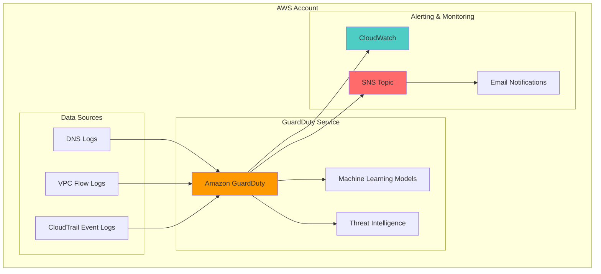

# Intelligent Cloud Threat Detection

## Problem

Organizations face sophisticated cyber threats that traditional security tools often miss, including malicious IP communications, cryptocurrency mining, and data exfiltration attempts. Manual threat hunting across multiple AWS services is time-consuming and error-prone, leaving security teams reactive rather than proactive. Without automated threat detection and response, businesses risk data breaches, compliance violations, and significant financial losses.

## Solution

Amazon GuardDuty provides intelligent threat detection using machine learning, anomaly detection, and integrated threat intelligence to continuously monitor your AWS environment. This recipe implements a comprehensive threat detection system that automatically identifies malicious activity, sends real-time alerts through SNS notifications, and creates CloudWatch dashboards for security monitoring. The solution enables 24/7 threat detection with minimal operational overhead.

## Architecture Diagram



## Prerequisites

1. AWS account with IAM permissions for GuardDuty, CloudWatch, and SNS
2. AWS CLI v2 installed and configured (or AWS CloudShell)
3. Basic understanding of AWS security services and threat detection concepts
4. Email address for receiving security alerts
5. Estimated cost: $3-10 per month depending on data volume (30-day free trial available)

> **Note**: GuardDuty pricing is based on the volume of AWS CloudTrail events, VPC Flow Logs, and DNS logs analyzed. See [GuardDuty Pricing](https://aws.amazon.com/guardduty/pricing/) for detailed cost information.

## Preparation

```bash
# Set environment variables
export AWS_REGION=$(aws configure get region)
export AWS_ACCOUNT_ID=$(aws sts get-caller-identity \
    --query Account --output text)

# Set your email for notifications
export NOTIFICATION_EMAIL="your-email@example.com"

# Generate unique identifier for SNS topic
RANDOM_SUFFIX=$(aws secretsmanager get-random-password \
    --exclude-punctuation --exclude-uppercase \
    --password-length 6 --require-each-included-type \
    --output text --query RandomPassword)

export SNS_TOPIC_NAME="guardduty-alerts-${RANDOM_SUFFIX}"

echo "✅ Environment configured for region: ${AWS_REGION}"
```

## Steps

1. **Enable Amazon GuardDuty**:

   GuardDuty is a managed threat detection service that analyzes billions of events across your AWS accounts and workloads using machine learning, anomaly detection, and integrated threat intelligence. Enabling GuardDuty immediately begins analyzing CloudTrail event logs, VPC Flow Logs, and DNS logs to establish baseline behavior patterns and identify potential threats.

   ```bash
   # Enable GuardDuty in the current region
   DETECTOR_ID=$(aws guardduty create-detector \
       --enable \
       --finding-publishing-frequency FIFTEEN_MINUTES \
       --query DetectorId --output text)
   
   echo "✅ GuardDuty enabled with detector ID: ${DETECTOR_ID}"
   ```

   GuardDuty is now actively monitoring your AWS environment and will begin generating findings within 15 minutes of detecting suspicious activity. The service continuously learns your environment's normal behavior patterns to improve threat detection accuracy over time.

2. **Create SNS Topic for Alert Notifications**:

   SNS enables real-time notification delivery to multiple endpoints, ensuring security teams receive immediate alerts when threats are detected. This creates a reliable communication channel that integrates with existing incident response workflows and can scale to support multiple notification targets.

   ```bash
   # Create SNS topic for GuardDuty alerts
   SNS_TOPIC_ARN=$(aws sns create-topic \
       --name ${SNS_TOPIC_NAME} \
       --query TopicArn --output text)
   
   echo "✅ SNS topic created: ${SNS_TOPIC_ARN}"
   ```

   The SNS topic provides the foundation for automated alert distribution, enabling immediate notification when GuardDuty identifies potential security threats in your environment.

3. **Subscribe Email to SNS Topic**:

   Email subscriptions ensure security teams receive immediate notifications without requiring constant dashboard monitoring. This human-readable alert system enables rapid incident response and maintains security awareness across your organization.

   ```bash
   # Subscribe your email to receive GuardDuty alerts
   aws sns subscribe \
       --topic-arn ${SNS_TOPIC_ARN} \
       --protocol email \
       --notification-endpoint ${NOTIFICATION_EMAIL}
   
   echo "✅ Email subscription created for ${NOTIFICATION_EMAIL}"
   echo "📧 Check your email and confirm the subscription"
   ```

   You'll receive a confirmation email that must be accepted to activate notifications. This ensures only authorized personnel receive security alerts and prevents unauthorized access to sensitive threat information.

4. **Create EventBridge Rule for GuardDuty Findings**:

   EventBridge enables event-driven automation by routing GuardDuty findings to multiple targets based on threat severity and type. This creates a scalable architecture for automated incident response and ensures consistent handling of security events across your environment.

   ```bash
   # Create EventBridge rule to capture all GuardDuty findings
   aws events put-rule \
       --name guardduty-finding-events \
       --event-pattern '{
         "source": ["aws.guardduty"],
         "detail-type": ["GuardDuty Finding"]
       }' \
       --description "Route GuardDuty findings to SNS"
   
   echo "✅ EventBridge rule created for GuardDuty findings"
   ```

   The EventBridge rule now monitors for all GuardDuty findings and will automatically trigger downstream actions when threats are detected, enabling automated response workflows.

5. **Add SNS Topic as EventBridge Target**:

   Connecting EventBridge to SNS creates an automated notification pipeline that transforms raw GuardDuty findings into actionable alerts. This integration ensures security teams receive formatted, human-readable notifications with all necessary context for incident response.

   ```bash
   # Add SNS topic as target for the EventBridge rule
   aws events put-targets \
       --rule guardduty-finding-events \
       --targets "Id"="1","Arn"="${SNS_TOPIC_ARN}"
   
   echo "✅ SNS topic added as EventBridge target"
   ```

   GuardDuty findings will now automatically trigger SNS notifications, creating a seamless flow from threat detection to team alerting without manual intervention.

6. **Grant EventBridge Permission to Publish to SNS**:

   IAM permissions enable secure, automated communication between AWS services while maintaining the principle of least privilege. This permission grants EventBridge only the specific access needed to publish GuardDuty findings to your SNS topic.

   ```bash
   # Create policy document for EventBridge SNS permissions
   POLICY_DOCUMENT='{
     "Version": "2012-10-17",
     "Statement": [
       {
         "Effect": "Allow",
         "Principal": {
           "Service": "events.amazonaws.com"
         },
         "Action": "sns:Publish",
         "Resource": "'${SNS_TOPIC_ARN}'"
       }
     ]
   }'
   
   # Apply the policy to the SNS topic
   aws sns set-topic-attributes \
       --topic-arn ${SNS_TOPIC_ARN} \
       --attribute-name Policy \
       --attribute-value "${POLICY_DOCUMENT}"
   
   echo "✅ EventBridge permissions configured for SNS topic"
   ```

   The automated notification pipeline is now fully configured with proper security permissions, ensuring reliable delivery of GuardDuty findings to your security team.

7. **Create CloudWatch Dashboard for Threat Monitoring**:

   CloudWatch dashboards provide centralized visibility into security metrics and trends, enabling proactive threat hunting and security posture assessment. This visual interface helps security teams identify patterns, track threat landscape changes, and demonstrate security program effectiveness.

   ```bash
   # Create a comprehensive security monitoring dashboard
   aws cloudwatch put-dashboard \
       --dashboard-name "GuardDuty-Security-Monitoring" \
       --dashboard-body '{
         "widgets": [
           {
             "type": "metric",
             "x": 0,
             "y": 0,
             "width": 12,
             "height": 6,
             "properties": {
               "metrics": [
                 [ "AWS/GuardDuty", "FindingCount" ]
               ],
               "period": 300,
               "stat": "Sum",
               "region": "'${AWS_REGION}'",
               "title": "GuardDuty Findings Count"
             }
           }
         ]
       }'
   
   echo "✅ CloudWatch dashboard created for security monitoring"
   ```

   The security dashboard provides real-time visibility into threat detection activity and enables data-driven security decision making through comprehensive metrics and trend analysis.

8. **Configure GuardDuty Finding Export**:

   S3 export enables long-term storage and analysis of security findings, supporting compliance requirements and advanced threat hunting activities. This archival capability ensures security data remains available for forensic analysis and regulatory reporting.

   ```bash
   # Create S3 bucket for GuardDuty findings export
   S3_BUCKET_NAME="guardduty-findings-${AWS_ACCOUNT_ID}-${RANDOM_SUFFIX}"
   aws s3 mb s3://${S3_BUCKET_NAME} --region ${AWS_REGION}
   
   # Configure GuardDuty to export findings to S3
   aws guardduty create-publishing-destination \
       --detector-id ${DETECTOR_ID} \
       --destination-type S3 \
       --destination-properties DestinationArn=arn:aws:s3:::${S3_BUCKET_NAME},KmsKeyArn=""
   
   echo "✅ GuardDuty findings export configured to S3: ${S3_BUCKET_NAME}"
   ```

   GuardDuty findings are now automatically exported to S3 for long-term retention, enabling advanced analytics, compliance reporting, and historical threat analysis.

> **Warning**: GuardDuty findings may contain sensitive information about your infrastructure. Ensure proper access controls are configured on S3 buckets and SNS topics to prevent unauthorized access to security data.

## Validation & Testing

1. Verify GuardDuty is active and monitoring:

   ```bash
   # Check GuardDuty detector status
   aws guardduty get-detector --detector-id ${DETECTOR_ID}
   ```

   Expected output: Status should show "ENABLED" with ServiceRole populated.

2. Confirm SNS topic and subscription:

   ```bash
   # List SNS topic subscriptions
   aws sns list-subscriptions-by-topic \
       --topic-arn ${SNS_TOPIC_ARN}
   ```

   Expected output: Your email subscription should appear with "SubscriptionArn" (not "PendingConfirmation").

3. Test the notification system with sample finding:

   ```bash
   # Generate a test notification through EventBridge
   aws events put-events \
       --entries '[{
         "Source": "aws.guardduty",
         "DetailType": "GuardDuty Finding",
         "Detail": "{\"test\": \"notification\"}"
       }]'
   
   echo "✅ Test event sent - check your email for notification"
   ```

4. View CloudWatch dashboard:

   ```bash
   # Get dashboard URL
   echo "Dashboard URL: https://${AWS_REGION}.console.aws.amazon.com/cloudwatch/home?region=${AWS_REGION}#dashboards:name=GuardDuty-Security-Monitoring"
   ```

> **Tip**: GuardDuty provides sample findings for testing. Navigate to the GuardDuty console and use "Generate sample findings" to test your notification pipeline with realistic threat scenarios.

## Cleanup

1. Remove GuardDuty findings export configuration:

   ```bash
   # List and delete publishing destinations
   DESTINATION_ID=$(aws guardduty list-publishing-destinations \
       --detector-id ${DETECTOR_ID} \
       --query 'Destinations[0].DestinationId' --output text)
   
   if [ "${DESTINATION_ID}" != "None" ]; then
       aws guardduty delete-publishing-destination \
           --detector-id ${DETECTOR_ID} \
           --destination-id ${DESTINATION_ID}
   fi
   
   echo "✅ GuardDuty export configuration removed"
   ```

2. Delete S3 bucket and contents:

   ```bash
   # Remove all objects and delete bucket
   aws s3 rm s3://${S3_BUCKET_NAME} --recursive
   aws s3 rb s3://${S3_BUCKET_NAME}
   
   echo "✅ S3 bucket deleted"
   ```

3. Remove EventBridge rule and targets:

   ```bash
   # Remove targets and delete rule
   aws events remove-targets \
       --rule guardduty-finding-events \
       --ids "1"
   
   aws events delete-rule --name guardduty-finding-events
   
   echo "✅ EventBridge rule deleted"
   ```

4. Delete SNS topic:

   ```bash
   # Delete SNS topic and all subscriptions
   aws sns delete-topic --topic-arn ${SNS_TOPIC_ARN}
   
   echo "✅ SNS topic deleted"
   ```

5. Delete CloudWatch dashboard:

   ```bash
   # Remove security monitoring dashboard
   aws cloudwatch delete-dashboards \
       --dashboard-names GuardDuty-Security-Monitoring
   
   echo "✅ CloudWatch dashboard deleted"
   ```

6. Disable GuardDuty (optional):

   ```bash
   # Disable GuardDuty detector (this will stop monitoring)
   aws guardduty delete-detector --detector-id ${DETECTOR_ID}
   
   echo "✅ GuardDuty detector deleted"
   ```

## Discussion

Amazon GuardDuty revolutionizes threat detection by providing continuous, intelligent monitoring without the complexity of traditional security tools. The service leverages AWS's global threat intelligence, including data from CrowdStrike, Proofpoint, and AWS Security, combined with machine learning models trained on trillions of events. This approach enables detection of sophisticated threats like cryptocurrency mining, data exfiltration, and command-and-control communications that might evade signature-based detection systems.

The event-driven architecture created in this recipe demonstrates modern cloud security patterns where automation replaces manual processes. EventBridge serves as the central nervous system, routing security events to appropriate response mechanisms while maintaining loose coupling between services. This design enables easy expansion of response capabilities, such as adding automated remediation actions or integrating with external security orchestration platforms.

GuardDuty's pricing model aligns costs with actual usage, making enterprise-grade threat detection accessible to organizations of all sizes. The service processes only the log data it needs, avoiding the storage and compute costs associated with traditional SIEM solutions. Multi-account organizations benefit from centralized threat detection through GuardDuty's master-member account architecture, providing unified security visibility across complex AWS environments.

For production deployments, consider implementing automated response playbooks that can isolate compromised instances, block malicious IP addresses, or revoke suspicious IAM credentials. Integration with AWS Security Hub provides additional context correlation, while custom Lambda functions can enrich findings with environmental context or trigger incident response workflows in external systems.

> **Note**: GuardDuty continuously updates its threat intelligence and detection algorithms, requiring no maintenance from your security team. The service automatically adapts to new threat vectors and attack patterns, ensuring your detection capabilities evolve with the threat landscape.

## Challenge

Extend this threat detection system by implementing these advanced security capabilities:

1. **Automated Response Actions**: Create Lambda functions that automatically isolate EC2 instances, disable IAM users, or block IP addresses when specific finding types are detected, reducing incident response time from hours to seconds.

2. **Multi-Account Security Monitoring**: Configure GuardDuty in a master-member architecture across multiple AWS accounts, providing centralized threat visibility for complex organizational structures while maintaining account isolation.

3. **Custom Threat Intelligence Integration**: Implement custom threat intelligence feeds using GuardDuty's ThreatIntelSet feature to include organization-specific indicators of compromise and industry-relevant threat data.

4. **Security Metrics and Reporting**: Build comprehensive security dashboards using CloudWatch Insights and QuickSight that track threat trends, generate executive reports, and demonstrate security program effectiveness to stakeholders.

5. **Integration with SOAR Platforms**: Connect GuardDuty findings to Security Orchestration, Automation, and Response (SOAR) platforms like Phantom or Demisto for advanced incident response workflows and case management.

## Infrastructure Code

*Infrastructure code will be generated after recipe approval.*