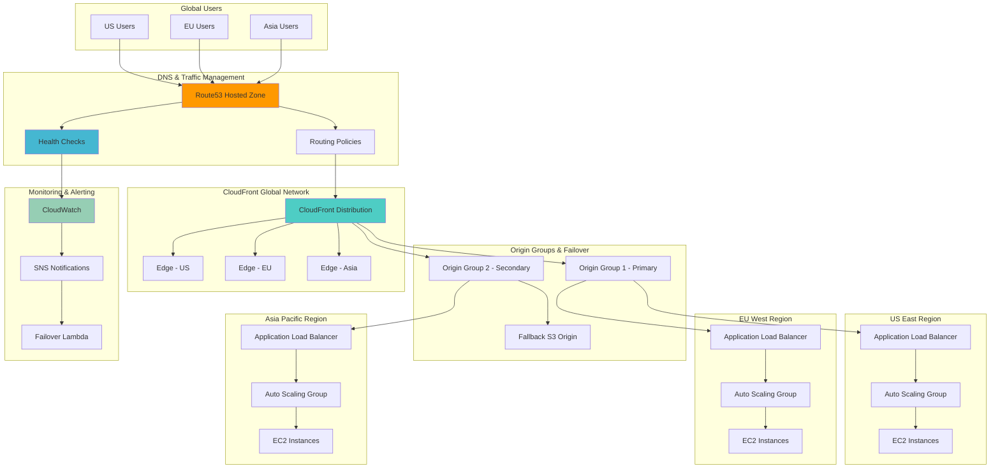

# Intelligent Global Traffic Routing with Route53 and CloudFront

## Problem

Global enterprises need robust failover mechanisms that can automatically route traffic to healthy regions when primary data centers experience outages or performance degradation. Manual failover processes result in 5-15 minute outages, while inadequate health checking leads to users being routed to unhealthy endpoints. Traditional DNS-based solutions lack real-time health monitoring and intelligent routing based on user location and endpoint performance, resulting in poor user experience during failures and suboptimal performance during normal operations.

## Solution

Build a comprehensive global load balancing solution that combines Route53's intelligent DNS routing with CloudFront's global edge network to provide automatic failover, geolocation-based routing, and performance optimization. The architecture implements health checks across multiple regions, intelligent traffic distribution based on endpoint health and user proximity, and seamless failover mechanisms that minimize downtime and optimize user experience globally.

## Architecture Diagram



## Prerequisites

1. AWS account with Route53, CloudFront, EC2, and ALB permissions
2. AWS CLI v2 installed and configured (or AWS CloudShell)
3. Understanding of DNS routing policies and health checks
4. Basic knowledge of load balancers and auto scaling groups
5. Estimated cost: $100-200/month for testing (varies by instance types and traffic)

> **Note**: This recipe creates resources across multiple AWS regions, which may incur additional data transfer charges and higher costs than single-region deployments.

## Preparation

```bash
# Set environment variables
export AWS_REGION=$(aws configure get region)
export AWS_ACCOUNT_ID=$(aws sts get-caller-identity \
    --query Account --output text)

# Define multiple regions for global deployment
export PRIMARY_REGION="us-east-1"
export SECONDARY_REGION="eu-west-1"
export TERTIARY_REGION="ap-southeast-1"

# Generate unique identifiers for resources
RANDOM_SUFFIX=$(aws secretsmanager get-random-password \
    --exclude-punctuation --exclude-uppercase \
    --password-length 8 --require-each-included-type \
    --output text --query RandomPassword)

export PROJECT_NAME="global-lb-${RANDOM_SUFFIX}"
export DOMAIN_NAME="example-${RANDOM_SUFFIX}.com"
export S3_FALLBACK_BUCKET="global-lb-fallback-${RANDOM_SUFFIX}"

# Create S3 bucket for fallback content
aws s3 mb s3://${S3_FALLBACK_BUCKET} --region ${PRIMARY_REGION}

# Create fallback maintenance page
mkdir -p /tmp/fallback-content
cat > /tmp/fallback-content/index.html << 'EOF'
<!DOCTYPE html>
<html>
<head>
    <title>Service Temporarily Unavailable</title>
    <style>
        body { font-family: Arial, sans-serif; text-align: center; padding: 50px; }
        .message { background: #f8f9fa; padding: 20px; border-radius: 5px; margin: 20px auto; max-width: 600px; }
        .status { color: #dc3545; font-size: 18px; font-weight: bold; }
    </style>
</head>
<body>
    <div class="message">
        <h1>Service Temporarily Unavailable</h1>
        <p class="status">We're working to restore service as quickly as possible.</p>
        <p>Please try again in a few minutes. If the problem persists, contact support.</p>
        <p><small>Error Code: GLB-FALLBACK</small></p>
    </div>
</body>
</html>
EOF

cat > /tmp/fallback-content/health.json << 'EOF'
{
    "status": "maintenance",
    "message": "Service temporarily unavailable",
    "timestamp": "2025-01-11T00:00:00Z"
}
EOF

# Upload fallback content
aws s3 cp /tmp/fallback-content s3://${S3_FALLBACK_BUCKET}/ --recursive

echo "✅ Environment prepared with fallback bucket: ${S3_FALLBACK_BUCKET}"
```

## Steps

1. **Create VPCs and Infrastructure in Multiple Regions**:

   Building a global load balancing architecture requires establishing isolated network environments in multiple AWS regions to ensure geographic distribution and fault tolerance. Virtual Private Clouds (VPCs) provide the foundational networking layer that enables secure, scalable, and highly available deployments across regions. Each regional VPC must include public subnets across multiple Availability Zones, internet gateways for external connectivity, and security groups that allow load balancer traffic while maintaining security best practices.

   ```bash
   # Function to create infrastructure in a region
   create_regional_infrastructure() {
       local region=$1
       local region_code=$2
       
       echo "Creating infrastructure in ${region}..."
       
       # Create VPC
       VPC_ID=$(aws ec2 create-vpc \
           --region ${region} \
           --cidr-block 10.${region_code}.0.0/16 \
           --query 'Vpc.VpcId' --output text)
       
       aws ec2 create-tags \
           --region ${region} \
           --resources ${VPC_ID} \
           --tags Key=Name,Value=${PROJECT_NAME}-vpc-${region}
       
       # Create Internet Gateway
       IGW_ID=$(aws ec2 create-internet-gateway \
           --region ${region} \
           --query 'InternetGateway.InternetGatewayId' --output text)
       
       aws ec2 attach-internet-gateway \
           --region ${region} \
           --vpc-id ${VPC_ID} \
           --internet-gateway-id ${IGW_ID}
       
       # Create public subnets
       SUBNET1_ID=$(aws ec2 create-subnet \
           --region ${region} \
           --vpc-id ${VPC_ID} \
           --cidr-block 10.${region_code}.1.0/24 \
           --availability-zone $(aws ec2 describe-availability-zones \
               --region ${region} --query 'AvailabilityZones[0].ZoneName' --output text) \
           --query 'Subnet.SubnetId' --output text)
       
       SUBNET2_ID=$(aws ec2 create-subnet \
           --region ${region} \
           --vpc-id ${VPC_ID} \
           --cidr-block 10.${region_code}.2.0/24 \
           --availability-zone $(aws ec2 describe-availability-zones \
               --region ${region} --query 'AvailabilityZones[1].ZoneName' --output text) \
           --query 'Subnet.SubnetId' --output text)
       
       # Create route table and associate subnets
       RT_ID=$(aws ec2 create-route-table \
           --region ${region} \
           --vpc-id ${VPC_ID} \
           --query 'RouteTable.RouteTableId' --output text)
       
       aws ec2 create-route \
           --region ${region} \
           --route-table-id ${RT_ID} \
           --destination-cidr-block 0.0.0.0/0 \
           --gateway-id ${IGW_ID}
       
       aws ec2 associate-route-table \
           --region ${region} \
           --subnet-id ${SUBNET1_ID} \
           --route-table-id ${RT_ID}
       
       aws ec2 associate-route-table \
           --region ${region} \
           --subnet-id ${SUBNET2_ID} \
           --route-table-id ${RT_ID}
       
       # Create security group
       SG_ID=$(aws ec2 create-security-group \
           --region ${region} \
           --group-name ${PROJECT_NAME}-sg-${region} \
           --description "Security group for global load balancer demo" \
           --vpc-id ${VPC_ID} \
           --query 'GroupId' --output text)
       
       aws ec2 authorize-security-group-ingress \
           --region ${region} \
           --group-id ${SG_ID} \
           --protocol tcp \
           --port 80 \
           --cidr 0.0.0.0/0
       
       aws ec2 authorize-security-group-ingress \
           --region ${region} \
           --group-id ${SG_ID} \
           --protocol tcp \
           --port 443 \
           --cidr 0.0.0.0/0
       
       # Store values for later use
       echo "export VPC_ID_${region_code}=${VPC_ID}" >> /tmp/regional-vars.sh
       echo "export SUBNET1_ID_${region_code}=${SUBNET1_ID}" >> /tmp/regional-vars.sh
       echo "export SUBNET2_ID_${region_code}=${SUBNET2_ID}" >> /tmp/regional-vars.sh
       echo "export SG_ID_${region_code}=${SG_ID}" >> /tmp/regional-vars.sh
       
       echo "✅ Infrastructure created in ${region}"
   }
   
   # Create infrastructure in all regions
   create_regional_infrastructure ${PRIMARY_REGION} "10"
   create_regional_infrastructure ${SECONDARY_REGION} "20"
   create_regional_infrastructure ${TERTIARY_REGION} "30"
   
   # Source the variables
   source /tmp/regional-vars.sh
   
   echo "✅ Regional infrastructure created in all regions"
   ```

   The VPC infrastructure is now established across three strategic regions, providing the network foundation for your global application deployment. Each region contains redundant subnets across multiple Availability Zones, ensuring high availability within each region. The security groups are configured to allow HTTP and HTTPS traffic from the internet, enabling load balancers to receive user requests while maintaining network security. This multi-region foundation supports the global load balancing architecture by providing geographically distributed compute capacity.

2. **Create Application Load Balancers in Each Region**:

   Application Load Balancers (ALBs) serve as the regional traffic distribution points that receive user requests and route them to healthy backend instances. ALBs operate at the application layer (Layer 7), enabling advanced routing decisions based on HTTP headers, paths, and host information. Each regional ALB must be configured with target groups that define health check parameters and manage the registration of backend instances. This creates intelligent traffic distribution within each region while providing health monitoring capabilities that integrate with Route53's global health checks.

   > **Note**: ALB health checks are crucial for global load balancing as they provide the endpoint health status that Route53 uses for DNS routing decisions. See [ALB Health Check Documentation](https://docs.aws.amazon.com/elasticloadbalancing/latest/application/target-group-health-checks.html) for optimal configuration guidelines.

   ```bash
   # Function to create ALB in a region
   create_alb() {
       local region=$1
       local region_code=$2
       local vpc_var="VPC_ID_${region_code}"
       local subnet1_var="SUBNET1_ID_${region_code}"
       local subnet2_var="SUBNET2_ID_${region_code}"
       local sg_var="SG_ID_${region_code}"
       
       # Create Application Load Balancer
       ALB_ARN=$(aws elbv2 create-load-balancer \
           --region ${region} \
           --name ${PROJECT_NAME}-alb-${region_code} \
           --subnets ${!subnet1_var} ${!subnet2_var} \
           --security-groups ${!sg_var} \
           --scheme internet-facing \
           --type application \
           --ip-address-type ipv4 \
           --query 'LoadBalancers[0].LoadBalancerArn' --output text)
       
       # Get ALB DNS name
       ALB_DNS=$(aws elbv2 describe-load-balancers \
           --region ${region} \
           --load-balancer-arns ${ALB_ARN} \
           --query 'LoadBalancers[0].DNSName' --output text)
       
       # Create target group with optimized health check settings
       TG_ARN=$(aws elbv2 create-target-group \
           --region ${region} \
           --name ${PROJECT_NAME}-tg-${region_code} \
           --protocol HTTP \
           --port 80 \
           --vpc-id ${!vpc_var} \
           --health-check-protocol HTTP \
           --health-check-path /health \
           --health-check-interval-seconds 30 \
           --health-check-timeout-seconds 5 \
           --healthy-threshold-count 2 \
           --unhealthy-threshold-count 3 \
           --matcher HttpCode=200 \
           --query 'TargetGroups[0].TargetGroupArn' --output text)
       
       # Create listener
       aws elbv2 create-listener \
           --region ${region} \
           --load-balancer-arn ${ALB_ARN} \
           --protocol HTTP \
           --port 80 \
           --default-actions Type=forward,TargetGroupArn=${TG_ARN}
       
       # Store values
       echo "export ALB_ARN_${region_code}=${ALB_ARN}" >> /tmp/regional-vars.sh
       echo "export ALB_DNS_${region_code}=${ALB_DNS}" >> /tmp/regional-vars.sh
       echo "export TG_ARN_${region_code}=${TG_ARN}" >> /tmp/regional-vars.sh
       
       echo "✅ ALB created in ${region}: ${ALB_DNS}"
   }
   
   # Create ALBs in all regions
   create_alb ${PRIMARY_REGION} "10"
   create_alb ${SECONDARY_REGION} "20"
   create_alb ${TERTIARY_REGION} "30"
   
   # Reload variables
   source /tmp/regional-vars.sh
   
   echo "✅ Application Load Balancers created in all regions"
   ```

   Your regional Application Load Balancers are now operational and ready to distribute traffic to backend instances. Each ALB provides a DNS endpoint that will serve as an origin for both Route53 health checks and CloudFront distribution. The target groups are configured with health check paths at `/health`, enabling continuous monitoring of application availability. These ALBs form the critical link between global DNS routing decisions and regional traffic distribution, ensuring users are directed to healthy, performant endpoints.

3. **Deploy Sample Applications with Auto Scaling Groups**:

   Auto Scaling Groups ensure your application maintains desired capacity and automatically responds to demand changes or instance failures. The launch templates define the instance configuration including the sample web application that demonstrates regional identification and health status. Each instance runs a simple web server that displays its region and availability zone, enabling easy verification of global load balancing behavior. The health check endpoint at `/health` provides structured JSON responses that ALB and Route53 health checks can monitor to determine instance and regional health status.

   > **Warning**: Auto Scaling Groups will automatically replace failed instances, which may incur additional charges. Monitor CloudWatch metrics to understand scaling patterns and adjust capacity settings based on actual traffic requirements.

   ```bash
   # Create launch template for each region
   create_launch_template() {
       local region=$1
       local region_code=$2
       local sg_var="SG_ID_${region_code}"
       
       # Get latest Amazon Linux 2023 AMI (updated)
       AMI_ID=$(aws ec2 describe-images \
           --region ${region} \
           --owners amazon \
           --filters "Name=name,Values=al2023-ami-*-x86_64" \
           "Name=state,Values=available" \
           --query 'Images|sort_by(@, &CreationDate)[-1].ImageId' \
           --output text)
       
       # Create user data script
       cat > /tmp/user-data-${region_code}.sh << EOF
   #!/bin/bash
   yum update -y
   yum install -y httpd
   systemctl start httpd
   systemctl enable httpd
   
   # Create simple web application
   cat > /var/www/html/index.html << 'HTML'
   <!DOCTYPE html>
   <html>
   <head>
       <title>Global Load Balancer Demo</title>
       <meta charset="UTF-8">
       <meta name="viewport" content="width=device-width, initial-scale=1.0">
       <style>
           body { font-family: Arial, sans-serif; text-align: center; padding: 50px; }
           .region { background: #e3f2fd; padding: 20px; border-radius: 5px; margin: 20px auto; max-width: 600px; }
           .healthy { color: #4caf50; font-weight: bold; }
       </style>
   </head>
   <body>
       <div class="region">
           <h1>Hello from ${region}!</h1>
           <p class="healthy">Status: Healthy</p>
           <p>Instance ID: \$(curl -s http://169.254.169.254/latest/meta-data/instance-id)</p>
           <p>Availability Zone: \$(curl -s http://169.254.169.254/latest/meta-data/placement/availability-zone)</p>
           <p>Region: ${region}</p>
           <p>Timestamp: \$(date)</p>
       </div>
   </body>
   </html>
   HTML
   
   # Create health check endpoint
   cat > /var/www/html/health << 'HEALTH'
   {
       "status": "healthy",
       "region": "${region}",
       "timestamp": "\$(date -u +%Y-%m-%dT%H:%M:%S.%3NZ)",
       "instance_id": "\$(curl -s http://169.254.169.254/latest/meta-data/instance-id)",
       "availability_zone": "\$(curl -s http://169.254.169.254/latest/meta-data/placement/availability-zone)"
   }
   HEALTH
   
   # Make health endpoint accessible
   chmod 644 /var/www/html/health
   EOF
       
       # Create launch template
       LT_ID=$(aws ec2 create-launch-template \
           --region ${region} \
           --launch-template-name ${PROJECT_NAME}-lt-${region_code} \
           --launch-template-data "{
               \"ImageId\": \"${AMI_ID}\",
               \"InstanceType\": \"t3.micro\",
               \"SecurityGroupIds\": [\"${!sg_var}\"],
               \"UserData\": \"$(base64 -i /tmp/user-data-${region_code}.sh | tr -d '\n')\",
               \"TagSpecifications\": [{
                   \"ResourceType\": \"instance\",
                   \"Tags\": [{
                       \"Key\": \"Name\",
                       \"Value\": \"${PROJECT_NAME}-instance-${region_code}\"
                   }]
               }]
           }" \
           --query 'LaunchTemplate.LaunchTemplateId' --output text)
       
       echo "export LT_ID_${region_code}=${LT_ID}" >> /tmp/regional-vars.sh
       echo "✅ Launch template created in ${region}"
   }
   
   # Create launch templates
   create_launch_template ${PRIMARY_REGION} "10"
   create_launch_template ${SECONDARY_REGION} "20"
   create_launch_template ${TERTIARY_REGION} "30"
   
   # Reload variables
   source /tmp/regional-vars.sh
   
   echo "✅ Launch templates created in all regions"
   ```

   Launch templates are now configured with the latest Amazon Linux 2023 AMIs and user data scripts that automatically install and configure the sample web application. Each template includes security group associations and tagging specifications that ensure instances are properly configured for load balancer integration. The user data script creates both a visual web interface for testing and a machine-readable health endpoint that supports automated monitoring and failover decisions.

4. **Create Auto Scaling Groups**:

   Auto Scaling Groups bridge the gap between launch templates and load balancer target groups, ensuring your application maintains optimal capacity across all regions. The configuration specifies minimum, maximum, and desired capacity values that balance cost efficiency with availability requirements. Integration with ELB health checks enables the Auto Scaling Group to automatically replace instances that fail health checks, maintaining service availability even during instance-level failures. This self-healing capability is essential for global load balancing as it ensures regional endpoints remain healthy and responsive.

   ```bash
   # Function to create Auto Scaling Group
   create_asg() {
       local region=$1
       local region_code=$2
       local subnet1_var="SUBNET1_ID_${region_code}"
       local subnet2_var="SUBNET2_ID_${region_code}"
       local lt_var="LT_ID_${region_code}"
       local tg_var="TG_ARN_${region_code}"
       
       # Create Auto Scaling Group
       aws autoscaling create-auto-scaling-group \
           --region ${region} \
           --auto-scaling-group-name ${PROJECT_NAME}-asg-${region_code} \
           --launch-template LaunchTemplateId=${!lt_var},Version=1 \
           --min-size 1 \
           --max-size 3 \
           --desired-capacity 2 \
           --target-group-arns ${!tg_var} \
           --health-check-type ELB \
           --health-check-grace-period 300 \
           --vpc-zone-identifier "${!subnet1_var},${!subnet2_var}" \
           --tags "Key=Name,Value=${PROJECT_NAME}-asg-${region_code},PropagateAtLaunch=true,ResourceId=${PROJECT_NAME}-asg-${region_code},ResourceType=auto-scaling-group"
       
       echo "✅ Auto Scaling Group created in ${region}"
   }
   
   # Create Auto Scaling Groups
   create_asg ${PRIMARY_REGION} "10"
   create_asg ${SECONDARY_REGION} "20"
   create_asg ${TERTIARY_REGION} "30"
   
   # Wait for instances to be healthy
   echo "Waiting for instances to become healthy..."
   sleep 180
   
   echo "✅ Auto Scaling Groups created and instances launching"
   ```

   Auto Scaling Groups are now actively managing instance capacity across all regions, with instances launching and registering with their respective load balancer target groups. The 180-second wait period allows sufficient time for instances to complete their initialization process and pass initial health checks. This creates a self-managing infrastructure foundation where regional capacity automatically adjusts to maintain service availability and performance standards required for global load balancing.

5. **Create Route53 Health Checks**:

   Route53 health checks form the intelligence layer of global load balancing by continuously monitoring regional endpoint health and making routing decisions based on real-time availability data. These health checks query the `/health` endpoint of each regional Application Load Balancer, providing granular visibility into service health across all regions. Route53 health checkers operate from multiple global locations, ensuring health status determinations are reliable and not affected by localized network issues. The health check results directly influence DNS routing decisions, enabling automatic failover and traffic steering based on actual endpoint performance.

   ```bash
   # Reload variables to get ALB DNS names
   source /tmp/regional-vars.sh
   
   # Function to create health check
   create_health_check() {
       local region=$1
       local region_code=$2
       local alb_dns_var="ALB_DNS_${region_code}"
       
       # Create health check for ALB
       HC_ID=$(aws route53 create-health-check \
           --caller-reference "${PROJECT_NAME}-hc-${region_code}-$(date +%s)" \
           --health-check-config "{
               \"Type\": \"HTTP\",
               \"ResourcePath\": \"/health\",
               \"FullyQualifiedDomainName\": \"${!alb_dns_var}\",
               \"Port\": 80,
               \"RequestInterval\": 30,
               \"FailureThreshold\": 3
           }" \
           --query 'HealthCheck.Id' --output text)
       
       # Tag the health check
       aws route53 change-tags-for-resource \
           --resource-type healthcheck \
           --resource-id ${HC_ID} \
           --add-tags Key=Name,Value=${PROJECT_NAME}-hc-${region}
       
       echo "export HC_ID_${region_code}=${HC_ID}" >> /tmp/regional-vars.sh
       echo "✅ Health check created for ${region}: ${HC_ID}"
   }
   
   # Create health checks for all regions
   create_health_check ${PRIMARY_REGION} "10"
   create_health_check ${SECONDARY_REGION} "20"
   create_health_check ${TERTIARY_REGION} "30"
   
   # Reload variables
   source /tmp/regional-vars.sh
   
   echo "✅ Health checks created for all regions"
   ```

   Route53 health checks are now continuously monitoring all regional endpoints, providing the real-time health data that enables intelligent global traffic routing. Each health check runs every 30 seconds and requires 3 consecutive failures before marking an endpoint as unhealthy, balancing responsiveness with stability. These health checks integrate seamlessly with DNS routing policies to automatically exclude unhealthy regions from user traffic, ensuring users are always directed to operational endpoints without manual intervention.

6. **Create Route53 Hosted Zone and DNS Records**:

   Route53 DNS records implement the core traffic routing logic that directs users to optimal regional endpoints based on multiple criteria including geographic location, endpoint health, and weighted distribution policies. The hosted zone provides authoritative DNS services for your domain, while multiple record types enable sophisticated routing strategies. Weighted routing allows gradual traffic shifting for testing or capacity management, while geolocation routing ensures users connect to regionally appropriate endpoints for optimal performance. This DNS-based approach provides global load balancing without requiring application-level changes or complex proxy configurations.

   ```bash
   # Create hosted zone (in production, you would use your actual domain)
   HZ_ID=$(aws route53 create-hosted-zone \
       --name ${DOMAIN_NAME} \
       --caller-reference "${PROJECT_NAME}-$(date +%s)" \
       --hosted-zone-config Comment="Global load balancer demo zone" \
       --query 'HostedZone.Id' --output text | cut -d'/' -f3)
   
   export HOSTED_ZONE_ID=${HZ_ID}
   
   # Create weighted routing policy records for failover
   create_weighted_record() {
       local region=$1
       local region_code=$2
       local weight=$3
       local alb_dns_var="ALB_DNS_${region_code}"
       local hc_var="HC_ID_${region_code}"
       
       cat > /tmp/change-batch-${region_code}.json << EOF
   {
       "Changes": [
           {
               "Action": "CREATE",
               "ResourceRecordSet": {
                   "Name": "app.${DOMAIN_NAME}",
                   "Type": "CNAME",
                   "SetIdentifier": "${region}",
                   "Weight": ${weight},
                   "TTL": 60,
                   "ResourceRecords": [
                       {
                           "Value": "${!alb_dns_var}"
                       }
                   ],
                   "HealthCheckId": "${!hc_var}"
               }
           }
       ]
   }
   EOF
       
       aws route53 change-resource-record-sets \
           --hosted-zone-id ${HOSTED_ZONE_ID} \
           --change-batch file:///tmp/change-batch-${region_code}.json
       
       echo "✅ Weighted DNS record created for ${region}"
   }
   
   # Create weighted records (primary region gets higher weight)
   create_weighted_record ${PRIMARY_REGION} "10" 100
   create_weighted_record ${SECONDARY_REGION} "20" 50
   create_weighted_record ${TERTIARY_REGION} "30" 25
   
   # Create geolocation-based routing
   create_geo_record() {
       local region=$1
       local region_code=$2
       local continent=$3
       local alb_dns_var="ALB_DNS_${region_code}"
       local hc_var="HC_ID_${region_code}"
       
       cat > /tmp/geo-batch-${region_code}.json << EOF
   {
       "Changes": [
           {
               "Action": "CREATE",
               "ResourceRecordSet": {
                   "Name": "geo.${DOMAIN_NAME}",
                   "Type": "CNAME",
                   "SetIdentifier": "${region}-geo",
                   "GeoLocation": {
                       "ContinentCode": "${continent}"
                   },
                   "TTL": 60,
                   "ResourceRecords": [
                       {
                           "Value": "${!alb_dns_var}"
                       }
                   ],
                   "HealthCheckId": "${!hc_var}"
               }
           }
       ]
   }
   EOF
       
       aws route53 change-resource-record-sets \
           --hosted-zone-id ${HOSTED_ZONE_ID} \
           --change-batch file:///tmp/geo-batch-${region_code}.json
       
       echo "✅ Geolocation DNS record created for ${region}"
   }
   
   # Create geolocation records
   create_geo_record ${PRIMARY_REGION} "10" "NA"  # North America
   create_geo_record ${SECONDARY_REGION} "20" "EU"  # Europe
   create_geo_record ${TERTIARY_REGION} "30" "AS"  # Asia
   
   # Create default geolocation record
   cat > /tmp/geo-default.json << EOF
   {
       "Changes": [
           {
               "Action": "CREATE",
               "ResourceRecordSet": {
                   "Name": "geo.${DOMAIN_NAME}",
                   "Type": "CNAME",
                   "SetIdentifier": "default-geo",
                   "GeoLocation": {
                       "CountryCode": "*"
                   },
                   "TTL": 60,
                   "ResourceRecords": [
                       {
                           "Value": "${ALB_DNS_10}"
                       }
                   ],
                   "HealthCheckId": "${HC_ID_10}"
               }
           }
       ]
   }
   EOF
   
   aws route53 change-resource-record-sets \
       --hosted-zone-id ${HOSTED_ZONE_ID} \
       --change-batch file:///tmp/geo-default.json
   
   echo "✅ Route53 DNS records created with failover and geo-routing"
   ```

   Your DNS routing infrastructure is now operational with both weighted and geolocation-based routing policies that provide comprehensive global traffic management. The weighted records enable traffic distribution testing and gradual scaling, while geolocation records ensure users are automatically directed to their nearest regional endpoint. Health check integration ensures that only healthy regions receive traffic, creating an intelligent global routing system that adapts to changing conditions without manual intervention.

7. **Create CloudFront Distribution with Origin Groups**:

   CloudFront distribution provides the final layer of global optimization by leveraging AWS's global edge network to cache content close to users while implementing sophisticated origin failover mechanisms. Origin groups enable CloudFront to automatically switch between regional origins based on HTTP error codes, providing faster failover than DNS-based approaches. The edge-level failover typically occurs within seconds rather than minutes, significantly improving user experience during regional outages. CloudFront also provides performance optimization through caching, compression, and protocol optimization, reducing latency and improving page load times globally.

   ```bash
   # Create Origin Access Control
   OAC_ID=$(aws cloudfront create-origin-access-control \
       --origin-access-control-config "{
           \"Name\": \"${PROJECT_NAME}-oac\",
           \"Description\": \"OAC for fallback S3 origin\",
           \"SigningProtocol\": \"sigv4\",
           \"SigningBehavior\": \"always\",
           \"OriginAccessControlOriginType\": \"s3\"
       }" \
       --query 'OriginAccessControl.Id' --output text)
   
   # Create CloudFront distribution with origin groups
   cat > /tmp/cloudfront-config.json << EOF
   {
       "CallerReference": "${PROJECT_NAME}-cf-$(date +%s)",
       "Comment": "Global load balancer with failover",
       "Enabled": true,
       "Origins": {
           "Quantity": 4,
           "Items": [
               {
                   "Id": "primary-origin",
                   "DomainName": "${ALB_DNS_10}",
                   "OriginPath": "",
                   "CustomHeaders": {
                       "Quantity": 0
                   },
                   "CustomOriginConfig": {
                       "HTTPPort": 80,
                       "HTTPSPort": 443,
                       "OriginProtocolPolicy": "http-only",
                       "OriginSslProtocols": {
                           "Quantity": 1,
                           "Items": ["TLSv1.2"]
                       },
                       "OriginReadTimeout": 30,
                       "OriginKeepaliveTimeout": 5
                   },
                   "ConnectionAttempts": 3,
                   "ConnectionTimeout": 10
               },
               {
                   "Id": "secondary-origin",
                   "DomainName": "${ALB_DNS_20}",
                   "OriginPath": "",
                   "CustomHeaders": {
                       "Quantity": 0
                   },
                   "CustomOriginConfig": {
                       "HTTPPort": 80,
                       "HTTPSPort": 443,
                       "OriginProtocolPolicy": "http-only",
                       "OriginSslProtocols": {
                           "Quantity": 1,
                           "Items": ["TLSv1.2"]
                       },
                       "OriginReadTimeout": 30,
                       "OriginKeepaliveTimeout": 5
                   },
                   "ConnectionAttempts": 3,
                   "ConnectionTimeout": 10
               },
               {
                   "Id": "tertiary-origin",
                   "DomainName": "${ALB_DNS_30}",
                   "OriginPath": "",
                   "CustomHeaders": {
                       "Quantity": 0
                   },
                   "CustomOriginConfig": {
                       "HTTPPort": 80,
                       "HTTPSPort": 443,
                       "OriginProtocolPolicy": "http-only",
                       "OriginSslProtocols": {
                           "Quantity": 1,
                           "Items": ["TLSv1.2"]
                       },
                       "OriginReadTimeout": 30,
                       "OriginKeepaliveTimeout": 5
                   },
                   "ConnectionAttempts": 3,
                   "ConnectionTimeout": 10
               },
               {
                   "Id": "fallback-s3-origin",
                   "DomainName": "${S3_FALLBACK_BUCKET}.s3.amazonaws.com",
                   "OriginPath": "",
                   "CustomHeaders": {
                       "Quantity": 0
                   },
                   "S3OriginConfig": {
                       "OriginAccessIdentity": ""
                   },
                   "OriginAccessControlId": "${OAC_ID}",
                   "ConnectionAttempts": 3,
                   "ConnectionTimeout": 10
               }
           ]
       },
       "OriginGroups": {
           "Quantity": 1,
           "Items": [
               {
                   "Id": "main-origin-group",
                   "FailoverCriteria": {
                       "StatusCodes": {
                           "Quantity": 4,
                           "Items": [403, 404, 500, 502]
                       }
                   },
                   "Members": {
                       "Quantity": 4,
                       "Items": [
                           {
                               "OriginId": "primary-origin"
                           },
                           {
                               "OriginId": "secondary-origin"
                           },
                           {
                               "OriginId": "tertiary-origin"
                           },
                           {
                               "OriginId": "fallback-s3-origin"
                           }
                       ]
                   }
               }
           ]
       },
       "DefaultCacheBehavior": {
           "TargetOriginId": "main-origin-group",
           "ViewerProtocolPolicy": "redirect-to-https",
           "TrustedSigners": {
               "Enabled": false,
               "Quantity": 0
           },
           "TrustedKeyGroups": {
               "Enabled": false,
               "Quantity": 0
           },
           "AllowedMethods": {
               "Quantity": 7,
               "Items": ["DELETE", "GET", "HEAD", "OPTIONS", "PATCH", "POST", "PUT"],
               "CachedMethods": {
                   "Quantity": 2,
                   "Items": ["GET", "HEAD"]
               }
           },
           "SmoothStreaming": false,
           "Compress": true,
           "LambdaFunctionAssociations": {
               "Quantity": 0
           },
           "FunctionAssociations": {
               "Quantity": 0
           },
           "FieldLevelEncryptionId": "",
           "CachePolicyId": "4135ea2d-6df8-44a3-9df3-4b5a84be39ad"
       },
       "CacheBehaviors": {
           "Quantity": 1,
           "Items": [
               {
                   "PathPattern": "/health",
                   "TargetOriginId": "main-origin-group",
                   "ViewerProtocolPolicy": "https-only",
                   "TrustedSigners": {
                       "Enabled": false,
                       "Quantity": 0
                   },
                   "TrustedKeyGroups": {
                       "Enabled": false,
                       "Quantity": 0
                   },
                   "AllowedMethods": {
                       "Quantity": 2,
                       "Items": ["GET", "HEAD"],
                       "CachedMethods": {
                           "Quantity": 2,
                           "Items": ["GET", "HEAD"]
                       }
                   },
                   "SmoothStreaming": false,
                   "Compress": true,
                   "LambdaFunctionAssociations": {
                       "Quantity": 0
                   },
                   "FunctionAssociations": {
                       "Quantity": 0
                   },
                   "FieldLevelEncryptionId": "",
                   "CachePolicyId": "4135ea2d-6df8-44a3-9df3-4b5a84be39ad"
               }
           ]
       },
       "CustomErrorResponses": {
           "Quantity": 2,
           "Items": [
               {
                   "ErrorCode": 500,
                   "ResponsePagePath": "/index.html",
                   "ResponseCode": "200",
                   "ErrorCachingMinTTL": 0
               },
               {
                   "ErrorCode": 502,
                   "ResponsePagePath": "/index.html",
                   "ResponseCode": "200",
                   "ErrorCachingMinTTL": 0
               }
           ]
       },
       "PriceClass": "PriceClass_100",
       "ViewerCertificate": {
           "CloudFrontDefaultCertificate": true,
           "MinimumProtocolVersion": "TLSv1.2_2021",
           "CertificateSource": "cloudfront"
       },
       "Restrictions": {
           "GeoRestriction": {
               "RestrictionType": "none",
               "Quantity": 0
           }
       },
       "HttpVersion": "http2",
       "IsIPV6Enabled": true,
       "DefaultRootObject": "index.html"
   }
   EOF
   
   # Create CloudFront distribution
   CF_OUTPUT=$(aws cloudfront create-distribution \
       --distribution-config file:///tmp/cloudfront-config.json)
   
   export CF_DISTRIBUTION_ID=$(echo $CF_OUTPUT | jq -r '.Distribution.Id')
   export CF_DOMAIN_NAME=$(echo $CF_OUTPUT | jq -r '.Distribution.DomainName')
   
   echo "✅ CloudFront distribution created: ${CF_DISTRIBUTION_ID}"
   echo "✅ CloudFront domain: ${CF_DOMAIN_NAME}"
   ```

   Your CloudFront distribution is now configured with comprehensive origin failover capabilities that cascade through all regional endpoints before falling back to static S3 content. The origin group configuration ensures automatic failover based on HTTP status codes, while cache behaviors optimize performance for both dynamic content and health check endpoints. This creates a robust global content delivery system that combines the speed of edge caching with the reliability of multi-region failover, providing users with optimal performance regardless of regional availability.

8. **Configure S3 Bucket Policy for CloudFront Access**:

   S3 bucket policies must be configured to allow CloudFront access while maintaining security through Origin Access Control (OAC). This ensures that the fallback content is only accessible through CloudFront, preventing direct S3 access that could bypass your global load balancing logic. The bucket policy uses IAM conditions to restrict access to your specific CloudFront distribution, maintaining security while enabling seamless fallback functionality when all regional origins are unavailable.

   ```bash
   # Create S3 bucket policy for CloudFront access
   cat > /tmp/s3-cloudfront-policy.json << EOF
   {
       "Version": "2012-10-17",
       "Statement": [
           {
               "Sid": "AllowCloudFrontServicePrincipal",
               "Effect": "Allow",
               "Principal": {
                   "Service": "cloudfront.amazonaws.com"
               },
               "Action": "s3:GetObject",
               "Resource": "arn:aws:s3:::${S3_FALLBACK_BUCKET}/*",
               "Condition": {
                   "StringEquals": {
                       "AWS:SourceArn": "arn:aws:cloudfront::${AWS_ACCOUNT_ID}:distribution/${CF_DISTRIBUTION_ID}"
                   }
               }
           }
       ]
   }
   EOF
   
   aws s3api put-bucket-policy \
       --bucket ${S3_FALLBACK_BUCKET} \
       --policy file:///tmp/s3-cloudfront-policy.json
   
   echo "✅ S3 bucket policy configured for CloudFront access"
   ```

   The S3 bucket policy is now properly configured with Origin Access Control, ensuring secure access to fallback content while preventing unauthorized direct access. This completes the CloudFront security configuration and ensures that your fallback mechanism maintains the same security posture as your primary application endpoints. The policy restricts access to your specific CloudFront distribution, providing defense-in-depth security for your global load balancing architecture.

9. **Create CloudWatch Alarms for Automated Notifications**:

   CloudWatch alarms provide proactive monitoring and alerting capabilities that enable rapid response to health check failures and performance degradation across your global infrastructure. These alarms monitor Route53 health check status and CloudFront error rates, triggering SNS notifications when issues are detected. Automated alerting ensures operational teams are immediately notified of problems, enabling quick response and manual intervention when automated failover mechanisms are insufficient. This monitoring layer is essential for maintaining service level agreements and providing operational visibility into global system health.

   ```bash
   # Create SNS topic for alerts
   SNS_TOPIC_ARN=$(aws sns create-topic \
       --name ${PROJECT_NAME}-alerts \
       --query 'TopicArn' --output text)
   
   # Subscribe to the topic (replace with your email)
   # aws sns subscribe \
   #     --topic-arn ${SNS_TOPIC_ARN} \
   #     --protocol email \
   #     --notification-endpoint your-email@example.com
   
   # Function to create CloudWatch alarm for health check
   create_health_alarm() {
       local region=$1
       local region_code=$2
       local hc_var="HC_ID_${region_code}"
       
       aws cloudwatch put-metric-alarm \
           --alarm-name "${PROJECT_NAME}-health-${region}" \
           --alarm-description "Health check alarm for ${region}" \
           --metric-name HealthCheckStatus \
           --namespace AWS/Route53 \
           --statistic Minimum \
           --period 60 \
           --threshold 1 \
           --comparison-operator LessThanThreshold \
           --evaluation-periods 2 \
           --alarm-actions ${SNS_TOPIC_ARN} \
           --ok-actions ${SNS_TOPIC_ARN} \
           --dimensions Name=HealthCheckId,Value=${!hc_var}
       
       echo "✅ CloudWatch alarm created for ${region}"
   }
   
   # Create alarms for all regions
   create_health_alarm ${PRIMARY_REGION} "10"
   create_health_alarm ${SECONDARY_REGION} "20"
   create_health_alarm ${TERTIARY_REGION} "30"
   
   # Create CloudFront error rate alarm
   aws cloudwatch put-metric-alarm \
       --alarm-name "${PROJECT_NAME}-cloudfront-errors" \
       --alarm-description "CloudFront error rate alarm" \
       --metric-name 4xxErrorRate \
       --namespace AWS/CloudFront \
       --statistic Average \
       --period 300 \
       --threshold 5 \
       --comparison-operator GreaterThanThreshold \
       --evaluation-periods 2 \
       --alarm-actions ${SNS_TOPIC_ARN} \
       --dimensions Name=DistributionId,Value=${CF_DISTRIBUTION_ID}
   
   echo "✅ CloudWatch alarms created for monitoring"
   ```

   CloudWatch alarms are now actively monitoring your global infrastructure health, providing automated notifications when issues are detected. The alarms are configured with appropriate thresholds and evaluation periods that balance sensitivity with stability, preventing false alerts while ensuring rapid notification of genuine problems. SNS integration enables notifications through multiple channels including email, SMS, and integration with incident management systems, ensuring critical alerts reach the appropriate teams promptly.

10. **Create Monitoring Dashboard**:

    Comprehensive monitoring dashboards provide unified visibility into global system performance, health check status, and traffic patterns across all regions. The dashboard aggregates key metrics from Route53, CloudFront, and Application Load Balancers, enabling operational teams to quickly assess system health and identify performance trends. Real-time visibility into health check status, error rates, and response times facilitates proactive problem identification and capacity planning decisions that maintain optimal global performance standards.

    ```bash
    # Create comprehensive monitoring dashboard
    cat > /tmp/dashboard.json << EOF
    {
        "widgets": [
            {
                "type": "metric",
                "x": 0,
                "y": 0,
                "width": 12,
                "height": 6,
                "properties": {
                    "metrics": [
                        ["AWS/Route53", "HealthCheckStatus", "HealthCheckId", "${HC_ID_10}"],
                        [".", ".", ".", "${HC_ID_20}"],
                        [".", ".", ".", "${HC_ID_30}"]
                    ],
                    "period": 300,
                    "stat": "Minimum",
                    "region": "us-east-1",
                    "title": "Route53 Health Check Status"
                }
            },
            {
                "type": "metric",
                "x": 12,
                "y": 0,
                "width": 12,
                "height": 6,
                "properties": {
                    "metrics": [
                        ["AWS/CloudFront", "Requests", "DistributionId", "${CF_DISTRIBUTION_ID}"],
                        [".", "4xxErrorRate", ".", "."],
                        [".", "5xxErrorRate", ".", "."]
                    ],
                    "period": 300,
                    "stat": "Average",
                    "region": "us-east-1",
                    "title": "CloudFront Performance"
                }
            },
            {
                "type": "metric",
                "x": 0,
                "y": 6,
                "width": 24,
                "height": 6,
                "properties": {
                    "metrics": [
                        ["AWS/ApplicationELB", "TargetResponseTime", "LoadBalancer", "${ALB_ARN_10##*/}"],
                        [".", ".", ".", "${ALB_ARN_20##*/}"],
                        [".", ".", ".", "${ALB_ARN_30##*/}"]
                    ],
                    "period": 300,
                    "stat": "Average",
                    "region": "us-east-1",
                    "title": "ALB Response Times Across Regions"
                }
            }
        ]
    }
    EOF
    
    # Create dashboard
    aws cloudwatch put-dashboard \
        --dashboard-name "Global-LoadBalancer-${RANDOM_SUFFIX}" \
        --dashboard-body file:///tmp/dashboard.json
    
    echo "✅ CloudWatch dashboard created"
    echo "✅ Global load balancing setup complete!"
    echo "✅ CloudFront URL: https://${CF_DOMAIN_NAME}"
    echo "✅ Test weighted routing: app.${DOMAIN_NAME}"
    echo "✅ Test geo routing: geo.${DOMAIN_NAME}"
    ```

    Your comprehensive global load balancing solution is now fully operational with monitoring dashboards providing real-time visibility into system performance across all regions. The dashboard consolidates health check status, performance metrics, and error rates into a single operational view, enabling teams to quickly identify issues and assess global system health. This monitoring foundation supports both reactive incident response and proactive capacity planning based on actual traffic patterns and performance data.

## Validation & Testing

1. **Wait for CloudFront Distribution Deployment**:

   ```bash
   # Wait for CloudFront to be deployed
   echo "Waiting for CloudFront distribution to be deployed..."
   aws cloudfront wait distribution-deployed --id ${CF_DISTRIBUTION_ID}
   
   # Test CloudFront distribution
   curl -I https://${CF_DOMAIN_NAME}/
   curl -s https://${CF_DOMAIN_NAME}/ | grep "Hello from"
   ```

   Expected output: HTTP 200 response with content from one of the regions

2. **Test Route53 Health Checks**:

   ```bash
   # Check health check status
   aws route53 get-health-check --health-check-id ${HC_ID_10}
   aws route53 get-health-check --health-check-id ${HC_ID_20}
   aws route53 get-health-check --health-check-id ${HC_ID_30}
   
   # Test DNS resolution
   nslookup app.${DOMAIN_NAME}
   nslookup geo.${DOMAIN_NAME}
   ```

   Expected output: Health checks should show "Success" status

3. **Test Failover by Simulating Regional Failure**:

   ```bash
   # Simulate failure by stopping instances in primary region
   echo "Simulating failure in primary region..."
   aws autoscaling update-auto-scaling-group \
       --region ${PRIMARY_REGION} \
       --auto-scaling-group-name ${PROJECT_NAME}-asg-10 \
       --desired-capacity 0 \
       --min-size 0
   
   # Wait for health check to detect failure
   echo "Waiting for health check to detect failure..."
   sleep 300
   
   # Test that traffic is now routing to secondary regions
   for i in {1..5}; do
       echo "Test $i:"
       curl -s https://${CF_DOMAIN_NAME}/ | grep "Hello from" || echo "Failed to get response"
       sleep 10
   done
   
   # Restore primary region
   echo "Restoring primary region..."
   aws autoscaling update-auto-scaling-group \
       --region ${PRIMARY_REGION} \
       --auto-scaling-group-name ${PROJECT_NAME}-asg-10 \
       --desired-capacity 2 \
       --min-size 1
   ```

4. **Test CloudFront Origin Failover**:

   ```bash
   # Test by making direct requests and observing origin failover
   curl -H "Cache-Control: no-cache" https://${CF_DOMAIN_NAME}/
   
   # Check CloudFront metrics for origin failures
   aws cloudwatch get-metric-statistics \
       --namespace AWS/CloudFront \
       --metric-name OriginLatency \
       --dimensions Name=DistributionId,Value=${CF_DISTRIBUTION_ID} \
       --start-time $(date -d '1 hour ago' --iso-8601) \
       --end-time $(date --iso-8601) \
       --period 300 \
       --statistics Average,Maximum
   ```

5. **Verify Monitoring and Alerting**:

   ```bash
   # Check CloudWatch alarms status
   aws cloudwatch describe-alarms \
       --alarm-names "${PROJECT_NAME}-health-${PRIMARY_REGION}" \
       "${PROJECT_NAME}-health-${SECONDARY_REGION}" \
       "${PROJECT_NAME}-health-${TERTIARY_REGION}"
   
   # View health check metrics
   aws cloudwatch get-metric-statistics \
       --namespace AWS/Route53 \
       --metric-name HealthCheckStatus \
       --dimensions Name=HealthCheckId,Value=${HC_ID_10} \
       --start-time $(date -d '1 hour ago' --iso-8601) \
       --end-time $(date --iso-8601) \
       --period 300 \
       --statistics Minimum
   ```

## Cleanup

1. **Disable and Delete CloudFront Distribution**:

   ```bash
   # Get distribution config and disable
   DIST_CONFIG=$(aws cloudfront get-distribution-config --id ${CF_DISTRIBUTION_ID})
   ETAG=$(echo $DIST_CONFIG | jq -r '.ETag')
   
   echo $DIST_CONFIG | jq '.DistributionConfig.Enabled = false' | \
       jq '.DistributionConfig' > /tmp/disable-dist.json
   
   aws cloudfront update-distribution \
       --id ${CF_DISTRIBUTION_ID} \
       --distribution-config file:///tmp/disable-dist.json \
       --if-match ${ETAG}
   
   aws cloudfront wait distribution-deployed --id ${CF_DISTRIBUTION_ID}
   
   # Delete distribution
   NEW_ETAG=$(aws cloudfront get-distribution \
       --id ${CF_DISTRIBUTION_ID} \
       --query 'ETag' --output text)
   
   aws cloudfront delete-distribution \
       --id ${CF_DISTRIBUTION_ID} \
       --if-match ${NEW_ETAG}
   
   echo "✅ CloudFront distribution deleted"
   ```

2. **Delete Route53 Resources**:

   ```bash
   # Delete DNS records
   aws route53 list-resource-record-sets \
       --hosted-zone-id ${HOSTED_ZONE_ID} \
       --query 'ResourceRecordSets[?Type==`CNAME`]' > /tmp/records-to-delete.json
   
   # Process each record for deletion
   jq -c '.[]' /tmp/records-to-delete.json | while read record; do
       echo "{\"Changes\": [{\"Action\": \"DELETE\", \"ResourceRecordSet\": $record}]}" > /tmp/delete-record.json
       aws route53 change-resource-record-sets \
           --hosted-zone-id ${HOSTED_ZONE_ID} \
           --change-batch file:///tmp/delete-record.json
   done
   
   # Delete health checks
   aws route53 delete-health-check --health-check-id ${HC_ID_10}
   aws route53 delete-health-check --health-check-id ${HC_ID_20}
   aws route53 delete-health-check --health-check-id ${HC_ID_30}
   
   # Delete hosted zone
   aws route53 delete-hosted-zone --id ${HOSTED_ZONE_ID}
   
   echo "✅ Route53 resources deleted"
   ```

3. **Delete Auto Scaling Groups and Launch Templates**:

   ```bash
   # Function to cleanup region resources
   cleanup_region() {
       local region=$1
       local region_code=$2
       
       echo "Cleaning up resources in ${region}..."
       
       # Delete Auto Scaling Group
       aws autoscaling delete-auto-scaling-group \
           --region ${region} \
           --auto-scaling-group-name ${PROJECT_NAME}-asg-${region_code} \
           --force-delete
       
       # Wait for ASG deletion
       sleep 60
       
       # Delete Launch Template
       local lt_var="LT_ID_${region_code}"
       aws ec2 delete-launch-template \
           --region ${region} \
           --launch-template-id ${!lt_var}
       
       echo "✅ ASG and Launch Template deleted in ${region}"
   }
   
   # Load variables
   source /tmp/regional-vars.sh
   
   # Cleanup all regions
   cleanup_region ${PRIMARY_REGION} "10"
   cleanup_region ${SECONDARY_REGION} "20"
   cleanup_region ${TERTIARY_REGION} "30"
   ```

4. **Delete Load Balancers**:

   ```bash
   # Function to delete ALB resources
   delete_alb() {
       local region=$1
       local region_code=$2
       local alb_arn_var="ALB_ARN_${region_code}"
       
       # Delete ALB
       aws elbv2 delete-load-balancer \
           --region ${region} \
           --load-balancer-arn ${!alb_arn_var}
       
       echo "✅ ALB deleted in ${region}"
   }
   
   # Delete ALBs in all regions
   delete_alb ${PRIMARY_REGION} "10"
   delete_alb ${SECONDARY_REGION} "20"
   delete_alb ${TERTIARY_REGION} "30"
   
   # Wait for ALBs to be deleted
   sleep 120
   ```

5. **Delete VPC Resources**:

   ```bash
   # Function to delete VPC and associated resources
   delete_vpc_resources() {
       local region=$1
       local region_code=$2
       local vpc_var="VPC_ID_${region_code}"
       
       echo "Deleting VPC resources in ${region}..."
       
       # Get VPC ID
       local vpc_id=${!vpc_var}
       
       # Delete security groups (except default)
       aws ec2 describe-security-groups \
           --region ${region} \
           --filters "Name=vpc-id,Values=${vpc_id}" \
           --query 'SecurityGroups[?GroupName!=`default`].GroupId' \
           --output text | xargs -n1 aws ec2 delete-security-group --region ${region} --group-id
       
       # Delete subnets
       aws ec2 describe-subnets \
           --region ${region} \
           --filters "Name=vpc-id,Values=${vpc_id}" \
           --query 'Subnets[].SubnetId' \
           --output text | xargs -n1 aws ec2 delete-subnet --region ${region} --subnet-id
       
       # Delete route tables (except main)
       aws ec2 describe-route-tables \
           --region ${region} \
           --filters "Name=vpc-id,Values=${vpc_id}" \
           --query 'RouteTables[?Associations[0].Main!=`true`].RouteTableId' \
           --output text | xargs -n1 aws ec2 delete-route-table --region ${region} --route-table-id
       
       # Detach and delete internet gateway
       IGW_ID=$(aws ec2 describe-internet-gateways \
           --region ${region} \
           --filters "Name=attachment.vpc-id,Values=${vpc_id}" \
           --query 'InternetGateways[0].InternetGatewayId' \
           --output text)
       
       if [ "$IGW_ID" != "None" ]; then
           aws ec2 detach-internet-gateway \
               --region ${region} \
               --internet-gateway-id ${IGW_ID} \
               --vpc-id ${vpc_id}
           
           aws ec2 delete-internet-gateway \
               --region ${region} \
               --internet-gateway-id ${IGW_ID}
       fi
       
       # Delete VPC
       aws ec2 delete-vpc \
           --region ${region} \
           --vpc-id ${vpc_id}
       
       echo "✅ VPC resources deleted in ${region}"
   }
   
   # Delete VPC resources in all regions
   delete_vpc_resources ${PRIMARY_REGION} "10"
   delete_vpc_resources ${SECONDARY_REGION} "20"
   delete_vpc_resources ${TERTIARY_REGION} "30"
   ```

6. **Delete CloudWatch and SNS Resources**:

   ```bash
   # Delete CloudWatch alarms
   aws cloudwatch delete-alarms \
       --alarm-names "${PROJECT_NAME}-health-${PRIMARY_REGION}" \
       "${PROJECT_NAME}-health-${SECONDARY_REGION}" \
       "${PROJECT_NAME}-health-${TERTIARY_REGION}" \
       "${PROJECT_NAME}-cloudfront-errors"
   
   # Delete CloudWatch dashboard
   aws cloudwatch delete-dashboards \
       --dashboard-names "Global-LoadBalancer-${RANDOM_SUFFIX}"
   
   # Delete SNS topic
   aws sns delete-topic --topic-arn ${SNS_TOPIC_ARN}
   
   echo "✅ CloudWatch and SNS resources deleted"
   ```

7. **Delete S3 Resources**:

   ```bash
   # Delete S3 bucket contents and bucket
   aws s3 rm s3://${S3_FALLBACK_BUCKET} --recursive
   aws s3 rb s3://${S3_FALLBACK_BUCKET}
   
   echo "✅ S3 resources deleted"
   ```

8. **Clean up Local Files**:

   ```bash
   # Remove temporary files
   rm -rf /tmp/fallback-content
   rm -f /tmp/*.json /tmp/*.sh
   rm -f /tmp/user-data-*.sh
   
   echo "✅ Local files cleaned up"
   echo "✅ Global load balancing infrastructure cleanup complete"
   ```

## Discussion

This global load balancing solution demonstrates how to build enterprise-grade resilience and performance optimization using AWS's DNS and content delivery services. The architecture follows AWS Well-Architected Framework principles, combining Route53's intelligent routing capabilities with CloudFront's global edge network to create a comprehensive failover and load distribution system that automatically adapts to changing conditions and geographical requirements.

The Route53 implementation provides multiple routing strategies including weighted routing for gradual traffic shifting and geolocation-based routing for optimal user experience. Health checks continuously monitor endpoint availability across all regions, enabling automatic failover when issues are detected. This multi-layered approach ensures that users are always routed to the best available endpoint based on their location and current system health, minimizing latency and maximizing availability according to [AWS Route53 failover documentation](https://docs.aws.amazon.com/Route53/latest/DeveloperGuide/dns-failover-configuring.html).

CloudFront's origin groups feature provides an additional layer of resilience by implementing automatic failover at the edge level as described in [AWS CloudFront origin failover documentation](https://docs.aws.amazon.com/AmazonCloudFront/latest/DeveloperGuide/high_availability_origin_failover.html). When primary origins become unavailable, CloudFront seamlessly switches to secondary origins or fallback content without requiring DNS propagation delays. This edge-level failover typically occurs within seconds, compared to DNS-based failover which can take minutes due to TTL constraints. The combination of both mechanisms provides comprehensive protection against various failure scenarios.

The monitoring and alerting system provides real-time visibility into system health and performance across all regions. CloudWatch alarms trigger notifications when health checks fail or performance degrades, enabling rapid response to issues. The comprehensive dashboard provides operational teams with unified visibility into global system status, helping identify patterns and optimize routing policies based on actual usage data. This monitoring foundation is essential for maintaining high availability and performance standards in global deployments.

> **Tip**: Regularly test failover scenarios in non-production environments to validate routing policies and response procedures, and monitor health check costs as they can accumulate quickly with frequent checks across multiple regions.

> **Note**: Consider implementing custom CloudWatch metrics and Lambda functions for advanced health checking that validates application-specific functionality beyond basic HTTP response codes. This provides deeper insight into application health and enables more sophisticated routing decisions.

## Challenge

Extend this solution by implementing these advanced enhancements:

1. **Implement Dynamic Traffic Steering**: Create Lambda functions that automatically adjust Route53 weighted routing based on real-time performance metrics, regional capacity, and cost optimization parameters to dynamically balance traffic across regions.

2. **Add Predictive Scaling Integration**: Build auto-scaling policies that proactively scale resources in secondary regions based on health check failures and traffic patterns, ensuring adequate capacity is available before failover occurs.

3. **Create Multi-CDN Strategy**: Extend the solution to support multiple CDN providers (CloudFront, CloudFlare, Fastly) with intelligent routing based on real-time performance metrics and provider health status.

4. **Implement Application-Level Health Checks**: Develop sophisticated health check mechanisms that validate not just infrastructure availability but also application functionality, database connectivity, and third-party service dependencies.

5. **Build Cost-Optimized Failover**: Create intelligent failover policies that consider not just availability and performance but also regional pricing, data transfer costs, and reserved capacity utilization to minimize total cost of ownership during failover scenarios.

## Infrastructure Code

*Infrastructure code will be generated after recipe approval.*