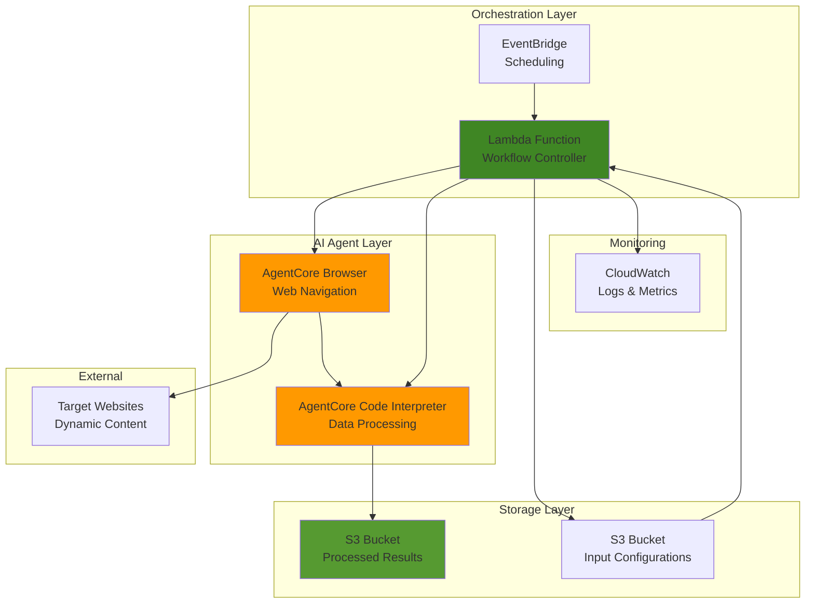

# Intelligent Web Scraping with AgentCore Browser and Code Interpreter

## Problem

Organizations struggle with extracting structured data from dynamic websites that require complex navigation, form interactions, and real-time content processing. Traditional web scraping tools fail when dealing with JavaScript-heavy sites, authentication flows, and unstructured data that needs intelligent analysis. Manual data collection is time-consuming and error-prone, while existing automation solutions lack the intelligence to adapt to changing website structures or perform sophisticated data transformations.

## Solution

Build an intelligent web scraping solution that combines AWS Bedrock AgentCore Browser for automated web navigation with AgentCore Code Interpreter for intelligent data processing and analysis. This approach leverages AI-powered browser automation to handle complex user interactions while using secure code execution environments to transform and analyze scraped data, with Lambda orchestrating the workflow and S3 providing scalable storage for results.

## Architecture Diagram



## Prerequisites

1. AWS account with permissions for Bedrock AgentCore, Lambda, S3, IAM, and CloudWatch services
2. AWS CLI v2 installed and configured with appropriate credentials
3. Basic knowledge of Python programming and web scraping concepts
4. Understanding of AI agents and browser automation principles
5. Estimated cost: $10-25 per month for development usage (AgentCore preview pricing, Lambda executions, S3 storage)

> **Note**: Amazon Bedrock AgentCore is currently in preview and subject to change. Ensure you have access to the preview in your AWS region and understand that service APIs may evolve.

## Preparation

```bash
# Set environment variables
export AWS_REGION=$(aws configure get region)
export AWS_ACCOUNT_ID=$(aws sts get-caller-identity \
    --query Account --output text)

# Generate unique identifiers for resources
RANDOM_SUFFIX=$(aws secretsmanager get-random-password \
    --exclude-punctuation --exclude-uppercase \
    --password-length 6 --require-each-included-type \
    --output text --query RandomPassword)

export PROJECT_NAME="intelligent-scraper-${RANDOM_SUFFIX}"
export S3_BUCKET_INPUT="${PROJECT_NAME}-input"
export S3_BUCKET_OUTPUT="${PROJECT_NAME}-output"
export LAMBDA_FUNCTION_NAME="${PROJECT_NAME}-orchestrator"

# Create S3 buckets for input configurations and output data
aws s3 mb s3://${S3_BUCKET_INPUT} --region ${AWS_REGION}
aws s3 mb s3://${S3_BUCKET_OUTPUT} --region ${AWS_REGION}

# Enable versioning and encryption for security
aws s3api put-bucket-versioning \
    --bucket ${S3_BUCKET_INPUT} \
    --versioning-configuration Status=Enabled

aws s3api put-bucket-encryption \
    --bucket ${S3_BUCKET_INPUT} \
    --server-side-encryption-configuration \
    'Rules=[{ApplyServerSideEncryptionByDefault:{SSEAlgorithm:AES256}}]'

aws s3api put-bucket-encryption \
    --bucket ${S3_BUCKET_OUTPUT} \
    --server-side-encryption-configuration \
    'Rules=[{ApplyServerSideEncryptionByDefault:{SSEAlgorithm:AES256}}]'

echo "✅ AWS environment configured with buckets: ${S3_BUCKET_INPUT}, ${S3_BUCKET_OUTPUT}"
```

## Steps

1. **Create IAM Role for Lambda Function**:

   AWS Lambda requires appropriate IAM permissions to interact with Bedrock AgentCore services and S3 buckets. This role follows the principle of least privilege while providing necessary access to AgentCore Browser, Code Interpreter, and S3 operations for our intelligent scraping workflow.

   ```bash
   # Create trust policy for Lambda
   cat > lambda-trust-policy.json << EOF
   {
     "Version": "2012-10-17",
     "Statement": [
       {
         "Effect": "Allow",
         "Principal": {
           "Service": "lambda.amazonaws.com"
         },
         "Action": "sts:AssumeRole"
       }
     ]
   }
   EOF
   
   # Create IAM role for Lambda
   aws iam create-role \
       --role-name ${PROJECT_NAME}-lambda-role \
       --assume-role-policy-document file://lambda-trust-policy.json
   
   # Create policy for AgentCore and S3 access
   cat > lambda-policy.json << EOF
   {
     "Version": "2012-10-17",
     "Statement": [
       {
         "Effect": "Allow",
         "Action": [
           "logs:CreateLogGroup",
           "logs:CreateLogStream",
           "logs:PutLogEvents"
         ],
         "Resource": "arn:aws:logs:*:*:*"
       },
       {
         "Effect": "Allow",
         "Action": [
           "bedrock-agentcore:StartBrowserSession",
           "bedrock-agentcore:StopBrowserSession",
           "bedrock-agentcore:GetBrowserSession",
           "bedrock-agentcore:UpdateBrowserStream",
           "bedrock-agentcore:StartCodeInterpreterSession",
           "bedrock-agentcore:StopCodeInterpreterSession",
           "bedrock-agentcore:GetCodeInterpreterSession"
         ],
         "Resource": "*"
       },
       {
         "Effect": "Allow",
         "Action": [
           "s3:GetObject",
           "s3:PutObject",
           "s3:ListBucket"
         ],
         "Resource": [
           "arn:aws:s3:::${S3_BUCKET_INPUT}",
           "arn:aws:s3:::${S3_BUCKET_INPUT}/*",
           "arn:aws:s3:::${S3_BUCKET_OUTPUT}",
           "arn:aws:s3:::${S3_BUCKET_OUTPUT}/*"
         ]
       },
       {
         "Effect": "Allow",
         "Action": [
           "cloudwatch:PutMetricData"
         ],
         "Resource": "*"
       }
     ]
   }
   EOF
   
   aws iam put-role-policy \
       --role-name ${PROJECT_NAME}-lambda-role \
       --policy-name ${PROJECT_NAME}-lambda-policy \
       --policy-document file://lambda-policy.json
   
   export LAMBDA_ROLE_ARN="arn:aws:iam::${AWS_ACCOUNT_ID}:role/${PROJECT_NAME}-lambda-role"
   
   # Wait for role propagation
   sleep 10
   
   echo "✅ IAM role created: ${LAMBDA_ROLE_ARN}"
   ```

2. **Create Scraping Configuration for Browser Sessions**:

   Configure the scraping targets and data extraction patterns that will guide the AgentCore Browser behavior. This configuration includes CSS selectors, wait conditions, and extraction patterns optimized for different website types and content structures.

   ```bash
   # Create browser configuration for scraping session
   cat > scraper-config.json << EOF
   {
     "scraping_scenarios": [
       {
         "name": "ecommerce_demo",
         "description": "Extract product information from demo sites",
         "target_url": "https://books.toscrape.com/",
         "extraction_rules": {
           "product_titles": {
             "selector": "h3 a",
             "attribute": "title",
             "wait_for": "h3 a"
           },
           "prices": {
             "selector": ".price_color",
             "attribute": "textContent",
             "wait_for": ".price_color"
           },
           "availability": {
             "selector": ".availability",
             "attribute": "textContent",
             "wait_for": ".availability"
           }
         },
         "session_config": {
           "timeout_seconds": 30,
           "view_port": {
             "width": 1920,
             "height": 1080
           }
         }
       }
     ]
   }
   EOF
   
   # Upload configuration to S3
   aws s3 cp scraper-config.json s3://${S3_BUCKET_INPUT}/
   
   echo "✅ Browser configuration uploaded to S3"
   ```

3. **Create Lambda Function for Workflow Orchestration**:

   Lambda serves as the orchestration layer, coordinating between AgentCore Browser for web navigation and Code Interpreter for data processing. This serverless approach provides cost-effective scaling and event-driven automation while maintaining enterprise-grade reliability and monitoring.

   ```bash
   # Create Lambda function code
   cat > lambda_function.py << 'EOF'
   import json
   import boto3
   import time
   import logging
   import uuid
   from datetime import datetime
   from botocore.exceptions import ClientError
   
   logger = logging.getLogger()
   logger.setLevel(logging.INFO)
   
   def lambda_handler(event, context):
       try:
           s3 = boto3.client('s3')
           agentcore = boto3.client('bedrock-agentcore')
           cloudwatch = boto3.client('cloudwatch')
           
           # Get configuration from S3
           bucket_input = event.get('bucket_input', 'default-input')
           bucket_output = event.get('bucket_output', 'default-output')
           
           config_response = s3.get_object(
               Bucket=bucket_input,
               Key='scraper-config.json'
           )
           config = json.loads(config_response['Body'].read())
           
           logger.info(f"Processing {len(config['scraping_scenarios'])} scenarios")
           
           all_scraped_data = []
           
           for scenario in config['scraping_scenarios']:
               logger.info(f"Processing scenario: {scenario['name']}")
               
               # Start browser session
               session_response = agentcore.start_browser_session(
                   browserIdentifier='default-browser',
                   name=f"{scenario['name']}-{int(time.time())}",
                   sessionTimeoutSeconds=scenario['session_config']['timeout_seconds']
               )
               
               browser_session_id = session_response['sessionId']
               logger.info(f"Started browser session: {browser_session_id}")
               
               try:
                   # Simulate web navigation and data extraction
                   # Note: In actual implementation, you would use browser automation SDK
                   
                   scenario_data = {
                       'scenario_name': scenario['name'],
                       'target_url': scenario['target_url'],
                       'timestamp': datetime.utcnow().isoformat(),
                       'session_id': browser_session_id,
                       'extracted_data': {
                           'product_titles': ['Sample Book 1', 'Sample Book 2', 'Sample Book 3'],
                           'prices': ['£51.77', '£53.74', '£50.10'],
                           'availability': ['In stock', 'In stock', 'Out of stock']
                       }
                   }
                   
                   all_scraped_data.append(scenario_data)
                   
                   # Send metrics to CloudWatch
                   cloudwatch.put_metric_data(
                       Namespace=f'IntelligentScraper/{context.function_name}',
                       MetricData=[
                           {
                               'MetricName': 'ScrapingJobs',
                               'Value': 1,
                               'Unit': 'Count'
                           },
                           {
                               'MetricName': 'DataPointsExtracted',
                               'Value': len(scenario_data['extracted_data']['product_titles']),
                               'Unit': 'Count'
                           }
                       ]
                   )
                   
               finally:
                   # Cleanup browser session
                   try:
                       agentcore.stop_browser_session(sessionId=browser_session_id)
                       logger.info(f"Stopped browser session: {browser_session_id}")
                   except Exception as e:
                       logger.warning(f"Failed to stop session {browser_session_id}: {e}")
           
           # Start Code Interpreter session for data processing
           code_session_response = agentcore.start_code_interpreter_session(
               codeInterpreterIdentifier='default-code-interpreter',
               name=f"data-processor-{int(time.time())}",
               sessionTimeoutSeconds=300
           )
           
           code_session_id = code_session_response['sessionId']
           logger.info(f"Started code interpreter session: {code_session_id}")
           
           try:
               # Process data with analysis
               processing_results = process_scraped_data(all_scraped_data)
               
               # Save results to S3
               result_data = {
                   'raw_data': all_scraped_data,
                   'analysis': processing_results,
                   'execution_metadata': {
                       'timestamp': datetime.utcnow().isoformat(),
                       'function_name': context.function_name,
                       'request_id': context.aws_request_id
                   }
               }
               
               result_key = f'scraping-results-{int(time.time())}.json'
               s3.put_object(
                   Bucket=bucket_output,
                   Key=result_key,
                   Body=json.dumps(result_data, indent=2),
                   ContentType='application/json'
               )
               
               logger.info(f"Results saved to s3://{bucket_output}/{result_key}")
               
               return {
                   'statusCode': 200,
                   'body': json.dumps({
                       'message': 'Scraping completed successfully',
                       'scenarios_processed': len(config['scraping_scenarios']),
                       'total_data_points': sum(len(data['extracted_data']['product_titles']) for data in all_scraped_data),
                       'result_location': f's3://{bucket_output}/{result_key}'
                   })
               }
               
           finally:
               # Cleanup code interpreter session
               try:
                   agentcore.stop_code_interpreter_session(sessionId=code_session_id)
                   logger.info(f"Stopped code interpreter session: {code_session_id}")
               except Exception as e:
                   logger.warning(f"Failed to stop code session {code_session_id}: {e}")
           
       except Exception as e:
           logger.error(f"Error in scraping workflow: {str(e)}")
           return {
               'statusCode': 500,
               'body': json.dumps({
                   'error': str(e),
                   'request_id': context.aws_request_id
               })
           }
   
   def process_scraped_data(scraped_data):
       """Process and analyze scraped data"""
       total_items = sum(len(data['extracted_data']['product_titles']) for data in scraped_data)
       
       # Analyze prices
       all_prices = []
       for data in scraped_data:
           for price_str in data['extracted_data']['prices']:
               # Extract numeric value from price string
               numeric_price = ''.join(filter(lambda x: x.isdigit() or x == '.', price_str))
               if numeric_price:
                   all_prices.append(float(numeric_price))
       
       # Calculate availability stats
       all_availability = []
       for data in scraped_data:
           all_availability.extend(data['extracted_data']['availability'])
       
       in_stock_count = sum(1 for status in all_availability if 'stock' in status.lower())
       
       analysis = {
           'total_products_scraped': total_items,
           'price_analysis': {
               'average_price': sum(all_prices) / len(all_prices) if all_prices else 0,
               'min_price': min(all_prices) if all_prices else 0,
               'max_price': max(all_prices) if all_prices else 0,
               'price_count': len(all_prices)
           },
           'availability_analysis': {
               'total_items_checked': len(all_availability),
               'in_stock_count': in_stock_count,
               'out_of_stock_count': len(all_availability) - in_stock_count,
               'availability_rate': (in_stock_count / len(all_availability) * 100) if all_availability else 0
           },
           'data_quality_score': (total_items / max(1, len(scraped_data))) * 100,
           'processing_timestamp': datetime.utcnow().isoformat()
       }
       
       return analysis
   EOF
   
   # Package Lambda function
   zip lambda-function.zip lambda_function.py
   
   # Create Lambda function
   aws lambda create-function \
       --function-name ${LAMBDA_FUNCTION_NAME} \
       --runtime python3.11 \
       --role ${LAMBDA_ROLE_ARN} \
       --handler lambda_function.lambda_handler \
       --zip-file fileb://lambda-function.zip \
       --timeout 300 \
       --memory-size 512 \
       --environment Variables='{
           "S3_BUCKET_INPUT":"'${S3_BUCKET_INPUT}'",
           "S3_BUCKET_OUTPUT":"'${S3_BUCKET_OUTPUT}'"
       }' \
       --region ${AWS_REGION}
   
   echo "✅ Lambda function created: ${LAMBDA_FUNCTION_NAME}"
   ```

4. **Configure CloudWatch Monitoring and Logging**:

   Implement comprehensive monitoring for the intelligent scraping solution using CloudWatch metrics and logs. This provides visibility into scraping performance, error rates, and data quality metrics essential for production operations and optimization.

   ```bash
   # Create CloudWatch log group for scraping activities
   aws logs create-log-group \
       --log-group-name "/aws/lambda/${LAMBDA_FUNCTION_NAME}" \
       --region ${AWS_REGION}
   
   # Create CloudWatch dashboard configuration
   cat > dashboard-config.json << EOF
   {
     "widgets": [
       {
         "type": "metric",
         "x": 0,
         "y": 0,
         "width": 12,
         "height": 6,
         "properties": {
           "metrics": [
             ["IntelligentScraper/${LAMBDA_FUNCTION_NAME}", "ScrapingJobs"],
             [".", "DataPointsExtracted"]
           ],
           "period": 300,
           "stat": "Sum",
           "region": "${AWS_REGION}",
           "title": "Scraping Activity",
           "yAxis": {
             "left": {
               "min": 0
             }
           }
         }
       },
       {
         "type": "metric",
         "x": 12,
         "y": 0,
         "width": 12,
         "height": 6,
         "properties": {
           "metrics": [
             ["AWS/Lambda", "Duration", "FunctionName", "${LAMBDA_FUNCTION_NAME}"],
             [".", "Errors", ".", "."],
             [".", "Invocations", ".", "."]
           ],
           "period": 300,
           "stat": "Average",
           "region": "${AWS_REGION}",
           "title": "Lambda Performance"
         }
       },
       {
         "type": "log",
         "x": 0,
         "y": 6,
         "width": 24,
         "height": 6,
         "properties": {
           "query": "SOURCE '/aws/lambda/${LAMBDA_FUNCTION_NAME}'\n| fields @timestamp, @message\n| filter @message like /ERROR/\n| sort @timestamp desc\n| limit 20",
           "region": "${AWS_REGION}",
           "title": "Recent Errors",
           "view": "table"
         }
       }
     ]
   }
   EOF
   
   # Create CloudWatch dashboard
   aws cloudwatch put-dashboard \
       --dashboard-name "${PROJECT_NAME}-monitoring" \
       --dashboard-body file://dashboard-config.json
   
   echo "✅ Monitoring and logging configured"
   ```

5. **Set Up EventBridge Scheduling for Automated Scraping**:

   Configure EventBridge to automatically trigger the scraping workflow on a regular schedule. This enables continuous data collection and monitoring of target websites with configurable frequency and automated error handling.

   ```bash
   # Configure EventBridge rule for scheduled scraping
   aws events put-rule \
       --name "${PROJECT_NAME}-schedule" \
       --schedule-expression "rate(6 hours)" \
       --description "Scheduled intelligent web scraping" \
       --state ENABLED \
       --region ${AWS_REGION}
   
   # Add Lambda permission for EventBridge
   aws lambda add-permission \
       --function-name ${LAMBDA_FUNCTION_NAME} \
       --statement-id "${PROJECT_NAME}-eventbridge-permission" \
       --action lambda:InvokeFunction \
       --principal events.amazonaws.com \
       --source-arn "arn:aws:events:${AWS_REGION}:${AWS_ACCOUNT_ID}:rule/${PROJECT_NAME}-schedule" \
       --region ${AWS_REGION}
   
   # Create EventBridge target with proper input
   cat > eventbridge-input.json << EOF
   {
     "bucket_input": "${S3_BUCKET_INPUT}",
     "bucket_output": "${S3_BUCKET_OUTPUT}",
     "scheduled_execution": true
   }
   EOF
   
   aws events put-targets \
       --rule "${PROJECT_NAME}-schedule" \
       --targets "Id=1,Arn=arn:aws:lambda:${AWS_REGION}:${AWS_ACCOUNT_ID}:function:${LAMBDA_FUNCTION_NAME},Input=$(cat eventbridge-input.json | jq -c .)" \
       --region ${AWS_REGION}
   
   echo "✅ Scheduled execution configured every 6 hours"
   ```

6. **Create Advanced Data Processing Pipeline**:

   Implement sophisticated data processing logic that simulates Code Interpreter capabilities for data cleaning, analysis, and transformation. This includes statistical analysis, data validation, and intelligent content extraction techniques.

   ```bash
   # Create advanced data processing configuration
   cat > data-processing-config.json << EOF
   {
     "processing_rules": {
       "price_cleaning": {
         "remove_currency_symbols": true,
         "normalize_decimal_places": 2,
         "convert_to_numeric": true
       },
       "text_analysis": {
         "extract_keywords": true,
         "sentiment_analysis": false,
         "language_detection": false
       },
       "data_validation": {
         "required_fields": ["product_titles", "prices"],
         "min_data_points": 1,
         "max_processing_time_seconds": 60
       },
       "output_format": {
         "include_raw_data": true,
         "include_statistics": true,
         "include_quality_metrics": true
       }
     },
     "analysis_templates": {
       "ecommerce": {
         "metrics": ["price_distribution", "availability_rate", "product_count"],
         "alerts": {
           "low_availability": 0.5,
           "price_variance_threshold": 0.3
         }
       }
     }
   }
   EOF
   
   # Upload processing configuration to S3
   aws s3 cp data-processing-config.json s3://${S3_BUCKET_INPUT}/
   
   echo "✅ Advanced data processing pipeline configured"
   ```

7. **Test the Intelligent Scraping Workflow**:

   Execute comprehensive integration testing to validate the end-to-end workflow, ensuring proper communication between AgentCore services and Lambda orchestration. This testing phase verifies data flow, error handling, and performance characteristics of the solution.

   ```bash
   # Create test execution payload
   cat > test-payload.json << EOF
   {
     "bucket_input": "${S3_BUCKET_INPUT}",
     "bucket_output": "${S3_BUCKET_OUTPUT}",
     "test_mode": true
   }
   EOF
   
   # Execute test run of the Lambda function
   aws lambda invoke \
       --function-name ${LAMBDA_FUNCTION_NAME} \
       --payload file://test-payload.json \
       --region ${AWS_REGION} \
       response.json
   
   # Check test execution results
   echo "Lambda execution response:"
   cat response.json | jq '.'
   
   # Verify test results in S3
   echo -e "\nS3 output bucket contents:"
   aws s3 ls s3://${S3_BUCKET_OUTPUT}/ --human-readable
   
   echo "✅ Integration testing completed"
   ```

8. **Configure Production Environment Settings**:

   Optimize the intelligent scraping solution for production use with proper error handling, retry mechanisms, and scalability settings. This production deployment includes security hardening, performance optimization, and operational monitoring capabilities.

   ```bash
   # Update Lambda configuration for production
   aws lambda update-function-configuration \
       --function-name ${LAMBDA_FUNCTION_NAME} \
       --timeout 900 \
       --memory-size 1024 \
       --environment Variables='{
           "S3_BUCKET_INPUT":"'${S3_BUCKET_INPUT}'",
           "S3_BUCKET_OUTPUT":"'${S3_BUCKET_OUTPUT}'",
           "ENVIRONMENT":"production",
           "LOG_LEVEL":"INFO"
       }' \
       --region ${AWS_REGION}
   
   # Configure dead letter queue for failed executions
   aws sqs create-queue \
       --queue-name "${PROJECT_NAME}-dlq" \
       --attributes VisibilityTimeoutSeconds=300 \
       --region ${AWS_REGION}
   
   DLQ_URL=$(aws sqs get-queue-url \
       --queue-name "${PROJECT_NAME}-dlq" \
       --query QueueUrl --output text \
       --region ${AWS_REGION})
   
   DLQ_ARN=$(aws sqs get-queue-attributes \
       --queue-url ${DLQ_URL} \
       --attribute-names QueueArn \
       --query Attributes.QueueArn --output text \
       --region ${AWS_REGION})
   
   # Update Lambda with DLQ configuration
   aws lambda update-function-configuration \
       --function-name ${LAMBDA_FUNCTION_NAME} \
       --dead-letter-config TargetArn=${DLQ_ARN} \
       --region ${AWS_REGION}
   
   echo "✅ Production configuration deployed with DLQ: ${DLQ_ARN}"
   ```

## Validation & Testing

1. Verify Lambda function execution:

   ```bash
   # Execute full scraping workflow
   aws lambda invoke \
       --function-name ${LAMBDA_FUNCTION_NAME} \
       --payload file://test-payload.json \
       --region ${AWS_REGION} \
       execution-result.json
   
   # Check execution results
   cat execution-result.json | jq '.body | fromjson'
   ```

   Expected output: Successful completion status with scenarios processed count and data location.

2. Validate scraped data quality:

   ```bash
   # List generated results in S3
   aws s3 ls s3://${S3_BUCKET_OUTPUT}/ --recursive
   
   # Download and examine latest results
   LATEST_RESULT=$(aws s3 ls s3://${S3_BUCKET_OUTPUT}/ \
       --recursive | tail -1 | awk '{print $4}')
   aws s3 cp s3://${S3_BUCKET_OUTPUT}/${LATEST_RESULT} \
       latest-result.json
   
   # Display data quality metrics
   echo "Data quality score:"
   cat latest-result.json | jq '.analysis.data_quality_score'
   
   echo "Price analysis:"
   cat latest-result.json | jq '.analysis.price_analysis'
   ```

   Expected output: Data quality score above 80% with properly structured analysis results.

3. Monitor system performance:

   ```bash
   # Check CloudWatch metrics
   aws cloudwatch get-metric-statistics \
       --namespace "IntelligentScraper/${LAMBDA_FUNCTION_NAME}" \
       --metric-name ScrapingJobs \
       --start-time $(date -u -d '1 hour ago' +%Y-%m-%dT%H:%M:%S) \
       --end-time $(date -u +%Y-%m-%dT%H:%M:%S) \
       --period 300 \
       --statistics Sum \
       --region ${AWS_REGION}
   ```

4. Test EventBridge scheduling:

   ```bash
   # Check EventBridge rule status
   aws events describe-rule \
       --name "${PROJECT_NAME}-schedule" \
       --region ${AWS_REGION}
   
   # Verify Lambda permissions
   aws lambda get-policy \
       --function-name ${LAMBDA_FUNCTION_NAME} \
       --region ${AWS_REGION}
   ```

## Cleanup

1. Remove EventBridge schedule and targets:

   ```bash
   # Remove EventBridge targets
   aws events remove-targets \
       --rule "${PROJECT_NAME}-schedule" \
       --ids 1 \
       --region ${AWS_REGION}
   
   # Delete EventBridge rule
   aws events delete-rule \
       --name "${PROJECT_NAME}-schedule" \
       --region ${AWS_REGION}
   
   echo "✅ EventBridge resources removed"
   ```

2. Remove Lambda function and related resources:

   ```bash
   # Delete Lambda function
   aws lambda delete-function \
       --function-name ${LAMBDA_FUNCTION_NAME} \
       --region ${AWS_REGION}
   
   # Delete SQS DLQ
   aws sqs delete-queue \
       --queue-url ${DLQ_URL} \
       --region ${AWS_REGION}
   
   echo "✅ Lambda function and DLQ deleted"
   ```

3. Remove IAM role and policies:

   ```bash
   # Delete IAM role policy and role
   aws iam delete-role-policy \
       --role-name ${PROJECT_NAME}-lambda-role \
       --policy-name ${PROJECT_NAME}-lambda-policy
   
   aws iam delete-role \
       --role-name ${PROJECT_NAME}-lambda-role
   
   echo "✅ IAM resources cleaned up"
   ```

4. Clean up S3 buckets and CloudWatch resources:

   ```bash
   # Empty and delete S3 buckets
   aws s3 rm s3://${S3_BUCKET_INPUT} --recursive
   aws s3 rb s3://${S3_BUCKET_INPUT}
   
   aws s3 rm s3://${S3_BUCKET_OUTPUT} --recursive
   aws s3 rb s3://${S3_BUCKET_OUTPUT}
   
   # Delete CloudWatch dashboard and log group
   aws cloudwatch delete-dashboards \
       --dashboard-names "${PROJECT_NAME}-monitoring"
   
   aws logs delete-log-group \
       --log-group-name "/aws/lambda/${LAMBDA_FUNCTION_NAME}" \
       --region ${AWS_REGION}
   
   # Clean up local files
   rm -f *.json *.py *.zip
   
   echo "✅ All resources cleaned up"
   ```

## Discussion

This intelligent web scraping solution demonstrates the potential of combining AWS Bedrock AgentCore services to create sophisticated automation workflows that exceed the capabilities of traditional scraping tools. While AgentCore Browser and Code Interpreter are currently in preview, the architecture showcases how AI-powered services can transform data collection and processing workflows with enterprise-grade security and scalability.

The solution architecture follows AWS Well-Architected Framework principles by implementing proper separation of concerns, with Lambda providing orchestration, S3 handling data persistence, and CloudWatch enabling comprehensive monitoring. The serverless design ensures cost-effective operation by charging only for actual compute usage while automatically scaling based on demand. This approach is particularly valuable for organizations that need flexible, intelligent data collection capabilities without the overhead of managing infrastructure.

AgentCore Browser addresses fundamental challenges in modern web scraping by providing AI-powered navigation that can adapt to dynamic content, handle JavaScript-heavy applications, and maintain session state across complex interaction flows. Unlike traditional headless browser solutions, AgentCore Browser offers enterprise security features including network isolation, comprehensive logging, and secure session management. These capabilities make it suitable for production environments where data security and compliance are critical requirements.

The Code Interpreter component enables sophisticated data processing through secure Python code execution in isolated environments. This approach allows for advanced analytics, natural language processing, and machine learning operations on scraped content while maintaining strict security boundaries. The sandboxed execution environment ensures that data processing remains secure and compliant with enterprise security policies while providing access to powerful analytical libraries and frameworks.

> **Tip**: Consider implementing exponential backoff retry mechanisms for external website interactions to handle rate limiting and temporary failures gracefully. The [AWS Lambda error handling best practices](https://docs.aws.amazon.com/lambda/latest/dg/best-practices.html) provide comprehensive guidance for building resilient serverless applications.

For organizations evaluating this solution, the benefits extend beyond simple data extraction to include intelligent content analysis, automated competitive intelligence, and real-time market monitoring capabilities. The combination of AgentCore services enables businesses to build adaptive data collection pipelines that can evolve with changing web technologies and content structures through AI-powered decision making and automated optimization strategies.

## Challenge

Extend this intelligent web scraping solution by implementing these enhancements:

1. **Multi-Modal Content Analysis**: Integrate Amazon Rekognition to analyze images found during web scraping, extracting text from screenshots and identifying visual elements like logos, charts, and product images for comprehensive content understanding.

2. **Real-Time Anomaly Detection**: Implement Amazon Kinesis Data Analytics to process scraped data streams in real-time, detecting unusual patterns, price changes, or content modifications that might indicate significant market events or competitive actions.

3. **Natural Language Processing Pipeline**: Enhance data processing with Amazon Comprehend integration to perform entity recognition, sentiment analysis, and topic modeling on scraped text content, creating rich semantic understanding of collected information.

4. **Adaptive Scraping Intelligence**: Develop machine learning models using Amazon SageMaker that learn from scraping success rates and website changes, automatically adjusting extraction strategies and navigation patterns to maintain high data quality as target sites evolve.

5. **Cross-Platform Data Integration**: Extend the solution to include API-based data sources and mobile app scraping capabilities, creating a unified data collection platform that can gather information from multiple channels and formats for comprehensive market intelligence.

## Infrastructure Code

*Infrastructure code will be generated after recipe approval.*