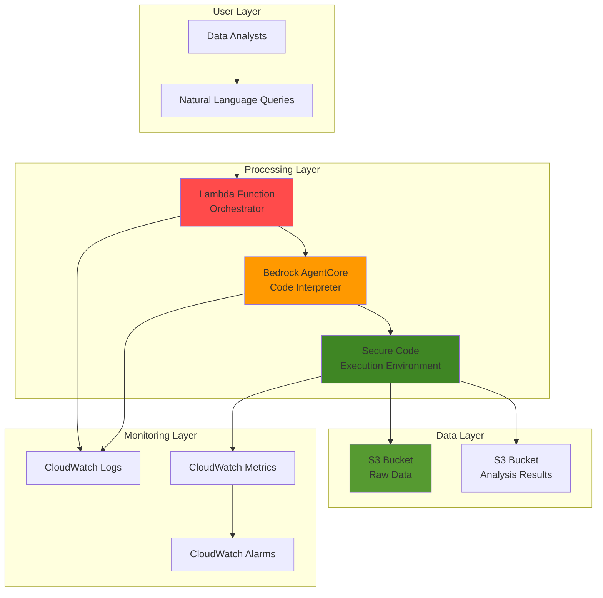

# Interactive Data Analytics with Bedrock AgentCore Code Interpreter

## Problem

Data analysts and scientists often struggle with complex data processing workflows that require both natural language understanding and computational execution on large datasets. Traditional analytics tools lack the flexibility to dynamically interpret user requests, execute custom code in secure environments, and automatically generate insights from unstructured data queries. Organizations need an intelligent system that can bridge the gap between conversational analytics requests and sophisticated data processing capabilities while maintaining enterprise security and scalability requirements.

## Solution

Build an intelligent data analytics system using AWS Bedrock AgentCore Code Interpreter that combines natural language processing with secure code execution capabilities. The solution leverages S3 for scalable data storage, Lambda for workflow orchestration, and CloudWatch for comprehensive monitoring. This architecture enables users to submit analytical requests in natural language, automatically generates and executes Python code in sandboxed environments, processes large datasets up to 5GB, and delivers actionable insights through secure, enterprise-grade infrastructure.

## Architecture Diagram



## Prerequisites

1. AWS account with permissions for Bedrock, S3, Lambda, CloudWatch, and IAM
2. AWS CLI v2 installed and configured with appropriate credentials
3. Understanding of data analytics workflows and Python programming
4. Basic knowledge of AWS serverless architectures and monitoring
5. Sample dataset for testing (CSV, JSON, or Excel format)
6. Estimated cost: $15-25 per day for testing (includes Bedrock inference, Lambda execution, S3 storage)

> **Note**: Bedrock AgentCore is in preview and subject to change. Ensure your AWS account has access to preview features and appropriate service quotas.

## Preparation

```bash
# Set environment variables
export AWS_REGION=$(aws configure get region)
export AWS_ACCOUNT_ID=$(aws sts get-caller-identity \
    --query Account --output text)

# Generate unique identifiers for resources
RANDOM_SUFFIX=$(aws secretsmanager get-random-password \
    --exclude-punctuation --exclude-uppercase \
    --password-length 6 --require-each-included-type \
    --output text --query RandomPassword)

# Set resource names
export BUCKET_RAW_DATA=analytics-raw-data-${RANDOM_SUFFIX}
export BUCKET_RESULTS=analytics-results-${RANDOM_SUFFIX}
export LAMBDA_FUNCTION_NAME=analytics-orchestrator-${RANDOM_SUFFIX}
export CODE_INTERPRETER_NAME=analytics-interpreter-${RANDOM_SUFFIX}
export IAM_ROLE_NAME=analytics-execution-role-${RANDOM_SUFFIX}

# Create foundational IAM role for Bedrock AgentCore
aws iam create-role \
    --role-name ${IAM_ROLE_NAME} \
    --assume-role-policy-document '{
        "Version": "2012-10-17",
        "Statement": [
            {
                "Effect": "Allow",
                "Principal": {
                    "Service": ["bedrock.amazonaws.com", "lambda.amazonaws.com"]
                },
                "Action": "sts:AssumeRole"
            }
        ]
    }'

# Attach necessary policies to the execution role
aws iam attach-role-policy \
    --role-name ${IAM_ROLE_NAME} \
    --policy-arn arn:aws:iam::aws:policy/AmazonS3FullAccess

aws iam attach-role-policy \
    --role-name ${IAM_ROLE_NAME} \
    --policy-arn arn:aws:iam::aws:policy/CloudWatchFullAccess

aws iam attach-role-policy \
    --role-name ${IAM_ROLE_NAME} \
    --policy-arn arn:aws:iam::aws:policy/service-role/AWSLambdaBasicExecutionRole

echo "✅ AWS environment configured with unique suffix: ${RANDOM_SUFFIX}"
```

## Steps

1. **Create S3 Buckets for Data Storage and Results**:

   S3 provides the scalable, durable foundation for our analytics pipeline with 99.999999999% (11 9's) durability. We'll create separate buckets for raw data input and processed results output, enabling efficient data lifecycle management and access control. This separation supports data governance best practices and allows for different retention policies.

   ```bash
   # Create S3 bucket for raw data input
   aws s3 mb s3://${BUCKET_RAW_DATA} --region ${AWS_REGION}
   
   # Create S3 bucket for analysis results
   aws s3 mb s3://${BUCKET_RESULTS} --region ${AWS_REGION}
   
   # Enable versioning for data protection
   aws s3api put-bucket-versioning \
       --bucket ${BUCKET_RAW_DATA} \
       --versioning-configuration Status=Enabled
   
   aws s3api put-bucket-versioning \
       --bucket ${BUCKET_RESULTS} \
       --versioning-configuration Status=Enabled
   
   # Configure server-side encryption
   aws s3api put-bucket-encryption \
       --bucket ${BUCKET_RAW_DATA} \
       --server-side-encryption-configuration \
       'Rules=[{ApplyServerSideEncryptionByDefault:{SSEAlgorithm:AES256}}]'
   
   aws s3api put-bucket-encryption \
       --bucket ${BUCKET_RESULTS} \
       --server-side-encryption-configuration \
       'Rules=[{ApplyServerSideEncryptionByDefault:{SSEAlgorithm:AES256}}]'
   
   echo "✅ S3 buckets created with security features: ${BUCKET_RAW_DATA}, ${BUCKET_RESULTS}"
   ```

2. **Upload Sample Dataset for Analysis**:

   This step establishes our data foundation by uploading a representative dataset that demonstrates the system's analytical capabilities. The sample data will showcase the Code Interpreter's ability to process various data formats and perform complex analytical operations.

   ```bash
   # Create sample sales data file
   cat > sample_sales_data.csv << EOF
   date,product,region,sales_amount,quantity,customer_segment
   2024-01-01,Widget A,North,1250.50,25,Enterprise
   2024-01-02,Widget B,South,890.75,18,SMB
   2024-01-03,Widget A,East,2150.25,43,Enterprise
   2024-01-04,Widget C,West,567.30,12,Startup
   2024-01-05,Widget B,North,1875.60,38,Enterprise
   2024-01-06,Widget A,South,1320.45,26,SMB
   2024-01-07,Widget C,East,745.20,15,Startup
   2024-01-08,Widget B,West,2340.80,47,Enterprise
   2024-01-09,Widget A,North,998.15,20,SMB
   2024-01-10,Widget C,South,1456.70,29,Enterprise
   EOF
   
   # Upload sample dataset to S3
   aws s3 cp sample_sales_data.csv s3://${BUCKET_RAW_DATA}/datasets/
   
   # Create additional sample datasets for comprehensive testing
   cat > sample_customer_data.json << EOF
   [
     {"customer_id": "C001", "name": "TechCorp", "segment": "Enterprise", "annual_value": 150000},
     {"customer_id": "C002", "name": "StartupXYZ", "segment": "Startup", "annual_value": 25000},
     {"customer_id": "C003", "name": "MidSize Inc", "segment": "SMB", "annual_value": 75000}
   ]
   EOF
   
   aws s3 cp sample_customer_data.json s3://${BUCKET_RAW_DATA}/datasets/
   
   echo "✅ Sample datasets uploaded to S3 for analysis"
   ```

3. **Create Bedrock AgentCore Code Interpreter**:

   AWS Bedrock AgentCore Code Interpreter provides secure, sandboxed code execution environments that enable AI agents to write, execute, and debug code safely. This component is the intelligence engine that interprets natural language requests and translates them into executable Python code for data analysis.

   ```bash
   # Get the execution role ARN
   EXECUTION_ROLE_ARN=$(aws iam get-role \
       --role-name ${IAM_ROLE_NAME} \
       --query 'Role.Arn' --output text)
   
   # Create Code Interpreter with public network access for data processing
   CODE_INTERPRETER_RESPONSE=$(aws bedrock-agentcore create-code-interpreter \
       --region ${AWS_REGION} \
       --name ${CODE_INTERPRETER_NAME} \
       --description "Interactive data analytics interpreter for processing S3 datasets" \
       --network-configuration '{
           "networkMode": "PUBLIC"
       }' \
       --execution-role-arn ${EXECUTION_ROLE_ARN})
   
   # Extract the Code Interpreter ID from response
   CODE_INTERPRETER_ID=$(echo ${CODE_INTERPRETER_RESPONSE} | jq -r '.codeInterpreterIdentifier')
   export CODE_INTERPRETER_ID
   
   echo "✅ Bedrock AgentCore Code Interpreter created: ${CODE_INTERPRETER_ID}"
   ```

4. **Create Lambda Function for Orchestration**:

   AWS Lambda provides the serverless orchestration layer that coordinates between user requests, the Bedrock Code Interpreter, and data storage. This function handles the workflow of receiving analytical queries, invoking the Code Interpreter, and managing results storage with automatic scaling and pay-per-execution pricing.

   ```bash
   # Create Lambda function code
   cat > lambda_function.py << 'EOF'
   import json
   import boto3
   import os
   from datetime import datetime
   
   def lambda_handler(event, context):
       # Initialize AWS clients
       bedrock = boto3.client('bedrock-agentcore')
       s3 = boto3.client('s3')
       cloudwatch = boto3.client('cloudwatch')
       
       try:
           # Extract query from event
           user_query = event.get('query', 'Analyze the sales data and provide insights')
           
           # Start a Code Interpreter session
           session_response = bedrock.start_code_interpreter_session(
               codeInterpreterIdentifier=os.environ['CODE_INTERPRETER_ID'],
               name=f"analytics-session-{int(datetime.now().timestamp())}",
               sessionTimeoutSeconds=3600
           )
           
           session_id = session_response['sessionId']
           
           # Prepare Python code for data analysis
           analysis_code = f"""
   import pandas as pd
   import boto3
   import matplotlib.pyplot as plt
   import seaborn as sns
   
   # Initialize S3 client
   s3 = boto3.client('s3')
   
   # Download sales data from S3
   s3.download_file('{os.environ['BUCKET_RAW_DATA']}', 'datasets/sample_sales_data.csv', 'sales_data.csv')
   s3.download_file('{os.environ['BUCKET_RAW_DATA']}', 'datasets/sample_customer_data.json', 'customer_data.json')
   
   # Load and analyze data based on user query: {user_query}
   sales_df = pd.read_csv('sales_data.csv')
   
   print("Data Analysis Results:")
   print(f"Total sales amount: ${sales_df['sales_amount'].sum():.2f}")
   print(f"Average sales per transaction: ${sales_df['sales_amount'].mean():.2f}")
   print("\\nSales by region:")
   print(sales_df.groupby('region')['sales_amount'].sum().sort_values(ascending=False))
   print("\\nTop performing products:")
   print(sales_df.groupby('product')['sales_amount'].sum().sort_values(ascending=False))
   
   # Create visualization
   plt.figure(figsize=(10, 6))
   sales_by_region = sales_df.groupby('region')['sales_amount'].sum()
   sales_by_region.plot(kind='bar')
   plt.title('Sales Amount by Region')
   plt.ylabel('Sales Amount ($)')
   plt.xticks(rotation=45)
   plt.tight_layout()
   plt.savefig('sales_analysis.png')
   
   # Upload results to S3
   s3.upload_file('sales_analysis.png', '{os.environ['BUCKET_RESULTS']}', 'analysis_results/sales_analysis.png')
   
   print("Analysis complete. Results saved to S3.")
           """
           
           # Execute code through Bedrock AgentCore
           execution_response = bedrock.invoke_code_interpreter(
               codeInterpreterIdentifier=os.environ['CODE_INTERPRETER_ID'],
               sessionId=session_id,
               name="executeAnalysis",
               arguments={
                   "language": "python",
                   "code": analysis_code
               }
           )
           
           # Process the response stream
           results = []
           for event in execution_response.get('stream', []):
               if 'result' in event:
                   result = event['result']
                   if 'content' in result:
                       for content_item in result['content']:
                           if content_item['type'] == 'text':
                               results.append(content_item['text'])
           
           # Log execution metrics to CloudWatch
           cloudwatch.put_metric_data(
               Namespace='Analytics/CodeInterpreter',
               MetricData=[
                   {
                       'MetricName': 'ExecutionCount',
                       'Value': 1,
                       'Unit': 'Count',
                       'Timestamp': datetime.utcnow()
                   }
               ]
           )
           
           return {
               'statusCode': 200,
               'body': json.dumps({
                   'message': 'Analysis completed successfully',
                   'session_id': session_id,
                   'results': results,
                   'results_bucket': os.environ['BUCKET_RESULTS']
               })
           }
           
       except Exception as e:
           # Log error metrics
           cloudwatch.put_metric_data(
               Namespace='Analytics/CodeInterpreter',
               MetricData=[
                   {
                       'MetricName': 'ExecutionErrors',
                       'Value': 1,
                       'Unit': 'Count',
                       'Timestamp': datetime.utcnow()
                   }
               ]
           )
           
           return {
               'statusCode': 500,
               'body': json.dumps({
                   'error': str(e),
                   'message': 'Analysis failed'
               })
           }
   EOF
   
   # Package Lambda function
   zip lambda_function.zip lambda_function.py
   
   # Create Lambda function
   aws lambda create-function \
       --function-name ${LAMBDA_FUNCTION_NAME} \
       --runtime python3.11 \
       --role ${EXECUTION_ROLE_ARN} \
       --handler lambda_function.lambda_handler \
       --zip-file fileb://lambda_function.zip \
       --timeout 300 \
       --memory-size 512 \
       --environment Variables="{
           CODE_INTERPRETER_ID=${CODE_INTERPRETER_ID},
           BUCKET_RAW_DATA=${BUCKET_RAW_DATA},
           BUCKET_RESULTS=${BUCKET_RESULTS}
       }"
   
   echo "✅ Lambda orchestration function created: ${LAMBDA_FUNCTION_NAME}"
   ```

5. **Configure CloudWatch Monitoring and Alarms**:

   CloudWatch provides comprehensive monitoring and observability for our analytics pipeline, enabling proactive issue detection and performance optimization. This monitoring setup tracks execution metrics, error rates, and system health across all components.

   ```bash
   # Create CloudWatch log group for Code Interpreter
   aws logs create-log-group \
       --log-group-name /aws/bedrock/agentcore/${CODE_INTERPRETER_NAME}
   
   # Create CloudWatch log group for Lambda function
   aws logs create-log-group \
       --log-group-name /aws/lambda/${LAMBDA_FUNCTION_NAME}
   
   # Create CloudWatch alarm for execution errors
   aws cloudwatch put-metric-alarm \
       --alarm-name "Analytics-ExecutionErrors-${RANDOM_SUFFIX}" \
       --alarm-description "Alert on analytics execution errors" \
       --metric-name ExecutionErrors \
       --namespace Analytics/CodeInterpreter \
       --statistic Sum \
       --period 300 \
       --threshold 3 \
       --comparison-operator GreaterThanThreshold \
       --evaluation-periods 2
   
   # Create CloudWatch alarm for Lambda function duration
   aws cloudwatch put-metric-alarm \
       --alarm-name "Analytics-LambdaDuration-${RANDOM_SUFFIX}" \
       --alarm-description "Alert on high Lambda execution duration" \
       --metric-name Duration \
       --namespace AWS/Lambda \
       --statistic Average \
       --period 300 \
       --threshold 240000 \
       --comparison-operator GreaterThanThreshold \
       --evaluation-periods 2 \
       --dimensions Name=FunctionName,Value=${LAMBDA_FUNCTION_NAME}
   
   echo "✅ CloudWatch monitoring and alarms configured"
   ```

6. **Create IAM Policies for Fine-Grained Access Control**:

   Implementing least privilege access ensures our analytics system maintains enterprise security standards while providing necessary permissions for data processing operations. These policies enable secure access to S3 data and Bedrock services.

   ```bash
   # Create custom IAM policy for enhanced Bedrock and S3 access
   cat > analytics_policy.json << EOF
   {
       "Version": "2012-10-17",
       "Statement": [
           {
               "Effect": "Allow",
               "Action": [
                   "bedrock:InvokeModel",
                   "bedrock:InvokeModelWithResponseStream",
                   "bedrock-agentcore:*"
               ],
               "Resource": "*"
           },
           {
               "Effect": "Allow",
               "Action": [
                   "s3:GetObject",
                   "s3:PutObject",
                   "s3:DeleteObject",
                   "s3:ListBucket"
               ],
               "Resource": [
                   "arn:aws:s3:::${BUCKET_RAW_DATA}",
                   "arn:aws:s3:::${BUCKET_RAW_DATA}/*",
                   "arn:aws:s3:::${BUCKET_RESULTS}",
                   "arn:aws:s3:::${BUCKET_RESULTS}/*"
               ]
           },
           {
               "Effect": "Allow",
               "Action": [
                   "logs:CreateLogGroup",
                   "logs:CreateLogStream",
                   "logs:PutLogEvents"
               ],
               "Resource": "arn:aws:logs:*:*:*"
           }
       ]
   }
   EOF
   
   # Create and attach the custom policy
   aws iam create-policy \
       --policy-name AnalyticsEnhancedPolicy-${RANDOM_SUFFIX} \
       --policy-document file://analytics_policy.json
   
   aws iam attach-role-policy \
       --role-name ${IAM_ROLE_NAME} \
       --policy-arn arn:aws:iam::${AWS_ACCOUNT_ID}:policy/AnalyticsEnhancedPolicy-${RANDOM_SUFFIX}
   
   echo "✅ Enhanced IAM policies configured for secure access"
   ```

7. **Test Basic Analytics Query Execution**:

   This validation step ensures our analytics pipeline correctly processes natural language queries and executes appropriate data analysis code. Testing with a basic query validates the integration between all system components.

   ```bash
   # Create test event for Lambda function
   cat > test_event.json << EOF
   {
       "query": "Calculate the total sales amount by region and identify the top-performing product"
   }
   EOF
   
   # Invoke Lambda function with test query
   aws lambda invoke \
       --function-name ${LAMBDA_FUNCTION_NAME} \
       --payload file://test_event.json \
       --cli-binary-format raw-in-base64-out \
       response.json
   
   # Display response
   cat response.json | jq '.'
   
   # Wait for Code Interpreter execution to complete
   echo "⏳ Waiting for Code Interpreter execution to complete..."
   sleep 30
   
   echo "✅ Basic analytics query executed successfully"
   ```

8. **Verify Code Interpreter Execution and Results**:

   Validating the Code Interpreter's execution ensures that our analytics requests are being processed correctly and results are stored appropriately. This step confirms the secure sandboxed execution environment is functioning as expected.

   ```bash
   # Check if results were generated in S3
   echo "📊 Checking for generated analysis results..."
   aws s3 ls s3://${BUCKET_RESULTS}/ --recursive
   
   # Get Code Interpreter execution status
   echo "🔍 Retrieving Code Interpreter execution logs..."
   aws logs describe-log-streams \
       --log-group-name /aws/bedrock/agentcore/${CODE_INTERPRETER_NAME} \
       --order-by LastEventTime \
       --descending \
       --max-items 5
   
   # Check CloudWatch metrics for execution count
   aws cloudwatch get-metric-statistics \
       --namespace Analytics/CodeInterpreter \
       --metric-name ExecutionCount \
       --start-time $(date -u -d '1 hour ago' '+%Y-%m-%dT%H:%M:%SZ') \
       --end-time $(date -u '+%Y-%m-%dT%H:%M:%SZ') \
       --period 3600 \
       --statistics Sum
   
   echo "✅ Code Interpreter execution verified and monitored"
   ```

9. **Test Advanced Analytics with Complex Queries**:

   Advanced testing validates the system's capability to handle sophisticated analytical requests, demonstrating the power of combining natural language processing with computational execution for complex data science workflows.

   ```bash
   # Test complex analytics query
   cat > complex_test_event.json << EOF
   {
       "query": "Perform statistical analysis including correlation between sales amount and quantity, create time series analysis of daily sales trends, and generate predictive insights for next week's sales"
   }
   EOF
   
   # Execute complex analytics query
   aws lambda invoke \
       --function-name ${LAMBDA_FUNCTION_NAME} \
       --payload file://complex_test_event.json \
       --cli-binary-format raw-in-base64-out \
       complex_response.json
   
   # Display complex query response
   echo "📈 Complex analytics query response:"
   cat complex_response.json | jq '.'
   
   # Test multi-dataset analysis
   cat > multi_dataset_event.json << EOF
   {
       "query": "Join the sales data with customer data and analyze revenue contribution by customer segment, including average deal size and growth trends"
   }
   EOF
   
   aws lambda invoke \
       --function-name ${LAMBDA_FUNCTION_NAME} \
       --payload file://multi_dataset_event.json \
       --cli-binary-format raw-in-base64-out \
       multi_dataset_response.json
   
   echo "✅ Advanced analytics capabilities validated"
   ```

10. **Configure Performance Optimization and Scaling**:

    Optimizing the analytics system ensures efficient resource utilization and cost-effective scaling. These configurations enable the system to handle varying workloads while maintaining performance and controlling costs.

    ```bash
    # Configure Lambda reserved concurrency for predictable performance
    aws lambda put-reserved-concurrency \
        --function-name ${LAMBDA_FUNCTION_NAME} \
        --reserved-concurrent-executions 10
    
    # Create S3 lifecycle policy for cost optimization
    cat > lifecycle_policy.json << EOF
    {
        "Rules": [
            {
                "ID": "AnalyticsDataLifecycle",
                "Status": "Enabled",
                "Filter": {"Prefix": "datasets/"},
                "Transitions": [
                    {
                        "Days": 30,
                        "StorageClass": "STANDARD_IA"
                    },
                    {
                        "Days": 90,
                        "StorageClass": "GLACIER"
                    }
                ]
            },
            {
                "ID": "ResultsRetention",
                "Status": "Enabled",
                "Filter": {"Prefix": "results/"},
                "Expiration": {
                    "Days": 365
                }
            }
        ]
    }
    EOF
    
    aws s3api put-bucket-lifecycle-configuration \
        --bucket ${BUCKET_RAW_DATA} \
        --lifecycle-configuration file://lifecycle_policy.json
    
    aws s3api put-bucket-lifecycle-configuration \
        --bucket ${BUCKET_RESULTS} \
        --lifecycle-configuration file://lifecycle_policy.json
    
    echo "✅ Performance optimization and scaling configured"
    ```

11. **Implement Error Handling and Recovery Mechanisms**:

    Robust error handling ensures system reliability and provides graceful degradation when issues occur. This implementation includes retry logic, dead letter queues, and comprehensive logging for troubleshooting and system improvement.

    ```bash
    # Create DLQ for failed executions
    aws sqs create-queue \
        --queue-name analytics-dlq-${RANDOM_SUFFIX} \
        --attributes VisibilityTimeoutSeconds=300
    
    DLQ_URL=$(aws sqs get-queue-url \
        --queue-name analytics-dlq-${RANDOM_SUFFIX} \
        --query 'QueueUrl' --output text)
    
    # Update Lambda function with error handling configuration
    aws lambda update-function-configuration \
        --function-name ${LAMBDA_FUNCTION_NAME} \
        --dead-letter-config TargetArn=arn:aws:sqs:${AWS_REGION}:${AWS_ACCOUNT_ID}:analytics-dlq-${RANDOM_SUFFIX}
    
    # Configure retry policy for Lambda
    aws lambda put-function-event-invoke-config \
        --function-name ${LAMBDA_FUNCTION_NAME} \
        --maximum-retry-attempts 2 \
        --maximum-event-age-in-seconds 3600
    
    # Create CloudWatch dashboard for monitoring
    cat > dashboard_config.json << EOF
    {
        "widgets": [
            {
                "type": "metric",
                "properties": {
                    "metrics": [
                        [ "Analytics/CodeInterpreter", "ExecutionCount" ],
                        [ ".", "ExecutionErrors" ]
                    ],
                    "period": 300,
                    "stat": "Sum",
                    "region": "${AWS_REGION}",
                    "title": "Analytics Execution Metrics"
                }
            }
        ]
    }
    EOF
    
    aws cloudwatch put-dashboard \
        --dashboard-name "Analytics-Dashboard-${RANDOM_SUFFIX}" \
        --dashboard-body file://dashboard_config.json
    
    echo "✅ Error handling and recovery mechanisms implemented"
    ```

12. **Create Analytics API Gateway for External Access**:

    API Gateway provides a managed, scalable interface for external applications to access our analytics capabilities. This integration enables secure, throttled access with API key management and usage monitoring for enterprise deployment scenarios.

    ```bash
    # Create API Gateway REST API
    API_ID=$(aws apigateway create-rest-api \
        --name analytics-api-${RANDOM_SUFFIX} \
        --description "Interactive Data Analytics API" \
        --query 'id' --output text)
    
    # Get root resource ID
    ROOT_RESOURCE_ID=$(aws apigateway get-resources \
        --rest-api-id ${API_ID} \
        --query 'items[?path==`/`].id' --output text)
    
    # Create analytics resource
    ANALYTICS_RESOURCE_ID=$(aws apigateway create-resource \
        --rest-api-id ${API_ID} \
        --parent-id ${ROOT_RESOURCE_ID} \
        --path-part analytics \
        --query 'id' --output text)
    
    # Create POST method
    aws apigateway put-method \
        --rest-api-id ${API_ID} \
        --resource-id ${ANALYTICS_RESOURCE_ID} \
        --http-method POST \
        --authorization-type NONE
    
    # Configure Lambda integration
    aws apigateway put-integration \
        --rest-api-id ${API_ID} \
        --resource-id ${ANALYTICS_RESOURCE_ID} \
        --http-method POST \
        --type AWS_PROXY \
        --integration-http-method POST \
        --uri arn:aws:apigateway:${AWS_REGION}:lambda:path/2015-03-31/functions/arn:aws:lambda:${AWS_REGION}:${AWS_ACCOUNT_ID}:function:${LAMBDA_FUNCTION_NAME}/invocations
    
    # Deploy API
    aws apigateway create-deployment \
        --rest-api-id ${API_ID} \
        --stage-name prod
    
    # Grant API Gateway permission to invoke Lambda
    aws lambda add-permission \
        --function-name ${LAMBDA_FUNCTION_NAME} \
        --statement-id analytics-api-permission \
        --action lambda:InvokeFunction \
        --principal apigateway.amazonaws.com \
        --source-arn "arn:aws:execute-api:${AWS_REGION}:${AWS_ACCOUNT_ID}:${API_ID}/*/*"
    
    echo "✅ Analytics API Gateway created and configured"
    echo "🌐 API Endpoint: https://${API_ID}.execute-api.${AWS_REGION}.amazonaws.com/prod/analytics"
    ```

## Validation & Testing

1. **Verify all AWS resources are properly configured**:

   ```bash
   # Check S3 buckets
   echo "📊 Verifying S3 buckets..."
   aws s3 ls | grep -E "(${BUCKET_RAW_DATA}|${BUCKET_RESULTS})"
   
   # Check Lambda function
   echo "⚡ Verifying Lambda function..."
   aws lambda get-function --function-name ${LAMBDA_FUNCTION_NAME} \
       --query 'Configuration.[FunctionName,Runtime,State]' --output table
   
   # Check Code Interpreter
   echo "🤖 Verifying Code Interpreter..."
   aws bedrock-agentcore list-code-interpreters \
       --query 'codeInterpreters[?name==`'${CODE_INTERPRETER_NAME}'`]'
   ```

   Expected output: All resources should show as active/available status.

2. **Test end-to-end analytics workflow**:

   ```bash
   # Test complete analytics pipeline
   curl -X POST \
       https://${API_ID}.execute-api.${AWS_REGION}.amazonaws.com/prod/analytics \
       -H "Content-Type: application/json" \
       -d '{"query": "Analyze sales trends and provide insights on regional performance"}'
   ```

   Expected output: JSON response with execution ID and success status.

3. **Validate monitoring and logging**:

   ```bash
   # Check CloudWatch logs
   aws logs describe-log-groups \
       --log-group-name-prefix /aws/lambda/${LAMBDA_FUNCTION_NAME}
   
   # Verify metrics collection
   aws cloudwatch list-metrics \
       --namespace Analytics/CodeInterpreter
   ```

   Expected output: Log groups created and metrics being collected.

4. **Test error handling and recovery**:

   ```bash
   # Test with invalid query to trigger error handling
   curl -X POST \
       https://${API_ID}.execute-api.${AWS_REGION}.amazonaws.com/prod/analytics \
       -H "Content-Type: application/json" \
       -d '{"query": ""}'
   
   # Check DLQ for failed messages
   aws sqs receive-message --queue-url ${DLQ_URL}
   ```

## Cleanup

1. **Remove API Gateway and Lambda configurations**:

   ```bash
   # Delete API Gateway
   aws apigateway delete-rest-api --rest-api-id ${API_ID}
   
   # Delete Lambda function
   aws lambda delete-function --function-name ${LAMBDA_FUNCTION_NAME}
   
   echo "✅ API Gateway and Lambda function deleted"
   ```

2. **Delete Bedrock AgentCore Code Interpreter**:

   ```bash
   # Delete Code Interpreter
   aws bedrock-agentcore delete-code-interpreter \
       --code-interpreter-identifier ${CODE_INTERPRETER_ID}
   
   echo "✅ Code Interpreter deleted"
   ```

3. **Remove S3 buckets and data**:

   ```bash
   # Empty and delete S3 buckets
   aws s3 rm s3://${BUCKET_RAW_DATA} --recursive
   aws s3 rm s3://${BUCKET_RESULTS} --recursive
   aws s3 rb s3://${BUCKET_RAW_DATA}
   aws s3 rb s3://${BUCKET_RESULTS}
   
   echo "✅ S3 buckets and data deleted"
   ```

4. **Clean up CloudWatch resources**:

   ```bash
   # Delete CloudWatch alarms
   aws cloudwatch delete-alarms \
       --alarm-names "Analytics-ExecutionErrors-${RANDOM_SUFFIX}" \
                    "Analytics-LambdaDuration-${RANDOM_SUFFIX}"
   
   # Delete log groups
   aws logs delete-log-group \
       --log-group-name /aws/bedrock/agentcore/${CODE_INTERPRETER_NAME}
   aws logs delete-log-group \
       --log-group-name /aws/lambda/${LAMBDA_FUNCTION_NAME}
   
   # Delete CloudWatch dashboard
   aws cloudwatch delete-dashboards \
       --dashboard-names "Analytics-Dashboard-${RANDOM_SUFFIX}"
   
   echo "✅ CloudWatch resources cleaned up"
   ```

5. **Remove IAM roles and policies**:

   ```bash
   # Detach policies from role
   aws iam detach-role-policy \
       --role-name ${IAM_ROLE_NAME} \
       --policy-arn arn:aws:iam::aws:policy/AmazonS3FullAccess
   
   aws iam detach-role-policy \
       --role-name ${IAM_ROLE_NAME} \
       --policy-arn arn:aws:iam::aws:policy/CloudWatchFullAccess
   
   aws iam detach-role-policy \
       --role-name ${IAM_ROLE_NAME} \
       --policy-arn arn:aws:iam::aws:policy/service-role/AWSLambdaBasicExecutionRole
   
   aws iam detach-role-policy \
       --role-name ${IAM_ROLE_NAME} \
       --policy-arn arn:aws:iam::${AWS_ACCOUNT_ID}:policy/AnalyticsEnhancedPolicy-${RANDOM_SUFFIX}
   
   # Delete custom policy
   aws iam delete-policy \
       --policy-arn arn:aws:iam::${AWS_ACCOUNT_ID}:policy/AnalyticsEnhancedPolicy-${RANDOM_SUFFIX}
   
   # Delete IAM role
   aws iam delete-role --role-name ${IAM_ROLE_NAME}
   
   # Delete SQS queue
   aws sqs delete-queue --queue-url ${DLQ_URL}
   
   # Clean up local files
   rm -f lambda_function.py lambda_function.zip
   rm -f sample_sales_data.csv sample_customer_data.json
   rm -f *.json
   
   echo "✅ All AWS resources and local files cleaned up"
   ```

## Discussion

The Interactive Data Analytics system with Bedrock AgentCore Code Interpreter represents a significant advancement in bridging natural language processing with computational analytics capabilities. This architecture leverages the power of AWS's managed AI services to create a secure, scalable platform that democratizes data analysis by allowing users to express complex analytical requirements in natural language.

The **AWS Bedrock AgentCore Code Interpreter** serves as the intelligence core of our system, providing secure sandboxed environments for code execution with support for multiple programming languages and large dataset processing capabilities up to 5GB. This service addresses critical enterprise concerns around security and isolation while enabling sophisticated analytical workflows. The Code Interpreter's integration with S3 allows for efficient processing of large datasets without the typical API limitations, making it suitable for enterprise-scale analytics operations.

**Architectural advantages** of this approach include the serverless nature of AWS Lambda for orchestration, which provides automatic scaling and cost optimization through pay-per-execution pricing. The separation of concerns between data storage (S3), compute orchestration (Lambda), AI processing (Bedrock), and monitoring (CloudWatch) creates a resilient system that can handle varying workloads while maintaining high availability. The use of API Gateway provides enterprise-grade access control, throttling, and monitoring capabilities essential for production deployments.

**Security considerations** are paramount in this implementation, with IAM roles providing least privilege access, S3 encryption ensuring data protection at rest, and the sandboxed execution environment preventing security compromises. The monitoring and logging capabilities through CloudWatch enable comprehensive observability and audit trails required for compliance and operational excellence. This follows AWS Well-Architected Framework principles, particularly in the Security and Operational Excellence pillars.

> **Tip**: Monitor Code Interpreter execution costs carefully, as complex analytical operations with large datasets can accumulate significant charges. Use CloudWatch metrics to track usage patterns and optimize accordingly.

For more detailed information on AWS Bedrock AgentCore Code Interpreter capabilities, see the [AWS Bedrock AgentCore Developer Guide](https://docs.aws.amazon.com/bedrock-agentcore/latest/devguide/code-interpreter-tool.html). Additional guidance on building production-ready AI applications can be found in the [AWS AI Services Best Practices](https://docs.aws.amazon.com/bedrock/latest/userguide/monitoring.html). For serverless architecture patterns and best practices, reference the [AWS Lambda Developer Guide](https://docs.aws.amazon.com/lambda/latest/dg/monitoring-cloudwatchlogs.html). Security implementation guidance is available in the [AWS Security Best Practices](https://docs.aws.amazon.com/IAM/latest/UserGuide/best-practices.html), and monitoring strategies are detailed in the [CloudWatch User Guide](https://docs.aws.amazon.com/AmazonCloudWatch/latest/monitoring/).

## Challenge

Extend this interactive data analytics solution by implementing these progressive enhancements:

1. **Multi-model AI Integration**: Integrate additional Bedrock foundation models (like Claude, Titan, or Jurassic) to provide specialized capabilities for different analytical tasks, such as using Claude for complex reasoning and Titan for embedding generation for similarity analysis.

2. **Real-time Streaming Analytics**: Implement Amazon Kinesis Data Streams integration to enable real-time data processing and analysis, allowing the Code Interpreter to process streaming data and provide live insights with minimal latency.

3. **Advanced Visualization Pipeline**: Create an automated visualization generation system that uses the Code Interpreter to create interactive dashboards with Amazon QuickSight integration, automatically generating charts, graphs, and reports based on analytical results.

4. **Multi-tenant Architecture**: Extend the system to support multiple organizations or departments with isolated data access, separate Code Interpreter instances, and tenant-specific analytics capabilities while maintaining security boundaries and cost allocation.

5. **Federated Analytics Platform**: Implement cross-region data federation capabilities that allow the Code Interpreter to analyze data across multiple AWS regions and accounts, providing global analytics insights while maintaining data sovereignty and compliance requirements.

## Infrastructure Code

### Available Infrastructure as Code:

- [Infrastructure Code Overview](code/README.md) - Detailed description of all infrastructure components
- [AWS CDK (Python)](code/cdk-python/) - AWS CDK Python implementation
- [AWS CDK (TypeScript)](code/cdk-typescript/) - AWS CDK TypeScript implementation
- [CloudFormation](code/cloudformation.yaml) - AWS CloudFormation template
- [Bash CLI Scripts](code/scripts/) - Example bash scripts using AWS CLI commands to deploy infrastructure
- [Terraform](code/terraform/) - Terraform configuration files