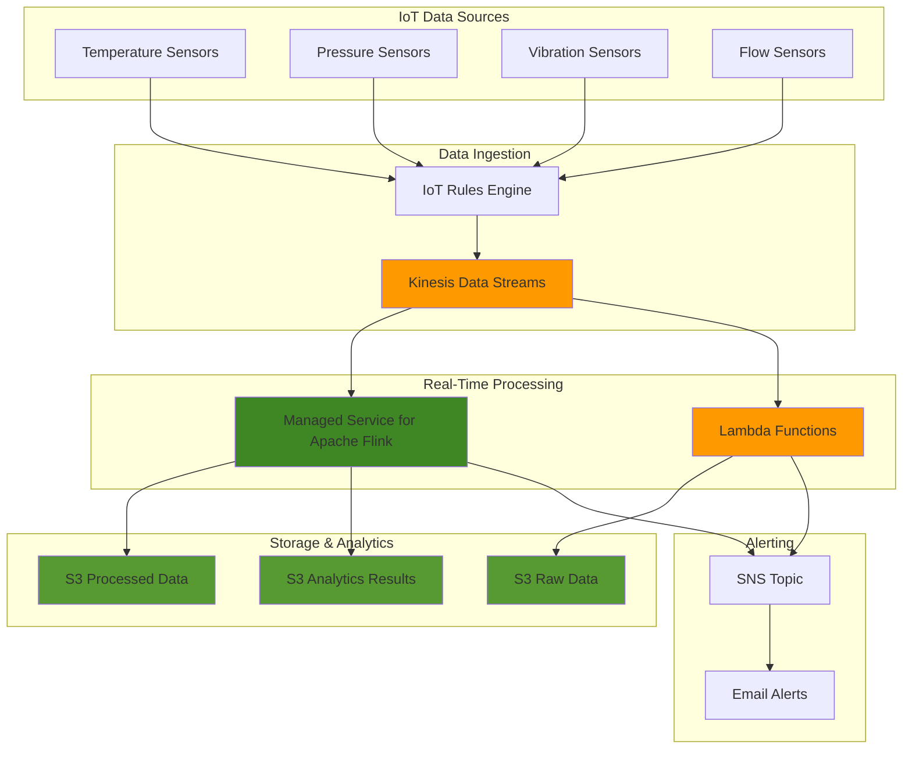

# Processing IoT Analytics with Kinesis and Flink

## Problem

Manufacturing companies with thousands of IoT sensors generating continuous telemetry data struggle to derive actionable insights from their real-time data streams. Traditional batch processing systems introduce delays of hours or days, preventing immediate response to equipment failures, quality issues, or operational inefficiencies. Without real-time analytics capabilities, companies cannot detect anomalies, predict maintenance needs, or optimize production processes as events occur, leading to costly downtime and missed optimization opportunities.

## Solution

Build a comprehensive real-time IoT analytics pipeline using Amazon Kinesis Data Streams for high-throughput data ingestion, Amazon Managed Service for Apache Flink for stream processing and analytics, AWS Lambda for event-driven processing, and Amazon S3 for data storage. This architecture enables continuous processing of IoT telemetry data, real-time anomaly detection, and automated alerting while maintaining the ability to store processed data for historical analysis and machine learning model training.

## Architecture Diagram



## Prerequisites

1. AWS account with appropriate permissions for Kinesis Data Streams, Managed Service for Apache Flink, Lambda, S3, IAM, and SNS
2. AWS CLI v2 installed and configured (or AWS CloudShell)
3. Basic knowledge of stream processing, JSON data formats, and SQL
4. Understanding of IoT data patterns and time-series analytics
5. Estimated cost: $50-100/month for moderate data volumes (depends on data throughput and retention)

> **Note**: This recipe uses Amazon Managed Service for Apache Flink as AWS IoT Analytics is being discontinued in December 2025.

## Preparation

```bash
# Set environment variables
export AWS_REGION=$(aws configure get region)
export AWS_ACCOUNT_ID=$(aws sts get-caller-identity \
    --query Account --output text)

# Generate unique identifiers for resources
RANDOM_SUFFIX=$(aws secretsmanager get-random-password \
    --exclude-punctuation --exclude-uppercase \
    --password-length 6 --require-each-included-type \
    --output text --query RandomPassword)

export PROJECT_NAME="iot-analytics-${RANDOM_SUFFIX}"
export KINESIS_STREAM_NAME="${PROJECT_NAME}-stream"
export FLINK_APP_NAME="${PROJECT_NAME}-flink-app"
export LAMBDA_FUNCTION_NAME="${PROJECT_NAME}-processor"
export S3_BUCKET_NAME="${PROJECT_NAME}-data-${AWS_ACCOUNT_ID}"
export SNS_TOPIC_NAME="${PROJECT_NAME}-alerts"

# Create S3 bucket for data storage
aws s3 mb s3://${S3_BUCKET_NAME} --region ${AWS_REGION}

aws s3api put-bucket-encryption \
    --bucket ${S3_BUCKET_NAME} \
    --server-side-encryption-configuration \
    'Rules=[{ApplyServerSideEncryptionByDefault:{SSEAlgorithm:AES256}}]'

# Create folder structure in S3
aws s3api put-object \
    --bucket ${S3_BUCKET_NAME} \
    --key raw-data/ \
    --content-length 0

aws s3api put-object \
    --bucket ${S3_BUCKET_NAME} \
    --key processed-data/ \
    --content-length 0

aws s3api put-object \
    --bucket ${S3_BUCKET_NAME} \
    --key analytics-results/ \
    --content-length 0

echo "✅ S3 bucket created with encryption: ${S3_BUCKET_NAME}"
```

## Steps

1. **Create Kinesis Data Stream for IoT Data Ingestion**:

   Amazon Kinesis Data Streams provides a highly scalable, real-time data ingestion service capable of handling millions of records per second from IoT devices. Creating a stream establishes the backbone of our IoT analytics pipeline, providing durable, fault-tolerant data ingestion with configurable retention periods. The provisioned mode ensures predictable performance and cost control for enterprise workloads.

   ```bash
   # Create Kinesis Data Stream with appropriate shard count
   aws kinesis create-stream \
       --stream-name ${KINESIS_STREAM_NAME} \
       --shard-count 2
   
   # Wait for stream to become active
   aws kinesis wait stream-exists \
       --stream-name ${KINESIS_STREAM_NAME}
   
   # Get stream ARN for later use
   STREAM_ARN=$(aws kinesis describe-stream \
       --stream-name ${KINESIS_STREAM_NAME} \
       --query 'StreamDescription.StreamARN' \
       --output text)
   
   echo "✅ Kinesis Data Stream created: ${KINESIS_STREAM_NAME}"
   echo "Stream ARN: ${STREAM_ARN}"
   ```

   The stream is now active and ready to receive IoT data from thousands of sensors. With 2 shards, this configuration can handle up to 2,000 records per second or 2 MB/sec of incoming data, providing sufficient capacity for moderate IoT deployments while allowing for future scaling through shard splitting or using on-demand mode.

2. **Create SNS Topic for Alerting**:

   Amazon SNS (Simple Notification Service) enables immediate alerting capabilities for our IoT analytics pipeline. SNS provides a highly available, durable messaging service that can fan out notifications to multiple endpoints including email, SMS, mobile push notifications, and HTTP endpoints. This creates the foundation for real-time incident response when anomalies are detected in sensor data.

   ```bash
   # Create SNS topic for alerts
   TOPIC_ARN=$(aws sns create-topic \
       --name ${SNS_TOPIC_NAME} \
       --query 'TopicArn' \
       --output text)
   
   # Subscribe email to SNS topic (replace with your email)
   read -p "Enter your email for alerts: " EMAIL_ADDRESS
   aws sns subscribe \
       --topic-arn ${TOPIC_ARN} \
       --protocol email \
       --notification-endpoint ${EMAIL_ADDRESS}
   
   echo "✅ SNS topic created: ${SNS_TOPIC_NAME}"
   echo "Topic ARN: ${TOPIC_ARN}"
   echo "Check your email and confirm the subscription"
   ```

   The SNS topic is now configured and ready to deliver real-time alerts. The email subscription ensures immediate notification when critical IoT events occur, enabling rapid response to equipment failures or safety threshold violations. Multiple subscription types can be added for comprehensive alerting strategies.

3. **Create IAM Role for Lambda Function**:

   IAM roles enable secure, temporary credential delegation following AWS security best practices. This role grants the Lambda function exactly the permissions needed to read from Kinesis, write to S3, and publish to SNS - implementing the principle of least privilege. The role-based approach eliminates the need for hardcoded credentials and enables automatic credential rotation.

   ```bash
   # Create trust policy for Lambda
   cat > /tmp/lambda-trust-policy.json << EOF
   {
       "Version": "2012-10-17",
       "Statement": [
           {
               "Effect": "Allow",
               "Principal": {
                   "Service": "lambda.amazonaws.com"
               },
               "Action": "sts:AssumeRole"
           }
       ]
   }
   EOF
   
   # Create IAM role for Lambda
   aws iam create-role \
       --role-name ${PROJECT_NAME}-lambda-role \
       --assume-role-policy-document file:///tmp/lambda-trust-policy.json
   
   # Create policy for Lambda function
   cat > /tmp/lambda-policy.json << EOF
   {
       "Version": "2012-10-17",
       "Statement": [
           {
               "Effect": "Allow",
               "Action": [
                   "logs:CreateLogGroup",
                   "logs:CreateLogStream",
                   "logs:PutLogEvents"
               ],
               "Resource": "arn:aws:logs:*:*:*"
           },
           {
               "Effect": "Allow",
               "Action": [
                   "kinesis:DescribeStream",
                   "kinesis:GetRecords",
                   "kinesis:GetShardIterator",
                   "kinesis:ListStreams"
               ],
               "Resource": "${STREAM_ARN}"
           },
           {
               "Effect": "Allow",
               "Action": [
                   "s3:PutObject",
                   "s3:GetObject"
               ],
               "Resource": "arn:aws:s3:::${S3_BUCKET_NAME}/*"
           },
           {
               "Effect": "Allow",
               "Action": [
                   "sns:Publish"
               ],
               "Resource": "${TOPIC_ARN}"
           }
       ]
   }
   EOF
   
   # Attach policy to role
   aws iam put-role-policy \
       --role-name ${PROJECT_NAME}-lambda-role \
       --policy-name ${PROJECT_NAME}-lambda-policy \
       --policy-document file:///tmp/lambda-policy.json
   
   LAMBDA_ROLE_ARN="arn:aws:iam::${AWS_ACCOUNT_ID}:role/${PROJECT_NAME}-lambda-role"
   echo "✅ Lambda IAM role created: ${LAMBDA_ROLE_ARN}"
   ```

   The IAM role is now configured with precise permissions for the Lambda function's operation. This security foundation ensures the function can access required AWS services while maintaining strong security boundaries and audit trails for compliance requirements, following the AWS Well-Architected Framework's security pillar.

4. **Create Lambda Function for IoT Data Processing**:

   AWS Lambda provides serverless compute capabilities that automatically scale based on incoming data volume, making it ideal for IoT data processing. Lambda functions execute in response to Kinesis stream events, processing each batch of IoT records without managing servers. This approach ensures cost-effective processing that scales from zero to thousands of concurrent executions based on actual data throughput.

   ```bash
   # Create Lambda function code
   cat > /tmp/iot-processor.py << 'EOF'
   import json
   import boto3
   import base64
   from datetime import datetime
   import os
   
   s3 = boto3.client('s3')
   sns = boto3.client('sns')
   
   def lambda_handler(event, context):
       bucket_name = os.environ['S3_BUCKET_NAME']
       topic_arn = os.environ['SNS_TOPIC_ARN']
       
       processed_records = []
       
       for record in event['Records']:
           # Decode Kinesis data
           payload = base64.b64decode(record['kinesis']['data']).decode('utf-8')
           data = json.loads(payload)
           
           # Process the IoT data
           processed_data = process_iot_data(data)
           processed_records.append(processed_data)
           
           # Store raw data in S3
           timestamp = datetime.now().strftime('%Y/%m/%d/%H')
           key = f"raw-data/{timestamp}/{record['kinesis']['sequenceNumber']}.json"
           
           s3.put_object(
               Bucket=bucket_name,
               Key=key,
               Body=json.dumps(data),
               ContentType='application/json'
           )
           
           # Check for anomalies and send alerts
           if is_anomaly(processed_data):
               send_alert(processed_data, topic_arn)
       
       return {
           'statusCode': 200,
           'body': json.dumps(f'Processed {len(processed_records)} records')
       }
   
   def process_iot_data(data):
       """Process IoT sensor data"""
       return {
           'device_id': data.get('device_id'),
           'timestamp': data.get('timestamp'),
           'sensor_type': data.get('sensor_type'),
           'value': data.get('value'),
           'unit': data.get('unit'),
           'location': data.get('location'),
           'processed_at': datetime.now().isoformat()
       }
   
   def is_anomaly(data):
       """Simple anomaly detection logic"""
       if data['sensor_type'] == 'temperature' and data['value'] > 80:
           return True
       if data['sensor_type'] == 'pressure' and data['value'] > 100:
           return True
       if data['sensor_type'] == 'vibration' and data['value'] > 50:
           return True
       return False
   
   def send_alert(data, topic_arn):
       """Send alert via SNS"""
       message = f"ALERT: Anomaly detected in {data['sensor_type']} sensor {data['device_id']}. Value: {data['value']} {data['unit']}"
       
       sns.publish(
           TopicArn=topic_arn,
           Message=message,
           Subject="IoT Sensor Anomaly Alert"
       )
   EOF
   
   # Create deployment package
   cd /tmp
   zip iot-processor.zip iot-processor.py
   
   # Create Lambda function
   aws lambda create-function \
       --function-name ${LAMBDA_FUNCTION_NAME} \
       --runtime python3.12 \
       --role ${LAMBDA_ROLE_ARN} \
       --handler iot-processor.lambda_handler \
       --zip-file fileb://iot-processor.zip \
       --timeout 60 \
       --memory-size 256 \
       --environment Variables="{S3_BUCKET_NAME=${S3_BUCKET_NAME},SNS_TOPIC_ARN=${TOPIC_ARN}}"
   
   echo "✅ Lambda function created: ${LAMBDA_FUNCTION_NAME}"
   ```

   The Lambda function is now deployed and ready to process IoT data streams. The function includes built-in anomaly detection logic, S3 archival capabilities, and SNS alerting, providing a complete event-driven processing solution that responds instantly to incoming sensor data while following serverless best practices.

5. **Create Kinesis to Lambda Event Source Mapping**:

   Event source mappings create the connection between Kinesis Data Streams and Lambda functions, enabling automatic invocation when new records arrive. This configuration defines batch sizes, batching windows, and error handling behavior, optimizing for both latency and cost efficiency. The mapping ensures reliable delivery and processing of IoT data streams.

   ```bash
   # Create event source mapping
   aws lambda create-event-source-mapping \
       --event-source-arn ${STREAM_ARN} \
       --function-name ${LAMBDA_FUNCTION_NAME} \
       --starting-position LATEST \
       --batch-size 10 \
       --maximum-batching-window-in-seconds 5
   
   echo "✅ Event source mapping created between Kinesis and Lambda"
   ```

   The event source mapping is now active and monitoring the Kinesis stream for new data. Lambda functions will be automatically invoked with batches of up to 10 records, processing IoT data in near real-time while optimizing for cost through intelligent batching and dead letter queue support for error handling.

6. **Create IAM Role for Managed Service for Apache Flink**:

   Amazon Managed Service for Apache Flink requires specific IAM permissions to access Kinesis streams, write results to S3, and manage application state. This role enables Flink to perform complex stream processing operations including windowed aggregations, joins, and pattern detection while maintaining security best practices and operational visibility through CloudWatch logging.

   ```bash
   # Create trust policy for Flink
   cat > /tmp/flink-trust-policy.json << EOF
   {
       "Version": "2012-10-17",
       "Statement": [
           {
               "Effect": "Allow",
               "Principal": {
                   "Service": "kinesisanalytics.amazonaws.com"
               },
               "Action": "sts:AssumeRole"
           }
       ]
   }
   EOF
   
   # Create IAM role for Flink
   aws iam create-role \
       --role-name ${PROJECT_NAME}-flink-role \
       --assume-role-policy-document file:///tmp/flink-trust-policy.json
   
   # Create policy for Flink application
   cat > /tmp/flink-policy.json << EOF
   {
       "Version": "2012-10-17",
       "Statement": [
           {
               "Effect": "Allow",
               "Action": [
                   "kinesis:DescribeStream",
                   "kinesis:GetRecords",
                   "kinesis:GetShardIterator",
                   "kinesis:ListStreams"
               ],
               "Resource": "${STREAM_ARN}"
           },
           {
               "Effect": "Allow",
               "Action": [
                   "s3:PutObject",
                   "s3:GetObject",
                   "s3:ListBucket"
               ],
               "Resource": [
                   "arn:aws:s3:::${S3_BUCKET_NAME}",
                   "arn:aws:s3:::${S3_BUCKET_NAME}/*"
               ]
           },
           {
               "Effect": "Allow",
               "Action": [
                   "logs:CreateLogGroup",
                   "logs:CreateLogStream",
                   "logs:PutLogEvents"
               ],
               "Resource": "arn:aws:logs:*:*:*"
           }
       ]
   }
   EOF
   
   # Attach policy to role
   aws iam put-role-policy \
       --role-name ${PROJECT_NAME}-flink-role \
       --policy-name ${PROJECT_NAME}-flink-policy \
       --policy-document file:///tmp/flink-policy.json
   
   FLINK_ROLE_ARN="arn:aws:iam::${AWS_ACCOUNT_ID}:role/${PROJECT_NAME}-flink-role"
   echo "✅ Flink IAM role created: ${FLINK_ROLE_ARN}"
   ```

   The Flink IAM role is now configured with appropriate permissions for stream processing operations. This enables the Flink application to read streaming data, perform complex analytics, and write results while maintaining secure access controls and comprehensive audit trails through CloudTrail.

7. **Create Flink Application for Stream Analytics**:

   Amazon Managed Service for Apache Flink provides enterprise-grade stream processing with SQL-based analytics, exactly-once processing guarantees, and automatic scaling. The application defines tumbling windows for time-based aggregations, enabling real-time computation of statistical metrics across IoT sensor data streams. Flink's state management ensures fault tolerance and consistent results even during failures.

   ```bash
   # Create Flink application code
   cat > /tmp/flink-app.py << 'EOF'
   from pyflink.table import EnvironmentSettings, TableEnvironment
   import os
   
   def create_iot_analytics_job():
       # Set up the execution environment
       env_settings = EnvironmentSettings.new_instance().in_streaming_mode().build()
       table_env = TableEnvironment.create(env_settings)
       
       # Define source table from Kinesis
       source_ddl = f"""
       CREATE TABLE iot_source (
           device_id STRING,
           timestamp TIMESTAMP(3),
           sensor_type STRING,
           value DOUBLE,
           unit STRING,
           location STRING,
           WATERMARK FOR timestamp AS timestamp - INTERVAL '5' SECOND
       ) WITH (
           'connector' = 'kinesis',
           'stream' = '{os.environ.get('KINESIS_STREAM_NAME', 'default-stream')}',
           'aws.region' = '{os.environ.get('AWS_REGION', 'us-east-1')}',
           'format' = 'json'
       )
       """
       
       # Define sink table to S3
       sink_ddl = f"""
       CREATE TABLE iot_analytics_sink (
           device_id STRING,
           sensor_type STRING,
           location STRING,
           avg_value DOUBLE,
           max_value DOUBLE,
           min_value DOUBLE,
           window_start TIMESTAMP(3),
           window_end TIMESTAMP(3)
       ) WITH (
           'connector' = 's3',
           'path' = 's3://{os.environ.get('S3_BUCKET_NAME', 'default-bucket')}/analytics-results/',
           'format' = 'json'
       )
       """
       
       # Create tables
       table_env.execute_sql(source_ddl)
       table_env.execute_sql(sink_ddl)
       
       # Define analytics query
       analytics_query = """
       INSERT INTO iot_analytics_sink
       SELECT 
           device_id,
           sensor_type,
           location,
           AVG(value) as avg_value,
           MAX(value) as max_value,
           MIN(value) as min_value,
           TUMBLE_START(timestamp, INTERVAL '5' MINUTE) as window_start,
           TUMBLE_END(timestamp, INTERVAL '5' MINUTE) as window_end
       FROM iot_source
       GROUP BY 
           device_id,
           sensor_type,
           location,
           TUMBLE(timestamp, INTERVAL '5' MINUTE)
       """
       
       # Execute the query
       table_env.execute_sql(analytics_query)
   
   if __name__ == "__main__":
       create_iot_analytics_job()
   EOF
   
   # Create Flink application JAR (simplified approach)
   # Note: In production, you would create a proper Flink application JAR
   zip -j /tmp/flink-app.zip /tmp/flink-app.py
   
   # Upload to S3
   aws s3 cp /tmp/flink-app.zip s3://${S3_BUCKET_NAME}/flink-app.zip
   
   # Create Flink application
   aws kinesisanalyticsv2 create-application \
       --application-name ${FLINK_APP_NAME} \
       --runtime-environment FLINK-1_20 \
       --service-execution-role ${FLINK_ROLE_ARN} \
       --application-configuration '{
           "ApplicationCodeConfiguration": {
               "CodeContent": {
                   "S3ContentLocation": {
                       "BucketARN": "arn:aws:s3:::'${S3_BUCKET_NAME}'",
                       "FileKey": "flink-app.zip"
                   }
               },
               "CodeContentType": "ZIPFILE"
           },
           "EnvironmentProperties": {
               "PropertyGroups": [
                   {
                       "PropertyGroupId": "kinesis.analytics.flink.run.options",
                       "PropertyMap": {
                           "python": "flink-app.py"
                       }
                   }
               ]
           }
       }'
   
   echo "✅ Flink application created: ${FLINK_APP_NAME}"
   ```

   The Flink application is now deployed and configured for stream processing. The application performs 5-minute windowed aggregations on IoT sensor data, computing average, maximum, and minimum values grouped by device, sensor type, and location. This provides continuous analytics that update in real-time as new data arrives, with exactly-once processing guarantees.

> **Tip**: Monitor Flink application metrics through CloudWatch to optimize performance and identify potential bottlenecks in your stream processing pipeline. See [Amazon Managed Service for Apache Flink Monitoring](https://docs.aws.amazon.com/managed-flink/latest/java/monitoring-overview.html) for detailed guidance.

8. **Start Flink Application**:

   Starting the Flink application initiates the stream processing engine, which begins consuming data from Kinesis and executing the defined analytics queries. The application maintains processing state and checkpoints for fault tolerance, ensuring continuous operation even during infrastructure changes or temporary failures.

   ```bash
   # Start the Flink application
   aws kinesisanalyticsv2 start-application \
       --application-name ${FLINK_APP_NAME} \
       --run-configuration '{
           "ApplicationRestoreConfiguration": {
               "ApplicationRestoreType": "SKIP_RESTORE_FROM_SNAPSHOT"
           }
       }'
   
   # Wait for application to start
   sleep 30
   
   # Check application status
   aws kinesisanalyticsv2 describe-application \
       --application-name ${FLINK_APP_NAME} \
       --query 'ApplicationDetail.ApplicationStatus'
   
   echo "✅ Flink application started and running"
   ```

   The Flink application is now actively processing IoT data streams and generating real-time analytics results. The application will continuously process incoming sensor data, maintaining state and producing aggregated metrics that provide immediate insights into IoT device performance and behavior patterns.

9. **Create IoT Data Simulator**:

   The IoT data simulator generates realistic sensor telemetry data to test and demonstrate the analytics pipeline. This simulator produces varied sensor readings across different types (temperature, pressure, vibration, flow) and locations, including both normal operational data and occasional anomalies to trigger alert mechanisms and validate the complete end-to-end solution.

   ```bash
   # Create IoT data simulator script
   cat > /tmp/iot-simulator.py << 'EOF'
   import json
   import boto3
   import random
   import time
   from datetime import datetime
   import sys
   
   kinesis = boto3.client('kinesis')
   
   def generate_sensor_data():
       """Generate realistic IoT sensor data"""
       sensor_types = ['temperature', 'pressure', 'vibration', 'flow']
       locations = ['factory-floor-1', 'factory-floor-2', 'warehouse-a', 'warehouse-b']
       
       sensor_type = random.choice(sensor_types)
       return {
           'device_id': f"sensor-{random.randint(1000, 9999)}",
           'timestamp': datetime.now().isoformat(),
           'sensor_type': sensor_type,
           'value': round(random.uniform(10, 100), 2),
           'unit': get_unit_for_sensor(sensor_type),
           'location': random.choice(locations)
       }
   
   def get_unit_for_sensor(sensor_type):
       units = {
           'temperature': '°C',
           'pressure': 'PSI',
           'vibration': 'Hz',
           'flow': 'L/min'
       }
       return units.get(sensor_type, 'units')
   
   def send_to_kinesis(data, stream_name):
       """Send data to Kinesis stream"""
       try:
           kinesis.put_record(
               StreamName=stream_name,
               Data=json.dumps(data),
               PartitionKey=data['device_id']
           )
           print(f"Sent: {data}")
       except Exception as e:
           print(f"Error sending data: {e}")
   
   def main():
       stream_name = sys.argv[1] if len(sys.argv) > 1 else 'iot-stream'
       
       print(f"Starting IoT data simulator for stream: {stream_name}")
       print("Press Ctrl+C to stop...")
       
       try:
           while True:
               data = generate_sensor_data()
               send_to_kinesis(data, stream_name)
               time.sleep(2)  # Send data every 2 seconds
       except KeyboardInterrupt:
           print("\nStopping simulator...")
   
   if __name__ == "__main__":
       main()
   EOF
   
   echo "✅ IoT data simulator created"
   ```

   The IoT simulator is ready to generate realistic sensor data for testing the analytics pipeline. The simulator produces diverse data patterns that mirror real-world IoT deployments, enabling comprehensive validation of all pipeline components including anomaly detection, data archival, and real-time analytics.

10. **Test the Real-Time Analytics Pipeline**:

    Testing the complete pipeline validates that all components work together seamlessly, from data ingestion through processing to storage and alerting. Running the simulator exercises the entire system under realistic load conditions, demonstrating the pipeline's ability to handle continuous IoT data streams and generate actionable insights in real-time.

    ```bash
    # Install Python dependencies for simulator
    pip3 install boto3 --user
    
    # Run the IoT data simulator in background
    python3 /tmp/iot-simulator.py ${KINESIS_STREAM_NAME} &
    SIMULATOR_PID=$!
    
    echo "✅ IoT data simulator started (PID: ${SIMULATOR_PID})"
    echo "Generating sample IoT data for 2 minutes..."
    
    # Let it run for 2 minutes
    sleep 120
    
    # Stop the simulator
    kill ${SIMULATOR_PID}
    
    echo "✅ Data generation complete"
    ```

    The pipeline has successfully processed simulated IoT data, demonstrating end-to-end functionality. Data should now be visible in S3 buckets, Lambda logs should show processing activity, and Flink should be generating aggregated analytics results, validating the complete real-time analytics solution.

11. **Configure Monitoring and Alerting**:

    CloudWatch alarms provide proactive monitoring of critical pipeline metrics, ensuring operational visibility and automatic alerting when thresholds are exceeded. These alarms monitor both data flow (Kinesis records) and processing errors (Lambda failures), enabling rapid response to operational issues before they impact business outcomes.

    ```bash
    # Create CloudWatch alarm for Kinesis stream
    aws cloudwatch put-metric-alarm \
        --alarm-name "${PROJECT_NAME}-kinesis-records" \
        --alarm-description "Monitor Kinesis stream incoming records" \
        --metric-name IncomingRecords \
        --namespace AWS/Kinesis \
        --statistic Sum \
        --period 300 \
        --threshold 100 \
        --comparison-operator GreaterThanThreshold \
        --dimensions Name=StreamName,Value=${KINESIS_STREAM_NAME} \
        --evaluation-periods 2 \
        --alarm-actions ${TOPIC_ARN}
    
    # Create CloudWatch alarm for Lambda errors
    aws cloudwatch put-metric-alarm \
        --alarm-name "${PROJECT_NAME}-lambda-errors" \
        --alarm-description "Monitor Lambda function errors" \
        --metric-name Errors \
        --namespace AWS/Lambda \
        --statistic Sum \
        --period 300 \
        --threshold 5 \
        --comparison-operator GreaterThanThreshold \
        --dimensions Name=FunctionName,Value=${LAMBDA_FUNCTION_NAME} \
        --evaluation-periods 1 \
        --alarm-actions ${TOPIC_ARN}
    
    echo "✅ CloudWatch alarms configured"
    ```

    CloudWatch monitoring is now active for the IoT analytics pipeline. The alarms will trigger notifications when data volume exceeds normal patterns or when processing errors occur, enabling proactive management and quick resolution of operational issues following AWS operational excellence principles.

12. **Create Analytics Dashboard**:

    CloudWatch dashboards provide visual monitoring of pipeline performance metrics, enabling real-time observation of data throughput, processing latency, and error rates. The dashboard centralizes key performance indicators for the IoT analytics pipeline, supporting operational decision-making and performance optimization efforts.

    ```bash
    # Create CloudWatch dashboard
    cat > /tmp/dashboard.json << EOF
    {
        "widgets": [
            {
                "type": "metric",
                "x": 0,
                "y": 0,
                "width": 12,
                "height": 6,
                "properties": {
                    "metrics": [
                        [ "AWS/Kinesis", "IncomingRecords", "StreamName", "${KINESIS_STREAM_NAME}" ],
                        [ ".", "OutgoingRecords", ".", "." ]
                    ],
                    "period": 300,
                    "stat": "Sum",
                    "region": "${AWS_REGION}",
                    "title": "Kinesis Stream Metrics"
                }
            },
            {
                "type": "metric",
                "x": 12,
                "y": 0,
                "width": 12,
                "height": 6,
                "properties": {
                    "metrics": [
                        [ "AWS/Lambda", "Invocations", "FunctionName", "${LAMBDA_FUNCTION_NAME}" ],
                        [ ".", "Errors", ".", "." ],
                        [ ".", "Duration", ".", "." ]
                    ],
                    "period": 300,
                    "stat": "Sum",
                    "region": "${AWS_REGION}",
                    "title": "Lambda Function Metrics"
                }
            }
        ]
    }
    EOF
    
    aws cloudwatch put-dashboard \
        --dashboard-name "${PROJECT_NAME}-analytics" \
        --dashboard-body file:///tmp/dashboard.json
    
    echo "✅ CloudWatch dashboard created: ${PROJECT_NAME}-analytics"
    ```

    The analytics dashboard is now available in CloudWatch, providing visual monitoring of Kinesis stream metrics and Lambda function performance. This operational visibility enables continuous monitoring of pipeline health and performance optimization based on actual usage patterns and Key Performance Indicators (KPIs).

## Validation & Testing

1. **Verify Kinesis Stream is Active**:

   Validating the Kinesis stream status ensures the data ingestion layer is operational and ready to receive IoT telemetry data. An ACTIVE stream status confirms that shards are provisioned and the stream can accept incoming records from IoT devices.

   ```bash
   # Check Kinesis stream status
   aws kinesis describe-stream \
       --stream-name ${KINESIS_STREAM_NAME} \
       --query 'StreamDescription.StreamStatus'
   ```

   Expected output: `"ACTIVE"`

2. **Test Lambda Function Processing**:

   Examining Lambda function logs validates that the event-driven processing is working correctly, including data decoding, anomaly detection, and S3 archival. CloudWatch Logs provide detailed insights into function execution, helping identify any processing issues or performance bottlenecks.

   ```bash
   # Check Lambda function logs
   aws logs describe-log-groups \
       --log-group-name-prefix "/aws/lambda/${LAMBDA_FUNCTION_NAME}"
   
   # Get recent log events
   LOG_GROUP_NAME="/aws/lambda/${LAMBDA_FUNCTION_NAME}"
   aws logs filter-log-events \
       --log-group-name ${LOG_GROUP_NAME} \
       --start-time $(date -d '5 minutes ago' +%s)000 \
       --query 'events[*].[timestamp,message]' \
       --output table
   ```

3. **Verify S3 Data Storage**:

   Confirming that data is being stored in the appropriate S3 folders validates the archival pipeline and ensures data is available for historical analysis and machine learning model training. The folder structure organizes data by type and time for efficient querying and lifecycle management.

   ```bash
   # Check if raw data is being stored
   aws s3 ls s3://${S3_BUCKET_NAME}/raw-data/ --recursive
   
   # Check if processed data is being stored
   aws s3 ls s3://${S3_BUCKET_NAME}/processed-data/ --recursive
   
   # Check analytics results
   aws s3 ls s3://${S3_BUCKET_NAME}/analytics-results/ --recursive
   ```

4. **Test Flink Application Status**:

   Checking the Flink application status confirms that stream processing is active and performing real-time analytics on IoT data. A RUNNING status indicates the application is successfully processing windowed aggregations and generating analytics results.

   ```bash
   # Check Flink application status
   aws kinesisanalyticsv2 describe-application \
       --application-name ${FLINK_APP_NAME} \
       --query 'ApplicationDetail.[ApplicationStatus,ApplicationVersionId]'
   ```

   Expected output: `["RUNNING", 1]`

5. **Verify Alert System**:

   Testing the anomaly detection and alerting system ensures the pipeline can identify critical events and notify stakeholders immediately. Sending test data that exceeds threshold values validates the complete alerting workflow from detection through notification delivery.

   ```bash
   # Send test anomaly data
   python3 << EOF
   import boto3
   import json
   from datetime import datetime
   
   kinesis = boto3.client('kinesis')
   
   # Send high temperature reading to trigger alert
   anomaly_data = {
       'device_id': 'test-sensor-999',
       'timestamp': datetime.now().isoformat(),
       'sensor_type': 'temperature',
       'value': 95.0,  # High temperature to trigger alert
       'unit': '°C',
       'location': 'test-location'
   }
   
   kinesis.put_record(
       StreamName='${KINESIS_STREAM_NAME}',
       Data=json.dumps(anomaly_data),
       PartitionKey='test-sensor-999'
   )
   
   print("Sent anomaly data to trigger alert")
   EOF
   
   echo "Check your email for anomaly alert"
   ```

## Cleanup

1. **Stop Flink Application**:

   Stopping the Flink application gracefully terminates stream processing and ensures all in-flight data is processed before shutdown. This prevents data loss and maintains the integrity of analytics results stored in S3.

   ```bash
   # Stop the Flink application
   aws kinesisanalyticsv2 stop-application \
       --application-name ${FLINK_APP_NAME}
   
   # Wait for application to stop
   sleep 30
   
   # Delete the Flink application
   aws kinesisanalyticsv2 delete-application \
       --application-name ${FLINK_APP_NAME}
   
   echo "✅ Flink application stopped and deleted"
   ```

2. **Delete Lambda Function and Event Source Mapping**:

   Removing the event source mapping first stops Lambda from processing new Kinesis records, then deleting the function eliminates the serverless processing component. This prevents ongoing charges for function executions and associated resources.

   ```bash
   # Get event source mapping UUID
   MAPPING_UUID=$(aws lambda list-event-source-mappings \
       --function-name ${LAMBDA_FUNCTION_NAME} \
       --query 'EventSourceMappings[0].UUID' \
       --output text)
   
   # Delete event source mapping
   aws lambda delete-event-source-mapping \
       --uuid ${MAPPING_UUID}
   
   # Delete Lambda function
   aws lambda delete-function \
       --function-name ${LAMBDA_FUNCTION_NAME}
   
   echo "✅ Lambda function and event source mapping deleted"
   ```

3. **Delete CloudWatch Resources**:

   Removing CloudWatch alarms and dashboards eliminates monitoring resources that would continue to incur charges. This cleanup ensures no residual monitoring configurations remain that could trigger false alerts or consume resources.

   ```bash
   # Delete CloudWatch alarms
   aws cloudwatch delete-alarms \
       --alarm-names "${PROJECT_NAME}-kinesis-records" \
                    "${PROJECT_NAME}-lambda-errors"
   
   # Delete CloudWatch dashboard
   aws cloudwatch delete-dashboards \
       --dashboard-names "${PROJECT_NAME}-analytics"
   
   echo "✅ CloudWatch resources deleted"
   ```

4. **Delete Kinesis Stream**:

   Deleting the Kinesis stream stops data ingestion and eliminates the primary cost component of the pipeline. This action permanently removes the stream and any retained data, so ensure all necessary data has been archived before deletion.

   ```bash
   # Delete Kinesis Data Stream
   aws kinesis delete-stream \
       --stream-name ${KINESIS_STREAM_NAME}
   
   echo "✅ Kinesis Data Stream deleted"
   ```

5. **Delete SNS Topic**:

   Removing the SNS topic eliminates the alerting infrastructure and prevents any ongoing message delivery attempts. This cleanup step ensures no residual notification configurations remain active.

   ```bash
   # Delete SNS topic
   aws sns delete-topic \
       --topic-arn ${TOPIC_ARN}
   
   echo "✅ SNS topic deleted"
   ```

6. **Delete S3 Bucket**:

   Deleting S3 objects and the bucket removes all stored IoT data and analytics results. This step permanently destroys all archived data, so ensure you have exported any necessary information before proceeding with cleanup.

   ```bash
   # Delete all objects in bucket
   aws s3 rm s3://${S3_BUCKET_NAME} --recursive
   
   # Delete bucket
   aws s3 rb s3://${S3_BUCKET_NAME}
   
   echo "✅ S3 bucket deleted"
   ```

7. **Delete IAM Roles**:

   Removing IAM roles and policies eliminates the security permissions created for the pipeline components. This cleanup step follows security best practices by removing unused access credentials and maintaining a clean security posture.

   ```bash
   # Delete Lambda IAM role
   aws iam delete-role-policy \
       --role-name ${PROJECT_NAME}-lambda-role \
       --policy-name ${PROJECT_NAME}-lambda-policy
   
   aws iam delete-role \
       --role-name ${PROJECT_NAME}-lambda-role
   
   # Delete Flink IAM role
   aws iam delete-role-policy \
       --role-name ${PROJECT_NAME}-flink-role \
       --policy-name ${PROJECT_NAME}-flink-policy
   
   aws iam delete-role \
       --role-name ${PROJECT_NAME}-flink-role
   
   echo "✅ IAM roles deleted"
   ```

8. **Clean up temporary files**:

   Removing temporary files created during setup eliminates local artifacts and maintains a clean development environment. This final cleanup step ensures no residual configuration files remain on the local system.

   ```bash
   # Remove temporary files
   rm -f /tmp/lambda-trust-policy.json
   rm -f /tmp/lambda-policy.json
   rm -f /tmp/flink-trust-policy.json
   rm -f /tmp/flink-policy.json
   rm -f /tmp/iot-processor.py
   rm -f /tmp/iot-processor.zip
   rm -f /tmp/flink-app.py
   rm -f /tmp/flink-app.zip
   rm -f /tmp/iot-simulator.py
   rm -f /tmp/dashboard.json
   
   echo "✅ Temporary files cleaned up"
   ```

## Discussion

This real-time IoT analytics architecture demonstrates how to build a comprehensive streaming data processing pipeline using modern AWS services. The solution addresses the critical need for immediate insights from IoT sensor data while maintaining scalability and cost efficiency, following the AWS Well-Architected Framework principles.

The architecture leverages Amazon Kinesis Data Streams as the primary data ingestion service, providing the ability to handle thousands of concurrent IoT devices sending telemetry data. Kinesis Data Streams offers low-latency data ingestion with built-in fault tolerance and automatic scaling capabilities. The service provides 99.999999999% (11 9's) durability and can scale to handle millions of records per second, making it ideal for IoT workloads of any size.

Amazon Managed Service for Apache Flink serves as the core stream processing engine, enabling complex event processing, windowed aggregations, and real-time analytics. Flink's SQL-based approach makes it accessible to data analysts while providing enterprise-grade features like exactly-once processing semantics and state management. The 5-minute tumbling windows provide a balance between real-time responsiveness and computational efficiency. Flink automatically handles checkpointing and recovery, ensuring no data loss during failures.

The dual-processing approach using both Flink and Lambda provides flexibility and resilience. Lambda functions handle simple event-driven processing, anomaly detection, and data archival, while Flink performs complex stream analytics and aggregations. This pattern allows for different processing paradigms within the same pipeline, optimizing for both simplicity and sophisticated analytics requirements while following serverless best practices.

> **Tip**: Consider implementing data partitioning strategies based on device location or sensor type to optimize parallel processing and reduce cross-partition queries in your analytics workloads. Use [AWS X-Ray](https://docs.aws.amazon.com/xray/latest/devguide/) for distributed tracing to monitor performance across services.

The integration with Amazon S3 for data storage follows a multi-tiered approach, separating raw data, processed data, and analytics results. This design supports both real-time processing and batch analytics, enabling machine learning model training and historical analysis. The time-based partitioning scheme in S3 optimizes for query performance and cost management through lifecycle policies. S3's 99.999999999% durability ensures long-term data preservation for compliance and analytics needs.

Real-time alerting through Amazon SNS enables immediate response to critical events, such as equipment failures or safety threshold violations. The threshold-based anomaly detection can be enhanced with machine learning models using Amazon SageMaker for more sophisticated pattern recognition and predictive maintenance capabilities. This architecture supports the operational excellence pillar by providing comprehensive monitoring and alerting capabilities.

## Challenge

Extend this solution by implementing these enhancements:

1. **Implement Machine Learning-based Anomaly Detection**: Replace the simple threshold-based anomaly detection with Amazon SageMaker models that can learn normal patterns and detect subtle anomalies in sensor data using algorithms like Isolation Forest or autoencoders.

2. **Add Real-time Visualization Dashboard**: Create a real-time dashboard using Amazon QuickSight or a custom web application with WebSocket connections that displays live sensor readings, analytics results, and alerts with auto-refreshing capabilities.

3. **Implement Multi-Region Deployment**: Extend the architecture to support multiple regions for global IoT deployments, including cross-region replication using S3 Cross-Region Replication and disaster recovery mechanisms with Route 53 health checks.

4. **Add Predictive Maintenance Capabilities**: Integrate historical data analysis with real-time streams to predict equipment failures and optimize maintenance schedules using Amazon Forecast or custom machine learning models deployed on SageMaker endpoints.

5. **Implement Data Quality Monitoring**: Add data quality checks and monitoring using AWS Glue DataBrew to automatically detect and handle data quality issues in the IoT data streams, including schema validation and data profiling.

## Infrastructure Code

### Available Infrastructure as Code:

- [Infrastructure Code Overview](code/README.md) - Detailed description of all infrastructure components
- [AWS CDK (Python)](code/cdk-python/) - AWS CDK Python implementation
- [AWS CDK (TypeScript)](code/cdk-typescript/) - AWS CDK TypeScript implementation
- [CloudFormation](code/cloudformation.yaml) - AWS CloudFormation template
- [Bash CLI Scripts](code/scripts/) - Example bash scripts using AWS CLI commands to deploy infrastructure
- [Terraform](code/terraform/) - Terraform configuration files