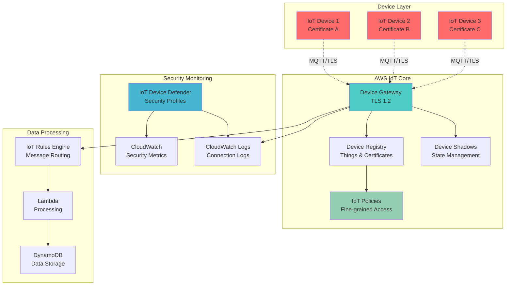

# IoT Certificate Security with X.509 Authentication

## Problem

Manufacturing companies deploying industrial IoT sensors across multiple production facilities face critical security challenges when managing thousands of connected devices. Without proper device authentication and authorization controls, these organizations risk unauthorized access to sensitive operational data, device hijacking, and potential safety incidents. Traditional security approaches using shared keys or passwords are inadequate for large-scale IoT deployments, creating security vulnerabilities that can compromise entire industrial control systems and expose confidential production metrics.

## Solution

This solution implements a comprehensive IoT security framework using AWS IoT Core's X.509 certificate-based authentication combined with fine-grained security policies. The approach establishes individual device identities through unique certificates, implements least-privilege access controls through IoT policies, and provides continuous security monitoring through AWS IoT Device Defender. This architecture ensures secure device onboarding, encrypted communication, and policy-based authorization while maintaining operational scalability.

## Architecture Diagram



## Prerequisites

1. AWS account with appropriate permissions for IoT Core, IAM, and CloudWatch
2. AWS CLI v2 installed and configured (or AWS CloudShell)
3. Understanding of X.509 certificates and public key infrastructure (PKI)
4. Basic knowledge of MQTT protocol and JSON policy documents
5. Familiarity with IoT security concepts and threat models
6. Estimated cost: $10-15 per month for testing (IoT messages, CloudWatch logs, Device Defender)

> **Note**: This recipe creates production-ready security configurations that should be carefully reviewed before deployment.

## Preparation

```bash
# Set environment variables
export AWS_REGION=$(aws configure get region)
export AWS_ACCOUNT_ID=$(aws sts get-caller-identity \
    --query Account --output text)

# Generate unique identifiers for resources
RANDOM_SUFFIX=$(aws secretsmanager get-random-password \
    --exclude-punctuation --exclude-uppercase \
    --password-length 6 --require-each-included-type \
    --output text --query RandomPassword)

export PROJECT_NAME="iot-security-demo"
export THING_TYPE_NAME="IndustrialSensor"
export DEVICE_PREFIX="sensor"

# Create local directory for certificates
mkdir -p ./certificates

# Enable IoT logging for security monitoring
aws iot set-v2-logging-options \
    --role-arn arn:aws:iam::${AWS_ACCOUNT_ID}:role/IoTLoggingRole \
    --default-log-level ERROR || true

echo "✅ Environment prepared for IoT security implementation"
```

## Steps

1. **Create Thing Type and Security Policies**:

   Thing types categorize devices with similar characteristics and security requirements. IoT policies define the specific permissions each device certificate can access, implementing the principle of least privilege for IoT device authorization.

   ```bash
   # Create thing type for industrial sensors
   aws iot create-thing-type \
       --thing-type-name ${THING_TYPE_NAME} \
       --thing-type-description "Industrial IoT sensors with security controls"
   
   # Create restrictive IoT policy for sensors
   cat > sensor-policy.json << 'EOF'
   {
       "Version": "2012-10-17",
       "Statement": [
           {
               "Effect": "Allow",
               "Action": "iot:Connect",
               "Resource": "arn:aws:iot:*:*:client/${iot:Connection.Thing.ThingName}",
               "Condition": {
                   "Bool": {
                       "iot:Connection.Thing.IsAttached": "true"
                   }
               }
           },
           {
               "Effect": "Allow",
               "Action": "iot:Publish",
               "Resource": [
                   "arn:aws:iot:*:*:topic/sensors/${iot:Connection.Thing.ThingName}/telemetry",
                   "arn:aws:iot:*:*:topic/sensors/${iot:Connection.Thing.ThingName}/status"
               ]
           },
           {
               "Effect": "Allow",
               "Action": "iot:Subscribe",
               "Resource": [
                   "arn:aws:iot:*:*:topicfilter/sensors/${iot:Connection.Thing.ThingName}/commands",
                   "arn:aws:iot:*:*:topicfilter/sensors/${iot:Connection.Thing.ThingName}/config"
               ]
           },
           {
               "Effect": "Allow",
               "Action": "iot:Receive",
               "Resource": [
                   "arn:aws:iot:*:*:topic/sensors/${iot:Connection.Thing.ThingName}/commands",
                   "arn:aws:iot:*:*:topic/sensors/${iot:Connection.Thing.ThingName}/config"
               ]
           },
           {
               "Effect": "Allow",
               "Action": [
                   "iot:UpdateThingShadow",
                   "iot:GetThingShadow"
               ],
               "Resource": "arn:aws:iot:*:*:thing/${iot:Connection.Thing.ThingName}"
           }
       ]
   }
   EOF
   
   # Create the restrictive IoT policy
   aws iot create-policy \
       --policy-name "RestrictiveSensorPolicy" \
       --policy-document file://sensor-policy.json
   
   echo "✅ Thing type and security policies created"
   ```

   > **Note**: IoT policy variables like `${iot:Connection.Thing.ThingName}` enable dynamic permissions based on device identity. This ensures each device can only access its own topics and resources. Review the [AWS IoT policy variables documentation](https://docs.aws.amazon.com/iot/latest/developerguide/iot-policy-variables.html) for additional dynamic authorization options.

2. **Create Multiple IoT Devices with Certificates**:

   Each IoT device requires a unique X.509 certificate for authentication, establishing cryptographic identity that enables secure communication with AWS IoT Core. This step provisions multiple devices with individual certificates, implementing the foundational security layer that prevents unauthorized access and enables device-specific authorization policies. Understanding certificate-based authentication is crucial for implementing enterprise-grade IoT security at scale.

   ```bash
   # Function to create device with certificate
   create_iot_device() {
       local device_id=$1
       local thing_name="${DEVICE_PREFIX}-${device_id}"
       
       echo "Creating device: ${thing_name}"
       
       # Create IoT thing
       aws iot create-thing \
           --thing-name ${thing_name} \
           --thing-type-name ${THING_TYPE_NAME} \
           --attribute-payload "attributes={location=factory-${device_id},deviceType=temperature-sensor,firmwareVersion=1.0.0}"
       
       # Create keys and certificate
       local cert_output=$(aws iot create-keys-and-certificate \
           --set-as-active \
           --certificate-pem-outfile "./certificates/${thing_name}.cert.pem" \
           --public-key-outfile "./certificates/${thing_name}.public.key" \
           --private-key-outfile "./certificates/${thing_name}.private.key")
       
       # Extract certificate ARN
       local cert_arn=$(echo ${cert_output} | grep -o 'arn:aws:iot:[^"]*')
       
       # Attach policy to certificate
       aws iot attach-policy \
           --policy-name "RestrictiveSensorPolicy" \
           --target ${cert_arn}
       
       # Attach thing to certificate
       aws iot attach-thing-principal \
           --thing-name ${thing_name} \
           --principal ${cert_arn}
       
       echo "✅ Device ${thing_name} created with certificate"
   }
   
   # Create 3 demo devices
   for i in {001..003}; do
       create_iot_device $i
   done
   ```

   The device creation process establishes secure identities for each IoT device by generating unique cryptographic certificates and associating them with device metadata. This creates the foundation for all subsequent security policies and monitoring capabilities, ensuring each device has a verifiable identity within the AWS IoT ecosystem.

   > **Warning**: Store device certificates and private keys securely. In production environments, consider using hardware security modules (HSMs) or secure element chips for key storage. Never transmit private keys over unsecured channels or store them in plain text.

3. **Configure Device Defender Security Profiles**:

   AWS IoT Device Defender provides continuous security monitoring by establishing behavioral baselines for IoT devices and detecting anomalies that may indicate security threats. Security profiles define specific metrics and thresholds that trigger alerts when devices exhibit unusual behavior patterns, enabling proactive threat detection and automated incident response. This monitoring layer is essential for maintaining fleet-wide security visibility and compliance.

   ```bash
   # Create security profile for anomaly detection
   cat > security-profile.json << 'EOF'
   [
       {
           "name": "ExcessiveConnections",
           "metric": "aws:num-connections",
           "criteria": {
               "comparisonOperator": "greater-than",
               "value": {
                   "count": 3
               },
               "consecutiveDatapointsToAlarm": 2,
               "consecutiveDatapointsToClear": 2
           }
       },
       {
           "name": "UnauthorizedOperations",
           "metric": "aws:num-authorization-failures",
           "criteria": {
               "comparisonOperator": "greater-than",
               "value": {
                   "count": 5
               },
               "durationSeconds": 300,
               "consecutiveDatapointsToAlarm": 1,
               "consecutiveDatapointsToClear": 1
           }
       },
       {
           "name": "MessageSizeAnomaly",
           "metric": "aws:message-byte-size",
           "criteria": {
               "comparisonOperator": "greater-than",
               "value": {
                   "count": 1024
               },
               "consecutiveDatapointsToAlarm": 3,
               "consecutiveDatapointsToClear": 3
           }
       }
   ]
   EOF
   
   # Create Device Defender security profile
   aws iot create-security-profile \
       --security-profile-name "IndustrialSensorSecurity" \
       --security-profile-description "Security monitoring for industrial IoT sensors" \
       --behaviors file://security-profile.json
   
   # Attach security profile to thing group (create group first)
   aws iot create-thing-group \
       --thing-group-name "IndustrialSensors" \
       --thing-group-properties "thingGroupDescription=Industrial sensor devices"
   
   # Add devices to thing group
   for i in {001..003}; do
       aws iot add-thing-to-thing-group \
           --thing-group-name "IndustrialSensors" \
           --thing-name "${DEVICE_PREFIX}-${i}"
   done
   
   # Attach security profile to thing group
   aws iot attach-security-profile \
       --security-profile-name "IndustrialSensorSecurity" \
       --security-profile-target-arn "arn:aws:iot:${AWS_REGION}:${AWS_ACCOUNT_ID}:thinggroup/IndustrialSensors"
   
   echo "✅ Device Defender security profiles configured"
   ```

   Device Defender security profiles are now actively monitoring all devices in the IndustrialSensors thing group. The configured behavioral rules will automatically detect connection anomalies, authorization failures, and unusual message patterns, providing real-time security insights and enabling rapid response to potential threats.

   > **Tip**: Security profiles should be tailored to specific device types and operational patterns. Start with conservative thresholds and adjust based on observed device behavior. Consider creating different profiles for development, staging, and production environments to avoid false positives during testing.

4. **Set Up CloudWatch Monitoring and Alerts**:

   CloudWatch integration provides centralized logging and metrics collection for IoT security events, enabling comprehensive visibility into device behavior and security incidents. This monitoring infrastructure captures authentication failures, connection patterns, and operational metrics, creating an audit trail essential for security analysis and compliance reporting. The dashboard and alerting capabilities enable operations teams to respond quickly to security threats.

   ```bash
   # Create CloudWatch log group for IoT connections
   aws logs create-log-group \
       --log-group-name "/aws/iot/security-events" \
       --retention-in-days 30
   
   # Create CloudWatch alarms for security events
   aws cloudwatch put-metric-alarm \
       --alarm-name "IoT-Unauthorized-Connections" \
       --alarm-description "Alert on unauthorized IoT connection attempts" \
       --metric-name "aws:num-authorization-failures" \
       --namespace "AWS/IoT" \
       --statistic "Sum" \
       --period 300 \
       --threshold 5 \
       --comparison-operator "GreaterThanThreshold" \
       --evaluation-periods 2 \
       --alarm-actions "arn:aws:sns:${AWS_REGION}:${AWS_ACCOUNT_ID}:iot-security-alerts" \
       --treat-missing-data "notBreaching" || true
   
   # Create CloudWatch dashboard for IoT security
   cat > iot-security-dashboard.json << EOF
   {
       "widgets": [
           {
               "type": "metric",
               "properties": {
                   "metrics": [
                       ["AWS/IoT", "Connect.Success"],
                       ["AWS/IoT", "Connect.AuthError"],
                       ["AWS/IoT", "Connect.ClientError"]
                   ],
                   "period": 300,
                   "stat": "Sum",
                   "region": "${AWS_REGION}",
                   "title": "IoT Connection Metrics"
               }
           },
           {
               "type": "metric",
               "properties": {
                   "metrics": [
                       ["AWS/IoT", "PublishIn.Success"],
                       ["AWS/IoT", "PublishIn.AuthError"],
                       ["AWS/IoT", "Subscribe.Success"],
                       ["AWS/IoT", "Subscribe.AuthError"]
                   ],
                   "period": 300,
                   "stat": "Sum",
                   "region": "${AWS_REGION}",
                   "title": "IoT Message Metrics"
               }
           }
       ]
   }
   EOF
   
   aws cloudwatch put-dashboard \
       --dashboard-name "IoT-Security-Dashboard" \
       --dashboard-body file://iot-security-dashboard.json
   
   echo "✅ CloudWatch monitoring and alerts configured"
   ```

   CloudWatch monitoring is now capturing all IoT security events and providing real-time visibility through the security dashboard. The configured alarms will automatically trigger notifications for suspicious activities, while log aggregation enables forensic analysis of security incidents and compliance auditing.

5. **Create IoT Rules for Security Event Processing**:

   IoT Rules Engine enables automated processing of security events and integration with downstream security systems. This step creates the infrastructure for automated incident response, including Lambda functions for event processing and DynamoDB storage for security event history. Automated event processing ensures rapid response to security threats while maintaining detailed audit logs for compliance and forensic analysis.

   ```bash
   # Create Lambda function for security event processing
   cat > security-processor.py << 'EOF'
   import json
   import boto3
   import logging
   from datetime import datetime
   
   logger = logging.getLogger()
   logger.setLevel(logging.INFO)
   
   def lambda_handler(event, context):
       """Process IoT security events and take appropriate actions"""
       
       # Log the security event
       logger.info(f"Security event received: {json.dumps(event)}")
       
       # Extract device information
       device_id = event.get('clientId', 'unknown')
       event_type = event.get('eventType', 'unknown')
       
       # Example security actions
       if event_type == 'Connect.AuthError':
           logger.warning(f"Authentication failure for device: {device_id}")
           # Could trigger device quarantine or alert
       
       elif event_type == 'Publish.AuthError':
           logger.warning(f"Unauthorized publish attempt from device: {device_id}")
           # Could update device policy or disable device
       
       # Store event for analysis
       dynamodb = boto3.resource('dynamodb')
       table = dynamodb.Table('IoTSecurityEvents')
       
       try:
           table.put_item(
               Item={
                   'eventId': context.aws_request_id,
                   'deviceId': device_id,
                   'eventType': event_type,
                   'timestamp': datetime.utcnow().isoformat(),
                   'eventData': json.dumps(event)
               }
           )
       except Exception as e:
           logger.error(f"Failed to store security event: {str(e)}")
       
       return {
           'statusCode': 200,
           'body': json.dumps('Security event processed')
       }
   EOF
   
   # Create DynamoDB table for security events
   aws dynamodb create-table \
       --table-name IoTSecurityEvents \
       --attribute-definitions \
           AttributeName=eventId,AttributeType=S \
           AttributeName=deviceId,AttributeType=S \
       --key-schema \
           AttributeName=eventId,KeyType=HASH \
       --global-secondary-indexes \
           IndexName=DeviceIndex,KeySchema=[AttributeName=deviceId,KeyType=HASH],Projection={ProjectionType=ALL},ProvisionedThroughput={ReadCapacityUnits=5,WriteCapacityUnits=5} \
       --provisioned-throughput ReadCapacityUnits=5,WriteCapacityUnits=5
   
   # Wait for table to be created
   aws dynamodb wait table-exists --table-name IoTSecurityEvents
   
   echo "✅ Security event processing infrastructure created"
   ```

   Security event processing infrastructure is now operational, automatically capturing and storing all IoT security events for analysis. The Lambda function provides a foundation for automated incident response, while DynamoDB storage enables historical analysis and compliance reporting of security incidents.

6. **Implement Certificate Rotation Strategy**:

   Certificate rotation is critical for maintaining long-term security by regularly replacing device certificates before expiration. This proactive approach prevents service disruptions from expired certificates while reducing the window of exposure if certificates are compromised. The automated rotation strategy ensures continuous device connectivity while maintaining the highest security standards for production IoT deployments.

   ```bash
   # Create certificate rotation Lambda function
   cat > certificate-rotation.py << 'EOF'
   import json
   import boto3
   import logging
   from datetime import datetime, timedelta
   
   logger = logging.getLogger()
   logger.setLevel(logging.INFO)
   
   iot_client = boto3.client('iot')
   
   def lambda_handler(event, context):
       """Rotate certificates for IoT devices based on expiration"""
       
       try:
           # List all certificates
           certificates = iot_client.list_certificates(pageSize=100)
           
           rotation_actions = []
           
           for cert in certificates['certificates']:
               cert_id = cert['certificateId']
               cert_arn = cert['certificateArn']
               
               # Get certificate details
               cert_details = iot_client.describe_certificate(
                   certificateId=cert_id
               )
               
               # Check if certificate is expiring soon (within 30 days)
               # This is a simplified check - production should parse actual expiry
               creation_date = cert_details['certificateDescription']['creationDate']
               
               # Log certificate status
               logger.info(f"Certificate {cert_id} created on {creation_date}")
               
               # In production, implement actual certificate rotation logic
               rotation_actions.append({
                   'certificateId': cert_id,
                   'certificateArn': cert_arn,
                   'action': 'monitor',
                   'creationDate': creation_date.isoformat()
               })
           
           return {
               'statusCode': 200,
               'body': json.dumps({
                   'message': 'Certificate rotation check completed',
                   'actions': rotation_actions
               })
           }
           
       except Exception as e:
           logger.error(f"Certificate rotation failed: {str(e)}")
           return {
               'statusCode': 500,
               'body': json.dumps(f'Error: {str(e)}')
           }
   EOF
   
   # Create EventBridge rule for periodic certificate checks
   aws events put-rule \
       --name "IoT-Certificate-Rotation-Check" \
       --schedule-expression "rate(7 days)" \
       --description "Weekly check for certificate rotation needs" \
       --state ENABLED
   
   echo "✅ Certificate rotation strategy implemented"
   ```

   Certificate rotation monitoring is now active, providing proactive identification of certificates approaching expiration. This automation foundation ensures continuous device connectivity while maintaining security best practices for certificate lifecycle management in production environments.

7. **Configure Advanced Security Policies**:

   Advanced security policies implement sophisticated access controls using temporal and location-based restrictions, providing granular control over device permissions. These policies demonstrate how IoT Core's policy engine can enforce business rules and security requirements beyond basic authentication, enabling complex scenarios like maintenance windows, geo-fencing, and role-based access controls for different device types or operational contexts.

   ```bash
   # Create time-based access policy
   cat > time-based-policy.json << 'EOF'
   {
       "Version": "2012-10-17",
       "Statement": [
           {
               "Effect": "Allow",
               "Action": "iot:Connect",
               "Resource": "arn:aws:iot:*:*:client/${iot:Connection.Thing.ThingName}",
               "Condition": {
                   "Bool": {
                       "iot:Connection.Thing.IsAttached": "true"
                   },
                   "DateGreaterThan": {
                       "aws:CurrentTime": "08:00:00Z"
                   },
                   "DateLessThan": {
                       "aws:CurrentTime": "18:00:00Z"
                   }
               }
           },
           {
               "Effect": "Allow",
               "Action": "iot:Publish",
               "Resource": "arn:aws:iot:*:*:topic/sensors/${iot:Connection.Thing.ThingName}/telemetry",
               "Condition": {
                   "StringEquals": {
                       "iot:Connection.Thing.ThingTypeName": "IndustrialSensor"
                   }
               }
           }
       ]
   }
   EOF
   
   # Create location-based access policy
   cat > location-based-policy.json << 'EOF'
   {
       "Version": "2012-10-17",
       "Statement": [
           {
               "Effect": "Allow",
               "Action": "iot:Connect",
               "Resource": "arn:aws:iot:*:*:client/${iot:Connection.Thing.ThingName}",
               "Condition": {
                   "Bool": {
                       "iot:Connection.Thing.IsAttached": "true"
                   },
                   "StringEquals": {
                       "iot:Connection.Thing.Attributes[location]": [
                           "factory-001",
                           "factory-002",
                           "factory-003"
                       ]
                   }
               }
           },
           {
               "Effect": "Allow",
               "Action": "iot:Publish",
               "Resource": "arn:aws:iot:*:*:topic/sensors/${iot:Connection.Thing.ThingName}/*",
               "Condition": {
                   "StringLike": {
                       "iot:Connection.Thing.Attributes[location]": "factory-*"
                   }
               }
           }
       ]
   }
   EOF
   
   # Create advanced security policies
   aws iot create-policy \
       --policy-name "TimeBasedAccessPolicy" \
       --policy-document file://time-based-policy.json
   
   aws iot create-policy \
       --policy-name "LocationBasedAccessPolicy" \
       --policy-document file://location-based-policy.json
   
   echo "✅ Advanced security policies configured"
   ```

   Advanced security policies provide sophisticated access control capabilities, enabling time-based and location-based restrictions that align with operational requirements. These policies demonstrate the flexibility of IoT Core's authorization engine for implementing complex business rules and security requirements.

8. **Set Up Automated Compliance Monitoring**:

   Automated compliance monitoring ensures continuous adherence to security policies and regulatory requirements through AWS Config and Security Hub integration. This monitoring layer provides ongoing validation of security configurations, certificate status, and policy compliance, generating automated findings when deviations are detected. Compliance automation is essential for regulated industries requiring continuous security posture assessment.

   ```bash
   # Create AWS Config rule for IoT certificate compliance
   cat > iot-config-rule.json << 'EOF'
   {
       "ConfigRuleName": "iot-certificate-expiry-check",
       "Description": "Checks if IoT certificates are expiring within 30 days",
       "Source": {
           "Owner": "AWS",
           "SourceIdentifier": "IOT_CERTIFICATE_EXPIRY_CHECK"
       },
       "InputParameters": "{\"desiredDaysToExpiry\":\"30\"}"
   }
   EOF
   
   # Enable Config service and create rule
   aws configservice put-config-rule \
       --config-rule file://iot-config-rule.json || true
   
   # Create Security Hub custom insight for IoT security
   aws securityhub create-insight \
       --filters '{
           "ProductArn": [{
               "Value": "arn:aws:securityhub:*:*:product/aws/iot-device-defender",
               "Comparison": "EQUALS"
           }]
       }' \
       --name "IoT Security Findings" \
       --group-by-attribute "Type" || true
   
   echo "✅ Automated compliance monitoring configured"
   ```

   Automated compliance monitoring is now active, continuously validating security configurations and certificate status across the IoT fleet. This monitoring provides ongoing assurance of security posture compliance and generates automated findings for any deviations from established security baselines.

9. **Test Security Controls and Monitoring**:

   Security testing validates the effectiveness of implemented controls and ensures proper functioning of monitoring systems. This step creates testing tools that simulate device connections and verify authentication mechanisms, providing confidence that security policies are correctly enforced. Testing capabilities are essential for ongoing validation of security controls and troubleshooting connectivity issues in production environments.

   ```bash
   # Download Amazon Root CA certificate
   curl -o ./certificates/AmazonRootCA1.pem \
       https://www.amazontrust.com/repository/AmazonRootCA1.pem
   
   # Create test script for device authentication
   cat > test-device-connection.py << 'EOF'
   import paho.mqtt.client as mqtt
   import ssl
   import json
   import sys
   import time
   
   def on_connect(client, userdata, flags, rc):
       if rc == 0:
           print("✅ Device connected successfully")
           client.subscribe(f"sensors/{userdata['thing_name']}/commands")
       else:
           print(f"❌ Connection failed with code {rc}")
   
   def on_message(client, userdata, msg):
       print(f"📨 Received message: {msg.payload.decode()}")
   
   def on_publish(client, userdata, mid):
       print(f"📤 Message published with mid: {mid}")
   
   # Test device connection
   def test_device_connection(thing_name, cert_file, key_file):
       client = mqtt.Client(thing_name)
       client.user_data_set({'thing_name': thing_name})
       
       client.on_connect = on_connect
       client.on_message = on_message
       client.on_publish = on_publish
       
       # Configure TLS
       client.tls_set(ca_certs="./certificates/AmazonRootCA1.pem",
                      certfile=cert_file,
                      keyfile=key_file,
                      cert_reqs=ssl.CERT_REQUIRED,
                      tls_version=ssl.PROTOCOL_TLS,
                      ciphers=None)
       
       try:
           # Connect to AWS IoT
           client.connect("your-iot-endpoint.amazonaws.com", 8883, 60)
           
           # Start loop
           client.loop_start()
           
           # Publish test message
           test_payload = {
               "temperature": 25.5,
               "humidity": 60.2,
               "timestamp": int(time.time())
           }
           
           client.publish(f"sensors/{thing_name}/telemetry", 
                         json.dumps(test_payload))
           
           time.sleep(5)
           client.loop_stop()
           client.disconnect()
           
       except Exception as e:
           print(f"❌ Connection test failed: {e}")
   
   if __name__ == "__main__":
       # Test connection for first device
       test_device_connection("sensor-001", 
                             "./certificates/sensor-001.cert.pem",
                             "./certificates/sensor-001.private.key")
   EOF
   
   # Get IoT endpoint for testing
   IOT_ENDPOINT=$(aws iot describe-endpoint \
       --endpoint-type iot:Data-ATS \
       --query 'endpointAddress' \
       --output text)
   
   echo "IoT Endpoint: ${IOT_ENDPOINT}"
   echo "✅ Security controls and monitoring configured"
   ```

   Security testing infrastructure is now available for validating device authentication and monitoring system functionality. The Python test script provides a practical tool for verifying certificate-based authentication and can be extended for ongoing security validation in production deployments.

10. **Implement Device Quarantine Capability**:

    Device quarantine provides automated incident response by immediately isolating compromised or suspicious devices from the IoT network. This capability replaces device permissions with a restrictive deny-all policy, preventing further unauthorized actions while maintaining device registration for forensic analysis. Quarantine capabilities are critical for containing security incidents and preventing lateral movement in compromised IoT deployments.

    ```bash
    # Create device quarantine Lambda function
    cat > device-quarantine.py << 'EOF'
    import json
    import boto3
    import logging
    
    logger = logging.getLogger()
    logger.setLevel(logging.INFO)
    
    iot_client = boto3.client('iot')
    
    def lambda_handler(event, context):
        """Quarantine suspicious IoT devices"""
        
        try:
            device_id = event['deviceId']
            reason = event.get('reason', 'Security violation')
            
            # Create quarantine policy
            quarantine_policy = {
                "Version": "2012-10-17",
                "Statement": [
                    {
                        "Effect": "Deny",
                        "Action": "*",
                        "Resource": "*"
                    }
                ]
            }
            
            # Create quarantine policy if it doesn't exist
            policy_name = "DeviceQuarantinePolicy"
            
            try:
                iot_client.create_policy(
                    policyName=policy_name,
                    policyDocument=json.dumps(quarantine_policy)
                )
            except iot_client.exceptions.ResourceAlreadyExistsException:
                pass
            
            # Get device certificates
            principals = iot_client.list_thing_principals(thingName=device_id)
            
            for principal in principals['principals']:
                # Detach existing policies
                attached_policies = iot_client.list_attached_policies(target=principal)
                
                for policy in attached_policies['policies']:
                    iot_client.detach_policy(
                        policyName=policy['policyName'],
                        target=principal
                    )
                
                # Attach quarantine policy
                iot_client.attach_policy(
                    policyName=policy_name,
                    target=principal
                )
            
            logger.info(f"Device {device_id} quarantined: {reason}")
            
            return {
                'statusCode': 200,
                'body': json.dumps(f'Device {device_id} quarantined successfully')
            }
            
        except Exception as e:
            logger.error(f"Device quarantine failed: {str(e)}")
            return {
                'statusCode': 500,
                'body': json.dumps(f'Error: {str(e)}')
            }
    EOF
    
    echo "✅ Device quarantine capability implemented"
    ```

    Device quarantine capability provides automated incident response for compromised devices, enabling immediate isolation while preserving forensic evidence. This security control ensures rapid containment of security incidents and prevents unauthorized access from spreading across the IoT fleet.

## Validation & Testing

1. **Verify Device Registration and Certificates**:

   ```bash
   # List all created things
   aws iot list-things --thing-type-name ${THING_TYPE_NAME}
   
   # Verify certificate attachments
   for i in {001..003}; do
       thing_name="${DEVICE_PREFIX}-${i}"
       echo "Checking ${thing_name}:"
       aws iot list-thing-principals --thing-name ${thing_name}
   done
   ```

   Expected output: Each device should have associated certificate principals

2. **Test Security Policy Enforcement**:

   ```bash
   # Test policy validation
   aws iot validate-security-profile-behaviors \
       --behaviors file://security-profile.json
   
   # Check security profile attachment
   aws iot list-targets-for-security-profile \
       --security-profile-name "IndustrialSensorSecurity"
   ```

   Expected output: Security profile should be attached to thing group

3. **Verify Monitoring and Alerts**:

   ```bash
   # Check CloudWatch dashboard
   aws cloudwatch get-dashboard \
       --dashboard-name "IoT-Security-Dashboard"
   
   # Verify Device Defender security profile
   aws iot describe-security-profile \
       --security-profile-name "IndustrialSensorSecurity"
   ```

   Expected output: Dashboard and security profile should be configured properly

4. **Test Certificate Authentication**:

   ```bash
   # List certificates and verify they're active
   aws iot list-certificates --page-size 10 \
       --query 'certificates[?status==`ACTIVE`].[certificateId,status]' \
       --output table
   
   # Test policy attachment
   CERT_ARN=$(aws iot list-certificates --query 'certificates[0].certificateArn' --output text)
   aws iot list-attached-policies --target ${CERT_ARN}
   ```

   Expected output: All certificates should be active with policies attached

## Cleanup

1. **Remove Device Defender Configuration**:

   ```bash
   # Detach security profile from thing group
   aws iot detach-security-profile \
       --security-profile-name "IndustrialSensorSecurity" \
       --security-profile-target-arn "arn:aws:iot:${AWS_REGION}:${AWS_ACCOUNT_ID}:thinggroup/IndustrialSensors"
   
   # Delete security profile
   aws iot delete-security-profile \
       --security-profile-name "IndustrialSensorSecurity"
   
   echo "✅ Device Defender configuration removed"
   ```

2. **Clean up IoT Devices and Certificates**:

   ```bash
   # Function to clean up device
   cleanup_device() {
       local device_id=$1
       local thing_name="${DEVICE_PREFIX}-${device_id}"
       
       # Get certificate ARN
       local cert_arn=$(aws iot list-thing-principals \
           --thing-name ${thing_name} \
           --query 'principals[0]' --output text)
       
       if [ "$cert_arn" != "None" ]; then
           # Extract certificate ID
           local cert_id=$(echo $cert_arn | cut -d'/' -f2)
           
           # Detach policy from certificate
           aws iot detach-policy \
               --policy-name "RestrictiveSensorPolicy" \
               --target ${cert_arn}
           
           # Detach certificate from thing
           aws iot detach-thing-principal \
               --thing-name ${thing_name} \
               --principal ${cert_arn}
           
           # Deactivate and delete certificate
           aws iot update-certificate \
               --certificate-id ${cert_id} \
               --new-status INACTIVE
           
           aws iot delete-certificate \
               --certificate-id ${cert_id}
       fi
       
       # Remove from thing group
       aws iot remove-thing-from-thing-group \
           --thing-group-name "IndustrialSensors" \
           --thing-name ${thing_name}
       
       # Delete thing
       aws iot delete-thing --thing-name ${thing_name}
       
       echo "✅ Device ${thing_name} cleaned up"
   }
   
   # Clean up all devices
   for i in {001..003}; do
       cleanup_device $i
   done
   ```

3. **Remove Policies and Resources**:

   ```bash
   # Delete IoT policies
   aws iot delete-policy --policy-name "RestrictiveSensorPolicy"
   aws iot delete-policy --policy-name "TimeBasedAccessPolicy"
   aws iot delete-policy --policy-name "LocationBasedAccessPolicy"
   aws iot delete-policy --policy-name "DeviceQuarantinePolicy"
   
   # Delete thing group and thing type
   aws iot delete-thing-group --thing-group-name "IndustrialSensors"
   aws iot delete-thing-type --thing-type-name ${THING_TYPE_NAME}
   
   echo "✅ Policies and resources removed"
   ```

4. **Clean up Monitoring Resources**:

   ```bash
   # Delete CloudWatch resources
   aws cloudwatch delete-dashboard --dashboard-name "IoT-Security-Dashboard"
   aws cloudwatch delete-alarms --alarm-names "IoT-Unauthorized-Connections"
   aws logs delete-log-group --log-group-name "/aws/iot/security-events"
   
   # Delete DynamoDB table
   aws dynamodb delete-table --table-name IoTSecurityEvents
   
   # Delete EventBridge rule
   aws events delete-rule --name "IoT-Certificate-Rotation-Check"
   
   # Clean up local files
   rm -rf ./certificates/
   rm -f *.json *.py
   
   echo "✅ All monitoring resources cleaned up"
   ```

## Discussion

This comprehensive IoT security implementation demonstrates enterprise-grade security practices for large-scale IoT deployments. The solution addresses multiple security layers through X.509 certificate-based authentication, fine-grained authorization policies, and continuous monitoring capabilities.

The certificate-based authentication model provides several critical advantages over traditional approaches. Each device receives a unique X.509 certificate that serves as its cryptographic identity, eliminating risks associated with shared credentials. The certificates support mutual TLS authentication, ensuring both device and server identity verification. This approach scales effectively to thousands of devices while maintaining individual device accountability and enabling selective access revocation without affecting other devices.

The policy framework leverages AWS IoT Core's integration with IAM policy language to implement sophisticated access controls. Thing policy variables like `${iot:Connection.Thing.ThingName}` and `${iot:Connection.Thing.Attributes[location]}` enable dynamic authorization based on device identity and attributes. This approach supports complex scenarios like time-based access, location-based restrictions, and device-type-specific permissions while maintaining policy reusability across device fleets.

AWS IoT Device Defender provides continuous security monitoring by establishing behavior baselines for individual devices and detecting anomalies in connection patterns, message volumes, and authorization attempts. The security profiles can be customized for different device types and deployment environments, while integration with CloudWatch enables automated incident response through Lambda functions and SNS notifications.

> **Tip**: Implement certificate rotation policies before deployment to production, as certificate replacement requires careful coordination with device firmware update mechanisms.

The architecture supports advanced security scenarios including device quarantine capabilities, automated compliance monitoring through AWS Config, and integration with AWS Security Hub for centralized security management. These capabilities are essential for regulated industries where security incidents must be quickly contained and documented for audit purposes.

For production deployments, consider implementing additional security measures such as certificate pinning on devices, network-level isolation through VPC endpoints, and hardware security modules (HSMs) for certificate authority operations. Regular security assessments and penetration testing should validate the effectiveness of implemented controls against evolving threat landscapes.

## Challenge

Extend this solution by implementing these advanced security enhancements:

1. **Implement Just-in-Time (JIT) Certificate Provisioning**: Create a system that generates device certificates on-demand during device onboarding, integrating with AWS IoT Device Provisioning for zero-touch provisioning workflows.

2. **Build Certificate Authority (CA) Management**: Set up a private CA using AWS Certificate Manager Private CA to issue device certificates, implement certificate revocation lists (CRLs), and automate certificate lifecycle management.

3. **Deploy Fleet-Wide Security Policies**: Create hierarchical policy structures that inherit from device groups, implement policy versioning and rollback capabilities, and build automated policy compliance checking.

4. **Integrate with External Security Systems**: Connect IoT Device Defender with SIEM platforms, implement automated threat intelligence feed integration, and build custom security analytics using Amazon OpenSearch Service.

5. **Implement Device Attestation**: Add hardware-based device identity verification using TPM chips, implement secure boot verification, and create firmware integrity monitoring capabilities.

## Infrastructure Code

*Infrastructure code will be generated after recipe approval.*