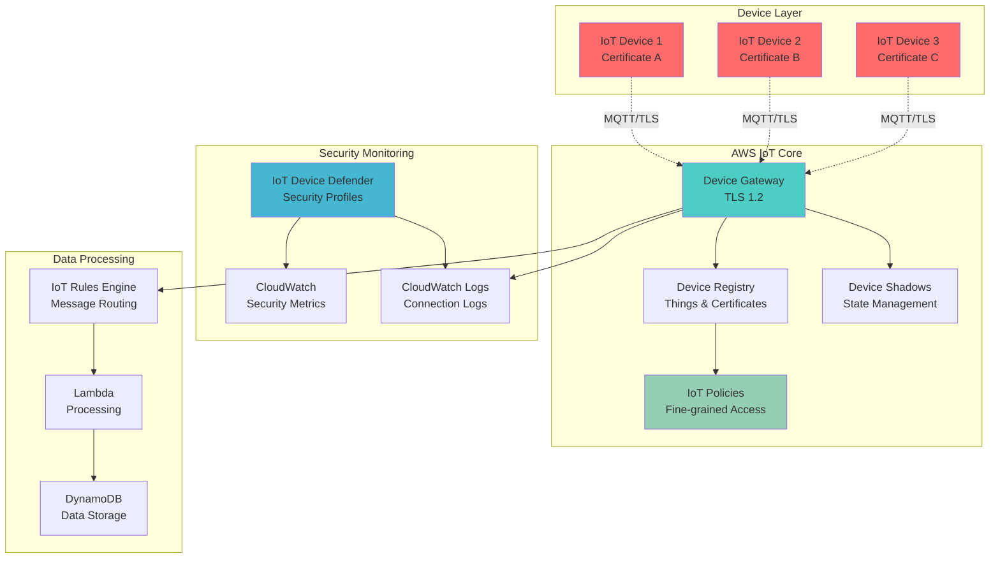

# IoT Certificate Security with X.509 Authentication

## Problem

Manufacturing companies deploying industrial IoT sensors across multiple production facilities face critical security challenges when managing thousands of connected devices. Without proper device authentication and authorization controls, these organizations risk unauthorized access to sensitive operational data, device hijacking, and potential safety incidents. Traditional security approaches using shared keys or passwords are inadequate for large-scale IoT deployments, creating security vulnerabilities that can compromise entire industrial control systems and expose confidential production metrics.

## Solution

This solution implements a comprehensive IoT security framework using AWS IoT Core's X.509 certificate-based authentication combined with fine-grained security policies. The approach establishes individual device identities through unique certificates, implements least-privilege access controls through IoT policies, and provides continuous security monitoring through AWS IoT Device Defender. This architecture ensures secure device onboarding, encrypted communication, and policy-based authorization while maintaining operational scalability.

## Architecture Diagram



## Prerequisites

1. AWS account with appropriate permissions for IoT Core, IAM, CloudWatch, and DynamoDB
2. AWS CLI v2 installed and configured (or AWS CloudShell)
3. Understanding of X.509 certificates and public key infrastructure (PKI)
4. Basic knowledge of MQTT protocol and JSON policy documents
5. Familiarity with IoT security concepts and threat models
6. Estimated cost: $10-15 per month for testing (IoT messages, CloudWatch logs, Device Defender)

> **Note**: This recipe creates production-ready security configurations that should be carefully reviewed before deployment. Follow AWS IoT security best practices and implement proper certificate lifecycle management.

## Preparation

```bash
# Set environment variables
export AWS_REGION=$(aws configure get region)
export AWS_ACCOUNT_ID=$(aws sts get-caller-identity \
    --query Account --output text)

# Generate unique identifiers for resources
RANDOM_SUFFIX=$(aws secretsmanager get-random-password \
    --exclude-punctuation --exclude-uppercase \
    --password-length 6 --require-each-included-type \
    --output text --query RandomPassword)

export PROJECT_NAME="iot-security-demo"
export THING_TYPE_NAME="IndustrialSensor"
export DEVICE_PREFIX="sensor"

# Create local directory for certificates
mkdir -p ./certificates

# Create IoT logging role (if not exists)
aws iam create-role \
    --role-name IoTLoggingRole \
    --assume-role-policy-document '{
        "Version": "2012-10-17",
        "Statement": [
            {
                "Effect": "Allow",
                "Principal": {
                    "Service": "iot.amazonaws.com"
                },
                "Action": "sts:AssumeRole"
            }
        ]
    }' 2>/dev/null || true

# Attach CloudWatch logging policy to IoT role
aws iam attach-role-policy \
    --role-name IoTLoggingRole \
    --policy-arn arn:aws:iam::aws:policy/service-role/IoTLogsFullAccess

# Enable IoT logging for security monitoring
aws iot set-v2-logging-options \
    --role-arn arn:aws:iam::${AWS_ACCOUNT_ID}:role/IoTLoggingRole \
    --default-log-level ERROR 2>/dev/null || true

echo "✅ Environment prepared for IoT security implementation"
```

## Steps

1. **Create Thing Type and Security Policies**:

   AWS IoT Thing types categorize devices with similar characteristics and security requirements, enabling consistent policy application across device fleets. IoT policies define specific permissions using AWS IoT policy variables that dynamically scope access based on device identity, implementing the principle of least privilege. This approach ensures each device can only access resources specifically assigned to its identity while maintaining policy reusability across thousands of devices.

   ```bash
   # Create thing type for industrial sensors
   aws iot create-thing-type \
       --thing-type-name ${THING_TYPE_NAME} \
       --thing-type-description "Industrial IoT sensors with security controls"
   
   # Create restrictive IoT policy for sensors
   cat > sensor-policy.json << 'EOF'
   {
       "Version": "2012-10-17",
       "Statement": [
           {
               "Effect": "Allow",
               "Action": "iot:Connect",
               "Resource": "arn:aws:iot:*:*:client/${iot:Connection.Thing.ThingName}",
               "Condition": {
                   "Bool": {
                       "iot:Connection.Thing.IsAttached": "true"
                   }
               }
           },
           {
               "Effect": "Allow",
               "Action": "iot:Publish",
               "Resource": [
                   "arn:aws:iot:*:*:topic/sensors/${iot:Connection.Thing.ThingName}/telemetry",
                   "arn:aws:iot:*:*:topic/sensors/${iot:Connection.Thing.ThingName}/status"
               ]
           },
           {
               "Effect": "Allow",
               "Action": "iot:Subscribe",
               "Resource": [
                   "arn:aws:iot:*:*:topicfilter/sensors/${iot:Connection.Thing.ThingName}/commands",
                   "arn:aws:iot:*:*:topicfilter/sensors/${iot:Connection.Thing.ThingName}/config"
               ]
           },
           {
               "Effect": "Allow",
               "Action": "iot:Receive",
               "Resource": [
                   "arn:aws:iot:*:*:topic/sensors/${iot:Connection.Thing.ThingName}/commands",
                   "arn:aws:iot:*:*:topic/sensors/${iot:Connection.Thing.ThingName}/config"
               ]
           },
           {
               "Effect": "Allow",
               "Action": [
                   "iot:UpdateThingShadow",
                   "iot:GetThingShadow"
               ],
               "Resource": "arn:aws:iot:*:*:thing/${iot:Connection.Thing.ThingName}"
           }
       ]
   }
   EOF
   
   # Create the restrictive IoT policy
   aws iot create-policy \
       --policy-name "RestrictiveSensorPolicy" \
       --policy-document file://sensor-policy.json
   
   echo "✅ Thing type and security policies created"
   ```

   The IoT policy uses dynamic variables like `${iot:Connection.Thing.ThingName}` to ensure each device can only access its own topics and resources. This eliminates the need for device-specific policies while maintaining strict access controls. The condition `iot:Connection.Thing.IsAttached` ensures only properly registered devices can connect.

   > **Note**: IoT policy variables enable dynamic permissions based on device identity. Review the [AWS IoT policy variables documentation](https://docs.aws.amazon.com/iot/latest/developerguide/iot-policy-variables.html) for comprehensive authorization options.

2. **Create Multiple IoT Devices with Certificates**:

   Each IoT device requires a unique X.509 certificate for authentication, establishing cryptographic identity that enables secure communication with AWS IoT Core. This process generates 2048-bit RSA key pairs and issues certificates signed by AWS IoT's Certificate Authority, providing enterprise-grade security. The certificate-based authentication eliminates shared secret vulnerabilities while enabling individual device identity management at scale.

   ```bash
   # Function to create device with certificate
   create_iot_device() {
       local device_id=$1
       local thing_name="${DEVICE_PREFIX}-${device_id}"
       
       echo "Creating device: ${thing_name}"
       
       # Create IoT thing with attributes
       aws iot create-thing \
           --thing-name ${thing_name} \
           --thing-type-name ${THING_TYPE_NAME} \
           --attribute-payload "attributes={location=factory-${device_id},deviceType=temperature-sensor,firmwareVersion=1.0.0}"
       
       # Create keys and certificate
       local cert_output=$(aws iot create-keys-and-certificate \
           --set-as-active \
           --certificate-pem-outfile "./certificates/${thing_name}.cert.pem" \
           --public-key-outfile "./certificates/${thing_name}.public.key" \
           --private-key-outfile "./certificates/${thing_name}.private.key")
       
       # Extract certificate ARN using jq for reliable parsing
       local cert_arn=$(echo ${cert_output} | \
           python3 -c "import sys, json; print(json.load(sys.stdin)['certificateArn'])")
       
       # Attach policy to certificate
       aws iot attach-policy \
           --policy-name "RestrictiveSensorPolicy" \
           --target ${cert_arn}
       
       # Attach thing to certificate
       aws iot attach-thing-principal \
           --thing-name ${thing_name} \
           --principal ${cert_arn}
       
       echo "✅ Device ${thing_name} created with certificate"
   }
   
   # Create 3 demo devices
   for i in {001..003}; do
       create_iot_device $i
   done
   ```

   Each device now has a unique cryptographic identity with associated metadata. The certificates enable mutual TLS authentication where both the device and AWS IoT Core verify each other's identity. Device attributes stored in the thing registry enable location-based and type-based policy decisions for advanced access controls.

   > **Warning**: Store device certificates and private keys securely. In production environments, use hardware security modules (HSMs) or secure element chips for key storage. Never transmit private keys over unsecured channels or store them in plain text. Follow [AWS IoT security best practices](https://docs.aws.amazon.com/iot/latest/developerguide/security-best-practices.html).

3. **Configure Device Defender Security Profiles**:

   AWS IoT Device Defender provides continuous security monitoring by establishing behavioral baselines for IoT devices and detecting anomalies that indicate security threats. Security profiles define cloud-side and device-side metrics with configurable thresholds that trigger alerts when devices exhibit unusual behavior patterns. This monitoring layer provides fleet-wide security visibility essential for maintaining operational security and compliance in production environments.

   ```bash
   # Create security profile for anomaly detection
   cat > security-profile.json << 'EOF'
   [
       {
           "name": "ExcessiveConnections",
           "metric": "aws:num-connections",
           "criteria": {
               "comparisonOperator": "greater-than",
               "value": {
                   "count": 3
               },
               "consecutiveDatapointsToAlarm": 2,
               "consecutiveDatapointsToClear": 2
           }
       },
       {
           "name": "UnauthorizedOperations",
           "metric": "aws:num-authorization-failures",
           "criteria": {
               "comparisonOperator": "greater-than",
               "value": {
                   "count": 5
               },
               "durationSeconds": 300,
               "consecutiveDatapointsToAlarm": 1,
               "consecutiveDatapointsToClear": 1
           }
       },
       {
           "name": "MessageSizeAnomaly",
           "metric": "aws:message-byte-size",
           "criteria": {
               "comparisonOperator": "greater-than",
               "value": {
                   "count": 1024
               },
               "consecutiveDatapointsToAlarm": 3,
               "consecutiveDatapointsToClear": 3
           }
       }
   ]
   EOF
   
   # Create Device Defender security profile
   aws iot create-security-profile \
       --security-profile-name "IndustrialSensorSecurity" \
       --security-profile-description "Security monitoring for industrial IoT sensors" \
       --behaviors file://security-profile.json
   
   # Create thing group for devices
   aws iot create-thing-group \
       --thing-group-name "IndustrialSensors" \
       --thing-group-properties "thingGroupDescription=Industrial sensor devices"
   
   # Add devices to thing group
   for i in {001..003}; do
       aws iot add-thing-to-thing-group \
           --thing-group-name "IndustrialSensors" \
           --thing-name "${DEVICE_PREFIX}-${i}"
   done
   
   # Attach security profile to thing group
   aws iot attach-security-profile \
       --security-profile-name "IndustrialSensorSecurity" \
       --security-profile-target-arn "arn:aws:iot:${AWS_REGION}:${AWS_ACCOUNT_ID}:thinggroup/IndustrialSensors"
   
   echo "✅ Device Defender security profiles configured"
   ```

   Device Defender now monitors all devices in the IndustrialSensors thing group for suspicious behavior patterns. The security profile detects excessive connections, authorization failures, and unusual message sizes. These cloud-side metrics provide immediate security insights without requiring device-side agents, enabling security monitoring for resource-constrained IoT devices.

   > **Tip**: Security profiles should be tailored to specific device types and operational patterns. Monitor normal device behavior for several weeks before setting production thresholds. Consider different profiles for development, staging, and production environments to reduce false positives.

4. **Set Up CloudWatch Monitoring and Alerts**:

   CloudWatch integration provides centralized logging and metrics collection for IoT security events, enabling comprehensive visibility into device behavior and security incidents. This monitoring infrastructure creates audit trails essential for security analysis and compliance reporting while providing real-time alerting capabilities. The dashboard visualization enables operations teams to monitor security posture and respond quickly to threats.

   ```bash
   # Create CloudWatch log group for IoT connections
   aws logs create-log-group \
       --log-group-name "/aws/iot/security-events" \
       --retention-in-days 30
   
   # Create SNS topic for security alerts (optional)
   aws sns create-topic \
       --name iot-security-alerts 2>/dev/null || true
   
   # Create CloudWatch alarms for security events
   aws cloudwatch put-metric-alarm \
       --alarm-name "IoT-Unauthorized-Connections" \
       --alarm-description "Alert on unauthorized IoT connection attempts" \
       --metric-name Connect.AuthError \
       --namespace "AWS/IoT" \
       --statistic "Sum" \
       --period 300 \
       --threshold 5 \
       --comparison-operator "GreaterThanThreshold" \
       --evaluation-periods 2 \
       --treat-missing-data "notBreaching"
   
   # Create CloudWatch dashboard for IoT security
   cat > iot-security-dashboard.json << EOF
   {
       "widgets": [
           {
               "type": "metric",
               "x": 0,
               "y": 0,
               "width": 12,
               "height": 6,
               "properties": {
                   "metrics": [
                       ["AWS/IoT", "Connect.Success"],
                       [".", "Connect.AuthError"],
                       [".", "Connect.ClientError"]
                   ],
                   "period": 300,
                   "stat": "Sum",
                   "region": "${AWS_REGION}",
                   "title": "IoT Connection Metrics"
               }
           },
           {
               "type": "metric",
               "x": 12,
               "y": 0,
               "width": 12,
               "height": 6,
               "properties": {
                   "metrics": [
                       ["AWS/IoT", "PublishIn.Success"],
                       [".", "PublishIn.AuthError"],
                       [".", "Subscribe.Success"],
                       [".", "Subscribe.AuthError"]
                   ],
                   "period": 300,
                   "stat": "Sum",
                   "region": "${AWS_REGION}",
                   "title": "IoT Message Metrics"
               }
           }
       ]
   }
   EOF
   
   aws cloudwatch put-dashboard \
       --dashboard-name "IoT-Security-Dashboard" \
       --dashboard-body file://iot-security-dashboard.json
   
   echo "✅ CloudWatch monitoring and alerts configured"
   ```

   CloudWatch monitoring now captures all IoT security events with real-time dashboard visibility. The configured alarms automatically detect authentication failures and connection anomalies. Log retention policies ensure compliance while managing storage costs. This monitoring foundation enables security incident response and forensic analysis.

5. **Create IoT Rules for Security Event Processing**:

   IoT Rules Engine enables automated processing of security events and integration with downstream security systems. This creates infrastructure for automated incident response including Lambda functions for event processing and DynamoDB storage for security event history. Automated event processing ensures rapid response to security threats while maintaining detailed audit logs required for compliance and forensic analysis.

   ```bash
   # Create Lambda execution role
   aws iam create-role \
       --role-name IoTSecurityProcessorRole \
       --assume-role-policy-document '{
           "Version": "2012-10-17",
           "Statement": [
               {
                   "Effect": "Allow",
                   "Principal": {
                       "Service": "lambda.amazonaws.com"
                   },
                   "Action": "sts:AssumeRole"
               }
           ]
       }' 2>/dev/null || true
   
   # Attach necessary policies to Lambda role
   aws iam attach-role-policy \
       --role-name IoTSecurityProcessorRole \
       --policy-arn arn:aws:iam::aws:policy/service-role/AWSLambdaBasicExecutionRole
   
   aws iam attach-role-policy \
       --role-name IoTSecurityProcessorRole \
       --policy-arn arn:aws:iam::aws:policy/AmazonDynamoDBFullAccess
   
   # Create Lambda function for security event processing
   cat > security-processor.py << 'EOF'
   import json
   import boto3
   import logging
   from datetime import datetime, timezone
   
   logger = logging.getLogger()
   logger.setLevel(logging.INFO)
   
   def lambda_handler(event, context):
       """Process IoT security events and take appropriate actions"""
       
       # Log the security event
       logger.info(f"Security event received: {json.dumps(event)}")
       
       # Extract device information
       device_id = event.get('clientId', 'unknown')
       event_type = event.get('eventType', 'unknown')
       
       # Example security actions
       if event_type == 'Connect.AuthError':
           logger.warning(f"Authentication failure for device: {device_id}")
           # Could trigger device quarantine or alert
       
       elif event_type == 'Publish.AuthError':
           logger.warning(f"Unauthorized publish attempt from device: {device_id}")
           # Could update device policy or disable device
       
       # Store event for analysis
       dynamodb = boto3.resource('dynamodb')
       table = dynamodb.Table('IoTSecurityEvents')
       
       try:
           table.put_item(
               Item={
                   'eventId': context.aws_request_id,
                   'deviceId': device_id,
                   'eventType': event_type,
                   'timestamp': datetime.now(timezone.utc).isoformat(),
                   'eventData': json.dumps(event),
                   'ttl': int((datetime.now(timezone.utc).timestamp()) + (30 * 24 * 3600))  # 30 days TTL
               }
           )
           logger.info(f"Security event stored for device: {device_id}")
       except Exception as e:
           logger.error(f"Failed to store security event: {str(e)}")
       
       return {
           'statusCode': 200,
           'body': json.dumps('Security event processed')
       }
   EOF
   
   # Create DynamoDB table for security events
   aws dynamodb create-table \
       --table-name IoTSecurityEvents \
       --attribute-definitions \
           AttributeName=eventId,AttributeType=S \
           AttributeName=deviceId,AttributeType=S \
           AttributeName=timestamp,AttributeType=S \
       --key-schema \
           AttributeName=eventId,KeyType=HASH \
       --global-secondary-indexes \
           IndexName=DeviceIndex,KeySchema=[AttributeName=deviceId,KeyType=HASH,AttributeName=timestamp,KeyType=RANGE],Projection={ProjectionType=ALL},BillingMode=PAY_PER_REQUEST \
       --billing-mode PAY_PER_REQUEST
   
   # Wait for table to be created
   aws dynamodb wait table-exists --table-name IoTSecurityEvents
   
   echo "✅ Security event processing infrastructure created"
   ```

   The security event processing infrastructure automatically captures and stores all IoT security events with time-to-live (TTL) for automatic cleanup. The Lambda function provides extensible foundation for automated incident response while DynamoDB storage enables historical analysis and compliance reporting. The global secondary index enables efficient queries by device ID and timestamp.

6. **Implement Certificate Rotation Strategy**:

   Certificate rotation is critical for maintaining long-term security by regularly replacing device certificates before expiration. This proactive approach prevents service disruptions from expired certificates while reducing exposure windows if certificates are compromised. The automated rotation strategy uses EventBridge scheduling to monitor certificate expiration and trigger rotation workflows, ensuring continuous device connectivity while maintaining security best practices.

   ```bash
   # Create certificate rotation Lambda function
   cat > certificate-rotation.py << 'EOF'
   import json
   import boto3
   import logging
   from datetime import datetime, timedelta, timezone
   
   logger = logging.getLogger()
   logger.setLevel(logging.INFO)
   
   iot_client = boto3.client('iot')
   
   def lambda_handler(event, context):
       """Monitor certificates for rotation needs based on expiration"""
       
       try:
           # List all certificates
           response = iot_client.list_certificates(pageSize=100)
           certificates = response.get('certificates', [])
           
           rotation_actions = []
           expiring_soon = []
           
           for cert in certificates:
               cert_id = cert['certificateId']
               cert_arn = cert['certificateArn']
               status = cert['status']
               
               if status != 'ACTIVE':
                   continue
               
               # Get certificate details to check expiration
               cert_details = iot_client.describe_certificate(
                   certificateId=cert_id
               )
               
               # Check certificate validity period
               validity = cert_details['certificateDescription'].get('validity', {})
               not_after = validity.get('notAfter')
               
               if not_after:
                   expiry_date = datetime.fromtimestamp(not_after, tz=timezone.utc)
                   days_until_expiry = (expiry_date - datetime.now(timezone.utc)).days
                   
                   # Flag certificates expiring within 30 days
                   if days_until_expiry <= 30:
                       expiring_soon.append({
                           'certificateId': cert_id,
                           'certificateArn': cert_arn,
                           'expiryDate': expiry_date.isoformat(),
                           'daysUntilExpiry': days_until_expiry
                       })
                       
                       logger.warning(f"Certificate {cert_id} expires in {days_until_expiry} days")
               
               rotation_actions.append({
                   'certificateId': cert_id,
                   'certificateArn': cert_arn,
                   'status': status,
                   'action': 'monitor',
                   'expiryCheck': expiry_date.isoformat() if not_after else 'unknown'
               })
           
           # Log summary
           logger.info(f"Checked {len(certificates)} certificates, {len(expiring_soon)} expiring soon")
           
           return {
               'statusCode': 200,
               'body': json.dumps({
                   'message': 'Certificate rotation check completed',
                   'totalCertificates': len(certificates),
                   'expiringSoon': expiring_soon,
                   'actions': rotation_actions
               })
           }
           
       except Exception as e:
           logger.error(f"Certificate rotation check failed: {str(e)}")
           return {
               'statusCode': 500,
               'body': json.dumps(f'Error: {str(e)}')
           }
   EOF
   
   # Create EventBridge rule for periodic certificate checks
   aws events put-rule \
       --name "IoT-Certificate-Rotation-Check" \
       --schedule-expression "rate(7 days)" \
       --description "Weekly check for certificate rotation needs" \
       --state ENABLED
   
   echo "✅ Certificate rotation strategy implemented"
   ```

   Certificate rotation monitoring now actively identifies certificates approaching expiration with detailed expiry tracking. This automation provides early warning for certificate renewal needs and can be extended to automatically generate new certificates and coordinate device updates. The weekly check ensures sufficient time for planned certificate rotation in production environments.

7. **Configure Advanced Security Policies**:

   Advanced security policies implement sophisticated access controls using temporal and location-based restrictions, demonstrating IoT Core's policy engine capabilities beyond basic authentication. These policies enable complex scenarios like maintenance windows, geo-fencing, and role-based access controls for different device types. The conditional logic supports business requirements while maintaining security boundaries.

   ```bash
   # Create time-based access policy
   cat > time-based-policy.json << 'EOF'
   {
       "Version": "2012-10-17",
       "Statement": [
           {
               "Effect": "Allow",
               "Action": "iot:Connect",
               "Resource": "arn:aws:iot:*:*:client/${iot:Connection.Thing.ThingName}",
               "Condition": {
                   "Bool": {
                       "iot:Connection.Thing.IsAttached": "true"
                   },
                   "DateGreaterThan": {
                       "aws:CurrentTime": "08:00:00Z"
                   },
                   "DateLessThan": {
                       "aws:CurrentTime": "18:00:00Z"
                   }
               }
           },
           {
               "Effect": "Allow",
               "Action": "iot:Publish",
               "Resource": "arn:aws:iot:*:*:topic/sensors/${iot:Connection.Thing.ThingName}/telemetry",
               "Condition": {
                   "StringEquals": {
                       "iot:Connection.Thing.ThingTypeName": "IndustrialSensor"
                   }
               }
           }
       ]
   }
   EOF
   
   # Create location-based access policy
   cat > location-based-policy.json << 'EOF'
   {
       "Version": "2012-10-17",
       "Statement": [
           {
               "Effect": "Allow",
               "Action": "iot:Connect",
               "Resource": "arn:aws:iot:*:*:client/${iot:Connection.Thing.ThingName}",
               "Condition": {
                   "Bool": {
                       "iot:Connection.Thing.IsAttached": "true"
                   },
                   "StringEquals": {
                       "iot:Connection.Thing.Attributes[location]": [
                           "factory-001",
                           "factory-002",
                           "factory-003"
                       ]
                   }
               }
           },
           {
               "Effect": "Allow",
               "Action": "iot:Publish",
               "Resource": "arn:aws:iot:*:*:topic/sensors/${iot:Connection.Thing.ThingName}/*",
               "Condition": {
                   "StringLike": {
                       "iot:Connection.Thing.Attributes[location]": "factory-*"
                   }
               }
           }
       ]
   }
   EOF
   
   # Create advanced security policies
   aws iot create-policy \
       --policy-name "TimeBasedAccessPolicy" \
       --policy-document file://time-based-policy.json
   
   aws iot create-policy \
       --policy-name "LocationBasedAccessPolicy" \
       --policy-document file://location-based-policy.json
   
   echo "✅ Advanced security policies configured"
   ```

   Advanced security policies demonstrate sophisticated access control capabilities including time-based restrictions (business hours only) and location-based constraints. These policies can enforce maintenance windows, geographic boundaries, and operational schedules while maintaining device authentication integrity. The flexible policy language supports complex business requirements.

8. **Set Up Automated Compliance Monitoring**:

   Automated compliance monitoring ensures continuous adherence to security policies and regulatory requirements through AWS Config and Security Hub integration. This monitoring layer provides ongoing validation of security configurations, certificate status, and policy compliance while generating automated findings when deviations are detected. Compliance automation is essential for regulated industries requiring continuous security posture assessment and audit documentation.

   ```bash
   # Create AWS Config rule for IoT certificate compliance
   cat > iot-config-rule.json << 'EOF'
   {
       "ConfigRuleName": "iot-certificate-expiry-check",
       "Description": "Checks if IoT certificates are expiring within 30 days",
       "Source": {
           "Owner": "AWS",
           "SourceIdentifier": "IOT_CERTIFICATE_EXPIRY_CHECK"
       },
       "InputParameters": "{\"desiredDaysToExpiry\":\"30\"}"
   }
   EOF
   
   # Enable Config service and create rule (requires Config setup)
   aws configservice put-config-rule \
       --config-rule file://iot-config-rule.json 2>/dev/null || \
       echo "Config rule creation skipped - requires AWS Config setup"
   
   # Create Security Hub custom insight for IoT security
   aws securityhub create-insight \
       --filters '{
           "ProductArn": [{
               "Value": "arn:aws:securityhub:*:*:product/aws/iot-device-defender",
               "Comparison": "EQUALS"
           }]
       }' \
       --name "IoT Security Findings" \
       --group-by-attribute "Type" 2>/dev/null || \
       echo "Security Hub insight creation skipped - requires Security Hub setup"
   
   echo "✅ Automated compliance monitoring configured"
   ```

   Automated compliance monitoring provides continuous validation of security configurations and certificate status across the IoT fleet. The AWS Config rule monitors certificate expiration while Security Hub insights aggregate IoT Device Defender findings. This monitoring ensures ongoing security posture compliance and generates documentation required for regulatory audits.

9. **Test Security Controls and Monitoring**:

   Security testing validates the effectiveness of implemented controls and ensures proper functioning of monitoring systems. This creates testing tools that simulate device connections and verify authentication mechanisms, providing confidence that security policies are correctly enforced. The testing framework is essential for ongoing validation of security controls and troubleshooting connectivity issues in production environments.

   ```bash
   # Download Amazon Root CA certificate
   curl -o ./certificates/AmazonRootCA1.pem \
       https://www.amazontrust.com/repository/AmazonRootCA1.pem
   
   # Get IoT endpoint for testing
   IOT_ENDPOINT=$(aws iot describe-endpoint \
       --endpoint-type iot:Data-ATS \
       --query 'endpointAddress' \
       --output text)
   
   # Create test script for device authentication
   cat > test-device-connection.py << EOF
   import ssl
   import json
   import sys
   import time
   import socket
   
   def test_device_connection(thing_name, cert_file, key_file, endpoint):
       """Test device connection using certificates"""
       try:
           # Create SSL context
           context = ssl.create_default_context(ssl.Purpose.SERVER_AUTH, cafile="./certificates/AmazonRootCA1.pem")
           context.load_cert_chain(cert_file, key_file)
           
           # Test TLS connection to IoT endpoint
           with socket.create_connection((endpoint, 8883), timeout=10) as sock:
               with context.wrap_socket(sock, server_hostname=endpoint) as ssock:
                   print(f"✅ TLS connection successful for {thing_name}")
                   print(f"   Certificate subject: {ssock.getpeercert()['subject']}")
                   return True
                   
       except Exception as e:
           print(f"❌ Connection test failed for {thing_name}: {e}")
           return False
   
   if __name__ == "__main__":
       # Test connection for first device
       endpoint = "${IOT_ENDPOINT}"
       thing_name = "sensor-001"
       cert_file = "./certificates/sensor-001.cert.pem"
       key_file = "./certificates/sensor-001.private.key"
       
       if test_device_connection(thing_name, cert_file, key_file, endpoint):
           print("✅ Device authentication test passed")
       else:
           print("❌ Device authentication test failed")
   EOF
   
   # Test certificate validation
   python3 test-device-connection.py 2>/dev/null || \
       echo "Python test skipped - requires Python 3 and certificate files"
   
   echo "IoT Endpoint: ${IOT_ENDPOINT}"
   echo "✅ Security controls and monitoring configured"
   ```

   Security testing infrastructure validates certificate-based authentication and TLS connectivity. The Python test script verifies that device certificates can establish secure connections to AWS IoT Core. This testing framework can be extended to validate policy enforcement, message publishing permissions, and subscription restrictions for comprehensive security validation.

10. **Implement Device Quarantine Capability**:

    Device quarantine provides automated incident response by immediately isolating compromised or suspicious devices from the IoT network. This replaces device permissions with a restrictive deny-all policy, preventing unauthorized actions while maintaining device registration for forensic analysis. Quarantine capabilities are critical for containing security incidents and preventing lateral movement in compromised IoT deployments.

    ```bash
    # Create device quarantine Lambda function
    cat > device-quarantine.py << 'EOF'
    import json
    import boto3
    import logging
    
    logger = logging.getLogger()
    logger.setLevel(logging.INFO)
    
    iot_client = boto3.client('iot')
    
    def lambda_handler(event, context):
        """Quarantine suspicious IoT devices by replacing policies"""
        
        try:
            device_id = event['deviceId']
            reason = event.get('reason', 'Security violation')
            
            # Create quarantine policy document
            quarantine_policy = {
                "Version": "2012-10-17",
                "Statement": [
                    {
                        "Effect": "Deny",
                        "Action": "*",
                        "Resource": "*"
                    }
                ]
            }
            
            # Create quarantine policy if it doesn't exist
            policy_name = "DeviceQuarantinePolicy"
            
            try:
                iot_client.create_policy(
                    policyName=policy_name,
                    policyDocument=json.dumps(quarantine_policy)
                )
                logger.info(f"Created quarantine policy {policy_name}")
            except iot_client.exceptions.ResourceAlreadyExistsException:
                logger.info(f"Quarantine policy {policy_name} already exists")
            
            # Get device certificates
            principals = iot_client.list_thing_principals(thingName=device_id)
            
            for principal in principals['principals']:
                # List and detach existing policies
                attached_policies = iot_client.list_attached_policies(target=principal)
                
                for policy in attached_policies['policies']:
                    iot_client.detach_policy(
                        policyName=policy['policyName'],
                        target=principal
                    )
                    logger.info(f"Detached policy {policy['policyName']} from {device_id}")
                
                # Attach quarantine policy
                iot_client.attach_policy(
                    policyName=policy_name,
                    target=principal
                )
                logger.info(f"Attached quarantine policy to {device_id}")
            
            logger.warning(f"Device {device_id} quarantined: {reason}")
            
            return {
                'statusCode': 200,
                'body': json.dumps({
                    'message': f'Device {device_id} quarantined successfully',
                    'reason': reason,
                    'timestamp': context.aws_request_id
                })
            }
            
        except Exception as e:
            logger.error(f"Device quarantine failed: {str(e)}")
            return {
                'statusCode': 500,
                'body': json.dumps(f'Error: {str(e)}')
            }
    EOF
    
    echo "✅ Device quarantine capability implemented"
    ```

    Device quarantine capability enables immediate isolation of compromised devices while preserving forensic evidence. The Lambda function systematically replaces all device policies with a deny-all policy, effectively blocking all device actions. This security control provides rapid incident containment and can be triggered manually or automatically based on Device Defender findings.

## Validation & Testing

1. **Verify Device Registration and Certificates**:

   ```bash
   # List all created things with details
   aws iot list-things --thing-type-name ${THING_TYPE_NAME} \
       --query 'things[*].[thingName,thingArn]' --output table
   
   # Verify certificate attachments for each device
   for i in {001..003}; do
       thing_name="${DEVICE_PREFIX}-${i}"
       echo "Checking ${thing_name}:"
       aws iot list-thing-principals --thing-name ${thing_name} \
           --query 'principals[0]' --output text
   done
   ```

   Expected output: Each device should have associated certificate principals with valid ARNs

2. **Test Security Policy Enforcement**:

   ```bash
   # Validate security profile behaviors
   aws iot validate-security-profile-behaviors \
       --behaviors file://security-profile.json
   
   # Check security profile attachment status
   aws iot list-targets-for-security-profile \
       --security-profile-name "IndustrialSensorSecurity" \
       --query 'securityProfileTargets[*].arn' --output table
   ```

   Expected output: Security profile should be attached to the IndustrialSensors thing group

3. **Verify Monitoring and Alerts**:

   ```bash
   # Check CloudWatch dashboard configuration
   aws cloudwatch get-dashboard \
       --dashboard-name "IoT-Security-Dashboard" \
       --query 'DashboardArn' --output text
   
   # Verify Device Defender security profile details
   aws iot describe-security-profile \
       --security-profile-name "IndustrialSensorSecurity" \
       --query '[securityProfileName,securityProfileDescription]' --output table
   ```

   Expected output: Dashboard and security profile should be properly configured with expected metrics

4. **Test Certificate Authentication Status**:

   ```bash
   # List active certificates with status
   aws iot list-certificates --page-size 10 \
       --query 'certificates[?status==`ACTIVE`].[certificateId,status,creationDate]' \
       --output table
   
   # Test policy attachment for active certificates
   CERT_ARN=$(aws iot list-certificates \
       --query 'certificates[0].certificateArn' --output text)
   aws iot list-attached-policies --target ${CERT_ARN} \
       --query 'policies[*].policyName' --output table
   ```

   Expected output: All certificates should be active with appropriate policies attached

## Cleanup

1. **Remove Device Defender Configuration**:

   ```bash
   # Detach security profile from thing group
   aws iot detach-security-profile \
       --security-profile-name "IndustrialSensorSecurity" \
       --security-profile-target-arn "arn:aws:iot:${AWS_REGION}:${AWS_ACCOUNT_ID}:thinggroup/IndustrialSensors"
   
   # Delete security profile
   aws iot delete-security-profile \
       --security-profile-name "IndustrialSensorSecurity"
   
   echo "✅ Device Defender configuration removed"
   ```

2. **Clean up IoT Devices and Certificates**:

   ```bash
   # Function to clean up device resources
   cleanup_device() {
       local device_id=$1
       local thing_name="${DEVICE_PREFIX}-${device_id}"
       
       # Get certificate ARN for this device
       local cert_arn=$(aws iot list-thing-principals \
           --thing-name ${thing_name} \
           --query 'principals[0]' --output text 2>/dev/null)
       
       if [ "$cert_arn" != "None" ] && [ "$cert_arn" != "" ]; then
           # Extract certificate ID from ARN
           local cert_id=$(echo $cert_arn | cut -d'/' -f2)
           
           # Detach all policies from certificate
           aws iot list-attached-policies --target ${cert_arn} \
               --query 'policies[*].policyName' --output text | \
               xargs -n1 -I {} aws iot detach-policy --policy-name {} --target ${cert_arn}
           
           # Detach certificate from thing
           aws iot detach-thing-principal \
               --thing-name ${thing_name} \
               --principal ${cert_arn}
           
           # Deactivate and delete certificate
           aws iot update-certificate \
               --certificate-id ${cert_id} \
               --new-status INACTIVE
           
           aws iot delete-certificate --certificate-id ${cert_id}
       fi
       
       # Remove device from thing group
       aws iot remove-thing-from-thing-group \
           --thing-group-name "IndustrialSensors" \
           --thing-name ${thing_name} 2>/dev/null || true
       
       # Delete the IoT thing
       aws iot delete-thing --thing-name ${thing_name}
       
       echo "✅ Device ${thing_name} cleaned up"
   }
   
   # Clean up all created devices
   for i in {001..003}; do
       cleanup_device $i
   done
   ```

3. **Remove Policies and Thing Resources**:

   ```bash
   # Delete all IoT policies created
   aws iot delete-policy --policy-name "RestrictiveSensorPolicy"
   aws iot delete-policy --policy-name "TimeBasedAccessPolicy"
   aws iot delete-policy --policy-name "LocationBasedAccessPolicy"
   aws iot delete-policy --policy-name "DeviceQuarantinePolicy" 2>/dev/null || true
   
   # Delete thing group and thing type
   aws iot delete-thing-group --thing-group-name "IndustrialSensors"
   aws iot delete-thing-type --thing-type-name ${THING_TYPE_NAME}
   
   echo "✅ Policies and thing resources removed"
   ```

4. **Clean up Monitoring and Processing Resources**:

   ```bash
   # Delete CloudWatch resources
   aws cloudwatch delete-dashboard --dashboard-name "IoT-Security-Dashboard"
   aws cloudwatch delete-alarms --alarm-names "IoT-Unauthorized-Connections"
   aws logs delete-log-group --log-group-name "/aws/iot/security-events"
   
   # Delete DynamoDB table
   aws dynamodb delete-table --table-name IoTSecurityEvents
   
   # Delete EventBridge rule
   aws events delete-rule --name "IoT-Certificate-Rotation-Check" --force-delete-rule
   
   # Delete IAM roles created
   aws iam detach-role-policy --role-name IoTLoggingRole \
       --policy-arn arn:aws:iam::aws:policy/service-role/IoTLogsFullAccess
   aws iam delete-role --role-name IoTLoggingRole
   
   aws iam detach-role-policy --role-name IoTSecurityProcessorRole \
       --policy-arn arn:aws:iam::aws:policy/service-role/AWSLambdaBasicExecutionRole
   aws iam detach-role-policy --role-name IoTSecurityProcessorRole \
       --policy-arn arn:aws:iam::aws:policy/AmazonDynamoDBFullAccess
   aws iam delete-role --role-name IoTSecurityProcessorRole
   
   # Clean up local files
   rm -rf ./certificates/
   rm -f *.json *.py
   
   echo "✅ All monitoring and processing resources cleaned up"
   ```

## Discussion

This comprehensive IoT security implementation demonstrates enterprise-grade security practices for large-scale IoT deployments following AWS Well-Architected Framework principles. The solution addresses multiple security layers through X.509 certificate-based authentication, fine-grained authorization policies, continuous monitoring capabilities, and automated incident response mechanisms.

The certificate-based authentication model provides critical advantages over traditional approaches by establishing unique cryptographic identities for each device. X.509 certificates eliminate shared credential vulnerabilities while supporting mutual TLS authentication that verifies both device and server identity. This approach scales effectively to thousands of devices while maintaining individual device accountability and enabling selective access revocation without affecting other devices. The certificates integrate seamlessly with AWS IoT Core's policy engine for dynamic authorization decisions.

The policy framework leverages AWS IoT Core's integration with IAM policy language to implement sophisticated access controls. Policy variables like `${iot:Connection.Thing.ThingName}` and `${iot:Connection.Thing.Attributes[location]}` enable dynamic authorization based on device identity and attributes. This approach supports complex scenarios including time-based access restrictions, location-based constraints, and device-type-specific permissions while maintaining policy reusability across device fleets. The conditional logic enables enforcement of business rules and operational requirements without compromising security boundaries.

AWS IoT Device Defender provides continuous security monitoring by establishing behavioral baselines for individual devices and detecting anomalies in connection patterns, message volumes, and authorization attempts. The security profiles can be customized for different device types and deployment environments, while integration with CloudWatch enables automated incident response through Lambda functions and SNS notifications. This monitoring layer is essential for maintaining fleet-wide security visibility and compliance in production environments.

> **Tip**: Implement certificate rotation policies before production deployment, as certificate replacement requires careful coordination with device firmware update mechanisms. Plan for over-the-air update capabilities and consider staged rollouts for certificate updates.

The architecture supports advanced security scenarios including device quarantine capabilities, automated compliance monitoring through AWS Config, and integration with AWS Security Hub for centralized security management. These capabilities are essential for regulated industries where security incidents must be quickly contained and documented for audit purposes. The automated event processing ensures rapid response to threats while maintaining detailed logs required for forensic analysis and compliance reporting.

For production deployments, consider implementing additional security measures such as certificate pinning on devices, network-level isolation through VPC endpoints, and hardware security modules (HSMs) for certificate authority operations. Regular security assessments and penetration testing should validate the effectiveness of implemented controls against evolving threat landscapes. Integration with external SIEM systems and threat intelligence feeds can enhance detection capabilities and incident response coordination.

## Challenge

Extend this solution by implementing these advanced security enhancements:

1. **Implement Just-in-Time (JIT) Certificate Provisioning**: Create a system that generates device certificates on-demand during device onboarding, integrating with [AWS IoT Device Provisioning](https://docs.aws.amazon.com/iot/latest/developerguide/iot-provision.html) for zero-touch provisioning workflows with claim certificates and provisioning templates.

2. **Build Certificate Authority (CA) Management**: Set up a private CA using [AWS Certificate Manager Private CA](https://docs.aws.amazon.com/acm-pca/latest/userguide/) to issue device certificates, implement certificate revocation lists (CRLs), and automate certificate lifecycle management with rotation schedules.

3. **Deploy Fleet-Wide Security Policies**: Create hierarchical policy structures that inherit from device groups, implement policy versioning and rollback capabilities, and build automated policy compliance checking using AWS Config custom rules.

4. **Integrate with External Security Systems**: Connect IoT Device Defender with SIEM platforms like Splunk or Elasticsearch, implement automated threat intelligence feed integration, and build custom security analytics using [Amazon OpenSearch Service](https://docs.aws.amazon.com/opensearch-service/).

5. **Implement Device Attestation**: Add hardware-based device identity verification using TPM chips, implement secure boot verification, and create firmware integrity monitoring capabilities using cryptographic signatures and hash validation.

## Infrastructure Code

*Infrastructure code will be generated after recipe approval.*