# IoT Dashboard Visualization with QuickSight

## Problem

Manufacturing companies and IoT-enabled businesses often struggle with gaining real-time insights from their device data streams. With hundreds of sensors generating continuous telemetry data, decision-makers need comprehensive dashboards that can visualize trends, identify anomalies, and support data-driven operations. Traditional analytics solutions are either too complex to implement or lack the real-time capabilities needed for effective IoT monitoring and business intelligence.

## Solution

This solution leverages Amazon QuickSight's powerful visualization capabilities to create interactive dashboards from IoT device data. We'll collect sensor data through AWS IoT Core, stream it via Kinesis Data Streams, store it in S3, and then use QuickSight to build comprehensive analytics dashboards. This approach provides scalable, real-time business intelligence that enables stakeholders to monitor device performance, track operational metrics, and make informed decisions based on live IoT data.

## Architecture Diagram

```mermaid
graph TB
    subgraph "IoT Devices Layer"
        IOT1[Temperature Sensor]
        IOT2[Humidity Sensor]
        IOT3[Pressure Sensor]
    end
    
    subgraph "Data Ingestion"
        CORE[IoT Core]
        RULE[IoT Rules Engine]
    end
    
    subgraph "Data Processing"
        KINESIS[Kinesis Data Streams]
        FIREHOSE[Kinesis Data Firehose]
    end
    
    subgraph "Data Storage"
        S3[S3 Bucket]
        GLUE[Glue Data Catalog]
    end
    
    subgraph "Analytics & Visualization"
        QS[QuickSight]
        DASHBOARD[Interactive Dashboard]
    end
    
    IOT1-->CORE
    IOT2-->CORE
    IOT3-->CORE
    CORE-->RULE
    RULE-->KINESIS
    KINESIS-->FIREHOSE
    FIREHOSE-->S3
    S3-->GLUE
    GLUE-->QS
    QS-->DASHBOARD
    
    style S3 fill:#FF9900
    style QS fill:#232F3E
    style CORE fill:#3F8624
    style KINESIS fill:#146EB4
```



## Prerequisites

1. AWS account with appropriate permissions for QuickSight, IoT Core, Kinesis, S3, and Glue
2. AWS CLI v2 installed and configured (or AWS CloudShell)
3. Basic understanding of IoT data concepts and JSON formatting
4. Familiarity with SQL query syntax for data analysis
5. Estimated cost: $15-25 for running this recipe (includes QuickSight subscription, Kinesis streams, and S3 storage)

> **Note**: QuickSight requires an active subscription. The first 30 days are free for new users, after which standard pricing applies. See the [QuickSight Pricing Guide](https://aws.amazon.com/quicksight/pricing/) for detailed cost information.

> **Warning**: Ensure proper IAM permissions are configured for QuickSight to access S3 and Athena resources. Missing permissions will result in data source connection failures during dashboard creation.

## Preparation

```bash
# Set environment variables
export AWS_REGION=$(aws configure get region)
export AWS_ACCOUNT_ID=$(aws sts get-caller-identity \
    --query Account --output text)

# Generate unique identifiers for resources
RANDOM_SUFFIX=$(aws secretsmanager get-random-password \
    --exclude-punctuation --exclude-uppercase \
    --password-length 6 --require-each-included-type \
    --output text --query RandomPassword)

export IOT_POLICY_NAME="iot-device-policy-${RANDOM_SUFFIX}"
export IOT_THING_NAME="iot-sensor-${RANDOM_SUFFIX}"
export KINESIS_STREAM_NAME="iot-data-stream-${RANDOM_SUFFIX}"
export S3_BUCKET_NAME="iot-analytics-bucket-${RANDOM_SUFFIX}"
export FIREHOSE_DELIVERY_STREAM="iot-firehose-${RANDOM_SUFFIX}"
export QUICKSIGHT_USER_NAME="quicksight-user-${RANDOM_SUFFIX}"

# Create S3 bucket for IoT data storage
aws s3 mb s3://${S3_BUCKET_NAME} --region ${AWS_REGION}

echo "✅ S3 bucket created: ${S3_BUCKET_NAME}"
```

## Steps

1. **Create IoT Core resources for device connectivity**:

   AWS IoT Core provides secure, bi-directional communication between IoT devices and the cloud. It serves as the entry point for all IoT device communications and supports millions of devices and billions of messages. Creating proper IoT policies and device representations establishes the foundation for secure device authentication and message routing throughout your IoT infrastructure.

   ```bash
   # Create IoT policy for device permissions
   aws iot create-policy \
       --policy-name ${IOT_POLICY_NAME} \
       --policy-document '{
           "Version": "2012-10-17",
           "Statement": [
               {
                   "Effect": "Allow",
                   "Action": ["iot:Connect", "iot:Publish"],
                   "Resource": "*"
               }
           ]
       }'
   
   # Create IoT thing representing our sensor device
   aws iot create-thing \
       --thing-name ${IOT_THING_NAME}
   
   echo "✅ IoT Core resources created"
   ```

   The IoT policy defines exactly what actions devices can perform, following the principle of least privilege. The IoT Thing represents your physical device in AWS, enabling device management, monitoring, and shadow state synchronization. These foundational resources are now ready to securely handle device connections and message publishing.

2. **Set up Kinesis Data Streams for real-time data processing**:

   Amazon Kinesis Data Streams enables real-time processing of streaming data at scale, capable of handling hundreds of thousands of records per second. For IoT applications, Kinesis provides the critical bridge between device message ingestion and downstream analytics processing. The service automatically manages infrastructure scaling and provides durable storage for replay capabilities, essential for IoT data that requires both real-time analysis and historical processing.

   ```bash
   # Create Kinesis data stream
   aws kinesis create-stream \
       --stream-name ${KINESIS_STREAM_NAME} \
       --shard-count 1
   
   # Wait for stream to become active
   aws kinesis wait stream-exists \
       --stream-name ${KINESIS_STREAM_NAME}
   
   echo "✅ Kinesis Data Stream created: ${KINESIS_STREAM_NAME}"
   ```

   The Kinesis stream is now active and ready to receive high-throughput IoT messages. With one shard, it can handle up to 1,000 records per second or 1 MB per second of incoming data. This stream will serve as the reliable backbone for routing IoT sensor data to multiple downstream consumers including storage, analytics, and alerting systems.

3. **Create IAM role for IoT Rules Engine**:

   IAM roles enable secure, temporary credential delegation without hardcoding secrets in configurations. For IoT Rules Engine, the role follows the principle of least privilege by granting only the specific Kinesis permissions needed for message forwarding. This approach ensures that IoT message routing operates securely while maintaining the flexibility to add additional downstream targets in the future.

   ```bash
   # Create IAM role for IoT to access Kinesis
   aws iam create-role \
       --role-name IoTKinesisRole \
       --assume-role-policy-document '{
           "Version": "2012-10-17",
           "Statement": [
               {
                   "Effect": "Allow",
                   "Principal": {
                       "Service": "iot.amazonaws.com"
                   },
                   "Action": "sts:AssumeRole"
               }
           ]
       }'
   
   # Create custom policy for Kinesis access
   aws iam create-policy \
       --policy-name IoTKinesisPolicy \
       --policy-document '{
           "Version": "2012-10-17",
           "Statement": [
               {
                   "Effect": "Allow",
                   "Action": [
                       "kinesis:PutRecord",
                       "kinesis:PutRecords"
                   ],
                   "Resource": "arn:aws:kinesis:'${AWS_REGION}':'${AWS_ACCOUNT_ID}':stream/'${KINESIS_STREAM_NAME}'"
               }
           ]
       }'
   
   # Attach custom policy to role
   aws iam attach-role-policy \
       --role-name IoTKinesisRole \
       --policy-arn arn:aws:iam::${AWS_ACCOUNT_ID}:policy/IoTKinesisPolicy
   
   echo "✅ IAM role and policies created"
   ```

   The IAM role is now configured with precise permissions for Kinesis access, enabling the IoT Rules Engine to securely forward messages. This security foundation supports audit compliance by providing clear permission boundaries and enables easy permission management as your IoT architecture scales to include additional services.

4. **Create IoT Rules Engine rule to route data to Kinesis**:

   The AWS IoT Rules Engine provides powerful SQL-based message routing and transformation capabilities. It evaluates incoming messages against SQL-like rules and can route data to multiple AWS services simultaneously. This serverless processing layer eliminates the need for custom message routing infrastructure while providing advanced filtering, transformation, and enrichment capabilities for IoT data streams.

   ```bash
   # Create IoT rule to forward messages to Kinesis
   aws iot create-topic-rule \
       --rule-name "RouteToKinesis" \
       --topic-rule-payload '{
           "sql": "SELECT *, timestamp() as event_time FROM \"topic/sensor/data\"",
           "description": "Route IoT sensor data to Kinesis Data Streams",
           "actions": [
               {
                   "kinesis": {
                       "roleArn": "arn:aws:iam::'${AWS_ACCOUNT_ID}':role/IoTKinesisRole",
                       "streamName": "'${KINESIS_STREAM_NAME}'"
                   }
               }
           ]
       }'
   
   echo "✅ IoT Rules Engine rule created"
   ```

   The rule is now actively monitoring the "topic/sensor/data" MQTT topic and will automatically forward matching messages to Kinesis. The SQL statement adds a server-side timestamp to each message, ensuring consistent time tracking regardless of device clock accuracy. This automated routing eliminates message processing latency and provides reliable delivery guarantees.

5. **Set up Kinesis Data Firehose to deliver data to S3**:

   Kinesis Data Firehose provides fully managed delivery of streaming data to data lakes, data stores, and analytics services. For IoT applications, Firehose eliminates the operational complexity of building custom data delivery infrastructure while providing automatic scaling, data format conversion, and compression. The service buffers and batches data efficiently, optimizing storage costs while ensuring reliable delivery to S3.

   ```bash
   # Create IAM role for Firehose
   aws iam create-role \
       --role-name FirehoseDeliveryRole \
       --assume-role-policy-document '{
           "Version": "2012-10-17",
           "Statement": [
               {
                   "Effect": "Allow",
                   "Principal": {
                       "Service": "firehose.amazonaws.com"
                   },
                   "Action": "sts:AssumeRole"
               }
           ]
       }'
   
   # Create policy for Firehose S3 access
   aws iam create-policy \
       --policy-name FirehoseS3Policy \
       --policy-document '{
           "Version": "2012-10-17",
           "Statement": [
               {
                   "Effect": "Allow",
                   "Action": [
                       "s3:GetObject",
                       "s3:PutObject",
                       "s3:DeleteObject",
                       "s3:ListBucket"
                   ],
                   "Resource": [
                       "arn:aws:s3:::'${S3_BUCKET_NAME}'",
                       "arn:aws:s3:::'${S3_BUCKET_NAME}'/*"
                   ]
               }
           ]
       }'
   
   # Attach policy to Firehose role
   aws iam attach-role-policy \
       --role-name FirehoseDeliveryRole \
       --policy-arn arn:aws:iam::${AWS_ACCOUNT_ID}:policy/FirehoseS3Policy
   
   echo "✅ Firehose IAM role created"
   ```

6. **Create Kinesis Data Firehose delivery stream**:

   The Firehose delivery stream configuration includes intelligent partitioning based on timestamps, creating an organized data structure in S3 that optimizes query performance and cost management. GZIP compression reduces storage costs by up to 90% while maintaining fast query capabilities. The buffering configuration balances between data freshness and cost efficiency, delivering data to S3 within 60 seconds or when reaching 1 MB batches.

   ```bash
   # Create Firehose delivery stream
   aws firehose create-delivery-stream \
       --delivery-stream-name ${FIREHOSE_DELIVERY_STREAM} \
       --delivery-stream-type KinesisStreamAsSource \
       --kinesis-stream-source-configuration \
           KinesisStreamARN=arn:aws:kinesis:${AWS_REGION}:${AWS_ACCOUNT_ID}:stream/${KINESIS_STREAM_NAME},RoleARN=arn:aws:iam::${AWS_ACCOUNT_ID}:role/FirehoseDeliveryRole \
       --extended-s3-destination-configuration \
           RoleARN=arn:aws:iam::${AWS_ACCOUNT_ID}:role/FirehoseDeliveryRole,BucketARN=arn:aws:s3:::${S3_BUCKET_NAME},Prefix=iot-data/year=!{timestamp:yyyy}/month=!{timestamp:MM}/day=!{timestamp:dd}/hour=!{timestamp:HH}/,BufferingHints='{SizeInMBs=1,IntervalInSeconds=60}',CompressionFormat=GZIP
   
   echo "✅ Firehose delivery stream created"
   ```

   The delivery stream is now operational and will automatically begin consuming data from Kinesis and delivering it to S3 with the configured partitioning scheme. This creates a time-based folder structure that enables efficient querying by date ranges and supports automatic lifecycle policies for long-term data management.

7. **Simulate IoT device data for testing**:

   Simulating realistic IoT sensor data helps validate the entire data pipeline before connecting actual devices. This test data includes typical industrial sensor readings for temperature, humidity, and pressure with realistic ranges and proper JSON formatting. The simulation publishes data at regular intervals to test the throughput capabilities and message processing latency of the complete system.

   ```bash
   # Generate sample IoT sensor data
   for i in {1..10}; do
       TEMP=$((RANDOM % 40 + 10))
       HUMIDITY=$((RANDOM % 100))
       PRESSURE=$((RANDOM % 200 + 900))
       
       # Publish sensor data to IoT Core
       aws iot-data publish \
           --topic "topic/sensor/data" \
           --payload '{
               "device_id": "'${IOT_THING_NAME}'",
               "temperature": '${TEMP}',
               "humidity": '${HUMIDITY}',
               "pressure": '${PRESSURE}',
               "timestamp": "'$(date -u +%Y-%m-%dT%H:%M:%S.%3NZ)'"
           }'
       
       sleep 2
   done
   
   echo "✅ Sample IoT data published"
   ```

   The test data is now flowing through the complete pipeline: from IoT Core through the Rules Engine to Kinesis, then via Firehose to S3. This validates that all components are properly configured and establishes baseline metrics for message processing latency and throughput before production deployment.

8. **Set up AWS Glue Data Catalog for QuickSight integration**:

   AWS Glue Data Catalog serves as a central metadata repository that makes your IoT data discoverable and queryable by analytics services. It automatically understands data schemas, tracks data lineage, and provides a unified view across your data lake. For QuickSight integration, the catalog enables seamless data discovery and eliminates the need for manual schema management as your IoT data structure evolves.

   ```bash
   # Create Glue database
   aws glue create-database \
       --database-input '{
           "Name": "iot_analytics_db",
           "Description": "Database for IoT sensor data analytics"
       }'
   
   # Create Glue table for IoT data
   aws glue create-table \
       --database-name iot_analytics_db \
       --table-input '{
           "Name": "iot_sensor_data",
           "Description": "Table for IoT sensor data",
           "StorageDescriptor": {
               "Columns": [
                   {
                       "Name": "device_id",
                       "Type": "string"
                   },
                   {
                       "Name": "temperature",
                       "Type": "int"
                   },
                   {
                       "Name": "humidity",
                       "Type": "int"
                   },
                   {
                       "Name": "pressure",
                       "Type": "int"
                   },
                   {
                       "Name": "timestamp",
                       "Type": "string"
                   },
                   {
                       "Name": "event_time",
                       "Type": "bigint"
                   }
               ],
               "Location": "s3://'${S3_BUCKET_NAME}'/iot-data/",
               "InputFormat": "org.apache.hadoop.mapred.TextInputFormat",
               "OutputFormat": "org.apache.hadoop.hive.ql.io.HiveIgnoreKeyTextOutputFormat",
               "SerdeInfo": {
                   "SerializationLibrary": "org.openx.data.jsonserde.JsonSerDe"
               }
           }
       }'
   
   echo "✅ Glue Data Catalog configured"
   ```

   The Glue table now provides a structured view of your IoT data that QuickSight can directly query through Athena. The JSON SerDe automatically handles schema inference and data type conversion, enabling immediate analytics capabilities without complex ETL processes. This catalog integration enables self-service analytics for business users.

9. **Create QuickSight account and configure permissions**:

   Amazon QuickSight provides cloud-native business intelligence with machine learning-powered insights and the ability to scale to hundreds of thousands of users. For IoT analytics, QuickSight's integration with the AWS data ecosystem enables direct querying of data in S3 through Athena, eliminating data movement while providing real-time dashboard capabilities and automated anomaly detection.

   ```bash
   # Create QuickSight account (if not already exists)
   aws quicksight create-account-subscription \
       --edition STANDARD \
       --authentication-method IAM_AND_QUICKSIGHT \
       --aws-account-id ${AWS_ACCOUNT_ID} \
       --account-name "IoT Analytics Account" \
       --notification-email "your-email@example.com" \
       --region ${AWS_REGION} || true
   
   # Create QuickSight user
   aws quicksight register-user \
       --aws-account-id ${AWS_ACCOUNT_ID} \
       --namespace default \
       --identity-type IAM \
       --iam-arn "arn:aws:iam::${AWS_ACCOUNT_ID}:root" \
       --user-role ADMIN \
       --user-name ${QUICKSIGHT_USER_NAME} \
       --region ${AWS_REGION} || true
   
   echo "✅ QuickSight account setup completed"
   ```

   QuickSight is now configured with the necessary permissions to access your IoT data through the AWS data ecosystem. The service can now directly query your S3-based data lake through Athena, providing sub-second query performance for interactive dashboards while maintaining cost-effective analytics at scale.

10. **Create QuickSight data source connecting to Glue**:

    The Athena data source connection enables QuickSight to leverage the full power of serverless SQL queries against your IoT data lake. This integration automatically inherits all the schema definitions from Glue Data Catalog and provides the foundation for building interactive dashboards, performing ad-hoc analysis, and sharing insights across your organization.

    ```bash
    # Create QuickSight data source
    aws quicksight create-data-source \
        --aws-account-id ${AWS_ACCOUNT_ID} \
        --data-source-id "iot-athena-datasource" \
        --name "IoT Analytics Data Source" \
        --type ATHENA \
        --data-source-parameters '{
            "AthenaParameters": {
                "WorkGroup": "primary"
            }
        }' \
        --permissions '[
            {
                "Principal": "arn:aws:quicksight:'${AWS_REGION}':'${AWS_ACCOUNT_ID}':user/default/'${QUICKSIGHT_USER_NAME}'",
                "Actions": [
                    "quicksight:DescribeDataSource",
                    "quicksight:DescribeDataSourcePermissions",
                    "quicksight:PassDataSource"
                ]
            }
        ]' \
        --region ${AWS_REGION}
    
    echo "✅ QuickSight data source created"
    ```

    The data source connection is now active and ready for dashboard creation. QuickSight can directly query your partitioned IoT data in S3, automatically leveraging the time-based partitioning for optimal query performance. This connection enables real-time analytics on historical IoT data without requiring data movement or transformation.

## Validation & Testing

1. **Verify IoT data is flowing to S3**:

   ```bash
   # Check if data files exist in S3
   aws s3 ls s3://${S3_BUCKET_NAME}/iot-data/ --recursive
   ```

   Expected output: List of compressed files with IoT sensor data

2. **Test Glue table can query the data**:

   ```bash
   # Start Athena query to validate data
   QUERY_ID=$(aws athena start-query-execution \
       --query-string "SELECT * FROM iot_analytics_db.iot_sensor_data LIMIT 10" \
       --result-configuration OutputLocation=s3://${S3_BUCKET_NAME}/athena-results/ \
       --work-group primary \
       --query 'QueryExecutionId' \
       --output text)
   
   # Check query status
   aws athena get-query-execution \
       --query-execution-id ${QUERY_ID} \
       --query 'QueryExecution.Status.State' \
       --output text
   ```

3. **Verify QuickSight data source connection**:

   ```bash
   # List QuickSight data sources
   aws quicksight list-data-sources \
       --aws-account-id ${AWS_ACCOUNT_ID} \
       --region ${AWS_REGION}
   ```

   Expected output: JSON showing the created IoT analytics data source

4. **Test dashboard creation capability**:

   ```bash
   # Create QuickSight dataset
   aws quicksight create-data-set \
       --aws-account-id ${AWS_ACCOUNT_ID} \
       --data-set-id "iot-sensor-dataset" \
       --name "IoT Sensor Dataset" \
       --physical-table-map '{
           "iot_data": {
               "RelationalTable": {
                   "DataSourceArn": "arn:aws:quicksight:'${AWS_REGION}':'${AWS_ACCOUNT_ID}':datasource/iot-athena-datasource",
                   "Catalog": "AwsDataCatalog",
                   "Schema": "iot_analytics_db",
                   "Name": "iot_sensor_data",
                   "InputColumns": [
                       {
                           "Name": "device_id",
                           "Type": "STRING"
                       },
                       {
                           "Name": "temperature",
                           "Type": "INTEGER"
                       },
                       {
                           "Name": "humidity",
                           "Type": "INTEGER"
                       },
                       {
                           "Name": "pressure",
                           "Type": "INTEGER"
                       },
                       {
                           "Name": "timestamp",
                           "Type": "STRING"
                       }
                   ]
               }
           }
       }' \
       --region ${AWS_REGION}
   
   echo "✅ QuickSight dataset created successfully"
   ```

## Cleanup

1. **Delete QuickSight resources**:

   ```bash
   # Delete QuickSight dataset
   aws quicksight delete-data-set \
       --aws-account-id ${AWS_ACCOUNT_ID} \
       --data-set-id "iot-sensor-dataset" \
       --region ${AWS_REGION}
   
   # Delete QuickSight data source
   aws quicksight delete-data-source \
       --aws-account-id ${AWS_ACCOUNT_ID} \
       --data-source-id "iot-athena-datasource" \
       --region ${AWS_REGION}
   
   echo "✅ QuickSight resources deleted"
   ```

2. **Remove Glue resources**:

   ```bash
   # Delete Glue table
   aws glue delete-table \
       --database-name iot_analytics_db \
       --name iot_sensor_data
   
   # Delete Glue database
   aws glue delete-database \
       --name iot_analytics_db
   
   echo "✅ Glue resources deleted"
   ```

3. **Delete Kinesis and Firehose resources**:

   ```bash
   # Delete Firehose delivery stream
   aws firehose delete-delivery-stream \
       --delivery-stream-name ${FIREHOSE_DELIVERY_STREAM}
   
   # Delete Kinesis stream
   aws kinesis delete-stream \
       --stream-name ${KINESIS_STREAM_NAME}
   
   echo "✅ Kinesis resources deleted"
   ```

4. **Remove IoT Core resources**:

   ```bash
   # Delete IoT rule
   aws iot delete-topic-rule \
       --rule-name "RouteToKinesis"
   
   # Delete IoT thing
   aws iot delete-thing \
       --thing-name ${IOT_THING_NAME}
   
   # Delete IoT policy
   aws iot delete-policy \
       --policy-name ${IOT_POLICY_NAME}
   
   echo "✅ IoT Core resources deleted"
   ```

5. **Clean up IAM roles and policies**:

   ```bash
   # Detach and delete IAM policies
   aws iam detach-role-policy \
       --role-name IoTKinesisRole \
       --policy-arn arn:aws:iam::${AWS_ACCOUNT_ID}:policy/IoTKinesisPolicy
   
   aws iam detach-role-policy \
       --role-name FirehoseDeliveryRole \
       --policy-arn arn:aws:iam::${AWS_ACCOUNT_ID}:policy/FirehoseS3Policy
   
   # Delete policies
   aws iam delete-policy \
       --policy-arn arn:aws:iam::${AWS_ACCOUNT_ID}:policy/IoTKinesisPolicy
   
   aws iam delete-policy \
       --policy-arn arn:aws:iam::${AWS_ACCOUNT_ID}:policy/FirehoseS3Policy
   
   # Delete IAM roles
   aws iam delete-role --role-name IoTKinesisRole
   aws iam delete-role --role-name FirehoseDeliveryRole
   
   echo "✅ IAM resources deleted"
   ```

6. **Remove S3 bucket and contents**:

   ```bash
   # Delete all objects in S3 bucket
   aws s3 rm s3://${S3_BUCKET_NAME} --recursive
   
   # Delete S3 bucket
   aws s3 rb s3://${S3_BUCKET_NAME}
   
   echo "✅ S3 resources deleted"
   ```

## Discussion

This solution demonstrates the power of combining AWS IoT services with QuickSight for comprehensive IoT data visualization. The architecture leverages AWS IoT Core for device connectivity, Kinesis for real-time data streaming, and S3 for cost-effective data storage, while QuickSight provides powerful business intelligence capabilities following AWS Well-Architected Framework principles.

The key architectural decision to use Kinesis Data Streams with Firehose ensures both real-time processing capabilities and efficient batch loading into S3. This approach enables both immediate alerting and historical trend analysis. The AWS Glue Data Catalog acts as a crucial bridge, automatically cataloging the data schema and making it queryable through Athena, which QuickSight can then use as a data source.

QuickSight's integration with the AWS ecosystem makes it particularly well-suited for IoT analytics. Its ability to connect directly to Athena and query data stored in S3 through the Glue Data Catalog eliminates the need for complex ETL processes. The service also supports real-time dashboards through direct database connections, scheduled data refreshes, and can scale to support thousands of concurrent users accessing IoT dashboards. This architecture follows the [AWS Well-Architected IoT Lens](https://docs.aws.amazon.com/wellarchitected/latest/iot-lens/welcome.html) principles for building reliable, secure, and efficient IoT solutions.

For production deployments, consider implementing data partitioning strategies in S3 based on device type, location, or time periods to optimize query performance and costs. Additionally, QuickSight's machine learning insights can automatically detect anomalies in IoT sensor data and provide forecasting capabilities without requiring specialized ML expertise. The solution also aligns with [AWS IoT Core best practices](https://docs.aws.amazon.com/iot/latest/developerguide/iot-best-practices.html) for secure device connectivity and message routing.

> **Tip**: Use QuickSight's parameter-driven dashboards to create dynamic filters that allow users to drill down into specific devices, time ranges, or sensor types. This approach enables role-based data access and creates more targeted analytics experiences for different stakeholder groups like operations teams, facility managers, and executives.

## Challenge

Extend this solution by implementing these enhancements:

1. **Add real-time alerting**: Implement CloudWatch alarms on IoT sensor thresholds that trigger SNS notifications when temperature or pressure values exceed safe operating ranges.

2. **Implement data quality monitoring**: Use AWS Glue DataBrew to profile IoT data quality, detect missing values, and create data lineage documentation for compliance requirements.

3. **Create advanced analytics**: Integrate Amazon SageMaker to build predictive maintenance models that can forecast equipment failures based on sensor trends, then visualize predictions in QuickSight.

4. **Build multi-tenant dashboards**: Implement row-level security in QuickSight to create tenant-specific views of IoT data, allowing different customers or departments to see only their relevant device data.

5. **Add geospatial visualization**: Enhance the solution with location data from IoT devices and create interactive maps in QuickSight showing real-time sensor readings across different geographical regions.

## Infrastructure Code

### Available Infrastructure as Code:

- [Infrastructure Code Overview](code/README.md) - Detailed description of all infrastructure components
- [AWS CDK (Python)](code/cdk-python/) - AWS CDK Python implementation
- [AWS CDK (TypeScript)](code/cdk-typescript/) - AWS CDK TypeScript implementation
- [CloudFormation](code/cloudformation.yaml) - AWS CloudFormation template
- [Bash CLI Scripts](code/scripts/) - Example bash scripts using AWS CLI commands to deploy infrastructure
- [Terraform](code/terraform/) - Terraform configuration files