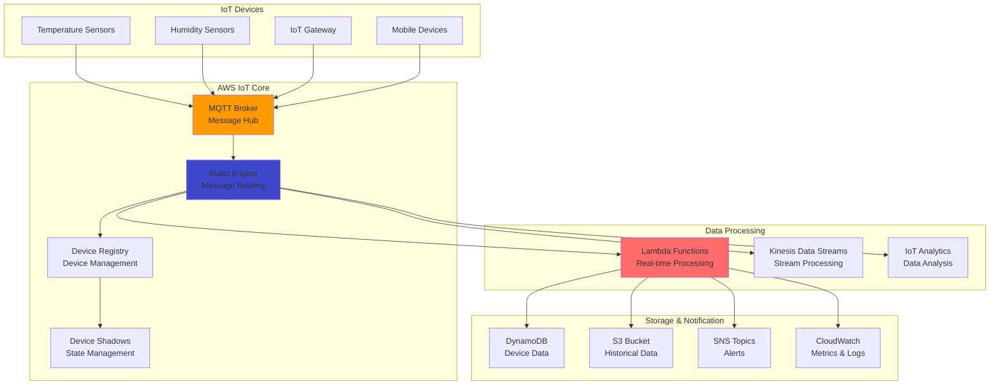

# IoT Data Ingestion with IoT Core

## Problem

Your organization needs to collect, process, and store data from thousands of IoT devices in real-time while ensuring secure communication, reliable message delivery, and scalable data processing. Traditional IoT solutions require complex infrastructure management, custom protocol implementations, and extensive security configurations. You need a managed solution that can handle device authentication, message routing, real-time processing, and integration with downstream services without managing servers or message brokers.

## Solution

Implement a comprehensive IoT data ingestion pipeline using AWS IoT Core for device connectivity and message routing, combined with Lambda for real-time processing and DynamoDB for scalable data storage. This solution provides secure MQTT communication, automatic device authentication, flexible message routing rules, and seamless integration with AWS services. The architecture supports millions of concurrent device connections while maintaining low latency and high availability.

## Architecture Diagram



## Prerequisites

1. AWS account with permissions for IoT Core, Lambda, DynamoDB, and SNS
2. AWS CLI v2 installed and configured (or AWS CloudShell)
3. IoT device or simulator for testing (can use AWS IoT Device Simulator)
4. Basic understanding of MQTT protocol and JSON message formats
5. Basic familiarity with X.509 certificates for device authentication
6. Estimated cost: $5-25/month for development/testing with moderate device count and message volume

> **Note**: AWS IoT Core charges $0.08 per million connection minutes and $1.00 per million messages. Review [IoT Core pricing](https://aws.amazon.com/iot-core/pricing/) for detailed cost calculations based on your expected device count and message frequency.

## Preparation

```bash
# Set environment variables
export AWS_REGION=$(aws configure get region)
export AWS_ACCOUNT_ID=$(aws sts get-caller-identity \
    --query Account --output text)

# Generate unique identifiers
RANDOM_SUFFIX=$(aws secretsmanager get-random-password \
    --exclude-punctuation --exclude-uppercase \
    --password-length 6 --require-each-included-type \
    --output text --query RandomPassword)

export IOT_THING_NAME="sensor-device-${RANDOM_SUFFIX}"
export IOT_POLICY_NAME="SensorPolicy-${RANDOM_SUFFIX}"
export LAMBDA_FUNCTION_NAME="iot-processor-${RANDOM_SUFFIX}"
export DYNAMODB_TABLE_NAME="SensorData-${RANDOM_SUFFIX}"

echo "✅ Environment variables configured"
```

## Steps

1. **Create IoT Thing and Security Credentials**:

   AWS IoT Core uses X.509 certificates for device authentication and authorization, providing enterprise-grade security for IoT communications. Each IoT device (called a "Thing") has a unique identity with associated certificates and policies that define what resources the device can access and what actions it can perform. This certificate-based authentication eliminates the need for hardcoded credentials and enables secure, scalable device management across large IoT fleets. Understanding this security model is crucial for building production-ready IoT solutions that meet compliance and security requirements.

   ```bash
   # Create IoT Thing (device registration)
   aws iot create-thing \
       --thing-name $IOT_THING_NAME \
       --thing-type-name "SensorDevice"

   # Create certificate and keys for device authentication
   CERT_RESPONSE=$(aws iot create-keys-and-certificate \
       --set-as-active \
       --certificate-pem-outfile device-cert.pem \
       --public-key-outfile device-public.key \
       --private-key-outfile device-private.key)

   CERT_ARN=$(echo $CERT_RESPONSE | jq -r '.certificateArn')
   CERT_ID=$(echo $CERT_RESPONSE | jq -r '.certificateId')

   # Download Amazon Root CA certificate for SSL/TLS verification
   curl -o amazon-root-ca.pem \
       https://www.amazontrust.com/repository/AmazonRootCA1.pem

   # Create IoT policy with least-privilege permissions
   cat > iot-policy.json << EOF
   {
       "Version": "2012-10-17",
       "Statement": [
           {
               "Effect": "Allow",
               "Action": [
                   "iot:Connect"
               ],
               "Resource": "arn:aws:iot:${AWS_REGION}:${AWS_ACCOUNT_ID}:client/${IOT_THING_NAME}"
           },
           {
               "Effect": "Allow",
               "Action": [
                   "iot:Publish",
                   "iot:Subscribe",
                   "iot:Receive"
               ],
               "Resource": [
                   "arn:aws:iot:${AWS_REGION}:${AWS_ACCOUNT_ID}:topic/sensor/*",
                   "arn:aws:iot:${AWS_REGION}:${AWS_ACCOUNT_ID}:topicfilter/sensor/*"
               ]
           }
       ]
   }
   EOF

   aws iot create-policy \
       --policy-name $IOT_POLICY_NAME \
       --policy-document file://iot-policy.json

   # Attach policy and certificate to IoT Thing
   aws iot attach-thing-principal \
       --thing-name $IOT_THING_NAME \
       --principal $CERT_ARN

   aws iot attach-principal-policy \
       --policy-name $IOT_POLICY_NAME \
       --principal $CERT_ARN

   echo "✅ IoT Thing and security credentials created"
   ```

   The IoT Thing is now registered with unique certificates and a security policy that grants specific permissions. This establishes the secure communication foundation that enables your device to connect to AWS IoT Core and publish sensor data. The certificate files generated (device-cert.pem, device-private.key, device-public.key) must be deployed to your IoT device for authentication.

2. **Create DynamoDB Table for Data Storage**:

   DynamoDB provides fast, scalable storage for IoT device data with automatic scaling and global distribution capabilities. As a fully managed NoSQL database, DynamoDB can handle millions of requests per second with single-digit millisecond latency, making it ideal for high-velocity IoT data streams. The composite primary key design (deviceId as hash key, timestamp as range key) enables efficient queries for device-specific data and time-based analytics. This partitioning strategy distributes data across multiple partitions for optimal performance and scalability.

   ```bash
   # Create DynamoDB table with composite primary key
   aws dynamodb create-table \
       --table-name $DYNAMODB_TABLE_NAME \
       --attribute-definitions \
           AttributeName=deviceId,AttributeType=S \
           AttributeName=timestamp,AttributeType=N \
       --key-schema \
           AttributeName=deviceId,KeyType=HASH \
           AttributeName=timestamp,KeyType=RANGE \
       --billing-mode PAY_PER_REQUEST

   # Wait for table to become active before proceeding
   aws dynamodb wait table-exists --table-name $DYNAMODB_TABLE_NAME

   echo "✅ DynamoDB table created and active"
   ```

   The DynamoDB table is now ready to store IoT sensor data with automatic scaling enabled. The pay-per-request billing mode ensures you only pay for actual read and write operations, making it cost-effective for variable IoT workloads. This storage layer can now handle continuous data ingestion from your IoT devices while providing fast query capabilities for real-time applications.

3. **Deploy Lambda Function for Data Processing**:

   AWS Lambda provides serverless compute capabilities that automatically scale based on incoming IoT message volume, eliminating the need to provision or manage servers. The Lambda function processes incoming IoT messages, performs data validation, enrichment, and storage operations while implementing business logic like threshold monitoring, anomaly detection, and alert generation. This event-driven architecture ensures real-time processing of IoT data with automatic scaling from zero to thousands of concurrent executions. Understanding serverless patterns is essential for building cost-effective, scalable IoT data processing pipelines.

   ```bash
   # Create directory for Lambda function
   mkdir iot-processor && cd iot-processor

   # Create Lambda function code with comprehensive IoT data processing
   cat > lambda_function.py << 'EOF'
   import json
   import boto3
   import logging
   from datetime import datetime
   import os

   # Configure logging
   logger = logging.getLogger()
   logger.setLevel(logging.INFO)

   # Initialize AWS service clients
   dynamodb = boto3.resource('dynamodb')
   sns = boto3.client('sns')
   cloudwatch = boto3.client('cloudwatch')

   def lambda_handler(event, context):
       try:
           # Parse IoT message with validation
           device_id = event.get('deviceId')
           timestamp = event.get('timestamp', int(datetime.now().timestamp()))
           temperature = event.get('temperature')
           humidity = event.get('humidity')
           
           # Validate required fields
           if not device_id or temperature is None or humidity is None:
               raise ValueError("Missing required fields: deviceId, temperature, or humidity")
           
           logger.info(f"Processing data from device: {device_id}")
           
           # Store data in DynamoDB with additional metadata
           table = dynamodb.Table(os.environ['DYNAMODB_TABLE'])
           table.put_item(
               Item={
                   'deviceId': device_id,
                   'timestamp': timestamp,
                   'temperature': float(temperature),
                   'humidity': float(humidity),
                   'processed_at': int(datetime.now().timestamp()),
                   'location': event.get('location', 'unknown')
               }
           )
           
           # Send custom metrics to CloudWatch for monitoring
           cloudwatch.put_metric_data(
               Namespace='IoT/Sensors',
               MetricData=[
                   {
                       'MetricName': 'Temperature',
                       'Dimensions': [
                           {'Name': 'DeviceId', 'Value': device_id}
                       ],
                       'Value': float(temperature),
                       'Unit': 'None'
                   },
                   {
                       'MetricName': 'Humidity',
                       'Dimensions': [
                           {'Name': 'DeviceId', 'Value': device_id}
                       ],
                       'Value': float(humidity),
                       'Unit': 'Percent'
                   }
               ]
           )
           
           # Check for temperature alerts (configurable threshold)
           temp_threshold = float(os.environ.get('TEMP_THRESHOLD', '30'))
           if float(temperature) > temp_threshold:
               sns.publish(
                   TopicArn=os.environ['SNS_TOPIC_ARN'],
                   Subject=f'High Temperature Alert - Device {device_id}',
                   Message=f'Temperature reading of {temperature}°C exceeds threshold of {temp_threshold}°C'
               )
               logger.warning(f"Temperature alert sent for device {device_id}: {temperature}°C")
           
           return {
               'statusCode': 200,
               'body': json.dumps({
                   'message': 'Data processed successfully',
                   'deviceId': device_id,
                   'timestamp': timestamp
               })
           }
           
       except Exception as e:
           logger.error(f"Error processing IoT data: {str(e)}")
           raise
   EOF

   # Package Lambda function
   zip -r iot-processor.zip lambda_function.py

   # Create IAM trust policy for Lambda execution
   cat > lambda-trust-policy.json << 'EOF'
   {
       "Version": "2012-10-17",
       "Statement": [
           {
               "Effect": "Allow",
               "Principal": {
                   "Service": "lambda.amazonaws.com"
               },
               "Action": "sts:AssumeRole"
           }
       ]
   }
   EOF

   # Create IAM role for Lambda function
   LAMBDA_ROLE_ARN=$(aws iam create-role \
       --role-name IoTProcessorRole-${RANDOM_SUFFIX} \
       --assume-role-policy-document file://lambda-trust-policy.json \
       --query 'Role.Arn' --output text)

   # Attach basic Lambda execution policy
   aws iam attach-role-policy \
       --role-name IoTProcessorRole-${RANDOM_SUFFIX} \
       --policy-arn arn:aws:iam::aws:policy/service-role/AWSLambdaBasicExecutionRole

   # Create custom permissions policy for AWS services
   cat > lambda-permissions.json << EOF
   {
       "Version": "2012-10-17",
       "Statement": [
           {
               "Effect": "Allow",
               "Action": [
                   "dynamodb:PutItem",
                   "dynamodb:GetItem",
                   "dynamodb:UpdateItem"
               ],
               "Resource": "arn:aws:dynamodb:${AWS_REGION}:${AWS_ACCOUNT_ID}:table/${DYNAMODB_TABLE_NAME}"
           },
           {
               "Effect": "Allow",
               "Action": [
                   "cloudwatch:PutMetricData"
               ],
               "Resource": "*"
           },
           {
               "Effect": "Allow",
               "Action": [
                   "sns:Publish"
               ],
               "Resource": "arn:aws:sns:${AWS_REGION}:${AWS_ACCOUNT_ID}:IoTAlerts-${RANDOM_SUFFIX}"
           }
       ]
   }
   EOF

   # Apply custom permissions to Lambda role
   aws iam put-role-policy \
       --role-name IoTProcessorRole-${RANDOM_SUFFIX} \
       --policy-name IoTProcessorPolicy \
       --policy-document file://lambda-permissions.json

   # Wait for IAM role propagation
   sleep 15

   # Create SNS topic for temperature alerts
   SNS_TOPIC_ARN=$(aws sns create-topic \
       --name IoTAlerts-${RANDOM_SUFFIX} \
       --query 'TopicArn' --output text)

   # Create Lambda function with current Python runtime
   aws lambda create-function \
       --function-name $LAMBDA_FUNCTION_NAME \
       --runtime python3.12 \
       --role $LAMBDA_ROLE_ARN \
       --handler lambda_function.lambda_handler \
       --zip-file fileb://iot-processor.zip \
       --environment Variables="{DYNAMODB_TABLE=${DYNAMODB_TABLE_NAME},SNS_TOPIC_ARN=${SNS_TOPIC_ARN},TEMP_THRESHOLD=30}" \
       --timeout 60 \
       --memory-size 256

   cd ..
   echo "✅ Lambda function deployed with enhanced error handling"
   ```

   The Lambda function is now deployed and ready to process IoT messages automatically. The function includes comprehensive error handling, input validation, CloudWatch metrics integration, and configurable SNS notifications for temperature alerts. This serverless processing layer can now handle IoT data validation, transformation, and storage while automatically scaling based on message volume. The IAM role provides least-privilege access to only the necessary AWS resources following security best practices.

   > **Tip**: Implement batch processing and error handling strategies for high-volume IoT data streams. Consider using Dead Letter Queues (DLQ) for failed message processing and exponential backoff retry logic to ensure reliable data processing. Monitor Lambda execution metrics in CloudWatch to optimize performance and costs.

4. **Configure IoT Rules Engine**:

   The AWS IoT Rules Engine is a powerful message routing and processing system that uses SQL-like queries to analyze incoming MQTT messages in real-time. Rules can filter messages based on content, transform data formats, and route to multiple destinations simultaneously, enabling complex event processing scenarios without additional infrastructure. This declarative approach to message processing allows you to implement sophisticated routing logic, data transformation, and integration patterns while maintaining high throughput and low latency. The Rules Engine is central to building scalable IoT architectures that can handle millions of messages per second.

   ```bash
   # Create IoT rule configuration for sensor data routing
   cat > iot-rule.json << EOF
   {
       "ruleName": "ProcessSensorData-${RANDOM_SUFFIX}",
       "sql": "SELECT * FROM 'topic/sensor/data'",
       "description": "Route sensor data to Lambda for processing and storage",
       "ruleDisabled": false,
       "actions": [
           {
               "lambda": {
                   "functionArn": "arn:aws:lambda:${AWS_REGION}:${AWS_ACCOUNT_ID}:function:${LAMBDA_FUNCTION_NAME}"
               }
           }
       ]
   }
   EOF

   # Create the IoT rule
   aws iot create-topic-rule \
       --rule-name ProcessSensorData-${RANDOM_SUFFIX} \
       --topic-rule-payload file://iot-rule.json

   # Grant IoT Core permission to invoke Lambda function
   aws lambda add-permission \
       --function-name $LAMBDA_FUNCTION_NAME \
       --principal iot.amazonaws.com \
       --action lambda:InvokeFunction \
       --statement-id iot-invoke-permission \
       --source-arn "arn:aws:iot:${AWS_REGION}:${AWS_ACCOUNT_ID}:rule/ProcessSensorData-${RANDOM_SUFFIX}"

   echo "✅ IoT Rules Engine configured for automatic message routing"
   ```

   The IoT Rules Engine is now configured to automatically route sensor data from the MQTT topic to your Lambda function for processing. This creates a complete data flow from IoT devices through secure MQTT communication to serverless processing and storage. The rule will trigger Lambda execution for every message published to the specified topic, enabling real-time data processing and analytics capabilities.

   > **Warning**: Test your IoT rules thoroughly before production deployment. Incorrect SQL syntax or rule configuration can result in data loss or unexpected processing costs. Use CloudWatch metrics to monitor rule execution and success rates, and implement rule versioning for safe deployments. Consider implementing circuit breaker patterns for fault tolerance.

## Validation & Testing

1. **Get IoT endpoint and verify device connection setup**:

   ```bash
   # Get IoT endpoint for device connections
   IOT_ENDPOINT=$(aws iot describe-endpoint \
       --endpoint-type iot:Data-ATS \
       --query 'endpointAddress' --output text)

   echo "IoT Endpoint: $IOT_ENDPOINT"
   echo "Device certificates available in current directory:"
   ls -la *.pem *.key

   # Verify IoT Thing was created successfully
   aws iot describe-thing --thing-name $IOT_THING_NAME
   ```

2. **Simulate device data using AWS CLI**:

   ```bash
   # Publish test message to IoT Core MQTT topic
   aws iot-data publish \
       --topic "topic/sensor/data" \
       --payload '{
           "deviceId": "'$IOT_THING_NAME'",
           "timestamp": '$(date +%s)',
           "temperature": 25.5,
           "humidity": 60.2,
           "location": "sensor-room-1"
       }' \
       --cli-binary-format raw-in-base64-out

   echo "✅ Test message published to IoT Core"

   # Publish a high temperature alert test
   aws iot-data publish \
       --topic "topic/sensor/data" \
       --payload '{
           "deviceId": "'$IOT_THING_NAME'",
           "timestamp": '$(date +%s)',
           "temperature": 35.0,
           "humidity": 55.0,
           "location": "sensor-room-1"
       }' \
       --cli-binary-format raw-in-base64-out

   echo "✅ Alert test message published"
   ```

3. **Verify end-to-end data processing**:

   ```bash
   # Wait for message processing
   sleep 5

   # Check DynamoDB for stored sensor data
   echo "Checking DynamoDB for stored data..."
   aws dynamodb scan \
       --table-name $DYNAMODB_TABLE_NAME \
       --max-items 5 \
       --query 'Items[*].[deviceId.S, timestamp.N, temperature.N, humidity.N]' \
       --output table

   # Check Lambda function logs for processing confirmation
   echo "Checking Lambda execution logs..."
   aws logs describe-log-groups \
       --log-group-name-prefix "/aws/lambda/${LAMBDA_FUNCTION_NAME}" \
       --query 'logGroups[0].logGroupName' --output text

   # Check CloudWatch metrics for temperature data
   echo "Checking CloudWatch metrics..."
   aws cloudwatch get-metric-statistics \
       --namespace IoT/Sensors \
       --metric-name Temperature \
       --start-time $(date -u -d '1 hour ago' +%Y-%m-%dT%H:%M:%S) \
       --end-time $(date -u +%Y-%m-%dT%H:%M:%S) \
       --period 3600 \
       --statistics Average,Maximum \
       --query 'Datapoints[*].[Timestamp,Average,Maximum]' \
       --output table
   ```

   Expected results: DynamoDB should contain the sensor records, Lambda logs should show successful processing, and CloudWatch should display temperature metrics.

## Cleanup

1. **Delete IoT resources and rules**:

   ```bash
   # Delete IoT rule first
   aws iot delete-topic-rule \
       --rule-name ProcessSensorData-${RANDOM_SUFFIX}

   # Detach and delete certificates and policies
   aws iot detach-thing-principal \
       --thing-name $IOT_THING_NAME \
       --principal $CERT_ARN

   aws iot detach-principal-policy \
       --policy-name $IOT_POLICY_NAME \
       --principal $CERT_ARN

   aws iot update-certificate \
       --certificate-id $CERT_ID \
       --new-status INACTIVE

   aws iot delete-certificate --certificate-id $CERT_ID
   aws iot delete-policy --policy-name $IOT_POLICY_NAME
   aws iot delete-thing --thing-name $IOT_THING_NAME

   echo "✅ IoT resources deleted"
   ```

2. **Delete compute and storage resources**:

   ```bash
   # Delete Lambda function
   aws lambda delete-function --function-name $LAMBDA_FUNCTION_NAME

   # Delete DynamoDB table
   aws dynamodb delete-table --table-name $DYNAMODB_TABLE_NAME

   # Delete SNS topic
   aws sns delete-topic --topic-arn $SNS_TOPIC_ARN

   echo "✅ Lambda, DynamoDB, and SNS resources deleted"
   ```

3. **Clean up IAM resources**:

   ```bash
   # Remove IAM role policies and role
   aws iam delete-role-policy \
       --role-name IoTProcessorRole-${RANDOM_SUFFIX} \
       --policy-name IoTProcessorPolicy

   aws iam detach-role-policy \
       --role-name IoTProcessorRole-${RANDOM_SUFFIX} \
       --policy-arn arn:aws:iam::aws:policy/service-role/AWSLambdaBasicExecutionRole

   aws iam delete-role --role-name IoTProcessorRole-${RANDOM_SUFFIX}

   echo "✅ IAM resources cleaned up"
   ```

4. **Remove local files**:

   ```bash
   # Clean up local files and directories
   rm -rf iot-processor
   rm -f *.pem *.key *.json

   echo "✅ Local files removed"
   ```

## Discussion

AWS IoT Core provides a robust, scalable foundation for IoT applications that handles the complexities of device connectivity, security, and message routing. The managed MQTT broker supports millions of concurrent connections while maintaining low latency and high availability, following the [AWS Well-Architected Framework](https://docs.aws.amazon.com/wellarchitected/latest/framework/welcome.html) principles for operational excellence and reliability. The Rules Engine enables sophisticated message processing and routing without requiring custom infrastructure, allowing teams to focus on business logic rather than operational concerns.

The integration with AWS Lambda creates a powerful event-driven architecture that can scale automatically based on message volume while maintaining cost efficiency. This serverless approach eliminates the need to provision and manage infrastructure for data processing, while DynamoDB provides fast, scalable storage optimized for IoT's high-velocity data streams. The combination of these services creates a cost-effective solution that follows AWS security best practices with certificate-based authentication and least-privilege IAM policies.

For production deployments, consider implementing additional monitoring and alerting using [Amazon CloudWatch](https://docs.aws.amazon.com/cloudwatch/latest/monitoring/WhatIsCloudWatch.html) dashboards and alarms, device fleet management through the IoT Device Management service, and automated certificate rotation for enhanced security. The architecture supports advanced IoT patterns like device shadows for state synchronization and batch processing for historical analytics.

> **Note**: Consider implementing device lifecycle management strategies including firmware updates, certificate rotation, and fleet monitoring to maintain security and operational excellence at scale. Review the [AWS IoT Security Best Practices](https://docs.aws.amazon.com/iot/latest/developerguide/security-best-practices.html) for comprehensive security guidance.

## Challenge

Enhance this IoT pipeline by implementing these advanced features: 1) Device fleet management with bulk operations and group-based policies for managing thousands of devices efficiently, 2) Machine learning-based anomaly detection using Amazon Lookout for Equipment or SageMaker to identify unusual sensor patterns, 3) Real-time dashboards with Amazon QuickSight or Grafana for operational monitoring and business intelligence, 4) Device shadows implementation for bidirectional communication and state synchronization between cloud and devices, and 5) Multi-protocol support including LoRaWAN and cellular connectivity through AWS IoT Core for LoRaWAN and AWS IoT Greengrass for edge computing scenarios.

## Infrastructure Code

### Available Infrastructure as Code:

- [Infrastructure Code Overview](code/README.md) - Detailed description of all infrastructure components
- [AWS CDK (Python)](code/cdk-python/) - AWS CDK Python implementation
- [AWS CDK (TypeScript)](code/cdk-typescript/) - AWS CDK TypeScript implementation
- [CloudFormation](code/cloudformation.yaml) - AWS CloudFormation template
- [Bash CLI Scripts](code/scripts/) - Example bash scripts using AWS CLI commands to deploy infrastructure
- [Terraform](code/terraform/) - Terraform configuration files