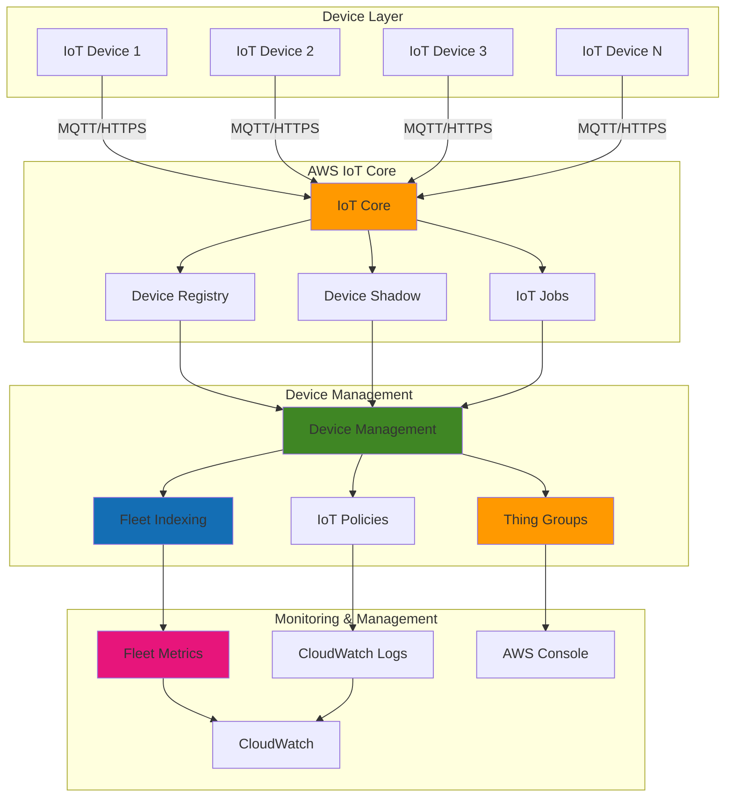

# IoT Device Lifecycle Management with AWS IoT Core

## Problem

Manufacturing companies and fleet operators struggle with managing thousands of IoT devices deployed across multiple locations. Traditional device management approaches require physical access to devices for firmware updates, configuration changes, and troubleshooting, leading to increased operational costs and delayed response times. Device fleet visibility is limited, making it difficult to track device health, monitor connectivity status, and ensure compliance with security policies across the entire fleet.

## Solution

AWS IoT Device Management provides a centralized platform for organizing, monitoring, and managing IoT devices at scale. The solution uses device groups and fleet indexing to organize devices logically, enables remote device provisioning and configuration, and supports over-the-air (OTA) firmware updates. This approach eliminates the need for physical access to devices while providing comprehensive visibility and control over the entire device fleet through AWS IoT Core services.

## Architecture Diagram



## Prerequisites

1. AWS account with IoT Core, IoT Device Management, and CloudWatch permissions
2. AWS CLI v2 installed and configured (or AWS CloudShell)
3. Basic understanding of IoT concepts and device management
4. Familiarity with JSON and command-line operations
5. `jq` utility installed for JSON processing
6. Estimated cost: $0.50-$2.00 per hour for resources created (varies by region and usage)

> **Note**: Fleet indexing and device monitoring may incur additional charges based on the number of devices and data indexed. See [AWS IoT Core pricing](https://aws.amazon.com/iot-core/pricing/) for detailed cost information.

## Preparation

```bash
# Set environment variables
export AWS_REGION=$(aws configure get region)
export AWS_ACCOUNT_ID=$(aws sts get-caller-identity \
    --query Account --output text)

# Generate unique identifiers for resources
RANDOM_SUFFIX=$(aws secretsmanager get-random-password \
    --exclude-punctuation --exclude-uppercase \
    --password-length 6 --require-each-included-type \
    --output text --query RandomPassword)

export FLEET_NAME="fleet-${RANDOM_SUFFIX}"
export THING_TYPE_NAME="sensor-type-${RANDOM_SUFFIX}"
export THING_GROUP_NAME="sensor-group-${RANDOM_SUFFIX}"
export POLICY_NAME="device-policy-${RANDOM_SUFFIX}"

# Enable IoT fleet indexing for device management
aws iot update-indexing-configuration \
    --thing-indexing-configuration \
    thingIndexingMode=REGISTRY_AND_SHADOW,thingConnectivityIndexingMode=STATUS \
    --thing-group-indexing-configuration \
    thingGroupIndexingMode=ON

echo "✅ Fleet indexing enabled for device management"
```

## Steps

1. **Create IoT Thing Type for Device Templates**:

   IoT Thing Types serve as templates that define the attributes and capabilities of similar devices in your fleet. By creating a standardized thing type, you establish a schema for device metadata that enables consistent fleet management, search operations, and automated workflows. This foundational step ensures all temperature sensors in your fleet follow the same attribute structure and can be efficiently managed through the AWS IoT registry.

   ```bash
   # Create a thing type to define device characteristics
   aws iot create-thing-type \
       --thing-type-name $THING_TYPE_NAME \
       --thing-type-properties \
       "thingTypeDescription=Temperature sensor device type,searchableAttributes=location,firmwareVersion,manufacturer"
   
   # Store the thing type ARN for later use
   THING_TYPE_ARN=$(aws iot describe-thing-type \
       --thing-type-name $THING_TYPE_NAME \
       --query thingTypeArn --output text)
   
   echo "✅ Created thing type: $THING_TYPE_NAME"
   ```

   The thing type is now established with searchable attributes that enable fleet indexing to quickly locate devices by location, firmware version, or manufacturer. This template will be applied to all devices created in subsequent steps, ensuring consistent metadata structure across your entire IoT fleet and enabling powerful search capabilities.

2. **Create Thing Group for Device Organization**:

   Thing Groups provide logical organization for devices, enabling batch operations like firmware updates, policy changes, and monitoring. Unlike individual device management, groups allow you to apply configurations and jobs to hundreds or thousands of devices simultaneously. This hierarchical organization mirrors real-world deployment patterns and simplifies fleet administration through centralized management operations.

   ```bash
   # Create a thing group for organizing devices
   aws iot create-thing-group \
       --thing-group-name $THING_GROUP_NAME \
       --thing-group-properties \
       "thingGroupDescription=Production temperature sensors,attributePayload={attributes={Environment=Production,Location=Factory1}}"
   
   # Get the thing group ARN for targeting operations
   THING_GROUP_ARN=$(aws iot describe-thing-group \
       --thing-group-name $THING_GROUP_NAME \
       --query thingGroupArn --output text)
   
   echo "✅ Created thing group: $THING_GROUP_NAME"
   ```

   The thing group now serves as a container for production temperature sensors with shared attributes and policies. Any IoT jobs or configuration changes applied to this group will automatically propagate to all member devices, enabling efficient fleet-wide management operations while maintaining logical organization based on business requirements.

3. **Create IoT Policy for Device Permissions**:

   IoT policies implement fine-grained access control using the principle of least privilege, ensuring devices can only access the specific resources they need. The policy uses dynamic variables like `${iot:Connection.Thing.ThingName}` to automatically scope permissions to each device, preventing unauthorized cross-device access and maintaining security isolation. This follows AWS IoT security best practices for device authentication and authorization.

   ```bash
   # Create IoT policy document for device permissions
   cat > device-policy.json << 'EOF'
   {
     "Version": "2012-10-17",
     "Statement": [
       {
         "Effect": "Allow",
         "Action": [
           "iot:Connect",
           "iot:Publish",
           "iot:Subscribe",
           "iot:Receive"
         ],
         "Resource": [
           "arn:aws:iot:*:*:client/${iot:Connection.Thing.ThingName}",
           "arn:aws:iot:*:*:topic/device/${iot:Connection.Thing.ThingName}/*",
           "arn:aws:iot:*:*:topicfilter/device/${iot:Connection.Thing.ThingName}/*"
         ]
       },
       {
         "Effect": "Allow",
         "Action": [
           "iot:GetThingShadow",
           "iot:UpdateThingShadow",
           "iot:DeleteThingShadow"
         ],
         "Resource": [
           "arn:aws:iot:*:*:thing/${iot:Connection.Thing.ThingName}"
         ]
       }
     ]
   }
   EOF
   
   # Create the IoT policy with device permissions
   aws iot create-policy \
       --policy-name $POLICY_NAME \
       --policy-document file://device-policy.json
   
   echo "✅ Created IoT policy: $POLICY_NAME"
   ```

   The IoT policy now enforces security boundaries that allow devices to communicate only through their designated topics and manage their own device shadows. This security model scales automatically as new devices are added while maintaining isolation between different devices in the fleet, following AWS security best practices.

4. **Provision Multiple IoT Devices**:

   Device provisioning creates individual IoT Things that represent physical devices in your fleet. Each thing inherits the structure from the thing type while maintaining unique attributes like location and device-specific identifiers. This step demonstrates bulk provisioning patterns that can be automated for large-scale deployments across multiple facilities using the AWS IoT Device Management service.

   ```bash
   # Create multiple devices for fleet demonstration
   DEVICES=("temp-sensor-01" "temp-sensor-02" "temp-sensor-03" "temp-sensor-04")
   LOCATIONS=("Building-A" "Building-B" "Building-C" "Building-D")
   
   for i in ${!DEVICES[@]}; do
       DEVICE_NAME="${DEVICES[$i]}"
       LOCATION="${LOCATIONS[$i]}"
       
       # Create IoT thing with metadata attributes
       aws iot create-thing \
           --thing-name $DEVICE_NAME \
           --thing-type-name $THING_TYPE_NAME \
           --attribute-payload \
           "{\"attributes\":{\"location\":\"$LOCATION\",\"firmwareVersion\":\"1.0.0\",\"manufacturer\":\"AcmeSensors\"}}"
       
       # Add thing to group for batch management
       aws iot add-thing-to-thing-group \
           --thing-name $DEVICE_NAME \
           --thing-group-name $THING_GROUP_NAME
       
       echo "✅ Provisioned device: $DEVICE_NAME in $LOCATION"
   done
   ```

   Four temperature sensors are now registered in the IoT registry with location-specific attributes and automatic group membership. The fleet indexing service can now search and filter these devices by any attribute, enabling powerful fleet management operations like location-based firmware updates or building-specific monitoring configurations.

5. **Create Device Certificates and Attach Policies**:

   X.509 certificates provide mutual authentication between devices and AWS IoT Core, ensuring secure, encrypted communication channels. Each device receives a unique certificate that serves as its digital identity, enabling secure connection establishment and message encryption. This PKI-based security model eliminates the need for shared secrets or API keys while providing robust authentication capabilities.

   ```bash
   # Create certificates for each device
   for DEVICE in "${DEVICES[@]}"; do
       # Create certificate and keys for device authentication
       CERT_OUTPUT=$(aws iot create-keys-and-certificate \
           --set-as-active \
           --query '{certificateArn:certificateArn,certificateId:certificateId}' \
           --output json)
       
       CERT_ARN=$(echo $CERT_OUTPUT | jq -r '.certificateArn')
       CERT_ID=$(echo $CERT_OUTPUT | jq -r '.certificateId')
       
       # Attach IoT policy to certificate for permissions
       aws iot attach-policy \
           --policy-name $POLICY_NAME \
           --target $CERT_ARN
       
       # Attach certificate to thing for identity binding
       aws iot attach-thing-principal \
           --thing-name $DEVICE \
           --principal $CERT_ARN
       
       echo "✅ Certificate attached to device: $DEVICE"
   done
   ```

   Each device now has a unique certificate with attached IoT policies that enforce access controls. The certificate-to-thing binding establishes the device's identity for all subsequent IoT operations, while the attached policy ensures the device can only access authorized resources and topics according to the principle of least privilege.

6. **Create Dynamic Thing Groups for Monitoring**:

   Dynamic Thing Groups automatically organize devices based on real-time attribute queries, enabling self-maintaining organizational structures. Unlike static groups that require manual device addition, dynamic groups automatically include or exclude devices as their attributes change, ensuring accurate targeting for monitoring, updates, and compliance checks. This automation reduces operational overhead and ensures groups remain current.

   ```bash
   # Create dynamic group for devices with old firmware
   aws iot create-dynamic-thing-group \
       --thing-group-name "outdated-firmware-${RANDOM_SUFFIX}" \
       --query-string "attributes.firmwareVersion:1.0.0" \
       --thing-group-properties \
       "thingGroupDescription=Devices requiring firmware updates"
   
   # Create dynamic group for building A devices
   aws iot create-dynamic-thing-group \
       --thing-group-name "building-a-sensors-${RANDOM_SUFFIX}" \
       --query-string "attributes.location:Building-A" \
       --thing-group-properties \
       "thingGroupDescription=All sensors in Building A"
   
   echo "✅ Created dynamic thing groups for monitoring"
   ```

   Dynamic groups now provide automated organization based on firmware versions and device locations. As devices receive firmware updates or are relocated, they automatically move between groups, enabling targeted management operations and ensuring accurate fleet visibility without manual intervention or administrative overhead.

7. **Set Up Fleet Monitoring and Logging**:

   Comprehensive logging provides visibility into device behavior, connection patterns, and operational issues across the fleet. Group-level logging enables centralized monitoring while CloudWatch integration provides searchable logs, metrics, and alerting capabilities essential for production IoT deployments at scale. This monitoring foundation enables proactive issue detection and troubleshooting.

   ```bash
   # Set logging level for the thing group
   aws iot set-v2-logging-level \
       --log-target \
       "{\"targetType\":\"THING_GROUP\",\"targetName\":\"$THING_GROUP_NAME\"}" \
       --log-level INFO
   
   # Create CloudWatch log group for IoT logs
   aws logs create-log-group \
       --log-group-name "/aws/iot/device-management-${RANDOM_SUFFIX}" \
       --retention-in-days 30
   
   echo "✅ Configured fleet monitoring and logging"
   ```

   Fleet logging is now configured to capture device connection events, message publishing activities, and policy violations at the INFO level. The CloudWatch log group provides centralized storage with automatic retention management, enabling efficient troubleshooting and compliance auditing across the entire device fleet.

8. **Create IoT Job for Firmware Updates**:

   IoT Jobs enable over-the-air (OTA) updates and remote device management without requiring physical access to devices. Continuous jobs automatically include new devices added to the target group, ensuring consistent firmware versions across the fleet. The job execution controls prevent overwhelming the network and infrastructure by limiting concurrent updates and providing timeout protection.

   ```bash
   # Create job document for firmware update
   cat > firmware-update-job.json << 'EOF'
   {
     "operation": "firmwareUpdate",
     "firmwareVersion": "1.1.0",
     "downloadUrl": "https://example-firmware-bucket.s3.amazonaws.com/firmware-v1.1.0.bin",
     "checksum": "sha256:abc123def456789abcdef123456789abcdef123456789abcdef123456789abcdef",
     "rebootRequired": true,
     "timeout": 300
   }
   EOF
   
   # Create continuous job for firmware updates
   aws iot create-job \
       --job-id "firmware-update-${RANDOM_SUFFIX}" \
       --targets $THING_GROUP_ARN \
       --document file://firmware-update-job.json \
       --description "Firmware update to version 1.1.0" \
       --target-selection CONTINUOUS \
       --job-executions-config \
       "maxConcurrentExecutions=5" \
       --timeout-config \
       "inProgressTimeoutInMinutes=30"
   
   echo "✅ Created firmware update job for device fleet"
   ```

   The firmware update job is now deployed to all devices in the sensor group with built-in safety controls including concurrent execution limits and timeouts. Devices will receive the job notification and execute the firmware update according to their individual schedules, providing detailed status reporting throughout the process.

   > **Warning**: Always test firmware updates on a small subset of devices before deploying to the entire fleet to prevent widespread outages from faulty firmware. Consider implementing a canary deployment strategy for critical updates.

9. **Configure Device Monitoring with Device Shadows**:

   Device Shadows maintain the current and desired state of IoT devices, enabling robust offline-first communication patterns. The shadow acts as a persistent, JSON-based representation of device state that applications can interact with even when devices are disconnected, ensuring reliable device management across intermittent network conditions. This mechanism enables asynchronous device state management and configuration.

   ```bash
   # Update device shadow for one device to simulate telemetry
   DEVICE_NAME="${DEVICES[0]}"
   
   # Create shadow document with current timestamp
   CURRENT_TIMESTAMP=$(date -u +"%Y-%m-%dT%H:%M:%SZ")
   
   cat > shadow-update.json << EOF
   {
     "state": {
       "reported": {
         "temperature": 22.5,
         "humidity": 45.2,
         "batteryLevel": 85,
         "lastSeen": "$CURRENT_TIMESTAMP",
         "firmwareVersion": "1.0.0"
       },
       "desired": {
         "reportingInterval": 60,
         "alertThreshold": 30.0
       }
     }
   }
   EOF
   
   # Update device shadow with current state
   aws iot-data update-thing-shadow \
       --thing-name $DEVICE_NAME \
       --payload file://shadow-update.json \
       shadow-output.json
   
   echo "✅ Updated device shadow for $DEVICE_NAME"
   ```

   The device shadow now contains both the current sensor readings (reported state) and the desired configuration (desired state). When the device reconnects, it will compare these states and adjust its behavior accordingly, demonstrating the shadow's role in enabling reliable device state management and configuration synchronization.

10. **Create Fleet Metrics for Monitoring**:

    Fleet Metrics provide aggregated insights into device fleet health and characteristics by automatically collecting and analyzing data from the fleet index. These metrics enable proactive monitoring, trend analysis, and automated alerting based on fleet-wide conditions rather than individual device monitoring. The metrics integrate with CloudWatch for comprehensive monitoring capabilities.

    ```bash
    # Create fleet metric for device connectivity
    aws iot create-fleet-metric \
        --metric-name "ConnectedDevices-${RANDOM_SUFFIX}" \
        --query-string "connectivity.connected:true" \
        --aggregation-type name=Statistics,values=count \
        --period 300 \
        --aggregation-field "connectivity.connected" \
        --description "Count of connected devices in fleet"
    
    # Create fleet metric for firmware versions
    aws iot create-fleet-metric \
        --metric-name "FirmwareVersions-${RANDOM_SUFFIX}" \
        --query-string "attributes.firmwareVersion:*" \
        --aggregation-type name=Statistics,values=count \
        --period 300 \
        --aggregation-field "attributes.firmwareVersion" \
        --description "Distribution of firmware versions"
    
    echo "✅ Created fleet metrics for monitoring"
    ```

    Fleet metrics now continuously monitor device connectivity status and firmware version distribution across the entire fleet. These metrics integrate with CloudWatch to enable automated alerting when connectivity drops below thresholds or when firmware compliance issues are detected, providing proactive fleet health monitoring.

    > **Note**: Fleet metrics are published to CloudWatch at regular intervals, enabling integration with existing monitoring dashboards and alerting systems. See [AWS IoT Fleet Metrics documentation](https://docs.aws.amazon.com/iot/latest/developerguide/fleet-metrics.html) for advanced configuration options and pricing details.

## Validation & Testing

1. **Verify Device Registration and Grouping**:

   ```bash
   # List all devices in the thing group
   aws iot list-things-in-thing-group \
       --thing-group-name $THING_GROUP_NAME
   
   # Check dynamic group membership
   aws iot list-things-in-thing-group \
       --thing-group-name "outdated-firmware-${RANDOM_SUFFIX}"
   ```

   Expected output: JSON array containing device names organized by group membership

2. **Test Device Search and Fleet Indexing**:

   ```bash
   # Search for devices by firmware version
   aws iot search-index \
       --index-name "AWS_Things" \
       --query-string "attributes.firmwareVersion:1.0.0"
   
   # Search for devices by location
   aws iot search-index \
       --index-name "AWS_Things" \
       --query-string "attributes.location:Building-A"
   ```

   Expected output: Device details matching the search criteria with full attribute information

3. **Verify IoT Job Status**:

   ```bash
   # Check job status and execution details
   aws iot describe-job \
       --job-id "firmware-update-${RANDOM_SUFFIX}"
   
   # List job executions for each device
   aws iot list-job-executions-for-job \
       --job-id "firmware-update-${RANDOM_SUFFIX}"
   ```

   Expected output: Job details including status, target information, and execution progress

4. **Test Device Shadow Operations**:

   ```bash
   # Retrieve device shadow state
   aws iot-data get-thing-shadow \
       --thing-name ${DEVICES[0]} \
       retrieved-shadow.json
   
   # Display shadow contents with formatting
   cat retrieved-shadow.json | jq '.'
   ```

   Expected output: Device shadow containing both reported and desired states with metadata

5. **Verify Fleet Metrics Creation**:

   ```bash
   # List created fleet metrics
   aws iot list-fleet-metrics
   
   # Describe specific fleet metric
   aws iot describe-fleet-metric \
       --metric-name "ConnectedDevices-${RANDOM_SUFFIX}"
   ```

   Expected output: Fleet metric configuration details and current status

## Cleanup

1. **Delete IoT Jobs and Fleet Metrics**:

   ```bash
   # Cancel and delete IoT job
   aws iot cancel-job \
       --job-id "firmware-update-${RANDOM_SUFFIX}" \
       --force
   
   aws iot delete-job \
       --job-id "firmware-update-${RANDOM_SUFFIX}" \
       --force
   
   # Delete fleet metrics
   aws iot delete-fleet-metric \
       --metric-name "ConnectedDevices-${RANDOM_SUFFIX}"
   
   aws iot delete-fleet-metric \
       --metric-name "FirmwareVersions-${RANDOM_SUFFIX}"
   
   echo "✅ Deleted IoT jobs and fleet metrics"
   ```

2. **Remove Device Certificates and Policies**:

   ```bash
   # List and clean up certificates for each device
   for DEVICE in "${DEVICES[@]}"; do
       # Get certificate ARNs for the device
       CERT_ARNS=$(aws iot list-thing-principals \
           --thing-name $DEVICE \
           --query 'principals[]' --output text)
       
       for CERT_ARN in $CERT_ARNS; do
           # Detach policy from certificate
           aws iot detach-policy \
               --policy-name $POLICY_NAME \
               --target $CERT_ARN
           
           # Detach certificate from thing
           aws iot detach-thing-principal \
               --thing-name $DEVICE \
               --principal $CERT_ARN
           
           # Get certificate ID and deactivate
           CERT_ID=$(echo $CERT_ARN | cut -d'/' -f2)
           aws iot update-certificate \
               --certificate-id $CERT_ID \
               --new-status INACTIVE
           
           # Delete certificate after deactivation
           aws iot delete-certificate \
               --certificate-id $CERT_ID
       done
       
       echo "✅ Cleaned up certificates for $DEVICE"
   done
   ```

3. **Remove Thing Groups and Dynamic Groups**:

   ```bash
   # Remove devices from static group
   for DEVICE in "${DEVICES[@]}"; do
       aws iot remove-thing-from-thing-group \
           --thing-name $DEVICE \
           --thing-group-name $THING_GROUP_NAME
   done
   
   # Delete dynamic thing groups
   aws iot delete-dynamic-thing-group \
       --thing-group-name "outdated-firmware-${RANDOM_SUFFIX}"
   
   aws iot delete-dynamic-thing-group \
       --thing-group-name "building-a-sensors-${RANDOM_SUFFIX}"
   
   # Delete static thing group
   aws iot delete-thing-group \
       --thing-group-name $THING_GROUP_NAME
   
   echo "✅ Deleted thing groups"
   ```

4. **Remove IoT Things and Policies**:

   ```bash
   # Delete IoT things from registry
   for DEVICE in "${DEVICES[@]}"; do
       aws iot delete-thing --thing-name $DEVICE
   done
   
   # Delete thing type template
   aws iot delete-thing-type \
       --thing-type-name $THING_TYPE_NAME
   
   # Delete IoT policy
   aws iot delete-policy \
       --policy-name $POLICY_NAME
   
   echo "✅ Deleted IoT things and policies"
   ```

5. **Clean up Logging Resources**:

   ```bash
   # Delete CloudWatch log group
   aws logs delete-log-group \
       --log-group-name "/aws/iot/device-management-${RANDOM_SUFFIX}"
   
   # Clean up local files
   rm -f device-policy.json firmware-update-job.json \
         shadow-update.json shadow-output.json retrieved-shadow.json
   
   echo "✅ Cleaned up logging resources and local files"
   ```

## Discussion

AWS IoT Device Management provides a comprehensive solution for managing IoT devices at scale through several key capabilities that follow the AWS Well-Architected Framework. The device registry serves as the central repository for device metadata, while thing groups enable logical organization of devices based on function, location, or other business criteria. Fleet indexing allows for powerful search and filtering capabilities across the entire device fleet, making it easy to identify devices that need attention or updates based on various attributes and states.

The integration with AWS IoT Jobs enables remote management operations such as firmware updates, configuration changes, and troubleshooting commands without requiring physical access to devices. Jobs can be targeted at individual devices, groups of devices, or dynamic groups that automatically include devices matching specific criteria. This eliminates the need for field technicians to visit device locations while ensuring consistent management across the fleet, reducing operational costs and improving response times.

Device shadows provide a powerful mechanism for managing device state, allowing applications to interact with devices even when they're offline. The shadow document maintains the last known state and desired configuration, enabling robust offline-first device management patterns. Combined with IoT policies that implement fine-grained access controls, this creates a secure and scalable foundation for device communication and management that follows security best practices.

Cost optimization is achieved through efficient use of fleet indexing, which only indexes the attributes you need for searching and monitoring. Consider using lifecycle policies for CloudWatch logs and implementing device-level logging controls to manage costs effectively. The continuous job feature ensures that new devices added to groups automatically receive necessary updates without manual intervention, reducing administrative overhead. For additional cost optimization strategies, see the [AWS IoT Core pricing documentation](https://aws.amazon.com/iot-core/pricing/) and [AWS Well-Architected IoT Lens](https://docs.aws.amazon.com/wellarchitected/latest/iot-lens/welcome.html).

> **Tip**: Use dynamic thing groups to automatically categorize devices based on attributes like firmware version, location, or health status. This enables automated management workflows and reduces manual operational overhead while ensuring accurate targeting for updates and monitoring.

> **Warning**: IoT certificates have a maximum lifetime of 10 years and cannot be renewed. Implement certificate rotation procedures before certificates expire to maintain device connectivity. Use AWS IoT Device Management to track certificate expiration dates and automate rotation processes.

## Challenge

Extend this solution by implementing these enhancements:

1. **Advanced OTA Updates**: Implement delta updates for firmware to reduce bandwidth usage and update times, especially for devices on constrained networks. Use AWS IoT Jobs with file streaming capabilities for efficient updates.
2. **Device Health Monitoring**: Create automated health checks using device shadows and fleet metrics to detect and alert on device anomalies or failures. Integrate with AWS CloudWatch alarms for proactive monitoring.
3. **Compliance Automation**: Build automated compliance checking using AWS Config rules to ensure devices maintain security baselines and required configurations. Implement automated remediation for common compliance violations.
4. **Multi-Region Fleet Management**: Extend the solution to manage devices across multiple AWS regions with centralized monitoring and cross-region failover capabilities for global IoT deployments.
5. **Integration with IoT Analytics**: Connect device management data with AWS IoT Analytics to create predictive maintenance models and operational insights based on device telemetry and management events.

## Infrastructure Code

### Available Infrastructure as Code:

- [Infrastructure Code Overview](code/README.md) - Detailed description of all infrastructure components
- [AWS CDK (Python)](code/cdk-python/) - AWS CDK Python implementation
- [AWS CDK (TypeScript)](code/cdk-typescript/) - AWS CDK TypeScript implementation
- [CloudFormation](code/cloudformation.yaml) - AWS CloudFormation template
- [Bash CLI Scripts](code/scripts/) - Example bash scripts using AWS CLI commands to deploy infrastructure
- [Terraform](code/terraform/) - Terraform configuration files