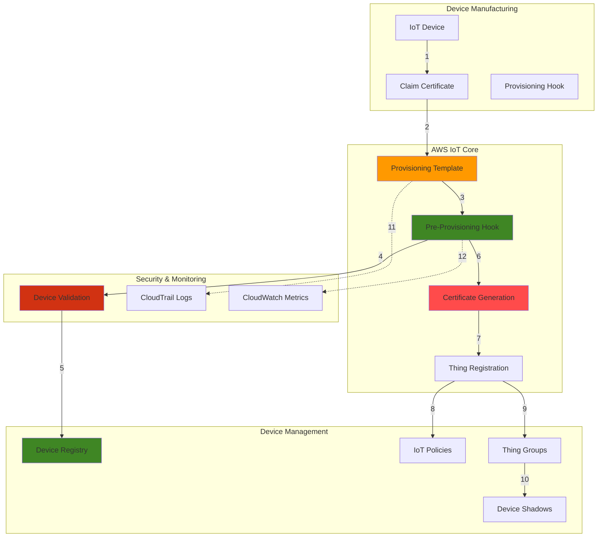

# IoT Device Provisioning and Certificate Management with AWS IoT Core

## Problem

Manufacturing companies deploying thousands of IoT devices face complex challenges in securely onboarding devices to their AWS IoT infrastructure. Manual certificate creation and device registration is time-consuming and error-prone, while bulk provisioning without proper security controls creates vulnerabilities. Organizations need automated, secure device provisioning that validates device authenticity, assigns appropriate policies, and maintains audit trails for compliance requirements.

## Solution

AWS IoT Core's fleet provisioning capabilities provide automated, secure device onboarding using provisioning templates and claim certificates. This solution implements just-in-time device registration with automatic certificate generation, policy attachment, and device metadata storage, ensuring each device receives unique credentials and appropriate permissions based on its device type and intended use case.

## Architecture Diagram



## Prerequisites

1. AWS account with IoT Core, Lambda, DynamoDB, and IAM permissions
2. AWS CLI v2 installed and configured (or AWS CloudShell)
3. Understanding of X.509 certificates and PKI concepts
4. Knowledge of IoT device authentication and MQTT protocol
5. Python 3.9+ for Lambda function development
6. Estimated cost: $10-20 per month for device registry and certificate operations

> **Note**: This recipe implements production-ready device provisioning with security best practices including device validation, certificate lifecycle management, and audit logging.

## Preparation

```bash
# Set environment variables
export AWS_REGION=$(aws configure get region)
export AWS_ACCOUNT_ID=$(aws sts get-caller-identity \
    --query Account --output text)

# Generate unique identifiers for resources
RANDOM_SUFFIX=$(aws secretsmanager get-random-password \
    --exclude-punctuation --exclude-uppercase \
    --password-length 6 --require-each-included-type \
    --output text --query RandomPassword)

export TEMPLATE_NAME="device-provisioning-template-${RANDOM_SUFFIX}"
export HOOK_FUNCTION_NAME="device-provisioning-hook-${RANDOM_SUFFIX}"
export DEVICE_REGISTRY_TABLE="device-registry-${RANDOM_SUFFIX}"
export IOT_ROLE_NAME="iot-provisioning-role-${RANDOM_SUFFIX}"
export THING_GROUP_NAME="provisioned-devices-${RANDOM_SUFFIX}"

# Create DynamoDB table for device registry
aws dynamodb create-table \
    --table-name $DEVICE_REGISTRY_TABLE \
    --attribute-definitions \
        AttributeName=serialNumber,AttributeType=S \
        AttributeName=deviceType,AttributeType=S \
    --key-schema \
        AttributeName=serialNumber,KeyType=HASH \
    --global-secondary-indexes \
        IndexName=DeviceTypeIndex,KeySchema='{AttributeName=deviceType,KeyType=HASH}',Projection='{ProjectionType=ALL}',ProvisionedThroughput='{ReadCapacityUnits=5,WriteCapacityUnits=5}' \
    --billing-mode PAY_PER_REQUEST \
    --tags Key=Project,Value=IoTProvisioning

# Wait for table to be active
aws dynamodb wait table-exists --table-name $DEVICE_REGISTRY_TABLE
echo "✅ Device registry table created: $DEVICE_REGISTRY_TABLE"

# Create IAM role for IoT provisioning
cat > /tmp/iot-provisioning-trust-policy.json << 'EOF'
{
    "Version": "2012-10-17",
    "Statement": [
        {
            "Effect": "Allow",
            "Principal": {
                "Service": "iot.amazonaws.com"
            },
            "Action": "sts:AssumeRole"
        }
    ]
}
EOF

aws iam create-role \
    --role-name $IOT_ROLE_NAME \
    --assume-role-policy-document file:///tmp/iot-provisioning-trust-policy.json \
    --tags Key=Project,Value=IoTProvisioning

echo "✅ IAM role created for IoT provisioning"
```

## Steps

1. **Create Pre-Provisioning Hook Lambda Function**:

   AWS Lambda enables serverless execution of device validation logic without managing infrastructure. This pre-provisioning hook acts as a security gateway, validating device metadata against business rules before allowing certificate generation. The function integrates with DynamoDB to maintain device state and prevent unauthorized provisioning attempts, providing enterprise-grade device onboarding security.

   ```bash
   # Create Lambda function for device validation
   mkdir -p device-provisioning-hook
   cat > device-provisioning-hook/lambda_function.py << 'EOF'
import json
import boto3
import logging
import os
from datetime import datetime, timezone

# Configure logging
logger = logging.getLogger()
logger.setLevel(logging.INFO)

dynamodb = boto3.resource('dynamodb')
iot = boto3.client('iot')

def lambda_handler(event, context):
    """
    Pre-provisioning hook to validate and authorize device provisioning
    """
    try:
        # Extract device information from provisioning request
        certificate_pem = event.get('certificatePem', '')
        template_arn = event.get('templateArn', '')
        parameters = event.get('parameters', {})
        
        serial_number = parameters.get('SerialNumber', '')
        device_type = parameters.get('DeviceType', '')
        firmware_version = parameters.get('FirmwareVersion', '')
        manufacturer = parameters.get('Manufacturer', '')
        
        logger.info(f"Processing provisioning request for device: {serial_number}")
        
        # Validate required parameters
        if not all([serial_number, device_type, manufacturer]):
            return create_response(False, "Missing required device parameters")
        
        # Validate device type
        valid_device_types = ['temperature-sensor', 'humidity-sensor', 'pressure-sensor', 'gateway']
        if device_type not in valid_device_types:
            return create_response(False, f"Invalid device type: {device_type}")
        
        # Check if device is already registered
        table_name = os.environ.get('DEVICE_REGISTRY_TABLE')
        if not table_name:
            logger.error("DEVICE_REGISTRY_TABLE environment variable not set")
            return create_response(False, "Configuration error")
            
        table = dynamodb.Table(table_name)
        
        try:
            response = table.get_item(Key={'serialNumber': serial_number})
            if 'Item' in response:
                existing_status = response['Item'].get('status', '')
                if existing_status == 'provisioned':
                    return create_response(False, "Device already provisioned")
                elif existing_status == 'revoked':
                    return create_response(False, "Device has been revoked")
        except Exception as e:
            logger.error(f"Error checking device registry: {str(e)}")
        
        # Validate firmware version (basic check)
        if firmware_version and not firmware_version.startswith('v'):
            return create_response(False, "Invalid firmware version format")
        
        # Store device information in registry
        try:
            device_item = {
                'serialNumber': serial_number,
                'deviceType': device_type,
                'manufacturer': manufacturer,
                'firmwareVersion': firmware_version,
                'status': 'provisioning',
                'provisioningTimestamp': datetime.now(timezone.utc).isoformat(),
                'templateArn': template_arn
            }
            
            table.put_item(Item=device_item)
            logger.info(f"Device {serial_number} registered in device registry")
            
        except Exception as e:
            logger.error(f"Error storing device in registry: {str(e)}")
            return create_response(False, "Failed to register device")
        
        # Determine thing group based on device type
        thing_group = f"{device_type}-devices"
        
        # Create response with device-specific parameters
        response_parameters = {
            'ThingName': f"{device_type}-{serial_number}",
            'ThingGroupName': thing_group,
            'DeviceLocation': parameters.get('Location', 'unknown'),
            'ProvisioningTime': datetime.now(timezone.utc).isoformat()
        }
        
        return create_response(True, "Device validation successful", response_parameters)
        
    except Exception as e:
        logger.error(f"Unexpected error in provisioning hook: {str(e)}")
        return create_response(False, "Internal provisioning error")

def create_response(allow_provisioning, message, parameters=None):
    """Create standardized response for provisioning hook"""
    response = {
        'allowProvisioning': allow_provisioning,
        'message': message
    }
    
    if parameters:
        response['parameters'] = parameters
    
    logger.info(f"Provisioning response: {response}")
    return response
EOF
   
   # Create deployment package
   cd device-provisioning-hook
   zip -r ../device-provisioning-hook.zip .
   cd ..
   
   echo "✅ Pre-provisioning hook Lambda function created"
   ```

   The Lambda function package is now ready for deployment. This validation logic ensures only authorized devices with proper metadata can receive certificates, preventing unauthorized device access and maintaining device inventory integrity.

2. **Deploy Lambda Function and Configure Permissions**:

   Lambda execution requires specific IAM permissions to interact with DynamoDB and IoT services securely. Following the principle of least privilege, we create targeted roles that grant only the minimum permissions necessary for device validation operations. This security approach prevents privilege escalation and maintains audit compliance while enabling the function to perform its validation tasks.

   ```bash
   # Create Lambda execution role
   cat > /tmp/lambda-trust-policy.json << 'EOF'
   {
       "Version": "2012-10-17",
       "Statement": [
           {
               "Effect": "Allow",
               "Principal": {
                   "Service": "lambda.amazonaws.com"
               },
               "Action": "sts:AssumeRole"
           }
       ]
   }
   EOF
   
   aws iam create-role \
       --role-name "${HOOK_FUNCTION_NAME}-execution-role" \
       --assume-role-policy-document file:///tmp/lambda-trust-policy.json
   
   # Create custom policy for Lambda function
   cat > /tmp/lambda-policy.json << EOF
   {
       "Version": "2012-10-17",
       "Statement": [
           {
               "Effect": "Allow",
               "Action": [
                   "logs:CreateLogGroup",
                   "logs:CreateLogStream",
                   "logs:PutLogEvents"
               ],
               "Resource": "arn:aws:logs:${AWS_REGION}:${AWS_ACCOUNT_ID}:*"
           },
           {
               "Effect": "Allow",
               "Action": [
                   "dynamodb:GetItem",
                   "dynamodb:PutItem",
                   "dynamodb:UpdateItem",
                   "dynamodb:Query"
               ],
               "Resource": "arn:aws:dynamodb:${AWS_REGION}:${AWS_ACCOUNT_ID}:table/${DEVICE_REGISTRY_TABLE}*"
           },
           {
               "Effect": "Allow",
               "Action": [
                   "iot:DescribeThing",
                   "iot:ListThingTypes"
               ],
               "Resource": "*"
           }
       ]
   }
   EOF
   
   # Create and attach policy
   aws iam create-policy \
       --policy-name "${HOOK_FUNCTION_NAME}-policy" \
       --policy-document file:///tmp/lambda-policy.json
   
   aws iam attach-role-policy \
       --role-name "${HOOK_FUNCTION_NAME}-execution-role" \
       --policy-arn "arn:aws:iam::${AWS_ACCOUNT_ID}:policy/${HOOK_FUNCTION_NAME}-policy"
   
   # Deploy Lambda function
   aws lambda create-function \
       --function-name $HOOK_FUNCTION_NAME \
       --runtime python3.9 \
       --role "arn:aws:iam::${AWS_ACCOUNT_ID}:role/${HOOK_FUNCTION_NAME}-execution-role" \
       --handler lambda_function.lambda_handler \
       --zip-file fileb://device-provisioning-hook.zip \
       --timeout 60 \
       --memory-size 256 \
       --environment Variables="{DEVICE_REGISTRY_TABLE=${DEVICE_REGISTRY_TABLE}}" \
       --tags Project=IoTProvisioning
   
   echo "✅ Lambda function deployed with permissions"
   ```

   The Lambda function is now operational with appropriate security permissions. This setup enables real-time device validation during the provisioning process while maintaining detailed audit logs through CloudWatch for compliance and troubleshooting purposes.

> **Warning**: Ensure proper IAM permissions are configured before proceeding to avoid access denied errors during provisioning operations.

3. **Create Thing Groups for Device Organization**:

   AWS IoT Thing Groups provide hierarchical organization for devices, enabling bulk operations and policy management across device fleets. This organizational structure supports scalable device management by grouping devices based on type, location, or function. Thing Groups also enable targeted firmware updates, configuration changes, and monitoring policies, reducing operational complexity in large-scale IoT deployments.

   ```bash
   # Create parent thing group for all provisioned devices
   aws iot create-thing-group \
       --thing-group-name $THING_GROUP_NAME \
       --thing-group-properties \
       'thingGroupDescription="Parent group for all provisioned devices"'
   
   # Create device-type specific thing groups
   DEVICE_TYPES=("temperature-sensor" "humidity-sensor" "pressure-sensor" "gateway")
   
   for device_type in "${DEVICE_TYPES[@]}"; do
       aws iot create-thing-group \
           --thing-group-name "${device_type}-devices" \
           --thing-group-properties \
           "thingGroupDescription=\"${device_type} devices\",parentGroupName=\"${THING_GROUP_NAME}\""
   done
   
   echo "✅ Thing groups created for device organization"
   ```

   The hierarchical thing group structure is now established, providing the foundation for organized device management and targeted policy application. This structure enables efficient fleet operations and simplifies device lifecycle management across different device types.

4. **Create IoT Policies for Device Types**:

   IoT policies define fine-grained permissions for device operations, controlling which MQTT topics devices can access and what actions they can perform. These policies implement the principle of least privilege by granting only the minimum permissions necessary for each device type to function. This security approach prevents unauthorized data access and limits the potential impact of compromised devices.

   ```bash
   # Create policy for temperature sensors
   cat > /tmp/temperature-sensor-policy.json << EOF
   {
       "Version": "2012-10-17",
       "Statement": [
           {
               "Effect": "Allow",
               "Action": [
                   "iot:Connect"
               ],
               "Resource": "arn:aws:iot:${AWS_REGION}:${AWS_ACCOUNT_ID}:client/temperature-sensor-*"
           },
           {
               "Effect": "Allow",
               "Action": [
                   "iot:Publish"
               ],
               "Resource": "arn:aws:iot:${AWS_REGION}:${AWS_ACCOUNT_ID}:topic/sensors/temperature/*"
           },
           {
               "Effect": "Allow",
               "Action": [
                   "iot:Subscribe",
                   "iot:Receive"
               ],
               "Resource": [
                   "arn:aws:iot:${AWS_REGION}:${AWS_ACCOUNT_ID}:topicfilter/config/temperature-sensor/*",
                   "arn:aws:iot:${AWS_REGION}:${AWS_ACCOUNT_ID}:topic/config/temperature-sensor/*"
               ]
           },
           {
               "Effect": "Allow",
               "Action": [
                   "iot:GetThingShadow",
                   "iot:UpdateThingShadow"
               ],
               "Resource": "arn:aws:iot:${AWS_REGION}:${AWS_ACCOUNT_ID}:thing/temperature-sensor-*"
           }
       ]
   }
   EOF
   
   aws iot create-policy \
       --policy-name "TemperatureSensorPolicy" \
       --policy-document file:///tmp/temperature-sensor-policy.json
   
   # Create policy for gateway devices
   cat > /tmp/gateway-policy.json << EOF
   {
       "Version": "2012-10-17",
       "Statement": [
           {
               "Effect": "Allow",
               "Action": [
                   "iot:Connect"
               ],
               "Resource": "arn:aws:iot:${AWS_REGION}:${AWS_ACCOUNT_ID}:client/gateway-*"
           },
           {
               "Effect": "Allow",
               "Action": [
                   "iot:Publish"
               ],
               "Resource": [
                   "arn:aws:iot:${AWS_REGION}:${AWS_ACCOUNT_ID}:topic/gateway/*",
                   "arn:aws:iot:${AWS_REGION}:${AWS_ACCOUNT_ID}:topic/sensors/*"
               ]
           },
           {
               "Effect": "Allow",
               "Action": [
                   "iot:Subscribe",
                   "iot:Receive"
               ],
               "Resource": [
                   "arn:aws:iot:${AWS_REGION}:${AWS_ACCOUNT_ID}:topicfilter/config/gateway/*",
                   "arn:aws:iot:${AWS_REGION}:${AWS_ACCOUNT_ID}:topic/config/gateway/*",
                   "arn:aws:iot:${AWS_REGION}:${AWS_ACCOUNT_ID}:topicfilter/commands/*",
                   "arn:aws:iot:${AWS_REGION}:${AWS_ACCOUNT_ID}:topic/commands/*"
               ]
           },
           {
               "Effect": "Allow",
               "Action": [
                   "iot:GetThingShadow",
                   "iot:UpdateThingShadow"
               ],
               "Resource": "arn:aws:iot:${AWS_REGION}:${AWS_ACCOUNT_ID}:thing/gateway-*"
           }
       ]
   }
   EOF
   
   aws iot create-policy \
       --policy-name "GatewayDevicePolicy" \
       --policy-document file:///tmp/gateway-policy.json
   
   echo "✅ IoT policies created for device types"
   ```

   Device-specific policies are now configured, providing granular security controls for different device types. These policies automatically apply to devices during provisioning, ensuring each device receives only the permissions necessary for its intended function while maintaining system security.

5. **Create Provisioning Template**:

   AWS IoT provisioning templates define the automated workflow for device onboarding, specifying how certificates are generated, policies are attached, and devices are registered. The template integrates with the pre-provisioning hook to enable validation-based provisioning, ensuring only authorized devices receive certificates. This approach scales to millions of devices while maintaining security and audit compliance.

   ```bash
   # Attach policy to IoT role for provisioning permissions
   cat > /tmp/iot-provisioning-policy.json << EOF
   {
       "Version": "2012-10-17",
       "Statement": [
           {
               "Effect": "Allow",
               "Action": [
                   "iot:CreateThing",
                   "iot:DescribeThing",
                   "iot:CreateKeysAndCertificate",
                   "iot:AttachThingPrincipal",
                   "iot:AttachPolicy",
                   "iot:AddThingToThingGroup",
                   "iot:UpdateThingShadow"
               ],
               "Resource": "*"
           },
           {
               "Effect": "Allow",
               "Action": [
                   "lambda:InvokeFunction"
               ],
               "Resource": "arn:aws:lambda:${AWS_REGION}:${AWS_ACCOUNT_ID}:function:${HOOK_FUNCTION_NAME}"
           }
       ]
   }
   EOF
   
   aws iam create-policy \
       --policy-name "${IOT_ROLE_NAME}-policy" \
       --policy-document file:///tmp/iot-provisioning-policy.json
   
   aws iam attach-role-policy \
       --role-name $IOT_ROLE_NAME \
       --policy-arn "arn:aws:iam::${AWS_ACCOUNT_ID}:policy/${IOT_ROLE_NAME}-policy"
   
   # Create provisioning template body
   cat > /tmp/provisioning-template-body.json << 'EOF'
   {
       "Parameters": {
           "SerialNumber": {
               "Type": "String"
           },
           "DeviceType": {
               "Type": "String"
           },
           "FirmwareVersion": {
               "Type": "String"
           },
           "Manufacturer": {
               "Type": "String"
           },
           "Location": {
               "Type": "String"
           },
           "AWS::IoT::Certificate::Id": {
               "Type": "String"
           },
           "AWS::IoT::Certificate::Arn": {
               "Type": "String"
           }
       },
       "Resources": {
           "thing": {
               "Type": "AWS::IoT::Thing",
               "Properties": {
                   "ThingName": {
                       "Ref": "ThingName"
                   },
                   "AttributePayload": {
                       "serialNumber": {
                           "Ref": "SerialNumber"
                       },
                       "deviceType": {
                           "Ref": "DeviceType"
                       },
                       "firmwareVersion": {
                           "Ref": "FirmwareVersion"
                       },
                       "manufacturer": {
                           "Ref": "Manufacturer"
                       },
                       "location": {
                           "Ref": "DeviceLocation"
                       },
                       "provisioningTime": {
                           "Ref": "ProvisioningTime"
                       }
                   },
                   "ThingTypeName": "IoTDevice"
               }
           },
           "certificate": {
               "Type": "AWS::IoT::Certificate",
               "Properties": {
                   "CertificateId": {
                       "Ref": "AWS::IoT::Certificate::Id"
                   },
                   "Status": "Active"
               }
           },
           "policy": {
               "Type": "AWS::IoT::Policy",
               "Properties": {
                   "PolicyName": {
                       "Fn::Sub": "${DeviceType}Policy"
                   }
               }
           }
       }
   }
   EOF
   
   # Create provisioning template
   aws iot create-provisioning-template \
       --template-name $TEMPLATE_NAME \
       --description "Template for automated device provisioning with validation" \
       --template-body file:///tmp/provisioning-template-body.json \
       --enabled \
       --provisioning-role-arn "arn:aws:iam::${AWS_ACCOUNT_ID}:role/${IOT_ROLE_NAME}" \
       --pre-provisioning-hook targetArn="arn:aws:lambda:${AWS_REGION}:${AWS_ACCOUNT_ID}:function:${HOOK_FUNCTION_NAME}",payloadVersion=2020-04-01 \
       --tags Key=Project,Value=IoTProvisioning
   
   echo "✅ Provisioning template created with pre-provisioning hook"
   ```

   The provisioning template is now active and configured to validate devices through the Lambda hook before issuing certificates. This automation eliminates manual provisioning overhead while ensuring security controls are consistently applied across all device onboarding operations.

6. **Create Claim Certificates for Device Manufacturing**:

   Claim certificates enable secure device manufacturing by providing bootstrap credentials that devices can use to request their operational certificates. This approach eliminates the need to embed long-term secrets in devices while ensuring only authorized manufacturing processes can provision devices. The claim certificate has limited permissions, reducing security risk during the manufacturing and shipping phases.

   ```bash
   # Create claim certificate for device manufacturing
   aws iot create-keys-and-certificate \
       --set-as-active \
       --certificate-pem-outfile claim-certificate.pem \
       --public-key-outfile claim-public-key.pem \
       --private-key-outfile claim-private-key.pem > claim-cert-output.json
   
   # Extract certificate ARN
   export CLAIM_CERT_ARN=$(jq -r '.certificateArn' claim-cert-output.json)
   export CLAIM_CERT_ID=$(jq -r '.certificateId' claim-cert-output.json)
   
   # Create policy for claim certificate
   cat > /tmp/claim-cert-policy.json << EOF
   {
       "Version": "2012-10-17",
       "Statement": [
           {
               "Effect": "Allow",
               "Action": [
                   "iot:Connect"
               ],
               "Resource": "*"
           },
           {
               "Effect": "Allow",
               "Action": [
                   "iot:Publish",
                   "iot:Receive"
               ],
               "Resource": "arn:aws:iot:${AWS_REGION}:${AWS_ACCOUNT_ID}:topic/\$aws/provisioning-templates/${TEMPLATE_NAME}/provision/*"
           },
           {
               "Effect": "Allow",
               "Action": [
                   "iot:Subscribe"
               ],
               "Resource": "arn:aws:iot:${AWS_REGION}:${AWS_ACCOUNT_ID}:topicfilter/\$aws/provisioning-templates/${TEMPLATE_NAME}/provision/*"
           }
       ]
   }
   EOF
   
   aws iot create-policy \
       --policy-name "ClaimCertificatePolicy" \
       --policy-document file:///tmp/claim-cert-policy.json
   
   # Attach policy to claim certificate
   aws iot attach-policy \
       --policy-name "ClaimCertificatePolicy" \
       --target $CLAIM_CERT_ARN
   
   echo "✅ Claim certificate created for device manufacturing"
   echo "Claim Certificate ARN: $CLAIM_CERT_ARN"
   ```

   The claim certificate is now ready for embedding in devices during manufacturing. This certificate enables secure provisioning requests while limiting device capabilities until proper operational certificates are issued through the validation process.

7. **Set Up Device Shadow Templates**:

   Device shadows provide a virtual representation of device state, enabling cloud applications to interact with devices even when they're offline. Initializing shadows with device-type-specific configurations ensures consistent device behavior and enables immediate cloud-based device management. This setup supports remote configuration, monitoring, and control capabilities essential for production IoT deployments.

   ```bash
   # Create Lambda function to initialize device shadows after provisioning
   cat > /tmp/shadow-init-function.py << 'EOF'
import json
import boto3
import logging

logger = logging.getLogger()
logger.setLevel(logging.INFO)

iot_data = boto3.client('iot-data')

def lambda_handler(event, context):
    """Initialize device shadow after successful provisioning"""
    try:
        # Extract thing name from the event
        thing_name = event.get('thingName', '')
        device_type = event.get('deviceType', '')
        
        if not thing_name:
            logger.error("Thing name not provided in event")
            return {'statusCode': 400, 'body': 'Thing name required'}
        
        # Create initial shadow document based on device type
        if device_type == 'temperature-sensor':
            initial_shadow = {
                "state": {
                    "desired": {
                        "samplingRate": 30,
                        "temperatureUnit": "celsius",
                        "alertThreshold": 80,
                        "enabled": True
                    }
                }
            }
        elif device_type == 'gateway':
            initial_shadow = {
                "state": {
                    "desired": {
                        "connectionTimeout": 30,
                        "bufferSize": 100,
                        "compressionEnabled": True,
                        "logLevel": "INFO"
                    }
                }
            }
        else:
            initial_shadow = {
                "state": {
                    "desired": {
                        "enabled": True,
                        "reportingInterval": 60
                    }
                }
            }
        
        # Update device shadow
        iot_data.update_thing_shadow(
            thingName=thing_name,
            payload=json.dumps(initial_shadow)
        )
        
        logger.info(f"Initialized shadow for device: {thing_name}")
        return {
            'statusCode': 200,
            'body': json.dumps(f'Shadow initialized for {thing_name}')
        }
        
    except Exception as e:
        logger.error(f"Error initializing shadow: {str(e)}")
        return {
            'statusCode': 500,
            'body': json.dumps(f'Error: {str(e)}')
        }
EOF
   
   # Create shadow initialization Lambda function
   zip shadow-init-function.zip /tmp/shadow-init-function.py
   
   aws lambda create-function \
       --function-name "device-shadow-initializer-${RANDOM_SUFFIX}" \
       --runtime python3.9 \
       --role "arn:aws:iam::${AWS_ACCOUNT_ID}:role/${HOOK_FUNCTION_NAME}-execution-role" \
       --handler shadow-init-function.lambda_handler \
       --zip-file fileb://shadow-init-function.zip \
       --timeout 30
   
   echo "✅ Device shadow initialization function created"
   ```

   Device shadow initialization is now configured to automatically create device-specific configurations immediately after provisioning. This ensures devices receive appropriate initial settings and enables immediate cloud-based management capabilities.

8. **Create Monitoring and Alerts**:

   Comprehensive monitoring and alerting provide visibility into the provisioning process and enable rapid response to security incidents or operational issues. CloudWatch integration captures provisioning metrics and logs, while IoT Rules Engine provides real-time event processing for audit trails. This observability infrastructure is essential for maintaining security posture and compliance in production IoT environments.

   ```bash
   # Create CloudWatch log group for provisioning monitoring
   aws logs create-log-group \
       --log-group-name "/aws/iot/provisioning" \
       --tags Project=IoTProvisioning
   
   # Create CloudWatch alarm for failed provisioning attempts
   aws cloudwatch put-metric-alarm \
       --alarm-name "IoTProvisioningFailures" \
       --alarm-description "Monitor failed device provisioning attempts" \
       --metric-name "Errors" \
       --namespace "AWS/Lambda" \
       --dimensions Name=FunctionName,Value=$HOOK_FUNCTION_NAME \
       --statistic "Sum" \
       --period 300 \
       --threshold 5 \
       --comparison-operator "GreaterThanThreshold" \
       --evaluation-periods 1
   
   # Create IoT rule to log provisioning events
   aws iot create-topic-rule \
       --rule-name "ProvisioningAuditRule" \
       --topic-rule-payload '{
           "sql": "SELECT * FROM \"$aws/events/provisioning/template/+/+\"",
           "description": "Log all provisioning events for audit",
           "actions": [
               {
                   "cloudwatchLogs": {
                       "logGroupName": "/aws/iot/provisioning",
                       "roleArn": "arn:aws:iam::'"${AWS_ACCOUNT_ID}"':role/'"${IOT_ROLE_NAME}"'"
                   }
               }
           ]
       }'
   
   echo "✅ Monitoring and alerting configured"
   ```

   The monitoring infrastructure is now operational, providing real-time visibility into provisioning operations and alerting on potential security incidents. This setup enables proactive management of device onboarding and supports compliance requirements through comprehensive audit logging.

> **Tip**: Implement certificate rotation policies using AWS IoT Device Management Jobs to automatically update device certificates before expiration, ensuring continuous device connectivity and security.

## Validation & Testing

1. **Verify Provisioning Template Configuration**:

   ```bash
   # Check template status
   aws iot describe-provisioning-template \
       --template-name $TEMPLATE_NAME
   
   # List available templates
   aws iot list-provisioning-templates \
       --query 'templates[*].{Name:templateName,Status:enabled,Created:creationDate}'
   ```

   Expected output: Template enabled and configured with pre-provisioning hook

2. **Test Device Provisioning with Simulated Device**:

   ```bash
   # Test provisioning using Lambda function simulation
   python3 << EOF
import boto3
import json
import os

# Simulate provisioning by directly calling the hook function
lambda_client = boto3.client('lambda')

test_event = {
    'parameters': {
        'SerialNumber': 'SN123456789',
        'DeviceType': 'temperature-sensor',
        'FirmwareVersion': 'v1.2.3',
        'Manufacturer': 'AcmeIoT',
        'Location': 'Factory-Floor-A'
    },
    'certificatePem': 'test-certificate',
    'templateArn': 'test-template-arn'
}

response = lambda_client.invoke(
    FunctionName='${HOOK_FUNCTION_NAME}',
    Payload=json.dumps(test_event)
)

result = json.loads(response['Payload'].read())
print(f"Provisioning hook response: {result}")
EOF
   
   # Check device registry for the test device
   aws dynamodb get-item \
       --table-name $DEVICE_REGISTRY_TABLE \
       --key '{"serialNumber":{"S":"SN123456789"}}'
   ```

   Expected output: Hook returns allowProvisioning=true, device stored in registry

3. **Verify Thing Groups and Policies**:

   ```bash
   # List created thing groups
   aws iot list-thing-groups \
       --name-prefix "${THING_GROUP_NAME%%-*}"
   
   # Check temperature sensor policy
   aws iot get-policy \
       --policy-name "TemperatureSensorPolicy"
   
   # Verify claim certificate policy
   aws iot list-attached-policies \
       --target $CLAIM_CERT_ARN
   ```

   Expected output: Thing groups created with proper hierarchy, policies attached

4. **Test Lambda Function Logs and Metrics**:

   ```bash
   # Check Lambda function logs
   aws logs filter-log-events \
       --log-group-name "/aws/lambda/${HOOK_FUNCTION_NAME}" \
       --start-time $(date -d '10 minutes ago' +%s)000 \
       --filter-pattern "Processing provisioning request"
   
   # Check provisioning template metrics
   aws cloudwatch get-metric-statistics \
       --namespace AWS/IoT \
       --metric-name SuccessfulRequestCount \
       --dimensions Name=TemplateName,Value=$TEMPLATE_NAME \
       --start-time $(date -d '1 hour ago' -u +%Y-%m-%dT%H:%M:%S) \
       --end-time $(date -u +%Y-%m-%dT%H:%M:%S) \
       --period 300 \
       --statistics Sum
   ```

   Expected output: Lambda logs showing device validation, CloudWatch metrics for template usage

## Cleanup

1. **Delete Provisioning Template and Claim Certificates**:

   ```bash
   # Delete provisioning template
   aws iot delete-provisioning-template \
       --template-name $TEMPLATE_NAME
   
   # Detach and delete claim certificate
   aws iot detach-policy \
       --policy-name "ClaimCertificatePolicy" \
       --target $CLAIM_CERT_ARN
   
   aws iot update-certificate \
       --certificate-id $CLAIM_CERT_ID \
       --new-status INACTIVE
   
   aws iot delete-certificate \
       --certificate-id $CLAIM_CERT_ID
   
   echo "✅ Provisioning template and claim certificate deleted"
   ```

2. **Delete Lambda Functions**:

   ```bash
   # Delete pre-provisioning hook function
   aws lambda delete-function \
       --function-name $HOOK_FUNCTION_NAME
   
   # Delete shadow initializer function
   aws lambda delete-function \
       --function-name "device-shadow-initializer-${RANDOM_SUFFIX}"
   
   echo "✅ Lambda functions deleted"
   ```

3. **Delete IoT Resources**:

   ```bash
   # Delete IoT policies
   aws iot delete-policy --policy-name "TemperatureSensorPolicy"
   aws iot delete-policy --policy-name "GatewayDevicePolicy"
   aws iot delete-policy --policy-name "ClaimCertificatePolicy"
   
   # Delete IoT rule
   aws iot delete-topic-rule --rule-name "ProvisioningAuditRule"
   
   # Delete thing groups (child groups first)
   for device_type in "temperature-sensor" "humidity-sensor" "pressure-sensor" "gateway"; do
       aws iot delete-thing-group --thing-group-name "${device_type}-devices"
   done
   
   aws iot delete-thing-group --thing-group-name $THING_GROUP_NAME
   
   echo "✅ IoT resources deleted"
   ```

4. **Delete DynamoDB Table and IAM Resources**:

   ```bash
   # Delete DynamoDB table
   aws dynamodb delete-table \
       --table-name $DEVICE_REGISTRY_TABLE
   
   # Delete IAM policies and roles
   aws iam detach-role-policy \
       --role-name $IOT_ROLE_NAME \
       --policy-arn "arn:aws:iam::${AWS_ACCOUNT_ID}:policy/${IOT_ROLE_NAME}-policy"
   
   aws iam delete-policy \
       --policy-arn "arn:aws:iam::${AWS_ACCOUNT_ID}:policy/${IOT_ROLE_NAME}-policy"
   
   aws iam delete-role --role-name $IOT_ROLE_NAME
   
   # Delete Lambda execution role and policy
   aws iam detach-role-policy \
       --role-name "${HOOK_FUNCTION_NAME}-execution-role" \
       --policy-arn "arn:aws:iam::${AWS_ACCOUNT_ID}:policy/${HOOK_FUNCTION_NAME}-policy"
   
   aws iam delete-policy \
       --policy-arn "arn:aws:iam::${AWS_ACCOUNT_ID}:policy/${HOOK_FUNCTION_NAME}-policy"
   
   aws iam delete-role --role-name "${HOOK_FUNCTION_NAME}-execution-role"
   
   echo "✅ DynamoDB table and IAM resources deleted"
   ```

5. **Delete CloudWatch Resources and Local Files**:

   ```bash
   # Delete CloudWatch alarm and log group
   aws cloudwatch delete-alarms --alarm-names "IoTProvisioningFailures"
   aws logs delete-log-group --log-group-name "/aws/iot/provisioning"
   
   # Clean up local files
   rm -f claim-certificate.pem claim-public-key.pem claim-private-key.pem
   rm -f claim-cert-output.json device-provisioning-hook.zip shadow-init-function.zip
   rm -rf device-provisioning-hook
   rm -f /tmp/iot-* /tmp/lambda-* /tmp/claim-* /tmp/provisioning-*
   rm -f /tmp/shadow-init-function.py
   
   echo "✅ All resources cleaned up"
   ```

## Discussion

AWS IoT Core's fleet provisioning capabilities address the critical challenge of securely onboarding IoT devices at scale while maintaining strict security controls and compliance requirements. The pre-provisioning hook mechanism provides a powerful validation layer that can verify device authenticity, check against device registries, and implement business-specific authorization logic before certificates are issued. This approach significantly reduces the risk of unauthorized devices gaining access to IoT infrastructure while following AWS Well-Architected Framework principles for operational excellence and security.

The use of claim certificates for device manufacturing provides a secure bootstrap mechanism where devices can be pre-loaded with minimal credentials that only allow them to request their unique operational certificates. This eliminates the need to embed long-term secrets in devices while ensuring that only authenticated devices can complete the provisioning process. The template-based approach enables different provisioning flows for different device types, allowing fine-grained control over permissions and configurations based on device requirements.

Device registry integration through DynamoDB provides comprehensive device lifecycle management capabilities, enabling tracking of device status, firmware versions, and provisioning history. This centralized registry supports compliance requirements and enables advanced device management features like firmware update targeting, device health monitoring, and security incident response. The combination with device shadows provides immediate configuration management capabilities for newly provisioned devices, ensuring they are ready for production use immediately after provisioning.

The monitoring and audit capabilities implemented through CloudWatch and IoT Rules Engine provide complete visibility into the provisioning process, enabling detection of anomalous provisioning patterns, failed attempts, and potential security threats. This observability is crucial for maintaining the security posture of large-scale IoT deployments and meeting regulatory compliance requirements through detailed audit trails and automated alerting.

For comprehensive implementation guidance, refer to the [AWS IoT Device Provisioning Guide](https://docs.aws.amazon.com/iot/latest/developerguide/provision-wo-cert.html) and [AWS IoT Security Best Practices](https://docs.aws.amazon.com/iot/latest/developerguide/security-best-practices.html).

> **Note**: This configuration follows AWS Well-Architected Framework security and operational excellence principles. Regularly review and update provisioning policies to maintain compliance with your organization's security requirements.

## Challenge

Extend this solution by implementing these enhancements:

1. **Multi-Region Provisioning**: Deploy provisioning templates across multiple AWS regions with automatic failover and certificate synchronization for global device deployments.

2. **Advanced Device Validation**: Implement hardware security module (HSM) integration for cryptographic device authentication and secure boot verification during provisioning.

3. **Bulk Provisioning APIs**: Create REST APIs using API Gateway and Lambda for manufacturing systems to perform bulk device provisioning with batch validation and progress tracking capabilities.

4. **Certificate Lifecycle Management**: Implement automated certificate rotation, renewal tracking, and revocation workflows with device notification mechanisms using AWS IoT Device Management Jobs.

5. **Zero-Touch Provisioning**: Integrate with device manufacturing processes to enable completely automated provisioning without manual intervention, including quality assurance workflows and factory floor integration.

## Infrastructure Code

*Infrastructure code will be generated after recipe approval.*