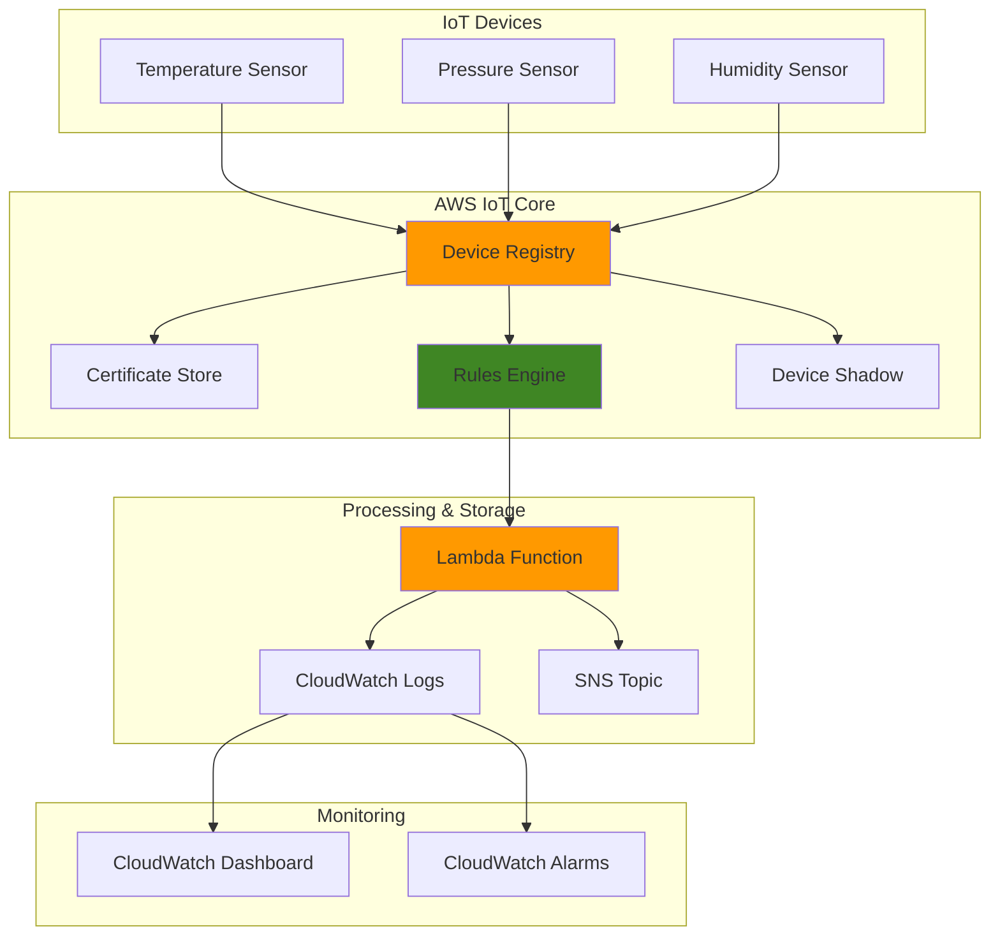

# IoT Device Registry with IoT Core

## Problem

Manufacturing companies deploying thousands of IoT sensors across production facilities struggle with device lifecycle management, secure connectivity, and real-time monitoring at scale. Traditional device management solutions lack cloud integration, making it difficult to track device health, push firmware updates, and maintain security compliance across distributed sensor networks without centralized oversight and automated fleet operations.

## Solution

AWS IoT Core provides a managed platform for secure device connectivity, registration, and lifecycle management through its device registry, certificate management, and rules engine. This solution establishes a scalable IoT infrastructure that automatically handles device authentication, data routing, and fleet monitoring while integrating with AWS analytics and notification services for comprehensive device management.

## Architecture Diagram



## Prerequisites

1. AWS account with IoT Core, Lambda, and CloudWatch permissions
2. AWS CLI v2 installed and configured (or AWS CloudShell)
3. Basic understanding of IoT concepts and JSON messaging
4. Certificate management knowledge (X.509 certificates)
5. Estimated cost: $5-15/month for testing (varies by message volume and Lambda invocations)

> **Note**: AWS IoT Core pricing is based on connectivity, messaging, and device registry operations. See [AWS IoT Core Pricing](https://aws.amazon.com/iot-core/pricing/) for detailed cost breakdown.

## Preparation

```bash
# Set environment variables
export AWS_REGION=$(aws configure get region)
export AWS_ACCOUNT_ID=$(aws sts get-caller-identity \
    --query Account --output text)

# Generate unique identifiers for resources
RANDOM_SUFFIX=$(aws secretsmanager get-random-password \
    --exclude-punctuation --exclude-uppercase \
    --password-length 6 --require-each-included-type \
    --output text --query RandomPassword)

export IOT_THING_TYPE="TemperatureSensor"
export IOT_THING_NAME="temperature-sensor-${RANDOM_SUFFIX}"
export IOT_POLICY_NAME="device-policy-${RANDOM_SUFFIX}"
export IOT_RULE_NAME="sensor_data_rule_${RANDOM_SUFFIX}"

# Create Thing Type for device categorization
aws iot create-thing-type \
    --thing-type-name ${IOT_THING_TYPE} \
    --thing-type-description "Temperature sensor devices for production monitoring"

echo "Environment configured for IoT device: ${IOT_THING_NAME}"
```

## Steps

1. **Create IoT Thing (Device) in Registry**:

   AWS IoT Core's Device Registry serves as the central directory for all connected devices, storing device metadata, certificates, and attributes. Each "Thing" represents a physical device and contains essential information for device identification, authentication, and management throughout its lifecycle.

   ```bash
   # Create IoT Thing with device attributes
   aws iot create-thing \
       --thing-name ${IOT_THING_NAME} \
       --thing-type-name ${IOT_THING_TYPE} \
       --attribute-payload attributes='{
           "deviceType":"temperature",
           "manufacturer":"SensorCorp",
           "model":"TC-2000",
           "location":"ProductionFloor-A",
           "firmware":"1.0.0"
       }'
   
   echo "✅ IoT Thing '${IOT_THING_NAME}' created in device registry"
   ```

   The device is now registered in AWS IoT Core with structured metadata that enables fleet management, filtering, and automated device discovery. This registry entry provides the foundation for all subsequent device operations including certificate association and rule-based data processing.

2. **Generate Device Certificate and Keys**:

   X.509 certificates provide mutual authentication between devices and AWS IoT Core, ensuring only authorized devices can connect and publish data. This cryptographic security model eliminates the need for shared passwords while enabling per-device access control and certificate rotation for enhanced security.

   ```bash
   # Create device certificate and private key
   aws iot create-keys-and-certificate \
       --set-as-active \
       --certificate-pem-outfile device-cert.pem \
       --public-key-outfile device-public-key.pem \
       --private-key-outfile device-private-key.pem \
       --query 'certificateArn' --output text > cert-arn.txt
   
   export CERT_ARN=$(cat cert-arn.txt)
   echo "✅ Device certificate created: ${CERT_ARN}"
   ```

   The certificate and key pair now enables secure TLS communication between your device and AWS IoT Core. These credentials must be embedded in your device firmware to establish trusted connectivity and prevent unauthorized access to your IoT infrastructure.

3. **Create IoT Policy for Device Permissions**:

   IoT policies define granular permissions for device operations using JSON policy documents. Unlike IAM policies, IoT policies are attached to certificates and control specific device actions such as publishing to topics, subscribing to commands, and updating device shadows.

   ```bash
   # Create IoT policy with least privilege permissions
   cat > device-policy.json << EOF
   {
       "Version": "2012-10-17",
       "Statement": [
           {
               "Effect": "Allow",
               "Action": [
                   "iot:Connect"
               ],
               "Resource": [
                   "arn:aws:iot:${AWS_REGION}:${AWS_ACCOUNT_ID}:client/\${iot:Connection.Thing.ThingName}"
               ]
           },
           {
               "Effect": "Allow",
               "Action": [
                   "iot:Publish"
               ],
               "Resource": [
                   "arn:aws:iot:${AWS_REGION}:${AWS_ACCOUNT_ID}:topic/sensor/temperature/\${iot:Connection.Thing.ThingName}"
               ]
           },
           {
               "Effect": "Allow",
               "Action": [
                   "iot:GetThingShadow",
                   "iot:UpdateThingShadow"
               ],
               "Resource": [
                   "arn:aws:iot:${AWS_REGION}:${AWS_ACCOUNT_ID}:thing/\${iot:Connection.Thing.ThingName}"
               ]
           }
       ]
   }
   EOF
   
   aws iot create-policy \
       --policy-name ${IOT_POLICY_NAME} \
       --policy-document file://device-policy.json
   
   echo "✅ IoT policy '${IOT_POLICY_NAME}' created with restricted permissions"
   ```

   This policy implements the principle of least privilege by allowing devices to connect only as themselves and publish data exclusively to their designated topic. The policy variables (`${iot:Connection.Thing.ThingName}`) ensure each device can only access its own resources, preventing cross-device data access.

4. **Attach Policy to Certificate**:

   Binding the IoT policy to the device certificate establishes the security relationship between device identity and permitted actions. This association ensures that when a device presents its certificate during connection, AWS IoT Core automatically applies the appropriate permissions for that specific device.

   ```bash
   # Link policy to device certificate
   aws iot attach-policy \
       --policy-name ${IOT_POLICY_NAME} \
       --target ${CERT_ARN}
   
   echo "✅ Policy attached to device certificate"
   ```

   The certificate now carries the necessary permissions for secure device operation. This binding creates a trust relationship that enables automatic permission enforcement without requiring manual authentication for each device operation.

5. **Associate Certificate with IoT Thing**:

   Connecting the certificate to the IoT Thing completes the device identity triangle: Thing (device metadata), Certificate (cryptographic identity), and Policy (permissions). This association enables device shadow synchronization and ensures telemetry data is properly attributed to the correct device in your fleet.

   ```bash
   # Connect certificate to IoT Thing
   aws iot attach-thing-principal \
       --thing-name ${IOT_THING_NAME} \
       --principal ${CERT_ARN}
   
   echo "✅ Certificate associated with IoT Thing"
   ```

   Your device now has a complete identity within AWS IoT Core, enabling secure connectivity, data publishing, and device management operations. This foundational setup supports advanced features like fleet indexing, bulk operations, and over-the-air updates.

6. **Create Lambda Function for Data Processing**:

   Lambda functions provide serverless compute for processing IoT telemetry data in real-time. By integrating with IoT Core rules, Lambda enables automatic data transformation, validation, and routing to downstream services without managing server infrastructure.

   ```bash
   # Create Lambda execution role
   cat > lambda-trust-policy.json << EOF
   {
       "Version": "2012-10-17",
       "Statement": [
           {
               "Effect": "Allow",
               "Principal": {
                   "Service": "lambda.amazonaws.com"
               },
               "Action": "sts:AssumeRole"
           }
       ]
   }
   EOF
   
   aws iam create-role \
       --role-name iot-lambda-role-${RANDOM_SUFFIX} \
       --assume-role-policy-document file://lambda-trust-policy.json
   
   # Attach basic Lambda execution policy
   aws iam attach-role-policy \
       --role-name iot-lambda-role-${RANDOM_SUFFIX} \
       --policy-arn arn:aws:iam::aws:policy/service-role/AWSLambdaBasicExecutionRole
   
   # Wait for role to be available
   sleep 10
   
   # Create Lambda function code
   cat > lambda-function.py << EOF
   import json
   import boto3
   import logging
   from datetime import datetime
   
   logger = logging.getLogger()
   logger.setLevel(logging.INFO)
   
   def lambda_handler(event, context):
       logger.info(f"Received IoT data: {json.dumps(event)}")
       
       # Extract device data
       device_name = event.get('device', 'unknown')
       temperature = event.get('temperature', 0)
       timestamp = event.get('timestamp', datetime.utcnow().isoformat())
       
       # Process temperature data with business logic
       if temperature > 80:
           logger.warning(f"High temperature alert: {temperature}°C from {device_name}")
           alert_level = "HIGH"
       elif temperature > 60:
           logger.info(f"Moderate temperature warning: {temperature}°C from {device_name}")
           alert_level = "MEDIUM"
       else:
           logger.info(f"Normal temperature reading: {temperature}°C from {device_name}")
           alert_level = "NORMAL"
           
       # Return processed data for downstream systems
       return {
           'statusCode': 200,
           'body': json.dumps({
               'message': 'Data processed successfully',
               'device': device_name,
               'temperature': temperature,
               'alert_level': alert_level,
               'processed_timestamp': datetime.utcnow().isoformat()
           })
       }
   EOF
   
   # Package and deploy Lambda function
   zip lambda-function.zip lambda-function.py
   
   aws lambda create-function \
       --function-name iot-data-processor-${RANDOM_SUFFIX} \
       --runtime python3.12 \
       --role arn:aws:iam::${AWS_ACCOUNT_ID}:role/iot-lambda-role-${RANDOM_SUFFIX} \
       --handler lambda-function.lambda_handler \
       --zip-file fileb://lambda-function.zip \
       --description "Process IoT sensor data from temperature devices" \
       --timeout 60 \
       --memory-size 256
   
   echo "✅ Lambda function created for IoT data processing"
   ```

   The Lambda function is now ready to receive and process IoT telemetry data automatically with enhanced business logic for temperature monitoring. This serverless approach scales automatically with your device fleet size and only charges for actual processing time, making it cost-effective for variable IoT workloads.

7. **Create IoT Rule for Automatic Data Routing**:

   IoT Rules Engine provides SQL-based message routing that automatically processes device telemetry without requiring devices to handle complex logic. Rules enable real-time data filtering, transformation, and delivery to multiple AWS services based on message content and device attributes.

   ```bash
   # Create IoT rule for temperature data processing
   cat > iot-rule.json << EOF
   {
       "ruleName": "${IOT_RULE_NAME}",
       "topicRulePayload": {
           "sql": "SELECT *, topic(3) as device, timestamp() as aws_timestamp FROM 'sensor/temperature/+'",
           "description": "Route temperature sensor data to Lambda for processing and alerting",
           "actions": [
               {
                   "lambda": {
                       "functionArn": "arn:aws:lambda:${AWS_REGION}:${AWS_ACCOUNT_ID}:function:iot-data-processor-${RANDOM_SUFFIX}"
                   }
               }
           ],
           "ruleDisabled": false,
           "awsIotSqlVersion": "2016-03-23"
       }
   }
   EOF
   
   aws iot create-topic-rule --cli-input-json file://iot-rule.json
   
   # Grant IoT permission to invoke Lambda function
   aws lambda add-permission \
       --function-name iot-data-processor-${RANDOM_SUFFIX} \
       --statement-id iot-lambda-permission \
       --action lambda:InvokeFunction \
       --principal iot.amazonaws.com \
       --source-arn arn:aws:iot:${AWS_REGION}:${AWS_ACCOUNT_ID}:rule/${IOT_RULE_NAME}
   
   echo "✅ IoT rule created to route sensor data to Lambda"
   ```

   The rules engine now automatically captures temperature data from any device publishing to the sensor/temperature/ topic hierarchy and routes it to your Lambda function with enhanced SQL processing. This pattern enables real-time data processing and can easily scale to handle thousands of concurrent device messages.

   > **Warning**: Ensure Lambda function permissions are correctly configured before creating IoT rules to avoid message delivery failures and potential data loss.

8. **Configure Device Shadow for State Management**:

   Device Shadows provide persistent virtual representations of your physical devices in the cloud, enabling state synchronization between applications and devices even when devices are offline. This capability is essential for remote device configuration and status monitoring in distributed IoT deployments.

   ```bash
   # Initialize device shadow with default state
   cat > device-shadow.json << EOF
   {
       "state": {
           "desired": {
               "temperature_threshold": 75,
               "reporting_interval": 60,
               "active": true,
               "alert_enabled": true
           },
           "reported": {
               "temperature": 22.5,
               "battery_level": 95,
               "firmware_version": "1.0.0",
               "last_update": "$(date -u +%Y-%m-%dT%H:%M:%S.%3NZ)"
           }
       }
   }
   EOF
   
   aws iot-data update-thing-shadow \
       --thing-name ${IOT_THING_NAME} \
       --payload file://device-shadow.json \
       outfile
   
   echo "✅ Device shadow initialized with default configuration"
   ```

   The device shadow now maintains persistent state information that applications can modify to configure device behavior. Devices can synchronize with this shadow to receive configuration updates and report their current status, enabling sophisticated device management workflows.

## Validation & Testing

1. Verify IoT Thing registration and certificate association:

   ```bash
   # Check IoT Thing details
   aws iot describe-thing --thing-name ${IOT_THING_NAME}
   
   # Verify certificate is attached
   aws iot list-thing-principals --thing-name ${IOT_THING_NAME}
   ```

   Expected output: JSON showing device attributes and certificate ARN association.

2. Test IoT rule configuration:

   ```bash
   # Check rule details
   aws iot get-topic-rule --rule-name ${IOT_RULE_NAME}
   
   # List all IoT rules to verify creation
   aws iot list-topic-rules \
       --query 'rules[?ruleName==`'${IOT_RULE_NAME}'`]'
   ```

   Expected output: Rule configuration showing Lambda action and SQL statement.

3. Simulate device data publishing:

   ```bash
   # Publish test message to sensor topic
   aws iot-data publish \
       --topic sensor/temperature/${IOT_THING_NAME} \
       --payload '{
           "temperature": 85.5, 
           "humidity": 65, 
           "timestamp": "'$(date -u +%Y-%m-%dT%H:%M:%S.%3NZ)'",
           "device": "'${IOT_THING_NAME}'",
           "battery_level": 87
       }'
   
   echo "✅ Test message published to IoT topic"
   ```

4. Verify Lambda function execution and logs:

   ```bash
   # Check Lambda function logs
   aws logs describe-log-groups \
       --log-group-name-prefix /aws/lambda/iot-data-processor-${RANDOM_SUFFIX}
   
   # Get recent log events to verify processing
   LATEST_STREAM=$(aws logs describe-log-streams \
       --log-group-name /aws/lambda/iot-data-processor-${RANDOM_SUFFIX} \
       --order-by LastEventTime --descending --max-items 1 \
       --query 'logStreams[0].logStreamName' --output text)
   
   aws logs get-log-events \
       --log-group-name /aws/lambda/iot-data-processor-${RANDOM_SUFFIX} \
       --log-stream-name ${LATEST_STREAM} \
       --limit 10
   ```

   Expected output: Log groups showing Lambda function execution and processing of IoT data with temperature alerts.

5. Verify device shadow state:

   ```bash
   # Check device shadow current state
   aws iot-data get-thing-shadow \
       --thing-name ${IOT_THING_NAME} \
       shadow-output.json
   
   cat shadow-output.json | python3 -m json.tool
   ```

   Expected output: JSON document showing desired and reported device states.

> **Tip**: Use AWS IoT Device Simulator or AWS IoT Device Tester to generate realistic device traffic for comprehensive testing of your IoT infrastructure.

## Cleanup

1. Remove IoT rule and Lambda permissions:

   ```bash
   # Delete IoT rule
   aws iot delete-topic-rule --rule-name ${IOT_RULE_NAME}
   
   # Remove Lambda permission
   aws lambda remove-permission \
       --function-name iot-data-processor-${RANDOM_SUFFIX} \
       --statement-id iot-lambda-permission
   
   echo "✅ Deleted IoT rule and Lambda permissions"
   ```

2. Delete Lambda function and IAM role:

   ```bash
   # Delete Lambda function
   aws lambda delete-function \
       --function-name iot-data-processor-${RANDOM_SUFFIX}
   
   # Detach and delete IAM role
   aws iam detach-role-policy \
       --role-name iot-lambda-role-${RANDOM_SUFFIX} \
       --policy-arn arn:aws:iam::aws:policy/service-role/AWSLambdaBasicExecutionRole
   
   aws iam delete-role --role-name iot-lambda-role-${RANDOM_SUFFIX}
   
   echo "✅ Deleted Lambda function and IAM role"
   ```

3. Remove certificate associations and delete certificate:

   ```bash
   # Detach certificate from IoT Thing
   aws iot detach-thing-principal \
       --thing-name ${IOT_THING_NAME} \
       --principal ${CERT_ARN}
   
   # Detach policy from certificate
   aws iot detach-policy \
       --policy-name ${IOT_POLICY_NAME} \
       --target ${CERT_ARN}
   
   # Deactivate and delete certificate
   CERT_ID=$(echo ${CERT_ARN} | cut -d'/' -f2)
   aws iot update-certificate \
       --certificate-id ${CERT_ID} --new-status INACTIVE
   aws iot delete-certificate --certificate-id ${CERT_ID}
   
   echo "✅ Deleted device certificate"
   ```

4. Delete IoT policy, Thing, and Thing Type:

   ```bash
   # Delete IoT policy
   aws iot delete-policy --policy-name ${IOT_POLICY_NAME}
   
   # Delete IoT Thing
   aws iot delete-thing --thing-name ${IOT_THING_NAME}
   
   # Delete Thing Type (will only succeed if no things use it)
   aws iot delete-thing-type --thing-type-name ${IOT_THING_TYPE}
   
   echo "✅ Deleted IoT policy, Thing, and Thing Type"
   ```

5. Clean up local files:

   ```bash
   # Remove generated files
   rm -f device-cert.pem device-public-key.pem device-private-key.pem
   rm -f cert-arn.txt device-policy.json lambda-trust-policy.json
   rm -f lambda-function.py lambda-function.zip iot-rule.json
   rm -f device-shadow.json outfile shadow-output.json
   
   echo "✅ Cleaned up local files"
   ```

## Discussion

AWS IoT Core provides a comprehensive managed platform for IoT device lifecycle management that addresses the complex challenges of connecting, securing, and managing large-scale device fleets. The Device Registry serves as the central authority for device identity and metadata, enabling efficient fleet management operations like bulk updates, device grouping, and fleet indexing through the [Fleet Indexing service](https://docs.aws.amazon.com/iot/latest/developerguide/iot-indexing.html). The certificate-based authentication model ensures that only authorized devices can connect while providing the cryptographic foundation for secure data transmission following AWS IoT security best practices.

The Rules Engine represents a powerful serverless computing paradigm for IoT data processing, enabling real-time message routing and transformation without requiring complex device-side logic or expensive always-on compute resources. By using SQL-like syntax for message filtering and routing, organizations can implement sophisticated data processing workflows that automatically scale with device volume. This approach significantly reduces the operational overhead of managing IoT data pipelines while providing the flexibility to integrate with virtually any AWS service through the [AWS IoT Rules Actions](https://docs.aws.amazon.com/iot/latest/developerguide/iot-rule-actions.html).

Device Shadows provide a critical abstraction layer that decouples application logic from device availability and connectivity patterns. This persistent state management enables applications to configure devices and query device status regardless of network conditions, supporting use cases like remote device configuration, firmware update orchestration, and offline device management. The shadow synchronization mechanism ensures eventual consistency between desired and reported states, providing robust device management even in challenging network environments.

Security considerations are paramount in IoT deployments, and AWS IoT Core's certificate-based authentication combined with fine-grained IoT policies provides enterprise-grade security controls following the [AWS Well-Architected IoT Lens](https://docs.aws.amazon.com/wellarchitected/latest/iot-lens/welcome.html) principles. The policy variables enable dynamic permission scoping based on device identity, ensuring that devices can only access their authorized resources while maintaining operational flexibility. The updated Lambda runtime (Python 3.12) ensures long-term support and security updates for your data processing functions.

> **Note**: For production deployments, consider implementing additional security measures such as certificate rotation policies, device provisioning workflows using [AWS IoT Device Management](https://docs.aws.amazon.com/iot/latest/developerguide/device-mgmt.html), and integration with [AWS IoT Device Defender](https://docs.aws.amazon.com/iot/latest/developerguide/device-defender.html) for ongoing security monitoring and threat detection.

## Challenge

Extend this solution by implementing these enhancements:

1. **Fleet Management Integration**: Implement AWS IoT Device Management jobs for over-the-air firmware updates and bulk device configuration changes across your device fleet using job templates and deployment strategies.

2. **Advanced Analytics Pipeline**: Add Amazon Kinesis Data Streams and Amazon Kinesis Analytics to process real-time device telemetry streams and detect anomalies in sensor data patterns using machine learning algorithms.

3. **Multi-Protocol Support**: Configure AWS IoT Core's protocol gateway to support MQTT over WebSockets and HTTP for devices with different connectivity requirements, including mobile applications and web browsers.

4. **Device Provisioning Automation**: Implement AWS IoT Device Provisioning to automatically onboard new devices using just-in-time provisioning or fleet provisioning templates with pre-provisioning hooks for enhanced security.

5. **Monitoring and Alerting**: Create CloudWatch dashboards and alarms for device connectivity metrics, message throughput, and error rates with SNS notifications for operational incidents and automated remediation workflows.

## Infrastructure Code

### Available Infrastructure as Code:

- [Infrastructure Code Overview](code/README.md) - Detailed description of all infrastructure components
- [AWS CDK (Python)](code/cdk-python/) - AWS CDK Python implementation
- [AWS CDK (TypeScript)](code/cdk-typescript/) - AWS CDK TypeScript implementation
- [CloudFormation](code/cloudformation.yaml) - AWS CloudFormation template
- [Bash CLI Scripts](code/scripts/) - Example bash scripts using AWS CLI commands to deploy infrastructure
- [Terraform](code/terraform/) - Terraform configuration files