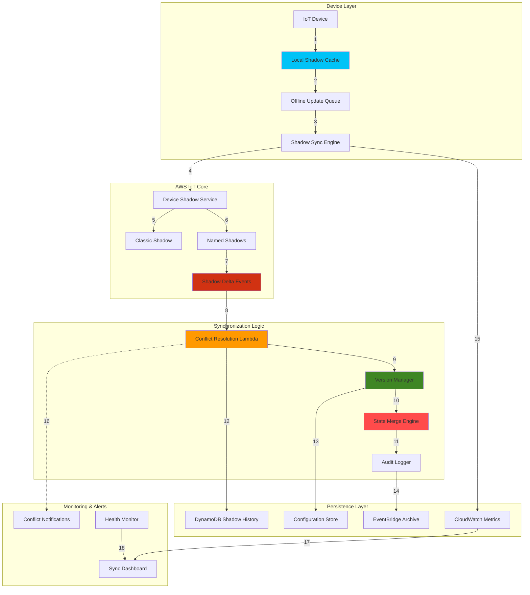

# IoT Device Shadow Synchronization


## Problem

IoT devices in industrial and remote environments frequently experience network connectivity issues, leading to inconsistent device state synchronization and lost configuration updates. Traditional device shadow implementations struggle with conflict resolution when devices come back online after extended offline periods, resulting in data loss, configuration drift, and operational inconsistencies. Organizations need robust shadow synchronization mechanisms that can handle offline scenarios, resolve conflicts intelligently, and maintain data integrity across distributed IoT deployments.

## Solution

AWS IoT Device Shadows with advanced synchronization patterns provide resilient state management for IoT devices through persistent shadow documents, conflict resolution algorithms, and offline-capable caching mechanisms. This solution implements enhanced shadow synchronization with versioning, delta processing, automatic conflict resolution, and comprehensive audit trails to ensure device state consistency even during extended network outages and complex multi-device interactions.

## Architecture Diagram



## Prerequisites

1. AWS account with IoT Core, Lambda, DynamoDB, and EventBridge permissions
2. AWS CLI v2 installed and configured (or AWS CloudShell)
3. Understanding of IoT device shadows, MQTT protocol, and state management
4. Knowledge of conflict resolution algorithms and data synchronization patterns
5. Python 3.8+ for Lambda function development
6. Experience with JSON data structures and versioning concepts
7. Estimated cost: $20-35 per month for shadow operations, Lambda executions, and DynamoDB storage

> **Note**: This recipe implements production-ready shadow synchronization with advanced conflict resolution, version management, and comprehensive offline support capabilities.

> **Warning**: Device shadow conflicts can lead to data loss and operational inconsistencies if not properly managed. Always test conflict resolution strategies thoroughly before deploying to production environments. See the [AWS IoT Device Shadow Service documentation](https://docs.aws.amazon.com/iot/latest/developerguide/iot-device-shadows.html) for detailed guidance on shadow management best practices.

## Preparation

```bash
# Set environment variables
export AWS_REGION=$(aws configure get region)
export AWS_ACCOUNT_ID=$(aws sts get-caller-identity \
    --query Account --output text)

# Generate unique identifiers for resources
RANDOM_SUFFIX=$(aws secretsmanager get-random-password \
    --exclude-punctuation --exclude-uppercase \
    --password-length 6 --require-each-included-type \
    --output text --query RandomPassword)

export SHADOW_SYNC_LAMBDA="shadow-sync-manager-${RANDOM_SUFFIX}"
export CONFLICT_RESOLVER_LAMBDA="shadow-conflict-resolver-${RANDOM_SUFFIX}"
export SHADOW_HISTORY_TABLE="shadow-sync-history-${RANDOM_SUFFIX}"
export DEVICE_CONFIG_TABLE="device-configuration-${RANDOM_SUFFIX}"
export SYNC_METRICS_TABLE="shadow-sync-metrics-${RANDOM_SUFFIX}"
export EVENT_BUS_NAME="shadow-sync-events-${RANDOM_SUFFIX}"
export THING_NAME="sync-demo-device-${RANDOM_SUFFIX}"

# Create DynamoDB tables for shadow synchronization
aws dynamodb create-table \
    --table-name $SHADOW_HISTORY_TABLE \
    --attribute-definitions \
        AttributeName=thingName,AttributeType=S \
        AttributeName=timestamp,AttributeType=N \
        AttributeName=shadowName,AttributeType=S \
    --key-schema \
        AttributeName=thingName,KeyType=HASH \
        AttributeName=timestamp,KeyType=RANGE \
    --global-secondary-indexes \
        IndexName=ShadowNameIndex,KeySchema='{AttributeName=shadowName,KeyType=HASH},{AttributeName=timestamp,KeyType=RANGE}',Projection='{ProjectionType=ALL}',ProvisionedThroughput='{ReadCapacityUnits=5,WriteCapacityUnits=5}' \
    --billing-mode PAY_PER_REQUEST \
    --stream-specification StreamEnabled=true,StreamViewType=NEW_AND_OLD_IMAGES \
    --tags Key=Project,Value=IoTShadowSync

aws dynamodb create-table \
    --table-name $DEVICE_CONFIG_TABLE \
    --attribute-definitions \
        AttributeName=thingName,AttributeType=S \
        AttributeName=configType,AttributeType=S \
    --key-schema \
        AttributeName=thingName,KeyType=HASH \
        AttributeName=configType,KeyType=RANGE \
    --billing-mode PAY_PER_REQUEST \
    --tags Key=Project,Value=IoTShadowSync

aws dynamodb create-table \
    --table-name $SYNC_METRICS_TABLE \
    --attribute-definitions \
        AttributeName=thingName,AttributeType=S \
        AttributeName=metricTimestamp,AttributeType=N \
    --key-schema \
        AttributeName=thingName,KeyType=HASH \
        AttributeName=metricTimestamp,KeyType=RANGE \
    --billing-mode PAY_PER_REQUEST \
    --tags Key=Project,Value=IoTShadowSync

# Wait for tables to be active
aws dynamodb wait table-exists --table-name $SHADOW_HISTORY_TABLE
aws dynamodb wait table-exists --table-name $DEVICE_CONFIG_TABLE
aws dynamodb wait table-exists --table-name $SYNC_METRICS_TABLE

# Create custom EventBridge bus for shadow sync events
aws events create-event-bus \
    --name $EVENT_BUS_NAME \
    --tags Key=Project,Value=IoTShadowSync

echo "✅ DynamoDB tables and EventBridge bus created for shadow synchronization"
```

## Steps

1. **Create Shadow Conflict Resolution Lambda Function**:

   AWS IoT Device Shadows maintain persistent JSON documents that store and retrieve current state information for devices, enabling reliable communication between devices and applications even when devices are offline. Conflict resolution becomes critical when multiple updates occur simultaneously or when devices reconnect after extended offline periods. Lambda functions provide serverless, event-driven processing that automatically scales to handle shadow delta events, making them ideal for implementing sophisticated conflict resolution algorithms that can analyze shadow state changes in real-time.

   ```bash
   # Create comprehensive shadow conflict resolution function
   mkdir -p shadow-conflict-resolver
   cat > shadow-conflict-resolver/lambda_function.py << 'EOF'
import json
import boto3
import logging
import time
from datetime import datetime, timezone
from typing import Dict, Any, List, Optional
import hashlib
import copy

# Configure logging
logger = logging.getLogger()
logger.setLevel(logging.INFO)

# Initialize AWS clients
dynamodb = boto3.resource('dynamodb')
iot_data = boto3.client('iot-data')
events = boto3.client('events')
cloudwatch = boto3.client('cloudwatch')

# Configuration
SHADOW_HISTORY_TABLE = 'shadow-sync-history-xxxxx'
DEVICE_CONFIG_TABLE = 'device-configuration-xxxxx'
SYNC_METRICS_TABLE = 'shadow-sync-metrics-xxxxx'
EVENT_BUS_NAME = 'shadow-sync-events-xxxxx'

def lambda_handler(event, context):
    """
    Handle shadow synchronization conflicts and state management
    """
    try:
        logger.info(f"Shadow conflict resolution event: {json.dumps(event, default=str)}")
        
        # Parse shadow event
        if 'Records' in event:
            # DynamoDB stream event
            return handle_dynamodb_stream_event(event)
        elif 'operation' in event:
            # Direct operation invocation
            return handle_direct_operation(event)
        else:
            # IoT shadow delta event
            return handle_shadow_delta_event(event)
            
    except Exception as e:
        logger.error(f"Error in shadow conflict resolution: {str(e)}")
        return create_error_response(str(e))

def handle_shadow_delta_event(event: Dict[str, Any]) -> Dict[str, Any]:
    """Handle IoT shadow delta events for conflict resolution"""
    try:
        thing_name = event.get('thingName', '')
        shadow_name = event.get('shadowName', '$default')
        delta = event.get('state', {})
        version = event.get('version', 0)
        timestamp = event.get('timestamp', int(time.time()))
        
        logger.info(f"Processing delta for {thing_name}, shadow: {shadow_name}")
        
        # Get current shadow state
        current_shadow = get_current_shadow(thing_name, shadow_name)
        
        # Check for conflicts
        conflict_result = detect_conflicts(
            thing_name, shadow_name, delta, current_shadow, version
        )
        
        if conflict_result['has_conflict']:
            # Resolve conflicts using configured strategy
            resolution = resolve_shadow_conflict(
                thing_name, shadow_name, conflict_result, current_shadow
            )
            
            # Apply resolution
            apply_conflict_resolution(thing_name, shadow_name, resolution)
            
            # Log conflict resolution
            log_conflict_resolution(thing_name, shadow_name, conflict_result, resolution)
            
        else:
            # No conflict, proceed with normal update
            logger.info(f"No conflicts detected for {thing_name}")
        
        # Update shadow history
        record_shadow_history(thing_name, shadow_name, delta, version, timestamp)
        
        # Update sync metrics
        update_sync_metrics(thing_name, shadow_name, conflict_result['has_conflict'])
        
        return {
            'statusCode': 200,
            'body': json.dumps({
                'thingName': thing_name,
                'shadowName': shadow_name,
                'hasConflict': conflict_result['has_conflict'],
                'resolution': conflict_result.get('resolution', 'none')
            })
        }
        
    except Exception as e:
        logger.error(f"Error handling shadow delta: {str(e)}")
        return create_error_response(str(e))

def detect_conflicts(thing_name: str, shadow_name: str, delta: Dict[str, Any], 
                    current_shadow: Dict[str, Any], version: int) -> Dict[str, Any]:
    """Detect conflicts in shadow updates"""
    try:
        conflicts = []
        
        # Check version conflicts
        current_version = current_shadow.get('version', 0)
        if version <= current_version:
            conflicts.append({
                'type': 'version_conflict',
                'current_version': current_version,
                'delta_version': version,
                'severity': 'high'
            })
        
        # Check for concurrent modifications
        recent_history = get_recent_shadow_history(thing_name, shadow_name, minutes=5)
        if len(recent_history) > 1:
            conflicts.append({
                'type': 'concurrent_modification',
                'recent_changes': len(recent_history),
                'severity': 'medium'
            })
        
        # Check for data type conflicts
        current_reported = current_shadow.get('state', {}).get('reported', {})
        for key, value in delta.items():
            if key in current_reported:
                current_type = type(current_reported[key]).__name__
                delta_type = type(value).__name__
                if current_type != delta_type:
                    conflicts.append({
                        'type': 'data_type_conflict',
                        'field': key,
                        'current_type': current_type,
                        'delta_type': delta_type,
                        'severity': 'low'
                    })
        
        # Check for business rule violations
        business_conflicts = check_business_rules(thing_name, delta, current_shadow)
        conflicts.extend(business_conflicts)
        
        return {
            'has_conflict': len(conflicts) > 0,
            'conflicts': conflicts,
            'severity': max([c.get('severity', 'low') for c in conflicts] + ['none'])
        }
        
    except Exception as e:
        logger.error(f"Error detecting conflicts: {str(e)}")
        return {'has_conflict': False, 'conflicts': [], 'error': str(e)}

def resolve_shadow_conflict(thing_name: str, shadow_name: str, 
                          conflict_result: Dict[str, Any], 
                          current_shadow: Dict[str, Any]) -> Dict[str, Any]:
    """Resolve shadow conflicts using configurable strategies"""
    try:
        conflicts = conflict_result['conflicts']
        severity = conflict_result['severity']
        
        # Get device-specific conflict resolution strategy
        config = get_device_config(thing_name, 'conflict_resolution')
        strategy = config.get('strategy', 'last_writer_wins')
        
        logger.info(f"Resolving conflicts using strategy: {strategy}")
        
        if strategy == 'last_writer_wins':
            return resolve_last_writer_wins(conflicts, current_shadow)
        elif strategy == 'field_level_merge':
            return resolve_field_level_merge(conflicts, current_shadow)
        elif strategy == 'priority_based':
            return resolve_priority_based(conflicts, current_shadow, config)
        elif strategy == 'manual_review':
            return schedule_manual_review(thing_name, shadow_name, conflicts)
        else:
            # Default to last writer wins
            return resolve_last_writer_wins(conflicts, current_shadow)
            
    except Exception as e:
        logger.error(f"Error resolving conflicts: {str(e)}")
        return {'strategy': 'error', 'resolution': {}, 'error': str(e)}

def resolve_last_writer_wins(conflicts: List[Dict], current_shadow: Dict) -> Dict[str, Any]:
    """Resolve conflicts using last writer wins strategy"""
    return {
        'strategy': 'last_writer_wins',
        'resolution': 'accept_delta',
        'action': 'overwrite_current'
    }

def resolve_field_level_merge(conflicts: List[Dict], current_shadow: Dict) -> Dict[str, Any]:
    """Resolve conflicts by merging at field level"""
    merged_state = copy.deepcopy(current_shadow.get('state', {}).get('reported', {}))
    
    # Merge strategy: newer timestamps win for each field
    resolution_details = []
    
    for conflict in conflicts:
        if conflict['type'] == 'data_type_conflict':
            field = conflict['field']
            # Keep current value for type conflicts
            resolution_details.append({
                'field': field,
                'action': 'keep_current',
                'reason': 'type_conflict'
            })
    
    return {
        'strategy': 'field_level_merge',
        'resolution': merged_state,
        'details': resolution_details,
        'action': 'partial_merge'
    }

def resolve_priority_based(conflicts: List[Dict], current_shadow: Dict, config: Dict) -> Dict[str, Any]:
    """Resolve conflicts based on configured priorities"""
    priorities = config.get('field_priorities', {})
    
    resolution = {}
    for conflict in conflicts:
        if conflict['type'] == 'data_type_conflict':
            field = conflict['field']
            priority = priorities.get(field, 'low')
            
            if priority == 'high':
                # High priority fields always accept delta
                resolution[field] = 'accept_delta'
            else:
                # Low priority fields keep current
                resolution[field] = 'keep_current'
    
    return {
        'strategy': 'priority_based',
        'resolution': resolution,
        'action': 'selective_merge'
    }

def schedule_manual_review(thing_name: str, shadow_name: str, conflicts: List[Dict]) -> Dict[str, Any]:
    """Schedule manual review for complex conflicts"""
    review_id = f"review-{thing_name}-{int(time.time())}"
    
    # Send event for manual review
    events.put_events(
        Entries=[
            {
                'Source': 'iot.shadow.sync',
                'DetailType': 'Manual Review Required',
                'Detail': json.dumps({
                    'reviewId': review_id,
                    'thingName': thing_name,
                    'shadowName': shadow_name,
                    'conflicts': conflicts,
                    'timestamp': datetime.now(timezone.utc).isoformat()
                }),
                'EventBusName': EVENT_BUS_NAME
            }
        ]
    )
    
    return {
        'strategy': 'manual_review',
        'reviewId': review_id,
        'action': 'defer_to_manual',
        'status': 'pending_review'
    }

def apply_conflict_resolution(thing_name: str, shadow_name: str, resolution: Dict[str, Any]):
    """Apply the conflict resolution to the device shadow"""
    try:
        action = resolution.get('action', 'none')
        
        if action == 'overwrite_current':
            # Full shadow update will be handled by IoT Core
            logger.info(f"Full shadow overwrite for {thing_name}")
            
        elif action == 'partial_merge':
            # Apply partial updates
            merged_state = resolution.get('resolution', {})
            update_payload = {
                'state': {
                    'reported': merged_state
                }
            }
            
            iot_data.update_thing_shadow(
                thingName=thing_name,
                shadowName=shadow_name,
                payload=json.dumps(update_payload)
            )
            
        elif action == 'selective_merge':
            # Apply selective field updates
            field_resolutions = resolution.get('resolution', {})
            # Implementation would depend on specific field handling
            logger.info(f"Selective merge for {thing_name}: {field_resolutions}")
            
        elif action == 'defer_to_manual':
            # No automatic action, waiting for manual intervention
            logger.info(f"Deferring to manual review for {thing_name}")
            
    except Exception as e:
        logger.error(f"Error applying conflict resolution: {str(e)}")

def check_business_rules(thing_name: str, delta: Dict[str, Any], 
                        current_shadow: Dict[str, Any]) -> List[Dict[str, Any]]:
    """Check business rules for shadow updates"""
    violations = []
    
    # Example business rules
    if 'temperature' in delta:
        temp = delta['temperature']
        if temp < -50 or temp > 100:
            violations.append({
                'type': 'business_rule_violation',
                'rule': 'temperature_range',
                'value': temp,
                'severity': 'high'
            })
    
    if 'firmware_version' in delta:
        current_version = current_shadow.get('state', {}).get('reported', {}).get('firmware_version', '')
        new_version = delta['firmware_version']
        
        # Check for firmware downgrade
        if version_compare(new_version, current_version) < 0:
            violations.append({
                'type': 'business_rule_violation',
                'rule': 'no_firmware_downgrade',
                'current': current_version,
                'proposed': new_version,
                'severity': 'medium'
            })
    
    return violations

def get_current_shadow(thing_name: str, shadow_name: str) -> Dict[str, Any]:
    """Retrieve current shadow state"""
    try:
        response = iot_data.get_thing_shadow(
            thingName=thing_name,
            shadowName=shadow_name
        )
        return json.loads(response['payload'].read())
    except Exception as e:
        logger.warning(f"Could not get shadow for {thing_name}: {str(e)}")
        return {}

def get_recent_shadow_history(thing_name: str, shadow_name: str, minutes: int = 5) -> List[Dict]:
    """Get recent shadow history for conflict detection"""
    try:
        table = dynamodb.Table(SHADOW_HISTORY_TABLE)
        cutoff_time = int((datetime.now(timezone.utc).timestamp() - (minutes * 60)) * 1000)
        
        response = table.query(
            KeyConditionExpression=boto3.dynamodb.conditions.Key('thingName').eq(thing_name) & 
                                 boto3.dynamodb.conditions.Key('timestamp').gte(cutoff_time),
            FilterExpression=boto3.dynamodb.conditions.Attr('shadowName').eq(shadow_name),
            ScanIndexForward=False,
            Limit=10
        )
        
        return response.get('Items', [])
    except Exception as e:
        logger.error(f"Error getting shadow history: {str(e)}")
        return []

def get_device_config(thing_name: str, config_type: str) -> Dict[str, Any]:
    """Get device-specific configuration"""
    try:
        table = dynamodb.Table(DEVICE_CONFIG_TABLE)
        response = table.get_item(
            Key={
                'thingName': thing_name,
                'configType': config_type
            }
        )
        return response.get('Item', {}).get('config', {})
    except Exception as e:
        logger.error(f"Error getting device config: {str(e)}")
        return {}

def record_shadow_history(thing_name: str, shadow_name: str, delta: Dict[str, Any], 
                         version: int, timestamp: int):
    """Record shadow change in history table"""
    try:
        table = dynamodb.Table(SHADOW_HISTORY_TABLE)
        table.put_item(
            Item={
                'thingName': thing_name,
                'timestamp': int(timestamp * 1000),  # Convert to milliseconds
                'shadowName': shadow_name,
                'delta': delta,
                'version': version,
                'changeType': 'delta_update',
                'checksum': hashlib.md5(json.dumps(delta, sort_keys=True).encode()).hexdigest()
            }
        )
    except Exception as e:
        logger.error(f"Error recording shadow history: {str(e)}")

def update_sync_metrics(thing_name: str, shadow_name: str, had_conflict: bool):
    """Update synchronization metrics"""
    try:
        table = dynamodb.Table(SYNC_METRICS_TABLE)
        timestamp = int(time.time() * 1000)
        
        table.put_item(
            Item={
                'thingName': thing_name,
                'metricTimestamp': timestamp,
                'shadowName': shadow_name,
                'hadConflict': had_conflict,
                'syncType': 'delta_update'
            }
        )
        
        # Send CloudWatch metrics
        cloudwatch.put_metric_data(
            Namespace='IoT/ShadowSync',
            MetricData=[
                {
                    'MetricName': 'ConflictDetected',
                    'Value': 1 if had_conflict else 0,
                    'Unit': 'Count',
                    'Dimensions': [
                        {'Name': 'ThingName', 'Value': thing_name},
                        {'Name': 'ShadowName', 'Value': shadow_name}
                    ]
                }
            ]
        )
        
    except Exception as e:
        logger.error(f"Error updating sync metrics: {str(e)}")

def log_conflict_resolution(thing_name: str, shadow_name: str, 
                          conflict_result: Dict[str, Any], resolution: Dict[str, Any]):
    """Log conflict resolution details"""
    try:
        # Send detailed event to EventBridge
        events.put_events(
            Entries=[
                {
                    'Source': 'iot.shadow.sync',
                    'DetailType': 'Conflict Resolved',
                    'Detail': json.dumps({
                        'thingName': thing_name,
                        'shadowName': shadow_name,
                        'conflicts': conflict_result['conflicts'],
                        'resolution': resolution,
                        'timestamp': datetime.now(timezone.utc).isoformat()
                    }),
                    'EventBusName': EVENT_BUS_NAME
                }
            ]
        )
    except Exception as e:
        logger.error(f"Error logging conflict resolution: {str(e)}")

def version_compare(version1: str, version2: str) -> int:
    """Compare semantic versions"""
    try:
        v1_parts = [int(x) for x in version1.lstrip('v').split('.')]
        v2_parts = [int(x) for x in version2.lstrip('v').split('.')]
        
        for i in range(max(len(v1_parts), len(v2_parts))):
            v1_part = v1_parts[i] if i < len(v1_parts) else 0
            v2_part = v2_parts[i] if i < len(v2_parts) else 0
            
            if v1_part > v2_part:
                return 1
            elif v1_part < v2_part:
                return -1
        
        return 0
    except Exception:
        return 0

def handle_dynamodb_stream_event(event: Dict[str, Any]) -> Dict[str, Any]:
    """Handle DynamoDB stream events for shadow history"""
    # Implementation for processing shadow history changes
    return {'statusCode': 200, 'body': 'Stream event processed'}

def handle_direct_operation(event: Dict[str, Any]) -> Dict[str, Any]:
    """Handle direct operation invocations"""
    operation = event.get('operation', '')
    
    if operation == 'sync_device_shadows':
        return sync_device_shadows(event)
    elif operation == 'resolve_pending_conflicts':
        return resolve_pending_conflicts(event)
    else:
        return create_error_response(f'Unknown operation: {operation}')

def sync_device_shadows(event: Dict[str, Any]) -> Dict[str, Any]:
    """Synchronize device shadows for offline scenarios"""
    # Implementation for manual shadow synchronization
    return {'statusCode': 200, 'body': 'Shadow sync initiated'}

def resolve_pending_conflicts(event: Dict[str, Any]) -> Dict[str, Any]:
    """Resolve pending conflicts from manual review"""
    # Implementation for resolving manually reviewed conflicts
    return {'statusCode': 200, 'body': 'Pending conflicts resolved'}

def create_error_response(error_message: str) -> Dict[str, Any]:
    """Create standardized error response"""
    return {
        'statusCode': 500,
        'body': json.dumps({
            'error': error_message,
            'timestamp': datetime.now(timezone.utc).isoformat()
        })
    }
EOF
   
   # Create deployment package
   cd shadow-conflict-resolver
   zip -r ../shadow-conflict-resolver.zip .
   cd ..
   
   echo "✅ Shadow conflict resolution Lambda function created"
   ```

   The conflict resolution Lambda function is now created with comprehensive logic for detecting and resolving shadow synchronization conflicts. This function implements multiple resolution strategies including last-writer-wins, field-level merging, and priority-based resolution. The function can handle version conflicts, concurrent modifications, data type mismatches, and business rule violations, providing robust protection against data corruption in distributed IoT environments.

2. **Deploy Conflict Resolution Lambda with Permissions**:

   AWS Lambda requires comprehensive IAM permissions to interact with IoT Device Shadows, DynamoDB tables, EventBridge, and CloudWatch services. The principle of least privilege ensures that the function only receives the minimum permissions necessary for shadow operations while maintaining security boundaries. IAM roles provide temporary, rotatable credentials that eliminate the need for hardcoded access keys, following AWS security best practices for serverless applications.

   ```bash
   # Create Lambda execution role
   cat > /tmp/shadow-lambda-trust-policy.json << 'EOF'
   {
       "Version": "2012-10-17",
       "Statement": [
           {
               "Effect": "Allow",
               "Principal": {
                   "Service": "lambda.amazonaws.com"
               },
               "Action": "sts:AssumeRole"
           }
       ]
   }
   EOF
   
   aws iam create-role \
       --role-name "${CONFLICT_RESOLVER_LAMBDA}-execution-role" \
       --assume-role-policy-document file:///tmp/shadow-lambda-trust-policy.json
   
   # Create comprehensive policy for shadow operations
   cat > /tmp/shadow-lambda-policy.json << EOF
   {
       "Version": "2012-10-17",
       "Statement": [
           {
               "Effect": "Allow",
               "Action": [
                   "logs:CreateLogGroup",
                   "logs:CreateLogStream",
                   "logs:PutLogEvents"
               ],
               "Resource": "arn:aws:logs:${AWS_REGION}:${AWS_ACCOUNT_ID}:*"
           },
           {
               "Effect": "Allow",
               "Action": [
                   "iot:GetThingShadow",
                   "iot:UpdateThingShadow",
                   "iot:DeleteThingShadow"
               ],
               "Resource": "arn:aws:iot:${AWS_REGION}:${AWS_ACCOUNT_ID}:thing/*"
           },
           {
               "Effect": "Allow",
               "Action": [
                   "dynamodb:GetItem",
                   "dynamodb:PutItem",
                   "dynamodb:UpdateItem",
                   "dynamodb:Query",
                   "dynamodb:Scan"
               ],
               "Resource": [
                   "arn:aws:dynamodb:${AWS_REGION}:${AWS_ACCOUNT_ID}:table/${SHADOW_HISTORY_TABLE}*",
                   "arn:aws:dynamodb:${AWS_REGION}:${AWS_ACCOUNT_ID}:table/${DEVICE_CONFIG_TABLE}*",
                   "arn:aws:dynamodb:${AWS_REGION}:${AWS_ACCOUNT_ID}:table/${SYNC_METRICS_TABLE}*"
               ]
           },
           {
               "Effect": "Allow",
               "Action": [
                   "events:PutEvents"
               ],
               "Resource": "arn:aws:events:${AWS_REGION}:${AWS_ACCOUNT_ID}:event-bus/${EVENT_BUS_NAME}"
           },
           {
               "Effect": "Allow",
               "Action": [
                   "cloudwatch:PutMetricData"
               ],
               "Resource": "*"
           }
       ]
   }
   EOF
   
   # Create and attach policy
   aws iam create-policy \
       --policy-name "${CONFLICT_RESOLVER_LAMBDA}-policy" \
       --policy-document file:///tmp/shadow-lambda-policy.json
   
   aws iam attach-role-policy \
       --role-name "${CONFLICT_RESOLVER_LAMBDA}-execution-role" \
       --policy-arn "arn:aws:iam::${AWS_ACCOUNT_ID}:policy/${CONFLICT_RESOLVER_LAMBDA}-policy"
   
   # Deploy Lambda function
   aws lambda create-function \
       --function-name $CONFLICT_RESOLVER_LAMBDA \
       --runtime python3.9 \
       --role "arn:aws:iam::${AWS_ACCOUNT_ID}:role/${CONFLICT_RESOLVER_LAMBDA}-execution-role" \
       --handler lambda_function.lambda_handler \
       --zip-file fileb://shadow-conflict-resolver.zip \
       --timeout 300 \
       --memory-size 512 \
       --environment Variables="{SHADOW_HISTORY_TABLE=${SHADOW_HISTORY_TABLE},DEVICE_CONFIG_TABLE=${DEVICE_CONFIG_TABLE},SYNC_METRICS_TABLE=${SYNC_METRICS_TABLE},EVENT_BUS_NAME=${EVENT_BUS_NAME}}" \
       --tags Project=IoTShadowSync
   
   # Update table names in Lambda function
   sed -i "s/shadow-sync-history-xxxxx/${SHADOW_HISTORY_TABLE}/g" shadow-conflict-resolver/lambda_function.py
   sed -i "s/device-configuration-xxxxx/${DEVICE_CONFIG_TABLE}/g" shadow-conflict-resolver/lambda_function.py
   sed -i "s/shadow-sync-metrics-xxxxx/${SYNC_METRICS_TABLE}/g" shadow-conflict-resolver/lambda_function.py
   sed -i "s/shadow-sync-events-xxxxx/${EVENT_BUS_NAME}/g" shadow-conflict-resolver/lambda_function.py
   
   cd shadow-conflict-resolver && zip -r ../shadow-conflict-resolver.zip . && cd ..
   
   aws lambda update-function-code \
       --function-name $CONFLICT_RESOLVER_LAMBDA \
       --zip-file fileb://shadow-conflict-resolver.zip
   
   echo "✅ Conflict resolution Lambda function deployed"
   ```

   The Lambda function is now deployed with appropriate execution permissions and integrated with the shadow synchronization infrastructure. The IAM role enables secure access to all required AWS services while the environment variables provide configuration for DynamoDB table names and EventBridge bus connectivity. This deployment establishes the core conflict resolution engine that will process all shadow delta events automatically.

3. **Create Demo IoT Thing and Configure Named Shadows**:

   AWS IoT Things represent physical devices in the IoT registry and serve as the foundation for device shadow management. Named shadows enable logical separation of different data types within a single device, allowing granular conflict resolution strategies based on data criticality. X.509 certificates provide mutual authentication between devices and AWS IoT Core, ensuring secure communication channels while IoT policies define fine-grained permissions for shadow operations.

   ```bash
   # Create demo IoT thing for testing
   aws iot create-thing \
       --thing-name $THING_NAME \
       --thing-type-name "SyncDemoDevice" \
       --attribute-payload '{
           "attributes": {
               "deviceType": "sensor_gateway",
               "location": "test_lab",
               "syncEnabled": "true"
           }
       }'
   
   # Create device certificates
   aws iot create-keys-and-certificate \
       --set-as-active \
       --certificate-pem-outfile demo-device-certificate.pem \
       --public-key-outfile demo-device-public-key.pem \
       --private-key-outfile demo-device-private-key.pem > demo-cert-output.json
   
   DEMO_CERT_ARN=$(jq -r '.certificateArn' demo-cert-output.json)
   
   # Create IoT policy for demo device
   cat > /tmp/demo-device-policy.json << EOF
   {
       "Version": "2012-10-17",
       "Statement": [
           {
               "Effect": "Allow",
               "Action": [
                   "iot:Connect"
               ],
               "Resource": "arn:aws:iot:${AWS_REGION}:${AWS_ACCOUNT_ID}:client/${THING_NAME}"
           },
           {
               "Effect": "Allow",
               "Action": [
                   "iot:Publish",
                   "iot:Subscribe",
                   "iot:Receive"
               ],
               "Resource": [
                   "arn:aws:iot:${AWS_REGION}:${AWS_ACCOUNT_ID}:topic/\$aws/things/${THING_NAME}/shadow/*",
                   "arn:aws:iot:${AWS_REGION}:${AWS_ACCOUNT_ID}:topicfilter/\$aws/things/${THING_NAME}/shadow/*"
               ]
           },
           {
               "Effect": "Allow",
               "Action": [
                   "iot:GetThingShadow",
                   "iot:UpdateThingShadow"
               ],
               "Resource": "arn:aws:iot:${AWS_REGION}:${AWS_ACCOUNT_ID}:thing/${THING_NAME}"
           }
       ]
   }
   EOF
   
   aws iot create-policy \
       --policy-name "DemoDeviceSyncPolicy" \
       --policy-document file:///tmp/demo-device-policy.json
   
   # Attach policy and certificate to thing
   aws iot attach-policy \
       --policy-name "DemoDeviceSyncPolicy" \
       --target $DEMO_CERT_ARN
   
   aws iot attach-thing-principal \
       --thing-name $THING_NAME \
       --principal $DEMO_CERT_ARN
   
   # Initialize named shadows for different data types
   SHADOW_NAMES=("configuration" "telemetry" "maintenance")
   
   for shadow_name in "${SHADOW_NAMES[@]}"; do
       case $shadow_name in
           "configuration")
               initial_state='{"state":{"desired":{"samplingRate":30,"alertThreshold":80,"operatingMode":"normal"},"reported":{"samplingRate":30,"alertThreshold":80,"operatingMode":"normal","firmwareVersion":"v1.0.0"}}}'
               ;;
           "telemetry")
               initial_state='{"state":{"reported":{"temperature":23.5,"humidity":65.2,"pressure":1013.25,"lastUpdate":"'$(date -u +%Y-%m-%dT%H:%M:%S.%3NZ)'"}}}'
               ;;
           "maintenance")
               initial_state='{"state":{"desired":{"maintenanceWindow":"02:00-04:00","autoUpdate":true},"reported":{"lastMaintenance":"'$(date -u +%Y-%m-%dT%H:%M:%S.%3NZ)'","nextScheduled":"'$(date -u -d '+7 days' +%Y-%m-%dT%H:%M:%S.%3NZ)'"}}}'
               ;;
       esac
       
       aws iot-data update-thing-shadow \
           --thing-name $THING_NAME \
           --shadow-name $shadow_name \
           --payload "$initial_state" \
           "${shadow_name}-shadow-output.json"
   done
   
   echo "✅ Demo IoT thing created with named shadows"
   ```

   The demo IoT thing is now registered with three named shadows representing different data categories: configuration (device settings and firmware), telemetry (sensor readings and operational data), and maintenance (scheduling and health status). This separation enables different conflict resolution strategies for each data type, with configuration shadows requiring strict consistency while telemetry shadows can use more lenient resolution approaches.

4. **Set Up IoT Rules for Shadow Delta Processing**:

   AWS IoT Rules Engine processes messages published to IoT Core topics using SQL-like syntax to filter and route messages to various AWS services. Shadow delta events occur when the desired and reported states of a device shadow differ, triggering automatic conflict detection and resolution processes. The rules engine enables real-time processing of these events, ensuring immediate response to shadow state changes while maintaining comprehensive audit trails for compliance and troubleshooting.

   ```bash
   # Create IoT rule to process shadow delta events
   aws iot create-topic-rule \
       --rule-name "ShadowDeltaProcessingRule" \
       --topic-rule-payload '{
           "sql": "SELECT *, thingName as thingName, shadowName as shadowName FROM \"$aws/things/+/shadow/+/update/delta\"",
           "description": "Process shadow delta events for conflict resolution",
           "actions": [
               {
                   "lambda": {
                       "functionArn": "arn:aws:lambda:'"${AWS_REGION}"':'"${AWS_ACCOUNT_ID}"':function:'"${CONFLICT_RESOLVER_LAMBDA}"'"
                   }
               }
           ]
       }'
   
   # Grant IoT permission to invoke Lambda function
   aws lambda add-permission \
       --function-name $CONFLICT_RESOLVER_LAMBDA \
       --statement-id "iot-shadow-delta-permission" \
       --action "lambda:InvokeFunction" \
       --principal "iot.amazonaws.com" \
       --source-arn "arn:aws:iot:${AWS_REGION}:${AWS_ACCOUNT_ID}:rule/ShadowDeltaProcessingRule"
   
   # Create rule to log all shadow events for audit
   aws iot create-topic-rule \
       --rule-name "ShadowAuditLoggingRule" \
       --topic-rule-payload '{
           "sql": "SELECT * FROM \"$aws/things/+/shadow/+/update/+\"",
           "description": "Log all shadow update events for audit trail",
           "actions": [
               {
                   "cloudwatchLogs": {
                       "logGroupName": "/aws/iot/shadow-audit",
                       "roleArn": "arn:aws:iam:'"${AWS_ACCOUNT_ID}"':role/'"${CONFLICT_RESOLVER_LAMBDA}"'-execution-role"
                   }
               }
           ]
       }'
   
   # Create CloudWatch log group for shadow audit
   aws logs create-log-group \
       --log-group-name "/aws/iot/shadow-audit" \
       --tags Project=IoTShadowSync
   
   echo "✅ IoT rules created for shadow delta processing and audit logging"
   ```

   The IoT rules are now configured to automatically process shadow delta events and maintain comprehensive audit logs. The delta processing rule triggers the conflict resolution Lambda function whenever shadow inconsistencies are detected, while the audit logging rule captures all shadow update events in CloudWatch Logs for compliance and troubleshooting purposes. This event-driven architecture ensures immediate response to shadow conflicts while maintaining complete visibility into device state changes.

5. **Configure Device-Specific Conflict Resolution Settings**:

   DynamoDB provides fast, predictable performance for storing device-specific configuration data that drives conflict resolution behavior. Each device can have customized conflict resolution strategies, field priorities, and synchronization preferences based on operational requirements and business logic. This flexible configuration approach enables different resolution strategies for various device types while maintaining centralized management and policy enforcement.

   ```bash
   # Set up device configuration for conflict resolution
   aws dynamodb put-item \
       --table-name $DEVICE_CONFIG_TABLE \
       --item '{
           "thingName": {"S": "'"$THING_NAME"'"},
           "configType": {"S": "conflict_resolution"},
           "config": {
               "M": {
                   "strategy": {"S": "field_level_merge"},
                   "field_priorities": {
                       "M": {
                           "firmware_version": {"S": "high"},
                           "temperature": {"S": "medium"},
                           "configuration": {"S": "high"},
                           "telemetry": {"S": "low"}
                       }
                   },
                   "auto_resolve_threshold": {"N": "5"},
                   "manual_review_severity": {"S": "high"}
               }
           },
           "lastUpdated": {"S": "'"$(date -u +%Y-%m-%dT%H:%M:%S.%3NZ)"'"}
       }'
   
   # Set up sync preferences
   aws dynamodb put-item \
       --table-name $DEVICE_CONFIG_TABLE \
       --item '{
           "thingName": {"S": "'"$THING_NAME"'"},
           "configType": {"S": "sync_preferences"},
           "config": {
               "M": {
                   "offline_buffer_duration": {"N": "3600"},
                   "max_conflict_retries": {"N": "3"},
                   "sync_frequency_seconds": {"N": "60"},
                   "compression_enabled": {"BOOL": true},
                   "delta_only_sync": {"BOOL": true}
               }
           },
           "lastUpdated": {"S": "'"$(date -u +%Y-%m-%dT%H:%M:%S.%3NZ)"'"}
       }'
   
   echo "✅ Device-specific conflict resolution settings configured"
   ```

   The device configuration is now stored in DynamoDB with field-level priority settings and conflict resolution strategies. The conflict resolution configuration specifies field-level merge strategies with high priority for firmware versions and configurations, while telemetry data uses lower priority settings. The sync preferences define offline buffer duration, retry limits, and compression settings that optimize synchronization performance for different network conditions.

6. **Create Shadow Sync Manager Lambda Function**:

   The Shadow Sync Manager provides orchestration capabilities for complex synchronization scenarios including offline device reconnection, health monitoring, and conflict summary reporting. This Lambda function implements batch processing capabilities for handling multiple shadow updates, comprehensive health assessment algorithms, and detailed conflict analysis that helps optimize synchronization strategies based on actual usage patterns and conflict frequency.

   ```bash
   # Create shadow synchronization manager function
   mkdir -p shadow-sync-manager
   cat > shadow-sync-manager/lambda_function.py << 'EOF'
import json
import boto3
import logging
from datetime import datetime, timezone
import time
from typing import Dict, Any, List

# Configure logging
logger = logging.getLogger()
logger.setLevel(logging.INFO)

# Initialize AWS clients
iot_data = boto3.client('iot-data')
dynamodb = boto3.resource('dynamodb')
cloudwatch = boto3.client('cloudwatch')

def lambda_handler(event, context):
    """
    Manage shadow synchronization operations for offline devices
    """
    try:
        operation = event.get('operation', 'sync_check')
        thing_name = event.get('thingName', '')
        
        logger.info(f"Shadow sync operation: {operation} for {thing_name}")
        
        if operation == 'sync_check':
            return perform_sync_check(event)
        elif operation == 'offline_sync':
            return handle_offline_sync(event)
        elif operation == 'conflict_summary':
            return generate_conflict_summary(event)
        elif operation == 'health_report':
            return generate_health_report(event)
        else:
            return {
                'statusCode': 400,
                'body': json.dumps(f'Unknown operation: {operation}')
            }
            
    except Exception as e:
        logger.error(f"Error in shadow sync manager: {str(e)}")
        return {
            'statusCode': 500,
            'body': json.dumps(f'Sync manager error: {str(e)}')
        }

def perform_sync_check(event: Dict[str, Any]) -> Dict[str, Any]:
    """Perform comprehensive shadow synchronization check"""
    try:
        thing_name = event.get('thingName', '')
        shadow_names = event.get('shadowNames', ['$default'])
        
        sync_results = []
        
        for shadow_name in shadow_names:
            # Get current shadow
            shadow = get_shadow_safely(thing_name, shadow_name)
            
            # Check sync status
            sync_status = check_shadow_sync_status(thing_name, shadow_name, shadow)
            
            sync_results.append({
                'shadowName': shadow_name,
                'syncStatus': sync_status,
                'lastSync': get_last_sync_time(thing_name, shadow_name),
                'hasConflicts': sync_status.get('hasConflicts', False)
            })
        
        return {
            'statusCode': 200,
            'body': json.dumps({
                'thingName': thing_name,
                'syncResults': sync_results,
                'overallHealth': calculate_overall_health(sync_results)
            })
        }
        
    except Exception as e:
        logger.error(f"Error performing sync check: {str(e)}")
        return {
            'statusCode': 500,
            'body': json.dumps({'error': str(e)})
        }

def handle_offline_sync(event: Dict[str, Any]) -> Dict[str, Any]:
    """Handle synchronization for devices coming back online"""
    try:
        thing_name = event.get('thingName', '')
        offline_duration = event.get('offlineDurationSeconds', 0)
        cached_changes = event.get('cachedChanges', [])
        
        logger.info(f"Handling offline sync for {thing_name}, offline for {offline_duration}s")
        
        # Process cached changes
        processed_changes = []
        conflicts_detected = []
        
        for change in cached_changes:
            shadow_name = change.get('shadowName', '$default')
            cached_state = change.get('state', {})
            timestamp = change.get('timestamp', int(time.time()))
            
            # Get current shadow state
            current_shadow = get_shadow_safely(thing_name, shadow_name)
            
            # Detect conflicts
            conflict_check = detect_offline_conflicts(
                thing_name, shadow_name, cached_state, current_shadow, timestamp
            )
            
            if conflict_check['hasConflicts']:
                conflicts_detected.append(conflict_check)
                # Queue for manual resolution if needed
                if conflict_check['severity'] == 'high':
                    queue_for_manual_resolution(thing_name, shadow_name, conflict_check)
            else:
                # Apply cached changes
                apply_cached_changes(thing_name, shadow_name, cached_state)
                processed_changes.append({
                    'shadowName': shadow_name,
                    'status': 'applied',
                    'timestamp': timestamp
                })
        
        return {
            'statusCode': 200,
            'body': json.dumps({
                'thingName': thing_name,
                'processedChanges': len(processed_changes),
                'conflictsDetected': len(conflicts_detected),
                'conflicts': conflicts_detected[:5],  # Return first 5 conflicts
                'syncCompleted': datetime.now(timezone.utc).isoformat()
            })
        }
        
    except Exception as e:
        logger.error(f"Error handling offline sync: {str(e)}")
        return {
            'statusCode': 500,
            'body': json.dumps({'error': str(e)})
        }

def generate_conflict_summary(event: Dict[str, Any]) -> Dict[str, Any]:
    """Generate summary of shadow conflicts"""
    try:
        time_range_hours = event.get('timeRangeHours', 24)
        cutoff_time = int((datetime.now(timezone.utc).timestamp() - (time_range_hours * 3600)) * 1000)
        
        # Query conflict history
        metrics_table = dynamodb.Table('shadow-sync-metrics-xxxxx')  # Will be replaced
        
        response = metrics_table.scan(
            FilterExpression=boto3.dynamodb.conditions.Attr('metricTimestamp').gte(cutoff_time) &
                           boto3.dynamodb.conditions.Attr('hadConflict').eq(True)
        )
        
        conflicts = response.get('Items', [])
        
        # Analyze conflicts
        summary = {
            'totalConflicts': len(conflicts),
            'conflictsByType': {},
            'conflictsByThing': {},
            'timeRange': f'{time_range_hours} hours'
        }
        
        for conflict in conflicts:
            thing_name = conflict.get('thingName', 'unknown')
            shadow_name = conflict.get('shadowName', '$default')
            
            summary['conflictsByThing'][thing_name] = summary['conflictsByThing'].get(thing_name, 0) + 1
        
        return {
            'statusCode': 200,
            'body': json.dumps(summary)
        }
        
    except Exception as e:
        logger.error(f"Error generating conflict summary: {str(e)}")
        return {
            'statusCode': 500,
            'body': json.dumps({'error': str(e)})
        }

def generate_health_report(event: Dict[str, Any]) -> Dict[str, Any]:
    """Generate comprehensive shadow health report"""
    try:
        thing_names = event.get('thingNames', [])
        
        health_report = {
            'reportTimestamp': datetime.now(timezone.utc).isoformat(),
            'deviceHealth': [],
            'overallMetrics': {
                'totalDevices': len(thing_names),
                'healthyDevices': 0,
                'devicesWithConflicts': 0,
                'offlineDevices': 0
            }
        }
        
        for thing_name in thing_names:
            device_health = assess_device_health(thing_name)
            health_report['deviceHealth'].append(device_health)
            
            if device_health['status'] == 'healthy':
                health_report['overallMetrics']['healthyDevices'] += 1
            elif device_health['status'] == 'conflict':
                health_report['overallMetrics']['devicesWithConflicts'] += 1
            elif device_health['status'] == 'offline':
                health_report['overallMetrics']['offlineDevices'] += 1
        
        return {
            'statusCode': 200,
            'body': json.dumps(health_report)
        }
        
    except Exception as e:
        logger.error(f"Error generating health report: {str(e)}")
        return {
            'statusCode': 500,
            'body': json.dumps({'error': str(e)})
        }

def get_shadow_safely(thing_name: str, shadow_name: str) -> Dict[str, Any]:
    """Safely retrieve shadow, returning empty dict if not found"""
    try:
        response = iot_data.get_thing_shadow(
            thingName=thing_name,
            shadowName=shadow_name
        )
        return json.loads(response['payload'].read())
    except Exception as e:
        logger.warning(f"Could not get shadow {shadow_name} for {thing_name}: {str(e)}")
        return {}

def check_shadow_sync_status(thing_name: str, shadow_name: str, shadow: Dict[str, Any]) -> Dict[str, Any]:
    """Check the synchronization status of a shadow"""
    status = {
        'inSync': True,
        'hasConflicts': False,
        'lastUpdate': shadow.get('metadata', {}).get('reported', {}).get('timestamp'),
        'version': shadow.get('version', 0)
    }
    
    # Check for delta (indicates desired != reported)
    if 'delta' in shadow.get('state', {}):
        status['inSync'] = False
        status['pendingChanges'] = list(shadow['state']['delta'].keys())
    
    # Check recent conflict history
    recent_conflicts = get_recent_conflicts(thing_name, shadow_name)
    if recent_conflicts:
        status['hasConflicts'] = True
        status['recentConflicts'] = len(recent_conflicts)
    
    return status

def detect_offline_conflicts(thing_name: str, shadow_name: str, cached_state: Dict[str, Any],
                           current_shadow: Dict[str, Any], cached_timestamp: int) -> Dict[str, Any]:
    """Detect conflicts between cached offline changes and current shadow"""
    conflicts = []
    
    current_reported = current_shadow.get('state', {}).get('reported', {})
    current_timestamp = current_shadow.get('metadata', {}).get('reported', {}).get('timestamp', 0)
    
    # Check if current shadow was updated while device was offline
    if current_timestamp > cached_timestamp:
        for key, cached_value in cached_state.items():
            if key in current_reported and current_reported[key] != cached_value:
                conflicts.append({
                    'field': key,
                    'cachedValue': cached_value,
                    'currentValue': current_reported[key],
                    'type': 'concurrent_modification'
                })
    
    # Determine severity
    severity = 'low'
    if len(conflicts) > 3:
        severity = 'high'
    elif len(conflicts) > 1:
        severity = 'medium'
    
    return {
        'hasConflicts': len(conflicts) > 0,
        'conflicts': conflicts,
        'severity': severity,
        'conflictCount': len(conflicts)
    }

def apply_cached_changes(thing_name: str, shadow_name: str, cached_state: Dict[str, Any]):
    """Apply cached changes to shadow"""
    try:
        update_payload = {
            'state': {
                'reported': cached_state
            }
        }
        
        iot_data.update_thing_shadow(
            thingName=thing_name,
            shadowName=shadow_name,
            payload=json.dumps(update_payload)
        )
        
        logger.info(f"Applied cached changes to {thing_name}/{shadow_name}")
        
    except Exception as e:
        logger.error(f"Error applying cached changes: {str(e)}")

def get_recent_conflicts(thing_name: str, shadow_name: str, hours: int = 1) -> List[Dict]:
    """Get recent conflicts for a shadow"""
    try:
        metrics_table = dynamodb.Table('shadow-sync-metrics-xxxxx')  # Will be replaced
        cutoff_time = int((datetime.now(timezone.utc).timestamp() - (hours * 3600)) * 1000)
        
        response = metrics_table.query(
            KeyConditionExpression=boto3.dynamodb.conditions.Key('thingName').eq(thing_name) &
                                 boto3.dynamodb.conditions.Key('metricTimestamp').gte(cutoff_time),
            FilterExpression=boto3.dynamodb.conditions.Attr('shadowName').eq(shadow_name) &
                           boto3.dynamodb.conditions.Attr('hadConflict').eq(True)
        )
        
        return response.get('Items', [])
    except Exception as e:
        logger.error(f"Error getting recent conflicts: {str(e)}")
        return []

def get_last_sync_time(thing_name: str, shadow_name: str) -> Optional[str]:
    """Get the last synchronization time for a shadow"""
    try:
        history_table = dynamodb.Table('shadow-sync-history-xxxxx')  # Will be replaced
        
        response = history_table.query(
            KeyConditionExpression=boto3.dynamodb.conditions.Key('thingName').eq(thing_name),
            FilterExpression=boto3.dynamodb.conditions.Attr('shadowName').eq(shadow_name),
            ScanIndexForward=False,
            Limit=1
        )
        
        items = response.get('Items', [])
        if items:
            return datetime.fromtimestamp(items[0]['timestamp'] / 1000, timezone.utc).isoformat()
        
        return None
    except Exception as e:
        logger.error(f"Error getting last sync time: {str(e)}")
        return None

def calculate_overall_health(sync_results: List[Dict[str, Any]]) -> Dict[str, Any]:
    """Calculate overall health metrics from sync results"""
    total_shadows = len(sync_results)
    healthy_shadows = sum(1 for r in sync_results if r['syncStatus']['inSync'])
    conflicted_shadows = sum(1 for r in sync_results if r['syncStatus']['hasConflicts'])
    
    health_percentage = (healthy_shadows / max(total_shadows, 1)) * 100
    
    return {
        'healthPercentage': health_percentage,
        'totalShadows': total_shadows,
        'healthyShadows': healthy_shadows,
        'conflictedShadows': conflicted_shadows,
        'status': 'healthy' if health_percentage > 80 else 'degraded' if health_percentage > 60 else 'critical'
    }

def assess_device_health(thing_name: str) -> Dict[str, Any]:
    """Assess the overall health of a device's shadows"""
    try:
        # This would typically check multiple named shadows
        shadow_names = ['$default', 'configuration', 'telemetry', 'maintenance']
        
        health_status = {
            'thingName': thing_name,
            'status': 'healthy',
            'shadowCount': len(shadow_names),
            'issues': []
        }
        
        for shadow_name in shadow_names:
            shadow = get_shadow_safely(thing_name, shadow_name)
            if not shadow:
                health_status['issues'].append(f'Shadow {shadow_name} not found')
                health_status['status'] = 'offline'
                continue
            
            # Check for deltas
            if 'delta' in shadow.get('state', {}):
                health_status['issues'].append(f'Pending changes in {shadow_name}')
                if health_status['status'] == 'healthy':
                    health_status['status'] = 'warning'
            
            # Check for recent conflicts
            recent_conflicts = get_recent_conflicts(thing_name, shadow_name)
            if recent_conflicts:
                health_status['issues'].append(f'Recent conflicts in {shadow_name}')
                health_status['status'] = 'conflict'
        
        return health_status
        
    except Exception as e:
        logger.error(f"Error assessing device health: {str(e)}")
        return {
            'thingName': thing_name,
            'status': 'error',
            'error': str(e)
        }

def queue_for_manual_resolution(thing_name: str, shadow_name: str, conflict_check: Dict[str, Any]):
    """Queue conflicts for manual resolution"""
    try:
        # This would typically send to a queue or notification system
        logger.warning(f"High-severity conflict queued for manual resolution: {thing_name}/{shadow_name}")
        
        # Could implement SQS queue, SNS notification, or EventBridge event
        # For now, just log the conflict
        
    except Exception as e:
        logger.error(f"Error queuing for manual resolution: {str(e)}")
EOF
   
   # Create deployment package
   cd shadow-sync-manager
   zip -r ../shadow-sync-manager.zip .
   cd ..
   
   # Deploy sync manager Lambda
   aws lambda create-function \
       --function-name $SHADOW_SYNC_LAMBDA \
       --runtime python3.9 \
       --role "arn:aws:iam::${AWS_ACCOUNT_ID}:role/${CONFLICT_RESOLVER_LAMBDA}-execution-role" \
       --handler lambda_function.lambda_handler \
       --zip-file fileb://shadow-sync-manager.zip \
       --timeout 300 \
       --memory-size 256 \
       --environment Variables="{SHADOW_HISTORY_TABLE=${SHADOW_HISTORY_TABLE},DEVICE_CONFIG_TABLE=${DEVICE_CONFIG_TABLE},SYNC_METRICS_TABLE=${SYNC_METRICS_TABLE}}" \
       --tags Project=IoTShadowSync
   
   # Update table names in sync manager function
   sed -i "s/shadow-sync-history-xxxxx/${SHADOW_HISTORY_TABLE}/g" shadow-sync-manager/lambda_function.py
   sed -i "s/shadow-sync-metrics-xxxxx/${SYNC_METRICS_TABLE}/g" shadow-sync-manager/lambda_function.py
   
   cd shadow-sync-manager && zip -r ../shadow-sync-manager.zip . && cd ..
   
   aws lambda update-function-code \
       --function-name $SHADOW_SYNC_LAMBDA \
       --zip-file fileb://shadow-sync-manager.zip
   
   echo "✅ Shadow sync manager Lambda function deployed"
   ```

   The sync manager Lambda function is now deployed and ready to handle offline synchronization scenarios, health monitoring, and conflict reporting operations. This function provides essential management capabilities for large-scale IoT deployments, including batch processing of cached changes from offline devices, comprehensive health assessments across device fleets, and detailed conflict analytics that enable data-driven optimization of synchronization strategies.

7. **Create EventBridge Rules for Automated Monitoring**:

   Amazon EventBridge provides serverless event routing that enables decoupled, event-driven architectures for IoT shadow management. Scheduled rules trigger automated health checks while pattern-based rules respond to specific conflict resolution events, enabling proactive monitoring and alerting. This event-driven approach ensures immediate notification of critical shadow synchronization issues while maintaining low operational overhead through serverless execution.

   ```bash
   # Create EventBridge rule for conflict notifications
   aws events put-rule \
       --name "shadow-conflict-notifications" \
       --event-pattern '{
           "source": ["iot.shadow.sync"],
           "detail-type": ["Conflict Resolved", "Manual Review Required"]
       }' \
       --state ENABLED \
       --description "Process shadow conflict events"
   
   # Create EventBridge rule for periodic health checks
   aws events put-rule \
       --name "shadow-health-check-schedule" \
       --schedule-expression "rate(15 minutes)" \
       --state ENABLED \
       --description "Periodic shadow synchronization health checks"
   
   # Add Lambda target for health checks
   aws events put-targets \
       --rule "shadow-health-check-schedule" \
       --targets '[{
           "Id": "1",
           "Arn": "arn:aws:lambda:'${AWS_REGION}':'${AWS_ACCOUNT_ID}':function:'${SHADOW_SYNC_LAMBDA}'",
           "Input": "{\"operation\": \"health_report\", \"thingNames\": [\"'${THING_NAME}'\"]}"
       }]'
   
   # Grant EventBridge permission to invoke Lambda
   aws lambda add-permission \
       --function-name $SHADOW_SYNC_LAMBDA \
       --statement-id "eventbridge-health-check-permission" \
       --action "lambda:InvokeFunction" \
       --principal "events.amazonaws.com" \
       --source-arn "arn:aws:events:${AWS_REGION}:${AWS_ACCOUNT_ID}:rule/shadow-health-check-schedule"
   
   echo "✅ EventBridge rules created for automated monitoring"
   ```

   The EventBridge rules are now configured for comprehensive shadow synchronization monitoring with automated health checks every 15 minutes and real-time conflict notification processing. These rules enable proactive identification of synchronization issues, automated escalation of critical conflicts, and systematic health monitoring across device fleets. The event-driven architecture ensures scalable monitoring that adapts to deployment size without manual intervention.

8. **Create CloudWatch Dashboard for Shadow Monitoring**:

   Amazon CloudWatch provides comprehensive monitoring and observability for IoT shadow synchronization through custom metrics, log analysis, and visual dashboards. The dashboard aggregates key performance indicators including conflict frequency, synchronization success rates, and audit trail visibility, enabling operations teams to quickly identify trends and optimize synchronization strategies. CloudWatch Logs Insights enables sophisticated querying of shadow update events for troubleshooting and compliance reporting.

   ```bash
   # Create comprehensive CloudWatch dashboard
   cat > /tmp/shadow-sync-dashboard.json << 'EOF'
   {
       "widgets": [
           {
               "type": "metric",
               "x": 0,
               "y": 0,
               "width": 12,
               "height": 6,
               "properties": {
                   "metrics": [
                       ["IoT/ShadowSync", "ConflictDetected"],
                       [".", "SyncCompleted"],
                       [".", "OfflineSync"]
                   ],
                   "period": 300,
                   "stat": "Sum",
                   "region": "us-east-1",
                   "title": "Shadow Synchronization Metrics"
               }
           },
           {
               "type": "log",
               "x": 12,
               "y": 0,
               "width": 12,
               "height": 6,
               "properties": {
                   "query": "SOURCE '/aws/iot/shadow-audit' | fields @timestamp, @message\n| filter @message like /shadow/\n| sort @timestamp desc\n| limit 50",
                   "region": "us-east-1",
                   "title": "Shadow Update Audit Trail"
               }
           },
           {
               "type": "log",
               "x": 0,
               "y": 6,
               "width": 24,
               "height": 6,
               "properties": {
                   "query": "SOURCE '/aws/lambda/shadow-conflict-resolver' | fields @timestamp, @message\n| filter @message like /conflict/\n| sort @timestamp desc\n| limit 30",
                   "region": "us-east-1",
                   "title": "Conflict Resolution Events"
               }
           }
       ]
   }
   EOF
   
   aws cloudwatch put-dashboard \
       --dashboard-name "IoT-Shadow-Synchronization" \
       --dashboard-body file:///tmp/shadow-sync-dashboard.json
   
   echo "✅ CloudWatch dashboard created for shadow monitoring"
   ```

   The CloudWatch dashboard is now configured with comprehensive shadow synchronization metrics, audit trail visualization, and conflict resolution event tracking. This monitoring infrastructure provides real-time visibility into shadow synchronization health, enabling operations teams to quickly identify performance issues, analyze conflict patterns, and optimize resolution strategies based on actual deployment behavior. The dashboard serves as the central command center for IoT shadow management operations.

## Validation & Testing

1. **Verify Shadow Synchronization Infrastructure**:

   ```bash
   # Check Lambda functions status
   aws lambda get-function --function-name $CONFLICT_RESOLVER_LAMBDA \
       --query 'Configuration.{State:State,Runtime:Runtime,Timeout:Timeout}'
   
   aws lambda get-function --function-name $SHADOW_SYNC_LAMBDA \
       --query 'Configuration.{State:State,Runtime:Runtime,Timeout:Timeout}'
   
   # Verify DynamoDB tables
   aws dynamodb describe-table --table-name $SHADOW_HISTORY_TABLE \
       --query 'Table.{Name:TableName,Status:TableStatus,ItemCount:ItemCount}'
   
   # Check IoT thing and shadows
   aws iot describe-thing --thing-name $THING_NAME
   
   # Verify named shadows exist
   for shadow_name in "configuration" "telemetry" "maintenance"; do
       echo "Checking shadow: $shadow_name"
       aws iot-data get-thing-shadow \
           --thing-name $THING_NAME \
           --shadow-name $shadow_name \
           "${shadow_name}-current.json"
   done
   ```

   Expected output: Lambda functions active, DynamoDB tables ready, IoT thing with named shadows

2. **Test Conflict Detection and Resolution**:

   ```bash
   # Simulate concurrent shadow updates to trigger conflicts
   
   # Update 1: Change configuration via desired state
   aws iot-data update-thing-shadow \
       --thing-name $THING_NAME \
       --shadow-name "configuration" \
       --payload '{
           "state": {
               "desired": {
                   "samplingRate": 60,
                   "alertThreshold": 90,
                   "operatingMode": "high_performance"
               }
           }
       }' \
       config-update-1.json
   
   # Update 2: Simulate device reporting different values (conflict scenario)
   sleep 2
   aws iot-data update-thing-shadow \
       --thing-name $THING_NAME \
       --shadow-name "configuration" \
       --payload '{
           "state": {
               "reported": {
                   "samplingRate": 30,
                   "alertThreshold": 85,
                   "operatingMode": "power_save",
                   "firmwareVersion": "v1.0.1"
               }
           }
       }' \
       config-update-2.json
   
   # Check for conflicts in Lambda logs
   sleep 5
   aws logs filter-log-events \
       --log-group-name "/aws/lambda/${CONFLICT_RESOLVER_LAMBDA}" \
       --start-time $(date -d '5 minutes ago' +%s)000 \
       --filter-pattern "conflict"
   ```

   Expected output: Conflict detection triggered, resolution applied based on configured strategy

3. **Test Offline Synchronization Scenario**:

   ```bash
   # Simulate offline sync scenario
   aws lambda invoke \
       --function-name $SHADOW_SYNC_LAMBDA \
       --payload '{
           "operation": "offline_sync",
           "thingName": "'"$THING_NAME"'",
           "offlineDurationSeconds": 3600,
           "cachedChanges": [
               {
                   "shadowName": "telemetry",
                   "state": {
                       "temperature": 28.5,
                       "humidity": 70.1,
                       "pressure": 1015.2
                   },
                   "timestamp": '$(date -d '1 hour ago' +%s)'
               }
           ]
       }' \
       --cli-binary-format raw-in-base64-out \
       offline-sync-response.json
   
   # Check response
   cat offline-sync-response.json | jq '.'
   ```

   Expected output: Offline changes processed with conflict detection results

4. **Test Health Monitoring and Reporting**:

   ```bash
   # Generate health report
   aws lambda invoke \
       --function-name $SHADOW_SYNC_LAMBDA \
       --payload '{
           "operation": "health_report",
           "thingNames": ["'"$THING_NAME"'"]
       }' \
       --cli-binary-format raw-in-base64-out \
       health-report.json
   
   # Check sync status
   aws lambda invoke \
       --function-name $SHADOW_SYNC_LAMBDA \
       --payload '{
           "operation": "sync_check",
           "thingName": "'"$THING_NAME"'",
           "shadowNames": ["configuration", "telemetry", "maintenance"]
       }' \
       --cli-binary-format raw-in-base64-out \
       sync-check.json
   
   # View results
   echo "Health Report:"
   cat health-report.json | jq '.body' | jq '.'
   echo -e "\nSync Check:"
   cat sync-check.json | jq '.body' | jq '.'
   ```

   Expected output: Comprehensive health and sync status reports

5. **Verify Audit Trail and Metrics**:

   ```bash
   # Check shadow history records
   aws dynamodb scan \
       --table-name $SHADOW_HISTORY_TABLE \
       --max-items 5 \
       --query 'Items[*].{ThingName:thingName.S,ShadowName:shadowName.S,Timestamp:timestamp.N}'
   
   # Check CloudWatch metrics
   aws cloudwatch get-metric-statistics \
       --namespace "IoT/ShadowSync" \
       --metric-name "ConflictDetected" \
       --start-time $(date -d '1 hour ago' -u +%Y-%m-%dT%H:%M:%S) \
       --end-time $(date -u +%Y-%m-%dT%H:%M:%S) \
       --period 300 \
       --statistics Sum
   
   # Check audit logs
   aws logs filter-log-events \
       --log-group-name "/aws/iot/shadow-audit" \
       --start-time $(date -d '30 minutes ago' +%s)000 \
       --filter-pattern "shadow"
   ```

   Expected output: History records, metrics data, and audit log entries

## Cleanup

1. **Delete Lambda Functions and EventBridge Rules**:

   ```bash
   # Delete EventBridge rules
   aws events remove-targets \
       --rule "shadow-health-check-schedule" \
       --ids "1"
   
   aws events delete-rule \
       --name "shadow-health-check-schedule"
   
   aws events delete-rule \
       --name "shadow-conflict-notifications"
   
   # Delete Lambda functions
   aws lambda delete-function \
       --function-name $CONFLICT_RESOLVER_LAMBDA
   
   aws lambda delete-function \
       --function-name $SHADOW_SYNC_LAMBDA
   
   echo "✅ Lambda functions and EventBridge rules deleted"
   ```

2. **Delete IoT Resources**:

   ```bash
   # Delete IoT rules
   aws iot delete-topic-rule --rule-name "ShadowDeltaProcessingRule"
   aws iot delete-topic-rule --rule-name "ShadowAuditLoggingRule"
   
   # Detach and delete certificates
   DEMO_CERT_ARN=$(jq -r '.certificateArn' demo-cert-output.json)
   DEMO_CERT_ID=$(jq -r '.certificateId' demo-cert-output.json)
   
   aws iot detach-thing-principal \
       --thing-name $THING_NAME \
       --principal $DEMO_CERT_ARN
   
   aws iot detach-policy \
       --policy-name "DemoDeviceSyncPolicy" \
       --target $DEMO_CERT_ARN
   
   aws iot update-certificate \
       --certificate-id $DEMO_CERT_ID \
       --new-status INACTIVE
   
   aws iot delete-certificate \
       --certificate-id $DEMO_CERT_ID
   
   # Delete IoT policy and thing
   aws iot delete-policy --policy-name "DemoDeviceSyncPolicy"
   aws iot delete-thing --thing-name $THING_NAME
   
   echo "✅ IoT resources deleted"
   ```

3. **Delete DynamoDB Tables and EventBridge Bus**:

   ```bash
   # Delete DynamoDB tables
   aws dynamodb delete-table --table-name $SHADOW_HISTORY_TABLE
   aws dynamodb delete-table --table-name $DEVICE_CONFIG_TABLE
   aws dynamodb delete-table --table-name $SYNC_METRICS_TABLE
   
   # Delete EventBridge bus
   aws events delete-event-bus --name $EVENT_BUS_NAME
   
   echo "✅ DynamoDB tables and EventBridge bus deleted"
   ```

4. **Delete IAM Resources and CloudWatch Assets**:

   ```bash
   # Delete IAM policy and role
   aws iam detach-role-policy \
       --role-name "${CONFLICT_RESOLVER_LAMBDA}-execution-role" \
       --policy-arn "arn:aws:iam::${AWS_ACCOUNT_ID}:policy/${CONFLICT_RESOLVER_LAMBDA}-policy"
   
   aws iam delete-policy \
       --policy-arn "arn:aws:iam::${AWS_ACCOUNT_ID}:policy/${CONFLICT_RESOLVER_LAMBDA}-policy"
   
   aws iam delete-role --role-name "${CONFLICT_RESOLVER_LAMBDA}-execution-role"
   
   # Delete CloudWatch resources
   aws cloudwatch delete-dashboards \
       --dashboard-names "IoT-Shadow-Synchronization"
   
   aws logs delete-log-group --log-group-name "/aws/iot/shadow-audit"
   
   echo "✅ IAM resources and CloudWatch assets deleted"
   ```

5. **Clean Up Local Files**:

   ```bash
   # Remove local files and directories
   rm -rf shadow-conflict-resolver shadow-sync-manager
   rm -f shadow-conflict-resolver.zip shadow-sync-manager.zip
   rm -f demo-device-*.pem demo-cert-output.json
   rm -f *-shadow-output.json *-current.json
   rm -f config-update-*.json offline-sync-response.json
   rm -f health-report.json sync-check.json
   rm -f /tmp/shadow-* /tmp/demo-* /tmp/shadow-sync-dashboard.json
   
   echo "✅ All local files cleaned up"
   ```

## Discussion

Advanced IoT device shadow synchronization addresses critical challenges in distributed IoT deployments where network connectivity cannot be guaranteed and device state consistency is paramount. The implementation of sophisticated conflict resolution algorithms ensures that device states remain coherent even after extended offline periods, while the audit trail capabilities provide complete visibility into state changes for compliance and troubleshooting purposes.

The named shadow architecture enables logical separation of different types of device data, allowing for granular conflict resolution strategies based on data criticality and update frequency. Configuration shadows can implement strict consistency models with manual review processes, while telemetry shadows can use last-writer-wins strategies for real-time operational data. This flexibility is crucial for complex IoT systems where different data types have varying consistency requirements.

The offline-first design pattern implemented through local caching and queued updates ensures operational continuity during network outages while maintaining data integrity when connectivity is restored. The conflict detection mechanisms can identify not only simple version conflicts but also business rule violations and data type inconsistencies, providing comprehensive protection against data corruption and operational errors.

The integration with EventBridge and CloudWatch provides enterprise-grade monitoring and alerting capabilities that enable proactive management of shadow synchronization health. The automated health checks and conflict summaries help operations teams identify trends and optimize synchronization strategies based on actual usage patterns. This observability is essential for maintaining service level agreements in production IoT deployments.

> **Tip**: Implement shadow versioning with semantic versioning patterns to enable more sophisticated conflict resolution strategies that can understand the intent and impact of different types of changes. Consider implementing vector clocks for distributed timestamp management in multi-region deployments. See the [AWS Lambda Best Practices Guide](https://docs.aws.amazon.com/lambda/latest/dg/best-practices.html) for optimizing conflict resolution performance.

> **Note**: DynamoDB's eventually consistent reads may impact conflict detection accuracy in high-frequency update scenarios. Consider using strongly consistent reads for critical conflict resolution operations. Refer to the [DynamoDB Best Practices documentation](https://docs.aws.amazon.com/amazondynamodb/latest/developerguide/best-practices.html) for performance optimization strategies.

For comprehensive implementation guidance, refer to the [AWS IoT Device Shadow Service Guide](https://docs.aws.amazon.com/iot/latest/developerguide/iot-device-shadows.html) and [Device Shadow Service Documents documentation](https://docs.aws.amazon.com/iot/latest/developerguide/device-shadow-document.html). Additional optimization strategies can be found in the [AWS IoT Core Best Practices](https://docs.aws.amazon.com/iot/latest/developerguide/aws-iot-how-it-works.html) and [Lambda Function Best Practices](https://docs.aws.amazon.com/lambda/latest/dg/best-practices.html) documentation.

## Challenge

Extend this solution by implementing these enhancements:

1. **Machine Learning-Based Conflict Prediction**: Integrate Amazon SageMaker to analyze shadow update patterns and predict potential conflicts before they occur, enabling proactive conflict prevention strategies.

2. **Distributed Shadow Consensus**: Implement Byzantine fault tolerance algorithms for critical device configurations that require consensus across multiple device replicas or edge gateways.

3. **Temporal Shadow Analytics**: Create time-series analysis capabilities using Amazon Timestream to track shadow state evolution and identify optimization opportunities for synchronization strategies.

4. **Cross-Region Shadow Replication**: Implement shadow replication across multiple AWS regions with intelligent conflict resolution that considers geographic proximity and network latency factors.

5. **Blockchain-Based Shadow Integrity**: Integrate with Amazon Managed Blockchain to create immutable audit trails for critical device shadow changes, providing cryptographic proof of state transitions.

## Infrastructure Code

*Infrastructure code will be generated after recipe approval.*