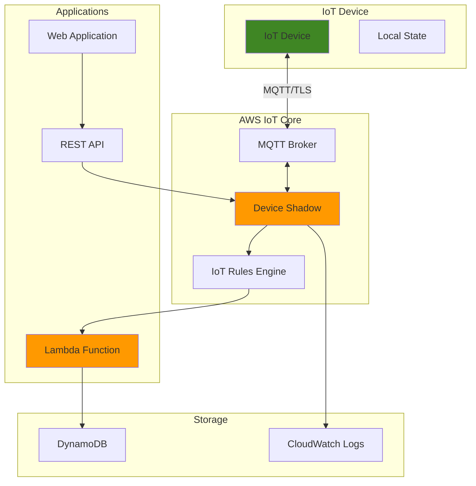

# IoT Device Shadows for State Management

## Problem

IoT devices frequently operate in environments with intermittent connectivity, requiring robust state synchronization between device hardware and cloud applications. When devices disconnect, applications lose visibility into device status and cannot reliably update device configurations, leading to operational blind spots and delayed response to critical changes.

## Solution

AWS IoT Device Shadows provide a persistent, cloud-based representation of device state that enables bidirectional synchronization between devices and applications. This managed service maintains device state during connectivity outages and automatically synchronizes changes when devices reconnect, ensuring reliable state management for distributed IoT fleets.

## Architecture Diagram



## Prerequisites

1. AWS account with IoT Core, Lambda, and DynamoDB permissions
2. AWS CLI v2 installed and configured (or AWS CloudShell)
3. Basic understanding of IoT device communication and MQTT protocol
4. JSON knowledge for device shadow document structure
5. Estimated cost: $5-10 per month for moderate device activity (IoT messages, Lambda invocations, DynamoDB storage)

> **Note**: Device Shadows support up to 8KB of JSON data per shadow. For larger state requirements, consider using multiple named shadows or external storage with shadow references.

## Preparation

```bash
# Set environment variables
export AWS_REGION=$(aws configure get region)
export AWS_ACCOUNT_ID=$(aws sts get-caller-identity \
    --query Account --output text)

# Generate unique identifiers for resources
RANDOM_SUFFIX=$(aws secretsmanager get-random-password \
    --exclude-punctuation --exclude-uppercase \
    --password-length 6 --require-each-included-type \
    --output text --query RandomPassword)

export THING_NAME="smart-thermostat-${RANDOM_SUFFIX}"
export POLICY_NAME="SmartThermostatPolicy-${RANDOM_SUFFIX}"
export RULE_NAME="ShadowUpdateRule-${RANDOM_SUFFIX}"
export LAMBDA_FUNCTION="ProcessShadowUpdate-${RANDOM_SUFFIX}"
export TABLE_NAME="DeviceStateHistory-${RANDOM_SUFFIX}"

echo "✅ Environment variables configured"
echo "Thing Name: ${THING_NAME}"
echo "AWS Region: ${AWS_REGION}"
```

## Steps

1. **Create IoT Thing and Certificate**:

   IoT Things represent physical devices in AWS IoT Core, providing a logical container for device metadata, certificates, and policies. Creating a Thing establishes the device identity required for secure MQTT communication and shadow synchronization. This step forms the security foundation that enables trusted device-to-cloud interactions.

   ```bash
   # Create the IoT Thing
   aws iot create-thing \
       --thing-name ${THING_NAME} \
       --thing-type-name "Thermostat" \
       --attribute-payload attributes='{"manufacturer":"SmartHome","model":"TH-2024"}'
   
   # Generate device certificate and keys
   CERT_RESPONSE=$(aws iot create-keys-and-certificate \
       --set-as-active \
       --output json)
   
   export CERT_ARN=$(echo ${CERT_RESPONSE} | jq -r '.certificateArn')
   export CERT_ID=$(echo ${CERT_RESPONSE} | jq -r '.certificateId')
   
   echo "✅ IoT Thing and certificate created"
   echo "Certificate ARN: ${CERT_ARN}"
   ```

   The Thing and certificate are now established, creating a unique device identity with cryptographic credentials. This security infrastructure enables the device to authenticate with IoT Core and access its dedicated Device Shadow, ensuring only authorized devices can modify device state.

2. **Create IoT Policy for Device Permissions**:

   IoT policies define granular permissions for device operations using AWS IoT-specific policy language. Unlike standard IAM policies, IoT policies support device-specific variables and MQTT topic patterns, enabling secure, scalable access control for device fleets. This policy grants minimal permissions required for shadow operations.

   ```bash
   # Create policy document for device shadow access
   cat > device-policy.json << EOF
   {
     "Version": "2012-10-17",
     "Statement": [
       {
         "Effect": "Allow",
         "Action": [
           "iot:Connect"
         ],
         "Resource": "arn:aws:iot:${AWS_REGION}:${AWS_ACCOUNT_ID}:client/\${iot:Connection.Thing.ThingName}"
       },
       {
         "Effect": "Allow",
         "Action": [
           "iot:Subscribe",
           "iot:Receive"
         ],
         "Resource": [
           "arn:aws:iot:${AWS_REGION}:${AWS_ACCOUNT_ID}:topicfilter/\$aws/things/\${iot:Connection.Thing.ThingName}/shadow/*"
         ]
       },
       {
         "Effect": "Allow",
         "Action": [
           "iot:Publish"
         ],
         "Resource": [
           "arn:aws:iot:${AWS_REGION}:${AWS_ACCOUNT_ID}:topic/\$aws/things/\${iot:Connection.Thing.ThingName}/shadow/*"
         ]
       }
     ]
   }
   EOF
   
   # Create the IoT policy
   aws iot create-policy \
       --policy-name ${POLICY_NAME} \
       --policy-document file://device-policy.json
   
   echo "✅ IoT policy created with shadow permissions"
   ```

   The policy now restricts device access to its own shadow topics using IoT policy variables (${iot:Connection.Thing.ThingName}). This creates a secure, self-contained permission model where each device can only access its own shadow, preventing cross-device data access while maintaining operational flexibility.

3. **Attach Policy to Certificate**:

   Certificate-policy attachment binds the security credentials to specific permissions, completing the device authentication and authorization chain. This relationship ensures that when a device connects using its certificate, IoT Core automatically applies the appropriate permissions for shadow operations and MQTT topic access.

   ```bash
   # Attach policy to certificate
   aws iot attach-policy \
       --policy-name ${POLICY_NAME} \
       --target ${CERT_ARN}
   
   # Attach certificate to Thing
   aws iot attach-thing-principal \
       --thing-name ${THING_NAME} \
       --principal ${CERT_ARN}
   
   echo "✅ Policy attached to certificate and Thing"
   ```

   The device now has complete authentication and authorization configured. When the device connects to IoT Core using its certificate, it will automatically receive permissions to interact with its Device Shadow, enabling secure state synchronization between the physical device and cloud applications.

4. **Create DynamoDB Table for State History**:

   DynamoDB provides fast, scalable storage for device state history and analytics. Storing shadow updates in DynamoDB enables applications to track state changes over time, perform analytics on device behavior, and maintain audit trails for compliance requirements. The table structure optimizes for time-series queries and device-specific data access.

   ```bash
   # Create DynamoDB table for device state history
   aws dynamodb create-table \
       --table-name ${TABLE_NAME} \
       --attribute-definitions \
           AttributeName=ThingName,AttributeType=S \
           AttributeName=Timestamp,AttributeType=N \
       --key-schema \
           AttributeName=ThingName,KeyType=HASH \
           AttributeName=Timestamp,KeyType=RANGE \
       --billing-mode PAY_PER_REQUEST \
       --tags Key=Application,Value=IoTShadowDemo
   
   # Wait for table to become active
   aws dynamodb wait table-exists --table-name ${TABLE_NAME}
   
   echo "✅ DynamoDB table created for state history"
   ```

   The table is now ready to receive device state updates with efficient querying capabilities. The composite key (ThingName + Timestamp) enables fast retrieval of historical data for specific devices while supporting time-range queries for analytics and reporting purposes.

5. **Create Lambda Function for Shadow Processing**:

   Lambda functions provide serverless compute for processing shadow updates in real-time. This function demonstrates how applications can respond to device state changes, perform business logic validation, and store state history for analytics. The serverless model ensures cost-effective scaling based on actual device activity.

   ```bash
   # Create Lambda function code
   cat > lambda-function.py << 'EOF'
   import json
   import boto3
   import time
   import os
   from decimal import Decimal
   
   dynamodb = boto3.resource('dynamodb')
   
   def lambda_handler(event, context):
       try:
           # Parse the shadow update event
           thing_name = event['thingName']
           shadow_data = event['state']
           
           # Store state change in DynamoDB
           table = dynamodb.Table(os.environ['TABLE_NAME'])
           
           # Convert float to Decimal for DynamoDB
           def convert_floats(obj):
               if isinstance(obj, float):
                   return Decimal(str(obj))
               elif isinstance(obj, dict):
                   return {k: convert_floats(v) for k, v in obj.items()}
               elif isinstance(obj, list):
                   return [convert_floats(v) for v in obj]
               return obj
           
           item = {
               'ThingName': thing_name,
               'Timestamp': int(time.time()),
               'ShadowState': convert_floats(shadow_data),
               'EventType': 'shadow_update'
           }
           
           table.put_item(Item=item)
           
           print(f"Processed shadow update for {thing_name}")
           
           return {
               'statusCode': 200,
               'body': json.dumps('Successfully processed shadow update')
           }
           
       except Exception as e:
           print(f"Error processing shadow update: {str(e)}")
           raise
   EOF
   
   # Package the function
   zip lambda-function.zip lambda-function.py
   
   echo "✅ Lambda function code created"
   ```

   The Lambda function is now ready to process shadow updates with proper error handling and DynamoDB integration. This code demonstrates essential patterns for IoT event processing including data type conversion, error handling, and structured logging for operational visibility.

6. **Create IAM Role for Lambda Execution**:

   Lambda execution roles define the AWS service permissions required for function operation. This role follows the principle of least privilege, granting only the specific permissions needed for DynamoDB writes and CloudWatch logging. Proper IAM configuration ensures secure, auditable access to AWS resources.

   ```bash
   # Create trust policy for Lambda
   cat > lambda-trust-policy.json << EOF
   {
     "Version": "2012-10-17",
     "Statement": [
       {
         "Effect": "Allow",
         "Principal": {
           "Service": "lambda.amazonaws.com"
         },
         "Action": "sts:AssumeRole"
       }
     ]
   }
   EOF
   
   # Create execution policy for Lambda
   cat > lambda-execution-policy.json << EOF
   {
     "Version": "2012-10-17",
     "Statement": [
       {
         "Effect": "Allow",
         "Action": [
           "logs:CreateLogGroup",
           "logs:CreateLogStream",
           "logs:PutLogEvents"
         ],
         "Resource": "arn:aws:logs:${AWS_REGION}:${AWS_ACCOUNT_ID}:*"
       },
       {
         "Effect": "Allow",
         "Action": [
           "dynamodb:PutItem",
           "dynamodb:UpdateItem"
         ],
         "Resource": "arn:aws:dynamodb:${AWS_REGION}:${AWS_ACCOUNT_ID}:table/${TABLE_NAME}"
       }
     ]
   }
   EOF
   
   # Create IAM role
   aws iam create-role \
       --role-name ${LAMBDA_FUNCTION}-role \
       --assume-role-policy-document file://lambda-trust-policy.json
   
   # Create and attach policy
   aws iam create-policy \
       --policy-name ${LAMBDA_FUNCTION}-policy \
       --policy-document file://lambda-execution-policy.json
   
   export POLICY_ARN="arn:aws:iam::${AWS_ACCOUNT_ID}:policy/${LAMBDA_FUNCTION}-policy"
   
   aws iam attach-role-policy \
       --role-name ${LAMBDA_FUNCTION}-role \
       --policy-arn ${POLICY_ARN}
   
   echo "✅ IAM role created for Lambda function"
   ```

   The IAM role is now configured with precisely the permissions needed for Lambda operation. This security configuration enables the function to write to DynamoDB and create CloudWatch logs while preventing access to unauthorized resources, maintaining the security principle of least privilege.

7. **Deploy Lambda Function**:

   Function deployment makes the Lambda code available for execution and configures runtime parameters including memory allocation, timeout settings, and environment variables. Proper configuration ensures reliable function execution under varying load conditions while optimizing cost and performance.

   ```bash
   # Wait for IAM role propagation
   sleep 10
   
   # Create Lambda function
   aws lambda create-function \
       --function-name ${LAMBDA_FUNCTION} \
       --runtime python3.9 \
       --role arn:aws:iam::${AWS_ACCOUNT_ID}:role/${LAMBDA_FUNCTION}-role \
       --handler lambda-function.lambda_handler \
       --zip-file fileb://lambda-function.zip \
       --timeout 30 \
       --memory-size 128 \
       --environment Variables="{TABLE_NAME=${TABLE_NAME}}"
   
   export LAMBDA_ARN=$(aws lambda get-function \
       --function-name ${LAMBDA_FUNCTION} \
       --query 'Configuration.FunctionArn' --output text)
   
   echo "✅ Lambda function deployed successfully"
   echo "Function ARN: ${LAMBDA_ARN}"
   ```

   The Lambda function is now operational and ready to process IoT events. The function configuration optimizes for typical IoT workloads with appropriate timeout and memory settings, while environment variables provide secure access to the DynamoDB table name.

8. **Create IoT Rule for Shadow Updates**:

   IoT Rules Engine enables real-time processing of device messages using SQL-like queries and automatic routing to AWS services. This rule monitors Device Shadow updates and triggers Lambda function execution, creating an event-driven architecture that responds immediately to device state changes without polling or manual intervention.

   ```bash
   # Create IoT rule for shadow updates
   cat > iot-rule.json << EOF
   {
     "sql": "SELECT * FROM '\$aws/things/+/shadow/update/accepted'",
     "description": "Process Device Shadow updates",
     "actions": [
       {
         "lambda": {
           "functionArn": "${LAMBDA_ARN}"
         }
       }
     ],
     "ruleDisabled": false
   }
   EOF
   
   # Create the IoT rule
   aws iot create-topic-rule \
       --rule-name ${RULE_NAME} \
       --topic-rule-payload file://iot-rule.json
   
   # Grant IoT permission to invoke Lambda
   aws lambda add-permission \
       --function-name ${LAMBDA_FUNCTION} \
       --statement-id "AllowIoTInvoke" \
       --action lambda:InvokeFunction \
       --principal iot.amazonaws.com \
       --source-arn "arn:aws:iot:${AWS_REGION}:${AWS_ACCOUNT_ID}:rule/${RULE_NAME}"
   
   echo "✅ IoT rule created for shadow processing"
   ```

   The IoT rule is now actively monitoring shadow updates across all devices and automatically triggering Lambda function execution. This event-driven architecture ensures real-time processing of device state changes while maintaining scalability and reliability through AWS managed services.

9. **Initialize Device Shadow**:

   Shadow initialization establishes the baseline device state and demonstrates the shadow document structure. The reported state represents the device's current condition, while the desired state contains configuration that applications want to push to the device. This dual-state model enables reliable bidirectional synchronization.

   ```bash
   # Create initial shadow document
   cat > initial-shadow.json << EOF
   {
     "state": {
       "reported": {
         "temperature": 22.5,
         "humidity": 45,
         "hvac_mode": "heat",
         "target_temperature": 23.0,
         "firmware_version": "1.2.3",
         "connectivity": "online"
       },
       "desired": {
         "target_temperature": 23.0,
         "hvac_mode": "auto"
       }
     }
   }
   EOF
   
   # Update the device shadow
   aws iot-data update-thing-shadow \
       --thing-name ${THING_NAME} \
       --payload file://initial-shadow.json \
       initial-shadow-response.json
   
   echo "✅ Device shadow initialized"
   cat initial-shadow-response.json | jq '.'
   ```

   The Device Shadow now contains structured state data that applications and devices can synchronize against. The reported state reflects actual device conditions, while the desired state represents target configuration, creating a reliable mechanism for device management and monitoring.

> **Warning**: Device Shadows are eventually consistent, meaning updates may take a few seconds to propagate across all AWS services. Design applications to handle this latency appropriately.

## Validation & Testing

1. **Verify shadow creation and content**:

   ```bash
   # Retrieve current shadow state
   aws iot-data get-thing-shadow \
       --thing-name ${THING_NAME} \
       shadow-current.json
   
   echo "Current shadow state:"
   cat shadow-current.json | jq '.state'
   ```

   Expected output: JSON showing both reported and desired states with the thermostat data.

2. **Test shadow update with delta generation**:

   ```bash
   # Update desired state to create delta
   cat > update-desired.json << EOF
   {
     "state": {
       "desired": {
         "target_temperature": 25.0,
         "hvac_mode": "cool"
       }
     }
   }
   EOF
   
   aws iot-data update-thing-shadow \
       --thing-name ${THING_NAME} \
       --payload file://update-desired.json \
       update-response.json
   
   echo "Shadow update response:"
   cat update-response.json | jq '.'
   ```

   Expected output: Response showing updated desired state and delta containing the differences.

3. **Verify Lambda function execution**:

   ```bash
   # Check Lambda function logs
   aws logs describe-log-groups \
       --log-group-name-prefix "/aws/lambda/${LAMBDA_FUNCTION}"
   
   # Get recent log events
   LOG_GROUP="/aws/lambda/${LAMBDA_FUNCTION}"
   aws logs filter-log-events \
       --log-group-name ${LOG_GROUP} \
       --start-time $(date -d '5 minutes ago' +%s)000
   ```

   Expected output: Log entries showing successful shadow update processing.

4. **Verify DynamoDB data storage**:

   ```bash
   # Query DynamoDB for stored state history
   aws dynamodb query \
       --table-name ${TABLE_NAME} \
       --key-condition-expression "ThingName = :thingName" \
       --expression-attribute-values '{":thingName":{"S":"'${THING_NAME}'"}}'
   ```

   Expected output: Items showing timestamped shadow state updates.

## Cleanup

1. **Remove IoT Rule and Lambda permissions**:

   ```bash
   # Delete IoT rule
   aws iot delete-topic-rule --rule-name ${RULE_NAME}
   
   # Remove Lambda permission
   aws lambda remove-permission \
       --function-name ${LAMBDA_FUNCTION} \
       --statement-id "AllowIoTInvoke"
   
   echo "✅ IoT rule and Lambda permissions removed"
   ```

2. **Delete Lambda function and IAM resources**:

   ```bash
   # Delete Lambda function
   aws lambda delete-function --function-name ${LAMBDA_FUNCTION}
   
   # Detach and delete IAM policy
   aws iam detach-role-policy \
       --role-name ${LAMBDA_FUNCTION}-role \
       --policy-arn ${POLICY_ARN}
   
   aws iam delete-policy --policy-arn ${POLICY_ARN}
   aws iam delete-role --role-name ${LAMBDA_FUNCTION}-role
   
   echo "✅ Lambda function and IAM resources deleted"
   ```

3. **Remove DynamoDB table**:

   ```bash
   # Delete DynamoDB table
   aws dynamodb delete-table --table-name ${TABLE_NAME}
   
   echo "✅ DynamoDB table deleted"
   ```

4. **Remove IoT resources**:

   ```bash
   # Detach certificate from Thing
   aws iot detach-thing-principal \
       --thing-name ${THING_NAME} \
       --principal ${CERT_ARN}
   
   # Detach policy from certificate
   aws iot detach-policy \
       --policy-name ${POLICY_NAME} \
       --target ${CERT_ARN}
   
   # Delete certificate
   aws iot update-certificate \
       --certificate-id ${CERT_ID} \
       --new-status INACTIVE
   
   aws iot delete-certificate --certificate-id ${CERT_ID}
   
   # Delete IoT policy and Thing
   aws iot delete-policy --policy-name ${POLICY_NAME}
   aws iot delete-thing --thing-name ${THING_NAME}
   
   echo "✅ All IoT resources deleted"
   ```

5. **Clean up local files**:

   ```bash
   # Remove temporary files
   rm -f device-policy.json lambda-trust-policy.json \
         lambda-execution-policy.json iot-rule.json \
         initial-shadow.json update-desired.json \
         lambda-function.py lambda-function.zip \
         *.json
   
   echo "✅ Local files cleaned up"
   ```

## Discussion

Device Shadows serve as the authoritative state store for IoT devices, enabling robust state management in distributed environments with unreliable connectivity. The shadow document structure separates reported state (device's current condition) from desired state (target configuration), creating a reliable synchronization mechanism that works seamlessly across network interruptions.

The architecture demonstrated here showcases event-driven processing patterns using IoT Rules Engine and Lambda functions. This approach enables real-time response to device state changes while maintaining cost efficiency through serverless compute. The integration with DynamoDB provides persistent storage for state history, enabling analytics, compliance reporting, and operational insights that drive business value.

Security considerations include device-specific access controls through IoT policies that use dynamic variables to restrict access to individual device shadows. This approach scales efficiently across device fleets while maintaining strict security boundaries. The IAM role configuration for Lambda follows least privilege principles, ensuring the processing function has only the permissions necessary for its operation.

> **Tip**: For production deployments, implement shadow versioning and conflict resolution strategies. AWS IoT Device Shadows support optimistic locking through version numbers, enabling safe concurrent updates from multiple sources. See the [AWS IoT Device Shadow Service documentation](https://docs.aws.amazon.com/iot/latest/developerguide/iot-device-shadows.html) for advanced patterns.

## Challenge

Extend this solution by implementing these enhancements:

1. **Named Shadows**: Create multiple named shadows per device to separate different state categories (configuration, telemetry, diagnostics) for better organization and access control.

2. **Delta Processing**: Implement device-side delta processing that responds only to desired state changes, optimizing bandwidth and processing efficiency for resource-constrained devices.

3. **Shadow Metrics**: Add CloudWatch custom metrics to track shadow update frequency, size, and synchronization latency for operational monitoring and alerting.

4. **Conflict Resolution**: Build a conflict resolution system that handles simultaneous updates from multiple sources using shadow versioning and business logic-based merge strategies.

5. **Fleet Management**: Scale the solution to manage shadow states across thousands of devices using IoT Device Management job documents and bulk operations for configuration updates.

## Infrastructure Code

*Infrastructure code will be generated after recipe approval.*