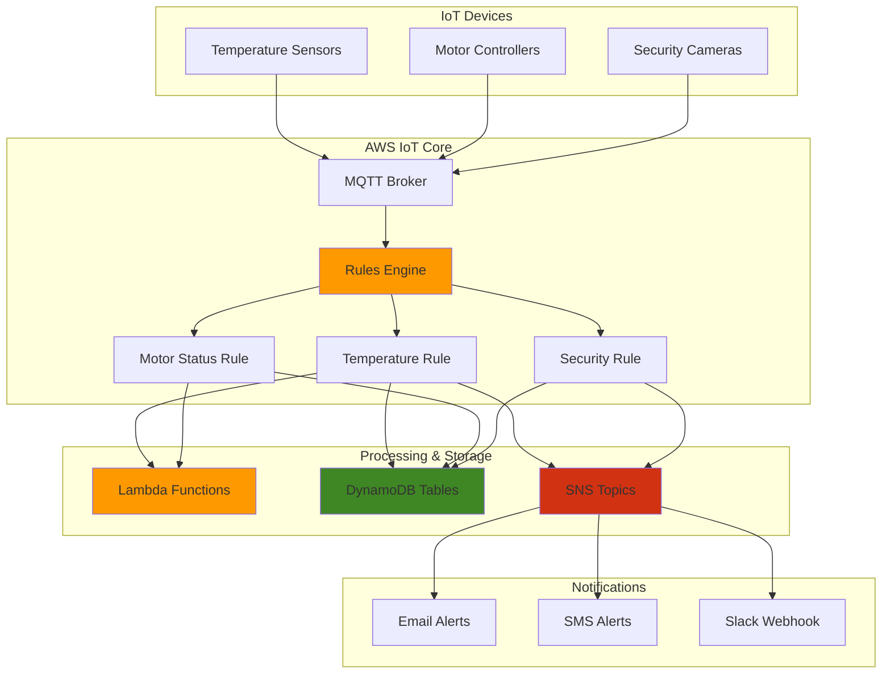

# IoT Event Processing with Rules Engine

## Problem

Industrial IoT deployments generate continuous streams of telemetry data from hundreds or thousands of sensors, but without automated event processing, critical alerts like equipment failures, temperature thresholds, or security breaches may be missed or delayed. Manual monitoring of IoT data streams is impractical at scale and can result in costly downtime, safety incidents, and missed optimization opportunities.

## Solution

AWS IoT Rules Engine provides a serverless, SQL-based event processing system that can automatically filter, transform, and route IoT messages to multiple AWS services in real-time. This solution creates intelligent rules that trigger immediate actions based on sensor data patterns, enabling automated alerting, data storage, and integration with downstream systems for comprehensive IoT event processing.

## Architecture Diagram



## Prerequisites

1. AWS account with IoT Core, Lambda, DynamoDB, and SNS permissions
2. AWS CLI v2 installed and configured (or AWS CloudShell)
3. Basic understanding of SQL and JSON message formats
4. Knowledge of IoT device communication protocols (MQTT)
5. Estimated cost: $5-15 per month for testing workloads

> **Note**: This recipe uses pay-per-use pricing for all services, making it cost-effective for testing and small-scale deployments.

> **Warning**: Ensure proper IAM permissions are configured before proceeding to avoid access denied errors. The IoT Rules Engine requires specific permissions to write to DynamoDB, publish to SNS, and invoke Lambda functions.

## Preparation

```bash
# Set environment variables
export AWS_REGION=$(aws configure get region)
export AWS_ACCOUNT_ID=$(aws sts get-caller-identity \
    --query Account --output text)

# Generate unique identifiers for resources
RANDOM_SUFFIX=$(aws secretsmanager get-random-password \
    --exclude-punctuation --exclude-uppercase \
    --password-length 6 --require-each-included-type \
    --output text --query RandomPassword)

export IOT_THING_NAME="factory-sensor-${RANDOM_SUFFIX}"
export IOT_POLICY_NAME="factory-iot-policy-${RANDOM_SUFFIX}"
export IOT_ROLE_NAME="factory-iot-rules-role-${RANDOM_SUFFIX}"
export LAMBDA_FUNCTION_NAME="factory-event-processor-${RANDOM_SUFFIX}"
export DDB_TABLE_NAME="factory-telemetry-${RANDOM_SUFFIX}"
export SNS_TOPIC_NAME="factory-alerts-${RANDOM_SUFFIX}"

# Create DynamoDB table for telemetry data
aws dynamodb create-table \
    --table-name $DDB_TABLE_NAME \
    --attribute-definitions \
        AttributeName=deviceId,AttributeType=S \
        AttributeName=timestamp,AttributeType=N \
    --key-schema \
        AttributeName=deviceId,KeyType=HASH \
        AttributeName=timestamp,KeyType=RANGE \
    --billing-mode PAY_PER_REQUEST \
    --tags Key=Project,Value=IoTRulesEngine

# Wait for table to be active
aws dynamodb wait table-exists --table-name $DDB_TABLE_NAME
echo "✅ DynamoDB table created: $DDB_TABLE_NAME"

# Create SNS topic for alerts
SNS_TOPIC_ARN=$(aws sns create-topic \
    --name $SNS_TOPIC_NAME \
    --attributes DisplayName="Factory Alerts" \
    --tags Key=Project,Value=IoTRulesEngine \
    --query TopicArn --output text)

export SNS_TOPIC_ARN
echo "✅ SNS topic created: $SNS_TOPIC_ARN"
```

## Steps

1. **Create IAM Role for IoT Rules Engine**:

   AWS IoT Rules Engine requires specific IAM permissions to interact with other AWS services on your behalf. IAM roles provide temporary, secure credentials that follow the principle of least privilege, ensuring your IoT rules can only access the specific resources they need. This security foundation is essential for enterprise IoT deployments where data governance and access control are critical.

   ```bash
   # Create trust policy for IoT service
   cat > /tmp/iot-trust-policy.json << 'EOF'
   {
       "Version": "2012-10-17",
       "Statement": [
           {
               "Effect": "Allow",
               "Principal": {
                   "Service": "iot.amazonaws.com"
               },
               "Action": "sts:AssumeRole"
           }
       ]
   }
   EOF
   
   # Create IAM role
   aws iam create-role \
       --role-name $IOT_ROLE_NAME \
       --assume-role-policy-document file:///tmp/iot-trust-policy.json \
       --tags Key=Project,Value=IoTRulesEngine
   
   # Store role ARN
   IOT_ROLE_ARN=$(aws iam get-role \
       --role-name $IOT_ROLE_NAME \
       --query Role.Arn --output text)
   
   export IOT_ROLE_ARN
   echo "✅ IoT Rules role created: $IOT_ROLE_ARN"
   ```

   The IAM role is now established and ready for policy attachment. This role will be assumed by the IoT Rules Engine when executing actions, providing secure access to DynamoDB, SNS, and Lambda services without exposing long-term credentials.

2. **Create IAM Policy for Rules Engine Actions**:

   IAM policies define the specific permissions granted to the IoT Rules Engine role. This policy implements least-privilege access by granting only the minimum permissions required for each AWS service integration. The granular permissions ensure that rules can write telemetry data to DynamoDB, publish alerts to SNS, and invoke Lambda functions for custom processing.

   ```bash
   # Create policy for DynamoDB, SNS, and Lambda access
   cat > /tmp/iot-rules-policy.json << EOF
   {
       "Version": "2012-10-17",
       "Statement": [
           {
               "Effect": "Allow",
               "Action": [
                   "dynamodb:PutItem",
                   "dynamodb:UpdateItem",
                   "dynamodb:GetItem",
                   "dynamodb:Query"
               ],
               "Resource": "arn:aws:dynamodb:${AWS_REGION}:${AWS_ACCOUNT_ID}:table/${DDB_TABLE_NAME}"
           },
           {
               "Effect": "Allow",
               "Action": [
                   "sns:Publish"
               ],
               "Resource": "${SNS_TOPIC_ARN}"
           },
           {
               "Effect": "Allow",
               "Action": [
                   "lambda:InvokeFunction"
               ],
               "Resource": "arn:aws:lambda:${AWS_REGION}:${AWS_ACCOUNT_ID}:function:${LAMBDA_FUNCTION_NAME}"
           }
       ]
   }
   EOF
   
   # Create and attach policy
   aws iam create-policy \
       --policy-name "${IOT_ROLE_NAME}-policy" \
       --policy-document file:///tmp/iot-rules-policy.json
   
   aws iam attach-role-policy \
       --role-name $IOT_ROLE_NAME \
       --policy-arn "arn:aws:iam::${AWS_ACCOUNT_ID}:policy/${IOT_ROLE_NAME}-policy"
   
   echo "✅ IAM policy created and attached to role"
   ```

   The security permissions are now configured, enabling the IoT Rules Engine to securely interact with downstream AWS services. This policy attachment establishes the trust relationship necessary for automated event processing while maintaining strict access controls.

3. **Create Lambda Function for Event Processing**:

   AWS Lambda provides serverless compute capabilities that enable custom business logic processing for IoT events. Lambda functions automatically scale to handle variable message volumes without infrastructure management, making them ideal for IoT workloads that experience unpredictable traffic patterns. This function will enrich sensor data with business context and severity classifications.

   ```bash
   # Create Lambda function code
   cat > /tmp/lambda-function.py << 'EOF'
   import json
   import boto3
   from datetime import datetime
   
   def lambda_handler(event, context):
       """
       Process IoT events and perform custom business logic
       """
       try:
           # Parse the incoming IoT message
           device_id = event.get('deviceId', 'unknown')
           temperature = event.get('temperature', 0)
           timestamp = event.get('timestamp', int(datetime.now().timestamp()))
           
           # Custom processing logic
           severity = 'normal'
           if temperature > 85:
               severity = 'critical'
           elif temperature > 75:
               severity = 'warning'
           
           # Log the processed event
           print(f"Processing event from {device_id}: temp={temperature}°C, severity={severity}")
           
           # Return enriched data
           return {
               'statusCode': 200,
               'body': json.dumps({
                   'deviceId': device_id,
                   'temperature': temperature,
                   'severity': severity,
                   'processedAt': timestamp,
                   'message': f'Temperature {temperature}°C processed with severity {severity}'
               })
           }
           
       except Exception as e:
           print(f"Error processing event: {str(e)}")
           return {
               'statusCode': 500,
               'body': json.dumps({'error': str(e)})
           }
   EOF
   
   # Create deployment package
   cd /tmp && zip lambda-function.zip lambda-function.py
   
   # Create Lambda function
   aws lambda create-function \
       --function-name $LAMBDA_FUNCTION_NAME \
       --runtime python3.9 \
       --role "arn:aws:iam::${AWS_ACCOUNT_ID}:role/lambda-execution-role" \
       --handler lambda-function.lambda_handler \
       --zip-file fileb://lambda-function.zip \
       --timeout 30 \
       --tags Project=IoTRulesEngine
   
   echo "✅ Lambda function created: $LAMBDA_FUNCTION_NAME"
   ```

   The Lambda function is now deployed and ready to process IoT events. This serverless compute layer enables sophisticated data enrichment, business rule application, and integration with external systems, transforming raw sensor data into actionable business intelligence.

4. **Create Temperature Monitoring Rule**:

   IoT Rules use SQL-like syntax to filter and route messages based on content and metadata. This temperature monitoring rule demonstrates real-time threshold detection, automatically identifying temperature readings that exceed safe operating limits. The rule's dual-action approach enables both immediate alerting and historical data retention for trend analysis.

   ```bash
   # Create rule for temperature monitoring
   cat > /tmp/temperature-rule.json << EOF
   {
       "sql": "SELECT deviceId, temperature, timestamp() as timestamp FROM 'factory/temperature' WHERE temperature > 70",
       "description": "Monitor temperature sensors and trigger alerts for high temperatures",
       "ruleDisabled": false,
       "awsIotSqlVersion": "2016-03-23",
       "actions": [
           {
               "dynamodb": {
                   "tableName": "${DDB_TABLE_NAME}",
                   "roleArn": "${IOT_ROLE_ARN}",
                   "hashKeyField": "deviceId",
                   "hashKeyValue": "\${deviceId}",
                   "rangeKeyField": "timestamp", 
                   "rangeKeyValue": "\${timestamp}",
                   "payloadField": "data"
               }
           },
           {
               "sns": {
                   "topicArn": "${SNS_TOPIC_ARN}",
                   "roleArn": "${IOT_ROLE_ARN}",
                   "messageFormat": "JSON"
               }
           }
       ]
   }
   EOF
   
   # Create IoT rule
   aws iot create-topic-rule \
       --rule-name "TemperatureAlertRule" \
       --topic-rule-payload file:///tmp/temperature-rule.json
   
   echo "✅ Temperature monitoring rule created"
   ```

   The temperature monitoring rule is now active and will automatically process incoming sensor data. When temperature readings exceed 70°C, the rule will simultaneously store the data in DynamoDB for historical analysis and publish alerts to SNS for immediate notification.

5. **Create Motor Status Monitoring Rule**:

   Industrial equipment monitoring requires complex logic that combines multiple sensor readings and status indicators. This motor monitoring rule demonstrates multi-condition filtering, triggering actions when either motor status indicates an error or vibration levels exceed acceptable thresholds. The rule routes events to Lambda for custom processing while maintaining audit trails in DynamoDB.

   ```bash
   # Create rule for motor status monitoring
   cat > /tmp/motor-rule.json << EOF
   {
       "sql": "SELECT deviceId, motorStatus, vibration, timestamp() as timestamp FROM 'factory/motors' WHERE motorStatus = 'error' OR vibration > 5.0",
       "description": "Monitor motor controllers for errors and excessive vibration",
       "ruleDisabled": false,
       "awsIotSqlVersion": "2016-03-23",
       "actions": [
           {
               "dynamodb": {
                   "tableName": "${DDB_TABLE_NAME}",
                   "roleArn": "${IOT_ROLE_ARN}",
                   "hashKeyField": "deviceId",
                   "hashKeyValue": "\${deviceId}",
                   "rangeKeyField": "timestamp",
                   "rangeKeyValue": "\${timestamp}",
                   "payloadField": "data"
               }
           },
           {
               "lambda": {
                   "functionArn": "arn:aws:lambda:${AWS_REGION}:${AWS_ACCOUNT_ID}:function:${LAMBDA_FUNCTION_NAME}",
                   "invocationType": "Event"
               }
           }
       ]
   }
   EOF
   
   # Create IoT rule
   aws iot create-topic-rule \
       --rule-name "MotorStatusRule" \
       --topic-rule-payload file:///tmp/motor-rule.json
   
   echo "✅ Motor status monitoring rule created"
   ```

   The motor monitoring rule now provides proactive equipment health monitoring. By combining status and vibration data, this rule enables predictive maintenance strategies that can prevent costly equipment failures and minimize unplanned downtime.

6. **Create Security Event Rule**:

   Security monitoring in IoT environments requires immediate response capabilities for critical events. This rule demonstrates event filtering using IN clauses to match multiple security event types, ensuring rapid detection of intrusions, unauthorized access attempts, and physical breaches. The rule prioritizes immediate alerting while maintaining detailed audit logs for compliance and forensic analysis.

   ```bash
   # Create rule for security events
   cat > /tmp/security-rule.json << EOF
   {
       "sql": "SELECT deviceId, eventType, severity, location, timestamp() as timestamp FROM 'factory/security' WHERE eventType IN ('intrusion', 'unauthorized_access', 'door_breach')",
       "description": "Process security events and trigger immediate alerts",
       "ruleDisabled": false,
       "awsIotSqlVersion": "2016-03-23",
       "actions": [
           {
               "sns": {
                   "topicArn": "${SNS_TOPIC_ARN}",
                   "roleArn": "${IOT_ROLE_ARN}",
                   "messageFormat": "JSON"
               }
           },
           {
               "dynamodb": {
                   "tableName": "${DDB_TABLE_NAME}",
                   "roleArn": "${IOT_ROLE_ARN}",
                   "hashKeyField": "deviceId",
                   "hashKeyValue": "\${deviceId}",
                   "rangeKeyField": "timestamp",
                   "rangeKeyValue": "\${timestamp}",
                   "payloadField": "data"
               }
           }
       ]
   }
   EOF
   
   # Create IoT rule
   aws iot create-topic-rule \
       --rule-name "SecurityEventRule" \
       --topic-rule-payload file:///tmp/security-rule.json
   
   echo "✅ Security event monitoring rule created"
   ```

   The security monitoring rule establishes a critical safety net for facility protection. This rule ensures that security incidents are immediately escalated to appropriate personnel while creating comprehensive audit trails that support compliance requirements and incident investigation procedures.

7. **Create Data Archival Rule**:

   Long-term data retention strategies are essential for IoT analytics, compliance, and business intelligence. This archival rule demonstrates time-based sampling using the modulo operator to capture representative data snapshots every 5 minutes. The wildcard topic pattern enables comprehensive data collection across all factory systems while managing storage costs through intelligent sampling.

   ```bash
   # Create rule for general data archival
   cat > /tmp/archival-rule.json << EOF
   {
       "sql": "SELECT * FROM 'factory/+' WHERE timestamp() % 300 = 0",
       "description": "Archive all factory data every 5 minutes for historical analysis",
       "ruleDisabled": false,
       "awsIotSqlVersion": "2016-03-23",
       "actions": [
           {
               "dynamodb": {
                   "tableName": "${DDB_TABLE_NAME}",
                   "roleArn": "${IOT_ROLE_ARN}",
                   "hashKeyField": "deviceId",
                   "hashKeyValue": "\${deviceId}",
                   "rangeKeyField": "timestamp",
                   "rangeKeyValue": "\${timestamp}",
                   "payloadField": "data"
               }
           }
       ]
   }
   EOF
   
   # Create IoT rule
   aws iot create-topic-rule \
       --rule-name "DataArchivalRule" \
       --topic-rule-payload file:///tmp/archival-rule.json
   
   echo "✅ Data archival rule created"
   ```

   The data archival rule now provides systematic historical data collection for analytics and compliance purposes. This rule ensures that representative samples of all factory telemetry are preserved for long-term trend analysis, regulatory reporting, and machine learning model training.

8. **Grant Lambda Permissions for IoT Rules**:

   AWS service integrations require explicit permission grants to enable cross-service communication. This Lambda permission configuration allows the IoT Rules Engine to invoke your Lambda function, establishing the necessary trust relationship for event-driven processing. These permissions follow AWS security best practices by specifying exact source ARNs to prevent unauthorized invocations.

   ```bash
   # Grant IoT permission to invoke Lambda function
   aws lambda add-permission \
       --function-name $LAMBDA_FUNCTION_NAME \
       --statement-id "iot-rules-permission" \
       --action "lambda:InvokeFunction" \
       --principal "iot.amazonaws.com" \
       --source-arn "arn:aws:iot:${AWS_REGION}:${AWS_ACCOUNT_ID}:rule/MotorStatusRule"
   
   echo "✅ Lambda permissions configured for IoT Rules"
   ```

   The Lambda integration is now fully configured with appropriate security permissions. The IoT Rules Engine can now reliably invoke your custom processing function, enabling sophisticated business logic application to incoming sensor data streams.

9. **Set Up CloudWatch Logging for Rules Engine**:

   Comprehensive logging is essential for IoT system monitoring, troubleshooting, and compliance reporting. CloudWatch Logs provides centralized log aggregation with search capabilities, enabling rapid diagnosis of rule execution issues and performance monitoring. This logging configuration creates audit trails for all rule processing activities, supporting operational visibility and regulatory compliance requirements.

   ```bash
   # Enable CloudWatch logging for IoT
   aws logs create-log-group \
       --log-group-name "/aws/iot/rules" \
       --tags Project=IoTRulesEngine
   
   # Create IAM role for CloudWatch logging
   cat > /tmp/cloudwatch-trust-policy.json << 'EOF'
   {
       "Version": "2012-10-17",
       "Statement": [
           {
               "Effect": "Allow",
               "Principal": {
                   "Service": "iot.amazonaws.com"
               },
               "Action": "sts:AssumeRole"
           }
       ]
   }
   EOF
   
   # Create logging role
   aws iam create-role \
       --role-name "${IOT_ROLE_NAME}-logging" \
       --assume-role-policy-document file:///tmp/cloudwatch-trust-policy.json
   
   # Attach CloudWatch logs policy
   aws iam attach-role-policy \
       --role-name "${IOT_ROLE_NAME}-logging" \
       --policy-arn "arn:aws:iam::aws:policy/service-role/AWSIoTLogsRole"
   
   echo "✅ CloudWatch logging configured for IoT Rules Engine"
   ```

   The logging infrastructure is now established, providing comprehensive visibility into rule execution and error conditions. This monitoring foundation enables proactive system management, performance optimization, and rapid troubleshooting of IoT event processing workflows.

## Validation & Testing

1. **Verify IoT Rules Creation**:

   ```bash
   # List all created rules
   aws iot list-topic-rules --query 'rules[?contains(ruleName, `Rule`)].ruleName'
   ```

   Expected output: Array containing "TemperatureAlertRule", "MotorStatusRule", "SecurityEventRule", "DataArchivalRule"

2. **Test Temperature Rule with Simulated Data**:

   ```bash
   # Publish test temperature data
   aws iot-data publish \
       --topic "factory/temperature" \
       --payload '{"deviceId":"temp-sensor-01","temperature":80,"location":"production-floor"}'
   
   # Check DynamoDB for stored data
   aws dynamodb scan \
       --table-name $DDB_TABLE_NAME \
       --filter-expression "contains(deviceId, :device)" \
       --expression-attribute-values '{":device":{"S":"temp-sensor-01"}}' \
       --max-items 5
   ```

3. **Test Motor Status Rule**:

   ```bash
   # Publish motor error event
   aws iot-data publish \
       --topic "factory/motors" \
       --payload '{"deviceId":"motor-ctrl-02","motorStatus":"error","vibration":6.5,"location":"assembly-line"}'
   
   # Check Lambda function logs
   aws logs filter-log-events \
       --log-group-name "/aws/lambda/${LAMBDA_FUNCTION_NAME}" \
       --start-time $(date -d '5 minutes ago' +%s)000 \
       --filter-pattern "Processing event"
   ```

4. **Test Security Event Rule**:

   ```bash
   # Publish security intrusion event
   aws iot-data publish \
       --topic "factory/security" \
       --payload '{"deviceId":"security-cam-03","eventType":"intrusion","severity":"high","location":"entrance-door"}'
   
   # Verify SNS topic received the message
   aws sns get-topic-attributes \
       --topic-arn $SNS_TOPIC_ARN \
       --query 'Attributes.SubscriptionsConfirmed'
   ```

5. **Monitor Rule Performance**:

   ```bash
   # Check rule execution metrics
   aws cloudwatch get-metric-statistics \
       --namespace AWS/IoT \
       --metric-name RuleMessageMatched \
       --dimensions Name=RuleName,Value=TemperatureAlertRule \
       --start-time $(date -d '1 hour ago' -u +%Y-%m-%dT%H:%M:%S) \
       --end-time $(date -u +%Y-%m-%dT%H:%M:%S) \
       --period 300 \
       --statistics Sum
   ```

## Cleanup

1. **Delete IoT Rules**:

   ```bash
   # Delete all created rules
   aws iot delete-topic-rule --rule-name "TemperatureAlertRule"
   aws iot delete-topic-rule --rule-name "MotorStatusRule"
   aws iot delete-topic-rule --rule-name "SecurityEventRule"
   aws iot delete-topic-rule --rule-name "DataArchivalRule"
   
   echo "✅ IoT rules deleted"
   ```

2. **Delete Lambda Function**:

   ```bash
   # Delete Lambda function
   aws lambda delete-function \
       --function-name $LAMBDA_FUNCTION_NAME
   
   echo "✅ Lambda function deleted"
   ```

3. **Delete DynamoDB Table**:

   ```bash
   # Delete DynamoDB table
   aws dynamodb delete-table \
       --table-name $DDB_TABLE_NAME
   
   echo "✅ DynamoDB table deleted"
   ```

4. **Delete SNS Topic**:

   ```bash
   # Delete SNS topic
   aws sns delete-topic \
       --topic-arn $SNS_TOPIC_ARN
   
   echo "✅ SNS topic deleted"
   ```

5. **Delete IAM Roles and Policies**:

   ```bash
   # Detach and delete policies
   aws iam detach-role-policy \
       --role-name $IOT_ROLE_NAME \
       --policy-arn "arn:aws:iam::${AWS_ACCOUNT_ID}:policy/${IOT_ROLE_NAME}-policy"
   
   aws iam delete-policy \
       --policy-arn "arn:aws:iam::${AWS_ACCOUNT_ID}:policy/${IOT_ROLE_NAME}-policy"
   
   # Delete roles
   aws iam delete-role --role-name $IOT_ROLE_NAME
   aws iam delete-role --role-name "${IOT_ROLE_NAME}-logging"
   
   echo "✅ IAM roles and policies deleted"
   ```

6. **Delete CloudWatch Log Group**:

   ```bash
   # Delete log group
   aws logs delete-log-group \
       --log-group-name "/aws/iot/rules"
   
   echo "✅ CloudWatch log group deleted"
   ```

## Discussion

The AWS IoT Rules Engine provides a powerful, serverless event processing platform that can handle millions of IoT messages per day while maintaining low latency and high availability. The SQL-based rule syntax makes it accessible to developers familiar with database queries, while the integration with AWS services enables sophisticated event-driven architectures without managing infrastructure.

Key architectural benefits include the ability to fan-out messages to multiple services simultaneously, enabling real-time alerting while maintaining historical data storage. The rules engine supports complex filtering logic, data transformation, and conditional routing, making it suitable for diverse IoT use cases from simple sensor monitoring to complex industrial automation scenarios.

Performance considerations include understanding that rules are evaluated independently and in parallel, allowing for high throughput processing. However, care should be taken with wildcard topic filters and complex SQL statements that could impact performance. The pay-per-message pricing model makes it cost-effective for variable workloads, but organizations should monitor usage patterns to optimize costs.

Security best practices involve using least-privilege IAM roles, enabling CloudWatch logging for audit trails, and implementing proper error handling through dead letter queues. The rules engine supports integration with AWS IoT Device Defender for additional security monitoring and AWS IoT Device Management for fleet-wide rule deployment.

> **Tip**: Use the `timestamp()` function in your SQL statements to add server-side timestamps, which is more reliable than depending on device clocks that may drift or be tampered with.

> **Note**: Monitor CloudWatch metrics regularly to track rule performance and message processing rates. The AWS IoT Rules Engine provides detailed metrics for rule executions, errors, and action successes that can help optimize your IoT event processing pipeline. See [AWS IoT CloudWatch Metrics documentation](https://docs.aws.amazon.com/iot/latest/developerguide/monitoring-cloudwatch.html) for comprehensive monitoring guidance.

## Challenge

Extend this solution by implementing these enhancements:

1. **Multi-Region Deployment**: Deploy rules engine across multiple AWS regions with cross-region replication for disaster recovery and reduced latency
2. **Advanced Analytics Integration**: Connect rules to Amazon Kinesis Data Analytics for real-time stream processing and pattern detection
3. **Machine Learning Integration**: Integrate with Amazon SageMaker endpoints to perform real-time anomaly detection and predictive maintenance
4. **Custom Metrics and Dashboards**: Create CloudWatch custom metrics from rule actions and build operational dashboards with Amazon QuickSight
5. **Error Handling and Retry Logic**: Implement comprehensive error handling with dead letter queues, retry policies, and automated error recovery workflows

## Infrastructure Code

### Available Infrastructure as Code:

- [Infrastructure Code Overview](code/README.md) - Detailed description of all infrastructure components
- [AWS CDK (Python)](code/cdk-python/) - AWS CDK Python implementation
- [AWS CDK (TypeScript)](code/cdk-typescript/) - AWS CDK TypeScript implementation
- [CloudFormation](code/cloudformation.yaml) - AWS CloudFormation template
- [Bash CLI Scripts](code/scripts/) - Example bash scripts using AWS CLI commands to deploy infrastructure
- [Terraform](code/terraform/) - Terraform configuration files