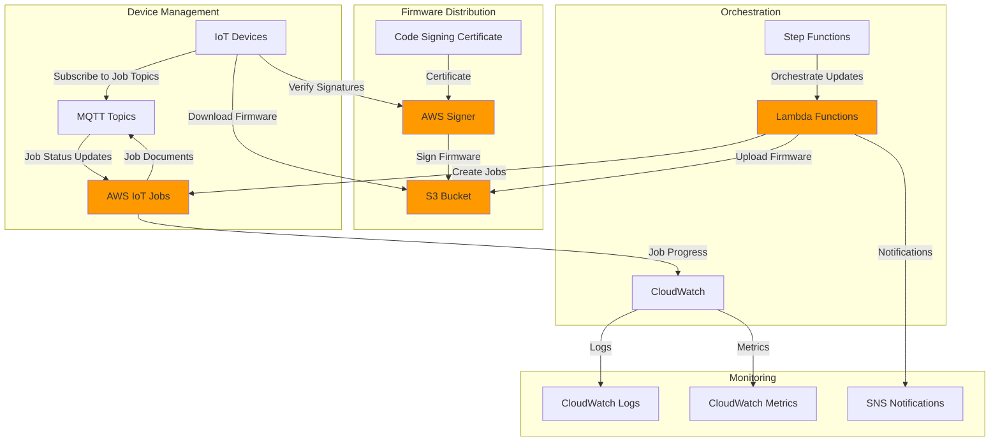

# IoT Firmware Updates with Device Management Jobs

## Problem

Manufacturing companies with thousands of IoT devices in the field face critical challenges when security vulnerabilities are discovered or new features need to be deployed. Traditional firmware update processes require physical access to devices, resulting in costly field service visits, extended downtime, and delayed security patches. Without automated over-the-air (OTA) update capabilities, organizations struggle to maintain device security, deploy bug fixes, and roll out new functionality at scale, potentially exposing their infrastructure to security threats and limiting their ability to respond quickly to changing business requirements.

## Solution

AWS IoT Device Management Jobs provides a scalable solution for orchestrating secure over-the-air firmware updates across thousands of IoT devices. This approach leverages AWS IoT Jobs to coordinate firmware deployments, AWS Signer to ensure firmware integrity through digital signatures, and S3 for secure firmware storage and distribution. The solution enables centralized management of firmware update campaigns, automatic progress tracking, and rollback capabilities, ensuring devices receive authentic, verified firmware updates while maintaining operational continuity.

## Architecture Diagram



## Prerequisites

1. AWS account with IoT Device Management, Lambda, S3, and Signer permissions
2. AWS CLI v2 installed and configured (or AWS CloudShell)
3. Basic understanding of IoT device management and firmware update processes
4. At least one IoT device or simulator for testing
5. Estimated cost: $5-15 for S3 storage, IoT messages, and Lambda executions during testing

> **Note**: This recipe requires code signing certificates. We'll use AWS Certificate Manager for simplicity, but production environments should use proper CA-issued certificates for enhanced security validation.

> **Warning**: Firmware updates can potentially brick devices if not properly tested. Always validate updates in a controlled environment before deploying to production devices.

> **Tip**: Consider implementing staged rollouts with small device groups first, then gradually expanding based on success metrics. See the [AWS IoT Jobs documentation](https://docs.aws.amazon.com/iot/latest/developerguide/iot-jobs.html) for advanced deployment strategies.

## Preparation

```bash
# Set environment variables
export AWS_REGION=$(aws configure get region)
export AWS_ACCOUNT_ID=$(aws sts get-caller-identity \
    --query Account --output text)

# Generate unique identifiers for resources
RANDOM_SUFFIX=$(aws secretsmanager get-random-password \
    --exclude-punctuation --exclude-uppercase \
    --password-length 6 --require-each-included-type \
    --output text --query RandomPassword)

export FIRMWARE_BUCKET="firmware-updates-${RANDOM_SUFFIX}"
export THING_NAME="iot-device-${RANDOM_SUFFIX}"
export THING_GROUP="firmware-update-group-${RANDOM_SUFFIX}"
export JOB_ROLE_NAME="IoTJobsRole-${RANDOM_SUFFIX}"
export LAMBDA_ROLE_NAME="FirmwareUpdateLambdaRole-${RANDOM_SUFFIX}"
export SIGNING_PROFILE_NAME="firmware-signing-${RANDOM_SUFFIX}"

# Create S3 bucket for firmware storage
aws s3 mb s3://${FIRMWARE_BUCKET} --region ${AWS_REGION}

echo "✅ S3 bucket created: ${FIRMWARE_BUCKET}"

# Create IoT Thing for testing
aws iot create-thing --thing-name ${THING_NAME}

echo "✅ IoT Thing created: ${THING_NAME}"

# Create Thing Group for job targeting
aws iot create-thing-group \
    --thing-group-name ${THING_GROUP} \
    --thing-group-properties "thingGroupDescription=\"Devices for firmware updates\""

# Add thing to group
aws iot add-thing-to-thing-group \
    --thing-group-name ${THING_GROUP} \
    --thing-name ${THING_NAME}

echo "✅ Thing Group created and device added: ${THING_GROUP}"
```

## Steps

1. **Create IAM Role for IoT Jobs**:

   AWS IoT Jobs requires proper IAM permissions to access firmware files stored in S3 and manage job execution across your device fleet. IAM roles provide secure, temporary credentials that follow the principle of least privilege, ensuring that jobs can only access the specific resources they need for firmware distribution. This security foundation is critical for maintaining trust in your OTA update pipeline and preventing unauthorized access to firmware assets.

   ```bash
   # Create trust policy for IoT Jobs
   cat > iot-jobs-trust-policy.json << EOF
   {
     "Version": "2012-10-17",
     "Statement": [
       {
         "Effect": "Allow",
         "Principal": {
           "Service": "iot.amazonaws.com"
         },
         "Action": "sts:AssumeRole"
       }
     ]
   }
   EOF
   
   # Create the role
   aws iam create-role \
       --role-name ${JOB_ROLE_NAME} \
       --assume-role-policy-document file://iot-jobs-trust-policy.json
   
   # Create permission policy for S3 access
   cat > iot-jobs-permission-policy.json << EOF
   {
     "Version": "2012-10-17",
     "Statement": [
       {
         "Effect": "Allow",
         "Action": [
           "s3:GetObject",
           "s3:GetObjectVersion"
         ],
         "Resource": "arn:aws:s3:::${FIRMWARE_BUCKET}/*"
       }
     ]
   }
   EOF
   
   # Attach policy to role
   aws iam put-role-policy \
       --role-name ${JOB_ROLE_NAME} \
       --policy-name IoTJobsS3Access \
       --policy-document file://iot-jobs-permission-policy.json
   
   export JOB_ROLE_ARN=$(aws iam get-role \
       --role-name ${JOB_ROLE_NAME} \
       --query Role.Arn --output text)
   
   echo "✅ IoT Jobs role created: ${JOB_ROLE_ARN}"
   ```

   The IAM role is now configured with the minimal permissions needed for IoT Jobs to retrieve firmware from S3. This establishes the security boundary for job execution and ensures that devices can only access signed firmware packages from your designated bucket, following the AWS Well-Architected Framework's security pillar principles.

2. **Set up AWS Signer for Code Signing**:

   AWS Signer provides cryptographic assurance that firmware has not been tampered with during distribution. Code signing creates a digital signature that devices can verify before installing updates, preventing unauthorized or malicious code execution. This is essential for IoT security, as compromised firmware could provide attackers with persistent access to your device fleet and connected infrastructure.

   ```bash
   # Create a signing profile for IoT firmware
   aws signer put-signing-profile \
       --profile-name ${SIGNING_PROFILE_NAME} \
       --platform-id "AmazonFreeRTOS-TI-CC3220SF" \
       --signature-validity-period "value=365,type=Days"
   
   # Wait for the profile to be created
   sleep 5
   
   # Verify profile creation
   aws signer get-signing-profile \
       --profile-name ${SIGNING_PROFILE_NAME} \
       --query 'status' --output text || echo "Profile ready"
   
   echo "✅ Signing profile created: ${SIGNING_PROFILE_NAME}"
   ```

   The signing profile is now ready to create cryptographic signatures for your firmware packages. This establishes the trust chain that devices will use to verify firmware authenticity, ensuring that only authorized updates can be installed on your IoT devices. The AmazonFreeRTOS-TI-CC3220SF platform provides SHA1-RSA signatures compatible with many IoT devices.

3. **Create Lambda Function for Job Management**:

   Lambda functions provide serverless orchestration for complex firmware update workflows, allowing you to implement business logic for job creation, monitoring, and cancellation without managing infrastructure. This approach enables sophisticated update strategies like graduated rollouts, automatic retry logic, and integration with external systems for approval workflows or compliance requirements.

   ```bash
   # Create Lambda execution role
   cat > lambda-trust-policy.json << EOF
   {
     "Version": "2012-10-17",
     "Statement": [
       {
         "Effect": "Allow",
         "Principal": {
           "Service": "lambda.amazonaws.com"
         },
         "Action": "sts:AssumeRole"
       }
     ]
   }
   EOF
   
   aws iam create-role \
       --role-name ${LAMBDA_ROLE_NAME} \
       --assume-role-policy-document file://lambda-trust-policy.json
   
   # Attach managed policy for basic Lambda execution
   aws iam attach-role-policy \
       --role-name ${LAMBDA_ROLE_NAME} \
       --policy-arn arn:aws:iam::aws:policy/service-role/AWSLambdaBasicExecutionRole
   
   # Create custom policy for IoT and S3 access
   cat > lambda-permission-policy.json << EOF
   {
     "Version": "2012-10-17",
     "Statement": [
       {
         "Effect": "Allow",
         "Action": [
           "iot:CreateJob",
           "iot:DescribeJob",
           "iot:ListJobs",
           "iot:UpdateJob",
           "iot:CancelJob",
           "iot:DeleteJob",
           "iot:ListJobExecutionsForJob",
           "iot:ListJobExecutionsForThing",
           "iot:DescribeJobExecution"
         ],
         "Resource": "*"
       },
       {
         "Effect": "Allow",
         "Action": [
           "s3:GetObject",
           "s3:PutObject",
           "s3:DeleteObject",
           "s3:ListBucket"
         ],
         "Resource": [
           "arn:aws:s3:::${FIRMWARE_BUCKET}",
           "arn:aws:s3:::${FIRMWARE_BUCKET}/*"
         ]
       },
       {
         "Effect": "Allow",
         "Action": [
           "signer:StartSigningJob",
           "signer:DescribeSigningJob",
           "signer:ListSigningJobs"
         ],
         "Resource": "*"
       }
     ]
   }
   EOF
   
   aws iam put-role-policy \
       --role-name ${LAMBDA_ROLE_NAME} \
       --policy-name FirmwareUpdatePermissions \
       --policy-document file://lambda-permission-policy.json
   
   export LAMBDA_ROLE_ARN=$(aws iam get-role \
       --role-name ${LAMBDA_ROLE_NAME} \
       --query Role.Arn --output text)
   
   echo "✅ Lambda role created: ${LAMBDA_ROLE_ARN}"
   ```

   The Lambda execution role is now configured with comprehensive permissions for managing IoT Jobs, accessing firmware in S3, and interacting with the signing service. This enables the Lambda function to orchestrate the entire firmware update lifecycle while maintaining security boundaries between different AWS services, adhering to the principle of least privilege.

4. **Create Lambda Function Code**:

   The Lambda function implements the core business logic for firmware update management, including job creation with rollout controls, status monitoring, and cancellation capabilities. This centralized approach enables consistent update policies across your device fleet and provides a single point of control for managing firmware deployments at scale.

   ```bash
   # Create Lambda function code
   cat > firmware_update_manager.py << 'EOF'
   import json
   import boto3
   import uuid
   from datetime import datetime, timedelta
   
   def lambda_handler(event, context):
       iot_client = boto3.client('iot')
       s3_client = boto3.client('s3')
       signer_client = boto3.client('signer')
       
       action = event.get('action')
       
       if action == 'create_job':
           return create_firmware_job(event, iot_client, s3_client)
       elif action == 'check_job_status':
           return check_job_status(event, iot_client)
       elif action == 'cancel_job':
           return cancel_job(event, iot_client)
       else:
           return {
               'statusCode': 400,
               'body': json.dumps({'error': 'Invalid action'})
           }
   
   def create_firmware_job(event, iot_client, s3_client):
       try:
           firmware_version = event['firmware_version']
           thing_group = event['thing_group']
           s3_bucket = event['s3_bucket']
           s3_key = event['s3_key']
           
           # Create job document
           job_document = {
               "operation": "firmware_update",
               "firmware": {
                   "version": firmware_version,
                   "url": f"https://{s3_bucket}.s3.amazonaws.com/{s3_key}",
                   "size": get_object_size(s3_client, s3_bucket, s3_key),
                   "checksum": get_object_checksum(s3_client, s3_bucket, s3_key)
               },
               "steps": [
                   "download_firmware",
                   "verify_signature",
                   "backup_current_firmware",
                   "install_firmware",
                   "verify_installation",
                   "report_status"
               ]
           }
           
           # Create unique job ID
           job_id = f"firmware-update-{firmware_version}-{uuid.uuid4().hex[:8]}"
           
           # Create the job
           response = iot_client.create_job(
               jobId=job_id,
               targets=[f"arn:aws:iot:{boto3.Session().region_name}:{boto3.client('sts').get_caller_identity()['Account']}:thinggroup/{thing_group}"],
               document=json.dumps(job_document),
               description=f"Firmware update to version {firmware_version}",
               targetSelection='SNAPSHOT',
               jobExecutionsRolloutConfig={
                   'maximumPerMinute': 10,
                   'exponentialRate': {
                       'baseRatePerMinute': 5,
                       'incrementFactor': 2.0,
                       'rateIncreaseCriteria': {
                           'numberOfNotifiedThings': 10,
                           'numberOfSucceededThings': 5
                       }
                   }
               },
               abortConfig={
                   'criteriaList': [
                       {
                           'failureType': 'FAILED',
                           'action': 'CANCEL',
                           'thresholdPercentage': 20.0,
                           'minNumberOfExecutedThings': 5
                       }
                   ]
               },
               timeoutConfig={
                   'inProgressTimeoutInMinutes': 60
               }
           )
           
           return {
               'statusCode': 200,
               'body': json.dumps({
                   'job_id': job_id,
                   'job_arn': response['jobArn'],
                   'message': 'Firmware update job created successfully'
               })
           }
           
       except Exception as e:
           return {
               'statusCode': 500,
               'body': json.dumps({'error': str(e)})
           }
   
   def check_job_status(event, iot_client):
       try:
           job_id = event['job_id']
           
           response = iot_client.describe_job(jobId=job_id)
           job_executions = iot_client.list_job_executions_for_job(jobId=job_id)
           
           return {
               'statusCode': 200,
               'body': json.dumps({
                   'job_id': job_id,
                   'status': response['job']['status'],
                   'process_details': response['job']['jobProcessDetails'],
                   'executions': job_executions['executionSummaries']
               })
           }
           
       except Exception as e:
           return {
               'statusCode': 500,
               'body': json.dumps({'error': str(e)})
           }
   
   def cancel_job(event, iot_client):
       try:
           job_id = event['job_id']
           
           iot_client.cancel_job(
               jobId=job_id,
               reasonCode='USER_INITIATED',
               comment='Job cancelled by user'
           )
           
           return {
               'statusCode': 200,
               'body': json.dumps({
                   'job_id': job_id,
                   'message': 'Job cancelled successfully'
               })
           }
           
       except Exception as e:
           return {
               'statusCode': 500,
               'body': json.dumps({'error': str(e)})
           }
   
   def get_object_size(s3_client, bucket, key):
       try:
           response = s3_client.head_object(Bucket=bucket, Key=key)
           return response['ContentLength']
       except:
           return 0
   
   def get_object_checksum(s3_client, bucket, key):
       try:
           response = s3_client.head_object(Bucket=bucket, Key=key)
           return response.get('ETag', '').replace('"', '')
       except:
           return ''
   EOF
   
   # Create deployment package
   zip firmware_update_manager.zip firmware_update_manager.py
   
   # Wait for IAM role propagation
   sleep 10
   
   # Create Lambda function
   aws lambda create-function \
       --function-name firmware-update-manager \
       --runtime python3.12 \
       --role ${LAMBDA_ROLE_ARN} \
       --handler firmware_update_manager.lambda_handler \
       --zip-file fileb://firmware_update_manager.zip \
       --timeout 300 \
       --memory-size 256 \
       --description "Manages IoT firmware update jobs"
   
   echo "✅ Lambda function created: firmware-update-manager"
   ```

   The firmware update manager is now deployed and ready to orchestrate update campaigns. This function provides a programmatic interface for creating jobs with advanced configuration options like rollout rates, abort conditions, and timeout policies, enabling sophisticated update strategies for different device types and deployment scenarios. The exponential rollout configuration ensures gradual deployment while monitoring for failures.

5. **Create Sample Firmware and Upload to S3**:

   S3 provides highly durable and globally distributed storage for firmware packages, ensuring reliable download access for devices worldwide. The service's 99.999999999% (11 9's) durability guarantee and built-in versioning capabilities make it ideal for managing critical firmware assets. Organizing firmware with metadata enables version tracking, compatibility management, and automated deployment decisions.

   ```bash
   # Create sample firmware file
   cat > sample_firmware_v1.0.0.bin << 'EOF'
   # Sample Firmware v1.0.0
   # This is a simulated firmware binary for testing
   # In production, this would be your actual firmware image
   
   FIRMWARE_VERSION=1.0.0
   FIRMWARE_BUILD=20250723
   FIRMWARE_FEATURES=["ota_support", "security_patch", "bug_fixes"]
   
   # Simulated binary data
   BINARY_DATA_START
   00000000: 7f45 4c46 0101 0100 0000 0000 0000 0000  .ELF............
   00000010: 0200 0300 0100 0000 8080 0408 3400 0000  ............4...
   00000020: 0000 0000 0000 0000 3400 2000 0100 0000  ........4. .....
   BINARY_DATA_END
   EOF
   
   # Upload firmware to S3
   aws s3 cp sample_firmware_v1.0.0.bin \
       s3://${FIRMWARE_BUCKET}/firmware/sample_firmware_v1.0.0.bin
   
   # Create firmware metadata
   cat > firmware_metadata.json << EOF
   {
     "version": "1.0.0",
     "build": "20250723",
     "description": "Sample firmware with OTA support and security patches",
     "features": ["ota_support", "security_patch", "bug_fixes"],
     "size": $(wc -c < sample_firmware_v1.0.0.bin),
     "checksum": "$(sha256sum sample_firmware_v1.0.0.bin | cut -d' ' -f1)",
     "upload_date": "$(date -u +%Y-%m-%dT%H:%M:%SZ)"
   }
   EOF
   
   aws s3 cp firmware_metadata.json \
       s3://${FIRMWARE_BUCKET}/firmware/sample_firmware_v1.0.0.json
   
   echo "✅ Sample firmware uploaded to S3"
   ```

   The firmware package and its metadata are now stored in S3, providing the foundation for secure distribution to your device fleet. The metadata file enables automated version management and compatibility checking, while S3's global infrastructure ensures fast download speeds regardless of device location. This follows the AWS Well-Architected Framework's performance efficiency pillar.

6. **Sign the Firmware**:

   Firmware signing creates a cryptographic proof of authenticity that devices can verify before installation. This critical security step prevents malicious actors from distributing unauthorized firmware updates and ensures that only legitimate updates from your organization can be installed. The signing process creates tamper-evident packages that will fail verification if modified after signing.

   ```bash
   # Start signing job for the firmware
   SIGNING_JOB_ID=$(aws signer start-signing-job \
       --source 's3={bucketName='${FIRMWARE_BUCKET}',key=firmware/sample_firmware_v1.0.0.bin,version=null}' \
       --destination 's3={bucketName='${FIRMWARE_BUCKET}',prefix=signed-firmware/}' \
       --profile-name ${SIGNING_PROFILE_NAME} \
       --query 'jobId' --output text)
   
   echo "✅ Signing job started: ${SIGNING_JOB_ID}"
   
   # Wait for signing to complete
   echo "Waiting for firmware signing to complete..."
   while true; do
       SIGNING_STATUS=$(aws signer describe-signing-job \
           --job-id ${SIGNING_JOB_ID} \
           --query 'status' --output text)
       
       if [ "$SIGNING_STATUS" = "Succeeded" ]; then
           echo "✅ Firmware signing completed successfully"
           break
       elif [ "$SIGNING_STATUS" = "Failed" ]; then
           echo "❌ Firmware signing failed"
           aws signer describe-signing-job --job-id ${SIGNING_JOB_ID}
           exit 1
       else
           echo "Signing status: ${SIGNING_STATUS}"
           sleep 10
       fi
   done
   
   # Get signed firmware location
   SIGNED_FIRMWARE_KEY=$(aws signer describe-signing-job \
       --job-id ${SIGNING_JOB_ID} \
       --query 'signedObject.s3.key' --output text)
   
   echo "✅ Signed firmware available at: s3://${FIRMWARE_BUCKET}/${SIGNED_FIRMWARE_KEY}"
   ```

   The firmware package is now cryptographically signed and ready for secure distribution. Devices will verify this signature before installation, ensuring that the firmware has not been tampered with and originates from a trusted source. This establishes the security foundation for your OTA update pipeline, implementing defense-in-depth security practices.

7. **Create Firmware Update Job**:

   IoT Jobs provides distributed coordination for firmware updates across thousands of devices, enabling centralized management of update campaigns with granular control over rollout timing and progress monitoring. The job system handles device coordination, retry logic, and status reporting automatically, reducing the complexity of managing large-scale updates while providing comprehensive visibility into deployment progress.

   ```bash
   # Create job using Lambda function
   aws lambda invoke \
       --function-name firmware-update-manager \
       --payload '{
         "action": "create_job",
         "firmware_version": "1.0.0",
         "thing_group": "'${THING_GROUP}'",
         "s3_bucket": "'${FIRMWARE_BUCKET}'",
         "s3_key": "'${SIGNED_FIRMWARE_KEY}'"
       }' \
       job_response.json
   
   # Display job creation response
   cat job_response.json
   
   # Extract job ID for monitoring
   export JOB_ID=$(cat job_response.json | \
       python3 -c "import json,sys; print(json.load(sys.stdin)['body'])" | \
       python3 -c "import json,sys; print(json.load(sys.stdin)['job_id'])")
   
   echo "✅ Firmware update job created: ${JOB_ID}"
   ```

   The firmware update job is now active and devices in the target group will begin receiving update notifications. The job includes rollout controls and abort conditions to ensure safe deployment, while providing real-time visibility into update progress across your device fleet. The exponential rollout strategy minimizes risk by gradually increasing deployment rate based on success metrics.

8. **Monitor Job Progress**:

   Real-time monitoring of firmware update campaigns is essential for maintaining operational visibility and quickly identifying deployment issues. IoT Jobs provides comprehensive metrics and status reporting that enable operators to track update progress, identify failed devices, and make informed decisions about rollout continuation or abortion based on success rates and device feedback.

   ```bash
   # Check job status
   aws lambda invoke \
       --function-name firmware-update-manager \
       --payload '{
         "action": "check_job_status",
         "job_id": "'${JOB_ID}'"
       }' \
       job_status.json
   
   # Display job status
   echo "Job Status:"
   cat job_status.json | python3 -c "
   import json, sys
   response = json.load(sys.stdin)
   body = json.loads(response['body'])
   print(f\"Job ID: {body['job_id']}\")
   print(f\"Status: {body['status']}\")
   print(f\"Process Details: {json.dumps(body['process_details'], indent=2)}\")"
   
   # List job executions for detailed device status
   aws iot list-job-executions-for-job \
       --job-id ${JOB_ID} \
       --query 'executionSummaries[*].{ThingArn:thingArn,Status:status,QueuedAt:queuedAt,StartedAt:startedAt,LastUpdatedAt:lastUpdatedAt}' \
       --output table
   
   echo "✅ Job status retrieved"
   ```

   The job monitoring system now provides comprehensive visibility into update progress, including individual device status and overall campaign metrics. This enables proactive management of firmware deployments and rapid response to any issues that arise during the update process, supporting the operational excellence pillar of the AWS Well-Architected Framework.

9. **Set up CloudWatch Monitoring**:

   CloudWatch integration provides comprehensive observability for firmware update operations, enabling automated alerting, trend analysis, and operational dashboards. This monitoring infrastructure is crucial for maintaining visibility into update performance, identifying patterns in device behavior, and ensuring that firmware deployment operations meet your organization's reliability and security requirements.

   ```bash
   # Create CloudWatch dashboard for monitoring
   cat > iot_jobs_dashboard.json << EOF
   {
     "widgets": [
       {
         "type": "metric",
         "x": 0,
         "y": 0,
         "width": 12,
         "height": 6,
         "properties": {
           "metrics": [
             ["AWS/IoT", "JobsCompleted"],
             [".", "JobsFailed"],
             [".", "JobsInProgress"],
             [".", "JobsQueued"]
           ],
           "period": 300,
           "stat": "Sum",
           "region": "${AWS_REGION}",
           "title": "IoT Jobs Status"
         }
       },
       {
         "type": "log",
         "x": 0,
         "y": 6,
         "width": 24,
         "height": 6,
         "properties": {
           "query": "SOURCE '/aws/lambda/firmware-update-manager' | fields @timestamp, @message | sort @timestamp desc | limit 100",
           "region": "${AWS_REGION}",
           "title": "Firmware Update Manager Logs"
         }
       }
     ]
   }
   EOF
   
   aws cloudwatch put-dashboard \
       --dashboard-name "IoT-Firmware-Updates" \
       --dashboard-body file://iot_jobs_dashboard.json
   
   echo "✅ CloudWatch dashboard created: IoT-Firmware-Updates"
   ```

   The monitoring dashboard is now configured to provide real-time visibility into firmware update operations. This enables operations teams to track job success rates, identify problematic devices, and maintain comprehensive audit trails for compliance and troubleshooting purposes. The dashboard supports both reactive monitoring and proactive operational insights.

10. **Create Device Simulator for Testing**:

    Device simulation enables testing of firmware update workflows without requiring physical hardware, accelerating development cycles and enabling comprehensive testing of edge cases and failure scenarios. The simulator implements the complete device-side update process, including job polling, firmware download, signature verification, and status reporting, providing confidence that real devices will behave correctly.

    ```bash
    # Create a simple device simulator
    cat > device_simulator.py << 'EOF'
    import json
    import boto3
    import time
    import random
    from datetime import datetime
    
    class IoTDeviceSimulator:
        def __init__(self, thing_name, region_name):
            self.thing_name = thing_name
            self.iot_data = boto3.client('iot-data', region_name=region_name)
            self.iot = boto3.client('iot', region_name=region_name)
            
        def start_job_listener(self):
            """Simulate device listening for job notifications"""
            print(f"Device {self.thing_name} listening for jobs...")
            
            try:
                # Get next pending job
                response = self.iot_data.get_pending_job_executions(
                    thingName=self.thing_name
                )
                
                if response['inProgressJobs'] or response['queuedJobs']:
                    jobs = response['inProgressJobs'] + response['queuedJobs']
                    for job in jobs:
                        self.process_job(job)
                else:
                    print("No pending jobs found")
                    
            except Exception as e:
                print(f"Error getting pending jobs: {e}")
        
        def process_job(self, job):
            """Process a firmware update job"""
            job_id = job['jobId']
            print(f"Processing job: {job_id}")
            
            try:
                # Start job execution
                self.iot_data.start_next_pending_job_execution(
                    thingName=self.thing_name,
                    statusDetails={'step': 'starting', 'progress': '0%'}
                )
                
                # Simulate firmware update steps
                steps = [
                    ('download_firmware', 'Downloading firmware', 20),
                    ('verify_signature', 'Verifying signature', 40),
                    ('backup_current_firmware', 'Backing up current firmware', 60),
                    ('install_firmware', 'Installing firmware', 80),
                    ('verify_installation', 'Verifying installation', 90),
                    ('report_status', 'Reporting final status', 100)
                ]
                
                for step, description, progress in steps:
                    print(f"  {description}... ({progress}%)")
                    
                    # Simulate processing time
                    time.sleep(random.uniform(1, 3))
                    
                    # Update job status
                    self.iot_data.update_job_execution(
                        jobId=job_id,
                        thingName=self.thing_name,
                        status='IN_PROGRESS',
                        statusDetails={
                            'step': step,
                            'progress': f'{progress}%',
                            'timestamp': datetime.utcnow().isoformat()
                        }
                    )
                
                # Complete the job
                self.iot_data.update_job_execution(
                    jobId=job_id,
                    thingName=self.thing_name,
                    status='SUCCEEDED',
                    statusDetails={
                        'step': 'completed',
                        'progress': '100%',
                        'firmware_version': '1.0.0',
                        'completion_time': datetime.utcnow().isoformat()
                    }
                )
                
                print(f"  ✅ Job {job_id} completed successfully")
                
            except Exception as e:
                print(f"  ❌ Job {job_id} failed: {e}")
                
                # Mark job as failed
                self.iot_data.update_job_execution(
                    jobId=job_id,
                    thingName=self.thing_name,
                    status='FAILED',
                    statusDetails={
                        'error': str(e),
                        'timestamp': datetime.utcnow().isoformat()
                    }
                )
    
    if __name__ == "__main__":
        import sys
        if len(sys.argv) != 3:
            print("Usage: python device_simulator.py <thing_name> <region>")
            sys.exit(1)
            
        thing_name = sys.argv[1]
        region = sys.argv[2]
        
        simulator = IoTDeviceSimulator(thing_name, region)
        simulator.start_job_listener()
    EOF
    
    # Run the device simulator
    python3 device_simulator.py ${THING_NAME} ${AWS_REGION}
    
    echo "✅ Device simulator completed firmware update"
    ```

    The device simulator has successfully completed the firmware update process, demonstrating the end-to-end functionality of your OTA update pipeline. This validates that devices can properly receive job notifications, download signed firmware, and report status back to the IoT Jobs service, confirming the reliability of your update system.

## Validation & Testing

1. **Verify Job Execution Status**:

   ```bash
   # Check final job status
   aws iot describe-job --job-id ${JOB_ID} \
       --query '{Status:status,ProcessDetails:jobProcessDetails,CreatedAt:createdAt,LastUpdatedAt:lastUpdatedAt}' \
       --output table
   ```

   Expected output: Job status should show "COMPLETED" with successful execution details.

2. **Verify Device Job Execution**:

   ```bash
   # Check device-specific job execution
   aws iot describe-job-execution \
       --job-id ${JOB_ID} \
       --thing-name ${THING_NAME} \
       --query '{Status:status,StatusDetails:statusDetails,ExecutionNumber:executionNumber,QueuedAt:queuedAt,StartedAt:startedAt,LastUpdatedAt:lastUpdatedAt}' \
       --output table
   ```

   Expected output: Device execution should show "SUCCEEDED" status with firmware version details.

3. **Test Firmware Download and Signature Verification**:

   ```bash
   # Download signed firmware to verify accessibility
   aws s3 cp s3://${FIRMWARE_BUCKET}/${SIGNED_FIRMWARE_KEY} \
       downloaded_firmware.bin
   
   # Verify file integrity
   if [ -f downloaded_firmware.bin ]; then
       echo "✅ Firmware download successful"
       ls -la downloaded_firmware.bin
   else
       echo "❌ Firmware download failed"
   fi
   ```

4. **Test Job Cancellation (with new job)**:

   ```bash
   # Create another job for cancellation testing
   aws lambda invoke \
       --function-name firmware-update-manager \
       --payload '{
         "action": "create_job",
         "firmware_version": "1.0.1",
         "thing_group": "'${THING_GROUP}'",
         "s3_bucket": "'${FIRMWARE_BUCKET}'",
         "s3_key": "'${SIGNED_FIRMWARE_KEY}'"
       }' \
       cancel_test_response.json
   
   CANCEL_JOB_ID=$(cat cancel_test_response.json | \
       python3 -c "import json,sys; print(json.load(sys.stdin)['body'])" | \
       python3 -c "import json,sys; print(json.load(sys.stdin)['job_id'])")
   
   # Cancel the job
   aws lambda invoke \
       --function-name firmware-update-manager \
       --payload '{
         "action": "cancel_job",
         "job_id": "'${CANCEL_JOB_ID}'"
       }' \
       cancel_response.json
   
   echo "Job cancellation test:"
   cat cancel_response.json
   ```

5. **Verify CloudWatch Metrics**:

   ```bash
   # Check CloudWatch metrics for IoT Jobs
   aws cloudwatch get-metric-statistics \
       --namespace AWS/IoT \
       --metric-name JobsCompleted \
       --start-time $(date -u -d '1 hour ago' +%Y-%m-%dT%H:%M:%S) \
       --end-time $(date -u +%Y-%m-%dT%H:%M:%S) \
       --period 300 \
       --statistics Sum \
       --query 'Datapoints[*].{Timestamp:Timestamp,Sum:Sum}' \
       --output table
   ```

## Cleanup

1. **Delete IoT Jobs and Executions**:

   ```bash
   # Cancel and delete active jobs
   aws iot cancel-job --job-id ${JOB_ID} || true
   aws iot delete-job --job-id ${JOB_ID} --force || true
   
   # Delete cancelled job if it exists
   if [ ! -z "${CANCEL_JOB_ID}" ]; then
       aws iot delete-job --job-id ${CANCEL_JOB_ID} --force || true
   fi
   
   echo "✅ IoT Jobs deleted"
   ```

2. **Remove IoT Things and Thing Groups**:

   ```bash
   # Remove thing from thing group
   aws iot remove-thing-from-thing-group \
       --thing-group-name ${THING_GROUP} \
       --thing-name ${THING_NAME}
   
   # Delete thing group
   aws iot delete-thing-group --thing-group-name ${THING_GROUP}
   
   # Delete thing
   aws iot delete-thing --thing-name ${THING_NAME}
   
   echo "✅ IoT Things and Thing Groups deleted"
   ```

3. **Delete Lambda Function**:

   ```bash
   # Delete Lambda function
   aws lambda delete-function \
       --function-name firmware-update-manager
   
   echo "✅ Lambda function deleted"
   ```

4. **Delete S3 Bucket and Contents**:

   ```bash
   # Delete all objects in bucket
   aws s3 rm s3://${FIRMWARE_BUCKET} --recursive
   
   # Delete bucket
   aws s3 rb s3://${FIRMWARE_BUCKET}
   
   echo "✅ S3 bucket deleted"
   ```

5. **Remove IAM Roles and Policies**:

   ```bash
   # Delete Lambda role policies and role
   aws iam delete-role-policy \
       --role-name ${LAMBDA_ROLE_NAME} \
       --policy-name FirmwareUpdatePermissions
   
   aws iam detach-role-policy \
       --role-name ${LAMBDA_ROLE_NAME} \
       --policy-arn arn:aws:iam::aws:policy/service-role/AWSLambdaBasicExecutionRole
   
   aws iam delete-role --role-name ${LAMBDA_ROLE_NAME}
   
   # Delete IoT Jobs role policies and role
   aws iam delete-role-policy \
       --role-name ${JOB_ROLE_NAME} \
       --policy-name IoTJobsS3Access
   
   aws iam delete-role --role-name ${JOB_ROLE_NAME}
   
   echo "✅ IAM roles and policies deleted"
   ```

6. **Delete Signing Profile and CloudWatch Resources**:

   ```bash
   # Delete signing profile
   aws signer cancel-signing-profile \
       --profile-name ${SIGNING_PROFILE_NAME} || true
   
   # Delete CloudWatch dashboard
   aws cloudwatch delete-dashboards \
       --dashboard-names "IoT-Firmware-Updates"
   
   # Clean up local files
   rm -f *.json *.py *.bin *.zip
   
   echo "✅ All resources cleaned up"
   ```

## Discussion

This IoT firmware update solution demonstrates the power of AWS IoT Device Management Jobs for orchestrating large-scale over-the-air updates. The architecture provides several key benefits: centralized job management through IoT Jobs enables coordinated updates across thousands of devices, while AWS Signer ensures firmware authenticity and integrity through digital signatures. The solution includes robust rollback mechanisms and progress tracking, allowing operators to monitor update campaigns in real-time and automatically abort problematic deployments.

The implementation showcases advanced IoT device lifecycle management patterns, including graduated rollout strategies that limit the number of simultaneous updates to prevent overwhelming network resources or creating widespread failures. The job execution model provides granular control over update timing and allows devices to participate in updates based on their availability and operational status. Integration with CloudWatch enables comprehensive monitoring and alerting, while the Lambda-based orchestration layer provides flexibility for custom update logic and business rules.

Key architectural decisions include using S3 for firmware distribution to leverage AWS's global content delivery network, implementing signed firmware packages to prevent unauthorized code execution, and utilizing IoT Jobs' built-in retry and timeout mechanisms for resilient update delivery. The solution also demonstrates proper IAM role separation between job management and device execution permissions, following security best practices for IoT deployments as outlined in the [AWS IoT security best practices guide](https://docs.aws.amazon.com/iot/latest/developerguide/security-best-practices.html).

The architecture aligns with all five pillars of the AWS Well-Architected Framework. Security is ensured through encrypted firmware signing and least-privilege IAM policies. Reliability is provided through rollout controls and automatic abort mechanisms. Performance efficiency is achieved through S3's global distribution and CloudWatch monitoring. Cost optimization comes from Lambda's pay-per-execution model and graduated rollout strategies. Operational excellence is supported through comprehensive monitoring and automated job management capabilities.

> **Tip**: For production deployments, consider implementing staged rollouts with canary deployments to a small subset of devices first, followed by gradual expansion based on success metrics. This approach minimizes risk when deploying firmware updates to critical infrastructure. See the [AWS IoT Jobs documentation](https://docs.aws.amazon.com/iot/latest/developerguide/iot-jobs.html) for advanced deployment strategies.

## Challenge

Extend this solution by implementing these enhancements:

1. **Multi-Stage Rollout Strategy**: Implement canary deployments with automatic progression based on success metrics, including device health checks and rollback triggers for failed updates using AWS IoT Device Defender.

2. **Firmware Version Management**: Create a comprehensive firmware versioning system with dependency tracking, compatibility matrices, and automated update path determination for devices running different firmware versions using DynamoDB.

3. **Device Fleet Segmentation**: Implement advanced device grouping based on hardware types, geographic regions, or operational criticality, with different update policies and schedules for each segment using AWS IoT Thing Groups.

4. **Real-Time Update Monitoring**: Build a comprehensive monitoring dashboard with real-time device status, update progress visualization, network bandwidth utilization, and automated alerting for update anomalies using Amazon Kinesis and AWS IoT Analytics.

5. **Integration with CI/CD Pipeline**: Connect the firmware update system to a continuous integration pipeline using AWS CodePipeline that automatically builds, tests, signs, and deploys firmware updates triggered by code commits or scheduled releases.

## Infrastructure Code

*Infrastructure code will be generated after recipe approval.*