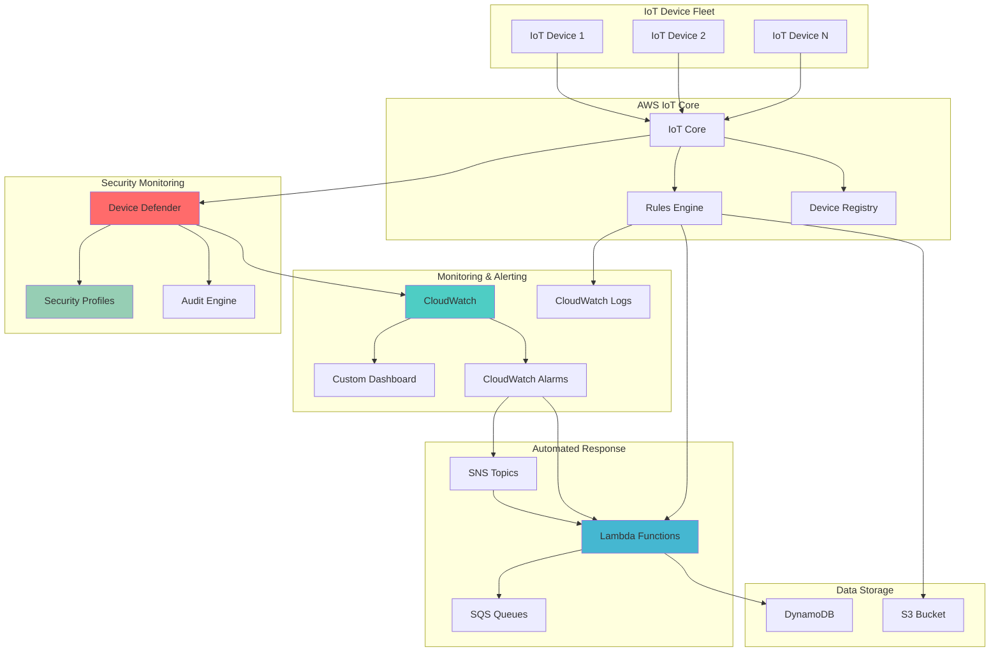

# IoT Fleet Monitoring with Device Defender

## Problem

Manufacturing companies managing thousands of IoT devices across multiple facilities struggle with comprehensive fleet monitoring and security oversight. Without centralized monitoring, security threats go undetected, device performance issues cascade into production downtime, and compliance violations expose the organization to regulatory penalties. Traditional on-premises monitoring solutions cannot scale to handle the volume and variety of IoT telemetry data while providing real-time threat detection and automated remediation capabilities.

## Solution

This solution implements a comprehensive IoT device fleet monitoring system using AWS IoT Device Defender for security monitoring and behavioral analysis, combined with CloudWatch for operational metrics and automated alerting. The architecture provides real-time threat detection, automated remediation workflows, and centralized dashboards for fleet health monitoring, enabling proactive security management and operational excellence at scale.

## Architecture Diagram



## Prerequisites

1. AWS account with appropriate permissions for IoT Core, Device Defender, CloudWatch, Lambda, and related services
2. AWS CLI v2 installed and configured (or AWS CloudShell)
3. Understanding of IoT device management, security monitoring, and CloudWatch concepts
4. Basic knowledge of JSON, Lambda functions, and AWS service integration
5. Estimated cost: $50-100/month for moderate fleet size (depends on device count and data volume)

> **Note**: This recipe demonstrates advanced IoT fleet monitoring concepts. Start with a small test fleet before implementing in production environments.

## Preparation

```bash
# Set environment variables
export AWS_REGION=$(aws configure get region)
export AWS_ACCOUNT_ID=$(aws sts get-caller-identity \
    --query Account --output text)

# Generate unique identifiers for resources
RANDOM_SUFFIX=$(aws secretsmanager get-random-password \
    --exclude-punctuation --exclude-uppercase \
    --password-length 6 --require-each-included-type \
    --output text --query RandomPassword)

export FLEET_NAME="iot-fleet-${RANDOM_SUFFIX}"
export SECURITY_PROFILE_NAME="fleet-security-profile-${RANDOM_SUFFIX}"
export DASHBOARD_NAME="IoT-Fleet-Dashboard-${RANDOM_SUFFIX}"
export SNS_TOPIC_NAME="iot-fleet-alerts-${RANDOM_SUFFIX}"
export LAMBDA_FUNCTION_NAME="iot-fleet-remediation-${RANDOM_SUFFIX}"

# Create foundational IAM role for Device Defender
aws iam create-role \
    --role-name IoTDeviceDefenderRole-${RANDOM_SUFFIX} \
    --assume-role-policy-document '{
        "Version": "2012-10-17",
        "Statement": [
            {
                "Effect": "Allow",
                "Principal": {
                    "Service": "iot.amazonaws.com"
                },
                "Action": "sts:AssumeRole"
            }
        ]
    }'

# Attach required policies to the role
aws iam attach-role-policy \
    --role-name IoTDeviceDefenderRole-${RANDOM_SUFFIX} \
    --policy-arn arn:aws:iam::aws:policy/service-role/AWSIoTDeviceDefenderAudit

export DEVICE_DEFENDER_ROLE_ARN="arn:aws:iam::${AWS_ACCOUNT_ID}:role/IoTDeviceDefenderRole-${RANDOM_SUFFIX}"

echo "✅ Environment prepared with Fleet: ${FLEET_NAME}"
```

## Steps

1. **Configure AWS IoT Device Defender Audit Settings**:

   AWS IoT Device Defender provides comprehensive security auditing for your IoT infrastructure by continuously analyzing device configurations, certificates, and policies against AWS security best practices. This foundational step enables automated detection of security vulnerabilities and compliance violations across your entire IoT fleet, providing the security foundation for enterprise-grade IoT deployments.

   ```bash
   # Enable Device Defender audit configuration
   aws iot update-account-audit-configuration \
       --role-arn "${DEVICE_DEFENDER_ROLE_ARN}" \
       --audit-check-configurations '{
           "AUTHENTICATED_COGNITO_ROLE_OVERLY_PERMISSIVE_CHECK": {"enabled": true},
           "CA_CERTIFICATE_EXPIRING_CHECK": {"enabled": true},
           "CONFLICTING_CLIENT_IDS_CHECK": {"enabled": true},
           "DEVICE_CERTIFICATE_EXPIRING_CHECK": {"enabled": true},
           "DEVICE_CERTIFICATE_SHARED_CHECK": {"enabled": true},
           "IOT_POLICY_OVERLY_PERMISSIVE_CHECK": {"enabled": true},
           "LOGGING_DISABLED_CHECK": {"enabled": true},
           "REVOKED_CA_CERTIFICATE_STILL_ACTIVE_CHECK": {"enabled": true},
           "REVOKED_DEVICE_CERTIFICATE_STILL_ACTIVE_CHECK": {"enabled": true}
       }'
   
   echo "✅ Device Defender audit configuration enabled"
   ```

   This configuration enables nine critical security checks that monitor certificate lifecycle, policy permissions, and authentication mechanisms. Device Defender will now continuously audit your IoT infrastructure and alert you to potential security risks before they can be exploited by attackers.

2. **Create SNS Topic for Fleet Alerts**:

   Amazon SNS provides the messaging backbone for real-time fleet security notifications, enabling immediate response to security threats. This pub/sub messaging service ensures that security events reach the right stakeholders instantly, whether through email, SMS, or automated systems. Proper notification infrastructure is critical for maintaining security posture in large-scale IoT deployments where manual monitoring is impractical.

   ```bash
   # Create SNS topic for security alerts
   SNS_TOPIC_ARN=$(aws sns create-topic \
       --name "${SNS_TOPIC_NAME}" \
       --query TopicArn --output text)
   
   # Subscribe email endpoint (replace with your email)
   aws sns subscribe \
       --topic-arn "${SNS_TOPIC_ARN}" \
       --protocol email \
       --notification-endpoint "your-email@example.com"
   
   # Create topic policy to allow Device Defender to publish
   aws sns set-topic-attributes \
       --topic-arn "${SNS_TOPIC_ARN}" \
       --attribute-name Policy \
       --attribute-value '{
           "Version": "2012-10-17",
           "Statement": [
               {
                   "Effect": "Allow",
                   "Principal": {
                       "Service": "iot.amazonaws.com"
                   },
                   "Action": "SNS:Publish",
                   "Resource": "'${SNS_TOPIC_ARN}'"
               }
           ]
       }'
   
   export SNS_TOPIC_ARN
   echo "✅ SNS topic created: ${SNS_TOPIC_ARN}"
   ```

   The SNS topic is now configured with proper IAM permissions allowing AWS IoT services to publish security alerts. This establishes the communication channel for all security notifications and enables integration with downstream automation systems for incident response.

3. **Create Custom CloudWatch Metrics for IoT Fleet**:

   CloudWatch custom metrics extend AWS's native IoT monitoring capabilities by capturing fleet-specific performance indicators and security events. These metrics provide granular visibility into device behavior patterns and security posture, enabling data-driven decision making for fleet management. Custom metrics are essential for establishing baseline performance characteristics and detecting anomalous behavior that could indicate security threats or operational issues.

   ```bash
   # Create custom metric for device connection rate
   aws cloudwatch put-metric-data \
       --namespace "AWS/IoT/FleetMonitoring" \
       --metric-data MetricName=DeviceConnectionRate,Value=0,Unit=Count/Second,Dimensions=[{Name=FleetName,Value=${FLEET_NAME}}]
   
   # Create custom metric for message processing rate
   aws cloudwatch put-metric-data \
       --namespace "AWS/IoT/FleetMonitoring" \
       --metric-data MetricName=MessageProcessingRate,Value=0,Unit=Count/Second,Dimensions=[{Name=FleetName,Value=${FLEET_NAME}}]
   
   # Create custom metric for security violations
   aws cloudwatch put-metric-data \
       --namespace "AWS/IoT/FleetMonitoring" \
       --metric-data MetricName=SecurityViolations,Value=0,Unit=Count,Dimensions=[{Name=FleetName,Value=${FLEET_NAME}}]
   
   echo "✅ Custom CloudWatch metrics initialized"
   ```

   These custom metrics are now available in CloudWatch with dedicated namespacing for fleet monitoring. The metrics establish baseline values and create the foundation for building comprehensive dashboards and automated alerting systems that respond to both operational and security events.

4. **Create IoT Device Defender Security Profile**:

   Device Defender security profiles define behavioral baselines for your IoT devices by monitoring communication patterns, connection behavior, and data transfer characteristics. These profiles use machine learning and statistical analysis to establish normal device behavior and automatically detect deviations that could indicate security threats, compromised devices, or operational anomalies. Security profiles are the core component of proactive IoT security monitoring.

   ```bash
   # Create comprehensive security profile with multiple behaviors
   aws iot create-security-profile \
       --security-profile-name "${SECURITY_PROFILE_NAME}" \
       --security-profile-description "Comprehensive security monitoring for IoT device fleet" \
       --behaviors '[
           {
               "name": "AuthorizationFailures",
               "metric": "aws:num-authorization-failures",
               "criteria": {
                   "comparisonOperator": "greater-than",
                   "value": {"count": 5},
                   "durationSeconds": 300,
                   "consecutiveDatapointsToAlarm": 2,
                   "consecutiveDatapointsToClear": 2
               }
           },
           {
               "name": "MessageByteSize",
               "metric": "aws:message-byte-size",
               "criteria": {
                   "comparisonOperator": "greater-than",
                   "value": {"count": 1024},
                   "consecutiveDatapointsToAlarm": 3,
                   "consecutiveDatapointsToClear": 1
               }
           },
           {
               "name": "MessagesReceived",
               "metric": "aws:num-messages-received",
               "criteria": {
                   "comparisonOperator": "greater-than",
                   "value": {"count": 100},
                   "durationSeconds": 300,
                   "consecutiveDatapointsToAlarm": 2,
                   "consecutiveDatapointsToClear": 2
               }
           },
           {
               "name": "MessagesSent",
               "metric": "aws:num-messages-sent",
               "criteria": {
                   "comparisonOperator": "greater-than",
                   "value": {"count": 100},
                   "durationSeconds": 300,
                   "consecutiveDatapointsToAlarm": 2,
                   "consecutiveDatapointsToClear": 2
               }
           },
           {
               "name": "ConnectionAttempts",
               "metric": "aws:num-connection-attempts",
               "criteria": {
                   "comparisonOperator": "greater-than",
                   "value": {"count": 10},
                   "durationSeconds": 300,
                   "consecutiveDatapointsToAlarm": 2,
                   "consecutiveDatapointsToClear": 2
               }
           }
       ]' \
       --alert-targets '{
           "SNS": {
               "alertTargetArn": "'${SNS_TOPIC_ARN}'",
               "roleArn": "'${DEVICE_DEFENDER_ROLE_ARN}'"
           }
       }'
   
   SECURITY_PROFILE_ARN="arn:aws:iot:${AWS_REGION}:${AWS_ACCOUNT_ID}:securityprofile/${SECURITY_PROFILE_NAME}"
   echo "✅ Security profile created: ${SECURITY_PROFILE_NAME}"
   ```

   The security profile now monitors five critical behavioral patterns including authorization failures, message sizes, and connection attempts. When devices exceed these thresholds, Device Defender triggers security alerts through the SNS topic, enabling rapid response to potential security incidents.

> **Warning**: Security profile thresholds should be tuned based on your specific device behavior patterns to minimize false positives while maintaining effective threat detection capabilities.

5. **Create Test IoT Things and Attach Security Profile**:

   IoT Thing Groups provide hierarchical organization and management capabilities for large device fleets, enabling policy application and security monitoring at scale. By organizing devices into logical groups based on function, location, or security requirements, administrators can efficiently manage thousands of devices through centralized policies and monitoring profiles. This approach is essential for enterprise IoT deployments where individual device management becomes impractical.

   ```bash
   # Create thing group for fleet management
   aws iot create-thing-group \
       --thing-group-name "${FLEET_NAME}" \
       --thing-group-properties \
           thingGroupDescription="IoT device fleet for monitoring demonstration"
   
   # Create sample IoT things representing devices
   for i in {1..5}; do
       THING_NAME="device-${FLEET_NAME}-${i}"
       
       # Create IoT thing
       aws iot create-thing \
           --thing-name "${THING_NAME}" \
           --attribute-payload attributes='{
               "deviceType": "sensor",
               "location": "facility-'${i}'",
               "firmware": "v1.2.3"
           }'
       
       # Add thing to fleet group
       aws iot add-thing-to-thing-group \
           --thing-group-name "${FLEET_NAME}" \
           --thing-name "${THING_NAME}"
   done
   
   # Attach security profile to thing group
   aws iot attach-security-profile \
       --security-profile-name "${SECURITY_PROFILE_NAME}" \
       --security-profile-target-arn "arn:aws:iot:${AWS_REGION}:${AWS_ACCOUNT_ID}:thinggroup/${FLEET_NAME}"
   
   echo "✅ Created 5 test devices and attached security profile"
   ```

   The thing group is now established with five test devices representing a typical industrial sensor deployment. Each device includes metadata for device type, location, and firmware version, which supports operational management and compliance tracking. The security profile attachment means all devices in this group are now actively monitored for behavioral anomalies.

6. **Create Lambda Function for Automated Remediation**:

   AWS Lambda enables serverless, event-driven automation for IoT security incident response, providing the computational backbone for intelligent threat remediation. Lambda functions can analyze security events in real-time and execute appropriate remediation actions such as device isolation, certificate revocation, or escalation to security teams. This automated response capability is crucial for large-scale IoT deployments where manual incident response cannot keep pace with the volume of security events.

   ```bash
   # Create Lambda execution role
   aws iam create-role \
       --role-name IoTFleetRemediationRole-${RANDOM_SUFFIX} \
       --assume-role-policy-document '{
           "Version": "2012-10-17",
           "Statement": [
               {
                   "Effect": "Allow",
                   "Principal": {
                       "Service": "lambda.amazonaws.com"
                   },
                   "Action": "sts:AssumeRole"
               }
           ]
       }'
   
   # Attach policies to Lambda role
   aws iam attach-role-policy \
       --role-name IoTFleetRemediationRole-${RANDOM_SUFFIX} \
       --policy-arn arn:aws:iam::aws:policy/service-role/AWSLambdaBasicExecutionRole
   
   # Create custom policy for IoT and CloudWatch actions
   aws iam create-policy \
       --policy-name IoTFleetRemediationPolicy-${RANDOM_SUFFIX} \
       --policy-document '{
           "Version": "2012-10-17",
           "Statement": [
               {
                   "Effect": "Allow",
                   "Action": [
                       "iot:UpdateCertificate",
                       "iot:DetachThingPrincipal",
                       "iot:ListThingPrincipals",
                       "iot:DescribeThing",
                       "cloudwatch:PutMetricData",
                       "logs:CreateLogGroup",
                       "logs:CreateLogStream",
                       "logs:PutLogEvents"
                   ],
                   "Resource": "*"
               }
           ]
       }'
   
   aws iam attach-role-policy \
       --role-name IoTFleetRemediationRole-${RANDOM_SUFFIX} \
       --policy-arn "arn:aws:iam::${AWS_ACCOUNT_ID}:policy/IoTFleetRemediationPolicy-${RANDOM_SUFFIX}"
   
   # Create Lambda function code
   cat > /tmp/lambda_function.py << 'EOF'
import json
import boto3
import logging
from datetime import datetime

logger = logging.getLogger()
logger.setLevel(logging.INFO)

iot_client = boto3.client('iot')
cloudwatch = boto3.client('cloudwatch')

def lambda_handler(event, context):
    try:
        # Parse SNS message
        if 'Records' in event:
            for record in event['Records']:
                if record['EventSource'] == 'aws:sns':
                    message = json.loads(record['Sns']['Message'])
                    process_security_violation(message)
        
        return {
            'statusCode': 200,
            'body': json.dumps('Successfully processed security violation')
        }
    
    except Exception as e:
        logger.error(f"Error processing event: {str(e)}")
        return {
            'statusCode': 500,
            'body': json.dumps(f'Error: {str(e)}')
        }

def process_security_violation(message):
    """Process Device Defender security violation"""
    
    violation_type = message.get('violationEventType', 'unknown')
    thing_name = message.get('thingName', 'unknown')
    behavior_name = message.get('behavior', {}).get('name', 'unknown')
    
    logger.info(f"Processing violation: {violation_type} for {thing_name}, behavior: {behavior_name}")
    
    # Send custom metric to CloudWatch
    cloudwatch.put_metric_data(
        Namespace='AWS/IoT/FleetMonitoring',
        MetricData=[
            {
                'MetricName': 'SecurityViolations',
                'Value': 1,
                'Unit': 'Count',
                'Dimensions': [
                    {
                        'Name': 'ViolationType',
                        'Value': violation_type
                    },
                    {
                        'Name': 'BehaviorName',
                        'Value': behavior_name
                    }
                ]
            }
        ]
    )
    
    # Implement remediation logic based on violation type
    if violation_type == 'in-alarm':
        handle_security_alarm(thing_name, behavior_name)
    elif violation_type == 'alarm-cleared':
        handle_alarm_cleared(thing_name, behavior_name)

def handle_security_alarm(thing_name, behavior_name):
    """Handle security alarm with appropriate remediation"""
    
    if behavior_name == 'AuthorizationFailures':
        # For repeated authorization failures, consider temporary device isolation
        logger.warning(f"Authorization failures detected for {thing_name}")
        # In production, you might disable the certificate temporarily
        
    elif behavior_name == 'MessageByteSize':
        # Large message size might indicate data exfiltration
        logger.warning(f"Unusual message size detected for {thing_name}")
        
    elif behavior_name in ['MessagesReceived', 'MessagesSent']:
        # Unusual message volume might indicate compromised device
        logger.warning(f"Unusual message volume detected for {thing_name}")
        
    elif behavior_name == 'ConnectionAttempts':
        # Multiple connection attempts might indicate brute force attack
        logger.warning(f"Multiple connection attempts detected for {thing_name}")

def handle_alarm_cleared(thing_name, behavior_name):
    """Handle alarm cleared event"""
    logger.info(f"Alarm cleared for {thing_name}, behavior: {behavior_name}")
    
    # Send metric indicating alarm cleared
    cloudwatch.put_metric_data(
        Namespace='AWS/IoT/FleetMonitoring',
        MetricData=[
            {
                'MetricName': 'SecurityAlarmsCleared',
                'Value': 1,
                'Unit': 'Count',
                'Dimensions': [
                    {
                        'Name': 'BehaviorName',
                        'Value': behavior_name
                    }
                ]
            }
        ]
    )
EOF
   
   # Create deployment package
   cd /tmp && zip lambda_function.zip lambda_function.py
   
   # Create Lambda function
   LAMBDA_ROLE_ARN="arn:aws:iam::${AWS_ACCOUNT_ID}:role/IoTFleetRemediationRole-${RANDOM_SUFFIX}"
   aws lambda create-function \
       --function-name "${LAMBDA_FUNCTION_NAME}" \
       --runtime python3.12 \
       --role "${LAMBDA_ROLE_ARN}" \
       --handler lambda_function.lambda_handler \
       --zip-file fileb://lambda_function.zip \
       --description "Automated remediation for IoT fleet security violations"
   
   # Wait for function to be active
   aws lambda wait function-active --function-name "${LAMBDA_FUNCTION_NAME}"
   
   echo "✅ Lambda remediation function created"
   ```

   The Lambda function is now deployed and ready to process security violations. This function demonstrates basic remediation logic including event parsing, metric generation, and security alert handling. In production environments, this function would implement more sophisticated remediation actions based on your organization's security policies and incident response procedures.

7. **Configure SNS to Trigger Lambda Function**:

   Integrating SNS with Lambda creates an event-driven security response pipeline that automatically triggers remediation actions when security violations occur. This serverless architecture ensures immediate response to threats without requiring dedicated infrastructure or manual intervention. The SNS-Lambda integration provides a scalable, cost-effective approach to implementing automated incident response capabilities for IoT security monitoring.

   ```bash
   # Subscribe Lambda function to SNS topic
   LAMBDA_FUNCTION_ARN="arn:aws:lambda:${AWS_REGION}:${AWS_ACCOUNT_ID}:function:${LAMBDA_FUNCTION_NAME}"
   
   aws sns subscribe \
       --topic-arn "${SNS_TOPIC_ARN}" \
       --protocol lambda \
       --notification-endpoint "${LAMBDA_FUNCTION_ARN}"
   
   # Add permission for SNS to invoke Lambda
   aws lambda add-permission \
       --function-name "${LAMBDA_FUNCTION_NAME}" \
       --statement-id "sns-invoke-permission" \
       --action "lambda:InvokeFunction" \
       --principal sns.amazonaws.com \
       --source-arn "${SNS_TOPIC_ARN}"
   
   echo "✅ SNS configured to trigger Lambda function"
   ```

   The automated response pipeline is now active. When Device Defender detects security violations, SNS will immediately invoke the Lambda function to analyze the event and execute appropriate remediation actions. This creates a closed-loop security system that can respond to threats in seconds rather than hours.

8. **Create CloudWatch Alarms for Fleet Monitoring**:

   CloudWatch alarms provide the alerting layer for operational and security monitoring, enabling proactive response to fleet-wide issues before they impact business operations. These alarms analyze metric trends and trigger notifications when predefined thresholds are exceeded, supporting both reactive incident response and proactive capacity management. Well-configured alarms are essential for maintaining service level agreements and security posture in production IoT environments.

   ```bash
   # Create alarm for high security violations
   aws cloudwatch put-metric-alarm \
       --alarm-name "IoT-Fleet-High-Security-Violations-${RANDOM_SUFFIX}" \
       --alarm-description "High number of security violations detected" \
       --metric-name SecurityViolations \
       --namespace AWS/IoT/FleetMonitoring \
       --statistic Sum \
       --period 300 \
       --threshold 5 \
       --comparison-operator GreaterThanThreshold \
       --evaluation-periods 2 \
       --alarm-actions "${SNS_TOPIC_ARN}" \
       --dimensions Name=FleetName,Value="${FLEET_NAME}"
   
   # Create alarm for device connectivity issues
   aws cloudwatch put-metric-alarm \
       --alarm-name "IoT-Fleet-Low-Connectivity-${RANDOM_SUFFIX}" \
       --alarm-description "Low device connectivity detected" \
       --metric-name ConnectedDevices \
       --namespace AWS/IoT \
       --statistic Average \
       --period 300 \
       --threshold 3 \
       --comparison-operator LessThanThreshold \
       --evaluation-periods 2 \
       --alarm-actions "${SNS_TOPIC_ARN}" \
       --treat-missing-data notBreaching
   
   # Create alarm for message processing errors
   aws cloudwatch put-metric-alarm \
       --alarm-name "IoT-Fleet-Message-Processing-Errors-${RANDOM_SUFFIX}" \
       --alarm-description "High message processing error rate" \
       --metric-name RuleMessageProcessingErrors \
       --namespace AWS/IoT \
       --statistic Sum \
       --period 300 \
       --threshold 10 \
       --comparison-operator GreaterThanThreshold \
       --evaluation-periods 1 \
       --alarm-actions "${SNS_TOPIC_ARN}"
   
   echo "✅ CloudWatch alarms configured for fleet monitoring"
   ```

   Three comprehensive alarms now monitor critical fleet metrics including security violations, device connectivity, and message processing errors. These alarms provide early warning of operational issues and security threats, enabling rapid response before problems escalate to service outages or security breaches.

9. **Create Custom CloudWatch Dashboard**:

   CloudWatch dashboards provide centralized visualization of IoT fleet health, security posture, and operational metrics, enabling data-driven fleet management decisions. Custom dashboards aggregate metrics from multiple sources into unified views that support both tactical monitoring and strategic planning. Effective dashboard design is crucial for enabling operations teams to quickly identify trends, troubleshoot issues, and maintain optimal fleet performance.

   ```bash
   # Create comprehensive dashboard JSON
   cat > /tmp/dashboard.json << EOF
   {
       "widgets": [
           {
               "type": "metric",
               "x": 0,
               "y": 0,
               "width": 12,
               "height": 6,
               "properties": {
                   "metrics": [
                       ["AWS/IoT", "ConnectedDevices", {"stat": "Average"}],
                       [".", "MessagesSent", {"stat": "Sum"}],
                       [".", "MessagesReceived", {"stat": "Sum"}]
                   ],
                   "period": 300,
                   "stat": "Average",
                   "region": "${AWS_REGION}",
                   "title": "IoT Fleet Overview",
                   "yAxis": {
                       "left": {
                           "min": 0
                       }
                   }
               }
           },
           {
               "type": "metric",
               "x": 12,
               "y": 0,
               "width": 12,
               "height": 6,
               "properties": {
                   "metrics": [
                       ["AWS/IoT/FleetMonitoring", "SecurityViolations", "FleetName", "${FLEET_NAME}"],
                       [".", "SecurityAlarmsCleared", ".", "."]
                   ],
                   "period": 300,
                   "stat": "Sum",
                   "region": "${AWS_REGION}",
                   "title": "Security Violations",
                   "yAxis": {
                       "left": {
                           "min": 0
                       }
                   }
               }
           },
           {
               "type": "metric",
               "x": 0,
               "y": 6,
               "width": 12,
               "height": 6,
               "properties": {
                   "metrics": [
                       ["AWS/IoT", "RuleMessageProcessingErrors", {"stat": "Sum"}],
                       [".", "RuleMessageProcessingSuccess", {"stat": "Sum"}]
                   ],
                   "period": 300,
                   "stat": "Sum",
                   "region": "${AWS_REGION}",
                   "title": "Message Processing",
                   "yAxis": {
                       "left": {
                           "min": 0
                       }
                   }
               }
           },
           {
               "type": "log",
               "x": 12,
               "y": 6,
               "width": 12,
               "height": 6,
               "properties": {
                   "query": "SOURCE '/aws/lambda/${LAMBDA_FUNCTION_NAME}' | fields @timestamp, @message\n| filter @message like /violation/\n| sort @timestamp desc\n| limit 20",
                   "region": "${AWS_REGION}",
                   "title": "Security Violation Logs",
                   "view": "table"
               }
           }
       ]
   }
EOF
   
   # Create the dashboard
   aws cloudwatch put-dashboard \
       --dashboard-name "${DASHBOARD_NAME}" \
       --dashboard-body file:///tmp/dashboard.json
   
   echo "✅ CloudWatch dashboard created: ${DASHBOARD_NAME}"
   ```

   The dashboard provides a comprehensive view of fleet operations with widgets displaying device connectivity, message processing rates, security violations, and security violation logs. This unified interface enables fleet administrators to monitor all critical metrics from a single location and quickly identify operational or security issues requiring attention.

10. **Create Scheduled Audit for Compliance Monitoring**:

    Scheduled audits provide ongoing compliance verification by systematically checking IoT infrastructure against security best practices and regulatory requirements. Daily audits ensure continuous monitoring of certificate lifecycle, policy configurations, and security settings, enabling proactive identification of compliance violations before they become security risks. This automated compliance monitoring is essential for maintaining regulatory compliance and security posture in enterprise IoT deployments.

    ```bash
    # Create daily scheduled audit
    aws iot create-scheduled-audit \
        --scheduled-audit-name "DailyFleetAudit-${RANDOM_SUFFIX}" \
        --frequency DAILY \
        --target-check-names \
            CA_CERTIFICATE_EXPIRING_CHECK \
            DEVICE_CERTIFICATE_EXPIRING_CHECK \
            DEVICE_CERTIFICATE_SHARED_CHECK \
            IOT_POLICY_OVERLY_PERMISSIVE_CHECK \
            LOGGING_DISABLED_CHECK \
            REVOKED_CA_CERTIFICATE_STILL_ACTIVE_CHECK \
            REVOKED_DEVICE_CERTIFICATE_STILL_ACTIVE_CHECK
    
    # Configure audit notifications
    aws iot update-account-audit-configuration \
        --audit-notification-target-configurations \
            'SNS={targetArn="'${SNS_TOPIC_ARN}'",roleArn="'${DEVICE_DEFENDER_ROLE_ARN}'",enabled=true}'
    
    echo "✅ Scheduled audit configured for daily compliance monitoring"
    ```

    Daily audits are now scheduled to monitor seven critical security configurations including certificate expiration, policy permissions, and revoked certificate status. Audit results will be automatically delivered through the SNS notification system, ensuring security teams are immediately notified of any compliance violations.

11. **Configure IoT Rules for Advanced Monitoring**:

    AWS IoT Rules Engine provides real-time event processing and routing capabilities that enable sophisticated monitoring and automation workflows. Rules analyze incoming messages and device events using SQL-like queries, then route relevant events to downstream services for processing, storage, or alerting. This event-driven architecture is essential for implementing responsive IoT monitoring systems that can detect and respond to operational issues and security threats in real-time.

    ```bash
    # Create IoT rule for device connection monitoring
    aws iot create-topic-rule \
        --rule-name "DeviceConnectionMonitoring${RANDOM_SUFFIX}" \
        --topic-rule-payload '{
            "sql": "SELECT * FROM \"$aws/events/presence/connected/+\" WHERE eventType = \"connected\" OR eventType = \"disconnected\"",
            "description": "Monitor device connection events",
            "actions": [
                {
                    "cloudwatchMetric": {
                        "roleArn": "'${DEVICE_DEFENDER_ROLE_ARN}'",
                        "metricNamespace": "AWS/IoT/FleetMonitoring",
                        "metricName": "DeviceConnectionEvents",
                        "metricValue": "1",
                        "metricUnit": "Count",
                        "metricTimestamp": "${timestamp()}"
                    }
                },
                {
                    "cloudwatchLogs": {
                        "roleArn": "'${DEVICE_DEFENDER_ROLE_ARN}'",
                        "logGroupName": "/aws/iot/fleet-monitoring"
                    }
                }
            ]
        }'
    
    # Create log group for IoT events
    aws logs create-log-group \
        --log-group-name "/aws/iot/fleet-monitoring"
    
    # Create IoT rule for message volume monitoring
    aws iot create-topic-rule \
        --rule-name "MessageVolumeMonitoring${RANDOM_SUFFIX}" \
        --topic-rule-payload '{
            "sql": "SELECT clientId, timestamp, topic FROM \"device/+/data\"",
            "description": "Monitor message volume from devices",
            "actions": [
                {
                    "cloudwatchMetric": {
                        "roleArn": "'${DEVICE_DEFENDER_ROLE_ARN}'",
                        "metricNamespace": "AWS/IoT/FleetMonitoring",
                        "metricName": "MessageVolume",
                        "metricValue": "1",
                        "metricUnit": "Count",
                        "metricTimestamp": "${timestamp()}"
                    }
                }
            ]
        }'
    
    echo "✅ IoT rules created for advanced monitoring"
    ```

    Two IoT rules now capture device connection events and message volume metrics, providing real-time visibility into fleet operational status. These rules automatically generate CloudWatch metrics and log entries for all device connection state changes and data messages, enabling comprehensive monitoring of fleet health and activity patterns.

12. **Test Security Profile and Monitoring**:

    Testing validates that all monitoring components are properly configured and functioning as expected. This verification step ensures that security profiles detect violations, alerts are delivered correctly, and automated remediation functions respond appropriately. Comprehensive testing is critical for building confidence in the monitoring system before deploying it to production environments where security incidents have real business impact.

    ```bash
    # Simulate security violation to test monitoring
    # First, create a test certificate and device
    TEST_DEVICE_NAME="test-device-${RANDOM_SUFFIX}"
    
    # Create test device
    aws iot create-thing \
        --thing-name "${TEST_DEVICE_NAME}" \
        --attribute-payload attributes='{"deviceType": "test", "location": "lab"}'
    
    # Add test device to fleet
    aws iot add-thing-to-thing-group \
        --thing-group-name "${FLEET_NAME}" \
        --thing-name "${TEST_DEVICE_NAME}"
    
    # Generate test security violation by creating excessive connection attempts
    # (In a real scenario, this would be done by an actual device)
    echo "Test device created: ${TEST_DEVICE_NAME}"
    echo "Monitor the CloudWatch dashboard and SNS notifications for security events"
    echo "Dashboard URL: https://${AWS_REGION}.console.aws.amazon.com/cloudwatch/home?region=${AWS_REGION}#dashboards:name=${DASHBOARD_NAME}"
    
    echo "✅ Test setup complete - monitoring system is active"
    ```

    The monitoring system is now fully operational with a test device added to the fleet. All security profiles, alarms, and automation functions are active and ready to detect and respond to security events. The system will continue monitoring device behavior and generating alerts based on the configured security profiles and alarm thresholds.

## Validation & Testing

1. **Verify Device Defender Configuration**:

   ```bash
   # Check audit configuration
   aws iot describe-account-audit-configuration
   
   # List security profiles
   aws iot list-security-profiles
   
   # Describe the security profile
   aws iot describe-security-profile \
       --security-profile-name "${SECURITY_PROFILE_NAME}"
   ```

   Expected output: Configuration should show enabled audit checks and properly configured security profile with defined behaviors.

2. **Test CloudWatch Metrics and Alarms**:

   ```bash
   # List CloudWatch alarms
   aws cloudwatch describe-alarms \
       --alarm-names "IoT-Fleet-High-Security-Violations-${RANDOM_SUFFIX}"
   
   # Check custom metrics
   aws cloudwatch list-metrics \
       --namespace "AWS/IoT/FleetMonitoring"
   
   # Test alarm by sending test metric
   aws cloudwatch put-metric-data \
       --namespace "AWS/IoT/FleetMonitoring" \
       --metric-data MetricName=SecurityViolations,Value=10,Unit=Count,Dimensions=[{Name=FleetName,Value=${FLEET_NAME}}]
   ```

   Expected output: Alarms should be in OK state initially, custom metrics should be listed, and test alarm should trigger.

3. **Validate Lambda Function Integration**:

   ```bash
   # Test Lambda function manually
   aws lambda invoke \
       --function-name "${LAMBDA_FUNCTION_NAME}" \
       --payload '{
           "Records": [
               {
                   "EventSource": "aws:sns",
                   "Sns": {
                       "Message": "{\"violationEventType\": \"in-alarm\", \"thingName\": \"test-device\", \"behavior\": {\"name\": \"AuthorizationFailures\"}}"
                   }
               }
           ]
       }' \
       /tmp/lambda-response.json
   
   # Check function logs
   aws logs describe-log-groups \
       --log-group-name-prefix "/aws/lambda/${LAMBDA_FUNCTION_NAME}"
   ```

   Expected output: Lambda function should execute successfully and create log entries.

4. **Test Scheduled Audit Functionality**:

   ```bash
   # Run on-demand audit to test audit functionality
   aws iot start-on-demand-audit-task \
       --target-check-names \
           CA_CERTIFICATE_EXPIRING_CHECK \
           DEVICE_CERTIFICATE_EXPIRING_CHECK \
           CONFLICTING_CLIENT_IDS_CHECK
   
   # List recent audit tasks
   aws iot list-audit-tasks \
       --start-time $(date -d "1 hour ago" +%s) \
       --end-time $(date +%s)
   ```

   Expected output: Audit task should be created and execute successfully.

## Cleanup

1. **Remove CloudWatch Resources**:

   ```bash
   # Delete dashboard
   aws cloudwatch delete-dashboards \
       --dashboard-names "${DASHBOARD_NAME}"
   
   # Delete alarms
   aws cloudwatch delete-alarms \
       --alarm-names \
           "IoT-Fleet-High-Security-Violations-${RANDOM_SUFFIX}" \
           "IoT-Fleet-Low-Connectivity-${RANDOM_SUFFIX}" \
           "IoT-Fleet-Message-Processing-Errors-${RANDOM_SUFFIX}"
   
   echo "✅ CloudWatch resources deleted"
   ```

2. **Remove IoT Rules and Log Groups**:

   ```bash
   # Delete IoT rules
   aws iot delete-topic-rule \
       --rule-name "DeviceConnectionMonitoring${RANDOM_SUFFIX}"
   
   aws iot delete-topic-rule \
       --rule-name "MessageVolumeMonitoring${RANDOM_SUFFIX}"
   
   # Delete log group
   aws logs delete-log-group \
       --log-group-name "/aws/iot/fleet-monitoring"
   
   echo "✅ IoT rules and log groups deleted"
   ```

3. **Remove Lambda Function and SNS Topic**:

   ```bash
   # Delete Lambda function
   aws lambda delete-function \
       --function-name "${LAMBDA_FUNCTION_NAME}"
   
   # Delete SNS topic
   aws sns delete-topic \
       --topic-arn "${SNS_TOPIC_ARN}"
   
   echo "✅ Lambda function and SNS topic deleted"
   ```

4. **Remove IoT Device Defender Configuration**:

   ```bash
   # Detach security profile from thing group
   aws iot detach-security-profile \
       --security-profile-name "${SECURITY_PROFILE_NAME}" \
       --security-profile-target-arn "arn:aws:iot:${AWS_REGION}:${AWS_ACCOUNT_ID}:thinggroup/${FLEET_NAME}"
   
   # Delete security profile
   aws iot delete-security-profile \
       --security-profile-name "${SECURITY_PROFILE_NAME}"
   
   # Delete scheduled audit
   aws iot delete-scheduled-audit \
       --scheduled-audit-name "DailyFleetAudit-${RANDOM_SUFFIX}"
   
   echo "✅ Device Defender configuration removed"
   ```

5. **Remove Test IoT Things and Thing Group**:

   ```bash
   # Remove test devices from thing group and delete things
   for i in {1..5}; do
       THING_NAME="device-${FLEET_NAME}-${i}"
       aws iot remove-thing-from-thing-group \
           --thing-group-name "${FLEET_NAME}" \
           --thing-name "${THING_NAME}"
       aws iot delete-thing --thing-name "${THING_NAME}"
   done
   
   # Delete test device
   aws iot remove-thing-from-thing-group \
       --thing-group-name "${FLEET_NAME}" \
       --thing-name "${TEST_DEVICE_NAME}"
   aws iot delete-thing --thing-name "${TEST_DEVICE_NAME}"
   
   # Delete thing group
   aws iot delete-thing-group \
       --thing-group-name "${FLEET_NAME}"
   
   echo "✅ IoT things and thing group deleted"
   ```

6. **Remove IAM Roles and Policies**:

   ```bash
   # Detach and delete policies from roles
   aws iam detach-role-policy \
       --role-name IoTDeviceDefenderRole-${RANDOM_SUFFIX} \
       --policy-arn arn:aws:iam::aws:policy/service-role/AWSIoTDeviceDefenderAudit
   
   aws iam detach-role-policy \
       --role-name IoTFleetRemediationRole-${RANDOM_SUFFIX} \
       --policy-arn arn:aws:iam::aws:policy/service-role/AWSLambdaBasicExecutionRole
   
   aws iam detach-role-policy \
       --role-name IoTFleetRemediationRole-${RANDOM_SUFFIX} \
       --policy-arn "arn:aws:iam::${AWS_ACCOUNT_ID}:policy/IoTFleetRemediationPolicy-${RANDOM_SUFFIX}"
   
   # Delete custom policy
   aws iam delete-policy \
       --policy-arn "arn:aws:iam::${AWS_ACCOUNT_ID}:policy/IoTFleetRemediationPolicy-${RANDOM_SUFFIX}"
   
   # Delete roles
   aws iam delete-role \
       --role-name IoTDeviceDefenderRole-${RANDOM_SUFFIX}
   
   aws iam delete-role \
       --role-name IoTFleetRemediationRole-${RANDOM_SUFFIX}
   
   echo "✅ IAM roles and policies deleted"
   ```

7. **Clean up temporary files**:

   ```bash
   # Remove temporary files
   rm -f /tmp/lambda_function.py /tmp/lambda_function.zip
   rm -f /tmp/dashboard.json /tmp/lambda-response.json
   
   echo "✅ Cleanup completed successfully"
   ```

## Discussion

This comprehensive IoT device fleet monitoring solution demonstrates how to implement enterprise-grade security monitoring and operational oversight for large-scale IoT deployments. The architecture combines AWS IoT Device Defender's behavioral analysis capabilities with CloudWatch's monitoring and alerting infrastructure to create a robust security posture management system that follows the AWS Well-Architected Framework principles.

The solution's strength lies in its multi-layered approach to security monitoring. Device Defender provides behavior-based anomaly detection by establishing baseline patterns for device communication, connection attempts, and data transfer volumes. When devices deviate from these patterns, the system automatically triggers alerts and can initiate remediation workflows. This proactive approach is crucial for detecting compromised devices before they can cause significant damage or data breaches, aligning with the security pillar of the Well-Architected Framework.

The automated remediation capabilities through Lambda functions enable rapid response to security incidents without requiring manual intervention. In production environments, these functions could implement more sophisticated responses such as device certificate revocation, traffic isolation, or integration with Security Information and Event Management (SIEM) systems. The custom CloudWatch metrics provide additional visibility into fleet health and security posture, complementing the built-in IoT Core metrics and supporting the operational excellence pillar through automated monitoring.

From an operational perspective, the centralized dashboard provides fleet administrators with real-time visibility into device connectivity, message processing rates, and security violations. This unified view is essential for managing large device fleets where manual monitoring would be impractical. The scheduled audit functionality ensures ongoing compliance with security policies and helps identify configuration drift or unauthorized changes to device certificates and policies, supporting both security and compliance requirements.

> **Tip**: For production deployments, consider implementing additional security layers such as VPC endpoints for secure communication and AWS PrivateLink for isolated connectivity to AWS services. Reference the [AWS IoT security documentation](https://docs.aws.amazon.com/iot/latest/developerguide/iot-security.html) for comprehensive security guidance.

The solution is designed to scale horizontally as fleet sizes grow, supporting the performance efficiency pillar. CloudWatch metrics and alarms can handle monitoring thousands of devices, while Device Defender's behavioral analysis becomes more accurate with larger data sets. However, organizations should consider the cost implications of extensive monitoring and implement appropriate data retention policies to manage storage costs, following cost optimization best practices outlined in the [AWS Well-Architected Framework](https://docs.aws.amazon.com/wellarchitected/latest/framework/welcome.html).

## Challenge

Extend this solution by implementing these advanced enhancements:

1. **Multi-Region Fleet Management**: Deploy the monitoring infrastructure across multiple AWS regions with cross-region replication for disaster recovery and reduced latency for global device fleets using AWS Global Infrastructure best practices.

2. **Machine Learning-Based Anomaly Detection**: Integrate Amazon SageMaker to build custom ML models for device behavior analysis, enabling more sophisticated threat detection beyond rule-based monitoring through advanced analytics capabilities.

3. **Device Quarantine and Recovery Workflow**: Implement automated device quarantine capabilities using AWS Step Functions to orchestrate complex remediation workflows including device isolation, forensic data collection, and controlled recovery procedures.

4. **Compliance Reporting and Audit Trail**: Create automated compliance reporting using AWS Config rules and CloudTrail integration to maintain detailed audit trails for regulatory compliance requirements such as SOC 2 or HIPAA.

5. **Advanced Threat Intelligence Integration**: Integrate with external threat intelligence feeds to enhance security monitoring with known IoT attack patterns and indicators of compromise, creating a more comprehensive security monitoring ecosystem.

## Infrastructure Code

### Available Infrastructure as Code:

- [Infrastructure Code Overview](code/README.md) - Detailed description of all infrastructure components
- [AWS CDK (Python)](code/cdk-python/) - AWS CDK Python implementation
- [AWS CDK (TypeScript)](code/cdk-typescript/) - AWS CDK TypeScript implementation
- [CloudFormation](code/cloudformation.yaml) - AWS CloudFormation template
- [Bash CLI Scripts](code/scripts/) - Example bash scripts using AWS CLI commands to deploy infrastructure
- [Terraform](code/terraform/) - Terraform configuration files