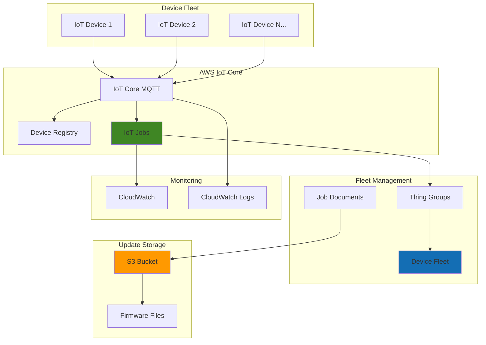

# IoT Over-the-Air Updates with Device Management

## Problem

Manufacturing companies and IoT solution providers struggle to manage firmware updates across thousands of distributed devices without manual intervention, leading to security vulnerabilities, operational inefficiencies, and significant maintenance costs. Traditional update mechanisms require physical access to devices or custom-built solutions that lack enterprise-grade security and monitoring capabilities.

## Solution

AWS IoT Device Management provides a comprehensive platform for organizing, monitoring, and remotely managing IoT devices at scale, while IoT Jobs enables secure over-the-air firmware updates with fine-grained control and monitoring. This solution combines device fleet organization, automated update deployment, and comprehensive tracking to ensure devices remain secure and up-to-date.

## Architecture Diagram



## Prerequisites

1. AWS account with IoT Core, IoT Device Management, and S3 permissions
2. AWS CLI v2 installed and configured (or AWS CloudShell)
3. Basic understanding of IoT concepts and MQTT protocol
4. Sample firmware files or update packages to deploy
5. Estimated cost: $2-5 per month for testing (IoT messages, S3 storage, CloudWatch logs)

> **Note**: This recipe simulates device behavior using AWS CLI commands. In production, devices would use IoT Device SDKs to communicate with AWS IoT Core.

## Preparation

```bash
# Set environment variables
export AWS_REGION=$(aws configure get region)
export AWS_ACCOUNT_ID=$(aws sts get-caller-identity \
    --query Account --output text)

# Generate unique identifiers for resources
RANDOM_SUFFIX=$(aws secretsmanager get-random-password \
    --exclude-punctuation --exclude-uppercase \
    --password-length 6 --require-each-included-type \
    --output text --query RandomPassword)

export IOT_POLICY_NAME="IoTDevicePolicy-${RANDOM_SUFFIX}"
export THING_GROUP_NAME="ProductionDevices-${RANDOM_SUFFIX}"
export S3_BUCKET_NAME="iot-firmware-updates-${RANDOM_SUFFIX}"
export FIRMWARE_VERSION="v2.1.0"

# Create S3 bucket for firmware storage
aws s3 mb s3://${S3_BUCKET_NAME} --region ${AWS_REGION}

# Create sample firmware file
echo "Firmware update package v2.1.0" > firmware-${FIRMWARE_VERSION}.bin
aws s3 cp firmware-${FIRMWARE_VERSION}.bin s3://${S3_BUCKET_NAME}/firmware/

echo "✅ Preparation completed - S3 bucket and firmware file ready"
```

## Steps

1. **Create IoT Device Policy for Fleet Access**:

   IoT policies define the permissions that devices have to interact with AWS IoT services, including publishing telemetry data, subscribing to job notifications, and downloading firmware updates. A well-designed policy follows the principle of least privilege while enabling essential fleet management operations.

   ```bash
   # Create IoT policy document with fleet management permissions
   cat > iot-device-policy.json << EOF
   {
     "Version": "2012-10-17",
     "Statement": [
       {
         "Effect": "Allow",
         "Action": [
           "iot:Connect"
         ],
         "Resource": "arn:aws:iot:${AWS_REGION}:${AWS_ACCOUNT_ID}:client/\${iot:Connection.Thing.ThingName}"
       },
       {
         "Effect": "Allow",
         "Action": [
           "iot:Publish",
           "iot:Subscribe",
           "iot:Receive"
         ],
         "Resource": [
           "arn:aws:iot:${AWS_REGION}:${AWS_ACCOUNT_ID}:topic/\$aws/things/\${iot:Connection.Thing.ThingName}/jobs/*",
           "arn:aws:iot:${AWS_REGION}:${AWS_ACCOUNT_ID}:topicfilter/\$aws/things/\${iot:Connection.Thing.ThingName}/jobs/*"
         ]
       }
     ]
   }
   EOF
   
   # Create the IoT policy
   aws iot create-policy \
       --policy-name ${IOT_POLICY_NAME} \
       --policy-document file://iot-device-policy.json
   
   echo "✅ IoT device policy created with job management permissions"
   ```

   This policy enables devices to connect securely and interact with the IoT Jobs service for receiving and reporting on firmware updates. The policy uses IoT policy variables to ensure devices can only access their own job queues.

2. **Create Thing Group for Fleet Organization**:

   Thing Groups enable logical organization of IoT devices for batch operations, policy management, and targeted deployments. They provide the foundation for fleet-level management by allowing you to group devices by criteria such as device type, firmware version, geographic location, or deployment environment.

   ```bash
   # Create thing group for production devices
   aws iot create-thing-group \
       --thing-group-name ${THING_GROUP_NAME} \
       --thing-group-properties \
       'thingGroupDescription="Production IoT devices for OTA updates",
        attributePayload={
          attributes={
            "environment":"production",
            "updatePolicy":"automatic",
            "firmwareVersion":"v2.0.0"
          }
        }'
   
   echo "✅ Thing group created for fleet organization"
   ```

   The thing group now serves as a container for organizing devices and enables targeted job deployment to specific device cohorts. This hierarchical organization simplifies fleet management and supports sophisticated deployment strategies.

3. **Register IoT Devices in the Fleet**:

   Device registration creates digital twins in AWS IoT Device Registry, establishing the identity and metadata foundation for each device. This process enables secure authentication, authorization, and fleet management operations across your entire device population.

   ```bash
   # Register multiple IoT devices
   for i in {1..3}; do
     THING_NAME="IoTDevice-${RANDOM_SUFFIX}-${i}"
     
     # Create thing (device) in IoT registry
     aws iot create-thing \
         --thing-name ${THING_NAME} \
         --attribute-payload \
         'attributes={
           "deviceType":"sensor",
           "firmwareVersion":"v2.0.0",
           "location":"factory-floor-' ${i}'"
         }'
     
     # Add device to thing group
     aws iot add-thing-to-thing-group \
         --thing-group-name ${THING_GROUP_NAME} \
         --thing-name ${THING_NAME}
     
     # Create and attach certificates for device authentication
     CERT_OUTPUT=$(aws iot create-keys-and-certificate \
         --set-as-active \
         --query '[certificateArn,certificateId,keyPair.PrivateKey,certificatePem]' \
         --output text)
     
     CERT_ARN=$(echo ${CERT_OUTPUT} | cut -d' ' -f1)
     
     # Attach policy to certificate
     aws iot attach-policy \
         --policy-name ${IOT_POLICY_NAME} \
         --target ${CERT_ARN}
     
     # Attach certificate to thing
     aws iot attach-thing-principal \
         --thing-name ${THING_NAME} \
         --principal ${CERT_ARN}
     
     echo "✅ Device ${THING_NAME} registered and configured"
   done
   ```

   Each device is now registered with unique credentials and organized within the fleet structure. This enables secure, authenticated communication and prepares devices for receiving over-the-air update instructions.

4. **Create Job Document for Firmware Update**:

   Job documents define the specific instructions and parameters that devices will execute during firmware updates. They specify download locations, installation procedures, validation steps, and rollback mechanisms, providing a standardized approach to fleet-wide operations.

   ```bash
   # Create comprehensive job document for firmware update
   cat > firmware-update-job.json << EOF
   {
     "operation": "firmwareUpdate",
     "firmwareVersion": "${FIRMWARE_VERSION}",
     "downloadUrl": "https://${S3_BUCKET_NAME}.s3.${AWS_REGION}.amazonaws.com/firmware/firmware-${FIRMWARE_VERSION}.bin",
     "checksumAlgorithm": "SHA256",
     "checksum": "placeholder-checksum-for-demo",
     "installationSteps": [
       "Download firmware package from specified URL",
       "Validate package integrity using checksum",
       "Backup current firmware version",
       "Install new firmware version",
       "Restart device and validate functionality",
       "Report installation status to AWS IoT"
     ],
     "rollbackInstructions": {
       "enabled": true,
       "maxAttempts": 3,
       "fallbackVersion": "v2.0.0"
     },
     "timeoutConfig": {
       "inProgressTimeoutInMinutes": 30,
       "stepTimeoutInMinutes": 10
     }
   }
   EOF
   
   echo "✅ Job document created with firmware update instructions"
   ```

   The job document now contains comprehensive instructions that devices will follow during the update process. This standardization ensures consistent update behavior across the entire fleet while providing safety mechanisms for rollback scenarios.

> **Warning**: Always validate firmware checksums and implement rollback mechanisms in production deployments to prevent device failures from corrupted updates.

5. **Deploy OTA Update Job to Device Fleet**:

   IoT Jobs orchestrates the deployment of firmware updates across your device fleet with sophisticated scheduling, targeting, and monitoring capabilities. This approach enables controlled rollouts, staged deployments, and comprehensive tracking of update progress across thousands of devices.

   ```bash
   # Create IoT job for firmware update deployment
   JOB_ID="firmware-update-${FIRMWARE_VERSION}-${RANDOM_SUFFIX}"
   
   aws iot create-job \
       --job-id ${JOB_ID} \
       --targets "arn:aws:iot:${AWS_REGION}:${AWS_ACCOUNT_ID}:thinggroup/${THING_GROUP_NAME}" \
       --document file://firmware-update-job.json \
       --description "Deploy firmware version ${FIRMWARE_VERSION} to production devices" \
       --job-executions-rollout-config \
       'maximumPerMinute=10,exponentialRate={baseRatePerMinute=5,incrementFactor=2,rateIncreaseCriteria={numberOfNotifiedThings=5,numberOfSucceededThings=3}}' \
       --abort-config \
       'criteriaList=[{failureType="FAILED",action="CANCEL",thresholdPercentage=25,minNumberOfExecutedThings=3}]' \
       --timeout-config \
       'inProgressTimeoutInMinutes=60'
   
   echo "✅ Firmware update job deployed to device fleet: ${JOB_ID}"
   ```

   The update job is now active and will be delivered to all devices in the target group. The rollout configuration ensures controlled deployment with automatic abort mechanisms if failure rates exceed acceptable thresholds.

6. **Monitor Job Execution and Device Status**:

   Comprehensive monitoring provides real-time visibility into update progress, success rates, and device health during firmware deployments. This operational intelligence enables proactive intervention and ensures update quality across the fleet.

   ```bash
   # Monitor job execution status
   aws iot describe-job \
       --job-id ${JOB_ID} \
       --query '[jobArn,status,jobExecutionsRolloutConfig,description]' \
       --output table
   
   # Check job execution details for the thing group
   aws iot list-job-executions-for-job \
       --job-id ${JOB_ID} \
       --query 'executionSummaries[*].[thingArn,status,queuedAt,startedAt,lastUpdatedAt]' \
       --output table
   
   # Get detailed execution status for each device
   for THING_NAME in $(aws iot list-things-in-thing-group \
       --thing-group-name ${THING_GROUP_NAME} \
       --query 'things[*]' --output text); do
     
     echo "Checking status for device: ${THING_NAME}"
     aws iot describe-job-execution \
         --job-id ${JOB_ID} \
         --thing-name ${THING_NAME} \
         --query '[status,statusDetails,executionNumber,approximateSecondsBeforeTimedOut]' \
         --output table
   done
   
   echo "✅ Job monitoring completed - check device status above"
   ```

   The monitoring data reveals update progress across all fleet devices, enabling you to track completion rates, identify failures, and ensure successful firmware deployment.

> **Tip**: Set up CloudWatch alarms on IoT Jobs metrics to automatically notify operations teams when update failure rates exceed acceptable thresholds. See [AWS IoT Device Management documentation](https://docs.aws.amazon.com/iot/latest/developerguide/device-management.html) for advanced monitoring patterns.

7. **Simulate Device Job Processing**:

   Understanding how devices process job instructions helps validate update procedures and troubleshoot deployment issues. This simulation demonstrates the complete device-side workflow for receiving, processing, and reporting on firmware update jobs.

   ```bash
   # Simulate device processing of firmware update job
   SAMPLE_THING=$(aws iot list-things-in-thing-group \
       --thing-group-name ${THING_GROUP_NAME} \
       --query 'things[0]' --output text)
   
   echo "Simulating job processing for device: ${SAMPLE_THING}"
   
   # Get pending job execution
   PENDING_JOBS=$(aws iot list-job-executions-for-thing \
       --thing-name ${SAMPLE_THING} \
       --status IN_PROGRESS \
       --query 'executionSummaries[0].jobId' \
       --output text)
   
   if [ "${PENDING_JOBS}" != "None" ]; then
     # Simulate device updating job status to IN_PROGRESS
     aws iot update-job-execution \
         --job-id ${JOB_ID} \
         --thing-name ${SAMPLE_THING} \
         --status IN_PROGRESS \
         --status-details '{"step":"downloading","progress":"25%","details":"Downloading firmware package"}'
     
     echo "Device reported: Download in progress"
     
     # Simulate successful completion
     sleep 2
     aws iot update-job-execution \
         --job-id ${JOB_ID} \
         --thing-name ${SAMPLE_THING} \
         --status SUCCEEDED \
         --status-details '{"step":"completed","progress":"100%","details":"Firmware update completed successfully","newVersion":"'${FIRMWARE_VERSION}'"}'
     
     echo "✅ Device ${SAMPLE_THING} completed firmware update successfully"
   else
     echo "No pending jobs found for ${SAMPLE_THING}"
   fi
   ```

   This simulation demonstrates the complete device workflow from job receipt to completion reporting. In production, devices would execute actual firmware installation procedures while following the same status reporting pattern.

8. **Update Device Fleet Metadata**:

   Maintaining accurate device metadata enables effective fleet management, compliance tracking, and operational decision-making. Updating device attributes after successful deployments ensures your digital twins accurately reflect the current state of physical devices.

   ```bash
   # Update device attributes to reflect new firmware version
   for THING_NAME in $(aws iot list-things-in-thing-group \
       --thing-group-name ${THING_GROUP_NAME} \
       --query 'things[*]' --output text); do
     
     # Check if job completed successfully for this device
     JOB_STATUS=$(aws iot describe-job-execution \
         --job-id ${JOB_ID} \
         --thing-name ${THING_NAME} \
         --query 'execution.status' \
         --output text 2>/dev/null || echo "QUEUED")
     
     if [ "${JOB_STATUS}" == "SUCCEEDED" ]; then
       # Update device attributes with new firmware version
       aws iot update-thing \
           --thing-name ${THING_NAME} \
           --attribute-payload \
           'attributes={
             "deviceType":"sensor",
             "firmwareVersion":"'${FIRMWARE_VERSION}'",
             "lastUpdateTime":"'$(date -u +%Y-%m-%dT%H:%M:%SZ)'",
             "updateStatus":"success"
           }'
       
       echo "✅ Updated metadata for ${THING_NAME} with firmware ${FIRMWARE_VERSION}"
     else
       echo "Device ${THING_NAME} update status: ${JOB_STATUS}"
     fi
   done
   
   # Update thing group attributes
   aws iot update-thing-group \
       --thing-group-name ${THING_GROUP_NAME} \
       --thing-group-properties \
       'thingGroupDescription="Production IoT devices - Updated to '${FIRMWARE_VERSION}'",
        attributePayload={
          attributes={
            "environment":"production",
            "updatePolicy":"automatic",
            "firmwareVersion":"'${FIRMWARE_VERSION}'",
            "lastFleetUpdate":"'$(date -u +%Y-%m-%dT%H:%M:%SZ)'"
          }
        }'
   
   echo "✅ Fleet metadata updated to reflect successful deployment"
   ```

   Device and fleet metadata now accurately reflects the current firmware versions and deployment status. This information enables comprehensive fleet visibility and supports future update planning and compliance reporting.

## Validation & Testing

1. Verify job deployment was successful:

   ```bash
   # Check overall job status
   aws iot describe-job \
       --job-id ${JOB_ID} \
       --query '[status,jobExecutionsRolloutConfig.maximumPerMinute,description]' \
       --output table
   ```

   Expected output: Job status should show "COMPLETED" with configured rollout settings.

2. Validate device fleet organization:

   ```bash
   # Verify all devices are in the thing group
   aws iot list-things-in-thing-group \
       --thing-group-name ${THING_GROUP_NAME} \
       --output table
   
   # Check thing group attributes
   aws iot describe-thing-group \
       --thing-group-name ${THING_GROUP_NAME} \
       --query '[thingGroupName,thingGroupProperties.attributePayload.attributes]' \
       --output table
   ```

   Expected output: All registered devices should be listed in the thing group with updated firmware version attributes.

3. Test firmware update tracking:

   ```bash
   # Verify job execution results
   aws iot list-job-executions-for-job \
       --job-id ${JOB_ID} \
       --status SUCCEEDED \
       --query 'executionSummaries[*].[thingArn,status,lastUpdatedAt]' \
       --output table
   ```

   Expected output: All device executions should show "SUCCEEDED" status with recent completion timestamps.

## Cleanup

1. Cancel any running jobs:

   ```bash
   # Cancel the firmware update job
   aws iot cancel-job \
       --job-id ${JOB_ID} \
       --comment "Cleanup - removing test job"
   
   echo "✅ Job cancelled"
   ```

2. Remove devices from fleet:

   ```bash
   # Remove devices from thing group and delete them
   for THING_NAME in $(aws iot list-things-in-thing-group \
       --thing-group-name ${THING_GROUP_NAME} \
       --query 'things[*]' --output text); do
     
     # Remove from thing group
     aws iot remove-thing-from-thing-group \
         --thing-group-name ${THING_GROUP_NAME} \
         --thing-name ${THING_NAME}
     
     # Get and detach certificates
     PRINCIPALS=$(aws iot list-thing-principals \
         --thing-name ${THING_NAME} \
         --query 'principals[*]' --output text)
     
     for PRINCIPAL in ${PRINCIPALS}; do
       aws iot detach-thing-principal \
           --thing-name ${THING_NAME} \
           --principal ${PRINCIPAL}
       
       CERT_ID=$(echo ${PRINCIPAL} | cut -d'/' -f2)
       aws iot update-certificate \
           --certificate-id ${CERT_ID} \
           --new-status INACTIVE
       aws iot delete-certificate \
           --certificate-id ${CERT_ID}
     done
     
     # Delete the thing
     aws iot delete-thing --thing-name ${THING_NAME}
     
     echo "✅ Deleted device ${THING_NAME}"
   done
   ```

3. Remove fleet infrastructure:

   ```bash
   # Delete thing group
   aws iot delete-thing-group \
       --thing-group-name ${THING_GROUP_NAME}
   
   # Delete IoT policy
   aws iot delete-policy \
       --policy-name ${IOT_POLICY_NAME}
   
   # Clean up S3 bucket
   aws s3 rm s3://${S3_BUCKET_NAME} --recursive
   aws s3 rb s3://${S3_BUCKET_NAME}
   
   # Remove local files
   rm -f iot-device-policy.json firmware-update-job.json firmware-*.bin
   
   echo "✅ All fleet management resources cleaned up"
   ```

## Discussion

AWS IoT Device Management provides enterprise-grade capabilities for managing IoT devices at scale, with IoT Jobs serving as the orchestration engine for complex fleet operations like firmware updates. This architecture separates concerns between device identity management (Thing Registry), logical organization (Thing Groups), and operational execution (IoT Jobs), enabling sophisticated deployment strategies while maintaining security and compliance.

The thing group hierarchy enables flexible fleet organization based on multiple criteria such as device type, geographic location, firmware version, or deployment environment. This logical structure supports targeted deployments, gradual rollouts, and risk mitigation strategies. IoT Jobs builds upon this foundation by providing reliable, auditable execution of remote operations with comprehensive status tracking and rollback capabilities.

Security considerations include certificate-based device authentication, fine-grained IoT policies, and encrypted data transmission. The policy structure demonstrated here follows the principle of least privilege, allowing devices to interact only with their designated job queues. In production environments, certificate management should be automated using AWS IoT Device Management's fleet provisioning capabilities, and regular certificate rotation should be implemented.

Performance and cost optimization strategies include batching job deployments, implementing intelligent retry mechanisms, and using CloudWatch metrics to monitor job execution efficiency. For large fleets, consider implementing staged rollouts with automatic abort criteria to minimize the impact of failed deployments. AWS IoT Device Management pricing is based on the number of remote actions and registry operations, making cost predictability straightforward for budget planning.

> **Note**: For production implementations, integrate with AWS IoT Device Defender for continuous security monitoring and AWS IoT Analytics for operational intelligence. See [AWS IoT Core documentation](https://docs.aws.amazon.com/iot/latest/developerguide/) for additional security and monitoring best practices.

## Challenge

Extend this solution by implementing these enhancements:

1. **Staged Rollout Strategy**: Implement blue-green or canary deployment patterns using multiple thing groups and conditional job execution based on device telemetry.

2. **Automated Rollback**: Create CloudWatch alarms that automatically trigger job cancellation and firmware rollback when device health metrics indicate update failures.

3. **Fleet Analytics Dashboard**: Build a real-time dashboard using IoT Analytics and QuickSight to visualize firmware distribution, update success rates, and device health metrics across geographic regions.

4. **Compliance Reporting**: Integrate with AWS Config to track firmware version compliance across your fleet and generate automated compliance reports for security audits.

5. **Advanced Device Provisioning**: Implement AWS IoT Device Management's fleet provisioning to automate device certificate creation and thing registration during manufacturing or deployment.

## Infrastructure Code

*Infrastructure code will be generated after recipe approval.*