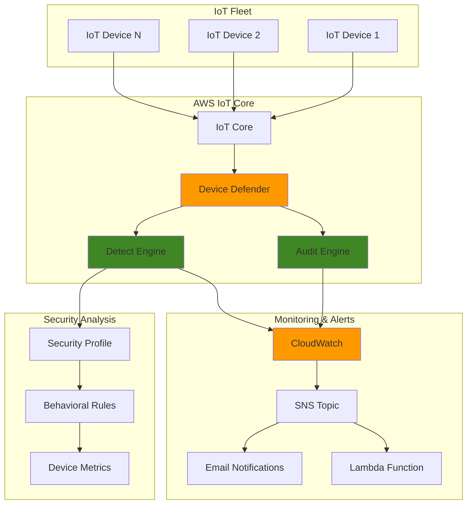

# IoT Security Monitoring with Device Defender

## Problem

Manufacturing companies with thousands of IoT devices face significant security challenges including unauthorized access, device tampering, and malicious behavior that can disrupt operations and compromise sensitive data. Traditional security monitoring tools lack the specialized capabilities needed to detect IoT-specific threats like device certificate sharing, excessive message rates, or unusual connection patterns. Without proper security monitoring, compromised devices can serve as entry points for broader network attacks or participate in distributed denial-of-service campaigns.

## Solution

AWS IoT Device Defender provides comprehensive security monitoring and threat detection for IoT fleets through automated audits, behavioral analysis, and anomaly detection. This solution implements security profiles with behavioral rules to monitor device metrics, configures automated alerts for security violations, and establishes incident response workflows to quickly remediate threats and maintain the integrity of IoT deployments.

## Architecture Diagram



## Prerequisites

1. AWS account with IoT Core and Device Defender permissions
2. AWS CLI v2 installed and configured (or AWS CloudShell)
3. Basic understanding of IoT security concepts and threat detection
4. At least one IoT device registered in AWS IoT Core for testing
5. Estimated cost: $10-25/month for Device Defender monitoring, CloudWatch logs, and SNS notifications

> **Note**: Device Defender charges start at $0.0011 per device per month for audit features, with additional costs for detect features based on metric datapoints. Review current pricing at [AWS IoT Device Defender Pricing](https://aws.amazon.com/iot-device-defender/pricing/).

## Preparation

```bash
# Set environment variables
export AWS_REGION=$(aws configure get region)
export AWS_ACCOUNT_ID=$(aws sts get-caller-identity \
    --query Account --output text)

# Generate unique identifiers for resources
RANDOM_SUFFIX=$(aws secretsmanager get-random-password \
    --exclude-punctuation --exclude-uppercase \
    --password-length 6 --require-each-included-type \
    --output text --query RandomPassword)

export SECURITY_PROFILE_NAME="IoTSecurityProfile-${RANDOM_SUFFIX}"
export SNS_TOPIC_NAME="iot-security-alerts-${RANDOM_SUFFIX}"
export IAM_ROLE_NAME="IoTDeviceDefenderRole-${RANDOM_SUFFIX}"

# Create SNS topic for security alerts
aws sns create-topic --name ${SNS_TOPIC_NAME}

export SNS_TOPIC_ARN=$(aws sns get-topic-attributes \
    --topic-arn "arn:aws:sns:${AWS_REGION}:${AWS_ACCOUNT_ID}:${SNS_TOPIC_NAME}" \
    --query Attributes.TopicArn --output text)

echo "✅ Created SNS topic: ${SNS_TOPIC_ARN}"

# Subscribe to SNS topic for email notifications
read -p "Enter your email address for security alerts: " EMAIL_ADDRESS
aws sns subscribe \
    --topic-arn ${SNS_TOPIC_ARN} \
    --protocol email \
    --notification-endpoint ${EMAIL_ADDRESS}

echo "✅ Email subscription created. Check your email and confirm the subscription."
```

## Steps

1. **Create IAM Role for Device Defender**:

   AWS IoT Device Defender requires an IAM role with specific permissions to access IoT resources and send notifications. This role enables the service to perform security audits and behavioral analysis on your behalf, following the principle of least privilege to ensure secure operations.

   ```bash
   # Create trust policy for Device Defender
   cat > /tmp/device-defender-trust-policy.json << EOF
   {
     "Version": "2012-10-17",
     "Statement": [
       {
         "Effect": "Allow",
         "Principal": {
           "Service": "iot.amazonaws.com"
         },
         "Action": "sts:AssumeRole"
       }
     ]
   }
   EOF
   
   # Create the IAM role
   aws iam create-role \
       --role-name ${IAM_ROLE_NAME} \
       --assume-role-policy-document file:///tmp/device-defender-trust-policy.json
   
   # Attach managed policy for Device Defender
   aws iam attach-role-policy \
       --role-name ${IAM_ROLE_NAME} \
       --policy-arn arn:aws:iam::aws:policy/service-role/AWSIoTDeviceDefenderAudit
   
   export IAM_ROLE_ARN=$(aws iam get-role \
       --role-name ${IAM_ROLE_NAME} \
       --query Role.Arn --output text)
   
   echo "✅ Created IAM role: ${IAM_ROLE_ARN}"
   ```

   The IAM role is now configured with the necessary permissions to perform Device Defender operations. The attached managed policy provides the minimum required permissions for audit and notification functionality while maintaining security best practices.

2. **Configure Device Defender Audit Settings**:

   Audit configuration enables automated security checks that evaluate your IoT environment against AWS security best practices. These comprehensive checks identify potential vulnerabilities and compliance issues across certificates, policies, and device configurations, providing a foundation for ongoing security monitoring.

   ```bash
   # Configure audit settings with SNS notifications
   aws iot update-account-audit-configuration \
       --role-arn ${IAM_ROLE_ARN} \
       --audit-notification-target-configurations \
       "SNS={targetArn=\"${SNS_TOPIC_ARN}\",roleArn=\"${IAM_ROLE_ARN}\",enabled=true}" \
       --audit-check-configurations \
       '{
         "AUTHENTICATED_COGNITO_ROLE_OVERLY_PERMISSIVE_CHECK": {"enabled": true},
         "CA_CERTIFICATE_EXPIRING_CHECK": {"enabled": true},
         "CONFLICTING_CLIENT_IDS_CHECK": {"enabled": true},
         "DEVICE_CERTIFICATE_EXPIRING_CHECK": {"enabled": true},
         "DEVICE_CERTIFICATE_SHARED_CHECK": {"enabled": true},
         "IOT_POLICY_OVERLY_PERMISSIVE_CHECK": {"enabled": true},
         "LOGGING_DISABLED_CHECK": {"enabled": true},
         "REVOKED_CA_CERTIFICATE_STILL_ACTIVE_CHECK": {"enabled": true},
         "REVOKED_DEVICE_CERTIFICATE_STILL_ACTIVE_CHECK": {"enabled": true},
         "UNAUTHENTICATED_COGNITO_ROLE_OVERLY_PERMISSIVE_CHECK": {"enabled": true}
       }'
   
   echo "✅ Configured Device Defender audit settings"
   ```

   The audit configuration is now active with all critical security checks enabled. These checks will run automatically during scheduled audits and on-demand tasks, examining your IoT infrastructure for common security vulnerabilities and compliance issues.

3. **Create Security Profile with Behavioral Rules**:

   Security profiles define behavioral baselines that monitor device activity patterns using rule-based detection. These rules establish thresholds for normal operation and trigger alerts when devices deviate from expected behavior, providing real-time threat detection capabilities for your IoT fleet.

   ```bash
   # Create security profile with behavioral monitoring
   aws iot create-security-profile \
       --security-profile-name ${SECURITY_PROFILE_NAME} \
       --security-profile-description "Comprehensive IoT security monitoring profile" \
       --behaviors '[
         {
           "name": "ExcessiveMessages",
           "metric": "aws:num-messages-sent",
           "criteria": {
             "comparisonOperator": "greater-than",
             "value": {"count": 100},
             "durationSeconds": 300,
             "consecutiveDatapointsToAlarm": 1,
             "consecutiveDatapointsToClear": 1
           }
         },
         {
           "name": "AuthorizationFailures",
           "metric": "aws:num-authorization-failures",
           "criteria": {
             "comparisonOperator": "greater-than",
             "value": {"count": 5},
             "durationSeconds": 300,
             "consecutiveDatapointsToAlarm": 1,
             "consecutiveDatapointsToClear": 1
           }
         },
         {
           "name": "LargeMessageSize",
           "metric": "aws:message-byte-size",
           "criteria": {
             "comparisonOperator": "greater-than",
             "value": {"count": 1024},
             "consecutiveDatapointsToAlarm": 1,
             "consecutiveDatapointsToClear": 1
           }
         },
         {
           "name": "UnusualConnectionAttempts",
           "metric": "aws:num-connection-attempts",
           "criteria": {
             "comparisonOperator": "greater-than",
             "value": {"count": 20},
             "durationSeconds": 300,
             "consecutiveDatapointsToAlarm": 1,
             "consecutiveDatapointsToClear": 1
           }
         }
       ]' \
       --alert-targets '{
         "SNS": {
           "alertTargetArn": "'"${SNS_TOPIC_ARN}"'",
           "roleArn": "'"${IAM_ROLE_ARN}"'"
         }
       }'
   
   export SECURITY_PROFILE_ARN=$(aws iot describe-security-profile \
       --security-profile-name ${SECURITY_PROFILE_NAME} \
       --query securityProfileArn --output text)
   
   echo "✅ Created security profile: ${SECURITY_PROFILE_ARN}"
   ```

   The security profile is now active with four behavioral rules monitoring critical security metrics. These thresholds provide a balanced approach between security sensitivity and operational efficiency, with immediate alerting through SNS when violations occur.

   > **Tip**: Start with conservative thresholds and adjust based on your device behavior patterns. Monitor false positives during initial deployment and fine-tune criteria to balance security sensitivity with operational efficiency. Reference the [Device Defender detect metrics documentation](https://docs.aws.amazon.com/iot/latest/developerguide/device-defender-detect.html) for detailed metric descriptions.

4. **Attach Security Profile to Target Devices**:

   Attaching security profiles to device targets activates the behavioral monitoring for your IoT fleet. This step establishes the connection between the defined security rules and your actual devices, enabling real-time threat detection across your entire IoT ecosystem.

   ```bash
   # Attach security profile to all registered devices
   aws iot attach-security-profile \
       --security-profile-name ${SECURITY_PROFILE_NAME} \
       --security-profile-target-arn \
       "arn:aws:iot:${AWS_REGION}:${AWS_ACCOUNT_ID}:all/registered-things"
   
   echo "✅ Attached security profile to all registered devices"
   
   # Optional: Attach to specific thing group instead
   # aws iot attach-security-profile \
   #     --security-profile-name ${SECURITY_PROFILE_NAME} \
   #     --security-profile-target-arn \
   #     "arn:aws:iot:${AWS_REGION}:${AWS_ACCOUNT_ID}:thinggroup/YourThingGroupName"
   ```

   The security profile is now actively monitoring all registered devices in your AWS IoT Core environment. Device behaviors will be analyzed against the defined thresholds, and violations will trigger the configured alert mechanisms through SNS, enabling rapid incident response.

5. **Create Scheduled Audit Task**:

   Scheduled audits provide continuous compliance monitoring by automatically running security checks at regular intervals. This proactive approach ensures that security configurations don't drift over time and identifies new vulnerabilities as your IoT deployment evolves.

   ```bash
   # Create weekly scheduled audit
   aws iot create-scheduled-audit \
       --scheduled-audit-name "WeeklySecurityAudit-${RANDOM_SUFFIX}" \
       --frequency WEEKLY \
       --day-of-week MON \
       --target-check-names \
       CA_CERTIFICATE_EXPIRING_CHECK \
       DEVICE_CERTIFICATE_EXPIRING_CHECK \
       DEVICE_CERTIFICATE_SHARED_CHECK \
       IOT_POLICY_OVERLY_PERMISSIVE_CHECK \
       CONFLICTING_CLIENT_IDS_CHECK
   
   echo "✅ Created scheduled weekly audit task"
   ```

   The scheduled audit will run every Monday, systematically checking for certificate issues, policy vulnerabilities, and configuration problems. Results are automatically sent to your configured SNS topic, enabling prompt remediation of discovered issues and maintaining security compliance.

6. **Configure CloudWatch Alarms for Security Metrics**:

   CloudWatch alarms provide real-time alerting capabilities that complement Device Defender's built-in notifications. This creates a multi-layered alerting system that ensures security teams are immediately notified when violations occur, enabling rapid incident response and threat mitigation.

   ```bash
   # Create CloudWatch alarm for violation events
   aws cloudwatch put-metric-alarm \
       --alarm-name "IoT-SecurityViolations-${RANDOM_SUFFIX}" \
       --alarm-description "Alert on IoT Device Defender violations" \
       --metric-name "Violations" \
       --namespace "AWS/IoT/DeviceDefender" \
       --statistic Sum \
       --period 300 \
       --threshold 1 \
       --comparison-operator GreaterThanOrEqualToThreshold \
       --evaluation-periods 1 \
       --alarm-actions ${SNS_TOPIC_ARN} \
       --treat-missing-data notBreaching
   
   echo "✅ Created CloudWatch alarm for security violations"
   ```

   The alarm is configured to trigger on any security violation, providing immediate notification through SNS. This low-threshold approach ensures no security events are missed while the 5-minute evaluation period reduces false alarms from transient network issues.

7. **Enable ML Detect for Advanced Threat Detection**:

   Machine learning-based detection automatically establishes behavioral baselines without requiring manual threshold configuration. ML Detect learns normal patterns over time using a trailing 14-day period and identifies anomalies that may indicate security threats or device malfunctions.

   ```bash
   # Create ML-based security profile
   aws iot create-security-profile \
       --security-profile-name "${SECURITY_PROFILE_NAME}-ML" \
       --security-profile-description "Machine learning based threat detection" \
       --behaviors '[
         {
           "name": "MLMessagesReceived",
           "metric": "aws:num-messages-received"
         },
         {
           "name": "MLMessagesSent",
           "metric": "aws:num-messages-sent"
         },
         {
           "name": "MLConnectionAttempts",
           "metric": "aws:num-connection-attempts"
         },
         {
           "name": "MLDisconnects",
           "metric": "aws:num-disconnects"
         }
       ]' \
       --alert-targets '{
         "SNS": {
           "alertTargetArn": "'"${SNS_TOPIC_ARN}"'",
           "roleArn": "'"${IAM_ROLE_ARN}"'"
         }
       }'
   
   # Attach ML security profile to devices
   aws iot attach-security-profile \
       --security-profile-name "${SECURITY_PROFILE_NAME}-ML" \
       --security-profile-target-arn \
       "arn:aws:iot:${AWS_REGION}:${AWS_ACCOUNT_ID}:all/registered-things"
   
   echo "✅ Created and attached ML-based security profile"
   ```

   The ML-based security profile will automatically learn device behavior patterns and detect anomalies without manual threshold configuration. This advanced detection capability provides more sophisticated threat detection by adapting to your specific device behaviors over time.

8. **Run On-Demand Audit**:

   On-demand audits provide immediate assessment of your IoT security posture, allowing you to identify and address security issues before they can be exploited. This initial audit establishes a baseline and validates that your Device Defender configuration is working correctly.

   ```bash
   # Start immediate audit task
   AUDIT_TASK_ID=$(aws iot start-on-demand-audit-task \
       --target-check-names \
       CA_CERTIFICATE_EXPIRING_CHECK \
       DEVICE_CERTIFICATE_EXPIRING_CHECK \
       DEVICE_CERTIFICATE_SHARED_CHECK \
       IOT_POLICY_OVERLY_PERMISSIVE_CHECK \
       CONFLICTING_CLIENT_IDS_CHECK \
       --query taskId --output text)
   
   echo "✅ Started on-demand audit task: ${AUDIT_TASK_ID}"
   
   # Wait for audit to complete
   echo "Waiting for audit to complete..."
   aws iot wait audit-task-completed --task-id ${AUDIT_TASK_ID}
   
   echo "✅ Audit task completed"
   ```

   The audit examines your current IoT environment against AWS security best practices. Any findings will be reported through CloudWatch and SNS, providing immediate visibility into security issues that require attention. This establishes your security baseline and validates the monitoring system is operational.

## Validation & Testing

1. **Verify Security Profile Configuration**:

   ```bash
   # Check security profile details
   aws iot describe-security-profile \
       --security-profile-name ${SECURITY_PROFILE_NAME}
   
   # Verify profile is attached to targets
   aws iot list-targets-for-security-profile \
       --security-profile-name ${SECURITY_PROFILE_NAME}
   ```

   Expected output: Security profile details with behavioral rules and target attachments.

2. **Check Audit Task Results**:

   ```bash
   # Get audit task details
   aws iot describe-audit-task --task-id ${AUDIT_TASK_ID}
   
   # List any audit findings
   aws iot list-audit-findings --task-id ${AUDIT_TASK_ID}
   ```

   Expected output: Audit completion status and any compliance findings.

3. **Verify CloudWatch Metrics**:

   ```bash
   # Check Device Defender metrics
   aws cloudwatch get-metric-statistics \
       --namespace "AWS/IoT/DeviceDefender" \
       --metric-name "Violations" \
       --start-time $(date -d '1 hour ago' --iso-8601) \
       --end-time $(date --iso-8601) \
       --period 300 \
       --statistics Sum
   ```

   Expected output: CloudWatch metrics showing Device Defender monitoring activity.

4. **Test Security Violation Detection**:

   ```bash
   # Simulate excessive message sending (if you have test devices)
   # This would trigger the ExcessiveMessages behavior
   echo "To test violation detection, configure your test device to:"
   echo "1. Send more than 100 messages within 5 minutes"
   echo "2. Generate authorization failures"
   echo "3. Send unusually large messages"
   echo "Violations will appear in CloudWatch and trigger SNS notifications"
   ```

## Cleanup

1. **Remove Security Profile Attachments**:

   ```bash
   # Detach security profiles from targets
   aws iot detach-security-profile \
       --security-profile-name ${SECURITY_PROFILE_NAME} \
       --security-profile-target-arn \
       "arn:aws:iot:${AWS_REGION}:${AWS_ACCOUNT_ID}:all/registered-things"
   
   aws iot detach-security-profile \
       --security-profile-name "${SECURITY_PROFILE_NAME}-ML" \
       --security-profile-target-arn \
       "arn:aws:iot:${AWS_REGION}:${AWS_ACCOUNT_ID}:all/registered-things"
   
   echo "✅ Detached security profiles from targets"
   ```

2. **Delete Security Profiles**:

   ```bash
   # Delete security profiles
   aws iot delete-security-profile \
       --security-profile-name ${SECURITY_PROFILE_NAME}
   
   aws iot delete-security-profile \
       --security-profile-name "${SECURITY_PROFILE_NAME}-ML"
   
   echo "✅ Deleted security profiles"
   ```

3. **Remove Scheduled Audit**:

   ```bash
   # Delete scheduled audit
   aws iot delete-scheduled-audit \
       --scheduled-audit-name "WeeklySecurityAudit-${RANDOM_SUFFIX}"
   
   echo "✅ Deleted scheduled audit"
   ```

4. **Clean Up CloudWatch and SNS Resources**:

   ```bash
   # Delete CloudWatch alarm
   aws cloudwatch delete-alarms \
       --alarm-names "IoT-SecurityViolations-${RANDOM_SUFFIX}"
   
   # Delete SNS topic
   aws sns delete-topic --topic-arn ${SNS_TOPIC_ARN}
   
   echo "✅ Deleted CloudWatch alarm and SNS topic"
   ```

5. **Remove IAM Role**:

   ```bash
   # Detach policies from role
   aws iam detach-role-policy \
       --role-name ${IAM_ROLE_NAME} \
       --policy-arn arn:aws:iam::aws:policy/service-role/AWSIoTDeviceDefenderAudit
   
   # Delete IAM role
   aws iam delete-role --role-name ${IAM_ROLE_NAME}
   
   echo "✅ Deleted IAM role"
   ```

6. **Clean Up Temporary Files**:

   ```bash
   # Remove temporary files
   rm -f /tmp/device-defender-trust-policy.json
   
   # Clear environment variables
   unset SECURITY_PROFILE_NAME SNS_TOPIC_NAME IAM_ROLE_NAME
   unset SNS_TOPIC_ARN IAM_ROLE_ARN SECURITY_PROFILE_ARN
   
   echo "✅ Cleanup completed"
   ```

## Discussion

AWS IoT Device Defender provides comprehensive security monitoring for IoT deployments through two main components: audit and detect. The audit functionality performs configuration checks against AWS IoT security best practices, identifying issues like shared certificates, overly permissive policies, and expired certificates. The detect component uses both rule-based and machine learning approaches to identify anomalous device behavior that could indicate security threats.

The security profiles created in this recipe establish behavioral baselines for normal device operation. Rule-based behaviors define explicit thresholds for metrics like message volume, connection attempts, and authorization failures. When devices exceed these thresholds, violations are generated and can trigger automated responses through SNS notifications or Lambda functions. The ML-based behaviors leverage Amazon's machine learning algorithms to automatically establish baselines and detect deviations without requiring manual threshold configuration, using a trailing 14-day period to learn normal patterns.

Integration with CloudWatch and SNS enables real-time alerting and monitoring of security events, allowing security teams to respond quickly to potential threats and implement remediation actions. The scheduled audits provide ongoing compliance monitoring, ensuring that security configurations don't drift over time. For production deployments, consider implementing automated remediation workflows using Lambda functions triggered by security violations. Follow the [AWS Well-Architected Framework](https://docs.aws.amazon.com/wellarchitected/latest/framework/welcome.html) security pillar to maintain defense-in-depth security practices across your IoT infrastructure.

AWS IoT Device Defender integrates seamlessly with other AWS services including Amazon CloudWatch for metrics and alarms, Amazon SNS for notifications, and AWS Lambda for automated remediation workflows. The service provides flexible pricing based on actual usage, starting at $0.0011 per device per month for audit features, making it cost-effective for deployments of any size. For the most current pricing information, reference the [AWS IoT Device Defender pricing page](https://aws.amazon.com/iot-device-defender/pricing/).

> **Tip**: Configure different security profiles for different device types or environments to avoid false positives and ensure appropriate behavioral baselines for each use case. This targeted approach improves detection accuracy while reducing operational noise.

## Challenge

Extend this security implementation by adding these enhancements:

1. **Implement Automated Remediation**: Create Lambda functions that automatically respond to specific security violations, such as disabling compromised device certificates or updating overly permissive policies using AWS IoT mitigation actions.

2. **Add Custom Metrics**: Develop custom metrics using AWS IoT Device Defender to monitor application-specific security indicators like unusual sensor readings, unexpected device firmware versions, or abnormal geographic locations.

3. **Create Security Dashboards**: Build CloudWatch dashboards that visualize security metrics, violation trends, and audit compliance status across your IoT fleet with real-time monitoring and historical analysis.

4. **Implement Incident Response Workflows**: Design Step Functions workflows that orchestrate incident response procedures, including device isolation, forensic data collection, stakeholder notification, and automated remediation tasks.

5. **Deploy Multi-Region Security Monitoring**: Extend the solution to monitor IoT devices across multiple AWS regions with centralized security event aggregation, cross-region threat correlation, and unified incident response capabilities.

## Infrastructure Code

### Available Infrastructure as Code:

- [Infrastructure Code Overview](code/README.md) - Detailed description of all infrastructure components
- [AWS CDK (Python)](code/cdk-python/) - AWS CDK Python implementation
- [AWS CDK (TypeScript)](code/cdk-typescript/) - AWS CDK TypeScript implementation
- [CloudFormation](code/cloudformation.yaml) - AWS CloudFormation template
- [Bash CLI Scripts](code/scripts/) - Example bash scripts using AWS CLI commands to deploy infrastructure
- [Terraform](code/terraform/) - Terraform configuration files