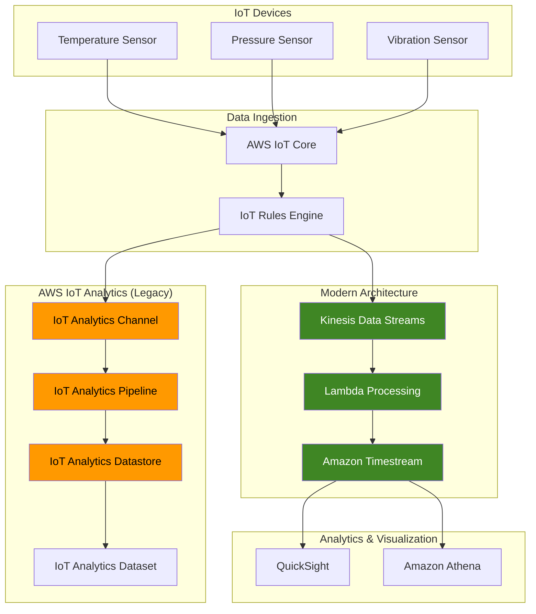

# IoT Telemetry Analytics with Kinesis and Timestream

## Problem

Manufacturing companies collecting sensor data from thousands of IoT devices face significant challenges in processing, storing, and analyzing this data for operational insights. Raw IoT data often contains corrupted readings, missing values, and requires enrichment with contextual information like device location and maintenance history. Traditional databases struggle with the volume and velocity of IoT data, while building custom analytics pipelines requires extensive development effort and ongoing maintenance.

## Solution

This recipe demonstrates building modern IoT analytics pipelines using Amazon Kinesis Data Streams, AWS Lambda, and Amazon Timestream to collect, process, and analyze IoT sensor data in real-time. The solution automatically filters and transforms incoming data, enriches it with device metadata, and stores processed data in optimized time-series formats. We'll also demonstrate the legacy AWS IoT Analytics approach for comparison, noting its end-of-support on December 15, 2025.

## Architecture Diagram



## Prerequisites

1. AWS account with IoT Core, Kinesis, Lambda, and Timestream permissions
2. AWS CLI v2 installed and configured (or AWS CloudShell)
3. Basic understanding of IoT concepts and time-series data
4. JSON knowledge for data transformation
5. Python knowledge for Lambda function development
6. Estimated cost: $30-50 for resources created during this recipe

> **Warning**: AWS IoT Analytics will reach end-of-support on December 15, 2025. This recipe demonstrates both the legacy approach and modern alternatives using Kinesis Data Streams and Amazon Timestream.

## Preparation

```bash
# Set environment variables
export AWS_REGION=$(aws configure get region)
export AWS_ACCOUNT_ID=$(aws sts get-caller-identity \
    --query Account --output text)

# Generate unique identifiers for resources
RANDOM_SUFFIX=$(aws secretsmanager get-random-password \
    --exclude-punctuation --exclude-uppercase \
    --password-length 6 --require-each-included-type \
    --output text --query RandomPassword)

export IOT_RULE_NAME="iot-telemetry-rule-${RANDOM_SUFFIX}"
export KINESIS_STREAM_NAME="iot-sensor-stream-${RANDOM_SUFFIX}"
export TIMESTREAM_DATABASE_NAME="iot-sensor-db-${RANDOM_SUFFIX}"
export TIMESTREAM_TABLE_NAME="sensor-data"
export LAMBDA_FUNCTION_NAME="process-iot-data-${RANDOM_SUFFIX}"

# Legacy IoT Analytics resources (for comparison)
export CHANNEL_NAME="iot-sensor-channel-${RANDOM_SUFFIX}"
export PIPELINE_NAME="iot-sensor-pipeline-${RANDOM_SUFFIX}"
export DATASTORE_NAME="iot-sensor-datastore-${RANDOM_SUFFIX}"
export DATASET_NAME="iot-sensor-dataset-${RANDOM_SUFFIX}"

echo "✅ Environment variables configured"
```

## Steps

1. **Create Kinesis Data Stream (Modern Approach)**:

   Amazon Kinesis Data Streams provides real-time data ingestion with automatic scaling using on-demand capacity mode. This eliminates the need to provision and manage shards while handling variable IoT traffic patterns seamlessly.

   ```bash
   # Create Kinesis stream with on-demand capacity
   aws kinesis create-stream \
       --stream-name $KINESIS_STREAM_NAME \
       --stream-mode-details StreamMode=ON_DEMAND
   
   # Wait for stream to become active
   aws kinesis wait stream-exists \
       --stream-name $KINESIS_STREAM_NAME
   
   # Verify stream creation
   aws kinesis describe-stream-summary \
       --stream-name $KINESIS_STREAM_NAME
   
   echo "✅ Created Kinesis Data Stream: $KINESIS_STREAM_NAME"
   ```

2. **Create Amazon Timestream Database and Table**:

   Amazon Timestream is purpose-built for time-series data with automatic data tiering between memory and magnetic storage. It provides built-in time-series functions and can handle millions of data points efficiently while optimizing costs through intelligent storage management.

   ```bash
   # Create Timestream database for time-series data
   aws timestream-write create-database \
       --database-name $TIMESTREAM_DATABASE_NAME
   
   # Create table with retention policies
   aws timestream-write create-table \
       --database-name $TIMESTREAM_DATABASE_NAME \
       --table-name $TIMESTREAM_TABLE_NAME \
       --retention-properties '{
           "MemoryStoreRetentionPeriodInHours": 24,
           "MagneticStoreRetentionPeriodInDays": 365
       }'
   
   # Verify table creation
   aws timestream-write describe-table \
       --database-name $TIMESTREAM_DATABASE_NAME \
       --table-name $TIMESTREAM_TABLE_NAME
   
   echo "✅ Created Timestream database and table"
   ```

3. **Create IAM Role for Lambda Function**:

   This IAM role enables Lambda to process Kinesis records and write to Timestream while following the principle of least privilege access. The role includes basic Lambda execution permissions and specific Timestream write access.

   ```bash
   # Create Lambda execution role
   aws iam create-role \
       --role-name LambdaTimestreamRole-${RANDOM_SUFFIX} \
       --assume-role-policy-document '{
           "Version": "2012-10-17",
           "Statement": [
               {
                   "Effect": "Allow",
                   "Principal": {
                       "Service": "lambda.amazonaws.com"
                   },
                   "Action": "sts:AssumeRole"
               }
           ]
       }'
   
   # Attach basic Lambda execution policy
   aws iam attach-role-policy \
       --role-name LambdaTimestreamRole-${RANDOM_SUFFIX} \
       --policy-arn arn:aws:iam::aws:policy/service-role/AWSLambdaBasicExecutionRole
   
   # Create custom policy for Timestream access
   aws iam create-policy \
       --policy-name TimestreamWritePolicy-${RANDOM_SUFFIX} \
       --policy-document '{
           "Version": "2012-10-17",
           "Statement": [
               {
                   "Effect": "Allow",
                   "Action": [
                       "timestream:WriteRecords",
                       "timestream:DescribeEndpoints"
                   ],
                   "Resource": "*"
               }
           ]
       }'
   
   # Attach Timestream policy
   aws iam attach-role-policy \
       --role-name LambdaTimestreamRole-${RANDOM_SUFFIX} \
       --policy-arn arn:aws:iam::${AWS_ACCOUNT_ID}:policy/TimestreamWritePolicy-${RANDOM_SUFFIX}
   
   # Attach Kinesis policy for event source mapping
   aws iam attach-role-policy \
       --role-name LambdaTimestreamRole-${RANDOM_SUFFIX} \
       --policy-arn arn:aws:iam::aws:policy/service-role/AWSLambdaKinesisExecutionRole
   
   export LAMBDA_ROLE_ARN="arn:aws:iam::${AWS_ACCOUNT_ID}:role/LambdaTimestreamRole-${RANDOM_SUFFIX}"
   
   echo "✅ Created IAM role for Lambda function"
   ```

4. **Create Lambda Function for Data Processing**:

   This Lambda function replaces traditional ETL pipelines by processing Kinesis stream records in real-time. It validates sensor data, applies business rules, and transforms the data into Timestream's optimized format while maintaining data quality and enrichment capabilities.

   ```bash
   # Create Lambda function code
   cat > lambda_function.py << 'EOF'
import json
import boto3
import base64
import time
from datetime import datetime

timestream = boto3.client('timestream-write')

def lambda_handler(event, context):
    database_name = 'iot-sensor-db'
    table_name = 'sensor-data'
    
    # Update with actual database name from environment
    if 'DB_NAME' in os.environ:
        database_name = os.environ['DB_NAME']
    
    records = []
    
    for record in event['Records']:
        try:
            # Decode Kinesis record
            payload_data = base64.b64decode(record['kinesis']['data']).decode('utf-8')
            payload = json.loads(payload_data)
            
            # Validate required fields
            if 'temperature' not in payload or 'deviceId' not in payload:
                print(f"Missing required fields in payload: {payload}")
                continue
            
            # Filter invalid temperature readings
            temperature = float(payload.get('temperature', 0))
            if temperature <= -50 or temperature >= 150:  # Reasonable sensor range
                print(f"Temperature out of range: {temperature}")
                continue
            
            # Prepare Timestream record with current timestamp
            current_time = str(int(time.time() * 1000))
            
            # Create temperature record
            temp_record = {
                'Time': current_time,
                'TimeUnit': 'MILLISECONDS',
                'Dimensions': [
                    {
                        'Name': 'DeviceId',
                        'Value': str(payload.get('deviceId', 'unknown'))
                    },
                    {
                        'Name': 'Location',
                        'Value': payload.get('location', 'factory_floor_1')
                    },
                    {
                        'Name': 'DeviceType',
                        'Value': payload.get('deviceType', 'temperature_sensor')
                    }
                ],
                'MeasureName': 'temperature',
                'MeasureValue': str(temperature),
                'MeasureValueType': 'DOUBLE'
            }
            records.append(temp_record)
            
            # Add humidity record if present
            if 'humidity' in payload:
                humidity = float(payload.get('humidity', 0))
                if 0 <= humidity <= 100:  # Valid humidity range
                    humidity_record = {
                        'Time': current_time,
                        'TimeUnit': 'MILLISECONDS',
                        'Dimensions': [
                            {
                                'Name': 'DeviceId',
                                'Value': str(payload.get('deviceId', 'unknown'))
                            },
                            {
                                'Name': 'Location',
                                'Value': payload.get('location', 'factory_floor_1')
                            },
                            {
                                'Name': 'DeviceType',
                                'Value': 'humidity_sensor'
                            }
                        ],
                        'MeasureName': 'humidity',
                        'MeasureValue': str(humidity),
                        'MeasureValueType': 'DOUBLE'
                    }
                    records.append(humidity_record)
            
        except Exception as e:
            print(f"Error processing record: {e}")
            continue
    
    # Write records to Timestream in batches
    if records:
        try:
            # Timestream supports up to 100 records per batch
            batch_size = 100
            for i in range(0, len(records), batch_size):
                batch = records[i:i + batch_size]
                response = timestream.write_records(
                    DatabaseName=database_name,
                    TableName=table_name,
                    Records=batch
                )
                print(f"Successfully wrote {len(batch)} records to Timestream")
        except Exception as e:
            print(f"Error writing to Timestream: {e}")
            raise e
    
    return {
        'statusCode': 200,
        'body': json.dumps({
            'processed_records': len(records),
            'message': 'Successfully processed IoT data'
        })
    }
EOF
   
   # Create deployment package
   zip lambda_function.zip lambda_function.py
   
   # Create Lambda function with latest Python runtime
   aws lambda create-function \
       --function-name $LAMBDA_FUNCTION_NAME \
       --runtime python3.12 \
       --role $LAMBDA_ROLE_ARN \
       --handler lambda_function.lambda_handler \
       --zip-file fileb://lambda_function.zip \
       --timeout 300 \
       --memory-size 256 \
       --environment Variables="{DB_NAME=${TIMESTREAM_DATABASE_NAME}}"
   
   echo "✅ Created Lambda function for data processing"
   ```

5. **Connect Kinesis Stream to Lambda Function**:

   Event source mapping creates a real-time processing pipeline by automatically triggering Lambda when new data arrives in Kinesis. This serverless integration scales automatically and provides built-in error handling and retry capabilities.

   ```bash
   # Create event source mapping
   aws lambda create-event-source-mapping \
       --event-source-arn arn:aws:kinesis:${AWS_REGION}:${AWS_ACCOUNT_ID}:stream/${KINESIS_STREAM_NAME} \
       --function-name $LAMBDA_FUNCTION_NAME \
       --starting-position LATEST \
       --batch-size 10 \
       --maximum-batching-window-in-seconds 5
   
   echo "✅ Connected Kinesis stream to Lambda function"
   ```

6. **Create IoT Rule to Route Data to Kinesis**:

   IoT Rules Engine provides message routing capabilities with SQL-based filtering and transformation. This rule evaluates incoming MQTT messages and routes sensor data to our Kinesis stream for real-time processing while maintaining low latency.

   ```bash
   # Create IoT rule to route data to Kinesis
   aws iot create-topic-rule \
       --rule-name $IOT_RULE_NAME \
       --topic-rule-payload '{
           "sql": "SELECT *, timestamp() as processing_time FROM \"iot/sensors/+/data\"",
           "description": "Route sensor data to Kinesis Data Streams",
           "actions": [
               {
                   "kinesis": {
                       "roleArn": "arn:aws:iam::'${AWS_ACCOUNT_ID}':role/service-role/iot-kinesis-rule-role",
                       "streamName": "'${KINESIS_STREAM_NAME}'",
                       "partitionKey": "${deviceId}"
                   }
               }
           ]
       }'
   
   echo "✅ Created IoT rule to route data to Kinesis"
   ```

7. **Create IAM Role for IoT Rule**:

   This role enables IoT Rules Engine to write data to Kinesis streams while following AWS security best practices. The role includes only the necessary permissions for Kinesis data ingestion.

   ```bash
   # Create IAM role for IoT rule
   aws iam create-role \
       --role-name iot-kinesis-rule-role \
       --assume-role-policy-document '{
           "Version": "2012-10-17",
           "Statement": [
               {
                   "Effect": "Allow",
                   "Principal": {
                       "Service": "iot.amazonaws.com"
                   },
                   "Action": "sts:AssumeRole"
               }
           ]
       }'
   
   # Create policy for Kinesis access
   aws iam create-policy \
       --policy-name IoTKinesisRulePolicy-${RANDOM_SUFFIX} \
       --policy-document '{
           "Version": "2012-10-17",
           "Statement": [
               {
                   "Effect": "Allow",
                   "Action": [
                       "kinesis:PutRecord",
                       "kinesis:PutRecords"
                   ],
                   "Resource": "arn:aws:kinesis:'${AWS_REGION}':'${AWS_ACCOUNT_ID}':stream/'${KINESIS_STREAM_NAME}'"
               }
           ]
       }'
   
   # Attach policy to role
   aws iam attach-role-policy \
       --role-name iot-kinesis-rule-role \
       --policy-arn arn:aws:iam::${AWS_ACCOUNT_ID}:policy/IoTKinesisRulePolicy-${RANDOM_SUFFIX}
   
   echo "✅ Created IAM role for IoT rule"
   ```

8. **Create Legacy IoT Analytics Resources (For Comparison)**:

   AWS IoT Analytics provided managed data processing capabilities but reaches end-of-support on December 15, 2025. These steps demonstrate the legacy approach for organizations still using IoT Analytics and planning migration.

   ```bash
   # Create IoT Analytics channel
   aws iotanalytics create-channel \
       --channel-name $CHANNEL_NAME \
       --retention-period unlimited=true
   
   # Create datastore
   aws iotanalytics create-datastore \
       --datastore-name $DATASTORE_NAME \
       --retention-period unlimited=true
   
   # Create pipeline with data transformation
   aws iotanalytics create-pipeline \
       --pipeline-name $PIPELINE_NAME \
       --pipeline-activities '[
           {
               "channel": {
                   "name": "ChannelActivity",
                   "channelName": "'$CHANNEL_NAME'",
                   "next": "FilterActivity"
               }
           },
           {
               "filter": {
                   "name": "FilterActivity",
                   "filter": "temperature > -50 AND temperature < 150",
                   "next": "AddAttributesActivity"
               }
           },
           {
               "addAttributes": {
                   "name": "AddAttributesActivity",
                   "attributes": {
                       "location": "factory_floor_1",
                       "device_type": "temperature_sensor"
                   },
                   "next": "DatastoreActivity"
               }
           },
           {
               "datastore": {
                   "name": "DatastoreActivity",
                   "datastoreName": "'$DATASTORE_NAME'"
               }
           }
       ]'
   
   echo "✅ Created IoT Analytics resources for comparison"
   ```

9. **Send Test Data to Modern Pipeline**:

   Testing validates that our real-time pipeline processes sensor data correctly. This simulates realistic IoT device data and demonstrates data quality validation, transformation, and storage in Timestream.

   ```bash
   # Send test data to Kinesis stream
   aws kinesis put-record \
       --stream-name $KINESIS_STREAM_NAME \
       --partition-key sensor001 \
       --data '{
           "timestamp": "'$(date -u +%Y-%m-%dT%H:%M:%S.%3NZ)'",
           "deviceId": "sensor001",
           "temperature": 26.3,
           "humidity": 60.1,
           "location": "factory_floor_1"
       }'
   
   # Send additional test records
   aws kinesis put-records \
       --stream-name $KINESIS_STREAM_NAME \
       --records '[
           {
               "PartitionKey": "sensor002",
               "Data": "{\"timestamp\": \"'$(date -u +%Y-%m-%dT%H:%M:%S.%3NZ)'\", \"deviceId\": \"sensor002\", \"temperature\": 22.8, \"humidity\": 55.3, \"location\": \"factory_floor_2\"}"
           },
           {
               "PartitionKey": "sensor003",
               "Data": "{\"timestamp\": \"'$(date -u +%Y-%m-%dT%H:%M:%S.%3NZ)'\", \"deviceId\": \"sensor003\", \"temperature\": 28.1, \"humidity\": 62.7, \"location\": \"warehouse\"}"
           }
       ]'
   
   echo "✅ Sent test data to modern pipeline"
   ```

## Validation & Testing

1. **Verify Kinesis Data Stream Status**:

   ```bash
   # Check stream status and metrics
   aws kinesis describe-stream-summary \
       --stream-name $KINESIS_STREAM_NAME
   
   # Check recent records
   SHARD_ITERATOR=$(aws kinesis get-shard-iterator \
       --stream-name $KINESIS_STREAM_NAME \
       --shard-id shardId-000000000000 \
       --shard-iterator-type LATEST \
       --query 'ShardIterator' --output text)
   
   aws kinesis get-records --shard-iterator $SHARD_ITERATOR
   ```

   Expected output: Stream status should be ACTIVE with recent data records

2. **Check Lambda Function Execution**:

   ```bash
   # Check Lambda function logs
   aws logs describe-log-groups \
       --log-group-name-prefix /aws/lambda/$LAMBDA_FUNCTION_NAME
   
   # Get recent log events
   aws logs describe-log-streams \
       --log-group-name /aws/lambda/$LAMBDA_FUNCTION_NAME \
       --order-by LastEventTime --descending
   ```

   Expected output: Successful function executions with processed record counts

3. **Query Timestream Data**:

   ```bash
   # Query recent sensor data
   aws timestream-query query \
       --query-string "SELECT * FROM \"${TIMESTREAM_DATABASE_NAME}\".\"${TIMESTREAM_TABLE_NAME}\" WHERE time > ago(1h) ORDER BY time DESC LIMIT 10"
   
   # Query temperature averages by device
   aws timestream-query query \
       --query-string "SELECT DeviceId, avg(measure_value::double) as avg_temperature FROM \"${TIMESTREAM_DATABASE_NAME}\".\"${TIMESTREAM_TABLE_NAME}\" WHERE measure_name = 'temperature' AND time > ago(1h) GROUP BY DeviceId"
   ```

   Expected output: Recent sensor data records and temperature averages from Timestream

4. **Test Data Quality Validation**:

   ```bash
   # Send invalid data to test filtering
   aws kinesis put-record \
       --stream-name $KINESIS_STREAM_NAME \
       --partition-key invalid001 \
       --data '{
           "timestamp": "'$(date -u +%Y-%m-%dT%H:%M:%S.%3NZ)'",
           "deviceId": "invalid001",
           "temperature": 999,
           "humidity": 150
       }'
   
   # Verify invalid data is filtered out in logs
   sleep 10
   aws logs filter-log-events \
       --log-group-name /aws/lambda/$LAMBDA_FUNCTION_NAME \
       --filter-pattern "Temperature out of range"
   ```

   Expected output: Lambda logs showing invalid data filtered out

## Cleanup

1. **Remove Modern Architecture Resources**:

   ```bash
   # Delete Lambda event source mapping
   MAPPING_UUID=$(aws lambda list-event-source-mappings \
       --function-name $LAMBDA_FUNCTION_NAME \
       --query 'EventSourceMappings[0].UUID' --output text)
   
   aws lambda delete-event-source-mapping \
       --uuid $MAPPING_UUID
   
   # Delete Lambda function
   aws lambda delete-function \
       --function-name $LAMBDA_FUNCTION_NAME
   
   # Delete Timestream table and database
   aws timestream-write delete-table \
       --database-name $TIMESTREAM_DATABASE_NAME \
       --table-name $TIMESTREAM_TABLE_NAME
   
   aws timestream-write delete-database \
       --database-name $TIMESTREAM_DATABASE_NAME
   
   # Delete Kinesis stream
   aws kinesis delete-stream \
       --stream-name $KINESIS_STREAM_NAME \
       --enforce-consumer-deletion
   
   echo "✅ Deleted modern architecture resources"
   ```

2. **Remove IoT Resources**:

   ```bash
   # Delete IoT rule
   aws iot delete-topic-rule --rule-name $IOT_RULE_NAME
   
   echo "✅ Deleted IoT resources"
   ```

3. **Remove IAM Roles and Policies**:

   ```bash
   # Clean up Lambda IAM role
   aws iam detach-role-policy \
       --role-name LambdaTimestreamRole-${RANDOM_SUFFIX} \
       --policy-arn arn:aws:iam::aws:policy/service-role/AWSLambdaBasicExecutionRole
   
   aws iam detach-role-policy \
       --role-name LambdaTimestreamRole-${RANDOM_SUFFIX} \
       --policy-arn arn:aws:iam::${AWS_ACCOUNT_ID}:policy/TimestreamWritePolicy-${RANDOM_SUFFIX}
   
   aws iam detach-role-policy \
       --role-name LambdaTimestreamRole-${RANDOM_SUFFIX} \
       --policy-arn arn:aws:iam::aws:policy/service-role/AWSLambdaKinesisExecutionRole
   
   aws iam delete-role \
       --role-name LambdaTimestreamRole-${RANDOM_SUFFIX}
   
   aws iam delete-policy \
       --policy-arn arn:aws:iam::${AWS_ACCOUNT_ID}:policy/TimestreamWritePolicy-${RANDOM_SUFFIX}
   
   # Clean up IoT rule IAM role
   aws iam detach-role-policy \
       --role-name iot-kinesis-rule-role \
       --policy-arn arn:aws:iam::${AWS_ACCOUNT_ID}:policy/IoTKinesisRulePolicy-${RANDOM_SUFFIX}
   
   aws iam delete-role --role-name iot-kinesis-rule-role
   aws iam delete-policy \
       --policy-arn arn:aws:iam::${AWS_ACCOUNT_ID}:policy/IoTKinesisRulePolicy-${RANDOM_SUFFIX}
   
   # Clean up local files
   rm -f lambda_function.py lambda_function.zip
   
   echo "✅ Cleaned up all IAM resources and local files"
   ```

4. **Remove Legacy IoT Analytics Resources (If Created)**:

   ```bash
   # Delete IoT Analytics resources
   aws iotanalytics delete-pipeline --pipeline-name $PIPELINE_NAME || true
   aws iotanalytics delete-datastore --datastore-name $DATASTORE_NAME || true
   aws iotanalytics delete-channel --channel-name $CHANNEL_NAME || true
   
   echo "✅ Cleaned up IoT Analytics resources"
   ```

## Discussion

This recipe demonstrates the evolution from AWS IoT Analytics to modern serverless architectures using Kinesis Data Streams and Amazon Timestream. The modern approach offers several advantages: Kinesis provides real-time data ingestion with automatic scaling through on-demand capacity mode, eliminating the need for manual shard management. Lambda functions provide flexible data processing capabilities with custom business logic, while Timestream offers purpose-built time-series storage with automatic data tiering and built-in analytics functions.

The architecture follows AWS Well-Architected Framework principles by implementing security through IAM roles with least privilege access, reliability through automatic scaling and error handling, and cost optimization through serverless pricing models and intelligent storage tiering. The solution handles data quality through validation and filtering logic, ensuring only valid sensor readings reach the analytics layer.

For organizations migrating from IoT Analytics, this modern architecture provides equivalent functionality with improved scalability and flexibility. The Lambda-based processing approach allows for complex data transformations, enrichment with external data sources, and integration with machine learning models. Timestream's SQL interface enables business analysts to query time-series data using familiar tools while benefiting from optimized performance for temporal queries.

> **Tip**: Use Amazon Kinesis Data Firehose for simplified data delivery to S3 when real-time processing isn't required, reducing operational overhead while maintaining data durability for long-term storage and batch analytics.

## Challenge

Extend this solution by implementing these enhancements:

1. **Multi-Device Type Support**: Modify the Lambda function to handle different sensor types (temperature, pressure, vibration) with device-specific processing rules, validation thresholds, and custom enrichment logic for each device category.

2. **Real-time Anomaly Detection**: Implement anomaly detection using Kinesis Data Analytics for Apache Flink to identify unusual sensor readings, calculate moving averages, and trigger automated alerts through Amazon SNS when thresholds are exceeded.

3. **Advanced Data Quality Monitoring**: Add comprehensive data quality checks using AWS Glue DataBrew for data profiling, implement automated data quality scorecards, and create CloudWatch alarms for data quality degradation.

4. **Predictive Maintenance Integration**: Connect Timestream to Amazon SageMaker for building predictive maintenance models, implement automated model training pipelines, and create QuickSight dashboards for operational insights and maintenance scheduling.

5. **Edge Computing Optimization**: Implement AWS IoT Greengrass for local data processing, reduce bandwidth costs through edge filtering and aggregation, and create hybrid architectures that balance local processing with cloud analytics capabilities.

## Infrastructure Code

*Infrastructure code will be generated after recipe approval.*