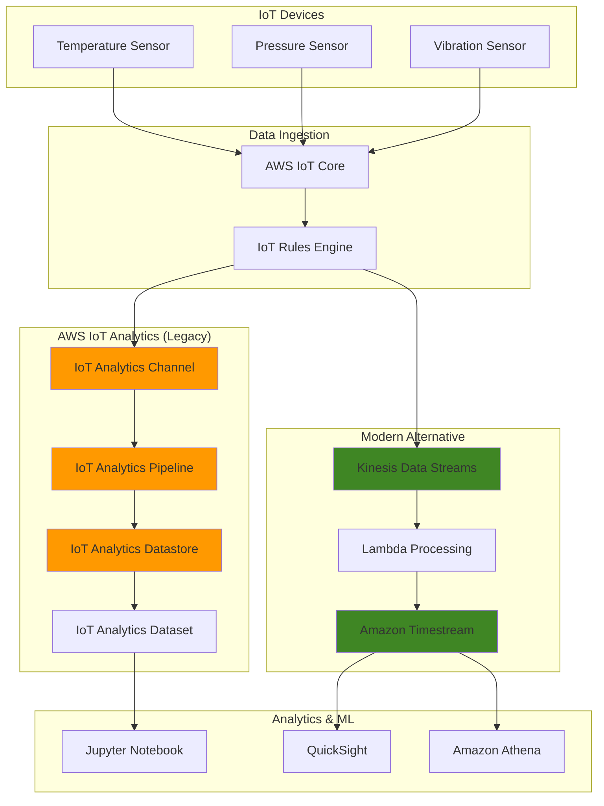

# IoT Telemetry Analytics with Kinesis and Timestream

## Problem

Manufacturing companies collecting sensor data from thousands of IoT devices face significant challenges in processing, storing, and analyzing this data for operational insights. Raw IoT data often contains corrupted readings, missing values, and requires enrichment with contextual information like device location and maintenance history. Traditional databases struggle with the volume and velocity of IoT data, while building custom analytics pipelines requires extensive development effort and ongoing maintenance.

## Solution

This recipe demonstrates building IoT analytics pipelines using AWS IoT Analytics (with migration guidance to modern alternatives) to collect, process, and analyze IoT sensor data. The solution automatically filters and transforms incoming data, enriches it with device metadata, and stores processed data in optimized time-series formats. We'll also show how to migrate to current AWS services like Kinesis Data Streams and Amazon Timestream as AWS IoT Analytics reaches end-of-support on December 15, 2025.

## Architecture Diagram



## Prerequisites

1. AWS account with IoT Analytics, IoT Core, Kinesis, and Timestream permissions
2. AWS CLI v2 installed and configured (or AWS CloudShell)
3. Basic understanding of IoT concepts and time-series data
4. JSON knowledge for data transformation
5. Estimated cost: $20-40 for resources created during this recipe

> **Warning**: AWS IoT Analytics will reach end-of-support on December 15, 2025. This recipe includes migration guidance to modern alternatives like Kinesis Data Streams and Amazon Timestream.

## Preparation

```bash
# Set environment variables
export AWS_REGION=$(aws configure get region)
export AWS_ACCOUNT_ID=$(aws sts get-caller-identity \
    --query Account --output text)

# Generate unique identifiers for resources
RANDOM_SUFFIX=$(aws secretsmanager get-random-password \
    --exclude-punctuation --exclude-uppercase \
    --password-length 6 --require-each-included-type \
    --output text --query RandomPassword)

export CHANNEL_NAME="iot-sensor-channel-${RANDOM_SUFFIX}"
export PIPELINE_NAME="iot-sensor-pipeline-${RANDOM_SUFFIX}"
export DATASTORE_NAME="iot-sensor-datastore-${RANDOM_SUFFIX}"
export DATASET_NAME="iot-sensor-dataset-${RANDOM_SUFFIX}"
export KINESIS_STREAM_NAME="iot-sensor-stream-${RANDOM_SUFFIX}"
export TIMESTREAM_DATABASE_NAME="iot-sensor-db-${RANDOM_SUFFIX}"
export TIMESTREAM_TABLE_NAME="sensor-data"

# Create IAM role for IoT Analytics
aws iam create-role \
    --role-name IoTAnalyticsServiceRole \
    --assume-role-policy-document '{
        "Version": "2012-10-17",
        "Statement": [
            {
                "Effect": "Allow",
                "Principal": {
                    "Service": "iotanalytics.amazonaws.com"
                },
                "Action": "sts:AssumeRole"
            }
        ]
    }'

# Attach necessary policies
aws iam attach-role-policy \
    --role-name IoTAnalyticsServiceRole \
    --policy-arn arn:aws:iam::aws:policy/service-role/AWSIoTAnalyticsServiceRole

export IOT_ANALYTICS_ROLE_ARN="arn:aws:iam::${AWS_ACCOUNT_ID}:role/IoTAnalyticsServiceRole"

echo "Environment setup complete"
```

## Steps

1. **Create IoT Analytics Channel**:

   IoT Analytics channels serve as the entry point for raw IoT data, acting as a buffer that collects incoming sensor data before processing. Channels provide temporary storage and can handle bursty IoT traffic patterns while maintaining data integrity.

   ```bash
   # Create channel to collect raw IoT data
   aws iotanalytics create-channel \
       --channel-name $CHANNEL_NAME \
       --retention-period unlimited=true
   
   # Verify channel creation
   aws iotanalytics describe-channel \
       --channel-name $CHANNEL_NAME
   
   echo "✅ Created IoT Analytics channel: $CHANNEL_NAME"
   ```

2. **Create IoT Analytics Datastore**:

   The datastore is where processed and cleaned IoT data is permanently stored. Unlike channels which handle raw data temporarily, datastores provide long-term storage optimized for analytics queries and can retain data indefinitely for historical analysis.

   ```bash
   # Create datastore for processed data
   aws iotanalytics create-datastore \
       --datastore-name $DATASTORE_NAME \
       --retention-period unlimited=true
   
   # Verify datastore creation
   aws iotanalytics describe-datastore \
       --datastore-name $DATASTORE_NAME
   
   echo "✅ Created IoT Analytics datastore: $DATASTORE_NAME"
   ```

3. **Create Data Processing Pipeline**:

   IoT Analytics pipelines define the data transformation workflow, connecting channels to datastores while applying filtering, enrichment, and mathematical operations. This pipeline filters invalid temperature readings, adds contextual metadata, and ensures only clean data reaches the datastore.

   ```bash
   # Create pipeline with data transformation activities
   aws iotanalytics create-pipeline \
       --pipeline-name $PIPELINE_NAME \
       --pipeline-activities '[
           {
               "channel": {
                   "name": "ChannelActivity",
                   "channelName": "'$CHANNEL_NAME'",
                   "next": "FilterActivity"
               }
           },
           {
               "filter": {
                   "name": "FilterActivity",
                   "filter": "temperature > 0 AND temperature < 100",
                   "next": "MathActivity"
               }
           },
           {
               "math": {
                   "name": "MathActivity",
                   "math": "temperature_celsius",
                   "attribute": "temperature_celsius",
                   "next": "AddAttributesActivity"
               }
           },
           {
               "addAttributes": {
                   "name": "AddAttributesActivity",
                   "attributes": {
                       "location": "factory_floor_1",
                       "device_type": "temperature_sensor"
                   },
                   "next": "DatastoreActivity"
               }
           },
           {
               "datastore": {
                   "name": "DatastoreActivity",
                   "datastoreName": "'$DATASTORE_NAME'"
               }
           }
       ]'
   
   # Verify pipeline creation
   aws iotanalytics describe-pipeline \
       --pipeline-name $PIPELINE_NAME
   
   echo "✅ Created IoT Analytics pipeline: $PIPELINE_NAME"
   ```

4. **Create IoT Rule to Route Data**:

   IoT Rules Engine acts as a message router, evaluating incoming MQTT messages and directing them to appropriate AWS services. This rule listens for sensor data on a specific topic and automatically forwards it to our IoT Analytics channel for processing.

   ```bash
   # Create IoT rule to route data to IoT Analytics
   aws iot create-topic-rule \
       --rule-name IoTAnalyticsRule \
       --topic-rule-payload '{
           "sql": "SELECT * FROM \"topic/sensor/data\"",
           "description": "Route sensor data to IoT Analytics",
           "actions": [
               {
                   "iotAnalytics": {
                       "channelName": "'$CHANNEL_NAME'"
                   }
               }
           ]
       }'
   
   echo "✅ Created IoT rule to route data to IoT Analytics"
   ```

5. **Create Sample Dataset for Analysis**:

   Datasets provide a SQL-based interface for querying processed IoT data, enabling business analysts to extract insights without complex programming. This dataset runs scheduled queries to identify high-temperature readings and can be accessed by visualization tools.

   ```bash
   # Create dataset for SQL queries
   aws iotanalytics create-dataset \
       --dataset-name $DATASET_NAME \
       --actions '[
           {
               "actionName": "SqlAction",
               "queryAction": {
                   "sqlQuery": "SELECT * FROM '${DATASTORE_NAME}' WHERE temperature_celsius > 25 ORDER BY timestamp DESC LIMIT 100"
               }
           }
       ]' \
       --triggers '[
           {
               "schedule": {
                   "expression": "rate(1 hour)"
               }
           }
       ]'
   
   echo "✅ Created IoT Analytics dataset: $DATASET_NAME"
   ```

6. **Send Test Data to IoT Analytics**:

   To validate our pipeline, we'll send sample sensor data directly to the IoT Analytics channel. This simulates real IoT device data and allows us to verify that our filtering and transformation logic works correctly.

   ```bash
   # Send sample IoT data to the channel
   aws iotanalytics batch-put-message \
       --channel-name $CHANNEL_NAME \
       --messages '[
           {
               "messageId": "msg001",
               "payload": "'$(echo -n '{"timestamp": "'$(date -u +%Y-%m-%dT%H:%M:%S.%3NZ)'", "deviceId": "sensor001", "temperature": 23.5, "humidity": 65.2}' | base64)'"
           },
           {
               "messageId": "msg002", 
               "payload": "'$(echo -n '{"timestamp": "'$(date -u +%Y-%m-%dT%H:%M:%S.%3NZ)'", "deviceId": "sensor002", "temperature": 28.7, "humidity": 58.9}' | base64)'"
           }
       ]'
   
   echo "✅ Sent sample data to IoT Analytics channel"
   ```

7. **Set up Modern Alternative with Kinesis**:

   Since IoT Analytics is reaching end-of-support, we're creating a modern alternative using Kinesis Data Streams. Kinesis provides real-time data ingestion with better scalability and integration options for high-volume IoT workloads.

   ```bash
   # Create Kinesis Data Stream as modern alternative
   aws kinesis create-stream \
       --stream-name $KINESIS_STREAM_NAME \
       --shard-count 1
   
   # Wait for stream to become active
   aws kinesis wait stream-exists \
       --stream-name $KINESIS_STREAM_NAME
   
   echo "✅ Created Kinesis Data Stream: $KINESIS_STREAM_NAME"
   ```

8. **Create Amazon Timestream Database**:

   Amazon Timestream is purpose-built for time-series data like IoT sensor readings. It provides automatic data tiering, built-in time-series functions, and optimized storage that can handle millions of time-series data points efficiently.

   ```bash
   # Create Timestream database for time-series data
   aws timestream-write create-database \
       --database-name $TIMESTREAM_DATABASE_NAME
   
   # Create table for sensor data
   aws timestream-write create-table \
       --database-name $TIMESTREAM_DATABASE_NAME \
       --table-name $TIMESTREAM_TABLE_NAME \
       --retention-properties '{
           "MemoryStoreRetentionPeriodInHours": 24,
           "MagneticStoreRetentionPeriodInDays": 365
       }'
   
   echo "✅ Created Timestream database and table"
   ```

9. **Create Lambda Function for Data Processing**:

   This Lambda function replaces the IoT Analytics pipeline by processing Kinesis stream records and writing them to Timestream. It demonstrates how to implement custom data transformation logic while maintaining the same data enrichment capabilities.

   ```bash
   # Create Lambda execution role
   aws iam create-role \
       --role-name LambdaTimestreamRole \
       --assume-role-policy-document '{
           "Version": "2012-10-17",
           "Statement": [
               {
                   "Effect": "Allow",
                   "Principal": {
                       "Service": "lambda.amazonaws.com"
                   },
                   "Action": "sts:AssumeRole"
               }
           ]
       }'
   
   # Attach policies
   aws iam attach-role-policy \
       --role-name LambdaTimestreamRole \
       --policy-arn arn:aws:iam::aws:policy/service-role/AWSLambdaBasicExecutionRole
   
   aws iam attach-role-policy \
       --role-name LambdaTimestreamRole \
       --policy-arn arn:aws:iam::aws:policy/AmazonTimestreamFullAccess
   
   # Create Lambda function zip file
   cat > lambda_function.py << 'EOF'
import json
import boto3
import time
from datetime import datetime

timestream = boto3.client('timestream-write')

def lambda_handler(event, context):
    database_name = 'iot-sensor-db'
    table_name = 'sensor-data'
    
    records = []
    for record in event['Records']:
        # Parse Kinesis record
        payload = json.loads(record['kinesis']['data'])
        
        # Prepare Timestream record
        current_time = str(int(time.time() * 1000))
        
        timestream_record = {
            'Time': current_time,
            'TimeUnit': 'MILLISECONDS',
            'Dimensions': [
                {
                    'Name': 'DeviceId',
                    'Value': payload.get('deviceId', 'unknown')
                },
                {
                    'Name': 'Location',
                    'Value': 'factory_floor_1'
                }
            ],
            'MeasureName': 'temperature',
            'MeasureValue': str(payload.get('temperature', 0)),
            'MeasureValueType': 'DOUBLE'
        }
        
        records.append(timestream_record)
    
    # Write to Timestream
    if records:
        timestream.write_records(
            DatabaseName=database_name,
            TableName=table_name,
            Records=records
        )
    
    return {'statusCode': 200}
EOF
   
   zip lambda_function.zip lambda_function.py
   
   # Create Lambda function
   aws lambda create-function \
       --function-name ProcessIoTData \
       --runtime python3.9 \
       --role arn:aws:iam::${AWS_ACCOUNT_ID}:role/LambdaTimestreamRole \
       --handler lambda_function.lambda_handler \
       --zip-file fileb://lambda_function.zip \
       --timeout 60
   
   echo "✅ Created Lambda function for data processing"
   ```

10. **Connect Kinesis to Lambda**:

    Event source mapping automatically triggers our Lambda function when new data arrives in the Kinesis stream. This creates a real-time processing pipeline that scales automatically based on data volume.

    ```bash
    # Create event source mapping
    aws lambda create-event-source-mapping \
        --event-source-arn arn:aws:kinesis:${AWS_REGION}:${AWS_ACCOUNT_ID}:stream/${KINESIS_STREAM_NAME} \
        --function-name ProcessIoTData \
        --starting-position LATEST
    
    echo "✅ Connected Kinesis stream to Lambda function"
    ```

## Validation & Testing

1. **Verify IoT Analytics Pipeline**:

   ```bash
   # Check pipeline run status
   aws iotanalytics list-pipeline-runs \
       --pipeline-name $PIPELINE_NAME
   
   # Check datastore contents
   aws iotanalytics get-dataset-content \
       --dataset-name $DATASET_NAME \
       --version-id '$LATEST'
   ```

   Expected output: Pipeline runs successfully with processed data in datastore

2. **Test Modern Alternative**:

   ```bash
   # Send test data to Kinesis
   aws kinesis put-record \
       --stream-name $KINESIS_STREAM_NAME \
       --partition-key sensor001 \
       --data '{"timestamp": "'$(date -u +%Y-%m-%dT%H:%M:%S.%3NZ)'", "deviceId": "sensor001", "temperature": 26.3, "humidity": 60.1}'
   
   # Check Lambda function logs
   aws logs describe-log-groups \
       --log-group-name-prefix /aws/lambda/ProcessIoTData
   ```

   Expected output: Data successfully processed and stored in Timestream

3. **Query Timestream Data**:

   ```bash
   # Query recent sensor data
   aws timestream-query query \
       --query-string "SELECT * FROM \"${TIMESTREAM_DATABASE_NAME}\".\"${TIMESTREAM_TABLE_NAME}\" WHERE time > ago(1h) ORDER BY time DESC LIMIT 10"
   ```

   Expected output: Recent sensor data records from Timestream

## Cleanup

1. **Remove IoT Analytics Resources**:

   ```bash
   # Delete dataset
   aws iotanalytics delete-dataset \
       --dataset-name $DATASET_NAME
   
   # Delete pipeline
   aws iotanalytics delete-pipeline \
       --pipeline-name $PIPELINE_NAME
   
   # Delete datastore
   aws iotanalytics delete-datastore \
       --datastore-name $DATASTORE_NAME
   
   # Delete channel
   aws iotanalytics delete-channel \
       --channel-name $CHANNEL_NAME
   
   echo "✅ Deleted IoT Analytics resources"
   ```

2. **Remove Modern Alternative Resources**:

   ```bash
   # Delete Lambda function
   aws lambda delete-function \
       --function-name ProcessIoTData
   
   # Delete Timestream table and database
   aws timestream-write delete-table \
       --database-name $TIMESTREAM_DATABASE_NAME \
       --table-name $TIMESTREAM_TABLE_NAME
   
   aws timestream-write delete-database \
       --database-name $TIMESTREAM_DATABASE_NAME
   
   # Delete Kinesis stream
   aws kinesis delete-stream \
       --stream-name $KINESIS_STREAM_NAME
   
   echo "✅ Deleted modern alternative resources"
   ```

3. **Remove IAM Roles**:

   ```bash
   # Detach and delete IoT Analytics role
   aws iam detach-role-policy \
       --role-name IoTAnalyticsServiceRole \
       --policy-arn arn:aws:iam::aws:policy/service-role/AWSIoTAnalyticsServiceRole
   
   aws iam delete-role \
       --role-name IoTAnalyticsServiceRole
   
   # Detach and delete Lambda role
   aws iam detach-role-policy \
       --role-name LambdaTimestreamRole \
       --policy-arn arn:aws:iam::aws:policy/service-role/AWSLambdaBasicExecutionRole
   
   aws iam detach-role-policy \
       --role-name LambdaTimestreamRole \
       --policy-arn arn:aws:iam::aws:policy/AmazonTimestreamFullAccess
   
   aws iam delete-role \
       --role-name LambdaTimestreamRole
   
   # Clean up local files
   rm -f lambda_function.py lambda_function.zip
   
   echo "✅ Cleaned up all resources"
   ```

## Discussion

AWS IoT Analytics provided a managed service for processing and analyzing IoT data with built-in capabilities for data cleansing, transformation, and enrichment. The service automatically handled common IoT data challenges like filtering invalid readings, converting units, and adding contextual metadata. However, with its end-of-support announcement, organizations must migrate to alternative architectures.

The modern alternative using Kinesis Data Streams and Amazon Timestream offers several advantages. Kinesis provides real-time data ingestion with horizontal scaling, while Timestream is purpose-built for time-series data with automatic tiering between memory and magnetic storage. This combination delivers better performance for high-volume IoT workloads and integrates seamlessly with other AWS analytics services.

For organizations currently using IoT Analytics, the migration path involves replacing channels with Kinesis streams, implementing data processing logic in Lambda functions, and storing processed data in Timestream or S3. This approach provides more flexibility and control over data processing while maintaining the ability to perform complex analytics and machine learning on IoT data.

> **Tip**: Use Amazon Kinesis Data Firehose for simplified data delivery to S3 when real-time processing isn't required, reducing operational overhead.

## Challenge

Extend this solution by implementing these enhancements:

1. **Multi-Device Type Support**: Modify the Lambda function to handle different sensor types (temperature, pressure, vibration) with device-specific processing rules and validation logic.

2. **Real-time Anomaly Detection**: Implement anomaly detection using Kinesis Data Analytics for Apache Flink to identify unusual sensor readings and trigger alerts through SNS.

3. **Data Quality Monitoring**: Add AWS Glue DataBrew for data quality profiling and implement automated data quality checks with CloudWatch alarms.

4. **Advanced Analytics Integration**: Connect Timestream to Amazon SageMaker for predictive maintenance models and QuickSight for operational dashboards.

5. **Edge Computing**: Implement AWS IoT Greengrass for local data processing and reduce data transmission costs for remote IoT deployments.

## Infrastructure Code

*Infrastructure code will be generated after recipe approval.*