# Knowledge Management Assistant with Bedrock Agents

## Problem

Enterprise organizations struggle with information silos where critical knowledge is scattered across multiple documents, wikis, and repositories, making it difficult for employees to quickly find accurate answers to business questions. Traditional search systems return documents rather than direct answers, forcing employees to manually sift through content and resulting in reduced productivity and inconsistent information access across teams.

## Solution

Build an intelligent knowledge management assistant using Amazon Bedrock Agents with Knowledge Bases that provides instant, contextual answers from enterprise documents through natural language queries. The solution combines S3 document storage, Bedrock's retrieval-augmented generation (RAG) capabilities, and API Gateway endpoints to create a conversational interface that understands context and delivers precise answers with source attribution.

## Architecture Diagram

```mermaid
graph TB
    subgraph "User Interface"
        USER[Enterprise Users]
        CLIENT[Client Applications]
    end
    
    subgraph "API Layer"
        APIGW[API Gateway]
        LAMBDA[Lambda Function]
    end
    
    subgraph "AI Processing"
        AGENT[Bedrock Agent]
        KB[Knowledge Base]
        EMBED[Embedding Model]
    end
    
    subgraph "Data Storage"
        S3[S3 Document Bucket]
        VECTOR[OpenSearch Serverless]
    end
    
    USER-->CLIENT
    CLIENT-->APIGW
    APIGW-->LAMBDA
    LAMBDA-->AGENT
    AGENT-->KB
    KB-->VECTOR
    KB-->S3
    S3-->EMBED
    EMBED-->VECTOR
    
    style AGENT fill:#FF9900
    style KB fill:#232F3E
    style S3 fill:#569A31
    style APIGW fill:#FF4B4B
```



## Prerequisites

1. AWS account with Amazon Bedrock access and model permissions for Claude and Titan models
2. AWS CLI installed and configured (version 2.x or later)
3. Basic knowledge of REST APIs and JSON formatting
4. Understanding of RAG (Retrieval-Augmented Generation) concepts
5. Estimated cost: $5-15 for testing depending on document volume and query frequency

> **Note**: Amazon Bedrock requires explicit model access grants. Ensure you have enabled access to Claude and Amazon Titan models in your AWS region before proceeding.

## Preparation

```bash
# Set environment variables
export AWS_REGION=$(aws configure get region)
export AWS_ACCOUNT_ID=$(aws sts get-caller-identity \
    --query Account --output text)

# Generate unique identifiers for resources
RANDOM_SUFFIX=$(aws secretsmanager get-random-password \
    --exclude-punctuation --exclude-uppercase \
    --password-length 6 --require-each-included-type \
    --output text --query RandomPassword)

# Set resource names
export BUCKET_NAME="knowledge-docs-${RANDOM_SUFFIX}"
export KB_NAME="enterprise-knowledge-base-${RANDOM_SUFFIX}"
export AGENT_NAME="knowledge-assistant-${RANDOM_SUFFIX}"
export LAMBDA_FUNCTION_NAME="bedrock-agent-proxy-${RANDOM_SUFFIX}"
export API_NAME="knowledge-management-api-${RANDOM_SUFFIX}"

# Create S3 bucket for document storage with security features
aws s3 mb s3://${BUCKET_NAME} --region ${AWS_REGION}

aws s3api put-bucket-versioning \
    --bucket ${BUCKET_NAME} \
    --versioning-configuration Status=Enabled

aws s3api put-bucket-encryption \
    --bucket ${BUCKET_NAME} \
    --server-side-encryption-configuration \
    'Rules=[{ApplyServerSideEncryptionByDefault:{SSEAlgorithm:AES256}}]'

echo "✅ Environment configured and S3 bucket created with security features"
```

## Steps

1. **Upload Sample Enterprise Documents**:

   Enterprise knowledge management systems require diverse document types to demonstrate real-world capabilities. We'll upload various document formats that represent common business knowledge repositories including policies, procedures, FAQs, and technical documentation that employees typically need to query.

   ```bash
   # Create sample documents directory
   mkdir -p sample-docs
   
   # Create sample enterprise documents
   cat > sample-docs/company-policies.txt << 'EOF'
   COMPANY POLICIES AND PROCEDURES
   
   Remote Work Policy:
   All employees are eligible for remote work arrangements with manager approval. Remote workers must maintain regular communication during business hours and attend quarterly in-person meetings.
   
   Expense Reimbursement:
   Business expenses must be submitted within 30 days with receipts. Meal expenses are capped at $75 per day for domestic travel and $100 for international travel.
   
   Time Off Policy:
   Employees accrue 2.5 days of PTO per month. Requests must be submitted 2 weeks in advance for planned time off.
   EOF
   
   cat > sample-docs/technical-guide.txt << 'EOF'
   TECHNICAL OPERATIONS GUIDE
   
   Database Backup Procedures:
   Daily automated backups run at 2 AM EST. Manual backups can be initiated through the admin console. Retention period is 30 days for automated backups.
   
   Incident Response:
   Priority 1: Response within 15 minutes
   Priority 2: Response within 2 hours
   Priority 3: Response within 24 hours
   
   System Maintenance Windows:
   Scheduled maintenance occurs first Sunday of each month from 2-6 AM EST.
   EOF
   
   # Upload documents to S3
   aws s3 cp sample-docs/ s3://${BUCKET_NAME}/documents/ \
       --recursive
   
   echo "✅ Sample enterprise documents uploaded to S3"
   ```

2. **Create IAM Service Role for Bedrock**:

   Amazon Bedrock Agents require specific IAM permissions to access knowledge bases, invoke foundation models, and interact with AWS services. This role follows the principle of least privilege while enabling the agent to perform knowledge retrieval and response generation operations securely.

   ```bash
   # Create trust policy for Bedrock service
   cat > bedrock-trust-policy.json << 'EOF'
   {
     "Version": "2012-10-17",
     "Statement": [
       {
         "Effect": "Allow",
         "Principal": {
           "Service": "bedrock.amazonaws.com"
         },
         "Action": "sts:AssumeRole"
       }
     ]
   }
   EOF
   
   # Create IAM role for Bedrock Agent
   aws iam create-role \
       --role-name BedrockAgentRole-${RANDOM_SUFFIX} \
       --assume-role-policy-document file://bedrock-trust-policy.json
   
   # Create custom policy for S3 access with least privilege
   cat > s3-access-policy.json << 'EOF'
   {
     "Version": "2012-10-17",
     "Statement": [
       {
         "Effect": "Allow",
         "Action": [
           "s3:GetObject",
           "s3:ListBucket"
         ],
         "Resource": [
           "arn:aws:s3:::BUCKET_NAME/*",
           "arn:aws:s3:::BUCKET_NAME"
         ]
       }
     ]
   }
   EOF
   
   # Replace bucket name placeholder
   sed -i "s/BUCKET_NAME/${BUCKET_NAME}/g" s3-access-policy.json
   
   # Create and attach S3 access policy
   aws iam create-policy \
       --policy-name BedrockS3Access-${RANDOM_SUFFIX} \
       --policy-document file://s3-access-policy.json
   
   aws iam attach-role-policy \
       --role-name BedrockAgentRole-${RANDOM_SUFFIX} \
       --policy-arn arn:aws:iam::${AWS_ACCOUNT_ID}:policy/BedrockS3Access-${RANDOM_SUFFIX}
   
   # Create custom policy for Bedrock operations with minimal permissions
   cat > bedrock-policy.json << 'EOF'
   {
     "Version": "2012-10-17",
     "Statement": [
       {
         "Effect": "Allow",
         "Action": [
           "bedrock:InvokeModel",
           "bedrock:Retrieve",
           "bedrock:RetrieveAndGenerate"
         ],
         "Resource": "*"
       }
     ]
   }
   EOF
   
   aws iam create-policy \
       --policy-name BedrockMinimalAccess-${RANDOM_SUFFIX} \
       --policy-document file://bedrock-policy.json
   
   aws iam attach-role-policy \
       --role-name BedrockAgentRole-${RANDOM_SUFFIX} \
       --policy-arn arn:aws:iam::${AWS_ACCOUNT_ID}:policy/BedrockMinimalAccess-${RANDOM_SUFFIX}
   
   # Get role ARN for later use
   export BEDROCK_ROLE_ARN=$(aws iam get-role \
       --role-name BedrockAgentRole-${RANDOM_SUFFIX} \
       --query Role.Arn --output text)
   
   echo "✅ IAM role created for Bedrock Agent: ${BEDROCK_ROLE_ARN}"
   ```

3. **Create OpenSearch Serverless Collection for Vector Storage**:

   Amazon OpenSearch Serverless provides managed vector storage for the knowledge base, automatically scaling to handle document embeddings without infrastructure management. The collection uses security policies to ensure proper access control and encryption for enterprise data protection.

   ```bash
   # Create OpenSearch Serverless collection for vector search
   aws opensearchserverless create-collection \
       --name "kb-collection-${RANDOM_SUFFIX}" \
       --type VECTORSEARCH \
       --description "Vector collection for Bedrock Knowledge Base"
   
   # Wait for collection to be available
   echo "Waiting for OpenSearch Serverless collection to be ready..."
   sleep 60
   
   # Get collection ARN and endpoint
   export COLLECTION_ARN=$(aws opensearchserverless list-collections \
       --query "collectionSummaries[?name=='kb-collection-${RANDOM_SUFFIX}'].arn" \
       --output text)
   
   export COLLECTION_ENDPOINT=$(aws opensearchserverless list-collections \
       --query "collectionSummaries[?name=='kb-collection-${RANDOM_SUFFIX}'].id" \
       --output text)
   
   echo "✅ OpenSearch Serverless collection created: ${COLLECTION_ARN}"
   ```

4. **Create Knowledge Base with Enhanced Configuration**:

   Amazon Bedrock Knowledge Bases provide managed RAG capabilities that automatically chunk, embed, and index documents from S3. The knowledge base uses Amazon Titan Text Embeddings V2 for improved semantic understanding and supports advanced chunking strategies for optimal retrieval performance.

   ```bash
   # Create knowledge base configuration with enhanced settings
   cat > kb-config.json << 'EOF'
   {
     "name": "KB_NAME_PLACEHOLDER",
     "description": "Enterprise knowledge base for company policies and procedures",
     "roleArn": "ROLE_ARN_PLACEHOLDER",
     "knowledgeBaseConfiguration": {
       "type": "VECTOR",
       "vectorKnowledgeBaseConfiguration": {
         "embeddingModelArn": "arn:aws:bedrock:REGION_PLACEHOLDER::foundation-model/amazon.titan-embed-text-v2:0"
       }
     },
     "storageConfiguration": {
       "type": "OPENSEARCH_SERVERLESS",
       "opensearchServerlessConfiguration": {
         "collectionArn": "COLLECTION_ARN_PLACEHOLDER",
         "vectorIndexName": "knowledge-index",
         "fieldMapping": {
           "vectorField": "vector",
           "textField": "text",
           "metadataField": "metadata"
         }
       }
     }
   }
   EOF
   
   # Replace placeholders with actual values
   sed -i "s/KB_NAME_PLACEHOLDER/${KB_NAME}/g" kb-config.json
   sed -i "s/ROLE_ARN_PLACEHOLDER/${BEDROCK_ROLE_ARN}/g" kb-config.json
   sed -i "s/REGION_PLACEHOLDER/${AWS_REGION}/g" kb-config.json
   sed -i "s|COLLECTION_ARN_PLACEHOLDER|${COLLECTION_ARN}|g" kb-config.json
   
   # Create knowledge base
   export KB_ID=$(aws bedrock-agent create-knowledge-base \
       --cli-input-json file://kb-config.json \
       --query knowledgeBase.knowledgeBaseId --output text)
   
   echo "✅ Knowledge Base created with ID: ${KB_ID}"
   ```

5. **Configure S3 Data Source with Advanced Options**:

   Connecting the S3 bucket as a data source enables automatic ingestion and synchronization of enterprise documents. The enhanced configuration includes advanced chunking strategies, custom metadata extraction, and filtering options to optimize retrieval accuracy for different document types.

   ```bash
   # Create data source configuration with enhanced chunking
   cat > data-source-config.json << 'EOF'
   {
     "knowledgeBaseId": "KB_ID_PLACEHOLDER",
     "name": "s3-document-source",
     "description": "S3 data source for enterprise documents",
     "dataSourceConfiguration": {
       "type": "S3",
       "s3Configuration": {
         "bucketArn": "arn:aws:s3:::BUCKET_NAME_PLACEHOLDER",
         "inclusionPrefixes": ["documents/"]
       }
     },
     "vectorIngestionConfiguration": {
       "chunkingConfiguration": {
         "chunkingStrategy": "FIXED_SIZE",
         "fixedSizeChunkingConfiguration": {
           "maxTokens": 300,
           "overlapPercentage": 20
         }
       }
     }
   }
   EOF
   
   # Replace placeholders
   sed -i "s/KB_ID_PLACEHOLDER/${KB_ID}/g" data-source-config.json
   sed -i "s/BUCKET_NAME_PLACEHOLDER/${BUCKET_NAME}/g" data-source-config.json
   
   # Create data source
   export DATA_SOURCE_ID=$(aws bedrock-agent create-data-source \
       --cli-input-json file://data-source-config.json \
       --query dataSource.dataSourceId --output text)
   
   # Start ingestion job
   aws bedrock-agent start-ingestion-job \
       --knowledge-base-id ${KB_ID} \
       --data-source-id ${DATA_SOURCE_ID}
   
   echo "✅ Data source created and ingestion started: ${DATA_SOURCE_ID}"
   ```

6. **Create Bedrock Agent with Enhanced Instructions**:

   The Bedrock Agent serves as the intelligent orchestrator that interprets user queries, retrieves relevant information from the knowledge base, and generates contextual responses. The enhanced agent configuration uses Claude 3.5 Sonnet for improved reasoning capabilities and includes detailed instructions for consistent enterprise knowledge delivery.

   ```bash
   # Create agent configuration with Claude 3.5 Sonnet
   cat > agent-config.json << 'EOF'
   {
     "agentName": "AGENT_NAME_PLACEHOLDER",
     "description": "Enterprise knowledge management assistant powered by Claude 3.5 Sonnet",
     "instruction": "You are a helpful enterprise knowledge management assistant powered by Amazon Bedrock. Your role is to help employees find accurate information from company documents, policies, and procedures. Always provide specific, actionable answers and cite sources when possible. If you cannot find relevant information in the knowledge base, clearly state that and suggest alternative resources or contacts. Maintain a professional tone while being conversational and helpful. When providing policy information, always mention if employees should verify with HR for the most current version.",
     "foundationModel": "anthropic.claude-3-5-sonnet-20241022-v2:0",
     "agentResourceRoleArn": "ROLE_ARN_PLACEHOLDER",
     "idleSessionTTLInSeconds": 1800
   }
   EOF
   
   # Replace placeholders
   sed -i "s/AGENT_NAME_PLACEHOLDER/${AGENT_NAME}/g" agent-config.json
   sed -i "s/ROLE_ARN_PLACEHOLDER/${BEDROCK_ROLE_ARN}/g" agent-config.json
   
   # Create agent
   export AGENT_ID=$(aws bedrock-agent create-agent \
       --cli-input-json file://agent-config.json \
       --query agent.agentId --output text)
   
   # Associate knowledge base with agent
   aws bedrock-agent associate-agent-knowledge-base \
       --agent-id ${AGENT_ID} \
       --knowledge-base-id ${KB_ID} \
       --description "Enterprise knowledge base association" \
       --knowledge-base-state ENABLED
   
   # Prepare agent (creates agent version and alias)
   export AGENT_VERSION=$(aws bedrock-agent prepare-agent \
       --agent-id ${AGENT_ID} \
       --query agentVersion --output text)
   
   echo "✅ Bedrock Agent created and prepared: ${AGENT_ID} (Version: ${AGENT_VERSION})"
   ```

7. **Create Enhanced Lambda Function for API Integration**:

   The Lambda function provides a REST API interface to the Bedrock Agent with improved error handling, logging, and session management. This serverless approach ensures automatic scaling while maintaining cost efficiency and provides comprehensive monitoring capabilities for enterprise deployments.

   ```bash
   # Create enhanced Lambda function code
   cat > lambda_function.py << 'EOF'
   import json
   import boto3
   import os
   import logging
   from botocore.exceptions import ClientError
   
   # Configure logging
   logger = logging.getLogger()
   logger.setLevel(logging.INFO)
   
   def lambda_handler(event, context):
       """
       Enhanced Lambda handler for Bedrock Agent integration
       with improved error handling and logging
       """
       # Initialize Bedrock Agent Runtime client
       bedrock_agent = boto3.client('bedrock-agent-runtime')
       
       try:
           # Parse request body with enhanced validation
           if 'body' in event:
               body = json.loads(event['body']) if isinstance(event['body'], str) else event['body']
           else:
               body = event
           
           query = body.get('query', '').strip()
           session_id = body.get('sessionId', 'default-session')
           
           # Validate input
           if not query:
               logger.warning("Empty query received")
               return {
                   'statusCode': 400,
                   'headers': {
                       'Content-Type': 'application/json',
                       'Access-Control-Allow-Origin': '*',
                       'Access-Control-Allow-Headers': 'Content-Type',
                       'Access-Control-Allow-Methods': 'POST, OPTIONS'
                   },
                   'body': json.dumps({
                       'error': 'Query parameter is required and cannot be empty'
                   })
               }
           
           if len(query) > 1000:
               logger.warning(f"Query too long: {len(query)} characters")
               return {
                   'statusCode': 400,
                   'headers': {
                       'Content-Type': 'application/json',
                       'Access-Control-Allow-Origin': '*'
                   },
                   'body': json.dumps({
                       'error': 'Query too long. Please limit to 1000 characters.'
                   })
               }
           
           logger.info(f"Processing query for session: {session_id}")
           
           # Invoke Bedrock Agent with enhanced configuration
           response = bedrock_agent.invoke_agent(
               agentId=os.environ['AGENT_ID'],
               agentAliasId='TSTALIASID',
               sessionId=session_id,
               inputText=query,
               enableTrace=True
           )
           
           # Process response stream with better error handling
           response_text = ""
           trace_info = []
           
           for chunk in response['completion']:
               if 'chunk' in chunk:
                   chunk_data = chunk['chunk']
                   if 'bytes' in chunk_data:
                       response_text += chunk_data['bytes'].decode('utf-8')
               elif 'trace' in chunk:
                   trace_info.append(chunk['trace'])
           
           logger.info(f"Successfully processed query, response length: {len(response_text)}")
           
           return {
               'statusCode': 200,
               'headers': {
                   'Content-Type': 'application/json',
                   'Access-Control-Allow-Origin': '*',
                   'Access-Control-Allow-Headers': 'Content-Type',
                   'Access-Control-Allow-Methods': 'POST, OPTIONS'
               },
               'body': json.dumps({
                   'response': response_text,
                   'sessionId': session_id,
                   'timestamp': context.aws_request_id
               })
           }
           
       except ClientError as e:
           error_code = e.response['Error']['Code']
           logger.error(f"AWS service error: {error_code} - {str(e)}")
           
           return {
               'statusCode': 503 if error_code in ['ThrottlingException', 'ServiceQuotaExceededException'] else 500,
               'headers': {
                   'Content-Type': 'application/json',
                   'Access-Control-Allow-Origin': '*'
               },
               'body': json.dumps({
                   'error': f'Service temporarily unavailable. Please try again later.',
                   'requestId': context.aws_request_id
               })
           }
           
       except json.JSONDecodeError as e:
           logger.error(f"JSON decode error: {str(e)}")
           return {
               'statusCode': 400,
               'headers': {
                   'Content-Type': 'application/json',
                   'Access-Control-Allow-Origin': '*'
               },
               'body': json.dumps({
                   'error': 'Invalid JSON format in request body'
               })
           }
           
       except Exception as e:
           logger.error(f"Unexpected error: {str(e)}")
           return {
               'statusCode': 500,
               'headers': {
                   'Content-Type': 'application/json',
                   'Access-Control-Allow-Origin': '*'
               },
               'body': json.dumps({
                   'error': 'Internal server error',
                   'requestId': context.aws_request_id
               })
           }
   EOF
   
   # Create deployment package
   zip lambda-deployment.zip lambda_function.py
   
   # Create Lambda execution role with minimal permissions
   cat > lambda-trust-policy.json << 'EOF'
   {
     "Version": "2012-10-17",
     "Statement": [
       {
         "Effect": "Allow",
         "Principal": {
           "Service": "lambda.amazonaws.com"
         },
         "Action": "sts:AssumeRole"
       }
     ]
   }
   EOF
   
   aws iam create-role \
       --role-name LambdaBedrockRole-${RANDOM_SUFFIX} \
       --assume-role-policy-document file://lambda-trust-policy.json
   
   # Attach basic Lambda execution role
   aws iam attach-role-policy \
       --role-name LambdaBedrockRole-${RANDOM_SUFFIX} \
       --policy-arn arn:aws:iam::aws:policy/service-role/AWSLambdaBasicExecutionRole
   
   # Create minimal Bedrock policy for Lambda
   cat > lambda-bedrock-policy.json << 'EOF'
   {
     "Version": "2012-10-17",
     "Statement": [
       {
         "Effect": "Allow",
         "Action": [
           "bedrock:InvokeAgent"
         ],
         "Resource": "*"
       }
     ]
   }
   EOF
   
   aws iam create-policy \
       --policy-name LambdaBedrockAccess-${RANDOM_SUFFIX} \
       --policy-document file://lambda-bedrock-policy.json
   
   aws iam attach-role-policy \
       --role-name LambdaBedrockRole-${RANDOM_SUFFIX} \
       --policy-arn arn:aws:iam::${AWS_ACCOUNT_ID}:policy/LambdaBedrockAccess-${RANDOM_SUFFIX}
   
   # Get Lambda role ARN
   export LAMBDA_ROLE_ARN=$(aws iam get-role \
       --role-name LambdaBedrockRole-${RANDOM_SUFFIX} \
       --query Role.Arn --output text)
   
   # Create Lambda function with Python 3.12 runtime
   aws lambda create-function \
       --function-name ${LAMBDA_FUNCTION_NAME} \
       --runtime python3.12 \
       --role ${LAMBDA_ROLE_ARN} \
       --handler lambda_function.lambda_handler \
       --zip-file fileb://lambda-deployment.zip \
       --timeout 30 \
       --memory-size 256 \
       --environment Variables="{AGENT_ID=${AGENT_ID}}" \
       --description "Knowledge Management Assistant API proxy"
   
   echo "✅ Enhanced Lambda function created: ${LAMBDA_FUNCTION_NAME}"
   ```

8. **Create Production-Ready API Gateway**:

   API Gateway provides a managed REST endpoint with enhanced security, monitoring, and performance features. This configuration includes CORS support, request validation, and comprehensive logging for production enterprise deployments.

   ```bash
   # Create REST API with enhanced configuration
   export API_ID=$(aws apigateway create-rest-api \
       --name ${API_NAME} \
       --description "Knowledge Management Assistant API" \
       --endpoint-configuration types=REGIONAL \
       --policy '{"Version":"2012-10-17","Statement":[{"Effect":"Allow","Principal":"*","Action":"execute-api:Invoke","Resource":"*"}]}' \
       --query id --output text)
   
   # Get root resource ID
   export ROOT_RESOURCE_ID=$(aws apigateway get-resources \
       --rest-api-id ${API_ID} \
       --query 'items[?path==`/`].id' --output text)
   
   # Create resource for query endpoint
   export QUERY_RESOURCE_ID=$(aws apigateway create-resource \
       --rest-api-id ${API_ID} \
       --parent-id ${ROOT_RESOURCE_ID} \
       --path-part query \
       --query id --output text)
   
   # Add OPTIONS method for CORS preflight
   aws apigateway put-method \
       --rest-api-id ${API_ID} \
       --resource-id ${QUERY_RESOURCE_ID} \
       --http-method OPTIONS \
       --authorization-type NONE
   
   aws apigateway put-integration \
       --rest-api-id ${API_ID} \
       --resource-id ${QUERY_RESOURCE_ID} \
       --http-method OPTIONS \
       --type MOCK \
       --request-templates '{"application/json":"{\"statusCode\": 200}"}'
   
   aws apigateway put-method-response \
       --rest-api-id ${API_ID} \
       --resource-id ${QUERY_RESOURCE_ID} \
       --http-method OPTIONS \
       --status-code 200 \
       --response-parameters 'method.response.header.Access-Control-Allow-Headers=false,method.response.header.Access-Control-Allow-Methods=false,method.response.header.Access-Control-Allow-Origin=false'
   
   aws apigateway put-integration-response \
       --rest-api-id ${API_ID} \
       --resource-id ${QUERY_RESOURCE_ID} \
       --http-method OPTIONS \
       --status-code 200 \
       --response-parameters 'method.response.header.Access-Control-Allow-Headers='"'"'Content-Type,X-Amz-Date,Authorization,X-Api-Key,X-Amz-Security-Token'"'"',method.response.header.Access-Control-Allow-Methods='"'"'GET,POST,OPTIONS'"'"',method.response.header.Access-Control-Allow-Origin='"'"'*'"'"''
   
   # Create POST method with request validation
   aws apigateway put-method \
       --rest-api-id ${API_ID} \
       --resource-id ${QUERY_RESOURCE_ID} \
       --http-method POST \
       --authorization-type NONE \
       --request-models '{"application/json":"Empty"}'
   
   # Get Lambda function ARN
   export LAMBDA_ARN=$(aws lambda get-function \
       --function-name ${LAMBDA_FUNCTION_NAME} \
       --query Configuration.FunctionArn --output text)
   
   # Create Lambda integration
   aws apigateway put-integration \
       --rest-api-id ${API_ID} \
       --resource-id ${QUERY_RESOURCE_ID} \
       --http-method POST \
       --type AWS_PROXY \
       --integration-http-method POST \
       --uri arn:aws:apigateway:${AWS_REGION}:lambda:path/2015-03-31/functions/${LAMBDA_ARN}/invocations
   
   # Add Lambda permission for API Gateway
   aws lambda add-permission \
       --function-name ${LAMBDA_FUNCTION_NAME} \
       --statement-id api-gateway-invoke \
       --action lambda:InvokeFunction \
       --principal apigateway.amazonaws.com \
       --source-arn arn:aws:execute-api:${AWS_REGION}:${AWS_ACCOUNT_ID}:${API_ID}/*/*
   
   # Deploy API with stage configuration
   aws apigateway create-deployment \
       --rest-api-id ${API_ID} \
       --stage-name prod \
       --description "Production deployment of Knowledge Management API"
   
   # Configure CloudWatch logging for the stage
   aws apigateway update-stage \
       --rest-api-id ${API_ID} \
       --stage-name prod \
       --patch-ops 'op=replace,path=/accessLogSettings/destinationArn,value=arn:aws:logs:'"${AWS_REGION}"':'"${AWS_ACCOUNT_ID}"':log-group:API-Gateway-Execution-Logs_'"${API_ID}"'/prod' \
       'op=replace,path=/accessLogSettings/format,value=$requestId $ip $caller $user [$requestTime] "$httpMethod $resourcePath $protocol" $status $error.message $error.messageString' \
       'op=replace,path=/loggingLevel,value=INFO' \
       'op=replace,path=/dataTraceEnabled,value=true' \
       'op=replace,path=/metricsEnabled,value=true' || true
   
   # Get API endpoint URL
   export API_ENDPOINT="https://${API_ID}.execute-api.${AWS_REGION}.amazonaws.com/prod"
   
   echo "✅ Production-ready API Gateway created: ${API_ENDPOINT}"
   ```

9. **Wait for Knowledge Base Ingestion and Test Integration**:

   Knowledge base ingestion processes documents asynchronously, creating vector embeddings and building search indexes. Comprehensive testing ensures proper integration between all components and validates that the system can retrieve contextual information and generate accurate responses.

   ```bash
   # Wait for ingestion to complete with status checks
   echo "Waiting for knowledge base ingestion to complete..."
   
   # Monitor ingestion job status
   for i in {1..12}; do
       STATUS=$(aws bedrock-agent list-ingestion-jobs \
           --knowledge-base-id ${KB_ID} \
           --data-source-id ${DATA_SOURCE_ID} \
           --max-results 1 \
           --query 'ingestionJobSummaries[0].status' \
           --output text)
       
       echo "Ingestion status check $i/12: $STATUS"
       
       if [ "$STATUS" = "COMPLETE" ]; then
           echo "✅ Ingestion completed successfully"
           break
       elif [ "$STATUS" = "FAILED" ]; then
           echo "❌ Ingestion failed. Check the logs."
           exit 1
       fi
       
       sleep 30
   done
   
   # Test the API with comprehensive sample queries
   echo "Testing knowledge management assistant with various queries..."
   
   # Test query about remote work policy
   echo "Testing remote work policy query..."
   curl -X POST ${API_ENDPOINT}/query \
       -H "Content-Type: application/json" \
       -d '{
         "query": "What is our company remote work policy?",
         "sessionId": "test-session-1"
       }' | jq .
   
   # Test query about expense policies
   echo -e "\nTesting expense policy query..."
   curl -X POST ${API_ENDPOINT}/query \
       -H "Content-Type: application/json" \
       -d '{
         "query": "What are the meal expense limits for business travel?",
         "sessionId": "test-session-1"
       }' | jq .
   
   echo "✅ Knowledge management assistant is ready for enterprise use"
   ```

## Validation & Testing

1. **Verify Knowledge Base Configuration and Status**:

   ```bash
   # Check knowledge base status and configuration
   aws bedrock-agent get-knowledge-base \
       --knowledge-base-id ${KB_ID}
   
   # Verify data source ingestion completion
   aws bedrock-agent list-ingestion-jobs \
       --knowledge-base-id ${KB_ID} \
       --data-source-id ${DATA_SOURCE_ID} \
       --max-results 5
   ```

   Expected output: Knowledge base status should be "ACTIVE" and the most recent ingestion job should show "COMPLETE" status with successful document processing.

2. **Test Bedrock Agent Direct Integration**:

   ```bash
   # Query agent directly to test knowledge retrieval
   aws bedrock-agent-runtime invoke-agent \
       --agent-id ${AGENT_ID} \
       --agent-alias-id TSTALIASID \
       --session-id validation-session \
       --input-text "What are the meal expense limits for business travel?" \
       --region ${AWS_REGION} \
       query-response.json
   
   # Display and analyze response
   cat query-response.json | jq '.completion[].chunk.bytes' -r | base64 -d
   ```

3. **Test Complete API Integration with Various Scenarios**:

   ```bash
   # Test policy-related queries
   echo "Testing expense reimbursement policy..."
   curl -X POST ${API_ENDPOINT}/query \
       -H "Content-Type: application/json" \
       -d '{
         "query": "How long do I have to submit expense reports?",
         "sessionId": "validation-session"
       }' | jq .
   
   # Test technical procedures
   echo -e "\nTesting technical maintenance information..."
   curl -X POST ${API_ENDPOINT}/query \
       -H "Content-Type: application/json" \
       -d '{
         "query": "When do system maintenance windows occur?",
         "sessionId": "validation-session"
       }' | jq .
   
   # Test edge cases and error handling
   echo -e "\nTesting empty query handling..."
   curl -X POST ${API_ENDPOINT}/query \
       -H "Content-Type: application/json" \
       -d '{
         "query": "",
         "sessionId": "validation-session"
       }' | jq .
   ```

## Cleanup

1. **Remove API Gateway and Lambda Resources**:

   ```bash
   # Delete API Gateway
   aws apigateway delete-rest-api --rest-api-id ${API_ID}
   
   # Delete Lambda function
   aws lambda delete-function \
       --function-name ${LAMBDA_FUNCTION_NAME}
   
   echo "✅ API Gateway and Lambda function deleted"
   ```

2. **Clean Up Lambda IAM Resources**:

   ```bash
   # Detach and delete Lambda IAM policies
   aws iam detach-role-policy \
       --role-name LambdaBedrockRole-${RANDOM_SUFFIX} \
       --policy-arn arn:aws:iam::aws:policy/service-role/AWSLambdaBasicExecutionRole
   
   aws iam detach-role-policy \
       --role-name LambdaBedrockRole-${RANDOM_SUFFIX} \
       --policy-arn arn:aws:iam::${AWS_ACCOUNT_ID}:policy/LambdaBedrockAccess-${RANDOM_SUFFIX}
   
   aws iam delete-policy \
       --policy-arn arn:aws:iam::${AWS_ACCOUNT_ID}:policy/LambdaBedrockAccess-${RANDOM_SUFFIX}
   
   aws iam delete-role --role-name LambdaBedrockRole-${RANDOM_SUFFIX}
   
   echo "✅ Lambda IAM resources cleaned up"
   ```

3. **Remove Bedrock Agent and Knowledge Base**:

   ```bash
   # Delete agent (this also removes associations)
   aws bedrock-agent delete-agent --agent-id ${AGENT_ID}
   
   # Delete data source
   aws bedrock-agent delete-data-source \
       --knowledge-base-id ${KB_ID} \
       --data-source-id ${DATA_SOURCE_ID}
   
   # Delete knowledge base
   aws bedrock-agent delete-knowledge-base \
       --knowledge-base-id ${KB_ID}
   
   # Delete OpenSearch Serverless collection
   COLLECTION_ID=$(echo ${COLLECTION_ARN} | cut -d'/' -f2)
   aws opensearchserverless delete-collection --id ${COLLECTION_ID}
   
   echo "✅ Bedrock resources deleted"
   ```

4. **Clean Up S3 and Remaining IAM Resources**:

   ```bash
   # Empty and delete S3 bucket
   aws s3 rm s3://${BUCKET_NAME} --recursive
   aws s3 rb s3://${BUCKET_NAME}
   
   # Delete Bedrock IAM policies and roles
   aws iam detach-role-policy \
       --role-name BedrockAgentRole-${RANDOM_SUFFIX} \
       --policy-arn arn:aws:iam::${AWS_ACCOUNT_ID}:policy/BedrockS3Access-${RANDOM_SUFFIX}
   
   aws iam detach-role-policy \
       --role-name BedrockAgentRole-${RANDOM_SUFFIX} \
       --policy-arn arn:aws:iam::${AWS_ACCOUNT_ID}:policy/BedrockMinimalAccess-${RANDOM_SUFFIX}
   
   aws iam delete-policy \
       --policy-arn arn:aws:iam::${AWS_ACCOUNT_ID}:policy/BedrockS3Access-${RANDOM_SUFFIX}
   
   aws iam delete-policy \
       --policy-arn arn:aws:iam::${AWS_ACCOUNT_ID}:policy/BedrockMinimalAccess-${RANDOM_SUFFIX}
   
   aws iam delete-role --role-name BedrockAgentRole-${RANDOM_SUFFIX}
   
   # Clean up local files
   rm -f *.json *.py *.zip
   rm -rf sample-docs
   
   echo "✅ All resources and local files cleaned up"
   ```

## Discussion

Amazon Bedrock Agents represent a significant advancement in enterprise knowledge management by combining large language models with retrieval-augmented generation (RAG) capabilities. This architecture addresses the traditional challenges of information silos by creating a unified, intelligent interface that can understand natural language queries and provide contextual answers from enterprise documentation. The integration with Knowledge Bases enables automatic document processing, semantic indexing, and real-time retrieval without requiring custom vector database management or embedding model training, following AWS Well-Architected Framework principles for AI/ML workloads.

The serverless architecture using Lambda and API Gateway provides several key advantages for enterprise deployments. Cost efficiency is achieved through pay-per-use pricing that scales from zero to handle enterprise-wide adoption without upfront infrastructure investments. The managed services approach eliminates the operational overhead of maintaining knowledge management infrastructure while providing enterprise-grade security, compliance, and availability. Integration with existing enterprise systems is simplified through standard REST APIs that can be consumed by web applications, mobile apps, or chatbot platforms, enabling seamless adoption across different business units.

Security and governance are critical considerations addressed through AWS's comprehensive IAM integration and audit capabilities. The solution follows the principle of least privilege with role-based access controls that can be extended to support organizational hierarchies and data classification requirements. All queries and responses are logged through CloudTrail for compliance auditing, while data encryption at rest and in transit protects sensitive enterprise information. The ability to associate multiple knowledge bases with agents enables sophisticated access control patterns where different user roles can access different document repositories, supporting complex organizational structures.

Performance optimization in Bedrock Agents leverages several AWS architectural best practices. The automatic chunking and embedding strategies in Knowledge Bases are optimized for document retrieval accuracy while maintaining response speed. The enhanced chunking configuration with fixed-size chunks and overlap percentages improves context preservation across document boundaries. Session management in agents enables contextual conversations that improve over multiple interactions, while the OpenSearch Serverless backend provides automatic scaling and high availability for vector search operations. For high-volume enterprise deployments, consider implementing CloudFront for API caching and DynamoDB for session persistence to further enhance performance characteristics.

> **Tip**: Monitor agent performance and knowledge base retrieval accuracy through CloudWatch metrics and logs to optimize chunking strategies and embedding models for your specific document types and query patterns. Use the trace information available in agent responses to understand retrieval behavior and fine-tune your knowledge base configuration.

**Sources:**
- [Amazon Bedrock Agents Documentation](https://docs.aws.amazon.com/bedrock/latest/userguide/agents-how.html)
- [Amazon Bedrock Knowledge Bases Guide](https://docs.aws.amazon.com/bedrock/latest/userguide/knowledge-base.html)
- [AWS Prescriptive Guidance on Agentic AI Frameworks](https://docs.aws.amazon.com/prescriptive-guidance/latest/agentic-ai-frameworks/bedrock-agents.html)
- [Amazon Bedrock API Reference](https://docs.aws.amazon.com/bedrock/latest/APIReference/welcome.html)
- [AWS Well-Architected Framework for AI/ML Workloads](https://docs.aws.amazon.com/wellarchitected/latest/machine-learning-lens/welcome.html)
- [Amazon Bedrock Supported Foundation Models](https://docs.aws.amazon.com/bedrock/latest/userguide/models-supported.html)

## Challenge

Extend this knowledge management solution with these advanced capabilities:

1. **Multi-Tenant Knowledge Isolation**: Implement department-specific knowledge bases with role-based access control using AWS Cognito user pools and fine-grained IAM policies to ensure users only access authorized information while maintaining a unified query interface across organizational boundaries.

2. **Real-Time Document Processing Pipeline**: Create an automated ingestion system using S3 event triggers, Lambda functions, and Amazon Textract to process newly uploaded documents, extract metadata, classify content by department or topic, and automatically trigger knowledge base synchronization for immediate availability.

3. **Analytics and Usage Insights Dashboard**: Build a comprehensive analytics solution using Amazon QuickSight, CloudWatch Insights, and DynamoDB to track query patterns, popular topics, knowledge gaps, user engagement metrics, and retrieval accuracy to inform content strategy and system optimization decisions.

4. **Advanced Query Enhancement and Routing**: Implement intelligent query preprocessing using Amazon Comprehend for entity recognition, sentiment analysis, and intent classification, enabling sophisticated routing to specialized knowledge bases and personalized response formatting based on user context and organizational role.

5. **Federated Knowledge Sources Integration**: Extend the architecture to include multiple data sources such as SharePoint, Confluence, Salesforce knowledge bases, or database content using AWS DataSync, Database Migration Service, and custom API connectors to create a truly comprehensive enterprise knowledge ecosystem with unified search capabilities.

## Infrastructure Code

### Available Infrastructure as Code:

- [Infrastructure Code Overview](code/README.md) - Detailed description of all infrastructure components
- [AWS CDK (Python)](code/cdk-python/) - AWS CDK Python implementation
- [AWS CDK (TypeScript)](code/cdk-typescript/) - AWS CDK TypeScript implementation
- [CloudFormation](code/cloudformation.yaml) - AWS CloudFormation template
- [Bash CLI Scripts](code/scripts/) - Example bash scripts using AWS CLI commands to deploy infrastructure
- [Terraform](code/terraform/) - Terraform configuration files