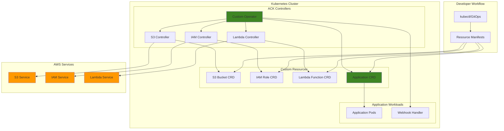

# Kubernetes Operators for AWS Resources

## Problem

Enterprise DevOps teams managing large-scale Kubernetes applications face significant challenges with AWS resource lifecycle management. Traditional approaches require maintaining separate infrastructure-as-code tools alongside Kubernetes manifests, creating operational complexity and potential drift between declared and actual resource states. Teams often struggle with inconsistent resource provisioning workflows, limited visibility into AWS resource status from Kubernetes tooling, and difficulty implementing GitOps patterns that encompass both application workloads and supporting AWS infrastructure.

## Solution

AWS Controllers for Kubernetes (ACK) enables native AWS resource management through Kubernetes-native operators and Custom Resource Definitions (CRDs). This approach unifies infrastructure and application management within the Kubernetes API, allowing teams to declare AWS resources alongside workloads using familiar kubectl commands and GitOps workflows. The solution demonstrates building custom operators that extend ACK capabilities for organization-specific resource management patterns and compliance requirements.

## Architecture Diagram



## Prerequisites

1. AWS account with EKS cluster admin permissions and IAM role creation rights
2. AWS CLI v2 installed and configured (or AWS CloudShell)
3. kubectl configured for EKS cluster access
4. Helm 3.8+ installed for ACK controller deployment
5. Go 1.21+ and Docker installed for custom operator development
6. Operator SDK v1.32+ for scaffolding custom operators
7. Estimated cost: $50-100 for EKS cluster, Lambda functions, and S3 storage during development

> **Note**: This advanced recipe assumes familiarity with Kubernetes operators, Go programming, and AWS service integration patterns.

## Preparation

```bash
# Set environment variables for the tutorial
export AWS_REGION=$(aws configure get region)
export AWS_ACCOUNT_ID=$(aws sts get-caller-identity \
    --query Account --output text)
export CLUSTER_NAME="ack-operators-cluster"
export ACK_SYSTEM_NAMESPACE="ack-system"

# Generate unique suffix for resources
RANDOM_SUFFIX=$(aws secretsmanager get-random-password \
    --exclude-punctuation --exclude-uppercase \
    --password-length 6 --require-each-included-type \
    --output text --query RandomPassword)
export RESOURCE_SUFFIX="ack-${RANDOM_SUFFIX}"

# Create EKS cluster if not exists
if ! aws eks describe-cluster --name $CLUSTER_NAME \
    --region $AWS_REGION &>/dev/null; then
    echo "Creating EKS cluster..."
    aws eks create-cluster \
        --name $CLUSTER_NAME \
        --version 1.28 \
        --role-arn arn:aws:iam::$AWS_ACCOUNT_ID:role/eks-service-role \
        --resources-vpc-config subnetIds=subnet-12345,subnet-67890 \
        --region $AWS_REGION
    
    # Wait for cluster to be active
    aws eks wait cluster-active --name $CLUSTER_NAME --region $AWS_REGION
fi

# Update kubeconfig for cluster access
aws eks update-kubeconfig --name $CLUSTER_NAME --region $AWS_REGION

# Create OIDC identity provider for service accounts
OIDC_ISSUER=$(aws eks describe-cluster --name $CLUSTER_NAME \
    --query "cluster.identity.oidc.issuer" --output text)
OIDC_ID=$(echo $OIDC_ISSUER | cut -d '/' -f 5)

# Create IAM role for ACK controllers
cat > trust-policy.json << EOF
{
  "Version": "2012-10-17",
  "Statement": [
    {
      "Effect": "Allow",
      "Principal": {
        "Federated": "arn:aws:iam::${AWS_ACCOUNT_ID}:oidc-provider/${OIDC_ISSUER#https://}"
      },
      "Action": "sts:AssumeRoleWithWebIdentity",
      "Condition": {
        "StringEquals": {
          "${OIDC_ISSUER#https://}:sub": "system:serviceaccount:${ACK_SYSTEM_NAMESPACE}:ack-controller"
        }
      }
    }
  ]
}
EOF

aws iam create-role \
    --role-name ACK-Controller-Role-${RESOURCE_SUFFIX} \
    --assume-role-policy-document file://trust-policy.json

# Create namespace for ACK controllers
kubectl create namespace $ACK_SYSTEM_NAMESPACE
```

## Steps

1. **Install AWS Controllers for Kubernetes (ACK) Runtime**:

   AWS Controllers for Kubernetes (ACK) transforms AWS resource management by bringing cloud services directly into the Kubernetes control plane. This foundation establishes the runtime components that enable treating AWS services as Kubernetes-native resources, fundamentally changing how teams manage cloud infrastructure alongside application workloads.

   ```bash
   # Add ACK Helm repository
   helm repo add aws-controllers-k8s \
       https://aws-controllers-k8s.github.io/charts
   helm repo update
   
   # Install shared CRDs for ACK
   kubectl apply -f https://raw.githubusercontent.com/aws-controllers-k8s/runtime/main/config/crd/bases/services.k8s.aws_adoptedresources.yaml
   kubectl apply -f https://raw.githubusercontent.com/aws-controllers-k8s/runtime/main/config/crd/bases/services.k8s.aws_fieldexports.yaml
   
   echo "✅ ACK runtime CRDs installed"
   ```

   The AdoptedResources and FieldExports CRDs provide essential capabilities for managing existing AWS resources and sharing data between controllers. This establishes the foundation for declarative AWS resource management through GitOps workflows.

   > **Note**: ACK controllers manage AWS resources as Kubernetes-native objects, enabling GitOps workflows for infrastructure management. Learn more about [ACK architecture](https://aws-controllers-k8s.github.io/community/docs/community/overview/).

2. **Deploy S3 ACK Controller**:

   The S3 ACK controller transforms Amazon S3 bucket management by enabling declarative configuration through Kubernetes manifests. S3 provides 99.999999999% (11 9's) data durability and unlimited scalability, making it the foundation for data lakes, backup strategies, and content distribution architectures. By managing S3 through Kubernetes, teams can apply the same GitOps practices used for applications to their storage infrastructure.

   ```bash
   # Get latest S3 controller version
   S3_VERSION=$(curl -sL https://api.github.com/repos/aws-controllers-k8s/s3-controller/releases/latest | jq -r '.tag_name | ltrimstr("v")')
   
   # Install S3 controller
   aws ecr-public get-login-password --region us-east-1 | \
       helm registry login --username AWS --password-stdin public.ecr.aws
   
   helm install ack-s3-controller \
       oci://public.ecr.aws/aws-controllers-k8s/s3-chart \
       --version=$S3_VERSION \
       --namespace $ACK_SYSTEM_NAMESPACE \
       --create-namespace \
       --set aws.region=$AWS_REGION \
       --set serviceAccount.annotations."eks\.amazonaws\.com/role-arn"="arn:aws:iam::${AWS_ACCOUNT_ID}:role/ACK-Controller-Role-${RESOURCE_SUFFIX}"
   
   # Verify S3 controller deployment
   kubectl get pods -n $ACK_SYSTEM_NAMESPACE -l app.kubernetes.io/name=s3-chart
   
   echo "✅ S3 ACK controller deployed"
   ```

   The controller now monitors for S3 Bucket custom resources and translates Kubernetes API operations into S3 service calls. The IRSA (IAM Roles for Service Accounts) configuration enables secure authentication without storing credentials, following AWS security best practices for workload identity.

   > **Warning**: Ensure your OIDC provider is properly configured for EKS service accounts before deploying ACK controllers to avoid authentication failures.

3. **Deploy IAM ACK Controller**:

   AWS Identity and Access Management (IAM) forms the security foundation of every AWS workload by controlling who can access which resources and under what conditions. The IAM ACK controller brings this critical security layer into Kubernetes, enabling teams to define roles, policies, and permissions alongside their applications. This approach ensures security configurations are version-controlled, peer-reviewed, and automatically applied through GitOps workflows.

   ```bash
   # Get latest IAM controller version
   IAM_VERSION=$(curl -sL https://api.github.com/repos/aws-controllers-k8s/iam-controller/releases/latest | jq -r '.tag_name | ltrimstr("v")')
   
   # Install IAM controller
   helm install ack-iam-controller \
       oci://public.ecr.aws/aws-controllers-k8s/iam-chart \
       --version=$IAM_VERSION \
       --namespace $ACK_SYSTEM_NAMESPACE \
       --set aws.region=$AWS_REGION \
       --set serviceAccount.annotations."eks\.amazonaws\.com/role-arn"="arn:aws:iam::${AWS_ACCOUNT_ID}:role/ACK-Controller-Role-${RESOURCE_SUFFIX}"
   
   # Verify IAM controller deployment
   kubectl get pods -n $ACK_SYSTEM_NAMESPACE -l app.kubernetes.io/name=iam-chart
   
   echo "✅ IAM ACK controller deployed"
   ```

   The IAM controller establishes the security management layer for our operator ecosystem. This enables programmatic creation of least-privilege roles, automated policy attachment, and consistent security governance across all AWS resources managed through Kubernetes.

4. **Deploy Lambda ACK Controller**:

   AWS Lambda revolutionizes serverless computing by providing event-driven execution without infrastructure management overhead. Lambda automatically scales from zero to thousands of concurrent executions, charges only for compute time used, and integrates seamlessly with over 200 AWS services. Managing Lambda functions through Kubernetes enables teams to apply container orchestration patterns to serverless workloads.

   ```bash
   # Get latest Lambda controller version
   LAMBDA_VERSION=$(curl -sL https://api.github.com/repos/aws-controllers-k8s/lambda-controller/releases/latest | jq -r '.tag_name | ltrimstr("v")')
   
   # Install Lambda controller
   helm install ack-lambda-controller \
       oci://public.ecr.aws/aws-controllers-k8s/lambda-chart \
       --version=$LAMBDA_VERSION \
       --namespace $ACK_SYSTEM_NAMESPACE \
       --set aws.region=$AWS_REGION \
       --set serviceAccount.annotations."eks\.amazonaws\.com/role-arn"="arn:aws:iam::${AWS_ACCOUNT_ID}:role/ACK-Controller-Role-${RESOURCE_SUFFIX}"
   
   # Verify Lambda controller deployment
   kubectl get pods -n $ACK_SYSTEM_NAMESPACE -l app.kubernetes.io/name=lambda-chart
   
   echo "✅ Lambda ACK controller deployed"
   ```

   The Lambda controller completes our serverless infrastructure management capability. This enables defining function configurations, environment variables, and trigger relationships through Kubernetes manifests, bringing serverless functions into the same deployment pipelines as containerized applications.

5. **Create Custom Resource Definitions (CRDs)**:

   Custom Resource Definitions extend the Kubernetes API with domain-specific objects that encapsulate business logic and organizational patterns. Our Application CRD abstracts away the complexity of managing multiple AWS resources by presenting a simplified interface that development teams can use without deep AWS expertise. This pattern enables platform teams to enforce standards while empowering application teams with self-service capabilities.

   ```bash
   # Create Application CRD for composite resource management
   cat > application-crd.yaml << 'EOF'
   apiVersion: apiextensions.k8s.io/v1
   kind: CustomResourceDefinition
   metadata:
     name: applications.platform.example.com
   spec:
     group: platform.example.com
     versions:
     - name: v1
       served: true
       storage: true
       schema:
         openAPIV3Schema:
           type: object
           properties:
             spec:
               type: object
               properties:
                 name:
                   type: string
                 environment:
                   type: string
                   enum: ["dev", "staging", "prod"]
                 storageClass:
                   type: string
                   default: "STANDARD"
                 lambdaRuntime:
                   type: string
                   default: "python3.9"
                 enableLogging:
                   type: boolean
                   default: true
             status:
               type: object
               properties:
                 phase:
                   type: string
                 bucketName:
                   type: string
                 roleArn:
                   type: string
                 functionName:
                   type: string
                 message:
                   type: string
     scope: Namespaced
     names:
       plural: applications
       singular: application
       kind: Application
   EOF
   
   kubectl apply -f application-crd.yaml
   
   echo "✅ Custom Application CRD created"
   ```

   The CRD schema defines validation rules, default values, and status tracking capabilities. The enum constraint on environment ensures only approved deployment targets are used, while defaults reduce configuration burden for development teams. This establishes the contract between platform capabilities and application requirements.

6. **Scaffold Custom Operator with Operator SDK**:

   The Operator SDK provides enterprise-grade scaffolding for building production-ready Kubernetes operators. Operators implement the controller pattern to continuously reconcile desired state with actual state, enabling self-healing and automated operational tasks. This scaffolding establishes the foundation for building domain-specific automation that encapsulates operational knowledge and best practices.

   ```bash
   # Initialize operator project
   mkdir -p platform-operator && cd platform-operator
   
   # Initialize Go module and operator project
   operator-sdk init --domain=platform.example.com --repo=github.com/example/platform-operator
   
   # Create API and controller for Application resource
   operator-sdk create api --group=platform --version=v1 --kind=Application --resource --controller
   
   # Update the Application spec in api/v1/application_types.go
   cat > api/v1/application_types.go << 'EOF'
   package v1
   
   import (
       metav1 "k8s.io/apimachinery/pkg/apis/meta/v1"
   )
   
   // ApplicationSpec defines the desired state of Application
   type ApplicationSpec struct {
       Name          string `json:"name"`
       Environment   string `json:"environment"`
       StorageClass  string `json:"storageClass,omitempty"`
       LambdaRuntime string `json:"lambdaRuntime,omitempty"`
       EnableLogging bool   `json:"enableLogging,omitempty"`
   }
   
   // ApplicationStatus defines the observed state of Application
   type ApplicationStatus struct {
       Phase        string `json:"phase,omitempty"`
       BucketName   string `json:"bucketName,omitempty"`
       RoleArn      string `json:"roleArn,omitempty"`
       FunctionName string `json:"functionName,omitempty"`
       Message      string `json:"message,omitempty"`
   }
   
   // Application is the Schema for the applications API
   type Application struct {
       metav1.TypeMeta   `json:",inline"`
       metav1.ObjectMeta `json:"metadata,omitempty"`
       Spec              ApplicationSpec   `json:"spec,omitempty"`
       Status            ApplicationStatus `json:"status,omitempty"`
   }
   
   // ApplicationList contains a list of Application
   type ApplicationList struct {
       metav1.TypeMeta `json:",inline"`
       metav1.ListMeta `json:"metadata,omitempty"`
       Items           []Application `json:"items"`
   }
   
   func init() {
       SchemeBuilder.Register(&Application{}, &ApplicationList{})
   }
   EOF
   
   echo "✅ Operator project scaffolded"
   ```

   The generated project structure includes controller-runtime integration, Webhook frameworks, and RBAC generation capabilities. This foundation enables building operators that follow Kubernetes ecosystem conventions and integrate seamlessly with existing tooling and monitoring systems.

   > **Tip**: Use the `operator-sdk scorecard` command to validate your operator implementation against best practices and operational readiness criteria.

7. **Implement Custom Operator Controller Logic**:

   The controller implements the core reconciliation logic that transforms high-level Application specifications into concrete AWS resources. This pattern encapsulates complex orchestration workflows while providing declarative interfaces for development teams. The controller continuously monitors for changes and automatically maintains desired state, implementing self-healing capabilities and operational automation.

   ```bash
   # Update controller implementation
   cat > controllers/application_controller.go << 'EOF'
   package controllers
   
   import (
       "context"
       "fmt"
       "time"
       
       "github.com/go-logr/logr"
       "k8s.io/apimachinery/pkg/api/errors"
       "k8s.io/apimachinery/pkg/runtime"
       "k8s.io/apimachinery/pkg/types"
       ctrl "sigs.k8s.io/controller-runtime"
       "sigs.k8s.io/controller-runtime/pkg/client"
       "sigs.k8s.io/controller-runtime/pkg/log"
       
       platformv1 "github.com/example/platform-operator/api/v1"
       s3v1alpha1 "github.com/aws-controllers-k8s/s3-controller/apis/v1alpha1"
       iamv1alpha1 "github.com/aws-controllers-k8s/iam-controller/apis/v1alpha1"
       lambdav1alpha1 "github.com/aws-controllers-k8s/lambda-controller/apis/v1alpha1"
   )
   
   // ApplicationReconciler reconciles an Application object
   type ApplicationReconciler struct {
       client.Client
       Scheme *runtime.Scheme
   }
   
   func (r *ApplicationReconciler) Reconcile(ctx context.Context, req ctrl.Request) (ctrl.Result, error) {
       log := log.FromContext(ctx)
       
       // Fetch Application instance
       app := &platformv1.Application{}
       err := r.Get(ctx, req.NamespacedName, app)
       if err != nil {
           if errors.IsNotFound(err) {
               return ctrl.Result{}, nil
           }
           return ctrl.Result{}, err
       }
       
       // Create S3 bucket
       if err := r.ensureS3Bucket(ctx, app); err != nil {
           log.Error(err, "Failed to create S3 bucket")
           return ctrl.Result{RequeueAfter: time.Minute}, err
       }
       
       // Create IAM role
       if err := r.ensureIAMRole(ctx, app); err != nil {
           log.Error(err, "Failed to create IAM role")
           return ctrl.Result{RequeueAfter: time.Minute}, err
       }
       
       // Create Lambda function
       if err := r.ensureLambdaFunction(ctx, app); err != nil {
           log.Error(err, "Failed to create Lambda function")
           return ctrl.Result{RequeueAfter: time.Minute}, err
       }
       
       // Update application status
       app.Status.Phase = "Ready"
       app.Status.Message = "All resources provisioned successfully"
       if err := r.Status().Update(ctx, app); err != nil {
           return ctrl.Result{}, err
       }
       
       return ctrl.Result{}, nil
   }
   
   func (r *ApplicationReconciler) ensureS3Bucket(ctx context.Context, app *platformv1.Application) error {
       bucketName := fmt.Sprintf("%s-%s-bucket", app.Spec.Name, app.Spec.Environment)
       
       bucket := &s3v1alpha1.Bucket{}
       err := r.Get(ctx, types.NamespacedName{Name: bucketName, Namespace: app.Namespace}, bucket)
       if err != nil && errors.IsNotFound(err) {
           bucket = &s3v1alpha1.Bucket{
               ObjectMeta: metav1.ObjectMeta{
                   Name:      bucketName,
                   Namespace: app.Namespace,
               },
               Spec: s3v1alpha1.BucketSpec{
                   Name: &bucketName,
               },
           }
           
           if err := r.Create(ctx, bucket); err != nil {
               return err
           }
       }
       
       app.Status.BucketName = bucketName
       return nil
   }
   
   func (r *ApplicationReconciler) ensureIAMRole(ctx context.Context, app *platformv1.Application) error {
       roleName := fmt.Sprintf("%s-%s-role", app.Spec.Name, app.Spec.Environment)
       
       role := &iamv1alpha1.Role{}
       err := r.Get(ctx, types.NamespacedName{Name: roleName, Namespace: app.Namespace}, role)
       if err != nil && errors.IsNotFound(err) {
           assumeRolePolicyDocument := `{
               "Version": "2012-10-17",
               "Statement": [
                   {
                       "Effect": "Allow",
                       "Principal": {"Service": "lambda.amazonaws.com"},
                       "Action": "sts:AssumeRole"
                   }
               ]
           }`
           
           role = &iamv1alpha1.Role{
               ObjectMeta: metav1.ObjectMeta{
                   Name:      roleName,
                   Namespace: app.Namespace,
               },
               Spec: iamv1alpha1.RoleSpec{
                   Name:                     &roleName,
                   AssumeRolePolicyDocument: &assumeRolePolicyDocument,
               },
           }
           
           if err := r.Create(ctx, role); err != nil {
               return err
           }
       }
       
       app.Status.RoleArn = fmt.Sprintf("arn:aws:iam::%s:role/%s", os.Getenv("AWS_ACCOUNT_ID"), roleName)
       return nil
   }
   
   func (r *ApplicationReconciler) ensureLambdaFunction(ctx context.Context, app *platformv1.Application) error {
       functionName := fmt.Sprintf("%s-%s-function", app.Spec.Name, app.Spec.Environment)
       
       function := &lambdav1alpha1.Function{}
       err := r.Get(ctx, types.NamespacedName{Name: functionName, Namespace: app.Namespace}, function)
       if err != nil && errors.IsNotFound(err) {
           code := "def lambda_handler(event, context): return {'statusCode': 200, 'body': 'Hello World'}"
           
           function = &lambdav1alpha1.Function{
               ObjectMeta: metav1.ObjectMeta{
                   Name:      functionName,
                   Namespace: app.Namespace,
               },
               Spec: lambdav1alpha1.FunctionSpec{
                   Name:    &functionName,
                   Runtime: &app.Spec.LambdaRuntime,
                   Role:    &app.Status.RoleArn,
                   Code: &lambdav1alpha1.FunctionCode{
                       ZipFile: &code,
                   },
                   Handler: aws.String("index.lambda_handler"),
               },
           }
           
           if err := r.Create(ctx, function); err != nil {
               return err
           }
       }
       
       app.Status.FunctionName = functionName
       return nil
   }
   
   // SetupWithManager sets up the controller with the Manager
   func (r *ApplicationReconciler) SetupWithManager(mgr ctrl.Manager) error {
       return ctrl.NewControllerManagedBy(mgr).
           For(&platformv1.Application{}).
           Owns(&s3v1alpha1.Bucket{}).
           Owns(&iamv1alpha1.Role{}).
           Owns(&lambdav1alpha1.Function{}).
           Complete(r)
   }
   EOF
   
   echo "✅ Custom operator controller implemented"
   ```

8. **Build and Deploy Custom Operator**:

   Building and deploying the operator transforms our code into a running controller that actively manages AWS resources. The `make generate` command creates deep-copy functions and CRD manifests, while `make manifests` generates RBAC rules and deployment configurations. This automated toolchain ensures consistent deployments and reduces human error in production environments.

   ```bash
   # Generate CRD manifests
   make generate
   make manifests
   
   # Build operator image
   OPERATOR_IMAGE="platform-operator:latest"
   make docker-build IMG=$OPERATOR_IMAGE
   
   # Load image into kind cluster or push to registry
   kind load docker-image $OPERATOR_IMAGE --name $CLUSTER_NAME || \
   docker tag $OPERATOR_IMAGE $AWS_ACCOUNT_ID.dkr.ecr.$AWS_REGION.amazonaws.com/$OPERATOR_IMAGE
   
   # Deploy operator to cluster
   make deploy IMG=$OPERATOR_IMAGE
   
   # Verify operator deployment
   kubectl get pods -n platform-operator-system
   
   echo "✅ Custom operator deployed"
   ```

   The operator is now running and actively watching for Application resources. It will automatically create, update, and delete AWS resources based on Kubernetes manifest changes, providing the foundation for GitOps-driven infrastructure management.

9. **Create Application Instance Using Custom Operator**:

   Creating an Application resource demonstrates the power of operator-driven infrastructure management. This single manifest declaration triggers the automatic provisioning of S3 buckets, IAM roles, and Lambda functions with proper security configurations and naming conventions. The operator handles all the complexity while providing a simple, consistent interface for development teams.

   ```bash
   # Create test application manifest
   cat > test-application.yaml << 'EOF'
   apiVersion: platform.example.com/v1
   kind: Application
   metadata:
     name: sample-app
     namespace: default
   spec:
     name: sample-app
     environment: dev
     storageClass: STANDARD
     lambdaRuntime: python3.9
     enableLogging: true
   EOF
   
   # Apply application manifest
   kubectl apply -f test-application.yaml
   
   # Monitor application status
   kubectl get applications -w
   
   echo "✅ Application instance created"
   ```

   The operator now reconciles this Application resource by creating underlying AWS resources through ACK controllers. This demonstrates the composition pattern where high-level abstractions orchestrate multiple lower-level resources, providing both simplicity for users and consistency for operations teams.

10. **Implement Advanced Operator Features**:

    Admission webhooks provide critical governance capabilities by intercepting resource creation and modification requests before they reach etcd. Validating webhooks enforce organizational policies and prevent misconfiguration, while mutating webhooks can automatically apply security defaults and compliance requirements. This pattern enables proactive governance rather than reactive remediation.

    ```bash
    # Add webhook for validation and mutation
    cat > webhook-configuration.yaml << 'EOF'
    apiVersion: admissionregistration.k8s.io/v1
    kind: ValidatingAdmissionWebhook
    metadata:
      name: application-validator
    webhooks:
    - name: validate.platform.example.com
      clientConfig:
        service:
          name: platform-operator-webhook-service
          namespace: platform-operator-system
          path: "/validate"
      rules:
      - operations: ["CREATE", "UPDATE"]
        apiGroups: ["platform.example.com"]
        apiVersions: ["v1"]
        resources: ["applications"]
      admissionReviewVersions: ["v1", "v1beta1"]
      sideEffects: None
    EOF
    
    # Create webhook handler
    cat > webhook-handler.go << 'EOF'
    func (r *ApplicationReconciler) ValidateApplication(ctx context.Context, req admission.Request) admission.Response {
        app := &platformv1.Application{}
        if err := r.Decoder.Decode(req, app); err != nil {
            return admission.Errored(http.StatusBadRequest, err)
        }
        
        // Validate environment
        validEnvs := []string{"dev", "staging", "prod"}
        if !contains(validEnvs, app.Spec.Environment) {
            return admission.Denied("Invalid environment. Must be one of: dev, staging, prod")
        }
        
        // Validate naming convention
        if !regexp.MustCompile(`^[a-z0-9-]+$`).MatchString(app.Spec.Name) {
            return admission.Denied("Application name must contain only lowercase letters, numbers, and hyphens")
        }
        
        return admission.Allowed("")
    }
    EOF
    
    kubectl apply -f webhook-configuration.yaml
    
    echo "✅ Advanced operator features implemented"
    ```

11. **Configure RBAC and Security Policies**:

    Role-Based Access Control (RBAC) implements the principle of least privilege by granting operators only the minimum permissions required for their function. Network policies provide defense-in-depth by controlling traffic flows between operator components and external services. These security measures are essential for production deployments where operators manage critical infrastructure resources.

    ```bash
    # Create RBAC policies for operator
    cat > rbac-config.yaml << 'EOF'
    apiVersion: rbac.authorization.k8s.io/v1
    kind: ClusterRole
    metadata:
      name: platform-operator-manager
    rules:
    - apiGroups: ["platform.example.com"]
      resources: ["applications"]
      verbs: ["create", "delete", "get", "list", "patch", "update", "watch"]
    - apiGroups: ["s3.services.k8s.aws"]
      resources: ["buckets"]
      verbs: ["create", "delete", "get", "list", "patch", "update", "watch"]
    - apiGroups: ["iam.services.k8s.aws"]
      resources: ["roles"]
      verbs: ["create", "delete", "get", "list", "patch", "update", "watch"]
    - apiGroups: ["lambda.services.k8s.aws"]
      resources: ["functions"]
      verbs: ["create", "delete", "get", "list", "patch", "update", "watch"]
    ---
    apiVersion: rbac.authorization.k8s.io/v1
    kind: ClusterRoleBinding
    metadata:
      name: platform-operator-manager
    roleRef:
      apiGroup: rbac.authorization.k8s.io
      kind: ClusterRole
      name: platform-operator-manager
    subjects:
    - kind: ServiceAccount
      name: platform-operator-controller-manager
      namespace: platform-operator-system
    EOF
    
    kubectl apply -f rbac-config.yaml
    
    # Create network policies for security
    cat > network-policy.yaml << 'EOF'
    apiVersion: networking.k8s.io/v1
    kind: NetworkPolicy
    metadata:
      name: platform-operator-network-policy
      namespace: platform-operator-system
    spec:
      podSelector:
        matchLabels:
          app: platform-operator
      policyTypes:
      - Ingress
      - Egress
      ingress:
      - from:
        - namespaceSelector:
            matchLabels:
              name: kube-system
      egress:
      - to: []
        ports:
        - protocol: TCP
          port: 443
    EOF
    
    kubectl apply -f network-policy.yaml
    
    echo "✅ RBAC and security policies configured"
    ```

12. **Implement Monitoring and Observability**:

    Comprehensive monitoring enables operational excellence by providing visibility into operator performance, reconciliation patterns, and error conditions. Prometheus metrics expose controller-runtime statistics, custom business metrics, and resource creation timelines. This observability foundation supports SLA monitoring, capacity planning, and troubleshooting workflows essential for production operator deployments.

    ```bash
    # Add Prometheus metrics to operator
    cat > metrics-config.yaml << 'EOF'
    apiVersion: v1
    kind: Service
    metadata:
      name: platform-operator-metrics
      namespace: platform-operator-system
      labels:
        app: platform-operator
    spec:
      ports:
      - name: metrics
        port: 8080
        targetPort: 8080
      selector:
        app: platform-operator
    ---
    apiVersion: monitoring.coreos.com/v1
    kind: ServiceMonitor
    metadata:
      name: platform-operator-metrics
      namespace: platform-operator-system
    spec:
      selector:
        matchLabels:
          app: platform-operator
      endpoints:
      - port: metrics
        interval: 30s
        path: /metrics
    EOF
    
    kubectl apply -f metrics-config.yaml
    
    # Create dashboard for operator metrics
    cat > operator-dashboard.json << 'EOF'
    {
      "dashboard": {
        "title": "Platform Operator Dashboard",
        "panels": [
          {
            "title": "Application Resources",
            "targets": [
              {
                "expr": "controller_runtime_reconcile_total{controller=\"application\"}"
              }
            ]
          },
          {
            "title": "Reconciliation Errors",
            "targets": [
              {
                "expr": "controller_runtime_reconcile_errors_total{controller=\"application\"}"
              }
            ]
          }
        ]
      }
    }
    EOF
    
    echo "✅ Monitoring and observability configured"
    ```

## Validation & Testing

1. Verify ACK controllers are running:

   ```bash
   # Check all ACK controller pods
   kubectl get pods -n $ACK_SYSTEM_NAMESPACE
   ```

   Expected output: All controller pods should be in Running state

2. Test custom Application resource creation:

   ```bash
   # Check application resource status
   kubectl get applications sample-app -o yaml
   
   # Verify AWS resources were created
   aws s3 ls | grep sample-app-dev-bucket
   aws iam list-roles | grep sample-app-dev-role
   aws lambda list-functions | grep sample-app-dev-function
   ```

3. Test operator webhook validation:

   ```bash
   # Try creating invalid application
   cat > invalid-app.yaml << 'EOF'
   apiVersion: platform.example.com/v1
   kind: Application
   metadata:
     name: Invalid_App
   spec:
     name: Invalid_App
     environment: production
   EOF
   
   kubectl apply -f invalid-app.yaml
   ```

   Expected output: Validation error for invalid name format and environment

4. Test operator reconciliation:

   ```bash
   # Delete underlying S3 bucket directly
   aws s3 rm s3://sample-app-dev-bucket --recursive
   aws s3 rb s3://sample-app-dev-bucket
   
   # Verify operator recreates the bucket
   kubectl get applications sample-app -w
   ```

5. Test operator metrics and monitoring:

   ```bash
   # Check operator metrics endpoint
   kubectl port-forward -n platform-operator-system \
       svc/platform-operator-metrics 8080:8080 &
   
   curl http://localhost:8080/metrics | grep controller_runtime
   ```

## Cleanup

1. Remove Application resources:

   ```bash
   # Delete test applications
   kubectl delete -f test-application.yaml
   kubectl delete -f invalid-app.yaml
   
   echo "✅ Deleted Application resources"
   ```

2. Remove custom operator:

   ```bash
   # Remove operator deployment
   cd platform-operator
   make undeploy
   
   # Remove CRDs
   kubectl delete -f application-crd.yaml
   kubectl delete -f rbac-config.yaml
   kubectl delete -f network-policy.yaml
   kubectl delete -f metrics-config.yaml
   
   echo "✅ Removed custom operator"
   ```

3. Remove ACK controllers:

   ```bash
   # Uninstall ACK controllers
   helm uninstall ack-s3-controller -n $ACK_SYSTEM_NAMESPACE
   helm uninstall ack-iam-controller -n $ACK_SYSTEM_NAMESPACE
   helm uninstall ack-lambda-controller -n $ACK_SYSTEM_NAMESPACE
   
   # Remove ACK runtime CRDs
   kubectl delete -f https://raw.githubusercontent.com/aws-controllers-k8s/runtime/main/config/crd/bases/services.k8s.aws_adoptedresources.yaml
   kubectl delete -f https://raw.githubusercontent.com/aws-controllers-k8s/runtime/main/config/crd/bases/services.k8s.aws_fieldexports.yaml
   
   echo "✅ Removed ACK controllers"
   ```

4. Remove IAM roles and policies:

   ```bash
   # Delete IAM role
   aws iam delete-role --role-name ACK-Controller-Role-${RESOURCE_SUFFIX}
   
   # Clean up local files
   rm -f trust-policy.json application-crd.yaml test-application.yaml
   rm -f webhook-configuration.yaml rbac-config.yaml network-policy.yaml
   rm -f metrics-config.yaml operator-dashboard.json invalid-app.yaml
   
   echo "✅ Cleaned up IAM resources and files"
   ```

5. Remove EKS cluster (optional):

   ```bash
   # Delete EKS cluster if created for this tutorial
   aws eks delete-cluster --name $CLUSTER_NAME --region $AWS_REGION
   
   echo "✅ EKS cluster deletion initiated"
   ```

## Discussion

AWS Controllers for Kubernetes (ACK) represents a paradigm shift in cloud-native infrastructure management by bringing AWS service lifecycle management directly into the Kubernetes API. This approach eliminates the traditional boundary between application workloads and supporting infrastructure, enabling true infrastructure-as-code practices within GitOps workflows. The custom operator pattern demonstrated here extends ACK's capabilities by providing higher-level abstractions that encapsulate organization-specific resource provisioning and compliance patterns.

The architecture leverages Kubernetes' controller pattern to provide declarative, reconciliation-based management of AWS resources. Each ACK controller watches for changes to specific Custom Resource Definitions and translates Kubernetes API operations into corresponding AWS API calls. This design ensures eventual consistency between desired state (declared in Kubernetes manifests) and actual state (AWS resources), with automatic drift detection and remediation capabilities.

Custom operators built on top of ACK controllers provide several architectural advantages. They enable composition of multiple AWS resources into logical application units, implement organization-specific validation and security policies, and provide simplified interfaces for development teams. The webhook admission controllers ensure policy compliance at resource creation time, while the reconciliation loop provides ongoing governance and automated remediation of configuration drift.

The monitoring and observability integration through Prometheus metrics provides operational visibility into operator performance and resource management effectiveness. This is crucial for production deployments where understanding reconciliation patterns, error rates, and resource creation times directly impacts application deployment velocity and reliability.

> **Tip**: Use field selectors and label selectors extensively in your custom operators to optimize Kubernetes API queries and reduce controller overhead in large-scale deployments.

## Challenge

Extend this solution by implementing these enhancements:

1. **Multi-Environment Resource Management**: Implement environment-specific resource configurations with automatic promotion workflows that validate resource configurations across development, staging, and production environments using ACK field exports and cross-references.

2. **Cost Optimization Integration**: Add AWS Cost Explorer integration to the custom operator that automatically applies cost-optimization policies like S3 Intelligent Tiering, Lambda Provisioned Concurrency management, and resource right-sizing based on CloudWatch metrics analysis.

3. **Advanced Security Compliance**: Implement automated security policy enforcement using AWS Config rules integration, enabling the operator to automatically remediate security misconfigurations and maintain compliance with organizational security standards.

4. **Blue-Green Deployment Orchestration**: Extend the operator to support blue-green deployments of Lambda functions and associated resources, with automatic rollback capabilities based on CloudWatch alarms and application health metrics.

5. **Multi-Region Active-Active Architecture**: Implement cross-region resource replication and failover capabilities that automatically maintain resource consistency across multiple AWS regions using ACK controllers and custom reconciliation logic.

## Infrastructure Code

*Infrastructure code will be generated after recipe approval.*