# Self-Managed Kubernetes Integration with VPC Lattice IP Targets

## Problem

Modern enterprises run multiple Kubernetes clusters across different VPCs for isolation, compliance, and organizational boundaries. However, enabling secure service-to-service communication between these clusters typically requires complex VPC peering configurations, transit gateways, or application-level networking solutions that add operational overhead and security complexity. Traditional approaches also lack native service discovery mechanisms and fine-grained traffic management capabilities between clusters.

## Solution

Implement VPC Lattice as a service mesh layer that connects self-managed Kubernetes clusters across VPCs using IP targets for direct pod communication. VPC Lattice provides application-layer networking with built-in service discovery, load balancing, and security policies without requiring VPC peering or complex networking infrastructure. This approach enables seamless cross-cluster communication while maintaining network isolation and simplifying operational management.

## Architecture Diagram

```mermaid
graph TB
    subgraph "VPC A (10.0.0.0/16)"
        subgraph "Private Subnet A"
            K8S_A[Kubernetes Cluster A]
            POD_A1[Frontend Pod<br/>10.0.1.10]
            POD_A2[Frontend Pod<br/>10.0.1.11]
        end
        EC2_A[EC2 Control Plane A]
    end
    
    subgraph "VPC B (10.1.0.0/16)"
        subgraph "Private Subnet B"
            K8S_B[Kubernetes Cluster B]
            POD_B1[Backend Pod<br/>10.1.1.20]
            POD_B2[Backend Pod<br/>10.1.1.21]
        end
        EC2_B[EC2 Control Plane B]
    end
    
    subgraph "VPC Lattice Service Network"
        SN[Service Network<br/>lattice-k8s-mesh]
        SVC_A[Frontend Service]
        SVC_B[Backend Service]
        TG_A[IP Target Group A]
        TG_B[IP Target Group B]
    end
    
    subgraph "Monitoring"
        CW[CloudWatch<br/>Metrics & Logs]
    end
    
    K8S_A --> POD_A1
    K8S_A --> POD_A2
    K8S_B --> POD_B1
    K8S_B --> POD_B2
    
    POD_A1 --> TG_A
    POD_A2 --> TG_A
    POD_B1 --> TG_B
    POD_B2 --> TG_B
    
    TG_A --> SVC_A
    TG_B --> SVC_B
    SVC_A --> SN
    SVC_B --> SN
    
    SN --> CW
    
    POD_A1 -.->|Cross-VPC Call| POD_B1
    POD_A2 -.->|via Lattice| POD_B2
    
    style SN fill:#FF9900
    style TG_A fill:#3F8624
    style TG_B fill:#3F8624
    style CW fill:#232F3E
```



## Prerequisites

1. AWS account with permissions for VPC Lattice, EC2, and CloudWatch services
2. AWS CLI v2 installed and configured (or use AWS CloudShell)
3. Basic understanding of Kubernetes concepts and container networking
4. Familiarity with AWS VPC networking and security groups
5. Docker installed for building container images
6. Estimated cost: $20-40 for 45 minutes of testing (EC2 instances, VPC Lattice usage)

> **Note**: This recipe creates resources across multiple VPCs and requires careful network configuration. Ensure you understand VPC Lattice pricing before proceeding.

## Preparation

```bash
# Set environment variables for AWS configuration
export AWS_REGION=$(aws configure get region)
export AWS_ACCOUNT_ID=$(aws sts get-caller-identity \
    --query Account --output text)

# Generate unique identifiers for resources
RANDOM_SUFFIX=$(aws secretsmanager get-random-password \
    --exclude-punctuation --exclude-uppercase \
    --password-length 6 --require-each-included-type \
    --output text --query RandomPassword)

# Set resource names with unique suffix
export VPC_A_NAME="k8s-vpc-a-${RANDOM_SUFFIX}"
export VPC_B_NAME="k8s-vpc-b-${RANDOM_SUFFIX}"
export SERVICE_NETWORK_NAME="lattice-k8s-mesh-${RANDOM_SUFFIX}"
export FRONTEND_SERVICE_NAME="frontend-svc-${RANDOM_SUFFIX}"
export BACKEND_SERVICE_NAME="backend-svc-${RANDOM_SUFFIX}"

# Create SSH key pair for EC2 instances
aws ec2 create-key-pair \
    --key-name "k8s-lattice-${RANDOM_SUFFIX}" \
    --query 'KeyMaterial' --output text > k8s-lattice-key.pem

chmod 400 k8s-lattice-key.pem

echo "✅ Environment configured with unique suffix: ${RANDOM_SUFFIX}"
```

## Steps

1. **Create VPC Infrastructure for Kubernetes Clusters**:

   VPC Lattice requires separate VPCs to demonstrate cross-VPC service mesh capabilities. Each VPC will host a self-managed Kubernetes cluster with dedicated subnets for pod networking and control plane isolation. This multi-VPC architecture simulates real-world enterprise scenarios where different teams or applications require network isolation while maintaining service connectivity.

   ```bash
   # Create VPC A for first Kubernetes cluster
   VPC_A_ID=$(aws ec2 create-vpc \
       --cidr-block 10.0.0.0/16 \
       --query 'Vpc.VpcId' --output text)
   
   aws ec2 create-tags \
       --resources ${VPC_A_ID} \
       --tags Key=Name,Value=${VPC_A_NAME}
   
   # Create VPC B for second Kubernetes cluster  
   VPC_B_ID=$(aws ec2 create-vpc \
       --cidr-block 10.1.0.0/16 \
       --query 'Vpc.VpcId' --output text)
   
   aws ec2 create-tags \
       --resources ${VPC_B_ID} \
       --tags Key=Name,Value=${VPC_B_NAME}
   
   echo "✅ Created VPCs: ${VPC_A_ID} and ${VPC_B_ID}"
   ```

2. **Configure Subnets and Networking Components**:

   Each VPC requires public subnets for EC2 instances to download packages and route tables for internet connectivity. The networking configuration ensures proper internet access for Kubernetes installation while maintaining isolated environments for each cluster. Route tables with internet gateway routes enable package downloads during cluster initialization.

   ```bash
   # Create subnet and networking for VPC A
   SUBNET_A_ID=$(aws ec2 create-subnet \
       --vpc-id ${VPC_A_ID} \
       --cidr-block 10.0.1.0/24 \
       --availability-zone ${AWS_REGION}a \
       --query 'Subnet.SubnetId' --output text)
   
   IGW_A_ID=$(aws ec2 create-internet-gateway \
       --query 'InternetGateway.InternetGatewayId' --output text)
   
   aws ec2 attach-internet-gateway \
       --internet-gateway-id ${IGW_A_ID} \
       --vpc-id ${VPC_A_ID}
   
   # Configure route table for VPC A
   RTB_A_ID=$(aws ec2 describe-route-tables \
       --filters "Name=vpc-id,Values=${VPC_A_ID}" \
       --query 'RouteTables[0].RouteTableId' --output text)
   
   aws ec2 create-route \
       --route-table-id ${RTB_A_ID} \
       --destination-cidr-block 0.0.0.0/0 \
       --gateway-id ${IGW_A_ID}
   
   # Create subnet and networking for VPC B
   SUBNET_B_ID=$(aws ec2 create-subnet \
       --vpc-id ${VPC_B_ID} \
       --cidr-block 10.1.1.0/24 \
       --availability-zone ${AWS_REGION}a \
       --query 'Subnet.SubnetId' --output text)
   
   IGW_B_ID=$(aws ec2 create-internet-gateway \
       --query 'InternetGateway.InternetGatewayId' --output text)
   
   aws ec2 attach-internet-gateway \
       --internet-gateway-id ${IGW_B_ID} \
       --vpc-id ${VPC_B_ID}
   
   # Configure route table for VPC B
   RTB_B_ID=$(aws ec2 describe-route-tables \
       --filters "Name=vpc-id,Values=${VPC_B_ID}" \
       --query 'RouteTables[0].RouteTableId' --output text)
   
   aws ec2 create-route \
       --route-table-id ${RTB_B_ID} \
       --destination-cidr-block 0.0.0.0/0 \
       --gateway-id ${IGW_B_ID}
   
   echo "✅ Network infrastructure configured"
   ```

3. **Create Security Groups for Kubernetes and VPC Lattice**:

   Security groups control traffic flow between Kubernetes components and VPC Lattice endpoints. These rules enable necessary Kubernetes cluster communication while allowing VPC Lattice to reach pod IP addresses for health checks and traffic routing. The configuration follows AWS security best practices by implementing least-privilege access controls with VPC Lattice-specific security group rules for cross-VPC communication.

   ```bash
   # Create security group for VPC A Kubernetes cluster
   SG_A_ID=$(aws ec2 create-security-group \
       --group-name "k8s-cluster-a-${RANDOM_SUFFIX}" \
       --description "Security group for Kubernetes cluster A" \
       --vpc-id ${VPC_A_ID} \
       --query 'GroupId' --output text)
   
   # Allow all traffic within VPC A for Kubernetes communication
   aws ec2 authorize-security-group-ingress \
       --group-id ${SG_A_ID} \
       --protocol -1 \
       --source-group ${SG_A_ID}
   
   # Allow SSH access for cluster management
   aws ec2 authorize-security-group-ingress \
       --group-id ${SG_A_ID} \
       --protocol tcp \
       --port 22 \
       --cidr 0.0.0.0/0
   
   # Allow VPC Lattice managed prefix list for health checks
   aws ec2 authorize-security-group-ingress \
       --group-id ${SG_A_ID} \
       --protocol tcp \
       --port 8080 \
       --source-prefix-list-id \
       $(aws ec2 describe-managed-prefix-lists \
           --filters "Name=prefix-list-name,Values=com.amazonaws.vpce.${AWS_REGION}.vpce-svc*" \
           --query 'PrefixLists[?contains(PrefixListName, `vpc-lattice`)].PrefixListId' \
           --output text)
   
   # Create security group for VPC B Kubernetes cluster
   SG_B_ID=$(aws ec2 create-security-group \
       --group-name "k8s-cluster-b-${RANDOM_SUFFIX}" \
       --description "Security group for Kubernetes cluster B" \
       --vpc-id ${VPC_B_ID} \
       --query 'GroupId' --output text)
   
   # Configure similar rules for VPC B
   aws ec2 authorize-security-group-ingress \
       --group-id ${SG_B_ID} \
       --protocol -1 \
       --source-group ${SG_B_ID}
   
   aws ec2 authorize-security-group-ingress \
       --group-id ${SG_B_ID} \
       --protocol tcp \
       --port 22 \
       --cidr 0.0.0.0/0
   
   # Allow VPC Lattice health checks for backend service
   aws ec2 authorize-security-group-ingress \
       --group-id ${SG_B_ID} \
       --protocol tcp \
       --port 9090 \
       --source-prefix-list-id \
       $(aws ec2 describe-managed-prefix-lists \
           --filters "Name=prefix-list-name,Values=com.amazonaws.vpce.${AWS_REGION}.vpce-svc*" \
           --query 'PrefixLists[?contains(PrefixListName, `vpc-lattice`)].PrefixListId' \
           --output text)
   
   echo "✅ Security groups configured for Kubernetes clusters"
   ```

4. **Launch EC2 Instances for Kubernetes Control Planes**:

   These EC2 instances will host self-managed Kubernetes clusters using kubeadm. Each instance serves as both control plane and worker node for simplicity in this demonstration. The user data script installs Docker and Kubernetes components using the new community-owned package repositories at pkgs.k8s.io, which replace the deprecated Google-hosted repositories.

   ```bash
   # Get the latest Amazon Linux 2 AMI ID
   AMAZON_LINUX_AMI=$(aws ec2 describe-images \
       --owners amazon \
       --filters "Name=name,Values=amzn2-ami-hvm-*-x86_64-gp2" \
               "Name=state,Values=available" \
       --query 'Images | sort_by(@, &CreationDate) | [-1].ImageId' \
       --output text)
   
   # Launch EC2 instance for Kubernetes cluster A
   INSTANCE_A_ID=$(aws ec2 run-instances \
       --image-id ${AMAZON_LINUX_AMI} \
       --instance-type t3.medium \
       --key-name "k8s-lattice-${RANDOM_SUFFIX}" \
       --security-group-ids ${SG_A_ID} \
       --subnet-id ${SUBNET_A_ID} \
       --associate-public-ip-address \
       --user-data file://<(cat << 'EOF'
#!/bin/bash
yum update -y
yum install -y docker
systemctl start docker
systemctl enable docker
usermod -aG docker ec2-user

# Install Kubernetes components using new repository
cat <<REPO > /etc/yum.repos.d/kubernetes.repo
[kubernetes]
name=Kubernetes
baseurl=https://pkgs.k8s.io/core:/stable:/v1.28/rpm/
enabled=1
gpgcheck=1
gpgkey=https://pkgs.k8s.io/core:/stable:/v1.28/rpm/repodata/repomd.xml.key
exclude=kubelet kubeadm kubectl cri-tools kubernetes-cni
REPO

yum install -y kubelet kubeadm kubectl --disableexcludes=kubernetes
systemctl enable kubelet
EOF
) \
       --tag-specifications 'ResourceType=instance,Tags=[{Key=Name,Value=k8s-cluster-a}]' \
       --query 'Instances[0].InstanceId' --output text)
   
   # Launch EC2 instance for Kubernetes cluster B
   INSTANCE_B_ID=$(aws ec2 run-instances \
       --image-id ${AMAZON_LINUX_AMI} \
       --instance-type t3.medium \
       --key-name "k8s-lattice-${RANDOM_SUFFIX}" \
       --security-group-ids ${SG_B_ID} \
       --subnet-id ${SUBNET_B_ID} \
       --associate-public-ip-address \
       --user-data file://<(cat << 'EOF'
#!/bin/bash
yum update -y
yum install -y docker
systemctl start docker
systemctl enable docker
usermod -aG docker ec2-user

# Install Kubernetes components using new repository
cat <<REPO > /etc/yum.repos.d/kubernetes.repo
[kubernetes]
name=Kubernetes
baseurl=https://pkgs.k8s.io/core:/stable:/v1.28/rpm/
enabled=1
gpgcheck=1
gpgkey=https://pkgs.k8s.io/core:/stable:/v1.28/rpm/repodata/repomd.xml.key
exclude=kubelet kubeadm kubectl cri-tools kubernetes-cni
REPO

yum install -y kubelet kubeadm kubectl --disableexcludes=kubernetes
systemctl enable kubelet
EOF
) \
       --tag-specifications 'ResourceType=instance,Tags=[{Key=Name,Value=k8s-cluster-b}]' \
       --query 'Instances[0].InstanceId' --output text)
   
   # Wait for instances to be running
   aws ec2 wait instance-running --instance-ids ${INSTANCE_A_ID} ${INSTANCE_B_ID}
   
   echo "✅ Kubernetes control plane instances launched: ${INSTANCE_A_ID}, ${INSTANCE_B_ID}"
   ```

5. **Create VPC Lattice Service Network**:

   The VPC Lattice service network acts as the central control plane for service mesh communication between Kubernetes clusters. This network provides service discovery, traffic routing, and security policy enforcement without requiring complex networking configurations or VPC peering relationships between the clusters.

   ```bash
   # Create VPC Lattice service network
   SERVICE_NETWORK_ID=$(aws vpc-lattice create-service-network \
       --name ${SERVICE_NETWORK_NAME} \
       --query 'id' --output text)
   
   # Associate VPC A with the service network
   aws vpc-lattice create-service-network-vpc-association \
       --service-network-identifier ${SERVICE_NETWORK_ID} \
       --vpc-identifier ${VPC_A_ID} \
       --security-group-ids ${SG_A_ID}
   
   # Associate VPC B with the service network
   aws vpc-lattice create-service-network-vpc-association \
       --service-network-identifier ${SERVICE_NETWORK_ID} \
       --vpc-identifier ${VPC_B_ID} \
       --security-group-ids ${SG_B_ID}
   
   echo "✅ VPC Lattice service network created: ${SERVICE_NETWORK_ID}"
   ```

6. **Create Target Groups for Kubernetes Pod IP Addresses**:

   VPC Lattice IP target groups enable direct registration of Kubernetes pod IP addresses as traffic targets. This approach bypasses traditional load balancer configurations and provides native integration between Kubernetes workloads and AWS networking services. The target groups support health checking and automatic failover for pod lifecycle management with configurable health check parameters.

   ```bash
   # Create target group for frontend service in VPC A
   FRONTEND_TG_ID=$(aws vpc-lattice create-target-group \
       --name "frontend-tg-${RANDOM_SUFFIX}" \
       --type IP \
       --protocol HTTP \
       --port 8080 \
       --vpc-identifier ${VPC_A_ID} \
       --query 'id' --output text)
   
   # Create target group for backend service in VPC B
   BACKEND_TG_ID=$(aws vpc-lattice create-target-group \
       --name "backend-tg-${RANDOM_SUFFIX}" \
       --type IP \
       --protocol HTTP \
       --port 9090 \
       --vpc-identifier ${VPC_B_ID} \
       --query 'id' --output text)
   
   # Configure health check settings for target groups
   aws vpc-lattice modify-target-group \
       --target-group-identifier ${FRONTEND_TG_ID} \
       --health-check-enabled \
       --health-check-interval-seconds 30 \
       --health-check-timeout-seconds 5 \
       --healthy-threshold-count 2 \
       --unhealthy-threshold-count 3 \
       --health-check-protocol HTTP \
       --health-check-port 8080 \
       --health-check-path "/health"
   
   aws vpc-lattice modify-target-group \
       --target-group-identifier ${BACKEND_TG_ID} \
       --health-check-enabled \
       --health-check-interval-seconds 30 \
       --health-check-timeout-seconds 5 \
       --healthy-threshold-count 2 \
       --unhealthy-threshold-count 3 \
       --health-check-protocol HTTP \
       --health-check-port 9090 \
       --health-check-path "/health"
   
   echo "✅ Target groups created: ${FRONTEND_TG_ID}, ${BACKEND_TG_ID}"
   ```

7. **Create VPC Lattice Services and Listeners**:

   VPC Lattice services define the networking endpoints that Kubernetes clusters use for cross-cluster communication. Each service includes listeners that handle incoming requests and route traffic to appropriate target groups based on configured rules. This configuration establishes the service mesh foundation for secure, managed communication between clusters.

   ```bash
   # Create frontend service in VPC Lattice
   FRONTEND_SERVICE_ID=$(aws vpc-lattice create-service \
       --name ${FRONTEND_SERVICE_NAME} \
       --query 'id' --output text)
   
   # Create backend service in VPC Lattice
   BACKEND_SERVICE_ID=$(aws vpc-lattice create-service \
       --name ${BACKEND_SERVICE_NAME} \
       --query 'id' --output text)
   
   # Create listener for frontend service
   aws vpc-lattice create-listener \
       --service-identifier ${FRONTEND_SERVICE_ID} \
       --name "frontend-listener" \
       --protocol HTTP \
       --port 80 \
       --default-action '{
           "forward": {
               "targetGroups": [{
                   "targetGroupIdentifier": "'${FRONTEND_TG_ID}'",
                   "weight": 100
               }]
           }
       }'
   
   # Create listener for backend service
   aws vpc-lattice create-listener \
       --service-identifier ${BACKEND_SERVICE_ID} \
       --name "backend-listener" \
       --protocol HTTP \
       --port 80 \
       --default-action '{
           "forward": {
               "targetGroups": [{
                   "targetGroupIdentifier": "'${BACKEND_TG_ID}'",
                   "weight": 100
               }]
           }
       }'
   
   echo "✅ VPC Lattice services and listeners configured"
   ```

8. **Associate Services with Service Network**:

   Service network associations enable service discovery and communication between VPC Lattice services across different VPCs. This step completes the service mesh configuration by making services discoverable and accessible to other services in the network without requiring direct VPC connectivity or complex routing configurations.

   ```bash
   # Associate frontend service with service network
   aws vpc-lattice create-service-network-service-association \
       --service-network-identifier ${SERVICE_NETWORK_ID} \
       --service-identifier ${FRONTEND_SERVICE_ID}
   
   # Associate backend service with service network
   aws vpc-lattice create-service-network-service-association \
       --service-network-identifier ${SERVICE_NETWORK_ID} \
       --service-identifier ${BACKEND_SERVICE_ID}
   
   echo "✅ Services associated with service network"
   ```

9. **Get Instance IP Addresses and Register Targets**:

   Retrieve the private IP addresses of EC2 instances to simulate Kubernetes pod IP addresses for target group registration. In a real environment, you would extract actual pod IPs from the Kubernetes API. This step demonstrates how VPC Lattice can register any IP address within the VPC as a target for service mesh communication.

   ```bash
   # Get private IP addresses for instances (simulating pod IPs)
   INSTANCE_A_IP=$(aws ec2 describe-instances \
       --instance-ids ${INSTANCE_A_ID} \
       --query 'Reservations[0].Instances[0].PrivateIpAddress' \
       --output text)
   
   INSTANCE_B_IP=$(aws ec2 describe-instances \
       --instance-ids ${INSTANCE_B_ID} \
       --query 'Reservations[0].Instances[0].PrivateIpAddress' \
       --output text)
   
   # Register instance IPs as targets (simulating pod registration)
   aws vpc-lattice register-targets \
       --target-group-identifier ${FRONTEND_TG_ID} \
       --targets id=${INSTANCE_A_IP},port=8080
   
   aws vpc-lattice register-targets \
       --target-group-identifier ${BACKEND_TG_ID} \
       --targets id=${INSTANCE_B_IP},port=9090
   
   echo "✅ Pod IP addresses registered with target groups"
   echo "Frontend Pod IP: ${INSTANCE_A_IP}"
   echo "Backend Pod IP: ${INSTANCE_B_IP}"
   ```

10. **Configure CloudWatch Monitoring**:

    CloudWatch integration provides visibility into VPC Lattice service mesh performance, including request metrics, error rates, and target health status. This monitoring foundation enables proactive management and troubleshooting of cross-cluster communication patterns and service performance optimization with centralized logging and metrics collection.

    ```bash
    # Create CloudWatch log group for VPC Lattice access logs
    aws logs create-log-group \
        --log-group-name "/aws/vpc-lattice/${SERVICE_NETWORK_NAME}"
    
    # Enable access logging for the service network
    aws vpc-lattice put-access-log-subscription \
        --service-network-identifier ${SERVICE_NETWORK_ID} \
        --destination-arn "arn:aws:logs:${AWS_REGION}:${AWS_ACCOUNT_ID}:log-group:/aws/vpc-lattice/${SERVICE_NETWORK_NAME}"
    
    # Create CloudWatch dashboard for service mesh monitoring
    aws cloudwatch put-dashboard \
        --dashboard-name "VPC-Lattice-K8s-Mesh-${RANDOM_SUFFIX}" \
        --dashboard-body '{
            "widgets": [
                {
                    "type": "metric",
                    "properties": {
                        "metrics": [
                            ["AWS/VPCLattice", "ActiveConnectionCount", "ServiceNetwork", "'${SERVICE_NETWORK_ID}'"],
                            ["AWS/VPCLattice", "NewConnectionCount", "ServiceNetwork", "'${SERVICE_NETWORK_ID}'"]
                        ],
                        "period": 300,
                        "stat": "Sum",
                        "region": "'${AWS_REGION}'",
                        "title": "VPC Lattice Service Network Connections"
                    }
                }
            ]
        }'
    
    echo "✅ CloudWatch monitoring configured for service mesh"
    ```

## Validation & Testing

1. **Verify VPC Lattice Service Network Configuration**:

   ```bash
   # Check service network status and associations
   aws vpc-lattice get-service-network \
       --service-network-identifier ${SERVICE_NETWORK_ID}
   
   # List VPC associations
   aws vpc-lattice list-service-network-vpc-associations \
       --service-network-identifier ${SERVICE_NETWORK_ID}
   ```

   Expected output: Service network should show "ACTIVE" status with both VPCs associated.

2. **Validate Target Group Health**:

   ```bash
   # Check target health for frontend service
   aws vpc-lattice list-targets \
       --target-group-identifier ${FRONTEND_TG_ID}
   
   # Check target health for backend service
   aws vpc-lattice list-targets \
       --target-group-identifier ${BACKEND_TG_ID}
   ```

   Expected output: Targets should show registered status. Health status will depend on actual service availability.

3. **Test Cross-VPC Service Discovery**:

   ```bash
   # Get service network domain for service discovery
   SERVICE_NETWORK_DOMAIN=$(aws vpc-lattice get-service-network \
       --service-network-identifier ${SERVICE_NETWORK_ID} \
       --query 'dnsEntry.domainName' --output text)
   
   echo "Service Network Domain: ${SERVICE_NETWORK_DOMAIN}"
   echo "Frontend Service: ${FRONTEND_SERVICE_NAME}.${SERVICE_NETWORK_DOMAIN}"
   echo "Backend Service: ${BACKEND_SERVICE_NAME}.${SERVICE_NETWORK_DOMAIN}"
   ```

4. **Monitor Service Mesh Metrics**:

   ```bash
   # View CloudWatch metrics for service network
   aws cloudwatch get-metric-statistics \
       --namespace AWS/VPCLattice \
       --metric-name ActiveConnectionCount \
       --dimensions Name=ServiceNetwork,Value=${SERVICE_NETWORK_ID} \
       --start-time $(date -u -d '10 minutes ago' +%Y-%m-%dT%H:%M:%S) \
       --end-time $(date -u +%Y-%m-%dT%H:%M:%S) \
       --period 300 \
       --statistics Sum
   ```

## Cleanup

1. **Remove VPC Lattice Service Network Components**:

   ```bash
   # Deregister targets from target groups
   aws vpc-lattice deregister-targets \
       --target-group-identifier ${FRONTEND_TG_ID} \
       --targets id=${INSTANCE_A_IP}
   
   aws vpc-lattice deregister-targets \
       --target-group-identifier ${BACKEND_TG_ID} \
       --targets id=${INSTANCE_B_IP}
   
   # Delete service network service associations
   FRONTEND_ASSOC_ID=$(aws vpc-lattice list-service-network-service-associations \
       --service-network-identifier ${SERVICE_NETWORK_ID} \
       --query 'items[?serviceId==`'${FRONTEND_SERVICE_ID}'`].id' \
       --output text)
   
   BACKEND_ASSOC_ID=$(aws vpc-lattice list-service-network-service-associations \
       --service-network-identifier ${SERVICE_NETWORK_ID} \
       --query 'items[?serviceId==`'${BACKEND_SERVICE_ID}'`].id' \
       --output text)
   
   aws vpc-lattice delete-service-network-service-association \
       --service-network-service-association-identifier ${FRONTEND_ASSOC_ID}
   
   aws vpc-lattice delete-service-network-service-association \
       --service-network-service-association-identifier ${BACKEND_ASSOC_ID}
   
   echo "✅ Service network associations removed"
   ```

2. **Delete VPC Lattice Services and Target Groups**:

   ```bash
   # Delete listeners first
   FRONTEND_LISTENER_ID=$(aws vpc-lattice list-listeners \
       --service-identifier ${FRONTEND_SERVICE_ID} \
       --query 'items[0].id' --output text)
   
   BACKEND_LISTENER_ID=$(aws vpc-lattice list-listeners \
       --service-identifier ${BACKEND_SERVICE_ID} \
       --query 'items[0].id' --output text)
   
   aws vpc-lattice delete-listener \
       --service-identifier ${FRONTEND_SERVICE_ID} \
       --listener-identifier ${FRONTEND_LISTENER_ID}
   
   aws vpc-lattice delete-listener \
       --service-identifier ${BACKEND_SERVICE_ID} \
       --listener-identifier ${BACKEND_LISTENER_ID}
   
   # Delete services
   aws vpc-lattice delete-service --service-identifier ${FRONTEND_SERVICE_ID}
   aws vpc-lattice delete-service --service-identifier ${BACKEND_SERVICE_ID}
   
   # Delete target groups
   aws vpc-lattice delete-target-group --target-group-identifier ${FRONTEND_TG_ID}
   aws vpc-lattice delete-target-group --target-group-identifier ${BACKEND_TG_ID}
   
   echo "✅ VPC Lattice services and target groups deleted"
   ```

3. **Remove Service Network and VPC Associations**:

   ```bash
   # Delete VPC associations
   VPC_A_ASSOC_ID=$(aws vpc-lattice list-service-network-vpc-associations \
       --service-network-identifier ${SERVICE_NETWORK_ID} \
       --query 'items[?vpcId==`'${VPC_A_ID}'`].id' --output text)
   
   VPC_B_ASSOC_ID=$(aws vpc-lattice list-service-network-vpc-associations \
       --service-network-identifier ${SERVICE_NETWORK_ID} \
       --query 'items[?vpcId==`'${VPC_B_ID}'`].id' --output text)
   
   aws vpc-lattice delete-service-network-vpc-association \
       --service-network-vpc-association-identifier ${VPC_A_ASSOC_ID}
   
   aws vpc-lattice delete-service-network-vpc-association \
       --service-network-vpc-association-identifier ${VPC_B_ASSOC_ID}
   
   # Delete service network
   aws vpc-lattice delete-service-network \
       --service-network-identifier ${SERVICE_NETWORK_ID}
   
   echo "✅ VPC Lattice service network removed"
   ```

4. **Clean Up Infrastructure Resources**:

   ```bash
   # Terminate EC2 instances
   aws ec2 terminate-instances --instance-ids ${INSTANCE_A_ID} ${INSTANCE_B_ID}
   aws ec2 wait instance-terminated --instance-ids ${INSTANCE_A_ID} ${INSTANCE_B_ID}
   
   # Delete SSH key pair
   aws ec2 delete-key-pair --key-name "k8s-lattice-${RANDOM_SUFFIX}"
   
   # Delete security groups
   aws ec2 delete-security-group --group-id ${SG_A_ID}
   aws ec2 delete-security-group --group-id ${SG_B_ID}
   
   # Delete internet gateways
   aws ec2 detach-internet-gateway --internet-gateway-id ${IGW_A_ID} --vpc-id ${VPC_A_ID}
   aws ec2 detach-internet-gateway --internet-gateway-id ${IGW_B_ID} --vpc-id ${VPC_B_ID}
   aws ec2 delete-internet-gateway --internet-gateway-id ${IGW_A_ID}
   aws ec2 delete-internet-gateway --internet-gateway-id ${IGW_B_ID}
   
   # Delete subnets and VPCs
   aws ec2 delete-subnet --subnet-id ${SUBNET_A_ID}
   aws ec2 delete-subnet --subnet-id ${SUBNET_B_ID}
   aws ec2 delete-vpc --vpc-id ${VPC_A_ID}
   aws ec2 delete-vpc --vpc-id ${VPC_B_ID}
   
   # Delete CloudWatch log group
   aws logs delete-log-group \
       --log-group-name "/aws/vpc-lattice/${SERVICE_NETWORK_NAME}"
   
   # Delete CloudWatch dashboard
   aws cloudwatch delete-dashboards \
       --dashboard-names "VPC-Lattice-K8s-Mesh-${RANDOM_SUFFIX}"
   
   # Clean up local files
   rm -f k8s-lattice-key.pem
   
   echo "✅ All infrastructure resources cleaned up"
   ```

## Discussion

VPC Lattice represents a significant advancement in AWS networking capabilities, particularly for Kubernetes service mesh implementations. Unlike traditional approaches that require VPC peering, transit gateways, or application-level service discovery, VPC Lattice provides a managed service mesh that operates at the application layer while maintaining network isolation between VPCs. This approach aligns with the [AWS Well-Architected Framework's](https://docs.aws.amazon.com/wellarchitected/latest/framework/welcome.html) operational excellence and security pillars by reducing operational overhead and implementing consistent security policies across distributed applications.

The IP target integration with Kubernetes pods enables direct traffic routing without intermediate load balancers or proxy layers, reducing latency and simplifying the network path. This approach is particularly valuable for microservices architectures where services frequently communicate across cluster boundaries. VPC Lattice's built-in health checking and automatic failover capabilities ensure high availability while the CloudWatch integration provides comprehensive observability into service mesh performance and behavior patterns.

From a cost optimization perspective, VPC Lattice eliminates the need for multiple Application Load Balancers or Network Load Balancers for cross-VPC communication, potentially reducing costs for organizations with complex multi-cluster architectures. The pay-per-request pricing model scales with actual usage rather than provisioned capacity, making it cost-effective for variable workloads. Additionally, the simplified networking architecture reduces the operational burden of managing complex routing tables, security group rules, and VPC peering relationships.

Security benefits include centralized policy management through VPC Lattice auth policies, which can implement fine-grained access controls based on service identity rather than network-level restrictions. This capability supports zero-trust networking principles and enables consistent security policy enforcement across distributed Kubernetes clusters. The service-to-service communication remains encrypted and never traverses the public internet, maintaining data confidentiality and integrity according to [AWS VPC Lattice security best practices](https://docs.aws.amazon.com/vpc-lattice/latest/ug/security.html).

> **Tip**: For production deployments, consider implementing VPC Lattice auth policies to control service-to-service communication based on AWS IAM principals or custom authentication mechanisms. This provides an additional security layer beyond network-level controls.

## Challenge

Extend this solution by implementing these enhancements:

1. **Implement Production Kubernetes Clusters**: Replace the simulated pod IPs with actual Kubernetes clusters using kubeadm or Amazon EKS Anywhere, including proper pod networking with CNI plugins and automatic pod IP registration using Kubernetes controllers or operators.

2. **Add Traffic Splitting and Canary Deployments**: Configure VPC Lattice listeners with weighted routing rules to split traffic between different versions of services, enabling blue-green or canary deployment patterns across clusters with gradual traffic migration capabilities.

3. **Implement Cross-Cluster Service Discovery**: Develop a Kubernetes controller that automatically discovers services in one cluster and creates corresponding VPC Lattice services and target groups, enabling seamless service registration and deregistration based on Kubernetes service lifecycle events.

4. **Configure Advanced Security Policies**: Implement VPC Lattice auth policies with AWS IAM integration to control service-to-service communication based on service accounts or workload identity, including request-level authorization and audit logging for compliance requirements.

5. **Build Multi-Region Service Mesh**: Extend the architecture to support VPC Lattice service networks across multiple AWS regions with Route 53 health checks and failover routing, enabling global service mesh capabilities with automatic regional failover and disaster recovery scenarios.

## Infrastructure Code

*Infrastructure code will be generated after recipe approval.*