# Lambda Cost Optimization with Compute Optimizer

## Problem

Organizations deploy Lambda functions with initial memory estimates that often don't reflect actual usage patterns. Over-provisioning memory results in unnecessary costs (potentially 30-50% higher bills), while under-provisioning leads to slower execution times and poor user experience. Without systematic analysis of production usage data, teams struggle to find the optimal cost-performance balance across their serverless infrastructure.

## Solution

Leverage AWS Compute Optimizer's machine learning capabilities to analyze CloudWatch metrics and generate data-driven memory recommendations for Lambda functions. This approach eliminates guesswork by using 14+ days of actual usage patterns to identify optimal configurations that reduce costs while maintaining or improving performance, typically achieving 15-30% cost savings.

## Architecture Diagram

```mermaid
graph TB
    subgraph "Production Workloads"
        A[Lambda Functions]
        H[Invocation Patterns]
    end
    
    subgraph "Monitoring & Analytics"
        B[CloudWatch Metrics]
        C[AWS Compute Optimizer]
        D[ML Analysis Engine]
    end
    
    subgraph "Optimization Process"
        E[Cost & Performance Recommendations]
        F[Automated Application]
        G[Performance Monitoring]
    end
    
    A --> B
    H --> B
    B --> C
    C --> D
    D --> E
    E --> F
    F --> A
    F --> G
    G --> B
    
    style A fill:#FF9900
    style C fill:#232F3E
    style E fill:#66BB6A
    style D fill:#4285F4
```



## Prerequisites

1. AWS account with existing Lambda functions running for at least 14 days
2. AWS CLI v2 installed and configured with appropriate permissions
3. Lambda functions with sufficient invocation history (minimum 50 invocations)
4. IAM permissions for Compute Optimizer, Lambda, CloudWatch, and Cost Explorer
5. Basic understanding of Lambda memory allocation and serverless pricing
6. Estimated cost: $0-10 for CloudWatch API calls and analysis operations

> **Note**: Compute Optimizer requires at least 14 days of metrics history and 50+ invocations per function to generate reliable recommendations.

## Preparation

```bash
# Set environment variables for consistent configuration
export AWS_REGION=$(aws configure get region)
export AWS_ACCOUNT_ID=$(aws sts get-caller-identity \
    --query Account --output text)

# Generate unique suffix for resource naming
RANDOM_SUFFIX=$(aws secretsmanager get-random-password \
    --exclude-punctuation --exclude-uppercase \
    --password-length 6 --require-each-included-type \
    --output text --query RandomPassword)

echo "AWS Region: $AWS_REGION"
echo "Account ID: $AWS_ACCOUNT_ID"
echo "Random Suffix: $RANDOM_SUFFIX"

echo "✅ Environment configured for Lambda optimization analysis"
```

## Steps

1. **Enable AWS Compute Optimizer**:

   AWS Compute Optimizer uses machine learning algorithms to analyze CloudWatch metrics and identify rightsizing opportunities across your AWS resources. Unlike basic monitoring tools that show current usage, Compute Optimizer predicts optimal configurations by analyzing historical patterns, execution duration trends, and memory utilization over time. This service is essential for Lambda optimization because it eliminates manual guesswork and provides data-driven recommendations based on actual production workloads.

   ```bash
   # Enable Compute Optimizer for your AWS account
   # This activates ML-powered analysis across all supported services
   aws compute-optimizer put-enrollment-status \
       --status Active
   
   echo "✅ Compute Optimizer enrollment initiated"
   ```

   Verify the enrollment was successful:

   ```bash
   # Confirm Compute Optimizer service is active
   aws compute-optimizer get-enrollment-status
   ```

   Expected output should show `"status": "Active"` and `"statusReason": "Successfully opted-in."`. Compute Optimizer will now begin collecting and analyzing metrics from your Lambda functions, though initial recommendations may take up to 24 hours to appear as the service builds machine learning models based on your usage patterns.

   > **Note**: It can take up to 24 hours for Compute Optimizer to analyze your resources and generate initial recommendations after enrollment.

2. **Inventory Current Lambda Function Configuration**:

   Understanding your current Lambda landscape provides the baseline for measuring optimization impact. This inventory captures memory allocations, timeout settings, and runtime information, which often reflect initial estimates rather than optimized configurations based on production usage. Many organizations standardize on memory sizes (128MB, 512MB, 1024MB) without fine-tuning, creating significant optimization opportunities.

   ```bash
   # Retrieve all Lambda functions in the current region
   # This provides the foundation for optimization analysis
   LAMBDA_FUNCTIONS=$(aws lambda list-functions \
       --query 'Functions[].FunctionName' \
       --output text)
   
   echo "Lambda Functions in $AWS_REGION:"
   echo "$LAMBDA_FUNCTIONS" | tr '\t' '\n' | nl
   
   # Create directory for analysis artifacts
   mkdir -p lambda-optimization-analysis
   
   echo "✅ Found $(echo $LAMBDA_FUNCTIONS | wc -w) Lambda functions"
   ```

   Export detailed configuration for baseline analysis:

   ```bash
   # Export comprehensive configuration details
   # This helps identify optimization opportunities before analysis
   for function in $LAMBDA_FUNCTIONS; do
       aws lambda get-function-configuration \
           --function-name $function \
           --output json > lambda-optimization-analysis/${function}-config.json
       
       MEMORY=$(jq -r '.MemorySize' lambda-optimization-analysis/${function}-config.json)
       TIMEOUT=$(jq -r '.Timeout' lambda-optimization-analysis/${function}-config.json)
       RUNTIME=$(jq -r '.Runtime' lambda-optimization-analysis/${function}-config.json)
       
       echo "Function: $function"
       echo "  Memory: ${MEMORY} MB"
       echo "  Timeout: ${TIMEOUT} seconds"
       echo "  Runtime: ${RUNTIME}"
       echo "---"
   done
   
   echo "✅ Configuration baseline exported to lambda-optimization-analysis/"
   ```

   This baseline data reveals common patterns like over-allocation of memory for simple functions or under-allocation for CPU-intensive workloads. The configuration export serves as a rollback reference and helps prioritize which functions to optimize first based on their current resource allocation and business criticality.

3. **Analyze Lambda Usage Patterns**:

   CloudWatch metrics provide the foundation for Compute Optimizer's analysis, but functions need sufficient invocation history to generate reliable recommendations. This step validates data availability and identifies functions with adequate usage patterns for optimization. Functions with consistent invocation patterns and stable execution durations are ideal candidates, while those with sporadic usage may need longer observation periods.

   ```bash
   # Define analysis time range for the past 14 days
   # Compute Optimizer requires minimum 14-day observation period
   ANALYSIS_START_DATE=$(date -u -d '14 days ago' '+%Y-%m-%dT%H:%M:%S')
   ANALYSIS_END_DATE=$(date -u '+%Y-%m-%dT%H:%M:%S')
   
   echo "Analyzing CloudWatch metrics from $ANALYSIS_START_DATE to $ANALYSIS_END_DATE"
   echo "="*70
   
   # Analyze usage patterns for each Lambda function
   for function in $LAMBDA_FUNCTIONS; do
       echo "Analyzing: $function"
       
       # Get total invocations to verify sufficient data exists
       INVOCATIONS=$(aws cloudwatch get-metric-statistics \
           --namespace AWS/Lambda \
           --metric-name Invocations \
           --dimensions Name=FunctionName,Value=$function \
           --start-time $ANALYSIS_START_DATE \
           --end-time $ANALYSIS_END_DATE \
           --period 3600 \
           --statistics Sum \
           --query 'Datapoints[].Sum' \
           --output text | awk '{sum += $1} END {print sum+0}')
       
       # Calculate average execution duration
       AVG_DURATION=$(aws cloudwatch get-metric-statistics \
           --namespace AWS/Lambda \
           --metric-name Duration \
           --dimensions Name=FunctionName,Value=$function \
           --start-time $ANALYSIS_START_DATE \
           --end-time $ANALYSIS_END_DATE \
           --period 3600 \
           --statistics Average \
           --query 'Datapoints[].Average' \
           --output text | awk '{sum += $1; count++} END {if(count>0) print sum/count; else print 0}')
       
       # Assess data adequacy for optimization
       if [ "${INVOCATIONS}" -ge 50 ]; then
           STATUS="✅ Ready for optimization"
       else
           STATUS="⚠️  Insufficient data (need 50+ invocations)"
       fi
       
       echo "  Total invocations: ${INVOCATIONS}"
       echo "  Average duration: ${AVG_DURATION} ms"
       echo "  Status: $STATUS"
       echo "---"
   done
   
   echo "✅ Usage pattern analysis complete"
   ```

   This analysis reveals the relationship between invocation frequency and execution characteristics. Functions with high invocation counts and consistent durations are prime candidates for optimization, while those with variable performance may indicate CPU-bound workloads that could benefit from increased memory allocation for better CPU performance.

   > **Tip**: Functions with fewer than 50 invocations in the past 14 days may not have sufficient data for reliable recommendations. Consider waiting for more usage data or increasing function usage for testing.

4. **Retrieve Compute Optimizer Recommendations**:

   Compute Optimizer's machine learning algorithms analyze memory utilization patterns, execution duration trends, and invocation frequency to recommend optimal memory configurations. The service considers the relationship between memory allocation and CPU performance in Lambda (CPU is proportional to memory) to identify configurations that optimize the cost-performance balance, typically reducing costs by 15-30% while maintaining or improving execution speed.

   ```bash
   echo "Retrieving Compute Optimizer recommendations..."
   echo "="*50
   
   # Display recommendations in table format for immediate review
   aws compute-optimizer get-lambda-function-recommendations \
       --output table \
       --query 'lambdaFunctionRecommendations[*].[functionName,finding,currentMemorySize,memorySizeRecommendationOptions[0].memorySize,memorySizeRecommendationOptions[0].projectedUtilizationMetrics[0].value]'
   
   echo "✅ Recommendations retrieved successfully"
   ```

   Export detailed recommendations for comprehensive analysis:

   ```bash
   # Export full recommendations with all optimization options
   aws compute-optimizer get-lambda-function-recommendations \
       --output json > lambda-optimization-analysis/compute-optimizer-recommendations.json
   
   # Process recommendations and generate actionable summary
   python3 << 'EOF'
   import json
   import sys
   
   try:
       with open('lambda-optimization-analysis/compute-optimizer-recommendations.json', 'r') as f:
           data = json.load(f)
   except FileNotFoundError:
       print("❌ Recommendations file not found. Please run the previous command first.")
       sys.exit(1)
   
   recommendations = data.get('lambdaFunctionRecommendations', [])
   
   if not recommendations:
       print("⚠️ No recommendations available yet. Compute Optimizer may still be analyzing your functions.")
       print("Please wait 24-48 hours after enrollment and try again.")
       sys.exit(0)
   
   print(f"📊 Found {len(recommendations)} function recommendations\n")
   
   total_potential_savings = 0
   optimized_count = 0
   under_provisioned_count = 0
   over_provisioned_count = 0
   
   for rec in recommendations:
       function_name = rec['functionName']
       finding = rec['finding']
       current_memory = rec['currentMemorySize']
       
       print(f"Function: {function_name}")
       print(f"  Current Status: {finding}")
       print(f"  Current Memory: {current_memory} MB")
       
       if finding == "Optimized":
           optimized_count += 1
           print("  ✅ Already optimized - no changes needed")
       elif finding == "Not optimized":
           # Process recommendation options
           if 'memorySizeRecommendationOptions' in rec and rec['memorySizeRecommendationOptions']:
               best_option = rec['memorySizeRecommendationOptions'][0]
               recommended_memory = best_option['memorySize']
               
               # Extract savings information
               savings = 0
               if 'estimatedMonthlySavings' in best_option:
                   savings_info = best_option['estimatedMonthlySavings']
                   if isinstance(savings_info, dict) and 'value' in savings_info:
                       savings = savings_info['value']
                   elif isinstance(savings_info, (int, float)):
                       savings = savings_info
               
               print(f"  📊 Recommended Memory: {recommended_memory} MB")
               print(f"  💰 Estimated Monthly Savings: ${savings:.2f}")
               
               total_potential_savings += savings
               
               if current_memory > recommended_memory:
                   over_provisioned_count += 1
                   print("  ⬇️ Over-provisioned - reduce memory allocation")
               else:
                   under_provisioned_count += 1
                   print("  ⬆️ Under-provisioned - increase memory for better performance")
           else:
               print("  ❓ No specific recommendation options available")
       else:
           print(f"  ⚠️ Status: {finding} - may need manual review")
       
       print()
   
   print("="*60)
   print("📈 OPTIMIZATION SUMMARY")
   print("="*60)
   print(f"Functions already optimized: {optimized_count}")
   print(f"Over-provisioned functions: {over_provisioned_count}")
   print(f"Under-provisioned functions: {under_provisioned_count}")
   print(f"Total potential monthly savings: ${total_potential_savings:.2f}")
   print(f"Potential annual savings: ${total_potential_savings * 12:.2f}")
   
   if total_potential_savings > 0:
       print(f"\n💡 Optimization Impact:")
       print(f"   • Immediate cost reduction of ${total_potential_savings:.2f}/month")
       print(f"   • Annual savings of ${total_potential_savings * 12:.2f}")
       print(f"   • Potential performance improvements from right-sizing")
   EOF
   
   echo "✅ Detailed recommendation analysis complete"
   ```

   The recommendations categorize functions into three groups: "Optimized" functions already running at optimal memory levels, "Not optimized" functions with specific memory recommendations, and "Unavailable" functions lacking sufficient data. Each recommendation includes estimated cost savings and performance impact, enabling prioritization based on business value and risk tolerance.

5. **Apply Optimization Recommendations**:

   Implementing optimizations requires balancing cost savings with performance risks. The automated approach below includes safety controls like savings thresholds and error handling to ensure optimization changes don't negatively impact production workloads. Starting with functions that have the highest savings potential while maintaining conservative thresholds minimizes risk while maximizing immediate business value.

   ```bash
   # Create optimization script with comprehensive safety controls
   cat > lambda-optimization-analysis/apply-optimizations.sh << 'EOF'
   #!/bin/bash
   
   set -e  # Exit on any error
   
   RECOMMENDATIONS_FILE="compute-optimizer-recommendations.json"
   SAVINGS_THRESHOLD=${1:-1.00}  # Default $1/month minimum savings
   DRY_RUN=${2:-false}  # Set to true for testing
   
   if [ ! -f "$RECOMMENDATIONS_FILE" ]; then
       echo "❌ Recommendations file not found. Run the analysis first."
       exit 1
   fi
   
   echo "🔧 Lambda Optimization Script"
   echo "📊 Savings threshold: \$${SAVINGS_THRESHOLD}/month"
   echo "🧪 Dry run mode: $DRY_RUN"
   echo "="*50
   
   python3 << PYTHON_EOF
   import json
   import subprocess
   import sys
   import os
   
   savings_threshold = float(os.environ.get('SAVINGS_THRESHOLD', '1.00'))
   dry_run = os.environ.get('DRY_RUN', 'false').lower() == 'true'
   
   try:
       with open('$RECOMMENDATIONS_FILE', 'r') as f:
           data = json.load(f)
   except Exception as e:
       print(f"❌ Error reading recommendations: {e}")
       sys.exit(1)
   
   recommendations = data.get('lambdaFunctionRecommendations', [])
   
   if not recommendations:
       print("⚠️ No recommendations found in file")
       sys.exit(1)
   
   print(f"🔍 Processing {len(recommendations)} recommendations")
   print(f"💰 Applying optimizations with savings >= \${savings_threshold:.2f}/month\n")
   
   optimized_count = 0
   skipped_count = 0
   error_count = 0
   
   for rec in recommendations:
       function_name = rec['functionName']
       finding = rec.get('finding', 'Unknown')
       current_memory = rec.get('currentMemorySize', 0)
       
       if finding != "Not optimized":
           print(f"⚪ Skipping {function_name}: {finding}")
           skipped_count += 1
           continue
       
       if 'memorySizeRecommendationOptions' not in rec or not rec['memorySizeRecommendationOptions']:
           print(f"⚠️  Skipping {function_name}: No recommendation options")
           skipped_count += 1
           continue
       
       best_option = rec['memorySizeRecommendationOptions'][0]
       recommended_memory = best_option.get('memorySize', 0)
       
       # Extract savings information safely
       savings = 0
       if 'estimatedMonthlySavings' in best_option:
           savings_info = best_option['estimatedMonthlySavings']
           if isinstance(savings_info, dict) and 'value' in savings_info:
               savings = savings_info['value']
           elif isinstance(savings_info, (int, float)):
               savings = savings_info
       
       if savings < savings_threshold:
           print(f"💸 Skipping {function_name}: savings \${savings:.2f} < threshold \${savings_threshold:.2f}")
           skipped_count += 1
           continue
       
       print(f"🎯 Optimizing {function_name}:")
       print(f"   {current_memory} MB → {recommended_memory} MB")
       print(f"   Expected savings: \${savings:.2f}/month")
       
       if dry_run:
           print(f"   🧪 DRY RUN - would update function")
           optimized_count += 1
       else:
           # Apply the optimization using AWS CLI
           cmd = [
               'aws', 'lambda', 'update-function-configuration',
               '--function-name', function_name,
               '--memory-size', str(recommended_memory)
           ]
           
           try:
               result = subprocess.run(cmd, capture_output=True, text=True, check=True)
               print(f"   ✅ Successfully updated {function_name}")
               optimized_count += 1
           except subprocess.CalledProcessError as e:
               print(f"   ❌ Failed to update {function_name}: {e.stderr.strip()}")
               error_count += 1
       
       print()
   
   print("="*50)
   print("📋 OPTIMIZATION RESULTS")
   print("="*50)
   print(f"✅ Functions optimized: {optimized_count}")
   print(f"⚪ Functions skipped: {skipped_count}")
   print(f"❌ Functions with errors: {error_count}")
   
   if dry_run:
       print("\n🧪 This was a dry run. No changes were made.")
       print("   Remove the dry-run flag to apply optimizations.")
   
   PYTHON_EOF
   EOF
   
   chmod +x lambda-optimization-analysis/apply-optimizations.sh
   
   echo "✅ Optimization script created with safety controls"
   ```

   Execute the optimization with user confirmation:

   ```bash
   cd lambda-optimization-analysis
   
   echo "🚨 IMPORTANT: This will modify your Lambda function configurations"
   echo "📋 Review the recommendations above before proceeding"
   echo ""
   echo "Options:"
   echo "1. Dry run (recommended first): ./apply-optimizations.sh 1.00 true"
   echo "2. Apply optimizations: ./apply-optimizations.sh 1.00 false"
   echo ""
   read -p "Choose option (1 for dry run, 2 to apply): " -n 1 -r
   echo
   
   case $REPLY in
       1)
           echo "🧪 Running in dry-run mode..."
           SAVINGS_THRESHOLD=1.00 DRY_RUN=true ./apply-optimizations.sh
           ;;
       2)
           echo "⚠️ Applying optimizations to production functions..."
           read -p "Are you sure? (y/N): " -n 1 -r
           echo
           if [[ $REPLY =~ ^[Yy]$ ]]; then
               SAVINGS_THRESHOLD=1.00 DRY_RUN=false ./apply-optimizations.sh
           else
               echo "❌ Optimization cancelled"
           fi
           ;;
       *)
           echo "❌ Invalid option"
           ;;
   esac
   
   cd ..
   
   echo "✅ Optimization process complete"
   ```

   The optimization changes take effect immediately for new Lambda invocations, allowing you to see cost reductions in your next billing period while maintaining or improving performance through optimized resource allocation.

   > **Tip**: Start with a dry run to review changes, then apply optimizations with a higher savings threshold (e.g., $5/month) to focus on the most impactful changes first.

6. **Monitor Post-Optimization Performance**:

   Post-optimization monitoring ensures that memory changes don't negatively impact function performance or reliability. CloudWatch metrics provide real-time visibility into execution duration, error rates, and throttling, enabling quick identification of performance regressions. This monitoring foundation supports confidence in optimization decisions and enables rapid rollback if needed.

   ```bash
   # Create comprehensive performance monitoring script
   cat > lambda-optimization-analysis/monitor-performance.sh << 'EOF'
   #!/bin/bash
   
   set -e
   
   LAMBDA_FUNCTIONS=$(aws lambda list-functions --query 'Functions[].FunctionName' --output text)
   HOURS_BACK=${1:-1}  # Default to 1 hour back
   START_TIME=$(date -u -d "$HOURS_BACK hours ago" '+%Y-%m-%dT%H:%M:%S')
   END_TIME=$(date -u '+%Y-%m-%dT%H:%M:%S')
   
   echo "🔍 Lambda Performance Monitor Report"
   echo "⏰ Time Range: $START_TIME to $END_TIME"
   echo "📊 Monitoring period: $HOURS_BACK hour(s)"
   echo "="*70
   
   function_count=0
   healthy_count=0
   warning_count=0
   error_count=0
   
   for function in $LAMBDA_FUNCTIONS; do
       echo "📈 Function: $function"
       
       # Get current memory configuration
       CURRENT_MEMORY=$(aws lambda get-function-configuration \
           --function-name $function \
           --query 'MemorySize' \
           --output text 2>/dev/null || echo "Unknown")
       echo "   💾 Current Memory: $CURRENT_MEMORY MB"
       
       # Get performance metrics
       INVOCATIONS=$(aws cloudwatch get-metric-statistics \
           --namespace AWS/Lambda \
           --metric-name Invocations \
           --dimensions Name=FunctionName,Value=$function \
           --start-time $START_TIME \
           --end-time $END_TIME \
           --period 3600 \
           --statistics Sum \
           --query 'Datapoints[0].Sum' \
           --output text 2>/dev/null || echo "0")
       
       AVG_DURATION=$(aws cloudwatch get-metric-statistics \
           --namespace AWS/Lambda \
           --metric-name Duration \
           --dimensions Name=FunctionName,Value=$function \
           --start-time $START_TIME \
           --end-time $END_TIME \
           --period 3600 \
           --statistics Average \
           --query 'Datapoints[0].Average' \
           --output text 2>/dev/null || echo "0")
       
       ERROR_COUNT=$(aws cloudwatch get-metric-statistics \
           --namespace AWS/Lambda \
           --metric-name Errors \
           --dimensions Name=FunctionName,Value=$function \
           --start-time $START_TIME \
           --end-time $END_TIME \
           --period 3600 \
           --statistics Sum \
           --query 'Datapoints[0].Sum' \
           --output text 2>/dev/null || echo "0")
       
       THROTTLE_COUNT=$(aws cloudwatch get-metric-statistics \
           --namespace AWS/Lambda \
           --metric-name Throttles \
           --dimensions Name=FunctionName,Value=$function \
           --start-time $START_TIME \
           --end-time $END_TIME \
           --period 3600 \
           --statistics Sum \
           --query 'Datapoints[0].Sum' \
           --output text 2>/dev/null || echo "0")
       
       # Clean up "None" values from AWS CLI
       INVOCATIONS=${INVOCATIONS/None/0}
       AVG_DURATION=${AVG_DURATION/None/0}
       ERROR_COUNT=${ERROR_COUNT/None/0}
       THROTTLE_COUNT=${THROTTLE_COUNT/None/0}
       
       echo "   📊 Recent Invocations: $INVOCATIONS"
       echo "   ⏱️  Average Duration: ${AVG_DURATION} ms"
       echo "   ❌ Error Count: $ERROR_COUNT"
       echo "   🚫 Throttle Count: $THROTTLE_COUNT"
       
       # Determine health status
       if [ "${ERROR_COUNT}" = "0" ] && [ "${THROTTLE_COUNT}" = "0" ]; then
           echo "   ✅ Status: Healthy"
           healthy_count=$((healthy_count + 1))
       elif [ "${ERROR_COUNT}" -gt "0" ] || [ "${THROTTLE_COUNT}" -gt "0" ]; then
           echo "   🚨 Status: ERRORS/THROTTLES DETECTED"
           error_count=$((error_count + 1))
       else
           echo "   ⚠️  Status: Insufficient data"
           warning_count=$((warning_count + 1))
       fi
       
       function_count=$((function_count + 1))
       echo "---"
   done
   
   echo "="*70
   echo "📋 MONITORING SUMMARY"
   echo "="*70
   echo "📊 Total functions monitored: $function_count"
   echo "✅ Healthy functions: $healthy_count"
   echo "⚠️  Functions with warnings: $warning_count"
   echo "🚨 Functions with errors: $error_count"
   
   if [ "$error_count" -gt "0" ]; then
       echo ""
       echo "🚨 ATTENTION: Some functions have errors or throttles"
       echo "   Review the functions marked with 🚨 above"
       echo "   Consider rolling back recent memory changes if errors increased after optimization"
   fi
   EOF
   
   chmod +x lambda-optimization-analysis/monitor-performance.sh
   
   # Run initial performance check
   echo "🔍 Running initial performance monitoring..."
   ./lambda-optimization-analysis/monitor-performance.sh 1
   
   echo "✅ Performance monitoring system activated"
   ```

   Your monitoring system now tracks key performance indicators post-optimization. Run this script regularly (hourly or daily) to ensure optimized functions maintain healthy performance levels. Any increases in errors or throttles should trigger immediate investigation and potential rollback.

   > **Warning**: Monitor functions for at least 24-48 hours after optimization to ensure performance remains stable. Some workloads have periodic patterns requiring different memory allocations during peak usage.

## Validation & Testing

1. **Verify Compute Optimizer Status**:

   ```bash
   # Confirm Compute Optimizer is active and analyzing functions
   aws compute-optimizer get-enrollment-status
   
   # Expected output should show "status": "Active"
   ```

2. **Test Recommendation Process with Sample Function**:

   ```bash
   # Create a test function with intentionally high memory allocation
   # This demonstrates how Compute Optimizer identifies over-provisioned functions
   cat > test-optimization-function.py << 'EOF'
   import json
   import time
   import os
   
   def lambda_handler(event, context):
       # Simulate lightweight processing that doesn't need much memory
       start_time = time.time()
       
       # Perform simple operations
       data = {"message": "Test function for optimization analysis"}
       processed_data = json.dumps(data)
       
       # Add small delay to simulate processing
       time.sleep(0.1)
       
       execution_time = (time.time() - start_time) * 1000
       
       return {
           'statusCode': 200,
           'body': json.dumps({
               'message': 'Optimization test completed',
               'execution_time_ms': execution_time,
               'memory_allocated': context.memory_limit_in_mb
           })
       }
   EOF
   
   # Package the function
   zip test-optimization-function.zip test-optimization-function.py
   
   # Create IAM role for Lambda execution (if not exists)
   ROLE_NAME="lambda-optimization-test-role-${RANDOM_SUFFIX}"
   
   aws iam create-role \
       --role-name $ROLE_NAME \
       --assume-role-policy-document '{
           "Version": "2012-10-17",
           "Statement": [
               {
                   "Effect": "Allow",
                   "Principal": {"Service": "lambda.amazonaws.com"},
                   "Action": "sts:AssumeRole"
               }
           ]
       }' || true
   
   # Attach basic execution policy
   aws iam attach-role-policy \
       --role-name $ROLE_NAME \
       --policy-arn arn:aws:iam::aws:policy/service-role/AWSLambdaBasicExecutionRole || true
   
   # Wait for role to be available
   sleep 10
   
   # Create function with intentionally high memory allocation
   aws lambda create-function \
       --function-name "test-optimization-function-${RANDOM_SUFFIX}" \
       --runtime python3.11 \
       --role "arn:aws:iam::${AWS_ACCOUNT_ID}:role/${ROLE_NAME}" \
       --handler test-optimization-function.lambda_handler \
       --zip-file fileb://test-optimization-function.zip \
       --memory-size 1024 \
       --timeout 30 \
       --description "Test function for Compute Optimizer analysis"
   
   echo "✅ Test function created with 1024MB memory (intentionally over-provisioned)"
   
   # Generate invocation history for analysis
   echo "📊 Generating invocation history for Compute Optimizer analysis..."
   for i in {1..60}; do
       aws lambda invoke \
           --function-name "test-optimization-function-${RANDOM_SUFFIX}" \
           --payload '{"test_run": '$i'}' \
           /tmp/response-${i}.json >/dev/null 2>&1
       
       if [ $((i % 10)) -eq 0 ]; then
           echo "   Completed $i/60 invocations"
       fi
       
       sleep 2  # Space out invocations
   done
   
   echo "✅ Test function invoked 60 times. Compute Optimizer will analyze this data over the next 24-48 hours."
   ```

3. **Validate Cost Savings**:

   ```bash
   # Monitor Lambda costs to confirm optimization impact
   CURRENT_MONTH=$(date '+%Y-%m-01')
   NEXT_MONTH=$(date -d '+1 month' '+%Y-%m-01')
   
   echo "📊 Current month Lambda costs:"
   aws ce get-cost-and-usage \
       --time-period Start=$CURRENT_MONTH,End=$NEXT_MONTH \
       --granularity MONTHLY \
       --metrics BlendedCost \
       --group-by Type=DIMENSION,Key=SERVICE \
       --filter '{"Dimensions":{"Key":"SERVICE","Values":["AWS Lambda"]}}' \
       --query 'ResultsByTime[0].Groups[0].Metrics.BlendedCost.Amount' \
       --output text
   
   echo "💡 Track this value monthly to measure optimization impact"
   ```

4. **Setup Performance Monitoring Alerts**:

   ```bash
   # Create CloudWatch alarm for Lambda error rates
   aws cloudwatch put-metric-alarm \
       --alarm-name "Lambda-Optimization-Error-Rate-${RANDOM_SUFFIX}" \
       --alarm-description "Monitor error rate after Lambda optimization" \
       --metric-name Errors \
       --namespace AWS/Lambda \
       --statistic Sum \
       --period 300 \
       --threshold 5 \
       --comparison-operator GreaterThanThreshold \
       --evaluation-periods 2 \
       --treat-missing-data notBreaching
   
   # Create alarm for duration increases
   aws cloudwatch put-metric-alarm \
       --alarm-name "Lambda-Optimization-Duration-Increase-${RANDOM_SUFFIX}" \
       --alarm-description "Monitor duration increase after optimization" \
       --metric-name Duration \
       --namespace AWS/Lambda \
       --statistic Average \
       --period 300 \
       --threshold 10000 \
       --comparison-operator GreaterThanThreshold \
       --evaluation-periods 3 \
       --treat-missing-data notBreaching
   
   echo "✅ CloudWatch alarms configured for performance monitoring"
   ```

## Cleanup

1. **Remove Test Resources**:

   ```bash
   # Delete test Lambda function
   aws lambda delete-function \
       --function-name "test-optimization-function-${RANDOM_SUFFIX}" || true
   
   # Remove IAM role and policies
   aws iam detach-role-policy \
       --role-name "lambda-optimization-test-role-${RANDOM_SUFFIX}" \
       --policy-arn arn:aws:iam::aws:policy/service-role/AWSLambdaBasicExecutionRole || true
   
   aws iam delete-role \
       --role-name "lambda-optimization-test-role-${RANDOM_SUFFIX}" || true
   
   # Remove test files
   rm -f test-optimization-function.py test-optimization-function.zip /tmp/response-*.json
   
   echo "✅ Test resources cleaned up"
   ```

2. **Remove CloudWatch Alarms**:

   ```bash
   # Delete optimization monitoring alarms
   aws cloudwatch delete-alarms \
       --alarm-names "Lambda-Optimization-Error-Rate-${RANDOM_SUFFIX}" \
                     "Lambda-Optimization-Duration-Increase-${RANDOM_SUFFIX}" || true
   
   echo "✅ CloudWatch alarms removed"
   ```

3. **Clean Analysis Files**:

   ```bash
   # Remove analysis directory and all generated files
   rm -rf lambda-optimization-analysis/
   
   echo "✅ Analysis files cleaned up"
   ```

4. **Disable Compute Optimizer (Optional)**:

   ```bash
   # Only disable if you no longer want optimization recommendations
   read -p "Disable Compute Optimizer? This will stop all future recommendations (y/N): " -n 1 -r
   echo
   
   if [[ $REPLY =~ ^[Yy]$ ]]; then
       aws compute-optimizer put-enrollment-status --status Inactive
       echo "⚠️ Compute Optimizer disabled"
   else
       echo "✅ Compute Optimizer remains active for ongoing optimization"
   fi
   ```

   > **Warning**: Disabling Compute Optimizer stops generating new recommendations and removes historical data. Consider keeping it active for ongoing optimization opportunities.

## Discussion

AWS Compute Optimizer leverages machine learning algorithms to continuously analyze CloudWatch metrics from Lambda functions over rolling 14-day periods. The service evaluates multiple dimensions including memory utilization patterns, execution duration trends, CPU performance indicators, and invocation frequency to generate optimal memory configurations that balance cost efficiency with performance requirements.

The optimization process considers Lambda's unique pricing model where both memory allocation and execution duration affect costs. Since AWS Lambda allocates CPU power proportionally to memory (more memory = more CPU), functions often benefit from increased memory allocation that reduces execution time enough to offset the higher per-millisecond cost. Compute Optimizer's ML models identify these optimization opportunities by analyzing actual usage patterns rather than peak capacity assumptions.

Cost optimization potential varies significantly based on current configuration accuracy. Organizations with standardized memory allocations often achieve 15-25% cost reductions, while those with ad-hoc configurations may see savings of 30-50% or more. The service also identifies under-provisioned functions where increasing memory allocation improves performance, even if costs slightly increase, providing better user experience and potentially reducing downstream costs from improved response times.

> **Tip**: According to the [AWS Lambda pricing documentation](https://aws.amazon.com/lambda/pricing/), function costs are calculated based on both memory allocation and execution duration. The optimal balance often involves slightly higher memory allocation that significantly reduces execution time, resulting in lower total costs.

Compute Optimizer's recommendations use maximum utilization within 5-minute intervals, making them suitable for most production workloads. However, functions with highly variable memory usage, seasonal traffic patterns, or infrequent but memory-intensive operations may require manual analysis of detailed CloudWatch metrics to make optimal decisions. The service also provides confidence scores helping you prioritize which recommendations to implement first based on data quality and potential impact.

For organizations implementing systematic cost optimization, Compute Optimizer integrates with AWS Cost Explorer and Cost Optimization Hub to provide comprehensive visibility into optimization opportunities across all AWS services. This integration enables tracking actual savings achieved and identifying additional optimization opportunities as usage patterns evolve over time.

## Challenge

Extend this solution by implementing these advanced optimizations:

1. **Automated Optimization Pipeline**: Create a weekly Lambda function that automatically applies Compute Optimizer recommendations above a configurable savings threshold, with integrated CloudWatch alarms for automatic rollback if error rates increase.

2. **A/B Testing Framework**: Implement Lambda aliases and weighted routing to test memory optimizations on a percentage of traffic before full deployment, measuring performance impact on real user requests.

3. **Multi-Environment Optimization**: Develop a system that analyzes production Compute Optimizer data and automatically applies optimizations to development and staging environments, enabling safe testing of memory configurations.

4. **Cost Attribution and Chargeback**: Build a cost allocation system that tracks Lambda optimization savings by team, project, or application, demonstrating the business value of systematic optimization efforts.

5. **Integration with CI/CD**: Create deployment pipeline integration that automatically applies Compute Optimizer recommendations during function deployments, ensuring new releases benefit from optimization insights.

## Infrastructure Code

### Available Infrastructure as Code:

- [Infrastructure Code Overview](code/README.md) - Detailed description of all infrastructure components
- [AWS CDK (Python)](code/cdk-python/) - AWS CDK Python implementation
- [AWS CDK (TypeScript)](code/cdk-typescript/) - AWS CDK TypeScript implementation
- [CloudFormation](code/cloudformation.yaml) - AWS CloudFormation template
- [Bash CLI Scripts](code/scripts/) - Example bash scripts using AWS CLI commands to deploy infrastructure
- [Terraform](code/terraform/) - Terraform configuration files