# Lambda Cost Optimization with Compute Optimizer

## Problem

You have deployed multiple AWS Lambda functions in production, but you're uncertain whether they are configured with optimal memory settings. Over-provisioning memory leads to unnecessary costs, while under-provisioning can result in longer execution times and poor performance. You need a systematic approach to analyze your Lambda functions' performance and right-size them for optimal cost-to-performance ratio.

## Solution

Use AWS Compute Optimizer to analyze your Lambda functions' memory utilization patterns and generate recommendations for optimal memory configuration. AWS Compute Optimizer uses machine learning to analyze historical CloudWatch metrics and provides specific recommendations to reduce costs while maintaining or improving performance.

## Architecture Diagram

```mermaid
graph TB
    A[Lambda Functions] --> B[CloudWatch Metrics]
    B --> C[AWS Compute Optimizer]
    C --> D[ML Analysis Engine]
    D --> E[Cost & Performance Recommendations]
    E --> F[Updated Lambda Configuration]
    
    G[Cost Optimization Dashboard] --> C
    H[Performance Monitoring] --> B
    
    style A fill:#ff9900
    style C fill:#232f3e
    style E fill:#66bb6a
    style F fill:#ff9900
```



## Prerequisites

1. AWS account with existing Lambda functions that have been running for at least 14 days
2. AWS CLI v2 installed and configured with appropriate permissions
3. Lambda functions with invocation history and CloudWatch metrics
4. IAM permissions for Compute Optimizer, Lambda, and CloudWatch
5. Basic understanding of Lambda memory allocation and cost structure
6. Estimated cost: $0-5 for CloudWatch API calls and potential SNS notifications

## Preparation

```bash
# Set environment variables for consistent configuration
export AWS_REGION=$(aws configure get region)
export AWS_ACCOUNT_ID=$(aws sts get-caller-identity \
    --query Account --output text)

echo "Region: $AWS_REGION"
echo "Account ID: $AWS_ACCOUNT_ID"
```

## Steps

1. **Enable AWS Compute Optimizer**:

   AWS Compute Optimizer is a machine learning-powered service that analyzes historical utilization metrics from CloudWatch to provide rightsizing recommendations. Unlike traditional monitoring tools, Compute Optimizer uses advanced algorithms to identify optimal resource configurations based on actual usage patterns rather than peak capacity planning. This service is essential for Lambda cost optimization because it eliminates guesswork in memory allocation decisions.

   Enable Compute Optimizer to begin analyzing your Lambda functions:

   ```bash
   # Enable Compute Optimizer for your account
   # This service analyzes resource utilization to provide optimization recommendations
   aws compute-optimizer put-enrollment-status \
   	--status Active
   ```

   Verify the enrollment status:

   ```bash
   aws compute-optimizer get-enrollment-status
   ```

   You should see output similar to:

   ```json
   {
       "status": "Active",
       "statusReason": "Successfully opted-in."
   }
   ```

   Compute Optimizer is now active and will begin collecting metrics from your Lambda functions. The service requires a minimum 14-day observation period to generate reliable recommendations, during which it analyzes invocation patterns, memory utilization, and execution duration to build accurate optimization models.

> **Note**: It can take up to 24 hours for Compute Optimizer to analyze your resources and generate initial recommendations after opting in.

2. **Export Current Lambda Function Information**:

   Establishing a baseline inventory helps you understand your current resource allocation decisions and provides a reference point for measuring optimization impact. This step captures both the current configuration and the business context of your Lambda functions, enabling you to make informed decisions about which functions to prioritize for optimization.

   Create a baseline inventory of your current Lambda functions:

   ```bash
   # Get list of all Lambda functions in the current region
   # This provides the foundation for our optimization analysis
   LAMBDA_FUNCTIONS=$(aws lambda list-functions \
   	--query 'Functions[].FunctionName' \
   	--output text)
   
   echo "Current Lambda Functions:"
   echo "$LAMBDA_FUNCTIONS"
   ```

   Export detailed configuration for analysis:

   ```bash
   # Create directory for analysis artifacts
   mkdir -p lambda-optimization-analysis
   
   # Export configuration details for each function
   # This helps us understand current resource allocations before optimization
   for function in $LAMBDA_FUNCTIONS; do
       aws lambda get-function-configuration \
           --function-name $function \
           --output json > lambda-optimization-analysis/${function}-config.json
       
       echo "Function: $function"
       echo "Memory: $(cat lambda-optimization-analysis/${function}-config.json | \
           jq -r '.MemorySize') MB"
       echo "Timeout: $(cat lambda-optimization-analysis/${function}-config.json | \
           jq -r '.Timeout') seconds"
       echo "---"
   done
   ```

   This baseline data captures your current memory allocations and timeout configurations, which often reflect initial estimates rather than optimized settings. Many organizations start with standard memory sizes (128MB, 512MB, 1024MB) without fine-tuning based on actual usage patterns, leading to significant optimization opportunities.

3. **Analyze Lambda Function Usage Patterns**:

   CloudWatch metrics provide the foundation for Compute Optimizer's machine learning analysis. Functions need sufficient invocation history to generate reliable recommendations - typically at least 50 invocations over 14 days. Understanding your current usage patterns helps validate whether Compute Optimizer has enough data to make accurate recommendations and identifies functions that may need additional observation time.

   Check CloudWatch metrics to ensure functions have sufficient data for analysis:

   ```bash
   # Define analysis time range (last 14 days)
   # Compute Optimizer requires at least 14 days of metrics for accurate recommendations
   ANALYSIS_START_DATE=$(date -d '14 days ago' '+%Y-%m-%dT%H:%M:%S')
   ANALYSIS_END_DATE=$(date '+%Y-%m-%dT%H:%M:%S')
   
   echo "Analyzing metrics from $ANALYSIS_START_DATE to $ANALYSIS_END_DATE"
   
   # Analyze usage patterns for each function
   for function in $LAMBDA_FUNCTIONS; do
       echo "Analyzing $function..."
       
       # Get invocation count to verify the function has sufficient usage data
       INVOCATIONS=$(aws cloudwatch get-metric-statistics \
           --namespace AWS/Lambda \
           --metric-name Invocations \
           --dimensions Name=FunctionName,Value=$function \
           --start-time $ANALYSIS_START_DATE \
           --end-time $ANALYSIS_END_DATE \
           --period 3600 \
           --statistics Sum \
           --query 'Datapoints[].Sum' \
           --output text | awk '{sum += $1} END {print sum}')
       
       echo "  Total invocations: ${INVOCATIONS:-0}"
       
       # Get average duration to understand performance characteristics
       AVG_DURATION=$(aws cloudwatch get-metric-statistics \
           --namespace AWS/Lambda \
           --metric-name Duration \
           --dimensions Name=FunctionName,Value=$function \
           --start-time $ANALYSIS_START_DATE \
           --end-time $ANALYSIS_END_DATE \
           --period 3600 \
           --statistics Average \
           --query 'Datapoints[].Average' \
           --output text | awk '{sum += $1; count++} END {print sum/count}')
       
       echo "  Average duration: ${AVG_DURATION:-0} ms"
       echo "---"
   done
   ```

   This analysis reveals the relationship between invocation frequency and execution patterns. Functions with low invocation counts may not have sufficient data for optimization, while high-frequency functions with consistent duration patterns are ideal candidates for memory optimization. Duration variability can indicate CPU-bound workloads that might benefit from increased memory allocation.

> **Tip**: Functions with less than 50 invocations in the past 14 days may not have sufficient data for reliable recommendations. Consider increasing usage or waiting for more data collection.

4. **Retrieve Compute Optimizer Recommendations**:

   Compute Optimizer's machine learning algorithms analyze your CloudWatch metrics to identify memory configurations that optimize the cost-performance balance. The service considers memory utilization patterns, execution duration trends, and invocation frequency to recommend memory settings that typically reduce costs by 15-30% while maintaining or improving performance.

   Get Lambda function recommendations from Compute Optimizer:

   ```bash
   echo "Retrieving Compute Optimizer recommendations..."
   
   # Display recommendations in table format for easy review
   aws compute-optimizer get-lambda-function-recommendations \
   	--output table \
   	--query 'lambdaFunctionRecommendations[*].[functionName,finding,currentMemorySize,recommendedMemorySize,estimatedMonthlySavings.value]'
   ```

   Export detailed recommendations for analysis:

   ```bash
   # Export comprehensive recommendations for detailed analysis
   aws compute-optimizer get-lambda-function-recommendations \
   	--output json > lambda-optimization-analysis/compute-optimizer-recommendations.json
   
   # Process recommendations and create summary
   # This script analyzes all recommendations and categorizes them by optimization potential
   python3 << 'EOF'
   import json
   import os
   
   with open('lambda-optimization-analysis/compute-optimizer-recommendations.json', 'r') as f:
       data = json.load(f)
   
   recommendations = data.get('lambdaFunctionRecommendations', [])
   
   print(f"Found {len(recommendations)} function recommendations\n")
   
   total_potential_savings = 0
   optimized_count = 0
   under_provisioned_count = 0
   over_provisioned_count = 0
   
   for rec in recommendations:
       function_name = rec['functionName']
       finding = rec['finding']
       current_memory = rec['currentMemorySize']
       
       print(f"Function: {function_name}")
       print(f"  Current Status: {finding}")
       print(f"  Current Memory: {current_memory} MB")
       
       if finding == "Optimized":
           optimized_count += 1
           print("  ✅ Already optimized")
       else:
           # Get recommendation options
           if 'memorySizeRecommendationOptions' in rec:
               best_option = rec['memorySizeRecommendationOptions'][0]
               recommended_memory = best_option['memorySize']
               savings = best_option.get('estimatedMonthlySavings', {}).get('value', 0)
               
               print(f"  📊 Recommended Memory: {recommended_memory} MB")
               print(f"  💰 Estimated Monthly Savings: ${savings:.2f}")
               
               total_potential_savings += savings
               
               if current_memory > recommended_memory:
                   over_provisioned_count += 1
                   print("  ⬇️  Over-provisioned - Consider reducing memory")
               else:
                   under_provisioned_count += 1
                   print("  ⬆️  Under-provisioned - Consider increasing memory")
       
       print()
   
   print("="*50)
   print("OPTIMIZATION SUMMARY")
   print("="*50)
   print(f"Functions already optimized: {optimized_count}")
   print(f"Over-provisioned functions: {over_provisioned_count}")
   print(f"Under-provisioned functions: {under_provisioned_count}")
   print(f"Total potential monthly savings: ${total_potential_savings:.2f}")
   print(f"Potential annual savings: ${total_potential_savings * 12:.2f}")
   EOF
   ```

   The recommendations include three categories: "Optimized" functions already running at optimal memory levels, "Over-provisioned" functions using more memory than needed, and "Under-provisioned" functions that could benefit from increased memory. Each recommendation includes estimated monthly cost savings and expected performance impact, enabling you to prioritize optimizations based on business value.

5. **Apply Optimization Recommendations**:

   Implementing optimizations requires careful consideration of both cost savings and performance impact. The automated approach below includes safety controls like savings thresholds and rollback capabilities to ensure optimization changes don't negatively impact production workloads. Starting with functions that have the highest cost savings potential minimizes risk while maximizing immediate business value.

   Create a script to apply the most significant optimization opportunities:

   ```bash
   # Create optimization script with safety controls
   # This script applies recommendations while providing safeguards against errors
   cat > lambda-optimization-analysis/apply-optimizations.sh << 'EOF'
   #!/bin/bash
   
   RECOMMENDATIONS_FILE="compute-optimizer-recommendations.json"
   SAVINGS_THRESHOLD=1.00  # Only apply changes that save at least $1/month
   
   if [ ! -f "$RECOMMENDATIONS_FILE" ]; then
       echo "Recommendations file not found. Run the analysis first."
       exit 1
   fi
   
   python3 << 'PYTHON_EOF'
   import json
   import subprocess
   import sys
   
   with open('compute-optimizer-recommendations.json', 'r') as f:
       data = json.load(f)
   
   recommendations = data.get('lambdaFunctionRecommendations', [])
   savings_threshold = float(sys.argv[1]) if len(sys.argv) > 1 else 1.00
   
   print(f"Applying optimizations with savings >= ${savings_threshold:.2f}/month\n")
   
   for rec in recommendations:
       function_name = rec['functionName']
       finding = rec['finding']
       current_memory = rec['currentMemorySize']
       
       if finding != "Optimized" and 'memorySizeRecommendationOptions' in rec:
           best_option = rec['memorySizeRecommendationOptions'][0]
           recommended_memory = best_option['memorySize']
           savings = best_option.get('estimatedMonthlySavings', {}).get('value', 0)
           
           if savings >= savings_threshold:
               print(f"Optimizing {function_name}:")
               print(f"  {current_memory} MB → {recommended_memory} MB")
               print(f"  Expected savings: ${savings:.2f}/month")
               
               # Apply the optimization using AWS CLI
               cmd = [
                   'aws', 'lambda', 'update-function-configuration',
                   '--function-name', function_name,
                   '--memory-size', str(recommended_memory)
               ]
               
               try:
                   result = subprocess.run(cmd, capture_output=True, text=True, check=True)
                   print(f"  ✅ Successfully updated {function_name}")
               except subprocess.CalledProcessError as e:
                   print(f"  ❌ Failed to update {function_name}: {e.stderr}")
               
               print()
           else:
               print(f"Skipping {function_name} (savings: ${savings:.2f} < threshold)")
   
   print("Optimization complete!")
   PYTHON_EOF
   EOF
   
   chmod +x lambda-optimization-analysis/apply-optimizations.sh
   ```

   Execute the optimization (with confirmation):

   ```bash
   cd lambda-optimization-analysis
   
   echo "This will apply memory optimizations to your Lambda functions."
   echo "Review the recommendations before proceeding."
   read -p "Do you want to continue? (y/N): " -n 1 -r
   echo
   
   if [[ $REPLY =~ ^[Yy]$ ]]; then
       ./apply-optimizations.sh
   else
       echo "Optimization cancelled."
   fi
   ```

   The optimization process is now complete with updated memory configurations applied to your Lambda functions. These changes take effect immediately for new invocations, allowing you to see cost reductions in your next billing period while maintaining or improving performance through optimized resource allocation.

> **Tip**: Start with a higher savings threshold (e.g., $5/month) to focus on the most impactful optimizations first. You can always run the script again with a lower threshold.

6. **Monitor Post-Optimization Performance**:

   Post-optimization monitoring ensures that memory reductions don't negatively impact function performance or reliability. CloudWatch metrics provide real-time visibility into execution duration, error rates, and invocation success, enabling you to quickly identify and address any performance regressions. This monitoring foundation supports data-driven optimization decisions and builds confidence in the optimization process.

   Set up monitoring to track the impact of optimizations:

   ```bash
   # Create performance monitoring script
   # This helps verify that optimizations don't negatively impact performance
   cat > lambda-optimization-analysis/monitor-performance.sh << 'EOF'
   #!/bin/bash
   
   LAMBDA_FUNCTIONS=$(aws lambda list-functions --query 'Functions[].FunctionName' --output text)
   START_TIME=$(date -d '1 hour ago' '+%Y-%m-%dT%H:%M:%S')
   END_TIME=$(date '+%Y-%m-%dT%H:%M:%S')
   
   echo "Performance Monitor Report"
   echo "Time Range: $START_TIME to $END_TIME"
   echo "="*60
   
   for function in $LAMBDA_FUNCTIONS; do
       echo "Function: $function"
       
       # Current memory configuration
       CURRENT_MEMORY=$(aws lambda get-function-configuration \
           --function-name $function \
           --query 'MemorySize' \
           --output text)
       echo "  Current Memory: $CURRENT_MEMORY MB"
       
       # Get recent performance metrics
       INVOCATIONS=$(aws cloudwatch get-metric-statistics \
           --namespace AWS/Lambda \
           --metric-name Invocations \
           --dimensions Name=FunctionName,Value=$function \
           --start-time $START_TIME \
           --end-time $END_TIME \
           --period 3600 \
           --statistics Sum \
           --query 'Datapoints[0].Sum' \
           --output text 2>/dev/null || echo "0")
       
       AVG_DURATION=$(aws cloudwatch get-metric-statistics \
           --namespace AWS/Lambda \
           --metric-name Duration \
           --dimensions Name=FunctionName,Value=$function \
           --start-time $START_TIME \
           --end-time $END_TIME \
           --period 3600 \
           --statistics Average \
           --query 'Datapoints[0].Average' \
           --output text 2>/dev/null || echo "0")
       
       ERROR_COUNT=$(aws cloudwatch get-metric-statistics \
           --namespace AWS/Lambda \
           --metric-name Errors \
           --dimensions Name=FunctionName,Value=$function \
           --start-time $START_TIME \
           --end-time $END_TIME \
           --period 3600 \
           --statistics Sum \
           --query 'Datapoints[0].Sum' \
           --output text 2>/dev/null || echo "0")
       
       echo "  Recent Invocations: $INVOCATIONS"
       echo "  Average Duration: ${AVG_DURATION} ms"
       echo "  Error Count: $ERROR_COUNT"
       echo "  Status: $([ "${ERROR_COUNT}" = "0" ] && echo "✅ Healthy" || echo "⚠️  Check for issues")"
       echo "---"
   done
   EOF
   
   chmod +x lambda-optimization-analysis/monitor-performance.sh
   
   # Run initial performance check
   ./lambda-optimization-analysis/monitor-performance.sh
   ```

   Your monitoring system is now tracking key performance indicators post-optimization. Continue running this script regularly to ensure optimized functions maintain healthy performance levels. Any significant increases in duration or error rates should trigger investigation and potential rollback of memory changes.

> **Warning**: Monitor your functions for at least 24-48 hours after optimization to ensure performance remains stable. Some workloads may have periodic patterns that require different memory allocations during peak times.

## Validation & Testing

### Verify Compute Optimizer is Active

Confirm that Compute Optimizer is successfully analyzing your functions:

```bash
aws compute-optimizer get-enrollment-status

# Should return: "status": "Active"
```

### Test Recommendation Accuracy

Create a test function to validate the optimization process:

```bash
# Create a test function with intentionally high memory
# This demonstrates how Compute Optimizer identifies over-provisioned functions
cat > test-function.py << 'EOF'
import json
import time

def lambda_handler(event, context):
    # Simple function that doesn't need much memory
    time.sleep(0.1)  # Simulate some work
    return {
        'statusCode': 200,
        'body': json.dumps({'message': 'Test function executed'})
    }
EOF

zip test-function.zip test-function.py

# Create function with high memory allocation
aws lambda create-function \
	--function-name test-optimization-function \
	--runtime python3.9 \
	--role arn:aws:iam::$AWS_ACCOUNT_ID:role/lambda-execution-role \
	--handler test-function.lambda_handler \
	--zip-file fileb://test-function.zip \
	--memory-size 1024 \
	--timeout 30

# Invoke the function multiple times to generate metrics
for i in {1..50}; do
    aws lambda invoke \
        --function-name test-optimization-function \
        --payload '{"test": true}' \
        /tmp/response$i.json >/dev/null 2>&1
    sleep 1
done

echo "Test function created and invoked. Wait 24 hours for recommendations."
```

### Validate Cost Savings

Check your AWS billing dashboard after optimizations to confirm cost reductions:

```bash
# Get current month's Lambda costs
CURRENT_MONTH=$(date '+%Y-%m-01')
NEXT_MONTH=$(date -d '+1 month' '+%Y-%m-01')

aws ce get-cost-and-usage \
	--time-period Start=$CURRENT_MONTH,End=$NEXT_MONTH \
	--granularity MONTHLY \
	--metrics BlendedCost \
	--group-by Type=DIMENSION,Key=SERVICE \
	--filter '{"Dimensions":{"Key":"SERVICE","Values":["AWS Lambda"]}}' \
	--query 'ResultsByTime[0].Groups[0].Metrics.BlendedCost.Amount' \
	--output text
```

### Monitor Function Performance

Ensure optimized functions maintain performance standards:

```bash
# Set up CloudWatch alarm for function errors
aws cloudwatch put-metric-alarm \
	--alarm-name "Lambda-Optimization-Error-Rate" \
	--alarm-description "Monitor error rate after optimization" \
	--metric-name Errors \
	--namespace AWS/Lambda \
	--statistic Sum \
	--period 300 \
	--threshold 5 \
	--comparison-operator GreaterThanThreshold \
	--evaluation-periods 2 \
	--alarm-actions arn:aws:sns:$AWS_REGION:$AWS_ACCOUNT_ID:lambda-alerts

# Set up alarm for duration increase
aws cloudwatch put-metric-alarm \
	--alarm-name "Lambda-Optimization-Duration-Increase" \
	--alarm-description "Monitor duration increase after optimization" \
	--metric-name Duration \
	--namespace AWS/Lambda \
	--statistic Average \
	--period 300 \
	--threshold 10000 \
	--comparison-operator GreaterThanThreshold \
	--evaluation-periods 3 \
	--alarm-actions arn:aws:sns:$AWS_REGION:$AWS_ACCOUNT_ID:lambda-alerts
```

## Cleanup

If you need to revert optimizations or clean up test resources:

### Remove Test Resources

```bash
# Delete test function
aws lambda delete-function \
	--function-name test-optimization-function

# Remove test files
rm -f test-function.py test-function.zip /tmp/response*.json
```

### Remove CloudWatch Alarms

```bash
aws cloudwatch delete-alarms \
	--alarm-names "Lambda-Optimization-Error-Rate" \
		"Lambda-Optimization-Duration-Increase"
```

### Clean up Analysis Files

```bash
rm -rf lambda-optimization-analysis/
```

### Disable Compute Optimizer (Optional)

If you no longer want to use Compute Optimizer:

```bash
aws compute-optimizer put-enrollment-status \
	--status Inactive
```

> **Warning**: Disabling Compute Optimizer will stop generating new recommendations and remove historical recommendation data.

## Discussion

AWS Compute Optimizer uses machine learning algorithms to analyze CloudWatch metrics from your Lambda functions over a 14-day period. It evaluates memory utilization, execution duration, and invocation patterns to recommend optimal memory configurations that balance cost and performance.

The service considers several key factors when generating recommendations: memory utilization patterns show whether functions are using their allocated memory effectively, execution duration trends indicate if functions are CPU-bound and could benefit from more memory, and invocation frequency helps determine the cost impact of optimization changes. Cost analysis includes both current and recommended configurations with estimated monthly savings.

Lambda memory allocation affects both cost and CPU performance since AWS Lambda allocates CPU power proportionally to memory. Functions with higher memory allocation receive more CPU power, which can reduce execution time but increase per-millisecond costs. The key is finding the optimal balance where execution time reduction offsets the increased memory cost.

> **Tip**: Monitor your functions for at least 2-4 weeks after optimization to ensure performance remains stable. Some workloads may have periodic patterns that require different memory allocations during peak times.

Compute Optimizer's recommendations are based on maximum utilization within 5-minute intervals, making them suitable for most production workloads. However, functions with highly variable memory usage or infrequent but memory-intensive operations may require manual analysis of CloudWatch metrics to make optimal decisions.

The cost optimization potential varies significantly based on your current configuration accuracy. Organizations with standardized memory allocations often see 15-25% cost reductions, while those with ad-hoc configurations may achieve savings of 30-50% or more. The service also identifies under-provisioned functions that could benefit from increased memory allocation to improve performance, even if costs slightly increase.

## Challenge

Implement an automated optimization pipeline that runs weekly and applies Compute Optimizer recommendations automatically for functions with cost savings above a specified threshold, while maintaining performance safeguards through CloudWatch alarms and automatic rollback capabilities. Consider implementing A/B testing for memory configurations using Lambda aliases to validate performance impact before applying optimizations to production traffic.

## Infrastructure Code

*Infrastructure code will be generated after recipe approval.*