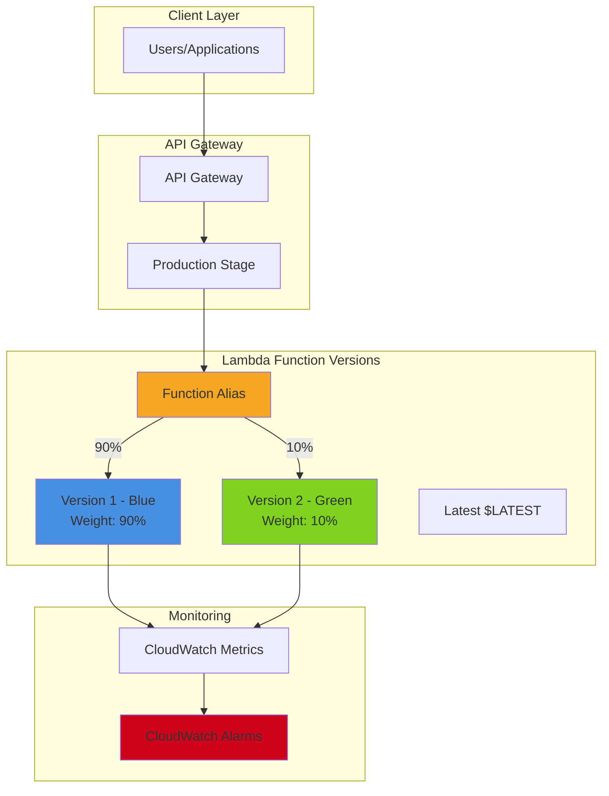

# Lambda Safe Deployments with Blue-Green and Canary

## Problem

Organizations deploying Lambda functions face significant challenges when updating production workloads. Traditional deployments can cause downtime, service disruptions, and difficulty rolling back problematic releases. Development teams need safe deployment strategies that minimize risk while maintaining high availability. Without proper deployment patterns, a single faulty function update could impact thousands of users instantly with no easy recovery path.

## Solution

Implement Lambda deployment patterns using function versions, aliases, and weighted traffic routing to achieve blue-green and canary deployments. This approach leverages Lambda's built-in versioning system combined with API Gateway integration to control traffic distribution between function versions. The solution enables zero-downtime deployments, gradual traffic shifting for canary releases, and instant rollback capabilities for production safety.

## Architecture Diagram



## Prerequisites

1. AWS account with permissions for Lambda, API Gateway, CloudWatch, and IAM
2. AWS CLI v2 installed and configured (or AWS CloudShell)
3. Basic understanding of Lambda functions and API Gateway
4. Familiarity with JSON and command-line operations
5. Estimated cost: $1-5 for testing resources (Lambda invocations, API Gateway calls)

> **Note**: Ensure your Lambda execution role has CloudWatch Logs permissions for monitoring deployment health and performance metrics.

## Preparation

```bash
# Set environment variables
export AWS_REGION=$(aws configure get region)
export AWS_ACCOUNT_ID=$(aws sts get-caller-identity \
    --query Account --output text)

# Generate unique identifiers for resources
RANDOM_SUFFIX=$(aws secretsmanager get-random-password \
    --exclude-punctuation --exclude-uppercase \
    --password-length 6 --require-each-included-type \
    --output text --query RandomPassword)

export FUNCTION_NAME="deploy-patterns-demo-${RANDOM_SUFFIX}"
export API_NAME="deployment-api-${RANDOM_SUFFIX}"
export ROLE_NAME="lambda-deploy-role-${RANDOM_SUFFIX}"

echo "Function Name: $FUNCTION_NAME"
echo "API Name: $API_NAME"
echo "Role Name: $ROLE_NAME"
```

## Steps

1. **Create IAM Role for Lambda Function**:

   Lambda functions require an execution role with appropriate permissions to access AWS services and write logs. This role follows the principle of least privilege by granting only the minimum permissions needed for basic function execution and CloudWatch Logs integration.

   ```bash
   # Create trust policy for Lambda service
   cat > trust-policy.json << EOF
   {
     "Version": "2012-10-17",
     "Statement": [
       {
         "Effect": "Allow",
         "Principal": {
           "Service": "lambda.amazonaws.com"
         },
         "Action": "sts:AssumeRole"
       }
     ]
   }
   EOF
   
   # Create the IAM role
   aws iam create-role \
       --role-name $ROLE_NAME \
       --assume-role-policy-document file://trust-policy.json
   
   # Attach basic Lambda execution policy
   aws iam attach-role-policy \
       --role-name $ROLE_NAME \
       --policy-arn arn:aws:iam::aws:policy/service-role/AWSLambdaBasicExecutionRole
   
   export ROLE_ARN="arn:aws:iam::${AWS_ACCOUNT_ID}:role/${ROLE_NAME}"
   echo "✅ Created IAM role: $ROLE_ARN"
   ```

   > **Note**: The `AWSLambdaBasicExecutionRole` managed policy provides permissions for CloudWatch Logs operations essential for monitoring deployment patterns. For production functions requiring additional AWS service access, create custom policies with specific permissions rather than using overly broad managed policies.

2. **Create Initial Lambda Function (Version 1)**:

   Lambda functions serve as the core compute component in serverless architectures, providing auto-scaling execution environments without server management overhead. Creating the initial function establishes our blue environment - the stable, production-ready baseline that will serve as the foundation for our deployment patterns.

   ```bash
   # Create function code for version 1
   cat > lambda_function_v1.py << 'EOF'
   import json
   import os
   
   def lambda_handler(event, context):
       version = "1.0.0"
       message = "Hello from Lambda Version 1 - Blue Environment"
       
       return {
           'statusCode': 200,
           'headers': {
               'Content-Type': 'application/json',
               'Access-Control-Allow-Origin': '*'
           },
           'body': json.dumps({
               'version': version,
               'message': message,
               'timestamp': context.aws_request_id,
               'environment': 'blue'
           })
       }
   EOF
   
   # Package the function
   zip function-v1.zip lambda_function_v1.py
   
   # Create the Lambda function with current Python runtime
   aws lambda create-function \
       --function-name $FUNCTION_NAME \
       --runtime python3.13 \
       --role $ROLE_ARN \
       --handler lambda_function_v1.lambda_handler \
       --zip-file fileb://function-v1.zip \
       --description "Demo function for deployment patterns"
   
   # Wait for function to be ready
   aws lambda wait function-active --function-name $FUNCTION_NAME
   
   echo "✅ Created Lambda function: $FUNCTION_NAME"
   ```

   The function is now deployed and active in the AWS Lambda environment using the latest Python 3.13 runtime. This initial version represents our blue environment and serves as the stable baseline for all future deployments. The function's response structure establishes the API contract that subsequent versions must maintain for seamless traffic routing.

3. **Publish Version 1 and Create Production Alias**:

   Function versioning creates immutable snapshots of Lambda code and configuration, while aliases provide mutable pointers that enable traffic routing between versions. This combination forms the foundation of safe deployment practices by separating code deployment from traffic routing decisions, enabling sophisticated deployment patterns.

   ```bash
   # Publish version 1
   VERSION_1=$(aws lambda publish-version \
       --function-name $FUNCTION_NAME \
       --description "Initial production version" \
       --query Version --output text)
   
   # Create production alias pointing to version 1
   aws lambda create-alias \
       --function-name $FUNCTION_NAME \
       --name production \
       --function-version $VERSION_1 \
       --description "Production alias for blue-green deployments"
   
   export PRODUCTION_ALIAS_ARN="arn:aws:lambda:${AWS_REGION}:${AWS_ACCOUNT_ID}:function:${FUNCTION_NAME}:production"
   
   echo "✅ Created version $VERSION_1 and production alias"
   ```

   Version 1 is now published as an immutable artifact, and the production alias provides a stable endpoint for traffic routing. This setup enables us to deploy new versions without affecting production traffic until we explicitly update the alias routing configuration, providing the foundation for both canary and blue-green deployment patterns.

4. **Create API Gateway Integration**:

   API Gateway serves as the front door for our Lambda-based microservices, providing HTTP endpoints, request/response transformation, and integration management. Creating a RESTful API establishes the public interface that clients will use to access our Lambda functions regardless of the underlying deployment patterns.

   ```bash
   # Create REST API
   API_ID=$(aws apigateway create-rest-api \
       --name $API_NAME \
       --description "API for Lambda deployment patterns demo" \
       --query id --output text)
   
   # Get root resource ID
   ROOT_RESOURCE_ID=$(aws apigateway get-resources \
       --rest-api-id $API_ID \
       --query 'items[?path==`/`].id' --output text)
   
   # Create resource for deployment demo
   RESOURCE_ID=$(aws apigateway create-resource \
       --rest-api-id $API_ID \
       --parent-id $ROOT_RESOURCE_ID \
       --path-part demo \
       --query id --output text)
   
   # Create GET method
   aws apigateway put-method \
       --rest-api-id $API_ID \
       --resource-id $RESOURCE_ID \
       --http-method GET \
       --authorization-type NONE
   
   echo "✅ Created API Gateway: $API_ID"
   ```

   The API Gateway is now configured with a structured resource hierarchy that supports our deployment demonstration. This REST API provides the stable external interface while the underlying Lambda integration can be modified to support different deployment patterns without affecting client applications or requiring API redeployments.

5. **Configure Lambda Integration with Production Alias**:

   Integrating API Gateway with Lambda aliases rather than specific function versions enables dynamic traffic routing without modifying API configurations. The AWS_PROXY integration type provides seamless request/response handling while the production alias abstracts the underlying version complexity from the API layer.

   ```bash
   # Set up Lambda integration using the production alias
   aws apigateway put-integration \
       --rest-api-id $API_ID \
       --resource-id $RESOURCE_ID \
       --http-method GET \
       --type AWS_PROXY \
       --integration-http-method POST \
       --uri "arn:aws:apigateway:${AWS_REGION}:lambda:path/2015-03-31/functions/${PRODUCTION_ALIAS_ARN}/invocations"
   
   # Configure method response
   aws apigateway put-method-response \
       --rest-api-id $API_ID \
       --resource-id $RESOURCE_ID \
       --http-method GET \
       --status-code 200
   
   # Grant API Gateway permission to invoke Lambda function
   aws lambda add-permission \
       --function-name $FUNCTION_NAME \
       --qualifier production \
       --statement-id api-gateway-invoke-permission \
       --action lambda:InvokeFunction \
       --principal apigateway.amazonaws.com \
       --source-arn "arn:aws:execute-api:${AWS_REGION}:${AWS_ACCOUNT_ID}:${API_ID}/*/*"
   
   echo "✅ Configured Lambda integration with production alias"
   ```

   The integration is now complete with proper permissions and proxy configuration. API Gateway can invoke our Lambda function through the production alias, which will route requests to the appropriate version based on our deployment strategy. This architecture supports both blue-green and canary deployment patterns while maintaining API stability.

6. **Deploy API and Test Version 1**:

   API Gateway deployments create immutable snapshots of API configuration and make them available at specific stage endpoints. Deploying to a production stage establishes the live environment where our deployment patterns will be demonstrated and validated against real traffic.

   ```bash
   # Deploy API to prod stage
   aws apigateway create-deployment \
       --rest-api-id $API_ID \
       --stage-name prod \
       --description "Initial deployment with version 1"
   
   # Get API endpoint URL
   export API_URL="https://${API_ID}.execute-api.${AWS_REGION}.amazonaws.com/prod/demo"
   
   echo "API URL: $API_URL"
   
   # Test the deployment
   echo "Testing Version 1 deployment:"
   curl -s $API_URL | jq .
   
   echo "✅ API deployed and tested successfully"
   ```

   The API is now live and responding with Version 1 content. This baseline deployment provides the stable foundation for implementing advanced deployment patterns. The JSON response structure includes version information that will help us verify traffic routing during subsequent canary and blue-green deployments.

7. **Create Version 2 for Canary Deployment**:

   Function versions in Lambda are immutable snapshots of your function code and configuration. Creating a new version enables safe deployment testing while maintaining the ability to route traffic between different code versions, supporting both canary testing and eventual blue-green promotion strategies.

   ```bash
   # Create function code for version 2
   cat > lambda_function_v2.py << 'EOF'
   import json
   import os
   
   def lambda_handler(event, context):
       version = "2.0.0"
       message = "Hello from Lambda Version 2 - Green Environment with NEW FEATURES!"
       
       return {
           'statusCode': 200,
           'headers': {
               'Content-Type': 'application/json',
               'Access-Control-Allow-Origin': '*'
           },
           'body': json.dumps({
               'version': version,
               'message': message,
               'timestamp': context.aws_request_id,
               'environment': 'green',
               'features': ['enhanced_logging', 'improved_performance']
           })
       }
   EOF
   
   # Package version 2
   zip function-v2.zip lambda_function_v2.py
   
   # Update function code
   aws lambda update-function-code \
       --function-name $FUNCTION_NAME \
       --zip-file fileb://function-v2.zip
   
   # Wait for update to complete
   aws lambda wait function-updated --function-name $FUNCTION_NAME
   
   # Publish version 2
   VERSION_2=$(aws lambda publish-version \
       --function-name $FUNCTION_NAME \
       --description "Version 2 with new features" \
       --query Version --output text)
   
   echo "✅ Created and published version $VERSION_2"
   ```

   Version 2 is now available as an immutable deployment artifact alongside Version 1. Both versions coexist independently, enabling us to implement sophisticated traffic routing strategies. The green environment is ready for canary testing and eventual promotion to full production traffic based on performance metrics and business requirements.

8. **Implement Canary Deployment (10% Traffic to Version 2)**:

   Canary deployments gradually shift production traffic to new versions, allowing real-world validation with minimal risk exposure. Lambda aliases support weighted routing to distribute traffic between function versions based on specified percentages, enabling sophisticated deployment strategies that balance risk and validation needs.

   ```bash
   # Update production alias with weighted routing
   # 90% traffic to version 1, 10% to version 2 (canary)
   aws lambda update-alias \
       --function-name $FUNCTION_NAME \
       --name production \
       --function-version $VERSION_2 \
       --routing-config "AdditionalVersionWeights={\"$VERSION_1\"=0.9}"
   
   echo "✅ Canary deployment configured: 90% v1, 10% v2"
   
   # Test canary deployment multiple times
   echo "Testing canary deployment (should see ~10% version 2 responses):"
   for i in {1..10}; do
       echo "Request $i:"
       curl -s $API_URL | jq -r '.body' | jq -r '.version + " - " + .environment'
       sleep 1
   done
   ```

   This weighted routing configuration enables real-world validation of Version 2 with minimal risk exposure. The alias now intelligently distributes traffic between versions using Lambda's probabilistic routing model, providing production data for performance and stability assessment before full deployment. This approach follows AWS best practices for canary deployments.

   > **Warning**: Monitor canary deployments closely through CloudWatch metrics. Set up alarms for error rates, latency, and other key performance indicators to detect issues before they affect a significant portion of your traffic. Have rollback procedures ready in case problems are detected. See the [AWS Lambda monitoring documentation](https://docs.aws.amazon.com/lambda/latest/dg/monitoring-metrics.html) for comprehensive guidance.

9. **Monitor Deployment with CloudWatch Metrics**:

   CloudWatch provides comprehensive observability for Lambda functions, capturing invocation metrics, error rates, duration, and custom metrics across all function versions. Implementing proactive monitoring during deployments enables data-driven decisions about traffic promotion and rollback scenarios, essential for production deployment patterns.

   ```bash
   # Create CloudWatch alarm for error rate monitoring
   aws cloudwatch put-metric-alarm \
       --alarm-name "${FUNCTION_NAME}-error-rate" \
       --alarm-description "Monitor Lambda function error rate" \
       --metric-name Errors \
       --namespace AWS/Lambda \
       --statistic Sum \
       --period 300 \
       --threshold 5 \
       --comparison-operator GreaterThanThreshold \
       --evaluation-periods 2 \
       --dimensions Name=FunctionName,Value=$FUNCTION_NAME
   
   # Get recent metrics for both versions
   echo "Recent invocation metrics:"
   aws cloudwatch get-metric-statistics \
       --namespace AWS/Lambda \
       --metric-name Invocations \
       --dimensions Name=FunctionName,Value=$FUNCTION_NAME \
       --start-time $(date -u -d '10 minutes ago' +%Y-%m-%dT%H:%M:%S) \
       --end-time $(date -u +%Y-%m-%dT%H:%M:%S) \
       --period 300 \
       --statistics Sum \
       --query 'Datapoints[0].Sum'
   
   echo "✅ CloudWatch monitoring configured"
   ```

   Monitoring infrastructure is now in place to track deployment health and performance characteristics across both function versions. The error rate alarm provides automated detection of issues that might require rollback, while metrics collection enables comparison between function versions during canary phases, supporting data-driven deployment decisions.

10. **Complete Blue-Green Deployment (100% Traffic to Version 2)**:

    Blue-green deployment completion involves promoting the green environment (Version 2) to receive all production traffic, effectively making it the new blue environment. This binary switch provides immediate rollback capability while ensuring zero-downtime transitions between major releases, following AWS Well-Architected reliability principles.

    ```bash
    # Promote version 2 to receive 100% of traffic
    aws lambda update-alias \
        --function-name $FUNCTION_NAME \
        --name production \
        --function-version $VERSION_2 \
        --routing-config '{}'
    
    echo "✅ Blue-green deployment completed: 100% traffic to v2"
    
    # Verify full deployment
    echo "Testing full deployment to version 2:"
    for i in {1..5}; do
        echo "Request $i:"
        curl -s $API_URL | jq -r '.body' | jq -r '.version + " - " + .environment'
        sleep 1
    done
    ```

    The deployment is now complete with 100% of traffic routed to Version 2. The previous Version 1 remains available for instant rollback if issues are detected. This blue-green pattern provides the confidence to deploy major changes while maintaining high availability and fast recovery capabilities essential for production systems.

11. **Implement Rollback Capability**:

    Rollback capability is essential for production resilience, enabling immediate reversion to stable versions when issues are detected. Lambda aliases provide instant rollback through simple alias updates, without requiring new deployments or code changes. This capability is crucial for maintaining service availability during incident response and follows AWS operational excellence principles.

    ```bash
    # Demonstrate instant rollback to version 1
    echo "Simulating rollback to version 1..."
    aws lambda update-alias \
        --function-name $FUNCTION_NAME \
        --name production \
        --function-version $VERSION_1 \
        --routing-config '{}'
    
    echo "✅ Rollback completed"
    
    # Test rollback
    echo "Testing rollback:"
    curl -s $API_URL | jq -r '.body' | jq -r '.version + " - " + .environment'
    
    # Restore to version 2 for cleanup
    aws lambda update-alias \
        --function-name $FUNCTION_NAME \
        --name production \
        --function-version $VERSION_2 \
        --routing-config '{}'
    
    echo "✅ Restored to version 2"
    ```

    Rollback testing demonstrates the power of alias-based deployment patterns. The ability to instantly switch between versions provides confidence for deploying changes and ensures rapid recovery from any issues. This capability is fundamental to DevOps practices and continuous deployment strategies, enabling teams to deploy with confidence.

## Validation & Testing

1. **Verify Lambda Function Versions and Alias**:

   ```bash
   # List all function versions
   aws lambda list-versions-by-function \
       --function-name $FUNCTION_NAME \
       --query 'Versions[?Version!=`$LATEST`].[Version,Description]' \
       --output table
   
   # Check production alias configuration
   aws lambda get-alias \
       --function-name $FUNCTION_NAME \
       --name production
   ```

   Expected output: Shows versions 1 and 2 with production alias pointing to version 2

2. **Test API Gateway Integration**:

   ```bash
   # Test API response structure
   curl -s $API_URL | jq .
   
   # Verify response headers
   curl -I $API_URL
   ```

   Expected output: JSON response with version 2 data and proper HTTP headers

3. **Validate CloudWatch Metrics**:

   ```bash
   # Check invocation metrics
   aws cloudwatch get-metric-statistics \
       --namespace AWS/Lambda \
       --metric-name Invocations \
       --dimensions Name=FunctionName,Value=$FUNCTION_NAME \
       --start-time $(date -u -d '15 minutes ago' +%Y-%m-%dT%H:%M:%S) \
       --end-time $(date -u +%Y-%m-%dT%H:%M:%S) \
       --period 300 \
       --statistics Sum
   
   # Check error metrics
   aws cloudwatch get-metric-statistics \
       --namespace AWS/Lambda \
       --metric-name Errors \
       --dimensions Name=FunctionName,Value=$FUNCTION_NAME \
       --start-time $(date -u -d '15 minutes ago' +%Y-%m-%dT%H:%M:%S) \
       --end-time $(date -u +%Y-%m-%dT%H:%M:%S) \
       --period 300 \
       --statistics Sum
   ```

## Cleanup

1. **Remove API Gateway Resources**:

   ```bash
   # Delete API Gateway
   aws apigateway delete-rest-api --rest-api-id $API_ID
   
   echo "✅ Deleted API Gateway"
   ```

2. **Delete Lambda Function and Versions**:

   ```bash
   # Delete production alias
   aws lambda delete-alias \
       --function-name $FUNCTION_NAME \
       --name production
   
   # Delete the function (this removes all versions)
   aws lambda delete-function --function-name $FUNCTION_NAME
   
   echo "✅ Deleted Lambda function and all versions"
   ```

3. **Remove CloudWatch Alarm**:

   ```bash
   # Delete CloudWatch alarm
   aws cloudwatch delete-alarms \
       --alarm-names "${FUNCTION_NAME}-error-rate"
   
   echo "✅ Deleted CloudWatch alarm"
   ```

4. **Delete IAM Role**:

   ```bash
   # Detach policy from role
   aws iam detach-role-policy \
       --role-name $ROLE_NAME \
       --policy-arn arn:aws:iam::aws:policy/service-role/AWSLambdaBasicExecutionRole
   
   # Delete IAM role
   aws iam delete-role --role-name $ROLE_NAME
   
   echo "✅ Deleted IAM role"
   ```

5. **Clean up local files**:

   ```bash
   # Remove temporary files
   rm -f trust-policy.json lambda_function_v*.py function-v*.zip
   
   echo "✅ Cleaned up local files"
   ```

## Discussion

This recipe demonstrates sophisticated Lambda deployment patterns that enable zero-downtime deployments and gradual rollout strategies following AWS Well-Architected Framework principles. The key architectural decision involves using Lambda function versions and aliases to create immutable deployment artifacts while maintaining flexible traffic routing capabilities essential for modern serverless applications.

**Blue-Green Deployments** provide immediate switching between stable environments, offering instant rollback capabilities when issues are detected. This pattern is ideal for major releases where you want to validate the entire deployment before exposing users to changes. The alias mechanism allows seamless switching without changing API Gateway configurations or client code, supporting the AWS operational excellence pillar through simplified operations and fast recovery.

**Canary Deployments** offer a more conservative approach by gradually shifting traffic percentages to new versions. This strategy enables real-world testing with a subset of production traffic, allowing teams to monitor metrics, error rates, and performance characteristics before full deployment. The weighted routing feature makes this pattern particularly powerful for risk-averse organizations while supporting data-driven deployment decisions based on real performance metrics.

**Monitoring Integration** is crucial for successful deployment patterns and aligns with AWS observability best practices. CloudWatch metrics provide visibility into function performance, error rates, and invocation patterns across different versions. Setting up automated alarms ensures rapid detection of issues during canary phases, enabling quick rollback decisions before problems affect the majority of users. This approach supports both the reliability and performance efficiency pillars of the Well-Architected Framework.

> **Tip**: Consider implementing automated rollback triggers based on CloudWatch alarms that can automatically revert to the previous version when error thresholds are exceeded. See the [AWS Lambda deployment best practices documentation](https://docs.aws.amazon.com/lambda/latest/dg/best-practices.html) for comprehensive guidance.

> **Note**: Function versions are immutable in Lambda, ensuring that deployed code cannot be accidentally modified. This immutability is fundamental to reliable deployment patterns and audit compliance, supporting both security and operational excellence pillars.

> **Tip**: Use AWS SAM or CDK for production deployments to manage the entire deployment pipeline including automated testing, gradual traffic shifting, and rollback automation. See the [AWS SAM documentation](https://docs.aws.amazon.com/serverless-application-model/latest/developerguide/automating-updates-to-serverless-apps.html) for automated deployment patterns and the [AWS Lambda alias routing documentation](https://docs.aws.amazon.com/lambda/latest/dg/configuring-alias-routing.html) for advanced traffic routing strategies.

## Challenge

Extend this solution by implementing these enhancements:

1. **Automated Deployment Pipeline**: Integrate with AWS CodePipeline and CodeDeploy for Lambda to automate the entire deployment process including automated testing, canary analysis, and promotion decisions based on CloudWatch metrics.

2. **Advanced Monitoring**: Implement custom CloudWatch metrics and AWS X-Ray tracing to monitor version-specific performance characteristics, latency distributions, and detailed error analysis during deployments for better observability.

3. **Multi-Environment Strategy**: Extend the pattern to support development, staging, and production environments with different deployment strategies and approval gates between environments using AWS Organizations and cross-account deployments.

4. **Configuration Management**: Add AWS Systems Manager Parameter Store or AWS Secrets Manager integration to manage environment-specific configurations that change between versions without code modifications, supporting the security pillar.

5. **Chaos Engineering**: Implement fault injection testing during canary deployments to validate system resilience and automated rollback mechanisms under adverse conditions using AWS Fault Injection Simulator.

## Infrastructure Code

### Available Infrastructure as Code:

- [Infrastructure Code Overview](code/README.md) - Detailed description of all infrastructure components
- [AWS CDK (Python)](code/cdk-python/) - AWS CDK Python implementation
- [AWS CDK (TypeScript)](code/cdk-typescript/) - AWS CDK TypeScript implementation
- [CloudFormation](code/cloudformation.yaml) - AWS CloudFormation template
- [Bash CLI Scripts](code/scripts/) - Example bash scripts using AWS CLI commands to deploy infrastructure
- [Terraform](code/terraform/) - Terraform configuration files