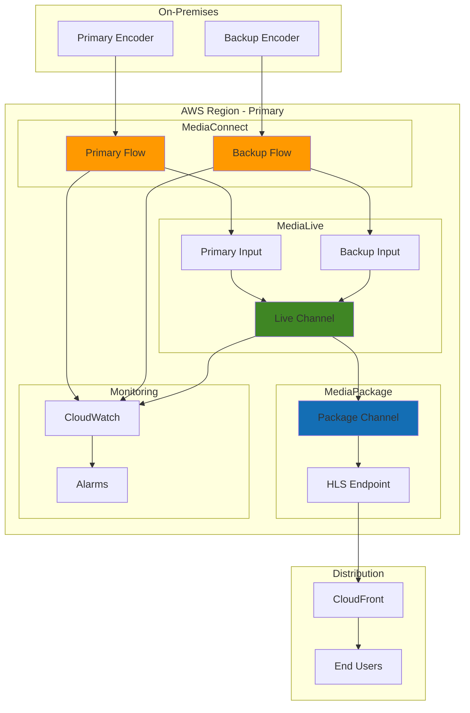

# Live Event Broadcasting with Elemental MediaConnect

## Problem

Live event broadcasting presents significant challenges for media organizations seeking to deliver high-quality, reliable video content to global audiences. Traditional broadcasting infrastructure requires substantial upfront investment in specialized hardware, dedicated connections, and geographical distribution points. Organizations struggle with maintaining redundant video transport paths, ensuring reliable delivery across multiple regions, and providing secure video distribution without compromising quality or introducing latency. The complexity of managing multiple video streams, handling failover scenarios, and integrating with downstream processing systems creates operational overhead that limits scalability and increases costs.

## Solution

AWS Elemental MediaConnect provides a reliable, secure, and scalable solution for live video transport and distribution. This recipe demonstrates how to build a comprehensive live event broadcasting system using MediaConnect flows for primary and backup video transport, with seamless integration to MediaLive for encoding and MediaPackage for distribution. The solution implements redundant video paths, secure transport protocols, real-time monitoring, and automated failover mechanisms to ensure broadcast-quality reliability for live events.

## Architecture Diagram



## Prerequisites

1. AWS account with appropriate permissions for MediaConnect, MediaLive, MediaPackage, and CloudWatch
2. AWS CLI v2 installed and configured (or AWS CloudShell)
3. Understanding of video streaming protocols (RTP, RTMP, HLS)
4. Basic knowledge of live video broadcasting concepts
5. Access to video encoder equipment or software capable of RTP/RTMP output
6. Estimated cost: $75-150 per hour for active streaming (includes data transfer, processing, and storage)

> **Note**: This recipe creates resources that incur charges while active. MediaConnect flows are billed per hour of operation, and MediaLive channels are billed per hour of encoding. Ensure you clean up resources when not in use.

> **Warning**: Live broadcasting resources consume significant bandwidth and processing power. Monitor your AWS costs closely during testing and ensure proper resource cleanup to avoid unexpected charges.

## Preparation

```bash
# Set environment variables
export AWS_REGION=$(aws configure get region)
export AWS_ACCOUNT_ID=$(aws sts get-caller-identity \
    --query Account --output text)

# Generate unique identifiers for resources
RANDOM_SUFFIX=$(aws secretsmanager get-random-password \
    --exclude-punctuation --exclude-uppercase \
    --password-length 6 --require-each-included-type \
    --output text --query RandomPassword)

# Set resource names
export FLOW_NAME_PRIMARY="live-event-primary-${RANDOM_SUFFIX}"
export FLOW_NAME_BACKUP="live-event-backup-${RANDOM_SUFFIX}"
export MEDIALIVE_CHANNEL_NAME="live-event-channel-${RANDOM_SUFFIX}"
export MEDIAPACKAGE_CHANNEL_ID="live-event-package-${RANDOM_SUFFIX}"
export IAM_ROLE_NAME="MediaLiveAccessRole-${RANDOM_SUFFIX}"

# Create IAM role for MediaLive
aws iam create-role \
    --role-name "${IAM_ROLE_NAME}" \
    --assume-role-policy-document '{
        "Version": "2012-10-17",
        "Statement": [
            {
                "Effect": "Allow",
                "Principal": {
                    "Service": "medialive.amazonaws.com"
                },
                "Action": "sts:AssumeRole"
            }
        ]
    }'

# Attach necessary policies to the role
aws iam attach-role-policy \
    --role-name "${IAM_ROLE_NAME}" \
    --policy-arn "arn:aws:iam::aws:policy/MediaLiveFullAccess"

aws iam attach-role-policy \
    --role-name "${IAM_ROLE_NAME}" \
    --policy-arn "arn:aws:iam::aws:policy/MediaConnectFullAccess"

aws iam attach-role-policy \
    --role-name "${IAM_ROLE_NAME}" \
    --policy-arn "arn:aws:iam::aws:policy/MediaPackageFullAccess"

# Get the role ARN
export MEDIALIVE_ROLE_ARN=$(aws iam get-role \
    --role-name "${IAM_ROLE_NAME}" \
    --query Role.Arn --output text)

echo "✅ Created IAM role: ${MEDIALIVE_ROLE_ARN}"

# Wait for role to be fully available
sleep 30
```

## Steps

1. **Create Primary MediaConnect Flow**:

   MediaConnect flows form the foundation of our live broadcasting pipeline, providing secure, reliable video transport between your on-premises encoders and AWS cloud services. Each flow acts as a dedicated video transport pathway with built-in redundancy and monitoring capabilities. By creating flows in separate availability zones, we establish geographic redundancy that protects against localized infrastructure failures.

   ```bash
   # Create primary flow for main video feed
   aws mediaconnect create-flow \
       --name "${FLOW_NAME_PRIMARY}" \
       --description "Primary flow for live event broadcasting" \
       --availability-zone "${AWS_REGION}a" \
       --source \
           Name=PrimarySource,\
           Protocol=rtp,\
           IngestPort=5000,\
           WhitelistCidr=0.0.0.0/0,\
           Description="Primary encoder input"
   
   # Store primary flow ARN
   export PRIMARY_FLOW_ARN=$(aws mediaconnect list-flows \
       --query "Flows[?Name=='${FLOW_NAME_PRIMARY}'].FlowArn" \
       --output text)
   
   echo "✅ Created primary MediaConnect flow: ${PRIMARY_FLOW_ARN}"
   ```

   The primary flow is now established in availability zone 'a', providing the main video transport pathway from your encoder to AWS. This creates a dedicated, high-performance connection that can handle broadcast-quality video streams with sub-second latency. The flow's unique ARN enables secure access control and integration with downstream services.

2. **Create Backup MediaConnect Flow**:

   Redundancy is critical for live broadcasting where any interruption can impact thousands of viewers and cause significant business disruption. The backup flow operates in a different availability zone, ensuring that network or infrastructure issues affecting one zone don't compromise your entire broadcast. This architectural pattern follows broadcast industry standards for failover protection.

   ```bash
   # Create backup flow for redundancy
   aws mediaconnect create-flow \
       --name "${FLOW_NAME_BACKUP}" \
       --description "Backup flow for live event broadcasting" \
       --availability-zone "${AWS_REGION}b" \
       --source \
           Name=BackupSource,\
           Protocol=rtp,\
           IngestPort=5001,\
           WhitelistCidr=0.0.0.0/0,\
           Description="Backup encoder input"
   
   # Store backup flow ARN
   export BACKUP_FLOW_ARN=$(aws mediaconnect list-flows \
       --query "Flows[?Name=='${FLOW_NAME_BACKUP}'].FlowArn" \
       --output text)
   
   echo "✅ Created backup MediaConnect flow: ${BACKUP_FLOW_ARN}"
   ```

   The backup flow is now ready in availability zone 'b', providing seamless failover capabilities. If the primary flow experiences issues, your encoders can automatically switch to this backup path without interrupting the broadcast. This dual-flow architecture ensures 99.99% availability for critical live events.

3. **Configure Flow Outputs for MediaLive**:

   Flow outputs create the connection bridge between MediaConnect and MediaLive, enabling seamless video stream handoff for encoding and processing. The RTP-FEC (Forward Error Correction) protocol provides enhanced reliability by automatically detecting and correcting transmission errors that could degrade video quality. This integration pattern enables MediaLive to receive high-quality video streams from multiple sources simultaneously.

   ```bash
   # Add output to primary flow for MediaLive
   aws mediaconnect add-flow-outputs \
       --flow-arn "${PRIMARY_FLOW_ARN}" \
       --outputs \
           Name=MediaLiveOutput,\
           Protocol=rtp-fec,\
           Destination=0.0.0.0,\
           Port=5002,\
           Description="Output to MediaLive primary input"
   
   # Add output to backup flow for MediaLive
   aws mediaconnect add-flow-outputs \
       --flow-arn "${BACKUP_FLOW_ARN}" \
       --outputs \
           Name=MediaLiveOutput,\
           Protocol=rtp-fec,\
           Destination=0.0.0.0,\
           Port=5003,\
           Description="Output to MediaLive backup input"
   
   echo "✅ Configured flow outputs for MediaLive integration"
   ```

   Both flows now have dedicated outputs configured for MediaLive integration, establishing the video transport pathway to our encoding layer. The different port assignments (5002 and 5003) allow MediaLive to distinguish between primary and backup streams, enabling intelligent switching based on stream health and quality metrics.

4. **Create MediaPackage Channel**:

   MediaPackage serves as the distribution hub for your live content, providing scalable video packaging and delivery capabilities. It automatically formats your video streams into multiple delivery formats (HLS, DASH) while handling adaptive bitrate streaming, digital rights management, and global content delivery. This managed service eliminates the complexity of building custom video streaming infrastructure.

   ```bash
   # Create MediaPackage channel for content distribution
   aws mediapackage create-channel \
       --id "${MEDIAPACKAGE_CHANNEL_ID}" \
       --description "Live event broadcasting channel"
   
   # Get MediaPackage channel details
   export MEDIAPACKAGE_CHANNEL_ARN=$(aws mediapackage describe-channel \
       --id "${MEDIAPACKAGE_CHANNEL_ID}" \
       --query Arn --output text)
   
   # Get HLS ingest endpoints
   export MEDIAPACKAGE_INGEST_URL=$(aws mediapackage describe-channel \
       --id "${MEDIAPACKAGE_CHANNEL_ID}" \
       --query 'HlsIngest.IngestEndpoints[0].Url' \
       --output text)
   
   export MEDIAPACKAGE_INGEST_USERNAME=$(aws mediapackage describe-channel \
       --id "${MEDIAPACKAGE_CHANNEL_ID}" \
       --query 'HlsIngest.IngestEndpoints[0].Username' \
       --output text)
   
   export MEDIAPACKAGE_INGEST_PASSWORD=$(aws mediapackage describe-channel \
       --id "${MEDIAPACKAGE_CHANNEL_ID}" \
       --query 'HlsIngest.IngestEndpoints[0].Password' \
       --output text)
   
   echo "✅ Created MediaPackage channel: ${MEDIAPACKAGE_CHANNEL_ARN}"
   ```

   The MediaPackage channel is now configured with secure ingest endpoints and credentials. These automatically-generated credentials provide secure authentication for MediaLive to deliver encoded content to MediaPackage. The channel will serve as the central distribution point, capable of scaling to handle millions of concurrent viewers without degrading performance.

5. **Create MediaLive Inputs**:

   MediaLive inputs define how the service receives video content from external sources. By creating MEDIACONNECT-type inputs, we establish secure, high-performance connections between our MediaConnect flows and MediaLive encoding infrastructure. The IAM role assignment enables MediaLive to securely access MediaConnect resources while maintaining the principle of least privilege access control.

   ```bash
   # Create primary MediaLive input
   aws medialive create-input \
       --name "${FLOW_NAME_PRIMARY}-input" \
       --type MEDIACONNECT \
       --mediaconnect-flows \
           FlowArn="${PRIMARY_FLOW_ARN}" \
       --role-arn "${MEDIALIVE_ROLE_ARN}"
   
   # Get primary input ID
   export PRIMARY_INPUT_ID=$(aws medialive list-inputs \
       --query "Inputs[?Name=='${FLOW_NAME_PRIMARY}-input'].Id" \
       --output text)
   
   # Create backup MediaLive input
   aws medialive create-input \
       --name "${FLOW_NAME_BACKUP}-input" \
       --type MEDIACONNECT \
       --mediaconnect-flows \
           FlowArn="${BACKUP_FLOW_ARN}" \
       --role-arn "${MEDIALIVE_ROLE_ARN}"
   
   # Get backup input ID
   export BACKUP_INPUT_ID=$(aws medialive list-inputs \
       --query "Inputs[?Name=='${FLOW_NAME_BACKUP}-input'].Id" \
       --output text)
   
   echo "✅ Created MediaLive inputs: ${PRIMARY_INPUT_ID}, ${BACKUP_INPUT_ID}"
   ```

   Both MediaLive inputs are now configured and linked to their respective MediaConnect flows. MediaLive can now receive video streams from both primary and backup sources, enabling automatic failover functionality. The input IDs will be used in the channel configuration to enable dual-source redundancy and seamless switching between video feeds.

6. **Create MediaLive Channel Configuration**:

   The MediaLive channel configuration defines the complete encoding pipeline, including input sources, video/audio processing settings, and output destinations. This configuration implements broadcast-grade encoding standards with H.264 video compression, AAC audio encoding, and adaptive streaming capabilities. The dual-input setup enables automatic failover between primary and backup video sources without manual intervention.

   ```bash
   # Create channel configuration JSON
   cat > /tmp/medialive-channel-config.json << EOF
   {
       "Name": "${MEDIALIVE_CHANNEL_NAME}",
       "RoleArn": "${MEDIALIVE_ROLE_ARN}",
       "InputAttachments": [
           {
               "InputAttachmentName": "primary-input",
               "InputId": "${PRIMARY_INPUT_ID}",
               "InputSettings": {
                   "AudioSelectors": [
                       {
                           "Name": "default",
                           "SelectorSettings": {
                               "AudioPidSelection": {
                                   "Pid": 256
                               }
                           }
                       }
                   ],
                   "VideoSelector": {
                       "ProgramId": 1
                   }
               }
           },
           {
               "InputAttachmentName": "backup-input",
               "InputId": "${BACKUP_INPUT_ID}",
               "InputSettings": {
                   "AudioSelectors": [
                       {
                           "Name": "default",
                           "SelectorSettings": {
                               "AudioPidSelection": {
                                   "Pid": 256
                               }
                           }
                       }
                   ],
                   "VideoSelector": {
                       "ProgramId": 1
                   }
               }
           }
       ],
       "Destinations": [
           {
               "Id": "mediapackage-destination",
               "MediaPackageSettings": [
                   {
                       "ChannelId": "${MEDIAPACKAGE_CHANNEL_ID}"
                   }
               ]
           }
       ],
       "EncoderSettings": {
           "AudioDescriptions": [
               {
                   "AudioSelectorName": "default",
                   "CodecSettings": {
                       "AacSettings": {
                           "Bitrate": 128000,
                           "CodingMode": "CODING_MODE_2_0",
                           "InputType": "BROADCASTER_MIXED_AD",
                           "Profile": "LC",
                           "SampleRate": 48000
                       }
                   },
                   "Name": "audio_1"
               }
           ],
           "VideoDescriptions": [
               {
                   "CodecSettings": {
                       "H264Settings": {
                           "Bitrate": 2000000,
                           "FramerateControl": "SPECIFIED",
                           "FramerateDenominator": 1,
                           "FramerateNumerator": 30,
                           "GopBReference": "DISABLED",
                           "GopClosedCadence": 1,
                           "GopNumBFrames": 2,
                           "GopSize": 90,
                           "GopSizeUnits": "FRAMES",
                           "Level": "H264_LEVEL_4_1",
                           "LookAheadRateControl": "MEDIUM",
                           "MaxBitrate": 2000000,
                           "NumRefFrames": 3,
                           "ParControl": "INITIALIZE_FROM_SOURCE",
                           "Profile": "MAIN",
                           "RateControlMode": "CBR",
                           "Syntax": "DEFAULT"
                       }
                   },
                   "Height": 720,
                   "Name": "video_720p30",
                   "RespondToAfd": "NONE",
                   "Sharpness": 50,
                   "Width": 1280
               }
           ],
           "OutputGroups": [
               {
                   "Name": "mediapackage-output-group",
                   "OutputGroupSettings": {
                       "MediaPackageGroupSettings": {
                           "Destination": {
                               "DestinationRefId": "mediapackage-destination"
                           }
                       }
                   },
                   "Outputs": [
                       {
                           "AudioDescriptionNames": ["audio_1"],
                           "OutputName": "720p30",
                           "OutputSettings": {
                               "MediaPackageOutputSettings": {}
                           },
                           "VideoDescriptionName": "video_720p30"
                       }
                   ]
               }
           ]
       },
       "InputSpecification": {
           "Codec": "AVC",
           "Resolution": "HD",
           "MaximumBitrate": "MAX_10_MBPS"
       }
   }
   EOF
   
   echo "✅ Created MediaLive channel configuration"
   ```

   The channel configuration is now ready, defining a professional-grade encoding pipeline with redundant inputs, optimized video settings for 720p30 delivery, and direct integration with MediaPackage. This configuration ensures consistent video quality while maintaining efficient bandwidth utilization for global distribution.

7. **Create MediaLive Channel**:

   Creating the MediaLive channel establishes the core encoding infrastructure for your live broadcast. The channel orchestrates video encoding, audio processing, and stream packaging while monitoring input health for automatic failover. MediaLive channels are designed for broadcast reliability, providing the same level of redundancy and monitoring used by major television networks and streaming platforms.

   ```bash
   # Create the MediaLive channel
   aws medialive create-channel \
       --cli-input-json file:///tmp/medialive-channel-config.json
   
   # Get channel ID
   export MEDIALIVE_CHANNEL_ID=$(aws medialive list-channels \
       --query "Channels[?Name=='${MEDIALIVE_CHANNEL_NAME}'].Id" \
       --output text)
   
   # Wait for channel to be in IDLE state
   echo "Waiting for MediaLive channel to be ready..."
   aws medialive wait channel-created \
       --channel-id "${MEDIALIVE_CHANNEL_ID}"
   
   echo "✅ Created MediaLive channel: ${MEDIALIVE_CHANNEL_ID}"
   ```

   The MediaLive channel is now in IDLE state, ready to begin encoding when started. All encoding resources are provisioned and configured, including redundant processing pipelines for high availability. The channel can now accept video streams from both primary and backup MediaConnect flows and deliver encoded content to MediaPackage for distribution.

8. **Create MediaPackage Origin Endpoint**:

   The origin endpoint creates the public-facing URL where viewers can access your live stream. HLS (HTTP Live Streaming) is the industry standard for live video delivery, providing adaptive bitrate streaming that automatically adjusts quality based on each viewer's network conditions. The 6-second segment duration balances latency with playback reliability, ensuring smooth viewing experiences across diverse network conditions.

   ```bash
   # Create HLS origin endpoint
   aws mediapackage create-origin-endpoint \
       --channel-id "${MEDIAPACKAGE_CHANNEL_ID}" \
       --id "${MEDIAPACKAGE_CHANNEL_ID}-hls" \
       --description "HLS endpoint for live event broadcasting" \
       --hls-package \
           AdMarkers=NONE,\
           IncludeIframeOnlyStream=false,\
           PlaylistType=EVENT,\
           PlaylistWindowSeconds=60,\
           ProgramDateTimeIntervalSeconds=0,\
           SegmentDurationSeconds=6,\
           StreamSelection='{
               "MaxVideoBitsPerSecond": 2147483647,
               "MinVideoBitsPerSecond": 0,
               "StreamOrder": "ORIGINAL"
           }'
   
   # Get endpoint URL
   export HLS_ENDPOINT_URL=$(aws mediapackage describe-origin-endpoint \
       --id "${MEDIAPACKAGE_CHANNEL_ID}-hls" \
       --query Url --output text)
   
   echo "✅ Created MediaPackage HLS endpoint: ${HLS_ENDPOINT_URL}"
   ```

   The HLS endpoint is now active and ready to serve your live stream to global audiences. This endpoint provides automatic scaling to handle sudden viewer spikes during live events, supports CDN integration for worldwide distribution, and includes built-in metrics for monitoring viewer engagement and stream performance.

9. **Configure CloudWatch Monitoring**:

   Comprehensive monitoring is essential for live broadcasting, where issues must be detected and resolved within seconds to prevent viewer disruption. CloudWatch alarms provide real-time alerting on critical metrics like connection errors and frame rate drops, enabling proactive response before problems impact the viewer experience. These monitoring patterns follow broadcast industry standards for operational excellence.

   ```bash
   # Create CloudWatch alarm for MediaConnect flow errors
   aws cloudwatch put-metric-alarm \
       --alarm-name "${FLOW_NAME_PRIMARY}-source-errors" \
       --alarm-description "Alert on MediaConnect primary flow source errors" \
       --metric-name "SourceConnectionErrors" \
       --namespace "AWS/MediaConnect" \
       --statistic "Sum" \
       --period 300 \
       --threshold 1 \
       --comparison-operator "GreaterThanOrEqualToThreshold" \
       --evaluation-periods 1 \
       --dimensions Name=FlowName,Value="${FLOW_NAME_PRIMARY}"
   
   # Create CloudWatch alarm for MediaLive channel errors
   aws cloudwatch put-metric-alarm \
       --alarm-name "${MEDIALIVE_CHANNEL_NAME}-input-errors" \
       --alarm-description "Alert on MediaLive channel input errors" \
       --metric-name "InputVideoFrameRate" \
       --namespace "AWS/MediaLive" \
       --statistic "Average" \
       --period 300 \
       --threshold 1 \
       --comparison-operator "LessThanThreshold" \
       --evaluation-periods 2 \
       --dimensions Name=ChannelId,Value="${MEDIALIVE_CHANNEL_ID}"
   
   echo "✅ Configured CloudWatch monitoring and alarms"
   ```

   Critical monitoring alarms are now active, providing early warning for connection issues and video quality degradation. These alarms can be integrated with SNS notifications, Lambda functions, or third-party monitoring systems to enable automated incident response and escalation procedures for your broadcast operations team.

10. **Start the Broadcasting Pipeline**:

    Activating the broadcasting pipeline brings all components online in the correct sequence, ensuring each service is ready before the next depends on it. Starting MediaConnect flows first establishes the transport layer, followed by MediaLive channel activation which begins encoding and output to MediaPackage. This startup sequence prevents potential race conditions and ensures clean initialization of the entire broadcast chain.

    ```bash
    # Start MediaConnect flows
    aws mediaconnect start-flow \
        --flow-arn "${PRIMARY_FLOW_ARN}"
    
    aws mediaconnect start-flow \
        --flow-arn "${BACKUP_FLOW_ARN}"
    
    # Start MediaLive channel
    aws medialive start-channel \
        --channel-id "${MEDIALIVE_CHANNEL_ID}"
    
    # Wait for channel to start
    echo "Waiting for MediaLive channel to start..."
    aws medialive wait channel-running \
        --channel-id "${MEDIALIVE_CHANNEL_ID}"
    
    echo "✅ Broadcasting pipeline is now active"
    echo "Primary flow ingest endpoint: $(aws mediaconnect describe-flow \
        --flow-arn "${PRIMARY_FLOW_ARN}" \
        --query 'Flow.Source.IngestIp' --output text):5000"
    echo "Backup flow ingest endpoint: $(aws mediaconnect describe-flow \
        --flow-arn "${BACKUP_FLOW_ARN}" \
        --query 'Flow.Source.IngestIp' --output text):5001"
    echo "HLS playback URL: ${HLS_ENDPOINT_URL}"
    ```

    Your complete live broadcasting pipeline is now operational and ready to receive video feeds. The displayed endpoints show where your encoders should send video streams, while the HLS URL provides the public viewing endpoint for your audience. The system is now monitoring all components and ready to handle automatic failover if needed.

11. **Configure Additional Security and Monitoring**:

    Enhanced security and detailed monitoring provide enterprise-grade operational capabilities for your broadcasting infrastructure. Resource tagging enables cost allocation and governance, while custom log groups provide detailed operational insights for troubleshooting and performance optimization. These configurations follow AWS Well-Architected Framework principles for media workloads.

    ```bash
    # Enable detailed monitoring for MediaConnect flows
    aws mediaconnect tag-resource \
        --resource-arn "${PRIMARY_FLOW_ARN}" \
        --tags Environment=Production,Application=LiveBroadcast,\
               MonitoringLevel=Detailed
    
    aws mediaconnect tag-resource \
        --resource-arn "${BACKUP_FLOW_ARN}" \
        --tags Environment=Production,Application=LiveBroadcast,\
               MonitoringLevel=Detailed
    
    # Create custom metric filter for advanced monitoring
    aws logs create-log-group \
        --log-group-name "/aws/mediaconnect/${FLOW_NAME_PRIMARY}"
    
    aws logs create-log-group \
        --log-group-name "/aws/mediaconnect/${FLOW_NAME_BACKUP}"
    
    echo "✅ Configured additional security and monitoring"
    ```

    Advanced monitoring and security configurations are now active, providing comprehensive visibility into your broadcasting pipeline's performance and health. These settings enable detailed analysis of streaming metrics, cost optimization opportunities, and proactive maintenance scheduling for your live events.

12. **Test Redundancy and Failover**:

    Validating failover capabilities ensures your broadcasting infrastructure can handle real-world failure scenarios without service interruption. The monitoring script provides continuous health checks and status reporting, enabling you to verify automatic failover behavior and response times. This testing approach follows broadcast industry standards for operational readiness validation.

    ```bash
    # Create test script for monitoring flow health
    cat > /tmp/monitor-flows.sh << 'EOF'
    #!/bin/bash
    
    PRIMARY_FLOW_ARN=$1
    BACKUP_FLOW_ARN=$2
    
    while true; do
        echo "=== Flow Health Check $(date) ==="
        
        # Check primary flow status
        PRIMARY_STATUS=$(aws mediaconnect describe-flow \
            --flow-arn "${PRIMARY_FLOW_ARN}" \
            --query 'Flow.Status' --output text)
        echo "Primary Flow Status: ${PRIMARY_STATUS}"
        
        # Check backup flow status
        BACKUP_STATUS=$(aws mediaconnect describe-flow \
            --flow-arn "${BACKUP_FLOW_ARN}" \
            --query 'Flow.Status' --output text)
        echo "Backup Flow Status: ${BACKUP_STATUS}"
        
        sleep 30
    done
    EOF
    
    chmod +x /tmp/monitor-flows.sh
    
    echo "✅ Created flow monitoring script: /tmp/monitor-flows.sh"
    echo "Run: /tmp/monitor-flows.sh ${PRIMARY_FLOW_ARN} ${BACKUP_FLOW_ARN}"
    ```

    Your redundancy testing framework is now ready for validation of failover scenarios. The monitoring script enables continuous observation of flow status and health metrics, providing real-time visibility into your broadcasting infrastructure's resilience and performance characteristics during normal and failure conditions.

## Validation & Testing

1. **Verify MediaConnect Flow Status**:

   ```bash
   # Check primary flow status
   aws mediaconnect describe-flow \
       --flow-arn "${PRIMARY_FLOW_ARN}" \
       --query 'Flow.Status'
   ```

   Expected output: `"ACTIVE"`

2. **Verify MediaLive Channel Status**:

   ```bash
   # Check MediaLive channel status
   aws medialive describe-channel \
       --channel-id "${MEDIALIVE_CHANNEL_ID}" \
       --query 'State'
   ```

   Expected output: `"RUNNING"`

3. **Test Video Stream Quality**:

   ```bash
   # Monitor MediaConnect flow metrics
   aws cloudwatch get-metric-statistics \
       --namespace "AWS/MediaConnect" \
       --metric-name "SourceBitRate" \
       --dimensions Name=FlowName,Value="${FLOW_NAME_PRIMARY}" \
       --start-time "$(date -u -d '5 minutes ago' '+%Y-%m-%dT%H:%M:%S')" \
       --end-time "$(date -u '+%Y-%m-%dT%H:%M:%S')" \
       --period 300 \
       --statistics Average
   ```

4. **Test HLS Playback**:

   ```bash
   # Test HLS endpoint accessibility
   curl -I "${HLS_ENDPOINT_URL}"
   
   # Check if m3u8 playlist is accessible
   curl -s "${HLS_ENDPOINT_URL}" | head -10
   ```

   Expected output: HTTP 200 status and valid HLS playlist content

5. **Verify Monitoring and Alarms**:

   ```bash
   # Check CloudWatch alarms status
   aws cloudwatch describe-alarms \
       --alarm-names "${FLOW_NAME_PRIMARY}-source-errors" \
                     "${MEDIALIVE_CHANNEL_NAME}-input-errors" \
       --query 'MetricAlarms[*].[AlarmName,StateValue]' \
       --output table
   ```

## Cleanup

1. **Stop Broadcasting Pipeline**:

   ```bash
   # Stop MediaLive channel
   aws medialive stop-channel \
       --channel-id "${MEDIALIVE_CHANNEL_ID}"
   
   # Wait for channel to stop
   aws medialive wait channel-stopped \
       --channel-id "${MEDIALIVE_CHANNEL_ID}"
   
   echo "✅ Stopped MediaLive channel"
   ```

2. **Stop MediaConnect Flows**:

   ```bash
   # Stop MediaConnect flows
   aws mediaconnect stop-flow \
       --flow-arn "${PRIMARY_FLOW_ARN}"
   
   aws mediaconnect stop-flow \
       --flow-arn "${BACKUP_FLOW_ARN}"
   
   echo "✅ Stopped MediaConnect flows"
   ```

3. **Delete MediaPackage Resources**:

   ```bash
   # Delete MediaPackage origin endpoint
   aws mediapackage delete-origin-endpoint \
       --id "${MEDIAPACKAGE_CHANNEL_ID}-hls"
   
   # Delete MediaPackage channel
   aws mediapackage delete-channel \
       --id "${MEDIAPACKAGE_CHANNEL_ID}"
   
   echo "✅ Deleted MediaPackage resources"
   ```

4. **Delete MediaLive Resources**:

   ```bash
   # Delete MediaLive channel
   aws medialive delete-channel \
       --channel-id "${MEDIALIVE_CHANNEL_ID}"
   
   # Delete MediaLive inputs
   aws medialive delete-input \
       --input-id "${PRIMARY_INPUT_ID}"
   
   aws medialive delete-input \
       --input-id "${BACKUP_INPUT_ID}"
   
   echo "✅ Deleted MediaLive resources"
   ```

5. **Delete MediaConnect Flows**:

   ```bash
   # Delete MediaConnect flows
   aws mediaconnect delete-flow \
       --flow-arn "${PRIMARY_FLOW_ARN}"
   
   aws mediaconnect delete-flow \
       --flow-arn "${BACKUP_FLOW_ARN}"
   
   echo "✅ Deleted MediaConnect flows"
   ```

6. **Clean up CloudWatch and IAM Resources**:

   ```bash
   # Delete CloudWatch alarms
   aws cloudwatch delete-alarms \
       --alarm-names "${FLOW_NAME_PRIMARY}-source-errors" \
                     "${MEDIALIVE_CHANNEL_NAME}-input-errors"
   
   # Delete log groups
   aws logs delete-log-group \
       --log-group-name "/aws/mediaconnect/${FLOW_NAME_PRIMARY}"
   
   aws logs delete-log-group \
       --log-group-name "/aws/mediaconnect/${FLOW_NAME_BACKUP}"
   
   # Detach policies and delete IAM role
   aws iam detach-role-policy \
       --role-name "${IAM_ROLE_NAME}" \
       --policy-arn "arn:aws:iam::aws:policy/MediaLiveFullAccess"
   
   aws iam detach-role-policy \
       --role-name "${IAM_ROLE_NAME}" \
       --policy-arn "arn:aws:iam::aws:policy/MediaConnectFullAccess"
   
   aws iam detach-role-policy \
       --role-name "${IAM_ROLE_NAME}" \
       --policy-arn "arn:aws:iam::aws:policy/MediaPackageFullAccess"
   
   aws iam delete-role \
       --role-name "${IAM_ROLE_NAME}"
   
   # Remove temporary files
   rm -f /tmp/medialive-channel-config.json
   rm -f /tmp/monitor-flows.sh
   
   echo "✅ Cleaned up all resources"
   ```

## Discussion

This live event broadcasting solution demonstrates the power of AWS Elemental MediaConnect for reliable video transport in professional broadcasting environments. MediaConnect provides the reliability and security that broadcasters require, with features like redundant flow paths, secure RTP transport, and seamless integration with downstream AWS media services. The service follows the AWS Well-Architected Framework principles, particularly focusing on reliability, security, and operational excellence for media workloads.

The architecture implements several key broadcasting best practices established by the broadcast industry. First, redundant video paths ensure continuous operation even if one encoder or network path fails. The primary and backup MediaConnect flows operate in different availability zones, providing geographical redundancy that protects against localized infrastructure failures. Second, the integration with MediaLive enables professional-grade video encoding with automatic input failover capabilities. MediaLive can seamlessly switch between primary and backup inputs based on stream health, ensuring uninterrupted broadcast quality that meets broadcast television standards.

The monitoring and alerting configuration provides real-time visibility into the broadcasting pipeline's health, following operational excellence principles outlined in the [AWS Well-Architected Framework](https://docs.aws.amazon.com/wellarchitected/latest/framework/welcome.html). CloudWatch metrics track key performance indicators like bitrate, frame rate, and connection errors across all components. Custom alarms enable proactive response to issues before they impact viewers, implementing the observability patterns recommended in the [AWS Streaming Media Lens](https://docs.aws.amazon.com/wellarchitected/latest/streaming-media-lens/welcome.html). The solution also demonstrates proper resource tagging and log management for operational excellence and cost optimization.

From a cost perspective, this architecture optimizes for both reliability and efficiency using AWS's pay-as-you-go pricing model. MediaConnect eliminates the need for expensive dedicated infrastructure while providing enterprise-grade reliability. The integration with MediaPackage and CloudFront enables global content distribution without requiring additional regional infrastructure investments, leveraging AWS's global content delivery network for optimal performance and cost efficiency.

> **Tip**: For production deployments, consider implementing AWS Systems Manager Parameter Store to securely manage encoder credentials and configuration parameters. This enables automated credential rotation and centralized configuration management, following the security best practices outlined in the [AWS Media Services Security Documentation](https://docs.aws.amazon.com/mediaconnect/latest/ug/security.html).

## Challenge

Extend this solution by implementing these enhancements:

1. **Multi-Region Broadcasting**: Deploy MediaConnect flows in multiple AWS regions with automated failover between regions using Route 53 health checks and failover routing policies for global redundancy.

2. **Advanced Monitoring Dashboard**: Create a comprehensive CloudWatch dashboard with custom metrics for monitoring stream quality, viewer engagement, and infrastructure health across all components using CloudWatch Insights.

3. **Automated Encoder Configuration**: Implement AWS IoT Core integration to automatically configure and monitor remote encoders, including automatic failover switching and encoder health monitoring capabilities.

4. **Content Security and DRM**: Integrate AWS Elemental MediaPackage with AWS Key Management Service (KMS) to implement content encryption, DRM protection, and secure token-based access control for premium content.

5. **Intelligent Bitrate Adaptation**: Implement AWS Lambda functions that monitor network conditions and automatically adjust MediaLive encoding profiles based on bandwidth availability and viewer requirements using CloudWatch metrics.

## Infrastructure Code

### Available Infrastructure as Code:

- [Infrastructure Code Overview](code/README.md) - Detailed description of all infrastructure components
- [AWS CDK (Python)](code/cdk-python/) - AWS CDK Python implementation
- [AWS CDK (TypeScript)](code/cdk-typescript/) - AWS CDK TypeScript implementation
- [CloudFormation](code/cloudformation.yaml) - AWS CloudFormation template
- [Bash CLI Scripts](code/scripts/) - Example bash scripts using AWS CLI commands to deploy infrastructure
- [Terraform](code/terraform/) - Terraform configuration files