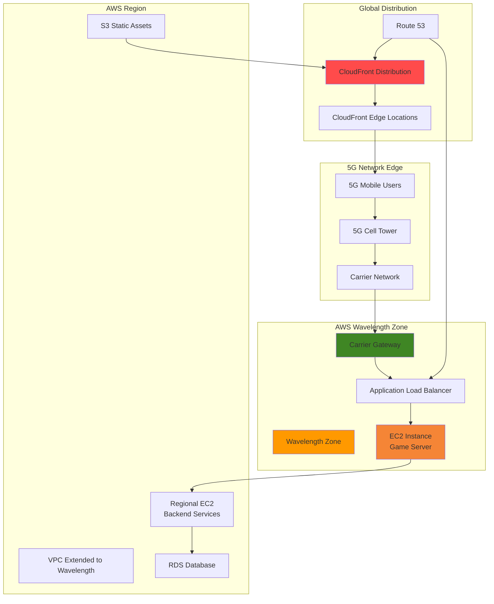

# Low-Latency Edge Applications with Wavelength

## Problem

Mobile gaming companies and AR/VR applications struggle to deliver real-time, low-latency experiences to 5G-connected users. Traditional cloud architectures introduce unacceptable latency (50-100ms) when processing time-sensitive workloads like multiplayer gaming, live video streaming, or augmented reality features. These delays result in poor user experience, reduced engagement, and competitive disadvantage in markets where milliseconds matter.

## Solution

AWS Wavelength brings cloud services to the edge of 5G networks, reducing latency to single-digit milliseconds for mobile applications. By combining Wavelength Zones with CloudFront's global edge network, we create a multi-tier content delivery architecture that optimizes both ultra-low latency processing and global content distribution for different types of application traffic.

## Architecture Diagram



## Prerequisites

1. AWS account with permissions for EC2, VPC, Route 53, CloudFront, and Wavelength
2. AWS CLI v2 installed and configured (or AWS CloudShell)
3. Understanding of VPC networking and load balancing concepts
4. Access to a Wavelength Zone (requires carrier partnership and opt-in)
5. Domain name registered for DNS configuration
6. Estimated cost: $150-200 for running this recipe (includes EC2, data transfer, and CloudFront costs)

> **Note**: Wavelength Zones are available in select metropolitan areas through carrier partnerships. Check [AWS Wavelength locations](https://aws.amazon.com/wavelength/locations/) for availability in your region.

## Preparation

```bash
# Set environment variables
export AWS_REGION=$(aws configure get region)
export AWS_ACCOUNT_ID=$(aws sts get-caller-identity \
    --query Account --output text)

# Generate unique identifiers for resources
RANDOM_SUFFIX=$(aws secretsmanager get-random-password \
    --exclude-punctuation --exclude-uppercase \
    --password-length 6 --require-each-included-type \
    --output text --query RandomPassword)

export PROJECT_NAME="edge-app-${RANDOM_SUFFIX}"
export DOMAIN_NAME="your-domain.com"  # Replace with your domain

# Check available Wavelength Zones
aws ec2 describe-availability-zones \
    --filters "Name=zone-type,Values=wavelength-zone" \
    --query 'AvailabilityZones[*].[ZoneName,GroupName,State]' \
    --output table

# Set the Wavelength Zone (replace with available zone)
export WAVELENGTH_ZONE="us-west-2-wl1-las-wlz-1"
export WAVELENGTH_GROUP="us-west-2-wl1-las-1"

echo "✅ Environment configured for project: ${PROJECT_NAME}"
```

## Steps

1. **Enable Wavelength Zone Access**:

   AWS Wavelength Zones require explicit opt-in before you can deploy resources. This step enables access to the Wavelength infrastructure at the edge of 5G networks, allowing you to place compute resources closer to mobile users for ultra-low latency applications. Unlike traditional AWS Availability Zones, Wavelength Zones are physically embedded within telecommunications providers' data centers at the edge of 5G networks, providing direct access to mobile device traffic without multiple network hops.

   ```bash
   # Enable the Wavelength Zone group
   aws ec2 modify-availability-zone-group \
       --group-name ${WAVELENGTH_GROUP} \
       --opt-in-status opted-in
   
   # Verify the zone is enabled
   aws ec2 describe-availability-zones \
       --zone-names ${WAVELENGTH_ZONE} \
       --query 'AvailabilityZones[0].[ZoneName,OptInStatus,State]' \
       --output table
   
   echo "✅ Wavelength Zone enabled and available"
   ```

   The Wavelength Zone is now accessible for resource deployment. This foundational step establishes your ability to deploy edge computing resources within the carrier's 5G network infrastructure, enabling latency reductions from traditional cloud deployments of 50-100ms down to single-digit milliseconds.

2. **Create Extended VPC with Wavelength Subnet**:

   VPC extension to Wavelength Zones enables seamless integration between edge resources and your regional AWS infrastructure. This creates a unified network architecture where edge applications can communicate securely with backend services while maintaining the ultra-low latency benefits of edge deployment. The VPC acts as a bridge between the Wavelength Zone and your regional AWS services, providing a single network fabric that spans both edge and cloud infrastructure.

   ```bash
   # Create VPC for edge application
   VPC_ID=$(aws ec2 create-vpc \
       --cidr-block 10.0.0.0/16 \
       --tag-specifications "ResourceType=vpc,Tags=[{Key=Name,Value=${PROJECT_NAME}-vpc}]" \
       --query 'Vpc.VpcId' --output text)
   
   # Create Wavelength subnet
   WL_SUBNET_ID=$(aws ec2 create-subnet \
       --vpc-id ${VPC_ID} \
       --cidr-block 10.0.1.0/24 \
       --availability-zone ${WAVELENGTH_ZONE} \
       --tag-specifications "ResourceType=subnet,Tags=[{Key=Name,Value=${PROJECT_NAME}-wavelength-subnet}]" \
       --query 'Subnet.SubnetId' --output text)
   
   # Create regional subnet for backend services
   REGIONAL_SUBNET_ID=$(aws ec2 create-subnet \
       --vpc-id ${VPC_ID} \
       --cidr-block 10.0.2.0/24 \
       --availability-zone ${AWS_REGION}a \
       --tag-specifications "ResourceType=subnet,Tags=[{Key=Name,Value=${PROJECT_NAME}-regional-subnet}]" \
       --query 'Subnet.SubnetId' --output text)
   
   echo "✅ VPC extended to Wavelength Zone: ${VPC_ID}"
   echo "   Wavelength Subnet: ${WL_SUBNET_ID}"
   echo "   Regional Subnet: ${REGIONAL_SUBNET_ID}"
   ```

   The VPC now spans both the Wavelength Zone and regional infrastructure, enabling hybrid edge-cloud architectures that optimize for both latency and functionality. This network foundation allows applications to leverage edge processing for latency-critical operations while maintaining access to the full AWS service ecosystem for backend operations.

3. **Configure Carrier Gateway and Route Tables**:

   Carrier Gateways provide the critical network bridge between 5G mobile devices and your Wavelength Zone resources. Unlike traditional internet gateways, carrier gateways are optimized for mobile network traffic and enable the ultra-low latency connectivity that makes Wavelength valuable for real-time applications. The carrier gateway connects directly to the telecommunications provider's mobile core network, eliminating the internet routing hops that add latency in traditional cloud architectures.

   ```bash
   # Create carrier gateway for mobile connectivity
   CG_ID=$(aws ec2 create-carrier-gateway \
       --vpc-id ${VPC_ID} \
       --tag-specifications "ResourceType=carrier-gateway,Tags=[{Key=Name,Value=${PROJECT_NAME}-carrier-gateway}]" \
       --query 'CarrierGateway.CarrierGatewayId' --output text)
   
   # Create route table for Wavelength subnet
   WL_RT_ID=$(aws ec2 create-route-table \
       --vpc-id ${VPC_ID} \
       --tag-specifications "ResourceType=route-table,Tags=[{Key=Name,Value=${PROJECT_NAME}-wavelength-rt}]" \
       --query 'RouteTable.RouteTableId' --output text)
   
   # Add carrier gateway route for mobile traffic
   aws ec2 create-route \
       --route-table-id ${WL_RT_ID} \
       --destination-cidr-block 0.0.0.0/0 \
       --carrier-gateway-id ${CG_ID}
   
   # Associate route table with Wavelength subnet
   aws ec2 associate-route-table \
       --subnet-id ${WL_SUBNET_ID} \
       --route-table-id ${WL_RT_ID}
   
   echo "✅ Carrier gateway configured: ${CG_ID}"
   ```

   The carrier gateway is now established, providing optimized connectivity between 5G mobile devices and your edge application infrastructure. This specialized networking component enables direct communication with mobile devices through the carrier's network infrastructure, bypassing traditional internet routing for minimal latency.

4. **Create Security Groups**:

   Security groups for Wavelength applications must balance accessibility for mobile clients with protection against threats. These configurations enable application traffic while maintaining security best practices for edge deployments exposed to mobile networks. Unlike traditional security groups that primarily handle internet traffic, Wavelength security groups must account for mobile carrier network traffic patterns and 5G-specific security considerations.

   ```bash
   # Create security group for Wavelength edge servers
   WL_SG_ID=$(aws ec2 create-security-group \
       --group-name ${PROJECT_NAME}-wavelength-sg \
       --description "Security group for Wavelength edge applications" \
       --vpc-id ${VPC_ID} \
       --tag-specifications "ResourceType=security-group,Tags=[{Key=Name,Value=${PROJECT_NAME}-wavelength-sg}]" \
       --query 'GroupId' --output text)
   
   # Allow HTTP/HTTPS traffic from mobile clients
   aws ec2 authorize-security-group-ingress \
       --group-id ${WL_SG_ID} \
       --protocol tcp \
       --port 80 \
       --cidr 0.0.0.0/0
   
   aws ec2 authorize-security-group-ingress \
       --group-id ${WL_SG_ID} \
       --protocol tcp \
       --port 443 \
       --cidr 0.0.0.0/0
   
   # Allow custom application port (e.g., game server)
   aws ec2 authorize-security-group-ingress \
       --group-id ${WL_SG_ID} \
       --protocol tcp \
       --port 8080 \
       --cidr 0.0.0.0/0
   
   # Create security group for regional backend
   REGIONAL_SG_ID=$(aws ec2 create-security-group \
       --group-name ${PROJECT_NAME}-regional-sg \
       --description "Security group for regional backend services" \
       --vpc-id ${VPC_ID} \
       --tag-specifications "ResourceType=security-group,Tags=[{Key=Name,Value=${PROJECT_NAME}-regional-sg}]" \
       --query 'GroupId' --output text)
   
   # Allow traffic from Wavelength subnet
   aws ec2 authorize-security-group-ingress \
       --group-id ${REGIONAL_SG_ID} \
       --protocol tcp \
       --port 80 \
       --source-group ${WL_SG_ID}
   
   echo "✅ Security groups configured"
   echo "   Wavelength SG: ${WL_SG_ID}"
   echo "   Regional SG: ${REGIONAL_SG_ID}"
   ```

   Security groups are now configured to enable secure communication between mobile clients, edge applications, and backend services. The configuration follows the principle of least privilege while allowing necessary traffic flows between edge and regional components.

5. **Deploy Edge Application to Wavelength Zone**:

   Deploying applications in Wavelength Zones places compute resources at the very edge of the 5G network, minimizing the physical distance between mobile users and application servers. This proximity is crucial for latency-sensitive applications like real-time gaming, AR/VR, and live streaming. The edge application serves as the first point of contact for mobile traffic, handling time-critical operations locally while communicating with regional services for non-latency-sensitive operations.

   ```bash
   # Get latest Amazon Linux 2 AMI
   AMI_ID=$(aws ec2 describe-images \
       --owners amazon \
       --filters "Name=name,Values=amzn2-ami-hvm-*-x86_64-gp2" "Name=state,Values=available" \
       --query 'Images | sort_by(@, &CreationDate) | [-1].ImageId' \
       --output text)
   
   # Create user data script for edge application
   cat > user-data.sh << 'EOF'
#!/bin/bash
yum update -y
yum install -y docker
systemctl start docker
systemctl enable docker
usermod -a -G docker ec2-user

# Run a simple edge application (game server simulation)
docker run -d --name edge-app -p 8080:8080 \
    --restart unless-stopped \
    nginx:alpine

# Configure nginx for edge application
docker exec edge-app sh -c 'echo "
server {
    listen 8080;
    location / {
        return 200 \"Edge Server Response Time: \$(date +%s%3N)ms\";
        add_header Content-Type text/plain;
    }
    location /health {
        return 200 \"healthy\";
        add_header Content-Type text/plain;
    }
}" > /etc/nginx/conf.d/default.conf'

docker restart edge-app
EOF

   # Launch EC2 instance in Wavelength Zone
   WL_INSTANCE_ID=$(aws ec2 run-instances \
       --image-id ${AMI_ID} \
       --instance-type t3.medium \
       --subnet-id ${WL_SUBNET_ID} \
       --security-group-ids ${WL_SG_ID} \
       --user-data file://user-data.sh \
       --tag-specifications "ResourceType=instance,Tags=[{Key=Name,Value=${PROJECT_NAME}-wavelength-server}]" \
       --query 'Instances[0].InstanceId' --output text)
   
   # Wait for instance to be running
   aws ec2 wait instance-running --instance-ids ${WL_INSTANCE_ID}
   
   # Get Wavelength instance details
   WL_INSTANCE_IP=$(aws ec2 describe-instances \
       --instance-ids ${WL_INSTANCE_ID} \
       --query 'Reservations[0].Instances[0].PrivateIpAddress' \
       --output text)
   
   echo "✅ Edge application deployed to Wavelength Zone"
   echo "   Instance ID: ${WL_INSTANCE_ID}"
   echo "   Private IP: ${WL_INSTANCE_IP}"
   
   # Clean up user data file
   rm user-data.sh
   ```

   The edge application is now running in the Wavelength Zone, positioned optimally for ultra-low latency access from 5G mobile devices. This placement enables single-digit millisecond response times for mobile applications requiring real-time processing capabilities.

6. **Create Application Load Balancer in Wavelength Zone**:

   Application Load Balancers in Wavelength Zones provide high availability and health monitoring for edge applications while maintaining the low-latency benefits. The ALB acts as the entry point for mobile traffic, distributing requests across healthy edge instances and providing automatic failover capabilities. This ensures that edge applications maintain high availability even in the distributed edge environment.

   ```bash
   # Create Application Load Balancer in Wavelength Zone
   ALB_ARN=$(aws elbv2 create-load-balancer \
       --name ${PROJECT_NAME}-wavelength-alb \
       --subnets ${WL_SUBNET_ID} \
       --security-groups ${WL_SG_ID} \
       --scheme internal \
       --type application \
       --tags Key=Name,Value=${PROJECT_NAME}-wavelength-alb \
       --query 'LoadBalancers[0].LoadBalancerArn' --output text)
   
   # Create target group for edge instances
   TG_ARN=$(aws elbv2 create-target-group \
       --name ${PROJECT_NAME}-edge-targets \
       --protocol HTTP \
       --port 8080 \
       --vpc-id ${VPC_ID} \
       --health-check-path /health \
       --health-check-interval-seconds 30 \
       --healthy-threshold-count 2 \
       --unhealthy-threshold-count 3 \
       --tags Key=Name,Value=${PROJECT_NAME}-edge-targets \
       --query 'TargetGroups[0].TargetGroupArn' --output text)
   
   # Register Wavelength instance with target group
   aws elbv2 register-targets \
       --target-group-arn ${TG_ARN} \
       --targets Id=${WL_INSTANCE_ID}
   
   # Create listener for load balancer
   aws elbv2 create-listener \
       --load-balancer-arn ${ALB_ARN} \
       --protocol HTTP \
       --port 80 \
       --default-actions Type=forward,TargetGroupArn=${TG_ARN}
   
   # Get ALB DNS name
   ALB_DNS=$(aws elbv2 describe-load-balancers \
       --load-balancer-arns ${ALB_ARN} \
       --query 'LoadBalancers[0].DNSName' --output text)
   
   echo "✅ Application Load Balancer configured"
   echo "   ALB DNS: ${ALB_DNS}"
   ```

   The Application Load Balancer is now routing traffic to your edge application, providing health monitoring and high availability for mobile clients while maintaining the ultra-low latency characteristics of the Wavelength Zone deployment.

7. **Create S3 Bucket for Static Assets**:

   S3 provides scalable storage for static assets that don't require ultra-low latency access. This creates a separation of concerns where dynamic, latency-sensitive content is served from Wavelength while static assets like images, CSS, and JavaScript are delivered through CloudFront's global edge network. This architectural pattern optimizes both performance and cost by using the right service for each type of content delivery requirement.

   ```bash
   # Create S3 bucket for static assets
   S3_BUCKET="${PROJECT_NAME}-static-assets"
   aws s3 mb s3://${S3_BUCKET} --region ${AWS_REGION}
   
   # Configure bucket for web hosting
   aws s3api put-bucket-versioning \
       --bucket ${S3_BUCKET} \
       --versioning-configuration Status=Enabled
   
   # Create sample static content
   cat > index.html << EOF
<!DOCTYPE html>
<html>
<head>
    <title>Edge Application</title>
    <style>
        body { font-family: Arial, sans-serif; margin: 40px; }
        .latency-test { background: #f0f0f0; padding: 20px; margin: 20px 0; }
    </style>
</head>
<body>
    <h1>Low-Latency Edge Application</h1>
    <div class="latency-test">
        <h2>Latency Test</h2>
        <p>Edge Server: <span id="edge-response">Testing...</span></p>
        <p>Load time: <span id="load-time"></span>ms</p>
    </div>
    <script>
        const startTime = performance.now();
        window.onload = function() {
            document.getElementById('load-time').textContent = 
                Math.round(performance.now() - startTime);
        };
    </script>
</body>
</html>
EOF

   # Upload static content to S3
   aws s3 cp index.html s3://${S3_BUCKET}/
   
   echo "✅ S3 bucket created and configured: ${S3_BUCKET}"
   
   # Clean up local file
   rm index.html
   ```

   S3 bucket is now ready to store and serve static assets through CloudFront's global content delivery network, enabling efficient global distribution of non-latency-sensitive content while maintaining cost optimization.

8. **Configure CloudFront Distribution**:

   CloudFront creates a global content delivery network that intelligently routes traffic between static assets (served from S3) and dynamic content (served from Wavelength). This multi-origin configuration optimizes both global reach and ultra-low latency where needed. The distribution acts as a traffic director, ensuring that static content leverages CloudFront's global cache while API calls are routed directly to the Wavelength Zone for minimal latency.

   ```bash
   # Create CloudFront Origin Access Control for S3
   OAC_ID=$(aws cloudfront create-origin-access-control \
       --origin-access-control-config '{
           "Name": "'${PROJECT_NAME}'-s3-oac",
           "Description": "OAC for S3 static assets",
           "OriginAccessControlOriginType": "s3",
           "SigningBehavior": "always",
           "SigningProtocol": "sigv4"
       }' \
       --query 'OriginAccessControl.Id' --output text)
   
   # Create CloudFront distribution configuration
   cat > distribution-config.json << EOF
{
    "CallerReference": "${PROJECT_NAME}-$(date +%s)",
    "Comment": "Edge application with Wavelength and S3 origins",
    "DefaultRootObject": "index.html",
    "Origins": {
        "Quantity": 2,
        "Items": [
            {
                "Id": "S3-${S3_BUCKET}",
                "DomainName": "${S3_BUCKET}.s3.${AWS_REGION}.amazonaws.com",
                "S3OriginConfig": {
                    "OriginAccessIdentity": ""
                },
                "OriginAccessControlId": "${OAC_ID}"
            },
            {
                "Id": "Wavelength-ALB",
                "DomainName": "${ALB_DNS}",
                "CustomOriginConfig": {
                    "HTTPPort": 80,
                    "HTTPSPort": 443,
                    "OriginProtocolPolicy": "http-only"
                }
            }
        ]
    },
    "DefaultCacheBehavior": {
        "TargetOriginId": "S3-${S3_BUCKET}",
        "ViewerProtocolPolicy": "redirect-to-https",
        "MinTTL": 0,
        "ForwardedValues": {
            "QueryString": false,
            "Cookies": {
                "Forward": "none"
            }
        },
        "TrustedSigners": {
            "Enabled": false,
            "Quantity": 0
        }
    },
    "CacheBehaviors": {
        "Quantity": 1,
        "Items": [
            {
                "PathPattern": "/api/*",
                "TargetOriginId": "Wavelength-ALB",
                "ViewerProtocolPolicy": "https-only",
                "MinTTL": 0,
                "MaxTTL": 0,
                "DefaultTTL": 0,
                "ForwardedValues": {
                    "QueryString": true,
                    "Cookies": {
                        "Forward": "all"
                    }
                },
                "TrustedSigners": {
                    "Enabled": false,
                    "Quantity": 0
                }
            }
        ]
    },
    "Enabled": true,
    "PriceClass": "PriceClass_All"
}
EOF

   # Create CloudFront distribution
   DISTRIBUTION_ID=$(aws cloudfront create-distribution \
       --distribution-config file://distribution-config.json \
       --query 'Distribution.Id' --output text)
   
   # Get CloudFront domain name
   CF_DOMAIN=$(aws cloudfront get-distribution \
       --id ${DISTRIBUTION_ID} \
       --query 'Distribution.DomainName' --output text)
   
   echo "✅ CloudFront distribution created: ${DISTRIBUTION_ID}"
   echo "   Domain: ${CF_DOMAIN}"
   
   # Clean up config file
   rm distribution-config.json
   ```

   CloudFront distribution is now configured to serve static content globally while routing API calls to the ultra-low latency Wavelength Zone. This intelligent routing ensures optimal performance for different types of content and traffic patterns.

9. **Configure Route 53 DNS**:

   Route 53 provides intelligent DNS routing that can direct traffic based on geolocation, latency, or health checks. This enables sophisticated traffic management between different origins based on user location and network conditions. The DNS configuration creates a friendly domain name for the edge application while enabling advanced routing policies for optimal user experience.

   ```bash
   # Create hosted zone (if not exists)
   HOSTED_ZONE_ID=$(aws route53 create-hosted-zone \
       --name ${DOMAIN_NAME} \
       --caller-reference "${PROJECT_NAME}-$(date +%s)" \
       --hosted-zone-config Comment="Edge application DNS zone" \
       --query 'HostedZone.Id' --output text | cut -d'/' -f3)
   
   # Create CNAME record for CloudFront
   cat > dns-change.json << EOF
{
    "Changes": [
        {
            "Action": "CREATE",
            "ResourceRecordSet": {
                "Name": "app.${DOMAIN_NAME}",
                "Type": "CNAME",
                "TTL": 300,
                "ResourceRecords": [
                    {
                        "Value": "${CF_DOMAIN}"
                    }
                ]
            }
        }
    ]
}
EOF

   # Apply DNS changes
   CHANGE_ID=$(aws route53 change-resource-record-sets \
       --hosted-zone-id ${HOSTED_ZONE_ID} \
       --change-batch file://dns-change.json \
       --query 'ChangeInfo.Id' --output text)
   
   # Wait for DNS changes to propagate
   aws route53 wait resource-record-sets-changed --id ${CHANGE_ID}
   
   echo "✅ DNS configured: app.${DOMAIN_NAME} → ${CF_DOMAIN}"
   
   # Clean up config file
   rm dns-change.json
   ```

   DNS routing is now configured to direct users to the optimized edge application through CloudFront's intelligent routing, providing a seamless user experience with a custom domain name.

10. **Configure S3 Bucket Policy for CloudFront**:

    S3 bucket policies must allow CloudFront Origin Access Control to securely serve static content. This configuration ensures that static assets are only accessible through CloudFront, preventing direct S3 access while maintaining security. The Origin Access Control (OAC) replaces the legacy Origin Access Identity (OAI) with improved security and functionality for CloudFront-S3 integrations.

    ```bash
    # Create bucket policy for CloudFront access
    cat > bucket-policy.json << EOF
{
    "Version": "2012-10-17",
    "Statement": [
        {
            "Sid": "AllowCloudFrontServicePrincipal",
            "Effect": "Allow",
            "Principal": {
                "Service": "cloudfront.amazonaws.com"
            },
            "Action": "s3:GetObject",
            "Resource": "arn:aws:s3:::${S3_BUCKET}/*",
            "Condition": {
                "StringEquals": {
                    "AWS:SourceArn": "arn:aws:cloudfront::${AWS_ACCOUNT_ID}:distribution/${DISTRIBUTION_ID}"
                }
            }
        }
    ]
}
EOF

    # Apply bucket policy
    aws s3api put-bucket-policy \
        --bucket ${S3_BUCKET} \
        --policy file://bucket-policy.json
    
    echo "✅ S3 bucket policy configured for CloudFront access"
    
    # Clean up policy file
    rm bucket-policy.json
    ```

    S3 bucket is now securely configured to serve content exclusively through CloudFront, maintaining security while enabling global content delivery with Origin Access Control protection.

## Validation & Testing

1. Verify Wavelength Zone deployment:

   ```bash
   # Check Wavelength instance status
   aws ec2 describe-instances \
       --instance-ids ${WL_INSTANCE_ID} \
       --query 'Reservations[0].Instances[0].[State.Name,PrivateIpAddress,Placement.AvailabilityZone]' \
       --output table
   ```

   Expected output: Instance should be "running" with private IP in the Wavelength Zone.

2. Test edge application latency:

   ```bash
   # Test direct connection to Wavelength ALB
   echo "Testing edge application response..."
   curl -w "Total time: %{time_total}s\n" \
       http://${ALB_DNS}/health
   ```

   Expected output: Response time should be significantly lower (1-10ms) compared to regional endpoints.

3. Verify CloudFront distribution:

   ```bash
   # Check distribution status
   aws cloudfront get-distribution \
       --id ${DISTRIBUTION_ID} \
       --query 'Distribution.[Status,DomainName]' \
       --output table
   ```

   Expected output: Status should be "Deployed" with the CloudFront domain name.

4. Test global content delivery:

   ```bash
   # Test CloudFront static content delivery
   curl -I https://${CF_DOMAIN}/index.html
   
   # Test API routing to Wavelength
   curl https://${CF_DOMAIN}/api/health
   ```

   Expected output: Static content served from CloudFront, API calls routed to Wavelength ALB.

## Cleanup

1. Delete CloudFront distribution:

   ```bash
   # Disable CloudFront distribution first
   aws cloudfront get-distribution-config \
       --id ${DISTRIBUTION_ID} \
       --query 'DistributionConfig' > dist-config.json
   
   # Update enabled status to false
   sed -i 's/"Enabled": true/"Enabled": false/' dist-config.json
   
   ETAG=$(aws cloudfront get-distribution \
       --id ${DISTRIBUTION_ID} \
       --query 'ETag' --output text)
   
   aws cloudfront update-distribution \
       --id ${DISTRIBUTION_ID} \
       --distribution-config file://dist-config.json \
       --if-match ${ETAG}
   
   # Wait for distribution to be disabled, then delete
   sleep 300
   aws cloudfront delete-distribution \
       --id ${DISTRIBUTION_ID} \
       --if-match ${ETAG}
   
   rm dist-config.json
   echo "✅ CloudFront distribution deleted"
   ```

2. Delete Route 53 records and hosted zone:

   ```bash
   # Delete CNAME record
   aws route53 change-resource-record-sets \
       --hosted-zone-id ${HOSTED_ZONE_ID} \
       --change-batch '{
           "Changes": [{
               "Action": "DELETE",
               "ResourceRecordSet": {
                   "Name": "app.'${DOMAIN_NAME}'",
                   "Type": "CNAME",
                   "TTL": 300,
                   "ResourceRecords": [{"Value": "'${CF_DOMAIN}'"}]
               }
           }]
       }'
   
   # Delete hosted zone
   aws route53 delete-hosted-zone --id ${HOSTED_ZONE_ID}
   
   echo "✅ Route 53 resources deleted"
   ```

3. Delete load balancer and target group:

   ```bash
   # Delete load balancer
   aws elbv2 delete-load-balancer --load-balancer-arn ${ALB_ARN}
   
   # Delete target group
   aws elbv2 delete-target-group --target-group-arn ${TG_ARN}
   
   echo "✅ Load balancer resources deleted"
   ```

4. Terminate EC2 instances:

   ```bash
   # Terminate Wavelength instance
   aws ec2 terminate-instances --instance-ids ${WL_INSTANCE_ID}
   
   # Wait for termination
   aws ec2 wait instance-terminated --instance-ids ${WL_INSTANCE_ID}
   
   echo "✅ EC2 instances terminated"
   ```

5. Clean up networking resources:

   ```bash
   # Delete carrier gateway
   aws ec2 delete-carrier-gateway --carrier-gateway-id ${CG_ID}
   
   # Delete subnets
   aws ec2 delete-subnet --subnet-id ${WL_SUBNET_ID}
   aws ec2 delete-subnet --subnet-id ${REGIONAL_SUBNET_ID}
   
   # Delete security groups
   aws ec2 delete-security-group --group-id ${WL_SG_ID}
   aws ec2 delete-security-group --group-id ${REGIONAL_SG_ID}
   
   # Delete route table
   aws ec2 delete-route-table --route-table-id ${WL_RT_ID}
   
   # Delete VPC
   aws ec2 delete-vpc --vpc-id ${VPC_ID}
   
   echo "✅ Networking resources deleted"
   ```

6. Delete S3 bucket:

   ```bash
   # Empty and delete S3 bucket
   aws s3 rm s3://${S3_BUCKET} --recursive
   aws s3 rb s3://${S3_BUCKET}
   
   echo "✅ S3 bucket deleted"
   ```

## Discussion

AWS Wavelength represents a fundamental shift in edge computing by embedding AWS infrastructure directly within telecommunications providers' 5G networks. This architecture enables applications to achieve single-digit millisecond latency to mobile users, which is critical for emerging technologies like augmented reality, autonomous vehicles, and real-time gaming. For comprehensive technical details, see the [AWS Wavelength Developer Guide](https://docs.aws.amazon.com/wavelength/latest/developerguide/what-is-wavelength.html) and [5G Edge Computing whitepaper](https://docs.aws.amazon.com/whitepapers/latest/telco-edge-workloads-on-red-hat-openshift/aws-wavelength-zones.html).

The multi-tier architecture combining Wavelength and CloudFront creates an intelligent content delivery strategy. Dynamic, latency-sensitive operations are processed at the network edge through Wavelength, while static content is delivered globally through CloudFront's extensive edge network. This separation optimizes both ultra-low latency requirements and global content distribution efficiency. The [AWS Well-Architected Framework](https://docs.aws.amazon.com/wellarchitected/latest/framework/welcome.html) performance efficiency pillar specifically addresses these edge computing patterns for optimal user experience.

From a networking perspective, Wavelength Zones extend your VPC to the edge while maintaining seamless connectivity to regional AWS services. Carrier gateways provide optimized routing for mobile network traffic, eliminating multiple network hops that traditionally add latency. The integration with Application Load Balancers ensures high availability even at the edge, while security groups provide granular traffic control for mobile-facing applications. For detailed networking guidance, review the [VPC Wavelength documentation](https://docs.aws.amazon.com/vpc/latest/userguide/Extend_VPCs.html) and [Carrier Gateway specifications](https://docs.aws.amazon.com/wavelength/latest/developerguide/wavelength-quotas.html).

This architecture pattern is particularly valuable for use cases requiring real-time responsiveness: multiplayer gaming servers, AR/VR applications, autonomous vehicle communication, industrial IoT control systems, and live video processing. The cost model shifts from traditional data center deployments to usage-based pricing that scales with actual mobile user demand, making it economically viable for applications with variable traffic patterns. Understanding the [Wavelength pricing model](https://aws.amazon.com/wavelength/pricing/) is essential for cost optimization in edge deployments.

> **Tip**: Monitor Wavelength application performance using CloudWatch metrics and consider implementing auto-scaling policies based on mobile network traffic patterns. Use [AWS X-Ray](https://docs.aws.amazon.com/xray/latest/devguide/) for distributed tracing across edge and regional components to optimize the entire application stack.

> **Warning**: Wavelength Zones have limited EC2 instance type availability compared to standard AWS regions. Plan your application architecture accordingly and consider using t3.medium or larger instances for production workloads.

## Challenge

Extend this edge computing solution with these advanced implementations:

1. **Multi-Wavelength Zone Deployment**: Deploy the application across multiple Wavelength Zones in different metropolitan areas and implement intelligent traffic routing based on user geolocation and network conditions.

2. **Edge Machine Learning**: Add real-time ML inference capabilities using Amazon SageMaker Edge or AWS Inferentia chips deployed in Wavelength Zones for applications like computer vision or natural language processing.

3. **Hybrid Edge-Cloud Data Pipeline**: Implement a data streaming architecture using Amazon Kinesis that processes real-time events at the edge while aggregating long-term analytics in regional AWS services.

4. **Edge-Native Microservices**: Redesign the application as containerized microservices using Amazon EKS on Wavelength with service mesh integration for complex edge application architectures.

5. **5G Network Slicing Integration**: Work with telecommunications partners to implement network slicing that dedicates specific bandwidth and latency guarantees for your edge applications through programmatic APIs.

## Infrastructure Code

*Infrastructure code will be generated after recipe approval.*