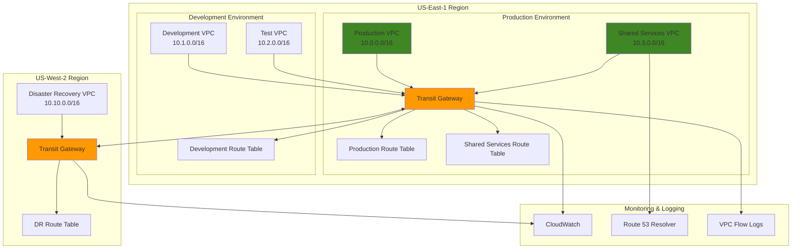

# Managing Enterprise VPC Architectures with Transit Gateway

## Problem

Large enterprises need to connect multiple isolated VPCs across different regions and accounts while maintaining strict network segmentation and security controls. Traditional VPC peering creates a complex mesh that becomes unmanageable at scale, and shared services like DNS, monitoring, and security tools need centralized access without compromising network isolation. Without proper segmentation, a security breach in one VPC could potentially compromise the entire network infrastructure.

## Solution

AWS Transit Gateway provides a hub-and-spoke architecture that connects multiple VPCs through a central gateway with custom route tables for network segmentation. This solution implements multiple isolated routing domains, cross-region connectivity through peering, and centralized monitoring to create a scalable and secure multi-VPC architecture that maintains strict network boundaries while enabling controlled access to shared resources.

## Architecture Diagram



## Prerequisites

1. AWS account with appropriate permissions for EC2, VPC, and Transit Gateway operations
2. AWS CLI v2 installed and configured (or AWS CloudShell)
3. Understanding of VPC networking concepts, CIDR blocks, and routing
4. Familiarity with AWS networking services and multi-region deployments
5. Estimated cost: $150-200/month for Transit Gateway attachments and data processing charges

> **Note**: Transit Gateway charges $0.05 per hour per attachment plus $0.02 per GB of data processed. Cross-region peering incurs additional data transfer costs.

## Preparation

```bash
# Set environment variables
export AWS_REGION=$(aws configure get region)
export AWS_ACCOUNT_ID=$(aws sts get-caller-identity \
    --query Account --output text)

# Generate unique identifiers for resources
RANDOM_SUFFIX=$(aws secretsmanager get-random-password \
    --exclude-punctuation --exclude-uppercase \
    --password-length 6 --require-each-included-type \
    --output text --query RandomPassword)

# Set resource names
export TGW_NAME="enterprise-tgw-${RANDOM_SUFFIX}"
export PROD_VPC_NAME="prod-vpc-${RANDOM_SUFFIX}"
export DEV_VPC_NAME="dev-vpc-${RANDOM_SUFFIX}"
export TEST_VPC_NAME="test-vpc-${RANDOM_SUFFIX}"
export SHARED_VPC_NAME="shared-vpc-${RANDOM_SUFFIX}"

# Create VPCs for the architecture
aws ec2 create-vpc \
    --cidr-block 10.0.0.0/16 \
    --tag-specifications "ResourceType=vpc,Tags=[{Key=Name,Value=${PROD_VPC_NAME}}]" \
    --query 'Vpc.VpcId' --output text > /tmp/prod-vpc-id

aws ec2 create-vpc \
    --cidr-block 10.1.0.0/16 \
    --tag-specifications "ResourceType=vpc,Tags=[{Key=Name,Value=${DEV_VPC_NAME}}]" \
    --query 'Vpc.VpcId' --output text > /tmp/dev-vpc-id

aws ec2 create-vpc \
    --cidr-block 10.2.0.0/16 \
    --tag-specifications "ResourceType=vpc,Tags=[{Key=Name,Value=${TEST_VPC_NAME}}]" \
    --query 'Vpc.VpcId' --output text > /tmp/test-vpc-id

aws ec2 create-vpc \
    --cidr-block 10.3.0.0/16 \
    --tag-specifications "ResourceType=vpc,Tags=[{Key=Name,Value=${SHARED_VPC_NAME}}]" \
    --query 'Vpc.VpcId' --output text > /tmp/shared-vpc-id

# Store VPC IDs in environment variables
export PROD_VPC_ID=$(cat /tmp/prod-vpc-id)
export DEV_VPC_ID=$(cat /tmp/dev-vpc-id)
export TEST_VPC_ID=$(cat /tmp/test-vpc-id)
export SHARED_VPC_ID=$(cat /tmp/shared-vpc-id)

# Create subnets for each VPC
aws ec2 create-subnet \
    --vpc-id $PROD_VPC_ID \
    --cidr-block 10.0.1.0/24 \
    --availability-zone ${AWS_REGION}a \
    --tag-specifications "ResourceType=subnet,Tags=[{Key=Name,Value=prod-subnet-a}]" \
    --query 'Subnet.SubnetId' --output text > /tmp/prod-subnet-id

aws ec2 create-subnet \
    --vpc-id $DEV_VPC_ID \
    --cidr-block 10.1.1.0/24 \
    --availability-zone ${AWS_REGION}a \
    --tag-specifications "ResourceType=subnet,Tags=[{Key=Name,Value=dev-subnet-a}]" \
    --query 'Subnet.SubnetId' --output text > /tmp/dev-subnet-id

aws ec2 create-subnet \
    --vpc-id $TEST_VPC_ID \
    --cidr-block 10.2.1.0/24 \
    --availability-zone ${AWS_REGION}a \
    --tag-specifications "ResourceType=subnet,Tags=[{Key=Name,Value=test-subnet-a}]" \
    --query 'Subnet.SubnetId' --output text > /tmp/test-subnet-id

aws ec2 create-subnet \
    --vpc-id $SHARED_VPC_ID \
    --cidr-block 10.3.1.0/24 \
    --availability-zone ${AWS_REGION}a \
    --tag-specifications "ResourceType=subnet,Tags=[{Key=Name,Value=shared-subnet-a}]" \
    --query 'Subnet.SubnetId' --output text > /tmp/shared-subnet-id

# Store subnet IDs
export PROD_SUBNET_ID=$(cat /tmp/prod-subnet-id)
export DEV_SUBNET_ID=$(cat /tmp/dev-subnet-id)
export TEST_SUBNET_ID=$(cat /tmp/test-subnet-id)
export SHARED_SUBNET_ID=$(cat /tmp/shared-subnet-id)

echo "✅ Created VPCs and subnets for multi-VPC architecture"
```

## Steps

1. **Create Transit Gateway with Enhanced Configuration**:

   Transit Gateway serves as the central networking hub that replaces the complex mesh of VPC peering connections traditional multi-VPC architectures require. By disabling default route table associations and propagations, we gain precise control over network traffic flows, enabling implementation of zero-trust networking principles. This centralized approach reduces operational complexity from O(n²) to O(n) as VPC count scales.

   ```bash
   # Create Transit Gateway with optimized settings
   aws ec2 create-transit-gateway \
       --description "Enterprise Multi-VPC Transit Gateway" \
       --options AmazonSideAsn=64512,AutoAcceptSharedAttachments=disable,DefaultRouteTableAssociation=disable,DefaultRouteTablePropagation=disable,VpnEcmpSupport=enable,DnsSupport=enable \
       --tag-specifications "ResourceType=transit-gateway,Tags=[{Key=Name,Value=${TGW_NAME}},{Key=Environment,Value=production}]" \
       --query 'TransitGateway.TransitGatewayId' --output text > /tmp/tgw-id
   
   export TGW_ID=$(cat /tmp/tgw-id)
   
   # Wait for Transit Gateway to become available
   aws ec2 wait transit-gateway-available \
       --transit-gateway-ids $TGW_ID
   
   echo "✅ Created Transit Gateway: $TGW_ID"
   ```

   The Transit Gateway is now operational and ready to accept VPC attachments. The disabled default settings ensure we maintain explicit control over all routing decisions, while DNS support enables name resolution across connected networks. This foundation supports enterprise-grade network segmentation and compliance requirements.

2. **Create Custom Route Tables for Network Segmentation**:

   Custom route tables implement network microsegmentation by creating isolated routing domains within the Transit Gateway. This approach enables enforcement of zero-trust networking principles where traffic flows must be explicitly permitted rather than defaulting to open communication. Each environment gets its own routing context, supporting compliance frameworks that require strict network isolation between production and non-production environments.

   ```bash
   # Create Production Route Table
   aws ec2 create-transit-gateway-route-table \
       --transit-gateway-id $TGW_ID \
       --tag-specifications "ResourceType=transit-gateway-route-table,Tags=[{Key=Name,Value=prod-route-table},{Key=Environment,Value=production}]" \
       --query 'TransitGatewayRouteTable.TransitGatewayRouteTableId' --output text > /tmp/prod-rt-id
   
   # Create Development Route Table
   aws ec2 create-transit-gateway-route-table \
       --transit-gateway-id $TGW_ID \
       --tag-specifications "ResourceType=transit-gateway-route-table,Tags=[{Key=Name,Value=dev-route-table},{Key=Environment,Value=development}]" \
       --query 'TransitGatewayRouteTable.TransitGatewayRouteTableId' --output text > /tmp/dev-rt-id
   
   # Create Shared Services Route Table
   aws ec2 create-transit-gateway-route-table \
       --transit-gateway-id $TGW_ID \
       --tag-specifications "ResourceType=transit-gateway-route-table,Tags=[{Key=Name,Value=shared-route-table},{Key=Environment,Value=shared}]" \
       --query 'TransitGatewayRouteTable.TransitGatewayRouteTableId' --output text > /tmp/shared-rt-id
   
   # Store route table IDs
   export PROD_RT_ID=$(cat /tmp/prod-rt-id)
   export DEV_RT_ID=$(cat /tmp/dev-rt-id)
   export SHARED_RT_ID=$(cat /tmp/shared-rt-id)
   
   echo "✅ Created custom route tables for network segmentation"
   ```

   The segregated route tables now provide distinct networking contexts for each environment tier. Production resources will route through the production table with restricted access, while shared services get broader connectivity to enable centralized functions like DNS resolution, monitoring, and security scanning across all environments.

3. **Create VPC Attachments to Transit Gateway**:

   VPC attachments establish the physical connectivity between isolated VPC networks and the central Transit Gateway hub. Each attachment creates an elastic network interface in the specified subnet, providing a highly available connection point that can handle multi-gigabit throughput. This architecture eliminates the need for complex VPC peering meshes that become exponentially difficult to manage as network scale increases.

   ```bash
   # Attach Production VPC
   aws ec2 create-transit-gateway-vpc-attachment \
       --transit-gateway-id $TGW_ID \
       --vpc-id $PROD_VPC_ID \
       --subnet-ids $PROD_SUBNET_ID \
       --tag-specifications "ResourceType=transit-gateway-attachment,Tags=[{Key=Name,Value=prod-attachment}]" \
       --query 'TransitGatewayVpcAttachment.TransitGatewayAttachmentId' --output text > /tmp/prod-attachment-id
   
   # Attach Development VPC
   aws ec2 create-transit-gateway-vpc-attachment \
       --transit-gateway-id $TGW_ID \
       --vpc-id $DEV_VPC_ID \
       --subnet-ids $DEV_SUBNET_ID \
       --tag-specifications "ResourceType=transit-gateway-attachment,Tags=[{Key=Name,Value=dev-attachment}]" \
       --query 'TransitGatewayVpcAttachment.TransitGatewayAttachmentId' --output text > /tmp/dev-attachment-id
   
   # Attach Test VPC
   aws ec2 create-transit-gateway-vpc-attachment \
       --transit-gateway-id $TGW_ID \
       --vpc-id $TEST_VPC_ID \
       --subnet-ids $TEST_SUBNET_ID \
       --tag-specifications "ResourceType=transit-gateway-attachment,Tags=[{Key=Name,Value=test-attachment}]" \
       --query 'TransitGatewayVpcAttachment.TransitGatewayAttachmentId' --output text > /tmp/test-attachment-id
   
   # Attach Shared Services VPC
   aws ec2 create-transit-gateway-vpc-attachment \
       --transit-gateway-id $TGW_ID \
       --vpc-id $SHARED_VPC_ID \
       --subnet-ids $SHARED_SUBNET_ID \
       --tag-specifications "ResourceType=transit-gateway-attachment,Tags=[{Key=Name,Value=shared-attachment}]" \
       --query 'TransitGatewayVpcAttachment.TransitGatewayAttachmentId' --output text > /tmp/shared-attachment-id
   
   # Store attachment IDs
   export PROD_ATTACHMENT_ID=$(cat /tmp/prod-attachment-id)
   export DEV_ATTACHMENT_ID=$(cat /tmp/dev-attachment-id)
   export TEST_ATTACHMENT_ID=$(cat /tmp/test-attachment-id)
   export SHARED_ATTACHMENT_ID=$(cat /tmp/shared-attachment-id)
   
   # Wait for all attachments to be available
   for attachment_id in $PROD_ATTACHMENT_ID $DEV_ATTACHMENT_ID $TEST_ATTACHMENT_ID $SHARED_ATTACHMENT_ID; do
       aws ec2 wait transit-gateway-attachment-available \
           --transit-gateway-attachment-ids $attachment_id
   done
   
   echo "✅ Created VPC attachments to Transit Gateway"
   ```

   All VPC networks are now physically connected to the Transit Gateway and ready for route table association. The attachments provide the foundation for controlled inter-VPC communication while maintaining network isolation until explicit routing policies are configured in subsequent steps.

4. **Configure Route Table Associations**:

   Route table associations determine which routing context each VPC attachment uses for traffic forwarding decisions. This critical step enforces network segmentation by ensuring production workloads use production routing rules while development and test environments share their own isolated routing domain. The association effectively creates network boundaries that support compliance requirements for environment isolation.

   ```bash
   # Associate Production VPC with Production Route Table
   aws ec2 associate-transit-gateway-route-table \
       --transit-gateway-attachment-id $PROD_ATTACHMENT_ID \
       --transit-gateway-route-table-id $PROD_RT_ID
   
   # Associate Development VPC with Development Route Table
   aws ec2 associate-transit-gateway-route-table \
       --transit-gateway-attachment-id $DEV_ATTACHMENT_ID \
       --transit-gateway-route-table-id $DEV_RT_ID
   
   # Associate Test VPC with Development Route Table
   aws ec2 associate-transit-gateway-route-table \
       --transit-gateway-attachment-id $TEST_ATTACHMENT_ID \
       --transit-gateway-route-table-id $DEV_RT_ID
   
   # Associate Shared Services VPC with Shared Route Table
   aws ec2 associate-transit-gateway-route-table \
       --transit-gateway-attachment-id $SHARED_ATTACHMENT_ID \
       --transit-gateway-route-table-id $SHARED_RT_ID
   
   echo "✅ Configured route table associations for network segmentation"
   ```

   Network segmentation is now enforced at the Transit Gateway level. Production traffic will only follow routes defined in the production route table, while development and test environments share routing policies. The shared services VPC gets its own routing context to enable centralized access patterns needed for DNS, monitoring, and security services.

5. **Configure Route Propagation for Controlled Access**:

   Route propagation automatically advertises VPC CIDR blocks to specific route tables, creating selective connectivity patterns that support enterprise network architectures. By enabling propagation only for authorized connections, we implement the principle of least privilege at the network level. This approach allows shared services to access all environments for centralized functions while preventing direct communication between production and development environments.

   ```bash
   # Enable Production to access Shared Services
   aws ec2 enable-transit-gateway-route-table-propagation \
       --transit-gateway-route-table-id $PROD_RT_ID \
       --transit-gateway-attachment-id $SHARED_ATTACHMENT_ID
   
   # Enable Development/Test to access Shared Services
   aws ec2 enable-transit-gateway-route-table-propagation \
       --transit-gateway-route-table-id $DEV_RT_ID \
       --transit-gateway-attachment-id $SHARED_ATTACHMENT_ID
   
   # Enable Shared Services to access all environments
   aws ec2 enable-transit-gateway-route-table-propagation \
       --transit-gateway-route-table-id $SHARED_RT_ID \
       --transit-gateway-attachment-id $PROD_ATTACHMENT_ID
   
   aws ec2 enable-transit-gateway-route-table-propagation \
       --transit-gateway-route-table-id $SHARED_RT_ID \
       --transit-gateway-attachment-id $DEV_ATTACHMENT_ID
   
   aws ec2 enable-transit-gateway-route-table-propagation \
       --transit-gateway-route-table-id $SHARED_RT_ID \
       --transit-gateway-attachment-id $TEST_ATTACHMENT_ID
   
   echo "✅ Configured route propagation for controlled access patterns"
   ```

   Controlled connectivity patterns are now established. Production and development environments can both access shared services for DNS resolution, logging, and monitoring, while the shared services VPC can initiate connections to all environments for centralized management functions. Notably, direct communication between production and development environments is not enabled, maintaining strict environment isolation.

6. **Create Static Routes for Specific Network Policies**:

   Static routes provide explicit control over traffic flows that override automatic route propagation, enabling implementation of advanced security policies like network-level access denial. Blackhole routes drop traffic to specific destinations without generating error responses, creating an effective method for enforcing strict environment boundaries. This approach supports compliance frameworks that require demonstrable network isolation between production and non-production environments.

   ```bash
   # Create blackhole route to block direct Dev-to-Prod communication
   aws ec2 create-transit-gateway-route \
       --destination-cidr-block 10.0.0.0/16 \
       --transit-gateway-route-table-id $DEV_RT_ID \
       --blackhole
   
   # Create specific route for shared services access from production
   aws ec2 create-transit-gateway-route \
       --destination-cidr-block 10.3.0.0/16 \
       --transit-gateway-route-table-id $PROD_RT_ID \
       --transit-gateway-attachment-id $SHARED_ATTACHMENT_ID
   
   # Create specific route for shared services access from development
   aws ec2 create-transit-gateway-route \
       --destination-cidr-block 10.3.0.0/16 \
       --transit-gateway-route-table-id $DEV_RT_ID \
       --transit-gateway-attachment-id $SHARED_ATTACHMENT_ID
   
   echo "✅ Created static routes for specific network policies"
   ```

   Network security policies are now enforced through routing rules. The blackhole route ensures development environments cannot accidentally or maliciously access production resources, while explicit routes to shared services enable centralized functions. This configuration creates a zero-trust network model where all traffic flows must be explicitly authorized.

7. **Set Up Cross-Region Peering (Optional)**:

   Cross-region Transit Gateway peering extends network connectivity across geographic boundaries to support disaster recovery, data replication, and global application deployment strategies. This capability enables organizations to maintain consistent network policies across regions while supporting business continuity requirements. The different ASN numbers (64512 vs 64513) ensure proper BGP routing behavior and prevent routing loops in complex topologies.

   ```bash
   # Create second Transit Gateway in US-West-2 for demonstration
   export DR_REGION="us-west-2"
   
   # Create DR Transit Gateway
   aws ec2 create-transit-gateway \
       --region $DR_REGION \
       --description "Disaster Recovery Transit Gateway" \
       --options AmazonSideAsn=64513,AutoAcceptSharedAttachments=disable,DefaultRouteTableAssociation=enable,DefaultRouteTablePropagation=enable,VpnEcmpSupport=enable,DnsSupport=enable \
       --tag-specifications "ResourceType=transit-gateway,Tags=[{Key=Name,Value=dr-tgw-${RANDOM_SUFFIX}}]" \
       --query 'TransitGateway.TransitGatewayId' --output text > /tmp/dr-tgw-id
   
   export DR_TGW_ID=$(cat /tmp/dr-tgw-id)
   
   # Wait for DR Transit Gateway to become available
   aws ec2 wait transit-gateway-available \
       --region $DR_REGION \
       --transit-gateway-ids $DR_TGW_ID
   
   # Create peering attachment between regions
   aws ec2 create-transit-gateway-peering-attachment \
       --transit-gateway-id $TGW_ID \
       --peer-transit-gateway-id $DR_TGW_ID \
       --peer-account-id $AWS_ACCOUNT_ID \
       --peer-region $DR_REGION \
       --tag-specifications "ResourceType=transit-gateway-attachment,Tags=[{Key=Name,Value=cross-region-peering}]" \
       --query 'TransitGatewayPeeringAttachment.TransitGatewayAttachmentId' --output text > /tmp/peering-attachment-id
   
   export PEERING_ATTACHMENT_ID=$(cat /tmp/peering-attachment-id)
   
   # Accept the peering attachment in the peer region
   aws ec2 accept-transit-gateway-peering-attachment \
       --region $DR_REGION \
       --transit-gateway-attachment-id $PEERING_ATTACHMENT_ID
   
   echo "✅ Created cross-region peering between Transit Gateways"
   ```

   Cross-region connectivity is now established, creating a global network backbone that supports disaster recovery scenarios and multi-region application deployments. The peering connection provides encrypted, high-bandwidth connectivity that can be selectively enabled through routing policies based on business requirements.

8. **Configure Network Monitoring and Logging**:

   Comprehensive network monitoring provides visibility into traffic patterns, security events, and performance metrics essential for maintaining secure and reliable multi-VPC architectures. VPC Flow Logs capture detailed network traffic metadata that supports security analysis, troubleshooting, and compliance reporting. CloudWatch alarms enable proactive monitoring of Transit Gateway utilization to prevent performance degradation and unexpected cost increases.

   ```bash
   # Enable VPC Flow Logs for all VPCs
   for vpc_id in $PROD_VPC_ID $DEV_VPC_ID $TEST_VPC_ID $SHARED_VPC_ID; do
       aws ec2 create-flow-logs \
           --resource-type VPC \
           --resource-ids $vpc_id \
           --traffic-type ALL \
           --log-destination-type cloud-watch-logs \
           --log-group-name /aws/vpc/flowlogs \
           --deliver-logs-permission-arn "arn:aws:iam::${AWS_ACCOUNT_ID}:role/flowlogsRole"
   done
   
   # Create CloudWatch Log Group for Transit Gateway monitoring
   aws logs create-log-group \
       --log-group-name /aws/transitgateway/flowlogs
   
   # Create CloudWatch alarm for monitoring Transit Gateway data processing
   aws cloudwatch put-metric-alarm \
       --alarm-name "TransitGateway-DataProcessing-High" \
       --alarm-description "High data processing on Transit Gateway" \
       --metric-name BytesIn \
       --namespace AWS/TransitGateway \
       --statistic Sum \
       --period 300 \
       --threshold 10000000000 \
       --comparison-operator GreaterThanThreshold \
       --dimensions Name=TransitGateway,Value=$TGW_ID
   
   echo "✅ Configured network monitoring and logging"
   ```

   Network observability is now established across all VPCs and the Transit Gateway. Flow logs will capture all network traffic metadata for security analysis and troubleshooting, while CloudWatch alarms provide proactive monitoring of network utilization. This monitoring foundation supports both operational excellence and security compliance requirements.

9. **Update VPC Route Tables to Use Transit Gateway**:

   VPC route table configuration completes the network path by directing traffic from within each VPC to the Transit Gateway for inter-VPC communication. These routes define which traffic should be sent through the Transit Gateway versus staying local to the VPC. The shared services VPC receives broader routing (10.0.0.0/8) to enable its centralized functions, while other VPCs get specific routes only to shared services, maintaining strict access controls.

   ```bash
   # Get default route table IDs for each VPC
   export PROD_RT_VPC_ID=$(aws ec2 describe-route-tables \
       --filters "Name=vpc-id,Values=$PROD_VPC_ID" \
       --query 'RouteTables[0].RouteTableId' --output text)
   
   export DEV_RT_VPC_ID=$(aws ec2 describe-route-tables \
       --filters "Name=vpc-id,Values=$DEV_VPC_ID" \
       --query 'RouteTables[0].RouteTableId' --output text)
   
   export TEST_RT_VPC_ID=$(aws ec2 describe-route-tables \
       --filters "Name=vpc-id,Values=$TEST_VPC_ID" \
       --query 'RouteTables[0].RouteTableId' --output text)
   
   export SHARED_RT_VPC_ID=$(aws ec2 describe-route-tables \
       --filters "Name=vpc-id,Values=$SHARED_VPC_ID" \
       --query 'RouteTables[0].RouteTableId' --output text)
   
   # Add routes to Transit Gateway from each VPC
   aws ec2 create-route \
       --route-table-id $PROD_RT_VPC_ID \
       --destination-cidr-block 10.3.0.0/16 \
       --transit-gateway-id $TGW_ID
   
   aws ec2 create-route \
       --route-table-id $DEV_RT_VPC_ID \
       --destination-cidr-block 10.3.0.0/16 \
       --transit-gateway-id $TGW_ID
   
   aws ec2 create-route \
       --route-table-id $TEST_RT_VPC_ID \
       --destination-cidr-block 10.3.0.0/16 \
       --transit-gateway-id $TGW_ID
   
   aws ec2 create-route \
       --route-table-id $SHARED_RT_VPC_ID \
       --destination-cidr-block 10.0.0.0/8 \
       --transit-gateway-id $TGW_ID
   
   echo "✅ Updated VPC route tables to use Transit Gateway"
   ```

   Traffic routing is now configured to flow through the Transit Gateway according to our network segmentation policies. Resources in production and development environments can reach shared services, while the shared services VPC can initiate connections to all environments for centralized management functions. The asymmetric routing configuration enforces our security boundaries.

10. **Create Network Security Groups for Transit Gateway Traffic**:

    Security groups provide the final layer of access control by implementing stateful firewall rules at the instance level. While Transit Gateway route tables control which networks can communicate, security groups determine which specific protocols and ports are allowed for individual resources. This defense-in-depth approach ensures that even if routing allows connectivity, applications must still explicitly permit traffic through appropriate security group rules.

    ```bash
    # Create security group for production environment
    aws ec2 create-security-group \
        --group-name "prod-tgw-sg" \
        --description "Security group for production Transit Gateway traffic" \
        --vpc-id $PROD_VPC_ID \
        --tag-specifications "ResourceType=security-group,Tags=[{Key=Name,Value=prod-tgw-sg}]" \
        --query 'GroupId' --output text > /tmp/prod-sg-id
    
    export PROD_SG_ID=$(cat /tmp/prod-sg-id)
    
    # Add ingress rules for shared services access
    aws ec2 authorize-security-group-ingress \
        --group-id $PROD_SG_ID \
        --protocol tcp \
        --port 443 \
        --source-group $PROD_SG_ID
    
    aws ec2 authorize-security-group-ingress \
        --group-id $PROD_SG_ID \
        --protocol tcp \
        --port 53 \
        --cidr 10.3.0.0/16
    
    aws ec2 authorize-security-group-ingress \
        --group-id $PROD_SG_ID \
        --protocol udp \
        --port 53 \
        --cidr 10.3.0.0/16
    
    # Create security group for development environment
    aws ec2 create-security-group \
        --group-name "dev-tgw-sg" \
        --description "Security group for development Transit Gateway traffic" \
        --vpc-id $DEV_VPC_ID \
        --tag-specifications "ResourceType=security-group,Tags=[{Key=Name,Value=dev-tgw-sg}]" \
        --query 'GroupId' --output text > /tmp/dev-sg-id
    
    export DEV_SG_ID=$(cat /tmp/dev-sg-id)
    
    # Add ingress rules for development inter-VPC communication
    aws ec2 authorize-security-group-ingress \
        --group-id $DEV_SG_ID \
        --protocol tcp \
        --port 80 \
        --cidr 10.1.0.0/16
    
    aws ec2 authorize-security-group-ingress \
        --group-id $DEV_SG_ID \
        --protocol tcp \
        --port 443 \
        --cidr 10.1.0.0/16
    
    aws ec2 authorize-security-group-ingress \
        --group-id $DEV_SG_ID \
        --protocol tcp \
        --port 22 \
        --cidr 10.2.0.0/16
    
    echo "✅ Created security groups for Transit Gateway traffic control"
    ```

    Application-level security controls are now configured to complement the network-level routing policies. Production resources can access HTTPS services within their environment and DNS resolution from shared services, while development environments have broader internal connectivity for testing purposes. These security groups provide granular control over individual application communication patterns.

## Validation & Testing

1. **Verify Transit Gateway and Route Table Configuration**:

   ```bash
   # Check Transit Gateway status
   aws ec2 describe-transit-gateways \
       --transit-gateway-ids $TGW_ID \
       --query 'TransitGateways[0].State'
   ```

   Expected output: `"available"`

2. **Validate VPC Attachments**:

   ```bash
   # Verify all VPC attachments are available
   aws ec2 describe-transit-gateway-vpc-attachments \
       --transit-gateway-attachment-ids $PROD_ATTACHMENT_ID $DEV_ATTACHMENT_ID $TEST_ATTACHMENT_ID $SHARED_ATTACHMENT_ID \
       --query 'TransitGatewayVpcAttachments[*].[TransitGatewayAttachmentId,State,VpcId]' \
       --output table
   ```

   Expected output: All attachments should show `"available"` state

3. **Test Route Table Associations**:

   ```bash
   # Check route table associations
   aws ec2 get-transit-gateway-route-table-associations \
       --transit-gateway-route-table-id $PROD_RT_ID \
       --query 'Associations[*].[TransitGatewayAttachmentId,State]' \
       --output table
   ```

   Expected output: Production attachment should be associated

4. **Verify Route Propagation**:

   ```bash
   # Check route propagation for production route table
   aws ec2 get-transit-gateway-route-table-propagations \
       --transit-gateway-route-table-id $PROD_RT_ID \
       --query 'TransitGatewayRouteTablePropagations[*].[TransitGatewayAttachmentId,State]' \
       --output table
   ```

   Expected output: Shared services attachment should be propagated

5. **Test Cross-Region Peering (if configured)**:

   ```bash
   # Check peering attachment status
   aws ec2 describe-transit-gateway-peering-attachments \
       --transit-gateway-attachment-ids $PEERING_ATTACHMENT_ID \
       --query 'TransitGatewayPeeringAttachments[0].State'
   ```

   Expected output: `"available"`

6. **Validate Network Connectivity**:

   ```bash
   # Check effective routes in Transit Gateway route tables
   aws ec2 search-transit-gateway-routes \
       --transit-gateway-route-table-id $PROD_RT_ID \
       --filters "Name=state,Values=active" \
       --query 'Routes[*].[DestinationCidrBlock,State,Type]' \
       --output table
   ```

   Expected output: Routes to shared services should be visible

## Cleanup

1. **Delete Cross-Region Peering (if created)**:

   ```bash
   # Delete peering attachment
   if [ ! -z "$PEERING_ATTACHMENT_ID" ]; then
       aws ec2 delete-transit-gateway-peering-attachment \
           --transit-gateway-attachment-id $PEERING_ATTACHMENT_ID
       
       # Delete DR Transit Gateway
       aws ec2 delete-transit-gateway \
           --region $DR_REGION \
           --transit-gateway-id $DR_TGW_ID
   fi
   
   echo "✅ Deleted cross-region peering resources"
   ```

2. **Remove Security Groups**:

   ```bash
   # Delete security groups
   aws ec2 delete-security-group --group-id $PROD_SG_ID
   aws ec2 delete-security-group --group-id $DEV_SG_ID
   
   echo "✅ Deleted security groups"
   ```

3. **Delete VPC Attachments**:

   ```bash
   # Delete all VPC attachments
   for attachment_id in $PROD_ATTACHMENT_ID $DEV_ATTACHMENT_ID $TEST_ATTACHMENT_ID $SHARED_ATTACHMENT_ID; do
       aws ec2 delete-transit-gateway-vpc-attachment \
           --transit-gateway-attachment-id $attachment_id
   done
   
   # Wait for attachments to be deleted
   for attachment_id in $PROD_ATTACHMENT_ID $DEV_ATTACHMENT_ID $TEST_ATTACHMENT_ID $SHARED_ATTACHMENT_ID; do
       aws ec2 wait transit-gateway-attachment-deleted \
           --transit-gateway-attachment-ids $attachment_id
   done
   
   echo "✅ Deleted VPC attachments"
   ```

4. **Remove Transit Gateway Route Tables**:

   ```bash
   # Delete custom route tables
   aws ec2 delete-transit-gateway-route-table \
       --transit-gateway-route-table-id $PROD_RT_ID
   
   aws ec2 delete-transit-gateway-route-table \
       --transit-gateway-route-table-id $DEV_RT_ID
   
   aws ec2 delete-transit-gateway-route-table \
       --transit-gateway-route-table-id $SHARED_RT_ID
   
   echo "✅ Deleted Transit Gateway route tables"
   ```

5. **Delete Transit Gateway**:

   ```bash
   # Delete the Transit Gateway
   aws ec2 delete-transit-gateway \
       --transit-gateway-id $TGW_ID
   
   echo "✅ Deleted Transit Gateway"
   ```

6. **Clean Up VPC Resources**:

   ```bash
   # Delete VPCs (this will also delete associated subnets)
   for vpc_id in $PROD_VPC_ID $DEV_VPC_ID $TEST_VPC_ID $SHARED_VPC_ID; do
       aws ec2 delete-vpc --vpc-id $vpc_id
   done
   
   echo "✅ Deleted VPCs and associated resources"
   ```

7. **Remove CloudWatch Resources**:

   ```bash
   # Delete CloudWatch alarms
   aws cloudwatch delete-alarms \
       --alarm-names "TransitGateway-DataProcessing-High"
   
   # Delete log groups
   aws logs delete-log-group \
       --log-group-name /aws/transitgateway/flowlogs
   
   aws logs delete-log-group \
       --log-group-name /aws/vpc/flowlogs
   
   # Clean up temporary files
   rm -f /tmp/*-vpc-id /tmp/*-subnet-id /tmp/*-rt-id /tmp/*-attachment-id /tmp/*-sg-id /tmp/tgw-id /tmp/dr-tgw-id /tmp/peering-attachment-id
   
   echo "✅ Cleaned up monitoring resources and temporary files"
   ```

## Discussion

AWS Transit Gateway revolutionizes multi-VPC networking by providing a centralized hub that eliminates the complexity of managing multiple VPC peering connections. The hub-and-spoke model significantly simplifies network architecture while providing granular control through custom route tables and network segmentation policies. This architecture enables organizations to scale their AWS infrastructure efficiently while maintaining strict security boundaries between different environments and applications.

The custom route table approach demonstrated in this recipe provides powerful network segmentation capabilities. By creating separate route tables for production, development, and shared services, we implement a zero-trust network model where traffic flows are explicitly controlled rather than implicitly allowed. The blackhole routes prevent unwanted communication between environments, while selective route propagation ensures that only authorized traffic can flow between VPCs. This approach is particularly valuable for organizations subject to compliance requirements like PCI DSS, HIPAA, or SOC 2.

> **Tip**: Use AWS Config rules to continuously monitor Transit Gateway route table configurations and automatically detect unauthorized routing changes. This provides an additional compliance control layer for sensitive environments.

Cross-region peering capabilities extend this architecture to support disaster recovery and geographic distribution scenarios. The ability to connect Transit Gateways across regions enables seamless failover and data replication strategies while maintaining consistent network policies. However, organizations should carefully consider the cost implications of cross-region data transfer and implement appropriate monitoring to track bandwidth usage and associated charges.

The integration with CloudWatch and VPC Flow Logs provides comprehensive visibility into network traffic patterns and potential security issues. This monitoring capability is essential for detecting anomalous behavior, troubleshooting connectivity issues, and ensuring compliance with internal security policies. Organizations should establish baseline metrics and automated alerting to proactively identify and respond to network issues before they impact business operations.

> **Warning**: Transit Gateway charges can accumulate quickly in large deployments. Monitor your usage regularly and consider implementing automated cost controls to prevent unexpected charges.

## Challenge

Extend this solution by implementing these enhancements:

1. **Implement DNS Resolution Hub**: Set up Route 53 Resolver rules in the shared services VPC to provide centralized DNS resolution for all connected VPCs, including conditional forwarding to on-premises DNS servers.

2. **Add Network Segmentation Automation**: Create Lambda functions triggered by CloudWatch Events that automatically configure route tables and security groups based on resource tags, enabling dynamic network segmentation.

3. **Implement Traffic Analysis**: Deploy VPC Traffic Mirroring to capture and analyze network traffic patterns using Amazon OpenSearch Service, creating dashboards for security monitoring and performance optimization.

4. **Build Multi-Account Support**: Extend the architecture to support multiple AWS accounts using AWS Resource Access Manager (RAM) for sharing Transit Gateway across accounts while maintaining centralized route management.

5. **Create Automated Disaster Recovery**: Implement automated failover mechanisms using Lambda and Systems Manager to redirect traffic to disaster recovery VPCs during outages, including automated DNS updates and application health checks.

## Infrastructure Code

*Infrastructure code will be generated after recipe approval.*