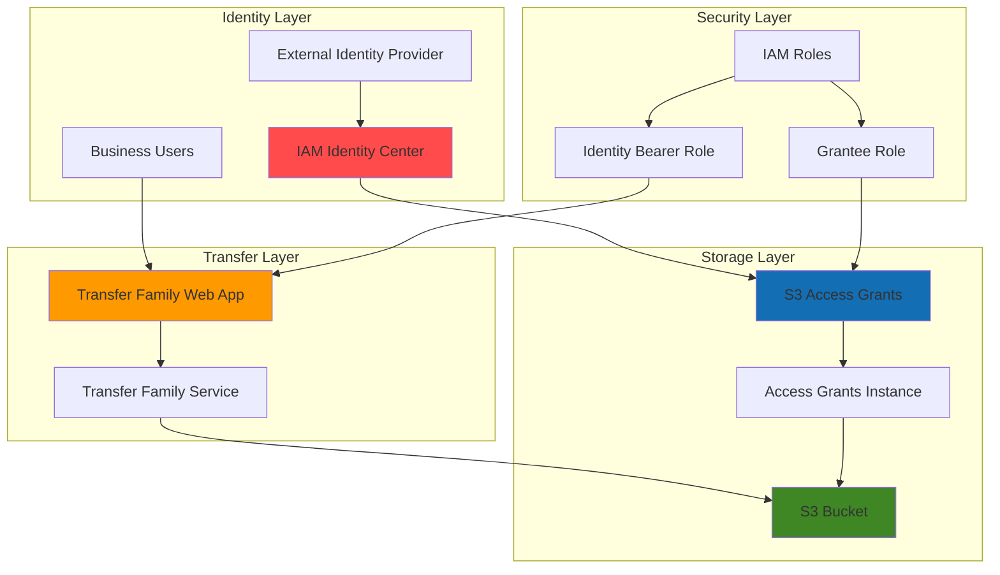

# Managing Files with Web Interfaces

## Problem

Organizations struggle to provide secure, user-friendly file sharing solutions that enable business users to upload, download, and manage files without requiring technical expertise or custom applications. Traditional file transfer solutions often require complex client software, technical training, and create security vulnerabilities when users resort to unsecured alternatives like email attachments or consumer cloud storage services.

## Solution

AWS Transfer Family Web Apps provides a fully managed, branded web portal that enables business users to securely transfer files to and from Amazon S3 through a simple browser interface. By integrating with AWS IAM Identity Center and S3 Access Grants, this solution delivers fine-grained access control and seamless single sign-on capabilities while maintaining enterprise-grade security and compliance standards.

## Architecture Diagram



## Prerequisites

1. AWS account with appropriate permissions to create IAM Identity Center instances, S3 buckets, and Transfer Family resources
2. AWS CLI v2 installed and configured (or AWS CloudShell)
3. Basic understanding of AWS IAM, S3, and identity management concepts
4. Corporate directory or identity provider for user authentication (optional)
5. Estimated cost: $10-25/month for development/testing workloads

> **Note**: This recipe uses IAM Identity Center which requires organization-level setup. Ensure you have appropriate permissions or coordinate with your AWS organization administrator.

## Preparation

```bash
# Set environment variables
export AWS_REGION=$(aws configure get region)
export AWS_ACCOUNT_ID=$(aws sts get-caller-identity \
    --query Account --output text)

# Generate unique identifiers for resources
RANDOM_SUFFIX=$(aws secretsmanager get-random-password \
    --exclude-punctuation --exclude-uppercase \
    --password-length 6 --require-each-included-type \
    --output text --query RandomPassword)

# Set resource names
export BUCKET_NAME="file-management-demo-${RANDOM_SUFFIX}"
export WEBAPP_NAME="file-management-webapp-${RANDOM_SUFFIX}"
export GRANTS_INSTANCE_NAME="file-management-grants-${RANDOM_SUFFIX}"

# Create S3 bucket for file storage
aws s3 mb s3://${BUCKET_NAME} --region ${AWS_REGION}

# Enable versioning and encryption
aws s3api put-bucket-versioning \
    --bucket ${BUCKET_NAME} \
    --versioning-configuration Status=Enabled

aws s3api put-bucket-encryption \
    --bucket ${BUCKET_NAME} \
    --server-side-encryption-configuration \
    'Rules=[{ApplyServerSideEncryptionByDefault:{SSEAlgorithm:AES256}}]'

echo "✅ AWS environment configured with bucket: ${BUCKET_NAME}"
```

## Steps

1. **Enable and Configure IAM Identity Center**:

   IAM Identity Center provides the centralized identity management foundation for secure authentication and authorization. This service enables single sign-on capabilities and integrates with external identity providers while maintaining fine-grained access controls for your Transfer Family Web App.

   ```bash
   # Check if IAM Identity Center is already enabled
   IDC_INSTANCE=$(aws sso-admin list-instances \
       --query 'Instances[0].InstanceArn' \
       --output text)
   
   if [ "$IDC_INSTANCE" = "None" ]; then
       echo "IAM Identity Center needs to be enabled in your organization"
       echo "Please enable it via the AWS console or contact your administrator"
       exit 1
   fi
   
   # Store the Identity Center instance ARN
   export IDC_INSTANCE_ARN=$IDC_INSTANCE
   export IDC_IDENTITY_STORE_ID=$(aws sso-admin list-instances \
       --query 'Instances[0].IdentityStoreId' \
       --output text)
   
   echo "✅ IAM Identity Center instance found: ${IDC_INSTANCE_ARN}"
   ```

2. **Create IAM Identity Center Test User**:

   Creating a test user demonstrates the end-user experience and validates the authentication flow. This user will represent a typical business user who needs secure file access without technical complexity, showcasing how IAM Identity Center simplifies user management for web applications.

   ```bash
   # Create a test user in IAM Identity Center
   aws identitystore create-user \
       --identity-store-id ${IDC_IDENTITY_STORE_ID} \
       --user-name "testuser" \
       --display-name "Test User" \
       --emails '[{"Value":"testuser@example.com","Type":"Work","Primary":true}]' \
       --name '{"GivenName":"Test","FamilyName":"User"}'
   
   # Get the user ID for later use
   export TEST_USER_ID=$(aws identitystore list-users \
       --identity-store-id ${IDC_IDENTITY_STORE_ID} \
       --query 'Users[?UserName==`testuser`].UserId' \
       --output text)
   
   echo "✅ Test user created with ID: ${TEST_USER_ID}"
   ```

3. **Create S3 Access Grants Instance**:

   S3 Access Grants provides fine-grained access control capabilities that enable you to grant specific permissions to S3 resources based on user identity. This service eliminates the need for complex IAM policies while maintaining security best practices and follows the AWS principle of least privilege access.

   ```bash
   # Create S3 Access Grants instance with IAM Identity Center integration
   aws s3control create-access-grants-instance \
       --account-id ${AWS_ACCOUNT_ID} \
       --identity-center-arn ${IDC_INSTANCE_ARN} \
       --tags Key=Name,Value=${GRANTS_INSTANCE_NAME} \
           Key=Purpose,Value=FileManagement
   
   # Get the Access Grants instance ARN
   export GRANTS_INSTANCE_ARN=$(aws s3control get-access-grants-instance \
       --account-id ${AWS_ACCOUNT_ID} \
       --query 'AccessGrantsInstanceArn' \
       --output text)
   
   echo "✅ S3 Access Grants instance created: ${GRANTS_INSTANCE_ARN}"
   ```

4. **Register S3 Location with Access Grants**:

   Registering an S3 location with Access Grants creates the foundation for fine-grained access control. This step associates your S3 bucket with the Access Grants system, enabling granular permissions management at the prefix or object level while maintaining enterprise security standards.

   ```bash
   # Create IAM role for S3 Access Grants
   cat > access-grants-role-trust-policy.json << 'EOF'
{
    "Version": "2012-10-17",
    "Statement": [
        {
            "Effect": "Allow",
            "Principal": {
                "Service": "s3.amazonaws.com"
            },
            "Action": "sts:AssumeRole"
        }
    ]
}
EOF
   
   # Create the IAM role
   aws iam create-role \
       --role-name S3AccessGrantsRole-${RANDOM_SUFFIX} \
       --assume-role-policy-document file://access-grants-role-trust-policy.json
   
   # Attach the required policy
   aws iam attach-role-policy \
       --role-name S3AccessGrantsRole-${RANDOM_SUFFIX} \
       --policy-arn arn:aws:iam::aws:policy/AmazonS3FullAccess
   
   export GRANTS_ROLE_ARN="arn:aws:iam::${AWS_ACCOUNT_ID}:role/S3AccessGrantsRole-${RANDOM_SUFFIX}"
   
   # Register the S3 location
   aws s3control create-access-grants-location \
       --account-id ${AWS_ACCOUNT_ID} \
       --location-scope s3://${BUCKET_NAME}/* \
       --iam-role-arn ${GRANTS_ROLE_ARN} \
       --tags Key=Name,Value=FileManagementLocation
   
   echo "✅ S3 location registered with Access Grants"
   ```

5. **Create Access Grant for Test User**:

   Access grants define specific permissions for users or groups to access S3 resources. This step demonstrates how to grant fine-grained access control, allowing users to read and write files within specific S3 prefixes while maintaining security boundaries and implementing zero-trust access principles.

   ```bash
   # Create an access grant for the test user
   aws s3control create-access-grant \
       --account-id ${AWS_ACCOUNT_ID} \
       --access-grants-location-id $(aws s3control list-access-grants-locations \
           --account-id ${AWS_ACCOUNT_ID} \
           --query 'AccessGrantsLocationsList[0].AccessGrantsLocationId' \
           --output text) \
       --access-grants-location-configuration LocationScope=s3://${BUCKET_NAME}/user-files/* \
       --grantee GranteeType=IAM_IDENTITY_CENTER_USER,GranteeIdentifier=${TEST_USER_ID} \
       --permission READWRITE \
       --tags Key=Name,Value=TestUserGrant
   
   echo "✅ Access grant created for test user"
   ```

6. **Create Identity Bearer Role for Transfer Family**:

   The Identity Bearer Role enables Transfer Family Web Apps to assume user identities and request temporary credentials from S3 Access Grants. This role bridges the authentication layer with the authorization layer, ensuring secure access to S3 resources while maintaining the principle of least privilege and enabling dynamic permission evaluation.

   ```bash
   # Create trust policy for Identity Bearer Role
   cat > identity-bearer-trust-policy.json << 'EOF'
{
    "Version": "2012-10-17",
    "Statement": [
        {
            "Effect": "Allow",
            "Principal": {
                "Service": "transfer.amazonaws.com"
            },
            "Action": "sts:AssumeRole"
        }
    ]
}
EOF
   
   # Create the Identity Bearer Role
   aws iam create-role \
       --role-name TransferIdentityBearerRole-${RANDOM_SUFFIX} \
       --assume-role-policy-document file://identity-bearer-trust-policy.json
   
   # Create and attach policy for S3 Access Grants
   cat > identity-bearer-policy.json << EOF
{
    "Version": "2012-10-17",
    "Statement": [
        {
            "Effect": "Allow",
            "Action": [
                "s3:GetDataAccess"
            ],
            "Resource": "*"
        },
        {
            "Effect": "Allow",
            "Action": [
                "sso:DescribeInstance"
            ],
            "Resource": "*"
        }
    ]
}
EOF
   
   aws iam put-role-policy \
       --role-name TransferIdentityBearerRole-${RANDOM_SUFFIX} \
       --policy-name S3AccessGrantsPolicy \
       --policy-document file://identity-bearer-policy.json
   
   export IDENTITY_BEARER_ROLE_ARN="arn:aws:iam::${AWS_ACCOUNT_ID}:role/TransferIdentityBearerRole-${RANDOM_SUFFIX}"
   
   echo "✅ Identity Bearer Role created: ${IDENTITY_BEARER_ROLE_ARN}"
   ```

7. **Create Transfer Family Web App**:

   Transfer Family Web Apps provide the user-facing interface that enables secure file transfers through a web browser. This fully managed service eliminates the need for custom application development while providing enterprise-grade security, branding, and user experience with automatic scaling and high availability.

   ```bash
   # Create the Transfer Family Web App
   aws transfer create-web-app \
       --identity-provider-details '{
           "IdentityCenterConfig": {
               "InstanceArn": "'${IDC_INSTANCE_ARN}'",
               "Role": "'${IDENTITY_BEARER_ROLE_ARN}'"
           }
       }' \
       --tags Key=Name,Value=${WEBAPP_NAME} \
           Key=Environment,Value=Demo
   
   # Wait for web app to be created
   echo "Waiting for web app to be created..."
   sleep 30
   
   # Get the Web App ARN
   export WEBAPP_ARN=$(aws transfer list-web-apps \
       --query 'WebApps[?contains(Tags[?Key==`Name`].Value, `'${WEBAPP_NAME}'`)].Arn' \
       --output text)
   
   # Get the Web App URL
   export WEBAPP_URL=$(aws transfer describe-web-app \
       --web-app-id ${WEBAPP_ARN} \
       --query 'WebApp.WebAppEndpoint' \
       --output text)
   
   echo "✅ Transfer Family Web App created"
   echo "Web App URL: ${WEBAPP_URL}"
   ```

8. **Configure Web App Branding and Settings**:

   Customizing the web app appearance and behavior creates a professional, branded experience for end users. This step demonstrates how Transfer Family Web Apps support organizational branding requirements while maintaining consistent user experience across different business units.

   ```bash
   # Create sample branding configuration
   cat > webapp-branding.json << 'EOF'
{
    "Title": "Secure File Management Portal",
    "Description": "Upload, download, and manage your files securely",
    "LogoUrl": "https://via.placeholder.com/200x60/0066CC/FFFFFF?text=Your+Logo",
    "FaviconUrl": "https://via.placeholder.com/32x32/0066CC/FFFFFF?text=F"
}
EOF
   
   # Update web app with branding
   aws transfer update-web-app \
       --web-app-id ${WEBAPP_ARN} \
       --branding file://webapp-branding.json
   
   echo "✅ Web app branding configured"
   ```

9. **Create Test Files and Folder Structure**:

   Setting up a sample folder structure demonstrates the organizational capabilities of the file management system. This step creates a realistic testing environment that showcases how users will interact with the system in production scenarios, including folder navigation and file organization patterns.

   ```bash
   # Create sample folder structure in S3
   aws s3api put-object \
       --bucket ${BUCKET_NAME} \
       --key "user-files/documents/README.txt" \
       --body /dev/stdin << 'EOF'
Welcome to the Secure File Management Portal!

This system provides a secure, easy-to-use interface for managing your files.

Getting Started:
1. Navigate through folders using the web interface
2. Upload files by dragging and dropping or using the upload button
3. Download files by clicking on them
4. Create new folders using the "New Folder" button

For support, contact your IT administrator.
EOF
   
   # Create additional sample files
   aws s3api put-object \
       --bucket ${BUCKET_NAME} \
       --key "user-files/documents/sample-document.txt" \
       --body /dev/stdin << 'EOF'
This is a sample document to demonstrate file management capabilities.
You can upload, download, and manage files like this one through the web interface.
EOF
   
   # Create shared folder structure
   aws s3api put-object \
       --bucket ${BUCKET_NAME} \
       --key "user-files/shared/team-resources.txt" \
       --body /dev/stdin << 'EOF'
This folder contains shared resources for the team.
All team members have access to files in this location.
EOF
   
   echo "✅ Sample folder structure and files created"
   ```

## Validation & Testing

1. **Verify S3 Access Grants Configuration**:

   ```bash
   # Check S3 Access Grants instance
   aws s3control get-access-grants-instance \
       --account-id ${AWS_ACCOUNT_ID}
   
   # List access grants locations
   aws s3control list-access-grants-locations \
       --account-id ${AWS_ACCOUNT_ID}
   
   # List access grants
   aws s3control list-access-grants \
       --account-id ${AWS_ACCOUNT_ID}
   ```

   Expected output: Shows active Access Grants instance, registered location, and user grants.

2. **Test IAM Identity Center Integration**:

   ```bash
   # Verify IAM Identity Center user
   aws identitystore list-users \
       --identity-store-id ${IDC_IDENTITY_STORE_ID} \
       --query 'Users[?UserName==`testuser`]'
   
   # Check Identity Center instance status
   aws sso-admin list-instances
   ```

   Expected output: Displays test user information and active Identity Center instance.

3. **Verify Transfer Family Web App**:

   ```bash
   # Check web app status
   aws transfer describe-web-app \
       --web-app-id ${WEBAPP_ARN}
   
   # List all web apps
   aws transfer list-web-apps
   ```

   Expected output: Shows active web app with configured branding and Identity Center integration.

4. **Test S3 Bucket and File Structure**:

   ```bash
   # Verify S3 bucket contents
   aws s3 ls s3://${BUCKET_NAME}/user-files/ --recursive
   
   # Check bucket configuration
   aws s3api get-bucket-versioning --bucket ${BUCKET_NAME}
   aws s3api get-bucket-encryption --bucket ${BUCKET_NAME}
   ```

   Expected output: Lists sample files and shows enabled versioning and encryption.

5. **Access Web App Interface**:

   ```bash
   echo "Web App URL: ${WEBAPP_URL}"
   echo "Test User: testuser"
   echo "Access the web app in your browser and log in with the test user"
   ```

   Expected behavior: Web app loads successfully, shows branding, and allows secure file operations.

## Cleanup

1. **Remove Transfer Family Web App**:

   ```bash
   # Delete the web app
   aws transfer delete-web-app \
       --web-app-id ${WEBAPP_ARN}
   
   echo "✅ Transfer Family Web App deleted"
   ```

2. **Remove S3 Access Grants Resources**:

   ```bash
   # Delete access grants
   for grant_id in $(aws s3control list-access-grants \
       --account-id ${AWS_ACCOUNT_ID} \
       --query 'AccessGrantsList[].AccessGrantId' \
       --output text); do
       if [ "$grant_id" != "None" ]; then
           aws s3control delete-access-grant \
               --account-id ${AWS_ACCOUNT_ID} \
               --access-grant-id $grant_id
       fi
   done
   
   # Delete access grants locations
   for location_id in $(aws s3control list-access-grants-locations \
       --account-id ${AWS_ACCOUNT_ID} \
       --query 'AccessGrantsLocationsList[].AccessGrantsLocationId' \
       --output text); do
       if [ "$location_id" != "None" ]; then
           aws s3control delete-access-grants-location \
               --account-id ${AWS_ACCOUNT_ID} \
               --access-grants-location-id $location_id
       fi
   done
   
   # Delete access grants instance
   aws s3control delete-access-grants-instance \
       --account-id ${AWS_ACCOUNT_ID}
   
   echo "✅ S3 Access Grants resources deleted"
   ```

3. **Remove IAM Roles and Policies**:

   ```bash
   # Delete Identity Bearer Role
   aws iam delete-role-policy \
       --role-name TransferIdentityBearerRole-${RANDOM_SUFFIX} \
       --policy-name S3AccessGrantsPolicy
   
   aws iam delete-role \
       --role-name TransferIdentityBearerRole-${RANDOM_SUFFIX}
   
   # Delete S3 Access Grants Role
   aws iam detach-role-policy \
       --role-name S3AccessGrantsRole-${RANDOM_SUFFIX} \
       --policy-arn arn:aws:iam::aws:policy/AmazonS3FullAccess
   
   aws iam delete-role \
       --role-name S3AccessGrantsRole-${RANDOM_SUFFIX}
   
   echo "✅ IAM roles and policies deleted"
   ```

4. **Remove S3 Bucket and Contents**:

   ```bash
   # Delete all objects in bucket
   aws s3 rm s3://${BUCKET_NAME} --recursive
   
   # Delete all object versions and delete markers (if any)
   aws s3api list-object-versions \
       --bucket ${BUCKET_NAME} \
       --output json > versions.json
   
   # Extract and delete versions if they exist
   if [ -s versions.json ] && [ "$(jq '.Versions // [] | length' versions.json)" -gt 0 ]; then
       jq -r '.Versions[]? | "\(.Key)\t\(.VersionId)"' versions.json | \
       while IFS=$'\t' read -r key version_id; do
           aws s3api delete-object \
               --bucket ${BUCKET_NAME} \
               --key "$key" \
               --version-id "$version_id"
       done
   fi
   
   # Extract and delete delete markers if they exist
   if [ -s versions.json ] && [ "$(jq '.DeleteMarkers // [] | length' versions.json)" -gt 0 ]; then
       jq -r '.DeleteMarkers[]? | "\(.Key)\t\(.VersionId)"' versions.json | \
       while IFS=$'\t' read -r key version_id; do
           aws s3api delete-object \
               --bucket ${BUCKET_NAME} \
               --key "$key" \
               --version-id "$version_id"
       done
   fi
   
   # Delete bucket
   aws s3 rb s3://${BUCKET_NAME}
   
   echo "✅ S3 bucket and contents deleted"
   ```

5. **Remove IAM Identity Center Test User**:

   ```bash
   # Delete test user
   aws identitystore delete-user \
       --identity-store-id ${IDC_IDENTITY_STORE_ID} \
       --user-id ${TEST_USER_ID}
   
   # Clean up local files
   rm -f access-grants-role-trust-policy.json
   rm -f identity-bearer-trust-policy.json
   rm -f identity-bearer-policy.json
   rm -f webapp-branding.json
   rm -f versions.json
   
   echo "✅ Test user and local files cleaned up"
   ```

## Discussion

AWS Transfer Family Web Apps represents a significant advancement in secure file sharing capabilities, providing organizations with a fully managed, browser-based interface for S3 file transfers. This solution eliminates the complexity of traditional file transfer protocols while maintaining enterprise-grade security through native integration with AWS IAM Identity Center and S3 Access Grants. The serverless architecture ensures automatic scaling and high availability without requiring infrastructure management.

The integration between Transfer Family Web Apps and S3 Access Grants provides unprecedented flexibility in access control management. Unlike traditional approaches that require complex IAM policies or custom application development, this solution enables fine-grained permissions at the prefix or object level while supporting both IAM principals and corporate directory users. This approach follows the AWS Well-Architected Framework's security pillar principles, implementing least privilege access while scaling effectively as organizations grow.

The architecture leverages AWS's serverless and managed services to provide high availability, automatic scaling, and cost-effectiveness. The web app interface is built on AWS's global infrastructure, ensuring consistent performance and reliability across regions. The integration with IAM Identity Center enables seamless single sign-on experiences while supporting various identity providers through SAML and OIDC protocols, reducing the burden on IT departments for user management.

From a security perspective, the solution implements multiple layers of protection including encryption at rest and in transit, identity-based access controls, and comprehensive audit logging through AWS CloudTrail. The use of temporary credentials and session-based access ensures that permissions are dynamically evaluated and can be revoked instantly when needed, supporting zero-trust security models and compliance requirements.

> **Tip**: Consider implementing S3 lifecycle policies to automatically transition older files to cheaper storage classes like S3 Intelligent-Tiering or S3 Glacier, reducing long-term storage costs while maintaining accessibility through the web interface.

For detailed implementation guidance, refer to the [AWS Transfer Family User Guide](https://docs.aws.amazon.com/transfer/latest/userguide/), [S3 Access Grants documentation](https://docs.aws.amazon.com/AmazonS3/latest/userguide/access-grants.html), [IAM Identity Center documentation](https://docs.aws.amazon.com/singlesignon/latest/userguide/), and the [AWS Well-Architected Framework](https://docs.aws.amazon.com/wellarchitected/latest/framework/) for architectural best practices.

## Challenge

Extend this solution by implementing these enhancements:

1. **Multi-Department Access Control**: Configure separate S3 prefixes for different departments (HR, Finance, Legal) with department-specific access grants and user groups in IAM Identity Center, implementing role-based access control patterns.

2. **Automated File Processing**: Implement S3 Event Notifications to trigger Lambda functions for automated file processing, virus scanning using Amazon GuardDuty Malware Protection, or content classification when files are uploaded through the web app.

3. **Compliance and Audit Reporting**: Create CloudWatch dashboards and automated reports using S3 Access Logs and CloudTrail to track file access patterns, user activities, and compliance metrics with automated alerting for suspicious activities.

4. **Advanced Branding and Customization**: Develop custom CSS styling hosted in S3 and CloudFront, and implement organization-specific workflows like approval processes for sensitive file uploads using AWS Step Functions.

5. **Integration with External Systems**: Connect the file management system with external business applications using API Gateway and Lambda functions to enable automated workflows, document management system integration, and data synchronization with enterprise systems.

## Infrastructure Code

*Infrastructure code will be generated after recipe approval.*