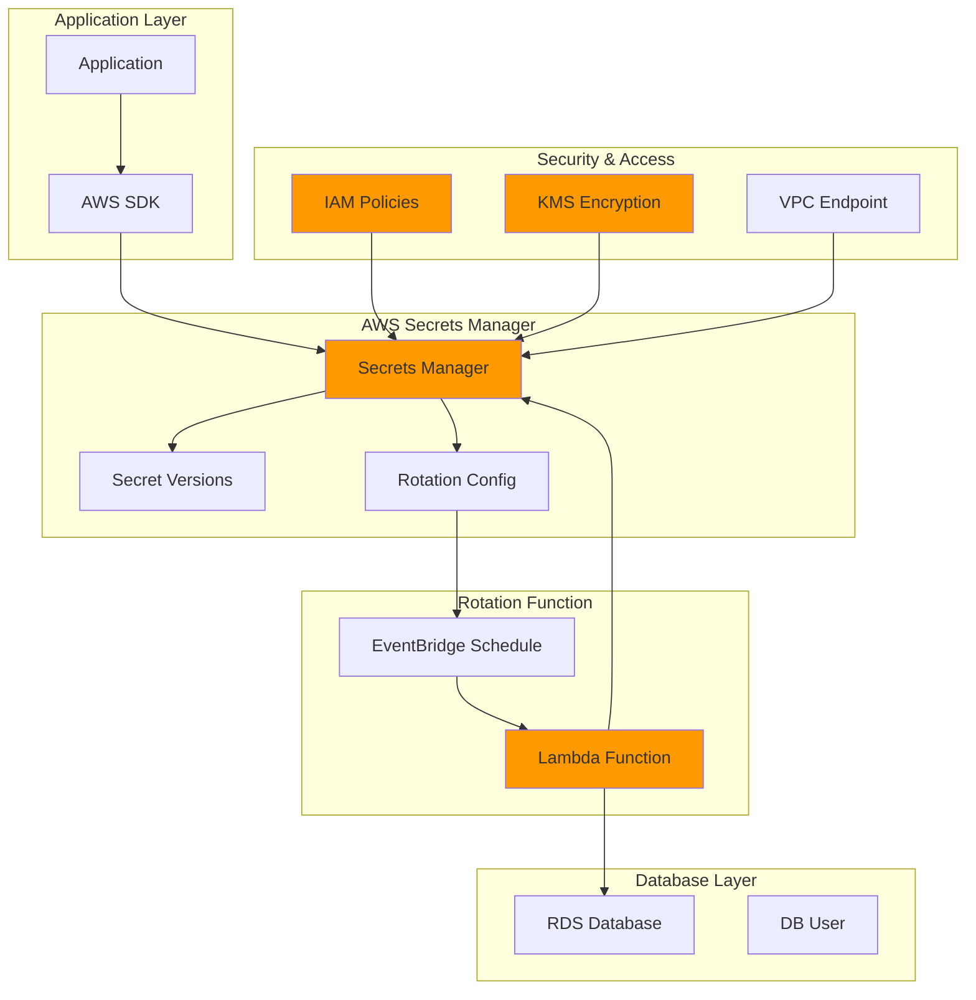

# Managing Secrets with Automated Rotation

## Problem

Organizations struggle with managing sensitive credentials like database passwords, API keys, and access tokens across their distributed applications. Manual credential rotation creates security risks, increases operational overhead, and often results in hardcoded secrets in application code. Development teams need a centralized, secure solution that automatically rotates credentials while providing fine-grained access control and seamless application integration without compromising security best practices.

## Solution

AWS Secrets Manager provides a comprehensive secrets management solution that automatically rotates credentials, encrypts secrets at rest and in transit, and integrates with applications through AWS SDKs and APIs. This solution implements automatic password rotation using Lambda functions, establishes fine-grained IAM policies for cross-account access, and demonstrates secure application integration patterns while maintaining audit trails and compliance requirements.

## Architecture Diagram



## Prerequisites

1. AWS account with appropriate permissions for Secrets Manager, Lambda, IAM, and KMS
2. AWS CLI v2 installed and configured (or AWS CloudShell)
3. Basic understanding of database administration and Lambda functions
4. Knowledge of IAM policies and JSON formatting
5. Estimated cost: $2-5 per month for secrets storage and rotation executions

> **Note**: This recipe creates billable resources. Secrets Manager charges $0.40 per secret per month plus $0.05 per 10,000 API calls.

## Preparation

```bash
# Set environment variables
export AWS_REGION=$(aws configure get region)
export AWS_ACCOUNT_ID=$(aws sts get-caller-identity \
    --query Account --output text)

# Generate unique identifiers for resources
RANDOM_SUFFIX=$(aws secretsmanager get-random-password \
    --exclude-punctuation --exclude-uppercase \
    --password-length 6 --require-each-included-type \
    --output text --query RandomPassword)

# Set resource names
export SECRET_NAME="demo-db-credentials-${RANDOM_SUFFIX}"
export LAMBDA_FUNCTION_NAME="secret-rotation-${RANDOM_SUFFIX}"
export IAM_ROLE_NAME="SecretsManagerRotationRole-${RANDOM_SUFFIX}"
export KMS_KEY_ALIAS="alias/secrets-manager-key-${RANDOM_SUFFIX}"

# Create KMS key for encryption
aws kms create-key \
    --description "KMS key for Secrets Manager encryption" \
    --key-usage ENCRYPT_DECRYPT \
    --key-spec SYMMETRIC_DEFAULT \
    --output text --query KeyMetadata.KeyId > /tmp/kms-key-id.txt

export KMS_KEY_ID=$(cat /tmp/kms-key-id.txt)

# Create KMS key alias
aws kms create-alias \
    --alias-name ${KMS_KEY_ALIAS} \
    --target-key-id ${KMS_KEY_ID}

echo "✅ Environment prepared with KMS key: ${KMS_KEY_ID}"
```

## Steps

1. **Create IAM Role for Lambda Rotation Function**:

   IAM roles enable secure, temporary credential delegation without hardcoding secrets in application code. Lambda requires an execution role to interact with AWS services on your behalf, following the principle of least privilege. This foundational security step ensures your rotation function can access only the specific resources it needs while maintaining operational security throughout the secret lifecycle.

   ```bash
   # Create trust policy for Lambda
   cat > /tmp/lambda-trust-policy.json << EOF
   {
       "Version": "2012-10-17",
       "Statement": [
           {
               "Effect": "Allow",
               "Principal": {
                   "Service": "lambda.amazonaws.com"
               },
               "Action": "sts:AssumeRole"
           }
       ]
   }
   EOF
   
   # Create IAM role
   aws iam create-role \
       --role-name ${IAM_ROLE_NAME} \
       --assume-role-policy-document file:///tmp/lambda-trust-policy.json
   
   # Attach basic Lambda execution policy
   aws iam attach-role-policy \
       --role-name ${IAM_ROLE_NAME} \
       --policy-arn arn:aws:iam::aws:policy/service-role/AWSLambdaBasicExecutionRole
   
   echo "✅ IAM role created: ${IAM_ROLE_NAME}"
   ```

2. **Create Custom IAM Policy for Secrets Manager Access**:

   Fine-grained IAM policies enforce the principle of least privilege by granting only essential permissions for secret rotation operations. This policy specifically allows the Lambda function to read, create, and update secret versions while restricting access to other Secrets Manager operations. The KMS permissions enable encryption and decryption operations, ensuring your rotation function can securely manage encrypted secrets.

   ```bash
   # Create Secrets Manager policy
   cat > /tmp/secrets-manager-policy.json << EOF
   {
       "Version": "2012-10-17",
       "Statement": [
           {
               "Effect": "Allow",
               "Action": [
                   "secretsmanager:GetSecretValue",
                   "secretsmanager:DescribeSecret",
                   "secretsmanager:PutSecretValue",
                   "secretsmanager:UpdateSecretVersionStage"
               ],
               "Resource": "arn:aws:secretsmanager:${AWS_REGION}:${AWS_ACCOUNT_ID}:secret:*"
           },
           {
               "Effect": "Allow",
               "Action": [
                   "kms:Decrypt",
                   "kms:DescribeKey",
                   "kms:Encrypt",
                   "kms:GenerateDataKey*",
                   "kms:ReEncrypt*"
               ],
               "Resource": "arn:aws:kms:${AWS_REGION}:${AWS_ACCOUNT_ID}:key/${KMS_KEY_ID}"
           }
       ]
   }
   EOF
   
   # Create and attach policy
   aws iam create-policy \
       --policy-name SecretsManagerRotationPolicy-${RANDOM_SUFFIX} \
       --policy-document file:///tmp/secrets-manager-policy.json
   
   aws iam attach-role-policy \
       --role-name ${IAM_ROLE_NAME} \
       --policy-arn arn:aws:iam::${AWS_ACCOUNT_ID}:policy/SecretsManagerRotationPolicy-${RANDOM_SUFFIX}
   
   echo "✅ Secrets Manager policy attached to role"
   ```

   The IAM role now has the precise permissions needed for secret rotation operations. This security foundation enables the Lambda function to perform encrypted secret operations while preventing unauthorized access to other secrets or KMS keys in your account.

3. **Create Database Secret with Structured Data**:

   Secrets Manager supports structured JSON data, enabling storage of complete connection strings with multiple parameters in a single secret. This approach eliminates the need for multiple secrets while maintaining security and simplifying application integration. The service automatically encrypts your secret using the customer-managed KMS key, ensuring data protection at rest and enabling fine-grained access control.

   ```bash
   # Create database credentials JSON
   cat > /tmp/db-credentials.json << EOF
   {
       "engine": "mysql",
       "host": "demo-database.cluster-abc123.us-east-1.rds.amazonaws.com",
       "username": "admin",
       "password": "$(aws secretsmanager get-random-password \
           --password-length 20 \
           --exclude-characters '"@/\' \
           --require-each-included-type \
           --output text --query RandomPassword)",
       "dbname": "myapp",
       "port": 3306
   }
   EOF
   
   # Create the secret
   aws secretsmanager create-secret \
       --name ${SECRET_NAME} \
       --description "Database credentials for demo application" \
       --secret-string file:///tmp/db-credentials.json \
       --kms-key-id ${KMS_KEY_ID} \
       --tags Key=Environment,Value=Demo \
              Key=Application,Value=MyApp
   
   echo "✅ Database secret created: ${SECRET_NAME}"
   ```

   Your database credentials are now securely stored and encrypted in Secrets Manager. The structured JSON format enables applications to retrieve all connection parameters with a single API call, while the tagging strategy supports cost allocation and automated governance policies.

4. **Create Lambda Rotation Function**:

   AWS Lambda provides a serverless execution environment for implementing custom rotation logic without managing infrastructure. The rotation function follows AWS's four-step rotation model (createSecret, setSecret, testSecret, finishSecret) to ensure zero-downtime credential updates. This approach maintains both current and pending secret versions during rotation, enabling applications to continue operating while credentials are being updated.

   ```bash
   # Create Lambda function code
   cat > /tmp/rotation_lambda.py << 'EOF'
   import json
   import boto3
   import logging
   import os
   
   logger = logging.getLogger()
   logger.setLevel(logging.INFO)
   
   def lambda_handler(event, context):
       """
       Lambda function to handle secret rotation
       """
       try:
           secretsmanager = boto3.client('secretsmanager')
           
           secret_arn = event['SecretId']
           token = event['ClientRequestToken']
           step = event['Step']
           
           logger.info(f"Rotation step: {step} for secret: {secret_arn}")
           
           if step == "createSecret":
               create_secret(secretsmanager, secret_arn, token)
           elif step == "setSecret":
               set_secret(secretsmanager, secret_arn, token)
           elif step == "testSecret":
               test_secret(secretsmanager, secret_arn, token)
           elif step == "finishSecret":
               finish_secret(secretsmanager, secret_arn, token)
           else:
               logger.error(f"Invalid step parameter: {step}")
               raise ValueError(f"Invalid step parameter: {step}")
           
           return {"statusCode": 200, "body": "Rotation completed successfully"}
           
       except Exception as e:
           logger.error(f"Error in lambda_handler: {str(e)}")
           raise
   
   def create_secret(secretsmanager, secret_arn, token):
       """Create a new secret version"""
       try:
           # Check if the secret version already exists
           try:
               secretsmanager.get_secret_value(SecretId=secret_arn, 
                                             VersionId=token, 
                                             VersionStage="AWSPENDING")
               logger.info("createSecret: Version already exists")
               return
           except secretsmanager.exceptions.ResourceNotFoundException:
               pass
           
           current_secret = secretsmanager.get_secret_value(
               SecretId=secret_arn,
               VersionStage="AWSCURRENT"
           )
           
           # Parse current secret
           current_data = json.loads(current_secret['SecretString'])
           
           # Generate new password
           new_password = secretsmanager.get_random_password(
               PasswordLength=20,
               ExcludeCharacters='"@/\\',
               RequireEachIncludedType=True
           )['RandomPassword']
           
           # Update password in secret data
           current_data['password'] = new_password
           
           # Create new secret version
           secretsmanager.put_secret_value(
               SecretId=secret_arn,
               ClientRequestToken=token,
               SecretString=json.dumps(current_data),
               VersionStages=['AWSPENDING']
           )
           
           logger.info("createSecret: Successfully created new secret version")
           
       except Exception as e:
           logger.error(f"createSecret: Error creating secret: {str(e)}")
           raise
   
   def set_secret(secretsmanager, secret_arn, token):
       """Set the secret in the service"""
       logger.info("setSecret: In a real implementation, this would update the database user password")
       # In a real implementation, you would:
       # 1. Get the AWSPENDING secret version
       # 2. Connect to the database using current credentials
       # 3. Update the user's password to the new password
       # 4. Handle any database-specific password policies
       
   def test_secret(secretsmanager, secret_arn, token):
       """Test the secret"""
       logger.info("testSecret: In a real implementation, this would test database connectivity")
       # In a real implementation, you would:
       # 1. Get the AWSPENDING secret version
       # 2. Attempt to connect to the database using new credentials
       # 3. Perform a simple query to validate connectivity
       # 4. Handle connection timeouts and authentication errors
       
   def finish_secret(secretsmanager, secret_arn, token):
       """Finish the rotation"""
       try:
           # Get the current version
           current_version = get_current_version_id(secretsmanager, secret_arn)
           
           # Move AWSPENDING to AWSCURRENT and AWSCURRENT to AWSPREVIOUS
           secretsmanager.update_secret_version_stage(
               SecretId=secret_arn,
               VersionStage="AWSCURRENT",
               MoveToVersionId=token,
               RemoveFromVersionId=current_version
           )
           
           logger.info("finishSecret: Successfully completed rotation")
           
       except Exception as e:
           logger.error(f"finishSecret: Error finishing rotation: {str(e)}")
           raise
   
   def get_current_version_id(secretsmanager, secret_arn):
       """Get the current version ID"""
       try:
           versions = secretsmanager.describe_secret(SecretId=secret_arn)
           
           for version_id, stages in versions['VersionIdsToStages'].items():
               if 'AWSCURRENT' in stages:
                   return version_id
           
           return None
           
       except Exception as e:
           logger.error(f"get_current_version_id: Error: {str(e)}")
           raise
   EOF
   
   # Create deployment package
   cd /tmp && zip rotation_lambda.zip rotation_lambda.py
   
   # Create Lambda function
   aws lambda create-function \
       --function-name ${LAMBDA_FUNCTION_NAME} \
       --runtime python3.12 \
       --role arn:aws:iam::${AWS_ACCOUNT_ID}:role/${IAM_ROLE_NAME} \
       --handler rotation_lambda.lambda_handler \
       --zip-file fileb://rotation_lambda.zip \
       --timeout 60 \
       --description "Lambda function for rotating Secrets Manager secrets"
   
   echo "✅ Lambda rotation function created: ${LAMBDA_FUNCTION_NAME}"
   ```

   The rotation function is now deployed and ready to handle secret rotation events. The four-step process ensures that secret updates occur without service interruption, while comprehensive logging provides visibility into rotation operations for compliance and troubleshooting purposes.

   > **Warning**: In production environments, implement proper database connectivity and credential validation in the setSecret and testSecret functions to ensure rotation operations complete successfully.

5. **Configure Automatic Rotation**:

   Automatic rotation enforces security best practices by regularly updating credentials without manual intervention. Secrets Manager schedules rotation events based on your defined schedule and invokes the Lambda function to perform the credential updates. The service maintains version tracking and rollback capabilities, ensuring business continuity even if rotation operations encounter issues.

   ```bash
   # Get Lambda function ARN
   LAMBDA_ARN=$(aws lambda get-function \
       --function-name ${LAMBDA_FUNCTION_NAME} \
       --query Configuration.FunctionArn \
       --output text)
   
   # Grant Secrets Manager permission to invoke Lambda
   aws lambda add-permission \
       --function-name ${LAMBDA_FUNCTION_NAME} \
       --statement-id SecretsManagerInvoke \
       --action lambda:InvokeFunction \
       --principal secretsmanager.amazonaws.com
   
   # Configure automatic rotation (every 7 days)
   aws secretsmanager rotate-secret \
       --secret-id ${SECRET_NAME} \
       --rotation-lambda-arn ${LAMBDA_ARN} \
       --rotation-rules "{\"ScheduleExpression\": \"rate(7 days)\"}"
   
   echo "✅ Automatic rotation configured for ${SECRET_NAME}"
   ```

   Automatic rotation is now active with a 7-day schedule, significantly reducing credential exposure risk. Secrets Manager will invoke your Lambda function at scheduled intervals, ensuring credentials remain fresh while maintaining application availability through the dual-version approach.

6. **Create Cross-Account Access Policy**:

   Resource-based policies enable secure cross-account access to secrets without requiring role assumption or credential sharing. This approach supports multi-account architectures while maintaining centralized secret management. Tag-based conditions provide additional security controls, ensuring only appropriately tagged secrets are accessible to external accounts.

   ```bash
   # Create resource-based policy for cross-account access
   cat > /tmp/cross-account-policy.json << EOF
   {
       "Version": "2012-10-17",
       "Statement": [
           {
               "Sid": "AllowCrossAccountAccess",
               "Effect": "Allow",
               "Principal": {
                   "AWS": "arn:aws:iam::${AWS_ACCOUNT_ID}:root"
               },
               "Action": "secretsmanager:GetSecretValue",
               "Resource": "*",
               "Condition": {
                   "StringEquals": {
                       "secretsmanager:ResourceTag/Environment": "Demo"
                   }
               }
           }
       ]
   }
   EOF
   
   # Apply resource policy to secret
   aws secretsmanager put-resource-policy \
       --secret-id ${SECRET_NAME} \
       --resource-policy file:///tmp/cross-account-policy.json \
       --block-public-policy
   
   echo "✅ Cross-account access policy configured"
   ```

   Cross-account access is now configured with tag-based security controls. This enables secure secret sharing across organizational boundaries while maintaining fine-grained access control through resource tagging and conditional policies.

7. **Create Application Integration Example**:

   Secure application integration eliminates hardcoded credentials while providing automatic credential refresh capabilities. The AWS SDK handles encryption, authentication, and error handling automatically, simplifying application development while maintaining security best practices. This integration pattern supports both synchronous and asynchronous secret retrieval depending on your application architecture.

   ```bash
   # Create sample application code
   cat > /tmp/app_integration.py << 'EOF'
   import boto3
   import json
   import logging
   from botocore.exceptions import ClientError
   
   logger = logging.getLogger()
   logger.setLevel(logging.INFO)
   
   def get_secret(secret_name, region_name=None):
       """
       Retrieve a secret from AWS Secrets Manager
       """
       if region_name is None:
           region_name = boto3.Session().region_name
           
       session = boto3.session.Session()
       client = session.client(
           service_name='secretsmanager',
           region_name=region_name
       )
       
       try:
           response = client.get_secret_value(SecretId=secret_name)
           
           # Parse the secret value
           secret_data = json.loads(response['SecretString'])
           
           logger.info(f"Successfully retrieved secret: {secret_name}")
           return secret_data
           
       except ClientError as e:
           error_code = e.response['Error']['Code']
           if error_code == 'ResourceNotFoundException':
               logger.error(f"Secret {secret_name} not found")
           elif error_code == 'InvalidRequestException':
               logger.error(f"Invalid request for secret {secret_name}: {e}")
           elif error_code == 'InvalidParameterException':
               logger.error(f"Invalid parameter for secret {secret_name}: {e}")
           elif error_code == 'DecryptionFailure':
               logger.error(f"Cannot decrypt secret {secret_name}: {e}")
           else:
               logger.error(f"Error retrieving secret {secret_name}: {e}")
           raise
       except json.JSONDecodeError as e:
           logger.error(f"Error parsing secret JSON: {e}")
           raise
   
   def connect_to_database(secret_name):
       """
       Example database connection using secrets
       """
       try:
           # Get database credentials from Secrets Manager
           credentials = get_secret(secret_name)
           
           # Extract connection parameters
           host = credentials['host']
           port = credentials['port']
           username = credentials['username']
           password = credentials['password']
           database = credentials['dbname']
           
           # In a real application, you would use these credentials
           # to connect to your database using a library like pymysql or psycopg2
           print(f"Connecting to database: {host}:{port}/{database}")
           print(f"Username: {username}")
           print("Password: [REDACTED]")
           
           return True
           
       except Exception as e:
           logger.error(f"Database connection failed: {e}")
           return False
   
   if __name__ == "__main__":
       # Example usage
       import os
       SECRET_NAME = os.environ.get('SECRET_NAME', 'demo-db-credentials-123456')
       
       if connect_to_database(SECRET_NAME):
           print("✅ Database connection successful")
       else:
           print("❌ Database connection failed")
   EOF
   
   echo "✅ Application integration example created"
   ```

   The integration example demonstrates production-ready patterns for secret retrieval with proper error handling and logging. Applications using this pattern automatically receive updated credentials during rotation without requiring code changes or service restarts.

8. **Set Up CloudWatch Monitoring**:

   Comprehensive monitoring provides visibility into secret rotation operations and enables proactive response to potential issues. CloudWatch metrics track rotation success rates, while alarms provide immediate notification of failures. This observability foundation supports compliance reporting and operational excellence by providing detailed audit trails of all secret access and rotation activities.

   ```bash
   # Create CloudWatch dashboard
   cat > /tmp/dashboard.json << EOF
   {
       "widgets": [
           {
               "type": "metric",
               "width": 12,
               "height": 6,
               "properties": {
                   "metrics": [
                       ["AWS/SecretsManager", "RotationSucceeded", "SecretName", "${SECRET_NAME}"],
                       [".", "RotationFailed", ".", "."]
                   ],
                   "period": 300,
                   "stat": "Sum",
                   "region": "${AWS_REGION}",
                   "title": "Secret Rotation Status",
                   "yAxis": {
                       "left": {
                           "min": 0
                       }
                   }
               }
           }
       ]
   }
   EOF
   
   # Create dashboard
   aws cloudwatch put-dashboard \
       --dashboard-name "SecretsManager-${RANDOM_SUFFIX}" \
       --dashboard-body file:///tmp/dashboard.json
   
   # Create CloudWatch alarm for rotation failures
   aws cloudwatch put-metric-alarm \
       --alarm-name "SecretsManager-RotationFailure-${RANDOM_SUFFIX}" \
       --alarm-description "Alert when secret rotation fails" \
       --metric-name RotationFailed \
       --namespace AWS/SecretsManager \
       --statistic Sum \
       --period 300 \
       --threshold 1 \
       --comparison-operator GreaterThanOrEqualToThreshold \
       --evaluation-periods 1 \
       --dimensions Name=SecretName,Value=${SECRET_NAME}
   
   echo "✅ CloudWatch monitoring configured"
   ```

   Monitoring and alerting are now active for your secrets management operations. The dashboard provides real-time visibility into rotation status, while alarms ensure immediate notification of any rotation failures requiring investigation.

   > **Tip**: Configure additional CloudWatch Logs Insights queries to analyze secret access patterns and identify potential security anomalies. See the [CloudWatch Logs Insights documentation](https://docs.aws.amazon.com/AmazonCloudWatch/latest/logs/AnalyzingLogData.html) for advanced query examples.

## Validation & Testing

1. **Verify Secret Creation and Encryption**:

   Validating secret creation confirms proper encryption configuration and metadata storage. This verification ensures your secret is properly configured with the customer-managed KMS key and automatic rotation settings before proceeding with application integration.

   ```bash
   # Describe the secret
   aws secretsmanager describe-secret \
       --secret-id ${SECRET_NAME}
   
   # Check if rotation is configured
   aws secretsmanager describe-secret \
       --secret-id ${SECRET_NAME} \
       --query 'RotationEnabled'
   ```

   Expected output: `true` indicating rotation is enabled

2. **Test Secret Retrieval**:

   Secret retrieval testing validates that your IAM permissions and KMS key policies allow proper access to encrypted secret data. This verification confirms the complete credential retrieval workflow functions correctly for application integration.

   ```bash
   # Retrieve secret value
   aws secretsmanager get-secret-value \
       --secret-id ${SECRET_NAME} \
       --query SecretString \
       --output text | jq '.'
   ```

   Expected output: JSON object with database credentials

3. **Test Manual Rotation**:

   Manual rotation testing validates the complete rotation workflow and Lambda function execution. This verification ensures your rotation logic correctly creates new secret versions and manages the transition between current and pending credentials.

   ```bash
   # Trigger immediate rotation
   aws secretsmanager rotate-secret \
       --secret-id ${SECRET_NAME}
   
   # Wait for rotation to complete
   sleep 30
   
   # Check rotation status
   aws secretsmanager describe-secret \
       --secret-id ${SECRET_NAME} \
       --query 'VersionIdsToStages'
   ```

   Expected output: Multiple versions with AWSCURRENT and AWSPREVIOUS stages

4. **Verify Lambda Function Execution**:

   Lambda execution logs provide detailed information about rotation operations and help identify any issues with the rotation process. Monitoring these logs ensures your custom rotation logic executes successfully and handles all rotation steps correctly.

   ```bash
   # Check Lambda function logs
   aws logs describe-log-groups \
       --log-group-name-prefix "/aws/lambda/${LAMBDA_FUNCTION_NAME}"
   
   # Get recent log events (wait for log group creation)
   sleep 10
   aws logs describe-log-streams \
       --log-group-name "/aws/lambda/${LAMBDA_FUNCTION_NAME}" \
       --order-by LastEventTime \
       --descending \
       --max-items 1
   ```

5. **Test Cross-Account Access Policy**:

   Resource policy validation confirms that your cross-account access controls are properly configured and syntactically correct. This verification ensures external accounts can access secrets according to your security requirements while maintaining proper access restrictions.

   ```bash
   # Validate resource policy
   aws secretsmanager validate-resource-policy \
       --resource-policy file:///tmp/cross-account-policy.json
   
   # Get applied resource policy
   aws secretsmanager get-resource-policy \
       --secret-id ${SECRET_NAME}
   ```

## Cleanup

1. **Stop Rotation and Delete Secret**:

   Proper cleanup begins with stopping rotation operations to prevent Lambda executions during resource deletion. The force-delete option bypasses the normal 7-day recovery window, immediately removing the secret and all versions to avoid ongoing charges.

   ```bash
   # Cancel rotation if active
   aws secretsmanager cancel-rotate-secret \
       --secret-id ${SECRET_NAME} || true
   
   # Delete secret immediately
   aws secretsmanager delete-secret \
       --secret-id ${SECRET_NAME} \
       --force-delete-without-recovery
   
   echo "✅ Secret deleted: ${SECRET_NAME}"
   ```

2. **Remove Lambda Function and IAM Resources**:

   IAM resource cleanup requires detaching policies before deletion to maintain referential integrity. This systematic approach ensures all permissions and roles are properly removed without leaving orphaned resources that could pose security risks.

   ```bash
   # Delete Lambda function
   aws lambda delete-function \
       --function-name ${LAMBDA_FUNCTION_NAME}
   
   # Detach and delete IAM policies
   aws iam detach-role-policy \
       --role-name ${IAM_ROLE_NAME} \
       --policy-arn arn:aws:iam::aws:policy/service-role/AWSLambdaBasicExecutionRole
   
   aws iam detach-role-policy \
       --role-name ${IAM_ROLE_NAME} \
       --policy-arn arn:aws:iam::${AWS_ACCOUNT_ID}:policy/SecretsManagerRotationPolicy-${RANDOM_SUFFIX}
   
   # Delete custom policy
   aws iam delete-policy \
       --policy-arn arn:aws:iam::${AWS_ACCOUNT_ID}:policy/SecretsManagerRotationPolicy-${RANDOM_SUFFIX}
   
   # Delete IAM role
   aws iam delete-role \
       --role-name ${IAM_ROLE_NAME}
   
   echo "✅ Lambda function and IAM resources deleted"
   ```

3. **Remove KMS Key and Monitoring Resources**:

   KMS key deletion follows a mandatory waiting period to prevent accidental data loss, as encrypted data becomes unrecoverable once keys are deleted. CloudWatch resources should be removed to prevent unnecessary charges and maintain a clean monitoring environment.

   ```bash
   # Delete KMS key alias
   aws kms delete-alias \
       --alias-name ${KMS_KEY_ALIAS}
   
   # Schedule KMS key deletion
   aws kms schedule-key-deletion \
       --key-id ${KMS_KEY_ID} \
       --pending-window-in-days 7
   
   # Delete CloudWatch dashboard
   aws cloudwatch delete-dashboards \
       --dashboard-names "SecretsManager-${RANDOM_SUFFIX}"
   
   # Delete CloudWatch alarm
   aws cloudwatch delete-alarms \
       --alarm-names "SecretsManager-RotationFailure-${RANDOM_SUFFIX}"
   
   echo "✅ KMS key and monitoring resources cleaned up"
   ```

4. **Remove Temporary Files**:

   ```bash
   # Clean up temporary files
   rm -f /tmp/kms-key-id.txt
   rm -f /tmp/lambda-trust-policy.json
   rm -f /tmp/secrets-manager-policy.json
   rm -f /tmp/db-credentials.json
   rm -f /tmp/rotation_lambda.py
   rm -f /tmp/rotation_lambda.zip
   rm -f /tmp/cross-account-policy.json
   rm -f /tmp/app_integration.py
   rm -f /tmp/dashboard.json
   
   # Clear environment variables
   unset SECRET_NAME LAMBDA_FUNCTION_NAME IAM_ROLE_NAME KMS_KEY_ALIAS KMS_KEY_ID
   
   echo "✅ Cleanup completed"
   ```

## Discussion

AWS Secrets Manager provides a comprehensive solution for managing sensitive information throughout its lifecycle, following AWS Well-Architected Framework security principles. The service automatically encrypts secrets at rest using AWS KMS and in transit using TLS 1.2, ensuring data protection meets enterprise security standards. By implementing automatic rotation, organizations can enforce security best practices without manual intervention, significantly reducing the risk of credential compromise while maintaining operational excellence.

The Lambda-based rotation function demonstrates how to implement custom rotation logic for various services. While this example shows a simplified rotation process, production implementations should include proper database connections, error handling, and rollback mechanisms. The four-step rotation process (createSecret, setSecret, testSecret, finishSecret) ensures that applications experience no downtime during credential updates by maintaining both current and pending versions, supporting the reliability pillar of the Well-Architected Framework.

Fine-grained access control through IAM policies and resource-based policies enables secure cross-account access while maintaining the principle of least privilege. The integration with CloudWatch provides comprehensive monitoring and alerting capabilities, allowing teams to track rotation success rates and respond to failures promptly. For production environments, consider implementing additional security measures such as VPC endpoints for private connectivity and AWS CloudTrail for comprehensive audit logging. Always use structured JSON for storing multiple credential components, enable automatic rotation for all production secrets, and implement proper error handling in rotation functions to prevent credential corruption. See the [AWS Secrets Manager User Guide](https://docs.aws.amazon.com/secretsmanager/latest/userguide/intro.html) for comprehensive best practices and implementation guidance.

> **Note**: This implementation follows [AWS Well-Architected Framework](https://docs.aws.amazon.com/wellarchitected/latest/framework/welcome.html) principles for operational excellence, security, reliability, and cost optimization.

## Challenge

Extend this solution by implementing these enhancements:

1. **Multi-Region Secret Replication**: Configure automatic replication of secrets across multiple AWS regions for disaster recovery and implement cross-region failover logic in applications using [AWS Secrets Manager replication](https://docs.aws.amazon.com/secretsmanager/latest/userguide/create-manage-multi-region-secrets.html).

2. **Database-Specific Rotation**: Implement rotation functions for specific database types (PostgreSQL, MySQL, Oracle) with proper connection testing and user management capabilities using [AWS-provided rotation templates](https://docs.aws.amazon.com/secretsmanager/latest/userguide/reference_available-rotation-templates.html).

3. **Integration with Container Orchestration**: Set up secrets injection into Amazon EKS pods using the [AWS Secrets and Configuration Provider](https://docs.aws.amazon.com/eks/latest/userguide/manage-secrets.html) (ASCP) for the Kubernetes Secrets Store CSI Driver.

4. **Advanced Security Controls**: Implement secrets approval workflows using AWS Step Functions, integrate with AWS Security Hub for compliance monitoring, and set up automated secret scanning using Amazon Macie for sensitive data discovery.

5. **Cost Optimization and Lifecycle Management**: Create automated policies for secret cleanup, implement tiered storage for historical secret versions, and set up cost alerts for secrets management expenses using AWS Budgets and Cost Anomaly Detection.

## Infrastructure Code

### Available Infrastructure as Code:

- [Infrastructure Code Overview](code/README.md) - Detailed description of all infrastructure components
- [AWS CDK (Python)](code/cdk-python/) - AWS CDK Python implementation
- [AWS CDK (TypeScript)](code/cdk-typescript/) - AWS CDK TypeScript implementation
- [CloudFormation](code/cloudformation.yaml) - AWS CloudFormation template
- [Bash CLI Scripts](code/scripts/) - Example bash scripts using AWS CLI commands to deploy infrastructure
- [Terraform](code/terraform/) - Terraform configuration files