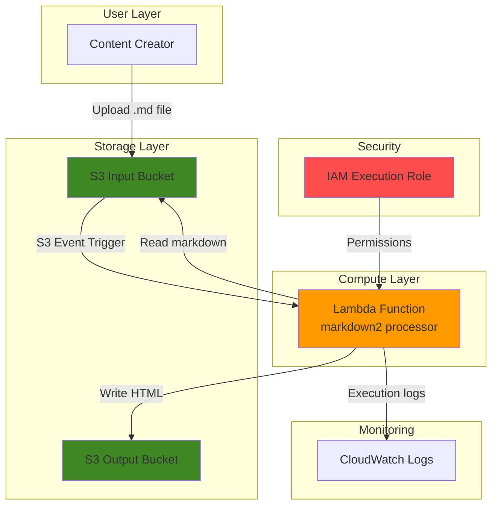

# Simple Markdown to HTML Converter with Lambda and S3

## Problem

Content creators and developers often need to convert Markdown files to HTML for documentation, blogs, or web publishing. Manual conversion is time-consuming and error-prone, while setting up dedicated servers for document processing creates unnecessary infrastructure overhead and ongoing maintenance costs.

## Solution

Build a serverless document converter using AWS Lambda and S3 that automatically transforms uploaded Markdown files into formatted HTML. This event-driven approach provides instant processing, scales automatically with demand, and eliminates server management while keeping costs minimal through pay-per-use pricing.

## Architecture Diagram



## Prerequisites

1. AWS account with appropriate permissions for Lambda, S3, and IAM services
2. AWS CLI installed and configured (or use AWS CloudShell)
3. Basic understanding of serverless computing concepts
4. Python knowledge for understanding the Lambda function code
5. Estimated cost: $0.01-$0.05 for testing (Lambda executions and S3 storage)

> **Note**: This recipe follows AWS Well-Architected Framework principles for cost optimization and operational excellence.

## Preparation

```bash
# Set environment variables
export AWS_REGION=$(aws configure get region)
export AWS_ACCOUNT_ID=$(aws sts get-caller-identity \
    --query Account --output text)

# Generate unique identifiers for resources
RANDOM_SUFFIX=$(aws secretsmanager get-random-password \
    --exclude-punctuation --exclude-uppercase \
    --password-length 6 --require-each-included-type \
    --output text --query RandomPassword)

# Set resource names
export INPUT_BUCKET_NAME="markdown-input-${RANDOM_SUFFIX}"
export OUTPUT_BUCKET_NAME="markdown-output-${RANDOM_SUFFIX}"
export FUNCTION_NAME="markdown-to-html-converter"
export ROLE_NAME="lambda-markdown-converter-role"

echo "✅ AWS environment configured with region: ${AWS_REGION}"
echo "✅ Input bucket: ${INPUT_BUCKET_NAME}"
echo "✅ Output bucket: ${OUTPUT_BUCKET_NAME}"
```

## Steps

1. **Create S3 Input Bucket for Markdown Files**:

   Amazon S3 provides highly durable object storage with 99.999999999% (11 9's) durability, making it ideal for storing source documents. The input bucket will receive Markdown files and trigger our Lambda function through S3 event notifications, enabling seamless event-driven processing.

   ```bash
   # Create input bucket with server-side encryption
   aws s3 mb s3://${INPUT_BUCKET_NAME} --region ${AWS_REGION}
   
   aws s3api put-bucket-encryption \
       --bucket ${INPUT_BUCKET_NAME} \
       --server-side-encryption-configuration \
       'Rules=[{ApplyServerSideEncryptionByDefault:{SSEAlgorithm:AES256}}]'
   
   # Enable versioning for data protection
   aws s3api put-bucket-versioning \
       --bucket ${INPUT_BUCKET_NAME} \
       --versioning-configuration Status=Enabled
   
   echo "✅ Input bucket ${INPUT_BUCKET_NAME} created with encryption"
   ```

   The input bucket now provides enterprise-grade security with encryption at rest and versioning to protect against accidental overwrites or deletions.

2. **Create S3 Output Bucket for HTML Files**:

   The output bucket will store the converted HTML files with the same security features as the input bucket. This separation follows AWS best practices for data organization and allows for different access policies on input and output data.

   ```bash
   # Create output bucket with matching security configuration
   aws s3 mb s3://${OUTPUT_BUCKET_NAME} --region ${AWS_REGION}
   
   aws s3api put-bucket-encryption \
       --bucket ${OUTPUT_BUCKET_NAME} \
       --server-side-encryption-configuration \
       'Rules=[{ApplyServerSideEncryptionByDefault:{SSEAlgorithm:AES256}}]'
   
   aws s3api put-bucket-versioning \
       --bucket ${OUTPUT_BUCKET_NAME} \
       --versioning-configuration Status=Enabled
   
   echo "✅ Output bucket ${OUTPUT_BUCKET_NAME} created with encryption"
   ```

   Both buckets are now configured with consistent security settings and ready to handle document processing workflows.

3. **Create IAM Execution Role for Lambda Function**:

   AWS Lambda requires an execution role to access other AWS services securely. This role follows the principle of least privilege, granting only the minimum permissions needed for S3 access and CloudWatch logging, ensuring optimal security posture.

   ```bash
   # Create trust policy for Lambda service
   cat > trust-policy.json << EOF
   {
     "Version": "2012-10-17",
     "Statement": [
       {
         "Effect": "Allow",
         "Principal": {
           "Service": "lambda.amazonaws.com"
         },
         "Action": "sts:AssumeRole"
       }
     ]
   }
   EOF
   
   # Create the IAM role
   aws iam create-role \
       --role-name ${ROLE_NAME} \
       --assume-role-policy-document file://trust-policy.json
   
   # Store role ARN for later use
   ROLE_ARN=$(aws iam get-role --role-name ${ROLE_NAME} \
       --query 'Role.Arn' --output text)
   
   echo "✅ IAM role ${ROLE_NAME} created: ${ROLE_ARN}"
   ```

   The execution role provides the security foundation for Lambda to operate with controlled access to AWS services.

4. **Attach Required Policies to IAM Role**:

   The Lambda function requires specific permissions to read from the input bucket, write to the output bucket, and create CloudWatch logs for monitoring. These managed policies provide the necessary permissions while following AWS security best practices.

   ```bash
   # Attach basic Lambda execution policy for CloudWatch Logs
   aws iam attach-role-policy \
       --role-name ${ROLE_NAME} \
       --policy-arn arn:aws:iam::aws:policy/service-role/AWSLambdaBasicExecutionRole
   
   # Create custom policy for S3 bucket access
   cat > s3-access-policy.json << EOF
   {
     "Version": "2012-10-17",
     "Statement": [
       {
         "Effect": "Allow",
         "Action": [
           "s3:GetObject"
         ],
         "Resource": "arn:aws:s3:::${INPUT_BUCKET_NAME}/*"
       },
       {
         "Effect": "Allow",
         "Action": [
           "s3:PutObject"
         ],
         "Resource": "arn:aws:s3:::${OUTPUT_BUCKET_NAME}/*"
       }
     ]
   }
   EOF
   
   # Create and attach custom S3 policy
   aws iam create-policy \
       --policy-name lambda-s3-access-policy \
       --policy-document file://s3-access-policy.json
   
   aws iam attach-role-policy \
       --role-name ${ROLE_NAME} \
       --policy-arn arn:aws:iam::${AWS_ACCOUNT_ID}:policy/lambda-s3-access-policy
   
   echo "✅ IAM policies attached to role"
   ```

   The role now has precise permissions for S3 operations and CloudWatch logging without excessive privileges.

5. **Create Lambda Function Code**:

   The Lambda function uses the Python markdown2 library to convert Markdown content to HTML. This function processes S3 events, extracts file information, performs the conversion, and stores the result in the output bucket with proper error handling and logging.

   ```bash
   # Create function directory and implementation
   mkdir -p lambda-function
   cd lambda-function
   
   # Create the main Lambda handler
   cat > lambda_function.py << 'EOF'
   import json
   import boto3
   import urllib.parse
   import os
   from datetime import datetime
   
   # Initialize S3 client
   s3 = boto3.client('s3')
   
   def lambda_handler(event, context):
       """
       AWS Lambda handler for converting Markdown files to HTML
       Triggered by S3 PUT events on markdown files
       """
       try:
           # Parse S3 event
           for record in event['Records']:
               # Extract bucket and object information
               input_bucket = record['s3']['bucket']['name']
               input_key = urllib.parse.unquote_plus(
                   record['s3']['object']['key'], encoding='utf-8'
               )
               
               print(f"Processing file: {input_key} from bucket: {input_bucket}")
               
               # Verify file is a markdown file
               if not input_key.lower().endswith(('.md', '.markdown')):
                   print(f"Skipping non-markdown file: {input_key}")
                   continue
               
               # Download markdown content from S3
               response = s3.get_object(Bucket=input_bucket, Key=input_key)
               markdown_content = response['Body'].read().decode('utf-8')
               
               # Convert markdown to HTML using markdown2
               html_content = convert_markdown_to_html(markdown_content)
               
               # Generate output filename (replace .md with .html)
               output_key = input_key.rsplit('.', 1)[0] + '.html'
               output_bucket = os.environ['OUTPUT_BUCKET_NAME']
               
               # Upload HTML content to output bucket
               s3.put_object(
                   Bucket=output_bucket,
                   Key=output_key,
                   Body=html_content,
                   ContentType='text/html',
                   Metadata={
                       'source-file': input_key,
                       'conversion-timestamp': datetime.utcnow().isoformat(),
                       'converter': 'lambda-markdown2'
                   }
               )
               
               print(f"Successfully converted {input_key} to {output_key}")
               
       except Exception as e:
           print(f"Error processing file: {str(e)}")
           raise e
       
       return {
           'statusCode': 200,
           'body': json.dumps({
               'message': 'Markdown conversion completed successfully'
           })
       }
   
   def convert_markdown_to_html(markdown_text):
       """
       Convert markdown text to HTML using markdown2 library
       Includes basic extensions for enhanced formatting
       """
       try:
           import markdown2
           
           # Configure markdown2 with useful extras
           html = markdown2.markdown(
               markdown_text,
               extras=[
                   'code-friendly',      # Better code block handling
                   'fenced-code-blocks', # Support for ``` code blocks
                   'tables',            # Support for markdown tables
                   'strike',            # Support for ~~strikethrough~~
                   'task-list'          # Support for task lists
               ]
           )
           
           # Wrap in basic HTML structure
           full_html = f"""<!DOCTYPE html>
   <html lang="en">
   <head>
       <meta charset="UTF-8">
       <meta name="viewport" content="width=device-width, initial-scale=1.0">
       <title>Converted Document</title>
       <style>
           body {{ font-family: Arial, sans-serif; max-width: 800px; margin: 0 auto; padding: 20px; }}
           code {{ background-color: #f4f4f4; padding: 2px 4px; border-radius: 3px; }}
           pre {{ background-color: #f4f4f4; padding: 10px; border-radius: 5px; overflow-x: auto; }}
           table {{ border-collapse: collapse; width: 100%; }}
           th, td {{ border: 1px solid #ddd; padding: 8px; text-align: left; }}
           th {{ background-color: #f2f2f2; }}
       </style>
   </head>
   <body>
   {html}
   </body>
   </html>"""
           
           return full_html
           
       except ImportError:
           # Fallback if markdown2 is not available
           return f"<html><body><pre>{markdown_text}</pre></body></html>"
   EOF
   
   # Create requirements file for dependencies
   cat > requirements.txt << EOF
   markdown2==2.5.3
   EOF
   
   echo "✅ Lambda function code created"
   ```

   The function includes comprehensive error handling, metadata tracking, and produces well-formatted HTML with embedded CSS styling.

6. **Package Lambda Function with Dependencies**:

   AWS Lambda deployment packages must include all dependencies. We'll install the markdown2 library locally and create a deployment package that includes both our code and the required Python packages.

   ```bash
   # Install dependencies locally
   pip install -r requirements.txt -t .
   
   # Create deployment package
   zip -r ../lambda-function.zip . -x "*.pyc" "__pycache__/*"
   
   cd ..
   
   echo "✅ Lambda deployment package created"
   ```

   The deployment package contains all necessary code and dependencies for the Lambda function to execute successfully.

7. **Deploy Lambda Function**:

   AWS Lambda provides serverless compute that automatically scales based on incoming requests. The function configuration includes environment variables, timeout settings, and memory allocation optimized for document processing workloads.

   ```bash
   # Create Lambda function
   aws lambda create-function \
       --function-name ${FUNCTION_NAME} \
       --runtime python3.12 \
       --role ${ROLE_ARN} \
       --handler lambda_function.lambda_handler \
       --zip-file fileb://lambda-function.zip \
       --timeout 60 \
       --memory-size 256 \
       --environment Variables="{OUTPUT_BUCKET_NAME=${OUTPUT_BUCKET_NAME}}" \
       --description "Converts Markdown files to HTML using markdown2"
   
   # Wait for function to be active
   aws lambda wait function-active --function-name ${FUNCTION_NAME}
   
   # Get function ARN for S3 trigger configuration
   FUNCTION_ARN=$(aws lambda get-function \
       --function-name ${FUNCTION_NAME} \
       --query 'Configuration.FunctionArn' --output text)
   
   echo "✅ Lambda function deployed: ${FUNCTION_ARN}"
   ```

   The Lambda function is now deployed and ready to process Markdown files with optimized resource allocation for efficient execution.

8. **Configure S3 Event Trigger**:

   S3 event notifications enable real-time processing by automatically triggering the Lambda function when Markdown files are uploaded. This creates a seamless, event-driven workflow that processes documents immediately upon arrival.

   ```bash
   # Grant S3 permission to invoke Lambda function
   aws lambda add-permission \
       --function-name ${FUNCTION_NAME} \
       --principal s3.amazonaws.com \
       --statement-id s3-trigger-permission \
       --action lambda:InvokeFunction \
       --source-arn arn:aws:s3:::${INPUT_BUCKET_NAME}
   
   # Create S3 event notification configuration
   cat > notification-config.json << EOF
   {
     "LambdaConfigurations": [
       {
         "Id": "markdown-processor-trigger",
         "LambdaFunctionArn": "${FUNCTION_ARN}",
         "Events": ["s3:ObjectCreated:*"],
         "Filter": {
           "Key": {
             "FilterRules": [
               {
                 "Name": "suffix",
                 "Value": ".md"
               }
             ]
           }
         }
       }
     ]
   }
   EOF
   
   # Apply notification configuration to input bucket
   aws s3api put-bucket-notification-configuration \
       --bucket ${INPUT_BUCKET_NAME} \
       --notification-configuration file://notification-config.json
   
   echo "✅ S3 event trigger configured for .md files"
   ```

   The S3 bucket now automatically triggers the Lambda function whenever Markdown files are uploaded, creating a fully automated processing pipeline.

## Validation & Testing

1. **Create Sample Markdown File**:

   ```bash
   # Create a sample markdown file with various formatting
   cat > sample-document.md << 'EOF'
   # Sample Document
   
   This is a **sample markdown document** to test our converter.
   
   ## Features Demonstrated
   
   - **Bold text** and *italic text*
   - `inline code` snippets
   - [Links to external sites](https://aws.amazon.com)
   
   ### Code Block Example
   
   ```python
   def hello_world():
       print("Hello from Lambda!")
       return "Conversion successful"
   ```
   
   ### Table Example
   
   | Service | Purpose | Cost Model |
   |---------|---------|------------|
   | Lambda | Compute | Pay per request |
   | S3 | Storage | Pay per GB |
   
   > **Note**: This document was converted using AWS Lambda and the markdown2 library.
   EOF
   
   echo "✅ Sample markdown file created"
   ```

2. **Upload Markdown File and Verify Conversion**:

   ```bash
   # Upload markdown file to input bucket
   aws s3 cp sample-document.md s3://${INPUT_BUCKET_NAME}/
   
   # Wait a few seconds for processing
   sleep 10
   
   # Check if HTML file was created in output bucket
   aws s3 ls s3://${OUTPUT_BUCKET_NAME}/
   
   # Download and display the converted HTML file
   aws s3 cp s3://${OUTPUT_BUCKET_NAME}/sample-document.html ./
   
   echo "✅ Conversion completed. HTML file downloaded."
   ```

   Expected output: The HTML file should contain properly formatted content with CSS styling and all Markdown elements converted to HTML.

3. **Verify Lambda Function Logs**:

   ```bash
   # Check Lambda function logs for processing details
   aws logs describe-log-groups \
       --log-group-name-prefix "/aws/lambda/${FUNCTION_NAME}"
   
   # Get recent log events
   LOG_STREAM=$(aws logs describe-log-streams \
       --log-group-name "/aws/lambda/${FUNCTION_NAME}" \
       --order-by LastEventTime --descending \
       --max-items 1 --query 'logStreams[0].logStreamName' \
       --output text)
   
   aws logs get-log-events \
       --log-group-name "/aws/lambda/${FUNCTION_NAME}" \
       --log-stream-name "${LOG_STREAM}" \
       --query 'events[*].message' --output table
   ```

   Expected logs should show successful file processing and conversion completion messages.

## Cleanup

1. **Remove S3 Event Notification**:

   ```bash
   # Remove S3 event notification configuration
   aws s3api put-bucket-notification-configuration \
       --bucket ${INPUT_BUCKET_NAME} \
       --notification-configuration '{}'
   
   echo "✅ S3 event notifications removed"
   ```

2. **Delete Lambda Function**:

   ```bash
   # Delete Lambda function
   aws lambda delete-function --function-name ${FUNCTION_NAME}
   
   echo "✅ Lambda function deleted"
   ```

3. **Remove S3 Buckets and Contents**:

   ```bash
   # Delete all objects in buckets and then delete buckets
   aws s3 rm s3://${INPUT_BUCKET_NAME} --recursive
   aws s3 rb s3://${INPUT_BUCKET_NAME}
   
   aws s3 rm s3://${OUTPUT_BUCKET_NAME} --recursive
   aws s3 rb s3://${OUTPUT_BUCKET_NAME}
   
   echo "✅ S3 buckets and contents deleted"
   ```

4. **Remove IAM Role and Policies**:

   ```bash
   # Detach policies and delete role
   aws iam detach-role-policy \
       --role-name ${ROLE_NAME} \
       --policy-arn arn:aws:iam::aws:policy/service-role/AWSLambdaBasicExecutionRole
   
   aws iam detach-role-policy \
       --role-name ${ROLE_NAME} \
       --policy-arn arn:aws:iam::${AWS_ACCOUNT_ID}:policy/lambda-s3-access-policy
   
   aws iam delete-policy \
       --policy-arn arn:aws:iam::${AWS_ACCOUNT_ID}:policy/lambda-s3-access-policy
   
   aws iam delete-role --role-name ${ROLE_NAME}
   
   # Clean up local files
   rm -rf lambda-function/ lambda-function.zip *.json *.md *.html
   
   echo "✅ IAM resources and local files cleaned up"
   ```

## Discussion

This serverless document converter demonstrates several key architectural patterns and AWS best practices that make it an ideal solution for content processing workflows. The event-driven architecture eliminates the need for continuous polling or scheduled jobs, as the system responds immediately when new content is uploaded. This approach follows the [AWS Well-Architected Framework](https://docs.aws.amazon.com/wellarchitected/latest/framework/welcome.html) principles of operational excellence and cost optimization.

The Lambda function leverages the powerful markdown2 Python library, which provides extensive Markdown parsing capabilities with support for tables, code blocks, and other advanced formatting features. By packaging dependencies directly with the function code, we ensure consistent execution across all invocations without relying on external package repositories during runtime. The function's error handling and logging practices follow [AWS Lambda best practices](https://docs.aws.amazon.com/lambda/latest/dg/best-practices.html) for observability and debugging.

S3's role as both trigger and storage provides exceptional durability and scalability. The bucket encryption and versioning configuration demonstrates [S3 security best practices](https://docs.aws.amazon.com/AmazonS3/latest/userguide/security-best-practices.html), ensuring data protection at rest and recovery capabilities. The separation of input and output buckets allows for different access policies and lifecycle management strategies, supporting more complex document workflows.

The IAM role configuration follows the principle of least privilege, granting only the minimum permissions required for the function to operate. This security approach is essential for production deployments and aligns with [AWS security best practices](https://docs.aws.amazon.com/IAM/latest/UserGuide/best-practices.html). The use of managed policies where appropriate reduces maintenance overhead while maintaining security standards.

> **Tip**: Monitor Lambda function performance using CloudWatch metrics to optimize memory allocation and timeout settings. The [AWS Lambda monitoring guide](https://docs.aws.amazon.com/lambda/latest/dg/monitoring-functions.html) provides comprehensive guidance on performance optimization.

## Challenge

Extend this solution by implementing these enhancements:

1. **Batch Processing Support**: Modify the function to handle ZIP files containing multiple Markdown documents, extracting and converting each file individually while maintaining folder structure in the output.

2. **Multiple Output Formats**: Add support for converting Markdown to PDF using libraries like WeasyPrint or ReportLab, and configure the system to generate both HTML and PDF outputs for each input file.

3. **Web Interface Integration**: Create a simple web frontend using S3 static hosting and JavaScript that allows users to upload files directly to the input bucket and monitor conversion status through API Gateway and additional Lambda functions.

4. **Advanced Template System**: Implement custom HTML templates with configurable CSS themes, allowing users to specify styling preferences through metadata in the Markdown files or separate configuration files.

5. **Content Validation and Preprocessing**: Add input validation to check Markdown syntax, file size limits, and content scanning for security purposes before processing, with detailed error reporting and notification systems.

## Infrastructure Code

### Available Infrastructure as Code:

- [Infrastructure Code Overview](code/README.md) - Detailed description of all infrastructure components
- [AWS CDK (Python)](code/cdk-python/) - AWS CDK Python implementation
- [AWS CDK (TypeScript)](code/cdk-typescript/) - AWS CDK TypeScript implementation
- [CloudFormation](code/cloudformation.yaml) - AWS CloudFormation template
- [Bash CLI Scripts](code/scripts/) - Example bash scripts using AWS CLI commands to deploy infrastructure
- [Terraform](code/terraform/) - Terraform configuration files