# Microservice Authorization with VPC Lattice and IAM

## Problem

Organizations adopting microservices architecture struggle with implementing fine-grained, service-to-service authorization that scales across multiple VPCs and accounts. Traditional network-based security models fail to provide the granular access controls needed for zero-trust networking, leading to over-privileged services and potential security vulnerabilities that can compromise entire application ecosystems.

## Solution

Implement a comprehensive authorization framework using VPC Lattice auth policies combined with IAM roles to create fine-grained, identity-based access controls for microservice communication. This approach establishes a zero-trust networking model where every service request is authenticated and authorized based on the principle of least privilege, providing secure, scalable communication across distributed microservices.

## Architecture Diagram

```mermaid
graph TB
    subgraph "Client VPC"
        LAMBDA1[Client Lambda<br/>Product Service]
        ROLE1[IAM Role<br/>ProductServiceRole]
    end
    
    subgraph "Provider VPC"
        LAMBDA2[Provider Lambda<br/>Order Service]
        ROLE2[IAM Role<br/>OrderServiceRole]
    end
    
    subgraph "VPC Lattice Network"
        SN[Service Network<br/>microservices-network]
        SVC[VPC Service<br/>order-service]
        AUTH[Auth Policy<br/>Fine-grained Access]
    end
    
    subgraph "Monitoring"
        CW[CloudWatch<br/>Access Logs & Metrics]
    end
    
    LAMBDA1 --> ROLE1
    LAMBDA2 --> ROLE2
    ROLE1 --> SN
    SN --> AUTH
    AUTH --> SVC
    SVC --> LAMBDA2
    SN --> CW
    
    style AUTH fill:#FF9900
    style SN fill:#3F8624
    style CW fill:#232F3E
```



## Prerequisites

1. AWS account with VPC Lattice, IAM, Lambda, and CloudWatch permissions
2. AWS CLI installed and configured (version 2.0 or later)
3. Basic understanding of IAM roles, policies, and JSON syntax
4. Familiarity with microservices architecture concepts
5. Estimated cost: $0.10-$0.50 for testing (VPC Lattice usage, Lambda invocations)

> **Note**: VPC Lattice is available in select AWS regions. Verify regional availability before proceeding with this recipe.

## Preparation

```bash
# Set environment variables
export AWS_REGION=$(aws configure get region)
export AWS_ACCOUNT_ID=$(aws sts get-caller-identity \
    --query Account --output text)

# Generate unique identifiers for resources
RANDOM_SUFFIX=$(aws secretsmanager get-random-password \
    --exclude-punctuation --exclude-uppercase \
    --password-length 6 --require-each-included-type \
    --output text --query RandomPassword)

# Set resource names
export NETWORK_NAME="microservices-network-${RANDOM_SUFFIX}"
export SERVICE_NAME="order-service-${RANDOM_SUFFIX}"
export CLIENT_FUNCTION="product-service-${RANDOM_SUFFIX}"
export PROVIDER_FUNCTION="order-service-${RANDOM_SUFFIX}"
export LOG_GROUP="/aws/vpclattice/${NETWORK_NAME}"

echo "✅ Environment configured for region: ${AWS_REGION}"
echo "✅ Account ID: ${AWS_ACCOUNT_ID}"
echo "✅ Resource suffix: ${RANDOM_SUFFIX}"
```

## Steps

1. **Create IAM Roles for Microservices**:

   IAM roles provide the identity foundation for our zero-trust architecture, establishing distinct service identities that can be evaluated in authorization policies. Each microservice will assume a specific role that defines its permissions and capabilities within the VPC Lattice network, following the AWS Well-Architected Framework principle of least privilege access.

   ```bash
   # Create trust policy for Lambda execution
   cat > lambda-trust-policy.json << 'EOF'
   {
     "Version": "2012-10-17",
     "Statement": [
       {
         "Effect": "Allow",
         "Principal": {
           "Service": "lambda.amazonaws.com"
         },
         "Action": "sts:AssumeRole"
       }
     ]
   }
   EOF
   
   # Create IAM role for product service (client)
   aws iam create-role \
       --role-name ProductServiceRole-${RANDOM_SUFFIX} \
       --assume-role-policy-document file://lambda-trust-policy.json
   
   # Create IAM role for order service (provider)
   aws iam create-role \
       --role-name OrderServiceRole-${RANDOM_SUFFIX} \
       --assume-role-policy-document file://lambda-trust-policy.json
   
   # Attach basic Lambda execution policy to both roles
   aws iam attach-role-policy \
       --role-name ProductServiceRole-${RANDOM_SUFFIX} \
       --policy-arn arn:aws:iam::aws:policy/service-role/AWSLambdaBasicExecutionRole
   
   aws iam attach-role-policy \
       --role-name OrderServiceRole-${RANDOM_SUFFIX} \
       --policy-arn arn:aws:iam::aws:policy/service-role/AWSLambdaBasicExecutionRole
   
   echo "✅ IAM roles created for microservice identity management"
   ```

2. **Create VPC Lattice Service Network with IAM Authentication**:

   The service network establishes the logical boundary for our microservices communication, enabling fine-grained access control through IAM-based authentication. This creates the foundation for zero-trust networking where every request is authenticated and authorized, providing application-layer networking that operates independently of traditional VPC networking constructs.

   ```bash
   # Create service network with IAM authentication enabled
   NETWORK_RESPONSE=$(aws vpc-lattice create-service-network \
       --name ${NETWORK_NAME} \
       --auth-type AWS_IAM \
       --tags Key=Environment,Value=Demo \
            Key=Purpose,Value=MicroserviceAuth)
   
   export NETWORK_ID=$(echo $NETWORK_RESPONSE | jq -r '.id')
   export NETWORK_ARN=$(echo $NETWORK_RESPONSE | jq -r '.arn')
   
   echo "✅ VPC Lattice service network created: ${NETWORK_ID}"
   echo "✅ Network ARN: ${NETWORK_ARN}"
   ```

3. **Create Lambda Functions for Microservices**:

   These Lambda functions represent our microservices, with the product service acting as a client that needs to communicate with the order service. Each function will assume its respective IAM role for service-to-service authentication, demonstrating how serverless functions can participate in sophisticated authorization frameworks while maintaining cost efficiency through pay-per-invocation pricing.

   ```bash
   # Create product service (client) Lambda function
   cat > product-service.py << 'EOF'
   import json
   import boto3
   import urllib3
   
   def lambda_handler(event, context):
       # Simulate product service calling order service
       try:
           # In a real scenario, this would make HTTP requests to VPC Lattice service
           return {
               'statusCode': 200,
               'body': json.dumps({
                   'message': 'Product service authenticated and ready',
                   'service': 'product-service',
                   'role': context.invoked_function_arn.split(':')[4]
               })
           }
       except Exception as e:
           return {
               'statusCode': 500,
               'body': json.dumps({'error': str(e)})
           }
   EOF
   
   # Create order service (provider) Lambda function
   cat > order-service.py << 'EOF'
   import json
   
   def lambda_handler(event, context):
       # Simulate order service processing requests
       return {
           'statusCode': 200,
           'body': json.dumps({
               'message': 'Order service processing request',
               'service': 'order-service',
               'requestId': context.aws_request_id,
               'orders': [
                   {'id': 1, 'product': 'Widget A', 'quantity': 5},
                   {'id': 2, 'product': 'Widget B', 'quantity': 3}
               ]
           })
       }
   EOF
   
   # Package and create Lambda functions
   zip product-service.zip product-service.py
   zip order-service.zip order-service.py
   
   # Get role ARNs (wait for role creation to propagate)
   sleep 10
   PRODUCT_ROLE_ARN=$(aws iam get-role \
       --role-name ProductServiceRole-${RANDOM_SUFFIX} \
       --query 'Role.Arn' --output text)
   
   ORDER_ROLE_ARN=$(aws iam get-role \
       --role-name OrderServiceRole-${RANDOM_SUFFIX} \
       --query 'Role.Arn' --output text)
   
   # Create product service Lambda with current Python runtime
   aws lambda create-function \
       --function-name ${CLIENT_FUNCTION} \
       --runtime python3.12 \
       --role ${PRODUCT_ROLE_ARN} \
       --handler product-service.lambda_handler \
       --zip-file fileb://product-service.zip \
       --timeout 30
   
   # Create order service Lambda with current Python runtime
   aws lambda create-function \
       --function-name ${PROVIDER_FUNCTION} \
       --runtime python3.12 \
       --role ${ORDER_ROLE_ARN} \
       --handler order-service.lambda_handler \
       --zip-file fileb://order-service.zip \
       --timeout 30
   
   echo "✅ Lambda functions created with appropriate IAM roles"
   ```

4. **Create VPC Lattice Service with Lambda Target**:

   The VPC Lattice service exposes our order service Lambda function through the service network, enabling other microservices to discover and communicate with it using HTTP-based protocols while maintaining full authorization control. This abstraction layer provides service discovery, load balancing, and security enforcement without requiring traditional networking configuration.

   ```bash
   # Create VPC Lattice service for order service
   SERVICE_RESPONSE=$(aws vpc-lattice create-service \
       --name ${SERVICE_NAME} \
       --auth-type AWS_IAM)
   
   export SERVICE_ID=$(echo $SERVICE_RESPONSE | jq -r '.id')
   export SERVICE_ARN=$(echo $SERVICE_RESPONSE | jq -r '.arn')
   
   # Create target group for Lambda function
   TARGET_GROUP_RESPONSE=$(aws vpc-lattice create-target-group \
       --name "order-targets-${RANDOM_SUFFIX}" \
       --type LAMBDA)
   
   export TARGET_GROUP_ID=$(echo $TARGET_GROUP_RESPONSE | jq -r '.id')
   
   # Register Lambda function as target
   aws vpc-lattice register-targets \
       --target-group-identifier ${TARGET_GROUP_ID} \
       --targets id=${PROVIDER_FUNCTION}
   
   # Create listener for the service
   aws vpc-lattice create-listener \
       --service-identifier ${SERVICE_ID} \
       --name "order-listener" \
       --protocol HTTP \
       --port 80 \
       --default-action forward="{\"targetGroups\":[{\"targetGroupIdentifier\":\"${TARGET_GROUP_ID}\"}]}"
   
   echo "✅ VPC Lattice service created: ${SERVICE_ID}"
   echo "✅ Target group created: ${TARGET_GROUP_ID}"
   ```

5. **Associate Service with Service Network**:

   Service association connects our order service to the service network, making it discoverable and accessible to authorized clients within the network while maintaining the security boundary established by our authentication policies. This step completes the service mesh configuration, enabling policy-driven communication between microservices.

   ```bash
   # Associate service with service network
   aws vpc-lattice create-service-network-service-association \
       --service-network-identifier ${NETWORK_ID} \
       --service-identifier ${SERVICE_ID}
   
   # Wait for association to become active
   echo "Waiting for service association to become active..."
   sleep 30
   
   # Verify association status
   aws vpc-lattice get-service-network-service-association \
       --service-network-service-association-identifier \
       "${NETWORK_ID}/${SERVICE_ID}" \
       --query 'status' --output text
   
   echo "✅ Service associated with network successfully"
   ```

6. **Create Fine-Grained Authorization Policy**:

   The authorization policy implements zero-trust principles by explicitly defining which service identities can access specific resources and operations. This policy evaluates both the requesting principal's IAM role and the specific action being performed, enabling sophisticated access controls that go beyond simple allow/deny decisions to include contextual conditions like HTTP methods and resource paths.

   ```bash
   # Create auth policy for fine-grained access control
   cat > auth-policy.json << EOF
   {
     "Version": "2012-10-17",
     "Statement": [
       {
         "Sid": "AllowProductServiceAccess",
         "Effect": "Allow",
         "Principal": {
           "AWS": "arn:aws:iam::${AWS_ACCOUNT_ID}:role/ProductServiceRole-${RANDOM_SUFFIX}"
         },
         "Action": "vpc-lattice-svcs:Invoke",
         "Resource": "arn:aws:vpc-lattice:${AWS_REGION}:${AWS_ACCOUNT_ID}:service/${SERVICE_ID}/*",
         "Condition": {
           "StringEquals": {
             "vpc-lattice-svcs:RequestMethod": ["GET", "POST"]
           },
           "StringLike": {
             "vpc-lattice-svcs:RequestPath": "/orders*"
           }
         }
       },
       {
         "Sid": "DenyUnauthorizedAccess",
         "Effect": "Deny",
         "Principal": "*",
         "Action": "vpc-lattice-svcs:Invoke",
         "Resource": "arn:aws:vpc-lattice:${AWS_REGION}:${AWS_ACCOUNT_ID}:service/${SERVICE_ID}/*",
         "Condition": {
           "StringNotLike": {
             "aws:PrincipalArn": "arn:aws:iam::${AWS_ACCOUNT_ID}:role/ProductServiceRole-${RANDOM_SUFFIX}"
           }
         }
       }
     ]
   }
   EOF
   
   # Apply auth policy to the service
   aws vpc-lattice put-auth-policy \
       --resource-identifier ${SERVICE_ID} \
       --policy file://auth-policy.json
   
   echo "✅ Fine-grained authorization policy applied to service"
   ```

7. **Enable CloudWatch Monitoring and Access Logging**:

   CloudWatch integration provides comprehensive visibility into authorization decisions, service performance, and security events. Access logs capture detailed information about each request, including authorization outcomes, enabling security monitoring and compliance auditing that supports both operational excellence and security best practices from the AWS Well-Architected Framework.

   ```bash
   # Create CloudWatch log group for VPC Lattice access logs
   aws logs create-log-group \
       --log-group-name ${LOG_GROUP}
   
   # Enable access logging for the service network
   aws vpc-lattice create-access-log-subscription \
       --resource-identifier ${NETWORK_ID} \
       --destination-arn "arn:aws:logs:${AWS_REGION}:${AWS_ACCOUNT_ID}:log-group:${LOG_GROUP}"
   
   # Create CloudWatch alarm for authorization failures
   aws cloudwatch put-metric-alarm \
       --alarm-name "VPC-Lattice-Auth-Failures-${RANDOM_SUFFIX}" \
       --alarm-description "Monitor VPC Lattice authorization failures" \
       --metric-name "4XXError" \
       --namespace "AWS/VpcLattice" \
       --statistic Sum \
       --period 300 \
       --threshold 5 \
       --comparison-operator GreaterThanThreshold \
       --evaluation-periods 2 \
       --dimensions Name=ServiceNetwork,Value=${NETWORK_ID}
   
   echo "✅ CloudWatch monitoring and access logging enabled"
   ```

8. **Grant Lambda Permission for VPC Lattice Invocation**:

   This step establishes the necessary permissions for VPC Lattice to invoke our Lambda target, completing the service mesh connectivity while maintaining the security controls defined in our authorization policies. The bidirectional permission model ensures that both VPC Lattice can invoke Lambda and that the product service can make requests to VPC Lattice services.

   ```bash
   # Grant VPC Lattice permission to invoke Lambda function
   aws lambda add-permission \
       --function-name ${PROVIDER_FUNCTION} \
       --statement-id vpc-lattice-invoke \
       --action lambda:InvokeFunction \
       --principal vpc-lattice.amazonaws.com
   
   # Update IAM policy for product service to invoke VPC Lattice services
   cat > vpc-lattice-invoke-policy.json << EOF
   {
     "Version": "2012-10-17",
     "Statement": [
       {
         "Effect": "Allow",
         "Action": [
           "vpc-lattice-svcs:Invoke"
         ],
         "Resource": "arn:aws:vpc-lattice:${AWS_REGION}:${AWS_ACCOUNT_ID}:service/${SERVICE_ID}/*"
       }
     ]
   }
   EOF
   
   aws iam put-role-policy \
       --role-name ProductServiceRole-${RANDOM_SUFFIX} \
       --policy-name VPCLatticeInvokePolicy \
       --policy-document file://vpc-lattice-invoke-policy.json
   
   echo "✅ Lambda permissions configured for VPC Lattice integration"
   ```

## Validation & Testing

1. **Verify VPC Lattice Resources**:

   ```bash
   # Check service network status
   aws vpc-lattice get-service-network \
       --service-network-identifier ${NETWORK_ID}
   
   # Verify service configuration
   aws vpc-lattice get-service \
       --service-identifier ${SERVICE_ID}
   
   # Check auth policy
   aws vpc-lattice get-auth-policy \
       --resource-identifier ${SERVICE_ID}
   ```

   Expected output: All resources should show "ACTIVE" status with proper configuration.

2. **Test Authorization Policy Enforcement**:

   ```bash
   # Invoke product service Lambda to simulate authorized request
   aws lambda invoke \
       --function-name ${CLIENT_FUNCTION} \
       --payload '{"test": "authorized_request"}' \
       response.json
   
   cat response.json
   ```

   Expected output: Successful response indicating the product service is ready.

3. **Monitor Access Logs and Metrics**:

   ```bash
   # Check CloudWatch logs for VPC Lattice access logs
   aws logs describe-log-streams \
       --log-group-name ${LOG_GROUP} \
       --order-by LastEventTime \
       --descending
   
   # Get metrics for service performance
   aws cloudwatch get-metric-statistics \
       --namespace AWS/VpcLattice \
       --metric-name RequestCount \
       --dimensions Name=ServiceNetwork,Value=${NETWORK_ID} \
       --start-time $(date -u -d '1 hour ago' +%Y-%m-%dT%H:%M:%S) \
       --end-time $(date -u +%Y-%m-%dT%H:%M:%S) \
       --period 300 \
       --statistics Sum
   ```

## Cleanup

1. **Remove VPC Lattice Resources**:

   ```bash
   # Delete auth policy
   aws vpc-lattice delete-auth-policy \
       --resource-identifier ${SERVICE_ID}
   
   # Delete service network service association
   aws vpc-lattice delete-service-network-service-association \
       --service-network-service-association-identifier \
       "${NETWORK_ID}/${SERVICE_ID}"
   
   # Delete listener
   LISTENER_ID=$(aws vpc-lattice list-listeners \
       --service-identifier ${SERVICE_ID} \
       --query 'items[0].id' --output text)
   
   aws vpc-lattice delete-listener \
       --service-identifier ${SERVICE_ID} \
       --listener-identifier ${LISTENER_ID}
   
   echo "✅ VPC Lattice associations and policies removed"
   ```

2. **Delete Target Groups and Services**:

   ```bash
   # Deregister targets
   aws vpc-lattice deregister-targets \
       --target-group-identifier ${TARGET_GROUP_ID} \
       --targets id=${PROVIDER_FUNCTION}
   
   # Delete target group
   aws vpc-lattice delete-target-group \
       --target-group-identifier ${TARGET_GROUP_ID}
   
   # Delete service
   aws vpc-lattice delete-service \
       --service-identifier ${SERVICE_ID}
   
   # Delete service network
   aws vpc-lattice delete-service-network \
       --service-network-identifier ${NETWORK_ID}
   
   echo "✅ VPC Lattice services and networks deleted"
   ```

3. **Remove Lambda Functions and IAM Resources**:

   ```bash
   # Delete Lambda functions
   aws lambda delete-function \
       --function-name ${CLIENT_FUNCTION}
   
   aws lambda delete-function \
       --function-name ${PROVIDER_FUNCTION}
   
   # Detach and delete IAM roles
   aws iam detach-role-policy \
       --role-name ProductServiceRole-${RANDOM_SUFFIX} \
       --policy-arn arn:aws:iam::aws:policy/service-role/AWSLambdaBasicExecutionRole
   
   aws iam delete-role-policy \
       --role-name ProductServiceRole-${RANDOM_SUFFIX} \
       --policy-name VPCLatticeInvokePolicy
   
   aws iam delete-role \
       --role-name ProductServiceRole-${RANDOM_SUFFIX}
   
   aws iam detach-role-policy \
       --role-name OrderServiceRole-${RANDOM_SUFFIX} \
       --policy-arn arn:aws:iam::aws:policy/service-role/AWSLambdaBasicExecutionRole
   
   aws iam delete-role \
       --role-name OrderServiceRole-${RANDOM_SUFFIX}
   
   echo "✅ Lambda functions and IAM resources cleaned up"
   ```

4. **Remove CloudWatch Resources**:

   ```bash
   # Delete CloudWatch alarm
   aws cloudwatch delete-alarms \
       --alarm-names "VPC-Lattice-Auth-Failures-${RANDOM_SUFFIX}"
   
   # Delete access log subscription (automatically removed with service network)
   # Delete CloudWatch log group
   aws logs delete-log-group \
       --log-group-name ${LOG_GROUP}
   
   # Clean up local files
   rm -f lambda-trust-policy.json auth-policy.json vpc-lattice-invoke-policy.json
   rm -f product-service.py order-service.py *.zip response.json
   
   echo "✅ CloudWatch resources and local files cleaned up"
   ```

## Discussion

This recipe demonstrates how VPC Lattice and IAM work together to create a comprehensive zero-trust networking architecture for microservices. VPC Lattice provides the application networking layer that enables service discovery and communication across VPCs and accounts, while IAM-based authorization policies ensure that only authorized service identities can access specific resources and operations.

The key architectural principle implemented here is **defense in depth** through multiple layers of security controls. First, IAM roles provide service identity, ensuring that each microservice operates with a well-defined set of permissions. Second, VPC Lattice auth policies add an additional authorization layer that evaluates requests based on the requesting principal, the target resource, and contextual conditions like HTTP methods and paths. This dual-layer approach aligns with AWS Well-Architected Framework security principles by implementing least privilege access and continuous verification.

The authorization policy in this recipe uses conditional logic to demonstrate fine-grained access control capabilities. By restricting access to specific HTTP methods (GET, POST) and path patterns (/orders*), organizations can implement sophisticated access controls that go beyond simple allow/deny decisions. This granular control is essential for microservices architectures where different services may need varying levels of access to the same underlying resources.

CloudWatch integration provides essential visibility into the authorization framework, enabling security teams to monitor access patterns, detect anomalies, and maintain compliance with security policies. The access logs capture detailed information about each request, including authorization outcomes, making it possible to audit security decisions and troubleshoot authorization issues effectively. This observability supports both operational excellence and security pillars of the AWS Well-Architected Framework.

> **Tip**: Use VPC Lattice service networks to group related microservices and apply consistent authorization policies across service boundaries. This approach simplifies security management while maintaining fine-grained control over individual service access patterns.

**Sources:**

- [VPC Lattice Auth Policies Documentation](https://docs.aws.amazon.com/vpc-lattice/latest/ug/auth-policies.html)
- [VPC Lattice IAM Integration](https://docs.aws.amazon.com/vpc-lattice/latest/ug/security_iam_service-with-iam.html)
- [VPC Lattice Monitoring](https://docs.aws.amazon.com/vpc-lattice/latest/ug/monitoring-overview.html)
- [AWS Well-Architected Security Pillar](https://docs.aws.amazon.com/wellarchitected/latest/security-pillar/welcome.html)

## Challenge

Extend this solution by implementing these enhancements:

1. **Multi-Environment Authorization**: Create separate authorization policies for development, staging, and production environments using IAM condition keys and resource tagging to enforce environment-specific access controls.

2. **Cross-Account Service Communication**: Configure VPC Lattice service sharing across multiple AWS accounts using AWS Resource Access Manager (RAM) and implement cross-account authorization policies that maintain security boundaries.

3. **Dynamic Policy Management**: Implement Lambda-based policy management that automatically updates authorization policies based on service deployment events using EventBridge and AWS Config rule evaluations.

4. **Advanced Monitoring and Alerting**: Create comprehensive CloudWatch dashboards and X-Ray tracing integration to monitor authorization performance, track service dependencies, and alert on suspicious access patterns or authorization failures.

5. **Integration with External Identity Providers**: Extend the authorization model to support external identity providers using Amazon Cognito or SAML federation, enabling enterprise identity integration while maintaining fine-grained service-level authorization controls.

## Infrastructure Code

*Infrastructure code will be generated after recipe approval.*