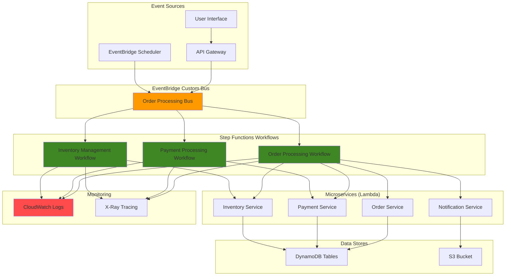

# Microservices Orchestration with EventBridge


## Problem

Modern businesses need to orchestrate complex workflows across multiple microservices while maintaining loose coupling and resilience. Traditional point-to-point integrations create brittle systems that are difficult to scale and maintain. Companies struggle with coordinating distributed transactions, handling failures gracefully, and maintaining visibility into their microservices architecture, leading to increased operational overhead and reduced system reliability.

## Solution

Create an event-driven microservices architecture using Amazon EventBridge for decoupled messaging and AWS Step Functions for workflow orchestration. EventBridge provides a serverless event bus that enables microservices to communicate asynchronously, while Step Functions coordinates complex business processes with built-in error handling, retry logic, and visual monitoring capabilities.

## Architecture Diagram



## Prerequisites

1. AWS account with appropriate permissions for EventBridge, Step Functions, Lambda, DynamoDB, and CloudWatch
2. AWS CLI v2 installed and configured (or AWS CloudShell)
3. Basic understanding of event-driven architectures and microservices patterns
4. Familiarity with JSON and AWS service integrations
5. Knowledge of distributed systems concepts and error handling patterns
6. Estimated cost: $10-20 per month for development/testing (varies by usage)

> **Note**: This recipe creates multiple AWS resources that will incur charges. Monitor your usage and clean up resources when not needed.

## Preparation

```bash
# Set environment variables
export AWS_REGION=$(aws configure get region)
export AWS_ACCOUNT_ID=$(aws sts get-caller-identity \
    --query Account --output text)

# Generate unique identifiers for resources
RANDOM_SUFFIX=$(aws secretsmanager get-random-password \
    --exclude-punctuation --exclude-uppercase \
    --password-length 6 --require-each-included-type \
    --output text --query RandomPassword)

export PROJECT_NAME="microservices-demo"
export EVENTBUS_NAME="${PROJECT_NAME}-eventbus-${RANDOM_SUFFIX}"
export LAMBDA_ROLE_NAME="${PROJECT_NAME}-lambda-role-${RANDOM_SUFFIX}"
export STEPFUNCTIONS_ROLE_NAME="${PROJECT_NAME}-stepfunctions-role-${RANDOM_SUFFIX}"
export DYNAMODB_TABLE_NAME="${PROJECT_NAME}-orders-${RANDOM_SUFFIX}"

echo "✅ Environment variables configured"
echo "EventBus: ${EVENTBUS_NAME}"
echo "DynamoDB Table: ${DYNAMODB_TABLE_NAME}"
```

## Steps

1. **Create IAM roles for Lambda functions and Step Functions**:

   IAM roles establish the security foundation for our event-driven architecture by defining precise permissions for each service. Lambda functions need permissions to access DynamoDB for data persistence and EventBridge for publishing events, while Step Functions requires permissions to orchestrate Lambda function invocations. This principle of least privilege ensures secure inter-service communication without hardcoding credentials.

   ```bash
   # Create Lambda execution role
   aws iam create-role \
       --role-name ${LAMBDA_ROLE_NAME} \
       --assume-role-policy-document '{
           "Version": "2012-10-17",
           "Statement": [
               {
                   "Effect": "Allow",
                   "Principal": {
                       "Service": "lambda.amazonaws.com"
                   },
                   "Action": "sts:AssumeRole"
               }
           ]
       }'
   
   # Attach policies to Lambda role
   aws iam attach-role-policy \
       --role-name ${LAMBDA_ROLE_NAME} \
       --policy-arn arn:aws:iam::aws:policy/service-role/AWSLambdaBasicExecutionRole
   
   aws iam attach-role-policy \
       --role-name ${LAMBDA_ROLE_NAME} \
       --policy-arn arn:aws:iam::aws:policy/AmazonDynamoDBFullAccess
   
   aws iam attach-role-policy \
       --role-name ${LAMBDA_ROLE_NAME} \
       --policy-arn arn:aws:iam::aws:policy/Amazon-EventBridge-FullAccess
   
   # Create Step Functions execution role
   aws iam create-role \
       --role-name ${STEPFUNCTIONS_ROLE_NAME} \
       --assume-role-policy-document '{
           "Version": "2012-10-17",
           "Statement": [
               {
                   "Effect": "Allow",
                   "Principal": {
                       "Service": "states.amazonaws.com"
                   },
                   "Action": "sts:AssumeRole"
               }
           ]
       }'
   
   aws iam attach-role-policy \
       --role-name ${STEPFUNCTIONS_ROLE_NAME} \
       --policy-arn arn:aws:iam::aws:policy/AWSStepFunctionsFullAccess
   
   aws iam attach-role-policy \
       --role-name ${STEPFUNCTIONS_ROLE_NAME} \
       --policy-arn arn:aws:iam::aws:policy/service-role/AWSLambdaRole
   
   echo "✅ IAM roles created successfully"
   ```

   The IAM roles are now configured and ready to enable secure communication between our microservices. These roles provide the foundational security layer that allows Lambda functions to interact with DynamoDB and EventBridge while enabling Step Functions to orchestrate the entire workflow.

   > **Warning**: The policies used here grant full access to services for demonstration purposes. In production environments, create custom policies with minimal required permissions following the [IAM security best practices](https://docs.aws.amazon.com/IAM/latest/UserGuide/best-practices.html).

2. **Create DynamoDB table for order data**:

   DynamoDB provides the persistent data layer for our microservices architecture, offering single-digit millisecond latency and automatic scaling. The table design uses a composite primary key (orderId + customerId) to enable efficient queries while the Global Secondary Index supports customer-based lookups. This NoSQL approach eliminates the need for complex database schemas and supports the independent scaling requirements of microservices.

   ```bash
   # Create DynamoDB table
   aws dynamodb create-table \
       --table-name ${DYNAMODB_TABLE_NAME} \
       --attribute-definitions \
           AttributeName=orderId,AttributeType=S \
           AttributeName=customerId,AttributeType=S \
       --key-schema \
           AttributeName=orderId,KeyType=HASH \
           AttributeName=customerId,KeyType=RANGE \
       --provisioned-throughput \
           ReadCapacityUnits=5,WriteCapacityUnits=5 \
       --global-secondary-indexes \
           IndexName=CustomerId-Index,KeySchema=["{AttributeName=customerId,KeyType=HASH}"],Projection="{ProjectionType=ALL}",ProvisionedThroughput="{ReadCapacityUnits=5,WriteCapacityUnits=5}"
   
   # Wait for table to be created
   aws dynamodb wait table-exists \
       --table-name ${DYNAMODB_TABLE_NAME}
   
   echo "✅ DynamoDB table created and active"
   ```

   The DynamoDB table is now operational and ready to handle order data from our microservices. The provisioned throughput settings provide consistent performance, while the Global Secondary Index enables efficient customer queries that support various business operations and analytics requirements.

3. **Create EventBridge custom event bus**:

   EventBridge serves as the central nervous system of our event-driven architecture, enabling loose coupling between microservices. A custom event bus provides isolation from default AWS service events and allows for fine-grained access control. This publish-subscribe pattern eliminates point-to-point integrations and enables new services to subscribe to existing events without modifying publishers.

   ```bash
   # Create custom event bus
   aws events create-event-bus \
       --name ${EVENTBUS_NAME} \
       --tags Key=Project,Value=${PROJECT_NAME} \
           Key=Environment,Value=development
   
   # Store event bus ARN
   export EVENTBUS_ARN=$(aws events describe-event-bus \
       --name ${EVENTBUS_NAME} \
       --query 'Arn' --output text)
   
   echo "✅ Custom EventBridge bus created"
   echo "EventBus ARN: ${EVENTBUS_ARN}"
   ```

   The custom EventBridge bus is now ready to facilitate asynchronous communication between microservices. This foundational component enables the event-driven patterns that make our architecture resilient, scalable, and maintainable by decoupling service dependencies.

4. **Create Lambda functions for microservices**:

   Lambda functions implement our microservices using a serverless compute model that automatically scales based on demand. Each service follows the single responsibility principle, handling one specific business capability. The Order Service demonstrates the event sourcing pattern by persisting state changes and publishing events that other services can consume asynchronously.

   ```bash
   # Create Order Service Lambda function
   cat > order-service.py << 'EOF'
   import json
   import boto3
   import uuid
   from datetime import datetime
   
   dynamodb = boto3.resource('dynamodb')
   eventbridge = boto3.client('events')
   
   def lambda_handler(event, context):
       try:
           # Parse order data
           order_data = json.loads(event['body']) if 'body' in event else event
           
           # Create order record
           order_id = str(uuid.uuid4())
           order_item = {
               'orderId': order_id,
               'customerId': order_data['customerId'],
               'items': order_data['items'],
               'totalAmount': order_data['totalAmount'],
               'status': 'PENDING',
               'createdAt': datetime.utcnow().isoformat()
           }
           
           # Store in DynamoDB
           table = dynamodb.Table('${DYNAMODB_TABLE_NAME}')
           table.put_item(Item=order_item)
           
           # Publish event to EventBridge
           eventbridge.put_events(
               Entries=[
                   {
                       'Source': 'order.service',
                       'DetailType': 'Order Created',
                       'Detail': json.dumps(order_item),
                       'EventBusName': '${EVENTBUS_NAME}'
                   }
               ]
           )
           
           return {
               'statusCode': 200,
               'body': json.dumps({
                   'orderId': order_id,
                   'status': 'PENDING'
               })
           }
           
       except Exception as e:
           print(f"Error processing order: {str(e)}")
           return {
               'statusCode': 500,
               'body': json.dumps({'error': str(e)})
           }
   EOF
   
   # Replace environment variables in the function code
   sed -i "s/\${DYNAMODB_TABLE_NAME}/${DYNAMODB_TABLE_NAME}/g" order-service.py
   sed -i "s/\${EVENTBUS_NAME}/${EVENTBUS_NAME}/g" order-service.py
   
   # Create deployment package
   zip order-service.zip order-service.py
   
   # Create Lambda function
   export ORDER_SERVICE_ARN=$(aws lambda create-function \
       --function-name ${PROJECT_NAME}-order-service-${RANDOM_SUFFIX} \
       --runtime python3.9 \
       --role arn:aws:iam::${AWS_ACCOUNT_ID}:role/${LAMBDA_ROLE_NAME} \
       --handler order-service.lambda_handler \
       --zip-file fileb://order-service.zip \
       --timeout 30 \
       --memory-size 256 \
       --environment Variables="{EVENTBUS_NAME=${EVENTBUS_NAME},DYNAMODB_TABLE_NAME=${DYNAMODB_TABLE_NAME}}" \
       --query 'FunctionArn' --output text)
   
   echo "✅ Order Service Lambda function created"
   echo "Function ARN: ${ORDER_SERVICE_ARN}"
   ```

   The Order Service is now deployed and ready to handle order creation requests. This microservice demonstrates how Lambda functions can serve as both HTTP API endpoints and event processors, establishing the foundation for our event-driven workflows.

5. **Create Payment Service Lambda function**:

   The Payment Service implements critical business logic for handling payment transactions with built-in failure simulation and event publishing. This microservice demonstrates advanced patterns including idempotency, state management, and distributed event publishing. The service simulates real-world payment processing delays and failure scenarios to test our workflow resilience and error handling capabilities.

   ```bash
   # Create Payment Service Lambda function
   cat > payment-service.py << 'EOF'
   import json
   import boto3
   import random
   import time
   from datetime import datetime
   
   dynamodb = boto3.resource('dynamodb')
   eventbridge = boto3.client('events')
   
   def lambda_handler(event, context):
       try:
           # Parse payment data
           payment_data = event['detail'] if 'detail' in event else event
           order_id = payment_data['orderId']
           amount = payment_data['totalAmount']
           
           # Simulate payment processing delay
           time.sleep(2)
           
           # Simulate payment success/failure (90% success rate)
           payment_successful = random.random() < 0.9
           
           # Update order status
           table = dynamodb.Table('${DYNAMODB_TABLE_NAME}')
           
           if payment_successful:
               table.update_item(
                   Key={'orderId': order_id, 'customerId': payment_data['customerId']},
                   UpdateExpression='SET #status = :status, paymentId = :paymentId, updatedAt = :updatedAt',
                   ExpressionAttributeNames={'#status': 'status'},
                   ExpressionAttributeValues={
                       ':status': 'PAID',
                       ':paymentId': f'pay_{order_id[:8]}',
                       ':updatedAt': datetime.utcnow().isoformat()
                   }
               )
               
               # Publish payment success event
               eventbridge.put_events(
                   Entries=[
                       {
                           'Source': 'payment.service',
                           'DetailType': 'Payment Processed',
                           'Detail': json.dumps({
                               'orderId': order_id,
                               'paymentId': f'pay_{order_id[:8]}',
                               'amount': amount,
                               'status': 'SUCCESS'
                           }),
                           'EventBusName': '${EVENTBUS_NAME}'
                       }
                   ]
               )
           else:
               table.update_item(
                   Key={'orderId': order_id, 'customerId': payment_data['customerId']},
                   UpdateExpression='SET #status = :status, updatedAt = :updatedAt',
                   ExpressionAttributeNames={'#status': 'status'},
                   ExpressionAttributeValues={
                       ':status': 'PAYMENT_FAILED',
                       ':updatedAt': datetime.utcnow().isoformat()
                   }
               )
               
               # Publish payment failure event
               eventbridge.put_events(
                   Entries=[
                       {
                           'Source': 'payment.service',
                           'DetailType': 'Payment Failed',
                           'Detail': json.dumps({
                               'orderId': order_id,
                               'amount': amount,
                               'status': 'FAILED'
                           }),
                           'EventBusName': '${EVENTBUS_NAME}'
                       }
                   ]
               )
           
           return {
               'statusCode': 200,
               'body': json.dumps({
                   'orderId': order_id,
                   'paymentStatus': 'SUCCESS' if payment_successful else 'FAILED'
               })
           }
           
       except Exception as e:
           print(f"Error processing payment: {str(e)}")
           return {
               'statusCode': 500,
               'body': json.dumps({'error': str(e)})
           }
   EOF
   
   # Replace environment variables in the function code
   sed -i "s/\${DYNAMODB_TABLE_NAME}/${DYNAMODB_TABLE_NAME}/g" payment-service.py
   sed -i "s/\${EVENTBUS_NAME}/${EVENTBUS_NAME}/g" payment-service.py
   
   # Create deployment package
   zip payment-service.zip payment-service.py
   
   # Create Lambda function
   export PAYMENT_SERVICE_ARN=$(aws lambda create-function \
       --function-name ${PROJECT_NAME}-payment-service-${RANDOM_SUFFIX} \
       --runtime python3.9 \
       --role arn:aws:iam::${AWS_ACCOUNT_ID}:role/${LAMBDA_ROLE_NAME} \
       --handler payment-service.lambda_handler \
       --zip-file fileb://payment-service.zip \
       --timeout 30 \
       --memory-size 256 \
       --environment Variables="{EVENTBUS_NAME=${EVENTBUS_NAME},DYNAMODB_TABLE_NAME=${DYNAMODB_TABLE_NAME}}" \
       --query 'FunctionArn' --output text)
   
   echo "✅ Payment Service Lambda function created"
   echo "Function ARN: ${PAYMENT_SERVICE_ARN}"
   ```

   The Payment Service is now operational and ready to process payment requests from the Step Functions workflow. This microservice publishes both success and failure events to EventBridge, enabling downstream services to react appropriately and maintain system consistency across distributed transactions.

6. **Create Inventory Service Lambda function**:

   The Inventory Service manages product availability and reservation logic, implementing essential e-commerce functionality with event-driven patterns. This microservice demonstrates inventory management patterns including optimistic concurrency control, reservation systems, and real-time inventory updates. The service includes failure simulation to test our system's ability to handle inventory constraints and backorder scenarios.

   ```bash
   # Create Inventory Service Lambda function
   cat > inventory-service.py << 'EOF'
   import json
   import boto3
   import random
   from datetime import datetime
   
   dynamodb = boto3.resource('dynamodb')
   eventbridge = boto3.client('events')
   
   def lambda_handler(event, context):
       try:
           # Parse inventory data
           inventory_data = event['detail'] if 'detail' in event else event
           order_id = inventory_data['orderId']
           items = inventory_data['items']
           
           # Simulate inventory check (95% success rate)
           inventory_available = random.random() < 0.95
           
           # Update order status
           table = dynamodb.Table('${DYNAMODB_TABLE_NAME}')
           
           if inventory_available:
               table.update_item(
                   Key={'orderId': order_id, 'customerId': inventory_data['customerId']},
                   UpdateExpression='SET #status = :status, updatedAt = :updatedAt',
                   ExpressionAttributeNames={'#status': 'status'},
                   ExpressionAttributeValues={
                       ':status': 'INVENTORY_RESERVED',
                       ':updatedAt': datetime.utcnow().isoformat()
                   }
               )
               
               # Publish inventory reserved event
               eventbridge.put_events(
                   Entries=[
                       {
                           'Source': 'inventory.service',
                           'DetailType': 'Inventory Reserved',
                           'Detail': json.dumps({
                               'orderId': order_id,
                               'items': items,
                               'status': 'RESERVED'
                           }),
                           'EventBusName': '${EVENTBUS_NAME}'
                       }
                   ]
               )
           else:
               table.update_item(
                   Key={'orderId': order_id, 'customerId': inventory_data['customerId']},
                   UpdateExpression='SET #status = :status, updatedAt = :updatedAt',
                   ExpressionAttributeNames={'#status': 'status'},
                   ExpressionAttributeValues={
                       ':status': 'INVENTORY_UNAVAILABLE',
                       ':updatedAt': datetime.utcnow().isoformat()
                   }
               )
               
               # Publish inventory unavailable event
               eventbridge.put_events(
                   Entries=[
                       {
                           'Source': 'inventory.service',
                           'DetailType': 'Inventory Unavailable',
                           'Detail': json.dumps({
                               'orderId': order_id,
                               'items': items,
                               'status': 'UNAVAILABLE'
                           }),
                           'EventBusName': '${EVENTBUS_NAME}'
                       }
                   ]
               )
           
           return {
               'statusCode': 200,
               'body': json.dumps({
                   'orderId': order_id,
                   'inventoryStatus': 'RESERVED' if inventory_available else 'UNAVAILABLE'
               })
           }
           
       except Exception as e:
           print(f"Error processing inventory: {str(e)}")
           return {
               'statusCode': 500,
               'body': json.dumps({'error': str(e)})
           }
   EOF
   
   # Replace environment variables in the function code
   sed -i "s/\${DYNAMODB_TABLE_NAME}/${DYNAMODB_TABLE_NAME}/g" inventory-service.py
   sed -i "s/\${EVENTBUS_NAME}/${EVENTBUS_NAME}/g" inventory-service.py
   
   # Create deployment package
   zip inventory-service.zip inventory-service.py
   
   # Create Lambda function
   export INVENTORY_SERVICE_ARN=$(aws lambda create-function \
       --function-name ${PROJECT_NAME}-inventory-service-${RANDOM_SUFFIX} \
       --runtime python3.9 \
       --role arn:aws:iam::${AWS_ACCOUNT_ID}:role/${LAMBDA_ROLE_NAME} \
       --handler inventory-service.lambda_handler \
       --zip-file fileb://inventory-service.zip \
       --timeout 30 \
       --memory-size 256 \
       --environment Variables="{EVENTBUS_NAME=${EVENTBUS_NAME},DYNAMODB_TABLE_NAME=${DYNAMODB_TABLE_NAME}}" \
       --query 'FunctionArn' --output text)
   
   echo "✅ Inventory Service Lambda function created"
   echo "Function ARN: ${INVENTORY_SERVICE_ARN}"
   ```

   The Inventory Service is now ready to handle inventory reservations and availability checks. This microservice publishes inventory events that enable real-time inventory tracking and support complex business scenarios like backorders, pre-orders, and dynamic pricing based on availability.

7. **Create Notification Service Lambda function**:

   The Notification Service handles customer communications and system alerts, implementing a centralized messaging hub that can be extended to support multiple communication channels. This microservice demonstrates cross-cutting concerns like logging, message formatting, and integration with external communication systems. In production environments, this service would integrate with Amazon SES, SNS, or third-party notification providers.

   ```bash
   # Create Notification Service Lambda function
   cat > notification-service.py << 'EOF'
   import json
   import boto3
   from datetime import datetime
   
   def lambda_handler(event, context):
       try:
           # Parse notification data
           notification_data = event['detail'] if 'detail' in event else event
           
           # Log notification (in real scenario, send email/SMS)
           print(f"NOTIFICATION: {json.dumps(notification_data, indent=2)}")
           
           return {
               'statusCode': 200,
               'body': json.dumps({
                   'message': 'Notification sent successfully',
                   'timestamp': datetime.utcnow().isoformat()
               })
           }
           
       except Exception as e:
           print(f"Error sending notification: {str(e)}")
           return {
               'statusCode': 500,
               'body': json.dumps({'error': str(e)})
           }
   EOF
   
   # Create deployment package
   zip notification-service.zip notification-service.py
   
   # Create Lambda function
   export NOTIFICATION_SERVICE_ARN=$(aws lambda create-function \
       --function-name ${PROJECT_NAME}-notification-service-${RANDOM_SUFFIX} \
       --runtime python3.9 \
       --role arn:aws:iam::${AWS_ACCOUNT_ID}:role/${LAMBDA_ROLE_NAME} \
       --handler notification-service.lambda_handler \
       --zip-file fileb://notification-service.zip \
       --timeout 30 \
       --memory-size 256 \
       --query 'FunctionArn' --output text)
   
   echo "✅ Notification Service Lambda function created"
   echo "Function ARN: ${NOTIFICATION_SERVICE_ARN}"
   ```

   The Notification Service is now deployed and ready to handle customer notifications and system alerts. This microservice provides a foundation for implementing comprehensive customer communication strategies and can be extended to support multi-channel messaging, personalization, and delivery tracking.

8. **Create Step Functions state machine for order processing workflow**:

   Step Functions orchestrates our complex business workflow using visual state machines that provide built-in error handling, retry logic, and parallel execution capabilities. The Amazon States Language (ASL) defines the workflow declaratively, making it easy to understand and modify business logic. This approach separates orchestration concerns from business logic, enabling better testing and maintenance.

   ```bash
   # Create Step Functions state machine definition
   cat > order-processing-workflow.json << EOF
   {
     "Comment": "Order Processing Workflow",
     "StartAt": "ProcessPayment",
     "States": {
       "ProcessPayment": {
         "Type": "Task",
         "Resource": "arn:aws:states:::lambda:invoke",
         "Parameters": {
           "FunctionName": "${PAYMENT_SERVICE_ARN}",
           "Payload.$": "$"
         },
         "Retry": [
           {
             "ErrorEquals": ["Lambda.ServiceException", "Lambda.AWSLambdaException", "Lambda.SdkClientException"],
             "IntervalSeconds": 2,
             "MaxAttempts": 6,
             "BackoffRate": 2
           }
         ],
         "Catch": [
           {
             "ErrorEquals": ["States.ALL"],
             "Next": "PaymentFailed",
             "ResultPath": "$.error"
           }
         ],
         "Next": "CheckPaymentStatus"
       },
       "CheckPaymentStatus": {
         "Type": "Choice",
         "Choices": [
           {
             "Variable": "$.Payload.body",
             "StringMatches": "*SUCCESS*",
             "Next": "ReserveInventory"
           }
         ],
         "Default": "PaymentFailed"
       },
       "ReserveInventory": {
         "Type": "Task",
         "Resource": "arn:aws:states:::lambda:invoke",
         "Parameters": {
           "FunctionName": "${INVENTORY_SERVICE_ARN}",
           "Payload.$": "$"
         },
         "Retry": [
           {
             "ErrorEquals": ["Lambda.ServiceException", "Lambda.AWSLambdaException", "Lambda.SdkClientException"],
             "IntervalSeconds": 2,
             "MaxAttempts": 3,
             "BackoffRate": 2
           }
         ],
         "Catch": [
           {
             "ErrorEquals": ["States.ALL"],
             "Next": "InventoryFailed",
             "ResultPath": "$.error"
           }
         ],
         "Next": "CheckInventoryStatus"
       },
       "CheckInventoryStatus": {
         "Type": "Choice",
         "Choices": [
           {
             "Variable": "$.Payload.body",
             "StringMatches": "*RESERVED*",
             "Next": "SendSuccessNotification"
           }
         ],
         "Default": "InventoryFailed"
       },
       "SendSuccessNotification": {
         "Type": "Task",
         "Resource": "arn:aws:states:::lambda:invoke",
         "Parameters": {
           "FunctionName": "${NOTIFICATION_SERVICE_ARN}",
           "Payload": {
             "message": "Order processed successfully",
             "orderId.$": "$.detail.orderId",
             "status": "COMPLETED"
           }
         },
         "End": true
       },
       "PaymentFailed": {
         "Type": "Task",
         "Resource": "arn:aws:states:::lambda:invoke",
         "Parameters": {
           "FunctionName": "${NOTIFICATION_SERVICE_ARN}",
           "Payload": {
             "message": "Payment failed",
             "orderId.$": "$.detail.orderId",
             "status": "PAYMENT_FAILED"
           }
         },
         "End": true
       },
       "InventoryFailed": {
         "Type": "Task",
         "Resource": "arn:aws:states:::lambda:invoke",
         "Parameters": {
           "FunctionName": "${NOTIFICATION_SERVICE_ARN}",
           "Payload": {
             "message": "Inventory unavailable",
             "orderId.$": "$.detail.orderId",
             "status": "INVENTORY_FAILED"
           }
         },
         "End": true
       }
     }
   }
   EOF
   
   # Create Step Functions state machine
   export STATE_MACHINE_ARN=$(aws stepfunctions create-state-machine \
       --name ${PROJECT_NAME}-order-processing-${RANDOM_SUFFIX} \
       --definition file://order-processing-workflow.json \
       --role-arn arn:aws:iam::${AWS_ACCOUNT_ID}:role/${STEPFUNCTIONS_ROLE_NAME} \
       --type STANDARD \
       --logging-configuration level=ALL,includeExecutionData=true,destinations=[{cloudWatchLogsLogGroup=arn:aws:logs:${AWS_REGION}:${AWS_ACCOUNT_ID}:log-group:/aws/stepfunctions/${PROJECT_NAME}-order-processing-${RANDOM_SUFFIX}}] \
       --query 'stateMachineArn' --output text)
   
   echo "✅ Step Functions state machine created"
   echo "State Machine ARN: ${STATE_MACHINE_ARN}"
   ```

   The Step Functions state machine is now active and ready to orchestrate order processing workflows. This workflow engine provides visual monitoring, automatic retry policies, and error handling that would require significant custom code in traditional architectures. The state machine enables complex business logic while maintaining system reliability and observability.

9. **Create EventBridge rules to trigger Step Functions**:

   EventBridge rules define the event routing logic that connects publishers to subscribers in our event-driven architecture. Rules use pattern matching to filter events and route them to appropriate targets, enabling fine-grained control over which events trigger specific workflows. This declarative approach to event routing eliminates the need for complex message routing code within applications.

   ```bash
   # Create EventBridge rule for order created events
   aws events put-rule \
       --name ${PROJECT_NAME}-order-created-rule-${RANDOM_SUFFIX} \
       --event-pattern '{
           "source": ["order.service"],
           "detail-type": ["Order Created"]
       }' \
       --state ENABLED \
       --event-bus-name ${EVENTBUS_NAME}
   
   # Add Step Functions as target for the rule
   aws events put-targets \
       --rule ${PROJECT_NAME}-order-created-rule-${RANDOM_SUFFIX} \
       --event-bus-name ${EVENTBUS_NAME} \
       --targets "Id"="1","Arn"="${STATE_MACHINE_ARN}","RoleArn"="arn:aws:iam::${AWS_ACCOUNT_ID}:role/${STEPFUNCTIONS_ROLE_NAME}"
   
   # Create EventBridge rule for payment events
   aws events put-rule \
       --name ${PROJECT_NAME}-payment-events-rule-${RANDOM_SUFFIX} \
       --event-pattern '{
           "source": ["payment.service"],
           "detail-type": ["Payment Processed", "Payment Failed"]
       }' \
       --state ENABLED \
       --event-bus-name ${EVENTBUS_NAME}
   
   # Add Lambda as target for payment events
   aws events put-targets \
       --rule ${PROJECT_NAME}-payment-events-rule-${RANDOM_SUFFIX} \
       --event-bus-name ${EVENTBUS_NAME} \
       --targets "Id"="1","Arn"="${NOTIFICATION_SERVICE_ARN}"
   
   # Grant EventBridge permission to invoke Lambda
   aws lambda add-permission \
       --function-name ${NOTIFICATION_SERVICE_ARN} \
       --statement-id ${PROJECT_NAME}-eventbridge-permission \
       --action lambda:InvokeFunction \
       --principal events.amazonaws.com \
       --source-arn arn:aws:events:${AWS_REGION}:${AWS_ACCOUNT_ID}:rule/${EVENTBUS_NAME}/${PROJECT_NAME}-payment-events-rule-${RANDOM_SUFFIX}
   
   echo "✅ EventBridge rules and targets configured"
   ```

   The EventBridge rules are now active and will automatically trigger Step Functions workflows when order events are published. This event-driven triggering mechanism enables real-time processing while maintaining loose coupling between event producers and consumers.

10. **Create CloudWatch Log Group for Step Functions**:

    CloudWatch Logs provides centralized logging and monitoring for our Step Functions executions, enabling detailed troubleshooting and performance analysis. Structured logging with defined retention policies helps manage costs while maintaining adequate audit trails. This observability foundation is crucial for production microservices architectures.

    ```bash
    # Create CloudWatch Log Group for Step Functions
    aws logs create-log-group \
        --log-group-name /aws/stepfunctions/${PROJECT_NAME}-order-processing-${RANDOM_SUFFIX}
    
    # Set log retention to 14 days
    aws logs put-retention-policy \
        --log-group-name /aws/stepfunctions/${PROJECT_NAME}-order-processing-${RANDOM_SUFFIX} \
        --retention-in-days 14
    
    echo "✅ CloudWatch Log Group created for Step Functions"
    ```

    The CloudWatch Log Group is now configured to capture detailed execution logs from our Step Functions workflows. This centralized logging enables comprehensive monitoring and troubleshooting capabilities essential for production microservices operations.

11. **Test the event-driven microservices architecture**:

    Testing validates that our event-driven architecture functions correctly end-to-end, from initial order creation through workflow orchestration to final completion. This integration test demonstrates how events flow through the system and validates that our microservices correctly handle business logic while maintaining data consistency.

    ```bash
    # Test the order processing workflow
    TEST_ORDER=$(cat << EOF
    {
        "customerId": "customer-123",
        "items": [
            {"productId": "prod-001", "quantity": 2, "price": 29.99},
            {"productId": "prod-002", "quantity": 1, "price": 49.99}
        ],
        "totalAmount": 109.97
    }
    EOF
    )
    
    # Invoke the Order Service directly
    aws lambda invoke \
        --function-name ${PROJECT_NAME}-order-service-${RANDOM_SUFFIX} \
        --payload "${TEST_ORDER}" \
        test-response.json
    
    # Display the response
    cat test-response.json
    
    echo "✅ Test order submitted successfully"
    echo "Check Step Functions console for workflow execution"
    ```

    The test order has been submitted and should trigger the complete workflow orchestration. Monitor the Step Functions console to observe real-time execution progress and verify that each microservice processes events correctly according to our business logic.

12. **Set up monitoring and observability**:

    Comprehensive monitoring and observability are essential for production microservices architectures, providing insights into system health, performance, and business metrics. CloudWatch dashboards aggregate metrics from multiple services, enabling proactive monitoring and rapid incident response. This observability strategy supports both operational excellence and business intelligence requirements.

    > **Tip**: Configure CloudWatch alarms on key metrics like Lambda error rates and Step Functions failed executions to enable proactive monitoring and automated incident response.

    ```bash
    # Create CloudWatch dashboard
    cat > dashboard-config.json << EOF
    {
        "widgets": [
            {
                "type": "metric",
                "properties": {
                    "metrics": [
                        ["AWS/Lambda", "Invocations", "FunctionName", "${PROJECT_NAME}-order-service-${RANDOM_SUFFIX}"],
                        ["AWS/Lambda", "Invocations", "FunctionName", "${PROJECT_NAME}-payment-service-${RANDOM_SUFFIX}"],
                        ["AWS/Lambda", "Invocations", "FunctionName", "${PROJECT_NAME}-inventory-service-${RANDOM_SUFFIX}"],
                        ["AWS/Lambda", "Invocations", "FunctionName", "${PROJECT_NAME}-notification-service-${RANDOM_SUFFIX}"]
                    ],
                    "period": 300,
                    "stat": "Sum",
                    "region": "${AWS_REGION}",
                    "title": "Lambda Invocations"
                }
            },
            {
                "type": "metric",
                "properties": {
                    "metrics": [
                        ["AWS/States", "ExecutionsSucceeded", "StateMachineArn", "${STATE_MACHINE_ARN}"],
                        ["AWS/States", "ExecutionsFailed", "StateMachineArn", "${STATE_MACHINE_ARN}"]
                    ],
                    "period": 300,
                    "stat": "Sum",
                    "region": "${AWS_REGION}",
                    "title": "Step Functions Executions"
                }
            }
        ]
    }
    EOF
    
    # Create CloudWatch dashboard
    aws cloudwatch put-dashboard \
        --dashboard-name ${PROJECT_NAME}-microservices-dashboard-${RANDOM_SUFFIX} \
        --dashboard-body file://dashboard-config.json
    
    echo "✅ CloudWatch dashboard created"
    echo "Dashboard URL: https://${AWS_REGION}.console.aws.amazon.com/cloudwatch/home?region=${AWS_REGION}#dashboards:name=${PROJECT_NAME}-microservices-dashboard-${RANDOM_SUFFIX}"
    ```

    The CloudWatch dashboard is now available and provides real-time visibility into our microservices architecture performance. This centralized monitoring capability enables operations teams to quickly identify issues and understand system behavior patterns essential for maintaining high availability.

## Validation & Testing

1. **Verify EventBridge custom bus was created**:

   ```bash
   # Check EventBridge bus status
   aws events describe-event-bus \
       --name ${EVENTBUS_NAME}
   ```

   Expected output: JSON object showing the custom event bus details with ARN and name.

2. **Test Step Functions execution**:

   ```bash
   # List recent executions
   aws stepfunctions list-executions \
       --state-machine-arn ${STATE_MACHINE_ARN} \
       --max-items 5
   ```

   Expected output: List of executions with their status and timestamps.

3. **Validate DynamoDB records**:

   ```bash
   # Scan DynamoDB table for order records
   aws dynamodb scan \
       --table-name ${DYNAMODB_TABLE_NAME} \
       --limit 10
   ```

   Expected output: Order records with status updates from the microservices.

4. **Check Lambda function logs**:

   ```bash
   # View Order Service logs
   aws logs tail /aws/lambda/${PROJECT_NAME}-order-service-${RANDOM_SUFFIX} \
       --since 10m
   ```

   Expected output: Log entries showing function executions and EventBridge events.

5. **Test error handling and retry logic**:

   ```bash
   # Submit multiple test orders to trigger various scenarios
   for i in {1..3}; do
       aws lambda invoke \
           --function-name ${PROJECT_NAME}-order-service-${RANDOM_SUFFIX} \
           --payload "{\"customerId\":\"customer-${i}\",\"items\":[{\"productId\":\"prod-001\",\"quantity\":1,\"price\":99.99}],\"totalAmount\":99.99}" \
           test-response-${i}.json
   done
   
   echo "✅ Multiple test orders submitted"
   ```

## Cleanup

1. **Delete Step Functions state machine**:

   ```bash
   # Delete Step Functions state machine
   aws stepfunctions delete-state-machine \
       --state-machine-arn ${STATE_MACHINE_ARN}
   
   echo "✅ Step Functions state machine deleted"
   ```

2. **Remove EventBridge rules and targets**:

   ```bash
   # Remove targets from rules
   aws events remove-targets \
       --rule ${PROJECT_NAME}-order-created-rule-${RANDOM_SUFFIX} \
       --event-bus-name ${EVENTBUS_NAME} \
       --ids "1"
   
   aws events remove-targets \
       --rule ${PROJECT_NAME}-payment-events-rule-${RANDOM_SUFFIX} \
       --event-bus-name ${EVENTBUS_NAME} \
       --ids "1"
   
   # Delete rules
   aws events delete-rule \
       --name ${PROJECT_NAME}-order-created-rule-${RANDOM_SUFFIX} \
       --event-bus-name ${EVENTBUS_NAME}
   
   aws events delete-rule \
       --name ${PROJECT_NAME}-payment-events-rule-${RANDOM_SUFFIX} \
       --event-bus-name ${EVENTBUS_NAME}
   
   echo "✅ EventBridge rules and targets removed"
   ```

3. **Delete EventBridge custom bus**:

   ```bash
   # Delete custom event bus
   aws events delete-event-bus \
       --name ${EVENTBUS_NAME}
   
   echo "✅ EventBridge custom bus deleted"
   ```

4. **Delete Lambda functions**:

   ```bash
   # Delete all Lambda functions
   aws lambda delete-function \
       --function-name ${PROJECT_NAME}-order-service-${RANDOM_SUFFIX}
   
   aws lambda delete-function \
       --function-name ${PROJECT_NAME}-payment-service-${RANDOM_SUFFIX}
   
   aws lambda delete-function \
       --function-name ${PROJECT_NAME}-inventory-service-${RANDOM_SUFFIX}
   
   aws lambda delete-function \
       --function-name ${PROJECT_NAME}-notification-service-${RANDOM_SUFFIX}
   
   echo "✅ Lambda functions deleted"
   ```

5. **Delete DynamoDB table**:

   ```bash
   # Delete DynamoDB table
   aws dynamodb delete-table \
       --table-name ${DYNAMODB_TABLE_NAME}
   
   echo "✅ DynamoDB table deleted"
   ```

6. **Delete CloudWatch resources**:

   ```bash
   # Delete CloudWatch dashboard
   aws cloudwatch delete-dashboards \
       --dashboard-names ${PROJECT_NAME}-microservices-dashboard-${RANDOM_SUFFIX}
   
   # Delete CloudWatch Log Group
   aws logs delete-log-group \
       --log-group-name /aws/stepfunctions/${PROJECT_NAME}-order-processing-${RANDOM_SUFFIX}
   
   echo "✅ CloudWatch resources deleted"
   ```

7. **Delete IAM roles**:

   ```bash
   # Detach policies from Lambda role
   aws iam detach-role-policy \
       --role-name ${LAMBDA_ROLE_NAME} \
       --policy-arn arn:aws:iam::aws:policy/service-role/AWSLambdaBasicExecutionRole
   
   aws iam detach-role-policy \
       --role-name ${LAMBDA_ROLE_NAME} \
       --policy-arn arn:aws:iam::aws:policy/AmazonDynamoDBFullAccess
   
   aws iam detach-role-policy \
       --role-name ${LAMBDA_ROLE_NAME} \
       --policy-arn arn:aws:iam::aws:policy/Amazon-EventBridge-FullAccess
   
   # Delete Lambda role
   aws iam delete-role \
       --role-name ${LAMBDA_ROLE_NAME}
   
   # Detach policies from Step Functions role
   aws iam detach-role-policy \
       --role-name ${STEPFUNCTIONS_ROLE_NAME} \
       --policy-arn arn:aws:iam::aws:policy/AWSStepFunctionsFullAccess
   
   aws iam detach-role-policy \
       --role-name ${STEPFUNCTIONS_ROLE_NAME} \
       --policy-arn arn:aws:iam::aws:policy/service-role/AWSLambdaRole
   
   # Delete Step Functions role
   aws iam delete-role \
       --role-name ${STEPFUNCTIONS_ROLE_NAME}
   
   echo "✅ IAM roles deleted"
   ```

8. **Clean up local files**:

   ```bash
   # Remove local files
   rm -f order-service.py order-service.zip
   rm -f payment-service.py payment-service.zip
   rm -f inventory-service.py inventory-service.zip
   rm -f notification-service.py notification-service.zip
   rm -f order-processing-workflow.json
   rm -f dashboard-config.json
   rm -f test-response*.json
   
   echo "✅ Local files cleaned up"
   ```

## Discussion

This recipe demonstrates the power of event-driven microservices architecture using Amazon EventBridge and AWS Step Functions. The architecture provides several key benefits over traditional tightly-coupled systems. EventBridge serves as the central nervous system, enabling microservices to communicate through events without direct knowledge of each other, promoting loose coupling and system resilience.

Step Functions orchestrates complex business workflows while providing built-in error handling, retry logic, and visual monitoring. The state machine definition uses the Amazon States Language to define the workflow, making it easy to understand and modify business logic. The choice between Standard and Express workflows depends on your specific requirements - Standard workflows are ideal for long-running processes with full audit trails, while Express workflows excel in high-throughput scenarios.

The implementation includes comprehensive error handling strategies, including retry policies with exponential backoff and circuit breaker patterns. Each microservice publishes events to EventBridge, allowing other services to react independently. This pattern enables horizontal scaling, fault isolation, and easier system evolution. The monitoring setup provides visibility into system health and performance through CloudWatch dashboards and Step Functions execution history.

[AWS Step Functions documentation](https://docs.aws.amazon.com/step-functions/latest/dg/) provides detailed guidance on workflow patterns, while [Amazon EventBridge documentation](https://docs.aws.amazon.com/eventbridge/latest/userguide/) covers event-driven architecture best practices. For Lambda best practices, refer to the [AWS Lambda Developer Guide](https://docs.aws.amazon.com/lambda/latest/dg/). Monitor your architecture using [Amazon CloudWatch](https://docs.aws.amazon.com/AmazonCloudWatch/latest/monitoring/) for comprehensive observability.

> **Tip**: Use EventBridge schema registry to automatically discover and version your event schemas, enabling better integration testing and API evolution.

## Challenge

Extend this solution by implementing these enhancements:

1. **Add saga pattern implementation** - Implement compensating transactions for failed workflows using Step Functions parallel states and error handling
2. **Implement event sourcing** - Store all events in EventBridge archives and replay them to rebuild system state or perform analytics
3. **Add circuit breaker pattern** - Implement circuit breakers in Lambda functions to prevent cascading failures during high error rates
4. **Create event-driven testing** - Build automated testing pipelines that inject events and validate system responses using EventBridge replays
5. **Implement cross-region replication** - Set up EventBridge replication rules to mirror events across AWS regions for disaster recovery

## Infrastructure Code

*Infrastructure code will be generated after recipe approval.*