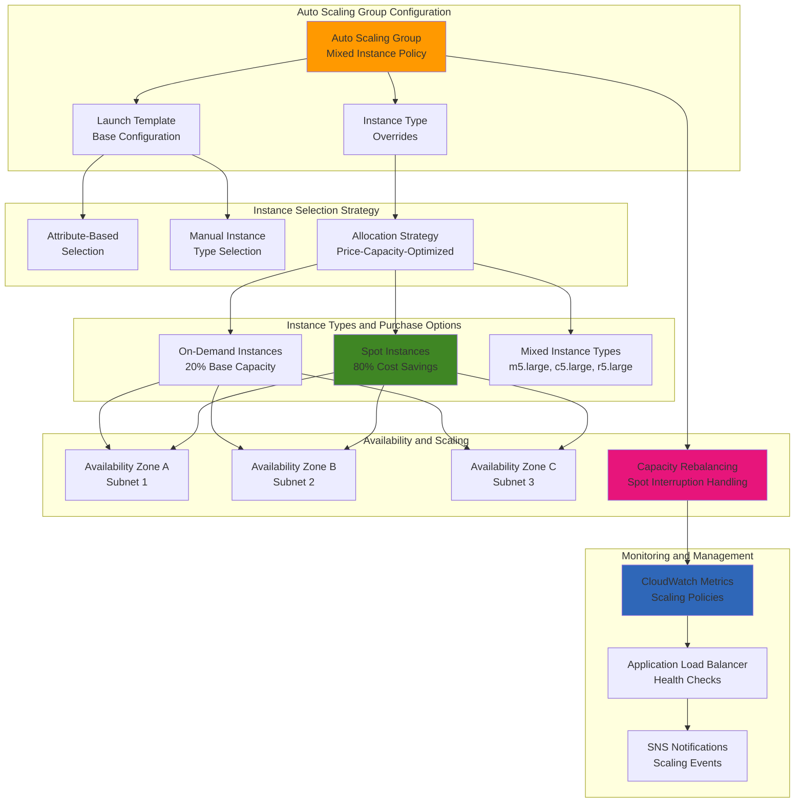

# Mixed Instance Auto Scaling Groups

## Problem

Your organization needs to optimize compute costs while maintaining application availability and performance. Traditional Auto Scaling groups using single instance types and On-Demand pricing can be expensive and inflexible. You need a solution that can automatically scale across multiple instance types, leverage cost-effective Spot Instances for significant savings, and maintain resilience against Spot Instance interruptions. The challenge is balancing cost optimization with reliability while ensuring your applications can handle varying workloads efficiently.

## Solution

Implement mixed instance type Auto Scaling groups that combine On-Demand and Spot Instances across multiple instance families and sizes. This solution uses [attribute-based instance type selection](https://docs.aws.amazon.com/autoscaling/ec2/userguide/create-mixed-instances-group-attribute-based-instance-type-selection.html) to automatically choose optimal instances based on your compute requirements, implements intelligent [allocation strategies](https://docs.aws.amazon.com/autoscaling/ec2/userguide/allocation-strategies.html) to maximize cost savings, and includes capacity rebalancing to handle Spot Instance interruptions gracefully. The architecture provides up to 90% cost savings compared to On-Demand only deployments while maintaining high availability through diversification across instance types and Availability Zones.

## Architecture Diagram



## Prerequisites

1. AWS account with permissions for EC2, Auto Scaling, and CloudWatch
2. AWS CLI v2 installed and configured with appropriate credentials
3. VPC with multiple subnets across different Availability Zones
4. Basic understanding of EC2 instance types and Spot Instance concepts
5. Estimated cost: $20-50/month for test workloads (significant savings vs On-Demand only)

> **Note**: Spot Instance pricing can vary significantly. Monitor your Spot Instance usage and set appropriate maximum prices to control costs while maintaining availability.

## Preparation

```bash
# Set environment variables for the deployment
export AWS_REGION=$(aws configure get region)
export AWS_ACCOUNT_ID=$(aws sts get-caller-identity \
    --query Account --output text)

# Generate unique identifiers for resources to avoid naming conflicts
RANDOM_SUFFIX=$(aws secretsmanager get-random-password \
    --exclude-punctuation --exclude-uppercase \
    --password-length 6 --require-each-included-type \
    --output text --query RandomPassword)

export ASG_NAME="mixed-instances-asg-${RANDOM_SUFFIX}"
export LAUNCH_TEMPLATE_NAME="mixed-instances-template-${RANDOM_SUFFIX}"
export SECURITY_GROUP_NAME="mixed-instances-sg-${RANDOM_SUFFIX}"
export IAM_ROLE_NAME="EC2InstanceRole-${RANDOM_SUFFIX}"

# Get default VPC and subnets for multi-AZ deployment
export VPC_ID=$(aws ec2 describe-vpcs \
    --filters "Name=is-default,Values=true" \
    --query 'Vpcs[0].VpcId' --output text)

# Get subnets in different AZs for high availability
export SUBNET_IDS=$(aws ec2 describe-subnets \
    --filters "Name=vpc-id,Values=${VPC_ID}" \
    --query 'Subnets[*].SubnetId' --output text | tr '\t' ',')

echo "✅ Environment prepared"
echo "VPC ID: ${VPC_ID}"
echo "Subnet IDs: ${SUBNET_IDS}"
```

## Steps

1. **Create security group for Auto Scaling group instances**:

   Security groups act as virtual firewalls that control inbound and outbound traffic to your instances. This step creates rules that allow web traffic while maintaining security best practices according to the [AWS Security Group best practices](https://docs.aws.amazon.com/AWSEC2/latest/UserGuide/security-group-rules-reference.html).

   ```bash
   # Create security group with appropriate rules for web applications
   SECURITY_GROUP_ID=$(aws ec2 create-security-group \
       --group-name ${SECURITY_GROUP_NAME} \
       --description "Security group for mixed instances Auto Scaling group" \
       --vpc-id ${VPC_ID} \
       --query 'GroupId' --output text)
   
   # Allow HTTP traffic from anywhere (port 80)
   aws ec2 authorize-security-group-ingress \
       --group-id ${SECURITY_GROUP_ID} \
       --protocol tcp \
       --port 80 \
       --cidr 0.0.0.0/0
   
   # Allow HTTPS traffic from anywhere (port 443)
   aws ec2 authorize-security-group-ingress \
       --group-id ${SECURITY_GROUP_ID} \
       --protocol tcp \
       --port 443 \
       --cidr 0.0.0.0/0
   
   # Allow SSH access for debugging (port 22)
   aws ec2 authorize-security-group-ingress \
       --group-id ${SECURITY_GROUP_ID} \
       --protocol tcp \
       --port 22 \
       --cidr 0.0.0.0/0
   
   echo "✅ Created security group: ${SECURITY_GROUP_ID}"
   ```

2. **Create IAM role for EC2 instances**:

   EC2 instances need IAM roles to interact with other AWS services securely. This role enables CloudWatch monitoring and Systems Manager access for better instance management, following the [principle of least privilege](https://docs.aws.amazon.com/IAM/latest/UserGuide/best-practices.html#grant-least-privilege).

   ```bash
   # Create trust policy that allows EC2 service to assume this role
   cat > ec2-trust-policy.json << EOF
   {
       "Version": "2012-10-17",
       "Statement": [
           {
               "Effect": "Allow",
               "Principal": {
                   "Service": "ec2.amazonaws.com"
               },
               "Action": "sts:AssumeRole"
           }
       ]
   }
   EOF
   
   # Create IAM role with the trust policy
   aws iam create-role \
       --role-name ${IAM_ROLE_NAME} \
       --assume-role-policy-document file://ec2-trust-policy.json
   
   echo "✅ Created IAM role: ${IAM_ROLE_NAME}"
   ```

   > **Tip**: AWS managed policies provide pre-configured permissions for common use cases. Using them reduces the risk of overly permissive custom policies and ensures you get security updates automatically. Learn more about [AWS managed policies](https://docs.aws.amazon.com/IAM/latest/UserGuide/access_policies_managed-vs-inline.html).

   ```bash
   # Attach managed policies for CloudWatch and Systems Manager integration
   aws iam attach-role-policy \
       --role-name ${IAM_ROLE_NAME} \
       --policy-arn arn:aws:iam::aws:policy/CloudWatchAgentServerPolicy
   
   aws iam attach-role-policy \
       --role-name ${IAM_ROLE_NAME} \
       --policy-arn arn:aws:iam::aws:policy/AmazonSSMManagedInstanceCore
   
   # Create instance profile to attach the role to EC2 instances
   aws iam create-instance-profile \
       --instance-profile-name ${IAM_ROLE_NAME}
   
   # Add role to instance profile
   aws iam add-role-to-instance-profile \
       --instance-profile-name ${IAM_ROLE_NAME} \
       --role-name ${IAM_ROLE_NAME}
   
   # Wait for instance profile to be available
   sleep 10
   
   echo "✅ Configured IAM permissions for EC2 instances"
   ```

3. **Create user data script for instance initialization**:

   User data scripts run when instances launch, allowing you to install software, configure services, and customize the environment. This script sets up a web server that displays instance information and follows [EC2 user data best practices](https://docs.aws.amazon.com/AWSEC2/latest/UserGuide/user-data.html).

   ```bash
   # Create comprehensive user data script for instance setup
   cat > user-data.sh << 'EOF'
   #!/bin/bash
   yum update -y
   yum install -y httpd
   
   # Get instance metadata to display on the web page
   INSTANCE_ID=$(curl -s http://169.254.169.254/latest/meta-data/instance-id)
   INSTANCE_TYPE=$(curl -s http://169.254.169.254/latest/meta-data/instance-type)
   AZ=$(curl -s http://169.254.169.254/latest/meta-data/placement/availability-zone)
   SPOT_TERMINATION=$(curl -s http://169.254.169.254/latest/meta-data/spot/instance-action 2>/dev/null || echo "On-Demand")
   
   # Create informative web page showing instance details
   cat > /var/www/html/index.html << HTML
   <!DOCTYPE html>
   <html>
   <head>
       <title>Mixed Instance Auto Scaling Demo</title>
       <style>
           body { font-family: Arial, sans-serif; margin: 40px; }
           .info { background: #f0f0f0; padding: 20px; border-radius: 5px; }
           .spot { color: green; }
           .ondemand { color: blue; }
       </style>
   </head>
   <body>
       <h1>Mixed Instance Auto Scaling Demo</h1>
       <div class="info">
           <h2>Instance Information</h2>
           <p><strong>Instance ID:</strong> $INSTANCE_ID</p>
           <p><strong>Instance Type:</strong> $INSTANCE_TYPE</p>
           <p><strong>Availability Zone:</strong> $AZ</p>
           <p><strong>Purchase Type:</strong> 
               <span class="$([ "$SPOT_TERMINATION" = "On-Demand" ] && echo "ondemand" || echo "spot")">
                   $([ "$SPOT_TERMINATION" = "On-Demand" ] && echo "On-Demand" || echo "Spot Instance")
               </span>
           </p>
           <p><strong>Timestamp:</strong> $(date)</p>
       </div>
       
       <h2>Auto Scaling Group Benefits</h2>
       <ul>
           <li>Cost optimization with Spot Instances</li>
           <li>High availability across multiple AZs</li>
           <li>Automatic scaling based on demand</li>
           <li>Instance type diversification</li>
       </ul>
   </body>
   </html>
   HTML
   
   # Start and enable Apache web server
   systemctl start httpd
   systemctl enable httpd
   
   # Install and configure CloudWatch agent for custom metrics
   yum install -y amazon-cloudwatch-agent
   
   cat > /opt/aws/amazon-cloudwatch-agent/etc/amazon-cloudwatch-agent.json << JSON
   {
       "metrics": {
           "namespace": "AutoScaling/MixedInstances",
           "metrics_collected": {
               "cpu": {
                   "measurement": ["cpu_usage_idle", "cpu_usage_iowait", "cpu_usage_user", "cpu_usage_system"],
                   "metrics_collection_interval": 60
               },
               "disk": {
                   "measurement": ["used_percent"],
                   "metrics_collection_interval": 60,
                   "resources": ["*"]
               },
               "mem": {
                   "measurement": ["mem_used_percent"],
                   "metrics_collection_interval": 60
               }
           }
       }
   }
   JSON
   
   # Start CloudWatch agent with the configuration
   /opt/aws/amazon-cloudwatch-agent/bin/amazon-cloudwatch-agent-ctl \
       -a fetch-config -m ec2 -s \
       -c file:/opt/aws/amazon-cloudwatch-agent/etc/amazon-cloudwatch-agent.json
   EOF
   
   # Encode user data as base64 for launch template
   USER_DATA_B64=$(base64 -w 0 user-data.sh)
   
   echo "✅ Created user data script with web server and monitoring"
   ```

4. **Create launch template with base configuration**:

   [Launch templates](https://docs.aws.amazon.com/autoscaling/ec2/userguide/launch-templates.html) define the configuration for your instances and serve as the foundation for all instances, with the mixed instance policy providing variations. Launch templates support versioning, allowing you to maintain multiple configurations and roll back changes if needed, making them essential for production environments where consistency is critical.

   ```bash
   # Get latest Amazon Linux 2023 AMI for current region
   AMI_ID=$(aws ec2 describe-images \
       --owners amazon \
       --filters "Name=name,Values=al2023-ami-*-x86_64" \
               "Name=state,Values=available" \
       --query 'Images | sort_by(@, &CreationDate) | [-1].ImageId' \
       --output text)
   
   echo "Using AMI: ${AMI_ID}"
   ```

   The launch template includes [IMDSv2 enforcement](https://docs.aws.amazon.com/AWSEC2/latest/UserGuide/configuring-instance-metadata-service.html) for enhanced security, which requires session tokens for metadata access and prevents SSRF attacks.

   ```bash
   # Create launch template with security and monitoring configurations
   cat > launch-template.json << EOF
   {
       "LaunchTemplateName": "${LAUNCH_TEMPLATE_NAME}",
       "LaunchTemplateData": {
           "ImageId": "${AMI_ID}",
           "InstanceType": "m5.large",
           "SecurityGroupIds": ["${SECURITY_GROUP_ID}"],
           "IamInstanceProfile": {
               "Name": "${IAM_ROLE_NAME}"
           },
           "UserData": "${USER_DATA_B64}",
           "TagSpecifications": [
               {
                   "ResourceType": "instance",
                   "Tags": [
                       {
                           "Key": "Name",
                           "Value": "MixedInstancesASG-Instance"
                       },
                       {
                           "Key": "Environment",
                           "Value": "Demo"
                       },
                       {
                           "Key": "AutoScalingGroup",
                           "Value": "${ASG_NAME}"
                       }
                   ]
               }
           ],
           "MetadataOptions": {
               "HttpTokens": "required",
               "HttpPutResponseHopLimit": 2
           }
       }
   }
   EOF
   
   # Create the launch template
   aws ec2 create-launch-template \
       --cli-input-json file://launch-template.json
   
   echo "✅ Created launch template: ${LAUNCH_TEMPLATE_NAME}"
   ```

5. **Create Auto Scaling group with mixed instance policy**:

   The [mixed instance policy](https://docs.aws.amazon.com/autoscaling/ec2/userguide/mixed-instances-groups-set-up-overview.html) is the core of cost optimization, allowing the Auto Scaling group to use different instance types and purchase options while maintaining your desired capacity. This configuration uses the latest `price-capacity-optimized` allocation strategy, which AWS recommends for the best balance of cost and availability.

   ```bash
   # Create comprehensive Auto Scaling group configuration
   cat > asg-mixed-instances.json << EOF
   {
       "AutoScalingGroupName": "${ASG_NAME}",
       "MinSize": 2,
       "MaxSize": 10,
       "DesiredCapacity": 4,
       "DefaultCooldown": 300,
       "HealthCheckType": "EC2",
       "HealthCheckGracePeriod": 300,
       "VPCZoneIdentifier": "${SUBNET_IDS}",
       "MixedInstancesPolicy": {
           "LaunchTemplate": {
               "LaunchTemplateSpecification": {
                   "LaunchTemplateName": "${LAUNCH_TEMPLATE_NAME}",
                   "Version": "\$Latest"
               },
               "Overrides": [
                   {
                       "InstanceType": "m5.large",
                       "WeightedCapacity": "1"
                   },
                   {
                       "InstanceType": "m5.xlarge",
                       "WeightedCapacity": "2"
                   },
                   {
                       "InstanceType": "c5.large",
                       "WeightedCapacity": "1"
                   },
                   {
                       "InstanceType": "c5.xlarge",
                       "WeightedCapacity": "2"
                   },
                   {
                       "InstanceType": "r5.large",
                       "WeightedCapacity": "1"
                   },
                   {
                       "InstanceType": "r5.xlarge",
                       "WeightedCapacity": "2"
                   }
               ]
           },
           "InstancesDistribution": {
               "OnDemandAllocationStrategy": "prioritized",
               "OnDemandBaseCapacity": 1,
               "OnDemandPercentageAboveBaseCapacity": 20,
               "SpotAllocationStrategy": "price-capacity-optimized",
               "SpotMaxPrice": ""
           }
       },
       "Tags": [
           {
               "Key": "Name",
               "Value": "${ASG_NAME}",
               "PropagateAtLaunch": false,
               "ResourceId": "${ASG_NAME}",
               "ResourceType": "auto-scaling-group"
           },
           {
               "Key": "Environment",
               "Value": "Demo",
               "PropagateAtLaunch": true,
               "ResourceId": "${ASG_NAME}",
               "ResourceType": "auto-scaling-group"
           }
       ]
   }
   EOF
   
   # Create the Auto Scaling group
   aws autoscaling create-auto-scaling-group \
       --cli-input-json file://asg-mixed-instances.json
   
   echo "✅ Created Auto Scaling group: ${ASG_NAME}"
   echo "Configuration:"
   echo "  - Min: 2, Max: 10, Desired: 4"
   echo "  - On-Demand base: 1 instance"
   echo "  - On-Demand percentage above base: 20%"
   echo "  - Spot allocation: price-capacity-optimized"
   ```

6. **Enable capacity rebalancing for Spot Instance management**:

   [Capacity rebalancing](https://docs.aws.amazon.com/AWSEC2/latest/UserGuide/ec2-fleet-capacity-rebalance.html) proactively replaces Spot Instances that are at elevated risk of interruption, improving application availability during Spot capacity changes. This feature monitors Spot Instance interruption signals and automatically launches replacement instances before termination occurs.

   ```bash
   # Enable capacity rebalancing to handle Spot interruptions gracefully
   aws autoscaling update-auto-scaling-group \
       --auto-scaling-group-name ${ASG_NAME} \
       --capacity-rebalance
   
   echo "✅ Enabled capacity rebalancing for improved Spot Instance management"
   ```

7. **Create CloudWatch scaling policies**:

   [Target tracking scaling policies](https://docs.aws.amazon.com/autoscaling/ec2/userguide/as-scaling-target-tracking.html) automatically adjust capacity based on metrics like CPU utilization or network traffic, ensuring your application can handle varying loads while optimizing costs.

   ```bash
   # Create target tracking scaling policy for CPU utilization
   SCALE_UP_POLICY_ARN=$(aws autoscaling put-scaling-policy \
       --auto-scaling-group-name ${ASG_NAME} \
       --policy-name "${ASG_NAME}-scale-up" \
       --policy-type "TargetTrackingScaling" \
       --target-tracking-configuration '{
           "TargetValue": 70.0,
           "PredefinedMetricSpecification": {
               "PredefinedMetricType": "ASGAverageCPUUtilization"
           },
           "ScaleOutCooldown": 300,
           "ScaleInCooldown": 300
       }' \
       --query 'PolicyARN' --output text)
   
   echo "✅ Created CPU-based scaling policy"
   ```

   > **Warning**: Be careful with scaling policies in production environments. Set appropriate cooldown periods to prevent rapid scaling that could lead to cost spikes or application instability. Monitor your scaling activities regularly to ensure optimal performance.

   ```bash
   # Create additional scaling policy for network utilization
   SCALE_NETWORK_POLICY_ARN=$(aws autoscaling put-scaling-policy \
       --auto-scaling-group-name ${ASG_NAME} \
       --policy-name "${ASG_NAME}-scale-network" \
       --policy-type "TargetTrackingScaling" \
       --target-tracking-configuration '{
           "TargetValue": 1000000.0,
           "PredefinedMetricSpecification": {
               "PredefinedMetricType": "ASGAverageNetworkIn"
           },
           "ScaleOutCooldown": 300,
           "ScaleInCooldown": 300
       }' \
       --query 'PolicyARN' --output text)
   
   echo "✅ Created network-based scaling policy"
   echo "Scaling policies configured for multi-metric optimization"
   ```

8. **Set up SNS notifications for scaling events**:

   [SNS notifications](https://docs.aws.amazon.com/autoscaling/ec2/userguide/configuring-notifications.html) keep you informed about scaling activities, allowing you to monitor the behavior of your Auto Scaling group and respond to any issues quickly.

   ```bash
   # Create SNS topic for Auto Scaling notifications
   SNS_TOPIC_ARN=$(aws sns create-topic \
       --name "autoscaling-notifications-${RANDOM_SUFFIX}" \
       --query 'TopicArn' --output text)
   
   # Configure Auto Scaling group to send notifications about instance lifecycle events
   aws autoscaling put-notification-configuration \
       --auto-scaling-group-name ${ASG_NAME} \
       --topic-arn ${SNS_TOPIC_ARN} \
       --notification-types \
           "autoscaling:EC2_INSTANCE_LAUNCH" \
           "autoscaling:EC2_INSTANCE_LAUNCH_ERROR" \
           "autoscaling:EC2_INSTANCE_TERMINATE" \
           "autoscaling:EC2_INSTANCE_TERMINATE_ERROR"
   
   echo "✅ Configured SNS notifications for scaling events"
   echo "Topic ARN: ${SNS_TOPIC_ARN}"
   echo "ℹ️  Subscribe to this topic to receive scaling notifications"
   ```

9. **Create Application Load Balancer for the Auto Scaling group**:

   An [Application Load Balancer](https://docs.aws.amazon.com/elasticloadbalancing/latest/application/introduction.html) distributes incoming traffic across healthy instances, provides health checking, and integrates with Auto Scaling for seamless capacity management.

   ```bash
   # Create Application Load Balancer in multiple subnets
   ALB_ARN=$(aws elbv2 create-load-balancer \
       --name "mixed-instances-alb-${RANDOM_SUFFIX}" \
       --subnets $(echo ${SUBNET_IDS} | tr ',' ' ') \
       --security-groups ${SECURITY_GROUP_ID} \
       --query 'LoadBalancers[0].LoadBalancerArn' --output text)
   
   # Get ALB DNS name for testing
   ALB_DNS=$(aws elbv2 describe-load-balancers \
       --load-balancer-arns ${ALB_ARN} \
       --query 'LoadBalancers[0].DNSName' --output text)
   
   # Create target group with health check configuration
   TARGET_GROUP_ARN=$(aws elbv2 create-target-group \
       --name "mixed-instances-tg-${RANDOM_SUFFIX}" \
       --protocol HTTP \
       --port 80 \
       --vpc-id ${VPC_ID} \
       --health-check-path "/" \
       --health-check-interval-seconds 30 \
       --health-check-timeout-seconds 5 \
       --healthy-threshold-count 2 \
       --unhealthy-threshold-count 3 \
       --query 'TargetGroups[0].TargetGroupArn' --output text)
   
   # Create listener to route traffic to target group
   aws elbv2 create-listener \
       --load-balancer-arn ${ALB_ARN} \
       --protocol HTTP \
       --port 80 \
       --default-actions Type=forward,TargetGroupArn=${TARGET_GROUP_ARN}
   
   # Attach Auto Scaling group to target group for automatic registration
   aws autoscaling attach-load-balancer-target-groups \
       --auto-scaling-group-name ${ASG_NAME} \
       --target-group-arns ${TARGET_GROUP_ARN}
   
   # Update health check type to use ELB health checks
   aws autoscaling update-auto-scaling-group \
       --auto-scaling-group-name ${ASG_NAME} \
       --health-check-type ELB \
       --health-check-grace-period 300
   
   echo "✅ Created Application Load Balancer with health checking"
   echo "ALB DNS: ${ALB_DNS}"
   echo "🌐 Your application will be available at: http://${ALB_DNS}"
   ```

## Validation & Testing

1. **Verify Auto Scaling group is running with mixed instances**:

   ```bash
   # Check Auto Scaling group configuration and status
   aws autoscaling describe-auto-scaling-groups \
       --auto-scaling-group-names ${ASG_NAME} \
       --query 'AutoScalingGroups[0].[AutoScalingGroupName,DesiredCapacity,MinSize,MaxSize]'
   
   # List instances in the Auto Scaling group with details
   aws autoscaling describe-auto-scaling-instances \
       --query "AutoScalingInstances[?AutoScalingGroupName=='${ASG_NAME}'].[InstanceId,InstanceType,AvailabilityZone,LifecycleState]" \
       --output table
   
   # Check instance purchase types (Spot vs On-Demand)
   INSTANCE_IDS=$(aws autoscaling describe-auto-scaling-instances \
       --query "AutoScalingInstances[?AutoScalingGroupName=='${ASG_NAME}'].InstanceId" \
       --output text)
   
   echo "Instance purchase types:"
   for instance_id in $INSTANCE_IDS; do
       purchase_type=$(aws ec2 describe-instances \
           --instance-ids $instance_id \
           --query 'Reservations[0].Instances[0].InstanceLifecycle' \
           --output text)
       instance_type=$(aws ec2 describe-instances \
           --instance-ids $instance_id \
           --query 'Reservations[0].Instances[0].InstanceType' \
           --output text)
       
       if [ "$purchase_type" = "None" ] || [ "$purchase_type" = "null" ]; then
           echo "  $instance_id ($instance_type): On-Demand"
       else
           echo "  $instance_id ($instance_type): $purchase_type"
       fi
   done
   ```

   Expected output: Table showing instances with mixed types and purchase options distributed across availability zones.

2. **Test load balancer and web application**:

   ```bash
   # Wait for instances to pass health checks
   echo "Waiting for instances to become healthy..."
   sleep 60
   
   # Check target group health status
   aws elbv2 describe-target-health \
       --target-group-arn ${TARGET_GROUP_ARN} \
       --query 'TargetHealthDescriptions[*].[Target.Id,TargetHealth.State]' \
       --output table
   
   # Test web application response
   echo "Testing web application..."
   curl -s http://${ALB_DNS} | grep -E "(Instance ID|Instance Type|Purchase Type)"
   
   echo ""
   echo "🌐 Access your application at: http://${ALB_DNS}"
   ```

   Expected output: Web page content showing instance details and health check status showing "healthy" targets.

3. **Test scaling behavior**:

   ```bash
   # Display current scaling configuration
   aws autoscaling describe-scaling-activities \
       --auto-scaling-group-name ${ASG_NAME} \
       --max-items 5 \
       --query 'Activities[*].[ActivityId,StatusCode,Description,StartTime]' \
       --output table
   
   echo ""
   echo "To test auto scaling manually, you can:"
   echo "1. Generate load: for i in {1..100}; do curl -s http://${ALB_DNS} > /dev/null & done"
   echo "2. Watch scaling: aws autoscaling describe-scaling-activities --auto-scaling-group-name ${ASG_NAME}"
   ```

4. **Monitor costs and Spot Instance savings**:

   ```bash
   # Create cost monitoring script
   cat > cost-monitoring.sh << 'EOF'
   #!/bin/bash
   
   echo "=== Mixed Instance Auto Scaling Cost Analysis ==="
   echo "Generated: $(date)"
   echo ""
   
   # Get current instances from Auto Scaling group
   INSTANCE_IDS=$(aws autoscaling describe-auto-scaling-instances \
       --query "AutoScalingInstances[?AutoScalingGroupName=='$1'].InstanceId" \
       --output text)
   
   total_ondemand_cost=0
   total_spot_cost=0
   ondemand_count=0
   spot_count=0
   
   echo "Current Instance Analysis:"
   for instance_id in $INSTANCE_IDS; do
       instance_info=$(aws ec2 describe-instances \
           --instance-ids $instance_id \
           --query 'Reservations[0].Instances[0].[InstanceType,InstanceLifecycle,Placement.AvailabilityZone]' \
           --output text)
       
       instance_type=$(echo $instance_info | cut -f1)
       lifecycle=$(echo $instance_info | cut -f2)
       az=$(echo $instance_info | cut -f3)
       
       if [ "$lifecycle" = "None" ] || [ "$lifecycle" = "null" ]; then
           echo "  $instance_id: $instance_type (On-Demand) in $az"
           ondemand_count=$((ondemand_count + 1))
       else
           echo "  $instance_id: $instance_type ($lifecycle) in $az"
           spot_count=$((spot_count + 1))
       fi
   done
   
   echo ""
   echo "Summary:"
   echo "  On-Demand Instances: $ondemand_count"
   echo "  Spot Instances: $spot_count"
   echo "  Total Instances: $((ondemand_count + spot_count))"
   if [ $((ondemand_count + spot_count)) -gt 0 ]; then
       echo "  Spot Instance Percentage: $(( spot_count * 100 / (ondemand_count + spot_count) ))%"
   fi
   echo ""
   echo "Estimated Cost Savings: 60-90% compared to On-Demand only"
   EOF
   
   chmod +x cost-monitoring.sh
   ./cost-monitoring.sh ${ASG_NAME}
   ```

   Expected output: Analysis showing distribution of On-Demand vs Spot Instances and estimated cost savings.

## Cleanup

1. **Delete Auto Scaling group and related resources**:

   ```bash
   # Scale down Auto Scaling group to zero capacity
   aws autoscaling update-auto-scaling-group \
       --auto-scaling-group-name ${ASG_NAME} \
       --min-size 0 \
       --max-size 0 \
       --desired-capacity 0
   
   # Wait for instances to terminate
   echo "Waiting for instances to terminate..."
   sleep 60
   
   # Delete Auto Scaling group
   aws autoscaling delete-auto-scaling-group \
       --auto-scaling-group-name ${ASG_NAME} \
       --force-delete
   
   echo "✅ Deleted Auto Scaling group"
   ```

2. **Delete Application Load Balancer**:

   ```bash
   # Get listener ARN and delete it
   LISTENER_ARN=$(aws elbv2 describe-listeners \
       --load-balancer-arn ${ALB_ARN} \
       --query 'Listeners[0].ListenerArn' --output text)
   
   aws elbv2 delete-listener --listener-arn ${LISTENER_ARN}
   
   # Delete target group
   aws elbv2 delete-target-group --target-group-arn ${TARGET_GROUP_ARN}
   
   # Delete load balancer
   aws elbv2 delete-load-balancer --load-balancer-arn ${ALB_ARN}
   
   echo "✅ Deleted Application Load Balancer and target group"
   ```

3. **Delete launch template and supporting resources**:

   ```bash
   # Delete launch template
   aws ec2 delete-launch-template \
       --launch-template-name ${LAUNCH_TEMPLATE_NAME}
   
   # Delete security group
   aws ec2 delete-security-group \
       --group-id ${SECURITY_GROUP_ID}
   
   echo "✅ Deleted launch template and security group"
   ```

4. **Clean up IAM resources and notifications**:

   ```bash
   # Remove role from instance profile
   aws iam remove-role-from-instance-profile \
       --instance-profile-name ${IAM_ROLE_NAME} \
       --role-name ${IAM_ROLE_NAME}
   
   # Delete instance profile
   aws iam delete-instance-profile \
       --instance-profile-name ${IAM_ROLE_NAME}
   
   # Detach policies from role
   aws iam detach-role-policy \
       --role-name ${IAM_ROLE_NAME} \
       --policy-arn arn:aws:iam::aws:policy/CloudWatchAgentServerPolicy
   
   aws iam detach-role-policy \
       --role-name ${IAM_ROLE_NAME} \
       --policy-arn arn:aws:iam::aws:policy/AmazonSSMManagedInstanceCore
   
   # Delete IAM role
   aws iam delete-role --role-name ${IAM_ROLE_NAME}
   
   # Delete SNS topic
   aws sns delete-topic --topic-arn ${SNS_TOPIC_ARN}
   
   # Clean up local files
   rm -f ec2-trust-policy.json launch-template.json asg-mixed-instances.json
   rm -f user-data.sh cost-monitoring.sh
   
   echo "✅ Cleaned up all IAM resources and notifications"
   ```

## Discussion

Mixed instance type Auto Scaling groups represent a sophisticated approach to cost optimization that can deliver substantial savings while maintaining high availability. By combining Spot Instances with On-Demand capacity, organizations can achieve 60-90% cost reductions compared to traditional On-Demand only deployments. The key to success lies in proper diversification across instance types and Availability Zones, which reduces the impact of Spot Instance interruptions.

The updated [allocation strategies](https://docs.aws.amazon.com/autoscaling/ec2/userguide/allocation-strategies.html) now recommend using `price-capacity-optimized` for Spot Instances, which considers both price and capacity to select the pools least likely to be interrupted with the lowest possible price. This strategy provides better availability than the older `diversified` approach while maintaining cost benefits. The "prioritized" strategy for On-Demand instances ensures critical base capacity uses the most suitable instance types, particularly beneficial when using Reserved Instances or Savings Plans.

[Capacity rebalancing](https://docs.aws.amazon.com/AWSEC2/latest/UserGuide/ec2-fleet-capacity-rebalance.html) further enhances resilience by proactively replacing at-risk Spot Instances before interruption. This feature works by monitoring EC2 Spot Instance interruption signals and automatically launching replacement instances, reducing the impact on running applications. Instance weighting allows for sophisticated capacity management where different instance sizes contribute proportionally to the Auto Scaling group's capacity, enabling seamless scaling across heterogeneous instance types while maintaining consistent application performance. For optimal Spot Instance selection, monitor interruption rates using the [AWS Spot Instance Advisor](https://aws.amazon.com/ec2/spot/instance-advisor/) to select instance types with lower interruption rates for critical workloads.

> **Tip**: Use the latest Amazon Linux 2023 AMI for better performance and security features compared to Amazon Linux 2. The updated AMI includes improved security defaults and optimized performance for modern workloads.

## Challenge

Extend this solution by implementing these enhancements:

1. **Advanced Allocation Strategies**: Implement custom allocation logic using Lambda functions that consider real-time Spot pricing, application performance metrics, and business priorities
2. **Multi-Region Scaling**: Create a global Auto Scaling solution that spans multiple AWS regions with intelligent traffic routing based on capacity and cost
3. **Predictive Scaling**: Integrate machine learning models to predict traffic patterns and pre-scale capacity using scheduled scaling and predictive scaling policies
4. **Container Integration**: Adapt the solution for containerized workloads using ECS or EKS with mixed instance types and Spot Instances for container hosts
5. **Cost Optimization Dashboard**: Build a real-time dashboard that tracks cost savings, instance type distribution, and provides recommendations for further optimization

## Infrastructure Code

### Available Infrastructure as Code:

- [Infrastructure Code Overview](code/README.md) - Detailed description of all infrastructure components
- [AWS CDK (Python)](code/cdk-python/) - AWS CDK Python implementation
- [AWS CDK (TypeScript)](code/cdk-typescript/) - AWS CDK TypeScript implementation
- [CloudFormation](code/cloudformation.yaml) - AWS CloudFormation template
- [Bash CLI Scripts](code/scripts/) - Example bash scripts using AWS CLI commands to deploy infrastructure
- [Terraform](code/terraform/) - Terraform configuration files