# End-to-End MLOps with SageMaker Pipelines

## Problem

Data science teams struggle to operationalize machine learning models due to manual, error-prone deployment processes that lack reproducibility and governance. Without proper MLOps infrastructure, organizations face challenges with model versioning, automated retraining, and seamless deployment across environments. This results in models that remain in development indefinitely or fail in production due to data drift and lack of monitoring.

## Solution

Amazon SageMaker Pipelines provides a purpose-built CI/CD service for machine learning that automates the entire ML workflow from data preparation to model deployment. Combined with SageMaker's integrated development environment and model registry, this solution creates a repeatable, auditable pipeline that automatically handles data processing, model training, evaluation, and deployment while maintaining governance and compliance requirements.

## Architecture Diagram

```mermaid
graph TB
    subgraph "Data Sources"
        DS[Training Data]
        VS[Validation Data]
    end
    
    subgraph "Code Repository"
        CC[CodeCommit Repository]
    end
    
    subgraph "SageMaker Pipeline"
        PP[Preprocessing Step]
        TS[Training Step]
        ES[Evaluation Step]
        CS[Conditional Step]
        RS[Registration Step]
        MS[Model Deployment]
    end
    
    subgraph "Model Registry"
        MR[SageMaker Model Registry]
    end
    
    subgraph "Deployment"
        EP[SageMaker Endpoint]
    end
    
    subgraph "Storage"
        S3[S3 Bucket]
    end
    
    DS-->S3
    VS-->S3
    CC-->PP
    S3-->PP
    PP-->TS
    TS-->ES
    ES-->CS
    CS-->RS
    RS-->MR
    MR-->MS
    MS-->EP
    
    style S3 fill:#FF9900
    style EP fill:#232F3E
    style MR fill:#3F8624
```



## Prerequisites

1. AWS account with SageMaker, S3, CodeCommit, and IAM permissions
2. AWS CLI v2 installed and configured (or AWS CloudShell)
3. Basic understanding of machine learning workflows and Python
4. Familiarity with Jupyter notebooks and data science concepts
5. Estimated cost: $15-25 for pipeline execution and endpoint hosting during testing

> **Note**: SageMaker charges apply for compute instances, model hosting, and data storage. Monitor usage to avoid unexpected costs. For comprehensive cost management guidance, see the [SageMaker pricing documentation](https://aws.amazon.com/sagemaker/pricing/).

## Preparation

```bash
# Set environment variables
export AWS_REGION=$(aws configure get region)
export AWS_ACCOUNT_ID=$(aws sts get-caller-identity \
    --query Account --output text)

# Generate unique identifiers for resources
RANDOM_SUFFIX=$(aws secretsmanager get-random-password \
    --exclude-punctuation --exclude-uppercase \
    --password-length 6 --require-each-included-type \
    --output text --query RandomPassword)

export BUCKET_NAME="sagemaker-mlops-${RANDOM_SUFFIX}"
export PIPELINE_NAME="mlops-pipeline-${RANDOM_SUFFIX}"
export ROLE_NAME="SageMakerExecutionRole-${RANDOM_SUFFIX}"

# Create S3 bucket for data and artifacts
aws s3 mb s3://${BUCKET_NAME} --region ${AWS_REGION}

# Enable S3 bucket versioning for data lineage
aws s3api put-bucket-versioning \
    --bucket ${BUCKET_NAME} \
    --versioning-configuration Status=Enabled

echo "✅ S3 bucket ${BUCKET_NAME} created successfully"
```

## Steps

1. **Create IAM Execution Role for SageMaker**:

   SageMaker requires a specialized execution role that grants necessary permissions for ML operations including data access, model training, and deployment. This role follows the principle of least privilege while enabling comprehensive MLOps capabilities across AWS services. Understanding how [SageMaker works with IAM](https://docs.aws.amazon.com/sagemaker/latest/dg/security_iam_service-with-iam.html) is crucial for implementing secure ML workflows.

   ```bash
   # Create trust policy for SageMaker service
   cat > trust-policy.json << EOF
   {
     "Version": "2012-10-17",
     "Statement": [
       {
         "Effect": "Allow",
         "Principal": {
           "Service": "sagemaker.amazonaws.com"
         },
         "Action": "sts:AssumeRole"
       }
     ]
   }
   EOF
   
   # Create the execution role
   aws iam create-role \
       --role-name ${ROLE_NAME} \
       --assume-role-policy-document file://trust-policy.json
   
   # Attach managed policies for SageMaker full access
   aws iam attach-role-policy \
       --role-name ${ROLE_NAME} \
       --policy-arn arn:aws:iam::aws:policy/AmazonSageMakerFullAccess
   
   # Store role ARN for later use
   export ROLE_ARN=$(aws iam get-role --role-name ${ROLE_NAME} \
       --query 'Role.Arn' --output text)
   
   echo "✅ IAM role created: ${ROLE_ARN}"
   ```

   The execution role is now configured with appropriate permissions for SageMaker operations. This foundational security component enables all subsequent ML pipeline activities while maintaining AWS security best practices. For detailed information on configuring execution roles, see the [SageMaker execution role documentation](https://docs.aws.amazon.com/sagemaker/latest/dg/sagemaker-roles.html).

2. **Create CodeCommit Repository for ML Code**:

   Version control is essential for MLOps as it enables reproducible model builds, collaboration between data scientists, and audit trails for compliance. CodeCommit provides a secure, scalable Git repository that integrates seamlessly with SageMaker Pipelines for automated triggering and source code management.

   ```bash
   # Create CodeCommit repository
   aws codecommit create-repository \
       --repository-name mlops-${RANDOM_SUFFIX} \
       --repository-description "MLOps pipeline code repository"
   
   # Get repository clone URL
   export REPO_URL=$(aws codecommit get-repository \
       --repository-name mlops-${RANDOM_SUFFIX} \
       --query 'repositoryMetadata.cloneUrlHttp' --output text)
   
   echo "✅ CodeCommit repository created: ${REPO_URL}"
   ```

   The repository is ready to store ML pipeline code, training scripts, and configuration files. This centralized version control enables team collaboration and ensures all pipeline changes are tracked and auditable, supporting regulatory compliance requirements.

3. **Upload Sample Training Data to S3**:

   Training data must be accessible to SageMaker training jobs through S3. Organizing data in S3 with proper structure and access controls is fundamental to ML operations and enables scalable data processing across multiple pipeline executions. This step establishes the data foundation that supports both development and production workloads.

   ```bash
   # Create sample training data (using Boston Housing dataset structure)
   mkdir -p sample-data
   
   # Create sample CSV data for demonstration
   cat > sample-data/train.csv << EOF
   crim,zn,indus,chas,nox,rm,age,dis,rad,tax,ptratio,b,lstat,medv
   0.00632,18.0,2.31,0,0.538,6.575,65.2,4.0900,1,296,15.3,396.90,4.98,24.0
   0.02731,0.0,7.07,0,0.469,6.421,78.9,4.9671,2,242,17.8,396.90,9.14,21.6
   0.02729,0.0,7.07,0,0.469,7.185,61.1,4.9671,2,242,17.8,392.83,4.03,34.7
   0.03237,0.0,2.18,0,0.458,6.998,45.8,6.0622,3,222,18.7,394.63,2.94,33.4
   0.06905,0.0,2.18,0,0.458,7.147,54.2,6.0622,3,222,18.7,396.90,5.33,36.2
   EOF
   
   cat > sample-data/validation.csv << EOF
   crim,zn,indus,chas,nox,rm,age,dis,rad,tax,ptratio,b,lstat,medv
   0.03237,0.0,2.18,0,0.458,6.998,45.8,6.0622,3,222,18.7,394.63,2.94,33.4
   0.06905,0.0,2.18,0,0.458,7.147,54.2,6.0622,3,222,18.7,396.90,5.33,36.2
   EOF
   
   # Upload data to S3
   aws s3 cp sample-data/ s3://${BUCKET_NAME}/data/ --recursive
   
   echo "✅ Training data uploaded to s3://${BUCKET_NAME}/data/"
   ```

   The training and validation datasets are now available in S3 with proper organization. This data storage pattern supports both immediate pipeline execution and future scaling to larger datasets while maintaining consistent access patterns and enabling data lineage tracking.

4. **Create Training Script for the Pipeline**:

   The training script encapsulates the machine learning logic that will be executed within the SageMaker training environment. This separation of concerns allows data scientists to focus on model development while MLOps engineers manage infrastructure and deployment automation. The script follows SageMaker conventions for seamless integration.

   ```bash
   # Create training script
   cat > train.py << 'EOF'
   import argparse
   import pandas as pd
   import joblib
   from sklearn.ensemble import RandomForestRegressor
   from sklearn.model_selection import train_test_split
   from sklearn.metrics import mean_squared_error, r2_score
   import os
   import json
   
   def main():
       parser = argparse.ArgumentParser()
       parser.add_argument("--model-dir", type=str, \
           default=os.environ.get("SM_MODEL_DIR"))
       parser.add_argument("--training", type=str, \
           default=os.environ.get("SM_CHANNEL_TRAINING"))
       
       args = parser.parse_args()
       
       # Load data
       training_data = pd.read_csv(os.path.join(args.training, "train.csv"))
       
       # Prepare features and target
       X = training_data.drop(['medv'], axis=1)
       y = training_data['medv']
       
       # Split data
       X_train, X_test, y_train, y_test = train_test_split(
           X, y, test_size=0.2, random_state=42)
       
       # Train model
       model = RandomForestRegressor(n_estimators=100, random_state=42)
       model.fit(X_train, y_train)
       
       # Evaluate model
       y_pred = model.predict(X_test)
       mse = mean_squared_error(y_test, y_pred)
       r2 = r2_score(y_test, y_pred)
       
       print(f"Model MSE: {mse}")
       print(f"Model R2: {r2}")
       
       # Save model
       joblib.dump(model, os.path.join(args.model_dir, "model.joblib"))
       
       # Save evaluation metrics
       evaluation_output = {
           "regression_metrics": {
               "mse": {"value": mse},
               "r2": {"value": r2}
           }
       }
       
       with open(os.path.join(args.model_dir, "evaluation.json"), "w") as f:
           json.dump(evaluation_output, f)
   
   if __name__ == "__main__":
       main()
   EOF
   
   echo "✅ Training script created"
   ```

   The training script follows SageMaker conventions for data input and model output, ensuring compatibility with the pipeline execution environment. This standardized approach enables consistent model development across different algorithms and datasets while providing comprehensive evaluation metrics.

> **Warning**: Ensure your training script handles all data preprocessing and validation steps properly. Poor data quality will result in unreliable models regardless of pipeline automation. Consider implementing data quality checks as described in the [SageMaker data quality documentation](https://docs.aws.amazon.com/sagemaker/latest/dg/model-monitor-data-quality.html).

5. **Create SageMaker Pipeline Definition**:

   SageMaker Pipelines orchestrate complex ML workflows through a declarative approach that defines data processing, training, evaluation, and deployment steps. This pipeline-as-code methodology ensures reproducible, version-controlled ML operations that can be automated and monitored. The [SageMaker Pipelines overview](https://docs.aws.amazon.com/sagemaker/latest/dg/pipelines-overview.html) provides comprehensive details on pipeline architecture and capabilities.

   ```bash
   # Create pipeline Python script
   cat > pipeline_definition.py << EOF
   import boto3
   import sagemaker
   from sagemaker.workflow.pipeline import Pipeline
   from sagemaker.workflow.steps import TrainingStep
   from sagemaker.sklearn.estimator import SKLearn
   from sagemaker.workflow.parameters import ParameterString
   from sagemaker.inputs import TrainingInput
   from sagemaker.workflow.pipeline_context import PipelineSession
   
   def create_pipeline():
       # Initialize pipeline session
       pipeline_session = PipelineSession()
       role = "${ROLE_ARN}"
       bucket = "${BUCKET_NAME}"
       pipeline_name = "${PIPELINE_NAME}"
       
       # Define parameters
       input_data = ParameterString(
           name="InputData",
           default_value=f"s3://{bucket}/data/"
       )
       
       # Create SKLearn estimator
       sklearn_estimator = SKLearn(
           entry_point="train.py",
           framework_version="1.2-1",
           instance_type="ml.m5.large",
           role=role,
           sagemaker_session=pipeline_session
       )
       
       # Create training step
       training_step = TrainingStep(
           name="ModelTraining",
           estimator=sklearn_estimator,
           inputs={
               "training": TrainingInput(s3_data=input_data)
           }
       )
       
       # Create pipeline
       pipeline = Pipeline(
           name=pipeline_name,
           parameters=[input_data],
           steps=[training_step],
           sagemaker_session=pipeline_session
       )
       
       return pipeline
   
   if __name__ == "__main__":
       pipeline = create_pipeline()
       pipeline.upsert(role_arn="${ROLE_ARN}")
       print(f"Pipeline {pipeline.name} created successfully")
   EOF
   
   echo "✅ Pipeline definition created"
   ```

   The pipeline definition establishes the ML workflow structure with parameterized inputs and reusable components. This code-based approach enables version control of the entire ML process and supports automated execution triggers. Learn more about [pipeline steps and components](https://docs.aws.amazon.com/sagemaker/latest/dg/build-and-manage-steps.html) in the official documentation.

6. **Execute the SageMaker Pipeline**:

   Pipeline execution triggers the entire ML workflow in a controlled, monitored environment. SageMaker manages resource provisioning, step dependencies, and error handling while providing visibility into each stage of the process through comprehensive logging and metrics. This execution demonstrates the automated nature of MLOps workflows.

   ```bash
   # Create pipeline execution script
   cat > execute_pipeline.py << EOF
   import boto3
   import sagemaker
   from sagemaker.workflow.pipeline import Pipeline
   from sagemaker.workflow.steps import TrainingStep
   from sagemaker.sklearn.estimator import SKLearn
   from sagemaker.workflow.pipeline_context import PipelineSession
   from sagemaker.inputs import TrainingInput
   
   # Initialize SageMaker session
   pipeline_session = PipelineSession()
   role = "${ROLE_ARN}"
   bucket = "${BUCKET_NAME}"
   
   # Create SKLearn estimator
   sklearn_estimator = SKLearn(
       entry_point="train.py",
       framework_version="1.2-1",
       instance_type="ml.m5.large",
       role=role,
       sagemaker_session=pipeline_session
   )
   
   # Create training step
   training_step = TrainingStep(
       name="ModelTraining",
       estimator=sklearn_estimator,
       inputs={
           "training": TrainingInput(s3_data=f"s3://{bucket}/data/")
       }
   )
   
   # Create and execute pipeline
   pipeline = Pipeline(
       name="${PIPELINE_NAME}",
       steps=[training_step],
       sagemaker_session=pipeline_session
   )
   
   pipeline.upsert(role_arn=role)
   execution = pipeline.start()
   
   print(f"Pipeline execution started: {execution.arn}")
   print("Monitor execution status in SageMaker Studio or AWS Console")
   EOF
   
   # Install required dependencies and execute
   echo "Installing SageMaker Python SDK..."
   pip install sagemaker --quiet
   
   # Execute the pipeline
   python execute_pipeline.py
   
   echo "✅ Pipeline execution initiated"
   ```

   The pipeline execution is now running and will handle data ingestion, model training, and artifact storage while providing comprehensive monitoring and logging capabilities for operational visibility. This automated workflow demonstrates the power of MLOps automation.

7. **Monitor Pipeline Execution Status**:

   Monitoring pipeline execution provides operational insights and enables quick identification of issues or bottlenecks. SageMaker provides comprehensive logging and metrics that support both real-time monitoring and historical analysis of ML workflow performance. This observability is crucial for maintaining production ML systems.

   ```bash
   # Check pipeline execution status
   aws sagemaker list-pipeline-executions \
       --pipeline-name ${PIPELINE_NAME} \
       --max-results 5
   
   # Get detailed execution status
   export EXECUTION_ARN=$(aws sagemaker list-pipeline-executions \
       --pipeline-name ${PIPELINE_NAME} \
       --query 'PipelineExecutionSummaries[0].PipelineExecutionArn' \
       --output text)
   
   if [ "$EXECUTION_ARN" != "None" ]; then
       aws sagemaker describe-pipeline-execution \
           --pipeline-execution-arn ${EXECUTION_ARN}
   fi
   
   echo "✅ Pipeline monitoring commands configured"
   ```

   Pipeline monitoring capabilities are now established, providing visibility into execution status, step-by-step progress, and performance metrics. This observability is essential for maintaining reliable ML operations and troubleshooting issues quickly.

> **Tip**: Use Amazon CloudWatch to set up automated alerts for pipeline failures or performance degradation. This proactive monitoring helps maintain system reliability and reduces manual oversight requirements. Learn how to configure monitoring and alerts in the [SageMaker CloudWatch metrics documentation](https://docs.aws.amazon.com/sagemaker/latest/dg/monitoring-cloudwatch.html).

## Validation & Testing

1. Verify pipeline creation was successful:

   ```bash
   # Check if pipeline exists
   aws sagemaker describe-pipeline --pipeline-name ${PIPELINE_NAME}
   ```

   Expected output: Pipeline details including status "Active" and step definitions.

2. Validate S3 data structure:

   ```bash
   # List training data in S3
   aws s3 ls s3://${BUCKET_NAME}/data/ --recursive
   ```

   Expected output: train.csv and validation.csv files in the data folder.

3. Test IAM role permissions:

   ```bash
   # Verify role can be assumed by SageMaker
   aws sts assume-role \
       --role-arn ${ROLE_ARN} \
       --role-session-name test-session \
       --duration-seconds 900
   ```

   Expected output: Temporary credentials indicating successful role assumption.

4. Check CodeCommit repository accessibility:

   ```bash
   # Verify repository exists and is accessible
   aws codecommit get-repository --repository-name mlops-${RANDOM_SUFFIX}
   ```

   Expected output: Repository metadata with clone URLs and creation timestamp.

5. Monitor training job completion:

   ```bash
   # List recent training jobs
   aws sagemaker list-training-jobs \
       --sort-by CreationTime \
       --sort-order Descending \
       --max-results 5
   ```

   Expected output: Training jobs with "Completed" status from pipeline execution.

## Cleanup

1. Delete SageMaker pipeline:

   ```bash
   # Delete pipeline
   aws sagemaker delete-pipeline --pipeline-name ${PIPELINE_NAME}
   
   echo "✅ Deleted SageMaker pipeline"
   ```

2. Remove S3 bucket and contents:

   ```bash
   # Delete all objects and bucket
   aws s3 rm s3://${BUCKET_NAME} --recursive
   aws s3 rb s3://${BUCKET_NAME}
   
   echo "✅ Deleted S3 bucket and contents"
   ```

3. Delete CodeCommit repository:

   ```bash
   # Delete repository
   aws codecommit delete-repository --repository-name mlops-${RANDOM_SUFFIX}
   
   echo "✅ Deleted CodeCommit repository"
   ```

4. Remove IAM role and policies:

   ```bash
   # Detach policies and delete role
   aws iam detach-role-policy \
       --role-name ${ROLE_NAME} \
       --policy-arn arn:aws:iam::aws:policy/AmazonSageMakerFullAccess
   
   aws iam delete-role --role-name ${ROLE_NAME}
   
   echo "✅ Deleted IAM role"
   ```

5. Clean up local files:

   ```bash
   # Remove created files
   rm -f trust-policy.json pipeline_definition.py train.py execute_pipeline.py
   rm -rf sample-data/
   
   echo "✅ Cleaned up local files"
   ```

## Discussion

SageMaker Pipelines represents a paradigm shift from ad-hoc model development to systematic, reproducible MLOps practices. By implementing pipeline-as-code, organizations gain the ability to version control their entire ML workflow, from data preprocessing through model deployment. This approach addresses critical challenges in ML operations including reproducibility, auditability, and scaling model development across teams. The [AWS MLOps implementation guide](https://docs.aws.amazon.com/sagemaker/latest/dg/mlops.html) provides comprehensive strategies for adopting these practices.

The integration between SageMaker Pipelines and the broader AWS ecosystem provides powerful capabilities for enterprise ML operations. CodeCommit enables collaborative development with proper version control, while S3 provides virtually unlimited, durable storage for training data and model artifacts with 99.999999999% (11 9's) durability. The IAM integration ensures secure, role-based access to resources while maintaining the principle of least privilege. This comprehensive approach to MLOps infrastructure enables organizations to move beyond experimental models to production-ready ML systems. For detailed architectural guidance, see the [SageMaker workflows documentation](https://docs.aws.amazon.com/sagemaker/latest/dg/workflows.html).

Pipeline automation significantly reduces the operational overhead associated with ML model lifecycle management. Automated retraining based on data drift detection, A/B testing frameworks for model performance comparison, and seamless deployment strategies become achievable through this systematic approach. The observability provided by CloudWatch integration and SageMaker's native monitoring capabilities ensures that data science teams can focus on model improvement rather than infrastructure management. The [SageMaker pipeline actions guide](https://docs.aws.amazon.com/sagemaker/latest/dg/pipelines-build.html) offers detailed implementation strategies for advanced workflow automation.

Consider implementing automated testing stages in your pipeline to validate model performance before deployment. This additional governance layer helps prevent degraded models from reaching production environments, as detailed in the [SageMaker model validation documentation](https://docs.aws.amazon.com/sagemaker/latest/dg/model-monitor-scheduling.html). Following AWS Well-Architected Machine Learning principles ensures scalable, secure, and cost-effective ML operations.

> **Tip**: Implement proper data governance and lineage tracking by using AWS Lake Formation and AWS Glue to catalog your training data. This ensures compliance with regulatory requirements and enables better model explainability and auditability across your ML workflows.

## Challenge

Extend this solution by implementing these enhancements:

1. **Add Model Registry Integration**: Implement automatic model registration with approval workflows for production deployment, including model versioning and metadata tracking using SageMaker Model Registry with conditional deployment based on evaluation metrics.

2. **Implement Data Quality Validation**: Create preprocessing steps that validate data quality, detect anomalies, and prevent training on corrupted datasets using SageMaker Data Wrangler and SageMaker Clarify for bias detection.

3. **Add Multi-Environment Deployment**: Configure pipeline stages for development, staging, and production environments with different approval gates and testing requirements using SageMaker Endpoints with blue/green deployment strategies.

4. **Implement Model Monitoring**: Set up Amazon Model Monitor to detect data drift, model bias, and performance degradation in production deployments with automated alerting through CloudWatch and SNS notifications.

5. **Create CI/CD Integration**: Connect the pipeline to CodePipeline for automated triggering based on code commits, data updates, or scheduled retraining intervals, including integration with CodeBuild for custom container builds.

## Infrastructure Code

*Infrastructure code will be generated after recipe approval.*