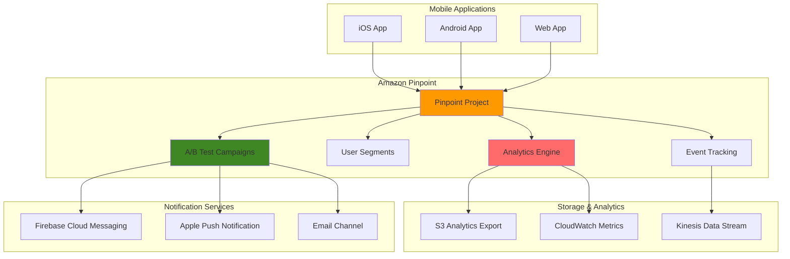

# Mobile App A/B Testing with Pinpoint Analytics

## Problem

Mobile app developers struggle to optimize user engagement and conversion rates without data-driven insights into user behavior. Traditional A/B testing approaches require complex infrastructure setup, manual campaign management, and lack real-time analytics capabilities. Development teams need to continuously test different app features, push notification strategies, and user interface elements to improve retention rates, but existing solutions are often fragmented across multiple platforms, making it difficult to measure the true impact of changes on user behavior and business metrics.

## Solution

Amazon Pinpoint provides a comprehensive A/B testing platform that enables mobile app developers to create, manage, and analyze sophisticated experiments across multiple channels including push notifications, in-app messaging, and email campaigns. This solution leverages Pinpoint's built-in analytics engine to automatically track user engagement, conversion events, and custom metrics, while providing statistical significance testing and automated winner selection to optimize campaign performance and user experience.

## Architecture Diagram



## Prerequisites

1. AWS account with Amazon Pinpoint service access in your region
2. AWS CLI v2 installed and configured (or AWS CloudShell)
3. Mobile app development knowledge (iOS/Android/Web)
4. Understanding of A/B testing concepts and statistical significance
5. Basic JSON and data analysis skills
6. Estimated cost: $50-100/month for testing (depends on message volume and analytics export)

## Preparation

```bash
# Set environment variables
export AWS_REGION=$(aws configure get region)
export AWS_ACCOUNT_ID=$(aws sts get-caller-identity \
    --query Account --output text)

# Generate unique identifiers for resources
RANDOM_SUFFIX=$(aws secretsmanager get-random-password \
    --exclude-punctuation --exclude-uppercase \
    --password-length 6 --require-each-included-type \
    --output text --query RandomPassword)

export PINPOINT_PROJECT_NAME="mobile-ab-testing-${RANDOM_SUFFIX}"
export S3_BUCKET_NAME="pinpoint-analytics-${RANDOM_SUFFIX}"
export IAM_ROLE_NAME="PinpointAnalyticsRole-${RANDOM_SUFFIX}"

# Create S3 bucket for analytics exports
aws s3 mb s3://${S3_BUCKET_NAME} --region ${AWS_REGION}

echo "✅ Environment variables set and S3 bucket created"
echo "Project Name: ${PINPOINT_PROJECT_NAME}"
echo "S3 Bucket: ${S3_BUCKET_NAME}"
```

## Steps

1. **Create Amazon Pinpoint Project**:

   Amazon Pinpoint projects serve as the foundational container for all your A/B testing activities. Each project represents a separate application environment and provides isolation between different campaigns, ensuring that test results and user segments don't interfere with each other. This isolation is essential for maintaining data integrity across multiple concurrent experiments and enables precise attribution of user actions to specific campaign treatments.

   ```bash
   # Create Pinpoint application (project)
   PINPOINT_APP_ID=$(aws pinpoint create-app \
       --create-application-request Name="${PINPOINT_PROJECT_NAME}" \
       --query 'ApplicationResponse.Id' --output text)
   
   echo "✅ Pinpoint project created with ID: ${PINPOINT_APP_ID}"
   export PINPOINT_APP_ID
   ```

   The project creation process generates a unique application ID that serves as the central identifier for all subsequent API calls. This ID links campaigns, user segments, analytics data, and configuration settings together, creating a cohesive testing environment for your mobile application.

2. **Configure Analytics Export to S3**:

   Setting up analytics export to S3 enables long-term storage and detailed analysis of A/B test results. This configuration creates an IAM role that grants Pinpoint permission to write campaign analytics, user engagement data, and conversion metrics to your S3 bucket for comprehensive post-campaign analysis.

   ```bash
   # Create IAM role for Pinpoint S3 export
   aws iam create-role \
       --role-name ${IAM_ROLE_NAME} \
       --assume-role-policy-document '{
           "Version": "2012-10-17",
           "Statement": [
               {
                   "Effect": "Allow",
                   "Principal": {
                       "Service": "pinpoint.amazonaws.com"
                   },
                   "Action": "sts:AssumeRole"
               }
           ]
       }'
   
   # Attach policy for S3 access
   aws iam attach-role-policy \
       --role-name ${IAM_ROLE_NAME} \
       --policy-arn arn:aws:iam::aws:policy/AmazonS3FullAccess
   
   # Get role ARN
   ROLE_ARN=$(aws iam get-role \
       --role-name ${IAM_ROLE_NAME} \
       --query 'Role.Arn' --output text)
   
   echo "✅ IAM role created: ${ROLE_ARN}"
   ```

   The IAM role configuration uses a trust policy that specifically allows the Pinpoint service to assume the role and write analytics data to S3. This setup enables automated export of detailed campaign metrics, including delivery rates, open rates, click-through rates, and custom conversion events that are crucial for A/B test analysis. The trust relationship ensures that only Amazon Pinpoint can assume this role, following AWS security best practices for service-to-service authentication.

3. **Enable Push Notification Channels**:

   Push notification channels are the communication pathways that enable Pinpoint to deliver A/B test messages to mobile devices. Each platform (iOS and Android) requires specific authentication credentials and configuration to establish secure, reliable message delivery to your application users.

   ```bash
   # Configure GCM/FCM channel (Android)
   # Note: Replace with your actual Firebase server key
   aws pinpoint update-gcm-channel \
       --application-id ${PINPOINT_APP_ID} \
       --gcm-channel-request \
       ApiKey="YOUR_FIREBASE_SERVER_KEY" \
       Enabled=true
   
   # Configure APNS channel (iOS)
   # Note: This requires your Apple Push certificate
   # For sandbox testing, use update-apns-sandbox-channel
   
   echo "✅ Push notification channels configured"
   echo "Note: Replace placeholders with actual credentials"
   ```

   The channel configuration establishes authenticated connections between Pinpoint and platform-specific notification services (Firebase Cloud Messaging for Android and Apple Push Notification Service for iOS). This setup enables Pinpoint to deliver your A/B test message variants directly to user devices while maintaining platform security requirements.

   > **Warning**: Store your Firebase server keys and Apple certificates securely using AWS Secrets Manager. Never commit these credentials to version control.

4. **Create User Segments for A/B Testing**:

   User segmentation is fundamental to A/B testing success, allowing you to target specific user groups based on demographics, behavior patterns, or app usage characteristics. Proper segmentation ensures that your test results are statistically valid and relevant to your optimization goals.

   ```bash
   # Create segment for active users
   ACTIVE_USERS_SEGMENT=$(aws pinpoint create-segment \
       --application-id ${PINPOINT_APP_ID} \
       --write-segment-request '{
           "Name": "ActiveUsers",
           "SegmentGroups": {
               "Groups": [
                   {
                       "Type": "ALL",
                       "SourceType": "ALL",
                       "Dimensions": {
                           "Demographic": {
                               "AppVersion": {
                                   "DimensionType": "INCLUSIVE",
                                   "Values": ["1.0.0", "1.1.0", "1.2.0"]
                               }
                           }
                       }
                   }
               ]
           }
       }' \
       --query 'SegmentResponse.Id' --output text)
   
   echo "✅ Active users segment created: ${ACTIVE_USERS_SEGMENT}"
   export ACTIVE_USERS_SEGMENT
   ```

   This segment configuration targets users running specific app versions, ensuring consistency in the A/B testing population. The segment ID will be used to associate campaigns with specific user groups, enabling precise targeting and accurate measurement of treatment effects across your user base.

5. **Create A/B Test Campaign with Multiple Treatments**:

   The campaign configuration defines your A/B test structure, including message variants (treatments), traffic allocation, and control groups. This setup implements a sophisticated multi-variant test with a control group, personalized messaging, and urgency-based messaging to determine which approach drives the highest user engagement.

   ```bash
   # Create A/B test campaign JSON configuration
   cat > ab-test-campaign.json << EOF
{
    "Name": "Push Notification A/B Test",
    "Description": "Testing different push notification messages for user engagement",
    "Schedule": {
        "StartTime": "IMMEDIATE",
        "IsLocalTime": false,
        "Timezone": "UTC"
    },
    "SegmentId": "${ACTIVE_USERS_SEGMENT}",
    "MessageConfiguration": {
        "GCMMessage": {
            "Body": "🎯 Control Message: Check out our new features!",
            "Title": "New Updates Available",
            "Action": "OPEN_APP",
            "SilentPush": false
        },
        "APNSMessage": {
            "Body": "🎯 Control Message: Check out our new features!",
            "Title": "New Updates Available",
            "Action": "OPEN_APP",
            "SilentPush": false
        }
    },
    "AdditionalTreatments": [
        {
            "TreatmentName": "Personalized",
            "TreatmentDescription": "Personalized message variant",
            "SizePercent": 45,
            "MessageConfiguration": {
                "GCMMessage": {
                    "Body": "🚀 Hi {{User.FirstName}}, discover features made just for you!",
                    "Title": "Personalized Updates",
                    "Action": "OPEN_APP",
                    "SilentPush": false
                },
                "APNSMessage": {
                    "Body": "🚀 Hi {{User.FirstName}}, discover features made just for you!",
                    "Title": "Personalized Updates",
                    "Action": "OPEN_APP",
                    "SilentPush": false
                }
            }
        },
        {
            "TreatmentName": "Urgent",
            "TreatmentDescription": "Urgent tone message variant",
            "SizePercent": 45,
            "MessageConfiguration": {
                "GCMMessage": {
                    "Body": "⚡ Don't miss out! Limited time features available now!",
                    "Title": "Limited Time Offer",
                    "Action": "OPEN_APP",
                    "SilentPush": false
                },
                "APNSMessage": {
                    "Body": "⚡ Don't miss out! Limited time features available now!",
                    "Title": "Limited Time Offer",
                    "Action": "OPEN_APP",
                    "SilentPush": false
                }
            }
        }
    ],
    "HoldoutPercent": 10
}
EOF
   
   # Create the A/B test campaign
   CAMPAIGN_ID=$(aws pinpoint create-campaign \
       --application-id ${PINPOINT_APP_ID} \
       --write-campaign-request file://ab-test-campaign.json \
       --query 'CampaignResponse.Id' --output text)
   
   echo "✅ A/B test campaign created: ${CAMPAIGN_ID}"
   export CAMPAIGN_ID
   ```

   This campaign configuration implements a sophisticated three-way split test: control (10%), personalized (45%), and urgent messaging (45%), with a 10% holdout group that receives no message. The holdout group is crucial for measuring the incremental impact of your campaigns compared to natural user behavior without any intervention.

   > **Tip**: Use holdout groups to measure incremental lift over organic user behavior. Learn more about [Amazon Pinpoint A/B testing campaigns](https://docs.aws.amazon.com/pinpoint/latest/developerguide/campaigns-abtest.html) and [campaign management best practices](https://docs.aws.amazon.com/pinpoint/latest/developerguide/campaigns.html).

6. **Configure Event Tracking for Conversions**:

   Event tracking is essential for measuring A/B test effectiveness beyond basic delivery metrics. This configuration enables real-time streaming of user interaction data and custom conversion events, allowing you to track meaningful business outcomes like app opens, purchases, or feature usage that result from your campaign messages.

   ```bash
   # Create event stream for real-time analytics
   aws pinpoint put-event-stream \
       --application-id ${PINPOINT_APP_ID} \
       --write-event-stream '{
           "DestinationStreamArn": "arn:aws:kinesis:'${AWS_REGION}':'${AWS_ACCOUNT_ID}':stream/pinpoint-events",
           "RoleArn": "'${ROLE_ARN}'"
       }'
   
   # Create custom metrics for conversion tracking
   aws pinpoint put-events \
       --application-id ${PINPOINT_APP_ID} \
       --events-request '{
           "BatchItem": {
               "test-endpoint": {
                   "Endpoint": {
                       "Address": "test@example.com",
                       "ChannelType": "EMAIL"
                   },
                   "Events": {
                       "conversion-event": {
                           "EventType": "conversion",
                           "Timestamp": "'$(date -u +%Y-%m-%dT%H:%M:%S.%3NZ)'",
                           "Attributes": {
                               "campaign_id": "'${CAMPAIGN_ID}'",
                               "conversion_type": "app_open"
                           },
                           "Metrics": {
                               "conversion_value": 1.0
                           }
                       }
                   }
               }
           }
       }'
   
   echo "✅ Event tracking configured for conversion analysis"
   ```

   The event stream configuration routes user interaction data to Kinesis for real-time processing, while the custom event example demonstrates how to track specific conversion actions. This setup enables you to measure not just message delivery rates, but actual business impact from your A/B test campaigns.

7. **Set Up Analytics Export Configuration**:

   Application settings control how Pinpoint handles campaign delivery, rate limiting, and analytics integration. This configuration enables CloudWatch metrics integration for real-time monitoring and sets appropriate delivery limits to manage campaign volume and cost while ensuring reliable message delivery.

   ```bash
   # Configure application settings for analytics
   aws pinpoint update-application-settings \
       --application-id ${PINPOINT_APP_ID} \
       --write-application-settings-request '{
           "CampaignHook": {
               "Mode": "DELIVERY",
               "WebUrl": "https://your-webhook-url.com/campaign-hook"
           },
           "CloudWatchMetricsEnabled": true,
           "EventTaggingEnabled": true,
           "Limits": {
               "Daily": 1000,
               "MaximumDuration": 86400,
               "MessagesPerSecond": 100,
               "Total": 10000
           }
       }'
   
   echo "✅ Application settings updated for enhanced analytics"
   ```

   These settings enable CloudWatch metrics collection for real-time campaign monitoring and implement delivery limits that prevent accidental over-sending while maintaining test validity. The rate limiting ensures controlled delivery that won't overwhelm users or exceed your intended test parameters.

8. **Create Custom Dashboard for A/B Test Monitoring**:

   A custom CloudWatch dashboard provides centralized, real-time visibility into your A/B test performance. This dashboard configuration creates visualizations for key metrics including message delivery rates, user engagement, and custom conversion events that are essential for monitoring test progress and identifying winning variants.

   ```bash
   # Create CloudWatch dashboard for campaign monitoring
   aws cloudwatch put-dashboard \
       --dashboard-name "Pinpoint-AB-Testing-${RANDOM_SUFFIX}" \
       --dashboard-body '{
           "widgets": [
               {
                   "type": "metric",
                   "properties": {
                       "metrics": [
                           ["AWS/Pinpoint", "DirectMessagesSent", "ApplicationId", "'${PINPOINT_APP_ID}'"],
                           [".", "DirectMessagesDelivered", ".", "."],
                           [".", "DirectMessagesBounced", ".", "."],
                           [".", "DirectMessagesOpened", ".", "."]
                       ],
                       "period": 300,
                       "stat": "Sum",
                       "region": "'${AWS_REGION}'",
                       "title": "Campaign Delivery Metrics"
                   }
               },
               {
                   "type": "metric",
                   "properties": {
                       "metrics": [
                           ["AWS/Pinpoint", "CustomEvents", "ApplicationId", "'${PINPOINT_APP_ID}'", "EventType", "conversion"]
                       ],
                       "period": 300,
                       "stat": "Sum",
                       "region": "'${AWS_REGION}'",
                       "title": "Conversion Events"
                   }
               }
           ]
       }'
   
   echo "✅ CloudWatch dashboard created for A/B test monitoring"
   ```

   The dashboard widgets display critical A/B testing metrics in real-time, allowing you to track delivery success rates, monitor conversion events, and identify performance trends across different treatment groups. This visual monitoring enables quick identification of issues and early detection of winning variants.

9. **Launch A/B Test Campaign**:

   Campaign activation begins the actual A/B test by enabling message delivery to your segmented user base. This step transitions your campaign from a configured state to active delivery, starting the data collection process that will determine which message variant performs best for your objectives.

   ```bash
   # Activate the campaign
   aws pinpoint update-campaign \
       --application-id ${PINPOINT_APP_ID} \
       --campaign-id ${CAMPAIGN_ID} \
       --write-campaign-request '{
           "IsPaused": false,
           "Schedule": {
               "StartTime": "IMMEDIATE",
               "IsLocalTime": false,
               "Timezone": "UTC"
           }
       }'
   
   echo "✅ A/B test campaign launched successfully"
   echo "Campaign ID: ${CAMPAIGN_ID}"
   echo "Monitor results in the AWS Console or via CloudWatch"
   ```

   Once activated, Pinpoint begins delivering messages according to your defined traffic allocation (control, personalized, and urgent treatments), while the holdout group receives no messages. Statistical significance typically emerges after 24-48 hours of data collection, depending on your user base size and conversion rates.

10. **Configure Automated Winner Selection**:

    Automated winner selection eliminates manual analysis by programmatically evaluating A/B test results and identifying the best-performing treatment based on statistical criteria. This Lambda function template demonstrates how to retrieve campaign analytics and implement logic for determining winning variants based on conversion rates and statistical significance.

    ```bash
    # Create Lambda function for automated winner selection
    cat > winner-selection-lambda.py << 'EOF'
import json
import boto3
from datetime import datetime, timedelta

def lambda_handler(event, context):
    pinpoint = boto3.client('pinpoint')
    
    application_id = event['application_id']
    campaign_id = event['campaign_id']
    
    # Get campaign analytics
    response = pinpoint.get_campaign_activities(
        ApplicationId=application_id,
        CampaignId=campaign_id
    )
    
    # Analyze conversion rates for each treatment
    # This is a simplified example - implement statistical significance testing
    treatments = response['ActivitiesResponse']['Item']
    
    best_treatment = None
    best_conversion_rate = 0
    
    for treatment in treatments:
        delivered = treatment.get('DeliveredCount', 0)
        conversions = treatment.get('ConversionsCount', 0)
        
        if delivered > 0:
            conversion_rate = conversions / delivered
            if conversion_rate > best_conversion_rate:
                best_conversion_rate = conversion_rate
                best_treatment = treatment
    
    # Log results
    print(f"Best treatment: {best_treatment}")
    print(f"Conversion rate: {best_conversion_rate:.2%}")
    
    return {
        'statusCode': 200,
        'body': json.dumps({
            'best_treatment': best_treatment,
            'conversion_rate': best_conversion_rate
        })
    }
EOF
    
    echo "✅ Winner selection logic created (Lambda function template)"
    echo "Deploy this function to automate winner selection"
    ```

    This automated approach reduces the time between test completion and optimization implementation, enabling rapid iteration and continuous improvement of your messaging strategy. The function can be enhanced with sophisticated statistical testing to ensure reliable winner selection. Consider implementing confidence intervals and p-value calculations to validate that observed differences between treatments are statistically significant rather than due to random variation.

11. **Set Up Real-time Event Processing**:

    Real-time event processing enables immediate analysis of user interactions as they occur during your A/B test. By streaming events to Kinesis, you can build real-time analytics pipelines that detect performance trends early and trigger automated optimizations based on emerging data patterns.

    ```bash
    # Create Kinesis stream for real-time event processing
    aws kinesis create-stream \
        --stream-name pinpoint-events \
        --shard-count 1
    
    # Wait for stream to be active
    aws kinesis wait stream-exists \
        --stream-name pinpoint-events
    
    # Configure event stream in Pinpoint
    aws pinpoint put-event-stream \
        --application-id ${PINPOINT_APP_ID} \
        --write-event-stream '{
            "DestinationStreamArn": "arn:aws:kinesis:'${AWS_REGION}':'${AWS_ACCOUNT_ID}':stream/pinpoint-events",
            "RoleArn": "'${ROLE_ARN}'"
        }'
    
    echo "✅ Real-time event processing configured"
    ```

    The Kinesis stream configuration creates a real-time data pipeline that captures user engagement events as they happen. This enables immediate campaign performance monitoring and supports dynamic optimization strategies that can adjust campaign parameters based on real-time performance data.

12. **Create Advanced Segment Targeting**:

    Advanced segmentation enables precision targeting based on user behavior patterns and engagement metrics. This behavioral segment identifies high-value users who have demonstrated consistent app usage, allowing you to tailor A/B tests specifically for your most engaged user base and potentially discover optimization strategies for user retention.

    ```bash
    # Create behavioral segment for high-value users
    HIGH_VALUE_SEGMENT=$(aws pinpoint create-segment \
        --application-id ${PINPOINT_APP_ID} \
        --write-segment-request '{
            "Name": "HighValueUsers",
            "SegmentGroups": {
                "Groups": [
                    {
                        "Type": "ALL",
                        "SourceType": "ALL",
                        "Dimensions": {
                            "Behavior": {
                                "Recency": {
                                    "Duration": "DAY_7",
                                    "RecencyType": "ACTIVE"
                                }
                            },
                            "Metrics": {
                                "session_count": {
                                    "ComparisonOperator": "GREATER_THAN",
                                    "Value": 5.0
                                }
                            }
                        }
                    }
                ]
            }
        }' \
        --query 'SegmentResponse.Id' --output text)
    
    echo "✅ High-value users segment created: ${HIGH_VALUE_SEGMENT}"
    export HIGH_VALUE_SEGMENT
    ```

    This behavioral segment targets users who have been active within the last 7 days and have more than 5 sessions, indicating high engagement levels. Using behavioral segments for A/B testing often yields higher conversion rates and provides insights into messaging strategies that resonate with your most valuable user segments.

## Validation & Testing

1. **Verify Campaign Status and Configuration**:

   ```bash
   # Check campaign status
   aws pinpoint get-campaign \
       --application-id ${PINPOINT_APP_ID} \
       --campaign-id ${CAMPAIGN_ID}
   ```

   Expected output: Campaign status should be "SCHEDULED" or "EXECUTING" with A/B test treatments visible.

2. **Test Endpoint Registration**:

   ```bash
   # Create test endpoint for validation
   aws pinpoint update-endpoint \
       --application-id ${PINPOINT_APP_ID} \
       --endpoint-id test-endpoint-001 \
       --endpoint-request '{
           "Address": "test@example.com",
           "ChannelType": "EMAIL",
           "User": {
               "UserId": "test-user-001",
               "UserAttributes": {
                   "FirstName": ["TestUser"],
                   "LastName": ["Demo"]
               }
           },
           "Demographic": {
               "AppVersion": "1.0.0",
               "Platform": "iOS"
           }
       }'
   
   echo "✅ Test endpoint registered successfully"
   ```

3. **Validate Event Tracking**:

   ```bash
   # Send test conversion event
   aws pinpoint put-events \
       --application-id ${PINPOINT_APP_ID} \
       --events-request '{
           "BatchItem": {
               "test-endpoint-001": {
                   "Endpoint": {
                       "Address": "test@example.com",
                       "ChannelType": "EMAIL"
                   },
                   "Events": {
                       "test-conversion": {
                           "EventType": "conversion",
                           "Timestamp": "'$(date -u +%Y-%m-%dT%H:%M:%S.%3NZ)'",
                           "Attributes": {
                               "campaign_id": "'${CAMPAIGN_ID}'",
                               "treatment": "control"
                           },
                           "Metrics": {
                               "conversion_value": 1.0
                           }
                       }
                   }
               }
           }
       }'
   
   echo "✅ Test conversion event sent"
   ```

4. **Check Analytics Dashboard**:

   ```bash
   # Get campaign analytics
   aws pinpoint get-campaign-activities \
       --application-id ${PINPOINT_APP_ID} \
       --campaign-id ${CAMPAIGN_ID}
   ```

   Expected output: Should show activity data for each treatment including delivery and engagement metrics.

5. **Validate S3 Analytics Export**:

   ```bash
   # Check if analytics data is being exported to S3
   aws s3 ls s3://${S3_BUCKET_NAME}/pinpoint-exports/ --recursive
   
   echo "✅ Analytics export validation complete"
   ```

## Cleanup

1. **Stop Active Campaigns**:

   ```bash
   # Pause the A/B test campaign
   aws pinpoint update-campaign \
       --application-id ${PINPOINT_APP_ID} \
       --campaign-id ${CAMPAIGN_ID} \
       --write-campaign-request '{"IsPaused": true}'
   
   echo "✅ Campaign paused"
   ```

2. **Delete Campaign and Segments**:

   ```bash
   # Delete campaign
   aws pinpoint delete-campaign \
       --application-id ${PINPOINT_APP_ID} \
       --campaign-id ${CAMPAIGN_ID}
   
   # Delete segments
   aws pinpoint delete-segment \
       --application-id ${PINPOINT_APP_ID} \
       --segment-id ${ACTIVE_USERS_SEGMENT}
   
   aws pinpoint delete-segment \
       --application-id ${PINPOINT_APP_ID} \
       --segment-id ${HIGH_VALUE_SEGMENT}
   
   echo "✅ Campaigns and segments deleted"
   ```

3. **Remove CloudWatch Dashboard**:

   ```bash
   # Delete CloudWatch dashboard
   aws cloudwatch delete-dashboards \
       --dashboard-names "Pinpoint-AB-Testing-${RANDOM_SUFFIX}"
   
   echo "✅ CloudWatch dashboard deleted"
   ```

4. **Delete Kinesis Stream**:

   ```bash
   # Delete Kinesis stream
   aws kinesis delete-stream \
       --stream-name pinpoint-events \
       --enforce-consumer-deletion
   
   echo "✅ Kinesis stream deleted"
   ```

5. **Clean Up S3 Bucket**:

   ```bash
   # Remove all objects from S3 bucket
   aws s3 rm s3://${S3_BUCKET_NAME} --recursive
   
   # Delete S3 bucket
   aws s3 rb s3://${S3_BUCKET_NAME}
   
   echo "✅ S3 bucket cleaned up"
   ```

6. **Remove IAM Role**:

   ```bash
   # Detach policies from role
   aws iam detach-role-policy \
       --role-name ${IAM_ROLE_NAME} \
       --policy-arn arn:aws:iam::aws:policy/AmazonS3FullAccess
   
   # Delete IAM role
   aws iam delete-role --role-name ${IAM_ROLE_NAME}
   
   echo "✅ IAM role removed"
   ```

7. **Delete Pinpoint Application**:

   ```bash
   # Delete Pinpoint application
   aws pinpoint delete-app --application-id ${PINPOINT_APP_ID}
   
   echo "✅ Pinpoint application deleted"
   ```

## Discussion

Amazon Pinpoint's A/B testing capabilities provide a robust platform for mobile app optimization through data-driven experimentation. The service's strength lies in its integrated approach, combining campaign management, real-time analytics, and automated optimization in a single platform. Unlike traditional A/B testing tools that require separate analytics integration, Pinpoint automatically tracks delivery metrics, engagement rates, and custom conversion events, enabling developers to make informed decisions based on statistical significance.

The architecture demonstrated here showcases Pinpoint's multi-channel capabilities, supporting push notifications, email, and in-app messaging across iOS, Android, and web platforms. The integration with Amazon S3 for analytics export and CloudWatch for monitoring creates a comprehensive testing framework that scales with application growth. The use of holdout groups ensures unbiased results by maintaining a control population that receives no treatment, while the automated winner selection logic can be extended to implement sophisticated statistical models for determining campaign effectiveness.

Statistical significance testing is crucial for reliable A/B testing results. Pinpoint provides built-in analytics that help evaluate whether observed differences between treatments are statistically meaningful or due to random variation. The platform's event tracking capabilities enable measurement of custom conversion metrics beyond standard engagement rates, such as in-app purchases, feature adoption, or user retention rates. This granular tracking allows for comprehensive analysis of user behavior patterns and long-term impact assessment of different messaging strategies. Advanced segmentation features allow for sophisticated targeting based on user attributes, behavior patterns, and engagement history, as documented in the [Amazon Pinpoint segmentation guide](https://docs.aws.amazon.com/pinpoint/latest/developerguide/segments-dynamic.html).

The cost-effectiveness of Pinpoint's A/B testing comes from its pay-per-use model and automated optimization features. Unlike maintaining separate testing infrastructure, Pinpoint eliminates the need for custom analytics pipelines, statistical analysis tools, and campaign management systems. The integration with AWS services like Kinesis for real-time event processing and S3 for long-term storage provides a scalable foundation that grows with application requirements while maintaining cost efficiency through intelligent resource allocation. This serverless approach to A/B testing reduces operational overhead and enables teams to focus on optimization strategy rather than infrastructure management.

> **Tip**: Always run A/B tests for a sufficient duration to capture weekly usage patterns and achieve statistical significance. Consider seasonal variations and user behavior patterns when interpreting results. See [Amazon Pinpoint analytics](https://docs.aws.amazon.com/pinpoint/latest/developerguide/welcome.html) for guidance on measuring campaign effectiveness.

## Challenge

Extend this A/B testing solution by implementing these advanced enhancements:

1. **Multi-variate Testing**: Implement multi-dimensional testing by combining different message content, timing, and frequency variations to identify optimal combinations across multiple variables simultaneously.

2. **Predictive Audience Segmentation**: Use Amazon Personalize to create dynamic user segments based on predicted behavior patterns, enabling more sophisticated targeting strategies for A/B tests.

3. **Cross-channel Journey Optimization**: Implement A/B testing across multiple touchpoints by integrating Amazon Pinpoint with Amazon Connect for voice interactions and Amazon Chime SDK for in-app communication features.

4. **Advanced Statistical Analysis**: Deploy Amazon SageMaker to perform Bayesian A/B testing and multi-armed bandit algorithms that automatically allocate more traffic to winning variants during the test period.

5. **Real-time Personalization**: Build a recommendation engine that uses A/B test results to personalize message content, timing, and channel selection for individual users based on their historical response patterns and demographic characteristics.

## Infrastructure Code

*Infrastructure code will be generated after recipe approval.*