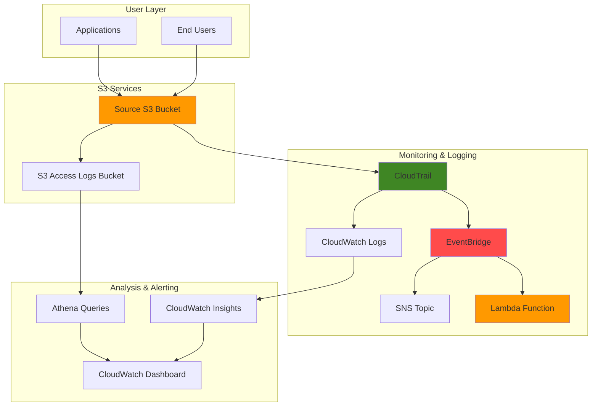

# Monitoring S3 Access with CloudTrail and EventBridge

## Problem

Financial institutions and healthcare organizations need comprehensive audit trails for S3 data access to meet regulatory compliance requirements like SOX, HIPAA, and PCI-DSS. Without proper logging and monitoring, security teams cannot detect unauthorized access attempts, investigate data breaches, or provide compliance auditors with detailed access reports. Traditional approaches often miss critical security events or provide incomplete visibility into S3 access patterns.

## Solution

This solution implements a comprehensive S3 access logging and security monitoring system using AWS S3 Server Access Logging combined with CloudTrail API monitoring. The architecture provides detailed access logs for compliance auditing, real-time security event detection through CloudWatch and EventBridge, and automated alerting for suspicious activities. This approach ensures complete visibility into both data plane and control plane S3 operations.

## Architecture Diagram



## Prerequisites

1. AWS account with appropriate permissions for S3, CloudTrail, CloudWatch, and EventBridge
2. AWS CLI v2 installed and configured (or AWS CloudShell)
3. Understanding of S3 bucket policies and IAM permissions
4. Knowledge of CloudTrail event structure and CloudWatch Logs
5. Estimated cost: $10-30/month for moderate usage (CloudTrail $2/100k events, S3 storage $0.023/GB, CloudWatch Logs $0.50/GB)

> **Note**: S3 Server Access Logging is free, but storage costs apply for log files. CloudTrail charges apply for data events.

## Preparation

```bash
# Set environment variables
export AWS_REGION=$(aws configure get region)
export AWS_ACCOUNT_ID=$(aws sts get-caller-identity \
    --query Account --output text)

# Generate unique identifiers for resources
RANDOM_SUFFIX=$(aws secretsmanager get-random-password \
    --exclude-punctuation --exclude-uppercase \
    --password-length 6 --require-each-included-type \
    --output text --query RandomPassword)

# Set bucket names
export SOURCE_BUCKET="secure-docs-${RANDOM_SUFFIX}"
export LOGS_BUCKET="s3-access-logs-${RANDOM_SUFFIX}"
export CLOUDTRAIL_BUCKET="cloudtrail-logs-${RANDOM_SUFFIX}"

# Create source bucket for monitoring
aws s3api create-bucket \
    --bucket $SOURCE_BUCKET \
    --region $AWS_REGION \
    --create-bucket-configuration LocationConstraint=$AWS_REGION

# Create logs bucket for S3 access logs
aws s3api create-bucket \
    --bucket $LOGS_BUCKET \
    --region $AWS_REGION \
    --create-bucket-configuration LocationConstraint=$AWS_REGION

# Create CloudTrail bucket
aws s3api create-bucket \
    --bucket $CLOUDTRAIL_BUCKET \
    --region $AWS_REGION \
    --create-bucket-configuration LocationConstraint=$AWS_REGION

echo "✅ Created foundational S3 buckets"
```

## Steps

1. **Configure S3 Server Access Logging**:

   S3 Server Access Logging provides detailed records of all requests made to your S3 bucket, including the requester's IP address, request time, action performed, and response status. This foundational security capability creates an immutable audit trail essential for compliance frameworks like SOX, HIPAA, and PCI-DSS. The logging service requires specific IAM permissions to write log files to your designated logging bucket.

   ```bash
   # Create bucket policy for S3 logging service
   cat > s3-logging-policy.json << EOF
   {
       "Version": "2012-10-17",
       "Statement": [
           {
               "Sid": "S3ServerAccessLogsPolicy",
               "Effect": "Allow",
               "Principal": {"Service": "logging.s3.amazonaws.com"},
               "Action": "s3:PutObject",
               "Resource": "arn:aws:s3:::${LOGS_BUCKET}/access-logs/*",
               "Condition": {
                   "ArnLike": {
                       "aws:SourceArn": "arn:aws:s3:::${SOURCE_BUCKET}"
                   },
                   "StringEquals": {
                       "aws:SourceAccount": "${AWS_ACCOUNT_ID}"
                   }
               }
           }
       ]
   }
   EOF
   
   # Apply logging policy to logs bucket
   aws s3api put-bucket-policy \
       --bucket $LOGS_BUCKET \
       --policy file://s3-logging-policy.json
   
   echo "✅ Applied S3 logging policy to logs bucket"
   ```

   The bucket policy now grants the S3 logging service the necessary permissions to write access logs to your logging bucket. The policy includes security conditions that ensure only logs from your specific source bucket can be written, preventing unauthorized log injection attacks.

2. **Enable S3 Server Access Logging**:

   Enabling S3 Server Access Logging activates the automatic generation of detailed access records for every request made to your bucket. The date-based partitioning feature organizes logs by event time, improving query performance and reducing storage costs by enabling efficient lifecycle policies. This partitioning strategy is crucial for high-volume environments where millions of access events need to be analyzed efficiently.

   ```bash
   # Create logging configuration with date-based partitioning
   cat > logging-config.json << EOF
   {
       "LoggingEnabled": {
           "TargetBucket": "${LOGS_BUCKET}",
           "TargetPrefix": "access-logs/",
           "TargetObjectKeyFormat": {
               "PartitionedPrefix": {
                   "PartitionDateSource": "EventTime"
               }
           }
       }
   }
   EOF
   
   # Enable server access logging
   aws s3api put-bucket-logging \
       --bucket $SOURCE_BUCKET \
       --bucket-logging-status file://logging-config.json
   
   # Verify logging configuration
   aws s3api get-bucket-logging \
       --bucket $SOURCE_BUCKET
   
   echo "✅ Enabled S3 server access logging with date partitioning"
   ```

   S3 Server Access Logging is now active and will begin generating detailed access records within a few hours. These logs provide comprehensive visibility into data plane operations, creating the foundation for security monitoring and compliance reporting.

3. **Create CloudTrail for S3 API Monitoring**:

   CloudTrail provides control plane monitoring by capturing API calls made to AWS services, including S3 management operations like bucket creation, policy changes, and access control modifications. While S3 Server Access Logging captures data access events, CloudTrail captures administrative actions that could affect security posture. The bucket policy configuration enables CloudTrail to securely store API logs with proper access controls.

   ```bash
   # Create bucket policy for CloudTrail
   cat > cloudtrail-policy.json << EOF
   {
       "Version": "2012-10-17",
       "Statement": [
           {
               "Sid": "AWSCloudTrailAclCheck",
               "Effect": "Allow",
               "Principal": {
                   "Service": "cloudtrail.amazonaws.com"
               },
               "Action": "s3:GetBucketAcl",
               "Resource": "arn:aws:s3:::${CLOUDTRAIL_BUCKET}",
               "Condition": {
                   "StringEquals": {
                       "aws:SourceArn": "arn:aws:cloudtrail:${AWS_REGION}:${AWS_ACCOUNT_ID}:trail/s3-security-monitoring-trail"
                   }
               }
           },
           {
               "Sid": "AWSCloudTrailWrite",
               "Effect": "Allow",
               "Principal": {
                   "Service": "cloudtrail.amazonaws.com"
               },
               "Action": "s3:PutObject",
               "Resource": "arn:aws:s3:::${CLOUDTRAIL_BUCKET}/*",
               "Condition": {
                   "StringEquals": {
                       "s3:x-amz-acl": "bucket-owner-full-control",
                       "aws:SourceArn": "arn:aws:cloudtrail:${AWS_REGION}:${AWS_ACCOUNT_ID}:trail/s3-security-monitoring-trail"
                   }
               }
           }
       ]
   }
   EOF
   
   # Apply CloudTrail policy
   aws s3api put-bucket-policy \
       --bucket $CLOUDTRAIL_BUCKET \
       --policy file://cloudtrail-policy.json
   
   echo "✅ Applied CloudTrail bucket policy"
   ```

   The CloudTrail bucket is now configured with appropriate permissions and security conditions, enabling secure storage of API event logs. This establishes the infrastructure foundation for comprehensive control plane monitoring of your S3 environment.

4. **Create CloudTrail with S3 Data Events**:

   Creating a CloudTrail trail with S3 data events enables comprehensive monitoring of both management events (API calls that modify AWS resources) and data events (object-level operations like GetObject, PutObject). This dual-layer monitoring approach provides complete visibility into S3 activities. The multi-region configuration ensures events from all AWS regions are captured, while log file validation provides cryptographic integrity verification.

   ```bash
   # Create CloudTrail trail
   export TRAIL_NAME="s3-security-monitoring-trail"
   
   aws cloudtrail create-trail \
       --name $TRAIL_NAME \
       --s3-bucket-name $CLOUDTRAIL_BUCKET \
       --s3-key-prefix "cloudtrail-logs/" \
       --include-global-service-events \
       --is-multi-region-trail \
       --enable-log-file-validation
   
   # Configure event selectors for S3 data events
   aws cloudtrail put-event-selectors \
       --trail-name $TRAIL_NAME \
       --event-selectors '[{
           "ReadWriteType": "All",
           "IncludeManagementEvents": true,
           "DataResources": [{
               "Type": "AWS::S3::Object",
               "Values": ["arn:aws:s3:::'"$SOURCE_BUCKET"'/*"]
           }]
       }]'
   
   # Start logging
   aws cloudtrail start-logging --name $TRAIL_NAME
   
   echo "✅ Created and started CloudTrail with S3 data events"
   ```

   CloudTrail is now actively monitoring S3 operations and capturing both administrative actions and data access events. This comprehensive logging capability provides the visibility needed for security monitoring, compliance auditing, and forensic analysis of your S3 environment.

5. **Create CloudWatch Log Group for CloudTrail**:

   CloudWatch Logs integration enables real-time monitoring and alerting on CloudTrail events by streaming API logs directly to CloudWatch. This integration transforms static log files into searchable, queryable data streams that support real-time security monitoring. The IAM role configuration follows the principle of least privilege, granting CloudTrail only the specific permissions needed to write logs to the designated log group.

   ```bash
   # Create CloudWatch log group
   export LOG_GROUP_NAME="/aws/cloudtrail/s3-security-monitoring"
   
   aws logs create-log-group \
       --log-group-name $LOG_GROUP_NAME \
       --retention-in-days 30
   
   # Create IAM role for CloudTrail CloudWatch integration
   cat > cloudtrail-logs-role-policy.json << EOF
   {
       "Version": "2012-10-17",
       "Statement": [
           {
               "Effect": "Allow",
               "Principal": {
                   "Service": "cloudtrail.amazonaws.com"
               },
               "Action": "sts:AssumeRole"
           }
       ]
   }
   EOF
   
   # Create role
   aws iam create-role \
       --role-name CloudTrailLogsRole \
       --assume-role-policy-document file://cloudtrail-logs-role-policy.json
   
   # Create policy for CloudWatch Logs
   cat > cloudtrail-logs-permissions.json << EOF
   {
       "Version": "2012-10-17",
       "Statement": [
           {
               "Effect": "Allow",
               "Action": [
                   "logs:CreateLogGroup",
                   "logs:CreateLogStream",
                   "logs:PutLogEvents",
                   "logs:DescribeLogGroups",
                   "logs:DescribeLogStreams"
               ],
               "Resource": "arn:aws:logs:${AWS_REGION}:${AWS_ACCOUNT_ID}:log-group:${LOG_GROUP_NAME}*"
           }
       ]
   }
   EOF
   
   # Attach policy to role
   aws iam put-role-policy \
       --role-name CloudTrailLogsRole \
       --policy-name CloudTrailLogsPolicy \
       --policy-document file://cloudtrail-logs-permissions.json
   
   echo "✅ Created CloudWatch log group and IAM role"
   ```

   The CloudWatch integration infrastructure is now established, enabling real-time log streaming from CloudTrail. This foundation supports advanced security monitoring capabilities including automated alerting, log analysis, and incident response workflows.

6. **Configure CloudTrail CloudWatch Integration**:

   Connecting CloudTrail to CloudWatch Logs transforms your audit trail from static files into a real-time data stream, enabling immediate security monitoring and alerting. This integration supports advanced log analysis using CloudWatch Insights, automated event correlation, and real-time threat detection. The near real-time delivery (typically within 5 minutes) enables rapid response to security incidents.

   ```bash
   # Update CloudTrail to send logs to CloudWatch
   export ROLE_ARN="arn:aws:iam::${AWS_ACCOUNT_ID}:role/CloudTrailLogsRole"
   
   aws cloudtrail update-trail \
       --name $TRAIL_NAME \
       --cloud-watch-logs-log-group-arn "arn:aws:logs:${AWS_REGION}:${AWS_ACCOUNT_ID}:log-group:${LOG_GROUP_NAME}*" \
       --cloud-watch-logs-role-arn $ROLE_ARN
   
   echo "✅ Configured CloudTrail to send logs to CloudWatch"
   ```

   CloudTrail events are now streaming to CloudWatch Logs in near real-time, enabling immediate security monitoring and automated alerting. This real-time capability is essential for detecting and responding to security incidents before they escalate into data breaches.

7. **Create EventBridge Rules for Security Monitoring**:

   EventBridge enables automated security monitoring by creating rules that detect specific patterns in CloudTrail events and trigger immediate alerts. This event-driven architecture allows for real-time detection of security anomalies like unauthorized access attempts, suspicious API calls, or policy violations. The integration with SNS provides immediate notification to security teams, enabling rapid incident response.

   ```bash
   # Create SNS topic for security alerts
   export SNS_TOPIC_ARN=$(aws sns create-topic \
       --name s3-security-alerts \
       --query TopicArn --output text)
   
   # Subscribe email to SNS (replace with your email)
   aws sns subscribe \
       --topic-arn $SNS_TOPIC_ARN \
       --protocol email \
       --notification-endpoint "your-email@example.com"
   
   # Create EventBridge rule for unauthorized access attempts
   aws events put-rule \
       --name "S3UnauthorizedAccess" \
       --event-pattern '{
           "source": ["aws.s3"],
           "detail-type": ["AWS API Call via CloudTrail"],
           "detail": {
               "eventName": ["GetObject", "PutObject", "DeleteObject"],
               "errorCode": ["AccessDenied", "SignatureDoesNotMatch"]
           }
       }'
   
   # Add SNS target to EventBridge rule
   aws events put-targets \
       --rule "S3UnauthorizedAccess" \
       --targets "Id"="1","Arn"="$SNS_TOPIC_ARN"
   
   echo "✅ Created EventBridge rules and SNS topic for security alerts"
   ```

   The automated security monitoring system is now active, continuously scanning CloudTrail events for unauthorized access attempts and suspicious activities. When security events are detected, immediate alerts are sent to security teams, enabling rapid incident response and threat mitigation.

   > **Warning**: Replace the email address with your actual security team's email to receive real security alerts. Test the notification system before relying on it for production security monitoring.

8. **Create Lambda Execution Role and Security Monitoring Function**:

   Lambda functions provide advanced security analysis capabilities beyond simple pattern matching, enabling sophisticated threat detection using custom logic, machine learning models, or integration with external security tools. This serverless approach scales automatically with event volume and provides cost-effective security monitoring. The function can correlate multiple events, maintain state across invocations, and implement complex security rules.

   ```bash
   # Create IAM role for Lambda function
   cat > lambda-execution-role-policy.json << EOF
   {
       "Version": "2012-10-17",
       "Statement": [
           {
               "Effect": "Allow",
               "Principal": {
                   "Service": "lambda.amazonaws.com"
               },
               "Action": "sts:AssumeRole"
           }
       ]
   }
   EOF
   
   # Create Lambda execution role
   aws iam create-role \
       --role-name LambdaS3SecurityMonitorRole \
       --assume-role-policy-document file://lambda-execution-role-policy.json
   
   # Create policy for Lambda permissions
   cat > lambda-permissions.json << EOF
   {
       "Version": "2012-10-17",
       "Statement": [
           {
               "Effect": "Allow",
               "Action": [
                   "logs:CreateLogGroup",
                   "logs:CreateLogStream",
                   "logs:PutLogEvents"
               ],
               "Resource": "arn:aws:logs:${AWS_REGION}:${AWS_ACCOUNT_ID}:*"
           },
           {
               "Effect": "Allow",
               "Action": [
                   "sns:Publish"
               ],
               "Resource": "${SNS_TOPIC_ARN}"
           }
       ]
   }
   EOF
   
   # Attach policy to Lambda role
   aws iam put-role-policy \
       --role-name LambdaS3SecurityMonitorRole \
       --policy-name LambdaS3SecurityMonitorPolicy \
       --policy-document file://lambda-permissions.json
   
   # Create Lambda function for advanced security analysis
   cat > security-monitor.py << 'EOF'
   import json
   import boto3
   import logging
   from datetime import datetime
   import os

   logger = logging.getLogger()
   logger.setLevel(logging.INFO)

   sns = boto3.client('sns')
   SNS_TOPIC_ARN = os.environ.get('SNS_TOPIC_ARN')

   def lambda_handler(event, context):
       try:
           # Parse CloudTrail event
           records = event.get('Records', [])
           
           for record in records:
               if 'eventSource' in record and record['eventSource'] == 'aws.s3':
                   analyze_s3_event(record)
           
           return {
               'statusCode': 200,
               'body': json.dumps('Security monitoring completed')
           }
       except Exception as e:
           logger.error(f"Error processing event: {str(e)}")
           raise

   def analyze_s3_event(event):
       event_name = event.get('eventName', '')
       source_ip = event.get('sourceIPAddress', '')
       user_identity = event.get('userIdentity', {})
       
       # Check for suspicious patterns
       if is_suspicious_activity(event_name, source_ip, user_identity):
           send_alert(event)

   def is_suspicious_activity(event_name, source_ip, user_identity):
       # Example security checks
       suspicious_actions = ['DeleteBucket', 'PutBucketPolicy', 'PutBucketAcl']
       
       if event_name in suspicious_actions:
           return True
       
       # Check for access from unusual locations
       if source_ip and not source_ip.startswith('10.'):
           return True
       
       return False

   def send_alert(event):
       if not SNS_TOPIC_ARN:
           logger.error("SNS_TOPIC_ARN environment variable not set")
           return
           
       message = f"Security Alert: Suspicious S3 activity detected\n"
       message += f"Event: {event.get('eventName', 'Unknown')}\n"
       message += f"Source IP: {event.get('sourceIPAddress', 'Unknown')}\n"
       message += f"Time: {event.get('eventTime', 'Unknown')}"
       
       sns.publish(
           TopicArn=SNS_TOPIC_ARN,
           Message=message,
           Subject='S3 Security Alert'
       )
   EOF
   
   # Create Lambda deployment package
   zip security-monitor.zip security-monitor.py
   
   # Wait for role to propagate
   sleep 10
   
   # Create Lambda function
   aws lambda create-function \
       --function-name s3-security-monitor \
       --runtime python3.9 \
       --role "arn:aws:iam::${AWS_ACCOUNT_ID}:role/LambdaS3SecurityMonitorRole" \
       --handler security-monitor.lambda_handler \
       --zip-file fileb://security-monitor.zip \
       --timeout 30 \
       --environment Variables="{SNS_TOPIC_ARN=${SNS_TOPIC_ARN}}"
   
   echo "✅ Created Lambda function for security monitoring"
   ```

   The Lambda-based security monitoring function is now deployed and ready to analyze S3 events for advanced threat patterns. This serverless security capability provides scalable, cost-effective threat detection that can be customized to your organization's specific security requirements and risk profile.

9. **Create CloudWatch Dashboard for Monitoring**:

   CloudWatch dashboards provide centralized visibility into S3 security metrics and access patterns, enabling security teams to quickly identify trends, anomalies, and potential threats. The dashboard combines metrics from S3, CloudTrail, and CloudWatch Logs to create a comprehensive security monitoring view. This operational visibility is essential for proactive security management and compliance reporting.

   ```bash
   # Create CloudWatch dashboard
   cat > dashboard-config.json << EOF
   {
       "widgets": [
           {
               "type": "metric",
               "properties": {
                   "metrics": [
                       ["AWS/S3", "BucketSizeBytes", "BucketName", "${SOURCE_BUCKET}"],
                       ["AWS/S3", "NumberOfObjects", "BucketName", "${SOURCE_BUCKET}"]
                   ],
                   "period": 300,
                   "stat": "Average",
                   "region": "${AWS_REGION}",
                   "title": "S3 Bucket Metrics"
               }
           },
           {
               "type": "log",
               "properties": {
                   "query": "SOURCE '${LOG_GROUP_NAME}' | fields @timestamp, eventName, sourceIPAddress, userIdentity.type\n| filter eventName like /GetObject|PutObject|DeleteObject/\n| stats count() by eventName\n| sort count desc",
                   "region": "${AWS_REGION}",
                   "title": "Top S3 API Calls"
               }
           }
       ]
   }
   EOF
   
   # Create dashboard
   aws cloudwatch put-dashboard \
       --dashboard-name "S3SecurityMonitoring" \
       --dashboard-body file://dashboard-config.json
   
   echo "✅ Created CloudWatch dashboard for S3 security monitoring"
   ```

   The security monitoring dashboard is now available, providing real-time visibility into S3 access patterns, security events, and operational metrics. Security teams can use this centralized view to monitor trends, investigate incidents, and demonstrate compliance to auditors.

10. **Set up Log Analysis with CloudWatch Insights**:

    CloudWatch Insights provides powerful log analysis capabilities using SQL-like queries to extract security intelligence from CloudTrail logs. These pre-built security queries enable rapid identification of unauthorized access attempts, unusual access patterns, and administrative actions that could indicate security incidents. Regular execution of these queries supports proactive threat hunting and security monitoring.

    ```bash
    # Create CloudWatch Insights queries for security analysis
    cat > security-queries.txt << 'EOF'
    # Query 1: Failed access attempts
    fields @timestamp, eventName, sourceIPAddress, errorCode, errorMessage
    | filter errorCode = "AccessDenied"
    | stats count() by sourceIPAddress
    | sort count desc
    
    # Query 2: Unusual access patterns
    fields @timestamp, eventName, sourceIPAddress, userIdentity.type
    | filter eventName like /GetObject|PutObject|DeleteObject/
    | stats count() by sourceIPAddress, userIdentity.type
    | sort count desc
    
    # Query 3: Administrative actions
    fields @timestamp, eventName, sourceIPAddress, userIdentity.arn
    | filter eventName like /PutBucket|DeleteBucket|PutBucketPolicy/
    | sort @timestamp desc
    EOF
    
    echo "✅ Created CloudWatch Insights queries for security analysis"
    ```

    The security analysis queries are now available for use in CloudWatch Insights, providing powerful log analysis capabilities for threat hunting and security investigation. These queries enable security teams to quickly identify patterns and anomalies that could indicate security incidents or compliance violations.

## Validation & Testing

1. **Test S3 Server Access Logging**:

   ```bash
   # Upload test file to source bucket
   echo "Test content for access logging" > test-file.txt
   aws s3 cp test-file.txt s3://$SOURCE_BUCKET/
   
   # Wait for logs to be generated (may take several minutes)
   sleep 300
   
   # Check for access logs
   aws s3 ls s3://$LOGS_BUCKET/access-logs/ --recursive
   ```

   Expected output: Log files with timestamp-based naming structure

2. **Verify CloudTrail Events**:

   ```bash
   # Check CloudTrail events for S3 operations
   aws cloudtrail lookup-events \
       --lookup-attributes AttributeKey=ResourceName,AttributeValue=$SOURCE_BUCKET \
       --start-time $(date -u -d '1 hour ago' +%Y-%m-%dT%H:%M:%S) \
       --end-time $(date -u +%Y-%m-%dT%H:%M:%S)
   ```

   Expected output: JSON array of CloudTrail events showing S3 operations

3. **Test Security Monitoring**:

   ```bash
   # Generate test access denied event
   aws s3api get-object \
       --bucket $SOURCE_BUCKET \
       --key non-existent-file.txt \
       local-file.txt 2>/dev/null || echo "Expected access denied"
   
   # Check CloudWatch Logs for the event
   aws logs describe-log-streams \
       --log-group-name $LOG_GROUP_NAME \
       --order-by LastEventTime \
       --descending
   ```

4. **Validate Dashboard and Alerts**:

   ```bash
   # Check dashboard creation
   aws cloudwatch get-dashboard \
       --dashboard-name "S3SecurityMonitoring"
   
   # Test SNS topic
   aws sns publish \
       --topic-arn $SNS_TOPIC_ARN \
       --message "Test security alert from S3 monitoring system"
   ```

## Cleanup

1. **Remove CloudTrail and associated resources**:

   ```bash
   # Stop CloudTrail logging
   aws cloudtrail stop-logging --name $TRAIL_NAME
   
   # Delete CloudTrail trail
   aws cloudtrail delete-trail --name $TRAIL_NAME
   
   echo "✅ Deleted CloudTrail trail"
   ```

2. **Remove CloudWatch resources**:

   ```bash
   # Delete CloudWatch dashboard
   aws cloudwatch delete-dashboards \
       --dashboard-names "S3SecurityMonitoring"
   
   # Delete CloudWatch log group
   aws logs delete-log-group \
       --log-group-name $LOG_GROUP_NAME
   
   echo "✅ Deleted CloudWatch resources"
   ```

3. **Remove EventBridge and SNS resources**:

   ```bash
   # Delete EventBridge rule
   aws events remove-targets \
       --rule "S3UnauthorizedAccess" \
       --ids "1"
   
   aws events delete-rule \
       --name "S3UnauthorizedAccess"
   
   # Delete SNS topic
   aws sns delete-topic --topic-arn $SNS_TOPIC_ARN
   
   echo "✅ Deleted EventBridge and SNS resources"
   ```

4. **Remove Lambda function and role**:

   ```bash
   # Delete Lambda function
   aws lambda delete-function \
       --function-name s3-security-monitor
   
   # Delete Lambda IAM role policy
   aws iam delete-role-policy \
       --role-name LambdaS3SecurityMonitorRole \
       --policy-name LambdaS3SecurityMonitorPolicy
   
   # Delete Lambda IAM role
   aws iam delete-role \
       --role-name LambdaS3SecurityMonitorRole
   
   echo "✅ Deleted Lambda function and role"
   ```

5. **Remove CloudTrail IAM role and policies**:

   ```bash
   # Delete IAM role policy
   aws iam delete-role-policy \
       --role-name CloudTrailLogsRole \
       --policy-name CloudTrailLogsPolicy
   
   # Delete IAM role
   aws iam delete-role \
       --role-name CloudTrailLogsRole
   
   echo "✅ Deleted CloudTrail IAM resources"
   ```

6. **Remove S3 buckets and contents**:

   ```bash
   # Empty and delete buckets
   aws s3 rm s3://$SOURCE_BUCKET --recursive
   aws s3 rb s3://$SOURCE_BUCKET
   
   aws s3 rm s3://$LOGS_BUCKET --recursive
   aws s3 rb s3://$LOGS_BUCKET
   
   aws s3 rm s3://$CLOUDTRAIL_BUCKET --recursive
   aws s3 rb s3://$CLOUDTRAIL_BUCKET
   
   # Remove local files
   rm -f test-file.txt s3-logging-policy.json logging-config.json
   rm -f cloudtrail-policy.json cloudtrail-logs-role-policy.json
   rm -f cloudtrail-logs-permissions.json security-monitor.py
   rm -f security-monitor.zip dashboard-config.json security-queries.txt
   rm -f lambda-execution-role-policy.json lambda-permissions.json
   
   echo "✅ Deleted all S3 buckets and local files"
   ```

## Discussion

This comprehensive S3 access logging and security monitoring solution addresses critical compliance and security requirements by combining multiple AWS services for complete visibility. S3 Server Access Logging provides detailed records of all bucket access requests, including source IP addresses, request types, and response codes, which is essential for compliance auditing and forensic analysis as outlined in the [AWS S3 Server Access Logging documentation](https://docs.aws.amazon.com/AmazonS3/latest/userguide/ServerLogs.html).

The integration with CloudTrail adds API-level monitoring that captures control plane operations like bucket policy changes, access control modifications, and administrative actions. This dual-layer approach ensures that both data plane operations (actual file access) and control plane operations (configuration changes) are thoroughly logged and monitored, following AWS Well-Architected Framework security principles.

The real-time alerting system using EventBridge and SNS enables immediate response to security incidents, while the CloudWatch dashboard provides operational visibility for security teams. The date-based partitioning of access logs optimizes storage costs and query performance, making it practical for organizations with high-volume S3 usage. According to the [AWS CloudTrail best practices](https://docs.aws.amazon.com/awscloudtrail/latest/userguide/best-practices-security.html), implementing proper S3 bucket policies and CloudWatch integration are essential for maintaining audit trail integrity.

For compliance frameworks like SOX, HIPAA, and PCI-DSS, this solution provides the necessary audit trails and controls to demonstrate data access governance. The automated monitoring reduces manual oversight burden while ensuring that security incidents are quickly identified and escalated. The implementation follows the AWS Well-Architected Framework's security pillar by implementing defense in depth, least privilege access, and comprehensive logging.

> **Tip**: Use CloudWatch Insights queries to analyze access patterns and identify anomalies. Regular analysis of access logs can reveal unauthorized access attempts and help optimize security policies according to AWS security best practices.

## Challenge

Extend this solution by implementing these enhancements:

1. **Advanced Threat Detection**: Integrate with Amazon GuardDuty to correlate S3 access patterns with known threat intelligence and detect sophisticated attacks using machine learning capabilities.

2. **Automated Response**: Create Lambda functions that automatically respond to security events by temporarily blocking suspicious IP addresses using AWS WAF or revoking access tokens through IAM.

3. **Cross-Account Monitoring**: Extend the monitoring to cover S3 buckets across multiple AWS accounts using AWS Organizations and centralized logging with cross-account role assumptions.

4. **Compliance Reporting**: Build automated compliance reports using Amazon QuickSight that aggregate access logs and present them in formats required by auditors for SOX, HIPAA, and PCI-DSS compliance.

5. **Data Loss Prevention**: Implement real-time scanning of uploaded files using Amazon Macie to detect sensitive data and trigger alerts for potential compliance violations or data exfiltration attempts.

## Infrastructure Code

### Available Infrastructure as Code:

- [Infrastructure Code Overview](code/README.md) - Detailed description of all infrastructure components
- [AWS CDK (Python)](code/cdk-python/) - AWS CDK Python implementation
- [AWS CDK (TypeScript)](code/cdk-typescript/) - AWS CDK TypeScript implementation
- [CloudFormation](code/cloudformation.yaml) - AWS CloudFormation template
- [Bash CLI Scripts](code/scripts/) - Example bash scripts using AWS CLI commands to deploy infrastructure
- [Terraform](code/terraform/) - Terraform configuration files