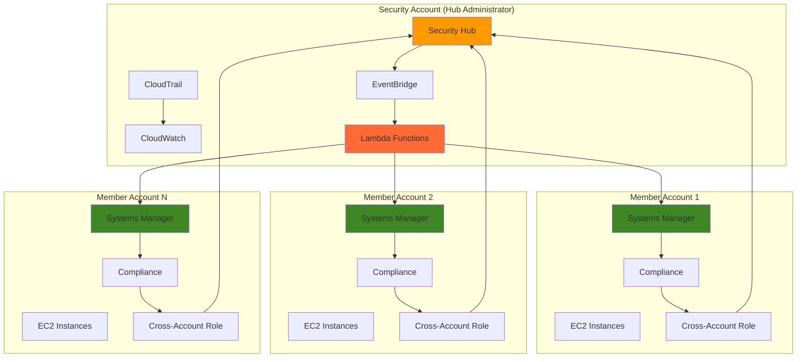

# Cross-Account Compliance Monitoring with Security Hub

## Problem

Enterprise organizations operating multiple AWS accounts face significant challenges in maintaining consistent security compliance across their entire infrastructure. Without centralized visibility, security teams struggle to identify configuration drift, patch compliance violations, and policy adherence across accounts. Manual compliance checking across dozens or hundreds of accounts is time-intensive, error-prone, and fails to provide real-time insights needed for rapid threat response and regulatory compliance requirements.

## Solution

Build an automated cross-account compliance monitoring system using AWS Systems Manager Compliance, Security Hub, CloudTrail, and IAM cross-account roles. This solution centralizes compliance data collection from multiple accounts into a single Security Hub administrator account, enabling automated compliance scanning, violation detection, and remediation workflows that scale across your entire AWS organization.

## Architecture Diagram



## Prerequisites

1. AWS Organizations setup with multiple member accounts
2. AWS CLI v2 installed and configured with appropriate permissions
3. IAM permissions for Systems Manager, Security Hub, CloudTrail, and cross-account role management
4. At least 2 AWS accounts (1 security hub administrator, 1+ member accounts)
5. Estimated cost: $15-30/month for small-scale deployment (varies by number of instances and accounts)

> **Note**: This recipe requires AWS Organizations or manual cross-account role setup. Ensure you have sufficient permissions to create IAM roles and policies across accounts.

## Preparation

```bash
# Set environment variables
export AWS_REGION=$(aws configure get region)
export AWS_ACCOUNT_ID=$(aws sts get-caller-identity \
    --query Account --output text)

# Replace with your actual account IDs
export SECURITY_ACCOUNT_ID="123456789012"  # Replace with your security account ID
export MEMBER_ACCOUNT_1="123456789013"     # Replace with first member account
export MEMBER_ACCOUNT_2="123456789014"     # Replace with second member account

# Generate unique identifiers for resources
RANDOM_SUFFIX=$(aws secretsmanager get-random-password \
    --exclude-punctuation --exclude-uppercase \
    --password-length 6 --require-each-included-type \
    --output text --query RandomPassword)

export CROSS_ACCOUNT_ROLE_NAME="SecurityHubComplianceRole-${RANDOM_SUFFIX}"
export COMPLIANCE_LAMBDA_NAME="ComplianceAutomation-${RANDOM_SUFFIX}"
export CLOUDTRAIL_NAME="ComplianceAuditTrail-${RANDOM_SUFFIX}"

# Verify current account context
echo "Current Account: ${AWS_ACCOUNT_ID}"
echo "Security Hub Admin Account: ${SECURITY_ACCOUNT_ID}"
echo "Generated suffix: ${RANDOM_SUFFIX}"
```

## Steps

1. **Enable Security Hub as Organization Administrator**:

   AWS Security Hub serves as the central security findings aggregation service that collects, correlates, and prioritizes security data from multiple AWS services and accounts. When configured as an organization administrator, Security Hub automatically inherits member account relationships and can centrally manage security standards across your entire AWS organization. This centralized approach eliminates the need for manual invitation processes and provides scalable security monitoring that follows the AWS Well-Architected Framework principle of centralized security management.

   ```bash
   # Enable Security Hub in the security account (run this in security account)
   aws securityhub enable-security-hub \
       --enable-default-standards \
       --tags 'Purpose=ComplianceMonitoring,Environment=Production'
   
   # Designate this account as the Security Hub administrator for the organization
   aws securityhub enable-organization-admin-account \
       --admin-account-id ${SECURITY_ACCOUNT_ID}
   
   echo "✅ Security Hub enabled and configured as organization administrator"
   ```

   Security Hub is now configured to receive findings from all organization member accounts. The default security standards (AWS Foundational Security Standard, CIS AWS Foundations Benchmark) are automatically enabled, providing immediate compliance checking capabilities across fundamental security controls. This establishes the foundation for enterprise-wide security posture management and regulatory compliance monitoring.

2. **Create Cross-Account IAM Role for Compliance Access**:

   Cross-account IAM roles enable secure, temporary credential delegation that allows the Security Hub administrator account to access Systems Manager compliance data from member accounts without permanent credentials. This approach follows AWS security best practices by implementing the principle of least privilege and eliminating the need to share long-term access keys across accounts. The external ID condition provides additional protection against confused deputy attacks, ensuring secure cross-account access.

   ```bash
   # Create trust policy for cross-account access
   cat > cross-account-trust-policy.json << EOF
   {
       "Version": "2012-10-17",
       "Statement": [
           {
               "Effect": "Allow",
               "Principal": {
                   "AWS": "arn:aws:iam::${SECURITY_ACCOUNT_ID}:root"
               },
               "Action": "sts:AssumeRole",
               "Condition": {
                   "StringEquals": {
                       "sts:ExternalId": "ComplianceMonitoring-${RANDOM_SUFFIX}"
                   }
               }
           }
       ]
   }
   EOF
   
   # Create permissions policy for compliance data access
   cat > compliance-access-policy.json << EOF
   {
       "Version": "2012-10-17",
       "Statement": [
           {
               "Effect": "Allow",
               "Action": [
                   "ssm:ListComplianceItems",
                   "ssm:ListResourceComplianceSummaries",
                   "ssm:GetComplianceSummary",
                   "ssm:DescribeInstanceInformation",
                   "ssm:DescribeInstanceAssociations",
                   "securityhub:BatchImportFindings",
                   "securityhub:BatchUpdateFindings"
               ],
               "Resource": "*"
           }
       ]
   }
   EOF
   
   echo "✅ Cross-account IAM policies created"
   ```

   These policies establish secure cross-account access that enables centralized compliance monitoring while maintaining strict security boundaries. The IAM role configuration follows AWS security best practices for cross-account access patterns, ensuring that compliance data can be collected without compromising account isolation or security posture.

3. **Deploy Cross-Account Role in Member Accounts**:

   Deploying the cross-account role in each member account establishes the trust relationship that enables the Security Hub administrator to collect compliance data. This role provides read-only access to Systems Manager compliance information and the ability to update Security Hub findings, ensuring minimal privilege while enabling comprehensive monitoring capabilities. The role deployment must be completed in each member account where compliance monitoring is required.

   ```bash
   # Function to create role in member account (run for each member account)
   create_member_account_role() {
       local MEMBER_ACCOUNT=$1
       echo "Creating compliance role in member account: ${MEMBER_ACCOUNT}"
       
       # Create the IAM role in the member account
       aws iam create-role \
           --role-name ${CROSS_ACCOUNT_ROLE_NAME} \
           --assume-role-policy-document file://cross-account-trust-policy.json \
           --description "Cross-account role for Security Hub compliance monitoring" \
           --tags Key=Purpose,Value=ComplianceMonitoring Key=Account,Value=${MEMBER_ACCOUNT}
       
       # Attach the compliance access policy
       aws iam put-role-policy \
           --role-name ${CROSS_ACCOUNT_ROLE_NAME} \
           --policy-name ComplianceAccessPolicy \
           --policy-document file://compliance-access-policy.json
       
       echo "✅ Role created in account ${MEMBER_ACCOUNT}"
   }
   
   # Create roles in each member account
   create_member_account_role ${MEMBER_ACCOUNT_1}
   create_member_account_role ${MEMBER_ACCOUNT_2}
   
   echo "✅ Cross-account roles deployed to all member accounts"
   ```

   The cross-account roles are now established and ready to facilitate secure compliance data collection. Each role includes comprehensive logging and tagging for audit trail purposes and operational visibility, enabling secure and trackable access to compliance data across your multi-account environment.

4. **Configure Systems Manager Compliance in Member Accounts**:

   Systems Manager Compliance provides automated configuration and patch compliance scanning across your EC2 fleet. By enabling compliance monitoring with patch baselines and custom compliance types, you establish the foundation for detecting security vulnerabilities, configuration drift, and policy violations that will be surfaced through Security Hub findings. This automated scanning capability ensures continuous monitoring of security posture without manual intervention.

   ```bash
   # Enable Systems Manager compliance scanning (run in each member account)
   configure_ssm_compliance() {
       local ACCOUNT_ID=$1
       echo "Configuring Systems Manager Compliance for account: ${ACCOUNT_ID}"
       
       # Create default patch baseline if not exists
       BASELINE_ID=$(aws ssm describe-patch-baselines \
           --filters "Key=DefaultBaseline,Values=true" \
           --query "BaselineIdentities[0].BaselineId" \
           --output text)
       
       if [ "${BASELINE_ID}" = "None" ] || [ -z "${BASELINE_ID}" ]; then
           aws ssm create-patch-baseline \
               --name "ComplianceMonitoring-Baseline-${RANDOM_SUFFIX}" \
               --description "Default patch baseline for compliance monitoring" \
               --operating-system AMAZON_LINUX_2 \
               --approval-rules 'PatchRules=[{PatchFilterGroup:{PatchFilters:[{Key=CLASSIFICATION,Values=[Security,Critical]}]},ApproveAfterDays=0}]'
       fi
       
       # Create compliance association for patch scanning
       aws ssm create-association \
           --name "AWS-RunPatchBaseline" \
           --targets "Key=tag:Environment,Values=Production" \
           --parameters "Operation=Scan" \
           --schedule-expression "rate(1 day)" \
           --association-name "CompliancePatching-${RANDOM_SUFFIX}"
       
       echo "✅ Systems Manager Compliance configured for account ${ACCOUNT_ID}"
   }
   
   # Configure compliance in member accounts
   configure_ssm_compliance ${MEMBER_ACCOUNT_1}
   configure_ssm_compliance ${MEMBER_ACCOUNT_2}
   
   echo "✅ Systems Manager Compliance enabled across all member accounts"
   ```

   Systems Manager Compliance is now actively scanning for patch compliance violations and configuration issues. Daily compliance scans ensure up-to-date security posture assessment and early detection of compliance drift, providing the data foundation for centralized security monitoring and automated remediation workflows.

5. **Create CloudTrail for Compliance Auditing**:

   AWS CloudTrail provides comprehensive audit logging of all API calls and user activities across your AWS environment. For compliance monitoring, CloudTrail events enable detection of configuration changes, policy modifications, and potential security incidents that could impact compliance posture. This audit trail is essential for regulatory compliance and forensic analysis, providing immutable records of all administrative activities across your multi-account environment.

   ```bash
   # Create S3 bucket for CloudTrail logs
   aws s3 mb s3://compliance-audit-trail-${RANDOM_SUFFIX}-${AWS_REGION} \
       --region ${AWS_REGION}
   
   # Configure bucket policy for CloudTrail
   cat > cloudtrail-bucket-policy.json << EOF
   {
       "Version": "2012-10-17",
       "Statement": [
           {
               "Sid": "AWSCloudTrailAclCheck",
               "Effect": "Allow",
               "Principal": {
                   "Service": "cloudtrail.amazonaws.com"
               },
               "Action": "s3:GetBucketAcl",
               "Resource": "arn:aws:s3:::compliance-audit-trail-${RANDOM_SUFFIX}-${AWS_REGION}"
           },
           {
               "Sid": "AWSCloudTrailWrite",
               "Effect": "Allow",
               "Principal": {
                   "Service": "cloudtrail.amazonaws.com"
               },
               "Action": "s3:PutObject",
               "Resource": "arn:aws:s3:::compliance-audit-trail-${RANDOM_SUFFIX}-${AWS_REGION}/*",
               "Condition": {
                   "StringEquals": {
                       "s3:x-amz-acl": "bucket-owner-full-control"
                   }
               }
           }
       ]
   }
   EOF
   
   # Apply bucket policy
   aws s3api put-bucket-policy \
       --bucket compliance-audit-trail-${RANDOM_SUFFIX}-${AWS_REGION} \
       --policy file://cloudtrail-bucket-policy.json
   
   # Create CloudTrail
   aws cloudtrail create-trail \
       --name ${CLOUDTRAIL_NAME} \
       --s3-bucket-name compliance-audit-trail-${RANDOM_SUFFIX}-${AWS_REGION} \
       --include-global-service-events \
       --is-multi-region-trail \
       --enable-log-file-validation \
       --tags-list Key=Purpose,Value=ComplianceAuditing
   
   # Start logging
   aws cloudtrail start-logging --name ${CLOUDTRAIL_NAME}
   
   echo "✅ CloudTrail configured for compliance auditing"
   ```

   CloudTrail is now capturing all API activities across multiple regions with log file integrity validation enabled. This comprehensive audit trail provides the foundation for compliance monitoring and incident investigation capabilities, ensuring complete visibility into all administrative actions across your AWS environment.

6. **Create Lambda Function for Automated Compliance Processing**:

   AWS Lambda provides serverless compute for processing compliance events and orchestrating automated responses to compliance violations. This function monitors Systems Manager compliance changes via EventBridge, retrieves detailed compliance data from member accounts using cross-account roles, and forwards standardized findings to Security Hub for centralized analysis and alerting. The serverless architecture ensures cost-effective processing that scales automatically with compliance event volume.

   ```bash
   # Create Lambda execution role
   cat > lambda-trust-policy.json << EOF
   {
       "Version": "2012-10-17",
       "Statement": [
           {
               "Effect": "Allow",
               "Principal": {
                   "Service": "lambda.amazonaws.com"
               },
               "Action": "sts:AssumeRole"
           }
       ]
   }
   EOF
   
   aws iam create-role \
       --role-name ComplianceProcessingRole-${RANDOM_SUFFIX} \
       --assume-role-policy-document file://lambda-trust-policy.json
   
   # Create Lambda permissions policy
   cat > lambda-permissions-policy.json << EOF
   {
       "Version": "2012-10-17",
       "Statement": [
           {
               "Effect": "Allow",
               "Action": [
                   "logs:CreateLogGroup",
                   "logs:CreateLogStream",
                   "logs:PutLogEvents",
                   "sts:AssumeRole",
                   "securityhub:BatchImportFindings",
                   "ssm:ListComplianceItems",
                   "ssm:GetComplianceSummary"
               ],
               "Resource": "*"
           }
       ]
   }
   EOF
   
   aws iam put-role-policy \
       --role-name ComplianceProcessingRole-${RANDOM_SUFFIX} \
       --policy-name ComplianceProcessingPolicy \
       --policy-document file://lambda-permissions-policy.json
   
   # Wait for role propagation
   sleep 10
   
   # Create Lambda function code
   cat > compliance_processor.py << 'EOF'
   import json
   import boto3
   import uuid
   from datetime import datetime
   
   def lambda_handler(event, context):
       """
       Process Systems Manager compliance events and create Security Hub findings
       """
       
       # Initialize AWS clients
       sts = boto3.client('sts')
       securityhub = boto3.client('securityhub')
       
       # Parse the EventBridge event
       detail = event.get('detail', {})
       account_id = event.get('account')
       region = event.get('region')
       
       # Process compliance change event
       if detail.get('eventName') == 'PutComplianceItems':
           findings = []
           
           try:
               # Create Security Hub finding for compliance violation
               finding = {
                   'SchemaVersion': '2018-10-08',
                   'Id': f"compliance-{account_id}-{uuid.uuid4()}",
                   'ProductArn': f"arn:aws:securityhub:{region}::product/aws/systems-manager",
                   'GeneratorId': 'ComplianceMonitoring',
                   'AwsAccountId': account_id,
                   'Types': ['Software and Configuration Checks/Vulnerabilities/CVE'],
                   'CreatedAt': datetime.utcnow().isoformat() + 'Z',
                   'UpdatedAt': datetime.utcnow().isoformat() + 'Z',
                   'Severity': {
                       'Label': 'HIGH' if 'CRITICAL' in str(detail) else 'MEDIUM'
                   },
                   'Title': 'Systems Manager Compliance Violation Detected',
                   'Description': f"Compliance violation detected in account {account_id}",
                   'Resources': [
                       {
                           'Type': 'AwsAccount',
                           'Id': f"AWS::::Account:{account_id}",
                           'Region': region
                       }
                   ],
                   'Compliance': {
                       'Status': 'FAILED'
                   },
                   'WorkflowState': 'NEW'
               }
               
               findings.append(finding)
               
               # Import findings into Security Hub
               if findings:
                   response = securityhub.batch_import_findings(
                       Findings=findings
                   )
                   print(f"Imported {len(findings)} findings to Security Hub")
               
           except Exception as e:
               print(f"Error processing compliance event: {str(e)}")
               raise
       
       return {
           'statusCode': 200,
           'body': json.dumps('Compliance event processed successfully')
       }
   EOF
   
   # Package Lambda function
   zip compliance_processor.zip compliance_processor.py
   
   # Create Lambda function
   aws lambda create-function \
       --function-name ${COMPLIANCE_LAMBDA_NAME} \
       --runtime python3.12 \
       --role arn:aws:iam::${SECURITY_ACCOUNT_ID}:role/ComplianceProcessingRole-${RANDOM_SUFFIX} \
       --handler compliance_processor.lambda_handler \
       --zip-file fileb://compliance_processor.zip \
       --description "Automated compliance processing for Security Hub" \
       --timeout 60 \
       --memory-size 256
   
   echo "✅ Lambda function created for compliance processing"
   ```

   The Lambda function is now deployed and ready to process compliance events. This serverless architecture provides cost-effective, scalable processing of compliance data with automatic retry capabilities and comprehensive error handling. The function transforms Systems Manager compliance data into standardized Security Hub findings for centralized security management.

7. **Configure EventBridge Rules for Compliance Automation**:

   Amazon EventBridge enables real-time event-driven automation by capturing Systems Manager compliance events and triggering immediate responses. This event-driven architecture ensures rapid detection and response to compliance violations, reducing the window of exposure and enabling proactive security management across your multi-account environment. EventBridge provides the messaging backbone that connects compliance data sources with automated response systems.

   ```bash
   # Create EventBridge rule for Systems Manager compliance events
   aws events put-rule \
       --name ComplianceMonitoringRule-${RANDOM_SUFFIX} \
       --description "Trigger compliance processing on SSM compliance changes" \
       --event-pattern '{
           "source": ["aws.ssm"],
           "detail-type": ["AWS API Call via CloudTrail"],
           "detail": {
               "eventName": ["PutComplianceItems", "DeleteComplianceItems"]
           }
       }' \
       --state ENABLED
   
   # Add Lambda function as target for the rule
   aws events put-targets \
       --rule ComplianceMonitoringRule-${RANDOM_SUFFIX} \
       --targets "Id=1,Arn=arn:aws:lambda:${AWS_REGION}:${SECURITY_ACCOUNT_ID}:function:${COMPLIANCE_LAMBDA_NAME}"
   
   # Grant EventBridge permission to invoke Lambda
   aws lambda add-permission \
       --function-name ${COMPLIANCE_LAMBDA_NAME} \
       --statement-id ComplianceEventBridgePermission \
       --action lambda:InvokeFunction \
       --principal events.amazonaws.com \
       --source-arn arn:aws:events:${AWS_REGION}:${SECURITY_ACCOUNT_ID}:rule/ComplianceMonitoringRule-${RANDOM_SUFFIX}
   
   # Create additional rule for Security Hub findings
   aws events put-rule \
       --name SecurityHubFindingsRule-${RANDOM_SUFFIX} \
       --description "Process Security Hub compliance findings" \
       --event-pattern '{
           "source": ["aws.securityhub"],
           "detail-type": ["Security Hub Findings - Imported"],
           "detail": {
               "findings": {
                   "ProductArn": [{"prefix": "arn:aws:securityhub"}],
                   "Compliance": {
                       "Status": ["FAILED"]
                   }
               }
           }
       }' \
       --state ENABLED
   
   echo "✅ EventBridge rules configured for automated compliance processing"
   ```

   EventBridge is now monitoring for compliance-related events and will automatically trigger processing workflows when violations are detected. This real-time automation enables immediate response to security issues and maintains continuous compliance monitoring across your multi-account infrastructure.

8. **Enable Cross-Account Security Hub Integration**:

   Cross-account integration in Security Hub enables centralized security findings management across your entire AWS organization. By configuring member accounts to send findings to the Security Hub administrator account, you establish a unified security dashboard that provides comprehensive visibility into compliance posture, security violations, and threat detection across all accounts. This centralized approach simplifies security operations and enables organization-wide security monitoring.

   ```bash
   # Create member accounts in Security Hub (run in security account)
   aws securityhub create-members \
       --account-details '[
           {"AccountId": "'${MEMBER_ACCOUNT_1}'"},
           {"AccountId": "'${MEMBER_ACCOUNT_2}'"}
       ]'
   
   # Send invitations to member accounts
   aws securityhub invite-members \
       --account-ids ${MEMBER_ACCOUNT_1} ${MEMBER_ACCOUNT_2}
   
   # Configure organization-wide Security Hub settings
   aws securityhub update-organization-configuration \
       --no-auto-enable \
       --auto-enable-standards DEFAULT
   
   # Enable Systems Manager integration with Security Hub
   aws securityhub enable-import-findings-for-product \
       --product-arn arn:aws:securityhub:${AWS_REGION}::product/aws/systems-manager
   
   echo "✅ Cross-account Security Hub integration configured"
   ```

   Security Hub is now configured to receive and correlate findings from multiple member accounts. The centralized dashboard provides unified visibility into compliance violations, security findings, and operational issues across your entire AWS environment, enabling efficient security operations and compliance management.

9. **Create Custom Compliance Rules and Automation**:

   Custom compliance rules enable monitoring of organization-specific security requirements beyond standard AWS security controls. By implementing custom compliance checks for configuration standards, policy adherence, and operational requirements, you extend the compliance monitoring system to address unique business and regulatory requirements specific to your environment. This extensible framework allows adaptation to evolving compliance needs.

   ```bash
   # Create custom compliance type for organizational policies
   cat > custom-compliance-script.sh << 'EOF'
   #!/bin/bash
   
   # Custom compliance check script
   INSTANCE_ID=$(curl -s http://169.254.169.254/latest/meta-data/instance-id)
   COMPLIANCE_TYPE="Custom:OrganizationalPolicy"
   
   # Check for required tags
   REQUIRED_TAGS=("Environment" "Owner" "Project")
   COMPLIANCE_STATUS="COMPLIANT"
   COMPLIANCE_DETAILS=""
   
   for tag in "${REQUIRED_TAGS[@]}"; do
       TAG_VALUE=$(aws ec2 describe-tags \
           --filters "Name=resource-id,Values=${INSTANCE_ID}" "Name=key,Values=${tag}" \
           --query "Tags[0].Value" --output text)
       
       if [ "$TAG_VALUE" = "None" ]; then
           COMPLIANCE_STATUS="NON_COMPLIANT"
           COMPLIANCE_DETAILS="${COMPLIANCE_DETAILS}Missing required tag: ${tag}; "
       fi
   done
   
   # Report compliance status to Systems Manager
   aws ssm put-compliance-items \
       --resource-id ${INSTANCE_ID} \
       --resource-type "ManagedInstance" \
       --compliance-type ${COMPLIANCE_TYPE} \
       --execution-summary "ExecutionTime=$(date -u +%Y-%m-%dT%H:%M:%SZ)" \
       --items "Id=TagCompliance,Title=Required Tags Check,Severity=HIGH,Status=${COMPLIANCE_STATUS},Details={\"Details\":\"${COMPLIANCE_DETAILS}\"}"
   
   echo "Custom compliance check completed: ${COMPLIANCE_STATUS}"
   EOF
   
   # Make script executable
   chmod +x custom-compliance-script.sh
   
   # Create Systems Manager document for custom compliance
   aws ssm create-document \
       --name "CustomComplianceCheck-${RANDOM_SUFFIX}" \
       --document-type "Command" \
       --document-format "YAML" \
       --content '
   schemaVersion: "2.2"
   description: "Custom compliance check for organizational policies"
   parameters:
     complianceType:
       type: "String"
       description: "Type of compliance check to perform"
       default: "Custom:OrganizationalPolicy"
   mainSteps:
   - action: "aws:runShellScript"
     name: "runComplianceCheck"
     inputs:
       runCommand:
       - "#!/bin/bash"
       - "# Custom compliance check implementation"
       - "echo \"Running custom compliance check\""
       '
   
   echo "✅ Custom compliance rules and automation configured"
   ```

   Custom compliance monitoring is now enabled to check organization-specific requirements such as tagging policies, configuration standards, and operational procedures. This extensible framework allows you to adapt compliance monitoring to evolving business requirements and regulatory changes.

## Validation & Testing

1. **Verify Security Hub Configuration**:

   ```bash
   # Check Security Hub administrator status
   aws securityhub describe-hub
   
   # List member accounts
   aws securityhub list-members
   
   # Verify enabled standards
   aws securityhub get-enabled-standards
   ```

   Expected output: Security Hub should show as enabled with member accounts associated and default standards active.

2. **Test Cross-Account Role Functionality**:

   ```bash
   # Test assuming cross-account role
   aws sts assume-role \
       --role-arn "arn:aws:iam::${MEMBER_ACCOUNT_1}:role/${CROSS_ACCOUNT_ROLE_NAME}" \
       --role-session-name "ComplianceTest" \
       --external-id "ComplianceMonitoring-${RANDOM_SUFFIX}"
   
   # Verify Systems Manager compliance data access
   aws ssm list-compliance-summaries --max-results 5
   ```

   Expected output: Successful role assumption and compliance data retrieval from member accounts.

3. **Validate EventBridge and Lambda Integration**:

   ```bash
   # Check EventBridge rules
   aws events list-rules --name-prefix "ComplianceMonitoring"
   
   # Test Lambda function
   aws lambda invoke \
       --function-name ${COMPLIANCE_LAMBDA_NAME} \
       --payload '{"source":"test","detail":{"eventName":"PutComplianceItems"}}' \
       response.json
   
   cat response.json
   ```

   Expected output: EventBridge rules should be active and Lambda function should execute successfully.

4. **Verify Compliance Data Flow**:

   ```bash
   # Check Security Hub findings
   aws securityhub get-findings \
       --filters '{"ProductArn": [{"Value": "arn:aws:securityhub:'${AWS_REGION}'::product/aws/systems-manager", "Comparison": "EQUALS"}]}' \
       --max-results 10
   
   # Verify CloudTrail logging
   aws cloudtrail lookup-events \
       --lookup-attributes AttributeKey=EventName,AttributeValue=PutComplianceItems \
       --start-time 2025-07-23 \
       --max-items 5
   ```

   Expected output: Security Hub findings from Systems Manager and CloudTrail events showing compliance activities.

## Cleanup

1. **Remove EventBridge Rules and Lambda Function**:

   ```bash
   # Remove EventBridge targets
   aws events remove-targets \
       --rule ComplianceMonitoringRule-${RANDOM_SUFFIX} \
       --ids "1"
   
   # Delete EventBridge rules
   aws events delete-rule --name ComplianceMonitoringRule-${RANDOM_SUFFIX}
   aws events delete-rule --name SecurityHubFindingsRule-${RANDOM_SUFFIX}
   
   # Delete Lambda function
   aws lambda delete-function --function-name ${COMPLIANCE_LAMBDA_NAME}
   
   echo "✅ EventBridge rules and Lambda function removed"
   ```

2. **Disable Security Hub and Remove Member Accounts**:

   ```bash
   # Remove member accounts from Security Hub
   aws securityhub disassociate-members \
       --account-ids ${MEMBER_ACCOUNT_1} ${MEMBER_ACCOUNT_2}
   
   aws securityhub delete-members \
       --account-ids ${MEMBER_ACCOUNT_1} ${MEMBER_ACCOUNT_2}
   
   # Disable Security Hub
   aws securityhub disable-security-hub
   
   echo "✅ Security Hub configuration removed"
   ```

3. **Remove CloudTrail and S3 Bucket**:

   ```bash
   # Stop CloudTrail logging
   aws cloudtrail stop-logging --name ${CLOUDTRAIL_NAME}
   
   # Delete CloudTrail
   aws cloudtrail delete-trail --name ${CLOUDTRAIL_NAME}
   
   # Empty and delete S3 bucket
   aws s3 rm s3://compliance-audit-trail-${RANDOM_SUFFIX}-${AWS_REGION} --recursive
   aws s3 rb s3://compliance-audit-trail-${RANDOM_SUFFIX}-${AWS_REGION}
   
   echo "✅ CloudTrail and S3 resources removed"
   ```

4. **Remove IAM Roles and Policies**:

   ```bash
   # Delete Lambda execution role
   aws iam delete-role-policy \
       --role-name ComplianceProcessingRole-${RANDOM_SUFFIX} \
       --policy-name ComplianceProcessingPolicy
   
   aws iam delete-role --role-name ComplianceProcessingRole-${RANDOM_SUFFIX}
   
   # Remove cross-account roles from member accounts (repeat for each account)
   aws iam delete-role-policy \
       --role-name ${CROSS_ACCOUNT_ROLE_NAME} \
       --policy-name ComplianceAccessPolicy
   
   aws iam delete-role --role-name ${CROSS_ACCOUNT_ROLE_NAME}
   
   echo "✅ IAM roles and policies removed"
   ```

5. **Clean up local files**:

   ```bash
   # Remove temporary files
   rm -f cross-account-trust-policy.json
   rm -f compliance-access-policy.json
   rm -f lambda-trust-policy.json
   rm -f lambda-permissions-policy.json
   rm -f cloudtrail-bucket-policy.json
   rm -f compliance_processor.py
   rm -f compliance_processor.zip
   rm -f custom-compliance-script.sh
   rm -f response.json
   
   echo "✅ Local files cleaned up"
   ```

## Discussion

Cross-account compliance monitoring with AWS Systems Manager and Security Hub provides enterprise organizations with scalable, automated security posture management across their entire AWS infrastructure. This architecture leverages native AWS services to create a comprehensive compliance monitoring solution that addresses the complex challenges of maintaining security standards across multiple accounts, regions, and business units. The solution demonstrates how AWS security services can be integrated to provide centralized visibility while maintaining account isolation and security boundaries, following the [AWS Well-Architected Framework](https://docs.aws.amazon.com/wellarchitected/latest/framework/welcome.html) principles.

The implementation showcases several critical AWS architectural patterns including cross-account IAM role delegation, event-driven automation with EventBridge and Lambda, and centralized security monitoring through Security Hub. By using Systems Manager Compliance as the data source, the solution captures both patch compliance and custom compliance requirements, providing flexibility to monitor organization-specific security policies alongside standard AWS security controls. The CloudTrail integration ensures comprehensive audit trails for regulatory compliance and forensic analysis capabilities, as detailed in the [AWS CloudTrail User Guide](https://docs.aws.amazon.com/awscloudtrail/latest/userguide/cloudtrail-user-guide.html).

From an operational perspective, this solution significantly reduces the manual effort required for compliance monitoring while improving detection capabilities and response times. The automated workflow processes compliance events in real-time, creating Security Hub findings that can trigger additional remediation workflows or alerting mechanisms. The cross-account architecture supports organizations operating under AWS Organizations or standalone account structures, providing flexibility for different organizational models. For detailed implementation guidance, see the [AWS Security Hub User Guide](https://docs.aws.amazon.com/securityhub/latest/userguide/what-is-securityhub.html) and [Systems Manager Compliance documentation](https://docs.aws.amazon.com/systems-manager/latest/userguide/systems-manager-compliance.html).

Security considerations include proper IAM role configuration with least privilege principles, encryption of data in transit and at rest, and network isolation where appropriate. The solution implements external ID conditions for cross-account role assumptions, preventing confused deputy attacks and ensuring secure credential delegation. Regular review of IAM policies and Security Hub findings helps maintain security posture and adapt to evolving threats. For comprehensive security guidance, reference the [AWS Well-Architected Security Pillar](https://docs.aws.amazon.com/wellarchitected/latest/security-pillar/welcome.html) and [Systems Manager Security Best Practices](https://docs.aws.amazon.com/systems-manager/latest/userguide/security-best-practices.html).

> **Warning**: Ensure proper IAM permissions are configured before proceeding to avoid access denied errors. The cross-account role setup requires careful coordination between security and member accounts to maintain proper security boundaries.

> **Tip**: Use Security Hub custom insights to create dashboards tailored to your organization's specific compliance requirements. Custom insights can aggregate findings by account, compliance type, or severity level, providing focused views for different stakeholder groups. The [Security Hub API documentation](https://docs.aws.amazon.com/securityhub/latest/APIReference/Welcome.html) provides detailed guidance on creating and managing custom insights programmatically.

## Challenge

Extend this compliance monitoring solution by implementing these advanced capabilities:

1. **Automated Remediation Workflows**: Integrate AWS Systems Manager Automation documents with EventBridge to automatically remediate common compliance violations such as missing patches, incorrect security group configurations, or policy violations. Create runbooks that can safely execute remediation actions across multiple accounts.

2. **Custom Compliance Metrics and Dashboards**: Build CloudWatch custom metrics and Amazon QuickSight dashboards that provide executive-level visibility into compliance posture trends, violation patterns, and remediation effectiveness across your organization. Include metrics for time-to-detection, time-to-remediation, and compliance score trending.

3. **Integration with Third-Party Security Tools**: Extend the Security Hub integration to include findings from third-party security scanning tools, vulnerability management platforms, or SIEM solutions. Create standardized AWS Security Finding Format (ASFF) transformations for consistent finding correlation and prioritization.

4. **Policy-as-Code Compliance Enforcement**: Implement AWS Config Rules or Service Control Policies (SCPs) that automatically enforce compliance requirements at the organizational level. Create Infrastructure as Code templates that include compliance controls by default, preventing non-compliant resource deployment.

5. **Advanced Analytics and Machine Learning**: Leverage Amazon Detective or custom ML models with Amazon SageMaker to identify patterns in compliance violations, predict potential security issues, and provide intelligent recommendations for improving overall security posture across your multi-account environment.

## Infrastructure Code

*Infrastructure code will be generated after recipe approval.*