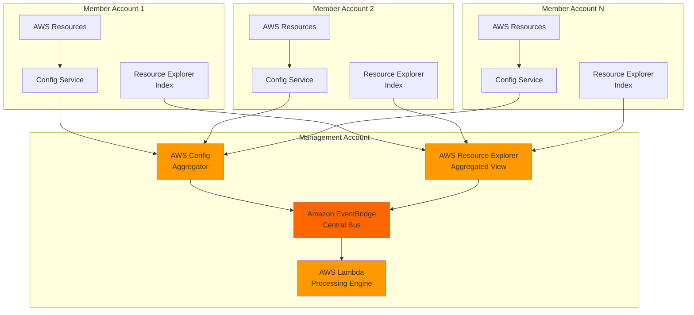

# Multi-Account Resource Discovery Automation

## Problem

Organizations managing hundreds or thousands of resources across multiple AWS accounts struggle with resource visibility, compliance monitoring, and governance enforcement. IT teams waste significant time manually tracking resource configurations, identifying policy violations, and maintaining accurate inventories across their multi-account environments. Without automated discovery and compliance monitoring, organizations face increased security risks, compliance failures, and operational overhead that can cost millions in remediation and audit findings.

## Solution

Implement an automated multi-account resource discovery system using AWS Resource Explorer for comprehensive search capabilities and AWS Config for compliance monitoring. This solution leverages EventBridge for event-driven automation and Lambda for intelligent processing, creating a unified governance platform that automatically discovers, catalogs, and monitors resources across your entire AWS organization while enabling proactive compliance enforcement and automated remediation workflows.

## Architecture Diagram



## Prerequisites

1. AWS Organizations enabled with management account access
2. AWS CLI v2 installed and configured with administrator privileges
3. Multiple AWS accounts in your organization (minimum 2 for testing)
4. Basic understanding of AWS Config, Resource Explorer, and EventBridge
5. Estimated cost: $50-$150/month depending on resource count and regions

> **Note**: This configuration follows AWS Well-Architected Framework principles for operational excellence and security. Review [AWS Organizations best practices](https://docs.aws.amazon.com/organizations/latest/userguide/orgs_best-practices.html) before implementation.

## Preparation

```bash
# Set environment variables
export AWS_REGION=$(aws configure get region)
export AWS_ACCOUNT_ID=$(aws sts get-caller-identity \
    --query Account --output text)

# Get organization details
export ORG_ID=$(aws organizations describe-organization \
    --query Organization.Id --output text)

# Generate unique identifiers for resources
RANDOM_SUFFIX=$(aws secretsmanager get-random-password \
    --exclude-punctuation --exclude-uppercase \
    --password-length 6 --require-each-included-type \
    --output text --query RandomPassword)

# Set project naming convention
export PROJECT_NAME="multi-account-discovery-${RANDOM_SUFFIX}"
export LAMBDA_FUNCTION_NAME="${PROJECT_NAME}-processor"
export CONFIG_AGGREGATOR_NAME="${PROJECT_NAME}-aggregator"
export CONFIG_BUCKET_NAME="aws-config-bucket-${AWS_ACCOUNT_ID}-${AWS_REGION}"

echo "✅ Environment configured for multi-account resource discovery"
echo "Project: ${PROJECT_NAME}"
echo "Organization ID: ${ORG_ID}"
```

## Steps

1. **Enable Trusted Access for AWS Services**:

   AWS Organizations trusted access enables Resource Explorer and Config to operate across all accounts in your organization. This foundational step allows these services to automatically discover and monitor resources without requiring individual account configuration, establishing the organizational foundation for centralized governance.

   ```bash
   # Enable trusted access for Resource Explorer
   aws organizations enable-aws-service-access \
       --service-principal resource-explorer-2.amazonaws.com
   
   # Enable trusted access for Config
   aws organizations enable-aws-service-access \
       --service-principal config.amazonaws.com
   
   # Verify trusted access configuration
   aws organizations list-aws-service-access-for-organization \
       --query 'EnabledServicePrincipals[?ServicePrincipal==`resource-explorer-2.amazonaws.com` || ServicePrincipal==`config.amazonaws.com`]'
   
   echo "✅ Trusted access enabled for Resource Explorer and Config"
   ```

   This configuration establishes the organizational foundation required for centralized resource discovery and compliance monitoring across all member accounts while maintaining security boundaries.

2. **Create Service-Linked Roles and S3 Bucket**:

   Service-linked roles provide the necessary permissions for AWS services to operate on your behalf across multiple accounts while maintaining security boundaries and least-privilege access. The S3 bucket stores Config data for compliance monitoring and audit purposes.

   ```bash
   # Create service-linked role for Resource Explorer
   aws iam create-service-linked-role \
       --aws-service-name resource-explorer-2.amazonaws.com \
       2>/dev/null || echo "Resource Explorer service-linked role already exists"
   
   # Create service-linked role for Config
   aws iam create-service-linked-role \
       --aws-service-name config.amazonaws.com \
       2>/dev/null || echo "Config service-linked role already exists"
   
   # Create S3 bucket for Config data
   aws s3 mb s3://${CONFIG_BUCKET_NAME} \
       --region ${AWS_REGION} 2>/dev/null || echo "Config bucket already exists"
   
   # Apply bucket policy for Config service
   cat > config-bucket-policy.json << EOF
{
    "Version": "2012-10-17",
    "Statement": [
        {
            "Effect": "Allow",
            "Principal": {
                "Service": "config.amazonaws.com"
            },
            "Action": "s3:GetBucketAcl",
            "Resource": "arn:aws:s3:::${CONFIG_BUCKET_NAME}",
            "Condition": {
                "StringEquals": {
                    "AWS:SourceAccount": "${AWS_ACCOUNT_ID}"
                }
            }
        },
        {
            "Effect": "Allow",
            "Principal": {
                "Service": "config.amazonaws.com"
            },
            "Action": "s3:PutObject",
            "Resource": "arn:aws:s3:::${CONFIG_BUCKET_NAME}/*",
            "Condition": {
                "StringEquals": {
                    "s3:x-amz-acl": "bucket-owner-full-control",
                    "AWS:SourceAccount": "${AWS_ACCOUNT_ID}"
                }
            }
        },
        {
            "Effect": "Allow",
            "Principal": {
                "Service": "config.amazonaws.com"
            },
            "Action": "s3:ListBucket",
            "Resource": "arn:aws:s3:::${CONFIG_BUCKET_NAME}",
            "Condition": {
                "StringEquals": {
                    "AWS:SourceAccount": "${AWS_ACCOUNT_ID}"
                }
            }
        }
    ]
}
EOF

   aws s3api put-bucket-policy \
       --bucket ${CONFIG_BUCKET_NAME} \
       --policy file://config-bucket-policy.json
   
   echo "✅ Service-linked roles and Config bucket created successfully"
   ```

   The service-linked roles and S3 bucket now provide the necessary permissions and storage foundation for Config to operate across your multi-account environment while maintaining security best practices with proper condition statements.

3. **Configure AWS Resource Explorer Multi-Account Search**:

   Resource Explorer provides unified search capabilities across all AWS resources in your organization. The aggregated index centralizes resource metadata from all member accounts, enabling efficient cross-account resource discovery and management through a single interface.

   ```bash
   # Create aggregated index in management account
   aws resource-explorer-2 create-index \
       --type AGGREGATOR \
       --region ${AWS_REGION}
   
   # Wait for index creation to complete
   echo "Waiting for Resource Explorer index creation..."
   sleep 30
   
   # Create default view for multi-account search
   aws resource-explorer-2 create-view \
       --view-name "organization-view" \
       --included-properties Name=tags \
       --region ${AWS_REGION}
   
   # Associate the default view
   VIEW_ARN=$(aws resource-explorer-2 list-views \
       --query 'Views[0]' --output text)
   
   aws resource-explorer-2 associate-default-view \
       --view-arn ${VIEW_ARN}
   
   # Verify index status
   aws resource-explorer-2 get-index \
       --region ${AWS_REGION} \
       --query 'State'
   
   echo "✅ Resource Explorer multi-account search configured"
   ```

   The aggregated index now provides a single point for searching resources across all accounts, enabling efficient resource discovery and management with compliance metadata integration.

4. **Set Up AWS Config Organization Aggregator**:

   Config aggregators collect configuration and compliance data from multiple accounts and regions, providing a centralized view of your organization's configuration compliance posture. This enables enterprise-wide compliance monitoring and governance enforcement across all member accounts.

   ```bash
   # Enable Config service first
   aws configservice put-configuration-recorder \
       --configuration-recorder name=${PROJECT_NAME}-recorder,roleARN=arn:aws:iam::${AWS_ACCOUNT_ID}:role/aws-service-role/config.amazonaws.com/AWSServiceRoleForConfig,recordingGroup='{
           "allSupported": true,
           "includeGlobalResourceTypes": true,
           "resourceTypes": []
       }'
   
   # Create delivery channel
   aws configservice put-delivery-channel \
       --delivery-channel name=${PROJECT_NAME}-channel,s3BucketName=${CONFIG_BUCKET_NAME},configSnapshotDeliveryProperties='{
           "deliveryFrequency": "TwentyFour_Hours"
       }'
   
   # Start configuration recorder
   aws configservice start-configuration-recorder \
       --configuration-recorder-name ${PROJECT_NAME}-recorder
   
   # Create organizational aggregator
   aws configservice put-configuration-aggregator \
       --configuration-aggregator-name ${CONFIG_AGGREGATOR_NAME} \
       --organization-aggregation-source RoleArn=arn:aws:iam::${AWS_ACCOUNT_ID}:role/aws-service-role/config.amazonaws.com/AWSServiceRoleForConfig,AwsRegions=${AWS_REGION},AllAwsRegions=false
   
   echo "✅ Config aggregator created for organizational compliance monitoring"
   ```

   The Config service is now recording configuration changes and the organizational aggregator will collect compliance data from all member accounts in your organization.

5. **Create Lambda Function for Automated Processing**:

   This Lambda function processes Config compliance events and Resource Explorer updates to automate governance actions, generate insights, and maintain compliance across your multi-account environment. The function implements intelligent event processing with automated response capabilities.

   ```bash
   # Create Lambda execution role with comprehensive permissions
   cat > trust-policy.json << EOF
{
    "Version": "2012-10-17",
    "Statement": [
        {
            "Effect": "Allow",
            "Principal": {
                "Service": "lambda.amazonaws.com"
            },
            "Action": "sts:AssumeRole"
        }
    ]
}
EOF

   aws iam create-role \
       --role-name ${PROJECT_NAME}-lambda-role \
       --assume-role-policy-document file://trust-policy.json
   
   # Create custom policy for enhanced permissions
   cat > lambda-policy.json << EOF
{
    "Version": "2012-10-17",
    "Statement": [
        {
            "Effect": "Allow",
            "Action": [
                "logs:CreateLogGroup",
                "logs:CreateLogStream",
                "logs:PutLogEvents",
                "config:GetComplianceDetailsByConfigRule",
                "config:GetAggregateComplianceDetailsByConfigRule",
                "resource-explorer-2:Search",
                "resource-explorer-2:GetIndex",
                "sns:Publish",
                "organizations:ListAccounts"
            ],
            "Resource": "*"
        }
    ]
}
EOF

   aws iam put-role-policy \
       --role-name ${PROJECT_NAME}-lambda-role \
       --policy-name ${PROJECT_NAME}-lambda-policy \
       --policy-document file://lambda-policy.json
   
   # Attach basic execution policy
   aws iam attach-role-policy \
       --role-name ${PROJECT_NAME}-lambda-role \
       --policy-arn arn:aws:iam::aws:policy/service-role/AWSLambdaBasicExecutionRole
   
   # Create enhanced Lambda function code
   cat > lambda_function.py << EOF
import json
import boto3
import logging
from datetime import datetime

logger = logging.getLogger()
logger.setLevel(logging.INFO)

config_client = boto3.client('config')
resource_explorer_client = boto3.client('resource-explorer-2')
organizations_client = boto3.client('organizations')

def lambda_handler(event, context):
    """Main handler for multi-account resource discovery events"""
    logger.info(f"Processing event: {json.dumps(event, default=str)}")
    
    try:
        # Process Config compliance events
        if event.get('source') == 'aws.config':
            return process_config_event(event)
        
        # Process Resource Explorer events
        elif event.get('source') == 'aws.resource-explorer-2':
            return process_resource_explorer_event(event)
        
        # Handle scheduled discovery tasks
        elif event.get('source') == 'aws.events' and 'Scheduled Event' in event.get('detail-type', ''):
            return process_scheduled_discovery()
        
        else:
            logger.warning(f"Unknown event source: {event.get('source')}")
            
    except Exception as e:
        logger.error(f"Error processing event: {str(e)}")
        raise
    
    return {
        'statusCode': 200,
        'body': json.dumps('Event processed successfully')
    }

def process_config_event(event):
    """Process AWS Config compliance events with enhanced logging"""
    detail = event.get('detail', {})
    compliance_type = detail.get('newEvaluationResult', {}).get('complianceType')
    resource_type = detail.get('resourceType')
    resource_id = detail.get('resourceId')
    account_id = detail.get('awsAccountId')
    
    logger.info(f"Config event - Resource: {resource_type}, "
                f"ID: {resource_id}, Account: {account_id}, "
                f"Compliance: {compliance_type}")
    
    if compliance_type == 'NON_COMPLIANT':
        logger.warning(f"Non-compliant resource detected: {resource_type} in account {account_id}")
        # Enhanced logging for compliance violations
        handle_compliance_violation(detail)
    
    return {'statusCode': 200, 'compliance_processed': True}

def process_resource_explorer_event(event):
    """Process Resource Explorer events for resource discovery"""
    logger.info("Processing Resource Explorer event for cross-account discovery")
    
    # Perform sample resource discovery
    try:
        response = resource_explorer_client.search(
            QueryString="service:ec2",
            MaxResults=10
        )
        
        resource_count = len(response.get('Resources', []))
        logger.info(f"Discovered {resource_count} EC2 resources across accounts")
        
    except Exception as e:
        logger.error(f"Error in resource discovery: {str(e)}")
    
    return {'statusCode': 200, 'discovery_processed': True}

def handle_compliance_violation(detail):
    """Handle compliance violations with detailed logging"""
    resource_type = detail.get('resourceType')
    resource_id = detail.get('resourceId')
    config_rule_name = detail.get('configRuleName')
    
    logger.warning(f"Compliance violation detected:")
    logger.warning(f"  Rule: {config_rule_name}")
    logger.warning(f"  Resource Type: {resource_type}")
    logger.warning(f"  Resource ID: {resource_id}")
    
    # Add automated remediation logic here
    # This could include SNS notifications, ticket creation, etc.

def process_scheduled_discovery():
    """Process scheduled resource discovery tasks"""
    logger.info("Processing scheduled resource discovery scan")
    
    try:
        # Get organization accounts
        accounts = organizations_client.list_accounts()
        active_accounts = [acc for acc in accounts['Accounts'] if acc['Status'] == 'ACTIVE']
        
        logger.info(f"Monitoring {len(active_accounts)} active accounts")
        
        # Perform cross-account resource search
        search_results = resource_explorer_client.search(
            QueryString="*",
            MaxResults=100
        )
        
        logger.info(f"Total resources discovered: {len(search_results.get('Resources', []))}")
        
    except Exception as e:
        logger.error(f"Error in scheduled discovery: {str(e)}")
    
    return {'statusCode': 200, 'scheduled_discovery_complete': True}

EOF

   # Create deployment package
   zip lambda-deployment.zip lambda_function.py
   
   # Wait for IAM role propagation
   sleep 10
   
   # Create Lambda function
   aws lambda create-function \
       --function-name ${LAMBDA_FUNCTION_NAME} \
       --runtime python3.11 \
       --role arn:aws:iam::${AWS_ACCOUNT_ID}:role/${PROJECT_NAME}-lambda-role \
       --handler lambda_function.lambda_handler \
       --zip-file fileb://lambda-deployment.zip \
       --timeout 300 \
       --memory-size 512 \
       --description "Multi-account resource discovery and compliance processor"
   
   echo "✅ Lambda function created for automated governance processing"
   ```

   The Lambda function now provides comprehensive event processing capabilities with enhanced logging, error handling, and support for scheduled discovery tasks across your multi-account environment.

6. **Configure EventBridge Rules for Automation**:

   EventBridge rules enable event-driven automation by routing Config compliance events and Resource Explorer updates to your Lambda function for intelligent processing and response. This creates a reactive governance system that responds to compliance violations in real-time.

   ```bash
   # Create EventBridge rule for Config compliance events
   aws events put-rule \
       --name ${PROJECT_NAME}-config-rule \
       --event-pattern '{
           "source": ["aws.config"],
           "detail-type": ["Config Rules Compliance Change"],
           "detail": {
               "newEvaluationResult": {
                   "complianceType": ["NON_COMPLIANT"]
               }
           }
       }' \
       --description "Route Config compliance violations to Lambda processor" \
       --state ENABLED
   
   # Create scheduled rule for periodic discovery
   aws events put-rule \
       --name ${PROJECT_NAME}-discovery-schedule \
       --schedule-expression "rate(1 day)" \
       --description "Scheduled resource discovery across accounts" \
       --state ENABLED
   
   # Add Lambda targets to both rules
   aws events put-targets \
       --rule ${PROJECT_NAME}-config-rule \
       --targets Id=1,Arn=arn:aws:lambda:${AWS_REGION}:${AWS_ACCOUNT_ID}:function:${LAMBDA_FUNCTION_NAME}
   
   aws events put-targets \
       --rule ${PROJECT_NAME}-discovery-schedule \
       --targets Id=1,Arn=arn:aws:lambda:${AWS_REGION}:${AWS_ACCOUNT_ID}:function:${LAMBDA_FUNCTION_NAME}
   
   # Grant EventBridge permissions to invoke Lambda
   aws lambda add-permission \
       --function-name ${LAMBDA_FUNCTION_NAME} \
       --statement-id config-events \
       --action lambda:InvokeFunction \
       --principal events.amazonaws.com \
       --source-arn arn:aws:events:${AWS_REGION}:${AWS_ACCOUNT_ID}:rule/${PROJECT_NAME}-config-rule
   
   aws lambda add-permission \
       --function-name ${LAMBDA_FUNCTION_NAME} \
       --statement-id discovery-schedule \
       --action lambda:InvokeFunction \
       --principal events.amazonaws.com \
       --source-arn arn:aws:events:${AWS_REGION}:${AWS_ACCOUNT_ID}:rule/${PROJECT_NAME}-discovery-schedule
   
   echo "✅ EventBridge automation rules configured for real-time compliance monitoring"
   ```

   EventBridge rules are now configured to automatically trigger your Lambda function when compliance violations occur or during scheduled discovery runs.

7. **Deploy Config Rules for Compliance Monitoring**:

   AWS Config rules evaluate resource configurations against organizational policies, providing automated compliance monitoring that triggers remediation workflows when violations are detected. These rules establish baseline security and governance requirements across all accounts.

   ```bash
   # Deploy comprehensive compliance rules for enterprise governance
   aws configservice put-config-rule \
       --config-rule '{
           "ConfigRuleName": "'${PROJECT_NAME}'-s3-bucket-public-access-prohibited",
           "Description": "Checks that S3 buckets do not allow public access",
           "Source": {
               "Owner": "AWS",
               "SourceIdentifier": "S3_BUCKET_PUBLIC_ACCESS_PROHIBITED"
           }
       }'
   
   aws configservice put-config-rule \
       --config-rule '{
           "ConfigRuleName": "'${PROJECT_NAME}'-ec2-security-group-attached-to-eni",
           "Description": "Checks that security groups are attached to EC2 instances",
           "Source": {
               "Owner": "AWS",
               "SourceIdentifier": "EC2_SECURITY_GROUP_ATTACHED_TO_ENI"
           }
       }'
   
   aws configservice put-config-rule \
       --config-rule '{
           "ConfigRuleName": "'${PROJECT_NAME}'-root-access-key-check",
           "Description": "Checks whether root access key exists",
           "Source": {
               "Owner": "AWS",
               "SourceIdentifier": "ROOT_ACCESS_KEY_CHECK"
           }
       }'
   
   aws configservice put-config-rule \
       --config-rule '{
           "ConfigRuleName": "'${PROJECT_NAME}'-encrypted-volumes",
           "Description": "Checks whether EBS volumes are encrypted",
           "Source": {
               "Owner": "AWS",
               "SourceIdentifier": "ENCRYPTED_VOLUMES"
           }
       }'
   
   # Wait for rules to be active
   sleep 15
   
   # Verify rule deployment
   aws configservice describe-config-rules \
       --config-rule-names ${PROJECT_NAME}-s3-bucket-public-access-prohibited \
       --query 'ConfigRules[0].ConfigRuleState'
   
   echo "✅ Comprehensive compliance monitoring rules deployed"
   ```

   Config rules are now actively monitoring your resources for compliance violations and will trigger EventBridge events when non-compliant resources are detected.

8. **Configure Multi-Account Resource Discovery**:

   This step establishes the framework for resource discovery across member accounts by identifying target accounts and providing guidance for StackSet deployment to ensure consistent configuration across your organization.

   ```bash
   # List organization accounts for discovery configuration
   MEMBER_ACCOUNTS=$(aws organizations list-accounts \
       --query 'Accounts[?Status==`ACTIVE`].Id' --output text)
   
   echo "Organization accounts requiring resource discovery configuration:"
   for account in ${MEMBER_ACCOUNTS}; do
       ACCOUNT_NAME=$(aws organizations list-accounts \
           --query "Accounts[?Id=='${account}'].Name" --output text)
       echo "  Account: ${account} (${ACCOUNT_NAME})"
   done
   
   # Create StackSet template for member account deployment
   cat > member-account-template.yaml << EOF
AWSTemplateFormatVersion: '2010-09-09'
Description: 'Resource Explorer and Config setup for member accounts'
Resources:
  ResourceExplorerIndex:
    Type: AWS::ResourceExplorer2::Index
    Properties:
      Type: LOCAL
      Tags:
        - Key: Purpose
          Value: MultiAccountDiscovery
        - Key: ManagedBy
          Value: ${PROJECT_NAME}
  
  ConfigServiceRole:
    Type: AWS::IAM::ServiceLinkedRole
    Properties:
      AWSServiceName: config.amazonaws.com
      Description: Service-linked role for AWS Config
    DeletionPolicy: Retain
EOF

   echo "✅ Member account discovery configuration template created"
   echo "Deploy this template using AWS StackSets to member accounts"
   echo "Template saved as: member-account-template.yaml"
   ```

   The member account template is ready for deployment across your organization to establish consistent resource discovery capabilities in all accounts.

## Validation & Testing

1. **Verify Resource Explorer Multi-Account Search**:

   ```bash
   # Test comprehensive resource search across accounts
   aws resource-explorer-2 search \
       --query-string "resourcetype:AWS::EC2::Instance" \
       --max-results 50 \
       --query 'Resources[*].{ResourceType:ResourceType,ARN:Arn,Account:OwningAccountId}'
   
   # Search for S3 buckets across the organization
   aws resource-explorer-2 search \
       --query-string "service:s3 AND region:${AWS_REGION}" \
       --max-results 20
   ```

   Expected output: Comprehensive list of resources from multiple accounts with metadata including account ownership and compliance status.

2. **Test Config Aggregator Data Collection**:

   ```bash
   # Get organizational compliance summary
   aws configservice get-aggregate-compliance-summary \
       --configuration-aggregator-name ${CONFIG_AGGREGATOR_NAME} \
       --query 'AggregateComplianceSummary'
   
   # Review compliance details for specific rules
   aws configservice get-aggregate-compliance-details-by-config-rule \
       --configuration-aggregator-name ${CONFIG_AGGREGATOR_NAME} \
       --config-rule-name ${PROJECT_NAME}-s3-bucket-public-access-prohibited \
       --account-id ${AWS_ACCOUNT_ID} \
       --aws-region ${AWS_REGION}
   ```

3. **Validate EventBridge Automation**:

   ```bash
   # Check EventBridge rule status and targets
   aws events describe-rule \
       --name ${PROJECT_NAME}-config-rule \
       --query '{State:State,Description:Description}'
   
   aws events list-targets-by-rule \
       --rule ${PROJECT_NAME}-config-rule
   
   # Verify Lambda function readiness
   aws lambda get-function \
       --function-name ${LAMBDA_FUNCTION_NAME} \
       --query 'Configuration.{State:State,LastModified:LastModified}'
   ```

4. **Test Compliance Event Processing**:

   ```bash
   # Create a test non-compliant resource to trigger automation
   TEST_BUCKET="test-compliance-bucket-${RANDOM_SUFFIX}"
   aws s3 mb s3://${TEST_BUCKET}
   
   # Make bucket publicly accessible (triggers compliance violation)
   aws s3api put-bucket-acl \
       --bucket ${TEST_BUCKET} \
       --acl public-read
   
   # Wait for Config evaluation and Lambda processing
   echo "Waiting for compliance evaluation..."
   sleep 180
   
   # Check Lambda execution logs
   aws logs filter-log-events \
       --log-group-name /aws/lambda/${LAMBDA_FUNCTION_NAME} \
       --start-time $(date -d '10 minutes ago' +%s)000 \
       --query 'events[*].message'
   
   # Verify compliance status
   aws configservice get-compliance-details-by-config-rule \
       --config-rule-name ${PROJECT_NAME}-s3-bucket-public-access-prohibited \
       --query 'EvaluationResults[?ComplianceType==`NON_COMPLIANT`]'
   ```

> **Warning**: Remove the test public S3 bucket immediately after testing to avoid security risks and maintain compliance with organizational policies.

## Cleanup

1. **Remove Test Resources**:

   ```bash
   # Delete test S3 bucket and contents
   aws s3 rm s3://${TEST_BUCKET} --recursive 2>/dev/null || true
   aws s3 rb s3://${TEST_BUCKET} 2>/dev/null || true
   
   echo "✅ Test resources cleaned up"
   ```

2. **Remove Config Rules and Aggregator**:

   ```bash
   # Stop configuration recorder
   aws configservice stop-configuration-recorder \
       --configuration-recorder-name ${PROJECT_NAME}-recorder
   
   # Delete Config rules
   aws configservice delete-config-rule \
       --config-rule-name ${PROJECT_NAME}-s3-bucket-public-access-prohibited
   
   aws configservice delete-config-rule \
       --config-rule-name ${PROJECT_NAME}-ec2-security-group-attached-to-eni
   
   aws configservice delete-config-rule \
       --config-rule-name ${PROJECT_NAME}-root-access-key-check
   
   aws configservice delete-config-rule \
       --config-rule-name ${PROJECT_NAME}-encrypted-volumes
   
   # Delete aggregator and Config resources
   aws configservice delete-configuration-aggregator \
       --configuration-aggregator-name ${CONFIG_AGGREGATOR_NAME}
   
   aws configservice delete-delivery-channel \
       --delivery-channel-name ${PROJECT_NAME}-channel
   
   aws configservice delete-configuration-recorder \
       --configuration-recorder-name ${PROJECT_NAME}-recorder
   
   echo "✅ Config resources deleted"
   ```

3. **Remove EventBridge Rules and Lambda Function**:

   ```bash
   # Remove EventBridge targets and rules
   aws events remove-targets \
       --rule ${PROJECT_NAME}-config-rule \
       --ids "1"
   
   aws events remove-targets \
       --rule ${PROJECT_NAME}-discovery-schedule \
       --ids "1"
   
   aws events delete-rule \
       --name ${PROJECT_NAME}-config-rule
   
   aws events delete-rule \
       --name ${PROJECT_NAME}-discovery-schedule
   
   # Delete Lambda function
   aws lambda delete-function \
       --function-name ${LAMBDA_FUNCTION_NAME}
   
   # Delete IAM role and policies
   aws iam delete-role-policy \
       --role-name ${PROJECT_NAME}-lambda-role \
       --policy-name ${PROJECT_NAME}-lambda-policy
   
   aws iam detach-role-policy \
       --role-name ${PROJECT_NAME}-lambda-role \
       --policy-arn arn:aws:iam::aws:policy/service-role/AWSLambdaBasicExecutionRole
   
   aws iam delete-role \
       --role-name ${PROJECT_NAME}-lambda-role
   
   echo "✅ Automation resources deleted"
   ```

4. **Clean Up Resource Explorer and S3 Resources**:

   ```bash
   # Delete Resource Explorer index
   aws resource-explorer-2 delete-index \
       --region ${AWS_REGION}
   
   # Remove S3 bucket contents and bucket
   aws s3 rm s3://${CONFIG_BUCKET_NAME} --recursive
   aws s3 rb s3://${CONFIG_BUCKET_NAME}
   
   echo "✅ Resource Explorer and S3 resources cleaned up"
   ```

5. **Remove Local Files**:

   ```bash
   # Clean up temporary files
   rm -f trust-policy.json lambda_function.py lambda-deployment.zip \
         config-bucket-policy.json lambda-policy.json \
         member-account-template.yaml
   
   echo "✅ Local files cleaned up"
   ```

## Discussion

This automated multi-account resource discovery solution demonstrates the power of combining AWS Resource Explorer's comprehensive search capabilities with Config's compliance monitoring through intelligent event-driven automation. Resource Explorer provides organization-wide resource visibility and search functionality, while Config ensures continuous compliance monitoring and governance enforcement. The integration with EventBridge and Lambda creates sophisticated automation that responds to compliance violations and resource changes in real-time, enabling proactive governance at enterprise scale.

The architecture follows AWS Well-Architected Framework principles by implementing operational excellence through comprehensive automation and monitoring, security through least-privilege access and service-linked roles, reliability through event-driven processing with error handling, and cost optimization through efficient resource utilization. This approach scales seamlessly as your organization grows, automatically including new accounts and resources without manual intervention while maintaining consistent governance policies across the entire multi-account environment.

The solution addresses critical enterprise requirements including regulatory compliance (SOC 2, PCI DSS, HIPAA), security governance, and operational visibility across complex multi-account environments. Organizations can extend this foundation to implement automated remediation workflows, cost optimization alerts, security incident response automation, and integration with ITSM systems for comprehensive IT governance. The centralized approach significantly reduces administrative overhead while improving security posture and compliance adherence across the entire organization.

For production deployments, consider implementing additional security controls such as AWS Organizations Service Control Policies (SCPs) for preventive governance, AWS StackSets for consistent deployment across accounts, AWS Systems Manager for automated patch management, and AWS Security Hub for centralized security findings management. The solution integrates seamlessly with AWS Control Tower for enhanced governance and AWS CloudFormation StackSets for standardized deployments. See the [AWS Config Multi-Account Multi-Region Data Aggregation](https://docs.aws.amazon.com/config/latest/developerguide/aggregate-data.html) guide for advanced aggregation patterns and the [AWS Resource Explorer Multi-Account Search](https://docs.aws.amazon.com/resource-explorer/latest/userguide/manage-service-multi-account.html) documentation for comprehensive search capabilities.

> **Tip**: Use AWS CloudFormation StackSets to deploy Resource Explorer indexes and Config configurations consistently across all member accounts in your organization. This ensures uniform discovery capabilities and compliance monitoring standards across your entire AWS environment.

## Challenge

Extend this automated resource discovery solution with these advanced enhancements:

1. **Implement Custom Compliance Rules**: Create custom Config rules using Lambda functions to enforce organization-specific policies, regulatory requirements, and industry-specific governance standards with automated evaluation logic
2. **Add Intelligent Automated Remediation**: Develop sophisticated Lambda functions that automatically remediate common compliance violations such as unencrypted storage, open security groups, and untagged resources with rollback capabilities
3. **Create Advanced Resource Tagging Automation**: Build ML-powered workflows that automatically apply consistent tagging policies to discovered resources based on resource type, usage patterns, and organizational taxonomy standards
4. **Integrate with Enterprise ITSM Systems**: Connect the solution to ServiceNow, Jira, or PagerDuty to automatically create incidents for compliance violations, track remediation progress, and provide audit trails for compliance reporting
5. **Develop Cost Optimization Intelligence**: Extend the Lambda function with AWS Cost Explorer APIs to identify unutilized resources, right-sizing opportunities, and recommend cost optimization strategies across accounts with automated reporting dashboards

## Infrastructure Code

*Infrastructure code will be generated after recipe approval.*