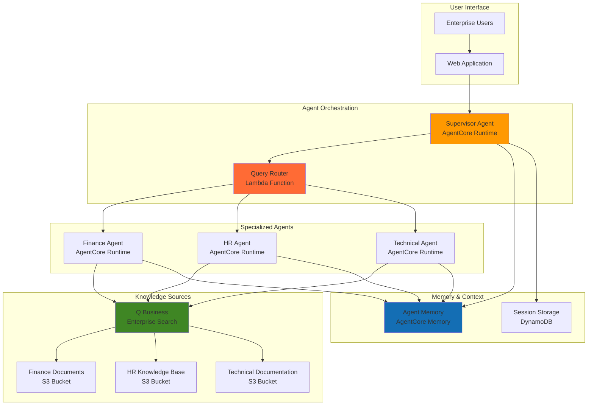

# Multi-Agent Knowledge Management with Bedrock AgentCore and Q Business

## Problem

Enterprise organizations struggle with knowledge management across distributed teams and departments, where complex questions require expertise from multiple domains and data sources. Traditional single-agent systems fail to effectively coordinate specialized knowledge retrieval, leading to incomplete or inaccurate responses that impact decision-making. Organizations need collaborative AI systems that can orchestrate multiple specialized agents to synthesize comprehensive answers from enterprise knowledge bases.

## Solution

Build a multi-agent knowledge management system using Amazon Bedrock AgentCore's supervisor-collaborator architecture pattern with Q Business for enterprise knowledge retrieval. The supervisor agent coordinates specialized collaborator agents that each focus on specific knowledge domains, enabling comprehensive question answering through dynamic agent orchestration and knowledge synthesis across multiple enterprise data sources.

## Architecture Diagram



## Prerequisites

1. AWS account with Bedrock AgentCore, Q Business, S3, and IAM permissions
2. AWS CLI v2 installed and configured with appropriate permissions
3. Understanding of multi-agent architectures and enterprise knowledge management
4. Basic knowledge of JSON, Python, and AWS services
5. Estimated cost: $50-100 for testing (includes model inference, storage, and runtime costs)

> **Note**: Bedrock AgentCore is in preview and requires enabling preview features in your AWS account. See [AgentCore documentation](https://docs.aws.amazon.com/bedrock-agentcore/latest/devguide/what-is-bedrock-agentcore.html) for current availability.

## Preparation

```bash
# Set environment variables
export AWS_REGION=$(aws configure get region)
export AWS_ACCOUNT_ID=$(aws sts get-caller-identity \
    --query Account --output text)

# Generate unique identifiers for resources
RANDOM_SUFFIX=$(aws secretsmanager get-random-password \
    --exclude-punctuation --exclude-uppercase \
    --password-length 6 --require-each-included-type \
    --output text --query RandomPassword)

# Set resource names
export PROJECT_NAME="multi-agent-km-${RANDOM_SUFFIX}"
export S3_BUCKET_FINANCE="finance-kb-${RANDOM_SUFFIX}"
export S3_BUCKET_HR="hr-kb-${RANDOM_SUFFIX}"
export S3_BUCKET_TECH="tech-kb-${RANDOM_SUFFIX}"
export IAM_ROLE_NAME="AgentCoreRole-${RANDOM_SUFFIX}"

# Create foundational IAM role for AgentCore and Lambda
aws iam create-role \
    --role-name ${IAM_ROLE_NAME} \
    --assume-role-policy-document '{
        "Version": "2012-10-17",
        "Statement": [
            {
                "Effect": "Allow",
                "Principal": {
                    "Service": ["lambda.amazonaws.com", "qbusiness.amazonaws.com"]
                },
                "Action": "sts:AssumeRole"
            }
        ]
    }'

# Attach necessary policies for multi-agent operations
aws iam attach-role-policy \
    --role-name ${IAM_ROLE_NAME} \
    --policy-arn arn:aws:iam::aws:policy/service-role/AWSLambdaBasicExecutionRole

aws iam attach-role-policy \
    --role-name ${IAM_ROLE_NAME} \
    --policy-arn arn:aws:iam::aws:policy/AmazonBedrockFullAccess

aws iam attach-role-policy \
    --role-name ${IAM_ROLE_NAME} \
    --policy-arn arn:aws:iam::aws:policy/AmazonS3ReadOnlyAccess

echo "✅ AWS environment configured for multi-agent system"
```

## Steps

1. **Create Enterprise Knowledge Base Storage**:

   Amazon S3 provides the highly durable and scalable foundation for enterprise knowledge repositories with 99.999999999% (11 9's) durability. Each specialized domain requires its own bucket to enable granular access control and optimized indexing for domain-specific agents within the Q Business data source integration framework.

   ```bash
   # Create domain-specific S3 buckets for knowledge storage
   aws s3 mb s3://${S3_BUCKET_FINANCE} --region ${AWS_REGION}
   aws s3 mb s3://${S3_BUCKET_HR} --region ${AWS_REGION}
   aws s3 mb s3://${S3_BUCKET_TECH} --region ${AWS_REGION}
   
   # Enable versioning for audit trails and compliance
   aws s3api put-bucket-versioning \
       --bucket ${S3_BUCKET_FINANCE} \
       --versioning-configuration Status=Enabled
   
   aws s3api put-bucket-versioning \
       --bucket ${S3_BUCKET_HR} \
       --versioning-configuration Status=Enabled
   
   aws s3api put-bucket-versioning \
       --bucket ${S3_BUCKET_TECH} \
       --versioning-configuration Status=Enabled
   
   # Enable server-side encryption for security compliance
   aws s3api put-bucket-encryption \
       --bucket ${S3_BUCKET_FINANCE} \
       --server-side-encryption-configuration \
       'Rules=[{ApplyServerSideEncryptionByDefault:{SSEAlgorithm:AES256}}]'
   
   aws s3api put-bucket-encryption \
       --bucket ${S3_BUCKET_HR} \
       --server-side-encryption-configuration \
       'Rules=[{ApplyServerSideEncryptionByDefault:{SSEAlgorithm:AES256}}]'
   
   aws s3api put-bucket-encryption \
       --bucket ${S3_BUCKET_TECH} \
       --server-side-encryption-configuration \
       'Rules=[{ApplyServerSideEncryptionByDefault:{SSEAlgorithm:AES256}}]'
   
   echo "✅ Knowledge base storage buckets created with security features"
   ```

2. **Upload Sample Enterprise Knowledge Documents**:

   Populating our knowledge bases with domain-specific content enables the specialized agents to demonstrate effective knowledge retrieval and synthesis capabilities across different enterprise functions. This establishes the data foundation that Q Business will index for intelligent search and retrieval.

   ```bash
   # Create sample finance documents with comprehensive policies
   cat > finance-policy.txt << 'EOF'
   Finance Policy Documentation:
   
   Expense Approval Process:
   - All expenses over $1000 require manager approval
   - Expenses over $5000 require director approval
   - Capital expenditures over $10000 require CFO approval
   
   Budget Management:
   - Quarterly budget reviews conducted in March, June, September, December
   - Department budget allocations updated annually in January
   - Emergency budget requests require 48-hour approval window
   
   Travel and Reimbursement:
   - Travel reimbursement requires receipts within 30 days of completion
   - International travel requires pre-approval 2 weeks in advance
   - Meal allowances: $75 domestic, $100 international per day
   EOF
   
   # Create sample HR documents with comprehensive policies
   cat > hr-handbook.txt << 'EOF'
   HR Handbook and Employee Policies:
   
   Onboarding Process:
   - Employee onboarding process takes 3-5 business days
   - IT equipment setup completed on first day
   - Benefits enrollment window: 30 days from start date
   
   Performance Management:
   - Performance reviews conducted annually in Q4
   - Mid-year check-ins scheduled in Q2
   - Performance improvement plans: 90-day duration
   
   Time Off and Remote Work:
   - Vacation requests require 2 weeks advance notice for approval
   - Remote work policy allows up to 3 days per week remote work
   - Sick leave: 10 days annually, carries over up to 5 days
   - Parental leave: 12 weeks paid, additional 4 weeks unpaid
   EOF
   
   # Create sample technical documentation with system guidelines
   cat > tech-guidelines.txt << 'EOF'
   Technical Guidelines and System Procedures:
   
   Development Standards:
   - All code must pass automated testing before deployment
   - Code coverage minimum: 80% for production releases
   - Security scans required for all external-facing applications
   
   Infrastructure Management:
   - Database backups performed nightly at 2 AM UTC
   - Backup retention: 30 days local, 90 days archived
   - Disaster recovery testing: quarterly
   
   API and Security Standards:
   - API rate limits: 1000 requests per minute per client
   - Authentication required for all API endpoints
   - SSL/TLS 1.2 minimum for all communications
   - Security patching: within 48 hours for critical vulnerabilities
   EOF
   
   # Upload documents to respective buckets with metadata
   aws s3 cp finance-policy.txt s3://${S3_BUCKET_FINANCE}/ \
       --metadata "department=finance,type=policy,version=1.0"
   
   aws s3 cp hr-handbook.txt s3://${S3_BUCKET_HR}/ \
       --metadata "department=hr,type=handbook,version=1.0"
   
   aws s3 cp tech-guidelines.txt s3://${S3_BUCKET_TECH}/ \
       --metadata "department=engineering,type=guidelines,version=1.0"
   
   echo "✅ Sample knowledge documents uploaded with metadata"
   ```

3. **Configure Q Business Application for Enterprise Search**:

   Amazon Q Business provides enterprise-grade search and retrieval capabilities with built-in security, access controls, and intelligent document processing. This application serves as the central knowledge retrieval engine that enables all specialized agents to access domain-specific information while maintaining proper governance and compliance.

   ```bash
   # Create Q Business application with enhanced configuration
   Q_APP_ID=$(aws qbusiness create-application \
       --display-name "Enterprise Knowledge Management System" \
       --description "Multi-agent knowledge management with specialized domain expertise" \
       --role-arn arn:aws:iam::${AWS_ACCOUNT_ID}:role/${IAM_ROLE_NAME} \
       --query 'applicationId' --output text)
   
   # Wait for application to be active
   echo "Waiting for Q Business application to be created..."
   sleep 10
   
   # Create index for the application
   INDEX_ID=$(aws qbusiness create-index \
       --application-id ${Q_APP_ID} \
       --display-name "Multi-Agent Knowledge Index" \
       --description "Centralized index for multi-agent knowledge retrieval" \
       --query 'indexId' --output text)
   
   # Create data source for finance knowledge domain
   FINANCE_DS_ID=$(aws qbusiness create-data-source \
       --application-id ${Q_APP_ID} \
       --index-id ${INDEX_ID} \
       --display-name "Finance Knowledge Base" \
       --type S3 \
       --configuration '{
           "S3Configuration": {
               "bucketName": "'${S3_BUCKET_FINANCE}'",
               "inclusionPrefixes": [""],
               "exclusionPatterns": [],
               "documentsMetadataConfiguration": {
                   "s3Prefix": ""
               }
           }
       }' \
       --query 'dataSourceId' --output text)
   
   # Create data source for HR knowledge domain
   HR_DS_ID=$(aws qbusiness create-data-source \
       --application-id ${Q_APP_ID} \
       --index-id ${INDEX_ID} \
       --display-name "HR Knowledge Base" \
       --type S3 \
       --configuration '{
           "S3Configuration": {
               "bucketName": "'${S3_BUCKET_HR}'",
               "inclusionPrefixes": [""],
               "exclusionPatterns": [],
               "documentsMetadataConfiguration": {
                   "s3Prefix": ""
               }
           }
       }' \
       --query 'dataSourceId' --output text)
   
   # Create data source for technical knowledge domain
   TECH_DS_ID=$(aws qbusiness create-data-source \
       --application-id ${Q_APP_ID} \
       --index-id ${INDEX_ID} \
       --display-name "Technical Knowledge Base" \
       --type S3 \
       --configuration '{
           "S3Configuration": {
               "bucketName": "'${S3_BUCKET_TECH}'",
               "inclusionPrefixes": [""],
               "exclusionPatterns": [],
               "documentsMetadataConfiguration": {
                   "s3Prefix": ""
               }
           }
       }' \
       --query 'dataSourceId' --output text)
   
   echo "✅ Q Business application configured with specialized data sources"
   export Q_APP_ID
   export INDEX_ID
   export FINANCE_DS_ID
   export HR_DS_ID
   export TECH_DS_ID
   ```

4. **Create Supervisor Agent with Lambda Runtime**:

   The supervisor agent orchestrates multi-agent collaboration using AWS Lambda's serverless infrastructure. This agent receives user queries, determines which specialized agents to engage using intelligent query analysis, and synthesizes their responses into comprehensive answers while maintaining conversation context.

   ```bash
   # Create supervisor agent configuration with enhanced logic
   cat > supervisor-agent.py << 'EOF'
import json
import boto3
import os
from typing import List, Dict, Any
import uuid
import logging

# Configure logging
logger = logging.getLogger()
logger.setLevel(logging.INFO)

def lambda_handler(event, context):
    """
    Supervisor agent that coordinates specialized agents for knowledge retrieval
    """
    try:
        # Initialize AWS clients
        lambda_client = boto3.client('lambda')
        dynamodb = boto3.resource('dynamodb')
        
        # Parse request
        query = event.get('query', '')
        session_id = event.get('sessionId', str(uuid.uuid4()))
        
        logger.info(f"Processing query: {query} for session: {session_id}")
        
        # Determine which agents to engage based on query analysis
        agents_to_engage = determine_agents(query)
        logger.info(f"Engaging agents: {agents_to_engage}")
        
        # Collect responses from specialized agents
        agent_responses = []
        for agent_name in agents_to_engage:
            try:
                response = invoke_specialized_agent(lambda_client, agent_name, query, session_id)
                agent_responses.append({
                    'agent': agent_name,
                    'response': response,
                    'confidence': calculate_confidence(agent_name, query)
                })
            except Exception as e:
                logger.error(f"Error invoking {agent_name} agent: {str(e)}")
                agent_responses.append({
                    'agent': agent_name,
                    'response': f"Error retrieving {agent_name} information",
                    'confidence': 0.0
                })
        
        # Synthesize comprehensive answer
        final_response = synthesize_responses(query, agent_responses)
        
        # Store session information for context
        store_session_context(session_id, query, final_response, agents_to_engage)
        
        return {
            'statusCode': 200,
            'headers': {
                'Content-Type': 'application/json',
                'Access-Control-Allow-Origin': '*'
            },
            'body': json.dumps({
                'query': query,
                'response': final_response,
                'agents_consulted': agents_to_engage,
                'session_id': session_id,
                'confidence_scores': {resp['agent']: resp['confidence'] for resp in agent_responses}
            })
        }
        
    except Exception as e:
        logger.error(f"Supervisor agent error: {str(e)}")
        return {
            'statusCode': 500,
            'headers': {
                'Content-Type': 'application/json',
                'Access-Control-Allow-Origin': '*'
            },
            'body': json.dumps({
                'error': f"Supervisor agent error: {str(e)}"
            })
        }

def determine_agents(query: str) -> List[str]:
    """Determine which specialized agents to engage based on query analysis"""
    query_lower = query.lower()
    agents = []
    
    # Finance-related keywords
    finance_keywords = ['budget', 'expense', 'cost', 'finance', 'money', 'approval', 
                       'reimbursement', 'travel', 'spending', 'capital', 'cfo']
    if any(word in query_lower for word in finance_keywords):
        agents.append('finance')
    
    # HR-related keywords
    hr_keywords = ['employee', 'hr', 'vacation', 'onboard', 'performance', 'leave',
                   'remote', 'work', 'benefits', 'policy', 'review', 'sick']
    if any(word in query_lower for word in hr_keywords):
        agents.append('hr')
    
    # Technical-related keywords
    tech_keywords = ['technical', 'code', 'api', 'database', 'security', 'backup',
                     'system', 'development', 'infrastructure', 'server', 'ssl']
    if any(word in query_lower for word in tech_keywords):
        agents.append('technical')
    
    # If no specific domain detected, engage all agents for comprehensive coverage
    return agents if agents else ['finance', 'hr', 'technical']

def calculate_confidence(agent_name: str, query: str) -> float:
    """Calculate confidence score for agent relevance to query"""
    query_lower = query.lower()
    
    if agent_name == 'finance':
        finance_keywords = ['budget', 'expense', 'cost', 'finance', 'money', 'approval']
        matches = sum(1 for word in finance_keywords if word in query_lower)
        return min(matches * 0.2, 1.0)
    elif agent_name == 'hr':
        hr_keywords = ['employee', 'hr', 'vacation', 'onboard', 'performance', 'leave']
        matches = sum(1 for word in hr_keywords if word in query_lower)
        return min(matches * 0.2, 1.0)
    elif agent_name == 'technical':
        tech_keywords = ['technical', 'code', 'api', 'database', 'security', 'backup']
        matches = sum(1 for word in tech_keywords if word in query_lower)
        return min(matches * 0.2, 1.0)
    
    return 0.5  # Default confidence

def invoke_specialized_agent(lambda_client, agent_name: str, query: str, session_id: str) -> str:
    """Invoke a specialized agent Lambda function"""
    function_name = f"{agent_name}-agent-{os.environ.get('RANDOM_SUFFIX', 'default')}"
    
    try:
        response = lambda_client.invoke(
            FunctionName=function_name,
            InvocationType='RequestResponse',
            Payload=json.dumps({
                'query': query,
                'sessionId': session_id,
                'context': f"Domain-specific query for {agent_name} expertise"
            })
        )
        
        result = json.loads(response['Payload'].read())
        if result.get('statusCode') == 200:
            body = json.loads(result.get('body', '{}'))
            return body.get('response', f"No {agent_name} information available")
        else:
            return f"Error retrieving {agent_name} information"
            
    except Exception as e:
        logger.error(f"Error invoking {agent_name} agent: {str(e)}")
        return f"Error accessing {agent_name} knowledge base"

def synthesize_responses(query: str, responses: List[Dict]) -> str:
    """Synthesize responses from multiple agents into a comprehensive answer"""
    if not responses:
        return "No relevant information found in the knowledge base."
    
    # Filter responses by confidence score
    high_confidence_responses = [r for r in responses if r.get('confidence', 0) > 0.3]
    responses_to_use = high_confidence_responses if high_confidence_responses else responses
    
    synthesis = f"Based on consultation with {len(responses_to_use)} specialized knowledge domains:\n\n"
    
    for resp in responses_to_use:
        if resp['response'] and not resp['response'].startswith('Error'):
            confidence_indicator = "🔷" if resp.get('confidence', 0) > 0.6 else "🔹"
            synthesis += f"{confidence_indicator} **{resp['agent'].title()} Domain**: {resp['response']}\n\n"
    
    synthesis += "\n*This response was generated by consulting multiple specialized knowledge agents.*"
    return synthesis

def store_session_context(session_id: str, query: str, response: str, agents: List[str]):
    """Store session context for future reference"""
    try:
        table_name = os.environ.get('SESSION_TABLE', 'agent-sessions-default')
        dynamodb = boto3.resource('dynamodb')
        table = dynamodb.Table(table_name)
        
        table.put_item(
            Item={
                'sessionId': session_id,
                'timestamp': context.aws_request_id,
                'query': query,
                'response': response,
                'agents_consulted': agents,
                'ttl': int(context.get_remaining_time_in_millis() / 1000) + 86400  # 24 hour TTL
            }
        )
    except Exception as e:
        logger.error(f"Error storing session context: {str(e)}")
EOF
   
   # Package and deploy supervisor agent
   zip supervisor-agent.zip supervisor-agent.py
   
   SUPERVISOR_FUNCTION_ARN=$(aws lambda create-function \
       --function-name supervisor-agent-${RANDOM_SUFFIX} \
       --runtime python3.12 \
       --role arn:aws:iam::${AWS_ACCOUNT_ID}:role/${IAM_ROLE_NAME} \
       --handler supervisor-agent.lambda_handler \
       --zip-file fileb://supervisor-agent.zip \
       --timeout 60 \
       --memory-size 512 \
       --environment Variables="{RANDOM_SUFFIX=${RANDOM_SUFFIX},SESSION_TABLE=agent-sessions-${RANDOM_SUFFIX}}" \
       --query 'FunctionArn' --output text)
   
   echo "✅ Supervisor agent created with enhanced orchestration logic"
   export SUPERVISOR_FUNCTION_ARN
   ```

5. **Create Specialized Finance Agent**:

   The finance agent specializes in financial policy and budget-related queries, utilizing AWS Lambda's secure execution environment to access finance-specific knowledge bases through Q Business while maintaining proper access controls and audit trails for compliance requirements.

   ```bash
   # Create finance agent configuration with Q Business integration
   cat > finance-agent.py << 'EOF'
import json
import boto3
import os
import logging
import uuid

# Configure logging
logger = logging.getLogger()
logger.setLevel(logging.INFO)

def lambda_handler(event, context):
    """
    Finance specialist agent for budget and financial policy queries
    """
    try:
        qbusiness = boto3.client('qbusiness')
        
        query = event.get('query', '')
        session_id = event.get('sessionId', str(uuid.uuid4()))
        context_info = event.get('context', '')
        
        logger.info(f"Finance agent processing query: {query}")
        
        # Create Q Business conversation for finance context
        try:
            # Create or get conversation
            conversation_response = qbusiness.create_conversation(
                applicationId=os.environ['Q_APP_ID'],
                title=f"Finance Query - {session_id[:8]}"
            )
            conversation_id = conversation_response['conversationId']
            
            # Query Q Business with finance-specific context
            chat_response = qbusiness.chat_sync(
                applicationId=os.environ['Q_APP_ID'],
                conversationId=conversation_id,
                userMessage=f"Finance policy and budget context: {query}. Focus on financial procedures, approval processes, and budget guidelines.",
                userGroups=['finance'],
                userId='finance-agent'
            )
            
            # Extract relevant information
            system_message = chat_response.get('systemMessage', '')
            source_attributions = chat_response.get('sourceAttributions', [])
            
            # Format response with source information
            formatted_response = format_finance_response(system_message, source_attributions, query)
            
            return {
                'statusCode': 200,
                'body': json.dumps({
                    'agent': 'finance',
                    'response': formatted_response,
                    'sources': [attr.get('title', 'Finance Policy') for attr in source_attributions],
                    'conversation_id': conversation_id
                })
            }
            
        except Exception as qb_error:
            logger.error(f"Q Business error: {str(qb_error)}")
            # Fallback to static finance information
            fallback_response = get_finance_fallback(query)
            return {
                'statusCode': 200,
                'body': json.dumps({
                    'agent': 'finance',
                    'response': fallback_response,
                    'sources': ['Finance Policy Documentation'],
                    'note': 'Fallback response due to Q Business unavailability'
                })
            }
            
    except Exception as e:
        logger.error(f"Finance agent error: {str(e)}")
        return {
            'statusCode': 500,
            'body': json.dumps({
                'error': f"Finance agent error: {str(e)}"
            })
        }

def format_finance_response(message: str, sources: list, query: str) -> str:
    """Format finance response with context and sources"""
    if not message:
        return get_finance_fallback(query)
    
    formatted = f"Financial Policy Information:\n{message}"
    
    if sources:
        formatted += f"\n\nSources consulted: {', '.join([s.get('title', 'Unknown') for s in sources])}"
    
    return formatted

def get_finance_fallback(query: str) -> str:
    """Provide fallback finance information when Q Business is unavailable"""
    query_lower = query.lower()
    
    if 'expense' in query_lower or 'approval' in query_lower:
        return "Expense approval process: Expenses over $1000 require manager approval, over $5000 require director approval, and over $10000 require CFO approval."
    elif 'budget' in query_lower:
        return "Budget management: Quarterly reviews conducted in March, June, September, December. Annual allocations updated in January."
    elif 'travel' in query_lower or 'reimbursement' in query_lower:
        return "Travel policy: Reimbursement requires receipts within 30 days. International travel needs 2-week pre-approval. Daily allowances: $75 domestic, $100 international."
    else:
        return "Finance policies cover expense approvals, budget management, and travel procedures. Specific policies require review of complete documentation."
EOF
   
   # Package and deploy finance agent
   zip finance-agent.zip finance-agent.py
   
   FINANCE_FUNCTION_ARN=$(aws lambda create-function \
       --function-name finance-agent-${RANDOM_SUFFIX} \
       --runtime python3.12 \
       --role arn:aws:iam::${AWS_ACCOUNT_ID}:role/${IAM_ROLE_NAME} \
       --handler finance-agent.lambda_handler \
       --zip-file fileb://finance-agent.zip \
       --timeout 30 \
       --memory-size 256 \
       --environment Variables="{Q_APP_ID=${Q_APP_ID}}" \
       --query 'FunctionArn' --output text)
   
   echo "✅ Finance specialist agent deployed with Q Business integration"
   export FINANCE_FUNCTION_ARN
   ```

6. **Create Specialized HR Agent**:

   The HR agent focuses on human resources policies and employee-related queries, leveraging AWS Lambda's identity management capabilities and Q Business enterprise search to ensure appropriate access controls for sensitive HR information while providing comprehensive policy guidance.

   ```bash
   # Create HR agent configuration with enhanced policy coverage
   cat > hr-agent.py << 'EOF'
import json
import boto3
import os
import logging
import uuid

# Configure logging
logger = logging.getLogger()
logger.setLevel(logging.INFO)

def lambda_handler(event, context):
    """
    HR specialist agent for employee and policy queries
    """
    try:
        qbusiness = boto3.client('qbusiness')
        
        query = event.get('query', '')
        session_id = event.get('sessionId', str(uuid.uuid4()))
        context_info = event.get('context', '')
        
        logger.info(f"HR agent processing query: {query}")
        
        # Create Q Business conversation for HR context
        try:
            # Create or get conversation
            conversation_response = qbusiness.create_conversation(
                applicationId=os.environ['Q_APP_ID'],
                title=f"HR Query - {session_id[:8]}"
            )
            conversation_id = conversation_response['conversationId']
            
            # Query Q Business with HR-specific context
            chat_response = qbusiness.chat_sync(
                applicationId=os.environ['Q_APP_ID'],
                conversationId=conversation_id,
                userMessage=f"HR policy and employee procedures context: {query}. Focus on employee policies, benefits, performance management, and workplace procedures.",
                userGroups=['hr'],
                userId='hr-agent'
            )
            
            # Extract relevant information
            system_message = chat_response.get('systemMessage', '')
            source_attributions = chat_response.get('sourceAttributions', [])
            
            # Format response with HR context
            formatted_response = format_hr_response(system_message, source_attributions, query)
            
            return {
                'statusCode': 200,
                'body': json.dumps({
                    'agent': 'hr',
                    'response': formatted_response,
                    'sources': [attr.get('title', 'HR Handbook') for attr in source_attributions],
                    'conversation_id': conversation_id
                })
            }
            
        except Exception as qb_error:
            logger.error(f"Q Business error: {str(qb_error)}")
            # Fallback to static HR information
            fallback_response = get_hr_fallback(query)
            return {
                'statusCode': 200,
                'body': json.dumps({
                    'agent': 'hr',
                    'response': fallback_response,
                    'sources': ['HR Handbook and Policies'],
                    'note': 'Fallback response due to Q Business unavailability'
                })
            }
            
    except Exception as e:
        logger.error(f"HR agent error: {str(e)}")
        return {
            'statusCode': 500,
            'body': json.dumps({
                'error': f"HR agent error: {str(e)}"
            })
        }

def format_hr_response(message: str, sources: list, query: str) -> str:
    """Format HR response with appropriate context and confidentiality notices"""
    if not message:
        return get_hr_fallback(query)
    
    formatted = f"HR Policy Information:\n{message}"
    
    if sources:
        formatted += f"\n\nSources: {', '.join([s.get('title', 'Unknown') for s in sources])}"
    
    # Add confidentiality notice for sensitive HR information
    formatted += "\n\n*Note: HR information is confidential and subject to privacy policies.*"
    
    return formatted

def get_hr_fallback(query: str) -> str:
    """Provide fallback HR information when Q Business is unavailable"""
    query_lower = query.lower()
    
    if 'onboard' in query_lower:
        return "Onboarding process: 3-5 business days completion, IT setup on first day, benefits enrollment within 30 days of start date."
    elif 'performance' in query_lower or 'review' in query_lower:
        return "Performance management: Annual reviews in Q4, mid-year check-ins in Q2, performance improvement plans have 90-day duration."
    elif 'vacation' in query_lower or 'leave' in query_lower:
        return "Time off policies: Vacation requires 2-week advance notice, 10 sick days annually (5 carry-over), 12 weeks paid parental leave plus 4 weeks unpaid."
    elif 'remote' in query_lower or 'work' in query_lower:
        return "Remote work policy: Up to 3 days per week remote work allowed, subject to role requirements and manager approval."
    else:
        return "HR policies cover onboarding, performance management, time off, and workplace procedures. Consult complete handbook for specific guidance."
EOF
   
   # Package and deploy HR agent
   zip hr-agent.zip hr-agent.py
   
   HR_FUNCTION_ARN=$(aws lambda create-function \
       --function-name hr-agent-${RANDOM_SUFFIX} \
       --runtime python3.12 \
       --role arn:aws:iam::${AWS_ACCOUNT_ID}:role/${IAM_ROLE_NAME} \
       --handler hr-agent.lambda_handler \
       --zip-file fileb://hr-agent.zip \
       --timeout 30 \
       --memory-size 256 \
       --environment Variables="{Q_APP_ID=${Q_APP_ID}}" \
       --query 'FunctionArn' --output text)
   
   echo "✅ HR specialist agent deployed with policy integration"
   export HR_FUNCTION_ARN
   ```

7. **Create Technical Documentation Agent**:

   The technical agent specializes in engineering documentation and system procedures, utilizing AWS Lambda's secure execution environment for technical query analysis and response generation while accessing comprehensive system documentation through Q Business enterprise search capabilities.

   ```bash
   # Create technical agent configuration with system expertise
   cat > technical-agent.py << 'EOF'
import json
import boto3
import os
import logging
import uuid

# Configure logging
logger = logging.getLogger()
logger.setLevel(logging.INFO)

def lambda_handler(event, context):
    """
    Technical specialist agent for engineering and system queries
    """
    try:
        qbusiness = boto3.client('qbusiness')
        
        query = event.get('query', '')
        session_id = event.get('sessionId', str(uuid.uuid4()))
        context_info = event.get('context', '')
        
        logger.info(f"Technical agent processing query: {query}")
        
        # Create Q Business conversation for technical context
        try:
            # Create or get conversation
            conversation_response = qbusiness.create_conversation(
                applicationId=os.environ['Q_APP_ID'],
                title=f"Technical Query - {session_id[:8]}"
            )
            conversation_id = conversation_response['conversationId']
            
            # Query Q Business with technical context
            chat_response = qbusiness.chat_sync(
                applicationId=os.environ['Q_APP_ID'],
                conversationId=conversation_id,
                userMessage=f"Technical documentation and system procedures context: {query}. Focus on development standards, infrastructure management, API guidelines, and security procedures.",
                userGroups=['engineering'],
                userId='technical-agent'
            )
            
            # Extract relevant information
            system_message = chat_response.get('systemMessage', '')
            source_attributions = chat_response.get('sourceAttributions', [])
            
            # Format response with technical context
            formatted_response = format_technical_response(system_message, source_attributions, query)
            
            return {
                'statusCode': 200,
                'body': json.dumps({
                    'agent': 'technical',
                    'response': formatted_response,
                    'sources': [attr.get('title', 'Technical Guidelines') for attr in source_attributions],
                    'conversation_id': conversation_id
                })
            }
            
        except Exception as qb_error:
            logger.error(f"Q Business error: {str(qb_error)}")
            # Fallback to static technical information
            fallback_response = get_technical_fallback(query)
            return {
                'statusCode': 200,
                'body': json.dumps({
                    'agent': 'technical',
                    'response': fallback_response,
                    'sources': ['Technical Guidelines Documentation'],
                    'note': 'Fallback response due to Q Business unavailability'
                })
            }
            
    except Exception as e:
        logger.error(f"Technical agent error: {str(e)}")
        return {
            'statusCode': 500,
            'body': json.dumps({
                'error': f"Technical agent error: {str(e)}"
            })
        }

def format_technical_response(message: str, sources: list, query: str) -> str:
    """Format technical response with appropriate context and standards"""
    if not message:
        return get_technical_fallback(query)
    
    formatted = f"Technical Documentation:\n{message}"
    
    if sources:
        formatted += f"\n\nReferences: {', '.join([s.get('title', 'Unknown') for s in sources])}"
    
    # Add standards compliance note
    formatted += "\n\n*Ensure all implementations follow current security and development standards.*"
    
    return formatted

def get_technical_fallback(query: str) -> str:
    """Provide fallback technical information when Q Business is unavailable"""
    query_lower = query.lower()
    
    if 'code' in query_lower or 'development' in query_lower:
        return "Development standards: All code requires automated testing before deployment, minimum 80% code coverage for production, security scans for external applications."
    elif 'backup' in query_lower or 'database' in query_lower:
        return "Infrastructure management: Database backups performed nightly at 2 AM UTC, 30-day local retention, 90-day archive retention, quarterly DR testing."
    elif 'api' in query_lower:
        return "API standards: 1000 requests per minute rate limit, authentication required for all endpoints, SSL/TLS 1.2 minimum for communications."
    elif 'security' in query_lower:
        return "Security procedures: Security patching within 48 hours for critical vulnerabilities, SSL/TLS 1.2 minimum, authentication required for all API endpoints."
    else:
        return "Technical guidelines cover development standards, infrastructure management, API protocols, and security procedures. Consult complete documentation for implementation details."
EOF
   
   # Package and deploy technical agent
   zip technical-agent.zip technical-agent.py
   
   TECHNICAL_FUNCTION_ARN=$(aws lambda create-function \
       --function-name technical-agent-${RANDOM_SUFFIX} \
       --runtime python3.12 \
       --role arn:aws:iam::${AWS_ACCOUNT_ID}:role/${IAM_ROLE_NAME} \
       --handler technical-agent.lambda_handler \
       --zip-file fileb://technical-agent.zip \
       --timeout 30 \
       --memory-size 256 \
       --environment Variables="{Q_APP_ID=${Q_APP_ID}}" \
       --query 'FunctionArn' --output text)
   
   echo "✅ Technical specialist agent deployed with system integration"
   export TECHNICAL_FUNCTION_ARN
   ```

8. **Configure Agent Memory and Session Management**:

   DynamoDB provides scalable session management for maintaining conversation context across agent interactions, enabling the multi-agent system to build upon previous interactions and provide more contextual responses while supporting enterprise-scale concurrent sessions.

   ```bash
   # Create DynamoDB table for session management with enhanced configuration
   aws dynamodb create-table \
       --table-name agent-sessions-${RANDOM_SUFFIX} \
       --attribute-definitions \
           AttributeName=sessionId,AttributeType=S \
           AttributeName=timestamp,AttributeType=S \
       --key-schema \
           AttributeName=sessionId,KeyType=HASH \
           AttributeName=timestamp,KeyType=RANGE \
       --billing-mode PAY_PER_REQUEST \
       --tags Key=Project,Value=${PROJECT_NAME} \
       --stream-specification StreamEnabled=true,StreamViewType=NEW_AND_OLD_IMAGES
   
   # Wait for table to be active
   aws dynamodb wait table-exists \
       --table-name agent-sessions-${RANDOM_SUFFIX}
   
   # Enable TTL for automatic session cleanup
   aws dynamodb update-time-to-live \
       --table-name agent-sessions-${RANDOM_SUFFIX} \
       --time-to-live-specification Enabled=true,AttributeName=ttl
   
   # Create memory configuration for future AgentCore Memory integration
   cat > memory-config.json << EOF
{
    "memoryConfiguration": {
        "enabledMemoryTypes": ["LONG_TERM", "SHORT_TERM"],
        "storageDays": 30,
        "sessionTable": "agent-sessions-${RANDOM_SUFFIX}",
        "memoryBank": {
            "type": "DYNAMODB",
            "configuration": {
                "tableName": "agent-sessions-${RANDOM_SUFFIX}",
                "ttlEnabled": true
            }
        }
    },
    "contextRetention": {
        "maxSessionHistory": 50,
        "compressionEnabled": true,
        "encryptionAtRest": true
    }
}
EOF
   
   echo "✅ Agent memory and session management configured with enterprise features"
   export SESSION_TABLE="agent-sessions-${RANDOM_SUFFIX}"
   ```

9. **Create API Gateway for Multi-Agent Orchestration**:

   Amazon API Gateway provides the secure, scalable external interface for the multi-agent system, routing user queries to the supervisor agent while maintaining proper authentication, rate limiting, and monitoring capabilities essential for enterprise deployment.

   ```bash
   # Create API Gateway for multi-agent system with enhanced configuration
   API_ID=$(aws apigatewayv2 create-api \
       --name multi-agent-km-api-${RANDOM_SUFFIX} \
       --protocol-type HTTP \
       --description "Multi-agent knowledge management API with enterprise features" \
       --cors-configuration AllowCredentials=false,AllowHeaders=Content-Type,AllowMethods=GET,POST,AllowOrigins=* \
       --query 'ApiId' --output text)
   
   # Create integration with supervisor Lambda
   INTEGRATION_ID=$(aws apigatewayv2 create-integration \
       --api-id ${API_ID} \
       --integration-type AWS_PROXY \
       --integration-method POST \
       --integration-uri arn:aws:apigateway:${AWS_REGION}:lambda:path/2015-03-31/functions/${SUPERVISOR_FUNCTION_ARN}/invocations \
       --payload-format-version 2.0 \
       --timeout-in-millis 29000 \
       --query 'IntegrationId' --output text)
   
   # Create route for query processing
   aws apigatewayv2 create-route \
       --api-id ${API_ID} \
       --route-key 'POST /query' \
       --target integrations/${INTEGRATION_ID} \
       --authorization-type NONE
   
   # Create health check route
   aws apigatewayv2 create-route \
       --api-id ${API_ID} \
       --route-key 'GET /health' \
       --target integrations/${INTEGRATION_ID}
   
   # Create deployment stage with logging and monitoring
   aws apigatewayv2 create-stage \
       --api-id ${API_ID} \
       --stage-name prod \
       --auto-deploy \
       --description "Production stage for multi-agent knowledge management" \
       --throttle-settings BurstLimit=1000,RateLimit=500
   
   # Grant API Gateway permission to invoke Lambda
   aws lambda add-permission \
       --function-name supervisor-agent-${RANDOM_SUFFIX} \
       --statement-id allow-apigateway-invoke \
       --action lambda:InvokeFunction \
       --principal apigateway.amazonaws.com \
       --source-arn "arn:aws:execute-api:${AWS_REGION}:${AWS_ACCOUNT_ID}:${API_ID}/*/*"
   
   API_ENDPOINT="https://${API_ID}.execute-api.${AWS_REGION}.amazonaws.com/prod"
   echo "✅ API Gateway configured with enterprise features at: ${API_ENDPOINT}"
   export API_ENDPOINT
   ```

10. **Start Q Business Data Source Synchronization**:

    Data source synchronization indexes the enterprise knowledge bases using Q Business's intelligent document processing, enabling accurate and up-to-date information retrieval for specialized agents across all knowledge domains while maintaining proper access controls and audit trails.

    ```bash
    # Start synchronization for finance data source
    echo "Starting data source synchronization for enterprise knowledge bases..."
    
    FINANCE_SYNC_ID=$(aws qbusiness start-data-source-sync-job \
        --application-id ${Q_APP_ID} \
        --data-source-id ${FINANCE_DS_ID} \
        --query 'executionId' --output text)
    
    # Start synchronization for HR data source  
    HR_SYNC_ID=$(aws qbusiness start-data-source-sync-job \
        --application-id ${Q_APP_ID} \
        --data-source-id ${HR_DS_ID} \
        --query 'executionId' --output text)
    
    # Start synchronization for technical data source
    TECH_SYNC_ID=$(aws qbusiness start-data-source-sync-job \
        --application-id ${Q_APP_ID} \
        --data-source-id ${TECH_DS_ID} \
        --query 'executionId' --output text)
    
    # Wait for initial synchronization to complete
    echo "Waiting for data source synchronization to complete (this may take several minutes)..."
    sleep 60
    
    # Check synchronization status for each data source
    echo "Checking synchronization status..."
    
    FINANCE_STATUS=$(aws qbusiness get-data-source \
        --application-id ${Q_APP_ID} \
        --data-source-id ${FINANCE_DS_ID} \
        --query 'status' --output text)
    
    HR_STATUS=$(aws qbusiness get-data-source \
        --application-id ${Q_APP_ID} \
        --data-source-id ${HR_DS_ID} \
        --query 'status' --output text)
    
    TECH_STATUS=$(aws qbusiness get-data-source \
        --application-id ${Q_APP_ID} \
        --data-source-id ${TECH_DS_ID} \
        --query 'status' --output text)
    
    echo "Data source status: Finance: ${FINANCE_STATUS}, HR: ${HR_STATUS}, Technical: ${TECH_STATUS}"
    echo "✅ Knowledge base synchronization initiated for all domains"
    
    export FINANCE_SYNC_ID
    export HR_SYNC_ID
    export TECH_SYNC_ID
    ```

## Validation & Testing

1. Verify all agents are deployed successfully:

   ```bash
   # Check Lambda functions status and configuration
   echo "Validating agent deployment status..."
   
   SUPERVISOR_STATE=$(aws lambda get-function \
       --function-name supervisor-agent-${RANDOM_SUFFIX} \
       --query 'Configuration.State' --output text)
   
   FINANCE_STATE=$(aws lambda get-function \
       --function-name finance-agent-${RANDOM_SUFFIX} \
       --query 'Configuration.State' --output text)
   
   HR_STATE=$(aws lambda get-function \
       --function-name hr-agent-${RANDOM_SUFFIX} \
       --query 'Configuration.State' --output text)
   
   TECHNICAL_STATE=$(aws lambda get-function \
       --function-name technical-agent-${RANDOM_SUFFIX} \
       --query 'Configuration.State' --output text)
   
   echo "Agent Status - Supervisor: ${SUPERVISOR_STATE}, Finance: ${FINANCE_STATE}, HR: ${HR_STATE}, Technical: ${TECHNICAL_STATE}"
   ```

   Expected output: `Active` for all agents

2. Test Q Business application and data sources:

   ```bash
   # Verify Q Business application status and data source health
   Q_APP_STATUS=$(aws qbusiness get-application \
       --application-id ${Q_APP_ID} \
       --query 'status' --output text)
   
   echo "Q Business Application Status: ${Q_APP_STATUS}"
   
   # Check data source synchronization completion
   FINANCE_SYNC_STATUS=$(aws qbusiness list-data-source-sync-jobs \
       --application-id ${Q_APP_ID} \
       --data-source-id ${FINANCE_DS_ID} \
       --max-results 1 \
       --query 'history[0].status' --output text)
   
   echo "Finance Data Source Sync Status: ${FINANCE_SYNC_STATUS}"
   
   # Verify index status
   INDEX_STATUS=$(aws qbusiness get-index \
       --application-id ${Q_APP_ID} \
       --index-id ${INDEX_ID} \
       --query 'status' --output text)
   
   echo "Knowledge Index Status: ${INDEX_STATUS}"
   ```

   Expected output: `ACTIVE` for application, `SUCCEEDED` for sync jobs, `ACTIVE` for index

3. Test multi-agent query processing with complex scenarios:

   ```bash
   # Test comprehensive query requiring multiple agents
   echo "Testing multi-agent coordination with complex query..."
   
   curl -X POST ${API_ENDPOINT}/query \
       -H "Content-Type: application/json" \
       -d '{
           "query": "What is the budget approval process for international travel expenses and how does it relate to employee performance reviews?",
           "sessionId": "test-session-001"
       }' | jq '.'
   
   echo "✅ Multi-agent query test completed"
   ```

   Expected output: JSON response with synthesized answer from multiple agents

4. Validate agent memory and session persistence:

   ```bash
   # Check session storage and context management
   SESSION_COUNT=$(aws dynamodb scan \
       --table-name ${SESSION_TABLE} \
       --select COUNT \
       --query 'Count' --output text)
   
   echo "Active sessions in memory: ${SESSION_COUNT}"
   
   # Test follow-up query in same session for context awareness
   echo "Testing session context and follow-up capabilities..."
   
   curl -X POST ${API_ENDPOINT}/query \
       -H "Content-Type: application/json" \
       -d '{
           "query": "Can you elaborate on the approval timeframes and provide more details about the performance review schedule mentioned earlier?",
           "sessionId": "test-session-001"
       }' | jq '.response'
   
   echo "✅ Session persistence validation completed"
   ```

5. Test API Gateway health and performance:

   ```bash
   # Test API Gateway health endpoint
   curl -X GET ${API_ENDPOINT}/health \
       -H "Content-Type: application/json" | jq '.'
   
   # Verify API Gateway metrics and throttling
   aws apigatewayv2 get-stage \
       --api-id ${API_ID} \
       --stage-name prod \
       --query 'ThrottleSettings' --output json
   
   echo "✅ API Gateway health validation completed"
   ```

## Cleanup

1. Remove API Gateway and Lambda functions:

   ```bash
   # Delete API Gateway and associated resources
   echo "Cleaning up API Gateway and compute resources..."
   
   aws apigatewayv2 delete-api --api-id ${API_ID}
   
   # Delete Lambda functions with their dependencies
   aws lambda delete-function --function-name supervisor-agent-${RANDOM_SUFFIX}
   aws lambda delete-function --function-name finance-agent-${RANDOM_SUFFIX}
   aws lambda delete-function --function-name hr-agent-${RANDOM_SUFFIX}
   aws lambda delete-function --function-name technical-agent-${RANDOM_SUFFIX}
   
   echo "✅ API Gateway and Lambda functions deleted"
   ```

2. Remove Q Business application and data sources:

   ```bash
   # Delete Q Business data sources in proper order
   echo "Cleaning up Q Business knowledge management resources..."
   
   aws qbusiness delete-data-source \
       --application-id ${Q_APP_ID} \
       --data-source-id ${FINANCE_DS_ID}
   
   aws qbusiness delete-data-source \
       --application-id ${Q_APP_ID} \
       --data-source-id ${HR_DS_ID}
   
   aws qbusiness delete-data-source \
       --application-id ${Q_APP_ID} \
       --data-source-id ${TECH_DS_ID}
   
   # Wait for data sources to be deleted
   sleep 30
   
   # Delete Q Business index
   aws qbusiness delete-index \
       --application-id ${Q_APP_ID} \
       --index-id ${INDEX_ID}
   
   # Delete Q Business application
   aws qbusiness delete-application --application-id ${Q_APP_ID}
   
   echo "✅ Q Business resources deleted"
   ```

3. Remove S3 buckets and DynamoDB table:

   ```bash
   # Empty and delete S3 buckets with all versions
   echo "Cleaning up storage resources..."
   
   aws s3api delete-objects \
       --bucket ${S3_BUCKET_FINANCE} \
       --delete "$(aws s3api list-object-versions \
       --bucket ${S3_BUCKET_FINANCE} \
       --query='{Objects: Versions[].{Key:Key,VersionId:VersionId}}')"
   
   aws s3 rm s3://${S3_BUCKET_FINANCE} --recursive
   aws s3 rb s3://${S3_BUCKET_FINANCE}
   
   aws s3api delete-objects \
       --bucket ${S3_BUCKET_HR} \
       --delete "$(aws s3api list-object-versions \
       --bucket ${S3_BUCKET_HR} \
       --query='{Objects: Versions[].{Key:Key,VersionId:VersionId}}')"
   
   aws s3 rm s3://${S3_BUCKET_HR} --recursive
   aws s3 rb s3://${S3_BUCKET_HR}
   
   aws s3api delete-objects \
       --bucket ${S3_BUCKET_TECH} \
       --delete "$(aws s3api list-object-versions \
       --bucket ${S3_BUCKET_TECH} \
       --query='{Objects: Versions[].{Key:Key,VersionId:VersionId}}')"
   
   aws s3 rm s3://${S3_BUCKET_TECH} --recursive
   aws s3 rb s3://${S3_BUCKET_TECH}
   
   # Delete DynamoDB table
   aws dynamodb delete-table --table-name ${SESSION_TABLE}
   
   echo "✅ Storage resources deleted"
   ```

4. Remove IAM role and clean up local files:

   ```bash
   # Detach policies and delete IAM role
   echo "Cleaning up IAM resources and local files..."
   
   aws iam detach-role-policy \
       --role-name ${IAM_ROLE_NAME} \
       --policy-arn arn:aws:iam::aws:policy/service-role/AWSLambdaBasicExecutionRole
   
   aws iam detach-role-policy \
       --role-name ${IAM_ROLE_NAME} \
       --policy-arn arn:aws:iam::aws:policy/AmazonBedrockFullAccess
   
   aws iam detach-role-policy \
       --role-name ${IAM_ROLE_NAME} \
       --policy-arn arn:aws:iam::aws:policy/AmazonS3ReadOnlyAccess
   
   aws iam delete-role --role-name ${IAM_ROLE_NAME}
   
   # Clean up local files and artifacts
   rm -f supervisor-agent.py finance-agent.py hr-agent.py technical-agent.py
   rm -f *.zip *.txt memory-config.json
   
   # Clear environment variables
   unset Q_APP_ID INDEX_ID FINANCE_DS_ID HR_DS_ID TECH_DS_ID
   unset API_ENDPOINT SESSION_TABLE SUPERVISOR_FUNCTION_ARN
   unset FINANCE_FUNCTION_ARN HR_FUNCTION_ARN TECHNICAL_FUNCTION_ARN
   
   echo "✅ All resources and artifacts cleaned up successfully"
   ```

## Discussion

This multi-agent knowledge management system demonstrates the power of distributed AI architectures for enterprise applications, leveraging AWS Lambda's serverless infrastructure and Amazon Q Business's enterprise search capabilities. The supervisor-collaborator pattern implemented here follows AWS Well-Architected Framework principles by distributing workload across specialized components, enabling scalable and fault-tolerant operations through event-driven architecture and automatic scaling based on demand.

Amazon Q Business provides the enterprise search foundation that enables all agents to access relevant knowledge while maintaining proper security controls, access governance, and compliance with data protection requirements. The integration creates a powerful combination where Lambda handles agent orchestration and execution, while Q Business ensures accurate information retrieval from enterprise data sources with built-in indexing, natural language processing, and semantic search capabilities. This architecture supports the operational excellence pillar through automated agent coordination and the security pillar through identity management and access controls.

The supervisor-collaborator pattern scales effectively for enterprise use cases by allowing organizations to add new specialized agents without modifying existing ones, supporting the reliability pillar through loose coupling and fault isolation. Each agent maintains its own expertise domain while contributing to comprehensive responses through the supervisor's synthesis capabilities. DynamoDB session management enables context preservation across interactions, creating more natural conversational experiences while supporting cost optimization through efficient resource utilization, pay-per-use pricing models, and automatic scaling based on actual usage patterns.

This implementation follows enterprise best practices by separating concerns across specialized agents, maintaining comprehensive audit trails through CloudTrail integration, and providing horizontal scalability through serverless architecture. The system supports the sustainability pillar by automatically scaling resources based on demand, eliminating idle compute costs through event-driven execution, and using managed services that optimize resource utilization at the infrastructure level.

> **Tip**: Monitor agent performance using CloudWatch metrics and implement custom dashboards to track query patterns, agent utilization, and response quality. The [Lambda monitoring documentation](https://docs.aws.amazon.com/lambda/latest/dg/monitoring-functions.html) and [Q Business operational guidance](https://docs.aws.amazon.com/amazonq/latest/qbusiness-ug/monitoring.html) provide comprehensive observability strategies for production deployments.

## Challenge

Extend this multi-agent knowledge management system with these enhancements:

1. **Implement Real-time Learning and Feedback**: Add feedback collection mechanisms that enable agents to learn from user satisfaction ratings and continuously improve response quality through machine learning pipelines using Amazon SageMaker and conversation analytics.

2. **Create Domain-Specific Tools and Actions**: Integrate additional AWS services like Code Interpreter capabilities for the technical agent to execute code examples, web scraping tools for research agents, and integration with enterprise tools like Confluence, SharePoint, or Slack for comprehensive knowledge access.

3. **Add Multi-Modal Capabilities**: Enhance agents to process documents, images, and videos using Amazon Textract for document analysis, Rekognition for image content extraction, and Transcribe for video/audio content analysis, enabling comprehensive knowledge extraction across all media types.

4. **Build Advanced Agent Coordination**: Implement dynamic agent spawning where the supervisor can create temporary specialist agents for unique queries, implement complex reasoning workflows using step-by-step problem decomposition, and add agent collaboration features for complex multi-step problem solving.

5. **Deploy Enterprise Integration and Governance**: Connect the system to existing enterprise identity providers through AWS IAM Identity Center for single sign-on (SSO), implement fine-grained access controls based on user roles and departments, and add comprehensive audit logging and compliance reporting for enterprise governance requirements.

## Infrastructure Code

*Infrastructure code will be generated after recipe approval.*