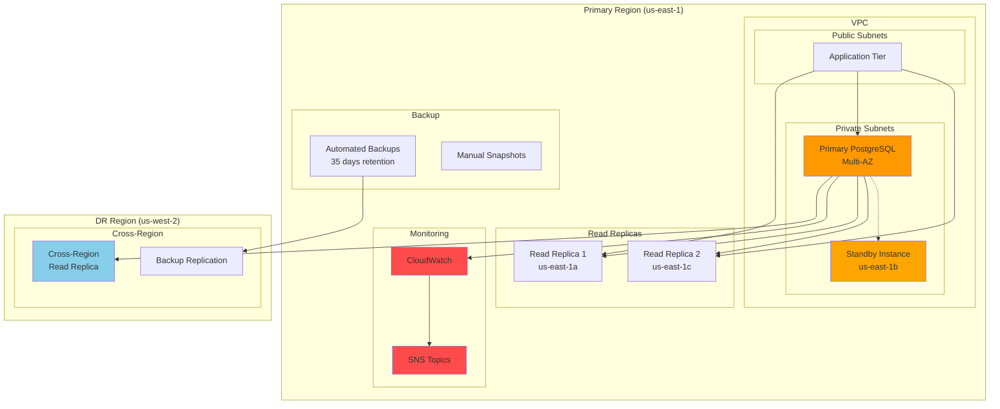

# Multi-AZ PostgreSQL Cluster

## Problem

Enterprises running critical PostgreSQL workloads face significant operational challenges when managing database availability, disaster recovery, and performance at scale. Traditional single-instance databases create single points of failure, while manual failover processes can result in extended downtime during outages. Organizations need robust, automated high-availability solutions that can maintain business continuity, handle regional failures, and provide predictable performance without requiring extensive database administration expertise.

## Solution

Amazon RDS for PostgreSQL provides a fully managed database service with built-in high availability features including Multi-AZ deployments, automated failover, read replicas, and point-in-time recovery. This solution implements a production-grade PostgreSQL cluster with automated backups, cross-region disaster recovery, performance monitoring, and intelligent scaling capabilities that ensure business continuity while minimizing operational overhead.

## Architecture Diagram



## Prerequisites

1. AWS account with appropriate IAM permissions for RDS, CloudWatch, SNS, and IAM
2. AWS CLI v2 installed and configured (or AWS CloudShell)
3. Advanced understanding of PostgreSQL administration and high availability concepts
4. Knowledge of AWS networking, security groups, and VPC configuration
5. Estimated cost: $200-500/month for production-grade cluster (depends on instance types and storage)

> **Note**: This recipe creates production-grade resources that incur significant costs. Monitor your usage and clean up resources when testing is complete.

## Preparation

```bash
# Set environment variables
export AWS_REGION=$(aws configure get region)
export AWS_ACCOUNT_ID=$(aws sts get-caller-identity \
    --query Account --output text)

# Generate unique identifiers for resources
RANDOM_SUFFIX=$(aws secretsmanager get-random-password \
    --exclude-punctuation --exclude-uppercase \
    --password-length 6 --require-each-included-type \
    --output text --query RandomPassword)

export CLUSTER_NAME="postgresql-ha-${RANDOM_SUFFIX}"
export DB_NAME="productiondb"
export MASTER_USERNAME="dbadmin"
export MASTER_PASSWORD="SecurePassword123!"
export SUBNET_GROUP_NAME="postgresql-subnet-group-${RANDOM_SUFFIX}"
export PARAMETER_GROUP_NAME="postgresql-params-${RANDOM_SUFFIX}"
export OPTION_GROUP_NAME="postgresql-options-${RANDOM_SUFFIX}"
export SECURITY_GROUP_NAME="postgresql-sg-${RANDOM_SUFFIX}"
export SNS_TOPIC_NAME="postgresql-alerts-${RANDOM_SUFFIX}"

# Create VPC and subnets (if not using default)
export VPC_ID=$(aws ec2 describe-vpcs \
    --filters "Name=is-default,Values=true" \
    --query 'Vpcs[0].VpcId' --output text)

# Get subnet IDs across multiple AZs
export SUBNET_IDS=$(aws ec2 describe-subnets \
    --filters "Name=vpc-id,Values=${VPC_ID}" \
    --query 'Subnets[0:3].SubnetId' --output text)

echo "✅ Environment variables configured successfully"
echo "VPC ID: ${VPC_ID}"
echo "Subnet IDs: ${SUBNET_IDS}"
```

## Steps

1. **Create Database Subnet Group**:

   Database subnet groups are fundamental to RDS Multi-AZ deployments, defining which subnets across different Availability Zones your database instances can use. This ensures that RDS can automatically place your primary and standby instances in separate AZs for maximum availability. The subnet group acts as a logical container that enables RDS to perform automatic failover by launching standby instances in different physical locations.

   ```bash
   # Create subnet group for Multi-AZ deployment
   aws rds create-db-subnet-group \
       --db-subnet-group-name "${SUBNET_GROUP_NAME}" \
       --db-subnet-group-description "PostgreSQL HA subnet group" \
       --subnet-ids ${SUBNET_IDS}
   
   echo "✅ Database subnet group ${SUBNET_GROUP_NAME} created"
   ```

   The subnet group is now configured across multiple Availability Zones, providing the foundation for high availability. This enables RDS to automatically distribute your database instances geographically within the region for optimal resilience.

2. **Create Security Group for Database Access**:

   Security groups function as virtual firewalls that control network access to your RDS instances using the principle of least privilege. By restricting access to only necessary ports and sources, you create multiple layers of defense against unauthorized access. This approach is critical for production databases where security breaches can have severe business consequences including data theft, compliance violations, and operational disruption.

   ```bash
   # Create security group for PostgreSQL
   SG_ID=$(aws ec2 create-security-group \
       --group-name "${SECURITY_GROUP_NAME}" \
       --description "Security group for PostgreSQL HA cluster" \
       --vpc-id "${VPC_ID}" \
       --query 'GroupId' --output text)
   
   # Allow PostgreSQL access from within VPC
   aws ec2 authorize-security-group-ingress \
       --group-id "${SG_ID}" \
       --protocol tcp \
       --port 5432 \
       --source-group "${SG_ID}"
   
   # Allow access from application subnets
   aws ec2 authorize-security-group-ingress \
       --group-id "${SG_ID}" \
       --protocol tcp \
       --port 5432 \
       --cidr "10.0.0.0/16"
   
   export SECURITY_GROUP_ID="${SG_ID}"
   echo "✅ Security group ${SG_ID} created and configured"
   ```

   The security group now controls all network access to your PostgreSQL cluster, allowing connections only from authorized sources within your VPC. This network-level security forms the first line of defense for your database infrastructure.

3. **Create Custom Parameter Group**:

   Parameter groups enable fine-tuned database configuration beyond default settings, allowing optimization for specific workload patterns and performance requirements. PostgreSQL parameter tuning directly impacts query performance, connection handling, and operational visibility. Custom parameter groups are essential for production environments where default configurations rarely match actual business needs and performance expectations.

   ```bash
   # Create parameter group for PostgreSQL optimization
   aws rds create-db-parameter-group \
       --db-parameter-group-name "${PARAMETER_GROUP_NAME}" \
       --db-parameter-group-family "postgres15" \
       --description "Optimized PostgreSQL parameters for HA"
   
   # Configure performance and logging parameters
   aws rds modify-db-parameter-group \
       --db-parameter-group-name "${PARAMETER_GROUP_NAME}" \
       --parameters "ParameterName=log_statement,ParameterValue=all,ApplyMethod=pending-reboot" \
                   "ParameterName=log_min_duration_statement,ParameterValue=1000,ApplyMethod=pending-reboot" \
                   "ParameterName=shared_preload_libraries,ParameterValue=pg_stat_statements,ApplyMethod=pending-reboot" \
                   "ParameterName=track_activity_query_size,ParameterValue=2048,ApplyMethod=pending-reboot" \
                   "ParameterName=max_connections,ParameterValue=200,ApplyMethod=pending-reboot"
   
   echo "✅ Parameter group ${PARAMETER_GROUP_NAME} created and configured"
   ```

   The optimized parameter group now enhances logging capabilities, enables query performance statistics collection, and adjusts connection limits for production workloads. These settings provide the operational visibility and performance characteristics required for effective database management.

4. **Create SNS Topic for Alerts**:

   Amazon SNS provides reliable, scalable notification delivery that ensures critical database events reach operations teams immediately. Proactive alerting is essential for maintaining high availability, as it enables rapid response to performance degradation, failover events, and potential issues before they impact business operations. SNS integrates seamlessly with CloudWatch alarms and RDS events to create comprehensive monitoring coverage.

   ```bash
   # Create SNS topic for database alerts
   SNS_TOPIC_ARN=$(aws sns create-topic \
       --name "${SNS_TOPIC_NAME}" \
       --query 'TopicArn' --output text)
   
   # Subscribe email to topic (replace with your email)
   aws sns subscribe \
       --topic-arn "${SNS_TOPIC_ARN}" \
       --protocol email \
       --notification-endpoint "your-email@example.com"
   
   export SNS_TOPIC_ARN="${SNS_TOPIC_ARN}"
   echo "✅ SNS topic created: ${SNS_TOPIC_ARN}"
   echo "Check your email to confirm subscription"
   ```

   The notification system is now established and ready to deliver real-time alerts about database health and performance. This proactive monitoring foundation enables rapid incident response and helps maintain optimal database availability.

5. **Create Primary PostgreSQL Instance with Multi-AZ**:

   The primary RDS instance with Multi-AZ deployment represents the core of your high-availability architecture. Multi-AZ automatically maintains a synchronous standby replica in a different Availability Zone, providing automatic failover capabilities with minimal downtime (typically 1-2 minutes). This configuration ensures business continuity during infrastructure failures, planned maintenance, and AWS region events while maintaining data consistency through synchronous replication.

   ```bash
   # Create primary PostgreSQL instance with Multi-AZ
   aws rds create-db-instance \
       --db-instance-identifier "${CLUSTER_NAME}-primary" \
       --db-instance-class "db.r6g.large" \
       --engine "postgres" \
       --engine-version "15.4" \
       --master-username "${MASTER_USERNAME}" \
       --master-user-password "${MASTER_PASSWORD}" \
       --allocated-storage 200 \
       --storage-type "gp3" \
       --storage-encrypted \
       --multi-az \
       --db-subnet-group-name "${SUBNET_GROUP_NAME}" \
       --vpc-security-group-ids "${SECURITY_GROUP_ID}" \
       --db-parameter-group-name "${PARAMETER_GROUP_NAME}" \
       --backup-retention-period 35 \
       --preferred-backup-window "03:00-04:00" \
       --preferred-maintenance-window "sun:04:00-sun:05:00" \
       --enable-performance-insights \
       --performance-insights-retention-period 7 \
       --monitoring-interval 60 \
       --monitoring-role-arn "arn:aws:iam::${AWS_ACCOUNT_ID}:role/rds-monitoring-role" \
       --enable-cloudwatch-logs-exports postgresql \
       --deletion-protection \
       --copy-tags-to-snapshot
   
   echo "✅ Primary PostgreSQL instance creation initiated"
   
   # Wait for instance to be available
   aws rds wait db-instance-available \
       --db-instance-identifier "${CLUSTER_NAME}-primary"
   
   echo "✅ Primary PostgreSQL instance ${CLUSTER_NAME}-primary is now available"
   ```

   Your production-grade PostgreSQL cluster is now operational with comprehensive monitoring, encryption, and automated backup capabilities. The Multi-AZ configuration provides immediate protection against single points of failure while Performance Insights enables detailed query-level monitoring for optimization.

   > **Warning**: This configuration includes deletion protection and 35-day backup retention, which will incur ongoing costs until resources are properly cleaned up.

6. **Create Read Replica in Same Region**:

   Read replicas enable horizontal scaling of read operations while reducing load on the primary instance, improving overall application performance. These asynchronously replicated instances can handle analytics queries, reporting workloads, and read-heavy application traffic without impacting write performance. Beyond scaling, read replicas serve as additional disaster recovery resources that can be promoted to standalone instances during extended outages.

   ```bash
   # Create read replica for read scaling
   aws rds create-db-instance-read-replica \
       --db-instance-identifier "${CLUSTER_NAME}-read-replica-1" \
       --source-db-instance-identifier "${CLUSTER_NAME}-primary" \
       --db-instance-class "db.r6g.large" \
       --publicly-accessible false \
       --enable-performance-insights \
       --performance-insights-retention-period 7 \
       --monitoring-interval 60 \
       --monitoring-role-arn "arn:aws:iam::${AWS_ACCOUNT_ID}:role/rds-monitoring-role"
   
   echo "✅ Read replica creation initiated"
   
   # Wait for read replica to be available
   aws rds wait db-instance-available \
       --db-instance-identifier "${CLUSTER_NAME}-read-replica-1"
   
   echo "✅ Read replica ${CLUSTER_NAME}-read-replica-1 is now available"
   ```

   The read replica provides additional read capacity and serves as another layer of data protection. Applications can now distribute read queries across multiple endpoints, improving performance while maintaining data consistency through PostgreSQL's asynchronous replication.

7. **Create Cross-Region Read Replica for Disaster Recovery**:

   Cross-region read replicas provide protection against regional disasters and enable geographic distribution of read workloads for global applications. This capability is crucial for meeting business continuity requirements and regulatory compliance in industries where regional outages cannot be tolerated. The cross-region replica can be promoted to a standalone instance, enabling complete disaster recovery with application traffic redirected to the alternate region.

   ```bash
   # Create cross-region read replica in us-west-2
   aws rds create-db-instance-read-replica \
       --db-instance-identifier "${CLUSTER_NAME}-dr-replica" \
       --source-db-instance-identifier "arn:aws:rds:${AWS_REGION}:${AWS_ACCOUNT_ID}:db:${CLUSTER_NAME}-primary" \
       --db-instance-class "db.r6g.large" \
       --region us-west-2 \
       --publicly-accessible false \
       --enable-performance-insights \
       --performance-insights-retention-period 7
   
   echo "✅ Cross-region disaster recovery replica creation initiated"
   
   # Wait for cross-region replica to be available
   aws rds wait db-instance-available \
       --db-instance-identifier "${CLUSTER_NAME}-dr-replica" \
       --region us-west-2
   
   echo "✅ Cross-region replica ${CLUSTER_NAME}-dr-replica is now available"
   ```

   Your disaster recovery capability is now established with data continuously replicated to a separate AWS region. This geographic redundancy ensures business continuity even during complete regional failures, providing peace of mind for mission-critical applications.

8. **Setup Automated Backup Replication**:

   Automated backup replication extends your data protection strategy by maintaining backup copies in multiple regions, providing additional recovery options beyond read replicas. This feature enables point-in-time recovery from the disaster recovery region, supporting more granular recovery scenarios than replica promotion alone. Cross-region backup replication is essential for comprehensive business continuity planning and regulatory compliance requirements.

   ```bash
   # Enable automated backup replication to DR region
   aws rds start-db-instance-automated-backups-replication \
       --source-db-instance-arn "arn:aws:rds:${AWS_REGION}:${AWS_ACCOUNT_ID}:db:${CLUSTER_NAME}-primary" \
       --backup-retention-period 35 \
       --region us-west-2
   
   echo "✅ Automated backup replication to us-west-2 enabled"
   ```

   Cross-region backup replication is now active, ensuring that point-in-time recovery capabilities are available from both regions. This provides maximum flexibility for recovery scenarios and supports the most stringent business continuity requirements.

9. **Create CloudWatch Alarms for Monitoring**:

   Proactive monitoring through CloudWatch alarms enables early detection of performance issues before they impact application users. These carefully tuned thresholds monitor critical database metrics including CPU utilization, connection saturation, and replication lag. Early warning systems are essential for maintaining SLA compliance and enabling proactive capacity management in production environments.

   ```bash
   # CPU utilization alarm
   aws cloudwatch put-metric-alarm \
       --alarm-name "${CLUSTER_NAME}-cpu-high" \
       --alarm-description "PostgreSQL CPU utilization high" \
       --metric-name CPUUtilization \
       --namespace AWS/RDS \
       --statistic Average \
       --period 300 \
       --threshold 80 \
       --comparison-operator GreaterThanThreshold \
       --evaluation-periods 2 \
       --alarm-actions "${SNS_TOPIC_ARN}" \
       --dimensions Name=DBInstanceIdentifier,Value="${CLUSTER_NAME}-primary"
   
   # Database connection alarm
   aws cloudwatch put-metric-alarm \
       --alarm-name "${CLUSTER_NAME}-connections-high" \
       --alarm-description "PostgreSQL connection count high" \
       --metric-name DatabaseConnections \
       --namespace AWS/RDS \
       --statistic Average \
       --period 300 \
       --threshold 150 \
       --comparison-operator GreaterThanThreshold \
       --evaluation-periods 2 \
       --alarm-actions "${SNS_TOPIC_ARN}" \
       --dimensions Name=DBInstanceIdentifier,Value="${CLUSTER_NAME}-primary"
   
   # Read replica lag alarm
   aws cloudwatch put-metric-alarm \
       --alarm-name "${CLUSTER_NAME}-replica-lag-high" \
       --alarm-description "PostgreSQL read replica lag high" \
       --metric-name ReplicaLag \
       --namespace AWS/RDS \
       --statistic Average \
       --period 300 \
       --threshold 30 \
       --comparison-operator GreaterThanThreshold \
       --evaluation-periods 2 \
       --alarm-actions "${SNS_TOPIC_ARN}" \
       --dimensions Name=DBInstanceIdentifier,Value="${CLUSTER_NAME}-read-replica-1"
   
   echo "✅ CloudWatch alarms created for monitoring"
   ```

   Comprehensive monitoring is now in place to track database health and performance. These alarms will proactively notify administrators of potential issues, enabling rapid response to maintain optimal database performance and availability.

10. **Create Manual Snapshot for Backup**:

    Manual snapshots provide additional backup flexibility beyond automated backups, serving as recovery points for specific application milestones, pre-deployment states, or known-good configurations. Unlike automated backups that are deleted when instances are removed, manual snapshots persist independently and can be shared across accounts or regions. This capability is crucial for maintaining long-term backup retention policies and supporting complex recovery scenarios.

    ```bash
    # Create manual snapshot for additional backup
    aws rds create-db-snapshot \
        --db-instance-identifier "${CLUSTER_NAME}-primary" \
        --db-snapshot-identifier "${CLUSTER_NAME}-initial-snapshot-$(date +%Y%m%d)"
    
    echo "✅ Manual snapshot creation initiated"
    
    # Wait for snapshot to complete
    aws rds wait db-snapshot-completed \
        --db-snapshot-identifier "${CLUSTER_NAME}-initial-snapshot-$(date +%Y%m%d)"
    
    echo "✅ Manual snapshot completed successfully"
    ```

    The baseline snapshot captures the initial database state and serves as a reference point for future recovery operations. This snapshot provides an additional recovery option independent of automated backup retention policies.

11. **Configure Event Notifications**:

    RDS event notifications provide real-time visibility into database lifecycle events, maintenance activities, and operational status changes. This comprehensive event monitoring enables rapid response to failover events, maintenance windows, and potential issues affecting database availability. Event-driven alerting is essential for maintaining operational awareness and enabling automated response workflows in production environments.

    ```bash
    # Create RDS event subscription
    aws rds create-event-subscription \
        --subscription-name "${CLUSTER_NAME}-events" \
        --sns-topic-arn "${SNS_TOPIC_ARN}" \
        --source-type db-instance \
        --source-ids "${CLUSTER_NAME}-primary" "${CLUSTER_NAME}-read-replica-1" \
        --event-categories "availability" "backup" "configuration change" \
                           "creation" "deletion" "failover" "failure" \
                           "low storage" "maintenance" "notification" \
                           "recovery" "restoration"
    
    echo "✅ Event subscription created for database notifications"
    ```

    Event notifications now provide comprehensive coverage of database operational events, ensuring that administrators are informed of all significant database activities and status changes.

12. **Setup RDS Proxy for Connection Pooling**:

    RDS Proxy provides intelligent connection pooling and management, dramatically improving application scalability by reusing database connections and reducing connection overhead. This is particularly valuable for serverless applications and high-concurrency workloads where traditional connection management can overwhelm database instances. RDS Proxy also enhances security by managing credentials through AWS Secrets Manager and provides improved failover handling with faster recovery times.

    ```bash
    # Create IAM role for RDS Proxy
    aws iam create-role \
        --role-name "rds-proxy-role-${RANDOM_SUFFIX}" \
        --assume-role-policy-document '{
          "Version": "2012-10-17",
          "Statement": [
            {
              "Effect": "Allow",
              "Principal": {
                "Service": "rds.amazonaws.com"
              },
              "Action": "sts:AssumeRole"
            }
          ]
        }'
    
    # Attach policy for Secrets Manager access
    aws iam attach-role-policy \
        --role-name "rds-proxy-role-${RANDOM_SUFFIX}" \
        --policy-arn "arn:aws:iam::aws:policy/SecretsManagerReadWrite"
    
    # Create secret for database credentials
    SECRET_ARN=$(aws secretsmanager create-secret \
        --name "${CLUSTER_NAME}-credentials" \
        --description "PostgreSQL credentials for RDS Proxy" \
        --secret-string "{\"username\":\"${MASTER_USERNAME}\",\"password\":\"${MASTER_PASSWORD}\"}" \
        --query 'ARN' --output text)
    
    # Create RDS Proxy
    aws rds create-db-proxy \
        --db-proxy-name "${CLUSTER_NAME}-proxy" \
        --engine-family POSTGRESQL \
        --auth Description="PostgreSQL authentication",AuthScheme=SECRETS,SecretArn="${SECRET_ARN}" \
        --role-arn "arn:aws:iam::${AWS_ACCOUNT_ID}:role/rds-proxy-role-${RANDOM_SUFFIX}" \
        --vpc-subnet-ids ${SUBNET_IDS} \
        --vpc-security-group-ids "${SECURITY_GROUP_ID}" \
        --require-tls \
        --idle-client-timeout 1800 \
        --max-connections-percent 100 \
        --max-idle-connections-percent 50
    
    echo "✅ RDS Proxy created for connection pooling"
    ```

    The connection pooling layer is now operational, providing optimized database access with enhanced security and improved failover capabilities. Applications can now connect through the proxy endpoint for better resource utilization and more resilient database connectivity.

## Validation & Testing

1. **Verify Primary Instance and Multi-AZ Configuration**:

   ```bash
   # Check primary instance status
   aws rds describe-db-instances \
       --db-instance-identifier "${CLUSTER_NAME}-primary" \
       --query 'DBInstances[0].{Status:DBInstanceStatus,MultiAZ:MultiAZ,Engine:Engine,EngineVersion:EngineVersion,StorageEncrypted:StorageEncrypted}'
   ```

   Expected output: Status should be "available", MultiAZ should be "true", StorageEncrypted should be "true"

2. **Test Database Connectivity**:

   ```bash
   # Get primary endpoint
   PRIMARY_ENDPOINT=$(aws rds describe-db-instances \
       --db-instance-identifier "${CLUSTER_NAME}-primary" \
       --query 'DBInstances[0].Endpoint.Address' --output text)
   
   # Test connection (requires postgresql-client)
   # psql -h ${PRIMARY_ENDPOINT} -U ${MASTER_USERNAME} -d ${DB_NAME} -c "SELECT version();"
   
   echo "Primary endpoint: ${PRIMARY_ENDPOINT}"
   echo "Test connection using: psql -h ${PRIMARY_ENDPOINT} -U ${MASTER_USERNAME} -d ${DB_NAME}"
   ```

3. **Verify Read Replica Status**:

   ```bash
   # Check read replica status and lag
   aws rds describe-db-instances \
       --db-instance-identifier "${CLUSTER_NAME}-read-replica-1" \
       --query 'DBInstances[0].{Status:DBInstanceStatus,ReadReplicaSource:ReadReplicaSourceDBInstanceIdentifier}'
   
   # Get read replica endpoint
   READ_ENDPOINT=$(aws rds describe-db-instances \
       --db-instance-identifier "${CLUSTER_NAME}-read-replica-1" \
       --query 'DBInstances[0].Endpoint.Address' --output text)
   
   echo "Read replica endpoint: ${READ_ENDPOINT}"
   ```

4. **Test Failover Capability**:

   ```bash
   # Simulate failover by rebooting primary with failover
   echo "Initiating failover test..."
   aws rds reboot-db-instance \
       --db-instance-identifier "${CLUSTER_NAME}-primary" \
       --force-failover
   
   # Monitor failover process
   aws rds describe-events \
       --source-identifier "${CLUSTER_NAME}-primary" \
       --source-type db-instance \
       --start-time "$(date -u -d '5 minutes ago' +%Y-%m-%dT%H:%M:%S)"
   
   echo "✅ Failover test initiated - monitor CloudWatch and SNS notifications"
   ```

5. **Verify Backup Configuration**:

   ```bash
   # Check automated backup settings
   aws rds describe-db-instances \
       --db-instance-identifier "${CLUSTER_NAME}-primary" \
       --query 'DBInstances[0].{BackupRetentionPeriod:BackupRetentionPeriod,PreferredBackupWindow:PreferredBackupWindow,DeletionProtection:DeletionProtection}'
   
   # List available snapshots
   aws rds describe-db-snapshots \
       --db-instance-identifier "${CLUSTER_NAME}-primary" \
       --query 'DBSnapshots[*].{Identifier:DBSnapshotIdentifier,Status:Status,Created:SnapshotCreateTime}'
   ```

## Cleanup

1. **Delete RDS Proxy and Associated Resources**:

   ```bash
   # Delete RDS Proxy
   aws rds delete-db-proxy \
       --db-proxy-name "${CLUSTER_NAME}-proxy"
   
   # Delete secret
   aws secretsmanager delete-secret \
       --secret-id "${CLUSTER_NAME}-credentials" \
       --force-delete-without-recovery
   
   # Delete IAM role
   aws iam detach-role-policy \
       --role-name "rds-proxy-role-${RANDOM_SUFFIX}" \
       --policy-arn "arn:aws:iam::aws:policy/SecretsManagerReadWrite"
   
   aws iam delete-role \
       --role-name "rds-proxy-role-${RANDOM_SUFFIX}"
   
   echo "✅ RDS Proxy and associated resources deleted"
   ```

2. **Stop Automated Backup Replication**:

   ```bash
   # Stop automated backup replication
   aws rds stop-db-instance-automated-backups-replication \
       --source-db-instance-arn "arn:aws:rds:${AWS_REGION}:${AWS_ACCOUNT_ID}:db:${CLUSTER_NAME}-primary" \
       --region us-west-2
   
   echo "✅ Automated backup replication stopped"
   ```

3. **Delete Cross-Region Read Replica**:

   ```bash
   # Delete cross-region replica
   aws rds delete-db-instance \
       --db-instance-identifier "${CLUSTER_NAME}-dr-replica" \
       --region us-west-2 \
       --skip-final-snapshot
   
   echo "✅ Cross-region replica deletion initiated"
   ```

4. **Delete Read Replica**:

   ```bash
   # Delete read replica
   aws rds delete-db-instance \
       --db-instance-identifier "${CLUSTER_NAME}-read-replica-1" \
       --skip-final-snapshot
   
   echo "✅ Read replica deletion initiated"
   ```

5. **Delete Primary Instance**:

   ```bash
   # Disable deletion protection first
   aws rds modify-db-instance \
       --db-instance-identifier "${CLUSTER_NAME}-primary" \
       --no-deletion-protection \
       --apply-immediately
   
   # Wait for modification to complete
   aws rds wait db-instance-available \
       --db-instance-identifier "${CLUSTER_NAME}-primary"
   
   # Delete primary instance
   aws rds delete-db-instance \
       --db-instance-identifier "${CLUSTER_NAME}-primary" \
       --skip-final-snapshot \
       --delete-automated-backups
   
   echo "✅ Primary instance deletion initiated"
   ```

6. **Delete CloudWatch Alarms and SNS Resources**:

   ```bash
   # Delete CloudWatch alarms
   aws cloudwatch delete-alarms \
       --alarm-names "${CLUSTER_NAME}-cpu-high" \
                    "${CLUSTER_NAME}-connections-high" \
                    "${CLUSTER_NAME}-replica-lag-high"
   
   # Delete event subscription
   aws rds delete-event-subscription \
       --subscription-name "${CLUSTER_NAME}-events"
   
   # Delete SNS topic
   aws sns delete-topic \
       --topic-arn "${SNS_TOPIC_ARN}"
   
   echo "✅ Monitoring resources deleted"
   ```

7. **Delete Supporting Resources**:

   ```bash
   # Delete parameter group
   aws rds delete-db-parameter-group \
       --db-parameter-group-name "${PARAMETER_GROUP_NAME}"
   
   # Delete subnet group
   aws rds delete-db-subnet-group \
       --db-subnet-group-name "${SUBNET_GROUP_NAME}"
   
   # Delete security group
   aws ec2 delete-security-group \
       --group-id "${SECURITY_GROUP_ID}"
   
   # Delete manual snapshots
   aws rds delete-db-snapshot \
       --db-snapshot-identifier "${CLUSTER_NAME}-initial-snapshot-$(date +%Y%m%d)"
   
   echo "✅ All supporting resources deleted"
   ```

## Discussion

This recipe demonstrates a comprehensive approach to building highly available PostgreSQL clusters using Amazon RDS. The architecture incorporates multiple layers of redundancy and disaster recovery capabilities that are essential for production database workloads.

The Multi-AZ deployment provides automatic failover capabilities with synchronous replication to a standby instance in a different Availability Zone. This ensures that database operations can continue with minimal interruption during planned maintenance or unexpected failures. The failover process is transparent to applications, typically completing within 1-2 minutes.

Read replicas serve dual purposes in this architecture: scaling read workloads and providing additional disaster recovery options. The cross-region read replica in us-west-2 ensures that critical data remains accessible even during regional outages. With proper application design, this replica can be promoted to a standalone instance for complete disaster recovery scenarios.

The automated backup strategy includes both point-in-time recovery with 35-day retention and cross-region backup replication. This comprehensive backup approach ensures that data can be recovered from various failure scenarios, including accidental data deletion, corruption, or complete regional failures. The combination of automated and manual snapshots provides flexibility for different recovery requirements.

> **Note**: RDS Multi-AZ deployments provide synchronous replication with automatic failover typically completing within 60-120 seconds. For more details on failover mechanics, see the [Amazon RDS Multi-AZ Documentation](https://docs.aws.amazon.com/AmazonRDS/latest/UserGuide/Concepts.MultiAZ.html).

> **Tip**: Use RDS Proxy to implement connection pooling and reduce database connection overhead, especially important for serverless and highly concurrent applications.

Performance monitoring through CloudWatch metrics and Performance Insights provides visibility into database performance, query patterns, and resource utilization. The configured alarms proactively notify administrators of potential issues before they impact application performance.

## Challenge

Extend this high-availability PostgreSQL solution by implementing these enhancements:

1. **Implement Blue-Green Deployments**: Create a blue-green deployment strategy for zero-downtime PostgreSQL upgrades using RDS Blue/Green deployments feature
2. **Add Connection Pooling**: Implement PgBouncer or connection pooling at the application level to optimize database connection management
3. **Implement Advanced Monitoring**: Set up custom CloudWatch dashboards and integrate with third-party monitoring tools like Datadog or New Relic for comprehensive observability
4. **Add Automated Disaster Recovery Testing**: Create Lambda functions that periodically test disaster recovery procedures by promoting read replicas and validating application connectivity
5. **Implement Database-Level Security**: Configure SSL/TLS encryption, IAM database authentication, and fine-grained access controls using PostgreSQL role-based security

## Infrastructure Code

*Infrastructure code will be generated after recipe approval.*