# Multi-Region Disaster Recovery with Aurora DSQL

## Problem

Financial services companies processing critical transactional data face catastrophic business impact during regional outages, with traditional database failover solutions creating recovery time objectives (RTO) of several minutes and potential data loss. Single-region database architectures cannot meet stringent compliance requirements for zero-downtime availability while maintaining strong consistency across geographically distributed operations. Manual disaster recovery processes introduce human error and delays that can cost millions in lost revenue during outages.

## Solution

Aurora DSQL's active-active multi-region architecture eliminates traditional failover concerns by providing 99.999% availability with zero data loss and automatic recovery orchestration. EventBridge coordinates sophisticated monitoring and alerting workflows that trigger Lambda-based automation for proactive issue detection and resolution. This serverless disaster recovery solution ensures business continuity through real-time health monitoring, automated scaling responses, and comprehensive observability across multiple AWS regions.

## Architecture Diagram

```mermaid
graph TB
    subgraph "Primary Region (us-east-1)"
        APP1[Application Layer]
        DSQL1[Aurora DSQL Cluster]
        EB1[EventBridge]
        LAMBDA1[Lambda Functions]
        CW1[CloudWatch]
    end
    
    subgraph "Secondary Region (us-west-2)"
        APP2[Application Layer]
        DSQL2[Aurora DSQL Cluster]
        EB2[EventBridge]
        LAMBDA2[Lambda Functions]
        CW2[CloudWatch]
    end
    
    subgraph "Witness Region (us-west-1)"
        WITNESS[DSQL Witness]
    end
    
    subgraph "Monitoring & Alerts"
        SNS[SNS Topics]
        DASHBOARD[CloudWatch Dashboard]
    end
    
    APP1 --> DSQL1
    APP2 --> DSQL2
    DSQL1 <--> DSQL2
    DSQL1 --> WITNESS
    DSQL2 --> WITNESS
    
    CW1 --> EB1
    CW2 --> EB2
    EB1 --> LAMBDA1
    EB2 --> LAMBDA2
    
    LAMBDA1 --> SNS
    LAMBDA2 --> SNS
    CW1 --> DASHBOARD
    CW2 --> DASHBOARD
    
    style DSQL1 fill:#FF9900
    style DSQL2 fill:#FF9900
    style WITNESS fill:#232F3E
    style LAMBDA1 fill:#FF9900
    style LAMBDA2 fill:#FF9900
```



## Prerequisites

1. AWS account with administrator permissions for Aurora DSQL, EventBridge, Lambda, and CloudWatch
2. AWS CLI v2 installed and configured (or AWS CloudShell access)
3. Advanced understanding of multi-region AWS architectures and disaster recovery concepts
4. Knowledge of serverless event-driven patterns and database high availability principles
5. Estimated cost: $150-300/month for Aurora DSQL multi-region clusters and supporting services

> **Note**: Aurora DSQL is available in specific regions. Verify [regional availability](https://docs.aws.amazon.com/aurora-dsql/latest/userguide/what-is-aurora-dsql.html) before selecting your primary and secondary regions.

## Preparation

```bash
# Set environment variables for multi-region deployment
export PRIMARY_REGION="us-east-1"
export SECONDARY_REGION="us-west-2"
export WITNESS_REGION="us-west-1"
export AWS_ACCOUNT_ID=$(aws sts get-caller-identity \
    --query Account --output text)

# Generate unique identifiers for resources
RANDOM_SUFFIX=$(aws secretsmanager get-random-password \
    --exclude-punctuation --exclude-uppercase \
    --password-length 8 --require-each-included-type \
    --output text --query RandomPassword)

# Set resource naming variables
export CLUSTER_PREFIX="dr-dsql-${RANDOM_SUFFIX}"
export LAMBDA_FUNCTION_NAME="dr-monitor-${RANDOM_SUFFIX}"
export EVENTBRIDGE_RULE_NAME="dr-health-monitor-${RANDOM_SUFFIX}"
export SNS_TOPIC_NAME="dr-alerts-${RANDOM_SUFFIX}"

echo "✅ Environment configured for multi-region disaster recovery setup"
echo "Primary Region: ${PRIMARY_REGION}"
echo "Secondary Region: ${SECONDARY_REGION}"
echo "Witness Region: ${WITNESS_REGION}"
```

## Steps

1. **Create Aurora DSQL Multi-Region Cluster Architecture**:

   Aurora DSQL's distributed architecture provides the foundation for zero-downtime disaster recovery through active-active multi-region clusters. Unlike traditional primary-secondary setups that require manual failover processes, Aurora DSQL eliminates failover delays by maintaining strongly consistent data across regions with automatic conflict resolution. This advanced database technology uses distributed consensus algorithms to ensure that writes to any region are immediately visible in all other regions without eventual consistency delays. The witness region acts as a tie-breaker for cluster membership decisions, ensuring continuous availability even during complex failure scenarios.

   ```bash
   # Create primary Aurora DSQL cluster in us-east-1
   aws dsql create-cluster \
       --region ${PRIMARY_REGION} \
       --cluster-identifier ${CLUSTER_PREFIX}-primary \
       --multi-region-properties "{\"witnessRegion\":\"${WITNESS_REGION}\"}" \
       --tags Key=Project,Value=DisasterRecovery \
               Key=Environment,Value=Production \
               Key=CostCenter,Value=Infrastructure
   
   # Wait for primary cluster to become available
   echo "⏳ Waiting for primary cluster to become available..."
   aws dsql wait cluster-available \
       --region ${PRIMARY_REGION} \
       --identifier ${CLUSTER_PREFIX}-primary
   
   # Store the primary cluster identifier
   PRIMARY_CLUSTER_ID="${CLUSTER_PREFIX}-primary"
   
   # Create secondary Aurora DSQL cluster in us-west-2
   aws dsql create-cluster \
       --region ${SECONDARY_REGION} \
       --cluster-identifier ${CLUSTER_PREFIX}-secondary \
       --multi-region-properties "{\"witnessRegion\":\"${WITNESS_REGION}\"}" \
       --tags Key=Project,Value=DisasterRecovery \
               Key=Environment,Value=Production \
               Key=CostCenter,Value=Infrastructure
   
   # Wait for secondary cluster to become available
   echo "⏳ Waiting for secondary cluster to become available..."
   aws dsql wait cluster-available \
       --region ${SECONDARY_REGION} \
       --identifier ${CLUSTER_PREFIX}-secondary
   
   # Store the secondary cluster identifier
   SECONDARY_CLUSTER_ID="${CLUSTER_PREFIX}-secondary"
   
   echo "✅ Aurora DSQL clusters created in both regions"
   echo "Primary Cluster: ${PRIMARY_CLUSTER_ID}"
   echo "Secondary Cluster: ${SECONDARY_CLUSTER_ID}"
   ```

   The Aurora DSQL clusters are now established with witness region configuration, providing the distributed architecture foundation. This creates two regionally-isolated clusters that will be peered to form a single logical database with active-active capabilities and automatic failure recovery. The witness region ensures cluster availability decisions can be made even if one of the primary regions becomes unavailable.

2. **Establish Multi-Region Cluster Peering**:

   Cluster peering transforms the independent regional clusters into a unified, globally distributed database with strong consistency guarantees. This configuration enables applications to read and write to either region without concern for data conflicts or eventual consistency limitations. The peering process activates Aurora DSQL's sophisticated distributed consensus algorithms that maintain ACID properties across regions. This approach eliminates the traditional complexity of database replication, master-slave configurations, and manual failover procedures that plague conventional disaster recovery architectures.

   ```bash
   # Get the ARN of the secondary cluster for peering
   SECONDARY_CLUSTER_ARN=$(aws dsql get-cluster \
       --region ${SECONDARY_REGION} \
       --identifier ${SECONDARY_CLUSTER_ID} \
       --query 'arn' --output text)
   
   # Peer primary cluster with secondary cluster
   aws dsql update-cluster \
       --region ${PRIMARY_REGION} \
       --identifier ${PRIMARY_CLUSTER_ID} \
       --multi-region-properties "{\"witnessRegion\":\"${WITNESS_REGION}\",\"clusters\":[\"${SECONDARY_CLUSTER_ARN}\"]}"
   
   # Get the ARN of the primary cluster for reverse peering
   PRIMARY_CLUSTER_ARN=$(aws dsql get-cluster \
       --region ${PRIMARY_REGION} \
       --identifier ${PRIMARY_CLUSTER_ID} \
       --query 'arn' --output text)
   
   # Complete the peering by updating secondary cluster
   aws dsql update-cluster \
       --region ${SECONDARY_REGION} \
       --identifier ${SECONDARY_CLUSTER_ID} \
       --multi-region-properties "{\"witnessRegion\":\"${WITNESS_REGION}\",\"clusters\":[\"${PRIMARY_CLUSTER_ARN}\"]}"
   
   # Wait for clusters to complete peering process
   echo "⏳ Waiting for cluster peering to complete..."
   sleep 30
   
   # Verify peering status
   aws dsql get-cluster \
       --region ${PRIMARY_REGION} \
       --identifier ${PRIMARY_CLUSTER_ID} \
       --query 'status' --output text
   
   echo "✅ Multi-region cluster peering established successfully"
   ```

   The Aurora DSQL clusters are now peered and functioning as a single logical database across regions. Applications can connect to either regional endpoint and experience identical functionality with zero replication lag and automatic conflict resolution. This configuration provides the foundation for true zero-downtime disaster recovery.

3. **Create SNS Topics for Multi-Region Alerting**:

   SNS topics provide the notification infrastructure for disaster recovery events, enabling real-time communication to operations teams and automated systems. Multi-region SNS deployment ensures alert delivery even during regional failures, with cross-region subscriptions maintaining notification reliability. This redundant alerting system follows AWS Well-Architected principles by eliminating single points of failure in the communication layer. SNS supports multiple delivery protocols including email, SMS, HTTP endpoints, and integration with incident management systems like PagerDuty.

   ```bash
   # Create SNS topic in primary region
   PRIMARY_SNS_ARN=$(aws sns create-topic \
       --region ${PRIMARY_REGION} \
       --name ${SNS_TOPIC_NAME}-primary \
       --attributes DisplayName="DR Alerts Primary" \
       --tags Key=Project,Value=DisasterRecovery \
               Key=Region,Value=Primary \
       --query 'TopicArn' --output text)
   
   # Create SNS topic in secondary region
   SECONDARY_SNS_ARN=$(aws sns create-topic \
       --region ${SECONDARY_REGION} \
       --name ${SNS_TOPIC_NAME}-secondary \
       --attributes DisplayName="DR Alerts Secondary" \
       --tags Key=Project,Value=DisasterRecovery \
               Key=Region,Value=Secondary \
       --query 'TopicArn' --output text)
   
   # Subscribe email endpoints to both topics (replace with actual email)
   aws sns subscribe \
       --region ${PRIMARY_REGION} \
       --topic-arn ${PRIMARY_SNS_ARN} \
       --protocol email \
       --notification-endpoint "ops-team@company.com"
   
   aws sns subscribe \
       --region ${SECONDARY_REGION} \
       --topic-arn ${SECONDARY_SNS_ARN} \
       --protocol email \
       --notification-endpoint "ops-team@company.com"
   
   # Enable server-side encryption for SNS topics
   aws sns set-topic-attributes \
       --region ${PRIMARY_REGION} \
       --topic-arn ${PRIMARY_SNS_ARN} \
       --attribute-name KmsMasterKeyId \
       --attribute-value alias/aws/sns
   
   aws sns set-topic-attributes \
       --region ${SECONDARY_REGION} \
       --topic-arn ${SECONDARY_SNS_ARN} \
       --attribute-name KmsMasterKeyId \
       --attribute-value alias/aws/sns
   
   echo "✅ SNS topics created and configured for multi-region alerting"
   echo "Primary SNS: ${PRIMARY_SNS_ARN}"
   echo "Secondary SNS: ${SECONDARY_SNS_ARN}"
   ```

   SNS topics are now operational across both regions with encryption enabled, providing redundant notification channels for disaster recovery events. The email subscriptions ensure operations teams receive immediate alerts regardless of which region experiences issues, while the encryption protects sensitive alert information in transit.

4. **Deploy Lambda Functions for Health Monitoring**:

   Lambda functions serve as the intelligent monitoring layer that continuously evaluates Aurora DSQL cluster health and regional availability. These serverless functions implement sophisticated health checks including connection testing, query performance monitoring, and cross-region synchronization verification. Lambda's automatic scaling and regional isolation ensure monitoring capabilities remain operational even during partial infrastructure failures. The monitoring functions use AWS SDK boto3 to interact with Aurora DSQL APIs and implement exponential backoff for resilient API interactions.

   ```bash
   # Create Lambda execution role with trust policy
   cat > trust-policy.json << 'EOF'
   {
       "Version": "2012-10-17",
       "Statement": [
           {
               "Effect": "Allow",
               "Principal": {
                   "Service": "lambda.amazonaws.com"
               },
               "Action": "sts:AssumeRole"
           }
       ]
   }
   EOF
   
   # Create IAM role for Lambda function
   LAMBDA_ROLE_ARN=$(aws iam create-role \
       --role-name ${LAMBDA_FUNCTION_NAME}-role \
       --assume-role-policy-document file://trust-policy.json \
       --query 'Role.Arn' --output text)
   
   # Wait for role propagation
   echo "⏳ Waiting for IAM role propagation..."
   sleep 10
   
   # Attach necessary policies for Aurora DSQL, SNS, and CloudWatch
   aws iam attach-role-policy \
       --role-name ${LAMBDA_FUNCTION_NAME}-role \
       --policy-arn arn:aws:iam::aws:policy/service-role/AWSLambdaBasicExecutionRole
   
   aws iam attach-role-policy \
       --role-name ${LAMBDA_FUNCTION_NAME}-role \
       --policy-arn arn:aws:iam::aws:policy/AmazonDSQLFullAccess
   
   aws iam attach-role-policy \
       --role-name ${LAMBDA_FUNCTION_NAME}-role \
       --policy-arn arn:aws:iam::aws:policy/AmazonSNSFullAccess
   
   # Create enhanced Lambda function code with error handling
   cat > lambda_function.py << 'EOF'
   import json
   import boto3
   import os
   import time
   from datetime import datetime
   from botocore.exceptions import ClientError
   
   def lambda_handler(event, context):
       """
       Monitor Aurora DSQL cluster health and send alerts
       """
       dsql_client = boto3.client('dsql')
       sns_client = boto3.client('sns')
       cloudwatch_client = boto3.client('cloudwatch')
       
       cluster_id = os.environ['CLUSTER_ID']
       sns_topic_arn = os.environ['SNS_TOPIC_ARN']
       region = os.environ['AWS_REGION']
       
       try:
           # Check cluster status with retry logic
           max_retries = 3
           for attempt in range(max_retries):
               try:
                   response = dsql_client.get_cluster(identifier=cluster_id)
                   break
               except ClientError as e:
                   if attempt < max_retries - 1:
                       time.sleep(2 ** attempt)  # Exponential backoff
                       continue
                   raise e
           
           cluster_status = response['status']
           cluster_arn = response['arn']
           
           # Create comprehensive health report
           health_report = {
               'timestamp': datetime.now().isoformat(),
               'region': region,
               'cluster_id': cluster_id,
               'cluster_arn': cluster_arn,
               'status': cluster_status,
               'healthy': cluster_status == 'ACTIVE',
               'function_name': context.function_name,
               'request_id': context.aws_request_id
           }
           
           # Publish custom CloudWatch metric
           cloudwatch_client.put_metric_data(
               Namespace='Aurora/DSQL/DisasterRecovery',
               MetricData=[
                   {
                       'MetricName': 'ClusterHealth',
                       'Value': 1.0 if cluster_status == 'ACTIVE' else 0.0,
                       'Unit': 'None',
                       'Dimensions': [
                           {
                               'Name': 'ClusterID',
                               'Value': cluster_id
                           },
                           {
                               'Name': 'Region',
                               'Value': region
                           }
                       ]
                   }
               ]
           )
           
           # Send alert if cluster is not healthy
           if cluster_status != 'ACTIVE':
               alert_message = f"""
               ALERT: Aurora DSQL Cluster Health Issue
               
               Region: {region}
               Cluster ID: {cluster_id}
               Cluster ARN: {cluster_arn}
               Status: {cluster_status}
               Timestamp: {health_report['timestamp']}
               Function: {context.function_name}
               Request ID: {context.aws_request_id}
               
               Immediate investigation required.
               Check Aurora DSQL console for detailed status information.
               """
               
               sns_client.publish(
                   TopicArn=sns_topic_arn,
                   Subject=f'Aurora DSQL Alert - {region}',
                   Message=alert_message
               )
           
           return {
               'statusCode': 200,
               'body': json.dumps(health_report),
               'headers': {
                   'Content-Type': 'application/json'
               }
           }
           
       except Exception as e:
           error_message = f"""
           ERROR: Aurora DSQL Health Check Failed
           
           Region: {region}
           Cluster ID: {cluster_id}
           Error: {str(e)}
           Error Type: {type(e).__name__}
           Timestamp: {datetime.now().isoformat()}
           Function: {context.function_name}
           Request ID: {context.aws_request_id}
           
           This error indicates a potential issue with the monitoring infrastructure.
           Verify Lambda function permissions and Aurora DSQL cluster accessibility.
           """
           
           try:
               sns_client.publish(
                   TopicArn=sns_topic_arn,
                   Subject=f'Aurora DSQL Health Check Error - {region}',
                   Message=error_message
               )
           except Exception as sns_error:
               print(f"Failed to send SNS alert: {sns_error}")
           
           return {
               'statusCode': 500,
               'body': json.dumps({
                   'error': str(e),
                   'error_type': type(e).__name__,
                   'timestamp': datetime.now().isoformat()
               }),
               'headers': {
                   'Content-Type': 'application/json'
               }
           }
   EOF
   
   # Package Lambda function
   zip lambda_function.zip lambda_function.py
   
   echo "✅ Lambda function code created and packaged with enhanced monitoring"
   ```

   The Lambda function is now ready for deployment with comprehensive health monitoring capabilities, error handling, and custom CloudWatch metrics. This intelligent monitoring solution provides automated detection of Aurora DSQL issues with exponential backoff retry logic and detailed error reporting through SNS.

5. **Deploy Lambda Functions to Both Regions**:

   Deploying Lambda functions across multiple regions ensures monitoring capabilities remain operational even during regional outages. Each regional Lambda deployment monitors its local Aurora DSQL cluster while maintaining the ability to send alerts through cross-region SNS topics. This redundant monitoring architecture prevents single points of failure in the disaster recovery system. Lambda functions use Python 3.12 runtime for optimal performance and latest security updates, with appropriate timeout and memory configurations for database health checking operations.

   ```bash
   # Deploy Lambda function to primary region
   PRIMARY_LAMBDA_ARN=$(aws lambda create-function \
       --region ${PRIMARY_REGION} \
       --function-name ${LAMBDA_FUNCTION_NAME}-primary \
       --runtime python3.12 \
       --role ${LAMBDA_ROLE_ARN} \
       --handler lambda_function.lambda_handler \
       --zip-file fileb://lambda_function.zip \
       --timeout 60 \
       --memory-size 256 \
       --environment "Variables={CLUSTER_ID=${PRIMARY_CLUSTER_ID},SNS_TOPIC_ARN=${PRIMARY_SNS_ARN}}" \
       --tags Key=Project,Value=DisasterRecovery,Key=Region,Value=Primary \
       --query 'FunctionArn' --output text)
   
   # Deploy Lambda function to secondary region
   SECONDARY_LAMBDA_ARN=$(aws lambda create-function \
       --region ${SECONDARY_REGION} \
       --function-name ${LAMBDA_FUNCTION_NAME}-secondary \
       --runtime python3.12 \
       --role ${LAMBDA_ROLE_ARN} \
       --handler lambda_function.lambda_handler \
       --zip-file fileb://lambda_function.zip \
       --timeout 60 \
       --memory-size 256 \
       --environment "Variables={CLUSTER_ID=${SECONDARY_CLUSTER_ID},SNS_TOPIC_ARN=${SECONDARY_SNS_ARN}}" \
       --tags Key=Project,Value=DisasterRecovery,Key=Region,Value=Secondary \
       --query 'FunctionArn' --output text)
   
   # Configure Lambda function reserved concurrency to prevent throttling
   aws lambda put-reserved-concurrency-configuration \
       --region ${PRIMARY_REGION} \
       --function-name ${LAMBDA_FUNCTION_NAME}-primary \
       --reserved-concurrent-executions 10
   
   aws lambda put-reserved-concurrency-configuration \
       --region ${SECONDARY_REGION} \
       --function-name ${LAMBDA_FUNCTION_NAME}-secondary \
       --reserved-concurrent-executions 10
   
   # Clean up temporary files
   rm trust-policy.json lambda_function.py lambda_function.zip
   
   echo "✅ Lambda functions deployed to both regions with reserved concurrency"
   echo "Primary Lambda: ${PRIMARY_LAMBDA_ARN}"
   echo "Secondary Lambda: ${SECONDARY_LAMBDA_ARN}"
   ```

   Lambda functions are now operational in both regions with reserved concurrency configuration, providing continuous monitoring of Aurora DSQL cluster health. Each function operates independently while contributing to the overall disaster recovery monitoring strategy through coordinated alerting and health assessment. The reserved concurrency prevents throttling during high-frequency monitoring operations.

6. **Configure EventBridge Rules for Automated Monitoring**:

   EventBridge rules orchestrate automated monitoring by triggering Lambda functions on scheduled intervals and responding to Aurora DSQL state changes. This event-driven architecture ensures continuous health assessment while enabling immediate response to cluster status changes. EventBridge provides reliable event delivery with built-in retry mechanisms and dead letter queue support for failed invocations. The 2-minute monitoring frequency balances rapid issue detection with cost efficiency while meeting most enterprise RTO requirements.

   ```bash
   # Create EventBridge rule for primary region (every 2 minutes)
   aws events put-rule \
       --region ${PRIMARY_REGION} \
       --name ${EVENTBRIDGE_RULE_NAME}-primary \
       --schedule-expression "rate(2 minutes)" \
       --description "Aurora DSQL health monitoring for primary region" \
       --state ENABLED
   
   # Add Lambda function as target for primary region rule
   aws events put-targets \
       --region ${PRIMARY_REGION} \
       --rule ${EVENTBRIDGE_RULE_NAME}-primary \
       --targets "Id=1,Arn=${PRIMARY_LAMBDA_ARN},RetryPolicy={MaximumRetryAttempts=3,MaximumEventAge=3600}"
   
   # Grant EventBridge permission to invoke Lambda (primary)
   aws lambda add-permission \
       --region ${PRIMARY_REGION} \
       --function-name ${LAMBDA_FUNCTION_NAME}-primary \
       --statement-id "allow-eventbridge-primary" \
       --action "lambda:InvokeFunction" \
       --principal "events.amazonaws.com" \
       --source-arn "arn:aws:events:${PRIMARY_REGION}:${AWS_ACCOUNT_ID}:rule/${EVENTBRIDGE_RULE_NAME}-primary"
   
   # Create EventBridge rule for secondary region (every 2 minutes)
   aws events put-rule \
       --region ${SECONDARY_REGION} \
       --name ${EVENTBRIDGE_RULE_NAME}-secondary \
       --schedule-expression "rate(2 minutes)" \
       --description "Aurora DSQL health monitoring for secondary region" \
       --state ENABLED
   
   # Add Lambda function as target for secondary region rule
   aws events put-targets \
       --region ${SECONDARY_REGION} \
       --rule ${EVENTBRIDGE_RULE_NAME}-secondary \
       --targets "Id=1,Arn=${SECONDARY_LAMBDA_ARN},RetryPolicy={MaximumRetryAttempts=3,MaximumEventAge=3600}"
   
   # Grant EventBridge permission to invoke Lambda (secondary)
   aws lambda add-permission \
       --region ${SECONDARY_REGION} \
       --function-name ${LAMBDA_FUNCTION_NAME}-secondary \
       --statement-id "allow-eventbridge-secondary" \
       --action "lambda:InvokeFunction" \
       --principal "events.amazonaws.com" \
       --source-arn "arn:aws:events:${SECONDARY_REGION}:${AWS_ACCOUNT_ID}:rule/${EVENTBRIDGE_RULE_NAME}-secondary"
   
   echo "✅ EventBridge rules configured with retry policies for automated monitoring"
   ```

   EventBridge rules are now actively monitoring Aurora DSQL cluster health every two minutes across both regions with built-in retry mechanisms. This automated monitoring ensures rapid detection of any issues while maintaining continuous oversight of the disaster recovery infrastructure. The retry policies ensure reliable event delivery even during transient failures.

7. **Create CloudWatch Dashboard for Comprehensive Monitoring**:

   CloudWatch dashboards provide centralized visibility into the disaster recovery system's health and performance across multiple regions. This comprehensive monitoring interface displays Aurora DSQL metrics, Lambda function performance, and EventBridge execution statistics in a unified view. The dashboard enables operations teams to quickly assess system status and identify potential issues before they impact business operations. Custom metrics from the Lambda functions provide additional insights into cluster health trends and monitoring system performance.

   ```bash
   # Create CloudWatch dashboard configuration with enhanced metrics
   cat > dashboard_body.json << 'EOF'
   {
       "widgets": [
           {
               "type": "metric",
               "x": 0, "y": 0, "width": 12, "height": 6,
               "properties": {
                   "metrics": [
                       ["AWS/Lambda", "Invocations", "FunctionName", "LAMBDA_FUNCTION_PRIMARY"],
                       ["AWS/Lambda", "Invocations", "FunctionName", "LAMBDA_FUNCTION_SECONDARY"]
                   ],
                   "period": 300,
                   "stat": "Sum",
                   "region": "us-east-1",
                   "title": "Lambda Function Invocations",
                   "yAxis": {
                       "left": {
                           "min": 0
                       }
                   }
               }
           },
           {
               "type": "metric",
               "x": 12, "y": 0, "width": 12, "height": 6,
               "properties": {
                   "metrics": [
                       ["AWS/Lambda", "Errors", "FunctionName", "LAMBDA_FUNCTION_PRIMARY"],
                       ["AWS/Lambda", "Errors", "FunctionName", "LAMBDA_FUNCTION_SECONDARY"],
                       ["AWS/Lambda", "Duration", "FunctionName", "LAMBDA_FUNCTION_PRIMARY"],
                       ["AWS/Lambda", "Duration", "FunctionName", "LAMBDA_FUNCTION_SECONDARY"]
                   ],
                   "period": 300,
                   "stat": "Average",
                   "region": "us-east-1",
                   "title": "Lambda Function Errors and Duration"
               }
           },
           {
               "type": "metric",
               "x": 0, "y": 6, "width": 24, "height": 6,
               "properties": {
                   "metrics": [
                       ["AWS/Events", "MatchedEvents", "RuleName", "EVENTBRIDGE_RULE_PRIMARY"],
                       ["AWS/Events", "MatchedEvents", "RuleName", "EVENTBRIDGE_RULE_SECONDARY"],
                       ["AWS/Events", "SuccessfulInvocations", "RuleName", "EVENTBRIDGE_RULE_PRIMARY"],
                       ["AWS/Events", "SuccessfulInvocations", "RuleName", "EVENTBRIDGE_RULE_SECONDARY"]
                   ],
                   "period": 300,
                   "stat": "Sum",
                   "region": "us-east-1",
                   "title": "EventBridge Rule Executions and Success Rate"
               }
           },
           {
               "type": "metric",
               "x": 0, "y": 12, "width": 24, "height": 6,
               "properties": {
                   "metrics": [
                       ["Aurora/DSQL/DisasterRecovery", "ClusterHealth", "ClusterID", "CLUSTER_PRIMARY", "Region", "us-east-1"],
                       ["Aurora/DSQL/DisasterRecovery", "ClusterHealth", "ClusterID", "CLUSTER_SECONDARY", "Region", "us-west-2"]
                   ],
                   "period": 300,
                   "stat": "Average",
                   "region": "us-east-1",
                   "title": "Aurora DSQL Cluster Health Status",
                   "yAxis": {
                       "left": {
                           "min": 0,
                           "max": 1
                       }
                   }
               }
           }
       ]
   }
   EOF
   
   # Replace placeholders with actual resource names
   sed -i "s/LAMBDA_FUNCTION_PRIMARY/${LAMBDA_FUNCTION_NAME}-primary/g" dashboard_body.json
   sed -i "s/LAMBDA_FUNCTION_SECONDARY/${LAMBDA_FUNCTION_NAME}-secondary/g" dashboard_body.json
   sed -i "s/EVENTBRIDGE_RULE_PRIMARY/${EVENTBRIDGE_RULE_NAME}-primary/g" dashboard_body.json
   sed -i "s/EVENTBRIDGE_RULE_SECONDARY/${EVENTBRIDGE_RULE_NAME}-secondary/g" dashboard_body.json
   sed -i "s/CLUSTER_PRIMARY/${PRIMARY_CLUSTER_ID}/g" dashboard_body.json
   sed -i "s/CLUSTER_SECONDARY/${SECONDARY_CLUSTER_ID}/g" dashboard_body.json
   
   # Create CloudWatch dashboard
   aws cloudwatch put-dashboard \
       --region ${PRIMARY_REGION} \
       --dashboard-name "Aurora-DSQL-DR-Dashboard-${RANDOM_SUFFIX}" \
       --dashboard-body file://dashboard_body.json
   
   rm dashboard_body.json
   
   echo "✅ CloudWatch dashboard created with enhanced metrics for disaster recovery monitoring"
   ```

   The CloudWatch dashboard is now providing real-time visibility into the disaster recovery system's performance with custom Aurora DSQL health metrics. Operations teams can monitor Lambda function executions, error rates, EventBridge activity, and Aurora DSQL cluster health status to ensure the monitoring infrastructure operates effectively.

8. **Configure CloudWatch Alarms for Critical Metrics**:

   CloudWatch alarms provide proactive alerting for critical disaster recovery metrics, ensuring immediate notification when thresholds indicate potential system degradation. These alarms monitor Lambda function failures, EventBridge execution problems, and custom Aurora DSQL health metrics that could signal disaster recovery system issues. The alarm configuration creates multiple layers of monitoring that complement the automated health checks. Composite alarms can be used to reduce false positives by requiring multiple conditions before triggering alerts.

   ```bash
   # Create alarm for Lambda function errors in primary region
   aws cloudwatch put-metric-alarm \
       --region ${PRIMARY_REGION} \
       --alarm-name "Aurora-DSQL-Lambda-Errors-Primary-${RANDOM_SUFFIX}" \
       --alarm-description "Alert when Lambda function errors occur in primary region" \
       --metric-name "Errors" \
       --namespace "AWS/Lambda" \
       --statistic "Sum" \
       --period 300 \
       --evaluation-periods 2 \
       --threshold 1 \
       --comparison-operator "GreaterThanOrEqualToThreshold" \
       --dimensions "Name=FunctionName,Value=${LAMBDA_FUNCTION_NAME}-primary" \
       --alarm-actions ${PRIMARY_SNS_ARN} \
       --treat-missing-data "notBreaching"
   
   # Create alarm for Lambda function errors in secondary region
   aws cloudwatch put-metric-alarm \
       --region ${SECONDARY_REGION} \
       --alarm-name "Aurora-DSQL-Lambda-Errors-Secondary-${RANDOM_SUFFIX}" \
       --alarm-description "Alert when Lambda function errors occur in secondary region" \
       --metric-name "Errors" \
       --namespace "AWS/Lambda" \
       --statistic "Sum" \
       --period 300 \
       --evaluation-periods 2 \
       --threshold 1 \
       --comparison-operator "GreaterThanOrEqualToThreshold" \
       --dimensions "Name=FunctionName,Value=${LAMBDA_FUNCTION_NAME}-secondary" \
       --alarm-actions ${SECONDARY_SNS_ARN} \
       --treat-missing-data "notBreaching"
   
   # Create alarm for Aurora DSQL cluster health
   aws cloudwatch put-metric-alarm \
       --region ${PRIMARY_REGION} \
       --alarm-name "Aurora-DSQL-Cluster-Health-${RANDOM_SUFFIX}" \
       --alarm-description "Alert when Aurora DSQL cluster health degrades" \
       --metric-name "ClusterHealth" \
       --namespace "Aurora/DSQL/DisasterRecovery" \
       --statistic "Average" \
       --period 300 \
       --evaluation-periods 2 \
       --threshold 0.5 \
       --comparison-operator "LessThanThreshold" \
       --alarm-actions ${PRIMARY_SNS_ARN} \
       --treat-missing-data "breaching"
   
   # Create alarm for EventBridge rule failures
   aws cloudwatch put-metric-alarm \
       --region ${PRIMARY_REGION} \
       --alarm-name "Aurora-DSQL-EventBridge-Failures-${RANDOM_SUFFIX}" \
       --alarm-description "Alert when EventBridge rules fail to execute" \
       --metric-name "FailedInvocations" \
       --namespace "AWS/Events" \
       --statistic "Sum" \
       --period 300 \
       --evaluation-periods 1 \
       --threshold 1 \
       --comparison-operator "GreaterThanOrEqualToThreshold" \
       --dimensions "Name=RuleName,Value=${EVENTBRIDGE_RULE_NAME}-primary" \
       --alarm-actions ${PRIMARY_SNS_ARN} \
       --treat-missing-data "notBreaching"
   
   echo "✅ CloudWatch alarms configured with enhanced thresholds for critical disaster recovery metrics"
   ```

   CloudWatch alarms are now actively monitoring critical disaster recovery system components with improved sensitivity and false positive reduction. These alarms provide immediate notification when Lambda functions encounter errors, Aurora DSQL cluster health degrades, or EventBridge rules fail, ensuring rapid response to infrastructure issues.

## Validation & Testing

1. **Verify Aurora DSQL cluster health and connectivity**:

   ```bash
   # Check primary cluster status and configuration
   aws dsql get-cluster \
       --region ${PRIMARY_REGION} \
       --identifier ${PRIMARY_CLUSTER_ID} \
       --query '[status, arn, multiRegionProperties]' \
       --output table
   
   # Check secondary cluster status and configuration
   aws dsql get-cluster \
       --region ${SECONDARY_REGION} \
       --identifier ${SECONDARY_CLUSTER_ID} \
       --query '[status, arn, multiRegionProperties]' \
       --output table
   ```

   Expected output: Both commands should return `ACTIVE` status and display peering configuration with witness region.

2. **Test Lambda function execution and monitoring**:

   ```bash
   # Invoke primary region Lambda function manually
   aws lambda invoke \
       --region ${PRIMARY_REGION} \
       --function-name ${LAMBDA_FUNCTION_NAME}-primary \
       --payload '{}' \
       primary_response.json
   
   # Check the response for health status
   cat primary_response.json | jq '.'
   
   # Invoke secondary region Lambda function
   aws lambda invoke \
       --region ${SECONDARY_REGION} \
       --function-name ${LAMBDA_FUNCTION_NAME}-secondary \
       --payload '{}' \
       secondary_response.json
   
   # Check the response for health status
   cat secondary_response.json | jq '.'
   ```

   Expected output: Both functions should return status code 200 with detailed cluster health information and custom metrics.

3. **Validate EventBridge rule execution and custom metrics**:

   ```bash
   # Check EventBridge rule execution metrics
   aws cloudwatch get-metric-statistics \
       --region ${PRIMARY_REGION} \
       --namespace "AWS/Events" \
       --metric-name "MatchedEvents" \
       --dimensions "Name=RuleName,Value=${EVENTBRIDGE_RULE_NAME}-primary" \
       --start-time $(date -u -d '10 minutes ago' +%Y-%m-%dT%H:%M:%S) \
       --end-time $(date -u +%Y-%m-%dT%H:%M:%S) \
       --period 300 \
       --statistics Sum
   
   # Check custom Aurora DSQL health metrics
   aws cloudwatch get-metric-statistics \
       --region ${PRIMARY_REGION} \
       --namespace "Aurora/DSQL/DisasterRecovery" \
       --metric-name "ClusterHealth" \
       --dimensions "Name=ClusterID,Value=${PRIMARY_CLUSTER_ID}" \
       --start-time $(date -u -d '10 minutes ago' +%Y-%m-%dT%H:%M:%S) \
       --end-time $(date -u +%Y-%m-%dT%H:%M:%S) \
       --period 300 \
       --statistics Average
   ```

   Expected output: Should show non-zero matched events and cluster health metrics indicating successful monitoring.

4. **Test disaster recovery alerting system**:

   ```bash
   # Simulate an alert by publishing to SNS topic
   aws sns publish \
       --region ${PRIMARY_REGION} \
       --topic-arn ${PRIMARY_SNS_ARN} \
       --subject "Test: Aurora DSQL DR System" \
       --message "This is a test of the disaster recovery alerting system. All monitoring components are operational."
   
   # Test cross-region alerting capability
   aws sns publish \
       --region ${SECONDARY_REGION} \
       --topic-arn ${SECONDARY_SNS_ARN} \
       --subject "Test: Aurora DSQL DR System (Secondary)" \
       --message "This is a test of the secondary region disaster recovery alerting system."
   ```

   Expected result: Email notifications should be received at the subscribed address from both regions.

## Cleanup

1. **Delete CloudWatch alarms and dashboard**:

   ```bash
   # Delete CloudWatch alarms
   aws cloudwatch delete-alarms \
       --region ${PRIMARY_REGION} \
       --alarm-names "Aurora-DSQL-Lambda-Errors-Primary-${RANDOM_SUFFIX}" \
                     "Aurora-DSQL-EventBridge-Failures-${RANDOM_SUFFIX}" \
                     "Aurora-DSQL-Cluster-Health-${RANDOM_SUFFIX}"
   
   aws cloudwatch delete-alarms \
       --region ${SECONDARY_REGION} \
       --alarm-names "Aurora-DSQL-Lambda-Errors-Secondary-${RANDOM_SUFFIX}"
   
   # Delete CloudWatch dashboard
   aws cloudwatch delete-dashboards \
       --region ${PRIMARY_REGION} \
       --dashboard-names "Aurora-DSQL-DR-Dashboard-${RANDOM_SUFFIX}"
   
   echo "✅ CloudWatch alarms and dashboard deleted"
   ```

2. **Remove EventBridge rules and targets**:

   ```bash
   # Remove targets from EventBridge rules
   aws events remove-targets \
       --region ${PRIMARY_REGION} \
       --rule ${EVENTBRIDGE_RULE_NAME}-primary \
       --ids "1"
   
   aws events remove-targets \
       --region ${SECONDARY_REGION} \
       --rule ${EVENTBRIDGE_RULE_NAME}-secondary \
       --ids "1"
   
   # Delete EventBridge rules
   aws events delete-rule \
       --region ${PRIMARY_REGION} \
       --name ${EVENTBRIDGE_RULE_NAME}-primary
   
   aws events delete-rule \
       --region ${SECONDARY_REGION} \
       --name ${EVENTBRIDGE_RULE_NAME}-secondary
   
   echo "✅ EventBridge rules and targets deleted"
   ```

3. **Delete Lambda functions and IAM role**:

   ```bash
   # Delete Lambda functions
   aws lambda delete-function \
       --region ${PRIMARY_REGION} \
       --function-name ${LAMBDA_FUNCTION_NAME}-primary
   
   aws lambda delete-function \
       --region ${SECONDARY_REGION} \
       --function-name ${LAMBDA_FUNCTION_NAME}-secondary
   
   # Detach policies from IAM role
   aws iam detach-role-policy \
       --role-name ${LAMBDA_FUNCTION_NAME}-role \
       --policy-arn arn:aws:iam::aws:policy/service-role/AWSLambdaBasicExecutionRole
   
   aws iam detach-role-policy \
       --role-name ${LAMBDA_FUNCTION_NAME}-role \
       --policy-arn arn:aws:iam::aws:policy/AmazonDSQLFullAccess
   
   aws iam detach-role-policy \
       --role-name ${LAMBDA_FUNCTION_NAME}-role \
       --policy-arn arn:aws:iam::aws:policy/AmazonSNSFullAccess
   
   # Delete IAM role
   aws iam delete-role \
       --role-name ${LAMBDA_FUNCTION_NAME}-role
   
   echo "✅ Lambda functions and IAM role deleted"
   ```

4. **Delete SNS topics and subscriptions**:

   ```bash
   # Delete SNS topics (this automatically deletes subscriptions)
   aws sns delete-topic \
       --region ${PRIMARY_REGION} \
       --topic-arn ${PRIMARY_SNS_ARN}
   
   aws sns delete-topic \
       --region ${SECONDARY_REGION} \
       --topic-arn ${SECONDARY_SNS_ARN}
   
   echo "✅ SNS topics and subscriptions deleted"
   ```

5. **Delete Aurora DSQL clusters**:

   ```bash
   # Remove cluster peering before deletion
   aws dsql update-cluster \
       --region ${PRIMARY_REGION} \
       --identifier ${PRIMARY_CLUSTER_ID} \
       --multi-region-properties "{\"witnessRegion\":\"${WITNESS_REGION}\",\"clusters\":[]}"
   
   aws dsql update-cluster \
       --region ${SECONDARY_REGION} \
       --identifier ${SECONDARY_CLUSTER_ID} \
       --multi-region-properties "{\"witnessRegion\":\"${WITNESS_REGION}\",\"clusters\":[]}"
   
   # Wait for peering removal to complete
   echo "⏳ Waiting for cluster peering removal..."
   sleep 30
   
   # Delete Aurora DSQL clusters
   aws dsql delete-cluster \
       --region ${PRIMARY_REGION} \
       --identifier ${PRIMARY_CLUSTER_ID}
   
   aws dsql delete-cluster \
       --region ${SECONDARY_REGION} \
       --identifier ${SECONDARY_CLUSTER_ID}
   
   # Clean up temporary files
   rm -f primary_response.json secondary_response.json
   
   echo "✅ Aurora DSQL clusters deleted and cleanup completed"
   ```

## Discussion

Building comprehensive multi-region disaster recovery with Aurora DSQL represents a paradigm shift from traditional database high availability approaches. Aurora DSQL's active-active architecture eliminates the complexity and failure points of primary-secondary configurations by providing simultaneous read-write access across regions with strong consistency guarantees. This distributed design ensures that applications experience zero downtime during regional failures while maintaining ACID transaction properties across geographic boundaries. The witness region concept provides additional resilience by enabling cluster membership decisions even during complex network partition scenarios. For comprehensive architectural guidance, reference the [Aurora DSQL documentation](https://docs.aws.amazon.com/aurora-dsql/latest/userguide/what-is-aurora-dsql.html) and [multi-region deployment best practices](https://docs.aws.amazon.com/aurora-dsql/latest/userguide/disaster-recovery-resiliency.html).

The EventBridge and Lambda integration creates an intelligent monitoring and alerting system that operates independently of the database infrastructure itself. This separation of concerns ensures that monitoring capabilities remain operational even during database-related incidents, providing continuous oversight and automated response capabilities. EventBridge's event-driven architecture enables sophisticated orchestration patterns that can coordinate disaster recovery actions across multiple regions and services. The enhanced Lambda functions implement custom CloudWatch metrics, exponential backoff retry logic, and comprehensive error handling to ensure reliable monitoring operations. For implementation best practices, review the [EventBridge documentation](https://docs.aws.amazon.com/eventbridge/latest/userguide/eb-what-is.html), [Lambda best practices](https://docs.aws.amazon.com/lambda/latest/dg/best-practices.html), and [CloudWatch custom metrics guide](https://docs.aws.amazon.com/AmazonCloudWatch/latest/monitoring/publishingMetrics.html).

From a business continuity perspective, this architecture provides measurable improvements in both Recovery Time Objective (RTO) and Recovery Point Objective (RPO) compared to traditional disaster recovery solutions. Aurora DSQL's automatic failure detection and recovery mechanisms typically restore service within seconds rather than minutes, while the zero-replication-lag design ensures no data loss during regional transitions. The comprehensive monitoring and alerting system enables proactive issue detection and resolution, often preventing outages before they impact end users. Cost optimization opportunities exist through Aurora DSQL's serverless scaling capabilities, Lambda's pay-per-invocation pricing, and CloudWatch's efficient metric storage, making this enterprise-grade disaster recovery solution cost-effective for organizations of all sizes.

Security considerations include Aurora DSQL's built-in encryption at rest and in transit, IAM-based access controls with principle of least privilege, and VPC integration capabilities for network isolation. The monitoring infrastructure implements enhanced security through encrypted SNS message delivery, reserved Lambda concurrency to prevent resource exhaustion attacks, and comprehensive logging for audit compliance. For detailed security implementation guidance, reference the [Aurora DSQL security documentation](https://docs.aws.amazon.com/aurora-dsql/latest/userguide/disaster-recovery-resiliency.html), [AWS Well-Architected Framework security pillar](https://docs.aws.amazon.com/wellarchitected/latest/security-pillar/welcome.html), and [Lambda security best practices](https://docs.aws.amazon.com/lambda/latest/dg/lambda-security.html).

> **Warning**: Always test disaster recovery procedures in non-production environments before implementing in production. Aurora DSQL multi-region configurations may incur additional data transfer costs between regions that should be factored into total cost of ownership calculations.

> **Tip**: Use AWS X-Ray for distributed tracing across your disaster recovery components to identify performance bottlenecks and optimize the monitoring workflow. The [X-Ray documentation](https://docs.aws.amazon.com/xray/latest/devguide/) provides detailed guidance on implementing observability for serverless architectures.

## Challenge

Extend this disaster recovery solution by implementing these advanced enhancements:

1. **Implement automated application traffic routing** using Route 53 health checks and DNS failover to automatically direct users to the healthy region during outages, integrating with the Aurora DSQL health monitoring system and custom CloudWatch metrics.

2. **Create cross-region backup automation** using AWS Backup to maintain additional recovery points and implement long-term data retention policies that complement Aurora DSQL's built-in durability features, including automated backup verification and restoration testing.

3. **Build automated disaster recovery testing** with AWS Systems Manager and Step Functions to regularly validate the disaster recovery procedures, including simulated regional failures, recovery verification, and automated rollback capabilities.

4. **Develop advanced monitoring dashboards** using Amazon QuickSight and CloudWatch Insights to provide executive-level reporting on disaster recovery metrics, compliance status, business impact analysis, and predictive failure analytics.

5. **Implement intelligent cost optimization** through Aurora DSQL capacity planning automation that adjusts resources based on traffic patterns, automatically scales down during low-usage periods while maintaining disaster recovery capabilities, and provides cost allocation reporting across regions.

## Infrastructure Code

*Infrastructure code will be generated after recipe approval.*