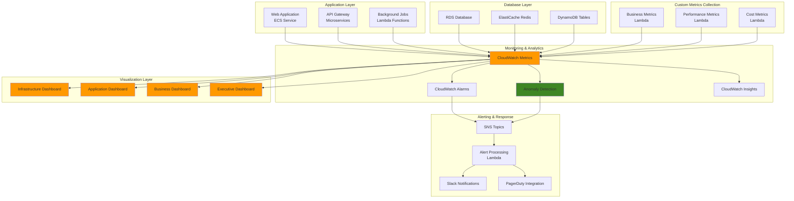

# Multi-Service Monitoring Dashboards

## Problem

Enterprise organizations running complex multi-service architectures struggle to maintain comprehensive visibility across their entire technology stack. Traditional monitoring approaches provide service-specific metrics but fail to deliver unified insights that correlate application performance with infrastructure health, user experience, and business outcomes. Operations teams need sophisticated dashboards that combine built-in AWS metrics with custom business metrics, implement intelligent anomaly detection, and provide actionable insights for proactive incident prevention and performance optimization.

## Solution

This solution implements an advanced monitoring dashboard ecosystem that aggregates metrics from multiple AWS services, creates custom business metrics through Lambda functions, and leverages CloudWatch anomaly detection for predictive alerting. The architecture combines infrastructure metrics (ECS, RDS, ElastiCache) with application-level metrics (API response times, business transactions) and establishes composite health scores that provide holistic system visibility across development, staging, and production environments.

## Architecture Diagram



## Prerequisites

1. AWS account with permissions for CloudWatch, Lambda, ECS, RDS, ElastiCache, and SNS
2. AWS CLI v2 installed and configured (or AWS CloudShell)
3. Understanding of CloudWatch metrics, dashboards, and anomaly detection
4. Knowledge of enterprise monitoring best practices and SLI/SLO concepts
5. Estimated cost: $50-100/month for comprehensive monitoring (includes custom metrics, anomaly detection, and alarm actions)

> **Note**: CloudWatch custom metrics cost $0.30 per metric per month. Plan your custom metrics strategy carefully to control costs.

## Preparation

```bash
# Set environment variables
export AWS_REGION=$(aws configure get region)
export AWS_ACCOUNT_ID=$(aws sts get-caller-identity \
    --query Account --output text)

# Generate unique identifiers for resources
RANDOM_SUFFIX=$(aws secretsmanager get-random-password \
    --exclude-punctuation --exclude-uppercase \
    --password-length 6 --require-each-included-type \
    --output text --query RandomPassword)

export PROJECT_NAME="advanced-monitoring-${RANDOM_SUFFIX}"
export LAMBDA_ROLE_NAME="${PROJECT_NAME}-lambda-role"
export SNS_TOPIC_NAME="${PROJECT_NAME}-alerts"
export DASHBOARD_PREFIX="${PROJECT_NAME}"

# Create IAM role for Lambda functions
aws iam create-role \
    --role-name ${LAMBDA_ROLE_NAME} \
    --assume-role-policy-document '{
        "Version": "2012-10-17",
        "Statement": [
            {
                "Effect": "Allow",
                "Principal": {
                    "Service": "lambda.amazonaws.com"
                },
                "Action": "sts:AssumeRole"
            }
        ]
    }'

# Attach necessary policies
aws iam attach-role-policy \
    --role-name ${LAMBDA_ROLE_NAME} \
    --policy-arn arn:aws:iam::aws:policy/service-role/AWSLambdaBasicExecutionRole

aws iam attach-role-policy \
    --role-name ${LAMBDA_ROLE_NAME} \
    --policy-arn arn:aws:iam::aws:policy/CloudWatchFullAccess

aws iam attach-role-policy \
    --role-name ${LAMBDA_ROLE_NAME} \
    --policy-arn arn:aws:iam::aws:policy/AmazonRDSReadOnlyAccess

aws iam attach-role-policy \
    --role-name ${LAMBDA_ROLE_NAME} \
    --policy-arn arn:aws:iam::aws:policy/AmazonElastiCacheReadOnlyAccess

echo "✅ IAM role created and policies attached"
```

## Steps

1. **Create SNS Topics for Different Alert Severities**:

   Amazon SNS provides the foundation for a robust alerting infrastructure that enables intelligent notification routing based on incident severity. Enterprise monitoring requires differentiated alerting strategies where critical production issues trigger immediate escalation to on-call engineers, while warning-level events inform operations teams without causing alert fatigue. This tiered approach ensures the right people receive the right information at the right time, optimizing incident response while minimizing operational overhead.

   ```bash
   # Create SNS topics for different alert types
   SNS_CRITICAL_ARN=$(aws sns create-topic \
       --name "${SNS_TOPIC_NAME}-critical" \
       --query TopicArn --output text)
   
   SNS_WARNING_ARN=$(aws sns create-topic \
       --name "${SNS_TOPIC_NAME}-warning" \
       --query TopicArn --output text)
   
   SNS_INFO_ARN=$(aws sns create-topic \
       --name "${SNS_TOPIC_NAME}-info" \
       --query TopicArn --output text)
   
   # Subscribe email to critical alerts
   aws sns subscribe \
       --topic-arn ${SNS_CRITICAL_ARN} \
       --protocol email \
       --notification-endpoint your-email@example.com
   
   echo "✅ SNS topics created for tiered alerting"
   echo "Critical alerts: ${SNS_CRITICAL_ARN}"
   echo "Warning alerts: ${SNS_WARNING_ARN}"
   echo "Info alerts: ${SNS_INFO_ARN}"
   ```

   The three-tier SNS topic structure now provides the messaging infrastructure for intelligent alert routing. Critical alerts will bypass normal notification channels and reach on-call engineers immediately, while warning and info alerts follow standard operational communication flows. This foundation supports advanced alerting patterns including escalation chains, alert suppression during maintenance windows, and integration with external incident management systems.

   > **Tip**: Configure SNS message attributes and filtering for advanced routing capabilities. This enables dynamic notification routing based on alert metadata, service tags, and business hours.

2. **Create Lambda Function for Business Metrics Collection**:

   Custom business metrics bridge the gap between technical infrastructure monitoring and business outcome tracking. While CloudWatch provides comprehensive infrastructure metrics, organizations need visibility into revenue performance, user engagement, and customer satisfaction metrics that directly correlate with business success. Lambda functions provide the ideal serverless compute platform for collecting, processing, and publishing these custom metrics to CloudWatch, enabling unified dashboards that combine technical and business KPIs for comprehensive organizational visibility.

   ```bash
   # Create business metrics Lambda function
   cat > /tmp/business-metrics.py << 'EOF'
   import json
   import boto3
   import random
   from datetime import datetime
   
   cloudwatch = boto3.client('cloudwatch')
   
   def lambda_handler(event, context):
       try:
           # Simulate business metrics (replace with real business logic)
           
           # Revenue metrics
           hourly_revenue = random.uniform(10000, 50000)
           transaction_count = random.randint(100, 1000)
           average_order_value = hourly_revenue / transaction_count
           
           # User engagement metrics
           active_users = random.randint(500, 5000)
           page_views = random.randint(10000, 50000)
           bounce_rate = random.uniform(0.2, 0.8)
           
           # Performance metrics
           api_response_time = random.uniform(100, 2000)
           error_rate = random.uniform(0.001, 0.05)
           throughput = random.randint(100, 1000)
           
           # Customer satisfaction
           nps_score = random.uniform(6.0, 9.5)
           support_ticket_volume = random.randint(5, 50)
           
           # Send custom metrics to CloudWatch
           metrics = [
               {
                   'MetricName': 'HourlyRevenue',
                   'Value': hourly_revenue,
                   'Unit': 'None',
                   'Dimensions': [
                       {'Name': 'Environment', 'Value': 'production'},
                       {'Name': 'BusinessUnit', 'Value': 'ecommerce'}
                   ]
               },
               {
                   'MetricName': 'TransactionCount',
                   'Value': transaction_count,
                   'Unit': 'Count',
                   'Dimensions': [
                       {'Name': 'Environment', 'Value': 'production'},
                       {'Name': 'BusinessUnit', 'Value': 'ecommerce'}
                   ]
               },
               {
                   'MetricName': 'AverageOrderValue',
                   'Value': average_order_value,
                   'Unit': 'None',
                   'Dimensions': [
                       {'Name': 'Environment', 'Value': 'production'},
                       {'Name': 'BusinessUnit', 'Value': 'ecommerce'}
                   ]
               },
               {
                   'MetricName': 'ActiveUsers',
                   'Value': active_users,
                   'Unit': 'Count',
                   'Dimensions': [
                       {'Name': 'Environment', 'Value': 'production'}
                   ]
               },
               {
                   'MetricName': 'APIResponseTime',
                   'Value': api_response_time,
                   'Unit': 'Milliseconds',
                   'Dimensions': [
                       {'Name': 'Environment', 'Value': 'production'},
                       {'Name': 'Service', 'Value': 'api-gateway'}
                   ]
               },
               {
                   'MetricName': 'ErrorRate',
                   'Value': error_rate,
                   'Unit': 'Percent',
                   'Dimensions': [
                       {'Name': 'Environment', 'Value': 'production'},
                       {'Name': 'Service', 'Value': 'api-gateway'}
                   ]
               },
               {
                   'MetricName': 'NPSScore',
                   'Value': nps_score,
                   'Unit': 'None',
                   'Dimensions': [
                       {'Name': 'Environment', 'Value': 'production'}
                   ]
               },
               {
                   'MetricName': 'SupportTicketVolume',
                   'Value': support_ticket_volume,
                   'Unit': 'Count',
                   'Dimensions': [
                       {'Name': 'Environment', 'Value': 'production'}
                   ]
               }
           ]
           
           # Submit metrics in batches
           for i in range(0, len(metrics), 20):
               batch = metrics[i:i+20]
               cloudwatch.put_metric_data(
                   Namespace='Business/Metrics',
                   MetricData=batch
               )
           
           # Calculate and submit composite health score
           health_score = calculate_health_score(
               api_response_time, error_rate, nps_score, 
               support_ticket_volume, active_users
           )
           
           cloudwatch.put_metric_data(
               Namespace='Business/Health',
               MetricData=[
                   {
                       'MetricName': 'CompositeHealthScore',
                       'Value': health_score,
                       'Unit': 'Percent',
                       'Dimensions': [
                           {'Name': 'Environment', 'Value': 'production'}
                       ]
                   }
               ]
           )
           
           return {
               'statusCode': 200,
               'body': json.dumps({
                   'message': 'Business metrics published successfully',
                   'health_score': health_score,
                   'metrics_count': len(metrics)
               })
           }
           
       except Exception as e:
           return {
               'statusCode': 500,
               'body': json.dumps({'error': str(e)})
           }
   
   def calculate_health_score(response_time, error_rate, nps, tickets, users):
       # Normalize metrics to 0-100 scale and weight them
       response_score = max(0, 100 - (response_time / 20))  # Lower is better
       error_score = max(0, 100 - (error_rate * 2000))      # Lower is better
       nps_score = (nps / 10) * 100                         # Higher is better
       ticket_score = max(0, 100 - (tickets * 2))          # Lower is better
       user_score = min(100, (users / 50))                 # Higher is better
       
       # Weighted average
       weights = [0.25, 0.30, 0.20, 0.15, 0.10]
       scores = [response_score, error_score, nps_score, ticket_score, user_score]
       
       return sum(w * s for w, s in zip(weights, scores))
   EOF
   
   # Create deployment package
   cd /tmp
   zip business-metrics.zip business-metrics.py
   
   # Create Lambda function
   aws lambda create-function \
       --function-name ${PROJECT_NAME}-business-metrics \
       --runtime python3.9 \
       --role arn:aws:iam::${AWS_ACCOUNT_ID}:role/${LAMBDA_ROLE_NAME} \
       --handler business-metrics.lambda_handler \
       --zip-file fileb://business-metrics.zip \
       --timeout 60 \
       --tags Project=${PROJECT_NAME}
   
   echo "✅ Business metrics Lambda function created"
   ```

   The business metrics collection function now enables real-time tracking of key business indicators alongside infrastructure performance data. The composite health score algorithm demonstrates how to create meaningful aggregated metrics that provide instant system status assessment. This approach transforms raw business data into actionable monitoring insights that help operations teams understand the business impact of technical decisions and infrastructure changes. Learn more about [CloudWatch custom metrics best practices](https://docs.aws.amazon.com/AmazonCloudWatch/latest/monitoring/publishingMetrics.html) for optimization strategies.

   > **Warning**: Custom business metrics should align with your organization's KPIs and be carefully designed to avoid metric explosion. Consider using metric filters and sampling patterns for high-volume metrics to control CloudWatch costs.

3. **Create Lambda Function for Infrastructure Health Monitoring**:

   Infrastructure health monitoring requires aggregating status information across multiple AWS services to create a unified view of system reliability. This Lambda function demonstrates how to programmatically assess the health of RDS databases, ElastiCache clusters, and compute resources, then calculate composite health scores that provide instant infrastructure status visibility. The health scoring algorithm weights different infrastructure components based on their criticality to overall system operation, enabling proactive identification of degraded services before they impact user experience.

   ```bash
   # Create infrastructure health Lambda function
   cat > /tmp/infrastructure-health.py << 'EOF'
   import json
   import boto3
   from datetime import datetime, timedelta
   
   cloudwatch = boto3.client('cloudwatch')
   rds = boto3.client('rds')
   elasticache = boto3.client('elasticache')
   ec2 = boto3.client('ec2')
   
   def lambda_handler(event, context):
       try:
           health_scores = {}
           
           # Check RDS health
           rds_health = check_rds_health()
           health_scores['RDS'] = rds_health
           
           # Check ElastiCache health
           cache_health = check_elasticache_health()
           health_scores['ElastiCache'] = cache_health
           
           # Check EC2/ECS health
           compute_health = check_compute_health()
           health_scores['Compute'] = compute_health
           
           # Calculate overall infrastructure health
           overall_health = sum(health_scores.values()) / len(health_scores)
           
           # Publish infrastructure health metrics
           metrics = []
           for service, score in health_scores.items():
               metrics.append({
                   'MetricName': f'{service}HealthScore',
                   'Value': score,
                   'Unit': 'Percent',
                   'Dimensions': [
                       {'Name': 'Service', 'Value': service},
                       {'Name': 'Environment', 'Value': 'production'}
                   ]
               })
           
           # Add overall health score
           metrics.append({
               'MetricName': 'OverallInfrastructureHealth',
               'Value': overall_health,
               'Unit': 'Percent',
               'Dimensions': [
                   {'Name': 'Environment', 'Value': 'production'}
               ]
           })
           
           cloudwatch.put_metric_data(
               Namespace='Infrastructure/Health',
               MetricData=metrics
           )
           
           return {
               'statusCode': 200,
               'body': json.dumps({
                   'health_scores': health_scores,
                   'overall_health': overall_health
               })
           }
           
       except Exception as e:
           return {
               'statusCode': 500,
               'body': json.dumps({'error': str(e)})
           }
   
   def check_rds_health():
       try:
           instances = rds.describe_db_instances()
           if not instances['DBInstances']:
               return 100  # No instances to monitor
           
           healthy_count = 0
           total_count = len(instances['DBInstances'])
           
           for instance in instances['DBInstances']:
               if instance['DBInstanceStatus'] == 'available':
                   healthy_count += 1
           
           return (healthy_count / total_count) * 100
       except:
           return 50  # Assume degraded if can't check
   
   def check_elasticache_health():
       try:
           clusters = elasticache.describe_cache_clusters()
           if not clusters['CacheClusters']:
               return 100  # No clusters to monitor
           
           healthy_count = 0
           total_count = len(clusters['CacheClusters'])
           
           for cluster in clusters['CacheClusters']:
               if cluster['CacheClusterStatus'] == 'available':
                   healthy_count += 1
           
           return (healthy_count / total_count) * 100
       except:
           return 50  # Assume degraded if can't check
   
   def check_compute_health():
       try:
           # Simplified compute health check
           # In reality, you'd check ECS services, task health, etc.
           instances = ec2.describe_instances(
               Filters=[
                   {'Name': 'instance-state-name', 'Values': ['running']}
               ]
           )
           
           total_instances = 0
           for reservation in instances['Reservations']:
               total_instances += len(reservation['Instances'])
           
           # Simple health heuristic based on running instances
           if total_instances == 0:
               return 100  # No instances to monitor
           elif total_instances >= 3:
               return 95   # Good redundancy
           elif total_instances >= 2:
               return 80   # Acceptable redundancy
           else:
               return 60   # Limited redundancy
               
       except:
           return 50  # Assume degraded if can't check
   EOF
   
   # Create deployment package
   cd /tmp
   zip infrastructure-health.zip infrastructure-health.py
   
   # Create Lambda function
   aws lambda create-function \
       --function-name ${PROJECT_NAME}-infrastructure-health \
       --runtime python3.9 \
       --role arn:aws:iam::${AWS_ACCOUNT_ID}:role/${LAMBDA_ROLE_NAME} \
       --handler infrastructure-health.lambda_handler \
       --zip-file fileb://infrastructure-health.zip \
       --timeout 120 \
       --tags Project=${PROJECT_NAME}
   
   echo "✅ Infrastructure health Lambda function created"
   ```

   The infrastructure health monitoring function provides automated assessment of critical system components, eliminating manual health checks and providing consistent health scoring across environments. This standardized approach to infrastructure health assessment enables predictive alerting when health scores trend downward, allowing teams to address issues before they impact user experience or business operations.

4. **Set Up Scheduled Metric Collection**:

   EventBridge provides enterprise-grade scheduling capabilities that ensure consistent metric collection intervals essential for accurate trend analysis and anomaly detection. The scheduling approach balances monitoring granularity with cost optimization - business metrics collected every 5 minutes provide near real-time business visibility, while infrastructure health checks every 10 minutes offer sufficient operational insight without excessive Lambda invocations. This balanced approach ensures comprehensive monitoring coverage while maintaining cost efficiency.

   ```bash
   # Create EventBridge rules for scheduled metric collection
   
   # Business metrics every 5 minutes
   aws events put-rule \
       --name "${PROJECT_NAME}-business-metrics" \
       --schedule-expression "rate(5 minutes)" \
       --state ENABLED \
       --description "Collect business metrics every 5 minutes"
   
   # Infrastructure health every 10 minutes
   aws events put-rule \
       --name "${PROJECT_NAME}-infrastructure-health" \
       --schedule-expression "rate(10 minutes)" \
       --state ENABLED \
       --description "Check infrastructure health every 10 minutes"
   
   # Add Lambda permissions for EventBridge
   aws lambda add-permission \
       --function-name ${PROJECT_NAME}-business-metrics \
       --statement-id "AllowEventBridge1" \
       --action "lambda:InvokeFunction" \
       --principal events.amazonaws.com \
       --source-arn "arn:aws:events:${AWS_REGION}:${AWS_ACCOUNT_ID}:rule/${PROJECT_NAME}-business-metrics"
   
   aws lambda add-permission \
       --function-name ${PROJECT_NAME}-infrastructure-health \
       --statement-id "AllowEventBridge2" \
       --action "lambda:InvokeFunction" \
       --principal events.amazonaws.com \
       --source-arn "arn:aws:events:${AWS_REGION}:${AWS_ACCOUNT_ID}:rule/${PROJECT_NAME}-infrastructure-health"
   
   # Create targets for the rules
   aws events put-targets \
       --rule "${PROJECT_NAME}-business-metrics" \
       --targets "Id"="1","Arn"="arn:aws:lambda:${AWS_REGION}:${AWS_ACCOUNT_ID}:function:${PROJECT_NAME}-business-metrics"
   
   aws events put-targets \
       --rule "${PROJECT_NAME}-infrastructure-health" \
       --targets "Id"="1","Arn"="arn:aws:lambda:${AWS_REGION}:${AWS_ACCOUNT_ID}:function:${PROJECT_NAME}-infrastructure-health"
   
   echo "✅ Scheduled metric collection configured"
   ```

   The automated scheduling infrastructure now ensures continuous metric collection without manual intervention. EventBridge's integration with Lambda provides reliable invocation patterns that maintain monitoring continuity even during infrastructure scaling events. This foundation enables consistent baseline establishment for anomaly detection algorithms and ensures metric history depth required for meaningful trend analysis and pattern recognition.

5. **Create Infrastructure Monitoring Dashboard**:

   CloudWatch dashboards provide centralized visualization that transforms raw metrics into actionable operational insights. The infrastructure dashboard design follows monitoring best practices by combining high-level health indicators with detailed service-specific metrics. This layered approach enables rapid problem identification through composite health scores while providing drill-down capabilities for detailed troubleshooting when issues are detected. The dashboard layout prioritizes critical information visibility for effective incident response.

   ```bash
   # Create comprehensive infrastructure dashboard
   cat > /tmp/infrastructure-dashboard.json << EOF
   {
       "widgets": [
           {
               "type": "metric",
               "x": 0,
               "y": 0,
               "width": 8,
               "height": 6,
               "properties": {
                   "metrics": [
                       ["Infrastructure/Health", "OverallInfrastructureHealth", "Environment", "production"],
                       ["Business/Health", "CompositeHealthScore", "Environment", "production"]
                   ],
                   "period": 300,
                   "stat": "Average",
                   "region": "${AWS_REGION}",
                   "title": "Overall System Health",
                   "yAxis": {
                       "left": {
                           "min": 0,
                           "max": 100
                       }
                   }
               }
           },
           {
               "type": "metric",
               "x": 8,
               "y": 0,
               "width": 8,
               "height": 6,
               "properties": {
                   "metrics": [
                       ["AWS/ECS", "CPUUtilization", "ServiceName", "web-service"],
                       ["AWS/ECS", "MemoryUtilization", "ServiceName", "web-service"]
                   ],
                   "period": 300,
                   "stat": "Average",
                   "region": "${AWS_REGION}",
                   "title": "ECS Service Utilization"
               }
           },
           {
               "type": "metric",
               "x": 16,
               "y": 0,
               "width": 8,
               "height": 6,
               "properties": {
                   "metrics": [
                       ["AWS/RDS", "CPUUtilization", "DBInstanceIdentifier", "production-db"],
                       ["AWS/RDS", "DatabaseConnections", "DBInstanceIdentifier", "production-db"],
                       ["AWS/RDS", "FreeableMemory", "DBInstanceIdentifier", "production-db"]
                   ],
                   "period": 300,
                   "stat": "Average",
                   "region": "${AWS_REGION}",
                   "title": "RDS Performance Metrics"
               }
           },
           {
               "type": "metric",
               "x": 0,
               "y": 6,
               "width": 12,
               "height": 6,
               "properties": {
                   "metrics": [
                       ["AWS/ElastiCache", "CPUUtilization", "CacheClusterId", "production-cache"],
                       ["AWS/ElastiCache", "CacheHits", "CacheClusterId", "production-cache"],
                       ["AWS/ElastiCache", "CacheMisses", "CacheClusterId", "production-cache"]
                   ],
                   "period": 300,
                   "stat": "Average",
                   "region": "${AWS_REGION}",
                   "title": "ElastiCache Performance"
               }
           },
           {
               "type": "metric",
               "x": 12,
               "y": 6,
               "width": 12,
               "height": 6,
               "properties": {
                   "metrics": [
                       ["Infrastructure/Health", "RDSHealthScore", "Service", "RDS", "Environment", "production"],
                       ["Infrastructure/Health", "ElastiCacheHealthScore", "Service", "ElastiCache", "Environment", "production"],
                       ["Infrastructure/Health", "ComputeHealthScore", "Service", "Compute", "Environment", "production"]
                   ],
                   "period": 300,
                   "stat": "Average",
                   "region": "${AWS_REGION}",
                   "title": "Service Health Scores",
                   "yAxis": {
                       "left": {
                           "min": 0,
                           "max": 100
                       }
                   }
               }
           }
       ]
   }
   EOF
   
   # Create infrastructure dashboard
   aws cloudwatch put-dashboard \
       --dashboard-name "${DASHBOARD_PREFIX}-Infrastructure" \
       --dashboard-body file:///tmp/infrastructure-dashboard.json
   
   echo "✅ Infrastructure monitoring dashboard created"
   ```

   The infrastructure dashboard now provides unified visibility across ECS services, RDS databases, and ElastiCache clusters. The dashboard design emphasizes operational efficiency by presenting critical health information prominently while organizing detailed metrics in logical groupings. This approach reduces mean time to detection (MTTD) for infrastructure issues and accelerates troubleshooting workflows by providing immediate access to relevant performance data.

6. **Create Business Metrics Dashboard**:

   Business metrics dashboards bridge the traditional gap between technical operations teams and business stakeholders by presenting revenue, user engagement, and customer satisfaction data in operational monitoring contexts. This approach enables correlation analysis between infrastructure performance and business outcomes, helping organizations understand how technical decisions impact business metrics and customer experience. The dashboard design facilitates data-driven decision making by providing clear visibility into business performance trends.

   ```bash
   # Create business metrics dashboard
   cat > /tmp/business-dashboard.json << EOF
   {
       "widgets": [
           {
               "type": "metric",
               "x": 0,
               "y": 0,
               "width": 8,
               "height": 6,
               "properties": {
                   "metrics": [
                       ["Business/Metrics", "HourlyRevenue", "Environment", "production", "BusinessUnit", "ecommerce"]
                   ],
                   "period": 300,
                   "stat": "Average",
                   "region": "${AWS_REGION}",
                   "title": "Hourly Revenue"
               }
           },
           {
               "type": "metric",
               "x": 8,
               "y": 0,
               "width": 8,
               "height": 6,
               "properties": {
                   "metrics": [
                       ["Business/Metrics", "TransactionCount", "Environment", "production", "BusinessUnit", "ecommerce"],
                       ["Business/Metrics", "ActiveUsers", "Environment", "production"]
                   ],
                   "period": 300,
                   "stat": "Sum",
                   "region": "${AWS_REGION}",
                   "title": "Transaction Volume & Active Users"
               }
           },
           {
               "type": "metric",
               "x": 16,
               "y": 0,
               "width": 8,
               "height": 6,
               "properties": {
                   "metrics": [
                       ["Business/Metrics", "AverageOrderValue", "Environment", "production", "BusinessUnit", "ecommerce"]
                   ],
                   "period": 300,
                   "stat": "Average",
                   "region": "${AWS_REGION}",
                   "title": "Average Order Value"
               }
           },
           {
               "type": "metric",
               "x": 0,
               "y": 6,
               "width": 12,
               "height": 6,
               "properties": {
                   "metrics": [
                       ["Business/Metrics", "APIResponseTime", "Environment", "production", "Service", "api-gateway"],
                       ["Business/Metrics", "ErrorRate", "Environment", "production", "Service", "api-gateway"]
                   ],
                   "period": 300,
                   "stat": "Average",
                   "region": "${AWS_REGION}",
                   "title": "API Performance Metrics"
               }
           },
           {
               "type": "metric",
               "x": 12,
               "y": 6,
               "width": 12,
               "height": 6,
               "properties": {
                   "metrics": [
                       ["Business/Metrics", "NPSScore", "Environment", "production"],
                       ["Business/Metrics", "SupportTicketVolume", "Environment", "production"]
                   ],
                   "period": 300,
                   "stat": "Average",
                   "region": "${AWS_REGION}",
                   "title": "Customer Satisfaction Metrics"
               }
           }
       ]
   }
   EOF
   
   # Create business dashboard
   aws cloudwatch put-dashboard \
       --dashboard-name "${DASHBOARD_PREFIX}-Business" \
       --dashboard-body file:///tmp/business-dashboard.json
   
   echo "✅ Business metrics dashboard created"
   ```

   The business dashboard establishes visibility into key performance indicators that directly impact organizational success. By presenting revenue trends, transaction volumes, and customer satisfaction metrics alongside technical performance data, operations teams can make informed decisions about infrastructure scaling and optimization that consider both technical efficiency and business impact. This unified view enables proactive business protection during technical incidents.

7. **Set Up Anomaly Detection for Key Metrics**:

   CloudWatch anomaly detection leverages machine learning algorithms to establish dynamic baselines for metric behavior, providing more intelligent alerting than static threshold-based approaches. This capability is particularly valuable for business metrics that exhibit natural variations due to seasonal patterns, promotional campaigns, or market conditions. Anomaly detection adapts to these patterns and identifies genuine outliers that require investigation, significantly reducing false positive alerts while improving detection accuracy.

   ```bash
   # Create anomaly detectors for critical business metrics
   
   # Revenue anomaly detection
   aws cloudwatch put-anomaly-detector \
       --namespace "Business/Metrics" \
       --metric-name "HourlyRevenue" \
       --dimensions Name=Environment,Value=production \
                   Name=BusinessUnit,Value=ecommerce \
       --stat "Average"
   
   # Response time anomaly detection
   aws cloudwatch put-anomaly-detector \
       --namespace "Business/Metrics" \
       --metric-name "APIResponseTime" \
       --dimensions Name=Environment,Value=production \
                   Name=Service,Value=api-gateway \
       --stat "Average"
   
   # Error rate anomaly detection
   aws cloudwatch put-anomaly-detector \
       --namespace "Business/Metrics" \
       --metric-name "ErrorRate" \
       --dimensions Name=Environment,Value=production \
                   Name=Service,Value=api-gateway \
       --stat "Average"
   
   # Infrastructure health anomaly detection
   aws cloudwatch put-anomaly-detector \
       --namespace "Infrastructure/Health" \
       --metric-name "OverallInfrastructureHealth" \
       --dimensions Name=Environment,Value=production \
       --stat "Average"
   
   echo "✅ Anomaly detection configured for key metrics"
   ```

   The anomaly detection configuration now provides intelligent monitoring that reduces false positive alerts while improving detection of genuine performance issues. The machine learning algorithms will learn normal patterns for revenue trends, API response times, and infrastructure health scores, enabling proactive identification of developing problems before they impact user experience or business operations. Explore [CloudWatch anomaly detection capabilities](https://docs.aws.amazon.com/AmazonCloudWatch/latest/monitoring/CloudWatch_Anomaly_Detection.html) for advanced configuration options.

8. **Create Intelligent Alarms with Anomaly Detection**:

   Anomaly-based alarms represent a significant advancement over traditional threshold-based alerting by dynamically adjusting alert conditions based on learned metric behavior patterns. This approach eliminates the need for manual threshold tuning while providing more accurate incident detection. The alarm configuration demonstrates how to combine anomaly detection with appropriate SNS topic routing to ensure critical issues trigger immediate response while reducing alert fatigue from normal metric variations.

   ```bash
   # Create anomaly-based alarms
   
   # Revenue anomaly alarm
   aws cloudwatch put-metric-alarm \
       --alarm-name "${PROJECT_NAME}-revenue-anomaly" \
       --alarm-description "Revenue anomaly detected" \
       --metric-name "HourlyRevenue" \
       --namespace "Business/Metrics" \
       --statistic "Average" \
       --period 300 \
       --threshold-metric-id "ad1" \
       --comparison-operator LessThanLowerThreshold \
       --dimensions Name=Environment,Value=production \
                   Name=BusinessUnit,Value=ecommerce \
       --evaluation-periods 2 \
       --alarm-actions ${SNS_CRITICAL_ARN} \
       --metrics '[
           {
               "Id": "m1",
               "MetricStat": {
                   "Metric": {
                       "Namespace": "Business/Metrics",
                       "MetricName": "HourlyRevenue",
                       "Dimensions": [
                           {"Name": "Environment", "Value": "production"},
                           {"Name": "BusinessUnit", "Value": "ecommerce"}
                       ]
                   },
                   "Period": 300,
                   "Stat": "Average"
               },
               "ReturnData": true
           },
           {
               "Id": "ad1",
               "Expression": "ANOMALY_DETECTION_BAND(m1, 2)"
           }
       ]'
   
   # Response time anomaly alarm
   aws cloudwatch put-metric-alarm \
       --alarm-name "${PROJECT_NAME}-response-time-anomaly" \
       --alarm-description "API response time anomaly detected" \
       --metric-name "APIResponseTime" \
       --namespace "Business/Metrics" \
       --statistic "Average" \
       --period 300 \
       --threshold-metric-id "ad2" \
       --comparison-operator GreaterThanUpperThreshold \
       --dimensions Name=Environment,Value=production \
                   Name=Service,Value=api-gateway \
       --evaluation-periods 2 \
       --alarm-actions ${SNS_WARNING_ARN} \
       --metrics '[
           {
               "Id": "m2",
               "MetricStat": {
                   "Metric": {
                       "Namespace": "Business/Metrics",
                       "MetricName": "APIResponseTime",
                       "Dimensions": [
                           {"Name": "Environment", "Value": "production"},
                           {"Name": "Service", "Value": "api-gateway"}
                       ]
                   },
                   "Period": 300,
                   "Stat": "Average"
               },
               "ReturnData": true
           },
           {
               "Id": "ad2",
               "Expression": "ANOMALY_DETECTION_BAND(m2, 2)"
           }
       ]'
   
   # Infrastructure health threshold alarm
   aws cloudwatch put-metric-alarm \
       --alarm-name "${PROJECT_NAME}-infrastructure-health-low" \
       --alarm-description "Infrastructure health score below threshold" \
       --metric-name "OverallInfrastructureHealth" \
       --namespace "Infrastructure/Health" \
       --statistic "Average" \
       --period 300 \
       --threshold 80 \
       --comparison-operator LessThanThreshold \
       --dimensions Name=Environment,Value=production \
       --evaluation-periods 2 \
       --alarm-actions ${SNS_CRITICAL_ARN}
   
   echo "✅ Intelligent alarms created with anomaly detection"
   ```

   The intelligent alerting system now provides adaptive monitoring that improves over time as the anomaly detection algorithms learn seasonal patterns and business cycles. This approach significantly reduces operational overhead by eliminating manual threshold management while improving detection accuracy for both technical and business metric anomalies. The system automatically adjusts to changing baseline conditions while maintaining sensitivity to genuine performance issues.

9. **Create Executive Summary Dashboard**:

   Executive dashboards serve a different audience than operational dashboards, focusing on high-level trends and business impact rather than detailed technical metrics. The design emphasizes single-value indicators and 24-hour trends that enable quick assessment of overall system and business health. This approach provides executives with the visibility they need for strategic decision-making without overwhelming them with operational details, while maintaining clear correlation between technical performance and business outcomes.

   ```bash
   # Create executive summary dashboard
   cat > /tmp/executive-dashboard.json << EOF
   {
       "widgets": [
           {
               "type": "metric",
               "x": 0,
               "y": 0,
               "width": 24,
               "height": 6,
               "properties": {
                   "metrics": [
                       ["Business/Health", "CompositeHealthScore", "Environment", "production"],
                       ["Infrastructure/Health", "OverallInfrastructureHealth", "Environment", "production"]
                   ],
                   "period": 3600,
                   "stat": "Average",
                   "region": "${AWS_REGION}",
                   "title": "System Health Overview (Last 24 Hours)",
                   "yAxis": {
                       "left": {
                           "min": 0,
                           "max": 100
                       }
                   },
                   "view": "timeSeries",
                   "stacked": false
               }
           },
           {
               "type": "metric",
               "x": 0,
               "y": 6,
               "width": 8,
               "height": 6,
               "properties": {
                   "metrics": [
                       ["Business/Metrics", "HourlyRevenue", "Environment", "production", "BusinessUnit", "ecommerce"]
                   ],
                   "period": 3600,
                   "stat": "Sum",
                   "region": "${AWS_REGION}",
                   "title": "Revenue Trend (24H)",
                   "view": "singleValue",
                   "setPeriodToTimeRange": true
               }
           },
           {
               "type": "metric",
               "x": 8,
               "y": 6,
               "width": 8,
               "height": 6,
               "properties": {
                   "metrics": [
                       ["Business/Metrics", "ActiveUsers", "Environment", "production"]
                   ],
                   "period": 3600,
                   "stat": "Average",
                   "region": "${AWS_REGION}",
                   "title": "Active Users (24H Avg)",
                   "view": "singleValue",
                   "setPeriodToTimeRange": true
               }
           },
           {
               "type": "metric",
               "x": 16,
               "y": 6,
               "width": 8,
               "height": 6,
               "properties": {
                   "metrics": [
                       ["Business/Metrics", "NPSScore", "Environment", "production"]
                   ],
                   "period": 3600,
                   "stat": "Average",
                   "region": "${AWS_REGION}",
                   "title": "Customer Satisfaction (NPS)",
                   "view": "singleValue",
                   "setPeriodToTimeRange": true
               }
           },
           {
               "type": "metric",
               "x": 0,
               "y": 12,
               "width": 12,
               "height": 6,
               "properties": {
                   "metrics": [
                       ["Business/Metrics", "ErrorRate", "Environment", "production", "Service", "api-gateway"]
                   ],
                   "period": 3600,
                   "stat": "Average",
                   "region": "${AWS_REGION}",
                   "title": "Error Rate Trend",
                   "yAxis": {
                       "left": {
                           "min": 0
                       }
                   }
               }
           },
           {
               "type": "metric",
               "x": 12,
               "y": 12,
               "width": 12,
               "height": 6,
               "properties": {
                   "metrics": [
                       ["AWS/Lambda", "Errors", "FunctionName", "${PROJECT_NAME}-business-metrics"],
                       ["AWS/Lambda", "Duration", "FunctionName", "${PROJECT_NAME}-business-metrics"]
                   ],
                   "period": 3600,
                   "stat": "Sum",
                   "region": "${AWS_REGION}",
                   "title": "Monitoring System Health"
               }
           }
       ]
   }
   EOF
   
   # Create executive dashboard
   aws cloudwatch put-dashboard \
       --dashboard-name "${DASHBOARD_PREFIX}-Executive" \
       --dashboard-body file:///tmp/executive-dashboard.json
   
   echo "✅ Executive summary dashboard created"
   ```

   The executive dashboard now provides leadership with essential business and technical health indicators in a format optimized for strategic decision-making. The focus on composite health scores and business outcome metrics enables executives to quickly assess organizational performance and understand the correlation between infrastructure investments and business results. This high-level view supports data-driven strategic planning and investment decisions.

10. **Generate Sample Data and Test Alarms**:

    Testing monitoring systems requires generating representative data that validates alarm conditions and dashboard functionality. This step demonstrates how to manually trigger metric collection functions and verify that the monitoring infrastructure operates correctly. Proper testing ensures that alarms will fire appropriately during actual incidents and that dashboards display meaningful information for operational decision-making.

    ```bash
    # Trigger metric collection to generate initial data
    aws lambda invoke \
        --function-name ${PROJECT_NAME}-business-metrics \
        --payload '{}' \
        /tmp/business-response.json
    
    aws lambda invoke \
        --function-name ${PROJECT_NAME}-infrastructure-health \
        --payload '{}' \
        /tmp/infra-response.json
    
    # Wait a moment for metrics to be available
    sleep 30
    
    # Test alarm state (they should be in INSUFFICIENT_DATA initially)
    aws cloudwatch describe-alarms \
        --alarm-name-prefix ${PROJECT_NAME} \
        --query 'MetricAlarms[*].{Name:AlarmName,State:StateValue,Reason:StateReason}' \
        --output table
    
    echo "✅ Sample data generated and alarm states checked"
    echo "Dashboards will populate with data over the next few minutes"
    ```

    The monitoring system validation confirms that all components are functioning correctly and collecting metrics as designed. The initial INSUFFICIENT_DATA alarm states are expected and will transition to normal monitoring states as the system accumulates baseline data for anomaly detection algorithms. This testing phase is crucial for ensuring monitoring reliability during actual production incidents.

11. **Create Cost Optimization Monitoring**:

    Cost monitoring integration provides essential financial visibility that complements technical and business metrics. By tracking daily cost trends alongside performance metrics, organizations can identify cost optimization opportunities and understand the financial impact of scaling decisions. This approach enables cost-conscious operations management and helps justify infrastructure investments through correlation with business outcomes and performance improvements.

    ```bash
    # Create Lambda function for cost monitoring
    cat > /tmp/cost-monitoring.py << 'EOF'
    import json
    import boto3
    from datetime import datetime, timedelta
    
    cloudwatch = boto3.client('cloudwatch')
    ce = boto3.client('ce')
    
    def lambda_handler(event, context):
        try:
            # Get cost data for the last 7 days
            end_date = datetime.now().date()
            start_date = end_date - timedelta(days=7)
            
            response = ce.get_cost_and_usage(
                TimePeriod={
                    'Start': start_date.strftime('%Y-%m-%d'),
                    'End': end_date.strftime('%Y-%m-%d')
                },
                Granularity='DAILY',
                Metrics=['BlendedCost'],
                GroupBy=[
                    {
                        'Type': 'DIMENSION',
                        'Key': 'SERVICE'
                    }
                ]
            )
            
            # Calculate daily cost trend
            daily_costs = []
            for result in response['ResultsByTime']:
                daily_cost = float(result['Total']['BlendedCost']['Amount'])
                daily_costs.append(daily_cost)
            
            # Calculate cost metrics
            if daily_costs:
                avg_daily_cost = sum(daily_costs) / len(daily_costs)
                latest_cost = daily_costs[-1]
                cost_trend = ((latest_cost - avg_daily_cost) / avg_daily_cost) * 100 if avg_daily_cost > 0 else 0
            else:
                avg_daily_cost = 0
                latest_cost = 0
                cost_trend = 0
            
            # Publish cost metrics
            cloudwatch.put_metric_data(
                Namespace='Cost/Management',
                MetricData=[
                    {
                        'MetricName': 'DailyCost',
                        'Value': latest_cost,
                        'Unit': 'None',
                        'Dimensions': [
                            {'Name': 'Environment', 'Value': 'production'}
                        ]
                    },
                    {
                        'MetricName': 'CostTrend',
                        'Value': cost_trend,
                        'Unit': 'Percent',
                        'Dimensions': [
                            {'Name': 'Environment', 'Value': 'production'}
                        ]
                    },
                    {
                        'MetricName': 'WeeklyAverageCost',
                        'Value': avg_daily_cost,
                        'Unit': 'None',
                        'Dimensions': [
                            {'Name': 'Environment', 'Value': 'production'}
                        ]
                    }
                ]
            )
            
            return {
                'statusCode': 200,
                'body': json.dumps({
                    'daily_cost': latest_cost,
                    'cost_trend': cost_trend,
                    'weekly_average': avg_daily_cost
                })
            }
            
        except Exception as e:
            return {
                'statusCode': 500,
                'body': json.dumps({'error': str(e)})
            }
    EOF
    
    # Create deployment package and function
    cd /tmp
    zip cost-monitoring.zip cost-monitoring.py
    
    aws lambda create-function \
        --function-name ${PROJECT_NAME}-cost-monitoring \
        --runtime python3.9 \
        --role arn:aws:iam::${AWS_ACCOUNT_ID}:role/${LAMBDA_ROLE_NAME} \
        --handler cost-monitoring.lambda_handler \
        --zip-file fileb://cost-monitoring.zip \
        --timeout 120 \
        --tags Project=${PROJECT_NAME}
    
    # Schedule daily cost monitoring
    aws events put-rule \
        --name "${PROJECT_NAME}-cost-monitoring" \
        --schedule-expression "rate(1 day)" \
        --state ENABLED \
        --description "Daily cost monitoring"
    
    aws lambda add-permission \
        --function-name ${PROJECT_NAME}-cost-monitoring \
        --statement-id "AllowEventBridge3" \
        --action "lambda:InvokeFunction" \
        --principal events.amazonaws.com \
        --source-arn "arn:aws:events:${AWS_REGION}:${AWS_ACCOUNT_ID}:rule/${PROJECT_NAME}-cost-monitoring"
    
    aws events put-targets \
        --rule "${PROJECT_NAME}-cost-monitoring" \
        --targets "Id"="1","Arn"="arn:aws:lambda:${AWS_REGION}:${AWS_ACCOUNT_ID}:function:${PROJECT_NAME}-cost-monitoring"
    
    echo "✅ Cost optimization monitoring configured"
    ```

    The cost monitoring capability now provides daily insights into spending patterns and cost trends that help operations teams make informed decisions about resource allocation and optimization. This financial visibility is essential for maintaining cost efficiency while ensuring adequate performance for business requirements, enabling proactive cost management rather than reactive budget management.

12. **Create Operational Runbook Dashboard**:

    Operational runbooks embedded within monitoring dashboards provide immediate access to troubleshooting information and system health details during incident response. This dashboard design combines error log analysis with monitoring system health metrics, enabling operations teams to quickly identify both application issues and potential problems with the monitoring infrastructure itself. The integrated approach reduces context switching during incidents and accelerates problem resolution.

    ```bash
    # Create operational runbook dashboard with troubleshooting widgets
    cat > /tmp/operational-dashboard.json << EOF
    {
        "widgets": [
            {
                "type": "log",
                "x": 0,
                "y": 0,
                "width": 24,
                "height": 6,
                "properties": {
                    "query": "SOURCE '/aws/lambda/${PROJECT_NAME}-business-metrics'\n| fields @timestamp, @message\n| filter @message like /ERROR/\n| sort @timestamp desc\n| limit 20",
                    "region": "${AWS_REGION}",
                    "title": "Recent Monitoring Errors",
                    "view": "table"
                }
            },
            {
                "type": "metric",
                "x": 0,
                "y": 6,
                "width": 8,
                "height": 6,
                "properties": {
                    "metrics": [
                        ["AWS/Lambda", "Invocations", "FunctionName", "${PROJECT_NAME}-business-metrics"],
                        ["AWS/Lambda", "Errors", "FunctionName", "${PROJECT_NAME}-business-metrics"],
                        ["AWS/Lambda", "Duration", "FunctionName", "${PROJECT_NAME}-business-metrics"]
                    ],
                    "period": 300,
                    "stat": "Sum",
                    "region": "${AWS_REGION}",
                    "title": "Monitoring Function Health"
                }
            },
            {
                "type": "metric",
                "x": 8,
                "y": 6,
                "width": 8,
                "height": 6,
                "properties": {
                    "metrics": [
                        ["AWS/SNS", "NumberOfMessagesSent", "TopicName", "${SNS_TOPIC_NAME}-critical"],
                        ["AWS/SNS", "NumberOfNotificationsFailed", "TopicName", "${SNS_TOPIC_NAME}-critical"]
                    ],
                    "period": 300,
                    "stat": "Sum",
                    "region": "${AWS_REGION}",
                    "title": "Alert Delivery Status"
                }
            },
            {
                "type": "metric",
                "x": 16,
                "y": 6,
                "width": 8,
                "height": 6,
                "properties": {
                    "metrics": [
                        ["Cost/Management", "DailyCost", "Environment", "production"],
                        ["Cost/Management", "CostTrend", "Environment", "production"]
                    ],
                    "period": 86400,
                    "stat": "Average",
                    "region": "${AWS_REGION}",
                    "title": "Cost Monitoring"
                }
            }
        ]
    }
    EOF
    
    # Create operational dashboard
    aws cloudwatch put-dashboard \
        --dashboard-name "${DASHBOARD_PREFIX}-Operations" \
        --dashboard-body file:///tmp/operational-dashboard.json
    
    echo "✅ Operational runbook dashboard created"
    echo ""
    echo "Dashboard URLs:"
    echo "Infrastructure: https://console.aws.amazon.com/cloudwatch/home?region=${AWS_REGION}#dashboards:name=${DASHBOARD_PREFIX}-Infrastructure"
    echo "Business: https://console.aws.amazon.com/cloudwatch/home?region=${AWS_REGION}#dashboards:name=${DASHBOARD_PREFIX}-Business"
    echo "Executive: https://console.aws.amazon.com/cloudwatch/home?region=${AWS_REGION}#dashboards:name=${DASHBOARD_PREFIX}-Executive"
    echo "Operations: https://console.aws.amazon.com/cloudwatch/home?region=${AWS_REGION}#dashboards:name=${DASHBOARD_PREFIX}-Operations"
    ```

    The comprehensive dashboard ecosystem now provides role-specific monitoring views that serve different organizational needs. The four-dashboard approach ensures that technical teams, business stakeholders, executives, and operations personnel each have access to relevant information presented in formats optimized for their responsibilities and decision-making requirements. Explore [CloudWatch dashboard best practices](https://docs.aws.amazon.com/AmazonCloudWatch/latest/monitoring/CloudWatch_Dashboards.html) for advanced visualization techniques and operational efficiency optimization.

## Validation & Testing

1. **Verify Dashboard Creation and Data Population**:

   ```bash
   # List created dashboards
   aws cloudwatch list-dashboards \
       --dashboard-name-prefix ${DASHBOARD_PREFIX} \
       --query 'DashboardEntries[*].{Name:DashboardName,LastModified:LastModified}' \
       --output table
   ```

   Expected output: List of four dashboards (Infrastructure, Business, Executive, Operations)

2. **Test Custom Metric Generation**:

   ```bash
   # Check if custom metrics are being generated
   aws cloudwatch list-metrics \
       --namespace "Business/Metrics" \
       --query 'Metrics[*].{MetricName:MetricName,Dimensions:Dimensions}' \
       --output table
   ```

   Expected output: List of business metrics including HourlyRevenue, TransactionCount, etc.

3. **Verify Anomaly Detection Setup**:

   ```bash
   # Check anomaly detectors
   aws cloudwatch describe-anomaly-detectors \
       --query 'AnomalyDetectors[*].{Namespace:Namespace,MetricName:MetricName,Stat:Stat}' \
       --output table
   ```

   Expected output: Anomaly detectors for revenue, response time, error rate, and infrastructure health

4. **Test Alarm Configuration**:

   ```bash
   # Check alarm states and configuration
   aws cloudwatch describe-alarms \
       --alarm-name-prefix ${PROJECT_NAME} \
       --query 'MetricAlarms[*].{Name:AlarmName,State:StateValue,Threshold:Threshold,ComparisonOperator:ComparisonOperator}' \
       --output table
   ```

   Expected output: List of alarms with their current states and thresholds

5. **Validate Metric Data Points**:

   ```bash
   # Get recent metric data to verify collection is working
   aws cloudwatch get-metric-statistics \
       --namespace "Business/Health" \
       --metric-name "CompositeHealthScore" \
       --dimensions Name=Environment,Value=production \
       --start-time $(date -u -d '1 hour ago' +%Y-%m-%dT%H:%M:%S) \
       --end-time $(date -u +%Y-%m-%dT%H:%M:%S) \
       --period 300 \
       --statistics Average \
       --query 'Datapoints[*].{Timestamp:Timestamp,Value:Average}' \
       --output table
   ```

   Expected output: Recent data points showing health score values

## Cleanup

1. **Delete CloudWatch Dashboards**:

   ```bash
   # Delete all dashboards
   aws cloudwatch delete-dashboards \
       --dashboard-names "${DASHBOARD_PREFIX}-Infrastructure" \
                        "${DASHBOARD_PREFIX}-Business" \
                        "${DASHBOARD_PREFIX}-Executive" \
                        "${DASHBOARD_PREFIX}-Operations"
   
   echo "✅ CloudWatch dashboards deleted"
   ```

2. **Delete CloudWatch Alarms and Anomaly Detectors**:

   ```bash
   # Delete alarms
   ALARM_NAMES=$(aws cloudwatch describe-alarms \
       --alarm-name-prefix ${PROJECT_NAME} \
       --query 'MetricAlarms[*].AlarmName' \
       --output text)
   
   if [ -n "$ALARM_NAMES" ]; then
       aws cloudwatch delete-alarms --alarm-names $ALARM_NAMES
       echo "✅ CloudWatch alarms deleted"
   fi
   
   # Delete anomaly detectors
   aws cloudwatch delete-anomaly-detector \
       --namespace "Business/Metrics" \
       --metric-name "HourlyRevenue" \
       --dimensions Name=Environment,Value=production \
                   Name=BusinessUnit,Value=ecommerce \
       --stat "Average"
   
   aws cloudwatch delete-anomaly-detector \
       --namespace "Business/Metrics" \
       --metric-name "APIResponseTime" \
       --dimensions Name=Environment,Value=production \
                   Name=Service,Value=api-gateway \
       --stat "Average"
   
   aws cloudwatch delete-anomaly-detector \
       --namespace "Business/Metrics" \
       --metric-name "ErrorRate" \
       --dimensions Name=Environment,Value=production \
                   Name=Service,Value=api-gateway \
       --stat "Average"
   
   aws cloudwatch delete-anomaly-detector \
       --namespace "Infrastructure/Health" \
       --metric-name "OverallInfrastructureHealth" \
       --dimensions Name=Environment,Value=production \
       --stat "Average"
   
   echo "✅ Anomaly detectors deleted"
   ```

3. **Remove EventBridge Rules and Targets**:

   ```bash
   # Remove targets from EventBridge rules
   aws events remove-targets \
       --rule "${PROJECT_NAME}-business-metrics" \
       --ids "1"
   
   aws events remove-targets \
       --rule "${PROJECT_NAME}-infrastructure-health" \
       --ids "1"
   
   aws events remove-targets \
       --rule "${PROJECT_NAME}-cost-monitoring" \
       --ids "1"
   
   # Delete EventBridge rules
   aws events delete-rule \
       --name "${PROJECT_NAME}-business-metrics"
   
   aws events delete-rule \
       --name "${PROJECT_NAME}-infrastructure-health"
   
   aws events delete-rule \
       --name "${PROJECT_NAME}-cost-monitoring"
   
   echo "✅ EventBridge rules deleted"
   ```

4. **Delete Lambda Functions**:

   ```bash
   # Delete Lambda functions
   aws lambda delete-function \
       --function-name ${PROJECT_NAME}-business-metrics
   
   aws lambda delete-function \
       --function-name ${PROJECT_NAME}-infrastructure-health
   
   aws lambda delete-function \
       --function-name ${PROJECT_NAME}-cost-monitoring
   
   echo "✅ Lambda functions deleted"
   ```

5. **Delete SNS Topics and IAM Role**:

   ```bash
   # Delete SNS topics
   aws sns delete-topic --topic-arn ${SNS_CRITICAL_ARN}
   aws sns delete-topic --topic-arn ${SNS_WARNING_ARN}
   aws sns delete-topic --topic-arn ${SNS_INFO_ARN}
   
   # Detach policies from IAM role
   aws iam detach-role-policy \
       --role-name ${LAMBDA_ROLE_NAME} \
       --policy-arn arn:aws:iam::aws:policy/service-role/AWSLambdaBasicExecutionRole
   
   aws iam detach-role-policy \
       --role-name ${LAMBDA_ROLE_NAME} \
       --policy-arn arn:aws:iam::aws:policy/CloudWatchFullAccess
   
   aws iam detach-role-policy \
       --role-name ${LAMBDA_ROLE_NAME} \
       --policy-arn arn:aws:iam::aws:policy/AmazonRDSReadOnlyAccess
   
   aws iam detach-role-policy \
       --role-name ${LAMBDA_ROLE_NAME} \
       --policy-arn arn:aws:iam::aws:policy/AmazonElastiCacheReadOnlyAccess
   
   # Delete IAM role
   aws iam delete-role \
       --role-name ${LAMBDA_ROLE_NAME}
   
   # Clean up local files
   rm -f /tmp/business-metrics.py /tmp/business-metrics.zip
   rm -f /tmp/infrastructure-health.py /tmp/infrastructure-health.zip
   rm -f /tmp/cost-monitoring.py /tmp/cost-monitoring.zip
   rm -f /tmp/*-dashboard.json
   rm -f /tmp/business-response.json /tmp/infra-response.json
   
   echo "✅ Cleanup complete"
   ```

## Discussion

This advanced monitoring solution demonstrates enterprise-grade observability practices that go beyond basic CloudWatch metrics. By combining infrastructure monitoring with business metrics, the solution provides comprehensive visibility into both technical performance and business outcomes. The implementation showcases key enterprise monitoring concepts including composite health scores, anomaly detection, tiered alerting, and role-specific dashboards.

The custom metrics collection approach enables organizations to track business-specific KPIs alongside traditional infrastructure metrics. This correlation between technical performance and business impact is crucial for prioritizing incidents and understanding the business value of infrastructure investments. The composite health score algorithm demonstrates how to create meaningful aggregated metrics that provide quick system status assessment.

Anomaly detection represents a significant advancement over static threshold-based alerting. By using machine learning to establish normal metric patterns, the system can detect subtle performance degradations that might be missed by traditional alerting approaches. This proactive monitoring capability is essential for maintaining high service availability in complex distributed systems.

The multi-tier dashboard approach serves different organizational needs: technical teams require detailed infrastructure metrics, business stakeholders need revenue and user experience insights, and executives need high-level health summaries. This layered approach to monitoring visualization ensures that each audience receives relevant information without being overwhelmed by unnecessary detail.

Cost monitoring integration demonstrates the importance of financial observability in cloud environments. By tracking cost trends alongside performance metrics, organizations can identify cost optimization opportunities and understand the financial impact of scaling decisions.

> **Tip**: Implement SLI (Service Level Indicators) and SLO (Service Level Objectives) metrics based on your business requirements. Use composite scores to track SLO compliance and alert when SLOs are at risk.

## Challenge

Extend this solution by implementing these enhancements:

1. **Implement SLI/SLO tracking** with automated SLO compliance reporting and burn rate alerting for different service tiers and customer segments.

2. **Create predictive analytics capabilities** using Amazon Forecast to predict resource utilization and business metrics, enabling proactive capacity planning.

3. **Build automated root cause analysis** using CloudWatch Insights correlations and machine learning to automatically identify the most likely causes of performance issues.

4. **Implement multi-region monitoring correlation** to track performance across different AWS regions and identify regional performance variations.

5. **Create intelligent alert fatigue reduction** using machine learning to group related alerts, suppress duplicate notifications, and prioritize critical issues based on business impact.

## Infrastructure Code

*Infrastructure code will be generated after recipe approval.*