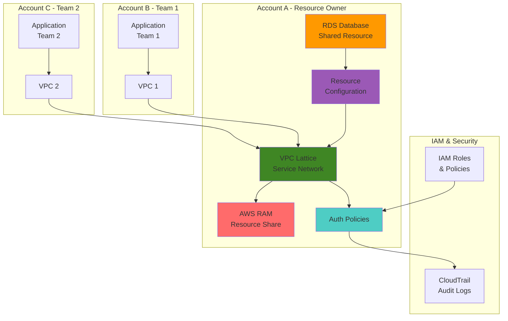

# Multi-Tenant Resource Sharing with VPC Lattice and RAM

## Problem

Organizations with multiple development teams or business units often struggle with securely sharing resources like databases, APIs, and services across different AWS accounts or VPCs without compromising security boundaries. Traditional approaches require complex VPC peering, transit gateways, or duplicate resource provisioning, leading to increased costs, operational overhead, and potential security vulnerabilities. Teams need a solution that enables controlled, policy-driven resource sharing while maintaining strict access controls and audit capabilities.

## Solution

Create a multi-tenant architecture using Amazon VPC Lattice as the application networking layer combined with AWS Resource Access Manager (RAM) for secure cross-account resource sharing. VPC Lattice provides service networks with fine-grained authentication policies, while AWS RAM enables sharing of resources like RDS databases across organizational boundaries. This approach delivers centralized resource management with distributed access control, reducing operational complexity while maintaining enterprise-grade security.

## Architecture Diagram



## Prerequisites

1. AWS CLI v2 installed and configured with appropriate permissions
2. Multiple AWS accounts or cross-account access for testing (minimum 2 accounts)
3. IAM permissions for VPC Lattice, AWS RAM, RDS, and IAM operations
4. Understanding of AWS networking concepts and IAM policies
5. Estimated cost: $12-18 for RDS instance and associated resources during testing period

> **Note**: This recipe requires cross-account permissions. Ensure you have access to at least two AWS accounts or work with your AWS administrator to set up proper IAM roles.

## Preparation

```bash
# Set environment variables
export AWS_REGION=$(aws configure get region)
export AWS_ACCOUNT_ID=$(aws sts get-caller-identity \
    --query Account --output text)

# Generate unique identifiers for resources
RANDOM_SUFFIX=$(aws secretsmanager get-random-password \
    --exclude-punctuation --exclude-uppercase \
    --password-length 6 --require-each-included-type \
    --output text --query RandomPassword)

# Set resource names
export SERVICE_NETWORK_NAME="multitenant-network-${RANDOM_SUFFIX}"
export RDS_INSTANCE_ID="shared-db-${RANDOM_SUFFIX}"
export RAM_SHARE_NAME="database-share-${RANDOM_SUFFIX}"
export VPC_ID=$(aws ec2 describe-vpcs --filters "Name=is-default,Values=true" \
    --query "Vpcs[0].VpcId" --output text)

# Create IAM role for VPC Lattice
aws iam create-role \
    --role-name VPCLatticeServiceRole-${RANDOM_SUFFIX} \
    --assume-role-policy-document '{
        "Version": "2012-10-17",
        "Statement": [{
            "Effect": "Allow",
            "Principal": {"Service": "vpc-lattice.amazonaws.com"},
            "Action": "sts:AssumeRole"
        }]
    }'

echo "✅ AWS environment configured with unique suffix: ${RANDOM_SUFFIX}"
```

## Steps

1. **Create VPC Lattice Service Network**:

   Amazon VPC Lattice service networks provide a logical boundary for connecting and managing services across multiple VPCs and accounts. The service network acts as a centralized hub that enables secure communication between services while applying consistent security policies. This foundational component ensures that all inter-service communication is authenticated, authorized, and auditable, following the AWS Well-Architected Framework's security pillar by implementing defense in depth.

   ```bash
   # Create the service network with IAM authentication
   SERVICE_NETWORK_ARN=$(aws vpc-lattice create-service-network \
       --name ${SERVICE_NETWORK_NAME} \
       --auth-type IAM \
       --query "arn" --output text)
   
   # Store the service network ID for later use
   SERVICE_NETWORK_ID=$(echo ${SERVICE_NETWORK_ARN} | \
       awk -F'/' '{print $NF}')
   
   echo "✅ Service network created: ${SERVICE_NETWORK_ID}"
   ```

   The service network is now established with IAM-based authentication, providing the foundation for secure multi-tenant resource access. This centralized networking layer will manage all communication between shared resources and consumer applications while maintaining strict access controls.

2. **Associate VPC with Service Network**:

   VPC association enables resources within the VPC to participate in the service network. This step establishes the network connectivity required for applications to access shared resources through VPC Lattice's managed networking infrastructure. The association creates a secure tunnel that abstracts underlying network complexity while providing consistent connectivity patterns.

   ```bash
   # Associate the default VPC with the service network
   VPC_ASSOCIATION_ARN=$(aws vpc-lattice create-service-network-vpc-association \
       --service-network-identifier ${SERVICE_NETWORK_ID} \
       --vpc-identifier ${VPC_ID} \
       --query "arn" --output text)
   
   # Wait for association to complete before proceeding
   echo "Waiting for VPC association to complete..."
   while true; do
     STATUS=$(aws vpc-lattice get-service-network-vpc-association \
         --service-network-vpc-association-identifier ${VPC_ASSOCIATION_ARN} \
         --query "status" --output text)
     if [[ "$STATUS" == "ACTIVE" ]]; then
       break
     fi
     echo "Current status: $STATUS. Waiting..."
     sleep 10
   done
   
   echo "✅ VPC associated with service network"
   ```

   The VPC is now connected to the service network, enabling applications within this VPC to discover and access shared resources through VPC Lattice's service discovery mechanisms with built-in load balancing and health checking capabilities.

3. **Create RDS Database Instance**:

   Amazon RDS provides the shared database resource that will be accessed by multiple tenants. Creating a database instance with appropriate security groups and parameter groups ensures that the resource can be securely shared while maintaining isolation between different tenant workloads. This approach follows AWS security best practices by implementing encryption at rest and network-level access controls.

   ```bash
   # Create DB subnet group for multi-AZ deployment
   aws rds create-db-subnet-group \
       --db-subnet-group-name shared-db-subnet-${RANDOM_SUFFIX} \
       --db-subnet-group-description "Shared database subnet group" \
       --subnet-ids $(aws ec2 describe-subnets \
           --filters "Name=vpc-id,Values=${VPC_ID}" \
           --query "Subnets[0:2].SubnetId" \
           --output text | tr '\t' ' ')
   
   # Create security group for RDS with least privilege access
   SG_ID=$(aws ec2 create-security-group \
       --group-name shared-db-sg-${RANDOM_SUFFIX} \
       --description "Security group for shared database" \
       --vpc-id ${VPC_ID} \
       --query "GroupId" --output text)
   
   # Allow MySQL/Aurora access only from within the VPC
   aws ec2 authorize-security-group-ingress \
       --group-id ${SG_ID} \
       --protocol tcp \
       --port 3306 \
       --source-group ${SG_ID}
   
   # Create RDS instance with encryption enabled
   aws rds create-db-instance \
       --db-instance-identifier ${RDS_INSTANCE_ID} \
       --db-instance-class db.t3.micro \
       --engine mysql \
       --master-username admin \
       --master-user-password TempPassword123! \
       --allocated-storage 20 \
       --vpc-security-group-ids ${SG_ID} \
       --db-subnet-group-name shared-db-subnet-${RANDOM_SUFFIX} \
       --no-publicly-accessible \
       --storage-encrypted \
       --backup-retention-period 7 \
       --tags Key=Environment,Value=Multi-Tenant \
       Key=Purpose,Value=SharedResource
   
   echo "✅ RDS instance creation initiated with encryption"
   ```

   The RDS instance is being created with enterprise-grade security configurations including encryption at rest, automated backups, and network isolation. This database will serve as the shared resource that multiple tenants can access through VPC Lattice with proper authentication and authorization.

4. **Wait for RDS Instance Availability**:

   ```bash
   # Wait for RDS instance to become available (typically 5-10 minutes)
   echo "Waiting for RDS instance to become available..."
   aws rds wait db-instance-available \
       --db-instance-identifier ${RDS_INSTANCE_ID}
   
   # Get the RDS endpoint for resource configuration
   RDS_ENDPOINT=$(aws rds describe-db-instances \
       --db-instance-identifier ${RDS_INSTANCE_ID} \
       --query "DBInstances[0].Endpoint.Address" \
       --output text)
   
   echo "✅ RDS instance available at: ${RDS_ENDPOINT}"
   ```

5. **Create Resource Configuration for RDS**:

   VPC Lattice resource configurations represent external resources like databases that can be accessed through the service network. This abstraction layer enables VPC Lattice to apply authentication policies and provide service discovery capabilities for non-containerized resources. Resource configurations bridge traditional infrastructure with modern service mesh capabilities, enabling unified access control policies across diverse resource types.

   ```bash
   # Create resource configuration for the RDS instance
   RESOURCE_CONFIG_ARN=$(aws vpc-lattice create-resource-configuration \
       --name "shared-database-${RANDOM_SUFFIX}" \
       --type SINGLE \
       --resource-gateway-identifier ${VPC_ID} \
       --resource-configuration-definition ipResource='{ipAddress='${RDS_ENDPOINT}'}' \
       --port-ranges "3306" \
       --protocol TCP \
       --allow-association-to-shareable-service-network \
       --query "arn" --output text)
   
   # Extract resource configuration ID for later use
   RESOURCE_CONFIG_ID=$(echo ${RESOURCE_CONFIG_ARN} | \
       awk -F'/' '{print $NF}')
   
   echo "✅ Resource configuration created: ${RESOURCE_CONFIG_ID}"
   ```

   The resource configuration now represents the RDS database within VPC Lattice's service mesh, enabling policy-based access control and centralized monitoring of database connections. This configuration allows VPC Lattice to treat the database as a first-class service within the network.

6. **Associate Resource Configuration with Service Network**:

   Associating the resource configuration with the service network makes the database accessible to all authorized consumers within the network. This step completes the integration between the traditional RDS instance and the modern VPC Lattice service mesh, enabling centralized policy enforcement and observability.

   ```bash
   # Associate the resource configuration with the service network
   RESOURCE_ASSOC_ARN=$(aws vpc-lattice create-resource-configuration-association \
       --resource-configuration-identifier ${RESOURCE_CONFIG_ID} \
       --service-network-identifier ${SERVICE_NETWORK_ID} \
       --query "arn" --output text)
   
   # Wait for association to become active
   echo "Waiting for resource configuration association..."
   sleep 30
   
   echo "✅ Resource configuration associated with service network"
   ```

7. **Create AWS RAM Resource Share**:

   AWS Resource Access Manager enables sharing of the VPC Lattice service network across AWS accounts or organizational units. This capability allows other accounts to associate their VPCs with the shared service network, providing access to the resources within it while maintaining proper access controls. RAM sharing follows the principle of least privilege by requiring explicit acceptance of shared resources.

   ```bash
   # Create resource share for the service network
   RESOURCE_SHARE_ARN=$(aws ram create-resource-share \
       --name ${RAM_SHARE_NAME} \
       --resource-arns ${SERVICE_NETWORK_ARN} \
       --principals $(aws organizations describe-organization \
           --query "Organization.Id" --output text 2>/dev/null || echo "123456789012") \
       --allow-external-principals false \
       --tags Key=Purpose,Value=MultiTenantSharing \
       --query "resourceShare.resourceShareArn" --output text)
   
   echo "✅ Resource share created: ${RESOURCE_SHARE_ARN}"
   ```

   The AWS RAM resource share is now configured to share the VPC Lattice service network with specified accounts or organizational units, enabling controlled multi-tenant access to the shared resources while maintaining organizational boundaries.

8. **Create Authentication Policy for Multi-Tenant Access**:

   VPC Lattice authentication policies provide fine-grained access control by specifying which principals can access specific resources and under what conditions. These policies work in conjunction with IAM to ensure both service-level and resource-level authorization. The policy implements attribute-based access control (ABAC) using principal tags and contextual conditions for enhanced security.

   ```bash
   # Create comprehensive auth policy with team-based access control
   cat > auth-policy.json << EOF
   {
     "Version": "2012-10-17",
     "Statement": [
       {
         "Effect": "Allow",
         "Principal": "*",
         "Action": "vpc-lattice-svcs:Invoke",
         "Resource": "*",
         "Condition": {
           "StringEquals": {
             "aws:PrincipalTag/Team": ["TeamA", "TeamB"]
           },
           "DateGreaterThan": {
             "aws:CurrentTime": "2025-01-01T00:00:00Z"
           },
           "IpAddress": {
             "aws:SourceIp": ["10.0.0.0/8", "172.16.0.0/12", "192.168.0.0/16"]
           }
         }
       },
       {
         "Effect": "Allow",
         "Principal": {
           "AWS": "arn:aws:iam::${AWS_ACCOUNT_ID}:root"
         },
         "Action": "vpc-lattice-svcs:Invoke",
         "Resource": "*"
       }
     ]
   }
   EOF
   
   # Apply auth policy to service network
   aws vpc-lattice put-auth-policy \
       --resource-identifier ${SERVICE_NETWORK_ID} \
       --policy file://auth-policy.json
   
   echo "✅ Authentication policy applied to service network"
   ```

   The authentication policy is now active, restricting access to the shared resources based on IAM principal tags, time-based conditions, and source IP addresses. This multi-layered security approach ensures that only authorized tenants with appropriate team tags can access the shared database from approved network locations.

9. **Create IAM Roles for Different Tenants**:

   Creating dedicated IAM roles for each tenant team enables proper access segregation and supports the authentication policy requirements. These roles incorporate team-specific tags that work with the VPC Lattice auth policy to provide granular access control. This approach follows IAM best practices by implementing role-based access control (RBAC) with additional attribute-based constraints.

   ```bash
   # Create IAM role for Team A with proper tags
   aws iam create-role \
       --role-name TeamA-DatabaseAccess-${RANDOM_SUFFIX} \
       --assume-role-policy-document '{
           "Version": "2012-10-17",
           "Statement": [{
               "Effect": "Allow",
               "Principal": {"AWS": "arn:aws:iam::'${AWS_ACCOUNT_ID}':root"},
               "Action": "sts:AssumeRole",
               "Condition": {
                   "StringEquals": {
                       "sts:ExternalId": "TeamA-Access"
                   }
               }
           }]
       }' \
       --tags Key=Team,Value=TeamA Key=Purpose,Value=DatabaseAccess
   
   # Create IAM role for Team B with proper tags
   aws iam create-role \
       --role-name TeamB-DatabaseAccess-${RANDOM_SUFFIX} \
       --assume-role-policy-document '{
           "Version": "2012-10-17",
           "Statement": [{
               "Effect": "Allow",
               "Principal": {"AWS": "arn:aws:iam::'${AWS_ACCOUNT_ID}':root"},
               "Action": "sts:AssumeRole",
               "Condition": {
                   "StringEquals": {
                       "sts:ExternalId": "TeamB-Access"
                   }
               }
           }]
       }' \
       --tags Key=Team,Value=TeamB Key=Purpose,Value=DatabaseAccess
   
   # Attach VPC Lattice invoke policy to both roles
   aws iam attach-role-policy \
       --role-name TeamA-DatabaseAccess-${RANDOM_SUFFIX} \
       --policy-arn arn:aws:iam::aws:policy/VPCLatticeServicesInvokeAccess
   
   aws iam attach-role-policy \
       --role-name TeamB-DatabaseAccess-${RANDOM_SUFFIX} \
       --policy-arn arn:aws:iam::aws:policy/VPCLatticeServicesInvokeAccess
   
   echo "✅ IAM roles created for different tenant teams"
   ```

   The IAM roles are now configured with team-specific tags and external ID conditions, providing a secure foundation for multi-tenant access. These roles enable proper segregation of access while supporting the attribute-based access control implemented in the VPC Lattice auth policy.

10. **Configure CloudTrail for Audit Logging**:

    CloudTrail provides comprehensive audit logging for all VPC Lattice and AWS RAM operations, essential for compliance and security monitoring in multi-tenant environments. This configuration captures all API calls, policy changes, and access attempts, providing the audit trail required for regulatory compliance and security incident investigation.

    ```bash
    # Create S3 bucket for CloudTrail logs with proper naming
    TRAIL_BUCKET="lattice-audit-logs-${RANDOM_SUFFIX}"
    aws s3 mb s3://${TRAIL_BUCKET} --region ${AWS_REGION}
    
    # Apply bucket policy for CloudTrail access
    cat > bucket-policy.json << EOF
    {
        "Version": "2012-10-17",
        "Statement": [
            {
                "Effect": "Allow",
                "Principal": {
                    "Service": "cloudtrail.amazonaws.com"
                },
                "Action": "s3:PutObject",
                "Resource": "arn:aws:s3:::${TRAIL_BUCKET}/AWSLogs/${AWS_ACCOUNT_ID}/*",
                "Condition": {
                    "StringEquals": {
                        "s3:x-amz-acl": "bucket-owner-full-control"
                    }
                }
            },
            {
                "Effect": "Allow",
                "Principal": {
                    "Service": "cloudtrail.amazonaws.com"
                },
                "Action": "s3:GetBucketAcl",
                "Resource": "arn:aws:s3:::${TRAIL_BUCKET}"
            }
        ]
    }
    EOF
    
    # Apply the bucket policy
    aws s3api put-bucket-policy \
        --bucket ${TRAIL_BUCKET} \
        --policy file://bucket-policy.json
    
    # Create CloudTrail with comprehensive logging
    aws cloudtrail create-trail \
        --name "VPCLatticeAuditTrail-${RANDOM_SUFFIX}" \
        --s3-bucket-name ${TRAIL_BUCKET} \
        --include-global-service-events \
        --is-multi-region-trail \
        --enable-log-file-validation \
        --event-selectors '[{
            "ReadWriteType": "All",
            "IncludeManagementEvents": true,
            "DataResources": []
        }]'
    
    # Start logging
    aws cloudtrail start-logging \
        --name "VPCLatticeAuditTrail-${RANDOM_SUFFIX}"
    
    # Clean up policy file
    rm -f bucket-policy.json
    
    echo "✅ CloudTrail configured for comprehensive audit logging"
    ```

## Validation & Testing

1. **Verify Service Network Configuration**:

   ```bash
   # Check service network status and configuration
   aws vpc-lattice get-service-network \
       --service-network-identifier ${SERVICE_NETWORK_ID} \
       --query "{Name:name,Status:status,AuthType:authType,Arn:arn}"
   ```

   Expected output: Service network should show "ACTIVE" status with IAM auth type and the correct ARN.

2. **Test Resource Configuration Access**:

   ```bash
   # List resource configurations in the service network
   aws vpc-lattice list-resource-configurations \
       --query "items[?name=='shared-database-${RANDOM_SUFFIX}'].{Name:name,Type:type,Status:status,Arn:arn}" \
       --output table
   ```

   Expected output: Resource configuration should show "ACTIVE" status with the database name and SINGLE type.

3. **Verify AWS RAM Resource Share**:

   ```bash
   # Check resource share status and associated resources
   aws ram get-resource-shares \
       --name ${RAM_SHARE_NAME} \
       --resource-owner SELF \
       --query "resourceShares[0].{Name:name,Status:status,Arn:resourceShareArn}"
   ```

   Expected output: Should return "ACTIVE" status with the correct share name and ARN.

4. **Test IAM Role Access and Tags**:

   ```bash
   # Verify Team A role exists with correct tags
   aws iam get-role \
       --role-name TeamA-DatabaseAccess-${RANDOM_SUFFIX} \
       --query "Role.{RoleName:RoleName,Tags:Tags}" \
       --output table
   
   # Test role assumption (this validates the trust policy)
   TEAM_A_CREDS=$(aws sts assume-role \
       --role-arn arn:aws:iam::${AWS_ACCOUNT_ID}:role/TeamA-DatabaseAccess-${RANDOM_SUFFIX} \
       --role-session-name TeamATest \
       --external-id TeamA-Access \
       --query "Credentials.{AccessKeyId:AccessKeyId,SecretAccessKey:SecretAccessKey,SessionToken:SessionToken}" \
       --output json)
   
   if [[ $? -eq 0 ]]; then
       echo "✅ Successfully assumed Team A role"
   else
       echo "❌ Failed to assume Team A role"
   fi
   ```

5. **Verify Authentication Policy and CloudTrail**:

   ```bash
   # Get the current auth policy
   aws vpc-lattice get-auth-policy \
       --resource-identifier ${SERVICE_NETWORK_ID} \
       --query "policy" --output text | jq .
   
   # Check CloudTrail status
   aws cloudtrail get-trail-status \
       --name "VPCLatticeAuditTrail-${RANDOM_SUFFIX}" \
       --query "{IsLogging:IsLogging,LatestDeliveryTime:LatestCloudWatchLogsDeliveryTime}"
   ```

   Expected output: Should show the JSON policy with team-based conditions and CloudTrail should show logging enabled.

## Cleanup

1. **Remove CloudTrail and S3 bucket**:

   ```bash
   # Stop CloudTrail logging
   aws cloudtrail stop-logging \
       --name "VPCLatticeAuditTrail-${RANDOM_SUFFIX}"
   
   # Delete CloudTrail
   aws cloudtrail delete-trail \
       --name "VPCLatticeAuditTrail-${RANDOM_SUFFIX}"
   
   # Empty and delete S3 bucket
   aws s3 rm s3://${TRAIL_BUCKET} --recursive
   aws s3 rb s3://${TRAIL_BUCKET}
   
   echo "✅ CloudTrail and audit bucket removed"
   ```

2. **Delete IAM roles and policies**:

   ```bash
   # Detach policies and delete roles
   aws iam detach-role-policy \
       --role-name TeamA-DatabaseAccess-${RANDOM_SUFFIX} \
       --policy-arn arn:aws:iam::aws:policy/VPCLatticeServicesInvokeAccess
   
   aws iam detach-role-policy \
       --role-name TeamB-DatabaseAccess-${RANDOM_SUFFIX} \
       --policy-arn arn:aws:iam::aws:policy/VPCLatticeServicesInvokeAccess
   
   aws iam delete-role --role-name TeamA-DatabaseAccess-${RANDOM_SUFFIX}
   aws iam delete-role --role-name TeamB-DatabaseAccess-${RANDOM_SUFFIX}
   aws iam delete-role --role-name VPCLatticeServiceRole-${RANDOM_SUFFIX}
   
   echo "✅ IAM roles deleted"
   ```

3. **Remove AWS RAM resource share**:

   ```bash
   # Delete resource share
   aws ram delete-resource-share \
       --resource-share-arn ${RESOURCE_SHARE_ARN}
   
   echo "✅ AWS RAM resource share deleted"
   ```

4. **Remove VPC Lattice resources**:

   ```bash
   # Remove auth policy
   aws vpc-lattice delete-auth-policy \
       --resource-identifier ${SERVICE_NETWORK_ID}
   
   # Disassociate resource configuration
   aws vpc-lattice delete-resource-configuration-association \
       --resource-configuration-identifier ${RESOURCE_CONFIG_ID} \
       --service-network-identifier ${SERVICE_NETWORK_ID}
   
   # Wait for disassociation to complete
   sleep 30
   
   # Delete resource configuration
   aws vpc-lattice delete-resource-configuration \
       --resource-configuration-identifier ${RESOURCE_CONFIG_ID}
   
   # Disassociate VPC
   aws vpc-lattice delete-service-network-vpc-association \
       --service-network-vpc-association-identifier ${VPC_ASSOCIATION_ARN}
   
   # Wait for VPC disassociation
   sleep 30
   
   # Delete service network
   aws vpc-lattice delete-service-network \
       --service-network-identifier ${SERVICE_NETWORK_ID}
   
   echo "✅ VPC Lattice resources deleted"
   ```

5. **Remove RDS instance and related resources**:

   ```bash
   # Delete RDS instance
   aws rds delete-db-instance \
       --db-instance-identifier ${RDS_INSTANCE_ID} \
       --skip-final-snapshot
   
   # Wait for RDS deletion (this may take 5-10 minutes)
   echo "Waiting for RDS instance deletion..."
   aws rds wait db-instance-deleted \
       --db-instance-identifier ${RDS_INSTANCE_ID}
   
   # Delete security group
   aws ec2 delete-security-group --group-id ${SG_ID}
   
   # Delete DB subnet group
   aws rds delete-db-subnet-group \
       --db-subnet-group-name shared-db-subnet-${RANDOM_SUFFIX}
   
   # Clean up local files
   rm -f auth-policy.json
   
   echo "✅ All resources cleaned up successfully"
   ```

## Discussion

This multi-tenant architecture demonstrates how Amazon VPC Lattice and AWS Resource Access Manager work together to solve complex resource sharing challenges in modern cloud environments. VPC Lattice serves as an application networking service that provides centralized connectivity, security, and observability for services across multiple VPCs and accounts. Unlike traditional networking approaches that require complex VPC peering or transit gateway configurations, VPC Lattice abstracts the underlying network complexity while providing fine-grained access controls through authentication policies that align with the AWS Well-Architected Framework's security pillar.

The integration with AWS RAM enables sharing of VPC Lattice service networks across organizational boundaries, which is particularly valuable for enterprises with multiple AWS accounts or business units. This approach reduces resource duplication and operational overhead while maintaining strict security boundaries following the principle of least privilege. The authentication policies in VPC Lattice provide an additional layer of security by enabling attribute-based access control (ABAC) using IAM principal tags, time-based conditions, IP address restrictions, and other contextual factors. This multi-layered security approach ensures defense in depth while maintaining operational flexibility.

Resource configurations in VPC Lattice represent a paradigm shift from traditional service mesh architectures by enabling the inclusion of non-containerized resources like RDS databases, ElastiCache clusters, and other AWS managed services within the service mesh. This capability bridges the gap between legacy applications and modern microservices architectures, providing a unified approach to service connectivity and security policies. The abstraction layer enables consistent policy enforcement across diverse resource types while maintaining the operational characteristics specific to each service.

The comprehensive audit capabilities provided by CloudTrail integration ensure compliance with enterprise governance requirements by logging all access attempts, policy changes, and resource operations. This audit trail is essential for meeting regulatory requirements such as SOC 2, PCI DSS, and GDPR, and for investigating security incidents in multi-tenant environments. The combination of preventive controls (IAM policies, VPC Lattice auth policies) and detective controls (CloudTrail logging) provides a robust security posture for shared resources.

> **Tip**: Use VPC Lattice's built-in observability features with Amazon CloudWatch to monitor service-to-service communication patterns, track performance metrics, and identify potential security or performance issues across your multi-tenant architecture. Enable VPC Flow Logs for additional network-level monitoring.

For comprehensive guidance on implementing these patterns, refer to the [Amazon VPC Lattice User Guide](https://docs.aws.amazon.com/vpc-lattice/latest/ug/what-is-vpc-lattice.html), [AWS RAM User Guide](https://docs.aws.amazon.com/ram/latest/userguide/what-is.html), [VPC Lattice Authentication Policies Documentation](https://docs.aws.amazon.com/vpc-lattice/latest/ug/auth-policies.html), [AWS Resource Access Manager Best Practices](https://docs.aws.amazon.com/ram/latest/userguide/getting-started-sharing.html), the [Building Scalable Multi-VPC Network Infrastructure](https://docs.aws.amazon.com/whitepapers/latest/building-scalable-secure-multi-vpc-network-infrastructure/vpc-lattice.html) whitepaper, and the [AWS Well-Architected Security Pillar](https://docs.aws.amazon.com/wellarchitected/latest/security-pillar/welcome.html) for comprehensive architectural guidance on implementing secure multi-tenant systems.

## Challenge

Extend this multi-tenant architecture by implementing these advanced capabilities:

1. **Implement traffic routing policies** - Configure weighted routing and canary deployments using VPC Lattice service rules to enable blue-green deployments for shared services across tenant boundaries, with automated rollback capabilities based on CloudWatch metrics.

2. **Add cross-region resource sharing** - Extend the architecture to share resources across multiple AWS regions using cross-region VPC Lattice service networks and AWS RAM resource shares, implementing disaster recovery scenarios with automated failover.

3. **Integrate with AWS Organizations** - Implement organizational unit (OU) based resource sharing policies that automatically grant access to new accounts added to specific OUs, with automated compliance checking using AWS Config rules.

4. **Implement advanced monitoring and alerting** - Deploy comprehensive observability using AWS X-Ray distributed tracing, custom CloudWatch metrics, VPC Flow Logs, and Amazon EventBridge to monitor inter-tenant communication patterns and detect anomalous behavior.

5. **Add cost allocation and chargeback** - Implement detailed cost tracking and allocation across tenants using AWS Cost and Usage Reports, resource tagging strategies, and automated billing reports to enable accurate cost distribution in shared environments.

## Infrastructure Code

*Infrastructure code will be generated after recipe approval.*