# Monitoring Network Traffic with VPC Flow Logs

## Problem

Organizations need comprehensive visibility into their network traffic patterns to detect security threats, optimize performance, and troubleshoot connectivity issues. Traditional network monitoring approaches often lack the granular detail needed to identify anomalous behavior, monitor traffic flows between resources, and provide actionable insights for security teams. Without proper network monitoring, organizations struggle to detect suspicious activities, unauthorized access attempts, and performance bottlenecks that could impact business operations.

## Solution

This solution implements a comprehensive network monitoring system using VPC Flow Logs integrated with CloudWatch for real-time alerting, S3 for cost-effective storage, and Athena for advanced analytics. The architecture captures network traffic metadata, processes it through CloudWatch Logs, stores historical data in S3, and provides automated alerting capabilities to detect anomalies and security threats.

## Architecture Diagram

```mermaid
graph TB
    subgraph "VPC Network"
        VPC[VPC]
        EC2[EC2 Instances]
        ELB[Load Balancer]
        VPC --> EC2
        VPC --> ELB
    end
    
    subgraph "Flow Logs Collection"
        FL[VPC Flow Logs]
        VPC --> FL
    end
    
    subgraph "Real-Time Processing"
        CWL[CloudWatch Logs]
        CWM[CloudWatch Metrics]
        CWA[CloudWatch Alarms]
        FL --> CWL
        CWL --> CWM
        CWM --> CWA
    end
    
    subgraph "Storage & Analytics"
        S3[S3 Bucket]
        ATHENA[Athena]
        FL --> S3
        S3 --> ATHENA
    end
    
    subgraph "Alerting"
        SNS[SNS Topic]
        LAMBDA[Lambda Function]
        CWA --> SNS
        CWL --> LAMBDA
        LAMBDA --> SNS
    end
    
    style FL fill:#FF9900
    style CWL fill:#3F8624
    style S3 fill:#569A31
    style ATHENA fill:#232F3E
```



## Prerequisites

1. AWS account with appropriate permissions for VPC, CloudWatch, S3, and Athena
2. AWS CLI v2 installed and configured (or AWS CloudShell)
3. Existing VPC with active network traffic for meaningful monitoring
4. Understanding of network traffic patterns and CloudWatch concepts
5. Estimated cost: $20-50/month for moderate traffic volumes (varies by data ingestion and storage)

> **Note**: VPC Flow Logs incur charges for data ingestion to CloudWatch Logs and S3 storage. Monitor your usage to avoid unexpected costs.

## Preparation

```bash
# Set environment variables
export AWS_REGION=$(aws configure get region)
export AWS_ACCOUNT_ID=$(aws sts get-caller-identity \
    --query Account --output text)

# Generate unique identifiers for resources
RANDOM_SUFFIX=$(aws secretsmanager get-random-password \
    --exclude-punctuation --exclude-uppercase \
    --password-length 6 --require-each-included-type \
    --output text --query RandomPassword)

# Set resource names
export VPC_FLOW_LOGS_BUCKET="vpc-flow-logs-${AWS_ACCOUNT_ID}-${RANDOM_SUFFIX}"
export FLOW_LOGS_GROUP="/aws/vpc/flowlogs"
export FLOW_LOGS_ROLE_NAME="VPCFlowLogsRole-${RANDOM_SUFFIX}"
export SNS_TOPIC_NAME="network-monitoring-alerts-${RANDOM_SUFFIX}"
export LAMBDA_FUNCTION_NAME="network-anomaly-detector-${RANDOM_SUFFIX}"

# Get default VPC ID for demonstration
export VPC_ID=$(aws ec2 describe-vpcs \
    --filters "Name=is-default,Values=true" \
    --query 'Vpcs[0].VpcId' --output text)

echo "✅ Environment configured"
echo "VPC ID: ${VPC_ID}"
echo "S3 Bucket: ${VPC_FLOW_LOGS_BUCKET}"
```

## Steps

1. **Create S3 Bucket for Flow Logs Storage**:

   Amazon S3 provides the foundational storage layer for our network monitoring solution, offering 99.999999999% (11 9's) durability and virtually unlimited scalability. S3 serves as the cost-effective long-term repository for VPC Flow Logs data, enabling historical analysis and compliance retention while supporting advanced analytics through Amazon Athena.

   ```bash
   # Create S3 bucket for flow logs
   aws s3api create-bucket \
       --bucket ${VPC_FLOW_LOGS_BUCKET} \
       --region ${AWS_REGION} \
       --create-bucket-configuration LocationConstraint=${AWS_REGION}
   
   # Enable versioning for data protection
   aws s3api put-bucket-versioning \
       --bucket ${VPC_FLOW_LOGS_BUCKET} \
       --versioning-configuration Status=Enabled
   
   # Configure lifecycle policy for cost optimization
   aws s3api put-bucket-lifecycle-configuration \
       --bucket ${VPC_FLOW_LOGS_BUCKET} \
       --lifecycle-configuration file://lifecycle-policy.json
   
   echo "✅ S3 bucket created and configured"
   ```

   The S3 bucket is now configured with versioning enabled to protect against accidental data loss and lifecycle policies to automatically transition older flow logs to cheaper storage classes. This establishes the scalable foundation for storing potentially terabytes of network traffic metadata while optimizing costs through intelligent data lifecycle management.

2. **Create IAM Role for VPC Flow Logs**:

   IAM roles enable secure, temporary credential delegation following the principle of least privilege. For VPC Flow Logs, we need a service-linked role that allows the AWS VPC Flow Logs service to write data to CloudWatch Logs on your behalf. This approach eliminates the need for long-term access keys while providing granular permission control for enhanced security.

   ```bash
   # Create trust policy for VPC Flow Logs
   cat > flow-logs-trust-policy.json << EOF
   {
       "Version": "2012-10-17",
       "Statement": [
           {
               "Effect": "Allow",
               "Principal": {
                   "Service": "vpc-flow-logs.amazonaws.com"
               },
               "Action": "sts:AssumeRole"
           }
       ]
   }
   EOF
   
   # Create IAM role
   aws iam create-role \
       --role-name ${FLOW_LOGS_ROLE_NAME} \
       --assume-role-policy-document file://flow-logs-trust-policy.json
   
   # Attach policy for CloudWatch Logs
   aws iam attach-role-policy \
       --role-name ${FLOW_LOGS_ROLE_NAME} \
       --policy-arn arn:aws:iam::aws:policy/service-role/VPCFlowLogsDeliveryRolePolicy
   
   # Get role ARN
   FLOW_LOGS_ROLE_ARN=$(aws iam get-role \
       --role-name ${FLOW_LOGS_ROLE_NAME} \
       --query 'Role.Arn' --output text)
   
   echo "✅ IAM role created: ${FLOW_LOGS_ROLE_ARN}"
   ```

   The IAM role is now established with the necessary trust relationship and permissions. This security foundation enables VPC Flow Logs to securely deliver network traffic metadata to CloudWatch Logs using temporary credentials, ensuring secure access without exposing long-term keys or overly broad permissions.

3. **Create CloudWatch Log Group**:

   CloudWatch Logs provides real-time ingestion and processing capabilities for VPC Flow Logs data, enabling immediate alerting and analysis. Log groups organize and manage log streams while providing features like retention policies, metric filters, and subscription filters that are essential for monitoring and alerting workflows.

   ```bash
   # Create log group for VPC Flow Logs
   aws logs create-log-group \
       --log-group-name ${FLOW_LOGS_GROUP}
   
   # Set retention period (30 days)
   aws logs put-retention-policy \
       --log-group-name ${FLOW_LOGS_GROUP} \
       --retention-in-days 30
   
   # Add tags for cost tracking
   aws logs tag-log-group \
       --log-group-name ${FLOW_LOGS_GROUP} \
       --tags "Purpose=NetworkMonitoring,Environment=Production"
   
   echo "✅ CloudWatch Log Group created"
   ```

   The CloudWatch Log Group is now ready to receive VPC Flow Logs data with a 30-day retention policy that balances real-time monitoring needs with cost optimization. The tags enable detailed cost tracking and resource management, while the log group structure prepares the foundation for creating metric filters and alarms that detect network anomalies.

4. **Create VPC Flow Logs with Dual Destinations**:

   VPC Flow Logs capture network traffic metadata including source/destination IPs, ports, protocols, and traffic statistics, providing comprehensive visibility into network communications. The dual-destination approach maximizes both real-time monitoring capabilities and cost-effective long-term storage, enabling immediate threat detection while supporting forensic analysis and compliance requirements.

   ```bash
   # Create flow log for CloudWatch Logs (real-time monitoring)
   FLOW_LOG_CW_ID=$(aws ec2 create-flow-logs \
       --resource-type VPC \
       --resource-ids ${VPC_ID} \
       --traffic-type ALL \
       --log-destination-type cloud-watch-logs \
       --log-group-name ${FLOW_LOGS_GROUP} \
       --deliver-logs-permission-arn ${FLOW_LOGS_ROLE_ARN} \
       --max-aggregation-interval 60 \
       --query 'FlowLogIds[0]' --output text)
   
   # Create flow log for S3 (long-term storage and analytics)
   FLOW_LOG_S3_ID=$(aws ec2 create-flow-logs \
       --resource-type VPC \
       --resource-ids ${VPC_ID} \
       --traffic-type ALL \
       --log-destination-type s3 \
       --log-destination "arn:aws:s3:::${VPC_FLOW_LOGS_BUCKET}/vpc-flow-logs/" \
       --log-format '${version} ${account-id} ${interface-id} ${srcaddr} ${dstaddr} ${srcport} ${dstport} ${protocol} ${packets} ${bytes} ${start} ${end} ${action} ${log-status} ${vpc-id} ${subnet-id} ${instance-id} ${tcp-flags} ${type} ${pkt-srcaddr} ${pkt-dstaddr}' \
       --max-aggregation-interval 60 \
       --query 'FlowLogIds[0]' --output text)
   
   echo "✅ VPC Flow Logs created"
   echo "CloudWatch Flow Log ID: ${FLOW_LOG_CW_ID}"
   echo "S3 Flow Log ID: ${FLOW_LOG_S3_ID}"
   ```

   VPC Flow Logs are now actively capturing network traffic metadata from all interfaces in the VPC. The 60-second aggregation interval balances data granularity with cost efficiency, while the custom log format includes additional fields like TCP flags and packet addresses that enhance security analysis capabilities. This dual-stream approach ensures both immediate alerting through CloudWatch and cost-effective long-term analytics through S3.

5. **Create SNS Topic for Alerting**:

   Amazon SNS provides reliable, scalable messaging for distributing network security alerts to multiple subscribers and endpoints. SNS ensures critical network events reach the right people immediately, supporting email, SMS, webhook, and Lambda function destinations for comprehensive incident response workflows.

   ```bash
   # Create SNS topic for alerts
   SNS_TOPIC_ARN=$(aws sns create-topic \
       --name ${SNS_TOPIC_NAME} \
       --query 'TopicArn' --output text)
   
   # Subscribe email for notifications (replace with your email)
   aws sns subscribe \
       --topic-arn ${SNS_TOPIC_ARN} \
       --protocol email \
       --notification-endpoint your-email@example.com
   
   echo "✅ SNS topic created: ${SNS_TOPIC_ARN}"
   echo "Please check your email and confirm the subscription"
   ```

   The SNS topic establishes the communication backbone for network security alerts, enabling rapid notification of security events to operations teams. This publish-subscribe pattern supports multiple notification channels and can be easily extended to integrate with ticketing systems, Slack channels, or automated response functions.

6. **Create Custom CloudWatch Metrics**:

   CloudWatch metric filters transform raw log data into actionable metrics that can trigger automated responses. These filters analyze VPC Flow Logs in real-time to detect suspicious network patterns like connection rejections, unusual data transfers, and external communications that might indicate security threats or policy violations.

   ```bash
   # Create custom metric filters for suspicious activity
   
   # Filter for rejected connections
   aws logs put-metric-filter \
       --log-group-name ${FLOW_LOGS_GROUP} \
       --filter-name "RejectedConnections" \
       --filter-pattern '[version, account, eni, source, destination, srcport, destport, protocol, packets, bytes, windowstart, windowend, action="REJECT", flowlogstatus]' \
       --metric-transformations \
           metricName=RejectedConnections,metricNamespace=VPC/FlowLogs,metricValue=1
   
   # Filter for high data transfer
   aws logs put-metric-filter \
       --log-group-name ${FLOW_LOGS_GROUP} \
       --filter-name "HighDataTransfer" \
       --filter-pattern '[version, account, eni, source, destination, srcport, destport, protocol, packets, bytes>10000000, windowstart, windowend, action, flowlogstatus]' \
       --metric-transformations \
           metricName=HighDataTransfer,metricNamespace=VPC/FlowLogs,metricValue=1
   
   # Filter for external connections
   aws logs put-metric-filter \
       --log-group-name ${FLOW_LOGS_GROUP} \
       --filter-name "ExternalConnections" \
       --filter-pattern '[version, account, eni, source!="10.*" && source!="172.16.*" && source!="192.168.*", destination, srcport, destport, protocol, packets, bytes, windowstart, windowend, action, flowlogstatus]' \
       --metric-transformations \
           metricName=ExternalConnections,metricNamespace=VPC/FlowLogs,metricValue=1
   
   echo "✅ Custom CloudWatch metrics created"
   ```

   These metric filters now actively monitor network traffic patterns and convert relevant events into CloudWatch metrics. The rejected connections filter identifies potential security group misconfigurations or attack attempts, the high data transfer filter detects unusual bandwidth usage that might indicate data exfiltration, and the external connections filter tracks communications with non-RFC1918 addresses that could signal unauthorized external access.

7. **Create CloudWatch Alarms**:

   CloudWatch Alarms provide automated monitoring and alerting based on metric thresholds, enabling proactive response to network security events. These alarms evaluate metric trends over time to distinguish between normal traffic variations and genuine security concerns, reducing false positives while ensuring critical events trigger immediate notifications.

   ```bash
   # Alarm for excessive rejected connections
   aws cloudwatch put-metric-alarm \
       --alarm-name "VPC-High-Rejected-Connections" \
       --alarm-description "Alert when rejected connections exceed threshold" \
       --metric-name RejectedConnections \
       --namespace VPC/FlowLogs \
       --statistic Sum \
       --period 300 \
       --threshold 50 \
       --comparison-operator GreaterThanThreshold \
       --evaluation-periods 2 \
       --alarm-actions ${SNS_TOPIC_ARN}
   
   # Alarm for high data transfer
   aws cloudwatch put-metric-alarm \
       --alarm-name "VPC-High-Data-Transfer" \
       --alarm-description "Alert when high data transfer detected" \
       --metric-name HighDataTransfer \
       --namespace VPC/FlowLogs \
       --statistic Sum \
       --period 300 \
       --threshold 10 \
       --comparison-operator GreaterThanThreshold \
       --evaluation-periods 1 \
       --alarm-actions ${SNS_TOPIC_ARN}
   
   # Alarm for external connections
   aws cloudwatch put-metric-alarm \
       --alarm-name "VPC-External-Connections" \
       --alarm-description "Alert when external connections exceed threshold" \
       --metric-name ExternalConnections \
       --namespace VPC/FlowLogs \
       --statistic Sum \
       --period 300 \
       --threshold 100 \
       --comparison-operator GreaterThanThreshold \
       --evaluation-periods 2 \
       --alarm-actions ${SNS_TOPIC_ARN}
   
   echo "✅ CloudWatch alarms configured"
   ```

   The alarm configuration establishes intelligent thresholds that balance sensitivity with practicality. The rejected connections alarm uses two evaluation periods to avoid alerting on brief spikes, while the data transfer alarm triggers immediately due to its critical security implications. These automated monitoring capabilities ensure security teams receive timely notifications of potential threats without being overwhelmed by false positives.

8. **Create Lambda Function for Advanced Analysis**:

   AWS Lambda enables sophisticated, serverless analysis of VPC Flow Logs data in real-time, providing custom logic that extends beyond simple metric filters. This function demonstrates advanced pattern recognition that can correlate multiple data points, implement machine learning algorithms, or integrate with external threat intelligence services for enhanced security analysis.

   ```bash
   # Create Lambda function for anomaly detection
   cat > lambda-function.py << 'EOF'
   import json
   import boto3
   import gzip
   import base64
   from datetime import datetime
   
   def lambda_handler(event, context):
       # Decode and decompress CloudWatch Logs data
       compressed_payload = base64.b64decode(event['awslogs']['data'])
       uncompressed_payload = gzip.decompress(compressed_payload)
       log_data = json.loads(uncompressed_payload)
       
       anomalies = []
       
       for log_event in log_data['logEvents']:
           message = log_event['message']
           fields = message.split(' ')
           
           if len(fields) >= 14:
               srcaddr = fields[3]
               dstaddr = fields[4]
               srcport = fields[5]
               dstport = fields[6]
               protocol = fields[7]
               bytes_transferred = int(fields[9]) if fields[9].isdigit() else 0
               action = fields[12]
               
               # Detect potential anomalies
               if bytes_transferred > 50000000:  # >50MB
                   anomalies.append({
                       'type': 'high_data_transfer',
                       'source': srcaddr,
                       'destination': dstaddr,
                       'bytes': bytes_transferred
                   })
               
               if action == 'REJECT' and protocol == '6':  # TCP rejects
                   anomalies.append({
                       'type': 'rejected_tcp',
                       'source': srcaddr,
                       'destination': dstaddr,
                       'port': dstport
                   })
       
       # Send notifications for anomalies
       if anomalies:
           sns = boto3.client('sns')
           message = f"Network anomalies detected: {json.dumps(anomalies, indent=2)}"
           
           sns.publish(
               TopicArn=os.environ['SNS_TOPIC_ARN'],
               Message=message,
               Subject='Network Anomaly Alert'
           )
       
       return {
           'statusCode': 200,
           'body': json.dumps('Analysis complete')
       }
   EOF
   
   # Create deployment package
   zip lambda-function.zip lambda-function.py
   
   # Create Lambda function
   aws lambda create-function \
       --function-name ${LAMBDA_FUNCTION_NAME} \
       --runtime python3.9 \
       --role "arn:aws:iam::${AWS_ACCOUNT_ID}:role/${FLOW_LOGS_ROLE_NAME}" \
       --handler lambda-function.lambda_handler \
       --zip-file fileb://lambda-function.zip \
       --environment "Variables={SNS_TOPIC_ARN=${SNS_TOPIC_ARN}}"
   
   echo "✅ Lambda function created for anomaly detection"
   ```

   The Lambda function now provides intelligent analysis capabilities that scale automatically with your traffic volume and cost nothing when idle. This serverless approach enables sophisticated anomaly detection algorithms that can be continuously enhanced with machine learning models, threat intelligence feeds, or custom business logic tailored to your specific security requirements.

9. **Set up Athena for Advanced Analytics**:

   Amazon Athena transforms S3-stored VPC Flow Logs into a queryable data warehouse using standard SQL, enabling complex analytics without managing database infrastructure. Athena's serverless architecture and columnar Parquet format provide cost-effective analysis of massive datasets, supporting forensic investigations, trend analysis, and compliance reporting.

   ```bash
   # Create Athena workgroup
   aws athena create-work-group \
       --name "vpc-flow-logs-workgroup" \
       --description "Workgroup for VPC Flow Logs analysis" \
       --configuration "ResultConfiguration={OutputLocation=s3://${VPC_FLOW_LOGS_BUCKET}/athena-results/}"
   
   # Wait for flow logs data (5-10 minutes)
   echo "⏳ Waiting for flow logs data to accumulate..."
   sleep 300
   
   # Create Athena table for flow logs
   aws athena start-query-execution \
       --query-string "
       CREATE EXTERNAL TABLE vpc_flow_logs (
           version int,
           account_id string,
           interface_id string,
           srcaddr string,
           dstaddr string,
           srcport int,
           dstport int,
           protocol bigint,
           packets bigint,
           bytes bigint,
           windowstart bigint,
           windowend bigint,
           action string,
           flowlogstatus string,
           vpc_id string,
           subnet_id string,
           instance_id string,
           tcp_flags int,
           type string,
           pkt_srcaddr string,
           pkt_dstaddr string
       )
       PARTITIONED BY (year string, month string, day string, hour string)
       STORED AS PARQUET
       LOCATION 's3://${VPC_FLOW_LOGS_BUCKET}/vpc-flow-logs/AWSLogs/${AWS_ACCOUNT_ID}/vpcflowlogs/${AWS_REGION}/'
       " \
       --work-group "vpc-flow-logs-workgroup"
   
   echo "✅ Athena workgroup and table created"
   ```

   Athena is now configured to analyze your VPC Flow Logs data using SQL queries that can reveal network patterns, identify security trends, and support compliance auditing. The partitioned table structure optimizes query performance and costs by scanning only relevant time periods, while the Parquet format provides efficient compression and columnar access for analytical workloads.

10. **Create Dashboard for Visualization**:

    CloudWatch Dashboards provide centralized visualization of network security metrics, enabling security teams to quickly assess network health and identify trends. The dashboard combines real-time metrics with log-based queries to present comprehensive network monitoring data in an accessible, graphical format that supports both routine monitoring and incident investigation.

    ```bash
    # Create CloudWatch dashboard
    cat > dashboard-config.json << EOF
    {
        "widgets": [
            {
                "type": "metric",
                "properties": {
                    "metrics": [
                        ["VPC/FlowLogs", "RejectedConnections"],
                        [".", "HighDataTransfer"],
                        [".", "ExternalConnections"]
                    ],
                    "period": 300,
                    "stat": "Sum",
                    "region": "${AWS_REGION}",
                    "title": "Network Security Metrics"
                }
            },
            {
                "type": "log",
                "properties": {
                    "query": "SOURCE '${FLOW_LOGS_GROUP}' | fields @timestamp, @message\n| filter @message like /REJECT/\n| stats count() by bin(5m)",
                    "region": "${AWS_REGION}",
                    "title": "Rejected Connections Over Time"
                }
            }
        ]
    }
    EOF
    
    aws cloudwatch put-dashboard \
        --dashboard-name "VPC-Flow-Logs-Monitoring" \
        --dashboard-body file://dashboard-config.json
    
    echo "✅ CloudWatch dashboard created"
    ```

    The monitoring dashboard is now operational, providing visual insights into network security patterns and trends. This unified view enables security analysts to correlate different types of network events, identify patterns in rejected connections, and maintain situational awareness of network security posture across time periods.

## Validation & Testing

1. **Verify Flow Logs are Active**:

   ```bash
   # Check flow logs status
   aws ec2 describe-flow-logs \
       --flow-log-ids ${FLOW_LOG_CW_ID} ${FLOW_LOG_S3_ID}
   ```

   Expected output: Both flow logs should show "FlowLogStatus": "ACTIVE"

2. **Test CloudWatch Logs Integration**:

   ```bash
   # Check log streams in CloudWatch
   aws logs describe-log-streams \
       --log-group-name ${FLOW_LOGS_GROUP} \
       --order-by LastEventTime \
       --descending
   
   # View recent log events
   aws logs get-log-events \
       --log-group-name ${FLOW_LOGS_GROUP} \
       --log-stream-name $(aws logs describe-log-streams \
           --log-group-name ${FLOW_LOGS_GROUP} \
           --query 'logStreams[0].logStreamName' --output text) \
       --limit 10
   ```

3. **Verify S3 Data Storage**:

   ```bash
   # Check S3 bucket for flow logs data
   aws s3 ls s3://${VPC_FLOW_LOGS_BUCKET}/vpc-flow-logs/ --recursive
   ```

4. **Test CloudWatch Alarms**:

   ```bash
   # Test alarm by setting to ALARM state
   aws cloudwatch set-alarm-state \
       --alarm-name "VPC-High-Rejected-Connections" \
       --state-value ALARM \
       --state-reason "Testing alarm notification"
   ```

5. **Query Data with Athena**:

   ```bash
   # Execute sample query
   aws athena start-query-execution \
       --query-string "
       SELECT srcaddr, dstaddr, sum(bytes) as total_bytes
       FROM vpc_flow_logs
       WHERE year='2024' AND month='12' AND day='11'
       GROUP BY srcaddr, dstaddr
       ORDER BY total_bytes DESC
       LIMIT 10
       " \
       --work-group "vpc-flow-logs-workgroup"
   ```

## Cleanup

1. **Delete CloudWatch Resources**:

   ```bash
   # Delete alarms
   aws cloudwatch delete-alarms \
       --alarm-names "VPC-High-Rejected-Connections" \
       "VPC-High-Data-Transfer" "VPC-External-Connections"
   
   # Delete dashboard
   aws cloudwatch delete-dashboards \
       --dashboard-names "VPC-Flow-Logs-Monitoring"
   
   # Delete metric filters
   aws logs delete-metric-filter \
       --log-group-name ${FLOW_LOGS_GROUP} \
       --filter-name "RejectedConnections"
   
   aws logs delete-metric-filter \
       --log-group-name ${FLOW_LOGS_GROUP} \
       --filter-name "HighDataTransfer"
   
   aws logs delete-metric-filter \
       --log-group-name ${FLOW_LOGS_GROUP} \
       --filter-name "ExternalConnections"
   
   echo "✅ CloudWatch resources deleted"
   ```

2. **Delete Lambda Function**:

   ```bash
   # Delete Lambda function
   aws lambda delete-function \
       --function-name ${LAMBDA_FUNCTION_NAME}
   
   echo "✅ Lambda function deleted"
   ```

3. **Delete VPC Flow Logs**:

   ```bash
   # Delete flow logs
   aws ec2 delete-flow-logs \
       --flow-log-ids ${FLOW_LOG_CW_ID} ${FLOW_LOG_S3_ID}
   
   echo "✅ VPC Flow Logs deleted"
   ```

4. **Delete Athena Resources**:

   ```bash
   # Delete Athena workgroup
   aws athena delete-work-group \
       --work-group "vpc-flow-logs-workgroup" \
       --recursive-delete-option
   
   echo "✅ Athena workgroup deleted"
   ```

5. **Delete CloudWatch Log Group**:

   ```bash
   # Delete log group
   aws logs delete-log-group \
       --log-group-name ${FLOW_LOGS_GROUP}
   
   echo "✅ CloudWatch Log Group deleted"
   ```

6. **Delete SNS Topic**:

   ```bash
   # Delete SNS topic
   aws sns delete-topic \
       --topic-arn ${SNS_TOPIC_ARN}
   
   echo "✅ SNS topic deleted"
   ```

7. **Delete IAM Role**:

   ```bash
   # Detach policy and delete role
   aws iam detach-role-policy \
       --role-name ${FLOW_LOGS_ROLE_NAME} \
       --policy-arn arn:aws:iam::aws:policy/service-role/VPCFlowLogsDeliveryRolePolicy
   
   aws iam delete-role \
       --role-name ${FLOW_LOGS_ROLE_NAME}
   
   echo "✅ IAM role deleted"
   ```

8. **Delete S3 Bucket**:

   ```bash
   # Empty and delete S3 bucket
   aws s3 rm s3://${VPC_FLOW_LOGS_BUCKET} --recursive
   aws s3api delete-bucket --bucket ${VPC_FLOW_LOGS_BUCKET}
   
   echo "✅ S3 bucket deleted"
   ```

## Discussion

VPC Flow Logs provide a powerful foundation for comprehensive network monitoring by capturing metadata about IP traffic flowing through your VPC. This solution demonstrates how to leverage multiple AWS services to create a robust monitoring system that addresses both real-time alerting and long-term analytics needs. The dual-destination approach ensures immediate visibility through CloudWatch while maintaining cost-effective storage in S3 for historical analysis.

The integration with CloudWatch Logs enables real-time monitoring capabilities through custom metric filters that can detect suspicious patterns such as excessive rejected connections, high data transfer volumes, or connections from external IP addresses. These metrics feed into CloudWatch Alarms that provide immediate notifications when thresholds are breached, enabling rapid response to potential security incidents.

The S3 integration provides a cost-effective solution for long-term storage and enables advanced analytics through Athena. By storing flow logs in S3 with a custom format that includes additional fields like VPC ID, subnet ID, and TCP flags, you can perform sophisticated queries to analyze traffic patterns, identify trends, and conduct forensic analysis. The partition structure in S3 optimizes query performance and reduces costs by enabling Athena to scan only relevant data.

Lambda functions add another layer of intelligence by performing real-time analysis on log streams and detecting complex patterns that might not be captured by simple metric filters. This serverless approach scales automatically and can be extended to implement machine learning models for anomaly detection or integrate with external security tools.

> **Best Practice**: Implement data retention policies to manage costs while maintaining compliance requirements. Consider using S3 Intelligent Tiering to automatically optimize storage costs based on access patterns.

> **Security Tip**: Regularly review and tune your CloudWatch alarms to reduce false positives while ensuring important security events are not missed. Use CloudWatch Logs Insights to analyze patterns and refine your detection rules.

For production environments, consider implementing additional security measures such as encrypting flow logs data at rest and in transit, using VPC endpoints to keep traffic within the AWS network, and implementing proper IAM policies with least privilege access. Regular monitoring of costs is essential, as VPC Flow Logs can generate significant data volumes in high-traffic environments.

## Challenge

Extend this network monitoring solution by implementing these enhancements:

1. **Machine Learning Integration**: Implement Amazon SageMaker or CloudWatch Anomaly Detection to automatically identify unusual traffic patterns and reduce false positives in alerting.

2. **Multi-Region Monitoring**: Expand the solution to monitor multiple VPCs across different regions, creating a centralized dashboard and alerting system for global network visibility.

3. **Advanced Threat Detection**: Integrate with AWS GuardDuty and Security Hub to correlate VPC Flow Logs data with threat intelligence feeds and provide comprehensive security monitoring.

4. **Automated Response**: Create Lambda functions that automatically respond to detected anomalies by updating security groups, blocking IP addresses, or triggering incident response workflows.

5. **Cost Optimization**: Implement intelligent sampling of flow logs based on traffic patterns and security requirements, reducing data ingestion costs while maintaining security coverage.

## Infrastructure Code

*Infrastructure code will be generated after recipe approval.*