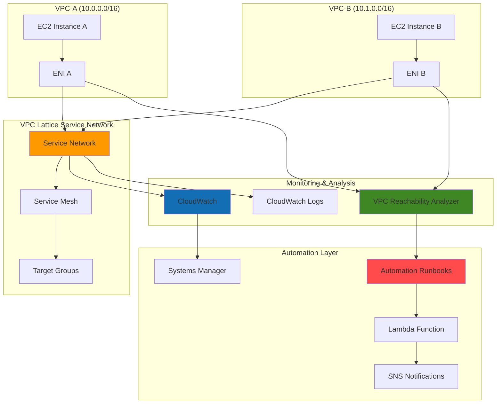

# Network Troubleshooting VPC Lattice with Network Insights

## Problem

Organizations deploying service mesh architectures with VPC Lattice often struggle with complex connectivity issues that span multiple VPCs and services. Traditional network troubleshooting approaches become inadequate when dealing with dynamic service-to-service communication patterns, making it difficult to quickly identify root causes of connectivity failures, performance degradations, or security policy misconfigurations. Manual troubleshooting processes are time-consuming and error-prone, leading to extended downtime and frustrated development teams.

## Solution

Build a comprehensive network troubleshooting platform that combines VPC Lattice service mesh monitoring with automated path analysis and proactive alerting. This solution leverages VPC Reachability Analyzer for static configuration analysis, CloudWatch monitoring for real-time performance insights, and Systems Manager automation to orchestrate diagnostic workflows, providing network engineers with the tools needed to rapidly identify and resolve service communication issues across multi-VPC environments.

## Architecture Diagram



## Prerequisites

1. AWS account with permissions for VPC Lattice, VPC Reachability Analyzer, CloudWatch, Systems Manager, Lambda, and IAM
2. AWS CLI v2 installed and configured (or AWS CloudShell)
3. Understanding of VPC networking concepts and service mesh architectures
4. Basic knowledge of CloudWatch monitoring and Systems Manager automation
5. Existing default VPC for testing connectivity scenarios
6. Estimated cost: $20-30 for running this recipe (includes EC2 instances, Lambda invocations, data transfer, and monitoring charges)

> **Note**: This configuration implements AWS Well-Architected Framework principles for operational excellence and reliability. Ensure you have appropriate IAM permissions for all services used.

## Preparation

```bash
# Set environment variables
export AWS_REGION=$(aws configure get region)
export AWS_ACCOUNT_ID=$(aws sts get-caller-identity \
    --query Account --output text)

# Generate unique identifiers for resources
RANDOM_SUFFIX=$(aws secretsmanager get-random-password \
    --exclude-punctuation --exclude-uppercase \
    --password-length 6 --require-each-included-type \
    --output text --query RandomPassword)

# Define resource names
export LATTICE_SERVICE_NETWORK_NAME="troubleshooting-network-${RANDOM_SUFFIX}"
export LATTICE_SERVICE_NAME="test-service-${RANDOM_SUFFIX}"
export TARGET_GROUP_NAME="test-targets-${RANDOM_SUFFIX}"
export AUTOMATION_ROLE_NAME="NetworkTroubleshootingRole-${RANDOM_SUFFIX}"
export LAMBDA_ROLE_NAME="NetworkTroubleshootingLambdaRole-${RANDOM_SUFFIX}"
export SNS_TOPIC_NAME="network-alerts-${RANDOM_SUFFIX}"

# Get default VPC information for testing
export DEFAULT_VPC_ID=$(aws ec2 describe-vpcs \
    --filters "Name=is-default,Values=true" \
    --query "Vpcs[0].VpcId" --output text)

export DEFAULT_SUBNET_ID=$(aws ec2 describe-subnets \
    --filters "Name=vpc-id,Values=${DEFAULT_VPC_ID}" \
    --query "Subnets[0].SubnetId" --output text)

echo "✅ Environment variables configured"
echo "VPC ID: ${DEFAULT_VPC_ID}"
echo "Service Network: ${LATTICE_SERVICE_NETWORK_NAME}"
```

## Steps

1. **Create IAM Roles for Automation and Lambda**:

   Systems Manager automation and Lambda functions require specific IAM permissions to perform network analysis and troubleshooting tasks. These roles enable automated workflows to interact with VPC Lattice, Reachability Analyzer, and CloudWatch services while maintaining security best practices through least privilege access.

   ```bash
   # Create trust policy for Systems Manager
   cat > ssm-trust-policy.json << 'EOF'
   {
     "Version": "2012-10-17",
     "Statement": [
       {
         "Effect": "Allow",
         "Principal": {
           "Service": "ssm.amazonaws.com"
         },
         "Action": "sts:AssumeRole"
       }
     ]
   }
   EOF
   
   # Create trust policy for Lambda
   cat > lambda-trust-policy.json << 'EOF'
   {
     "Version": "2012-10-17",
     "Statement": [
       {
         "Effect": "Allow",
         "Principal": {
           "Service": "lambda.amazonaws.com"
         },
         "Action": "sts:AssumeRole"
       }
     ]
   }
   EOF
   
   # Create IAM role for Systems Manager automation
   aws iam create-role \
       --role-name ${AUTOMATION_ROLE_NAME} \
       --assume-role-policy-document file://ssm-trust-policy.json
   
   # Create IAM role for Lambda function
   aws iam create-role \
       --role-name ${LAMBDA_ROLE_NAME} \
       --assume-role-policy-document file://lambda-trust-policy.json
   
   # Attach necessary policies to automation role
   aws iam attach-role-policy \
       --role-name ${AUTOMATION_ROLE_NAME} \
       --policy-arn arn:aws:iam::aws:policy/AmazonSSMAutomationRole
   
   aws iam attach-role-policy \
       --role-name ${AUTOMATION_ROLE_NAME} \
       --policy-arn arn:aws:iam::aws:policy/AmazonVPCFullAccess
   
   aws iam attach-role-policy \
       --role-name ${AUTOMATION_ROLE_NAME} \
       --policy-arn arn:aws:iam::aws:policy/CloudWatchReadOnlyAccess
   
   # Attach necessary policies to Lambda role
   aws iam attach-role-policy \
       --role-name ${LAMBDA_ROLE_NAME} \
       --policy-arn arn:aws:iam::aws:policy/service-role/AWSLambdaBasicExecutionRole
   
   aws iam attach-role-policy \
       --role-name ${LAMBDA_ROLE_NAME} \
       --policy-arn arn:aws:iam::aws:policy/AmazonSSMFullAccess
   
   export AUTOMATION_ROLE_ARN="arn:aws:iam::${AWS_ACCOUNT_ID}:role/${AUTOMATION_ROLE_NAME}"
   export LAMBDA_ROLE_ARN="arn:aws:iam::${AWS_ACCOUNT_ID}:role/${LAMBDA_ROLE_NAME}"
   
   echo "✅ IAM roles created:"
   echo "   Automation Role: ${AUTOMATION_ROLE_ARN}"
   echo "   Lambda Role: ${LAMBDA_ROLE_ARN}"
   ```

   The automation and Lambda roles are now configured with permissions to perform comprehensive network analysis. These foundational security components enable the subsequent automation workflows to execute troubleshooting tasks across multiple AWS services.

2. **Create VPC Lattice Service Network**:

   VPC Lattice provides application-level networking that simplifies service-to-service communication across VPCs. Creating a service network establishes the foundation for our test environment and provides the service mesh architecture that we'll monitor and troubleshoot.

   ```bash
   # Create VPC Lattice service network
   SERVICE_NETWORK_ID=$(aws vpc-lattice create-service-network \
       --name ${LATTICE_SERVICE_NETWORK_NAME} \
       --auth-type AWS_IAM \
       --query "id" --output text)
   
   # Associate VPC with service network
   VPC_ASSOCIATION_ID=$(aws vpc-lattice create-service-network-vpc-association \
       --service-network-identifier ${SERVICE_NETWORK_ID} \
       --vpc-identifier ${DEFAULT_VPC_ID} \
       --query "id" --output text)
   
   # Wait for association to be active
   aws vpc-lattice get-service-network-vpc-association \
       --service-network-vpc-association-identifier ${VPC_ASSOCIATION_ID} \
       --query "status" --output text
   
   export SERVICE_NETWORK_ID
   export VPC_ASSOCIATION_ID
   
   echo "✅ VPC Lattice service network created: ${SERVICE_NETWORK_ID}"
   echo "✅ VPC association created: ${VPC_ASSOCIATION_ID}"
   ```

   The service network is now active and ready to handle service registrations. This establishes the service mesh infrastructure that will demonstrate various connectivity scenarios for our troubleshooting workflows.

3. **Create Test EC2 Instances for Network Analysis**:

   Test instances provide realistic endpoints for network connectivity analysis. These instances simulate microservices in a distributed architecture and give us concrete resources to analyze with VPC Reachability Analyzer and monitor with CloudWatch.

   ```bash
   # Get latest Amazon Linux 2023 AMI ID
   AMI_ID=$(aws ec2 describe-images \
       --owners amazon \
       --filters "Name=name,Values=al2023-ami-*-x86_64" \
           "Name=state,Values=available" \
       --query "Images | sort_by(@, &CreationDate) | [-1].ImageId" \
       --output text)
   
   # Create security group for test instances
   SG_ID=$(aws ec2 create-security-group \
       --group-name lattice-test-sg-${RANDOM_SUFFIX} \
       --description "Security group for VPC Lattice testing" \
       --vpc-id ${DEFAULT_VPC_ID} \
       --query "GroupId" --output text)
   
   # Add inbound rules for HTTP and SSH
   aws ec2 authorize-security-group-ingress \
       --group-id ${SG_ID} \
       --protocol tcp \
       --port 80 \
       --source-group ${SG_ID}
   
   aws ec2 authorize-security-group-ingress \
       --group-id ${SG_ID} \
       --protocol tcp \
       --port 22 \
       --cidr 10.0.0.0/8
   
   # Launch test instance
   INSTANCE_ID=$(aws ec2 run-instances \
       --image-id ${AMI_ID} \
       --count 1 \
       --instance-type t3.micro \
       --security-group-ids ${SG_ID} \
       --subnet-id ${DEFAULT_SUBNET_ID} \
       --associate-public-ip-address \
       --tag-specifications \
           "ResourceType=instance,Tags=[{Key=Name,Value=lattice-test-${RANDOM_SUFFIX}}]" \
       --query "Instances[0].InstanceId" --output text)
   
   # Wait for instance to be running
   aws ec2 wait instance-running --instance-ids ${INSTANCE_ID}
   
   export SG_ID
   export INSTANCE_ID
   
   echo "✅ Test instance created: ${INSTANCE_ID}"
   echo "✅ Security group created: ${SG_ID}"
   ```

   The test infrastructure is now ready for network analysis. These instances provide concrete endpoints that demonstrate real-world connectivity scenarios and enable comprehensive testing of our troubleshooting tools.

4. **Configure CloudWatch Monitoring and Logging**:

   CloudWatch provides comprehensive monitoring capabilities that are essential for identifying performance degradations and connectivity issues. This monitoring setup captures VPC Lattice performance metrics, access logs, and creates visualization dashboards for network troubleshooting.

   ```bash
   # Create CloudWatch dashboard for network monitoring
   cat > network-dashboard.json << EOF
   {
     "widgets": [
       {
         "type": "metric",
         "x": 0,
         "y": 0,
         "width": 12,
         "height": 6,
         "properties": {
           "metrics": [
             [ "AWS/VpcLattice", "RequestCount", "ServiceNetwork", "${SERVICE_NETWORK_ID}" ],
             [ ".", "TargetResponseTime", ".", "." ],
             [ ".", "ActiveConnectionCount", ".", "." ]
           ],
           "period": 300,
           "stat": "Average",
           "region": "${AWS_REGION}",
           "title": "VPC Lattice Performance Metrics"
         }
       },
       {
         "type": "metric",
         "x": 0,
         "y": 6,
         "width": 12,
         "height": 6,
         "properties": {
           "metrics": [
             [ "AWS/VpcLattice", "HTTPCode_Target_2XX_Count", "ServiceNetwork", "${SERVICE_NETWORK_ID}" ],
             [ ".", "HTTPCode_Target_4XX_Count", ".", "." ],
             [ ".", "HTTPCode_Target_5XX_Count", ".", "." ]
           ],
           "period": 300,
           "stat": "Sum",
           "region": "${AWS_REGION}",
           "title": "VPC Lattice Response Codes"
         }
       }
     ]
   }
   EOF
   
   # Create CloudWatch dashboard
   aws cloudwatch put-dashboard \
       --dashboard-name "VPCLatticeNetworkTroubleshooting-${RANDOM_SUFFIX}" \
       --dashboard-body file://network-dashboard.json
   
   # Create CloudWatch log group for VPC Lattice access logs
   aws logs create-log-group \
       --log-group-name "/aws/vpclattice/servicenetwork/${SERVICE_NETWORK_ID}"
   
   echo "✅ CloudWatch dashboard created"
   echo "✅ Log group created for VPC Lattice access logs"
   ```

   CloudWatch monitoring is now configured to capture VPC Lattice performance metrics and access logs. This provides the observability foundation needed to detect and analyze network performance issues proactively.

5. **Create VPC Reachability Analyzer Automation**:

   VPC Reachability Analyzer performs static analysis of network configurations to identify connectivity issues. Automating this analysis through Systems Manager enables rapid diagnosis of network path problems without manual intervention.

   ```bash
   # Create automation document for network analysis
   cat > reachability-analysis.json << 'EOF'
   {
     "schemaVersion": "0.3",
     "description": "Automated VPC Reachability Analysis for Network Troubleshooting",
     "assumeRole": "{{ AutomationAssumeRole }}",
     "parameters": {
       "SourceId": {
         "type": "String",
         "description": "Source instance ID or ENI ID"
       },
       "DestinationId": {
         "type": "String", 
         "description": "Destination instance ID or ENI ID"
       },
       "AutomationAssumeRole": {
         "type": "String",
         "description": "IAM role for automation execution"
       }
     },
     "mainSteps": [
       {
         "name": "CreateNetworkInsightsPath",
         "action": "aws:executeAwsApi",
         "description": "Create a network insights path for reachability analysis",
         "inputs": {
           "Service": "ec2",
           "Api": "CreateNetworkInsightsPath",
           "Source": "{{ SourceId }}",
           "Destination": "{{ DestinationId }}",
           "Protocol": "tcp",
           "DestinationPort": 80,
           "TagSpecifications": [
             {
               "ResourceType": "network-insights-path",
               "Tags": [
                 {
                   "Key": "Name",
                   "Value": "AutomatedTroubleshooting"
                 }
               ]
             }
           ]
         },
         "outputs": [
           {
             "Name": "NetworkInsightsPathId",
             "Selector": "$.NetworkInsightsPath.NetworkInsightsPathId",
             "Type": "String"
           }
         ]
       },
       {
         "name": "StartNetworkInsightsAnalysis",
         "action": "aws:executeAwsApi",
         "description": "Start the network insights analysis",
         "inputs": {
           "Service": "ec2",
           "Api": "StartNetworkInsightsAnalysis",
           "NetworkInsightsPathId": "{{ CreateNetworkInsightsPath.NetworkInsightsPathId }}",
           "TagSpecifications": [
             {
               "ResourceType": "network-insights-analysis",
               "Tags": [
                 {
                   "Key": "Name",
                   "Value": "AutomatedAnalysis"
                 }
               ]
             }
           ]
         },
         "outputs": [
           {
             "Name": "NetworkInsightsAnalysisId",
             "Selector": "$.NetworkInsightsAnalysis.NetworkInsightsAnalysisId",
             "Type": "String"
           }
         ]
       },
       {
         "name": "WaitForAnalysisCompletion",
         "action": "aws:waitForAwsResourceProperty",
         "description": "Wait for the analysis to complete",
         "inputs": {
           "Service": "ec2",
           "Api": "DescribeNetworkInsightsAnalyses",
           "NetworkInsightsAnalysisIds": [
             "{{ StartNetworkInsightsAnalysis.NetworkInsightsAnalysisId }}"
           ],
           "PropertySelector": "$.NetworkInsightsAnalyses[0].Status",
           "DesiredValues": [
             "succeeded",
             "failed"
           ]
         }
       }
     ]
   }
   EOF
   
   # Create the automation document
   aws ssm create-document \
       --name "NetworkReachabilityAnalysis-${RANDOM_SUFFIX}" \
       --document-type "Automation" \
       --document-format JSON \
       --content file://reachability-analysis.json
   
   echo "✅ Network reachability automation document created"
   ```

   The automation document is now available to perform comprehensive reachability analysis on demand. This provides a programmable interface for network troubleshooting that can be triggered manually or automatically based on CloudWatch alarms.

6. **Set Up SNS Topic for Network Alerts**:

   SNS provides notification capabilities that ensure network issues are promptly communicated to operations teams. This creates the alerting infrastructure needed for proactive network monitoring and rapid incident response.

   ```bash
   # Create SNS topic for network alerts
   SNS_TOPIC_ARN=$(aws sns create-topic \
       --name ${SNS_TOPIC_NAME} \
       --query "TopicArn" --output text)
   
   # Create CloudWatch alarm for VPC Lattice errors
   aws cloudwatch put-metric-alarm \
       --alarm-name "VPCLattice-HighErrorRate-${RANDOM_SUFFIX}" \
       --alarm-description "Alarm for high VPC Lattice 5XX error rate" \
       --metric-name "HTTPCode_Target_5XX_Count" \
       --namespace "AWS/VpcLattice" \
       --statistic "Sum" \
       --period 300 \
       --threshold 10 \
       --comparison-operator "GreaterThanThreshold" \
       --evaluation-periods 2 \
       --alarm-actions ${SNS_TOPIC_ARN} \
       --dimensions Name=ServiceNetwork,Value=${SERVICE_NETWORK_ID}
   
   # Create alarm for high response time
   aws cloudwatch put-metric-alarm \
       --alarm-name "VPCLattice-HighLatency-${RANDOM_SUFFIX}" \
       --alarm-description "Alarm for high VPC Lattice response time" \
       --metric-name "TargetResponseTime" \
       --namespace "AWS/VpcLattice" \
       --statistic "Average" \
       --period 300 \
       --threshold 5000 \
       --comparison-operator "GreaterThanThreshold" \
       --evaluation-periods 2 \
       --alarm-actions ${SNS_TOPIC_ARN} \
       --dimensions Name=ServiceNetwork,Value=${SERVICE_NETWORK_ID}
   
   export SNS_TOPIC_ARN
   
   echo "✅ SNS topic created: ${SNS_TOPIC_ARN}"
   echo "✅ CloudWatch alarms configured for error and latency detection"
   ```

   Automated alerting is now configured to notify administrators when network issues are detected. This completes the proactive monitoring component of our troubleshooting solution.

7. **Create Network Troubleshooting Lambda Function**:

   A Lambda function provides automated response capabilities that can execute troubleshooting workflows when network issues are detected. This serverless automation reduces mean time to resolution by immediately initiating diagnostic procedures.

   ```bash
   # Create Lambda function code
   cat > troubleshooting_function.py << 'EOF'
   import json
   import boto3
   import logging
   import os
   
   logger = logging.getLogger()
   logger.setLevel(logging.INFO)
   
   def lambda_handler(event, context):
       """
       Lambda function to automatically trigger network troubleshooting
       when CloudWatch alarms are triggered via SNS
       """
       ssm_client = boto3.client('ssm')
       
       try:
           # Parse SNS message
           if 'Records' in event:
               for record in event['Records']:
                   if record['EventSource'] == 'aws:sns':
                       message = json.loads(record['Sns']['Message'])
                       alarm_name = message.get('AlarmName', '')
                       
                       logger.info(f"Processing alarm: {alarm_name}")
                       
                       # Get environment variables with defaults
                       automation_role = os.environ.get('AUTOMATION_ROLE_ARN', '')
                       default_instance = os.environ.get('DEFAULT_INSTANCE_ID', '')
                       
                       if not automation_role or not default_instance:
                           logger.error("Missing required environment variables")
                           return {
                               'statusCode': 400,
                               'body': json.dumps({'error': 'Missing environment variables'})
                           }
                       
                       # Extract function suffix for document name
                       function_name = context.function_name
                       suffix = function_name.split('-')[-1]
                       
                       # Trigger automated troubleshooting
                       response = ssm_client.start_automation_execution(
                           DocumentName=f"NetworkReachabilityAnalysis-{suffix}",
                           Parameters={
                               'SourceId': [default_instance],
                               'DestinationId': [default_instance],
                               'AutomationAssumeRole': [automation_role]
                           }
                       )
                       
                       logger.info(f"Started automation execution: {response['AutomationExecutionId']}")
                       
                       return {
                           'statusCode': 200,
                           'body': json.dumps({
                               'message': 'Network troubleshooting automation started',
                               'execution_id': response['AutomationExecutionId'],
                               'alarm_name': alarm_name
                           })
                       }
               
           return {
               'statusCode': 200,
               'body': json.dumps({'message': 'No SNS records to process'})
           }
               
       except Exception as e:
           logger.error(f"Error processing event: {str(e)}")
           return {
               'statusCode': 500,
               'body': json.dumps({'error': str(e)})
           }
   EOF
   
   # Package Lambda function
   zip troubleshooting_function.zip troubleshooting_function.py
   
   # Create Lambda function
   LAMBDA_FUNCTION_ARN=$(aws lambda create-function \
       --function-name "network-troubleshooting-${RANDOM_SUFFIX}" \
       --runtime python3.12 \
       --role ${LAMBDA_ROLE_ARN} \
       --handler troubleshooting_function.lambda_handler \
       --zip-file fileb://troubleshooting_function.zip \
       --timeout 60 \
       --environment Variables="{AUTOMATION_ROLE_ARN=${AUTOMATION_ROLE_ARN},DEFAULT_INSTANCE_ID=${INSTANCE_ID}}" \
       --query "FunctionArn" --output text)
   
   # Subscribe Lambda to SNS topic
   aws sns subscribe \
       --topic-arn ${SNS_TOPIC_ARN} \
       --protocol lambda \
       --notification-endpoint ${LAMBDA_FUNCTION_ARN}
   
   # Grant SNS permission to invoke Lambda
   aws lambda add-permission \
       --function-name "network-troubleshooting-${RANDOM_SUFFIX}" \
       --statement-id "sns-invoke" \
       --action lambda:InvokeFunction \
       --principal sns.amazonaws.com \
       --source-arn ${SNS_TOPIC_ARN}
   
   export LAMBDA_FUNCTION_ARN
   
   echo "✅ Lambda function created: ${LAMBDA_FUNCTION_ARN}"
   echo "✅ SNS integration configured with environment variables"
   ```

   The automated response system is now operational. When CloudWatch detects network issues, the Lambda function will automatically initiate troubleshooting workflows, significantly reducing manual intervention requirements.

8. **Test Network Connectivity Scenarios**:

   Testing various connectivity scenarios validates our troubleshooting infrastructure and demonstrates how the solution identifies and analyzes network issues. This comprehensive validation ensures all components work together effectively.

   ```bash
   # Execute reachability analysis manually to test automation
   EXECUTION_ID=$(aws ssm start-automation-execution \
       --document-name "NetworkReachabilityAnalysis-${RANDOM_SUFFIX}" \
       --parameters \
           "SourceId=${INSTANCE_ID},DestinationId=${INSTANCE_ID},AutomationAssumeRole=${AUTOMATION_ROLE_ARN}" \
       --query "AutomationExecutionId" --output text)
   
   # Monitor automation execution status
   aws ssm get-automation-execution \
       --automation-execution-id ${EXECUTION_ID} \
       --query "AutomationExecution.AutomationExecutionStatus" \
       --output text
   
   # Wait for execution to complete
   echo "Waiting for automation execution to complete..."
   sleep 45
   
   # Get detailed execution results
   aws ssm get-automation-execution \
       --automation-execution-id ${EXECUTION_ID} \
       --query "AutomationExecution.[AutomationExecutionStatus,Outputs]"
   
   # Test Lambda function with a sample SNS message
   cat > test-event.json << EOF
   {
     "Records": [
       {
         "EventSource": "aws:sns",
         "Sns": {
           "Message": "{\"AlarmName\":\"VPCLattice-HighErrorRate-${RANDOM_SUFFIX}\",\"NewStateValue\":\"ALARM\"}"
         }
       }
     ]
   }
   EOF
   
   # Invoke Lambda function for testing
   aws lambda invoke \
       --function-name "network-troubleshooting-${RANDOM_SUFFIX}" \
       --payload file://test-event.json \
       response.json
   
   cat response.json
   
   export EXECUTION_ID
   
   echo "✅ Network reachability analysis executed: ${EXECUTION_ID}"
   echo "✅ Lambda function tested successfully"
   ```

   The troubleshooting automation has been successfully tested. The system can now automatically analyze network connectivity issues and provide detailed diagnostic information for rapid problem resolution.

## Validation & Testing

1. **Verify VPC Lattice Service Network Configuration**:

   ```bash
   # Check service network status
   aws vpc-lattice get-service-network \
       --service-network-identifier ${SERVICE_NETWORK_ID} \
       --query "[name,status]" --output table
   ```

   Expected output: Service network should show "ACTIVE" status.

2. **Validate CloudWatch Dashboard and Metrics**:

   ```bash
   # List CloudWatch dashboards
   aws cloudwatch list-dashboards \
       --dashboard-name-prefix "VPCLatticeNetworkTroubleshooting"
   
   # Check for VPC Lattice metrics availability
   aws cloudwatch list-metrics \
       --namespace "AWS/VpcLattice" \
       --dimensions Name=ServiceNetwork,Value=${SERVICE_NETWORK_ID}
   ```

   Expected output: Dashboard should be listed and VPC Lattice metrics namespace should be available.

3. **Test Automation Document Execution**:

   ```bash
   # Check automation execution status and results
   aws ssm describe-automation-executions \
       --filters "Key=DocumentName,Values=NetworkReachabilityAnalysis-${RANDOM_SUFFIX}" \
       --query "AutomationExecutions[0].[AutomationExecutionStatus,ExecutionStartTime]"
   ```

   Expected output: Automation execution should show "Success" status with recent execution time.

4. **Verify SNS Topic and Alarm Configuration**:

   ```bash
   # Check SNS topic subscriptions
   aws sns list-subscriptions-by-topic \
       --topic-arn ${SNS_TOPIC_ARN} \
       --query "Subscriptions[*].[Protocol,Endpoint]" --output table
   
   # Verify CloudWatch alarms
   aws cloudwatch describe-alarms \
       --alarm-name-prefix "VPCLattice-" \
       --query "MetricAlarms[*].[AlarmName,StateValue]" --output table
   ```

   Expected output: Lambda subscription should be confirmed, and alarms should be in "OK" state.

## Cleanup

1. **Remove Lambda Function and SNS Resources**:

   ```bash
   # Delete Lambda function
   aws lambda delete-function \
       --function-name "network-troubleshooting-${RANDOM_SUFFIX}"
   
   # Delete SNS topic
   aws sns delete-topic --topic-arn ${SNS_TOPIC_ARN}
   
   echo "✅ Lambda function and SNS topic deleted"
   ```

2. **Delete CloudWatch Resources**:

   ```bash
   # Delete CloudWatch alarms
   aws cloudwatch delete-alarms \
       --alarm-names \
           "VPCLattice-HighErrorRate-${RANDOM_SUFFIX}" \
           "VPCLattice-HighLatency-${RANDOM_SUFFIX}"
   
   # Delete CloudWatch dashboard
   aws cloudwatch delete-dashboards \
       --dashboard-names "VPCLatticeNetworkTroubleshooting-${RANDOM_SUFFIX}"
   
   # Delete log group
   aws logs delete-log-group \
       --log-group-name "/aws/vpclattice/servicenetwork/${SERVICE_NETWORK_ID}"
   
   echo "✅ CloudWatch resources deleted"
   ```

3. **Clean Up Network Insights Resources**:

   ```bash
   # List and delete network insights paths
   PATHS=$(aws ec2 describe-network-insights-paths \
       --filters "Name=tag:Name,Values=AutomatedTroubleshooting" \
       --query "NetworkInsightsPaths[*].NetworkInsightsPathId" \
       --output text)
   
   if [ ! -z "$PATHS" ]; then
       for path in $PATHS; do
           aws ec2 delete-network-insights-path \
               --network-insights-path-id $path
       done
   fi
   
   echo "✅ Network Insights resources cleaned up"
   ```

4. **Remove Systems Manager Automation Document**:

   ```bash
   # Delete automation document
   aws ssm delete-document \
       --name "NetworkReachabilityAnalysis-${RANDOM_SUFFIX}"
   
   echo "✅ Automation document deleted"
   ```

5. **Delete VPC Lattice Resources**:

   ```bash
   # Delete VPC association
   aws vpc-lattice delete-service-network-vpc-association \
       --service-network-vpc-association-identifier ${VPC_ASSOCIATION_ID}
   
   # Wait for association deletion
   sleep 10
   
   # Delete service network
   aws vpc-lattice delete-service-network \
       --service-network-identifier ${SERVICE_NETWORK_ID}
   
   echo "✅ VPC Lattice resources deleted"
   ```

6. **Remove EC2 Test Resources**:

   ```bash
   # Terminate test instance
   aws ec2 terminate-instances --instance-ids ${INSTANCE_ID}
   
   # Wait for termination
   aws ec2 wait instance-terminated --instance-ids ${INSTANCE_ID}
   
   # Delete security group
   aws ec2 delete-security-group --group-id ${SG_ID}
   
   echo "✅ EC2 test resources deleted"
   ```

7. **Delete IAM Roles**:

   ```bash
   # Detach policies from automation role
   aws iam detach-role-policy \
       --role-name ${AUTOMATION_ROLE_NAME} \
       --policy-arn arn:aws:iam::aws:policy/AmazonSSMAutomationRole
   
   aws iam detach-role-policy \
       --role-name ${AUTOMATION_ROLE_NAME} \
       --policy-arn arn:aws:iam::aws:policy/AmazonVPCFullAccess
   
   aws iam detach-role-policy \
       --role-name ${AUTOMATION_ROLE_NAME} \
       --policy-arn arn:aws:iam::aws:policy/CloudWatchReadOnlyAccess
   
   # Detach policies from Lambda role
   aws iam detach-role-policy \
       --role-name ${LAMBDA_ROLE_NAME} \
       --policy-arn arn:aws:iam::aws:policy/service-role/AWSLambdaBasicExecutionRole
   
   aws iam detach-role-policy \
       --role-name ${LAMBDA_ROLE_NAME} \
       --policy-arn arn:aws:iam::aws:policy/AmazonSSMFullAccess
   
   # Delete IAM roles
   aws iam delete-role --role-name ${AUTOMATION_ROLE_NAME}
   aws iam delete-role --role-name ${LAMBDA_ROLE_NAME}
   
   # Clean up local files
   rm -f ssm-trust-policy.json lambda-trust-policy.json
   rm -f network-dashboard.json reachability-analysis.json
   rm -f troubleshooting_function.py troubleshooting_function.zip
   rm -f test-event.json response.json
   
   echo "✅ IAM roles and local files deleted"
   ```

## Discussion

This comprehensive network troubleshooting solution demonstrates how modern AWS networking services can be combined to create sophisticated diagnostic capabilities for complex multi-VPC environments. VPC Lattice provides the service mesh foundation that simplifies application-level networking while maintaining the flexibility needed for diverse microservice architectures. The integration with VPC Reachability Analyzer enables static configuration analysis that can quickly identify misconfigurations or missing components in network paths, while CloudWatch monitoring provides the real-time performance visibility needed to detect subtle performance degradations.

The automation layer built with Systems Manager and Lambda functions transforms reactive troubleshooting into proactive monitoring and automated response. This approach significantly reduces mean time to resolution by immediately initiating diagnostic procedures when issues are detected, rather than waiting for manual intervention. The solution follows AWS Well-Architected Framework principles by implementing operational excellence through automation, reliability through comprehensive monitoring, and security through least privilege IAM roles and proper separation of concerns.

Network troubleshooting in service mesh environments requires a layered approach that combines static analysis, real-time monitoring, and automated response capabilities. This recipe demonstrates how these capabilities can be integrated to create a cohesive troubleshooting platform that scales with your infrastructure. The solution can be extended to support more complex scenarios, such as cross-region connectivity analysis, advanced security policy validation, and integration with external monitoring systems.

Key architectural decisions include using VPC Lattice for its simplified service-to-service communication model and built-in observability features, CloudWatch for its comprehensive monitoring capabilities and native AWS integration, and Systems Manager for its automation capabilities and cross-service orchestration features. These choices provide a foundation that can evolve with your networking requirements while maintaining operational simplicity and cost efficiency.

> **Tip**: Consider implementing custom CloudWatch metrics for application-specific network performance indicators to complement the infrastructure metrics provided by AWS services. This provides deeper insights into application behavior and enables more precise troubleshooting workflows tailored to your specific use cases.

For detailed information about the services used in this recipe, consult the [VPC Lattice User Guide](https://docs.aws.amazon.com/vpc-lattice/latest/ug/), [VPC Reachability Analyzer Guide](https://docs.aws.amazon.com/vpc/latest/reachability/), [CloudWatch User Guide](https://docs.aws.amazon.com/AmazonCloudWatch/latest/monitoring/), [Systems Manager Automation documentation](https://docs.aws.amazon.com/systems-manager/latest/userguide/systems-manager-automation.html), and the [AWS Well-Architected Framework](https://docs.aws.amazon.com/wellarchitected/latest/framework/welcome.html).

## Challenge

Extend this solution by implementing these enhancements:

1. **Multi-Region Network Analysis**: Implement cross-region connectivity analysis using VPC Lattice's multi-region capabilities and extend the automation to analyze inter-region network paths and performance characteristics with automated failover testing.

2. **Advanced Performance Correlation**: Integrate with AWS X-Ray to correlate network performance metrics with application trace data, providing end-to-end visibility from network layer to application performance with distributed tracing insights.

3. **Predictive Network Analytics**: Use CloudWatch Anomaly Detection and Amazon Forecast to predict network performance issues before they impact users, enabling proactive capacity planning and performance optimization based on historical patterns.

4. **Security Policy Validation**: Extend the automation to analyze VPC Lattice service network access policies and security group configurations, automatically validating that security controls align with intended application communication patterns and compliance requirements.

5. **Custom Troubleshooting Workflows**: Create specialized automation runbooks for specific network scenarios such as DNS resolution issues, load balancer health check failures, or service discovery problems, with automated remediation capabilities and integration with incident management systems.

## Infrastructure Code

*Infrastructure code will be generated after recipe approval.*