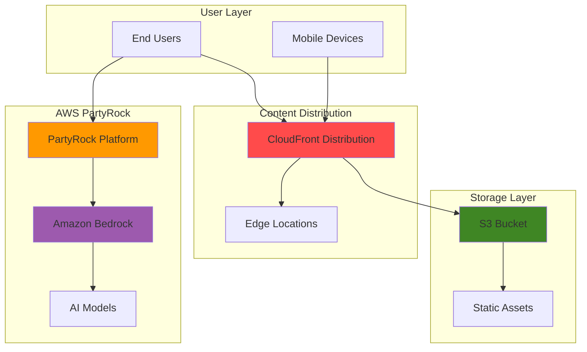

# Creating No-Code AI Applications with PartyRock and S3

## Problem

Organizations need to rapidly prototype and deploy AI-powered applications without extensive coding expertise or complex infrastructure management. Traditional AI development requires specialized knowledge of machine learning frameworks, prompt engineering, and cloud infrastructure deployment, creating barriers for non-technical teams to experiment with generative AI capabilities for business use cases.

## Solution

Amazon PartyRock provides a no-code platform for creating generative AI applications using natural language descriptions, while S3 and CloudFront deliver scalable hosting infrastructure. This combination enables rapid development and deployment of AI-powered applications with global content delivery, secure HTTPS access, and automatic scaling capabilities.

## Architecture Diagram



## Prerequisites

1. AWS account with appropriate permissions for S3 and CloudFront access
2. AWS CLI installed and configured (version 2.0 or later)
3. Basic understanding of static websites and content delivery networks
4. Social media account (Apple, Amazon, or Google) for PartyRock authentication
5. Estimated cost: $0.50-$2.00 per month for S3 storage and CloudFront distribution

> **Note**: PartyRock is a free Amazon Bedrock playground that offers daily free usage quotas and does not require an AWS account to get started with application development.

## Preparation

```bash
# Set environment variables
export AWS_REGION=$(aws configure get region)
export AWS_ACCOUNT_ID=$(aws sts get-caller-identity \
    --query Account --output text)

# Generate unique identifiers for resources
RANDOM_SUFFIX=$(aws secretsmanager get-random-password \
    --exclude-punctuation --exclude-uppercase \
    --password-length 6 --require-each-included-type \
    --output text --query RandomPassword)

# Set bucket name and CloudFront distribution variables
export BUCKET_NAME="partyrock-app-${RANDOM_SUFFIX}"
export DISTRIBUTION_NAME="partyrock-cdn-${RANDOM_SUFFIX}"

echo "✅ AWS environment configured for PartyRock application hosting"
echo "Bucket Name: ${BUCKET_NAME}"
echo "AWS Region: ${AWS_REGION}"
```

## Steps

1. **Create Your First PartyRock AI Application**:

   Amazon PartyRock is a no-code playground that leverages Amazon Bedrock's foundation models to create generative AI applications through natural language descriptions. The platform enables rapid prototyping of AI solutions without requiring programming expertise, making it accessible to business users, designers, and non-technical stakeholders who want to experiment with AI capabilities.

   ```bash
   # Navigate to PartyRock platform
   echo "Opening PartyRock platform..."
   echo "Visit: https://partyrock.aws/"
   
   # Sign in with your preferred social account
   echo "1. Click 'Sign in' and authenticate with Apple, Amazon, or Google"
   echo "2. Click 'Build your own app' from the main dashboard"
   echo "3. Enter description: 'Create a business name generator that \
   creates catchy names based on industry and target audience'"
   
   echo "✅ PartyRock application creation initiated"
   ```

   The PartyRock platform automatically generates widgets and configures AI models based on your description. This serverless approach eliminates the need for infrastructure management while providing access to powerful language models through Amazon Bedrock's managed service.

2. **Configure AI Application Widgets and Logic**:

   PartyRock applications are built using widgets that represent different AI capabilities such as text generation, image creation, and document processing. Each widget can reference other widgets through prompt chaining, enabling complex multi-step AI workflows that process user inputs through multiple AI models to produce sophisticated outputs.

   ```bash
   # Configure application widgets through PartyRock interface
   echo "Configuring application widgets..."
   
   # Widget 1: User Input Collection
   echo "1. Edit 'User Input' widget:"
   echo "   - Title: 'Business Information'"
   echo "   - Add fields for industry type and target audience"
   echo "   - Set placeholder text for user guidance"
   
   # Widget 2: AI Name Generation
   echo "2. Configure 'Text Generation' widget:"
   echo "   - Model: Claude 3 Haiku or Claude 3 Sonnet"
   echo "   - Prompt: Reference @Business Information widget"
   echo "   - Generate 5 creative business names with explanations"
   
   # Widget 3: Visual Branding
   echo "3. Add 'Image Generation' widget:"
   echo "   - Create logo concepts for generated names"
   echo "   - Reference generated names from previous widget"
   
   echo "✅ AI application widgets configured with prompt chaining"
   ```

   This widget-based architecture allows for modular development where each component handles specific AI tasks. The platform automatically manages the underlying API calls to Amazon Bedrock, handles error conditions, and provides real-time feedback during application development.

3. **Test and Refine Your AI Application**:

   ```bash
   # Test application functionality
   echo "Testing AI application..."
   
   # Test with sample inputs
   echo "1. Enter test data:"
   echo "   - Industry: 'Sustainable Technology'"
   echo "   - Target Audience: 'Environmentally conscious millennials'"
   
   echo "2. Click 'Generate' to test all widgets"
   echo "3. Review outputs for quality and relevance"
   
   # Refine prompts based on results
   echo "4. Iterate on widget prompts to improve outputs"
   echo "5. Test with multiple input combinations"
   
   echo "✅ AI application tested and refined"
   ```

4. **Create S3 Bucket for Static Website Hosting**:

   Amazon S3 provides highly durable object storage with 99.999999999% (11 9's) durability, making it ideal for hosting static websites that showcase your PartyRock applications. The bucket will serve as the foundation for your application's web presence, storing HTML, CSS, JavaScript, and media files while supporting website hosting configuration.

   ```bash
   # Create S3 bucket for static website hosting
   aws s3 mb s3://${BUCKET_NAME} --region ${AWS_REGION}
   
   # Enable versioning for data protection
   aws s3api put-bucket-versioning \
       --bucket ${BUCKET_NAME} \
       --versioning-configuration Status=Enabled
   
   # Enable server-side encryption
   aws s3api put-bucket-encryption \
       --bucket ${BUCKET_NAME} \
       --server-side-encryption-configuration \
       'Rules=[{ApplyServerSideEncryptionByDefault:{SSEAlgorithm:AES256}}]'
   
   echo "✅ S3 bucket created with security and versioning enabled"
   ```

   The bucket configuration includes enterprise-grade security features like encryption at rest and versioning, ensuring your application assets are protected while maintaining the ability to roll back changes if needed.

5. **Configure S3 Static Website Hosting**:

   ```bash
   # Enable static website hosting
   aws s3 website s3://${BUCKET_NAME} \
       --index-document index.html \
       --error-document error.html
   
   # Create simple HTML page showcasing your PartyRock app
   cat > index.html << 'EOF'
<!DOCTYPE html>
<html lang="en">
<head>
    <meta charset="UTF-8">
    <meta name="viewport" content="width=device-width, initial-scale=1.0">
    <title>AI Business Name Generator</title>
    <style>
        body { font-family: Arial, sans-serif; margin: 40px; }
        .container { max-width: 800px; margin: 0 auto; }
        .partyrock-embed { border: 1px solid #ddd; padding: 20px; }
        .btn { background: #ff9900; color: white; padding: 10px 20px; 
               text-decoration: none; border-radius: 5px; }
    </style>
</head>
<body>
    <div class="container">
        <h1>AI-Powered Business Name Generator</h1>
        <p>Experience the power of generative AI with our no-code application 
           built using Amazon PartyRock and hosted on AWS.</p>
        
        <div class="partyrock-embed">
            <h2>Try the Application</h2>
            <p>Click the button below to access our AI business name generator:</p>
            <a href="YOUR_PARTYROCK_APP_URL" class="btn" target="_blank">
                Launch AI App
            </a>
        </div>
        
        <h2>Features</h2>
        <ul>
            <li>AI-powered name generation using Amazon Bedrock</li>
            <li>Industry-specific suggestions</li>
            <li>Target audience consideration</li>
            <li>Logo concept generation</li>
        </ul>
    </div>
</body>
</html>
EOF
   
   # Upload website files to S3
   aws s3 cp index.html s3://${BUCKET_NAME}/
   
   echo "✅ Static website configured and uploaded to S3"
   ```

6. **Create CloudFront Distribution for Global Delivery**:

   Amazon CloudFront provides a globally distributed content delivery network that caches your static website content at edge locations worldwide. This reduces latency for users regardless of their geographic location while providing SSL/TLS encryption, custom domain support, and protection against DDoS attacks.

   ```bash
   # Create CloudFront distribution configuration
   cat > cloudfront-config.json << EOF
{
    "CallerReference": "${DISTRIBUTION_NAME}-$(date +%s)",
    "Comment": "PartyRock AI Application CDN",
    "DefaultCacheBehavior": {
        "TargetOriginId": "S3-${BUCKET_NAME}",
        "ViewerProtocolPolicy": "redirect-to-https",
        "AllowedMethods": {
            "Quantity": 7,
            "Items": ["GET", "HEAD", "OPTIONS", "PUT", "POST", "PATCH", "DELETE"]
        },
        "ForwardedValues": {
            "QueryString": false,
            "Cookies": {"Forward": "none"}
        },
        "TrustedSigners": {
            "Enabled": false,
            "Quantity": 0
        },
        "MinTTL": 0,
        "Compress": true
    },
    "Origins": {
        "Quantity": 1,
        "Items": [
            {
                "Id": "S3-${BUCKET_NAME}",
                "DomainName": "${BUCKET_NAME}.s3.${AWS_REGION}.amazonaws.com",
                "S3OriginConfig": {
                    "OriginAccessIdentity": ""
                }
            }
        ]
    },
    "Enabled": true,
    "DefaultRootObject": "index.html"
}
EOF
   
   # Create CloudFront distribution
   DISTRIBUTION_ID=$(aws cloudfront create-distribution \
       --distribution-config file://cloudfront-config.json \
       --query 'Distribution.Id' --output text)
   
   echo "✅ CloudFront distribution created: ${DISTRIBUTION_ID}"
   echo "Distribution deployment in progress (may take 10-15 minutes)"
   ```

7. **Configure Public Access for Website**:

   ```bash
   # Remove S3 public access block
   aws s3api delete-public-access-block \
       --bucket ${BUCKET_NAME}
   
   # Create bucket policy for public read access
   cat > bucket-policy.json << EOF
{
    "Version": "2012-10-17",
    "Statement": [
        {
            "Sid": "PublicReadGetObject",
            "Effect": "Allow",
            "Principal": "*",
            "Action": "s3:GetObject",
            "Resource": "arn:aws:s3:::${BUCKET_NAME}/*"
        }
    ]
}
EOF
   
   # Apply bucket policy
   aws s3api put-bucket-policy \
       --bucket ${BUCKET_NAME} \
       --policy file://bucket-policy.json
   
   echo "✅ Public access configured for website hosting"
   ```

8. **Share and Deploy Your PartyRock Application**:

   ```bash
   # Make PartyRock application public
   echo "In PartyRock interface:"
   echo "1. Click 'Make public and Share' button"
   echo "2. Copy the public application URL"
   echo "3. Update your HTML file with the PartyRock URL"
   
   # Update HTML with actual PartyRock URL
   echo "Replace 'YOUR_PARTYROCK_APP_URL' in index.html with your app URL"
   echo "Re-upload updated HTML to S3"
   
   # Get website URLs
   S3_WEBSITE_URL="http://${BUCKET_NAME}.s3-website.${AWS_REGION}.amazonaws.com"
   echo "S3 Website URL: ${S3_WEBSITE_URL}"
   
   # Get CloudFront URL (after distribution deploys)
   CLOUDFRONT_URL=$(aws cloudfront get-distribution \
       --id ${DISTRIBUTION_ID} \
       --query 'Distribution.DomainName' --output text)
   echo "CloudFront URL: https://${CLOUDFRONT_URL}"
   
   echo "✅ Application deployed and publicly accessible"
   ```

## Validation & Testing

1. **Test PartyRock Application Functionality**:

   ```bash
   # Test AI application through PartyRock interface
   echo "Testing PartyRock application..."
   
   # Verify widget functionality
   echo "1. Navigate to your PartyRock application"
   echo "2. Test with sample business information"
   echo "3. Verify all widgets generate appropriate outputs"
   echo "4. Test with multiple input combinations"
   
   # Check application performance
   echo "5. Monitor response times and quality"
   
   echo "✅ PartyRock application tested successfully"
   ```

2. **Verify S3 Website Hosting**:

   ```bash
   # Test S3 website endpoint
   curl -I ${S3_WEBSITE_URL}
   
   # Expected: HTTP/1.1 200 OK
   echo "S3 website should return 200 OK status"
   
   # Test index document
   curl -s ${S3_WEBSITE_URL} | grep -q "AI-Powered Business Name Generator"
   
   if [ $? -eq 0 ]; then
       echo "✅ S3 website hosting verified"
   else
       echo "❌ S3 website hosting issue detected"
   fi
   ```

3. **Validate CloudFront Distribution**:

   ```bash
   # Check CloudFront distribution status
   aws cloudfront get-distribution \
       --id ${DISTRIBUTION_ID} \
       --query 'Distribution.Status' --output text
   
   # Wait for deployment completion
   echo "Waiting for CloudFront deployment..."
   aws cloudfront wait distribution-deployed \
       --id ${DISTRIBUTION_ID}
   
   # Test HTTPS access
   curl -I https://${CLOUDFRONT_URL}
   
   echo "✅ CloudFront distribution validated"
   ```

## Cleanup

1. **Remove CloudFront Distribution**:

   ```bash
   # Disable distribution first
   aws cloudfront get-distribution-config \
       --id ${DISTRIBUTION_ID} \
       --query 'DistributionConfig' > dist-config.json
   
   # Get ETag for update
   ETAG=$(aws cloudfront get-distribution \
       --id ${DISTRIBUTION_ID} \
       --query 'ETag' --output text)
   
   # Set enabled to false
   jq '.Enabled = false' dist-config.json > dist-config-updated.json
   
   # Update distribution
   aws cloudfront update-distribution \
       --id ${DISTRIBUTION_ID} \
       --distribution-config file://dist-config-updated.json \
       --if-match ${ETAG}
   
   # Wait for deployment and delete
   echo "Waiting for distribution to be disabled..."
   aws cloudfront wait distribution-deployed \
       --id ${DISTRIBUTION_ID}
   
   # Get new ETag after update
   ETAG=$(aws cloudfront get-distribution \
       --id ${DISTRIBUTION_ID} \
       --query 'ETag' --output text)
   
   aws cloudfront delete-distribution \
       --id ${DISTRIBUTION_ID} \
       --if-match ${ETAG}
   
   echo "✅ CloudFront distribution removed"
   ```

2. **Delete S3 Bucket and Contents**:

   ```bash
   # Remove all objects from bucket
   aws s3 rm s3://${BUCKET_NAME} --recursive
   
   # Delete bucket
   aws s3 rb s3://${BUCKET_NAME}
   
   # Clean up local files
   rm -f index.html cloudfront-config.json bucket-policy.json \
       dist-config.json dist-config-updated.json
   
   echo "✅ S3 bucket and local files cleaned up"
   ```

3. **Archive PartyRock Application**:

   ```bash
   # In PartyRock interface
   echo "1. Navigate to your PartyRock application"
   echo "2. Click application settings"
   echo "3. Select 'Delete' or 'Archive' option"
   echo "4. Confirm deletion"
   
   echo "✅ PartyRock application archived"
   ```

## Discussion

Amazon PartyRock revolutionizes AI application development by providing a no-code platform that leverages the power of Amazon Bedrock's foundation models. Since its launch in November 2023, over half a million applications have been created, demonstrating the platform's effectiveness in democratizing access to generative AI capabilities for business users, designers, and non-technical stakeholders.

The platform's widget-based architecture enables modular development where each component handles specific AI tasks such as text generation, image creation, and document processing. Widgets can reference each other through prompt chaining, creating complex multi-step workflows that process user inputs through multiple AI models. This design pattern follows modern microservices principles while abstracting away the complexity of direct API integration with Amazon Bedrock.

The combination of S3 static website hosting and CloudFront content delivery provides a robust, scalable infrastructure for deploying AI applications globally. S3's 99.999999999% durability ensures your application assets are protected, while CloudFront's global edge network reduces latency and provides SSL/TLS encryption. This architecture follows AWS Well-Architected Framework principles for security, reliability, and performance efficiency.

The serverless nature of this solution eliminates infrastructure management overhead while providing automatic scaling capabilities. As your AI applications gain popularity, CloudFront automatically handles increased traffic without manual intervention, and S3 scales seamlessly to accommodate growing storage needs. Starting in 2025, PartyRock will offer a new daily free usage model, making it even more accessible for ongoing experimentation and development.

> **Tip**: Consider implementing custom domains and SSL certificates through AWS Certificate Manager for production deployments to enhance professional branding and security.

For more information about PartyRock capabilities, see the [AWS PartyRock announcement blog](https://aws.amazon.com/blogs/aws/build-ai-apps-with-partyrock-and-amazon-bedrock/) and the [PartyRock platform documentation](https://docs.aws.amazon.com/bedrock/latest/userguide/partyrock.html). Additional guidance on S3 static website hosting is available in the [Amazon S3 User Guide](https://docs.aws.amazon.com/AmazonS3/latest/userguide/WebsiteHosting.html), and CloudFront best practices are documented in the [Amazon CloudFront Developer Guide](https://docs.aws.amazon.com/AmazonCloudFront/latest/DeveloperGuide/Introduction.html).

## Challenge

Extend this solution by implementing these enhancements:

1. **Custom Domain Integration**: Configure Route 53 hosted zone with custom domain and SSL certificate through AWS Certificate Manager for professional branding.

2. **Advanced AI Workflows**: Create multi-step AI applications that combine document analysis, sentiment analysis, and content generation using PartyRock's Document widget for comprehensive business solutions.

3. **User Analytics**: Implement Amazon CloudWatch and AWS X-Ray for monitoring application performance, user engagement, and AI model usage patterns.

4. **API Integration**: Develop custom API endpoints using Lambda functions that integrate with PartyRock applications for programmatic access and external system integration.

5. **Enterprise Security**: Add AWS WAF (Web Application Firewall) to CloudFront distribution for advanced security protection against common web exploits and bot traffic.

## Infrastructure Code

*Infrastructure code will be generated after recipe approval.*