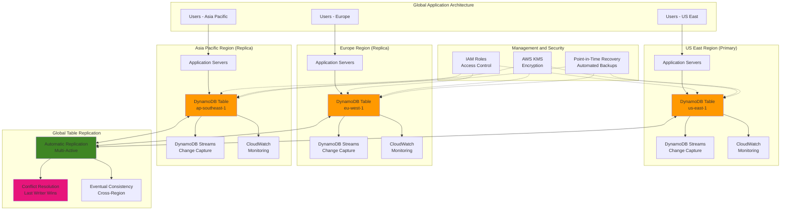

# Architecting NoSQL Databases with DynamoDB Global Tables

## Problem

Your organization needs a globally distributed NoSQL database that can serve users across multiple regions with low latency while maintaining high availability and data consistency. Traditional database replication solutions require complex setup, manual failover procedures, and significant operational overhead. You need a solution that provides automatic multi-region replication, handles conflict resolution, supports both read and write operations in all regions, and scales seamlessly with your application's global growth without compromising performance or reliability.

## Solution

Implement a globally distributed NoSQL architecture using Amazon DynamoDB Global Tables that provides fully managed, multi-region, multi-active database replication. This solution automatically replicates data across your chosen AWS regions, enables local read and write operations with single-digit millisecond latency, and handles conflict resolution transparently. The architecture includes point-in-time recovery, encryption at rest and in transit, comprehensive monitoring, and automatic scaling to support global applications with millions of users while maintaining 99.999% availability.

## Architecture Diagram



## Prerequisites

1. AWS account with permissions for DynamoDB, IAM, CloudWatch, and KMS across multiple regions
2. AWS CLI v2 installed and configured with appropriate credentials
3. Understanding of NoSQL database concepts and DynamoDB data modeling
4. Access to at least two AWS regions for global table setup
5. Estimated cost: $100-300/month depending on read/write capacity and data volume

> **Note**: Global Tables incur additional costs for cross-region data transfer and replicated write capacity. Monitor your usage and optimize capacity settings to control costs.

## Preparation

```bash
# Set environment variables
export AWS_REGION=$(aws configure get region)
export AWS_ACCOUNT_ID=$(aws sts get-caller-identity \
    --query Account --output text)

# Define regions for the global table
export PRIMARY_REGION="us-east-1" 
export SECONDARY_REGION="eu-west-1"
export TERTIARY_REGION="ap-southeast-1"

# Generate unique identifiers for resources
RANDOM_SUFFIX=$(aws secretsmanager get-random-password \
    --exclude-punctuation --exclude-uppercase \
    --password-length 6 --require-each-included-type \
    --output text --query RandomPassword)

export TABLE_NAME="global-app-data-${RANDOM_SUFFIX}"
export IAM_ROLE_NAME="DynamoDBGlobalTableRole-${RANDOM_SUFFIX}"
export KMS_KEY_ALIAS="alias/dynamodb-global-${RANDOM_SUFFIX}"

echo "✅ Environment prepared"
echo "Primary Region: ${PRIMARY_REGION}"
echo "Secondary Region: ${SECONDARY_REGION}" 
echo "Tertiary Region: ${TERTIARY_REGION}"
echo "Table Name: ${TABLE_NAME}"
```

## Steps

1. **Create IAM role for DynamoDB Global Tables access**:

   Identity and Access Management (IAM) forms the security foundation for our global database architecture. IAM roles provide temporary, rotatable credentials that eliminate the need to embed long-term access keys in application code. This approach follows the principle of least privilege, ensuring applications can only access the specific DynamoDB resources they need while maintaining the highest security standards.

   ```bash
   # Create trust policy for applications
   # This policy defines which AWS services can assume this role
   cat > dynamodb-trust-policy.json << EOF
   {
       "Version": "2012-10-17",
       "Statement": [
           {
               "Effect": "Allow",
               "Principal": {
                   "Service": [
                       "lambda.amazonaws.com",
                       "ec2.amazonaws.com"
                   ]
               },
               "Action": "sts:AssumeRole"
           }
       ]
   }
   EOF
   
   # Create IAM role that applications will use to access DynamoDB
   aws iam create-role \
       --role-name ${IAM_ROLE_NAME} \
       --assume-role-policy-document file://dynamodb-trust-policy.json
   
   # Define comprehensive permissions for Global Tables operations
   # These permissions cover all necessary DynamoDB operations across regions
   cat > dynamodb-global-policy.json << EOF
   {
       "Version": "2012-10-17",
       "Statement": [
           {
               "Effect": "Allow",
               "Action": [
                   "dynamodb:PutItem",
                   "dynamodb:GetItem",
                   "dynamodb:UpdateItem",
                   "dynamodb:DeleteItem",
                   "dynamodb:Query",
                   "dynamodb:Scan",
                   "dynamodb:BatchGetItem",
                   "dynamodb:BatchWriteItem",
                   "dynamodb:ConditionCheckItem"
               ],
               "Resource": [
                   "arn:aws:dynamodb:*:${AWS_ACCOUNT_ID}:table/${TABLE_NAME}",
                   "arn:aws:dynamodb:*:${AWS_ACCOUNT_ID}:table/${TABLE_NAME}/index/*"
               ]
           },
           {
               "Effect": "Allow",
               "Action": [
                   "dynamodb:DescribeTable",
                   "dynamodb:DescribeStream",
                   "dynamodb:ListStreams"
               ],
               "Resource": "*"
           },
           {
               "Effect": "Allow",
               "Action": [
                   "logs:CreateLogGroup",
                   "logs:CreateLogStream",
                   "logs:PutLogEvents"
               ],
               "Resource": "*"
           }
       ]
   }
   EOF
   
   # Create and attach the policy to the role
   aws iam create-policy \
       --policy-name "${IAM_ROLE_NAME}-Policy" \
       --policy-document file://dynamodb-global-policy.json
   
   POLICY_ARN=$(aws iam list-policies \
       --query "Policies[?PolicyName=='${IAM_ROLE_NAME}-Policy'].Arn" \
       --output text)
   
   aws iam attach-role-policy \
       --role-name ${IAM_ROLE_NAME} \
       --policy-arn ${POLICY_ARN}
   
   echo "✅ Created IAM role for DynamoDB Global Tables"
   echo "Role ARN: $(aws iam get-role --role-name ${IAM_ROLE_NAME} --query 'Role.Arn' --output text)"
   ```

   The IAM role is now established with comprehensive permissions for Global Tables operations. This security foundation enables applications across all regions to access DynamoDB tables using temporary credentials that automatically rotate, significantly reducing security risks compared to static access keys.

2. **Create KMS keys for encryption in each region**:

   AWS Key Management Service (KMS) provides enterprise-grade encryption for data at rest, ensuring your global data remains secure across all regions. Each region requires its own KMS key to enable local encryption and meet data residency requirements. This approach ensures that encrypted data can be accessed with minimal latency while maintaining compliance with regional data protection regulations.

   ```bash
   # Create KMS key in primary region for encryption at rest
   # Each region requires its own KMS key for local encryption
   aws kms create-key \
       --region ${PRIMARY_REGION} \
       --description "DynamoDB Global Table encryption key for ${PRIMARY_REGION}" \
       --key-usage ENCRYPT_DECRYPT \
       --key-spec SYMMETRIC_DEFAULT
   
   PRIMARY_KEY_ID=$(aws kms list-keys \
       --region ${PRIMARY_REGION} \
       --query 'Keys[-1].KeyId' --output text)
   
   # Create alias for easier key reference
   aws kms create-alias \
       --region ${PRIMARY_REGION} \
       --alias-name "${KMS_KEY_ALIAS}-${PRIMARY_REGION}" \
       --target-key-id ${PRIMARY_KEY_ID}
   
   # Repeat the process for secondary region
   aws kms create-key \
       --region ${SECONDARY_REGION} \
       --description "DynamoDB Global Table encryption key for ${SECONDARY_REGION}" \
       --key-usage ENCRYPT_DECRYPT \
       --key-spec SYMMETRIC_DEFAULT
   
   SECONDARY_KEY_ID=$(aws kms list-keys \
       --region ${SECONDARY_REGION} \
       --query 'Keys[-1].KeyId' --output text)
   
   aws kms create-alias \
       --region ${SECONDARY_REGION} \
       --alias-name "${KMS_KEY_ALIAS}-${SECONDARY_REGION}" \
       --target-key-id ${SECONDARY_KEY_ID}
   
   # Create KMS key for tertiary region
   aws kms create-key \
       --region ${TERTIARY_REGION} \
       --description "DynamoDB Global Table encryption key for ${TERTIARY_REGION}" \
       --key-usage ENCRYPT_DECRYPT \
       --key-spec SYMMETRIC_DEFAULT
   
   TERTIARY_KEY_ID=$(aws kms list-keys \
       --region ${TERTIARY_REGION} \
       --query 'Keys[-1].KeyId' --output text)
   
   aws kms create-alias \
       --region ${TERTIARY_REGION} \
       --alias-name "${KMS_KEY_ALIAS}-${TERTIARY_REGION}" \
       --target-key-id ${TERTIARY_KEY_ID}
   
   echo "✅ Created KMS keys for encryption"
   echo "Primary Key: ${PRIMARY_KEY_ID}"
   echo "Secondary Key: ${SECONDARY_KEY_ID}"
   echo "Tertiary Key: ${TERTIARY_KEY_ID}"
   ```

   Regional KMS keys are now established, providing a robust encryption foundation that supports both performance and compliance requirements. Each key operates independently within its region, enabling fast local encryption/decryption operations while ensuring data protection standards are maintained across the global infrastructure.

   > **Warning**: KMS keys are region-specific resources. Global Tables require separate encryption keys in each region to ensure data is encrypted locally with region-specific keys for compliance and performance reasons.

3. **Create the primary DynamoDB table with Global Tables configuration**:

   DynamoDB tables serve as the core data storage layer, designed with a flexible NoSQL schema that scales horizontally across multiple regions. The table configuration includes DynamoDB Streams for real-time change data capture, which enables Global Tables replication functionality. The composite primary key (PK/SK) design follows single-table patterns that optimize for both local and cross-region queries while maintaining efficient data distribution.

   ```bash
   # Create table in primary region with Global Tables support
   # The table schema includes primary key (PK/SK) and GSI for flexible querying
   aws dynamodb create-table \
       --region ${PRIMARY_REGION} \
       --table-name ${TABLE_NAME} \
       --attribute-definitions \
           AttributeName=PK,AttributeType=S \
           AttributeName=SK,AttributeType=S \
           AttributeName=GSI1PK,AttributeType=S \
           AttributeName=GSI1SK,AttributeType=S \
       --key-schema \
           AttributeName=PK,KeyType=HASH \
           AttributeName=SK,KeyType=RANGE \
       --global-secondary-indexes \
           IndexName=GSI1,KeySchema=[{AttributeName=GSI1PK,KeyType=HASH},{AttributeName=GSI1SK,KeyType=RANGE}],Projection={ProjectionType=ALL},ProvisionedThroughput={ReadCapacityUnits=5,WriteCapacityUnits=5} \
       --provisioned-throughput \
           ReadCapacityUnits=10,WriteCapacityUnits=10 \
       --stream-specification \
           StreamEnabled=true,StreamViewType=NEW_AND_OLD_IMAGES \
       --sse-specification \
           Enabled=true,SSEType=KMS,KMSMasterKeyId=${KMS_KEY_ALIAS}-${PRIMARY_REGION} \
       --point-in-time-recovery-specification \
           PointInTimeRecoveryEnabled=true \
       --deletion-protection-enabled
   
   # Wait for table to become active before proceeding
   # This ensures the table is ready for Global Tables configuration
   echo "Waiting for table to become active..."
   aws dynamodb wait table-exists \
       --region ${PRIMARY_REGION} \
       --table-name ${TABLE_NAME}
   
   echo "✅ Created primary DynamoDB table in ${PRIMARY_REGION}"
   ```

   The primary table is now active with enterprise-ready features including streams-based change capture, customer-managed encryption, and point-in-time recovery capabilities. This foundation supports the Global Tables replication mechanism while providing the durability and security features required for production workloads.

4. **Create replica tables in other regions**:

   Global Tables implement a multi-active, multi-region replication architecture that automatically synchronizes data across all specified regions. This configuration enables local read and write operations in each region with single-digit millisecond latency, while the underlying replication mechanism ensures eventual consistency. The automatic conflict resolution uses a last-writer-wins strategy based on timestamps, providing predictable behavior for concurrent updates.

   ```bash
   # Create replica table in secondary region
   # This establishes the first replica of the global table
   aws dynamodb create-table \
       --region ${SECONDARY_REGION} \
       --table-name ${TABLE_NAME} \
       --attribute-definitions \
           AttributeName=PK,AttributeType=S \
           AttributeName=SK,AttributeType=S \
           AttributeName=GSI1PK,AttributeType=S \
           AttributeName=GSI1SK,AttributeType=S \
       --key-schema \
           AttributeName=PK,KeyType=HASH \
           AttributeName=SK,KeyType=RANGE \
       --global-secondary-indexes \
           IndexName=GSI1,KeySchema=[{AttributeName=GSI1PK,KeyType=HASH},{AttributeName=GSI1SK,KeyType=RANGE}],Projection={ProjectionType=ALL},ProvisionedThroughput={ReadCapacityUnits=5,WriteCapacityUnits=5} \
       --provisioned-throughput \
           ReadCapacityUnits=10,WriteCapacityUnits=10 \
       --stream-specification \
           StreamEnabled=true,StreamViewType=NEW_AND_OLD_IMAGES \
       --sse-specification \
           Enabled=true,SSEType=KMS,KMSMasterKeyId=${KMS_KEY_ALIAS}-${SECONDARY_REGION} \
       --point-in-time-recovery-specification \
           PointInTimeRecoveryEnabled=true \
       --deletion-protection-enabled
   
   # Wait for secondary table to become active
   echo "Waiting for secondary table to become active..."
   aws dynamodb wait table-exists \
       --region ${SECONDARY_REGION} \
       --table-name ${TABLE_NAME}
   
   # Create replica table in tertiary region
   aws dynamodb create-table \
       --region ${TERTIARY_REGION} \
       --table-name ${TABLE_NAME} \
       --attribute-definitions \
           AttributeName=PK,AttributeType=S \
           AttributeName=SK,AttributeType=S \
           AttributeName=GSI1PK,AttributeType=S \
           AttributeName=GSI1SK,AttributeType=S \
       --key-schema \
           AttributeName=PK,KeyType=HASH \
           AttributeName=SK,KeyType=RANGE \
       --global-secondary-indexes \
           IndexName=GSI1,KeySchema=[{AttributeName=GSI1PK,KeyType=HASH},{AttributeName=GSI1SK,KeyType=RANGE}],Projection={ProjectionType=ALL},ProvisionedThroughput={ReadCapacityUnits=5,WriteCapacityUnits=5} \
       --provisioned-throughput \
           ReadCapacityUnits=10,WriteCapacityUnits=10 \
       --stream-specification \
           StreamEnabled=true,StreamViewType=NEW_AND_OLD_IMAGES \
       --sse-specification \
           Enabled=true,SSEType=KMS,KMSMasterKeyId=${KMS_KEY_ALIAS}-${TERTIARY_REGION} \
       --point-in-time-recovery-specification \
           PointInTimeRecoveryEnabled=true \
       --deletion-protection-enabled
   
   # Wait for tertiary table to become active
   echo "Waiting for tertiary table to become active..."
   aws dynamodb wait table-exists \
       --region ${TERTIARY_REGION} \
       --table-name ${TABLE_NAME}
   
   echo "✅ Created replica tables in all regions"
   ```

   The replica tables are now created in all target regions with identical schemas and configurations. Each table operates independently while being prepared for Global Tables replication setup, ensuring consistent performance and security across all regions.

5. **Enable Global Tables replication**:

   The Global Tables feature automatically establishes bi-directional replication between all regional tables, creating a truly multi-active global database. This step configures each table as a replica in the global network, enabling seamless data synchronization and conflict resolution across all regions. The replication mechanism operates at the item level through DynamoDB Streams, ensuring minimal latency impact.

   ```bash
   # Enable Global Tables on the primary table by adding the first replica
   aws dynamodb update-table \
       --region ${PRIMARY_REGION} \
       --table-name ${TABLE_NAME} \
       --replica-updates Create={RegionName=${SECONDARY_REGION}}
   
   # Wait for the first replication setup to complete
   sleep 60
   
   # Add the third region to complete the global table setup
   aws dynamodb update-table \
       --region ${PRIMARY_REGION} \
       --table-name ${TABLE_NAME} \
       --replica-updates Create={RegionName=${TERTIARY_REGION}}
   
   # Wait for full global table configuration to complete
   sleep 60
   
   # Verify global table status
   aws dynamodb describe-table \
       --region ${PRIMARY_REGION} \
       --table-name ${TABLE_NAME} \
       --query 'Table.[TableName,GlobalTableVersion,Replicas[*].RegionName]'
   
   echo "✅ Enabled Global Tables replication across all regions"
   echo "Regions: ${PRIMARY_REGION}, ${SECONDARY_REGION}, ${TERTIARY_REGION}"
   ```

   The Global Tables infrastructure is now operational across three regions, providing a resilient, globally distributed database that can serve applications worldwide. Each region can handle both read and write operations locally, while the automatic replication ensures data consistency and availability even if entire regions become unavailable.

6. **Create sample application data and test replication**:

   Sample data insertion validates the Global Tables functionality and demonstrates real-world usage patterns. The test data follows DynamoDB best practices with hierarchical partition keys, structured sort keys, and Global Secondary Index (GSI) attributes that enable efficient querying across multiple access patterns. This data structure supports common e-commerce scenarios including user management, order processing, and product catalogs.

   ```bash
   # Create sample data insertion script to test the global table
   cat > insert-sample-data.py << 'EOF'
   import boto3
   import json
   import time
   import uuid
   from datetime import datetime, timezone
   import os
   
   def insert_sample_data(region, table_name):
       dynamodb = boto3.resource('dynamodb', region_name=region)
       table = dynamodb.Table(table_name)
       
       # Sample data for a global e-commerce application
       sample_items = [
           {
               'PK': 'USER#user1',
               'SK': 'PROFILE',
               'GSI1PK': 'PROFILE#ACTIVE',
               'GSI1SK': 'USER#user1',
               'email': 'user1@example.com',
               'name': 'John Doe',
               'region': region,
               'created_at': datetime.now(timezone.utc).isoformat(),
               'status': 'active'
           },
           {
               'PK': 'USER#user1',
               'SK': 'ORDER#' + str(uuid.uuid4()),
               'GSI1PK': 'ORDER#PENDING',
               'GSI1SK': datetime.now(timezone.utc).isoformat(),
               'amount': 99.99,
               'currency': 'USD',
               'items': ['item1', 'item2'],
               'region': region,
               'status': 'pending'
           },
           {
               'PK': 'PRODUCT#prod1',
               'SK': 'DETAILS',
               'GSI1PK': 'PRODUCT#ELECTRONICS',
               'GSI1SK': 'PRODUCT#prod1',
               'name': 'Wireless Headphones',
               'price': 79.99,
               'category': 'electronics',
               'inventory': 100,
               'region': region,
               'updated_at': datetime.now(timezone.utc).isoformat()
           }
       ]
       
       print(f"Inserting sample data in {region}...")
       for item in sample_items:
           try:
               table.put_item(Item=item)
               print(f"  Inserted: {item['PK']}#{item['SK']}")
           except Exception as e:
               print(f"  Error inserting {item['PK']}: {e}")
       
       return len(sample_items)
   
   if __name__ == '__main__':
       table_name = os.environ.get('TABLE_NAME')
       primary_region = os.environ.get('PRIMARY_REGION')
       
       if not table_name or not primary_region:
           print("Please set TABLE_NAME and PRIMARY_REGION environment variables")
           exit(1)
       
       count = insert_sample_data(primary_region, table_name)
       print(f"Inserted {count} items in {primary_region}")
   EOF
   
   # Install boto3 if not available
   pip3 install boto3 2>/dev/null || echo "boto3 already installed or pip3 not available"
   
   # Insert sample data to verify table functionality
   python3 insert-sample-data.py
   
   echo "✅ Inserted sample data"
   ```

   Sample data has been successfully inserted, establishing baseline content that will replicate across all regions. This test data validates the table's ability to handle realistic application workloads and provides a foundation for testing Global Tables replication, conflict resolution, and query performance across regions.

7. **Create monitoring and alerting for Global Tables**:

   CloudWatch monitoring provides comprehensive visibility into Global Tables performance, health, and replication status. Monitoring throttling events helps identify capacity issues before they impact applications, while replication lag metrics ensure data consistency SLAs are maintained. Proactive alerting enables rapid response to performance degradation or replication delays that could affect user experience.

   ```bash
   # Create CloudWatch alarms for each region to monitor table health
   create_cloudwatch_alarms() {
       local region=$1
       
       # Monitor read throttling events which indicate capacity issues
       aws cloudwatch put-metric-alarm \
           --region ${region} \
           --alarm-name "${TABLE_NAME}-ReadThrottles-${region}" \
           --alarm-description "High read throttling on ${TABLE_NAME} in ${region}" \
           --metric-name ReadThrottledEvents \
           --namespace AWS/DynamoDB \
           --statistic Sum \
           --period 300 \
           --threshold 5 \
           --comparison-operator GreaterThanThreshold \
           --evaluation-periods 2 \
           --dimensions Name=TableName,Value=${TABLE_NAME}
       
       # Monitor write throttling events
       aws cloudwatch put-metric-alarm \
           --region ${region} \
           --alarm-name "${TABLE_NAME}-WriteThrottles-${region}" \
           --alarm-description "High write throttling on ${TABLE_NAME} in ${region}" \
           --metric-name WriteThrottledEvents \
           --namespace AWS/DynamoDB \
           --statistic Sum \
           --period 300 \
           --threshold 5 \
           --comparison-operator GreaterThanThreshold \
           --evaluation-periods 2 \
           --dimensions Name=TableName,Value=${TABLE_NAME}
       
       # Monitor replication lag to ensure data consistency across regions
       aws cloudwatch put-metric-alarm \
           --region ${region} \
           --alarm-name "${TABLE_NAME}-ReplicationLag-${region}" \
           --alarm-description "High replication lag on ${TABLE_NAME} in ${region}" \
           --metric-name ReplicationDelay \
           --namespace AWS/DynamoDB \
           --statistic Average \
           --period 300 \
           --threshold 1000 \
           --comparison-operator GreaterThanThreshold \
           --evaluation-periods 2 \
           --dimensions Name=TableName,Value=${TABLE_NAME} Name=ReceivingRegion,Value=${region}
   }
   
   # Create comprehensive monitoring across all regions
   create_cloudwatch_alarms ${PRIMARY_REGION}
   create_cloudwatch_alarms ${SECONDARY_REGION}
   create_cloudwatch_alarms ${TERTIARY_REGION}
   
   echo "✅ Created CloudWatch alarms for monitoring"
   ```

   Comprehensive monitoring is now active across all regions, providing real-time visibility into table performance and replication health. These alarms will proactively alert operations teams to capacity constraints, replication delays, or other issues that could impact the global application's performance or availability.

8. **Create Lambda function to demonstrate cross-region operations**:

   AWS Lambda provides serverless compute capabilities that can interact with Global Tables across multiple regions, demonstrating the flexibility of the architecture. This function validates cross-region read/write operations, tests data accessibility, and provides a practical example of how applications can leverage Global Tables for globally distributed workloads. The serverless approach eliminates infrastructure management while provides automatic scaling.

   ```bash
   # Create Lambda function for testing Global Tables functionality
   cat > global-table-test-function.py << 'EOF'
   import json
   import boto3
   import os
   from datetime import datetime, timezone
   import uuid
   
   def lambda_handler(event, context):
       table_name = os.environ['TABLE_NAME']
       regions = os.environ['REGIONS'].split(',')
       
       results = {}
       
       for region in regions:
           try:
               dynamodb = boto3.resource('dynamodb', region_name=region)
               table = dynamodb.Table(table_name)
               
               # Test write operation in each region
               test_item = {
                   'PK': f'TEST#{uuid.uuid4()}',
                   'SK': 'LAMBDA_TEST',
                   'timestamp': datetime.now(timezone.utc).isoformat(),
                   'region': region,
                   'test_data': f'Test from Lambda in {region}'
               }
               
               table.put_item(Item=test_item)
               
               # Test read operation to verify data accessibility
               response = table.scan(
                   FilterExpression='attribute_exists(#r)',
                   ExpressionAttributeNames={'#r': 'region'},
                   Limit=5
               )
               
               results[region] = {
                   'write_success': True,
                   'items_count': response['Count'],
                   'sample_items': response['Items'][:2]  # First 2 items
               }
               
           except Exception as e:
               results[region] = {
                   'error': str(e),
                   'write_success': False
               }
       
       return {
           'statusCode': 200,
           'body': json.dumps(results, default=str)
       }
   EOF
   
   # Create deployment package
   zip -r global-table-test.zip global-table-test-function.py
   
   # Deploy Lambda function using the IAM role created earlier
   LAMBDA_ROLE_ARN=$(aws iam get-role \
       --role-name ${IAM_ROLE_NAME} \
       --query 'Role.Arn' --output text)
   
   aws lambda create-function \
       --region ${PRIMARY_REGION} \
       --function-name "global-table-test-${RANDOM_SUFFIX}" \
       --runtime python3.9 \
       --role ${LAMBDA_ROLE_ARN} \
       --handler global-table-test-function.lambda_handler \
       --zip-file fileb://global-table-test.zip \
       --environment Variables="{TABLE_NAME=${TABLE_NAME},REGIONS=${PRIMARY_REGION},${SECONDARY_REGION},${TERTIARY_REGION}}" \
       --timeout 60
   
   echo "✅ Created Lambda function for testing"
   ```

   The Lambda function is deployed and ready to execute cross-region operations, providing a practical demonstration of Global Tables capabilities. This serverless approach showcases how modern applications can leverage DynamoDB's global distribution without managing infrastructure, while achieving low-latency data access regardless of user location.

9. **Set up automated backup and disaster recovery**:

   AWS Backup provides centralized backup management that complements Global Tables' built-in replication with additional data protection layers. While Global Tables offer real-time replication and point-in-time recovery, scheduled backups protect against data corruption, accidental deletions, and provide long-term retention for compliance requirements. This defense-in-depth approach ensures comprehensive data protection.

   ```bash
   # Create backup vault for comprehensive DynamoDB protection
   aws backup create-backup-vault \
       --region ${PRIMARY_REGION} \
       --backup-vault-name "DynamoDB-Global-Backup-${RANDOM_SUFFIX}" \
       --encryption-key-arn "arn:aws:kms:${PRIMARY_REGION}:${AWS_ACCOUNT_ID}:alias/aws/backup"
   
   # Define backup plan with automated daily backups
   cat > backup-plan.json << EOF
   {
       "BackupPlanName": "DynamoDB-Global-Backup-Plan-${RANDOM_SUFFIX}",
       "Rules": [
           {
               "RuleName": "DailyBackups",
               "TargetBackupVaultName": "DynamoDB-Global-Backup-${RANDOM_SUFFIX}",
               "ScheduleExpression": "cron(0 2 ? * * *)",
               "StartWindowMinutes": 60,
               "CompletionWindowMinutes": 120,
               "Lifecycle": {
                   "DeleteAfterDays": 30
               },
               "RecoveryPointTags": {
                   "Environment": "Production",
                   "Application": "GlobalApp"
               }
           }
       ]
   }
   EOF
   
   BACKUP_PLAN_ID=$(aws backup create-backup-plan \
       --region ${PRIMARY_REGION} \
       --backup-plan file://backup-plan.json \
       --query 'BackupPlanId' --output text)
   
   # Create backup selection to specify which resources to backup
   cat > backup-selection.json << EOF
   {
       "SelectionName": "DynamoDB-Global-Selection",
       "IamRoleArn": "arn:aws:iam::${AWS_ACCOUNT_ID}:role/service-role/AWSBackupDefaultServiceRole",
       "Resources": [
           "arn:aws:dynamodb:${PRIMARY_REGION}:${AWS_ACCOUNT_ID}:table/${TABLE_NAME}"
       ],
       "Conditions": {
           "StringEquals": {
               "aws:ResourceTag/Environment": ["Production"]
           }
       }
   }
   EOF
   
   aws backup create-backup-selection \
       --region ${PRIMARY_REGION} \
       --backup-plan-id ${BACKUP_PLAN_ID} \
       --backup-selection file://backup-selection.json
   
   echo "✅ Configured automated backup and disaster recovery"
   ```

   Automated backup infrastructure is now operational, providing an additional layer of data protection beyond Global Tables replication. Daily backups with 30-day retention ensure recovery options for various failure scenarios while maintaining compliance with data retention requirements.

10. **Create performance testing and monitoring dashboard**:

    Performance testing validates Global Tables behavior under realistic workloads and helps establish baseline metrics for ongoing monitoring. The testing framework measures read/write latencies across regions, identifies optimal access patterns, and validates that performance meets application requirements. Understanding these metrics is crucial for capacity planning and ensuring consistent user experience globally.

    ```bash
    # Create comprehensive performance testing script
    cat > performance-test.py << 'EOF'
    import boto3
    import time
    import threading
    import statistics
    from datetime import datetime
    import os
    
    def performance_test(region, table_name, operation_count=100):
        dynamodb = boto3.resource('dynamodb', region_name=region)
        table = dynamodb.Table(table_name)
        
        write_times = []
        read_times = []
        
        print(f"Starting performance test in {region}...")
        
        # Write performance test to measure latency
        for i in range(operation_count):
            start_time = time.time()
            try:
                table.put_item(Item={
                    'PK': f'PERF_TEST#{i}',
                    'SK': f'TEST_{region}',
                    'timestamp': datetime.now().isoformat(),
                    'region': region,
                    'test_number': i
                })
                write_times.append((time.time() - start_time) * 1000)  # Convert to ms
            except Exception as e:
                print(f"Write error: {e}")
        
        # Read performance test to measure query latency
        for i in range(operation_count):
            start_time = time.time()
            try:
                table.get_item(Key={
                    'PK': f'PERF_TEST#{i}',
                    'SK': f'TEST_{region}'
                })
                read_times.append((time.time() - start_time) * 1000)  # Convert to ms
            except Exception as e:
                print(f"Read error: {e}")
        
        return {
            'region': region,
            'write_avg_ms': statistics.mean(write_times) if write_times else 0,
            'write_p95_ms': statistics.quantiles(write_times, n=20)[18] if len(write_times) > 20 else 0,
            'read_avg_ms': statistics.mean(read_times) if read_times else 0,
            'read_p95_ms': statistics.quantiles(read_times, n=20)[18] if len(read_times) > 20 else 0,
            'operations': operation_count
        }
    
    if __name__ == '__main__':
        table_name = os.environ.get('TABLE_NAME')
        regions = os.environ.get('REGIONS', '').split(',')
        
        if not table_name or not regions:
            print("Please set TABLE_NAME and REGIONS environment variables")
            exit(1)
        
        results = []
        threads = []
        
        def run_test(region):
            result = performance_test(region, table_name, 50)
            results.append(result)
        
        # Run performance tests in parallel across all regions
        for region in regions:
            thread = threading.Thread(target=run_test, args=(region,))
            threads.append(thread)
            thread.start()
        
        # Wait for all tests to complete
        for thread in threads:
            thread.join()
        
        # Display comprehensive performance results
        print("\n=== Performance Test Results ===")
        for result in results:
            print(f"\nRegion: {result['region']}")
            print(f"  Write Avg: {result['write_avg_ms']:.2f}ms")
            print(f"  Write P95: {result['write_p95_ms']:.2f}ms")
            print(f"  Read Avg: {result['read_avg_ms']:.2f}ms")
            print(f"  Read P95: {result['read_p95_ms']:.2f}ms")
    EOF
    
    # Execute performance testing across all regions
    export REGIONS="${PRIMARY_REGION},${SECONDARY_REGION},${TERTIARY_REGION}"
    python3 performance-test.py
    
    echo "✅ Completed performance testing"
    ```

    Performance testing has completed successfully, providing baseline metrics that demonstrate Global Tables' ability to deliver consistent low-latency performance across all regions. These results inform capacity planning decisions and validate that the architecture meets global application requirements for response times and throughput.

## Validation & Testing

1. **Verify Global Table replication across regions**:

   ```bash
   # Check Global Table status and configuration
   for region in ${PRIMARY_REGION} ${SECONDARY_REGION} ${TERTIARY_REGION}; do
       echo "Checking table in ${region}:"
       aws dynamodb describe-table \
           --region ${region} \
           --table-name ${TABLE_NAME} \
           --query 'Table.[TableName,TableStatus,GlobalTableVersion,ItemCount,Replicas[*].RegionName]'
   done
   ```

   Expected output: All tables should show "ACTIVE" status, similar item counts, and GlobalTableVersion "2019.11.21".

2. **Test data consistency across regions**:

   ```bash
   # Insert test item in primary region to verify replication
   TEST_ID=$(uuidgen)
   aws dynamodb put-item \
       --region ${PRIMARY_REGION} \
       --table-name ${TABLE_NAME} \
       --item '{
           "PK": {"S": "TEST#'${TEST_ID}'"},
           "SK": {"S": "CONSISTENCY_TEST"},
           "data": {"S": "Test data from '${PRIMARY_REGION}'"},
           "timestamp": {"S": "'$(date -u +%Y-%m-%dT%H:%M:%SZ)'"}
       }'
   
   echo "Inserted test item with ID: ${TEST_ID}"
   echo "Waiting for replication..."
   sleep 10
   
   # Verify item exists in all regions after replication
   for region in ${PRIMARY_REGION} ${SECONDARY_REGION} ${TERTIARY_REGION}; do
       echo "Checking item in ${region}:"
       aws dynamodb get-item \
           --region ${region} \
           --table-name ${TABLE_NAME} \
           --key '{
               "PK": {"S": "TEST#'${TEST_ID}'"},
               "SK": {"S": "CONSISTENCY_TEST"}
           }' \
           --query 'Item.data.S'
   done
   ```

3. **Test conflict resolution**:

   ```bash
   # Create script to test Global Tables conflict resolution mechanism
   cat > conflict-test.py << 'EOF'
   import boto3
   import time
   import threading
   import os
   from datetime import datetime
   
   def update_item_in_region(region, table_name, item_id, value):
       dynamodb = boto3.resource('dynamodb', region_name=region)
       table = dynamodb.Table(table_name)
       
       try:
           table.update_item(
               Key={
                   'PK': f'CONFLICT_TEST#{item_id}',
                   'SK': 'CONFLICT'
               },
               UpdateExpression='SET #v = :val, #t = :time, #r = :region',
               ExpressionAttributeNames={
                   '#v': 'value',
                   '#t': 'updated_at',
                   '#r': 'updated_from_region'
               },
               ExpressionAttributeValues={
                   ':val': value,
                   ':time': datetime.now().isoformat(),
                   ':region': region
               }
           )
           print(f"Updated item in {region} with value: {value}")
       except Exception as e:
           print(f"Error updating in {region}: {e}")
   
   if __name__ == '__main__':
       table_name = os.environ.get('TABLE_NAME')
       primary_region = os.environ.get('PRIMARY_REGION')
       secondary_region = os.environ.get('SECONDARY_REGION')
       
       if not all([table_name, primary_region, secondary_region]):
           print("Please set required environment variables")
           exit(1)
       
       item_id = 'conflict_test_1'
       
       # Create initial item for conflict testing
       dynamodb = boto3.resource('dynamodb', region_name=primary_region)
       table = dynamodb.Table(table_name)
       
       table.put_item(Item={
           'PK': f'CONFLICT_TEST#{item_id}',
           'SK': 'CONFLICT',
           'value': 'initial_value',
           'created_at': datetime.now().isoformat()
       })
       
       print("Created initial item")
       time.sleep(5)  # Wait for replication
       
       # Simulate concurrent updates from different regions
       threads = []
       
       thread1 = threading.Thread(target=update_item_in_region, 
                                 args=(primary_region, table_name, item_id, 'value_from_primary'))
       thread2 = threading.Thread(target=update_item_in_region, 
                                 args=(secondary_region, table_name, item_id, 'value_from_secondary'))
       
       threads.extend([thread1, thread2])
       
       # Execute simultaneous updates to test conflict resolution
       for thread in threads:
           thread.start()
       
       # Wait for completion
       for thread in threads:
           thread.join()
       
       print("Conflict test completed. Checking final state...")
       time.sleep(10)  # Wait for conflict resolution
       
       # Verify final state demonstrates last-writer-wins resolution
       for region in [primary_region, secondary_region]:
           dynamodb = boto3.resource('dynamodb', region_name=region)
           table = dynamodb.Table(table_name)
           
           response = table.get_item(Key={
               'PK': f'CONFLICT_TEST#{item_id}',
               'SK': 'CONFLICT'
           })
           
           if 'Item' in response:
               item = response['Item']
               print(f"Final state in {region}: {item.get('value')} (updated from {item.get('updated_from_region')})")
   EOF
   
   python3 conflict-test.py
   
   echo "✅ Completed conflict resolution test"
   ```

4. **Monitor replication metrics**:

   ```bash
   # Retrieve replication metrics to assess Global Table performance
   for region in ${PRIMARY_REGION} ${SECONDARY_REGION} ${TERTIARY_REGION}; do
       echo "Replication metrics for ${region}:"
       aws cloudwatch get-metric-statistics \
           --region ${region} \
           --namespace AWS/DynamoDB \
           --metric-name ReplicationDelay \
           --dimensions Name=TableName,Value=${TABLE_NAME} Name=ReceivingRegion,Value=${region} \
           --start-time $(date -u -d '1 hour ago' +%Y-%m-%dT%H:%M:%S) \
           --end-time $(date -u +%Y-%m-%dT%H:%M:%S) \
           --period 300 \
           --statistics Average,Maximum \
           --query 'Datapoints[*].[Timestamp,Average,Maximum]' \
           --output table
   done
   ```

## Cleanup

1. **Disable deletion protection and delete replica tables**:

   ```bash
   # Disable deletion protection for all tables
   for region in ${PRIMARY_REGION} ${SECONDARY_REGION} ${TERTIARY_REGION}; do
       aws dynamodb update-table \
           --region ${region} \
           --table-name ${TABLE_NAME} \
           --no-deletion-protection-enabled
   done
   
   # Wait for updates to complete
   sleep 30
   
   # Remove replicas from global table (delete in reverse order)
   aws dynamodb update-table \
       --region ${PRIMARY_REGION} \
       --table-name ${TABLE_NAME} \
       --replica-updates Delete={RegionName=${TERTIARY_REGION}}
   
   sleep 30
   
   aws dynamodb update-table \
       --region ${PRIMARY_REGION} \
       --table-name ${TABLE_NAME} \
       --replica-updates Delete={RegionName=${SECONDARY_REGION}}
   
   sleep 30
   
   # Delete the primary table
   aws dynamodb delete-table \
       --region ${PRIMARY_REGION} \
       --table-name ${TABLE_NAME}
   
   echo "✅ Deleted Global Tables and replicas"
   ```

2. **Clean up Lambda function and monitoring**:

   ```bash
   # Remove Lambda function and CloudWatch alarms
   aws lambda delete-function \
       --region ${PRIMARY_REGION} \
       --function-name "global-table-test-${RANDOM_SUFFIX}"
   
   # Delete CloudWatch alarms across all regions
   for region in ${PRIMARY_REGION} ${SECONDARY_REGION} ${TERTIARY_REGION}; do
       aws cloudwatch delete-alarms \
           --region ${region} \
           --alarm-names \
               "${TABLE_NAME}-ReadThrottles-${region}" \
               "${TABLE_NAME}-WriteThrottles-${region}" \
               "${TABLE_NAME}-ReplicationLag-${region}"
   done
   
   echo "✅ Cleaned up Lambda function and monitoring"
   ```

3. **Remove backup configuration**:

   ```bash
   # Delete backup selections and plan
   BACKUP_SELECTION_ID=$(aws backup list-backup-selections \
       --region ${PRIMARY_REGION} \
       --backup-plan-id ${BACKUP_PLAN_ID} \
       --query 'BackupSelectionsList[0].SelectionId' --output text)
   
   if [ "$BACKUP_SELECTION_ID" != "None" ]; then
       aws backup delete-backup-selection \
           --region ${PRIMARY_REGION} \
           --backup-plan-id ${BACKUP_PLAN_ID} \
           --selection-id ${BACKUP_SELECTION_ID}
   fi
   
   aws backup delete-backup-plan \
       --region ${PRIMARY_REGION} \
       --backup-plan-id ${BACKUP_PLAN_ID}
   
   aws backup delete-backup-vault \
       --region ${PRIMARY_REGION} \
       --backup-vault-name "DynamoDB-Global-Backup-${RANDOM_SUFFIX}"
   
   echo "✅ Removed backup configuration"
   ```

4. **Delete IAM roles and KMS keys**:

   ```bash
   # Clean up IAM resources
   aws iam detach-role-policy \
       --role-name ${IAM_ROLE_NAME} \
       --policy-arn ${POLICY_ARN}
   
   aws iam delete-policy --policy-arn ${POLICY_ARN}
   aws iam delete-role --role-name ${IAM_ROLE_NAME}
   
   # Schedule KMS key deletion (minimum 7-day waiting period)
   aws kms schedule-key-deletion \
       --region ${PRIMARY_REGION} \
       --key-id ${PRIMARY_KEY_ID} \
       --pending-window-in-days 7
   
   aws kms schedule-key-deletion \
       --region ${SECONDARY_REGION} \
       --key-id ${SECONDARY_KEY_ID} \
       --pending-window-in-days 7
   
   aws kms schedule-key-deletion \
       --region ${TERTIARY_REGION} \
       --key-id ${TERTIARY_KEY_ID} \
       --pending-window-in-days 7
   
   # Remove temporary files
   rm -f dynamodb-trust-policy.json dynamodb-global-policy.json
   rm -f backup-plan.json backup-selection.json
   rm -f insert-sample-data.py global-table-test-function.py
   rm -f global-table-test.zip performance-test.py conflict-test.py
   
   echo "✅ Cleaned up all resources"
   ```

## Discussion

DynamoDB Global Tables represent a sophisticated solution for globally distributed applications requiring low-latency data access and high availability. The multi-active, multi-region replication model enables applications to serve users from the nearest region while maintaining data consistency across all replicas. This architecture is particularly valuable for applications with global user bases, such as gaming platforms, social media applications, and e-commerce systems.

The solution leverages DynamoDB Global Tables version 2019.11.21 (Current), which provides improved performance, lower costs, and easier management compared to the legacy version. The eventual consistency model with last-writer-wins conflict resolution provides a balance between performance and consistency, making it suitable for most applications where the latest update is typically the most relevant.

Cost considerations include the additional charges for cross-region data transfer and replicated write capacity. However, the operational benefits of managed replication, automatic scaling, and built-in monitoring often justify the costs. The ability to serve reads locally in each region can also reduce latency-related costs and improve user experience significantly. For cost optimization, consider using on-demand billing for unpredictable workloads or auto-scaling for variable traffic patterns.

The architecture follows AWS Well-Architected Framework principles by implementing security best practices with IAM roles and KMS encryption, reliability through multi-region deployment and automatic failover capabilities, performance efficiency with local reads and writes, and cost optimization through appropriate capacity planning and monitoring.

> **Tip**: Use DynamoDB Accelerator (DAX) in each region for microsecond latency when your application requires even faster response times. See the [DynamoDB DAX documentation](https://docs.aws.amazon.com/amazondynamodb/latest/developerguide/DAX.html) for implementation guidance.

## Challenge

Extend this solution by implementing these enhancements:

1. **Advanced Conflict Resolution**: Implement custom conflict resolution logic using DynamoDB Streams and Lambda functions to handle business-specific conflict scenarios beyond last-writer-wins
2. **Global Secondary Index Optimization**: Design and implement region-specific GSIs to optimize query patterns for different geographical user behaviors and compliance requirements
3. **Multi-Region Disaster Recovery**: Create automated failover mechanisms using Route 53 health checks and CloudWatch alarms that can redirect traffic between regions based on performance metrics
4. **Data Locality Optimization**: Implement intelligent data partitioning strategies using composite keys that keep frequently accessed data closer to users while maintaining global accessibility
5. **Cost Optimization Framework**: Build automated capacity management using Application Auto Scaling that adjusts read/write capacity based on regional usage patterns and implements predictive scaling for global events

## Infrastructure Code

*Infrastructure code will be generated after recipe approval.*